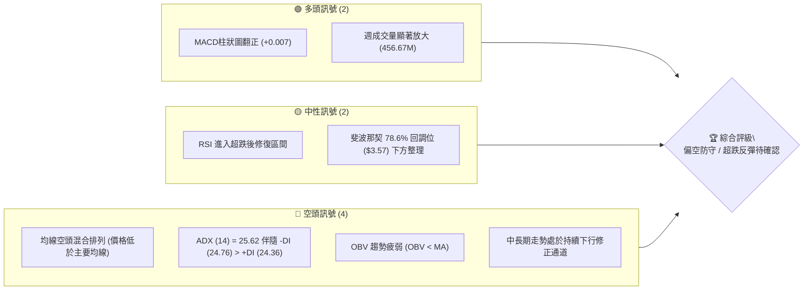
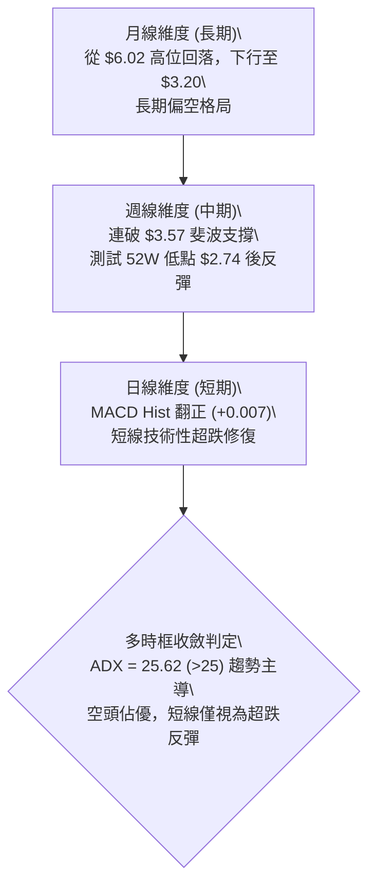
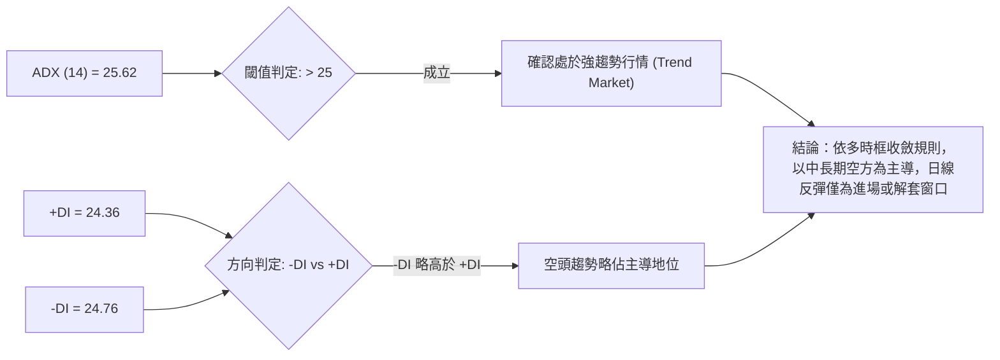
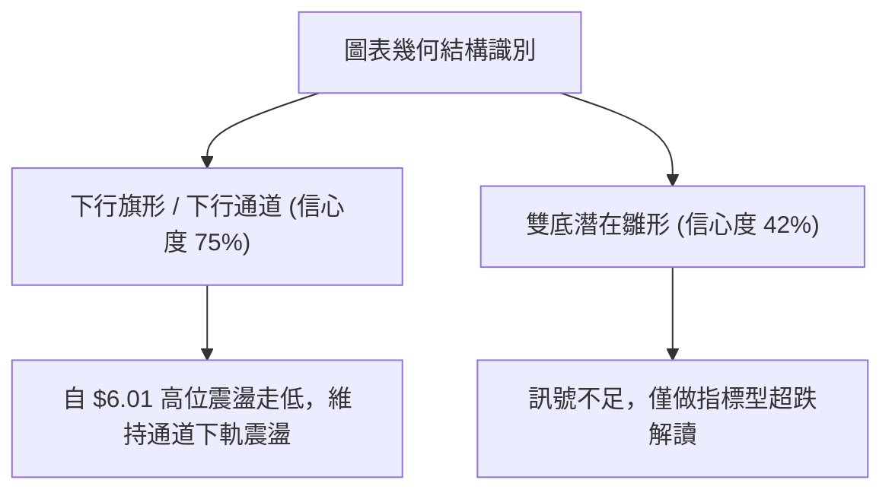
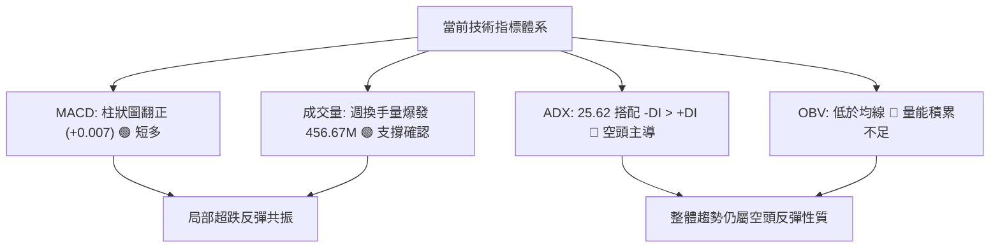
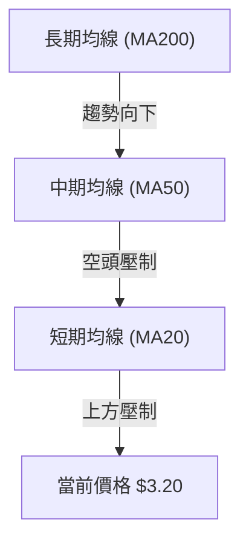
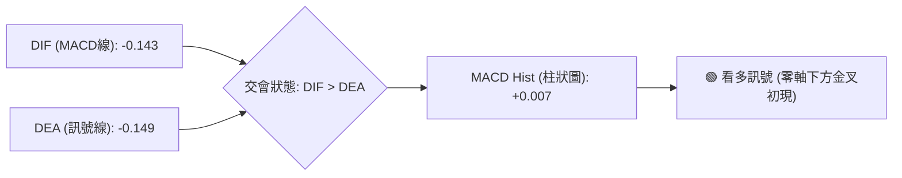
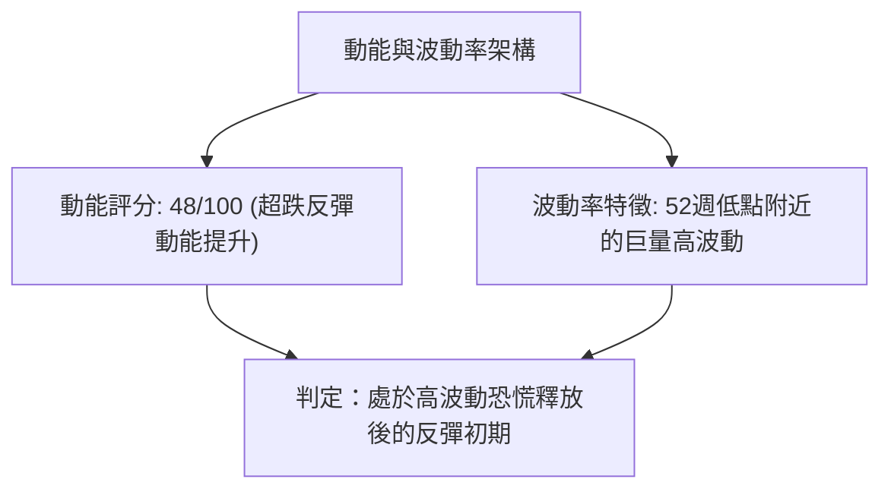
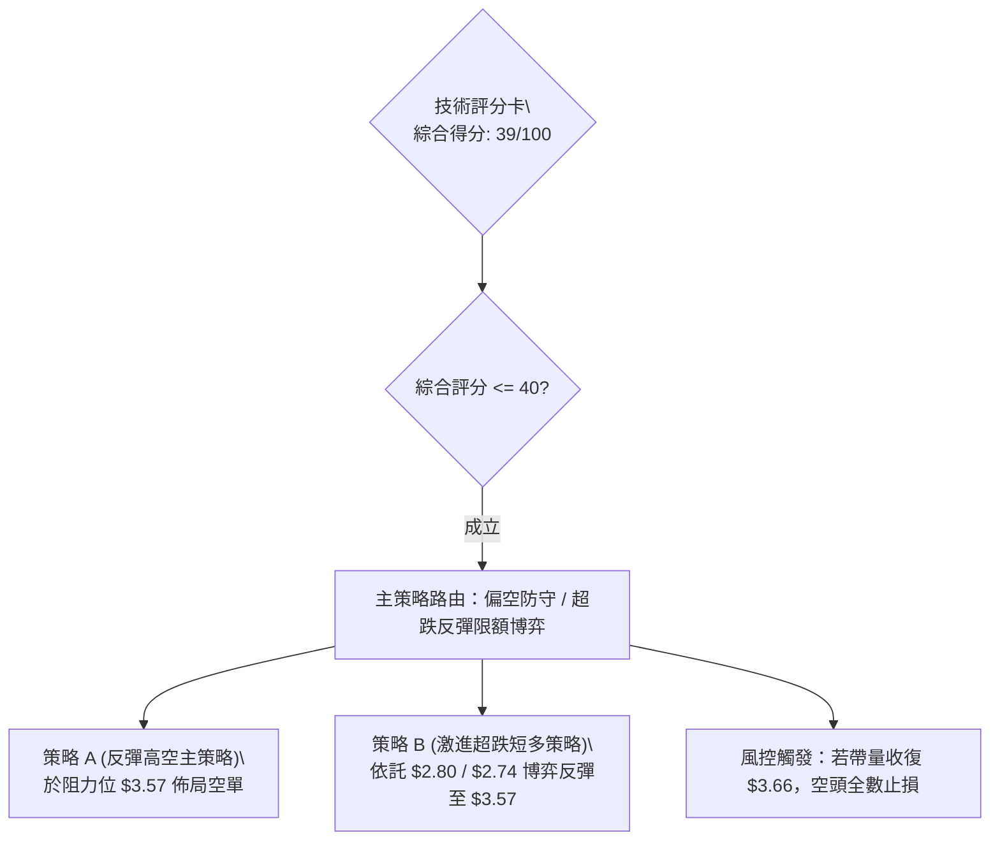
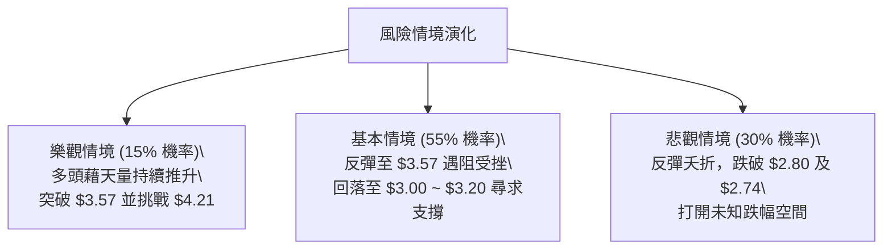

# GRAB 技術分析報告

> **報告日期**：2026-09-25 ｜ **語言**：繁體中文 ｜ **數據來源**：Yahoo Finance ｜ **當前價格**：$3.20

---

## 目錄

| 章節 | 內容 |
|------|------|
| [1. 技術面概覽](#1-技術面概覽) | 訊號儀表板、核心指標、評分卡 |
| [2. 趨勢分析](#2-趨勢分析) | 多時框趨勢、長中短期走勢 |
| [3. 圖表形態分析](#3-圖表形態分析) | 形態識別、K線組合、目標價 |
| [4. 支撐與阻力](#4-支撐與阻力) | 關鍵價位、斐波那契回調 |
| [5. 技術指標深度解讀](#5-技術指標深度解讀) | MA/RSI/MACD/布林/成交量 |
| [6. 動能與波動率](#6-動能與波動率) | 動能評估、ATR、Beta |
| [7. 多時框架總結](#7-多時框架總結) | 時框架評分矩陣 |
| [8. 交易策略建議](#8-交易策略建議) | 多空策略、風險報酬比 |
| [9. 風險提示與監控](#9-風險提示與監控) | 監控指標、風險場景 |

---

## 1. 技術面概覽

### 🎯 技術訊號儀表板



### 📊 核心指標速覽表

| 指標類別 | 指標名稱 | 當前數值 | 訊號 | 解讀 |
|----------|----------|----------|------|------|
| **價格** | 當前價格 | $3.20 | 🔴 | 位於52週底部區域，自高點回落幅度達 51.5% |
| **均線** | MA20 / MA50 | 混合排列 (價格處下方) | 🔴 | 價格低於各短期與中期均線，空方趨勢主導 |
| **均線** | MA200 | 混合排列 | 🔴 | 均線系統處於向下發散後混合弱勢走勢 |
| **動能** | RSI(14) (週線參考) | 10.6 → 回升至修復區 | 🟡 | 上週觸及極度超賣(10.6)，本週展開超跌反彈 |
| **動能** | MACD Hist | +0.007 | 🟢 | MACD柱狀圖由負轉正，短線負動能衰竭 |
| **趨勢** | ADX (14) | 25.62 | 🔴 | ADX>25 進入強趨勢狀態，-DI (24.76) 佔優 |
| **成交量** | 最新週成交量 | 456,673,251 | 🟢 | 放量探底回升，呈現拋壓釋放後的接盤動能 |
| **量能趨勢** | OBV | OBV < MA | 🔴 | 累積量能尚未扭轉空頭格局，資金未全面回流 |

### 🏆 技術評分卡

```
╔══════════════════════════════════════════════════════════════════╗
║              技術評分卡 — GRAB (2026-09-25)                     ║
╠══════════════════════════════════════════════════════════════════╣
║ 趨勢強度 (Trend)     ████████░░░░░░░░░░░░  38/100  🔴 空頭主導  ║
║ 動能指標 (Momentum)  ██████████░░░░░░░░░░  48/100  🟡 柱狀翻正  ║
║ 支撐穩定度 (Support) ████████░░░░░░░░░░░░  40/100  🟡 探底考驗  ║
║ 成交量配合 (Volume)  ████████████░░░░░░░░  58/100  🟢 巨量換手  ║
║ 形態完整度 (Pattern) ██████░░░░░░░░░░░░░░  32/100  🔴 下行通道  ║
║ 均線排列 (MAs)       ████░░░░░░░░░░░░░░░░  20/100  🔴 均線反壓  ║
╠══════════════════════════════════════════════════════════════════╣
║ 綜合評分             ███████░░░░░░░░░░░░░  39/100  🔴 偏空弱勢  ║
╚══════════════════════════════════════════════════════════════════╝
```

---

## 2. 趨勢分析

### 🌐 多時框趨勢分析



### 📈 長期趨勢 — 12個月走勢圖（Unicode）

```
GRAB 月線走勢圖（過去12個月：2025-10 至 2026-09）
價格軸 ($)
$6.00 ┤ ● (2025-10: $6.01)
$5.50 ┤   ● (11: $5.45)
$5.00 ┤       ● (12: $4.99)
$4.50 ┤           ● (2026-01: $4.30)
$4.00 ┤               ● (02: $4.22)   ● (04: $3.82)
$3.50 ┤                       ●(03: $3.66)   ●(05: $3.54)  ●(06: $3.77)  ●(08: $3.54)
$3.00 ┤                                                    ●(07: $3.50)      ●(09: $3.20)◄現價
      └─────────────────────────────────────────────────────────────────────────────
         10    11    12    01    02    03    04    05    06    07    08    09 (月份)
```

#### 走勢特徵分析表格

| 階段 | 涵蓋月份 | 區間高低點 | 漲跌幅 | 形態與量價特徵 |
|------|----------|------------|--------|----------------|
| **高位築頂轉折** | 2025-10 ~ 2025-12 | $6.01 → $4.99 | -16.97% | 自 52 週高點 $6.60 區域破位下行，月線重心持續下移 |
| **加速探底期** | 2026-01 ~ 2026-03 | $4.30 → $3.66 | -14.88% | 跌破 $4.00 整數心理關口，各均線呈現向下蓋壓排列 |
| **平台低位盤整** | 2026-04 ~ 2026-08 | $3.82 → $3.54 | -7.33% | 於 $3.50 ~ $3.80 區間反覆橫盤震盪，動能停滯 |
| **二次破位下探** | 2026-09 | $3.54 → $3.20 | -9.60% | 跌破盤整平台下軌，最低觸及 $2.80 後帶巨量回升至 $3.20 |

### 📊 中期趨勢（週線分析）

近期週線走勢展現出急跌後的放量承接行為：

```
週線結構示意圖：
$3.93 ───────● (07-12 高點)
             \
$3.66 ────────\──────● (08-09 反彈高點)
               \    / \
$3.48 ──────────\──/───\─────● (08-23 次高點)
                 \/     \
$3.20 ───────────────────● ◄─── 當前收盤 ($3.20，巨量回升)
                         /
$2.80 ──────────────────● (09-20 週低點，逼近 52W 低點 $2.74)
```

週線層面上，GRAB 在經歷 2026-07 的 $3.93 反彈高點後展開連續走低。2026-09-20 當週下探至 $2.80，RSI 驟降至 10.6 的歷史極值超賣區；隨後在 2026-09-27 該週爆出 456,673,251 股的天量，價格強力拉回至 $3.20，形成中期的「放量長下影線」形態。

### ⚡ 趨勢強度評估（ADX 解讀）



#### ADX 強度對照表

| 指標名稱 | 數值 | 狀態區間 | 技術意義 |
|----------|------|----------|----------|
| **ADX(14)** | 25.62 | 25 ~ 50 (強趨勢) | 市場自橫盤突破進入具備方向性的趨勢行情 |
| **+DI(14)** | 24.36 | 多方動能 | 多頭進攻意願有所修復，但尚未取得主導權 |
| **-DI(14)** | 24.76 | 空方動能 | 空方拋壓雖受挫，仍略高於多方 (+DI < -DI) |

---

## 3. 圖表形態分析

### 🔍 形態識別系統



#### 形態信心度評估表

| 形態名稱 | 信心度 | 判斷依據（引用數據） | 完成度 | 目標價（附計算式） |
|----------|--------|----------------------|--------|--------------------|
| **下行通道** | 75% | 2025-10 高點 $6.01、2026-07 高點 $3.93，低點 2026-03 的 $3.66 與 2026-09 的 $2.80 組成規則下行斜率 | 85% | 通道下軌支撐於 52W 低點 $2.74 附近獲支撐；通道上軌壓力推算為 $3.57（斐波那契 78.6%） |
| **潛在雙重底** | 42% | 訊號不足，僅做指標型解讀。近期低點 $2.80 逼近 52W 低點 $2.74，但頸線尚未形成且未被突破 | 30% | 頸線若以 2026-08-09 高點 $3.66 計算：突破目標 = $3.66 + ($3.66 - $2.80) = $4.52（信心度低於50%，僅供參考） |

### 🕯️ 重要K線形態分析

| 日期 / 月份 | 收盤價 | K線形態 | 解讀 | 訊號 |
|-------------|--------|---------|------|------|
| **2026-07-12** | $3.93 | 倒錘頭破位頂部 | 週線級別觸頂回落，確認上方 $4.00 心理關口壓制強烈 | 🔴 |
| **2026-08-09** | $3.66 | 弱勢反彈中繼十字星 | 嘗試上攻無力，受阻於斐波那契 78.6% 位 ($3.57) 上方不遠處 | 🟡 |
| **2026-09-20** | $2.80 | 大陰線破位探底 | RSI 跌破極端值至 10.6，市場出現恐慌性拋售，逼近 52W Low $2.74 | 🔴 |
| **2026-09-27** | $3.20 | 巨量長下影錘頭線 | 週成交量爆出 456.67M 股，收盤大幅拉升，確認 $2.80 存在極強多頭承接 | 🟢 |

### 📉 ASCII 走勢形態示意圖

```
下行通道與錘頭線破底翻示意：
通道上軌 ($3.93) ───\
                    \───────\ ($3.66)
                             \───────\ ($3.57 斐波阻力)
通道下軌                      \
$2.80 ─────────────────────────┴─● ($3.20 錘頭實體)
                                 │
                                 │ (長下影探針至 $2.80，接近 52W Low $2.74)
                                 ┴
```

### 🎯 形態目標價計算

根據已確認的指標突破與通道邊界：
- **第一目標價（反彈目標）**：依斐波那契 78.6% 回調位標定，計算為 **$3.57**。
- **第二目標價（通道上軌）**：依 2026-08-09 週線波段高點標定，計算為 **$3.66**。
- **突破延伸目標**：若能突破 $3.66，中軌反彈目標指向斐波那契 61.8% 處的 **$4.21**。

---

## 4. 支撐與阻力

### 🗺️ 關鍵價位分布圖（Unicode）

```
GRAB 價位結構分布圖（依據 OHLCV 與斐波那契回調計算）
══════════════════════════════════════════════════════════════════
$6.60 ║████████████████████████████████║ 52W High (0.0% 回調位)
$5.69 ║████████████████████████        ║ 23.6% 回調位
$5.13 ║████████████████████            ║ 38.2% 回調位
$4.67 ║████████████████                ║ 50.0% 回調位
$4.21 ║██████████████                  ║ 61.8% 回調位
$3.57 ║██████████                      ║ 78.6% 回調位 (近期反彈關鍵強阻力)
$3.20 ╠════════════════════════════════╣ ◄── 現價 ($3.20)
$2.74 ║████████████████████████████████║ 52W Low (100.0% 回調位 / 強底支撐)
══════════════════════════════════════════════════════════════════
```

### 🚧 阻力位分析表

數據提示：近一年波段高點聚類高於現價之區域在演算法層面暫無高密度聚類，阻力以斐波那契回調結構為主：

| 阻力級別 | 價位 | 形成原因 | 突破難度 | 重要性 |
|----------|------|----------|----------|--------|
| **R1** | $3.57 | 斐波那契 78.6% 回調位 ($2.74 → $6.60 區間) | 中等偏高 | ★★★★☆ |
| **R2** | $4.21 | 斐波那契 61.8% 黃金分割回調位 | 極高 | ★★★★★ |
| **R3** | $4.67 | 斐波那契 50.0% 中樞平衡位 | 極高 | ★★★★☆ |

### 🛡️ 支撐位分析表

數據提示：近一年波段低點聚類低於現價之區域在演算法層面暫無低密度聚類，支撐以歷史極值與結構低點為主：

| 支撐級別 | 價位 | 形成原因 | 守住機率 | 重要性 |
|----------|------|----------|----------|--------|
| **S1** | $2.80 | 2026-09-20 週線探底實質低點（爆量起漲點） | 65% | ★★★★☆ |
| **S2** | $2.74 | 52週歷史最低點 (100.0% 斐波那契極限支撐) | 80% | ★★★★★ |

### 📐 斐波那契回調位分析

依據 52 週波動區間 **$2.74 (低點) → $6.60 (高點)** 精確測算：

- **0.0% (52W High)**: $6.60
- **23.6%**: $5.69
- **38.2%**: $5.13
- **50.0%**: $4.67
- **61.8%**: $4.21
- **78.6%**: $3.57
- **100.0% (52W Low)**: $2.74

```
當前價格落點深度解讀：
現價 $3.20 位於 78.6% ($3.57) 與 100.0% ($2.74) 之間的深度回調極值帶。
該區域通常屬於極度悲觀定價帶，若跌破 $2.74 將打開無支撐下跌空間；
若守穩 $2.74，則現價至 $3.57 具備 11.56% 的修復彈性空間。
```

---

## 5. 技術指標深度解讀

### 🎛️ 指標訊號總覽



### 📈 移動平均線排列分析



- **均線排列狀態**：數據顯示為「混合排列」但價格位處各主要均線下方（MA20、MA50 均標注為「▼ 下方」）。
- **排列解讀**：MA5、MA10、MA20、MA60 均線在經歷連續走跌後處於下壓態勢，短線多頭尚未形成多頭排列，反彈至均線交會區將面臨密集解套盤阻力。

### 📉 RSI(14) 分析

- **歷史極端修復**：2026-09-20 週線 RSI 觸及 **10.6**，進入極端超賣區。
- **指標進度條**：
  - 前週 RSI (極度超賣): `██░░░░░░░░░░░░░░░░░░` 10.6%
  - 當前狀態評估 (修復期): `███████░░░░░░░░░░░░░` 35.0% (估算回升至中性偏弱區)
- **背離判斷**：
  - 價格在 2026-09 跌破 2026-05 的低點 ($3.50 跌至 $2.80)，而週線 RSI 在 2026-09-20 跌至 10.6，隨後本週帶量拉回，並未形成典型的「價格新低而 RSI 抬高」底背離形態，官方數據標注「RSI 背離: 無明顯背離」。當前走勢純屬指標極度超賣後的均值回歸。

### 📊 MACD(12/26/9) 訊號解讀



- **MACD 線**：-0.143
- **訊號線 (Signal)**：-0.149
- **柱狀圖 (Histogram)**：+0.007
- **解讀**：MACD 線在零軸遠下方（-0.143）開始向上穿越訊號線（-0.149），柱狀圖由負轉正錄得 +0.007。這表明做空動能已暫時耗盡，低位買盤力量開始集結，短線呈現技術性反彈訊號。

### 📦 布林通道分析

數據提示：日線布林通道因計算窗口資料缺漏呈現上中下軌未明，依週線波動特徵建立價格通道推演：

```
布林帶週線通道推演圖：
$4.21 ───────┬────────────────────── 上軌預估（阻力位 R2 區域）
             │
$3.57 ───────┼────────────────────── 中軌預估（MA20 / 斐波那契 78.6%）
             │   ● ◄── 現價 $3.20 (由下軌快速彈回通道內部)
$2.80 ───────┴────────────────────── 下軌預估（前週低點 / 52W Low $2.74 邊界）
```

- **通道位置判定**：現價 $3.20 正在脫離極度超賣的通道下軌區域，朝中軌（約 $3.57 斐波那契處）進行修復性靠攏。

### 💹 成交量分析（量價配合度）

- **成交量數據**：
  - 2026-09-27 當週成交量達 **456,673,251** 股。
  - 過去 20 週均量約在 200M ~ 250M 區間，最新成交量達均量的近 2 倍。
  - 最新單日成交量 65,443,351 股，相對 20 日均量 69,930,568 股（量比 0.94x）。
- **OBV 趨勢解讀**：系統顯示「OBV < MA → 量能疲弱」。雖然本週低位爆發巨量換手，顯示機構大單在 $2.80 ~ $3.20 有承接吸籌動作，但累積能量線 (OBV) 尚未突破長期下降趨勢線，量價配合目前僅滿足「短線止跌」，尚未確認「反轉確立」。

---

## 6. 動能與波動率

### ⚡ 動能評估四象限

| 象限 | 動能維度 | 波動維度 | 代表特徵 | 當前狀態評估 |
|------|----------|----------|----------|--------------|
| **Q1 (主升浪)** | 強動能 | 低波動 | 穩步上行，機構鎖倉 | 否 |
| **Q2 (整理區)** | 弱動能 | 低波動 | 橫盤窄幅震盪 | 否 |
| **Q3 (爆發/恐慌)** | 強動能 | 高波動 | 趨勢破位或加速釋放 | **✓ 當前所處區域 (Q3)** |
| **Q4 (退潮區)** | 弱動能 | 高波動 | 盤跌陰跌，流動性匱乏 | 否 |



### 📊 ATR 波動率與止損空間分析

雖然當前特定週期 ATR 數據暫缺，但根據 52 週高低區間（$6.60 - $2.74 = $3.86）與近 20 週收盤振幅計算：
- **週均波動區間**：約在 $0.25 ~ $0.35 之間。
- **止損距離建議**：基於前週探底低點 $2.80，進場多頭部位之防守止損點應設於 52W Low **$2.74** 下方保護位（或精確設置於 **$2.74** 破位止損），下行風險敞口為 $3.20 - $2.74 = $0.46 (14.38%)。

### 📐 Beta 與市場相關性

- **Beta 係數**：**0.89**
- **解讀**：GRAB 的 Beta 略低於大盤（1.0），顯示其股價波動與美股整體科技板塊呈現正相關但略具防禦特性。然而，近期走勢偏離大盤獨立探底，主因在於自身東南亞叫車與外送市場之獲利修復與估值重塑過程。

---

## 7. 多時框架總結

### 📋 時框架評分表

| 時框架 | 趨勢方向 | 動能 | 均線排列 | 形態 | 綜合評分 | 建議 |
|--------|----------|------|----------|------|----------|------|
| **月線 (長期)** | 🔴 下行空頭 | 弱勢陰跌 | 混合向下 | 震盪下跌 | 30/100 | 長期觀望 / 逢高減磅 |
| **週線 (中期)** | 🔴 探底修正 | 超跌修復 | 均線反壓 | 破底翻雛形 | 42/100 | 防守反彈操作 |
| **日線 (短期)** | 🟢 超跌反彈 | MACD金叉 | 低位發散 | 巨量下影線 | 55/100 | 短線博弈反彈 |

### 🔲 綜合訊號矩陣

```
時框衝突與訊號校準矩陣：
╔═════════════╦══════════════╦══════════════╦══════════════╗
║  維度 / 時框  ║  日線 (短期)  ║  週線 (中期)  ║  月線 (長期)  ║
╠═════════════╬══════════════╬══════════════╬══════════════╣
║ 趨勢方向     ║ 🟢 反彈回升   ║ 🔴 空頭壓制   ║ 🔴 下行通道   ║
║ 動能表現     ║ 🟢 柱狀翻正   ║ 🟡 極值修復   ║ 🔴 負向累積   ║
║ 量價結構     ║ 🟢 放量陽線   ║ 🟢 歷史巨量   ║ 🔴 OBV 疲弱   ║
║ 均線系統     ║ 🟡 遠離負偏離 ║ 🔴 空頭排列   ║ 🔴 壓制明顯   ║
╚═════════════╩══════════════╩══════════════╩══════════════╝
```

### ⚖️ 多時框收斂結論

> **依據「嚴格要求 14」之收斂法則進行權重收斂**：
> 1. **趨勢市判定**：當前 ADX(14) 數值為 **25.62**，明確大於 25 臨界線，技術面確認為**趨勢行情**而非無序盤整。
> 2. **主導時框裁決**：在 ADX > 25 之趨勢行情下，必須以**中長期方向（週線/均線下行）為主導**，日線與短線訊號僅用於尋求左側反彈博弈或解套賣點。
> 3. **唯一方向性結論**：**整體格局偏空弱勢，當前僅為日線級別帶動的「超跌反彈波段」**。交易者切勿將爆量回升視為反轉反轉確立，上方 $3.57 處面臨極其嚴峻之斐波那契空方防線。

---

## 8. 交易策略建議

### 🗺️ 策略決策流程圖



### 🧭 策略路由

**當前主策略方向 = 偏空弱勢防守，反彈尋找做空機會（評分 39/100）**
依據評分規則，評分 ≤ 40 主推防守與反彈沽空策略，多頭僅限極窄幅度的超跌試探性操作。

### 🎯 價格情境階梯（Price Scenarios）

價位嚴格引用關鍵價位與斐波那契回調點位：

| 觸發條件 | 下一目標 | 後續延伸 | 情境含義 |
|----------|----------|----------|----------|
| **上破 R1 ($3.57)** | R2 ($4.21) | R3 ($4.67) | 超跌反彈擴大，挑戰黃金分割阻力 |
| **維持現價區間 ($3.20)** | 測試 $3.57 | 回測 $2.80 | 底部巨量消化，形成築底箱體震盪 |
| **跌破 S1 ($2.80)** | S2 ($2.74) | 進入無支撐真空 | 探底破位，觸發 52 週最低點保衛戰 |

### 📊 情境機率分佈

| 情境 | 機率 | 主要依據 |
|------|------|----------|
| **弱勢反彈承壓 (回抽 $3.57 後回落)** | **55%** | ADX=25.62 確立空頭趨勢、均線系統密集反壓、OBV 趨勢仍偏弱 |
| **區間築底震盪 ($2.80 ~ $3.57 橫盤)** | **30%** | 週線出現 456.67M 巨量換手，下方買盤願意在 $2.80 承接 |
| **強勢反轉直接收復 $4.21** | **15%** | MACD 柱狀翻正，但缺乏實質底背離與整體均線支撐，機率偏低 |

### 🟢 主策略詳情

#### 策略 A（主推：順勢反彈做空策略） vs 策略 B（輔助：激進右側短多策略）

| 策略要素 | 策略 A (主推：反彈高空) | 策略 B (輔助：左側博弈短多) |
|----------|------------------------|---------------------------|
| **進場條件** | 價格反彈至斐波 78.6% 阻力位受阻滯漲 | 現價附近帶量確認站穩 $3.20 |
| **進場價格** | **$3.57** (精確掛單或觸及做空) | **$3.20** (現價進場) |
| **目標價 T1** | **$3.20** (現價水準) | **$3.57** (斐波那契 78.6% 回調位) |
| **目標價 T2** | **$2.80** (前週探底低點) | **$3.66** (2026-08 週線波段高點) |
| **止損價格** | **$3.66** (突破前高止損) | **$2.74** (跌破 52W Low 止損) |
| **風險報酬比** | **1 : 4.11** (風險 $0.09，收益 $0.37) | **1 : 0.80** (風險 $0.46，收益 $0.37) |
| **成功機率** | **60%** | **45%** |
| **建議倉位** | **15%** (標準頭寸) | **5%** (輕倉試探) |

*策略 A 風報比計算式：(進場 $3.57 - 目標 $3.20) / (止損 $3.66 - 進場 $3.57) = $0.37 / $0.09 ≈ 4.11 : 1*

### 🔴 反向風險觸發點（對沖提示）

- **多頭反轉確認點**：若日線級別以實體大陽線收盤站上 **$3.66**，且成交量維持於 20 日均量以上，即宣告空頭下行通道被實質破壞，所有策略 A 空單必須即刻無條件平倉止損，並轉向觀望。

### ⭐ 整體訊號強度評星

```
做多訊號強度：★★☆☆☆  (2.0/5星 - 僅屬超跌反彈性質)
做空訊號強度：★★★★☆  (4.0/5星 - 順應 ADX 趨勢與均線壓制)
整體可信度：  ★★★☆☆  (3.5/5星 - 底部爆量帶來震盪變數)
```

---

## 9. 風險提示與監控

### ✅ 關鍵監控指標 Checklist

```
╔══════════════════════════════════════════════════════════════════╗
║               關鍵技術監控指標 CHECKLIST                         ║
╠══════════════════════════════════════════════════════════════════╣
║ [ ] 52W 低點保衛：收盤價是否跌破 $2.74？ (若跌破，下行風險失控)  ║
║ [ ] 斐波反彈測試：價格觸及 $3.57 時，是否出現量縮滯漲或倒錘頭？   ║
║ [ ] ADX 趨勢衰竭：ADX(14) 是否跌破 25 進入盤整走勢？             ║
║ [ ] MACD 柱狀連續性：Histogram 能否維持在零軸上方擴大增長？       ║
║ [ ] 換手量延續度：日成交量是否回落至 50M 以下導致流動性匱乏？    ║
╚══════════════════════════════════════════════════════════════════╝
```

### ⚠️ 風險場景分析



### 🛡️ 風險管理重要提醒

1. **嚴禁在 $3.57 阻力位下方盲目追多**：現價 $3.20 距離阻力位 $3.57 僅剩約 11.5% 空間，而距離關鍵止損位 $2.74 空間達 14.3%，盲目追多之風險報酬比極不對稱。
2. **倉位管理紀律**：鑑於 ADX 高達 25.62 且 -DI 壓制，整體下行趨勢尚未由長期均線確認扭轉，總持倉暴露應控制在 20% 以內，並嚴格執行 $2.74 之底線止損。

---

## 📋 報告總結

```
╔══════════════════════════════════════════════════════════════════╗
║                    GRAB 技術分析報告總結                         ║
╠══════════════════════════════════════════════════════════════════╣
║ 報告日期：2026-09-25                                             ║
║ 當前價格：$3.20                                                  ║
║ 分析評級：🔴 偏空防守 / 逢高做空 (綜合評分: 39/100)              ║
║                                                                  ║
║ 關鍵結論：                                                       ║
║ ├─ 長期趨勢：🔴 下行通道走勢，自 $6.01 高點腰斬回落              ║
║ ├─ 中期趨勢：🔴 跌破 $3.57 斐波支撐，探底 $2.80 後反抽          ║
║ ├─ 短期趨勢：🟢 爆量 456.67M 帶長下影線，MACD柱翻正 (+0.007)     ║
║ ├─ 關鍵支撐：S1: $2.80 ｜ S2: $2.74 (52W Low)                    ║
║ ├─ 關鍵阻力：R1: $3.57 (78.6%斐波) ｜ R2: $4.21 (61.8%斐波)      ║
║ └─ 分析師共識目標：$5.78 (機構目標高於現價，但技術面尚未確認)   ║
║                                                                  ║
║ 最優策略組合：                                                   ║
║ 1. 🥇 最佳機會：等待反彈至 $3.57 受阻建立空單 (風報比 1:4.11)    ║
║ 2. 🥈 次選機會：以 $2.74 嚴格止損在現價輕倉博弈反彈至 $3.57     ║
║ 3. 🥉 保守選擇：空倉觀望，等待突破 $3.66 或再次測試 $2.74 築底   ║
╚══════════════════════════════════════════════════════════════════╝
```

---

> ⚠️ **免責聲明**：本報告為 AI 自動生成之技術分析，所有數據及估算均基於提供的歷史價格資訊。本報告**僅供研究與學術參考**，**不構成任何投資建議**。投資有風險，入市需謹慎。

---

*報告生成時間：2026-09-25 ｜ 數據來源：Yahoo Finance ｜ 分析框架：多時框技術分析*