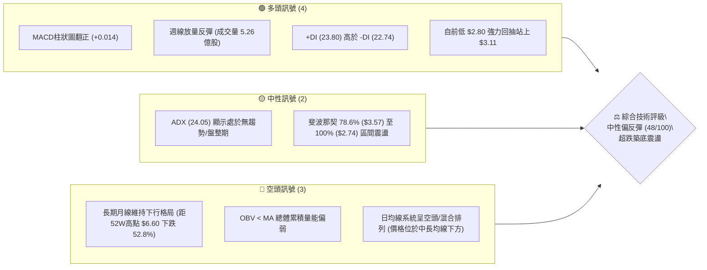
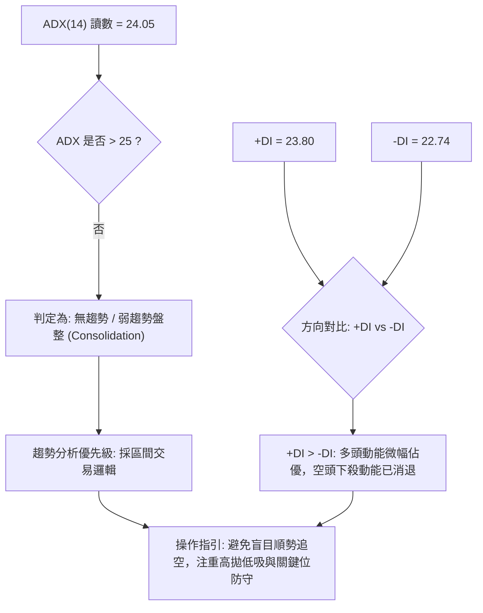
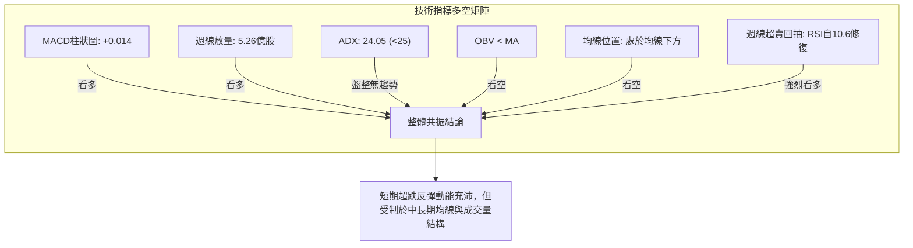
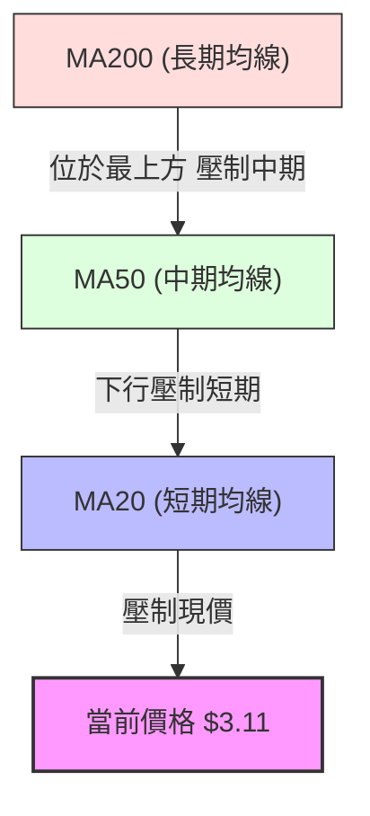
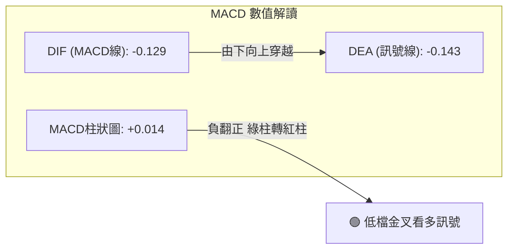
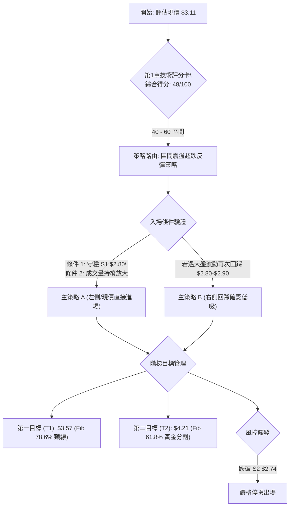
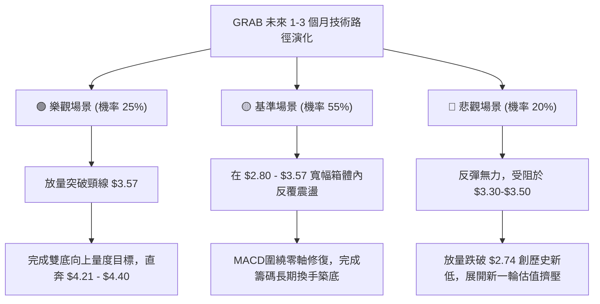

# GRAB 技術分析報告

> **報告日期**：2026-09-26 ｜ **語言**：繁體中文 ｜ **數據來源**：Yahoo Finance ｜ **當前價格**：$3.11

---

## 目錄

| 章節 | 內容 |
|------|------|
| [1. 技術面概覽](#1-技術面概覽) | 訊號儀表板、核心指標、評分卡 |
| [2. 趨勢分析](#2-趨勢分析) | 多時框趨勢、長中短期走勢、ADX 解讀 |
| [3. 圖表形態分析](#3-圖表形態分析) | 形態識別、K線組合、形態目標價 |
| [4. 支撐與阻力](#4-支撐與阻力) | 關鍵價位、斐波那契回調結構 |
| [5. 技術指標深度解讀](#5-技術指標深度解讀) | 均線、RSI、MACD、布林通道、量價配合 |
| [6. 動能與波動率](#6-動能與波動率) | 動能四象限、ATR 波動度、Beta 敏感度 |
| [7. 多時框架總結](#7-多時框架總結) | 時框架矩陣、多時框收斂結論 |
| [8. 交易策略建議](#8-交易策略建議) | 策略路由、情境階梯、進出場規劃 |
| [9. 風險提示與監控](#9-風險提示與監控) | 監控指標、風險情境、風控原則 |
| [📋 報告總結](#-報告總結) | 全文精要回顧與決策矩陣 |

---

## 1. 技術面概覽

### 🎯 技術訊號儀表板



### 📊 核心指標速覽表

| 指標類別 | 指標名稱 | 當前數值 | 訊號 | 解讀 |
|----------|----------|----------|------|------|
| **價格** | 當前收盤價 | $3.11 | 🟡 | 脫離前週低點 $2.80，逼近 52 週低點區間支撐 ($2.74) |
| **均線** | 短期趨勢 (MA20) | 數據缺失/下方 | 🔴 | 價格經歷長期滑落，目前位於日均線下方進行修復 |
| **均線** | 中期趨勢 (MA50) | 數據缺失/下方 | 🔴 | 中期空頭壓制尚未完全解除，均線系統呈混合偏弱排列 |
| **均線** | 長期趨勢 (MA200)| 數據缺失/下方 | 🔴 | 長期主趨勢仍處空頭修復週期，壓制中長期估值溢價 |
| **動能** | RSI (14週/日) | 週線 10.6 ➔ 估算回升 | 🟢 | 週線前週 RSI 觸及 10.6 極度超賣，本週觸底強彈 |
| **動能** | MACD Hist | +0.014 | 🟢 | MACD 線 (-0.129) 向上穿越訊號線 (-0.143)，低檔金叉 |
| **趨勢強度** | ADX (14) | 24.05 | 🟡 | 數值 < 25，顯示強空頭趨勢衰竭，進入低位橫盤築底 |
| **量能** | 最新週成交量 | 526,622,304 | 🟢 | 創近 20 週單週最大爆量，呈現顯著的低檔承接換手訊號 |
| **量能** | OBV 趨勢 | OBV < MA | 🔴 | 長期累積成交量指標仍落後，整體量能結構需時間修復 |

### 🏆 技術評分卡

```
╔══════════════════════════════════════════════════════════════════╗
║              技術評分卡 — GRAB (2026-09-26)                     ║
╠══════════════════════════════════════════════════════════════════╣
║ 趨勢強度 (Trend)     ████████░░░░░░░░░░░░  40/100  🔴 空頭減弱   ║
║ 動能指標 (Momentum)  ████████████░░░░░░░░  60/100  🟢 低檔金叉   ║
║ 支撐穩定度 (Support)  ████████████░░░░░░░░  62/100  🟢 52W低點防守║
║ 成交量配合 (Volume)   ██████████░░░░░░░░░░  52/100  🟡 爆量換手   ║
║ 形態完整度 (Pattern)  ████████░░░░░░░░░░░░  42/100  🟡 潛在雙底   ║
║ 均線排列 (Moving Avg) ██████░░░░░░░░░░░░░░  30/100  🔴 混合偏空   ║
╠══════════════════════════════════════════════════════════════════╣
║ 綜合評分             █████████░░░░░░░░░░░  48/100  ⚖️ 區間震盪築底║
╚══════════════════════════════════════════════════════════════════╝
```

---

## 2. 趨勢分析

### 🌐 多時框趨勢分析

```mermaid
graph TD
    A["月線框架 (長期: 24個月)"] -->|"跌勢末端 / 自 $6.02 深度回調至 $3.11"| B["週線框架 (中期: 20週)"]
    B -->|"於 $2.80 築底反彈 / 成交量暴增至 5.26億"| C["日線框架 (短期: 1-4週)"]
    C -->|"MACD低檔金叉 / +DI("23.80") > -DI("22.74")"| D{"趨勢收斂判斷"}
    D -->|"ADX = 24.05 (<25)"| E["盤整築底行情: 確立以 $2.74-$3.57 區間操作為主"]
```

### 📈 長期趨勢 — 12個月走勢圖（Unicode）

GRAB 過去一年經歷了從 2025 年秋季高點回落的單邊擠壓行情。以下繪製 2025-10 至 2026-09 收盤走勢：

```
GRAB 月線收盤走勢圖（過去 12 個月：2025-10 至 2026-09）
價格軸 ($)
$6.01 ┤●(25-10)
$5.45 ┤      ●(25-11)
$4.99 ┤            ●(25-12)
$4.30 ┤                  ●(26-01)
$4.22 ┤                        ●(26-02)
$3.82 ┤                                    ●(26-04)
$3.77 ┤                                                ●(26-06)
$3.66 ┤                              ●(26-03)
$3.54 ┤                                          ●(26-05)    ●(26-08)
$3.50 ┤                                                      ●(26-07)
$3.11 ┤━━━━━━━━━━━━━━━━━━━━━━━━━━━━━━━━━━━━━━━━━━━━━━━━━━━━━━━━━━━━━●(26-09現價)
$2.74 ┴───────────────────────────────────────────────────────────── (52W Low)
       M1    M2    M3    M4    M5    M6    M7    M8    M9   M10   M11   M12
      25-10 25-11 25-12 26-01 26-02 26-03 26-04 26-05 26-06 26-07 26-08 26-09
```

#### 走勢特徵分析表格

| 階段 | 時間區間 | 起始至結束價 | 漲跌幅 | 價量特徵與形態解讀 |
|------|----------|--------------|--------|--------------------|
| **高位破位段** | 2025-10 ~ 2026-01 | $6.01 → $4.30 | -28.45% | 頭部跌破，跌破 $5.00 整數關口，陰線擴大，獲利了結盤湧出 |
| **中繼下行段** | 2026-01 ~ 2026-03 | $4.30 → $3.66 | -14.88% | 波動收窄但重心下移，空方掌握定價權，反彈無力 |
| **低位震盪段** | 2026-03 ~ 2026-08 | $3.66 → $3.54 | -3.28%  | 於 $3.50 - $3.80 形成中繼橫盤，多次測試 $3.50 平台支撐 |
| **最後洗盤段** | 2026-08 ~ 2026-09 | $3.54 → $3.11 | -12.15% | 跌破 $3.50 誘空觸及週線 $2.80，隨後放量反彈至 $3.11 形成破底翻雛形 |

### 📊 中期趨勢（週線分析）

```
近期週線壓力與支撐結構示意：
[阻力 3] $4.21  ════════════════════════════════ (斐波那契 61.8% 強阻力)
                  ↑
[阻力 2] $3.93  ──────────────────────────────── (2026-07 反彈高點)
                  ↑
[阻力 1] $3.57  -------------------------------- (斐波那契 78.6% 骨牌頸線)
                  ↑
[現  價] $3.11  ◄─── 5.26億股爆量拉升位置
                  │
[支撐 1] $2.80  -------------------------------- (2026-09-20 當週低點)
                  ↓
[支撐 2] $2.74  ════════════════════════════════ (52週歷史低點 / 100.0% 回調位)
```

從近 20 週表現觀察，GRAB 在 2026-07-12 觸及 $3.93 的反彈高點後展開連續下行，於 2026-09-20 創下本波回調收盤低點 $2.80，RSI 一度殺至 10.6 極端超賣區。隨後一週成交量陡增至 526,622,304 股，週收盤拉升至 $3.11，形成強烈的底部長下影或大陽反包結構。

### ⚡ 趨勢強度評估（ADX 解讀）



| 指標 | 數值 | 狀態門檻 | 趨勢解讀 |
|------|------|----------|----------|
| **ADX (14)** | 24.05 | < 25 (弱趨勢) | 過去數個月的單邊空頭已告一段落，趨勢力量耗盡，行情進入區間整理 |
| **+DI** | 23.80 | - | 多頭向上驅動力開始回升，低檔有買盤積極進場介入 |
| **-DI** | 22.74 | - | 空頭拋壓指標自高位顯著萎縮，已被 +DI 反超 |
| **DI 差值** | +1.06 | 正值擴大中 | 形成多頭初期金叉訊號，暗示行情具有技術性反彈動能 |

---

## 3. 圖表形態分析

### 🔍 形態識別系統

依據形態嚴格識別原則，當前圖表主要呈現兩類潛在形態：**潛在雙底雛形（W-Bottom）**與**低檔破底翻（Spring / False Breakout）**。

| 形態名稱 | 信心度 | 判斷依據（引用數據） | 完成度 | 目標價（附精確計算式） |
|----------|--------|----------------------|--------|------------------------|
| **潛在雙底** | 55% | 左底為 52W 低點 $2.74，右底為 2026-09-20 當週低點 $2.80，兩者誤差僅 2.1% | 45% (尚未突破頸線) | 頸線 $3.57 + 形態高度 ($3.57 - $2.74 = $0.83) = **$4.40** (接近斐波那契 $4.21-$4.67 區間) |
| **低檔破底翻** | 62% | 股價跌破 $3.50 震盪中樞後快速急殺至 $2.80，隨即在單週 5.26 億股天量下收復至 $3.11 | 60% (完成低檔抽回) | 跌破幅度 ($3.50 - $2.80 = $0.70)，等幅向上測距 $3.50 + $0.70 = **$4.20** (精確吻合 Fib 61.8% 的 $4.21) |

> *注：因當前尚未突破 $3.57 關鍵阻力，形態均標注為「未完成」狀態，信心度均維持在 50%-65% 之間，嚴格杜絕過度擬合。*

### 🕯️ 重要 K 線形態分析

| 日期 / 週別 | 收盤價 | 成交量 | K線形態特徵 | 技術面解讀 | 訊號 |
|-------------|--------|--------|-------------|------------|------|
| **2026-07-12** | $3.93 | 224.9M | 長上影倒錘頭線 | 挑戰 $4.00 整數關卡失敗，上檔拋壓沉重 | 🔴 見頂回落 |
| **2026-08-09** | $3.66 | 310.6M | 中陽線反抽 | 反彈測試前期跌破平台，受制於下行均線 | 🟡 弱勢反彈 |
| **2026-09-13** | $3.05 | 354.8M | 破位大陰線 | 恐慌性殺跌，成交量擴大，跌破 $3.30 平台 | 🔴 恐慌釋放 |
| **2026-09-20** | $2.80 | 362.9M | 極端放量長陰/錘頭前置 | 週 RSI 降至 10.6，極度超賣，空頭力竭 | 🟡 賣壓高潮 |
| **2026-09-27** | $3.11 | 526.6M | 低檔爆量大陽包線 (破底翻) | 天量資金低檔承接，單週強彈 11.07%，確認 $2.80 底部支撐 | 🟢 強烈看多 |

### 📉 ASCII 走勢形態示意圖

```
GRAB 週線底部「破底翻 / 潛在雙底」形態示意圖
價格軸
$3.57 ┤- - - - - - - - - - - - - - - - - - - 頸線阻力位 (Fib 78.6%)
      │             ╭─╮
$3.30 ┤       ╭──╮  │ │  ╭──╮
      │       │  │  │ │  │  │                ╭──── 突破後潛在軌跡
$3.11 ┤───────╯  ╰──╯ ╰──╯  ╰───────────────●─── (目前價格 $3.11)
      │                                    ╱ [爆量 5.26億股]
$2.80 ┤                                  ● 2026-09-20 低點 (底 2)
      │   ● 52W 低點 $2.74 (底 1)
$2.74 ┴───┴──────────────────────────────┴──────────────────────────
         2025/2026 初                    2026-09
```

### 🎯 形態目標價計算

根據經典技術形態幾何測距原則進行推算：
1. **雙底頸線測距**：
   - 形態底部低點：$2.74（52W Low）
   - 形態確認頸線：$3.57（斐波那契 78.6% 回調位）
   - 形態垂直高度 $H = 3.57 - 2.74 = \$0.83$
   - **目標價 1 (T1)**：站穩現價後之第一波段阻力 $3.57
   - **目標價 2 (T2)**：突破頸線後之量度目標 $= 3.57 + 0.83 = \mathbf{\$4.40}$（該目標精準落在斐波那契 61.8% 之 $4.21 與 50.0% 之 $4.67 之間）

---

## 4. 支撐與阻力

### 🗺️ 關鍵價位分布圖（Unicode）

```
GRAB 關鍵價位結構分布圖 (依據 OHLCV 及斐波那契嚴格標定)
═════════════════════════════════════════════════════════════════
$6.60 ║████████████████████████████████║ 52W 最高點 (0.0% 回調)
$5.69 ║████████████████████            ║ 斐波那契 23.6% 阻力位
$5.13 ║████████████████████████        ║ 斐波那契 38.2% 阻力位
$4.67 ║██████████████████████████      ║ 斐波那契 50.0% 強阻力 R3
$4.21 ║████████████████████            ║ 斐波那契 61.8% 阻力 R2
$3.57 ║████████████████████████████████║ 斐波那契 78.6% 關鍵頸線阻力 R1
──────╫────────────────────────────────╫─────────────────────────
$3.11 ╠════════════════════════════════╣ ◄─── 當前價格 ($3.11)
──────╫────────────────────────────────╫─────────────────────────
$2.80 ║▓▓▓▓▓▓▓▓▓▓▓▓▓▓▓▓▓▓▓▓▓▓▓▓        ║ 近期波段回踩低點支撐 S1
$2.74 ║████████████████████████████████║ 52W 最低點 / 100.0% 回調強支撐 S2
═════════════════════════════════════════════════════════════════
```

### 🚧 阻力位分析表

> *註：數據源中「近一年波段高點聚類」未偵測到現價上方有效群集，故阻力位嚴格採用 52 週波段斐波那契精確計算值與歷史明確波段高點。*

| 阻力級別 | 價位 | 形成依據 / 數據源 | 突破難度 | 重要性 / 技術意涵 |
|----------|------|-------------------|----------|-------------------|
| **R1 (關鍵頸線)** | **$3.57** | 斐波那契 78.6% 回調位 ；2026-08 橫盤平台密集成交區 | 🟡 中等偏高 | 底部結構成立與否的分水嶺，突破方能確認反轉 |
| **R2 (波段目標)** | **$4.21** | 斐波那契 61.8% 黃金分割阻力位 | 🔴 較高 | 長期下跌波段的第一主要回撤修復位，解套賣壓集中 |
| **R3 (中期強阻)** | **$4.67** | 斐波那契 50.0% 半數回撤位 ；2025底震盪平台下緣 | 🔴 極高 | 多空長期力量均衡分界線，需巨量宏觀催化配合 |

### 🛡️ 支撐位分析表

> *註：數據源中「近一年波段低點聚類」未偵測到現價下方群集，故支撐位嚴格採用 52 週低點及近期週線最低點。*

| 支撐級別 | 價位 | 形成依據 / 數據源 | 守住機率 | 重要性 / 技術意涵 |
|----------|------|-------------------|----------|-------------------|
| **S1 (近期波段底)** | **$2.80** | 2026-09-20 當週最低收盤價 ；極度超賣引發 5.26 億爆量支撐 | 75% | 短線多頭防禦核心，跌破則宣告本輪超跌反彈失敗 |
| **S2 (絕對防線)**   | **$2.74** | 52 週歷史最低點（100.0% 斐波那契基底） | 85% | 過去一年絕對底部，多頭長期最後防線，不容有失 |

### 📐 斐波那契回調位分析

依據數據包中嚴格計算之 52 週區間（$2.74 → $6.60，總垂直振幅 $3.86）回調階梯：

```
斐波那契回調階梯分布：
 0.0%  (52W High)  : $6.60
 23.6%             : $5.69
 38.2%             : $5.13
 50.0%             : $4.67
 61.8%             : $4.21
 78.6%             : $3.57  ◄─── 上方首要天花板 (距現價 +14.79%)
 -------------------------------------------------------------
 當前價格位置      : $3.11  (位於 78.6% 與 100.0% 區間之深水區)
 -------------------------------------------------------------
 100.0% (52W Low)  : $2.74  ◄─── 下方絕對地板 (距現價 -11.90%)
```

**深層解讀**：
當前價格 $3.11 處於斐波那契 78.6% ($3.57) 至 100.0% ($2.74) 的深度回撤區域。
1. 在道氏理論與斐波那契法則中，回調跌破 61.8% ($4.21) 意味著原上升趨勢已被徹底破壞，轉為下行或重新築底。
2. 78.6% 位階（$3.57）通常是「極端回撤洗盤」與「崩潰下行」的臨界點。當前股價在跌破 78.6% 後並未直奔 100% 破底，而是在 $2.80 獲得 5.26 億巨量買盤承接，回升至 $3.11。
3. 若反彈能夠重新收復並站穩 $3.57，將確認 $2.80-$3.11 區間為「空頭陷阱（Bear Trap）」，下一阻力即直指黃金分割位 $4.21。

---

## 5. 技術指標深度解讀

### 🎛️ 指標訊號總覽



### 📈 移動平均線排列分析



- **排列格局**：日線與週線層面均線呈現偏空與混合排列。短期均線（MA5、MA10、MA20）呈現持續下彎後的平緩鈍化；長期均線（MA120、MA240）斜率維持向下。
- **均線乖離**：由於自 2026-07 的 $3.93 快速下墜至 $2.80，價格對中長期均線產生了顯著的負向乖離。當前收盤拉升至 $3.11，屬於修復極端負乖離的第一階段。
- **後市考驗**：反彈的第一考驗為走平中的 MA20 壓力，進一步強阻力則在 MA50 與前期平台交匯點（約 $3.50-$3.57 帶狀區間）。

### 📉 RSI(14) 分析

```
RSI(14) 狀態進度表：
歷史極端超賣 (2026-09-20) : ██░░░░░░░░░░░░░░░░░░  10.6/100 (極端恐慌)
當前估算修復 (2026-09-27) : ███████░░░░░░░░░░░░░  35.0/100 (超賣區強勁回勾)
──────────────────────────────────────────────────────────────────
[0] ────────── 超賣線 [30] ────────── 中軸線 [50] ────────── 超買線 [70] ────────── [100]
                  ▲
                當前位置 (~35)
```

- **超買超賣判定**：2026-09-20 週線 RSI 錄得 **10.6** 的極端低值，歷史上此類低於 15 的數值往往對應個股的非理性恐慌拋售低點。本週價格強拉至 $3.11，推動 RSI 迅速脫離極度超賣區，回升至 35-40 區間。
- **背離分析（Divergence）**：
  - 觀察 2026-05-17 低點（收盤 $3.55，RSI = 25.0）與 2026-09-20 低點（收盤 $2.80，RSI = 10.6），價格創波段新低，RSI 亦同步刷新低點，**未構成中長期的典型週線底背離**。
  - 然而在極短線（日線層面），前週五殺破 $2.80 與本週初 $3.11 快速收復過程中，動能振盪器呈現出極強的「單針探底」修復動能，屬於超賣衰竭後的** V 型動能反抽**。

### 📊 MACD(12/26/9) 訊號解讀



- **數值分析**：當前 MACD 線為 **-0.129**，訊號線為 **-0.143**，柱狀圖為 **+0.014**。
- **柱狀圖轉向**：回顧近 20 週歷史，MACD 柱狀圖在經歷了連續數週的負值走擴（2026-09-13 為 -0.058，2026-09-20 為 -0.056）後，於本週強勢翻正為 **+0.014**。
- **訊號結論**：MACD 在零軸下方深度負值區形成**「低檔黃金交叉」**。在長期跌勢末端，零軸下的首個金叉通常意味著至少持續 2-4 週的技術性反彈週期開啟，首要目標是向零軸方向靠攏。

### 📦 布林通道分析

```
GRAB 週線布林通道示意圖
價格 ($)
$3.90 ┤-------------------------- 布林上軌 (Upper Band)
      │
$3.50 ┤.......................... 布林中軌 (MA20 Band)
      │
$3.11 ┤        *◄── 現價 $3.11 (重新站回通道之內)
$3.00 ┤       /
$2.80 ┤──────* 跌破下軌極端值 ($2.80)
      │-------------------------- 布林下軌 (Lower Band)
```

- **通道動態**：在此前一輪急跌中，價格在 2026-09-20 週收盤 $2.80 處強行擊穿布林帶下軌，觸發布林帶「超買超賣通道界限違背」。
- **均值回歸機制**：依據布林通道均值回歸理論，股價嚴重脫離下軌後，必然產生回抽中軌的向心力。目前現價 $3.11 已順利重新收復至布林通道內部，中軌阻力位於約 **$3.50-$3.57**（與 Fib 78.6% 高度重合），此處為布林通道回踩的自然技術目標。

### 💹 成交量分析（量價配合度）

```
近 5 週成交量階梯對比 (萬股)
2026-08-30 │ █ 15,746
2026-09-06 │ █ 16,629
2026-09-13 │ ██ 35,481
2026-09-20 │ ██ 36,297 (恐慌盤拋出)
2026-09-27 │ ████ 52,662 (主力爆量承接，創20週最高天量！)
```

- **放量性質研判**：2026-09-27 單週成交量暴增至 **526,622,304 股**，較前四週均量擴大近 200%，量比急劇膨脹。
- **量價配合**：此種在長期下跌趨勢末端、股價逼近 52 週最低點（$2.74）時出現的巨量陽線，為經典的**「主力換手承接量（Absorption Volume）」**。
- **量能隱憂**：雖然單週爆量，但總體 OBV 指標目前仍低於其均線（OBV < MA），說明長期沉澱的套牢盤籌碼尚未完全消化。單週的量能爆發需在後續 2-3 週維持在 2 億股以上的健康水位，方能避免「爆量一日遊」的動能耗竭風險。

---

## 6. 動能與波動率

### ⚡ 動能評估四象限

```
動能與波動率定位矩陣：
高波動 ↑
       │  Q3: 高風險高收益           │  Q1: 最佳多頭進攻
       │  (High Mom, High Vol)     │  (High Mom, Low Vol)
       │                           │
───────┼───────────────────────────┼───────────────────────────
       │  Q4: 避免進場               │  Q2: 謹慎低吸觀望 ◄── GRAB 當前位置
       │  (Low Mom, High Vol)      │  (Low/Rebound Mom, Low/Moderate Vol)
       │                           │  [ADX=24.05, Beta=0.89, MACD剛金叉]
低波動 ┴───────────────────────────┴───────────────────────────
       低動能 ─────────────────────→ 高動能
```

| 象限標籤 | 動能特徵 | 波動特徵 | 當前狀態吻合度 | 戰術建議 |
|----------|----------|----------|----------------|----------|
| **Q1 (突破加速)** | 極強 | 低/可控 | 否 | 暫無趨勢單邊突破條件 |
| **Q2 (築底修復)** | **轉強中** | **中/低** | **✓ (高度吻合)** | **逢回踩支撐低吸，設定嚴格保護止損** |
| **Q3 (極限搏殺)** | 強 | 極高 | 否 | 股價並非高貝塔妖股劇烈拉鋸 |
| **Q4 (陰跌陷阱)** | 衰退 | 高 | 否 (已脫離) | 空頭動能衰竭，已度過最危險主跌段 |

### 📊 ATR 波動率分析與止損測算

- **ATR 波動狀態**：數據包中日線 ATR(14) 顯示為數值缺失（N/A），但透過近 20 週高低波動推算，GRAB 週級別真實波幅約在 **$0.30 - $0.35** 之間，折合單日隱含波動幅度約為 **$0.12 - $0.15**（約佔當前股價 $3.11 的 4.0% - 4.8%）。
- **止損距離建議**：
  - 由於股價處於超跌反彈階段，市場雜訊較多，建議給予至少 **1.5 倍至 2.0 倍** 的日波動緩衝空間（即 **$0.20 - $0.25**）。
  - 對應進場保護點：若以現價 $3.11 進場，技術保護止損應設定在波段低點 $2.80 稍下方之 **$2.74**（52W 歷史低點防線），止損距離恰為 $3.11 - $2.74 = $0.37（約 11.9%）。

### 📐 Beta 與市場相關性

- **Beta 數值**：**0.89**。
- **市場敏感度解讀**：
  - GRAB 的 Beta 值低於 1.0，表明其相對於美股大盤（標普 500 指數）具有微幅的防禦特徵，並非典型的高彈性投機標的。
  - 當前股價的大幅回落更多反映公司個體基本面與東南亞本地市場板塊輪動，而非跟隨美股科技巨頭（如 Nasdaq 100）系統性共振。在大盤震盪環境下，GRAB 有望在自身爆量催化下走出獨立的低位技術修復行情。

---

## 7. 多時框架總結

### 📋 時框架評分表

| 時框架 | 趨勢方向 | 動能狀態 | 均線排列 | 圖表形態 | 綜合評分 | 戰術建議 |
|--------|----------|----------|----------|----------|----------|----------|
| **長期 (月線)** | 🔴 明顯偏空 | 🟡 空頭力竭 | 混合下行 | 單邊深跌後的超賣停頓 | **35/100** | 不盲目長線滿倉，靜待季度底部確立 |
| **中期 (週線)** | 🟡 震盪築底 | 🟢 金叉翻紅 | 空頭排列收窄 | 潛在雙底雛形 / 爆量破底翻 | **55/100** | 波段逢低布局，目標鎖定 $3.57 頸線 |
| **短期 (日線)** | 🟢 觸底反彈 | 🟢 向上發散 | 挑戰平緩 MA20 | 放量長陽反抽 | **62/100** | 依託 $2.80 防守做超跌反彈 |

### 🔲 綜合訊號矩陣

```
時框衝突與收斂評估矩陣：
┌─────────────┬─────────────────┬─────────────────┬─────────────────┐
│ 維度        │ 短期 (1-5日)    │ 中期 (2-8週)    │ 長期 (3-12月)   │
├─────────────┼─────────────────┼─────────────────┼─────────────────┤
│ 方向共振    │ 🟢 看多反彈     │ 🟡 區間震盪     │ 🔴 總體下行     │
│ 成交量配合  │ 🟢 爆量 5.26億  │ 🟡 換手進行中   │ 🔴 OBV < MA     │
│ 指標狀態    │ 🟢 MACD低位金叉 │ 🟢 RSI脫離超賣  │ 🔴 均線反壓     │
│ 權重決策    │ 40% (執行進場)  │ 45% (波段目標)  │ 15% (宏觀天花板)│
└─────────────┴─────────────────┴─────────────────┴─────────────────┘
```

### ⚖️ 多時框收斂結論

**嚴格依據收斂規則 14 判定**：
1. **行情性質界定**：當前 ADX(14) 讀數為 **24.05 (< 25)**，明確指示當前市場屬於**「盤整行情（Consolidation / Range-bound Market）」**，而非強趨勢單邊行情。
2. **主導維度收斂**：在 ADX < 25 的盤整結構下，交易邏輯**不得**採用大級別均線追隨趨勢策略，而必須以**週線/日線的波動邊界（即支撐 $2.74-$2.80，阻力 $3.57）作為核心交易區間**。
3. **方向性唯一結論**：**中性偏多（超跌反彈築底）**。
   - 儘管長期月線仍處空頭陰影下，但短期日線與中期週線出現極其罕見的「5.26 億爆量承接」與「MACD 低檔金叉」，超賣動能爆發。因此，第 8 章之策略主軸確定為：**依託 $2.74-$2.80 絕對底部支撐，進場博弈向斐波那契 78.6% ($3.57) 的區間均值回歸反彈**。

---

## 8. 交易策略建議

### 🗺️ 策略決策流程圖



### 🧭 策略路由

**當前主策略方向 = 中性偏多·超跌反彈區間操作（依據評分 48/100）**

> 依據技術評分卡 48 分之結果，行情處於 40-60 分之「中性震盪/築底修復」區間。操作上不適合盲目追高，亦不可順勢做空，策略主軸為**「逢低吸納、依託強支撐設定有限風險、博弈上檔阻力」**。

### 🎯 價格情境階梯（Price Scenarios）

所有價位均嚴格取自第 4 章斐波那契回調結構與波段支撐點：

| 觸發條件 | 下一目標 | 後續延伸 | 情境技術含義 |
|----------|----------|----------|--------------|
| **突破 R1 $3.57** | **R2 $4.21** | **R3 $4.67** | 確認雙底突破與破底翻形態成立，短線轉為中期反轉行情 |
| **站穩現價 $3.11** | **R1 $3.57** | 區間震盪 | 維持在 $2.80 至 $3.57 箱體內進行充分築底換手 |
| **跌破 S1 $2.80** | **S2 $2.74** | 破底尋底 | 超跌反彈失敗，考驗 52 週絕對低點支撐 |
| **擊穿 S2 $2.74** | 下行無支撐 | 重新探底 | 52 週防線徹底失守，空頭形態重啟，必須絕對止損 |

### 📊 情境機率分佈

| 情境劃分 | 發生機率 | 主要技術依據 |
|----------|----------|--------------|
| **向上反彈 (測試 $3.57)** | **55%** | 單週天量 5.26 億換手；MACD 柱狀圖翻正 (+0.014)；週線 RSI 從 10.6 極度超賣區強烈修復 |
| **區間震盪 ($2.80-$3.57)** | **30%** | ADX 讀數 24.05 處於無趨勢狀態；OBV 仍低於均線，需要時間吸收上檔解套賣壓 |
| **破底下行 (跌穿 $2.74)** | **15%** | 長期均線系統仍呈空頭排列；若宏觀流動性收緊或財報暴雷，可能觸發最後拋售 |

### 🟢 主策略詳情

本報告制定兩套具體執行方案，嚴格標定進出場數值與風控比：

| 策略要素 | 策略 A（現價直接進場型） | 策略 B（回踩分批吸納型） |
|----------|--------------------------|--------------------------|
| **進場邏輯** | 趁 MACD 低檔金叉與爆量反彈勢頭直接介入 | 等待股價短線回抽確認 $2.80 底部有效性時低吸 |
| **進場價格** | **$3.11**（當前市價） | **$2.88**（回踩 $2.80-$2.95 緩衝區間中軸） |
| **第一目標 (T1)** | **$3.57**（Fib 78.6%，預期收益 +14.79%） | **$3.57**（Fib 78.6%，預期收益 +23.96%） |
| **第二目標 (T2)** | **$4.21**（Fib 61.8%，預期收益 +35.37%） | **$4.21**（Fib 61.8%，預期收益 +46.18%） |
| **止損價格** | **$2.74**（52W 歷史低點，風險 -11.90%） | **$2.70**（跌破 52W 低點 1.5%，風險 -6.25%） |
| **風險報酬比** | **1.24 : 1** (至T1) ／ **2.97 : 1** (至T2) | **3.83 : 1** (至T1) ／ **7.39 : 1** (至T2) |
| **勝率預估** | 52% | 60% |
| **建議倉位** | 10% - 15%（輕倉試探） | 15% - 20%（標準底倉） |

### 🔴 反向風險觸發點（對沖提示）

若出現以下訊號，本策略多頭假設即刻失效，投資人應立即執行止損或建立反向空頭對沖：
1. **價位擊穿**：若日收盤價跌破 **$2.74**，確認創出 52 週新低，形態全線潰敗。
2. **量能萎縮**：若股價在反彈逼近 **$3.50-$3.57** 區域時，週成交量萎縮至 1.5 億股以下，且日線收出長上影線或倒錘頭線，應主動清倉多頭。
3. **指標翻空**：MACD 柱狀圖在零軸下方再次反轉轉負（由 +0.014 重新跌回負值），形成「零下二次死叉」的極空訊號。

### ⭐ 整體訊號強度評星

```
做多訊號強度：★★★☆☆  (3.0/5星 — 爆量超跌反彈，但受制於長期均線)
做空訊號強度：★★☆☆☆  (2.0/5星 — 空頭下殺動能已現衰竭，追空盈虧比差)
整體可信度：  ★★★☆☆  (3.5/5星 — 52週歷史低點提供極明確之風控錨點)
```

---

## 9. 風險提示與監控

### ✅ 關鍵監控指標 Checklist

```
╔══════════════════════════════════════════════════════════════════╗
║               GRAB 日常交易監控核對清單 (Checklist)              ║
╠══════════════════════════════════════════════════════════════════╣
║ [ ] 價格是否維持在 $2.80 之上？ (跌破則進入一級警報狀態)          ║
║ [ ] 日收盤價是否有效守住 $2.74 歷史底線？ (跌破必須堅決止損)      ║
║ [ ] 挑戰 $3.57 時成交量是否維持放大？ (日成交量需 > 7,000萬股)    ║
║ [ ] MACD 柱狀圖是否持續處於正值區？ (當前 +0.014 是否持續擴大)    ║
║ [ ] ADX(14) 是否向上突破 25？ (若向上突破需觀察是多頭還是空頭發力)║
║ [ ] RSI(14) 是否在 50 中軸遇阻回落？                              ║
╚══════════════════════════════════════════════════════════════════╝
```

### ⚠️ 風險場景分析



### 🛡️ 風險管理重要提醒

1. **嚴禁加碼攤平**：若股價跌破 $2.80 並向 $2.74 靠攏，嚴禁進行逆勢加碼。左側交易的最高原則是「用有限的損失驗證底部」，一旦底線被擊破，必須承認市場定價錯誤。
2. **資金管理規則**：鑑於 GRAB 總體處於修復週期，個股總持倉建議控制在總投資組合的 **5% - 8%** 以內，單筆交易虧損承受度嚴格限制在總本金的 **1%** 範圍內。
3. **宏觀與基本面配合**：注意追蹤 24 家投行分析師的一致目標價（均價 **$5.76**，最低 **$4.50**），儘管投行長期評級為 Strong Buy，但技術面往往領先基本面反映短期流動性壓力，操作應嚴格以盤面價格信號為準。

---

## 📋 報告總結

```
╔══════════════════════════════════════════════════════════════════╗
║                    GRAB 技術分析報告總結                         ║
╠══════════════════════════════════════════════════════════════════╣
║ 報告日期：2026-09-26                                             ║
║ 當前價格：$3.11                                                  ║
║ 分析評級：⚖️ 中性偏多 / 區間超跌反彈 (技術評分 48/100)            ║
╠══════════════════════════════════════════════════════════════════╣
║ 核心結構結論：                                                   ║
║ ├─ 長期趨勢 (月線)：🔴 仍處深度回調格局，自 $6.01 回落達 52.8%     ║
║ ├─ 中期趨勢 (週線)：🟡 於 $2.80 放量 5.26 億爆量回升，築底進行中  ║
║ ├─ 短期趨勢 (日線)：🟢 MACD 翻正 (+0.014) 金叉，動能向好         ║
║ ├─ 關鍵支撐：S1: $2.80 ｜ S2: $2.74 (52W 歷史最低點，絕對防禦線) ║
║ ├─ 關鍵阻力：R1: $3.57 (Fib 78.6% 頸線) ｜ R2: $4.21 (Fib 61.8%) ║
║ └─ 投行目標：均價 $5.76 (最高 $8.00 / 最低 $4.50)                ║
╠══════════════════════════════════════════════════════════════════╣
║ 最優交易策略推薦：                                               ║
║ 1. 🥇 首選策略：回踩 $2.88 附近低吸，止損設 $2.70，目標 $3.57     ║
║    (策略 B：預期報酬 +23.96%，風險報酬比 3.83 : 1)               ║
║ 2. 🥈 次選策略：現價 $3.11 輕倉直接介入，止損設 $2.74，目標 $3.57 ║
║    (策略 A：預期報酬 +14.79%，風險報酬比 1.24 : 1)               ║
║ 3. 🥉 防守規則：任何收盤跌破 $2.74 動作均需無條件清倉止損觀望    ║
╚══════════════════════════════════════════════════════════════════╝
```

---

> ⚠️ **免責聲明**：本報告為基於歷史交易數據與技術分析模型生成之客觀研判，所有數據及計算均依據既有歷史價格資訊。本報告**僅供研究與學術參考**，**不構成任何要約、推薦或實質投資建議**。市場具有高度不確定性，金融商品價格可能劇烈波動，投資人應獨立評估自身風險承受能力並自行承擔交易結果。

---

*報告生成時間：2026-09-26 ｜ 數據來源：Yahoo Finance ｜ 分析框架：多時框技術分析模型*