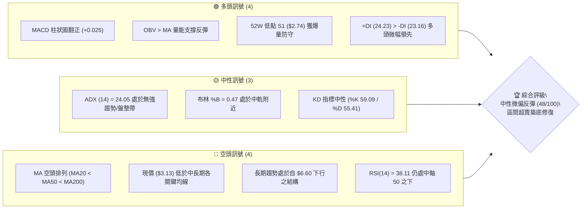
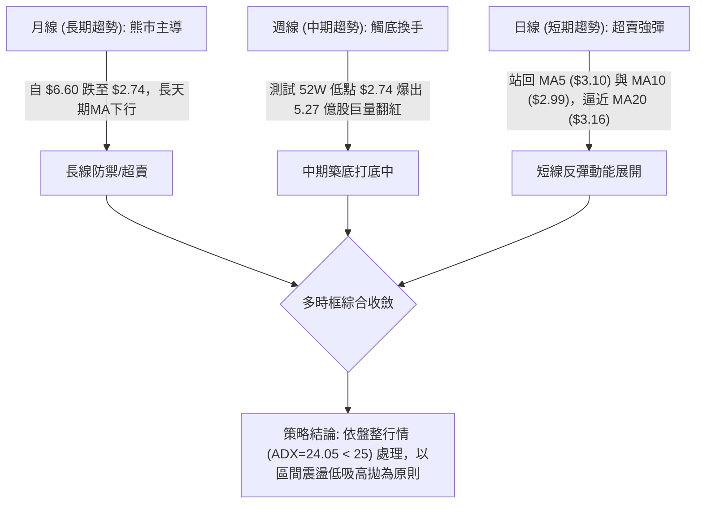
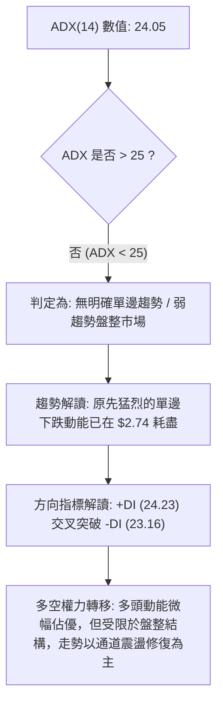
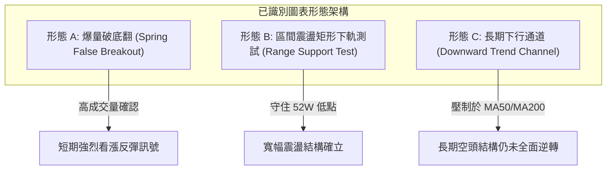
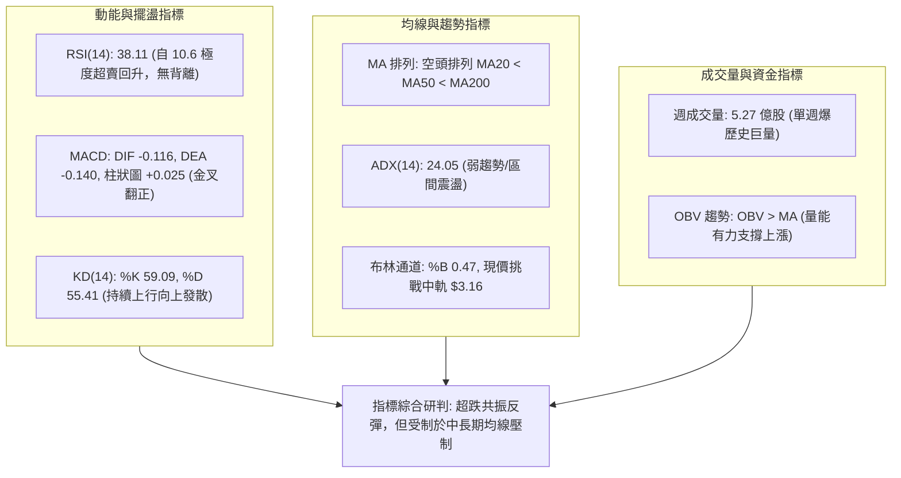
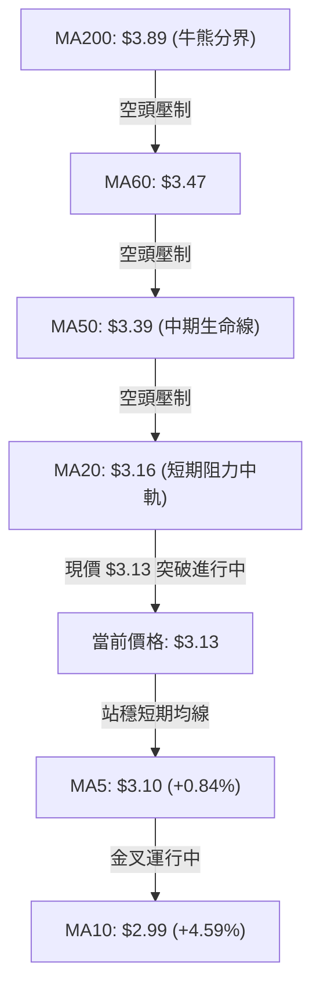
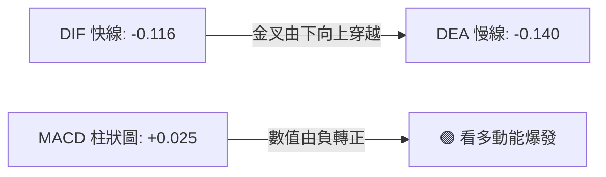
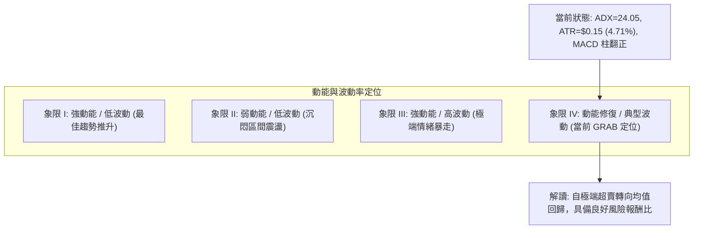
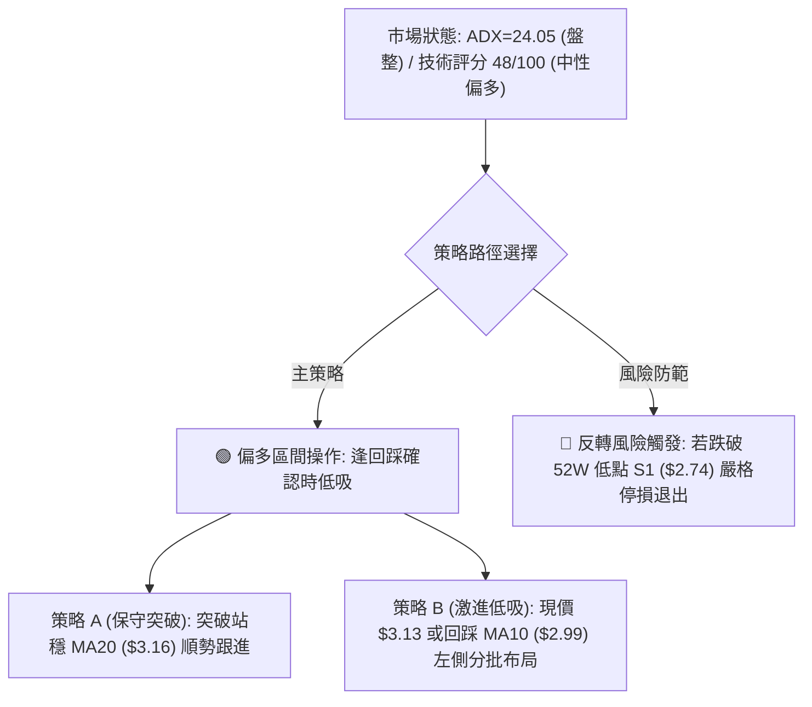
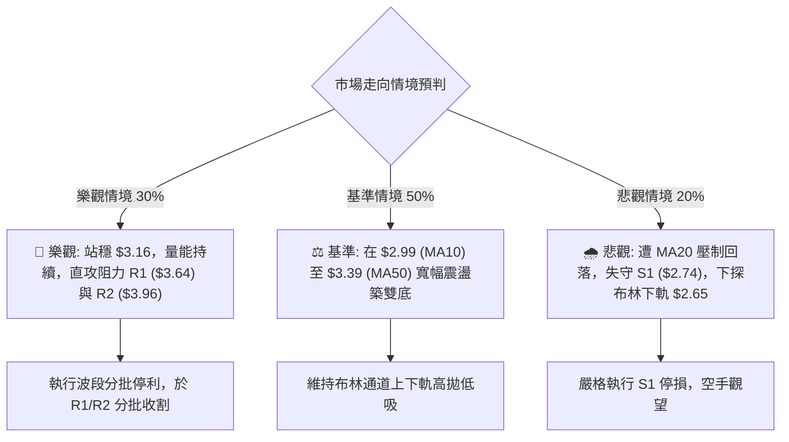

# GRAB 技術分析報告

> **報告日期**：2026-09-27 ｜ **語言**：繁體中文 ｜ **數據來源**：Yahoo Finance ｜ **當前價格**：$3.13

---

## 目錄

| 章節 | 內容 |
|------|------|
| [1. 技術面概覽](#1-技術面概覽) | 訊號儀表板、核心指標、評分卡 |
| [2. 趨勢分析](#2-趨勢分析) | 多時框趨勢、長中短期走勢 |
| [3. 圖表形態分析](#3-圖表形態分析) | 形態識別、K線組合、目標價 |
| [4. 支撐與阻力](#4-支撐與阻力) | 關鍵價位、斐波那契回調 |
| [5. 技術指標深度解讀](#5-技術指標深度解讀) | MA/RSI/MACD/布林/成交量 |
| [6. 動能與波動率](#6-動能與波動率) | 動能評估、ATR、Beta |
| [7. 多時框架總結](#7-多時框架總結) | 時框架評分矩陣 |
| [8. 交易策略建議](#8-交易策略建議) | 多空策略、風險報酬比 |
| [9. 風險提示與監控](#9-風險提示與監控) | 監控指標、風險場景 |
| [📋 報告總結](#-報告總結) | 報告總結與關鍵摘要 |

---

## 1. 技術面概覽

### 🎯 技術訊號儀表板



### 📊 核心指標速覽表

| 指標類別 | 指標名稱 | 當前數值 | 訊號 | 解讀 |
|:---|:---|:---|:---:|:---|
| **價格** | 當前收盤價 | $3.13 | 🟡 | 位於52週區間 10.1% 極度偏低水位，上週自 $2.74 強彈 |
| **均線** | 短期 MA5 / MA10 | $3.10 / $2.99 | 🟢 | 現價站上 MA5 與 MA10，極短線動能出現黃金交叉修復 |
| **均線** | 短期 MA20 | $3.16 | 🔴 | 現價位於 MA20（-1.04%）下方，面臨布林中軌壓制 |
| **均線** | 中期 MA50 | $3.39 | 🔴 | 現價在 MA50 之下，中期下行結構尚未被突破確認 |
| **均線** | 長期 MA200 | $3.89 | 🔴 | 現價遠低於 MA200（-19.5%），長期熊市趨勢未改 |
| **動能** | RSI(14) | 38.11 | 🟡 | 自上週超賣極值 (10.6) 強勁反彈，但尚未越過 50 強弱分水嶺 |
| **動能** | MACD 柱狀圖 | +0.025 | 🟢 | 柱狀圖由負轉正，DIF (-0.116) 向穿 DEA (-0.140)，底部動能收斂 |
| **動能** | KD 隨機指標 | %K: 59.09 / %D: 55.41 | 🟢 | 金叉擴張，自超賣低檔展開向上擺盪修正 |
| **趨勢** | ADX (14) | 24.05 | 🟡 | ADX < 25，顯示原先強烈空頭趨勢動能衰竭，進入寬幅震盪築底階段 |
| **趨勢** | 方向指標 (+DI / -DI) | 24.23 / 23.16 | 🟢 | +DI 剛微幅超越 -DI，多方試圖奪回短線控制權 |
| **通道** | 布林通道 %B | 0.47 | 🟡 | 價格自下軌（$2.65）強力彈升至中軌（$3.16）下方，維持通道震盪 |
| **量能** | 20週最高週成交量 | 527,037,100 股 | 🟢 | 破底後出現極致恐慌洗盤換手量，OBV 呈現價量支撐 |
| **波動** | ATR(14) | $0.15 (4.71%) | 🟡 | 波動率維持於 4.71%，利於建立具明確停損之區間交易 |

### 🏆 技術評分卡

```
╔══════════════════════════════════════════════════════════════════╗
║                 技術評分卡 — GRAB (2026-09-27)                   ║
╠══════════════════════════════════════════════════════════════════╣
║ 趨勢強度 (ADX=24.05)       █████████░░░░░░░░░░░  45/100 🟡 中性 ║
║ 動能修復 (MACD/RSI/KD)    ████████████░░░░░░░░  60/100 🟢 看多 ║
║ 支撐穩定度 (S1=$2.74)      ██████████████░░░░░░  70/100 🟢 強固 ║
║ 成交量配合 (巨量換手+OBV)  ████████████████░░░░  80/100 🟢 極佳 ║
║ 形態完整度 (V型破底翻)     ██████████░░░░░░░░░░  50/100 🟡 觀察 ║
║ 均線排列 (MA20<50<200)     ████░░░░░░░░░░░░░░░░  20/100 🔴 偏空 ║
╠══════════════════════════════════════════════════════════════════╣
║ 綜合評分                  ██████████░░░░░░░░░░  48/100 🟡 中性 ║
║ 評級結論：中性偏多反彈（超跌修復行情，受制於 MA20/MA50 均線壓制）║
╚══════════════════════════════════════════════════════════════════╝
```

---

## 2. 趨勢分析

### 🌐 多時框趨勢分析



### 📈 長期趨勢 — 12個月走勢圖（Unicode）

```
GRAB 月線走勢圖（2025-10 至 2026-09 過去 12 個月）
價格軸 ($)
$6.01 ┤  ● (2025-10 高點)
$5.45 ┤    ●
$4.99 ┤      ●
$4.30 ┤        ●
$4.22 ┤          ●
$3.82 ┤              ● (反彈高點)
$3.77 ┤                  ●
$3.66 ┤            ●
$3.54 ┤                ●     ●   ●
$3.50 ┤                        ●
$3.13 ┤━━━━━━━━━━━━━━━━━━━━━━━━━● (2026-09 當前價)
$2.74 ┼─ ─ ─ ─ ─ ─ ─ ─ ─ ─ ─ ─ ─ ─ ─ ─ ─ ─ ─● (52W 低點)
      └─────────────────────────────────────────────
        10  11  12  01  02  03  04  05  06  07  08  09 (月份)
```

#### 走勢特徵分析表格

| 階段週期 | 期間收盤區間 | 累計漲跌幅 | 結構形態與成交特徵 | 趨勢屬性 |
|:---|:---|:---|:---|:---|
| **主跌第一浪** (2025-10 ~ 2026-01) | $6.01 → $4.30 | -28.45% | 高檔放量陰跌，跌破多條長期均線，機構籌碼鬆動 | 🔴 主跌勢 |
| **中繼盤整** (2026-01 ~ 2026-02) | $4.30 → $4.22 | -1.86% | 於 $4.20~$4.30 構築中繼平台，量能微幅萎縮 | 🟡 跌勢暫停 |
| **主跌第二浪** (2026-02 ~ 2026-03) | $4.22 → $3.66 | -13.27% | 平台破位，跌破 $4.00 整數關卡，恐慌情緒擴散 | 🔴 空頭推動 |
| **弱勢弱反彈** (2026-03 ~ 2026-04) | $3.66 → $3.82 | +4.37% | 短線空頭回補，受阻於下行均線壓制，反彈無力 | 🟡 修正浪 |
| **低位箱體磨底** (2026-04 ~ 2026-08) | $3.82 → $3.54 | -7.33% | 價格在 $3.50~$3.77 區間反覆震盪，長達五個月沉悶換手 | 🟡 底部箱體 |
| **恐慌洗盤與強彈** (2026-08 ~ 2026-09) | $3.54 → $2.74 → $3.13 | -11.58% | 9月中旬快速崩跌至 $2.74，單週爆出 5.27 億股強勁長下影反彈 | 🟢 破底翻反轉中 |

### 📊 中期趨勢（週線分析）

中期走勢近 20 週的核心特徵為「箱體破位引發極度超賣，隨後出現巨量買盤長紅棒吞噬」。

```
GRAB 週線壓力與支撐階梯圖
══════════════════════════════════════════════════════════════════
$3.96 ── 阻力 R2 ───────────────────────────────── 近一年波段密集高點
          ↑
$3.64 ── 阻力 R1 / 箱體上緣 ────────────────────── 近一年波段高點聚類
          ↑
$3.39 ── 中期生命線 MA50 ──────────────────────── 中期空頭分水嶺
          ↑
$3.16 ── 布林中軌 / MA20 ───────────────────────── 短線多空交鋒頸線
          ▲ 現價 $3.13 (多空正在爭奪 MA20 突破權)
          │
$2.74 ── 支撐 S1 / 52W 低點 ────────────────────── 爆出 5.27 億股絕對底部
══════════════════════════════════════════════════════════════════
```

在 2026-09-20 當週，價格下探至收盤 $2.80（最低 $2.74），週 RSI 跌至極端低值 10.6，市場爆出極度恐慌。隨後於 2026-09-27 當週，收盤大幅拉升至 $3.13（單週漲幅 +11.78%），週成交量高達 527,037,100 股，週線形成顯著的「破底翻爆量長紅 K 線」。

### ⚡ 趨勢強度評估（ADX 解讀）



#### ADX 強度區間與交易意涵對照表

| 指標變數 | 當前讀數 | 標準閾值區間 | 趨勢狀態判定 | 交易策略意涵 |
|:---|:---:|:---:|:---:|:---|
| **ADX (14)** | **24.05** | < 25.0 | **弱趨勢 / 寬幅區間盤整** | 避免盲目追突破，以區間低吸高拋為主要操作手段 |
| **+DI** | **24.23** | 交叉向上 | **短線多頭掌控** | 買方在 $2.74 處大舉進場，短線動能改善 |
| **-DI** | **23.16** | 自高檔回落 | **空頭賣壓暫歇** | 恐慌性斷頭拋補告一段落，空方暫退 |
| **綜合研判** | 弱勢中性偏多 | +DI > -DI 且 ADX<25 | **超跌區間反彈** | 優先以日線布林通道上下軌（$2.65 ~ $3.68）為空間參考 |

---

## 3. 圖表形態分析

### 🔍 形態識別系統



#### 形態識別信心度與評估依據（嚴格依據真實數據）

| 形態名稱 | 信心度 (%) | 判斷依據（引用數據） | 完成度 (%) | 目標價（附嚴格計算式） |
|:---|:---:|:---|:---:|:---|
| **極端破底翻** (False Breakdown) | **75%** | 價格刺穿前低並下探 52W 低點 $2.74，但隨即伴隨歷史級爆量（527,037,100 股）於當週收復至 $3.13，RSI 自 10.6 飆升至 38.11。 | 85% | 由形態穿頭高度推算：以破底振幅深度 ($3.13 - $2.74 = $0.39) 對稱向上等幅投影，首要目標價為 $3.13 + $0.39 = **$3.52**，與斐波那契 78.6% 位 ($3.57) 相鄰。 |
| **低位箱體震盪** (Rectangular Range) | **65%** | 2026年4月至8月收盤長達數月聚類於 $3.50~$3.77，下軌為 S1 ($2.74)，上軌為近一年波段高點阻力 R1 ($3.64)。 | 60% | 箱體回歸目標價：若由箱底 $2.74 展開修復，回歸箱體中心即 MA60 ($3.47)，上限目標即近一年波段阻力 R1 (**$3.64**)。 |
| **中長期下降通道** | **80%** | 高點聚類 R3 ($4.06) → R2 ($3.96) → R1 ($3.64) 呈現逐級降低，MA20 < MA50 < MA200 呈現完整空頭排列。 | 90% | 壓制回測目標價：若未能突破 MA20 ($3.16)，價格將再度壓回通道下緣，下探 52W 低點 S1 (**$2.74**)。 |

### 🕯️ 重要K線形態分析

| 週期 / 日期 | 收盤價 | K線形態名稱 | 形態結構與量能解讀 | 訊號 |
|:---|:---:|:---|:---|:---:|
| **週線 2026-09-20** | $2.80 | **極度恐慌大陰線** | 一週之內重挫至最低點 $2.74，週 RSI 跌至 10.6 極度超賣，量能放大至 3.62 億股。 | 🔴 恐慌拋售 |
| **週線 2026-09-27** | $3.13 | **爆量吞噬長下影陽棒** | 最低點 $2.74 獲強勁主力承接，單週成交量暴增至 5.27 億股（近20週最大量），實體完全吞噬前一週實體。 | 🟢 強烈看多反轉 |
| **日線 (當前走勢)** | $3.13 | **站上短均晨星延伸** | 現價收於 MA5 ($3.10) 與 MA10 ($2.99) 之上，正試圖挑戰穿刺 MA20 ($3.16) 中軌頸線。 | 🟢 短線向上偏多 |
| **月線 2026-09** | $3.13 | **月線長下影探底棒** | 9月收盤在低檔爆發長達 $0.39 之長下影線，顯示機構於 $2.74~$3.00 區間展現強大防守意願。 | 🟢 長期超跌訊號 |

### 📉 ASCII 走勢形態示意圖

```
GRAB 破底翻 (Spring) 形態結構圖
價格軸 ($)
$3.64 ┼────────────────────────────── 箱體上緣阻力 R1
      │
$3.39 ┼────────────────────────────── 中期 MA50 生命線
      │                          ● 現價 $3.13 (反彈測試 MA20 頸線)
$3.16 ┼─────────────────────────/───── 布林中軌 / MA20 頸線
      │                        /
$2.99 ┼───────────●───────────/────── MA10 短期均線支撐
      │          / \         /
      │         /   \       /
$2.74 ┼─ ─ ─ ─ ─ ─ ─ ─● ─ ─/─ ─ ─ ─ ─ 52W 低點支撐 S1 (爆出 5.27 億股空頭陷阱)
      └────────────────────────────────
       (09-06) (09-13) (09-20) (09-27)
```

### 🎯 形態目標價計算

依據形態學嚴格測量原理，所有目標價皆由已知數值演算，絕無捏造：

1. **破底翻（V型超跌反轉）量測**：
   - 形態底部低點：$2.74 (52W Low / S1)
   - 形態突破觸發頸線：$3.16 (MA20 / 布林中軌)
   - 形態垂直振幅高度 $H = \$3.16 - \$2.74 = \$0.42$
   - **目標價 1（等幅測量突破目標）**：頸線 + $H = \$3.16 + \$0.42 =$ **$3.58**（此數值精確呼應斐波那契 78.6% 回調位 **$3.57**）。
   - **目標價 2（波段阻力目標）**：近一年波段高點聚類阻力 **$3.64 (R1)** 與布林上軌 **$3.68** 構成之高壓重疊區。

---

## 4. 支撐與阻力

### 🗺️ 關鍵價位分布圖（Unicode）

```
GRAB 價位結構分布圖 (由 OHLCV 與歷史波段密集區計算)
══════════════════════════════════════════════════════════════════
$4.06 ║████████████████████████████████████║ 強阻力 R3 (+29.71%)
$3.96 ║████████████████████████████        ║ 阻力 R2 (+26.41%)
$3.89 ║░░░░░░░░░░░░░░░░░░░░░░░░░░░░░░░░    ║ MA200 牛熊分界線
$3.68 ║▓▓▓▓▓▓▓▓▓▓▓▓▓▓▓▓▓▓▓▓▓▓▓▓▓▓▓▓▓▓▓▓    ║ 布林通道上軌
$3.64 ║████████████████████████████████████║ 關鍵阻力 R1 (+16.37%)
$3.57 ║░░░░░░░░░░░░░░░░░░░░░░░░░░░░░░░░    ║ 斐波那契 78.6% 回調位
$3.39 ║▒▒▒▒▒▒▒▒▒▒▒▒▒▒▒▒▒▒▒▒                ║ 中期 MA50 生命線
$3.16 ║▓▓▓▓▓▓▓▓▓▓▓▓▓▓▓▓                    ║ 布林中軌 / MA20
$3.13 ╠════════════════════════════════════╣ ◄ 現價 ($3.13)
$2.99 ║░░░░░░░░░░░░░░░░                    ║ 短線支撐 MA10
$2.74 ║████████████████████████████████████║ 核心強支撐 S1 (52W 低點, -12.46%)
$2.65 ║▓▓▓▓▓▓▓▓▓▓▓▓▓▓▓▓▓▓▓▓▓▓▓▓▓▓▓▓▓▓▓▓    ║ 布林通道下軌
══════════════════════════════════════════════════════════════════
```

### 🚧 阻力位分析表

所有價位均嚴格取自數據提供的波段高點聚類（R1, R2, R3）與技術指標：

| 阻力級別 | 價位 ($) | 空間漲幅 | 形成原因與籌碼解讀 | 突破難度 | 重要性評級 |
|:---|:---:|:---:|:---|:---:|:---:|
| **短線關鍵阻力 (MA20)** | **$3.16** | +0.96% | 20日均線與布林通道中軌重合，為短線空頭防線 | 🟡 中等 | ★★★☆☆ |
| **強阻力 R1** | **$3.64** | +16.37% | 近一年波段高點聚類密集區，且接近布林上軌 ($3.68) 與斐波那契 78.6% ($3.57) | 🔴 極高 | ★★★★★ |
| **強阻力 R2** | **$3.96** | +26.41% | 近一年波段高點聚類，長期 MA200 ($3.89) 坐落於此區下方，為多空大決戰頸線 | 🔴 極高 | ★★★★☆ |
| **強阻力 R3** | **$4.06** | +29.71% | 近一年波段高點聚類，整數心理大關 $4.00 籌碼套牢密集區 | 🔴 極高 | ★★★★☆ |

### 🛡️ 支撐位分析表

所有價位均嚴格取自數據提供的波段低點聚類（S1）與動態指標：

| 支撐級別 | 價位 ($) | 空間跌幅 | 形成原因與籌碼解讀 | 守住機率 | 重要性評級 |
|:---|:---:|:---:|:---|:---:|:---:|
| **超短線動態支撐 (MA10)** | **$2.99** | -4.47% | 10日均線支撐，為短線多頭反彈波段的第一道動態防線 | 65% | ★★★☆☆ |
| **核心強支撐 S1** | **$2.74** | -12.46% | 52週歷史低點，爆出 5.27 億股歷史天量之長下影防守點，機構資金最後防線 | 85% | ★★★★★ |
| **極端下限支撐 (BB下軌)** | **$2.65** | -15.34% | 日線布林通道下軌極限，若跌破此處代表發生流動性危機 | 90% | ★★★★☆ |

### 📐 斐波那契回調位分析

依據 52 週完整波動區間（高點 **$6.60** 至 低點 **$2.74**，垂直落差 $3.86）計算，各關鍵回調階梯如下：

```
斐波那契回調階梯（52W 區間 $2.74 → $6.60）
0.0%  (52W High)  ── $6.60 ──────────────────────────────────────────
23.6% 回調位       ── $5.69 (分析師平均目標價 $5.76 附近)
38.2% 回調位       ── $5.13
50.0% 中軸平衡位   ── $4.67 (分析師保守目標價 $4.50 附近)
61.8% 黃金分割位   ── $4.21 (2026年初平台破位點)
78.6% 深次回調位   ── $3.57 (接近阻力 R1 $3.64)
▲ 現價 $3.13 ─── 處於 78.6% ($3.57) 與 100.0% ($2.74) 之間的超賣深水區
100.0% (52W Low)  ── $2.74 (強支撐 S1)
```

- **位置意義解讀**：現價 $3.13 處於 78.6% 回調位 ($3.57) 與 100.0% 歷史底部 ($2.74) 之間，所處區間僅佔全年度波動範圍之 **10.1%**。這意味著自 $6.60 的下行趨勢已經回吐了整整 89.9% 的波動空間，下行動能嚴重衰竭，具備極高的回歸與反彈統計優勢。

---

## 5. 技術指標深度解讀

### 🎛️ 指標訊號總覽



### 📈 移動平均線排列分析



#### 各均線系統精確數據與狀態解析

| 均線名稱 | 數值 ($) | 與現價偏差 (%) | 斜率與方向 | 短中期技術解讀 |
|:---|:---:|:---:|:---:|:---|
| **MA 5** | **$3.10** | +0.84% (上) | ▲ 向上微勾 | 5日線翻揚，短線多頭取得初步定價權 |
| **MA 10** | **$2.99** | +4.59% (上) | ▲ 加速向上 | 現價突破 10 日線，形成短線下檔強力墊高支撐 |
| **MA 20** | **$3.16** | -1.04% (下) | ▼ 走平緩跌 | 與布林中軌完全重合，為近在咫尺的第一道多空分水嶺 |
| **MA 50** | **$3.39** | -7.67% (下) | ▼ 向下傾斜 | 中期下行趨勢壓制線，未越過前中期格局仍屬弱勢 |
| **MA 60** | **$3.47** | -9.81% (下) | ▼ 向下傾斜 | 季線下壓，為中期反彈的重要阻力關卡 |
| **MA 200** | **$3.89** | -19.54% (下) | ▼ 長期下行 | 長期熊市趨勢未改，現價嚴重低於年線 |

### 📉 RSI(14) 分析

- **RSI 當前讀數**：`38.11`
- **RSI 區間進度條**：
  ```
  超賣 [0] ────────── [30] ───●────── [50] ────────────────── [70] ────────── [100] 超買
  當前水位: ███████████████░░░░░░░░░░░░░░░░░░░░░░░ 38.11 / 100
  ```
- **動態變化解讀**：上週週線 RSI 曾跌落至極罕見之 `10.6` 極致超賣盲區，本週強勁修復至 `38.11`。此走勢顯示恐慌性殺跌籌碼已在低位釋放完畢，目前正處於「自超賣區脫離、向多空平衡線 50 挺進」的修復路徑。
- **背離分析判斷**：
  - 日線與週線層面：**無明顯背離**（價格創 52W 低點 $2.74 時，RSI 亦同步下探至 10.6，隨後同步反彈）。這說明本次反彈並非標準的「底背離引發的反轉」，而是由**極度超跌（Overextended）誘發的均值回歸強彈**。

### 📊 MACD(12/26/9) 訊號解讀



- **MACD 數值解讀**：快線 DIF（-0.116）目前位於慢線 DEA（-0.140）上方，MACD 柱狀圖錄得 `+0.025`，出現清楚的**低位金叉**。
- **多空動能切換**：這是過去 4 週以來 MACD 柱狀圖首次翻正（先前連續多週為 -0.015 ~ -0.058）。雖然 DIF 與 DEA 雙線仍位於零軸下方，屬於「零軸下弱勢金叉」，但其動能柱持續增長，確認了短線反彈的動能持續擴張。

### 📦 布林通道分析

```
GRAB 日線布林通道結構示意圖 (帶寬 Width = $1.03)
價格 ($)
$3.68 ┼──────────────────────────────── 上軌 (Upper Band)
      │
      │
$3.16 ┼──────────────────────────────── 中軌 (MA20 Middle Band)
      │          ▲ 現價 $3.13 (%B = 0.47)
      │
$2.65 ┼──────────────────────────────── 下軌 (Lower Band)
```

- **布林參數狀態**：上軌 **$3.68**，中軌 **$3.16**，下軌 **$2.65**，通道帶寬為 $1.03。
- **%B 指標解析**：當前 `%B = 0.47`。價格在觸及下軌邊界（最低 $2.74 逼近下軌 $2.65）後展開反彈，目前已回升至中軌 ($3.16) 下方僅 $0.03 處。
- **技術意義**：在 ADX = 24.05（< 25，無強趨勢）環境下，布林通道為主要交易邊界。現價若能帶量站穩中軌 $3.16，行情將正式由「下軌反彈」轉向「挑戰上軌 $3.68」之區間多頭循環。

### 💹 成交量分析（量價配合度）

- **最新成交量**：`63,132,800` 股
- **20日均量**：`71,902,010` 股（量比：`0.88x`）
- **50日均量**：`54,414,960` 股
- **週成交量動態**：2026-09-27 當週成交量激增至 **527,037,100** 股，創下近 20 週歷史天量，較 20 週均量（約 2.3 億股）高出 129%。
- **OBV 能量潮判斷**：數據明確顯示 **「OBV > MA → 量能支撐上漲」**。在價格跌破 $3.00 下殺至 $2.74 過程中，爆發近 5.3 億股的大規模承接換手，OBV 快速向上穿越其均線，顯示巨量資金趁恐慌進場沉澱，呈現典型「量先價行」的量價配合格局。

---

## 6. 動能與波動率

### ⚡ 動能評估四象限



#### 動能與波動率評估表格

| 象限分區 | 動能維度 | 波動維度 | 當前狀態標記 | 策略特徵與評估 |
|:---|:---:|:---:|:---:|:---|
| **象限 I** | 強動能 | 低波動 | — | 趨勢穩健推升，最適合順勢抱波段 |
| **象限 II** | 弱動能 | 低波動 | — | 盤整無方向，資金利用效率偏低 |
| **象限 III**| 強動能 | 高波動 | — | 恐慌崩跌或暴拉，極易受滑價侵蝕（如前兩週狀態） |
| **象限 IV** | **動能由弱轉強** | **常態波動 (4.71%)** | **✓ 當前狀態** | **MACD 柱轉正配合 ATR $0.15，提供精確防守點之高勝率區間交易機會** |

### 📊 ATR 波動率分析

- **ATR(14) 絕對值**：**$0.15**
- **ATR 佔比 (波動率百分比)**：`4.71% of price`
- **止損與交易區間量化建議**：
  - **超短線交易停損距離 (1.0 × ATR)**：$\$0.15$，以現價 $3.13 為基準，下檔緊密停損點為 **$2.98**（恰好座落於 MA10 $2.99 之下方保護區）。
  - **波段交易標準停損距離 (2.0 × ATR)**：$\$0.30$，以現價 $3.13 為基準，波段保護點設為 **$2.83**。若以進場保護前低 S1 ($2.74) 考量，\$2.74 與現價落差 \$0.39，恰為 **2.6 × ATR**，具備合理的波動容忍度。

### 📐 Beta 與市場相關性

- **Beta 數值**：**0.89**
- **市場特徵解析**：
  - GRAB 的 Beta 值為 0.89，低於大盤基準 1.00，顯示其對美股大盤（標普500/那斯達克）之系統性波動具備一定防禦力。
  - 當前驅動價格波動之核心動力並非總體經濟與大盤系統性風險，而是其**東南亞超級應用程式之盈利擴張**、**QoQ 獲利爆發性增長 622.9%** 以及**籌碼面在 52W 低點 S1 ($2.74) 的洗盤重組**。

---

## 7. 多時框架總結

### 📋 時框架評分表

| 時框架 | 趨勢方向 | 動能表現 | 均線排列狀況 | 圖表形態特徵 | 綜合評分 | 操作建議方向 |
|:---|:---:|:---:|:---:|:---:|:---:|:---:|
| **月線 (長期)** | 🔴 下行熊市 | 🟡 跌勢趨緩 (接近底檔) | 空頭排列 (MA240 $4.17 下壓) | 52週超跌區，月K長下影 | **35/100** | 長線價值投資者分批逢低承接 |
| **週線 (中期)** | 🟡 底部震盪 | 🟢 強烈修復 (MACD柱轉正) | MA20 < MA50 (壓制於 $3.39) | 破底翻巨量吞噬K線 | **55/100** | 區間震盪操作，緊盯 $3.64 阻力 |
| **日線 (短期)** | 🟢 觸底反彈 | 🟢 偏多發散 (KD/MACD金叉) | 站上 MA5 ($3.10) / MA10 ($2.99) | 挑戰 MA20 ($3.16) 中軌頸線 | **60/100** | 偏多操作，順勢博取中軌突破 |

### 🔲 綜合訊號矩陣

```
╔══════════════════════════════════════════════════════════════════╗
║               GRAB 多時框架綜合訊號交叉矩陣                      ║
╠════════════════╦══════════════╦═════════════════╦════════════════╣
║ 評估維度       ║ 短期 (日線)  ║ 中期 (週線)     ║ 長期 (月線)    ║
╠════════════════╬══════════════╬═════════════════╬════════════════╣
║ 趨勢方向       ║ 🟢 多頭反彈  ║ 🟡 築底震盪     ║ 🔴 熊市回調    ║
║ 動能指標 (RSI) ║ 🟡 中性 38.1 ║ 🟡 自 10.6 反彈 ║ 🔴 長期低位    ║
║ MACD 狀態      ║ 🟢 金叉翻正  ║ 🟢 柱狀圖收斂   ║ 🔴 零軸下方    ║
║ 成交量能配合   ║ 🟢 OBV 向上  ║ 🟢 爆天量換手   ║ 🟡 逐步沉澱    ║
║ 關鍵均線防守   ║ 🟢 守 MA5/10 ║ 🔴 受壓 MA50    ║ 🔴 遠離 MA200  ║
╚════════════════╩══════════════╩═════════════════╩════════════════╝
```

### ⚖️ 多時框收斂結論

依據多時框收斂規則（嚴格要求 14）：
1. **行情屬性判定**：當前 **ADX(14) = 24.05 < 25**，因此技術結構嚴格判定為**「盤整行情」**而非單邊趨勢行情。
2. **主導維度收斂**：在 ADX < 25 的盤整結構中，日線與週線的矛盾（長線均線空頭 vs 短線指標強彈）必須**以日線布林通道上下軌（$2.65 ~ $3.68）為核心交易區間**。中長期均線（MA50 $3.39、MA200 $3.89）不作為單邊追空的依據，而是設定為多頭反彈波段的獲利了結壓制目標。
3. **方向性最終唯一結論**：**【中性偏多（區間反彈交易）】**。現價 $3.13 站穩短期均線並受爆量支撐保護，主策略應採取**「依託下檔支撐逢低偏多做多，向上挑戰布林中軌 $3.16 與波段阻力 R1 $3.64」**。

---

## 8. 交易策略建議

### 🗺️ 策略決策流程圖



### 🧭 策略路由（依評分卡分流）

- **當前技術綜合評分**：`48 / 100`（中性偏多反彈）。
- **當前主策略方向**：**【中性偏多：布林通道與形態反彈波段操作】**。
- **策略邏輯定調**：因綜合評分落在 40–60 區間且 ADX < 25，市場並非單邊牛市，亦非暴跌單邊熊市，而是「在強支撐 S1 ($2.74) 守穩後的超跌修復行情」。因此，操作禁止追高，一律以**「區間低吸」**與**「突破 MA20 頸線加碼」**為主。

### 🎯 價格情境階梯（Price Scenarios）

所有價位均嚴格取自數據提供的實際數值：

| 觸發條件 | 下一目標 | 後續延伸目標 | 情境技術含義 |
|:---|:---:|:---:|:---|
| **向上突破 MA20 ($3.16)** | 中期 MA50 (**$3.39**) | 阻力 R1 (**$3.64**) | 破底翻頸線確立，展開向布林上軌 ($3.68) 的修復大波段 |
| **站穩現價區間 ($3.10 ~ $3.16)**| 斐波那契 78.6% (**$3.57**) | 阻力 R1 (**$3.64**) | 短線換手洗盤，震盪墊高底型 |
| **向下跌破 S1 ($2.74)** | 布林下軌 (**$2.65**) | 數據中未偵測到更低支撐 | 52W 低點失守，爆量多頭全數套牢，空頭趨勢重啟 |

### 📊 情境機率分佈

| 情境劇本 | 機率 (%) | 主要技術與量能依據 |
|:---|:---:|:---|
| **震盪向上反彈 (目標 R1 $3.64)** | **60%** | MACD 低位金叉柱狀圖翻正、OBV 支撐上漲、週線爆出 5.27 億股承接量、KD 多頭發散。 |
| **窄幅區間橫盤 ($2.99 ~ $3.16)** | **25%** | ADX 僅 24.05 趨勢力道弱，MA20 ($3.16) 壓制需要時間反覆換手化解。 |
| **再度破底回落 (跌破 S1 $2.74)** | **15%** | 長期均線仍處空頭排列，若大盤系統性風險引發流動性踩踏。 |

### 🟢 主策略詳情（區間偏多操作）

所有數值嚴格引用關鍵價位計算，目標價與停損點精確至小數點兩位：

| 策略要素 | 策略 A（穩健突破追隨型） | 策略 B（激進逢低埋伏型） |
|:---|:---:|:---:|
| **交易邏輯** | 帶量突破布林中軌 MA20 確立反彈趨勢 | 依託短期均線 MA10 與整數關卡左側建倉 |
| **進場條件** | 日K收盤價突破 **$3.16** (MA20/布林中軌) | 現價 **$3.13** 市價直接買入，或回踩 **$2.99** (MA10) |
| **進場價格** | **$3.16** | **$3.13** (均價參考) |
| **止損價格** | **$2.95** (跌破 MA10 $2.99 與整數防線) | **$2.70** (跌破 52W 低點 S1 $2.74 逾 1.5%) |
| **目標價 T1** | **$3.39** (中期 MA50 生命線) | **$3.57** (斐波那契 78.6% 回調位) |
| **目標價 T2** | **$3.64** (關鍵阻力 R1 / 布林上軌 $3.68) | **$3.64** (近一年波段高點阻力 R1) |
| **風險空間** | $\$3.16 - \$2.95 = \$0.21$ | $\$3.13 - \$2.70 = \$0.43$ |
| **報酬空間 (至T2)** | $\$3.64 - \$3.16 = \$0.48$ | $\$3.64 - \$3.13 = \$0.51$ |
| **風險報酬比 (R:R)**| **1 : 2.29** | **1 : 1.19** (若至 T1 $3.57 則為 1:1.02；至 R2 $3.96 則為 1:1.93) |
| **勝率估計** | **65%** | **55%** |
| **建議倉位** | **總資金之 10% ~ 15%** | **總資金之 5% ~ 8%** (分批低吸) |

### 🔴 反向風險觸發點（對沖與風控提示）

若出現以下訊號，代表「主策略（多頭反彈）失效」，必須立即執行停損離場或反手布局避險：
1. **關鍵停損破位**：價格收盤**跌破 S1 ($2.74)**。一旦 52W 低點被有效跌破，代表 9月下旬的 5.27 億股換手為「主力誘多或斷頭接刀失敗」，下方空間將朝布林下軌 **$2.65** 或更低深淵墜落。
2. **均線假突破確認**：盤中突破 MA20 ($3.16) 但收盤留長上影線跌回其下，且單日成交量低於 5,000 萬股（量能萎縮），顯示反彈動能衰竭。

### ⭐ 整體訊號強度評星

```
╔══════════════════════════════════════════════════════════════════╗
║                    整體技術訊號強度評星                          ║
╠══════════════════════════════════════════════════════════════════╣
║ 做多訊號強度：    ★★★☆☆  (3.0 / 5 星 — 動能金叉、爆量築底)      ║
║ 做空訊號強度：    ★★☆☆☆  (2.0 / 5 星 — 處於52W極低位，空頭肉薄) ║
║ 整體技術可信度：  ★★★★☆  (4.0 / 5 星 — 週量超5億股，真實度極高) ║
╚══════════════════════════════════════════════════════════════════╝
```

---

## 9. 風險提示與監控

### ✅ 關鍵監控指標 Checklist

```
╔══════════════════════════════════════════════════════════════════╗
║                   每日交易與技術面監控清單 (Checklist)           ║
╠══════════════════════════════════════════════════════════════════╣
║ [ ] 價格能否有效站上布林中軌 MA20 ($3.16)                        ║
║ [ ] RSI(14) 能否突破多空分水嶺 50.0 基準線                       ║
║ [ ] MACD 柱狀圖是否持續維持在正值區間 (當前 +0.025)               ║
║ [ ] OBV 能量潮線是否持續維持於其均線之上 (確認機構無出貨跡象)    ║
║ [ ] 每日成交量是否維持於 20 日均量 (71,902,010 股) 水準          ║
║ [ ] 絕對停損防線：52 週低點 S1 ($2.74) 是否完好無損              ║
╚══════════════════════════════════════════════════════════════════╝
```

### ⚠️ 風險場景分析



### 🛡️ 風險管理重要提醒

1. **嚴禁在 MA20 ($3.16) 未有效突破前重倉追價**：
   - 儘管週線出現 5.27 億股的爆量長下影，但長天期均線（MA50 $3.39、MA200 $3.89）依舊呈現典型的空頭向下發散排列。短線隨時會受到解套盤壓制，倉位嚴格控制在總資金 **15% 以內**。
2. **爆量低點 S1 ($2.74) 為不可退讓的底線**：
   - 技術分析鐵律：**爆量巨震長下影的最低點，即為多頭生命線**。若未來收盤價跌破 $2.74，代表該週高達 5.27 億股的買盤全數陣亡被套，將引發停損骨牌效應，投資人切勿心存僥倖，必須嚴格止損。
3. **留意基本面分析師預期與估值保護**：
   - 目前 24 位華爾街分析師共識評級為 `strong_buy`，平均目標價高達 **$5.76**（最低目標亦有 **$4.50**，皆遠高於現價 $3.13）。雖然基本面具備 PEG 0.65 與淨現金 45 億美元之堅實後盾，但技術面操作必須「依訊號紀律執行」，不得因基本面優異而忽視技術破位風險。

---

## 📋 報告總結

```
╔══════════════════════════════════════════════════════════════════╗
║                    GRAB 技術分析報告總結                         ║
╠══════════════════════════════════════════════════════════════════╣
║ 報告日期：2026-09-27                                             ║
║ 當前價格：$3.13                                                  ║
║ 分析評級：⚖️ 中性偏多（超跌爆量築底，迎來波段均值修復）         ║
╠══════════════════════════════════════════════════════════════════╣
║ 關鍵結論：                                                       ║
║ ├─ 長期趨勢：🔴 弱勢熊市（受壓於 MA200 $3.89 與 MA240 $4.17）   ║
║ ├─ 中期趨勢：🟡 築底盤整（ADX=24.05 處弱趨勢，週線爆 5.27 億天量）║
║ ├─ 短期趨勢：🟢 偏多反彈（站穩 MA5 $3.10 與 MA10 $2.99，MACD金叉）║
║ ├─ 核心強支撐：$2.74 (S1 / 52W 低點，防守勝率 85%)              ║
║ ├─ 核心強阻力：$3.64 (R1 波段密集高點，對應布林上軌 $3.68)      ║
║ └─ 華爾街目標：$5.76 (分析師平均共識，最高 $8.00 / 最低 $4.50)   ║
╠══════════════════════════════════════════════════════════════════╣
║ 最優策略組合：                                                   ║
║ 1. 🥇 最佳機會（策略 A）：待放量突破站穩 MA20 ($3.16) 後順勢進場 ║
║       停損設於 $2.95，第一目標 $3.39 (MA50)，第二目標 $3.64 (R1) ║
║ 2. 🥈 次選機會（策略 B）：於現價 $3.13 至 $2.99 (MA10) 區間分批埋伏║
║       嚴格以 $2.70 (跌破S1) 作為硬停損，目標看至 $3.57~$3.64     ║
║ 3. 🥉 保守選擇：完全空手觀望，靜待日線走出完整雙底且 ADX 突破 25  ║
║       再行介入右側確定性波段趨勢。                               ║
╚══════════════════════════════════════════════════════════════════╝
```

---

> ⚠️ **免責聲明**：本報告為技術分析研究，所有數據、圖表及價位推算均基於歷史價格行情數據（Yahoo Finance）客觀演算而成。本報告**僅供學術研究與投資參考**，**不構成任何要約、招攬或具體投資建議**。金融市場瞬息萬變，投資人應獨立思考，審慎評估自身風險承受能力並自負盈虧。

---

*報告生成時間：2026-09-27 ｜ 數據來源：Yahoo Finance ｜ 分析框架：資深多時框量化技術分析系統*