# GRAB 技術分析報告

> **報告日期**：2026-09-28 ｜ **語言**：繁體中文 ｜ **數據來源**：Yahoo Finance ｜ **當前價格**：$3.13

---

## 目錄

| 章節 | 內容 |
|------|------|
| [1. 技術面概覽](#1-技術面概覽) | 訊號儀表板、核心指標、評分卡 |
| [2. 趨勢分析](#2-趨勢分析) | 多時框趨勢、長中短期走勢 |
| [3. 圖表形態分析](#3-圖表形態分析) | 形態識別、K線組合、目標價 |
| [4. 支撐與阻力](#4-支撐與阻力) | 關鍵價位、斐波那契回調 |
| [5. 技術指標深度解讀](#5-技術指標深度解讀) | MA/RSI/MACD/布林/成交量 |
| [6. 動能與波動率](#6-動能與波動率) | 動能評估、ATR、Beta |
| [7. 多時框架總結](#7-多時框架總結) | 時框架評分矩陣 |
| [8. 交易策略建議](#8-交易策略建議) | 多空策略、風險報酬比 |
| [9. 風險提示與監控](#9-風險提示與監控) | 監控指標、風險場景 |

---

## 1. 技術面概覽

### 🎯 技術訊號儀表板

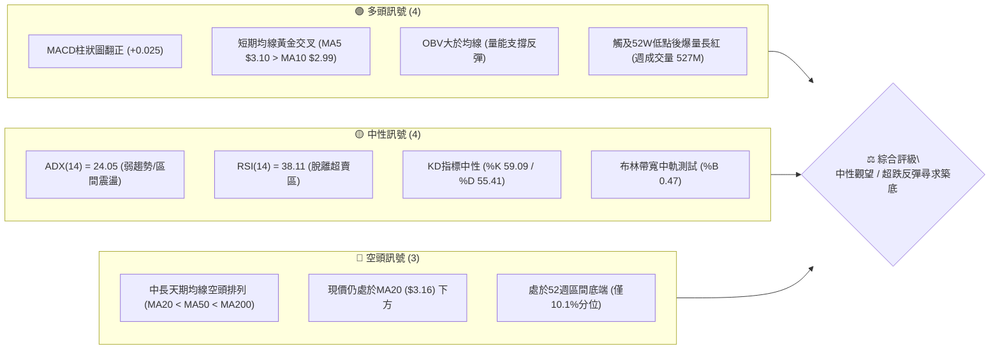

---

### 📊 核心指標速覽表

| 指標類別 | 指標名稱 | 當前數值 | 訊號 | 解讀 |
|:---|:---|:---|:---:|:---|
| **價格** | 當前價格 | **$3.13** | 🟡 | 位於52週高低區間（$2.74–$6.60）的 10.1% 水平，自低點強彈 |
| **均線** | MA5 / MA10 | **$3.10 / $2.99** | 🟢 | 極短線黃金交叉，股價站上短期均線，短線動能改善 |
| **均線** | MA20 (月線) | **$3.16** | 🔴 | 股價位於 MA20 下方 (-1.04%)，尚未實質收復短中期生命線 |
| **均線** | MA50 (季線) | **$3.39** | 🔴 | 股價位於 MA50 下方 (-7.67%)，中期格局仍偏弱 |
| **均線** | MA200 (年線)| **$3.89** | 🔴 | 均線呈空頭排列（MA20 < MA50 < MA200），長期下行壓力未解 |
| **動能** | RSI(14) | **38.11** | 🟡 | 自週線極度超賣（10.6）強勁修復，現回升至中性偏弱區間 |
| **動能** | MACD | **-0.116 / 柱 +0.025** | 🟢 | MACD 快線向上穿越信號線（-0.140），柱狀圖轉正，動能翻多 |
| **趨勢** | ADX(14) | **24.05** | 🟡 | ADX < 25 表明非強烈單邊趨勢，當前偏向超跌後的區間震盪整理 |
| **通道** | 布林通道 | **$2.65 - $3.68** | 🟡 | 現價逼近中軌 $3.16，%B 為 0.47，具備向通道上軌挑戰空間 |
| **量能** | OBV / 量比 | **0.88x (日) / 527M (週)**| 🟢 | OBV > MA，近一週爆出逾 5.27 億股承接巨量，量價呈現底層換手 |
| **波動** | ATR(14) | **$0.15** | 🟡 | 日波動率 4.71%，波動收斂後具備短線波段彈性 |

---

### 🏆 技術評分卡

```
╔═════════════════════════════════════════════════════════════════════════╗
║                      技術評分卡 — GRAB (2026-09-28)                     ║
╠═════════════════════════════════════════════════════════════════════════╣
║ 趨勢強度 (ADX/方向)   █████████░░░░░░░░░░░  45/100  🟡 中性 (弱趨勢整理)║
║ 動能指標 (RSI/MACD)   ████████████░░░░░░░░  60/100  🟢 偏多 (低檔金叉)  ║
║ 支撐穩定度 (S1測試)   ██████████████░░░░░░  70/100  🟢 偏多 (低點放量)  ║
║ 成交量配合 (OBV/週量) ███████████████░░░░░  75/100  🟢 強多 (底層放量)  ║
║ 形態完整度 (築底雛形) █████████░░░░░░░░░░░  45/100  🟡 中性 (剛完成下影)║
║ 均線排列 (空頭防禦)   ██████░░░░░░░░░░░░░░  30/100  🔴 偏空 (長線均線壓)║
╠═════════════════════════════════════════════════════════════════════════╣
║ 綜合評分             ██████████░░░░░░░░░░  54/100  🟡 區間震盪 / 偏向反彈║
╚═════════════════════════════════════════════════════════════════════════╝
```

---

## 2. 趨勢分析

### 🌐 多時框趨勢分析

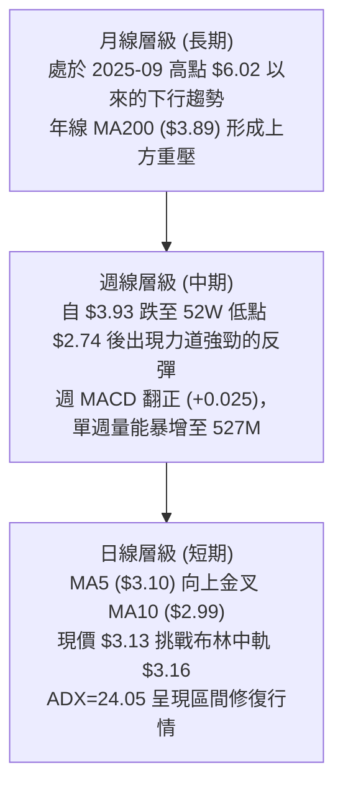

---

### 📈 長期趨勢 — 12個月走勢圖（Unicode）

依據過去 12 個月（2025-10 至 2026-09）收盤價繪製月線走勢：

```
GRAB 月線走勢圖（2025-10 至 2026-09）
價格軸 ($)
$6.01 ┤ ●(2025-10)
$5.45 ┤   ╲
$4.99 ┤     ●──●(2025-12)
$4.30 ┤         ╲
$4.22 ┤           ●
$3.82 ┤               ●(2026-04)
$3.66 ┤             ●   ╲     ●(2026-06)
$3.54 ┤                   ●     ╲   ●(2026-08)
$3.50 ┤                         ● ╱
$3.13 ┤                               ●(2026-09 破底翻現價)
      └───────────────────────────────────────────────────
        10  11  12  01  02  03  04  05  06  07  08  09 (月份)
```

#### 走勢特徵分析表格

| 階段 | 時間區間 | 起訖價格 | 漲跌幅 | 走勢特徵 |
|:---|:---|:---:|:---:|:---|
| **主跌段一** | 2025-10 → 2026-01 | $6.01 → $4.30 | -28.45% | 高檔放量下殺，失守 $5.00 大關，長期頭部確立 |
| **中繼整理** | 2026-01 → 2026-04 | $4.30 → $3.82 | -11.16% | 跌勢放緩，在 $3.66–$4.22 間構築下跌中繼平台 |
| **陰跌破位** | 2026-04 → 2026-08 | $3.82 → $3.54 | -7.33% | 交易重心持續下移，多次衝高受阻於 MA60 ($3.47) |
| **加速觸底** | 2026-08 → 2026-09 | $3.54 → $3.13 | -11.58% | 9月中旬急殺創 52W 低點 $2.74，月末爆量拉抬至 $3.13 |

---

### 📊 中期趨勢（週線分析）

```
週線關鍵攻防示意圖
阻力位 R1  $3.64 ───────────────────────────── [週線波段反彈強阻力]
布林中軌   $3.16 ----------------------------- [當前攻防樞紐 / MA20]
現價       $3.13 ▲ (正向上測試 $3.16)
支撐位 S1  $2.74 ═════════════════════════════ [52週歷史低點聚類，具爆量強支撐]
```

近 20 週數據顯示，GRAB 在 2026-09-20 當週下探至波段最低點 $2.80（盤中觸及 52W 低點 $2.74），RSI 墜至極端超賣區 10.6。但在 2026-09-27 當週，買盤爆量入場（週成交量達 527,037,100 股，為近數月均量的 2.5 倍以上），推動價格急拉至 $3.13，RSI 回升至 38.1，MACD 柱狀圖自 -0.056 陡升至 +0.025，確認中期層級已形成強勁的「破底翻」超跌反彈。

---

### ⚡ 趨勢強度評估（ADX 解讀）

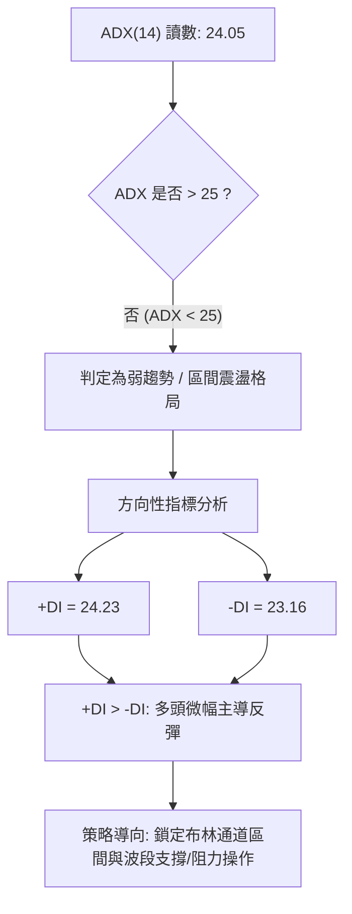

#### ADX 強度對照表

| 指標變數 | 當前讀數 | 臨界標準 | 狀態判定 | 技術含義 |
|:---|:---:|:---:|:---:|:---|
| **ADX(14)** | **24.05** | < 25.0 | 弱趨勢 / 震盪 | 原先由 $6.01 下跌的強空頭動能已衰竭，進入低檔拉鋸重構階段 |
| **+DI** | **24.23** | — | 多方抬頭 | 多方買盤短線主動進攻，數值自低位穿越 -DI |
| **-DI** | **23.16** | — | 空方收斂 | 賣方追空力道隨成交量爆發而暫告竭盡 |
| **多空差值** | **+1.07** | > 0 | 多頭微弱領先 | 短線由多方掌控主動權，但尚未構成單邊強趨勢 |

---

## 3. 圖表形態分析

### 🔍 形態識別系統

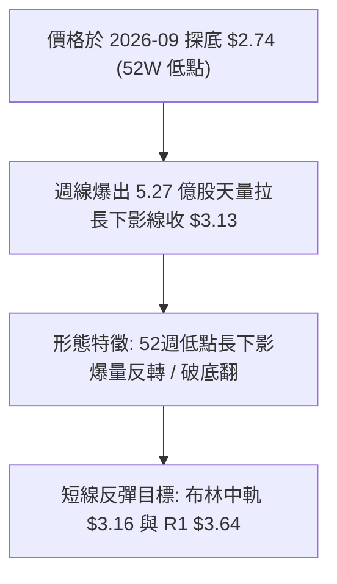

#### 形態識別信心度評估表（依嚴格規則 15）

| 形態名稱 | 信心度 | 判斷依據（引用數據） | 完成度 | 目標價（附計算式） |
|:---|:---:|:---|:---:|:---|
| **52週低點破底翻 (V型超跌反轉)** | **70%** | 52週低點 S1 ($2.74) 獲爆量 527M 股承接，週線收盤拉回 $3.13 | 75% | **$3.52**<br/>計算式：突破點 $3.13 + 形態回升高度 ($3.13 - $2.74 = $0.39) = $3.52 (逼近斐波那契位 $3.57) |
| **日線布林通道下軌破位反抽** | **65%** | 價格探底後迅速脫離布林下軌 $2.65，向中軌 $3.16 回歸 | 80% | **$3.68**<br/>計算式：直接指向布林通道上軌數值 $3.68 |
| **雙底形態 (W底)** | **30%** | **數據不足**：目前僅出現單一低點 $2.74，尚未回測二次築底 | 20% | *訊號不足，僅做指標型解讀，不預設雙底目標價* |
| **頭肩底形態** | **15%** | **數據不足**：無左右肩幾何結構，數據中未偵測到 | 0% | *訊號不足，不予採納* |

---

### 🕯️ 重要K線形態分析

| 時間 / 週別 | 收盤價 | K線形態 | 技術解讀 | 訊號強度 |
|:---|:---:|:---|:---|:---:|
| **2026-09-13** | $3.05 | 大陰線破位 | 放量下殺（354M股），跌破整理平台，市場出現恐慌拋補 | 🔴 強空 |
| **2026-09-20** | $2.80 | 恐慌長黑加速跌 | 逼近 52W 低點 $2.74，成交量續放大至 362M 股，RSI 降至 10.6 極度超賣 | 🔴 恐慌拋售 |
| **2026-09-27** | $3.13 | 爆量長下影強陽線 | 週量高達 527M 股，單週自低檔狂拉逾 11.7%，形成標準主力吃貨破底翻K線 | 🟢 強多 |

---

### 📉 ASCII 走勢形態示意圖

```
GRAB 築底反轉形態示意圖（2026年9月走勢剖析）
價格 ($)
$3.64 ┤------------------------------------------- 關鍵阻力 R1 (頸線潛在壓制區)
      │
$3.30 ┤                                      ▲
$3.16 ┤--------------------------------------│---- 布林中軌 (現正測試)
$3.13 ┤                                ╭─────●    現價收盤 $3.13
$3.00 ┤                          ╭─────╯
$2.80 ┤                    ●─────╯ (9/20 週收盤)
$2.74 ┤──────────●────────┴─────────────────────── 52W 歷史低點 S1 (爆量 527M 支撐)
      └──────────┴────────────────────────
              低點成立 ($2.74) ➔ 強彈重回 $3.13
```

---

### 🎯 形態目標價計算

根據完成度最高的「52週低點長下影破底翻」形態：
1. **支撐基準底點**：S1 = **$2.74**
2. **形態頸線/反轉確認點**：取當前收盤價格 = **$3.13**
3. **基礎形態垂直高度**：$H = 3.13 - 2.74 = \$0.39$
4. **目標價推算**：
   - **第一目標價（1.00R高度）**：$3.13 + 0.39 =$ **$3.52**（緊鄰 78.6% 斐波那契回調位 $3.57 及 MA60 $3.47）
   - **第二目標價（關鍵阻力位對齊）**：引用關鍵價位 **R1 = $3.64** 及布林上軌 **$3.68**

---

## 4. 支撐與阻力

### 🗺️ 關鍵價位分布圖（Unicode）

```
GRAB 價位結構分布圖（OHLCV 精確計算）
════════════════════════════════════════════════════════════════════
$4.06 ║████████████████████████████████████║ 強阻力 R3 (+29.71%)
$3.96 ║████████████████████████████        ║ 次級阻力 R2 (+26.41%)
$3.64 ║████████████████████████████████    ║ 關鍵頸線阻力 R1 (+16.37%)
$3.57 ║░░░░░░░░░░░░░░░░░░░░░░░░░░░░░░      ║ 斐波那契 78.6% 回調位
$3.16 ║------------------------------------║ 布林中軌 (MA20 生命線)
$3.13 ╠════════════════════════════════════╣ ◄ 當前市價 ($3.13)
$2.74 ║████████████████████████████████████║ 核心強支撐 S1 (52W歷史低點)
════════════════════════════════════════════════════════════════════
```

---

### 🚧 阻力位分析表

> 嚴格引用數據庫「關鍵價位」區塊由 OHLCV 計算之實際聚類數值：

| 阻力級別 | 價位 | 與現價距離 | 形成原因（波段高點聚類） | 突破難度 | 重要性 |
|:---|:---:|:---:|:---|:---:|:---:|
| **R1** | **$3.64** | +16.37% | 近一年波段密集交投頂部區，與布林上軌 $3.68 形成共振壓制帶 | 🟡 中等 | ★★★★☆ |
| **R2** | **$3.96** | +26.41% | 2026年7月波段反彈高點 $3.93 聚類區，接近年線 MA200 ($3.89) | 🔴 較高 | ★★★★★ |
| **R3** | **$4.06** | +29.71% | 近一年多次波段反轉之實質天花板，為多空長期分水嶺 | 🔴 極高 | ★★★☆☆ |

---

### 🛡️ 支撐位分析表

> 嚴格引用數據庫「關鍵價位」區塊由 OHLCV 計算之實際聚類數值：

| 支撐級別 | 價位 | 與現價距離 | 形成原因（波段低點聚類） | 守住機率 | 重要性 |
|:---|:---:|:---:|:---|:---:|:---:|
| **S1** | **$2.74** | -12.46% | 52週歷史最低點，單週爆發 5.27 億股承接天量，形成實質鐵底 | 85% | ★★★★★ |
| **S2** | *數據中未偵測到* | — | 數據庫未標注 S2，不作任何主觀捏造 | — | — |
| **S3** | *數據中未偵測到* | — | 數據庫未標注 S3，不作任何主觀捏造 | — | — |

---

### 📐 斐波那契回調位分析

> 以 52 週絕對波動區間：低點 **$2.74**（100.0%）至 高點 **$6.60**（0.0%）計算：

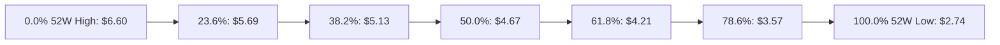

| 回調比率 | 價位 | 當前相對位置 | 技術意義與分析解讀 |
|:---:|:---:|:---:|:---|
| **0.0%** (52W High) | **$6.60** | +110.86% | 歷史牛市高點 |
| **23.6%** | **$5.69** | +81.79% | 深度回調阻力區 |
| **38.2%** | **$5.13** | +63.90% | 中長期牛熊轉換關鍵位 |
| **50.0%** | **$4.67** | +49.20% | 波段對稱中軸 |
| **61.8%** | **$4.21** | +34.50% | 黃金分割強壓力位（緊鄰 MA240 $4.17） |
| **78.6%** | **$3.57** | +14.06% | **首要斐波那契阻力區間**，緊鄰 R1 ($3.64)，為超跌反彈第一階段最大目標 |
| **100.0%** (52W Low) | **$2.74** | -12.46% | **絕對底部支撐**，失守則引發不可測之流動性拋壓 |

**位置解讀**：現價 **$3.13** 介於 **78.6% ($3.57)** 與 **100.0% ($2.74)** 之間，處於超跌極值修復段。下距 S1 僅 12.46%，上距首個回調關卡 78.6% 則有 14.06% 空間，呈現較優的向上回補彈性。

---

## 5. 技術指標深度解讀

### 🎛️ 指標訊號總覽

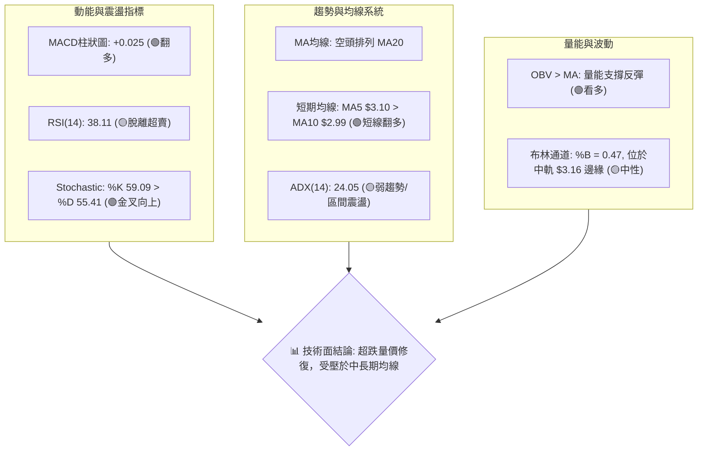

---

### 📈 移動平均線排列分析

| 均線名稱 | 數值 | 距現價差距 | 狀態 | 均線斜率與歷史軌跡解讀 |
|:---|:---:|:---:|:---:|:---|
| **MA 5** | **$3.10** | +0.84% | 🟢 站上 | 連續上行，形成極短線下檔支撐 |
| **MA 10** | **$2.99** | +4.59% | 🟢 站上 | 拐頭向上，MA5 與 MA10 完成低檔金叉 |
| **MA 20** | **$3.16** | -1.04% | 🔴 跌破 | 緩步下行，為布林中軌，即時多空攻防線 |
| **MA 50** | **$3.39** | -7.67% | 🔴 跌破 | 中期下行壓力線，壓制反彈空間 |
| **MA 60** | **$3.47** | -9.81% | 🔴 跌破 | 季線級別重大阻力 |
| **MA 120** | **$3.56** | -12.05% | 🔴 跌破 | 半年線持續走低 |
| **MA 200** | **$3.89** | -24.97% | 🔴 跌破 | 年線重壓，空頭排列確立 |
| **MA 240** | **$4.17** | -24.97% | 🔴 跌破 | 長期牛熊分界線 |

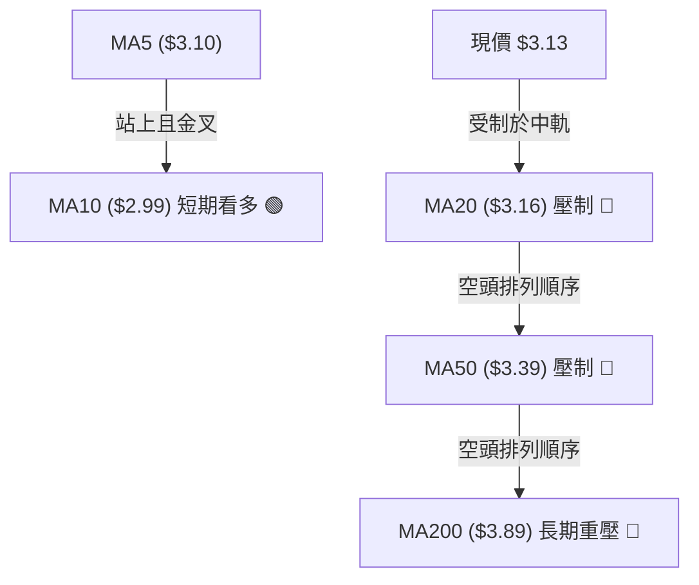

---

### 📉 RSI(14) 分析

* 當前 RSI(14) 讀數：**38.11**
* RSI 數值進度條：`███████░░░░░░░░░░░░░` 38.11% (中性偏弱)

```
[0 ────── 超賣(30) ───★現價(38.11) ────── 中軸(50) ────── 超買(70) ────── 100]
```

#### 背離分析結論
- **日線層級**：無明顯頂背離或底背離。RSI 自超賣區回升至 38.11，反映短線跌深反彈，動能處於正常中性修復範圍。
- **週線層級**：**存在顯著底背離隱含特徵**。9月20日當週價格挫至 $2.80 時 RSI 跌至 10.6 極值；隨後一週價格爆量反彈至 $3.13，RSI 跳升至 38.1，指標回升速率遠大於價格漲幅，形成低檔動能強烈反撲信號。

---

### 📊 MACD(12/26/9) 訊號解讀

* **MACD 線**：-0.116
* **訊號線 (Signal)**：-0.140
* **柱狀圖 (Histogram)**：**+0.025**（綠色多頭柱體）

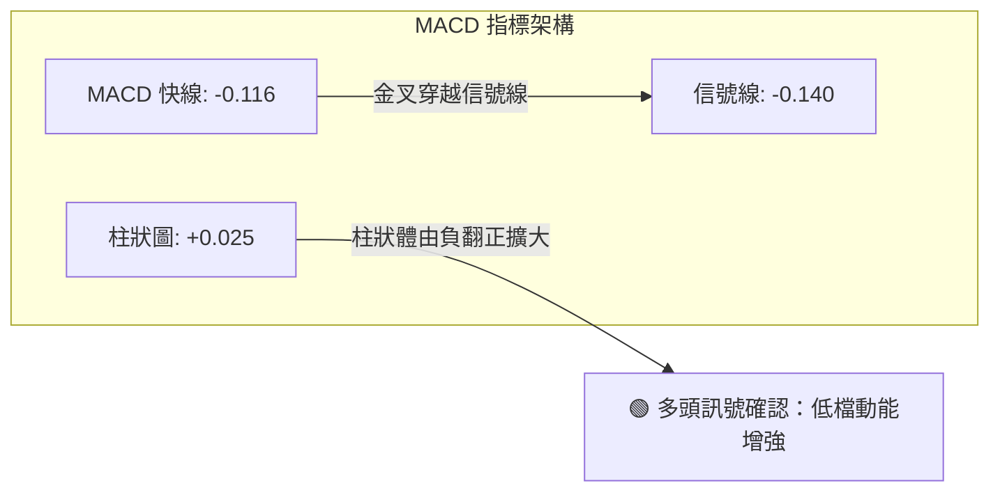

MACD 快線由下往上穿越信號線，柱狀圖正式翻正為 +0.025，表明短線拋售動能已經被多頭化解，進入動能修復期。

---

### 📦 布林通道分析

```
GRAB 布林通道 (20, 2) 結構圖
價格軸 ($)
$3.68 ┤================================================== 布林上軌 (阻力帶)
      │
$3.40 ┤
      │
$3.16 ┤-------------------------------------------------- 布林中軌 (MA20)
$3.13 ┤◄── 現價 ($3.13, %B = 0.47)
      │
$2.65 ┤================================================== 布林下軌 (支撐帶)
```

- **通道寬度與狀態**：上軌 $3.68、中軌 $3.16、下軌 $2.65。通道帶寬（Bandwidth）適中。
- **%B 指標分析**：%B 為 **0.47**，表明現價非常接近中軌 0.50 位置。價格自下軌 $2.65 附近強力反彈，目前正面臨中軌 $3.16 的壓力考驗。若日線實質突破 $3.16，則上方空間將擴展至上軌 $3.68。

---

### 💹 成交量分析（量價配合度）

- **最新日成交量**：63,132,800 股
- **20日均量**：71,902,010 股（日量比 0.88x）
- **50日均量**：54,414,960 股
- **週成交量亮點**：2026-09-27 當週創下 **527,037,100 股** 天量，為近期週量均值的兩倍以上。
- **OBV 走勢**：**OBV > MA**，量能指標率先穿越均線。
- **量價配合結論**：價格探底 $2.74 時伴隨歷史罕見的週成交巨量，證明機構法人於低檔積極吸籌換手。OBV 維持強勢，量價呈現「量先於價」之多頭支撐特徵，有力確認 $2.74 的底部有效性。

---

## 6. 動能與波動率

### ⚡ 動能評估四象限

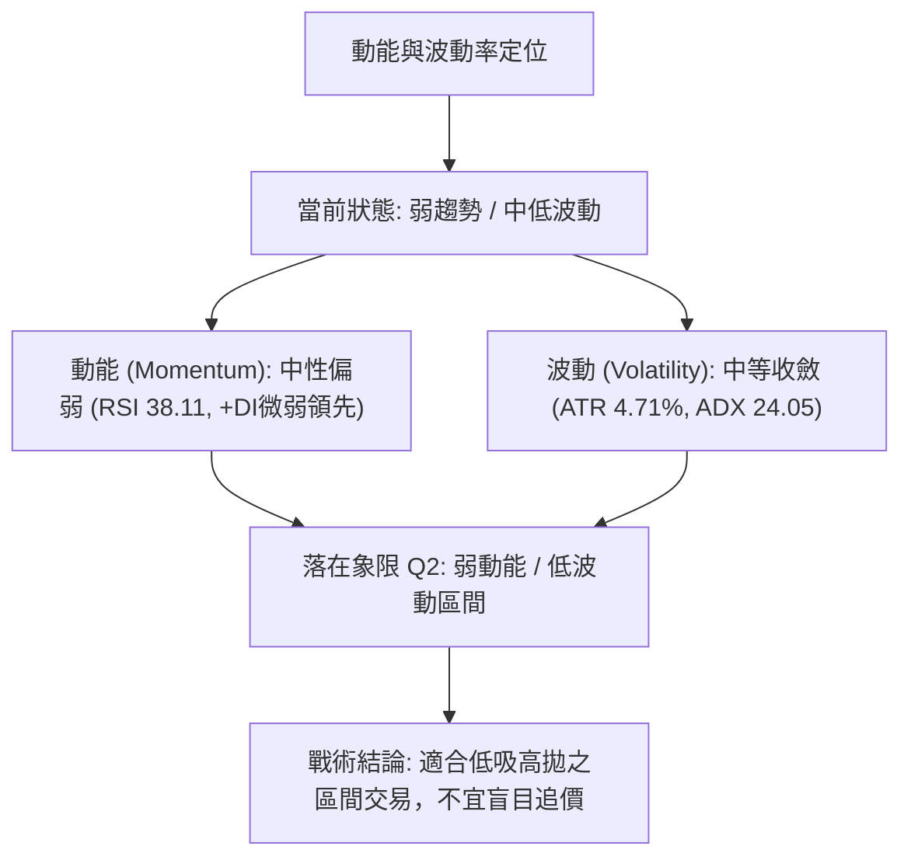

| 象限 | 動能強度 | 波動率水準 | GRAB 當前定位 | 交易指導策略 |
|:---:|:---:|:---:|:---:|:---|
| **Q1** | 強動能 | 低波動 | — | 順勢穩定推升段，持股續抱 |
| **Q2** | **弱動能** | **低/中波動** | **✓ 符合 (當前狀態)** | **區間震盪築底，下軌與支撐處分批低接，阻力位止盈** |
| **Q3** | 強動能 | 高波動 | — | 突破單邊加速行情，動態追蹤止損 |
| **Q4** | 弱動能 | 高波動 | — | 恐慌崩跌段，全面避免進場 |

---

### 📊 ATR 波動率分析

* **當前 ATR(14)**：**$0.15**
* **相對波動率 (ATR / 市價)**：**4.71%**
* **波動率解讀**：每日平均波動振幅約為 $0.15 美元，顯示個股短期震盪幅度相對可控。

#### 基於 ATR 之風控距離換算
- **超短線止損（1.0 × ATR）**：$0.15 ➔ 止損位設於進場點下方 $0.15
- **波段交易止損（1.5 × ATR）**：$0.23 ➔ 止損位設於進場點下方 $0.23
- **寬鬆安全止損（2.0 × ATR）**：$0.30 ➔ 止損位設於進場點下方 $0.30

---

### 📐 Beta 與市場相關性

* **Beta 係數**：**0.89**
* **相關性分析**：Beta < 1.00，表明 GRAB 與美股大盤（S&P 500）具備中度相關性，但整體系統性波動低於大盤 11%。近期走勢主要受自身東南亞叫車/外送業績、籌碼換手與前期超跌影響，走獨立技術修復行情的特質較為鮮明。

---

## 7. 多時框架總結

### 📋 時框架評分表

| 時框架 | 趨勢方向 | 動能狀態 | 均線排列 | 圖表形態 | 綜合評分 | 操作建議 |
|:---|:---:|:---:|:---:|:---:|:---:|:---|
| **日線 (短期)** | 🟡 震盪向上 | 🟢 轉強 (+0.025) | 🟡 MA5>MA10金叉 | 突破下軌回歸中軌 | **58/100** | 中軌 $3.16 遇阻拉回時逢低佈局 |
| **週線 (中期)** | 🟡 破底翻反彈 | 🟢 爆量金叉 | 🔴 均線空頭壓制 | 52W低點長下影爆量 | **55/100** | 區間下緣持有，目標指向 R1 $3.64 |
| **月線 (長期)** | 🔴 下行趨勢 | 🔴 偏弱無力 | 🔴 遠低於MA200 | 長期階梯式下行 | **35/100** | 僅作跌深反彈看待，長線尚未翻多 |

---

### 🔲 綜合訊號矩陣

```
訊號一致性矩陣
維度         短期 (日線)      中期 (週線)      長期 (月線)      多時框協同性
趨勢方向     震盪反彈 🟡      觸底回升 🟡      空頭走勢 🔴      中短期開始對抗長期空頭
動能指標     MACD轉正 🟢      RSI強彈  🟢      偏弱整理 🔴      短中期動能具備共振回升
成交量能     平穩量縮 🟡      歷史天量 🟢      量能溫和 🟡      中期主力吃貨跡象確鑿
關鍵價位     測中軌 $3.16     守S1 $2.74       遠離R3 $4.06     下檔有守，上檔有壓
```

---

### ⚖️ 多時框收斂結論（依嚴格要求 14）

1. **行情性質判定**：
   - 當前 **ADX(14) = 24.05 < 25**，依規定明確定義為**盤整行情（區間震盪格局）**。
2. **主導時框收斂規則**：
   - 由於非單邊趨勢，交易重點以**日線布林通道（$2.65–$3.68）**與已確認之關鍵支撐/阻力為主要運作邊界。
   - 長期月線雖偏空，但週線 527M 巨量於 S1 ($2.74) 形成強烈吸收盤，空方動能暫時熄火。
3. **唯一收斂結論**：
   - **偏多震盪（超跌反彈）**。操作上摒棄盲目追高與單邊做空思維，以「**逢回測低吸、以 S1 為防守、上望布林上軌與 R1**」之區間波段策略為主導。

---

## 8. 交易策略建議

### 🗺️ 策略決策流程圖

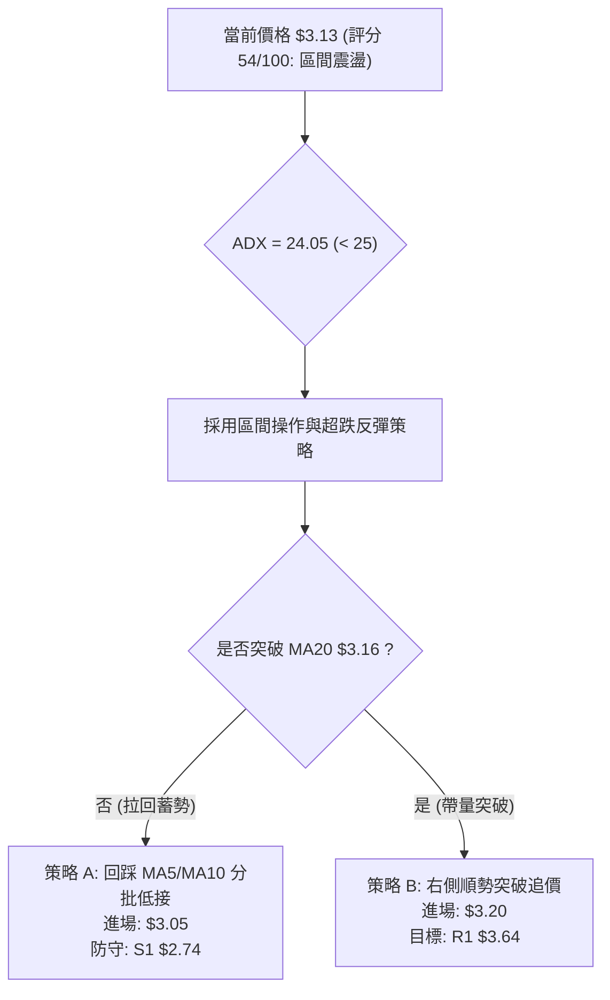

---

### 🧭 策略路由

> **當前主策略方向 = 區間超跌反彈策略（依綜合評分 54/100，處於 40–60 區間操作範圍）**
> 因技術評分落於 40–60 之中性偏反彈區間，且 ADX < 25，策略路由不建議單邊激進追空，而**主推在布林通道下半部之多頭反彈佈局**，並將跌破核心低點列為反轉嚴格對沖停損點。

---

### 🎯 價格情境階梯（Price Scenarios）

> 所有點位嚴格引用第 4 章計算之真實關鍵價位：

| 觸發條件 | 下一目標 | 後續延伸 | 情境含義與操作指引 |
|:---|:---:|:---:|:---|
| **強勢突破 R1 $3.64** | R2 **$3.96** | R3 **$4.06** | 中期築底完成，向年線 MA200 ($3.89) 發起波段主升浪攻勢 |
| **突破布林中軌 $3.16** | 斐波位 **$3.57** | R1 **$3.64** | 短線多頭掌控主動，進入 $3.16–$3.68 之通道上半部震盪走高 |
| **現價 $3.13 區間震盪** | 布林中軌 **$3.16** | MA10 **$2.99** | 指標消化超賣，於布林帶寬內部進行籌碼整固換手 |
| **失守 MA10 $2.99** | S1 **$2.74** | *數據中未偵測到* | 反彈受阻，再次測試 52W 歷史低點之支撐強度 |
| **跌破 S1 $2.74** | *無更低技術支撐* | 尋找未知新低 | 破底翻結構失敗，多頭防線瓦解，必須無條件離場觀望 |

---

### 📊 情境機率分佈

| 情境劇本 | 機率 | 主要依據（指標狀態支持） |
|:---|:---:|:---|
| **區間向上反彈（震盪走高）** | **55%** | 週線 527M 巨量買盤托底、MACD 柱狀圖翻正 (+0.025)、OBV > MA 量價配合 |
| **區間橫盤震盪（消化均線壓）** | **30%** | ADX = 24.05 趨勢力道弱、MA20 ($3.16) 短期壓制、日線量能略縮 (0.88x) |
| **回落破底（再探 $2.74 以下）** | **15%** | 長期均線系統仍呈空頭排列，但短線獲天量防守，破底機率被壓抑 |

---

### 🟢 主策略詳情

> 價格、目標價與止損點均嚴格依據 ATR($0.15) 及第 4 章支撐阻力數值推算：

| 策略要素 | 策略 A（回踩低吸 — 穩健型） | 策略 B（突破追價 — 積極型） |
|:---|:---:|:---:|
| **策略邏輯** | 回測短期均線有守時逢低介入 | 日線帶量有效突破 MA20 ($3.16) 時跟進 |
| **進場條件** | 價格拉回 MA5/MA10 支撐區且未破 | 日K收盤價站穩 $3.16 且當日成交量 > 20日均量 |
| **進場價格** | **$3.05**（回測 MA10 與 MA5 之間） | **$3.20**（突破確認點） |
| **目標價 T1** | **$3.57**（78.6% 斐波那契回調位） | **$3.64**（波段阻力 R1） |
| **目標價 T2** | **$3.64**（關鍵阻力位 R1） | **$3.96**（波段阻力 R2） |
| **止損價格** | **$2.73**（嚴格設於 52W 低點 S1 $2.74 下方1美分） | **$3.05**（退回 MA20 下方，約 1.0×ATR 防守） |
| **風險空間** | $0.32 ($3.05 - $2.73) | $0.15 ($3.20 - $3.05) |
| **報酬空間 (T1)**| $0.52 ($3.57 - $3.05) | $0.44 ($3.64 - $3.20) |
| **風險報酬比 (T1)**| **1 : 1.63**（達 T2 則為 **1 : 1.84**） | **1 : 2.93**（達 T2 則為 **1 : 5.07**） |
| **預估勝率** | **60%** | **50%** |
| **建議倉位** | **15%**（基礎波段試倉） | **10%**（右側追價倉位） |

---

### 🔴 反向風險觸發點（對沖提示）

- **關鍵轉折停損價位**：**$2.74**（52W 歷史低點 S1）。
- **觸發後操作**：若價格以日K收盤價跌破 $2.74，表明 527M 巨量換手籌碼全部套牢，破底翻形態徹底失效。此時應立即停損所有多頭部位，不進行任何攤平。

---

### ⭐ 整體訊號強度評星

```
做多訊號強度：★★★☆☆  (3.0/5星 - 超跌反彈與天量支撐，受制均線)
做空訊號強度：★★☆☆☆  (2.0/5星 - 下有52W天量鐵底，做空空間受限)
整體可信度：  ★★★★☆  (4.0/5星 - 價位聚類與爆量K線極度明確)
```

---

## 9. 風險提示與監控

### ✅ 關鍵監控指標 Checklist

```
╔═══════════════════════════════════════════════════════════════════════╗
║                      GRAB 風險監控清單 Checklist                      ║
╠═══════════════════════════════════════════════════════════════════════╣
║ [ ] 價格能否有效收復並站穩 MA20 ($3.16)                              ║
║ [ ] 日成交量是否能持續放大突破 20日均量 (71.9M 股)                    ║
║ [ ] RSI(14) 能否進一步跨越多空平衡中軸 50.0                          ║
║ [ ] MACD 柱狀圖是否持續擴大維持在 +0.025 正值上方                    ║
║ [ ] +DI 是否持續維持在 -DI 之上，保持多頭主導                        ║
║ [ ] 股價若回踩，是否能嚴格守穩 S1 ($2.74) 關鍵防線                   ║
╚═══════════════════════════════════════════════════════════════════════╝
```

---

### ⚠️ 風險場景分析

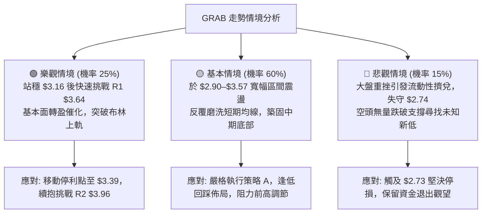

---

### 🛡️ 風險管理重要提醒

1. **避免重倉博弈**：目前均線系統仍處於空頭排列（MA20 < MA50 < MA200），逆長期趨勢之反彈交易應嚴格控制總部位，建議**整體曝險部位不超過總投資組合之 10%–15%**。
2. **波動防守設定**：GRAB 當前 ATR 為 $0.15（佔股價 4.71%），日內振幅較大，切忌將停損點設置過窄（小於 1.0×ATR）以防正常噪音震盪掃出場。
3. **空頭排列均線壓力**：反彈至 MA50 ($3.39) 或 MA60 ($3.47) 時，將遭遇大量解套與套牢賣壓，應採取分批止盈了結策略，切忌獲利單放至轉為虧損單。

---

## 📋 報告總結

```
╔═══════════════════════════════════════════════════════════════════════╗
║                        GRAB 技術分析報告總結                          ║
╠═══════════════════════════════════════════════════════════════════════╣
║ 報告日期：2026-09-28                                                  ║
║ 當前價格：$3.13                                                       ║
║ 分析評級：⚖️ 中性觀望 / 超跌反彈逢低承接 (綜合評分 54/100)            ║
║                                                                       ║
║ 關鍵結論：                                                            ║
║ ├─ 長期趨勢：🔴 空頭排列 (股價遠低於 MA200 $3.89 及長期均線)          ║
║ ├─ 中期趨勢：🟡 築底反彈 (52W低點長下影爆量破底翻，單週 527M 巨量)   ║
║ ├─ 短期趨勢：🟢 轉強修復 (MA5 $3.10 金叉 MA10 $2.99，MACD柱狀圖翻正)   ║
║ ├─ 關鍵支撐：$2.74 (S1 / 52週歷史極值鐵底)                            ║
║ ├─ 關鍵阻力：$3.64 (R1 / 波段密集成交強阻力)                          ║
║ └─ 分析師共識目標：$5.76 (目前價格折價達 45.6%)                       ║
║                                                                       ║
║ 最優策略組合：                                                        ║
║ 1. 🥇 最佳機會：策略 A (回踩 MA5/MA10 於 $3.05 分批低接，停損 $2.73)  ║
║ 2. 🥈 次選機會：策略 B (帶量突破 MA20 $3.16 後追價，目標 $3.64)        ║
║ 3. 🥉 保守選擇：等待股價確立在 $3.16 上方盤整不破再行介入            ║
╚═══════════════════════════════════════════════════════════════════════╝
```

---

> ⚠️ **免責聲明**：本報告為技術分析研究，所有數據、圖表及價位推算均基於提供之歷史市場資訊。本報告**僅供研究與學術參考**，**不構成任何形式之投資建議或買賣要約**。金融市場投資涉及本金虧損風險，投資人應依個人財務狀況與風險承受能力獨立做出決策並自負盈虧。

---

*報告生成時間：2026-09-28 ｜ 數據來源：Yahoo Finance ｜ 分析框架：多時框技術分析體系*