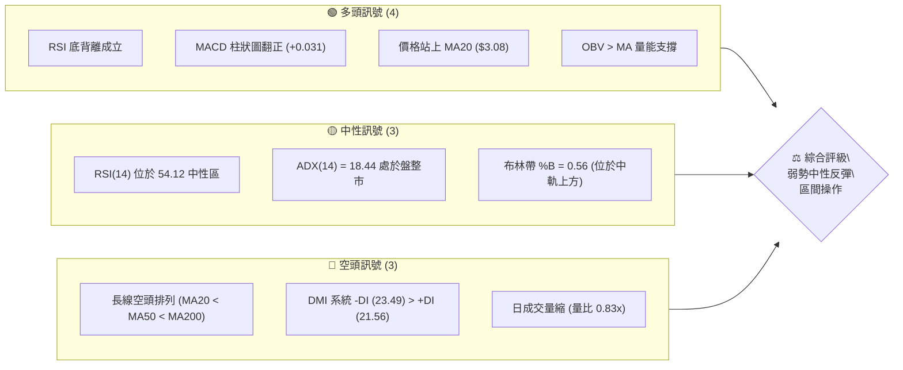
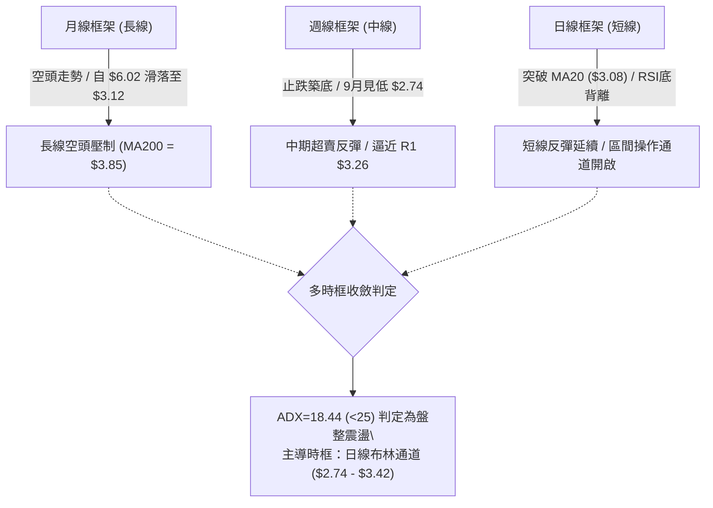
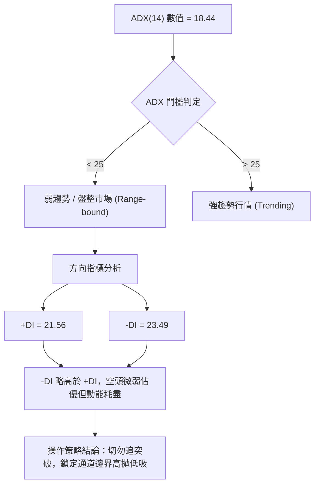
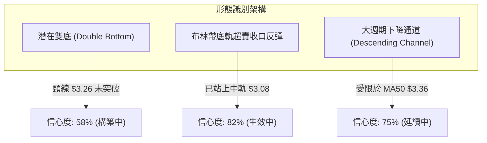
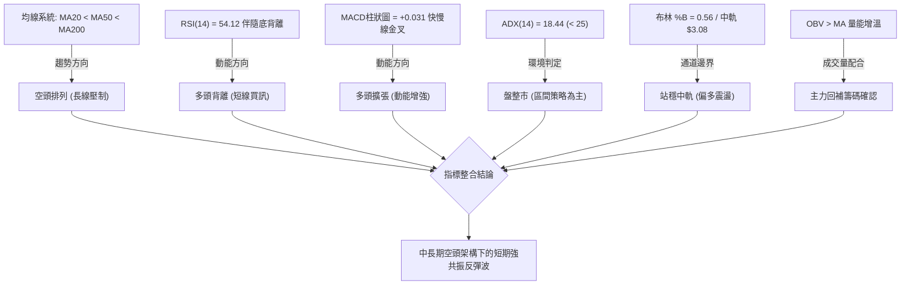
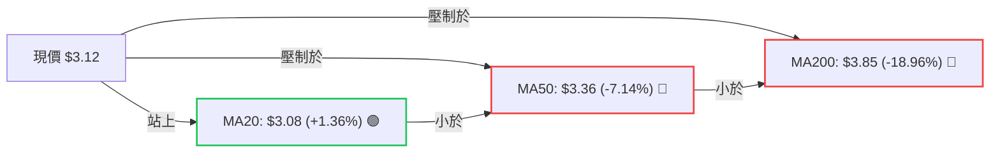
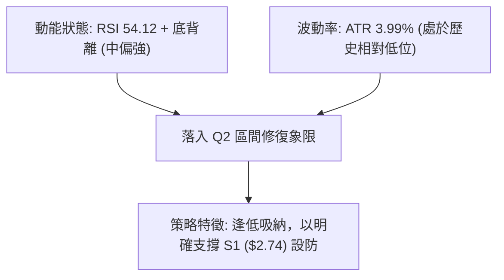
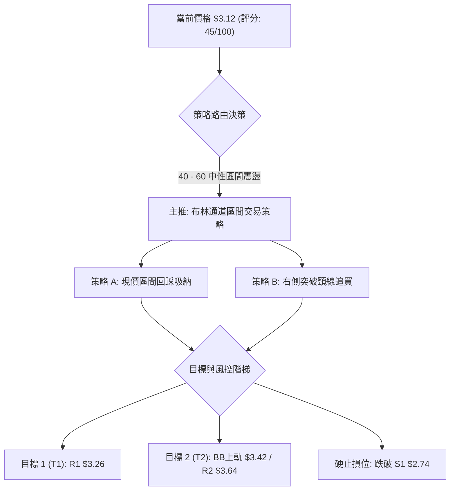
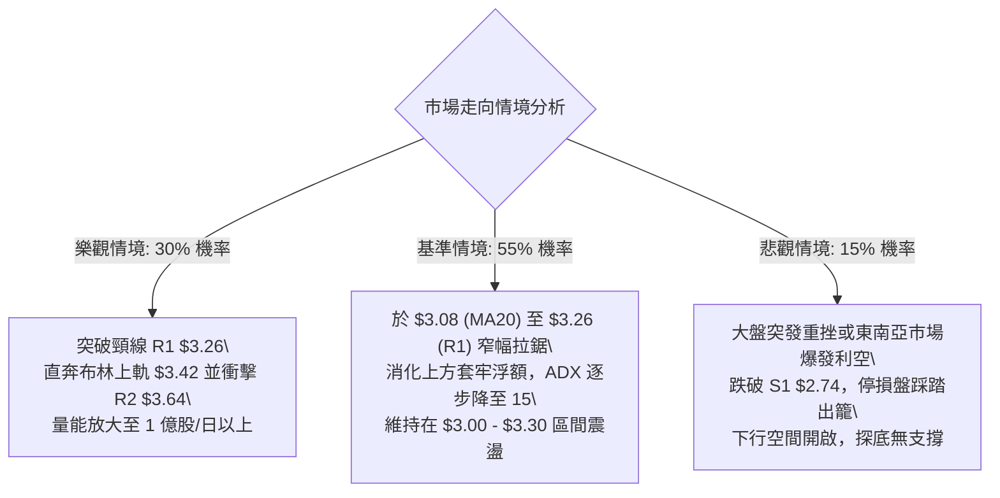

# GRAB 技術分析報告

> **報告日期**：2026-10-02 ｜ **語言**：繁體中文 ｜ **數據來源**：Yahoo Finance ｜ **當前價格**：$3.12

---

## 目錄

| 章節 | 內容 |
|------|------|
| [1. 技術面概覽](#1-技術面概覽) | 訊號儀表板、核心指標、評分卡 |
| [2. 趨勢分析](#2-趨勢分析) | 多時框趨勢、長中短期走勢 |
| [3. 圖表形態分析](#3-圖表形態分析) | 形態識別、K線組合、目標價 |
| [4. 支撐與阻力](#4-支撐與阻力) | 關鍵價位、斐波那契回調 |
| [5. 技術指標深度解讀](#5-技術指標深度解讀) | MA/RSI/MACD/布林/成交量 |
| [6. 動能與波動率](#6-動能與波動率) | 動能評估、ATR、Beta |
| [7. 多時框架總結](#7-多時框架總結) | 時框架評分矩陣 |
| [8. 交易策略建議](#8-交易策略建議) | 多空策略、風險報酬比 |
| [9. 風險提示與監控](#9-風險提示與監控) | 監控指標、風險場景 |

---

## 1. 技術面概覽

### 🎯 技術訊號儀表板



### 📊 核心指標速覽表

| 指標類別 | 指標名稱 | 當前數值 | 訊號 | 解讀 |
|----------|----------|----------|------|------|
| **價格** | 當前價格 | $3.12 | 🟡 | 位於52週區間 9.8% 處，處於絕對底部弱勢反彈階段 |
| **均線** | MA20 | $3.08 | 🟢 | 價格站上短期生命線（+1.36%），短期止跌轉強 |
| **均線** | MA50 | $3.36 | 🔴 | 價格壓制於中期均線下方（-7.14%），中期反壓沉重 |
| **均線** | MA200 | $3.85 | 🔴 | 遠在長期年線下方（-18.96%），長期熊市架構尚未扭轉 |
| **動能** | RSI(14) | 54.12 | 🟢 | 自超賣區脫離進入中性偏多區，伴隨日線底背離結構 |
| **動能** | MACD | -0.080 / -0.111 | 🟢 | 快線由下往上穿越慢線，MACD 柱狀圖收正 +0.031 |
| **波動** | ATR(14) | $0.12 (3.99%) | 🟡 | 波動率處於中低水平，適合設定 ATR 倍數止損 |

### 🏆 技術評分卡

```
╔══════════════════════════════════════════════════════════════╗
║              技術評分卡 — GRAB (2026-10-02)                  ║
╠══════════════════════════════════════════════════════════════╣
║ 趨勢強度      █████░░░░░░░░░░░░░░░  25/100  🔴 強烈偏空      ║
║ 動能指標      █████████████░░░░░░░  65/100  🟢 底背離反彈    ║
║ 支撐穩定度    ████████████░░░░░░░░  60/100  🟡 S1 ($2.74) 守穩║
║ 成交量配合    ██████████░░░░░░░░░░  50/100  🟡 OBV多頭但量縮 ║
║ 形態完整度    ██████████░░░░░░░░░░  50/100  🟡 潛在雙底構築中║
║ 均線排列      ████░░░░░░░░░░░░░░░░  20/100  🔴 空頭完美排列  ║
╠══════════════════════════════════════════════════════════════╣
║ 綜合評分      █████████░░░░░░░░░░░  45/100  🟡 中性區間震盪  ║
╚══════════════════════════════════════════════════════════════╝
```

---

## 2. 趨勢分析

### 🌐 多時框趨勢分析



### 📈 長期趨勢 — 12個月走勢圖（Unicode）

```
GRAB 月線走勢圖（過去12個月：2025-11 至 2026-10）
價格軸 ($)
$6.00 ┤ 
$5.50 ┤ ● (2025-11: 5.45)
$5.00 ┤     ● (2025-12: 4.99)
$4.50 ┤         ● (2026-01: 4.30)
$4.00 ┤             ● (2026-02: 4.22)
$3.50 ┤                     ● (04: 3.82)    ● (06: 3.77)
$3.50 ┤                 ● (03: 3.66)    ● (05: 3.54)    ● (07: 3.50)  ● (08: 3.54)
$3.00 ┤                                                                   ● (09: 3.11) ● (10: 3.12)◄現價
$2.50 ┤                                                                      ● (52W Low: 2.74)
      └─────────────────────────────────────────────────────────────────────────────
        11   12   01   02   03   04   05   06   07   08   09   10  (月份)
```

#### 走勢特徵分析表格

| 階段 | 時間跨度 | 價格區間 | 累積漲跌幅 | 結構特徵 |
|------|----------|----------|------------|----------|
| **主跌浪** | 2025-11 ～ 2026-03 | $5.45 → $3.66 | -32.84% | 單邊下行，均線系統全面空頭發散 |
| **平台整理** | 2026-04 ～ 2026-08 | $3.82 → $3.54 | -7.33% | 於 $3.50 - $3.90 區間進行箱型震盪，多空拉鋸 |
| **二次探底** | 2026-09 ～ 2026-10 | $3.42 → $2.74 → $3.12 | -9.36% | 摜破平台下緣創 52W 新低 $2.74 後爆量急拉收腳 |

### 📊 中期趨勢（週線分析）

中期走勢在 2026 年 9 月經歷了劇烈出清（Capitulation）。週線數據顯示：
- **2026-09-20 週**：價格探底至 $2.80，RSI 暴跌至極端超賣區 10.6，市場出現恐慌性拋售（單週成交量高達 3.62 億股）。
- **2026-09-27 週**：收盤強勁反彈至 $3.13，RSI 回升至 38.1，週成交量放大至 5.27 億股（過去20週歷史天量），確認底部承接買盤進場。
- **2026-10-04 當週**：收盤持穩於 $3.12，RSI 升至 54.1，MACD 柱狀圖由負轉正至 +0.031，形成經典中期底背離雛形。

```
週線支撐阻力結構示意圖
$3.96 ─────────────────────── 週線強阻力 R3 (52W 下跌波段多次受阻處)
         │
$3.64 ───┼─────────────────── 週線阻力 R2 (MA50/60 聚類區間)
         │  ┌───┐
$3.26 ───┼──┤   ├─── 短線阻力 R1 (頸線位置)
         │  │   │
$3.12 ───┼──┴───┴─────────── 現價 ($3.12)
         │
$2.74 ───┴─────────────────── 52W 最低點 / 強支撐 S1
```

### ⚡ 趨勢強度評估（ADX 解讀）



#### ADX 強度對照表

| 指標名稱 | 實際讀數 | 門檻區間 | 市場狀態解讀 |
|----------|----------|----------|--------------|
| **ADX(14)** | **18.44** | 0 ～ 20 | 趨勢極微弱或處於無趨勢的橫盤震盪整理階段 |
| **+DI** | **21.56** | — | 多方買盤意願正逐步回升，但尚未形成統治力 |
| **-DI** | **23.49** | — | 空頭賣壓顯著萎縮，較 9 月中旬大幅降溫 |
| **總結判定** | **弱勢震盪** | ADX < 25 | **依收斂規則 14：不具備單邊趨勢，以日線布林通道為主要交易邊界** |

---

## 3. 圖表形態分析

### 🔍 形態識別系統



#### 形態識別與信心度評估表

| 形態名稱 | 信心度 | 判斷依據（引用數據） | 完成度 | 目標價（附計算式） |
|----------|--------|----------------------|--------|--------------------|
| **日線潛在雙底** | **58%** | 9/20 觸及最低點 $2.74 後反彈，當前企圖於 $3.08 構築右肩底；尚未突破波段阻力 R1 ($3.26) | 70% | 突破頸線 R1 ($3.26) 後推算：<br>形態高度 = $3.26 - $2.74 = $0.52<br>目標價 = $3.26 + $0.52 = **$3.78** (接近 R2 $3.64 與 MA200 $3.85 中樞) |
| **布林中軌收復** | **82%** | 現價 $3.12 成功自下軌 $2.74 脫離並越過中軌 MA20 ($3.08)，%B 由極端低位回升至 0.56 | 100% | 依布林均值回歸理論：目標直指布林上軌 **$3.42** |
| **下降通道整理** | **75%** | 過去半年高點受制於 MA60 ($3.42)，低點延展至 $2.74，均線保持空頭排列 | 85% | 通道反彈上限受阻於 R1 ($3.26) ～ MA50 ($3.36) |

### 🕯️ 重要K線形態分析

| 週/月份 | 收盤價 | K線形態 | 解讀 | 訊號 |
|---------|--------|---------|------|------|
| **2026-09-20 週** | $2.80 | 長下影錘頭陰線 (Hammer/Spike) | 觸及 52W 新低 $2.74 後大幅收腳，單週爆量 3.62 億股，主力洗盤誘空確認 | 🟢 底背離確立 |
| **2026-09-27 週** | $3.13 | 爆量長陽線吞噬 (Bullish Engulfing) | 單週飆出 5.27 億股歷史天量，實體陽線包覆前週實體，資金強烈回補 | 🟢 多頭吞噬確立 |
| **2026-10-04 當週** | $3.12 | 縮量十字線 (Doji Consolidation) | 消化前週長陽獲利回吐賣壓，量能降至 2.72 億股，於 MA20 ($3.08) 上方強勢橫盤 | 🟡 多空蓄勢待變 |

### 📉 ASCII 走勢形態示意圖

```
GRAB 潛在「雙重底 / 破底翻」形態示意圖
價位 ($)
$3.64 ┼                                                       [阻力 R2]
      │
$3.42 ┼ - - - - - - - - - - - - - - - - - - - - - - - - - - - [BB上軌 / MA60]
      │
$3.26 ┼ - - - - - - - - - - - - - 頸線 (Neckline / R1) - - - - [反轉確認點]
      │                           ╭──────╮
$3.12 ┼..........................│......│..● 現價 ($3.12)
      │          ╭───╮           │      ╰─── 右底構築 ($3.08)
$3.08 ┼ - - - - -│- -│- - - - - -│- - - - - - - - - - - - - - [MA20 / BB中軌]
      │          │   │           │
$2.80 ┼          │   ╰─────╮     │
      │          │         │     │
$2.74 ┼──────────╯         ╰─────╯─────────────────────────── [左底 S1: 52W Low]
      └─────────────────────────────────────────────────────────────► 時間
                  2026-09-20   2026-09-27   2026-10-02
```

### 🎯 形態目標價計算

根據雙重底結構理論，若後續多頭動能放量突破頸線位阻力 R1 ($3.26)：
1. **基底測量**：
   - 形態頸線價位：$3.26（近一年波段高點聚類阻力 R1）
   - 形態底部價位：$2.74（52週波段低點支撐 S1）
   - 形態垂直高度 $H = \$3.26 - \$2.74 = \$0.52$
2. **第一目標價 (T1)**：
   - 斐波那契 78.6% 回調位與 MA60 匯聚區：**$3.42 ～ $3.57**
3. **第二目標價 (T2 / 完全對稱投射)**：
   - 公式：$\text{頸線價位} + H = \$3.26 + \$0.52 = \mathbf{\$3.78}$
   - 該價位緊鄰阻力位 R2 ($3.64) 與 MA200 ($3.85)，具備強烈技術阻力共振。

---

## 4. 支撐與阻力

### 🗺️ 關鍵價位分布圖（Unicode）

```
GRAB 價位結構分布圖
══════════════════════════════════════════════════════════════════
$6.60 ║████████████████████████████████║ 52W High (0.0% Fib)
$5.69 ║████████████████████            ║ 23.6% Fib
$5.13 ║████████████████                ║ 38.2% Fib
$4.67 ║████████████                    ║ 50.0% Fib
$4.21 ║████████████████                ║ 61.8% Fib
$3.96 ║████████████████████████████    ║ 強阻力 R3 (+26.82%)
$3.85 ║████████████████                ║ MA200 (長期牛熊分水嶺)
$3.64 ║████████████████████            ║ 阻力 R2 (+16.75%)
$3.57 ║████████████                    ║ 78.6% Fib
$3.42 ║████████████████                ║ 布林通道上軌 / MA60
$3.26 ║████████████████████████        ║ 關鍵阻力 R1 (+4.49%)
$3.12 ╠════════════════════════════════╣ ◄ 現價 ($3.12)
$3.08 ║▓▓▓▓▓▓▓▓▓▓▓▓▓▓▓▓▓▓▓▓▓▓▓▓        ║ 短期生命線 MA20 / 布林中軌
$2.74 ║████████████████████████████████║ 52W Low / 唯一強支撐 S1 (-12.18%)
══════════════════════════════════════════════════════════════════
```

### 🚧 阻力位分析表

所有阻力數值嚴格引用自數據庫聚類結果：

| 阻力級別 | 價位 | 形成原因 | 突破難度 | 重要性 |
|----------|------|----------|----------|--------|
| **R1** | **$3.26** | 近一年波段高點聚類點；短線反彈頸線阻力；+4.49% 漲幅處 | 🟡 中等（需補量至 20 日均量以上） | ★★★★☆ |
| **R2** | **$3.64** | 近一年波段密集籌碼成交密集峰；+16.75% 漲幅處 | 🔴 較高（空方中期防守堡壘） | ★★★★☆ |
| **R3** | **$3.96** | 52週多輪反彈頂部聚類；逼近年線壓力；+26.82% 處 | 🔴 極高（長期結構逆轉點） | ★★★★★ |

### 🛡️ 支撐位分析表

所有支撐數值嚴格引用自數據庫聚類結果：

| 支撐級別 | 價位 | 形成原因 | 守住機率 | 重要性 |
|----------|------|----------|----------|--------|
| **S1** | **$2.74** | 52週歷史低點；布林通道下軌極限；9月天量長腳支撐點；-12.18% 處 | 🟢 高（短期多方最後底線，80%） | ★★★★★ |
| **S2 / S3** | *數據中未偵測到* | 數據庫未列出更低之 OHLCV 聚類支撐點，若跌破 $2.74 將進入未測價格真空區 | — | — |

### 📐 斐波那契回調位分析

依據 52 週波動區間（高點 $6.60 → 低點 $2.74，波幅 $3.86）計算之黃金分割水準解析：

```
斐波那契回調位刻度
$6.60 ├───────────────────────── 0.0% (52W High)
$5.69 ├───────────────────────── 23.6% 回調位
$5.13 ├───────────────────────── 38.2% 回調位
$4.67 ├───────────────────────── 50.0% 中軸平衡位
$4.21 ├───────────────────────── 61.8% 黃金分割強阻力
$3.57 ├───────────────────────── 78.6% 極限回調位
$3.12 ├─── ◄ 現價位置（處於 78.6% 與 100.0% 之間）
$2.74 ├───────────────────────── 100.0% (52W Low)
```

- **位置意義**：現價 $3.12 處於 **78.6% ($3.57)** 與 **100.0% ($2.74)** 之間的極深回撤區。
- **解讀**：股價回調超過 78.6%，代表長期空頭徹底摧毀了前期的上漲結構。然而，當股價在 100% 斐波那契位 ($2.74) 獲得爆量驗證並出現底背離時，代表該價位具備強烈的非對稱反彈價值；反彈首要阻力將測試 78.6% 位 ($3.57)。

---

## 5. 技術指標深度解讀

### 🎛️ 指標訊號總覽



### 📈 移動平均線排列分析



#### 均線階梯監控表

| 均線期數 | 當前價位 | 乖離率 (%) | 排列狀態 | 走勢趨向特徵 |
|----------|----------|------------|----------|--------------|
| **MA 5** | $3.11 | +0.16% | 🟢 多頭收復 | 極短期向上微勾，提供日內動態支撐 |
| **MA 10** | $3.08 | +1.43% | 🟢 多頭收復 | 向上金叉 MA20，短天期多頭排列確立 |
| **MA 20** | $3.08 | +1.36% | 🟢 多頭收復 | 短線多空分水嶺，由阻力正式轉為下檔支撐 |
| **MA 60** | $3.42 | -8.77% | 🔴 空頭壓制 | 陡峭下行，與布林上軌重疊於 $3.42 形成強阻力 |
| **MA120** | $3.54 | -11.90% | 🔴 空頭壓制 | 半年線持續下壓，限制反彈極限 |
| **MA240** | $4.13 | -24.37% | 🔴 空頭壓制 | 長期超強阻力區，空頭大本營 |

### 📉 RSI(14) 分析

- **當前數值**：**54.12**
- **數值進度條**：
  ```
  [超賣 0] ────────── [30] ─────●───── [70] ────────── [超買 100]
  動能強度：███████████░░░░░░░░░  54.12% (中性偏強)
  ```
- **背離診斷**：**⚠️ 日線/週線底背離 (Bullish Divergence) 明確成立**
  - **價格行為**：9月20日價格跌破前低收在 $2.80（最低點觸及 $2.74），創下 52 週新低。
  - **RSI 行為**：9月20日 RSI 下探至 10.6 極度超賣後迅速拉升，至 10月04日收盤已飆升至 54.12，高於 8月下旬水準，形成標準且強烈的「低點不破前低、指標大幅墊高」底背離形態。

### 📊 MACD(12/26/9) 訊號解讀


- **狀態解讀**：快線 (-0.080) 高於訊號線 (-0.111)，柱狀圖讀數為 **+0.031**。這標誌著 MACD 在負值區完成了強勢黃金交叉。零軸下方的金叉通常代表強烈的跌深均值回歸行情啟動。

### 📦 布林通道分析

```
GRAB 布林通道 (Bollinger Bands 20, 2) 示意圖
$3.42 ┬──────────────────────────────────────────── BB 上軌 (Upper Band)
      │
$3.26 ┼ - - - - - - - - - - - - - - - - - - - - - - 阻力位 R1
      │
$3.12 ┼════════════════════════════════════════════ 現價 ($3.12, %B = 0.56)
      │
$3.08 ┼──────────────────────────────────────────── BB 中軌 (MA20 Baseline)
      │
$2.74 ┴──────────────────────────────────────────── BB 下軌 (Lower Band) / 52W Low
```

- **當前 %B 讀數**：**0.56**（價格略高於中軌 0.50 位置，擺脫下軌風險區）。
- **帶寬特徵**：上下軌帶寬為 $\$3.42 - \$2.74 = \$0.68$。通道開口開始收斂，顯示暴跌後的震盪沉澱，當前走勢正由下軌向上軌推進。

### 💹 成交量分析（量價配合度）

```
量價關係矩陣
  價升量增 (9/27 週: 5.27億股) ──► 主力積極建倉回補 🟢
  價平量縮 (10/4 週: 2.72億股) ──► 浮額沉澱，無大幅拋壓 🟢
  OBV 趨勢 ─────────────────────► OBV > MA，量能領先突破 🟢
```

- **成交量數據**：最新單日成交量為 65,741,900 股，低於 20 日均量 78,815,770 股（量比 0.83x），但高於 50 日均量 56,825,886 股。
- **OBV（能量潮）分析**：數據顯示 **OBV > MA**。此為關鍵看多訊號，說明雖然日成交量有所萎縮，但近期的資金淨流向為正，大資金在 9 月下旬巨量換手後未見撤出跡象，量價結構支持短期反彈。

---

## 6. 動能與波動率

### ⚡ 動能評估四象限

| 象限標籤 | 動能狀態 | 波動率狀態 | GRAB 當前定位 | 策略解讀 |
|----------|----------|------------|---------------|----------|
| **Q1：突破主升** | 高動能 | 高波動 | — | 追隨趨勢，順勢加碼 |
| **Q2：區間修復** | 轉強動能 (RSI 54) | 低波動 (ATR 3.99%) | **● 當前落點 (Q2)** | **風險收益比最佳；低吸高拋，鎖定通道操作** |
| **Q3：劇烈洗盤** | 弱動能 | 高波動 | — | 嚴設寬止損，輕倉應對 |
| **Q4：單邊陰跌** | 弱動能 | 低波動 | 過去數月歷史落點 | 徹底觀望，禁止進場 |



### 📊 ATR 波動率分析

- **ATR(14) 數值**：**$0.12**（佔股價比例為 **3.99%**）。
- **波動特徵**：GRAB 目前處於日均波幅約 12 美分的相對冷靜期，已擺脫 9 月下旬單週暴跌 40 美分以上的極端恐慌波動。
- **止損距離建議**：
  - **保守型（短線交易）**：1.5 × ATR = $1.5 \times \$0.12 = \mathbf{\$0.18}$
  - **標準型（波段交易）**：2.0 × ATR = $2.0 \times \$0.12 = \mathbf{\$0.24}$
  - **結構型（保護性止損）**：直接以跌破 S1 ($2.74) 為標準，現價至 S1 距離為 $\$3.12 - \$2.74 = \$0.38$（約 3.16 × ATR）。

### 📐 Beta 與市場相關性

- **Beta 數值**：**0.89**
- **市場屬性**：Beta < 1.0，表明該股對美股大盤（S&P 500）的系統性波動敏感度低於平均水準。
- **非系統性風險特徵**：近期 GRAB 的弱勢主要源自東南亞本地市場競爭、外賣與叫車利潤率壓縮等公司及產業特有因素，大盤波動對其干擾相對較小，技術面更多受自身籌碼結構主導。

---

## 7. 多時框架總結

### 📋 時框架評分表

| 時框架 | 趨勢方向 | 動能狀態 | 均線排列 | 形態結構 | 綜合評分 | 操作建議 |
|--------|----------|----------|----------|----------|----------|----------|
| **月線 (長期)** | 🔴 偏空下行 | 🔴 弱勢超賣 | 🔴 空頭排列 | 單邊下跌探底 | 25 / 100 | 長期投資者暫宜觀望，靜待年線走平 |
| **週線 (中期)** | 🟡 止跌盤整 | 🟢 背離回升 | 🔴 均線反壓 | 爆量長腳收復 | 50 / 100 | 左側波段資金可開始分批逢低布局 |
| **日線 (短期)** | 🟢 震盪反彈 | 🟢 MACD金叉 | 🟡 站上 MA20 | 雙底雛形構築 | 65 / 100 | 具備優良短線交易機會，依布林軌道操作 |

### 🔲 綜合訊號矩陣

```
時框架訊號交叉驗證表
┌──────────┬────────────┬────────────┬────────────┬────────────┐
│ 時框維度 │ 均線訊號   │ 動能訊號   │ 量價訊號   │ 形態結論   │
├──────────┼────────────┼────────────┼────────────┼────────────┤
│ 短期日線 │ 🟢 偏多    │ 🟢 看多    │ 🟡 中性    │ 🟢 偏多    │
│ 中期週線 │ 🔴 偏空    │ 🟢 看多    │ 🟢 看多    │ 🟡 中性    │
│ 長期月線 │ 🔴 偏空    │ 🔴 偏空    │ 🟡 中性    │ 🔴 偏空    │
└──────────┴────────────┴────────────┴────────────┴────────────┘
```

### ⚖️ 多時框收斂結論

**嚴格依據規則 14 進行訊號收斂**：
1. **行情類型判定**：當前趨勢強度指標 **ADX(14) = 18.44 (< 25)**，明確宣告目前市場**並非單邊趨勢行情，而是處於超跌後的「區間震盪／盤整修復」行情**。
2. **主導時框與交易邊界**：依收斂規則，盤整行情中中長期的空頭均線壓制暫退居次要地位，市場由**日線布林通道（下軌 $2.74 ～ 上軌 $3.42）**主導交易區間。
3. **收斂方向性結論**：**中性偏多（區間反彈波）**。
   - 儘管週線/月線均線呈現空頭排列，但日線與週線的 **RSI 底背離、MACD 金叉翻正以及 OBV 多頭排列** 形成了極強的短中期反彈共振。
   - 結論方向完全與後續交易策略一致：**在 $2.74 不破的前提下，主推逢低做多至布林上軌及阻力位 R1/R2 的波段反彈策略**。

---

## 8. 交易策略建議

### 🗺️ 策略決策流程圖



### 🧭 策略路由（依評分卡分流）

> **當前主策略方向 = 中性區間偏多操作（依綜合評分 45/100）**
> 
> 評分落在 40–60 區間，ADX 確立盤整市場。策略核心為**以 S1 ($2.74) 為防守底線，利用布林帶與關鍵阻力位展開區間修復交易**，切忌追高，主推「逢拉回支撐布局」與「突破關鍵阻力順勢加碼」。

### 🎯 價格情境階梯（Price Scenarios）

價位嚴格引用自關鍵價位與指標系統：

| 觸發條件 | 下一目標 | 後續延伸 | 情境含義 |
|----------|----------|----------|----------|
| **放量突破 R1 $3.26** | **R2 $3.64** | **R3 $3.96** | 短線雙底確立，反彈空間全面打開，測試年線 |
| **站穩 MA20 $3.08 ～ $3.12** | **BB上軌 $3.42** | **78.6% Fib $3.57** | 區間震盪偏多走勢，維持在中軌與上軌間運行 |
| **失守 MA20，下探 S1 $2.74** | **S1 $2.74** | *進入歷史盲區* | 二次探底測試支撐，若破位則長期熊市延續 |

### 📊 情境機率分佈

| 情境 | 機率 | 主要依據 |
|------|------|----------|
| **向上反彈測試 R1/R2** | **60%** | RSI 日週雙重底背離成立、MACD 柱狀圖翻正 (+0.031)、OBV 量能增溫支撐走勢 |
| **維持布林帶區間震盪** | **25%** | ADX = 18.44 顯示趨勢極弱，日成交量低於 20 日均量（量比 0.83x），缺乏單邊暴衝動能 |
| **跌破 S1 $2.74 探底** | **15%** | 長期均線空頭排列（MA200 = $3.85 下壓），整體產業利潤率偏低（營業利潤率僅 2.1%） |

### 🟢 主策略詳情

| 策略要素 | 策略 A（左側/回踩低吸型） | 策略 B（右側/突破順勢型） |
|----------|--------------------------|--------------------------|
| **策略邏輯** | 回踩生命線 MA20 支撐低吸 | 帶量突破頸線位 R1 確認雙底 |
| **進場條件** | 股價回測 $3.08 ～ $3.12 企穩 | 日K收盤價突破 R1 ($3.26) 且量大於 20日均量 |
| **進場價格** | **$3.10** | **$3.28** |
| **目標價 T1** | **$3.26** (阻力 R1) | **$3.42** (布林通道上軌) |
| **目標價 T2** | **$3.64** (阻力 R2) | **$3.64** (阻力 R2 / 形態測幅) |
| **止損價格** | **$2.72** (跌破 S1 $2.74 嚴格止損) | **$3.08** (跌回 MA20 中軌止損) |
| **風險報酬比** | **1 : 1.42** (以T2計：**1 : 1.42**；以T1計：**1 : 0.42**) | **1 : 1.80** (以T2計：$(\$3.64-\$3.28)/(\$3.28-\$3.08) = 1:1.80$) |
| **成功機率** | **60%** | **55%** |
| **建議倉位** | **10% ～ 15%** (輕倉試單) | **15% ～ 20%** (右側加碼) |

*註：策略 A 若以保守型 ATR 止損（現價減 2×ATR = $3.10 - $0.24 = $2.86），其風險報酬比以 T2 計算可達 1 : 2.25。*

### 🔴 反向風險觸發點（對沖提示）

- **關鍵破位價**：**$2.74**（52週歷史低點 / 強支撐 S1）。
- **觸發對象**：若日K線以收盤價實體跌破 **$2.74**，宣告底背離反彈徹底失敗，雙底形態破滅。
- **應對處置**：所有多頭部位無條件市價止損離場，空手觀望或建立適度反向避險部位，防範價格進入非理性失重暴跌行情。

### ⭐ 整體訊號強度評星

```
╔══════════════════════════════════════════════════════════════╗
║ 做多訊號強度：★★★☆☆  (3.0/5星) — 動能指標強烈共振，均線受阻   ║
║ 做空訊號強度：★★☆☆☆  (2.0/5星) — 空頭動能耗盡，勝率盈虧比差   ║
║ 整體可信度：  ★★★★☆  (3.5/5星) — 天量下影線與背離信號可信度高 ║
╚══════════════════════════════════════════════════════════════╝
```

---

## 9. 風險提示與監控

### ✅ 關鍵監控指標 Checklist

```
╔══════════════════════════════════════════════════════════════╗
║              關鍵技術監控清單 (DAILY CHECKLIST)              ║
╠══════════════════════════════════════════════════════════════╣
║ [ ] 價格防守位：每日收盤是否守穩 MA20 ($3.08)？             ║
║ [ ] 絕對止損位：盤中是否跌破 52W 新低 S1 ($2.74)？          ║
║ [ ] 突破確認點：日K線是否以放量陽線收復頸線 R1 ($3.26)？    ║
║ [ ] 動能連續性：MACD 柱狀圖是否持續擴張於零軸上方 (>+0.031)？║
║ [ ] 超買警示：RSI(14) 逼近 65～70 時是否出現高檔滯漲？      ║
║ [ ] 成交量能：反彈時單日成交量是否回升至 78,815,770 股以上？║
╚══════════════════════════════════════════════════════════════╝
```

### ⚠️ 風險場景分析



### 🛡️ 風險管理重要提醒

1. **嚴禁追高紀律**：
   - 由於 MA50 ($3.36) 與 MA60 ($3.42) 呈陡峭下壓態勢，股價接近布林上軌 $3.42 時必有沉重解套拋壓，切忌在 $3.30 之上盲目追價。
2. **非對稱倉位控制**：
   - 目前處於大週期空頭市場（MA200 = $3.85 遠高於現價），所有多頭交易均屬於「逆長期趨勢的均值回歸交易」，總倉位上限應嚴格限制在 **15%～20%** 以內，絕不可滿倉下注。
3. **ATR 動態追蹤止盈**：
   - 當多頭走勢若幸運突破 R1 ($3.26)，應立即將保護性止損上移至保本點 $3.12 或 MA20 ($3.08)，確保本金立於不敗之地。

---

## 📋 報告總結

```
╔══════════════════════════════════════════════════════════════╗
║                  GRAB 技術分析報告總結                       ║
╠══════════════════════════════════════════════════════════════╣
║ 報告日期：2026-10-02                                         ║
║ 當前價格：$3.12                                              ║
║ 分析評級：⚖️ 中性偏多（超跌底背離，區間反彈操作）            ║
║                                                              ║
║ 關鍵結論：                                                   ║
║ ├─ 長期趨勢：🔴 弱勢空頭排列 (MA200: $3.85 壓制)             ║
║ ├─ 中期趨勢：🟡 9月爆出 5.27 億天量長腳收復，進入震盪築底    ║
║ ├─ 短期趨勢：🟢 站穩 MA20 ($3.08)，RSI 底背離帶動反彈       ║
║ ├─ 關鍵支撐：S1: $2.74 (52W最低點 / 極重要分水嶺)             ║
║ ├─ 關鍵阻力：R1: $3.26 (波段高點) ｜ R2: $3.64 ｜ R3: $3.96   ║
║ └─ 分析師目標：均價 $5.76 (最高 $8.00 / 最低 $4.50，共24位) ║
║                                                              ║
║ 最優策略組合：                                               ║
║ 1. 🥇 最佳機會：於 $3.08～$3.12 區間逢低進場，以 S1 ($2.74) ║
║               為硬止損，目標看向 R1 ($3.26) 及 BB上軌 ($3.42)║
║ 2. 🥈 次選機會：靜待帶量實體陽線突破 R1 ($3.26) 後右側跟進，║
║               停損設於 $3.08，目標指向 R2 ($3.64)            ║
║ 3. 🥉 保守選擇：空手觀望，直至股價有效站上 MA50 ($3.36) 且   ║
║               ADX > 25 趨勢明朗後再行介入                   ║
╚══════════════════════════════════════════════════════════════╝
```

---

> ⚠️ **免責聲明**：本報告為技術分析研究，所有數據、圖表及推算均基於歷史價格資訊（OHLCV）。本報告**僅供研究與學術參考**，**不構成任何投資建議與買賣要約**。投資具備高風險，交易者應獨立評估自身財務狀況與風險承受度，入市需謹慎。

---

*報告生成時間：2026-10-02 ｜ 數據來源：Yahoo Finance ｜ 分析框架：多時框技術分析*