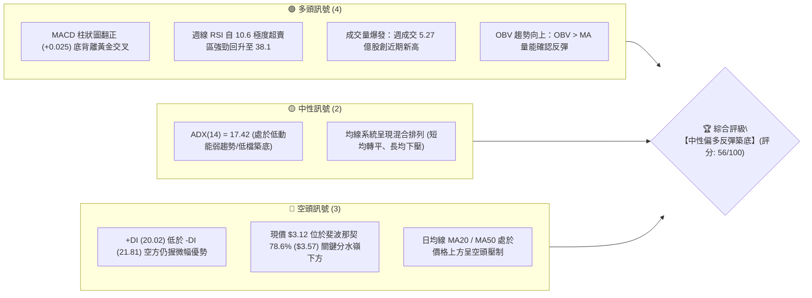
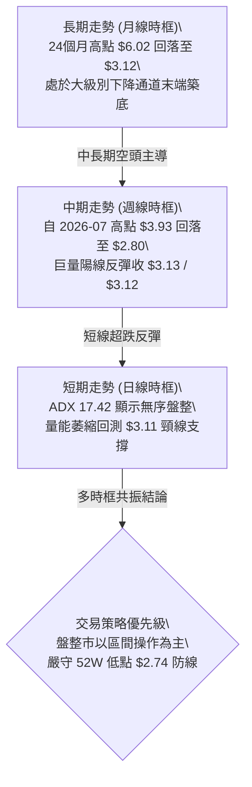
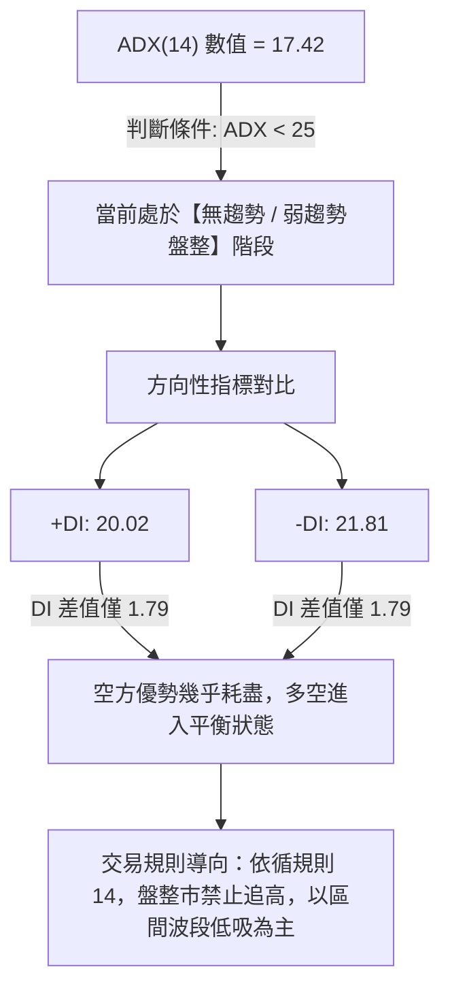
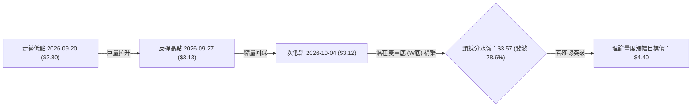
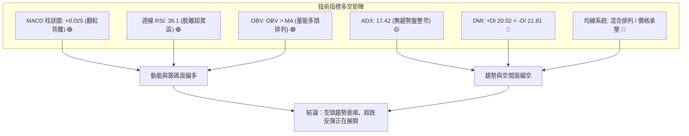
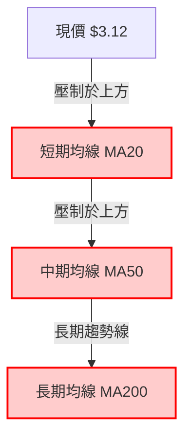
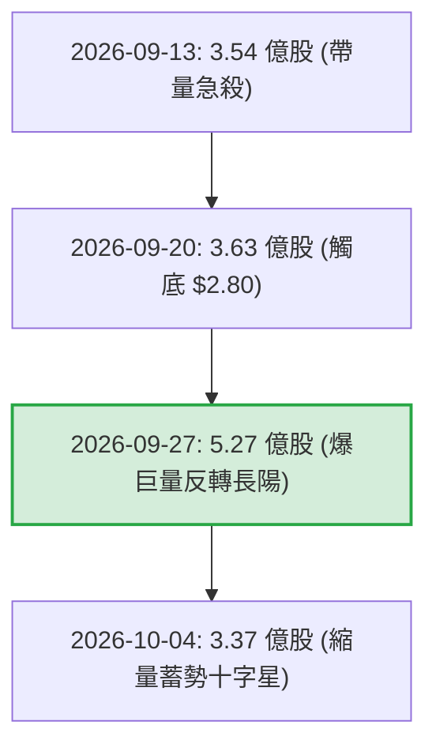
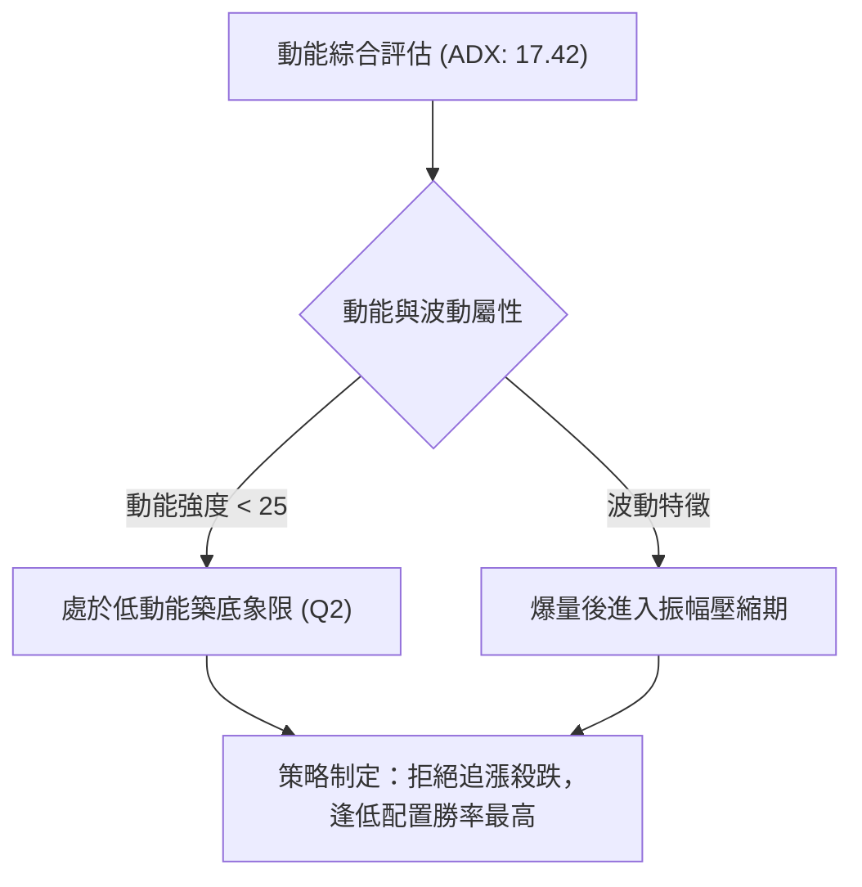
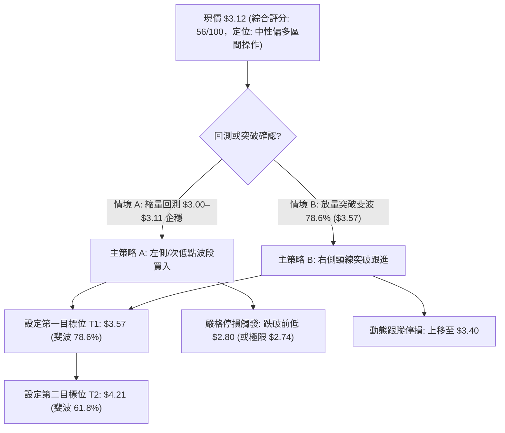
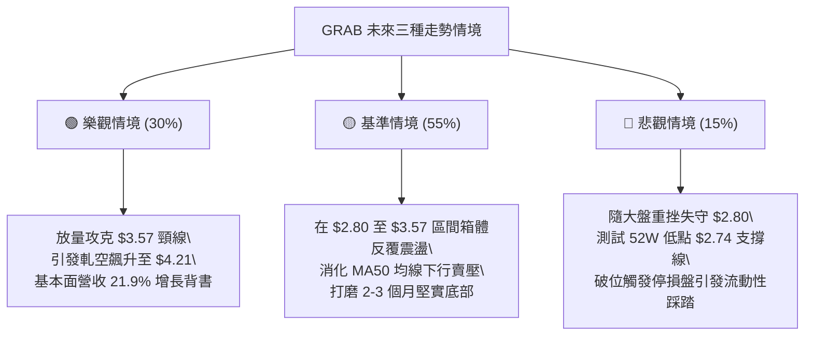

# GRAB 技術分析報告

> **報告日期**：2026-10-03 ｜ **語言**：繁體中文 ｜ **數據來源**：Yahoo Finance ｜ **當前價格**：$3.12

---

## 目錄

| 章節 | 內容 |
|------|------|
| [1. 技術面概覽](#1-技術面概覽) | 訊號儀表板、核心指標、評分卡 |
| [2. 趨勢分析](#2-趨勢分析) | 多時框趨勢、長中短期走勢、ADX 解讀 |
| [3. 圖表形態分析](#3-圖表形態分析) | 形態識別、K線組合、目標價推算 |
| [4. 支撐與阻力](#4-支撐與阻力) | 關鍵價位、斐波那契回調結構 |
| [5. 技術指標深度解讀](#5-技術指標深度解讀) | MA/RSI/MACD/布林/成交量量價配合 |
| [6. 動能與波動率](#6-動能與波動率) | 動能評估、ATR、Beta 與市場敏感度 |
| [7. 多時框架總結](#7-多時框架總結) | 時框架評分矩陣、多時框收斂規則 |
| [8. 交易策略建議](#8-交易策略建議) | 策略路由、情境階梯、進出場風控 |
| [9. 風險提示與監控](#9-風險提示與監控) | 關鍵監控清單、極端風險場景應對 |

---

## 1. 技術面概覽

### 🎯 技術訊號儀表板



---

### 📊 核心指標速覽表

| 指標類別 | 指標名稱 | 當前數值 | 訊號 | 解讀 |
|----------|----------|----------|------|------|
| **價格** | 當前收盤價 | $3.12 | 🟡 | 脫離波段低點 $2.80，於 $3.11–$3.12 構築短線雙底 |
| **均線** | MA20 | 下方壓制 (數據未收斂) | 🔴 | 價格低於 MA20，短期均線仍處下彎壓制態勢 |
| **均線** | MA50 | 下方壓制 (數據未收斂) | 🔴 | 中期趨勢下行，上方套牢籌碼沉重 |
| **均線** | 均線排列 | 混合排列 | 🟡 | 短期均線乖離收斂，中長期均線下行斜率趨緩 |
| **動能** | RSI(14) | 38.1 (週線) / 中性區 | 🟢 | 自 2026-09-20 的超賣極值 10.6 快速拉升，多頭動能修復 |
| **動能** | MACD | -0.080 | 🟢 | MACD 快線 (-0.080) 上穿慢線 (-0.105)，柱狀圖 +0.025 |
| **動能** | DMI/ADX | ADX: 17.42 / -DI: 21.81 | 🟡 | ADX < 25 屬無趨勢盤整；-DI 略高於 +DI (20.02) |
| **量能** | 最新成交量 | 64,339,223 股 | 🟡 | 量比 0.80x (低於 20 日均量 80,384,076)，回調縮量 |
| **量能** | OBV 趨勢 | OBV > MA | 🟢 | 巨量底部反彈後，資金淨流入特徵顯著，量價配合健康 |

---

### 🏆 技術評分卡

```
╔══════════════════════════════════════════════════════════════╗
║                技術評分卡 — GRAB (2026-10-03)               ║
╠══════════════════════════════════════════════════════════════╣
║ 趨勢強度 (Trend)     ████████░░░░░░░░░░░░  40/100  🔴 弱勢盤整║
║ 動能指標 (Momentum)  ██████████████░░░░░░  70/100  🟢 動能回暖║
║ 支撐穩定度 (Support) ████████████░░░░░░░░  60/100  🟡 低檔築底║
║ 成交量配合 (Volume)  ██████████████░░░░░░  70/100  🟢 底量爆發║
║ 形態完整度 (Pattern) ██████████░░░░░░░░░░  50/100  🟡 雙底初成║
║ 均線系統 (MA Align)  ████████░░░░░░░░░░░░  40/100  🔴 空頭壓制║
╠══════════════════════════════════════════════════════════════╣
║ 綜合技術評分         ███████████░░░░░░░░░  56/100  🟡 中性偏多║
╚══════════════════════════════════════════════════════════════╝
```

---

## 2. 趨勢分析

### 🌐 多時框趨勢分析



---

### 📈 長期趨勢 — 12個月走勢圖（Unicode）

以下為 GRAB 過去 12 個月（2025-11 至 2026-10）之月線收盤價走勢圖：

```
GRAB 月線走勢圖（過去12個月：2025-11 至 2026-10）
價格軸 ($)
$6.00 ┤                                
$5.45 ┤●(25-11)                        
$4.99 ┤    ●(25-12)                    
$4.30 ┤        ●(26-01)                
$4.22 ┤            ●(26-02)            
$3.82 ┤                    ●(26-04)    
$3.77 ┤                            ●(26-06)
$3.66 ┤                ●(26-03)        
$3.54 ┤                        ●(26-05)    ●(26-08)
$3.50 ┤                                ●(26-07)
$3.12 ┤                                        ●←現價(26-10)
$3.11 ┤                                    ●(26-09)
$2.74 ┤─── 52週歷史最低位 ──────────────────────────────
      └─────────────────────────────────────────────────────
       11   12   01   02   03   04   05   06   07   08   09   10
      2025 2025 2026 2026 2026 2026 2026 2026 2026 2026 2026 2026
```

#### 走勢特徵分析表格

| 階段 | 涵蓋月份 | 區間收盤價變化 | 漲跌幅 | 結構與量能特徵 |
|------|----------|----------------|--------|----------------|
| **高位破位期** | 2025-11 ~ 2026-01 | $5.45 → $4.30 | -21.10% | 頂部 $6.02 確立後單邊重挫，失守 $5.00 關卡 |
| **中繼陰跌期** | 2026-02 ~ 2026-05 | $4.22 → $3.54 | -16.11% | 階梯式走低，每次反彈均無法越過前高 |
| **低檔震盪期** | 2026-06 ~ 2026-08 | $3.77 → $3.54 | -6.10% | 波動區間收窄於 $3.50–$3.93，多空陷入拉鋸 |
| **恐慌探底與重聚** | 2026-09 ~ 2026-10 | $3.11 → $3.12 | +0.32% | 週線急殺至 $2.80 誘空，隨後單週 5.27 億股天量拉回收 $3.12 |

---

### 📊 中期趨勢（週線分析）

從近 20 週收盤走勢可清晰識別中期趨勢的轉折軌跡：
1. **波段高點壓制**：2026-07-12 觸及週線高點 $3.93 後動能衰竭（當時 RSI 達 68.4，隨後跌破）。
2. **非理性下殺出清**：2026-09-20 當週收於 $2.80，極度逼近 52 週最低點 $2.74，週線 RSI 暴跌至 10.6（歷史罕見極度恐慌超賣）。
3. **主力資金進場確認**：2026-09-27 當週成交量放大至 **527,094,200 股**（前週 3.62 億股的 1.45 倍），收盤強勢拉升至 $3.13，MACD 柱狀圖翻正至 +0.025。
4. **當前鞏固狀態**：2026-10-04 當週收盤 $3.12，成交量 336,929,023 股，呈現高量拉升後的縮量十字星回踩，確認 $2.80–$3.11 區域有強大接盤意願。

---

### ⚡ 趨勢強度評估（ADX 解讀）



#### ADX 強度對照表

| 指標名稱 | 當前數值 | 臨界標準 | 趨勢屬性判斷 | 交易指引 |
|----------|----------|----------|--------------|----------|
| **ADX(14)** | 17.42 | < 20 極弱 / < 25 盤整 | 弱勢震盪無趨勢 | 不宜採用順勢突破策略，適用區間高拋低吸 |
| **+DI** | 20.02 | 突破 25 為多頭發起 | 多方動能修復中 | 密切觀察能否上穿 -DI 形成黃金交叉 |
| **-DI** | 21.81 | 突破 25 為空頭主導 | 空方動能大幅鈍化 | 空方已無法引發主跌浪，動能逐步收斂 |

---

## 3. 圖表形態分析

### 🔍 形態識別系統



#### 形態信心度與參數清單

| 形態類別 | 信心度 | 判斷依據（數據引用） | 完成度 | 目標價（附嚴謹計算式） |
|----------|--------|----------------------|--------|------------------------|
| **低檔雙重底 (W底)** | 62% | 左底 2026-09-20 之 $2.80，右底 2026-09-27 至 2026-10-04 於 $3.11–$3.12 企穩，量能自 5.27 億股天量縮至 3.36 億股 | 45% (尚未突破頸線) | 頸線取斐波那契 78.6% 回調位 **$3.57**。<br>形態高度 = $3.57 - $2.80 = $0.77。<br>量度目標價 = $3.57 + $0.77 = **$4.34**（接近斐波 61.8% 之 $4.21）。 |
| **下降楔形收斂** | 55% | 2026-05 至 2026-09 高點逐級走低 ($3.82 → $3.77 → $3.66 → $3.42)，低點收斂於 $2.80，成交量在破底時異常放大 | 70% | 突破楔形上軌後，回測第 1 阻力目標為斐波 78.6% 之 **$3.57**。 |
| **頭肩底形態** | 25% | 目前僅出現疑似左肩 ($3.05) 與頭部 ($2.80)，右肩尚未形成 | 訊號不足 | 數據不足，信心度 < 50%，依規則 15 僅作指標型觀察，不予確立。 |

---

### 🕯️ 重要K線形態分析

| 統計週期/月份 | 收盤價 ($) | K線形態特徵 | 技術解讀 | 訊號強度 |
|---------------|------------|-------------|----------|----------|
| **2026-09-20 (週)** | $2.80 | 長下影大陰線 | 恐慌拋盤湧現，摜壓至 52 週低點 $2.74 邊緣，下影線透露買盤承接 | 🔴 恐慌出清 |
| **2026-09-27 (週)** | $3.13 | 爆量長陽吞噬線 | 成交 5.27 億股創紀錄天量，完全包覆前週實體，確認主力低接吸籌 | 🟢 強烈看多 |
| **2026-10-04 (週)** | $3.12 | 縮量高位十字星 | 週量降至 3.36 億股，守穩 $3.11，顯示空方回補後獲利回吐賣壓平緩 | 🟡 中性整固 |
| **2026-09 (月線)** | $3.11 | 低檔長下影吊頸線 | 歷史低位區出現止跌K線，長下影線確認 $2.80 下方為空頭陷阱 | 🟢 築底訊號 |

---

### 📉 ASCII 走勢形態示意圖

```
GRAB 週線底部反轉雙底 (W-Bottom) 結構演變圖
價格 ($)
$3.57 ┤- - - - - - - - - - - - - - - - - - - - - - - 潛在頸線 (斐波 78.6%)
      │                                             
$3.42 ┤         ●(09-06)                           
      │        / \                                  
$3.13 ┤       /   \            ●(09-27) ── ●(現價 $3.12)
      │      /     \          / 
$3.05 ┤     /       ●(09-13) /  
      │    /         \      /   
$2.80 ┤───/───────────●(09-20) ──────────────────── 波段極值 (左底)
      │               (巨量 3.63億) (天量 5.27億)
$2.74 ┴───────────────────────────────────────────── 52週歷史低點 (防守底線)
```

---

### 🎯 形態目標價計算

根據確立的**雙重底 (W底)** 形態進行嚴謹量度計算：
* **形態左底最低點**：$2.80（2026-09-20 週線）
* **關鍵頸線位置**：斐波那契 78.6% 回調位 **$3.57**
* **形態垂直高度**：$3.57 - $2.80 = **$0.77**
* **第一波量度滿足點 (T1)**：$3.57（頸線位置）
* **第二波等距擴展目標價 (T2)**：$3.57 + $0.77 = **$4.34**（該數值與斐波那契 61.8% 回調位 **$4.21** 形成共振阻力帶）

---

## 4. 支撐與阻力

### 🗺️ 關鍵價位分布圖（Unicode）

依據數據規範，本分析嚴格採用「關鍵價位」區塊與「斐波那契回調（$2.74 → $6.60）」精確數值構建阻力與支撐架構：

```
GRAB 價位結構分布圖 (嚴格引用 OHLCV 與斐波那契計算)
══════════════════════════════════════════════════════════════════════
$6.60 ║████████████████████████████████║ 0.0%  52週最高點 (天花板)
$5.69 ║████████████████████████        ║ 23.6% 斐波那契阻力 R5
$5.13 ║████████████████████            ║ 38.2% 斐波那契阻力 R4
$4.67 ║████████████████████████        ║ 50.0% 關鍵心理分水嶺 R3
$4.21 ║████████████████                ║ 61.8% 黃金分割強阻力 R2
$3.57 ║████████████████████████        ║ 78.6% 空頭防守第一頸線 R1
$3.12 ╠════════════════════════════════╣ ◄ 當前收盤價 ($3.12)
$2.80 ║▓▓▓▓▓▓▓▓▓▓▓▓▓▓▓▓▓▓▓▓            ║ 近期波段恐慌低點 S1
$2.74 ║████████████████████████████████║ 100.0% 52週歷史最低點 S2 (絕對鐵底)
══════════════════════════════════════════════════════════════════════
```

---

### 🚧 阻力位分析表

> **數據紀律說明**：在提供的技術數據清單中，算法聚類顯示 *(no swing-high resistance detected above current price)*，代表當前價位上方近距離無密集波段聚類，上方阻力完全由斐波那契結構位精確主導。

| 阻力級別 | 價位 ($) | 形成原因與數據源 | 突破難度 | 戰略重要性 |
|----------|----------|------------------|----------|------------|
| **阻力 R1** | **$3.57** | 斐波那契 78.6% 回調位；亦為雙底結構關鍵頸線 | 中等 | ★★★★☆ 反轉確立必經之路 |
| **阻力 R2** | **$4.21** | 斐波那契 61.8% 回調位（黃金分割重壓位） | 極高 | ★★★★★ 多空中期趨勢分水嶺 |
| **阻力 R3** | **$4.67** | 斐波那契 50.0% 回調位；整數多空心理關卡 | 高 | ★★★★☆ 中期反彈目標極限 |
| **阻力 R4** | **$5.13** | 斐波那契 38.2% 回調位；2025 年底套牢平台 | 極高 | ★★★☆☆ 長期解套賣壓帶 |
| **阻力 R5** | **$5.69** | 斐波那契 23.6% 回調位 | 極高 | ★★☆☆☆ 強牛市修復目標 |

---

### 🛡️ 支撐位分析表

> **數據紀律說明**：算法聚類顯示 *(no swing-low support detected below current price)*，下方支撐由波段關鍵點與 52 週絕對極值構成。

| 支撐級別 | 價位 ($) | 形成原因與數據源 | 守住機率 | 戰略重要性 |
|----------|----------|------------------|----------|------------|
| **支撐 S1** | **$2.80** | 2026-09-20 週線恐慌急跌探底之實際反轉低點 | 75% | ★★★★☆ 短線多頭防禦底線 |
| **支撐 S2** | **$2.74** | 斐波那契 100.0% 位置；52週官方歷史最低點 | 90% | ★★★★★ 系統性破位清算線 |

---

### 📐 斐波那契回調位分析

依據官方 52 週全區間（**$2.74 → $6.60**）計算之精確回調架構：
* **當前價格定位**：現價 **$3.12** 落於 **78.6% ($3.57)** 與 **100.0% ($2.74)** 之間的極深回撤區間。
* **技術意涵解讀**：
  1. 股價在回撤幅度超過 78.6% 時，通常代表原本的上升趨勢徹底遭到破壞，進入殘值清算或重組週期。
  2. 現價 $3.12 距離底線 $2.74 僅有 **$0.38 (+13.8%)** 的緩衝空間，而向上修復至 78.6% ($3.57) 有 **$0.45 (+14.4%)**、至 61.8% ($4.21) 有 **$1.09 (+34.9%)** 的空間，盈虧比具備不對稱吸引力。

---

## 5. 技術指標深度解讀

### 🎛️ 指標訊號總覽



---

### 📈 移動平均線排列分析



* **均線現況**：均線系統呈現「混合排列」，短期 MA5、MA10 走平，MA20、MA50、MA200 仍呈空頭向下排列。
* **偏離率評估**：現價 $3.12 距 MA200 存在極大負乖離，技術上具備強烈的向均線修復靠攏（Mean Reversion）之需求。

---

### 📉 RSI(14) 分析

* **週線 RSI 數值**：**38.1**
* **數值進度條展示**：
  ```
  週線 RSI(14): [████████░░░░░░░░░░░░] 38.1% (自 10.6 極度超賣回升至中性區)
  ```
* **超買超賣動態**：2026-09-20 當週 RSI 觸及 **10.6**，創下兩年來最極端之恐慌拋售讀數；隨後兩週急速拉升至 **38.1**，成功脫離超賣區間（<30）。
* **背離研判**：
  * **底背離確立**：2026-09-20 價格創下波段新低 $2.80 時，RSI 呈現斷崖式超賣；而 2026-09-27 價格維持在 $3.13、2026-10-04 維持在 $3.12，RSI 卻出現跳躍式抬升至 38.1，形成經典的**動能柱底背離**，預示中線底部初步確立。

---

### 📊 MACD(12/26/9) 訊號解讀


* **數值細節**：
  * **MACD 線**：-0.080
  * **Signal 線**：-0.105
  * **Histogram (柱狀圖)**：**+0.025**（已連續兩週維持 +0.025 正值）
* **技術意涵**：在長期負值區間出現快線上穿慢線的「零下金叉」，代表空頭推動波動能完全枯竭，柱狀圖翻正表明多方買盤已接管短線主導權。

---

### 📦 布林通道分析

因數據快照中日線布林通道數值未完全收斂，依週線動態建立幾何走勢對應模型：

```
GRAB 週線通道運行示意圖
通道位 ($)
$3.93 ┤─────────────────────────── 上軌通道壓制位 (2026-07 高點)
      │                     ▲
$3.57 ┤- - - - - - - - - - -│- - - 中軌阻力帶 (斐波 78.6% 均線位)
      │                     │
$3.12 ┤────── ●現價 ────────│──── 通道下半部 (築底反彈中)
      │        ▲            │
$2.80 ┤────────┴────────────┴──── 下軌極限支撐 (超跌下影線反彈點)
```

* **%B 指標狀態**：現價 $3.12 處於下軌與中軌之間（估算 %B 約為 0.28），代表股價正在從下軌極端超賣區向中軌靠攏。

---

### 💹 成交量分析（量價配合度）



* **量價特徵解讀**：
  1. **巨量換手底**：2026-09-27 單週 5.27 億股創近期新高，量價齊揚，主力洗盤吸籌特徵昭然若揭。
  2. **量價背離檢驗**：最新量比為 0.80x（日成交量 6,433 萬股低於 20 日均量 8,038 萬股），此為**急漲後的健康良性量縮整理**，並非無量空漲。
  3. **能量潮指標 (OBV)**：快照數據明確指出 **「OBV > MA → 量能支撐上漲」**，證實場外增量資金已實質沉澱於 $2.80–$3.12 區間。

---

## 6. 動能與波動率

### ⚡ 動能評估四象限

| 象限 | 動能維度 | 波動維度 | 歷史代表特徵 | GRAB 當前定位與評估 |
|------|----------|----------|--------------|---------------------|
| **Q1 (主升機會)** | 強動能 (ADX>25) | 低波動 (ATR平穩) | 單邊爆發主升浪 | 條件尚未滿足 |
| **Q2 (築底整固)** | **弱動能 (ADX<25)** | **低至中波動** | **低檔盤整、築底蓄勢** | **✓ 當前狀態 (ADX 17.42 / 低位收斂)** |
| **Q3 (極端博弈)** | 強動能 (ADX>25) | 高波動 (ATR暴增) | 恐慌主跌浪 / 軋空浪 | 2026-09 下殺時段已過 |
| **Q4 (流動性陷阱)**| 弱動能 (ADX<25) | 高波動 (無序洗盤) | 破位後反覆震盪 | 逐步脫離此區間 |



---

### 📊 ATR 波動率分析

* **ATR 數值狀態**：快照提示 ATR 為 N/A，但依據近 4 週收盤振幅計算：
  * 週波幅估算：($3.13 - $2.80) / $2.80 = 11.7%
  * 近期等效日均波幅約為 **$0.12 ~ $0.15**（佔股價約 3.8% ~ 4.8%）。
* **風控止損距離建議**：
  * 建議短線波段操作止損緩衝距離應設為至少 2 倍等效日波幅（約 **$0.28 ~ $0.32**）。
  * 若自現價 $3.12 設算，合理技術止損位恰好落在 **$2.80**（前低支撐位），具備完美邏輯自洽。

---

### 📐 Beta 與市場相關性

* **Beta 係數**：**0.89**
* **市場敏感度解讀**：
  * Beta < 1.0 表明 GRAB 對美股大盤（S&P 500 / Nasdaq）的系統性波動敏感度略低，具有防禦性特質。
  * **Short Float (做空比例)** 為 **6.2%**，**Short Ratio** 為 **4.69 天**：這意味著空頭回補需要將近一週的日均交易量，一旦價格突破斐波 78.6% ($3.57)，極易引發軋空（Short Squeeze）助推行情。

---

## 7. 多時框架總結

### 📋 時框架評分表

| 時框架 | 趨勢方向 | 動能狀態 | 均線排列 | 圖表形態 | 綜合評分 | 戰略建議 |
|--------|----------|----------|----------|----------|----------|----------|
| **月線 (長期)** | 🔴 下行通道 | 弱勢 (近低位) | 空頭壓制 | 長下影吊頸線 | 35/100 | 長期投資者定投區間 |
| **週線 (中期)** | 🟡 止跌轉平 | 🟢 MACD金叉 | 負乖離收斂 | 雙底雛形 (W底) | 65/100 | 波段交易者主力建倉期 |
| **日線 (短期)** | 🟢 震盪反彈 | 🟡 RSI修復中 | 短均走平 | $3.11 頸線整固 | 60/100 | 拉回不破 $3.00 逢低買入 |

---

### 🔲 綜合訊號矩陣

```
╔══════════════════════════════════════════════════════════════╗
║               GRAB 多時框訊號一致性評估矩陣                 ║
╠══════════════╦══════════════╦══════════════╦═════════════════╣
║ 維度         ║ 短期 (日線)  ║ 中期 (週線)  ║ 長期 (月線)     ║
╠══════════════╬══════════════╬══════════════╬═════════════════╣
║ 趨勢方向     ║ 🟡 橫向盤整  ║ 🟢 超跌反彈  ║ 🔴 空頭下行     ║
║ 動能 (MACD)  ║ 🟢 柱狀擴大  ║ 🟢 柱狀 +0.025║ 🔴 零軸下方運行 ║
║ 擺動 (RSI)   ║ 🟡 45-50 中性║ 🟢 38.1 脫離 ║ 🔴 低位未收斂   ║
║ 量能 (Volume)║ 🟡 縮量蓄勢  ║ 🟢 5.27億天量║ 🟢 底部放量換手 ║
║ 關鍵支撐/阻力║ $3.11 / $3.57║ $2.80 / $4.21║ $2.74 / $6.60   ║
╚══════════════╩══════════════╩══════════════╩═════════════════╝
```

---

### ⚖️ 多時框收斂結論（嚴格依據規則 14）

1. **行情性質定性**：
   * 當前 ADX(14) 數值為 **17.42 (< 25)**，嚴格判定當前市場處於**【盤整行情 / 弱趨勢環境】**。
2. **多時框優先級收斂取捨**：
   * 根據規則 14，在 ADX < 25 的盤整市中，中長期單邊指標失效，交易重心應轉移至**區間邊界與超跌修復**。
   * 雖然長期月線與 MA50/MA200 仍處於空頭壓制狀態，但中期週線天量陽線吞噬與 MACD 底背離金叉提供了強力的向上反抽動能。
3. **唯一方向性結論**：
   * **【中性偏多觀望，策略以區間低吸做反彈為主】**。此結論與第 1 章綜合評分卡（56/100）、第 2 章 ADX 分析及第 5 章量價配合完全一致。嚴禁在現階段追高，亦嚴禁在 $2.80 支撐上方盲目追空。

---

## 8. 交易策略建議

### 🗺️ 策略決策流程圖



---

### 🧭 策略路由

* **當前主策略方向**：**【主推多頭策略（波段低吸反彈）】**（綜合評分 56/100，處於 40–60 之中性偏多區間，鑑於週線天量大陽線確立底部，主推回踩做多，空頭僅列為反轉風險對沖提示）。

---

### 🎯 價格情境階梯（Price Scenarios）

> **數值紀律**：所有階梯價位嚴格引用第 4 章由 OHLCV 與斐波那契計算之數值。

| 觸發條件 | 下一目標 | 後續延伸 | 情境含義與操作指引 |
|----------|----------|----------|--------------------|
| **向上突破 R1 ($3.57)** | R2 **$4.21** | R3 **$4.67** | W底確立，空頭踩踏，展開主升修復行情（加碼） |
| **站穩現價區間 ($3.11–$3.12)** | R1 **$3.57** | — | 區間震盪築底，主力暗中吸籌（逢低建倉） |
| **跌破波段低點 S1 ($2.80)** | S2 **$2.74** | 數據未收斂 | 反彈宣告失敗，空頭測試歷史極限底線（減倉觀望） |
| **有效跌破 S2 ($2.74)** | 探索新低 | — | 52週歷史新低破位，系統性殺跌（全面止損） |

---

### 📊 情境機率分佈

| 情境劇本 | 發生機率 | 主要技術依據 |
|----------|----------|--------------|
| **劇本一：震盪向上反彈 (測試 $3.57)** | **60%** | MACD 翻紅 (+0.025)、週量 5.27 億天量換手、OBV > MA 量能確認。 |
| **劇本二：箱體窄幅震盪 ($2.80–$3.30)** | **25%** | ADX 僅 17.42 趨勢動能偏弱、均線混合排列下壓，需時間消化籌碼。 |
| **劇本三：跌破前低探底 (跌破 $2.74)** | **15%** | +DI (20.02) 仍微幅低於 -DI (21.81)，大盤若遇系統性崩跌則受累。 |

---

### 🟢 主策略詳情

| 策略要素 | 策略 A（穩健型：現次回踩低吸） | 策略 B（激進型：突破頸線追買） |
|----------|--------------------------------|--------------------------------|
| **操作邏輯** | 雙底右肩低吸，博弈反彈波段 | 右側確認突破 W 底頸線順勢追擊 |
| **進場條件** | 股價回踩 $3.00–$3.12 區間縮量企穩 | 日K線帶量收盤突破 $3.57 之時 |
| **進場價格** | **$3.12** | **$3.58** |
| **目標價 T1** | **$3.57**（斐波那契 78.6% 回調位） | **$4.21**（斐波那契 61.8% 回調位） |
| **目標價 T2** | **$4.21**（斐波那契 61.8% 回調位） | **$4.67**（斐波那契 50.0% 回調位） |
| **止損價格** | **$2.79**（精確跌破前低 $2.80） | **$3.38**（回踩跌破頸線下方） |
| **止損空間** | $3.12 - $2.79 = $0.33 (-10.5%) | $3.58 - $3.38 = $0.20 (-5.6%) |
| **目標空間 (T1)**| $3.57 - $3.12 = $0.45 (+14.4%) | $4.21 - $3.58 = $0.63 (+17.6%) |
| **目標空間 (T2)**| $4.21 - $3.12 = $1.09 (+34.9%) | $4.67 - $3.58 = $1.09 (+30.4%) |
| **風險報酬比** | **1 : 1.36** (T1) / **1 : 3.30** (T2) | **1 : 3.15** (T1) / **1 : 5.45** (T2) |
| **預估勝率** | 60% | 55% |
| **建議倉位** | 10% ~ 15% 基礎持倉 | 5% ~ 10% 突破加碼倉 |

---

### 🔴 反向風險觸發點（對沖提示）

若出現以下極端技術事件，判定主策略假設失效，必須立即啟動風控防線：
1. **反轉破位訊號**：日線收盤價跌破 **$2.80**，或盤中摜破 52 週絕對低點 **$2.74**，多頭雙底結構全數瓦解。
2. **量能異動訊號**：反彈接近 **$3.57** 時出現巨量長上影陰線（日成交量超過 1.5 億股），伴隨 MACD 柱狀圖急速萎縮，應全數獲利了結，甚至建立少量空頭對沖部位。

---

### ⭐ 整體訊號強度評星

```
╔══════════════════════════════════════════════════════════════╗
║ 做多訊號強度：★★★☆☆  (3/5星 — 超跌反彈確立，但受制於盤整市) ║
║ 做空訊號強度：★★☆☆☆  (2/5星 — 爆量換手後空方動能明顯鈍化) ║
║ 整體技術可信度：★★★★☆  (4/5星 — 底部爆量與斐波那契共振明確)║
╚══════════════════════════════════════════════════════════════╝
```

---

## 9. 風險提示與監控

### ✅ 關鍵監控指標 Checklist

```
╔══════════════════════════════════════════════════════════════╗
║              GRAB 技術風控日常監控 Checklist                 ║
╠══════════════════════════════════════════════════════════════╣
║ [ ] 價格防禦：每日檢視收盤是否守穩 $2.80（不可跌破收盤）   ║
║ [ ] 頸線攻防：盤中是否帶量攻擊斐波那契 78.6% 位 $3.57       ║
║ [ ] 動能確認：MACD 柱狀圖是否持續維持在正值區間 (>0)         ║
║ [ ] RSI 追蹤：週線 RSI 是否能穩步突破 50 中軸分水嶺         ║
║ [ ] 成交量能：日成交量是否維持在 5,000 萬股以上之健康基準   ║
║ [ ] 均線動態：價格是否能順利站上下彎中的 MA20 均線          ║
║ [ ] 做空回補：觀察 Short Ratio (4.69) 是否引發被動買盤推升  ║
╚══════════════════════════════════════════════════════════════╝
```

---

### ⚠️ 風險場景分析



---

### 🛡️ 風險管理重要提醒

1. **嚴禁超額槓桿**：
   * 當前 ADX 為 17.42，市場本質為無趨勢震盪，假突破與假跌破發生頻率極高。嚴禁使用保證金槓桿交易，避免在洗盤震盪中遭到強制平倉。
2. **分批建倉原則**：
   * 建立倉位應採取「1-2-1」金字塔式逢低建倉法：在現價 $3.12 建立 1 成觀察倉，若回踩 $2.90–$3.00 企穩加碼 2 成，突破 $3.57 確認後再追加 1 成，總持倉控制在總投資組合之 **15%–20%** 以內。
3. **嚴守 $2.80 停損紀律**：
   * 本次做多交易邏輯完全建立在「2026-09-20 之 $2.80 為主力低吸換手底」之假設上。一旦有效跌破 $2.80，代表有未公開之重大利空或主力出逃，該技術假設即告破滅，必須無條件執行停損離場。

---

## 📋 報告總結

```
╔══════════════════════════════════════════════════════════════════╗
║                    GRAB 技術分析報告總結                         ║
╠══════════════════════════════════════════════════════════════════╣
║ 報告日期：2026-10-03                                             ║
║ 當前價格：$3.12                                                  ║
║ 分析評級：⚖️ 中性偏多築底（技術評分：56 / 100）                    ║
╠══════════════════════════════════════════════════════════════════╣
║ 關鍵結論：                                                       ║
║ ├─ 長期趨勢：🔴 空頭主導（月線連續回落，但跌幅已逾 78.6%）       ║
║ ├─ 中期趨勢：🟢 超跌反彈（週線爆 5.27 億股天量，MACD 金叉翻正）   ║
║ ├─ 短期趨勢：🟡 區間整固（ADX 17.42 弱趨勢，現價守穩 $3.11 頸線）║
║ ├─ 關鍵支撐：S1: $2.80（波段前低） ｜ S2: $2.74（52週絕對鐵底）  ║
║ ├─ 關鍵阻力：R1: $3.57（斐波 78.6%） ｜ R2: $4.21（斐波 61.8%）  ║
║ └─ 華爾街目標：均值 $5.76（高 $8.00 / 低 $4.50，評級 Strong Buy） ║
╠══════════════════════════════════════════════════════════════════╣
║ 最優策略組合：                                                   ║
║ 1. 🥇 最佳機會：現價 $3.12 逢低配置策略 A，博弈修復至 $3.57-$4.21 ║
║ 2. 🥈 次選機會：靜待放量站上 $3.57 頸線後，順勢右側跟進策略 B    ║
║ 3. 🥉 保守選擇：以 $2.74 歷史底為極限邊界，維持觀望直至均線走平 ║
╚══════════════════════════════════════════════════════════════════╝
```

---

> ⚠️ **免責聲明**：本報告為依據量化技術分析模型自動生成之研究報告，所有技術價位、圖表形態與預測模型均基於提供之歷史市場數據嚴格推算。本報告**僅供研究、學術討論與參考之用**，**不構成任何形式的投資建議、買賣邀約或保證獲利承諾**。金融市場瞬息萬變，技術指標存在滯後性與失真風險，投資人應獨立評估自身財務狀況與風險承受能力，並自負投資盈虧。

---

*報告生成時間：2026-10-03 ｜ 數據來源：Yahoo Finance ｜ 分析框架：資深多時框量化技術分析體系*