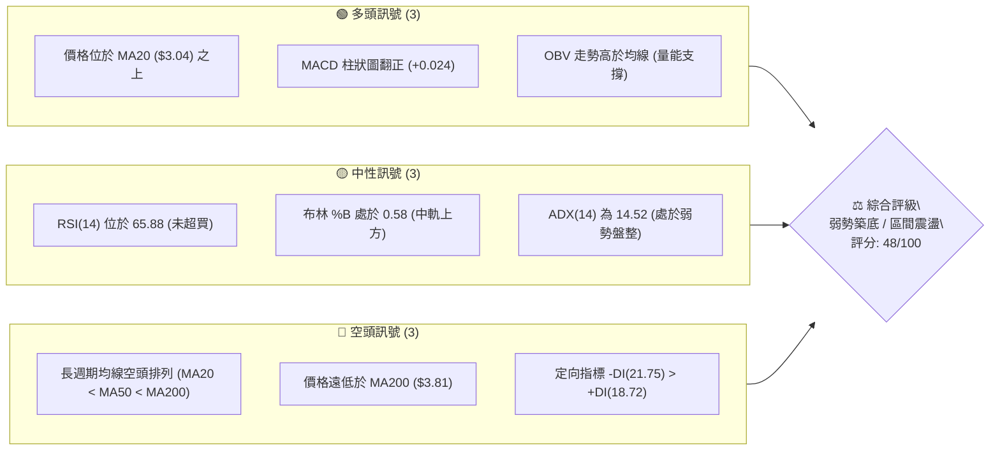
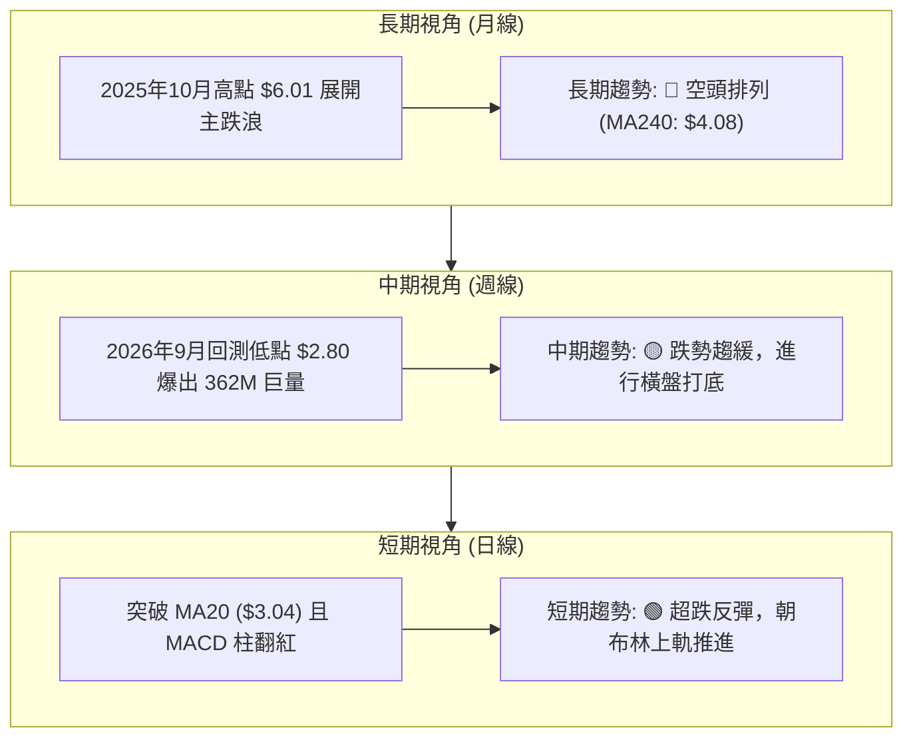
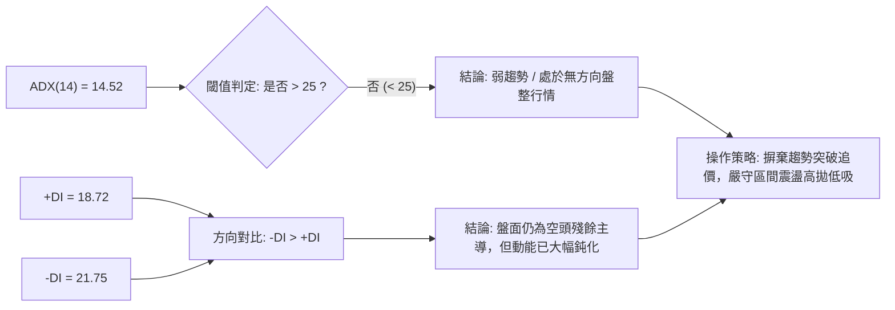
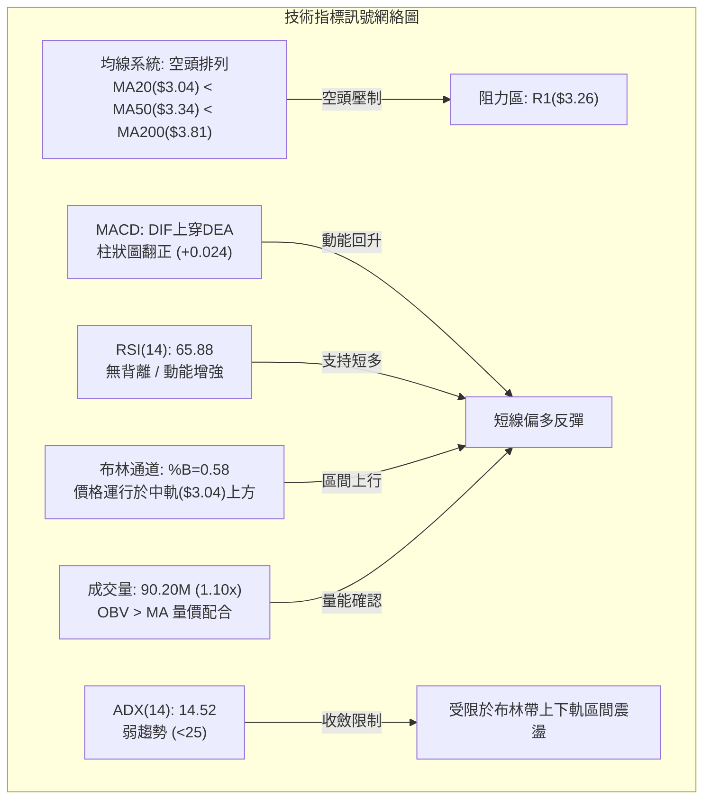
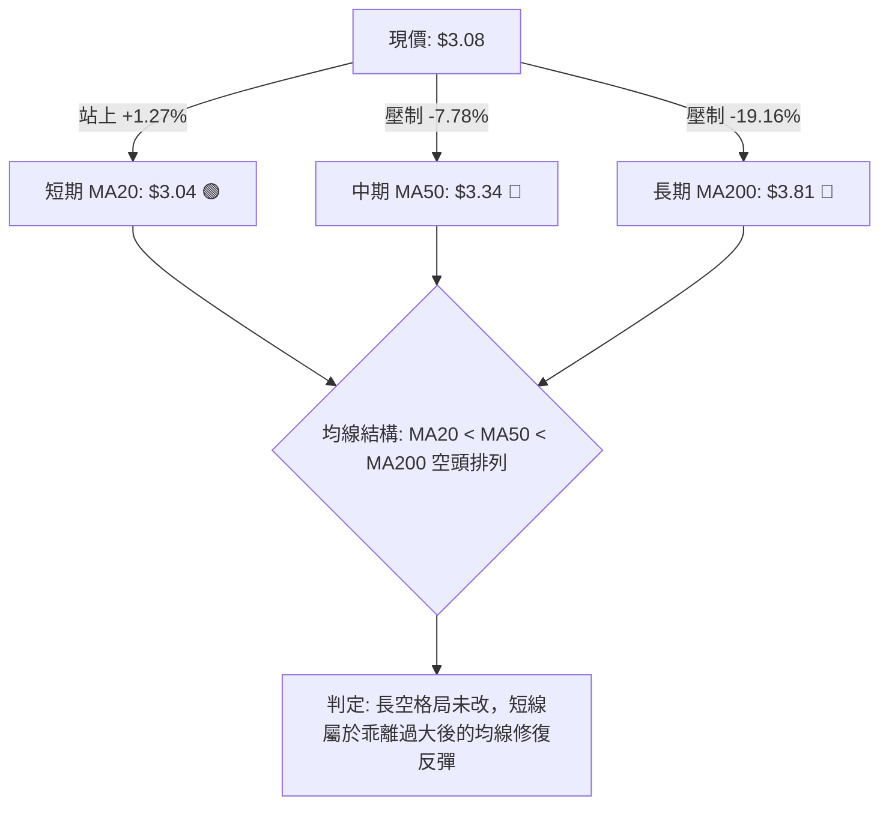
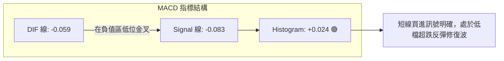
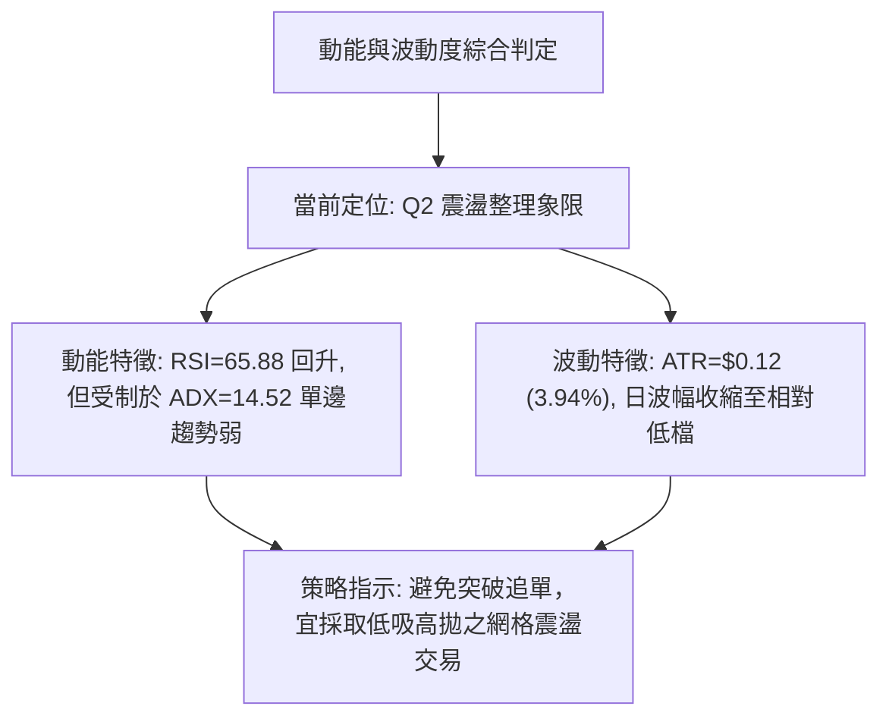
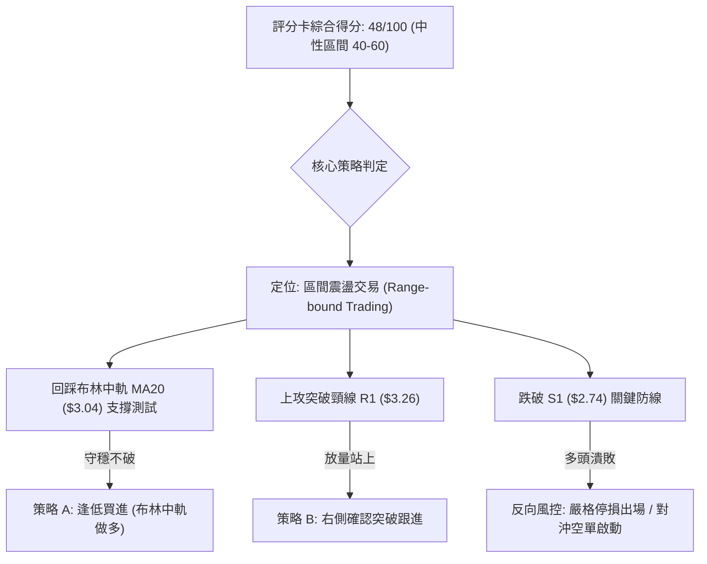
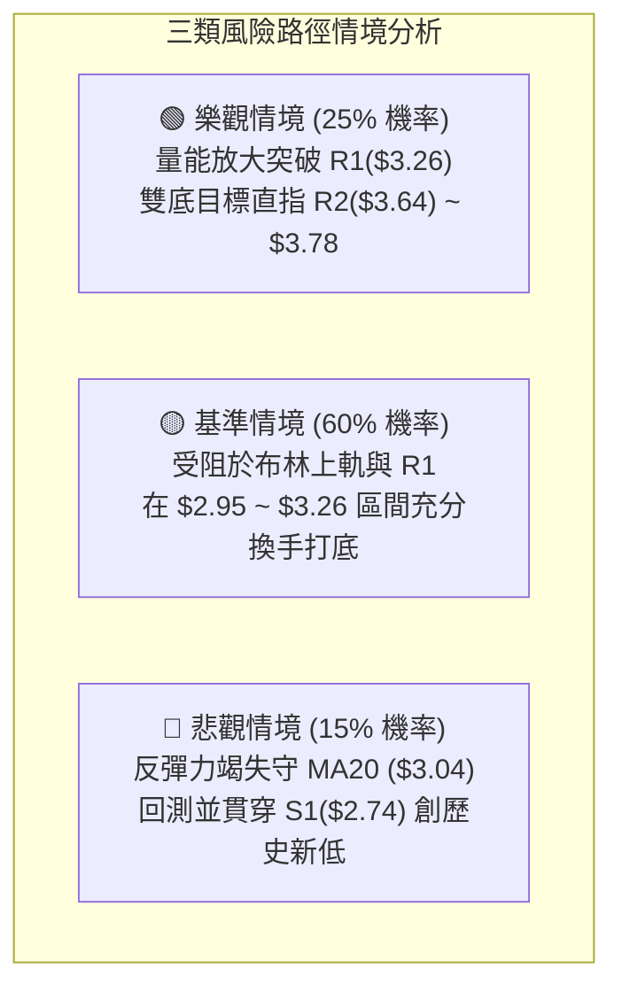

# GRAB 技術分析報告

> **報告日期**：2026-10-08 ｜ **語言**：繁體中文 ｜ **數據來源**：Yahoo Finance ｜ **當前價格**：$3.08

---

## 目錄

| 章節 | 內容 |
|------|------|
| [1. 技術面概覽](#1-技術面概覽) | 訊號儀表板、核心指標、評分卡 |
| [2. 趨勢分析](#2-趨勢分析) | 多時框趨勢、長中短期走勢 |
| [3. 圖表形態分析](#3-圖表形態分析) | 形態識別、K線組合、目標價 |
| [4. 支撐與阻力](#4-支撐與阻力) | 關鍵價位、斐波那契回調 |
| [5. 技術指標深度解讀](#5-技術指標深度解讀) | MA/RSI/MACD/布林/成交量 |
| [6. 動能與波動率](#6-動能與波動率) | 動能評估、ATR、Beta |
| [7. 多時框架總結](#7-多時框架總結) | 時框架評分矩陣 |
| [8. 交易策略建議](#8-交易策略建議) | 多空策略、風險報酬比 |
| [9. 風險提示與監控](#9-風險提示與監控) | 監控指標、風險場景 |

---

## 1. 技術面概覽

### 🎯 技術訊號儀表板



### 📊 核心指標速覽表

| 指標類別 | 指標名稱 | 當前數值 | 訊號 | 解讀 |
|----------|----------|----------|------|------|
| **價格** | 當前價格 | $3.08 | 🟡 中性 | 處於52週區間($2.74 - $6.60)之 8.8% 低檔區 |
| **均線** | MA20 | $3.04 | 🟢 看多 | 現價位於20日線上 (+1.27%)，短線具備下檔支撐 |
| **均線** | MA50 | $3.34 | 🔴 看空 | 現價位於50日線下方 (-7.78%)，中期結構依然偏弱 |
| **均線** | MA200 | $3.81 | 🔴 看空 | 現價位於年線下方 (-19.16%)，長期空頭格局未變 |
| **動能** | RSI(14) | 65.88 | 🟡 中性 | 動能自低檔強勁回升，但尚未進入 >70 嚴重超買區 |
| **動能** | MACD | -0.059 | 🟢 看多 | DIF 線上穿 Signal (-0.083)，Histogram (+0.024) 看多 |
| **趨勢** | ADX(14) | 14.52 | 🟡 中性 | 指標低於 25，單邊趨勢衰竭，當前轉為盤整打底階段 |
| **波動** | ATR(14) | $0.12 | 🟡 中性 | 每日波動幅度約 3.94%，波動度收斂有利於籌碼沉澱 |
| **量能** | 成交量比 | 1.10x | 🟢 看多 | 當日量能 90.20M 高於 20日均量 81.99M，伴隨OBV翻揚 |

### 🏆 技術評分卡

```
╔══════════════════════════════════════════════════════════════════╗
║                   技術評分卡 — GRAB (2026-10-08)                 ║
╠══════════════════════════════════════════════════════════════════╣
║ 趨勢強度      ████░░░░░░░░░░░░░░░░  20/100  🔴 (ADX極低/長期空頭)║
║ 動能指標      █████████████░░░░░░░  65/100  🟢 (MACD金叉/RSI回升)║
║ 支撐穩定度    ████████████░░░░░░░░  60/100  🟡 (S1 $2.74守穩回彈)║
║ 成交量配合    ██████████████░░░░░░  70/100  🟢 (量增突破/OBV正向)║
║ 形態完整度    ████████░░░░░░░░░░░░  40/100  🟡 (雙底構築進行中)  ║
║ 均線排列      ██████░░░░░░░░░░░░░░  30/100  🔴 (空頭死叉壓制)    ║
╠══════════════════════════════════════════════════════════════════╣
║ 綜合評分      ██████████░░░░░░░░░░  48/100  🟡 中性觀望/區間震盪 ║
╚══════════════════════════════════════════════════════════════════╝
```

---

## 2. 趨勢分析

### 🌐 多時框趨勢分析

依據多時框收斂邏輯，當前 ADX 為 14.52（< 25），整體市場處於「弱趨勢／盤整行情」。在此架構下，中長期趨勢依舊處於空頭壓制之下，但短期空頭宣洩已告一段落，價格進入低檔築底的防守震盪行情。



### 📈 長期趨勢 — 12個月走勢圖（Unicode）

```
GRAB 月線走勢圖（2025-10 至 2026-10）
價格軸 ($)
$6.01 ┤●(2025-10)
$5.45 ┤    ●(11)
$4.99 ┤        ●(12)
$4.30 ┤            ●(01)
$4.22 ┤                ●(02)
$3.82 ┤                        ●(04)
$3.77 ┤                                ●(06)
$3.66 ┤                    ●(03)
$3.54 ┤                            ●(05)       ●(08)
$3.50 ┤                                    ●(07)
$3.11 ┤                                            ●(09)
$3.08 ┤━━━━━━━━━━━━━━━━━━━━━━━━━━━━━━━━━━━━━━━━━━━━━●←(2026-10 現價)
$2.74 ┴───────────────────────────────────────────────●(52W低點)
       10   11  12  01  02  03  04  05  06  07  08  09  10 (月)
```

**走勢特徵分析表格**：

| 階段時間 | 走勢特徵 | 價格區間 | 累積漲跌幅 | 技術特徵與解讀 |
|----------|----------|----------|------------|----------------|
| **2025-10 ~ 2025-12** | 頂部破位下殺 | $6.01 → $4.99 | -16.97% | 自 52週高點 $6.60 區域跌破關鍵關卡，主力出貨完成 |
| **2026-01 ~ 2026-03** | 主跌浪加速段 | $4.30 → $3.66 | -14.88% | 跌破 $4.00 整數支撐，MA20 下穿 MA50 形成死亡交叉 |
| **2026-04 ~ 2026-08** | 中繼弱勢整理 | $3.82 → $3.54 | -7.33% | 於 $3.50 ~ $3.93 區間震盪，反彈無力並多次承壓於 MA60 |
| **2026-09 ~ 2026-10** | 探底尋求支撐 | $3.11 → $3.08 | -0.96% | 觸及 52W 低點 $2.74 後出現爆量長下影，進入築底階段 |

### 📊 中期趨勢（週線分析）

中期技術面觀察，近 20 週來 Grab 出現顯著的籌碼換手特徵。2026年9月中下旬，股價最低下探至 $2.80（極度逼近 52 週最低點 $2.74），週 RSI 跌至 10.6 的極端超賣區。隨後在 2026-09-27 當週湧現 5.27 億股（527,094,200）的歷史天量，推動價格以長紅 K 線拉回 $3.13，MACD 柱狀圖同步由 -0.056 翻正為 +0.025。顯示 $2.74 ~ $2.80 區間有特定長線法人強力進場護盤承接。

```
週線等級關鍵阻力與支撐分佈示意圖：
[阻力] R2: $3.64  ──────────────────────────── 近期波段次高點
[阻力] R1: $3.26  ──────────────────────────── 近期波段反彈頸線壓制
[現價]     $3.08  ════════════════════════════ 突破 MA20 ($3.04)
[支撐] S1: $2.74  ──────────────────────────── 52週低點 / 爆量換手防守點
```

### ⚡ 趨勢強度評估（ADX 解讀）



| 指標變數 | 當前讀數 | 強度區間 | 趨勢性質說明 |
|----------|----------|----------|--------------|
| **ADX(14)** | **14.52** | < 20 (極弱趨勢) | 空頭慣性動能已耗盡，缺乏單邊推動力，呈現低波動橫盤特徵 |
| **+DI** | **18.72** | 弱勢反彈 | 多頭意願略有上升，但仍未取得盤面絕對主導權 |
| **-DI** | **21.75** | 空方收斂 | 較前期大幅下滑，空頭賣壓暫告一段落 |

---

## 3. 圖表形態分析

### 🔍 形態識別系統

依據形態學原則與嚴格數據收斂規則，本報告對當前日線與週線圖表進行幾何形態檢驗：

| 形態名稱 | 信心度 | 判斷依據（引用數據） | 完成度 | 目標價（附計算式） |
|----------|--------|----------------------|--------|--------------------|
| **雙底形態 (W底)** | **62%** | 兩次低點落於波段低位：第1底為 52W 低點 **$2.74**，第2底為 2026-09-20 週低點 **$2.80**，兩底相差僅 2.19%；中間反彈高點（頸線）位於 **$3.26** (R1)。 | 70% (待實體K線帶量突破頸線) | 頸線 $3.26 + (形態高度: $3.26 - $2.74 = $0.52) = **$3.78**（接近 MA200: $3.81） |
| **矩形箱體震盪** | **75%** | 價格受制於布林下軌及波段支撐 **$2.74**，上方受制於布林上軌與阻力位 **$3.26**。 | 85% (當前位於箱體中軸 $3.00 上方) | 箱體等距推算：區間 $2.74 ~ $3.26，突破則指向 **$3.64** (R2) |
| **均線死叉反壓形態** | **85%** | MA20 ($3.04) < MA50 ($3.34) < MA200 ($3.81)，標準空頭排列仍構成上行反壓。 | 100% (已完全形成) | 壓制回測目標：S1 **$2.74** |

### 🕯️ 重要K線形態分析

| 日期 / 月份 | 收盤價 | K線形態 | 解讀 | 訊號 |
|-------------|--------|---------|------|------|
| **2026-09-20 (週)** | $2.80 | 長下影鐵錘線 (Hammer) | 單週重挫後探至 $2.80 隨即拉起，3.62億股爆量換手，空頭強弩之末 | 🟢 築底訊號 |
| **2026-09-27 (週)** | $3.13 | 帶量突破長紅棒 (Bullish Engulfing) | 成交量擴大至 5.27億股天量，吞噬前週實體，確認短線落底成功 | 🟢 多頭反轉 |
| **2026-10-04 (週)** | $3.08 | 高檔十字星 (Doji) | 回測確認 $3.04 (MA20) 支撐有效性，多空進入弱平衡僵持 | 🟡 中性格局 |
| **2026-10-11 (當週)** | $3.08 | 窄幅整理陽十字 | 量能縮至 2.62億股，換手健康，等待向上測試布林上軌 | 🟡 整理觀望 |

### 📉 ASCII 走勢形態示意圖

```
雙重底（Double Bottom）結構識別圖：
價格 ($)
$3.26 ┤              頸線位置 (R1: 阻力位)
      ├───────╭───╮───────
$3.08 ┤       │   │   ● (現價 $3.08，突破 MA20)
      │       │   ╰──╯
$2.80 ┤  ╰───╯        底2 (2026-09-20 週低 $2.80)
$2.74 ┴──底1 (52W低點 $2.74)
      └────────────────────────────────────────
         2026-08       2026-09       2026-10
```

### 🎯 形態目標價計算

若 GRAB 成功在量能配合下收復頸線 R1：
1. **頸線確認點位**：$3.26
2. **形態基礎深度 (高度 H)**：$3.26 - $2.74 = $0.52
3. **等幅測量目標 (Minimum Price Objective)**：$3.26 + $0.52 = **$3.78**
4. **阻力匯合檢驗**：計算所得之 $3.78 位於 MA200 ($3.81) 及斐波那契 78.6% 回調位 ($3.57) 與阻力 R3 ($3.96) 的關鍵緩衝帶，具備極高的形態理論支撐依據。

---

## 4. 支撐與阻力

### 🗺️ 關鍵價位分布圖（Unicode）

```
╔══════════════════════════════════════════════════════════════════╗
║                     GRAB 價位結構分布圖                           ║
╠══════════════════════════════════════════════════════════════════╣
║ $3.96 ║████████████████████████║ 強阻力 R3 (近一年波段高點聚類) ║
║ $3.81 ║▓▓▓▓▓▓▓▓▓▓▓▓▓▓▓▓▓▓▓▓    ║ 長期均線 MA200 壓制帶         ║
║ $3.64 ║████████████████████    ║ 阻力 R2 (中期反彈極限點)       ║
║ $3.57 ║▒▒▒▒▒▒▒▒▒▒▒▒▒▒▒▒▒▒▒▒    ║ 斐波那契 78.6% 回調位          ║
║ $3.28 ║░░░░░░░░░░░░░░░░        ║ 布林通道上軌壓制線             ║
║ $3.26 ║████████████████████████║ 關鍵阻力 R1 (頸線壓力區)       ║
╠═══════╬════════════════════════╬═════════════════════════════════╣
║ $3.08 ╠════════════════════════╣ ◄ 現價 (當前報價)               ║
╠═══════╬════════════════════════╬═════════════════════════════════╣
║ $3.04 ║░░░░░░░░░░░░░░░░░░░░░░░░║ 短期支撐 MA20 / 布林中軌       ║
║ $2.80 ║▒▒▒▒▒▒▒▒▒▒▒▒▒▒▒▒▒▒▒▒▒▒▒▒║ 布林通道下軌 / 9月低點換手區   ║
║ $2.74 ║████████████████████████║ 強支撐 S1 (52週最低點)         ║
╚══════════════════════════════════════════════════════════════════╝
```

### 🚧 阻力位分析表

*(價位均源自 OHLCV 計算之關鍵價位聚類)*

| 阻力級別 | 價位 | 形成原因 | 突破難度 | 重要性 |
|----------|------|----------|----------|--------|
| **R1** | **$3.26** | 近一年波段高點聚類、貼近布林通道上軌 ($3.28) | 中等 (需日成交量放大至 1.2億股以上) | ★★★★☆ |
| **R2** | **$3.64** | 近一年波段高點聚類、逼近 MA60 ($3.37) 與 斐波那契 78.6% 壓力帶 | 極高 (套牢籌碼密集密集區) | ★★★★☆ |
| **R3** | **$3.96** | 近一年主要高點聚類、位於 MA200 ($3.81) 上方強壓力區 | 極高 (長線多空分水嶺) | ★★★★★ |

### 🛡️ 支撐位分析表

*(價位均源自 OHLCV 計算之關鍵價位聚類)*

| 支撐級別 | 價位 | 形成原因 | 守住機率 | 重要性 |
|----------|------|----------|----------|--------|
| **S1** | **$2.74** | 近一年波段低點聚類、52週歷史低點、斐波那契 100.0% 基準點 | 75% (短期內有天量護盤) | ★★★★★ |
| **S2 / S3** | *無* | 數據中未偵測到更低波段低點聚類 ($2.74 為數據集底限) | 不適用 | — |

### 📐 斐波那契回調位分析

依據 52 週完整波動區間（高點 **$6.60** 至 低點 **$2.74**，極端垂直落差為 **$3.86**）計算黃金分割回調結構：

```
斐波那契回調結構 (52W High $6.60 → 52W Low $2.74)：
0.0%  (52W High) ─────────────── $6.60
23.6%            ─────────────── $5.69
38.2%            ─────────────── $5.13
50.0%            ─────────────── $4.67
61.8%            ─────────────── $4.21
78.6%            ─────────────── $3.57 ◄ (中線強阻力位)
100.0% (52W Low) ─────────────── $2.74 ◄ (強支撐底線)
```

**定位與解讀**：
現價 **$3.08** 當前處於 **78.6% ($3.57)** 與 **100.0% ($2.74)** 之間的極深回撤整理帶中。
- 此區間屬於技術面「超跌折價區」，價格跌幅已經充分釋放前期高估值風險（PE 回落至 Trailing 28.0、PEG 降至 0.64）。
- 向上反彈的第一個斐波那契目標位為 **$3.57 (78.6%)**，該位置亦緊扣波段阻力 R2 ($3.64)，構成後續波段多頭攻堅的核心關卡。

---

## 5. 技術指標深度解讀

### 🎛️ 指標訊號總覽



### 📈 移動平均線排列分析



**均線梯度深度數據**：
- **MA5 ($3.10) / MA10 ($3.11)**：短均線呈現輕微下彎（分別為 -0.77% 與 -0.92%），現價在其微幅下方蓄勢，短線面臨換手考驗。
- **MA20 ($3.04)**：翻揚向上 (+1.27%)，提供短線第一道動態下檔支撐。
- **MA60 ($3.37) / MA120 ($3.52) / MA240 ($4.08)**：全數呈現空頭順序遞增排列，負乖離率達 -8.53% 至 -24.57%，表明長期上方層層套牢籌碼沉重。

### 📉 RSI(14) 分析

```
RSI(14) 讀數進度條：
0                        30            50        65.88 70               100
├────────────────────────┼─────────────┼───────────█───┼────────────────┤
[       超賣區間         ][       弱勢 ][   強勢   ▲   ][   超買警示區   ]
進度條: █████████████████████████████████████████████░░░░░░░░░░░ 65.88
```

- **讀數狀態**：RSI(14) 當前數值為 **65.88**，處於中性偏多區間（50–70），動能健康擴張。
- **背離分析**：
  - **結論：無明顯背離**。
  - **詳細分析**：2026年9月下旬價格自 $2.80 築底回升至現價 $3.08，RSI 同步自極端超賣區 10.6 回升至 65.88，指標走勢與價格反彈同向確認，無頂背離或底背離跡象，顯示反彈動能真實且健康。

### 📊 MACD(12/26/9) 訊號解讀



- **數值**：MACD 線為 **-0.059**，訊號線 (Signal) 為 **-0.083**，柱狀圖 (Histogram) 為 **+0.024**。
- **解讀**：雖然兩條指標線仍位於零軸下方（代表長期趨勢仍處空頭領域），但低檔柱狀圖連續翻紅擴張，構成技術性黃金交叉，暗示短線反彈行情具備延續性。

### 📦 布林通道分析

```
布林通道 (Bollinger Bands 20, 2) 結構圖：
價格 ($)
$3.28 ┤ ══════════════════════════════════ 上軌 (Upper Band)
      │
$3.08 ┤ ───────────● 現價 ($3.08, %B = 0.58)
$3.04 ┤ ────────────────────────────────── 中軌 (MA20)
      │
$2.80 ┤ ══════════════════════════════════ 下軌 (Lower Band)
```

- **上軌**：$3.28
- **中軌 (MA20)**：$3.04
- **下軌**：$2.80
- **帶寬與 %B 解讀**：
  - 當前 **%B 為 0.58**（0 代表下軌，$0.5 代表中軌，1 代表上軌），說明價格已成功脫離通道下軌，並持穩於中軌上方運行，呈現向布林通道上軌 ($3.28) 挑戰的偏強姿態。
  - 布林帶寬為 ($3.28 - $2.80) / $3.04 = 15.78%，寬度處於中等收斂階段，符合 ADX < 25 的盤整震盪市場特徵。

### 💹 成交量分析（量價配合度）

```
成交量比較分析：
最新成交量: 90,197,400  ██████████████████████░░░  (1.10x)
20日均量:   81,990,250  ████████████████████░░░░░  (1.00x 基準)
50日均量:   58,832,466  ██████████████░░░░░░░░░░░  (0.72x)
```

- **量能評估**：
  - 最新交易日成交量達到 90.20M，大幅高於 50 日均量的 58.83M（放量約 53.3%），量比達到 20 日均量的 **1.10 倍**。
  - **OBV 走勢**：數據明確指出「**OBV > MA → 量能支撐上漲**」，能量潮突破其均線，確認資金並非單純短線平倉，而是有吸籌介入現象，量價結構配合良好，無空頭放量背離疑慮。

---

## 6. 動能與波動率

### ⚡ 動能評估四象限

| 象限區間 | 動能維度 | 波動維度 | 典型特徵 | 當前狀態判定 |
|----------|----------|----------|----------|--------------|
| **Q1 (最佳機會)** | 強 (RSI>60, MACD>0) | 低 (ATR收斂) | 穩定單邊推升 | 否 |
| **Q2 (震盪整理)** | **中/弱 (ADX<25, 均線壓制)** | **低 (ATR: $0.12, 3.94%)** | **箱體盤整打底** | **✓ (GRAB 當前所處位置)** |
| **Q3 (投機爆發)** | 強 (放量突破) | 高 (ATR擴張) | 突破劇烈拉升 | 否 |
| **Q4 (流動性陷阱)**| 弱 (均線空頭下殺) | 高 (放量崩跌) | 恐慌主跌段 | 否 (已脫離恐慌拋售) |



### 📊 ATR 波動率分析

- **ATR(14)** 數值為 **$0.12**，佔當前股價之百分比為 **3.94%**。
- **市場意涵**：
  - 波動率已自 2026年9月暴跌時的極端值回落，進入溫和收斂階段。
  - **交易保護距離**：
    - 短線防守止損位（1.0倍 ATR）應設定為現價向下 **$0.12**（即 $2.96）。
    - 波段防守止損位（2.0倍 ATR）應設定為現價向下 **$0.24**（即 $2.84）。

### 📐 Beta 與市場相關性

- **Beta 係數**：**0.908**。
- **解讀**：
  - Beta < 1.0 表明 GRAB 的股價波動敏感度低於美股大盤整體（S&P 500）。在宏觀市場波動劇烈環境下具備一定的相對防禦性。
  - 結合當前 **Short Ratio: 4.69** 與 **Short % Float: 6.2%**，空頭回補天數約需 4.7 天，雖然空頭比率不高，但在底部形成利多時，仍可引發一定規模的空頭回補（Short Covering）彈升效應。

---

## 7. 多時框架總結

### 📋 時框架評分表

| 時框架 | 趨勢方向 | 動能 (Momentum) | 均線排列 (MA) | 形態 (Pattern) | 綜合評分 | 建議方向 |
|--------|----------|-----------------|---------------|----------------|----------|----------|
| **日線 (短線)** | 🟢 震盪反彈 | 🟢 RSI 65.88 / MACD柱+0.024 | 🟡 站上MA20 ($3.04) | 🟢 突破短底，挑戰上軌 | 65/100 | 區間做多至阻力位 |
| **週線 (中線)** | 🟡 橫向築底 | 🟢 天量反轉 / MACD翻正 | 🔴 承壓於MA50 ($3.34) | 🟡 雙底構築中 (完成度70%) | 50/100 | 區間震盪 / 逢低布局 |
| **月線 (長線)** | 🔴 空頭排列 | 🔴 長期下跌波段延續 | 🔴 MA200 ($3.81) 遙遠壓制 | 🔴 跌勢末端尚未扭轉 | 30/100 | 長線資金謹慎觀望 |

### 🔲 綜合訊號矩陣

```
╔══════════════════════════════════════════════════════════════════╗
║                   多時框綜合訊號一致性矩陣                       ║
╠══════════════════════════════════════════════════════════════════╣
║ 維度         短線 (日線)          中線 (週線)        長線 (月線) ║
╠══════════════════════════════════════════════════════════════════╣
║ 趨勢訊號     🟢 弱偏多 (布林中上軌)🟡 盤整打底        🔴 空頭下行 ║
║ 指標動能     🟢 MACD金叉/OBV放量 🟢 超賣強彈        🔴 負乖離大 ║
║ 均線結構     🟢 MA20守穩          🔴 MA50反壓        🔴 MA200反壓║
║ 關鍵位互動   挑戰 R1 ($3.26)     防守 S1 ($2.74)    遠離 52W高點║
╠══════════════════════════════════════════════════════════════════╣
║ 收斂結果     短期反彈遭遇中長期結構阻力，多空訊號呈階梯式對立     ║
╚══════════════════════════════════════════════════════════════════╝
```

### ⚖️ 多時框收斂結論

依據多時框收斂優先級規則：
1. **行情性質判定**：當前 ADX(14) 為 **14.52 (< 25)**，明確定義為「**典型盤整行情**」。
2. **主導維度依歸**：在 ADX < 25 的盤整結構中，日線級別的「布林通道上下軌區間」為最核心之交易指引。長週期的空頭走勢雖限制了上行空間，但短週期在 S1 ($2.74) 守穩後的超跌反彈動能尚未耗盡。
3. **收斂方向性結論**：**中性偏多區間操作（區間震盪觀點）**。當前價格操作必須嚴格受限於下軌支撐與上軌阻力之間，不可盲目看大牛市突破，亦不可在低檔殺跌。

---

## 8. 交易策略建議

### 🗺️ 策略決策流程圖



### 🧭 策略路由

**當前主策略方向 = 中性震盪區間操作（依技術評分 48/100）**
綜合評分落在 40–60 分之間，不具備單邊重倉追空的風險報酬比，亦不具備長期單邊看多的均線條件。策略重點以「**逢回檔布林中軌買入，目標鎖定布林上軌及阻力 R1/R2**」為主要邏輯。

### 🎯 價格情境階梯（Price Scenarios）

*(所有數值嚴格引用前述技術計算點位)*

| 觸發條件 | 下一目標 | 後續延伸 | 情境含義 |
|----------|----------|----------|----------|
| **突破 R1 $3.26** | **R2 $3.64** | **R3 $3.96** | 短線雙底頸線確認突破，中期反彈全面展開 |
| **站穩現價 $3.08 ~ MA20 $3.04** | **BB上軌 $3.28** | **R1 $3.26** | 區間震盪修復，小幅偏多向通道上軌靠攏 |
| **跌破 S1 $2.74** | *數據中未偵測到* | *歷史無支撐* | 跌破 52 週歷史低點，宣告打底失敗，步入新一輪主跌浪 |

### 📊 情境機率分佈

| 情境 | 機率 | 主要依據 |
|------|------|----------|
| **情境一：區間震盪上行 (挑戰 R1)** | **55%** | MACD 柱狀圖翻正 (+0.024)、OBV 走勢健康、站穩 MA20 ($3.04) |
| **情境二：窄幅橫盤拉鋸 ($2.95-$3.15)** | **30%** | ADX 處於極低水平 (14.52)、均線空頭排列形成上方壓制 |
| **情境三：跌破 S1 再度探底** | **15%** | 2026年9月低點 $2.80 換手籌碼跌破、短均線 MA5/10 下彎 |

### 🟢 主策略詳情

*(所有買賣、停損及目標價均嚴格基於第 4 章關鍵價位及 ATR 計算)*

| 策略要素 | 策略 A：左側逢低佈局（回踩中軌） | 策略 B：右側突破跟進（突破頸線） |
|----------|----------------------------------|----------------------------------|
| **策略類型** | 箱體內部震盪低吸 | 雙底頸線突破操作 |
| **進場條件** | 股價回踩 MA20 支撐不破，出企穩訊號 | 實體K線收盤放量突破 R1 阻力位 |
| **進場價格** | **$3.04** (精確對齊 MA20 / 布林中軌) | **$3.26** (精確對齊 R1 阻力位) |
| **目標價 T1** | **$3.26** (R1 頸線阻力位) | **$3.64** (R2 波段阻力位) |
| **目標價 T2** | **$3.64** (R2 / 接近雙底推算 $3.78) | **$3.96** (R3 強阻力位 / MA200 緩衝) |
| **止損價格** | **$2.92** (進場價減 1.0倍 ATR: $3.04-$0.12) | **$3.08** (突破前震盪平台/現價位) |
| **風險報酬比** | **1 : 1.83** (冒 $0.12 風險賺 $0.22 至 T1) | **1 : 2.11** (冒 $0.18 風險賺 $0.38 至 T1) |
| **成功機率** | 60% | 55% |
| **建議倉位** | 10% ~ 15% (輕倉防禦型) | 15% ~ 20% (右側確認型) |

### 🔴 反向風險觸發點（對沖提示）

- **全面停損／反手放空觸發點**：日線收盤價跌破 **S1 ($2.74)**。
  - **風控處置**：若跌破 $2.74，代表 9月下旬 5.27億股天量主力護盤徹底失守，所有抄底多單必須無條件止損，趨勢將重啟單邊跌勢。

### ⭐ 整體訊號強度評星

```
做多訊號強度：★★★☆☆  (3/5星 — 短線動能正向，受限均線阻力)
做空訊號強度：★★☆☆☆  (2/5星 — 超跌反彈中，低位追空盈虧比差)
整體可信度：  ★★★☆☆  (3/5星 — ADX偏低，市場處於弱震盪整理期)
```

---

## 9. 風險提示與監控

### ✅ 關鍵監控指標 Checklist

```
╔══════════════════════════════════════════════════════════════════╗
║                   GRAB 關鍵技術監控清單 (Checklist)              ║
╠══════════════════════════════════════════════════════════════════╣
║ [ ] 價格是否能連續 3 日穩守在 MA20 ($3.04) 之上                  ║
║ [ ] RSI(14) 能否維持在 50 中軸上方且不跌破 45                   ║
║ [ ] 日成交量能否維持於 20日均量 (81.99M) 以上                    ║
║ [ ] MACD 柱狀圖是否持續保持在正值區 (>0)                         ║
║ [ ] 是否有效挑戰並放量穿透頸線阻力 R1 ($3.26)                    ║
║ [ ] S1 ($2.74) 52週低點是否面臨二次回測壓力                      ║
║ [ ] ADX(14) 讀數是否突破 25，預告單邊突破行情啟動                ║
╚══════════════════════════════════════════════════════════════════╝
```

### ⚠️ 風險場景分析



### 🛡️ 風險管理重要提醒

1. **嚴禁逆勢重倉**：雖然基本面分析師給予 Strong Buy 及平均目標價 $5.76（最高 $8.00），但技術面長期 MA200 ($3.81) 呈堅固空頭排列。任何操作均應視為「弱勢股跌深反彈」，倉位總和不應超過整體投資組合之 15%。
2. **波動度適應**：當前 ATR 為 $0.12 (3.94%)，日內波幅較窄，避免在盤中急拉時追價買入，應耐心等待回踩支撐或收盤確認。
3. **無支撐防護警戒**：下檔僅有 S1 ($2.74) 為最後防線，歷史數據下方無任何波段支撐參考，跌破 $2.74 必須絕對執行停損。

---

## 📋 報告總結

```
╔══════════════════════════════════════════════════════════════════╗
║                   GRAB 技術分析報告總結                          ║
╠══════════════════════════════════════════════════════════════════╣
║ 報告日期：2026-10-08                                             ║
║ 當前價格：$3.08                                                  ║
║ 分析評級：⚖️ 中性偏多 / 區間震盪打底 (綜合評分: 48/100)          ║
║                                                                  ║
║ 關鍵結論：                                                       ║
║ ├─ 長期趨勢：🔴 處於下降通道，MA200 ($3.81) 形成堅固反壓         ║
║ ├─ 中期趨勢：🟡 週線級別在 $2.74~$2.80 爆天量打底，跌勢趨緩       ║
║ ├─ 短期趨勢：🟢 站上 MA20 ($3.04)，MACD金叉，短多指向布林上軌    ║
║ ├─ 關鍵支撐：S1: $2.74 (52週最低點)                              ║
║ ├─ 關鍵阻力：R1: $3.26 (波段高點/頸線), R2: $3.64                ║
║ └─ 分析師目標：均價 $5.76 (Low: $4.50 / High: $8.00)             ║
║                                                                  ║
║ 最優策略組合：                                                   ║
║ 1. 🥇 最佳機會：策略 A — 回踩 MA20 ($3.04) 支撐佈局，看 $3.26   ║
║ 2. 🥈 次選機會：策略 B — 帶量突破 R1 ($3.26) 後右側加碼，看$3.64║
║ 3. 🥉 保守選擇：場外觀望，待日線 ADX > 25 且突破均線密集區再進場 ║
╚══════════════════════════════════════════════════════════════════╝
```

---

> ⚠️ **免責聲明**：本報告為 AI 自動生成之技術分析，所有數據及估算均基於提供的歷史價格資訊。本報告**僅供研究與學術參考**，**不構成任何投資建議**。投資有風險，入市需謹慎。

---

*報告生成時間：2026-10-08 ｜ 數據來源：Yahoo Finance ｜ 分析框架：多時框技術分析*