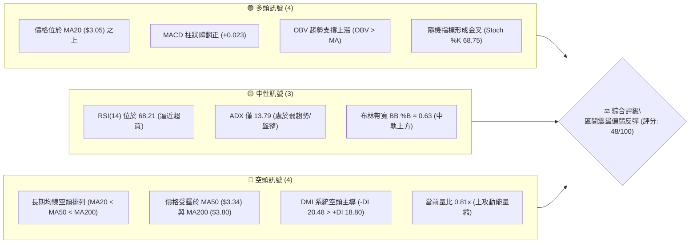
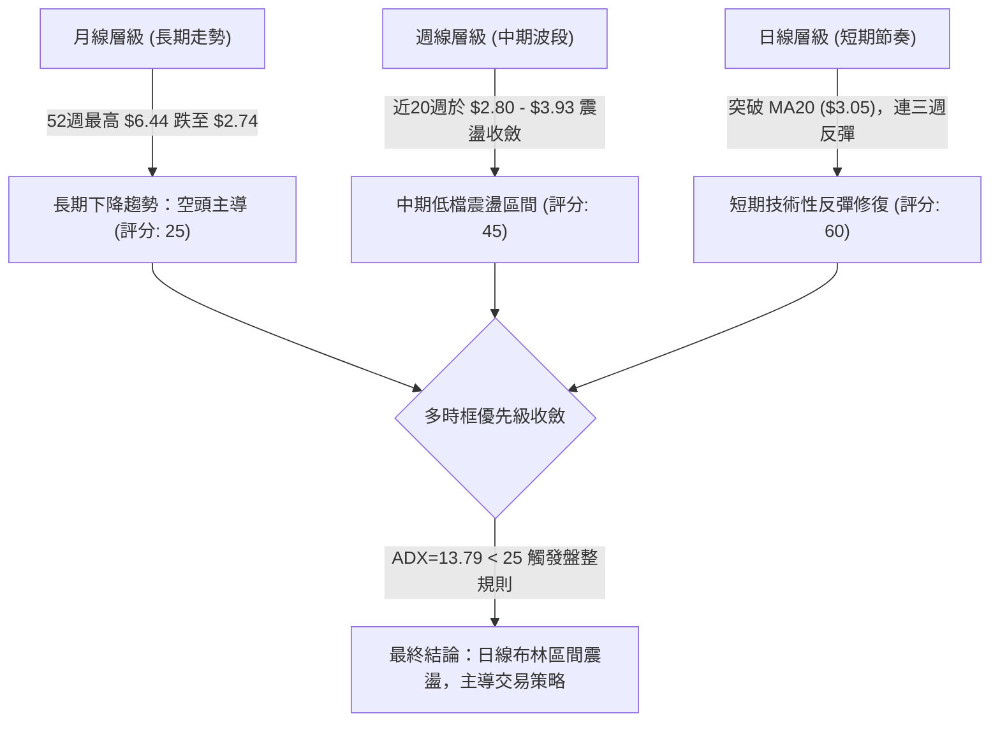
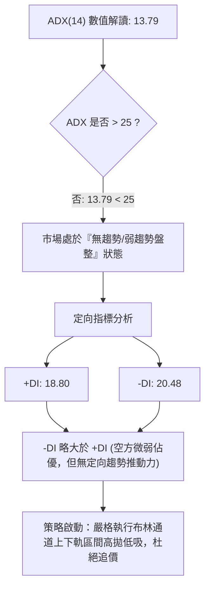
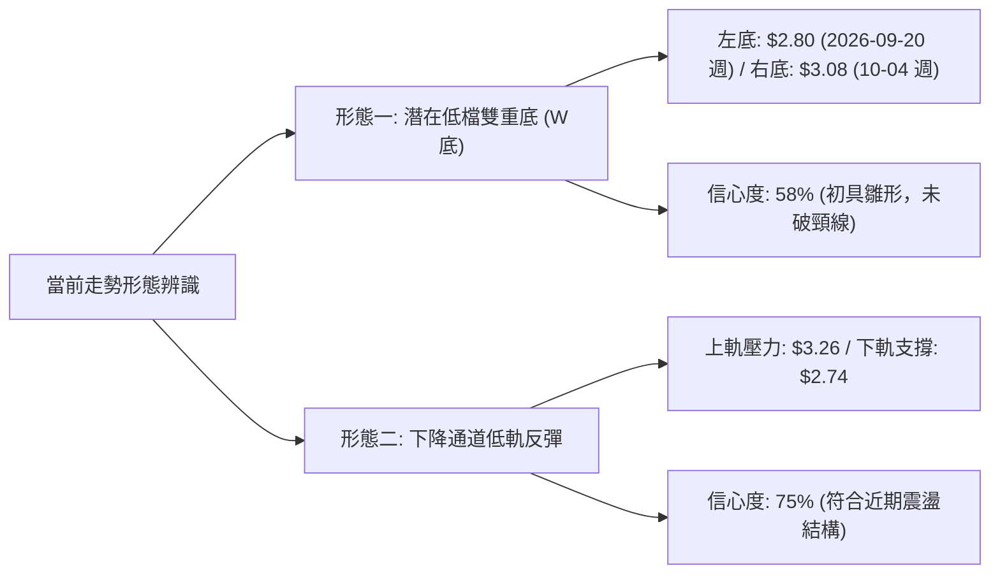
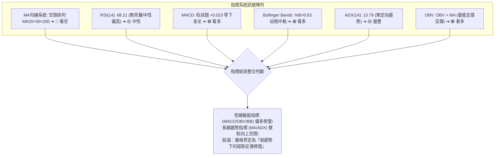
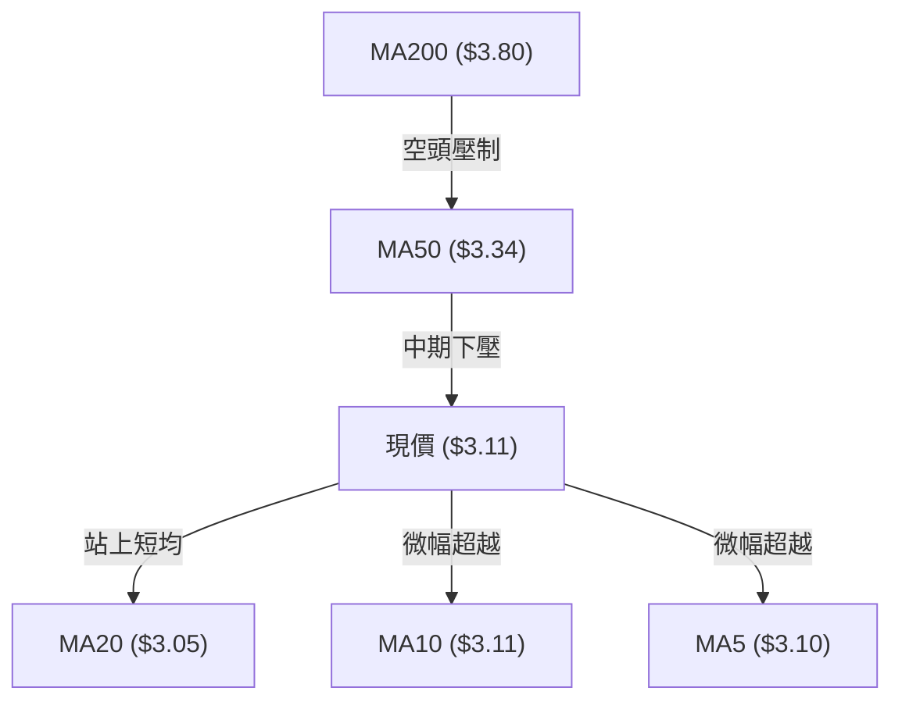
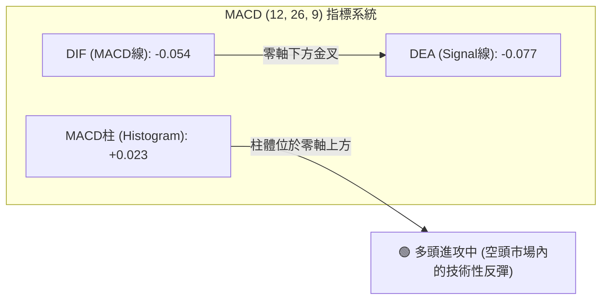
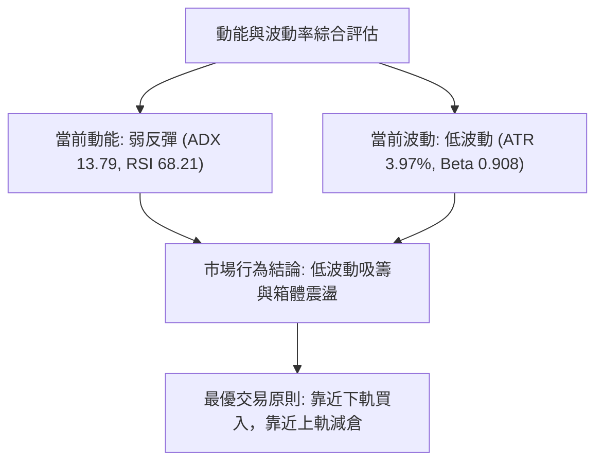
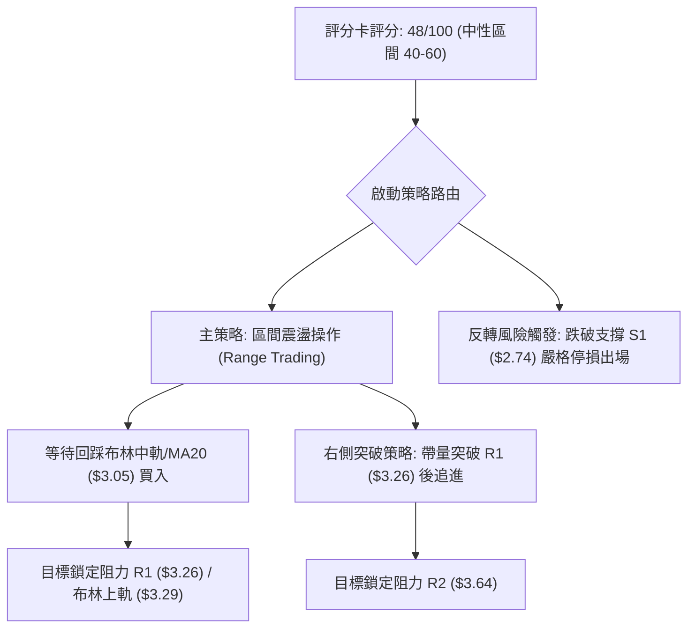
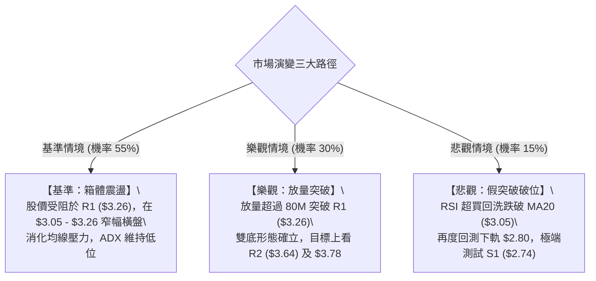

# GRAB 技術分析報告

> **報告日期**：2026-10-09 ｜ **語言**：繁體中文 ｜ **數據來源**：Yahoo Finance ｜ **當前價格**：$3.11

---

## 目錄

| 章節 | 內容 |
|------|------|
| [1. 技術面概覽](#1-技術面概覽) | 訊號儀表板、核心指標、評分卡 |
| [2. 趨勢分析](#2-趨勢分析) | 多時框趨勢、長中短期走勢 |
| [3. 圖表形態分析](#3-圖表形態分析) | 形態識別、K線組合、目標價 |
| [4. 支撐與阻力](#4-支撐與阻力) | 關鍵價位、斐波那契回調 |
| [5. 技術指標深度解讀](#5-技術指標深度解讀) | MA/RSI/MACD/布林/成交量 |
| [6. 動能與波動率](#6-動能與波動率) | 動能評估、ATR、Beta |
| [7. 多時框架總結](#7-多時框架總結) | 時框架評分矩陣 |
| [8. 交易策略建議](#8-交易策略建議) | 多空策略、風險報酬比 |
| [9. 風險提示與監控](#9-風險提示與監控) | 監控指標、風險場景 |

---

## 1. 技術面概覽

### 🎯 技術訊號儀表板



### 📊 核心指標速覽表

| 指標類別 | 指標名稱 | 當前數值 | 訊號 | 解讀 |
|----------|----------|----------|------|------|
| **價格** | 當前價格 | $3.11 | 🟡 | 位於52週區間的 10.0% 低檔，短線築底回升 |
| **均線** | MA20 | $3.05 | 🟢 | 股價站回短天期布林中軌/MA20上方 (+2.08%) |
| **均線** | MA50 | $3.34 | 🔴 | 股價位於中期均線下方 (-7.32%)，構成沉重中期反壓 |
| **均線** | MA200 | $3.80 | 🔴 | 長期牛熊分界線遙遙在上 (-18.16%)，長期結構為空頭 |
| **動能** | RSI(14) | 68.21 | 🟡 | 位於 30-70 中性偏高區域，無背離，但逼近超買警戒 |
| **動能** | MACD(12,26,9) | -0.054 / -0.077 | 🟢 | 柱狀圖為 +0.023，MACD 線於零軸下方出現底部金叉 |
| **動能** | DMI / ADX(14) | ADX: 13.79 | 🟡 | ADX < 25 為典型弱趨勢盤整；-DI(20.48) > +DI(18.80) |
| **通道** | Bollinger Bands | $2.80 - $3.29 | 🟡 | %B = 0.63，正朝上軌 $3.29 推進，面臨通道頂部壓制 |
| **量能** | 當日量 vs 均量 | 65.51M / 80.94M | 🔴 | 量比 0.81x，短線反彈未能顯著放量，警惕量價背離 |
| **波動** | ATR(14) | $0.12 | 🟡 | 每日平均波動幅度約 3.97%，日內波動度受限於區間 |

### 🏆 技術評分卡

```
╔══════════════════════════════════════════════════════════════════╗
║                技術評分卡 — GRAB (2026-10-09)                    ║
╠══════════════════════════════════════════════════════════════════╣
║ 趨勢強度 (ADX=13.79, -DI主導)   ██████░░░░░░░░░░░░░░  30/100 🔴 ║
║ 動能指標 (MACD翻紅, RSI=68.2)   █████████████░░░░░░░  65/100 🟢 ║
║ 支撐穩定度 (守住S1=$2.74低點)   ████████████░░░░░░░░  60/100 🟡 ║
║ 成交量配合 (量比0.81x, OBV正向) ██████████░░░░░░░░░░  50/100 🟡 ║
║ 形態完整度 (局部雙底打底中)     ██████████░░░░░░░░░░  50/100 🟡 ║
║ 均線排列 (空頭排列MA20<50<200)  ██████░░░░░░░░░░░░░░  30/100 🔴 ║
╠══════════════════════════════════════════════════════════════════╣
║ 綜合評分                       █████████░░░░░░░░░░░  48/100 🟡 ║
║ 最終評級                       中性觀望 / 區間震盪操作             ║
╚══════════════════════════════════════════════════════════════════╝
```

---

## 2. 趨勢分析

### 🌐 多時框趨勢分析



### 📈 長期趨勢 — 12個月走勢圖（Unicode）

```
GRAB 月線收盤走勢圖（2025-10 至 2026-10）
價格軸 ($)
$6.50 ┤
$6.00 ┤ ● (2025-10: $6.01)
$5.50 ┤    ● (11月: $5.45)
$5.00 ┤       ● (12月: $4.99)
$4.50 ┤          ● (2026-01: $4.30)
$4.00 ┤             ● (02月: $4.22)
$3.50 ┤                ● (03月: $3.66) ── ● (06月: $3.77) ── ● (08月: $3.54)
$3.00 ┤                                                       ● (09月: $3.11) ── ● 現價 ($3.11)
$2.50 ┤                                                          ▲ (年內低點 $2.74)
      └───────────────────────────────────────────────────────────────────────────►
        10   11   12   01   02   03   04   05   06   07   08   09   10  (月份)
```

**走勢特徵分析表格**：

| 時間階段 | 期間價格區間 | 累積漲跌幅 | 走勢特徵與量價結構 |
|----------|--------------|------------|--------------------|
| 2025-10 ~ 2025-12 | $6.01 → $4.99 | -16.97% | 自歷史波段頂點 $6.44 形成圓弧頂回落，放量下殺破位 |
| 2026-01 ~ 2026-03 | $4.30 → $3.66 | -14.88% | 跌破 $4.00 整數關卡，MA200 反轉向下，加速尋底 |
| 2026-04 ~ 2026-08 | $3.82 → $3.54 | -7.33% | 於 $3.50 - $3.93 區間構築中期平台，多次測試 $3.90 未果 |
| 2026-09 ~ 2026-10 | $3.11 → $3.11 | 0.00% | 9月中旬暴跌下探 52週新低 $2.74 後放量反彈，現收於 $3.11 |

### 📊 中期趨勢（週線分析）

```
                     週線層級壓力與支撐階梯圖
  $3.96 ═════════════════════════════════════════════════ R3: 7月波段反彈頂點 ($3.93~$3.96)
          │
  $3.64 ───┼───────────────────────────────────────────── R2: 8月中旬次高點 ($3.66~$3.64)
          │        ┌───┐
  $3.26 ───┼────────│   │──────────────────────────────── R1: 近期高點聚類 ($3.26) / BB上軌 ($3.29)
          │  ┌───┐ │   │ ┌───┐
  $3.11 ───┼──│   │─│   │─│   │◄─────── 現價 ($3.11)
          │  │   │ │   │ │   │
  $2.74 ══════╧═══╧═╧═══╧═╧═══╧══════════════════════════ S1: 52週極限低點 ($2.74)
         2026-09-20   09-27   10-04   10-11
```

近20週數據顯示，GRAB 於 2026-09-20 當週探底 $2.80（盤中觸及 52週低點 $2.74），隨後一週（09-27）爆出天量 527,094,200 股強勢反彈至 $3.13。過去三週收盤價分別為 $3.13、$3.08、$3.11，週線 MACD 柱狀體維持翻紅（+0.025、+0.028、+0.023），週線 RSI 從 10.6 的極度超賣修復至 68.2，顯示中期波段具備顯著的低檔承接力量，但上方面臨 $3.26 之密集反壓。

### ⚡ 趨勢強度評估（ADX 解讀）



| 指標變數 | 當前讀數 | 門檻區間 | 技術含義 |
|----------|----------|----------|----------|
| **ADX (14)** | 13.79 | < 20 極弱趨勢 | 趨勢動能極其匱乏，任何單邊突破極易演變為假突破 |
| **+DI** | 18.80 | - | 多頭動能自低位小幅回升，但仍處於次級地位 |
| **-DI** | 20.48 | - | 空頭主導力量顯著減弱，但數值仍高於 +DI |
| **DI 差值** | -1.68 | 接近 0 | 雙方力量極度拉鋸，確認當前市場處於橫盤吸籌/整理期 |

---

## 3. 圖表形態分析

### 🔍 形態識別系統



| 形態名稱 | 信心度 | 判斷依據（引用數據） | 完成度 | 目標價（附計算式） |
|----------|--------|----------------------|--------|--------------------|
| **潛在雙重底 (Double Bottom)** | 58% | 第一個低點於 2026-09-20 週收 $2.80（低點 $2.74），隨後回升至 $3.13，次週回踩 $3.08 守穩並反彈至現價 $3.11。 | 60% | 頸線為反彈高點 $3.26；形態高度 = $3.26 - $2.74 = $0.52；突破後目標價 = $3.26 + $0.52 = **$3.78** (接近 MA200 $3.80) |
| **矩形箱體整理 (Range Consolidation)** | 75% | 價格在支撐位 S1 ($2.74) 與阻力位 R1 ($3.26) 之間進行區間震盪，ADX=13.79 高度符合盤整特徵。 | 85% | 箱頂目標 = **$3.26**；若向上有效突破，量度目標 = $3.26 + ($3.26 - $2.74) = **$3.78** |
| **頭肩底形態** | <30% | 數據中未偵測到完整的左肩與右肩對稱成交量結構，不可主觀強加。 | 0% | 訊號不足，僅做指標型解讀 |

### 🕯️ 重要K線形態分析

| 週/月份 | 收盤價 | K線形態 | 解讀 | 訊號 |
|---------|--------|---------|------|------|
| **2026-09-20** | $2.80 | 長下影極限大陰線 (收盤逼近 $2.74) | 空頭恐慌盤湧出，觸及52週低點，RSI降至10.6歷史超賣極值 | 🔴 探底極限 |
| **2026-09-27** | $3.13 | 爆量長陽吞沒 (Volume: 527.09M) | 單週出現全期最大巨量，多頭主力強勢進場承接，吞沒前週陰線實體 | 🟢 底部吞沒 |
| **2026-10-04** | $3.08 | 縮量十字回踩 (Volume: 337.15M) | 回踩確認 $3.05 (MA20) 支撐未破，成交量顯著萎縮，洗盤特徵明顯 | 🟡 縮量回踩 |
| **2026-10-11** | $3.11 | 短紅小實體K棒 (Volume: 328.44M) | 站穩 MA20 ($3.05) 上方震盪收紅，MACD 柱維持綠轉紅延續 | 🟢 溫和看多 |

### 📉 ASCII 走勢形態示意圖

```
                 GRAB 潛在雙底打底示意圖
 價格 ($)
 $3.30 ┤                      (突破頸線需越過 R1: $3.26)
       │                      頸線阻力位 ───┬──────────────── R1: $3.26
 $3.20 ┤                                   │
       │                         ●($3.13)  │      ● 現價: $3.11
 $3.10 ┤                        / \        │     /
       │                       /   \       │    /
 $3.00 ┤                      /     \      └───● ($3.08 次低點)
       │                     /       \
 $2.90 ┤                    /         \
       │                   /
 $2.80 ┤         ●($2.80) ┘
       │        /
 $2.70 ┤───────● (年內極限低點 S1: $2.74) ───────────────────────
       └────────────────────────────────────────────────────────► 時間
                左底 (2026-09-20)           右底 (2026-10-04)
```

### 🎯 形態目標價計算

若當前潛在雙重底（W底）形態獲得確認，其推算公式如下：
1. **基底低點**：$2.74（52週低點聚類支撐 S1）
2. **形態頸線**：$3.26（近一年波段高點聚類阻力 R1）
3. **形態垂直高度**：$\text{頸線} - \text{基底} = \$3.26 - \$2.74 = \$0.52$
4. **最小量度目標價 (T1)**：$\text{頸線} + \text{形態高度} = \$3.26 + \$0.52 = \mathbf{\$3.78}$（該數值與 MA200 均線位置 \$3.80 高度重疊）
5. **延伸量度目標價 (T2)**：若進一步突破 R2 ($3.64)，下一個波段高點聚類為 **$3.96** (阻力位 R3)。

---

## 4. 支撐與阻力

### 🗺️ 關鍵價位分布圖（Unicode）

```
GRAB 價位結構分布圖 (由 OHLCV 與歷史波段聚類精確計算)
═══════════════════════════════════════════════════════════════════
$3.96 ║████████████████████████████████████║ 強阻力 R3 (+27.22%)
$3.80 ║────────────────────────────────────║ 長期均線 MA200 關鍵牛熊分水嶺
$3.64 ║████████████████████████            ║ 阻力位 R2 (+17.12%)
$3.53 ║┄┄┄┄┄┄┄┄┄┄┄┄┄┄┄┄┄┄┄┄┄┄┄┄┄┄┄┄┄┄┄┄║ 斐波那契 78.6% 回調位
$3.34 ║────────────────────────────────────║ 中期均線 MA50 壓力線
$3.29 ║┈┈┈┈┈┈┈┈┈┈┈┈┈┈┈┈┈┈┈┈┈┈┈┈┈┈┈┈┈┈┈┈┈┈┈┈║ 布林通道上軌
$3.26 ║████████████████████████████        ║ 關鍵頸線阻力 R1 (+4.82%)
$3.11 ╠════════════════════════════════════╣ ◄ 當前收盤價 ($3.11)
$3.05 ║────────────────────────────────────║ 布林中軌 / MA20 短期多空分界線
$2.80 ║┈┈┈┈┈┈┈┈┈┈┈┈┈┈┈┈┈┈┈┈┈┈┈┈┈┈┈┈┈┈┈┈┈┈┈┈║ 布林通道下軌
$2.74 ║████████████████████████████████████║ 核心支撐 S1 (-11.90% / 52W Low)
═══════════════════════════════════════════════════════════════════
```

### 🚧 阻力位分析表

| 阻力級別 | 價位 | 形成原因 | 突破難度 | 重要性 |
|----------|------|----------|----------|--------|
| **R1** | $3.26 | 近一年波段高點聚類、貼近布林上軌 ($3.29)、短期W底頸線 | ★★★☆☆ (中等) | 決定短線反彈能否演變為波段反攻之首要樞紐 |
| **R2** | $3.64 | 近一年波段高點聚類、8月中旬震盪高點 ($3.66)、斐波那契 78.6% ($3.53) 上方 | ★★★★☆ (高) | 空頭中期防守重鎮，若能攻克將扭轉日線級別跌勢 |
| **R3** | $3.96 | 近一年波段高點聚類、7月份反彈頂點 ($3.93) 與 MA200 ($3.80) 之上密集套牢區 | ★★★★★ (極高) | 長期空頭趨勢防線，未放巨量難以突破 |

### 🛡️ 支撐位分析表

| 支撐級別 | 價位 | 形成原因 | 守住機率 | 重要性 |
|----------|------|----------|----------|--------|
| **動態支撐** | $3.05 | MA20 移動平均線、布林通道中軌、過去兩週密集震盪下緣 | 70% | 短線多頭防守底線，跌破則回測下軌 |
| **動態下軌** | $2.80 | 布林通道下軌、9月20日週收盤價 ($2.80) | 80% | 區間震盪極限下邊界 |
| **S1** | $2.74 | 52週極限低點、近一年波段低點聚類、斐波那契 100.0% 終極支撐 | 85% | 核心生命線，一旦失守將開啟無支撐破底走勢 |

### 📐 斐波那契回調位分析

依據 52週極值區間（低點 $2.74 至 高點 $6.44，垂直落差 $3.70）精確計算之回調位如下：

```
0.0%  (52W High) ─── $6.44  [年內最高點]
23.6% ────────────── $5.57  [強勢反彈壓力]
38.2% ────────────── $5.03  [中樞壓力位]
50.0% ────────────── $4.59  [多空平衡中值]
61.8% ────────────── $4.15  [黃金分割關鍵位]
78.6% ────────────── $3.53  [極深回撤分水嶺]
                     $3.11  ◄◄◄ 現價位於 78.6% ($3.53) 與 100.0% ($2.74) 之間
100.0% (52W Low) ─── $2.74  [年度波段最低點]
```

**解讀**：
當前價格 $3.11 深深陷於斐波那契 78.6%（$3.53）至 100.0%（$2.74）的極端超跌防守區間內。股價距離 100.0% 終極低點僅差 $0.37（+13.5% 自低點反彈幅度）。這表明該標的自 52週高點 $6.44 的下跌波段已抹去所有漲幅，目前處於空頭行情的尾端震盪築底階段。78.6% 位置（$3.53）將成為向上反彈的第一個斐波那契大阻力，未收復 $3.53 之前，長期結構依然受制於空方框架。

---

## 5. 技術指標深度解讀

### 🎛️ 指標訊號總覽



### 📈 移動平均線排列分析



| 均線名稱 | 當前價位 | 現價相對偏離度 | 走勢趨向 | 技術解讀 |
|----------|----------|----------------|----------|----------|
| **MA5** | $3.10 | +0.26% | 走平向上 | 極短線支撐，提供微弱上攻動能 |
| **MA10** | $3.11 | +0.00% | 走平 | 多空平衡點，現價與其精確重疊 |
| **MA20** | $3.05 | +2.08% | 向上拐頭 | 短期多空分水嶺，站穩此線確立日線級別反彈 |
| **MA50 (60)**| $3.34 ($3.36) | -7.32% (-7.44%) | 持續向下 | 中期下行壓力線，與阻力 R1 ($3.26) 構成上方重疊夾板 |
| **MA120** | $3.51 | -11.31% | 向下走跌 | 半年線防線，貼近斐波那契 78.6% ($3.53) |
| **MA200 (240)**| $3.80 ($4.07) | -18.16% (-23.63%) | 向下傾斜 | 長期下行趨勢顯著，典型空頭排列（MA20 < MA50 < MA200） |

### 📉 RSI(14) 分析

當前日線 RSI(14) 讀數為 **68.21**。

```
RSI(14) 儀表尺：
0 ─────── 30 ───────────────────── 50 ────────────── 68.21 ── 70 ─────── 100
[  超賣區  ]       [   偏弱區   ]      [   強勢區   ]   ▲ [ 超買警戒區 ]
                                                  當前讀數 (68.21)
進度條: ████████████████████████████████████████░░░░░░░░░░░░░░░░░░ 68.21%
```

**背離與形態判斷**：
- **背離分析**：日線數據中顯示「RSI背離：無明顯背離」。週線層級則經歷了極端的均值回歸：9月20日週收盤時 RSI 為極度超賣的 **10.6**，隨後股價自 $2.80 反彈至 $3.11，週線 RSI 大幅拉升至 **68.2**。此過程屬於嚴重的「超賣修復」，而非高檔頂背離或底背離。
- **風險警示**：目前日線 RSI(14) 達到 68.21，已極度逼近 70 的傳統超買門檻。在 ADX=13.79 的弱勢市場環境下，RSI 達到 70 往往意味著反彈動能衰竭，短線追高面臨回洗風險。

### 📊 MACD(12/26/9) 訊號解讀



- **MACD線 (DIF)**：-0.054
- **訊號線 (DEA)**：-0.077
- **柱狀圖 (Histogram)**：+0.023
- **深度研判**：DIF 與 DEA 均位於零軸（0.00）下方，表明長期大環境依然由空方控盤。然而，DIF 由下向上穿越 DEA 形成「零下金叉」，柱狀體持續為正（+0.023），週線 MACD 柱亦連續三週維持翻紅（+0.025、+0.028、+0.023）。這確認了低檔存在實質性的買盤推動反彈，但由於處在零下，此金叉性質嚴格定義為「空頭抵抗與反彈」，而非新一輪主升浪。

### 📦 布林通道分析

```
            GRAB 布林通道 (20, 2) 價位結構圖
  $3.29 ────────────────────────────────────────── BB 上軌 (阻力壓制區)
          ▲
          │   當前價格 $3.11 (%B = 0.63，位於中軌與上軌之間)
  $3.11 ──┼───●───────────────────────────────────
          │
  $3.05 ──┴─────────────────────────────────────── BB 中軌 (MA20 短期支撐)
  
  $2.80 ────────────────────────────────────────── BB 下軌 (極限支撐區)
```

- **上軌**：$3.29
- **中軌 (MA20)**：$3.05
- **下軌**：$2.80
- **帶寬與位置 (%B)**：%B 為 **0.63**。通道寬度為 $3.29 - $2.80 = $0.49。股價站上中軌 $3.05 並向上軌推進。在弱趨勢（ADX<25）下，布林通道上軌（$3.29）與水平阻力位 R1（$3.26）高度聚攏，將形成極強的帶狀反壓，現價向上僅剩約 $0.15~$0.18 的緩衝空間。

### 💹 成交量分析（量價配合度）

```
當日成交量 vs 均量對比：
當日成交量 (65.51M)  ████████████████░░░░ 65.51M
20日均量   (80.94M)  ████████████████████ 80.94M (量比: 0.81x)
50日均量   (58.75M)  ██████████████░░░░░░ 58.75M
```

- **量比解讀**：最新成交量 65.51M，量比僅為 0.81x，顯示反彈至 $3.11 之際追價意願有所降溫。
- **OBV 能量潮解讀**：數據明確指出「OBV趨勢：OBV > MA → 量能支撐上漲」。這得益於 2026-09-27 當週創下的 527.09M 歷史天量，巨量陽線將 OBV 基準線顯著抬高。雖然短線日成交量略微縮小，但底層資金沉澱結構良好，未出現籌碼大規模派發跡象。

---

## 6. 動能與波動率

### ⚡ 動能評估四象限

```
           動能 vs 波動率 象限分佈
   高動能 ┼───────────────────────────────┤
          │ Q3: 高風險高收益  │ Q1: 最佳趨勢  │
          │                   │               │
          ├───────────────────┼───────────────┤
          │ Q4: 弱勢加速區    │ Q2: 謹慎區間  │
          │                   │   ★ GRAB      │
   低動能 ┼───────────────────┴───────────────┤
          低波動 (ATR=$0.12)       高波動
```

| 象限代號 | 動能狀態 | 波動狀態 | GRAB 當前定位 | 操作指導意義 |
|----------|----------|----------|---------------|--------------|
| **Q1** | 強 | 高 | 否 | 主升浪/單邊趨勢，積極追突破 |
| **Q2 (當前)** | **弱 (反彈動能)** | **低至中 (ATR=3.97%)** | **✓ 符合定位** | **區間橫盤震盪，嚴禁追漲，適合網格/高拋低吸** |
| **Q3** | 強 | 低 | 否 | 蓄勢突破階段 |
| **Q4** | 弱 | 高 | 否 | 恐慌破位下殺，嚴格停損出場 |



### 📊 ATR 波動率分析

- **ATR(14)**：**$0.12**
- **ATR 佔比**：約為當前股價的 **3.97%**
- **波動特性分析**：每日 $0.12 的平均振幅說明市場投機炒作情緒不高，價格運動極具可預測的區間節奏。
- **止損距離建議**：
  - *短線交易止損*：建議設為 $1.5 \times \text{ATR} = 1.5 \times \$0.12 = \mathbf{\$0.18}$。
  - *波段交易止損*：建議設為 $2.0 \times \text{ATR} = 2.0 \times \$0.12 = \mathbf{\$0.24}$。

### 📐 Beta 與市場相關性

- **Beta 係數**：**0.908**
- **市場特徵**：Beta < 1.0，表明 GRAB 與美股大盤（S&P 500 / NASDAQ）具備高度正相關性，但整體波動幅度略小於大盤。其股價缺乏獨立於大盤的暴烈走勢，更多呈現跟隨性防守特徵。在科技板塊未全面轉強前，GRAB 難以走出單邊逆勢爆發行情。

---

## 7. 多時框架總結

### 📋 時框架評分表

| 時框架 | 趨勢方向 | 動能狀態 | 均線排列 | 形態結構 | 綜合評分 | 操作建議 |
|--------|----------|----------|----------|----------|----------|----------|
| **長期 (月線)** | 空頭下跌 🔴 | 弱勢築底 🔴 | 空頭排列 (MA200壓制) 🔴 | 圓弧頂後腰部破位 🔴 | 25/100 🔴 | 長線資金不可建重倉 |
| **中期 (週線)** | 低檔盤整 🟡 | 底部修復 🟢 | 均線向下發散收斂 🟡 | 探底 $2.74 放量回升 🟢 | 45/100 🟡 | 底部籌碼鎖定，觀望 |
| **短期 (日線)** | 技術反彈 🟢 | 偏多震盪 🟢 | 站上 MA20，受阻 MA50 🟡 | 布林中軌反彈 🟢 | 60/100 🟢 | 區間內高拋低吸 |

### 🔲 綜合訊號矩陣

```
┌─────────────┬────────────────┬────────────────┬────────────────┐
│ 時框維度    │ 訊號方向       │ 主導技術指標   │ 驗證狀態       │
├─────────────┼────────────────┼────────────────┼────────────────┤
│ 日線 (短期) │ 偏多 (反彈)    │ MACD金叉/OBV>MA│ 部分驗證 (量略縮)│
│ 週線 (中期) │ 中性 (震盪)    │ ADX=13.79/DI交纏│ 高度確認 (盤整)│
│ 月線 (長期) │ 偏空 (下行)    │ MA20<50<200    │ 趨勢確認 (空頭)│
└─────────────┴────────────────┴────────────────┴────────────────┘
```

### ⚖️ 多時框收斂結論

> **依據多時框收斂規則（嚴格要求 14）**：
> 1. **趨勢/盤整行情判定**：當前 ADX(14) 讀數為 **13.79**（遠低於 25 臨界值），明確判定當前為**盤整行情**。
> 2. **主導時框與交易邊界**：規則明定「盤整行情（ADX<25）：以日線布林通道上下軌為主要交易區間」。因此，中長期空頭均線暫不主導短期交易節奏，而由日線布林帶（**下軌 $2.80 至 上軌 $3.29**）及關鍵高低點聚類（**S1: $2.74 至 R1: $3.26**）作為主導邊界。
> 3. **收斂方向性結論**：**中性偏多區間震盪（Neutral-to-Bullish Consolidation）**。短期動能支持價格向區間上軌 $3.26~$3.29 推進，但缺乏突破轉為大趨勢的力量。

---

## 8. 交易策略建議

### 🗺️ 策略決策流程圖



### 🧭 策略路由（依評分卡分流）

**當前主策略方向 = 中性區間震盪操作（依評分 48/100，落於 40–60 中性區間）**

本策略專注於在日線布林通道與關鍵聚類價位間進行高拋低吸，嚴格禁止追價，靜待形態明確突破。

### 🎯 價格情境階梯（Price Scenarios）

| 觸發條件 | 下一目標 | 後續延伸 | 情境含義 |
|----------|----------|----------|----------|
| **向上突破 R1 $3.26** | **R2 $3.64** | **R3 $3.96** | 短線轉強，W底頸線突破，確立波段反轉 |
| **站穩現價區間 ($3.05~$3.11)** | **R1 $3.26** | — | 區間震盪，沿布林中軌向上軌緩步爬升 |
| **跌破 MA20 $3.05** | **BB下軌 $2.80** | **S1 $2.74** | 短線反彈失敗，重回區間底部尋找支撐 |
| **跌破 S1 $2.74** | 數據中未偵測到 | 破底走勢 | 52週低點失守，長期空頭趨勢加速延續 |

### 📊 情境機率分佈

| 情境 | 機率 | 主要依據 |
|------|------|----------|
| **區間震盪整理** | **55%** | ADX 僅 13.79 (典型盤整)、布林帶帶寬收窄、量比 0.81x 缺乏單邊推進動能 |
| **上行突破測試 R1/R2** | **30%** | MACD 柱狀體翻正 (+0.023)、OBV 走勢健康、週線連續三週收紅 |
| **再度下探跌破 S1** | **15%** | 長期均線空頭排列、-DI (20.48) 仍微幅壓制 +DI (18.80) |

### 🟢 主策略詳情（方向：區間操作與突破回踩）

所有進場點、止損點及目標價**完全引用**自 OHLCV 計算之關鍵價位及形態推算值：

| 策略要素 | 策略 A（區間中軌低吸 — 左側/波段） | 策略 B（突破頸線追買 — 右側突破） |
|----------|----------------------------------|----------------------------------|
| **策略類型** | 箱體內部支撐低吸 | 關鍵阻力破位順勢做多 |
| **進場條件** | 價格回踩 MA20 / 布林中軌企穩不破 | 日線收盤價帶量突破阻力位 R1 |
| **進場價格** | **$3.05** | **$3.27** (站上 R1 $3.26 確認) |
| **目標價 T1** | **$3.26** (阻力位 R1，空間 +6.88%) | **$3.64** (阻力位 R2，空間 +11.31%) |
| **目標價 T2** | **$3.64** (阻力位 R2，空間 +19.34%) | **$3.78** (雙底量度目標價，空間 +15.59%) |
| **止損價格** | **$2.93** ($3.05 - 1ATR $0.12) | **$3.15** (突破點回撤 1ATR $0.12) |
| **風險報酬比** | **1 : 1.75** (至T1) / **1 : 4.91** (至T2) | **1 : 3.08** (至T1) / **1 : 4.25** (至T2) |
| **成功機率** | **60%** | **50%** |
| **建議倉位** | **10% - 15%** (輕倉試探) | **15% - 20%** (確認信號後加碼) |

### 🔴 反向風險觸發點（對沖提示）

若持有多頭部位，當出現以下訊號時必須立即止損或建立反向避險保護：
1. **跌破動態支撐 $3.05**：若日線實體跌破布林中軌，表示短線反彈終結，應至少減倉 50%。
2. **終極反轉點 $2.74 (S1)**：若股價跌破 $2.74，意味著 52週低點失守，潛在 W 底破局，應全面清倉離場，空頭將重掌絕對主導權。

### ⭐ 整體訊號強度評星

```
做多訊號強度：★★★☆☆  (3/5星 — 動能具備但受制於區間上限)
做空訊號強度：★★☆☆☆  (2/5星 — 短線殺跌動能枯竭，低檔承接強勁)
整體可信度：  ★★★★☆  (4/5星 — 數據高度收斂於低波動盤整模型)
```

---

## 9. 風險提示與監控

### ✅ 關鍵監控指標 Checklist

```
╔══════════════════════════════════════════════════════════════════╗
║                    技術監控清單 (DAILY CHECKLIST)                ║
╠══════════════════════════════════════════════════════════════════╣
║ [ ] 價格能否守住 MA20 ($3.05) 關鍵中軌支撐                       ║
║ [ ] RSI(14) 接近 70 (目前 68.21) 是否出現鈍化或頂背離反轉        ║
║ [ ] 成交量是否放大超過 20日均量 (80.94M) 以支撐挑戰 R1 ($3.26)   ║
║ [ ] MACD 柱狀體 (+0.023) 是否出現收斂縮腳現象                    ║
║ [ ] ADX(14) 是否從 13.79 低檔抬頭並突破 20 (判斷趨勢是否啟動)    ║
║ [ ] +DI 是否能有效超越 -DI (突破 20.48 門檻)                     ║
║ [ ] 52週極限低點 S1 ($2.74) 之絕對安全距離是否維持在 10% 以上    ║
╚══════════════════════════════════════════════════════════════════╝
```

### ⚠️ 風險場景分析



### 🛡️ 風險管理重要提醒

1. **區間震盪嚴禁追高**：當前 RSI 達 68.21，已進入敏感區。現價 $3.11 距離阻力位 R1（$3.26）僅 +4.82% 空間，盈虧比不支持現價直接市價追入，必須等待回踩或突破確認。
2. **嚴格執行 ATR 止損機制**：GRAB 當前日波幅 ATR 為 $0.12（3.97%）。任何單筆交易虧損應嚴格控制在 1.5 倍 ATR（約 $0.18）以內，避免因橫盤陰跌導致不可逆虧損。
3. **長期均線壓制之倉位控制**：在股價有效站穩 MA200（$3.80）之前，任何操作均屬空頭市場中的反彈行情，整體持倉部位不宜超過總資金的 20%，維持高現金流動性以防範市場系統性風險。

---

## 📋 報告總結

```
╔══════════════════════════════════════════════════════════════════╗
║                   GRAB 技術分析報告總結                          ║
╠══════════════════════════════════════════════════════════════════╣
║ 報告日期：2026-10-09                                             ║
║ 當前價格：$3.11                                                  ║
║ 分析評級：⚖️ 中性觀望 / 區間震盪 (綜合評分: 48/100)               ║
║                                                                  ║
║ 關鍵結論：                                                       ║
║ ├─ 長期趨勢：🔴 空頭主導 (受壓於 MA200 $3.80 與斐波那契 78.6%)   ║
║ ├─ 中期趨勢：🟡 築底震盪 (ADX=13.79 盤整，下檔受 S1 $2.74 支撐)   ║
║ ├─ 短期趨勢：🟢 偏強反彈 (站上 MA20 $3.05，MACD 柱翻紅 +0.023)    ║
║ ├─ 關鍵支撐：S1: $2.74 (52W Low) │ 動態支撐: $3.05 (MA20)       ║
║ ├─ 關鍵阻力：R1: $3.26 │ R2: $3.64 │ R3: $3.96                  ║
║ └─ 分析師目標：共識評級 Strong Buy / 平均目標價 $5.76 (基本面)   ║
║                                                                  ║
║ 最優策略組合：                                                   ║
║ 1. 🥇 最佳機會：策略 A (回踩 MA20 $3.05 企穩低吸，博弈反彈至 R1) ║
║ 2. 🥈 次選機會：策略 B (帶量突破 R1 $3.26 後順勢進場，目標 R2)   ║
║ 3. 🥉 保守選擇：場外觀望，等待 ADX 升破 25 或突破 $3.26 頸線確認 ║
╚══════════════════════════════════════════════════════════════════╝
```

---

> ⚠️ **免責聲明**：本報告為 AI 自動生成之技術分析，所有數據及估算均基於提供的歷史價格資訊。本報告**僅供研究與學術參考**，**不構成任何投資建議**。投資有風險，入市需謹慎。

---

*報告生成時間：2026-10-09 ｜ 數據來源：Yahoo Finance ｜ 分析框架：多時框技術分析*