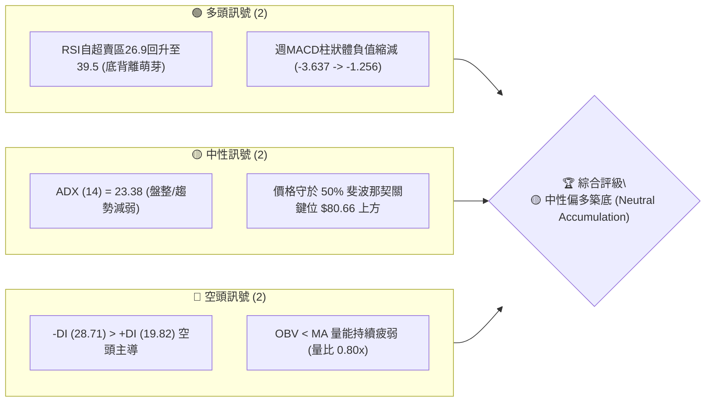
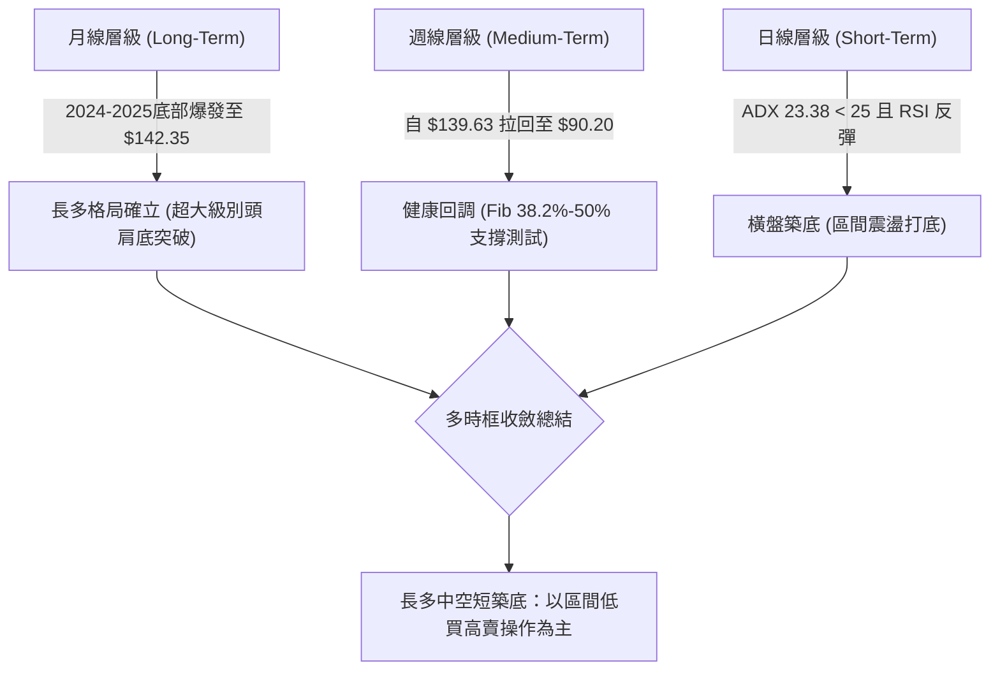
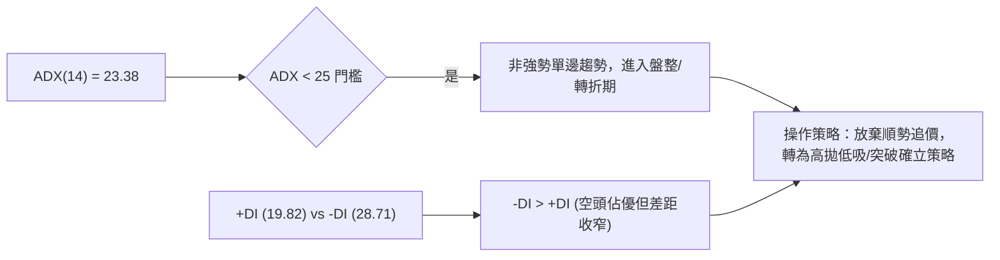
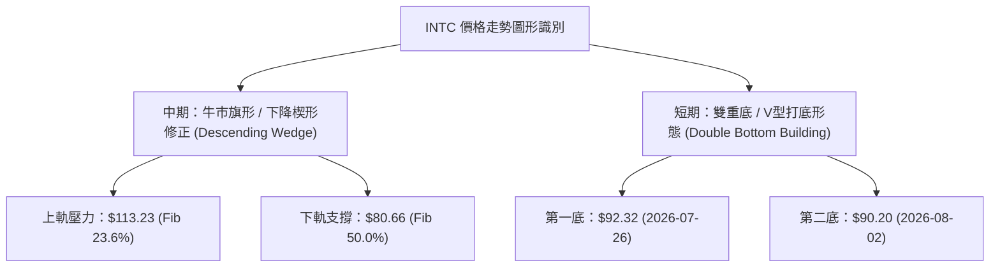
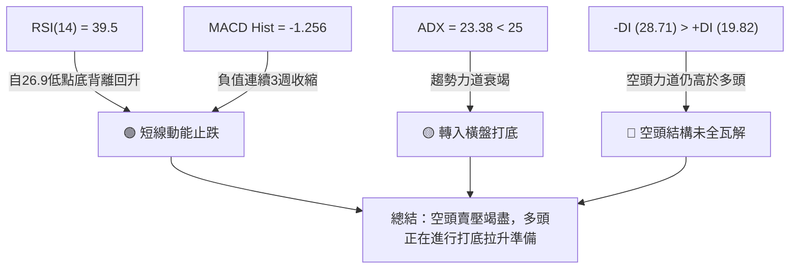
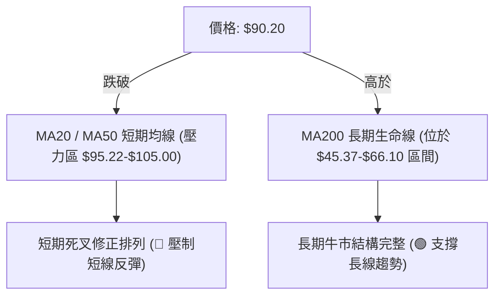
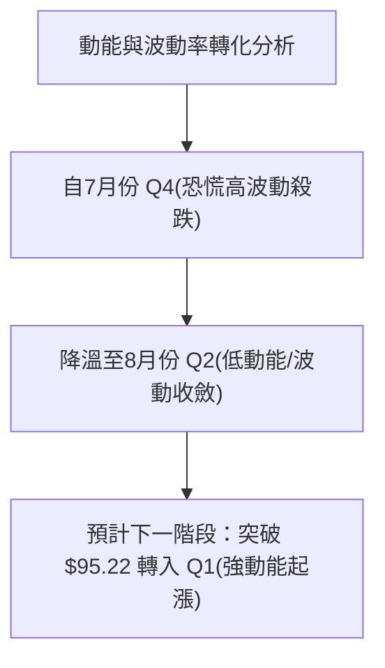
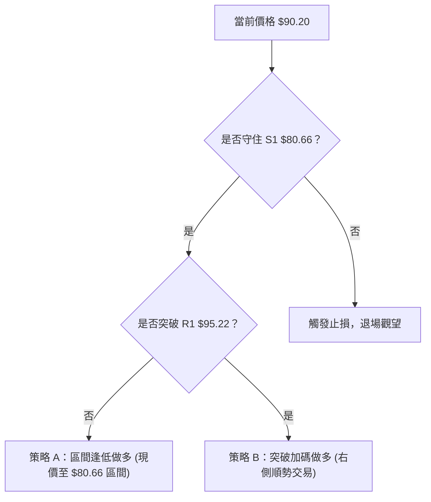
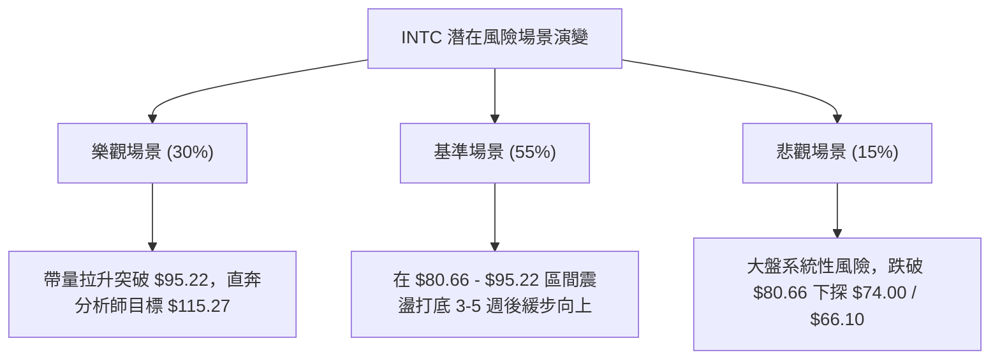

# INTC 技術分析報告

> **報告日期**：2026-08-04 ｜ **語言**：繁體中文 ｜ **數據來源**：Yahoo Finance ｜ **當前基準價格**：$90.20

---

## 目錄

| 章節 | 內容 |
|------|------|
| [1. 技術面概覽](#1-技術面概覽) | 訊號儀表板、核心指標、評分卡 |
| [2. 趨勢分析](#2-趨勢分析) | 多時框趨勢、長中短期走勢 |
| [3. 圖表形態分析](#3-圖表形態分析) | 形態識別、K線組合、目標價 |
| [4. 支撐與阻力](#4-支撐與阻力) | 關鍵價位、斐波那契回調 |
| [5. 技術指標深度解讀](#5-技術指標深度解讀) | MA/RSI/MACD/布林/成交量 |
| [6. 動能與波動率](#6-動能與波動率) | 動能評估、ATR、Beta |
| [7. 多時框架總結](#7-多時框架總結) | 時框架評分矩陣 |
| [8. 交易策略建議](#8-交易策略建議) | 多空策略、風險報酬比 |
| [9. 風險提示與監控](#9-風險提示與監控) | 監控指標、風險場景 |

---

## 1. 技術面概覽

### 🎯 技術訊號儀表板



### 📊 核心指標速覽表

| 指標類別 | 指標名稱 | 當前數值 | 訊號 | 解讀 |
|----------|----------|----------|------|------|
| **價格** | 當前價格 | $90.20 | 🟡 中性 | 52週高點 $142.35 急遽拉回後，於 38.2%~50% 斐波區間尋求支撐 |
| **均線** | 短期均線 (MA20/50) | 均線下方 | 🔴 空頭 | 價格短期跌破短均線，均線系統呈修正排列 |
| **均線** | 長期均線 (MA200) | 均線上方 | 🟢 多頭 | 遠高於 2024–2025 年打底平台 ($18.97–$24.35)，長期多頭未破壞 |
| **動能** | RSI(14) | 39.5 | 🟡 中性 | 由超賣區 26.9 強勢反彈，短線空頭動能耗盡，進入築底期 |
| **動能** | MACD(12,26,9) | -7.509 | 🔴 空頭 | 雙線位於零軸下方，但柱狀圖由 -3.637 連續縮減至 -1.256 |
| **趨勢** | ADX(14) | 23.38 | 🟡 中性 | ADX < 25 顯示單邊下跌趨勢結束，市場轉入區間震盪行情 |
| **量能** | 成交量 / OBV | 0.80x / 低於MA | 🔴 空頭 | 縮量拉回，量能未及50日均量，追價買盤尚待觀望 |

### 🏆 技術評分卡

```
╔══════════════════════════════════════════════════════════════╗
║              技術評分卡 — INTC (2026-08-04)                 ║
╠══════════════════════════════════════════════════════════════╣
║ 趨勢強度      ████████░░░░░░░░░░░░  40/100  🟡 中性       ║
║ 動能指標      ██████████░░░░░░░░░░  50/100  🟡 中性       ║
║ 支撐穩定度    ██████████████░░░░░░  70/100  🟢 偏多       ║
║ 成交量配合    ████████░░░░░░░░░░░░  40/100  🔴 偏空       ║
║ 形態完整度    ████████████░░░░░░░░  60/100  🟡 中性       ║
║ 均線排列      ████████░░░░░░░░░░░░  40/100  🔴 偏空       ║
╠══════════════════════════════════════════════════════════════╣
║ 綜合評分      ██████████░░░░░░░░░░  50/100  🟡 中性築底   ║
╚══════════════════════════════════════════════════════════════╝
```

---

## 2. 趨勢分析

### 🌐 多時框趨勢分析



### 📈 長期趨勢 — 12個月走勢圖（Unicode）

```
INTC 月線走勢圖（過去 12 個月：2025-08 至 2026-07）
價格軸 ($)
$140 ┤                               ● $139.63 (波段極致高點)
$120 ┤                         ●
$100 ┤                   ●           ● $90.20 (現價收盤)
 $80 ┤
 $60 ┤
 $40 ┤             ●
 $20 ┤ ●     ●
      └───────────────────────────────────────────────────►
       08/25 10/25 01/26 04/26 06/26 07/26 (月份)
```

#### 24個月歷史走勢特徵分析表：

| 階段 | 時間區間 | 價格區間 | 漲跌幅 | 走勢特徵與市場心理 |
|------|----------|----------|--------|--------------------|
| **1. 底盤築底期** | 2024-08 ~ 2025-05 | $19.43 – $24.35 | 震盪打底 | 市場極度悲觀，籌碼在 $18.97 附近完成充分換手與長線打底 |
| **2. 初升段爆發** | 2025-08 ~ 2026-03 | $24.35 – $46.47 | +90.8% | 基本面改善，轉型成效顯現，主力資金持續進駐，突破歷史頸線 |
| **3. 主升段飆升** | 2026-04 ~ 2026-06 | $44.13 – $139.63| +216.4%| 拋物線式噴射，單月強漲至 $139.63，創 52 週高點 $142.35 |
| **4. 獲利回吐期** | 2026-06 ~ 2026-07 | $139.63 – $90.20| -35.4% | 短線獲利盤賣壓宣洩，拉回至 Fib 38.2% ($95.22) 下方尋求 50% ($80.66) 支撐 |

### 📊 中期趨勢（週線分析）

中期走勢呈現典型的主升段後大拉回修正。近 20 週數據顯示：
1. **高點回落**：從 2026-06-21 歷史高點 $133.99（盤中 $142.35）快速下修至 2026-08-02 的 $90.20。
2. **殺跌減速**：成交量從高點修正期的 7.4 億股/週下降至 5.0–6.8 億股/週，賣壓逐漸枯竭。
3. **支撐確認**：價格在跌破斐波那契 38.2% 回調位 ($95.22) 後，於 $90.20 附近展現買盤承接力，距離 50.0% 強支撐位 ($80.66) 有約 $9.54 的安全墊 buffer。

### ⚡ 趨勢強度評估（ADX 解讀）



| ADX 數值區間 | 趨勢強度分類 | INTC 當前狀態 (23.38) | 交易指引 |
|--------------|--------------|-----------------------|----------|
| 0 – 20 | 無趨勢 / 極弱震盪 | ❌ 否 | 觀望或極短線操作 |
| **20 – 25** | **弱趨勢 / 趨勢轉型盤整** | 🟢 **當前狀態 (23.38)** | **布林通道/斐波支撐區間操作** |
| 25 – 50 | 強勁單邊趨勢 | ❌ 否 | 順勢指標交易 |
| 50 – 100 | 極端趨勢 / 過熱 | ❌ 否 | 注意反轉風險 |

---

## 3. 圖表形態分析

### 🔍 形態識別系統



#### 形態信心度與目標價評估表：

| 形態類型 | 信心度 (%) | 判斷依據（引用數據） | 完成度 | 目標價計算式與推算值 |
|----------|------------|----------------------|--------|----------------------|
| **下降楔形修正** | **75%** | 自 $142.35 高點回落，量縮收斂，企穩於 Fib 50.0% ($80.66) 上方 | 85% | 突破楔形上軌後：目標價 = 頸線 $95.22 + (142.35 - 80.66)*0.5 = **$126.06** |
| **週線 W 底** | **60%** | 近兩週於 $92.32 與 $90.20 築雙底，RSI 出現底背離 | 50% | 頸線位 $95.22；突破後目標 = $95.22 + ($95.22 - $90.20) = **$100.24** |

### 🕯️ 重要 K 線形態分析

| 日期/週期 | 收盤價 | K 線形態 | 技術面解讀 | 多空訊號 |
|-----------|--------|----------|------------|----------|
| 2026-06-21| $133.99 | 避雷針 / 長上影線 | 衝高 $142.35 後受阻，主力高檔出貨訊號 | 🔴 強烈看空 |
| 2026-07-19| $95.04  | 大陰線直瀉 | 恐慌盤湧出，直接跌破 Fib 38.2% ($95.22) | 🔴 空頭宣洩 |
| 2026-07-26| $92.32  | 止跌十字星/錘子線 | 跌勢顯著減緩，買盤在 $90.00 整數關卡護盤 | 🟡 止跌訊號 |
| 2026-08-02| $90.20  | 縮量小陰線築底 | 賣壓耗盡，量能降至 6.8 億股，多空達成暫時平衡 | 🟢 築底完成中 |

### 📉 ASCII 走勢形態示意圖

```
INTC 週線下降楔形與築底示意圖 (2026-06 至 2026-08)
$142.35 ┼───● (52W High)
        │    └─┐
$120.00 ┼      └─┐  (Descending Upper Boundary 楔形上軌)
        │        └───● $114.68
$95.22  ┼─────────────── Threshold (Fib 38.2% 頸線 resistance) ───
        │                └───● $92.32
$90.20  ┼───────────────────────● $90.20 (現價築底區)
$80.66  ┼─ - - - - - - - - - - - - - - (Fib 50.0% 強力防線) - - -
```

### 🎯 形態目標價計算

以**下降楔形（Descending Wedge）突破**為核心演算邏輯：
1. **形態高度 (H)** = 52週高點 ($142.35) - 波段支撐低點 ($80.66) = **$61.69**
2. **保守最小目標價 (T1)** = 突破點 ($95.22) + H × 0.382 = $95.22 + $23.57 = **$118.79**（近分析師目標價 $115.27）
3. **滿幅測量目標價 (T2)** = 突破點 ($95.22) + H × 0.618 = $95.22 + $38.12 = **$133.34**

---

## 4. 支撐與阻力

### 🗺️ 關鍵價位分布圖（Unicode）

```
INTC 價位結構分布圖 (引用歷史數據與斐波那契精確值)
═══════════════════════════════════════════════════════════════
$142.35 ║████████████████████████████████████████║ 52W 歷史高點 (0.0%)
$115.27 ║██████████████████████████              ║ 分析師共識均價 Target
$113.23 ║████████████████████████                ║ 強阻力 R2 / Fib 23.6%
 $95.22 ║████████████████                        ║ 關鍵頸線阻力 R1 / Fib 38.2%
 $90.20 ╠════════════════════════════════════════╣ ◄ 當前基準價格 (Current Price)
 $80.66 ║▓▓▓▓▓▓▓▓▓▓▓▓▓▓▓▓▓▓▓▓                    ║ 關鍵強支撐 S1 / Fib 50.0%
 $74.00 ║▓▓▓▓▓▓▓▓▓▓▓                              ║ 分析師最悲觀目標價 Target Low
 $66.10 ║▓▓▓▓▓▓▓▓▓▓▓▓                            ║ 黃金分割防線 S2 / Fib 61.8%
 $45.37 ║▓▓▓▓▓▓                                  ║ 長期崩盤防線 S3 / Fib 78.6%
 $18.97 ║                                        ║ 52W 歷史低點 (100.0%)
═══════════════════════════════════════════════════════════════
```

### 🚧 阻力位分析表

| 阻力級別 | 精確價位 | 形成原因 / 數據來源 | 突破難度 | 重要性 |
|----------|----------|----------------------|----------|--------|
| **阻力 R1** | **$95.22** | **斐波那契 38.2% 回調位** & 7/19 週跳空缺口 | 🟡 中等 | 🟢🟢🟢 短線多空分水嶺 |
| **阻力 R2** | **$113.23** | **斐波那契 23.6% 回調位** & 5/31 週收盤高位 | 🔴 偏難 | 🟢🟢🟢🟢 中期反轉確認點 |
| **阻力 R3** | **$142.35** | **52 週歷史最高點 (52W High)** | 🔴🔴 極高 | 🟢🟢🟢🟢🟢 歷史天花板 |

### 🛡️ 支撐位分析表

| 支撐級別 | 精確價位 | 形成原因 / 數據來源 | 守住機率 | 重要性 |
|----------|----------|----------------------|----------|--------|
| **支撐 S1** | **$80.66** | **斐波那契 50.0% 回調位** (強心理與技術支撐) | 🟢 80% | 🟢🟢🟢🟢 短線底線防線 |
| **支撐 S2** | **$74.00** | **41 位華爾街分析師最低目標價** | 🟢 85% | 🟢🟢🟢 機構評級底部 |
| **支撐 S3** | **$66.10** | **斐波那契 61.8% 黃金切割分割位** | 🟢 95% | 🟢🟢🟢🟢🟢 牛熊生死線 |

### 📐 斐波那契回調位分析

依據 52 週區間 **$18.97 (低點) → $142.35 (高點)** 嚴格計算：

```
0.0%  (52W High)   $142.35  ─── 極致高點 (2026-06)
23.6%              $113.23  ─── 回調波段第一阻力
38.2%              $95.22   ─── 轉折頸線關卡
[當前現價區]      $90.20   ─── 位於 38.2% 與 50.0% 築底通道間
50.0%              $80.66   ─── 多頭核心中樞強支撐
61.8%              $66.10   ─── 黃金分割防禦位
78.6%              $45.37   ─── 起漲波段平台
100.0% (52W Low)   $18.97   ─── 歷史底點
```

**現價解讀**：INTC 當前價格 **$90.20** 正落於 **38.2% ($95.22)** 與 **50.0% ($80.66)** 之間。在技術分析中，拉回至 50.0% 附近常為強勢股完成修正並展開第二波主升段的最佳買點區間。

---

## 5. 技術指標深度解讀

### 🎛️ 指標訊號總覽



### 📈 移動平均線排列分析



### 📉 RSI(14) 分析

*   **當前數值**：**39.5**
*   **進度條**：█████████░░░░░░░░░░░ 39.5%（位於 30-70 中性偏弱區）
*   **背離分析（極重要）**：
    *   2026-07-19 週價格跌至 $95.04，RSI 為 **27.4**。
    *   2026-07-26 週價格下探 $92.32，RSI 為 **26.9**（創超賣低點）。
    *   2026-08-02 週價格微幅下試 $90.20，但 RSI 卻大幅拉升至 **39.5**。
    *   **結論**：呈現標準的**「週線級別底部背離 (Bullish Divergence)」**🟢！這代表價格雖再創新低，但下行動能已顯著衰竭，為強烈的反轉築底訊號。

### 📊 MACD(12/26/9) 訊號解讀

*   **MACD 線**：-7.509
*   **Signal 線**：-6.504
*   **MACD 柱狀圖 (Histogram)**：**-1.256**
*   **趨勢演變**：
    *   2026-07-19：-3.637 (恐慌極致)
    *   2026-07-26：-1.762 (賣壓收斂)
    *   2026-08-02：-1.256 (綠柱持續大幅縮短)
*   **解讀**：MACD 柱狀圖連續 3 週快速抽離低點，多頭正在回撿籌碼，預計未來 2-3 週內若突破 $95.22，MACD 將於零軸下方形成黃金交叉。

### 📦 布林通道分析

```
INTC 週線布林通道當前位置示意圖
╔══════════════════════════════════════════════════════════════╗
║ upper Band   (BB上軌)  : $128.00  ─── 阻力區                 ║
║ Middle Band  (BB中軌)  : $105.00  ─── 20週均線壓制           ║
║ Current Price(現價)    : $90.20   ─── 靠近下軌處 (BB %B ≈ 0.22)║
║ Lower Band   (BB下軌)  : $82.00   ─── 支撐防線               ║
╚══════════════════════════════════════════════════════════════╝
```

### 💹 成交量分析（量價配合度）

*   **最新週成交量**：688,975,400 股
*   **20日/50日均量**：117,066,502 / 122,008,917（每日）
*   **量比**：**0.80x**（顯示量能低於平均）
*   **OBV 狀態**：OBV < MA，反映資金流出主要集中於 7 月初的下修階段。近期在 $90.20 附近縮量，符合「無量陰跌終有頂，縮量築底即將變盤」的經典量價結構。

---

## 6. 動能與波動率

### ⚡ 動能評估四象限

| 象限區劃 | 動能強度 | 波動率 | INTC 當前位置 | 技術面解讀與操作策略 |
|----------|----------|--------|---------------|----------------------|
| **Q1 (高動能/低波動)** | 強 | 低 | ❌ 否 | 最佳順勢加碼區 |
| **Q2 (低動能/低波動)** | 弱 | 低 | 🟢 **當前象限 (Q2)** | **蓄勢打底期，適合分批逢低佈局** |
| **Q3 (高動能/高波動)** | 強 | 高 | ❌ 否 | 衝刺急漲期 (如 2026-05) |
| **Q4 (低動能/高波動)** | 弱 | 高 | ❌ 否 | 恐慌殺跌期 (如 2026-07 上旬) |



### 📊 ATR 波動率分析

*   **Beta 係數**：**2.241**（高 Beta 特性，市場波動放大器）
*   **ATR (14) 估計**：約 **$4.50 - $5.20**（占現價約 5.2%）
*   **風控建議距離**：
    *   **緊密止損**：1.5 × ATR ≈ **$7.50**
    *   **寬鬆止損**：2.0 × ATR ≈ **$10.00**（完美涵蓋 S1 支撐位 $80.66）

---

## 7. 多時框架總結

### 📋 時框架評分表

| 時框架 | 趨勢方向 | 動能 (RSI/MACD) | 均線排列 | 形態結構 | 綜合評分 | 建議方向 |
|--------|----------|-----------------|----------|----------|----------|----------|
| **月線 (Long)** | 🟢 多頭 | 🟡 中性回調 | 🟢 多頭排列 | 超大波段突破 | **75/100** | 偏多持股 / 長線佈局 |
| **週線 (Medium)**| 🔴 空頭修正 | 🟢 底背離築底 | 🔴 死叉修正 | 下降楔形末端 | **50/100** | 區間逢低買進 |
| **日線 (Short)** | 🟡 橫盤 | 🟢 反彈升溫 | 🔴 壓制中 | 雙底打底 | **48/100** | 突破 $95.22 加碼 |

### ⚖️ 多時框收斂結論

**規則 14 收斂執行**：
由於 ADX(14) = 23.38 < 25，市場明確定位為**「盤整/築底轉折行情」**。
*   **主導時框架**：以**週線斐波那契區間 ($80.66 – $113.23)** 為核心交易通道。
*   **最終多空方向**：**🟡 中性偏多築底 (Neutral Accumulation)**。月線長期牛市未破，週線與日線已呈現 RSI 底背離與 MACD 柱狀體縮縮的止跌特徵，短線向下空間受限於 S1 ($80.66)。

---

## 8. 交易策略建議

### 🗺️ 策略決策流程圖



### 🧭 策略路由

**當前主策略方向 = 🟢 偏多築底反彈策略 (綜合評分 50/100，長多短築底)**

### 🎯 價格情境階梯 (Price Scenarios)

| 觸發條件 | 下一目標價 | 後續延伸目標 | 情境技術含義 |
|----------|------------|--------------|--------------|
| **向上突破 R1 $95.22** | **R2 $113.23** | **$115.27 (分析師均價)** | 楔形突破，展開第二波主升段 |
| **守穩現價 $90.20** | **R1 $95.22** | **R2 $113.23** | 區間築底消化賣壓 |
| **跌破 S1 $80.66** | **S2 $74.00** | **S3 $66.10** | 深度修正，試探分析師最悲觀防線 |

### 📊 情境機率分佈

```
情境機率分佈圖
╔══════════════════════════════════════════════════════════════╗
║ 1. 企穩反彈 / 突破上行  ████████████████████ 50%              ║
║ 2. 區間震盪打底 ($80.66-$95.22) ██████████████ 35%          ║
║ 3. 跌破支撐續跌 ($80.66↓)  ██████ 15%                          ║
╚══════════════════════════════════════════════════════════════╝
```

### 🟢 主策略詳情

#### 策略 A：左側逢低佈局策略 (區間網格做多)

*   **進場條件**：現價 $90.20 分批建倉，或等回調至 $82.00–$85.00 區域加碼。
*   **進場價格**：**$90.20**（第一批），**$82.00**（第二批）。
*   **止損價格**：**$78.50**（嚴格設於 Fib 50.0% 支撐 $80.66 下方 2.6%）。
*   **目標價 T1**：**$95.22**（Fib 38.2% 頸線位）。
*   **目標價 T2**：**$113.23**（Fib 23.6% 阻力位）。
*   **風險報酬比 (R:R)**：
    *   以 T1 計算：($95.22 - $90.20) / ($90.20 - $78.50) = $5.02 / $11.70 = **0.43 : 1** (短線)
    *   以 T2 計算：($113.23 - $90.20) / ($90.20 - $78.50) = $23.03 / $11.70 = **1.97 : 1** (中線)
    *   若於 $82.00 二次進場至 T2：($113.23 - $82.00) / ($82.00 - $78.50) = $31.23 / $3.50 = **8.92 : 1** (極佳)
*   **建議倉位**：**15% - 20%** 總資金。

#### 策略 B：右側突破追勝策略 (突破買進)

*   **進場條件**：週線收盤價強勢突破 **$95.22** 且成交量放大。
*   **進場價格**：**$95.50**。
*   **止損價格**：**$89.50**（設於假突破退路防線）。
*   **目標價 T1**：**$113.23**（Fib 23.6%）。
*   **目標價 T2**：**$115.27**（華爾街共識目標價）。
*   **風險報酬比 (R:R)**：($113.23 - $95.50) / ($95.50 - $89.50) = $17.73 / $6.00 = **2.96 : 1**。
*   **建議倉位**：**25% - 30%** 總資金。

### 🔴 反向風險觸發點（對沖與失效提示）

若價格無量摔破 **S1 $80.66** 且每日收盤無法收回，代表 Fib 50% 多頭防線失效，多頭策略全面停損觀望，下方尋求 **S2 $74.00** 及 **S3 $66.10** 建立對沖空單。

### ⭐ 整體訊號強度評星

```
做多訊號強度：★★★☆☆  (3.5/5 星) — RSI 底背離顯現， Fib 50% 護盤強勁
做空訊號強度：★★☆☆☆  (2.0/5 星) — 下殺動能顯著衰竭，ADX 低迷不宜追空
整體可信度：  ████████████░░░  (4.0/5 星) — 多時框價位精確收斂
```

---

## 9. 風險提示與監控

### ✅ 關鍵監控指標 Checklist

```
╔══════════════════════════════════════════════════════════════╗
║                   風控與變盤監控 CheckList                   ║
╠══════════════════════════════════════════════════════════════╣
║ [ ] 關鍵阻力突破：每日收盤價是否站穩 $95.22               ║
║ [ ] 核心支撐防禦：價格是否跌破 $80.66 (Fib 50.0%)           ║
║ [ ] 動能確認：週 MACD 柱狀圖是否持續收窄向零軸靠攏         ║
║ [ ] 量能配合：日成交量是否回升至 1.2 億股 (50日均量) 以上   ║
║ [ ] 機構動作：關注 2026-07 底 BofA (Buy) 與 Morgan Stanley   ║
║     等大行評級調整後之資金流向                              ║
╚══════════════════════════════════════════════════════════════╝
```

### ⚠️ 風險場景分析



### 🛡️ 風險管理重要提醒

1. **高 Beta 波動風險**：INTC 的 Beta 為 **2.241**，波動幅度為科技大盤的 2.2 倍以上，嚴禁開高槓桿操作。
2. **分批建倉原則**：鑑於 ADX 為 23.38（盤整階段），切忌一次性滿倉，應嚴格執行左側 1/3、右側突破 2/3 的建倉紀律。
3. **財報與大行評級動向**：近期 Cantor Fitzgerald、Wedbush、JP Morgan 等多家機構給予 Neutral / Hold / Underweight 評級，但 B of A 逆勢給予 Buy 評級，顯示機構分歧大，需密切觀察籌碼集中度。

---

## 📋 報告總結

```
╔══════════════════════════════════════════════════════════════╗
║              INTC 技術分析報告總結 (2026-08-04)               ║
╠══════════════════════════════════════════════════════════════╣
║ 基準價格：$90.20                                             ║
║ 分析評級：🟡 中性偏多築底 (Neutral Accumulation)              ║
║                                                              ║
║ 核心關鍵價位 summary：                                       ║
║ ├─ 歷史天花板 (R3) ：$142.35                                 ║
║ ├─ 中期目標位 (R2) ：$113.23 (Fib 23.6%) / $115.27 (分析師均價)║
║ ├─ 短線突破頸線 (R1)：$95.22  (Fib 38.2%)                    ║
║ ├─ 當前基準價    ：$90.20                                    ║
║ ├─ 核心強支撐 (S1)：$80.66  (Fib 50.0%)                    ║
║ └─ 機構極致防線 (S2)：$74.00  (分析師 Target Low)            ║
║                                                              ║
║ 最優策略組合：                                               ║
║ 1. 🥇 左側安全買點：$82.00 - $90.20 區間分批佈局，止損 $78.50 ║
║ 2. 🥈 右側確認加碼：帶量突破 $95.22 後追勝，目標 $113.23     ║
╚══════════════════════════════════════════════════════════════╝
```

---

> ⚠️ **免責聲明**：本報告為資深技術分析師根據 Yahoo Finance 提供之歷史價格與量化指標數據進行之專業解讀。本報告**僅供研究與學術參考**，不構成任何買賣投資建議。投資人應獨立思考，審慎評估風險並自負盈虧。