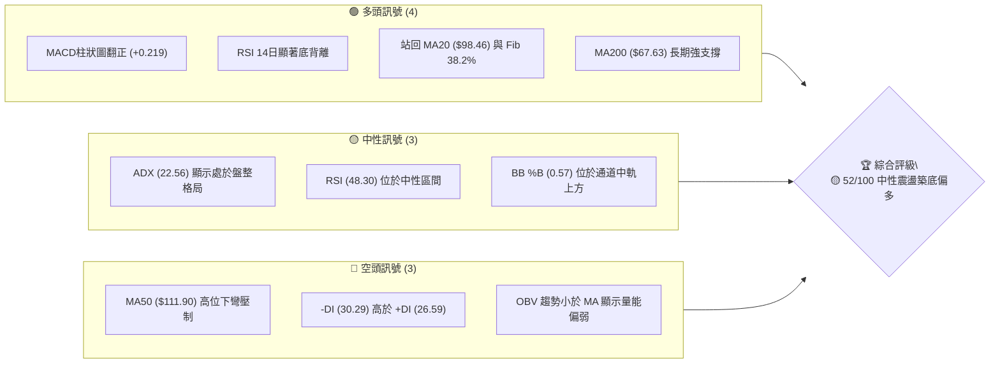
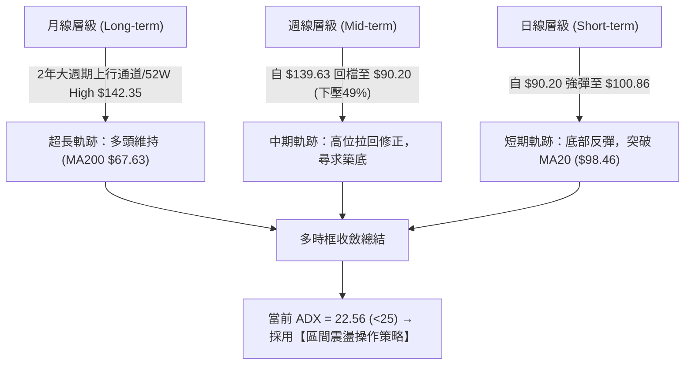
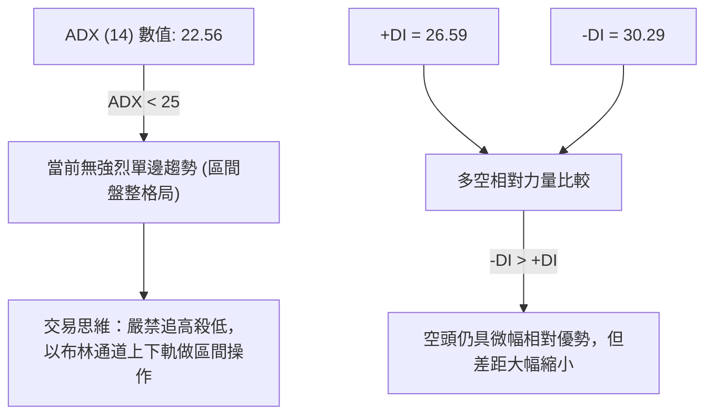
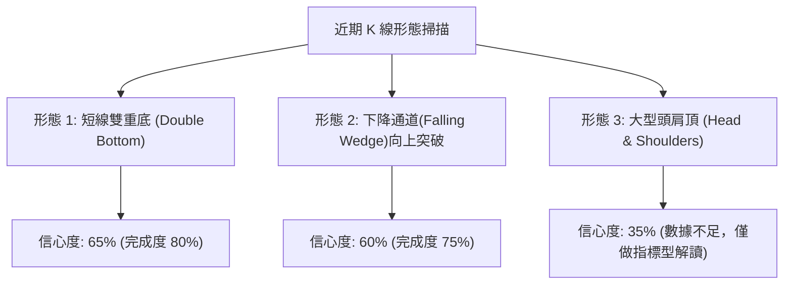
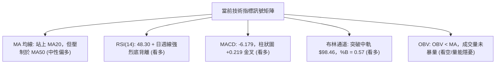
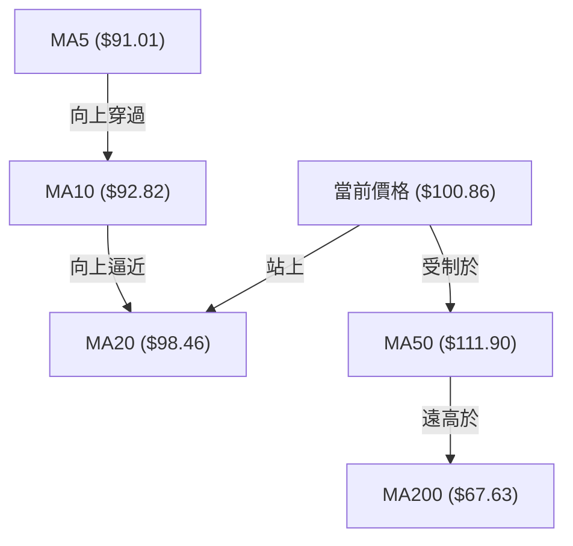
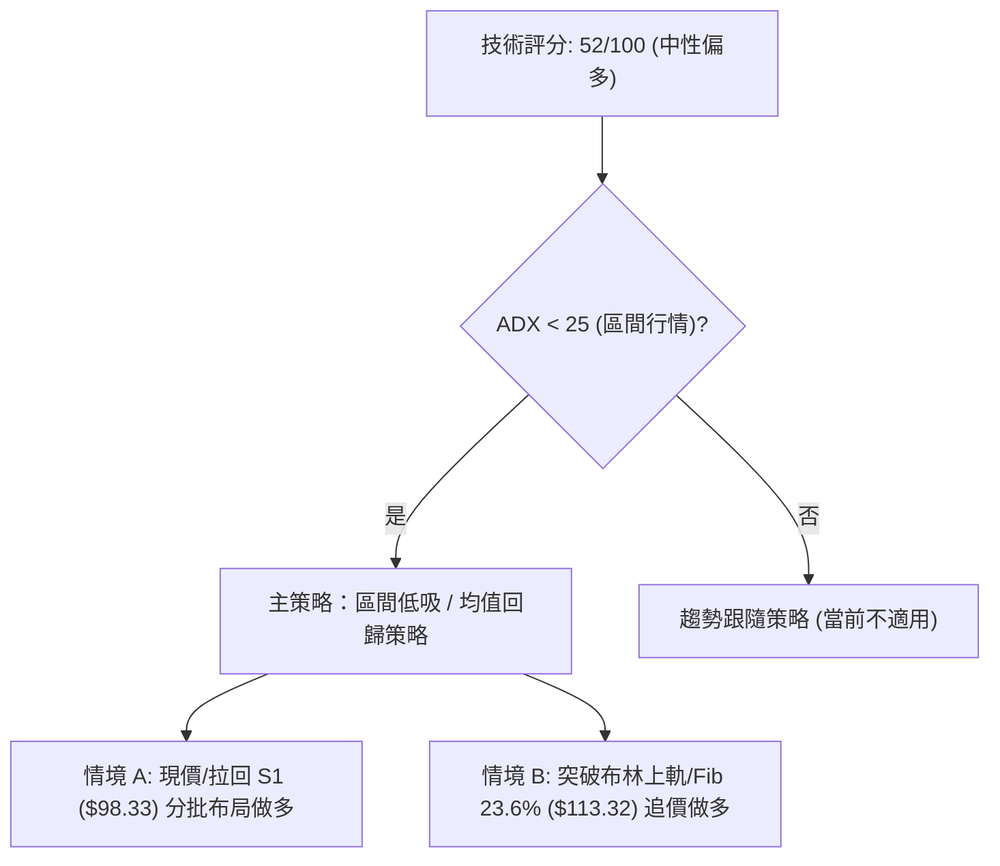
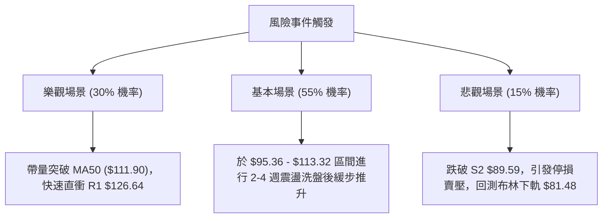

# INTC 技術分析報告

> **報告日期**：2026-08-05 ｜ **語言**：繁體中文 ｜ **數據來源**：Yahoo Finance ｜ **當前價格**：$100.86

---

## 目錄

| 章節 | 內容 |
|------|------|
| [1. 技術面概覽](#1-技術面概覽) | 訊號儀表板、核心指標、評分卡 |
| [2. 趨勢分析](#2-趨勢分析) | 多時框趨勢、長中短期走勢 |
| [3. 圖表形態分析](#3-圖表形態分析) | 形態識別、K線組合、目標價 |
| [4. 支撐與阻力](#4-支撐與阻力) | 關鍵價位、斐波那契回調 |
| [5. 技術指標深度解讀](#5-技術指標深度解讀) | MA/RSI/MACD/布林/成交量 |
| [6. 動能與波動率](#6-動能與波動率) | 動能評估、ATR、Beta |
| [7. 多時框架總結](#7-多時框架總結) | 時框架評分矩陣 |
| [8. 交易策略建議](#8-交易策略建議) | 多空策略、風險報酬比 |
| [9. 風險提示與監控](#9-風險提示與監控) | 監控指標、風險場景 |

---

## 1. 技術面概覽

### 🎯 技術訊號儀表板



### 📊 核心指標速覽表

| 指標類別 | 指標名稱 | 當前數值 | 訊號 | 解讀 |
|----------|----------|----------|------|------|
| **價格** | 當前價格 | $100.86 | 🟢 看多 | 站上 20 日均線 $98.46，自底部 $90.20 強勢反彈 |
| **均線** | MA20 | $98.46 | 🟢 看多 | 價格在 MA20 上方 (+2.44%)，短線扭轉劣勢 |
| **均線** | MA50 | $111.90 | 🔴 看空 | 價格在 MA50 下方 (-9.87%)，中期下行壓力仍存 |
| **均線** | MA200 | $67.63 | 🟢 看多 | 價格遠高於 MA200 (+49.14%)，長期牛市架構完整 |
| **動能** | RSI(14) | 48.30 | 🟢 看多 | 中性區間，且日/週線層級皆出現標準底背離 |
| **動能** | MACD | -6.179 | 🟢 看多 | MACD 柱狀圖 (+0.219) 向上翻正，形成黃金交叉 |
| **波動** | ATR(14) | $7.96 | 🟡 中性 | ATR 占股價 7.89%，呈現典型高 Beta 股波動特徵 |
| **趨勢** | ADX(14) | 22.56 | 🟡 中性 | ADX < 25，無強烈單邊趨勢，屬於區間震盪行情 |
| **通道** | 布林通道 | $81.48 - $115.45 | 🟢 看多 | 價格突破中軌 $98.46，朝上軌 $115.45 邁進 |

### 🏆 技術評分卡

```
╔══════════════════════════════════════════════════════════════════╗
║              技術評分卡 — INTC (2026-08-05)                       ║
╠══════════════════════════════════════════════════════════════════╣
║ 趨勢強度 (ADX)     ▓▓▓▓▓▓▓▓▓░░░░░░░░░░░  45/100  🟡 盤整無極限趨勢 ║
║ 動能指標 (RSI/MACD)▓▓▓▓▓▓▓▓▓▓▓▓░░░░░░░░  60/100  🟢 底背離+柱狀圖翻正║
║ 支撐穩定度 (S1/S2) ▓▓▓▓▓▓▓▓▓▓▓▓▓▓░░░░░░  70/100  🟢 $89.59-$98.33強撐║
║ 成交量配合 (OBV)   ▓▓▓▓▓▓▓▓░░░░░░░░░░░░  40/100  🔴 量能未能有效放大 ║
║ 形態完整度 (底背離)▓▓▓▓▓▓▓▓▓▓▓░░░░░░░░░  55/100  🟡 雙底超跌反彈構造 ║
║ 均線排列 (MA5-200) ▓▓▓▓▓▓▓▓▓▓░░░░░░░░░░  50/100  🟡 多空交錯混合排列 ║
╠══════════════════════════════════════════════════════════════════╣
║ 綜合評分           ▓▓▓▓▓▓▓▓▓▓▓░░░░░░░░░  52/100  🟡 中性偏多區間反彈║
╚══════════════════════════════════════════════════════════════════╝
```

---

## 2. 趨勢分析

### 🌐 多時框趨勢分析



### 📈 長期趨勢 — 12個月走勢圖（Unicode）

以下為 INTC 過去 12 個月（2025-08 至 2026-08）之收盤價格走勢軌跡與關鍵轉折點：

```
INTC 月線走勢圖（2025-08 至 2026-08）
價格軸 ($)
$140.00 ┤                                    ● 139.63 (2026-06 高點)
$120.00 ┤                             ● 114.68
$100.00 ┤                                           ● 100.86 (現在)
 $80.00 ┤                      ● 94.48       ● 90.20
 $60.00 ┤
 $40.00 ┤        ● 39.99 ● 46.47
 $20.00 ┤ ● 24.35
        └─┬──────┬──────┬──────┬──────┬──────┬──────┬──────
         25/08  25/10  26/01  26/04  26/05  26/06  26/07  26/08
```

#### 24個月走勢特徵分析表

| 階段 | 時間區間 | 價格區間 | 漲跌幅 | 走勢特徵與技術驅動因素 |
|------|----------|----------|--------|────────────────--------|
| **1. 低位築底** | 2024-08 ~ 2025-08 | $19.35 - $24.35 | 區間震盪 | 於 52 週低點 $19.35 建立長期打底型態 |
| **2. 初升主升** | 2025-09 ~ 2026-03 | $33.55 - $46.47 | +38.5% | 放量突破長期底部，MA50/MA200 形成黃金交叉 |
| **3. 爆發主升** | 2026-04 ~ 2026-06 | $94.48 - $139.63| +200.4%| 指數級主升段，於 2026-06 創下波段高點 $142.35 |
| **4. 急速修正** | 2026-07 ~ 2026-08 | $139.63 - $90.20| -35.4% | 短線獲利了結賣壓傾巢而出，回測 Fib 38.2% ($95.36) |
| **5. 止跌反彈** | 2026-08 當前 | $90.20 - $100.86 | +11.8% | 於 S2 $89.59 支撐位獲得支撐，日線突破 MA20 |

### 📊 中期趨勢（週線分析）

從 20 週收盤數據觀察：
- **高位回檔壓制**：股價自 2026-06 底的高點 $133.99 / $139.63 連續下挫，於 2026-07-26 當週探至 $92.32，並於 2026-08-02 當週探至低點 $90.20。
- **指標過度修正**：週線 RSI 在 2026-07 曾驟降至 26.9 的極度超賣區，引發技術性解凍買盤。
- **週線背離確立**：最近一週（2026-08-09 當週）收盤強勢回升至 $100.86，週線 RSI 迅速拉回至 48.3，週線 MACD 柱狀圖亦由 -1.256 翻正至 +0.219，確立中期下行波段暫告一段落。

### ⚡ 趨勢強度評估（ADX 解讀）



| 趨勢指標 | 當前數值 | 評估門檻 | 趨勢狀態 | 交易含義 |
|----------|----------|----------|----------|----------|
| **ADX (14)** | 22.56 | 25.00 | 弱趨勢/盤整 | 趨勢跟隨策略易受夾心洗盤，改採均值回歸策略 |
| **+DI** | 26.59 | - | 多頭動能衰退後回升 | 買方力量自底部 $90.20 陸續進場 |
| **-DI** | 30.29 | - | 空頭主導微幅領先 | 賣壓趨緩但尚未完全消失 |

---

## 3. 圖表形態分析

### 🔍 形態識別系統



#### 形態信心度與目標價評估表

| 形態類別 | 信心度 | 判斷依據（引用數據） | 完成度 | 目標價（附計算式） |
|----------|--------|----------------------|--------|--------------------|
| **短線雙重底** | **65%** | 第一底 $92.32 (07/26)，第二底 $90.20 (08/02)，均守住 S2 ($89.59) | 80% | 頸線 $98.46 + 形態高度 ($98.46 - $89.59 = $8.87) = **$107.33** |
| **下降契形突破** | **60%** | 7 月連跌後，8 月第 1 週實體陽棒突破下降趨勢線 | 75% | 突破點 $98.46 + 波段降幅的 50% = **$113.32** (恰為 Fib 23.6%) |
| **頭肩頂形態** | **35%** | 訊號不足，僅做指標型解讀。若硬劃頭肩，頸線位於 $95.36，但已迅速收復 | 20% | 暫不採納（信心度 < 50%） |

### 🕯️ 重要 K 線形態分析

| 日期 / 時框 | 收盤價 | K 線形態 | 技術解讀 | 多空訊號 |
|-------------|--------|----------|----------|----------|
| 2026-06-21 | $133.99 | 避雷針 / 長上影線 | 觸及 52 週高點 $142.35 後主力逢高大幅套現 | 🔴 極度看空 |
| 2026-07-19 | $95.04 | 大陰棒破位 | 強勢跌破 MA50，展現恐慌性抛售賣壓 | 🔴 極度看空 |
| 2026-08-02 | $90.20 | 錘子線 (Hammer) | 下探至 $90.20 後長下影線拉回，探底買盤湧現 | 🟢 短線止跌 |
| 2026-08-09 | $100.86 | 大陽棒包覆 (Bullish Engulfing) | 一舉包覆前週實體，收復 MA20 ($98.46)，多頭反攻 | 🟢 強烈看多 |

### 📉 ASCII 走勢形態示意圖

```
INTC 日線雙底與楔形突破示意圖
════════════════════════════════════════════════════════════
$120.00 ┤\
$113.32 ┤ \   (下降楔形上軌)          [目標價1: Fib 23.6% $113.32]
$107.33 ┤  \                         [雙底測幅目標: $107.33]
$100.86 ┤   \────────●突破點─────────► 當前現價 $100.86
 $98.46 ┤    \      / \  (頸線位 MA20 $98.46)
 $92.32 ┤     ●────/   \
 $89.59 ┤    (底1)      ● (底2)     [關鍵支撐 S2: $89.59]
════════════════════════════════════════════════════════════
```

### 🎯 形態目標價計算

以已確認的**短線雙重底 (Double Bottom)** 進行測幅：
1. **底部支撐區（底1與底2平均）**：$89.59（S2 波段低點聚類）
2. **突破頸線位**：$98.46（MA20 / 布林通道中軌）
3. **形態垂直高度**：$98.46 - $89.59 = $8.87
4. **最小測幅目標價 T1**：頸線 $98.46 + $8.87 = **$107.33**
5. **擴展測幅目標價 T2**：斐波那契 23.6% 回調位 = **$113.32**

---

## 4. 支撐與阻力

### 🗺️ 關鍵價位分布圖（Unicode）

```
INTC 價位結構分布圖 (現價: $100.86)
═════════════════════════════════════════════════════════════
$141.90 ║████████████████████████████████║ 強阻力 R3 (52W 高點聚類)
$132.75 ║████████████████████████        ║ 阻力 R2
$126.64 ║██████████████████              ║ 關鍵阻力 R1 (波段高點)
$115.45 ║▓▓▓▓▓▓▓▓▓▓▓▓▓▓▓▓                ║ 布林通道上軌
$113.32 ║▓▓▓▓▓▓▓▓▓▓▓▓▓▓                  ║ 斐波那契 23.6% 回調位
$111.90 ║▓▓▓▓▓▓▓▓▓▓▓▓                    ║ MA50 中期均線反壓
$100.86 ╠════════════════════════════════╣ ◄ 當前價格 $100.86
$98.46  ║░░░░░░░░░░░░░░░░                ║ MA20 / 布林通道中軌
$98.33  ║██████████████████              ║ 近期關鍵支撐 S1
$95.36  ║░░░░░░░░░░░░                    ║ 斐波那契 38.2% 回調位
$89.59  ║████████████████████████        ║ 波段強支撐 S2 (近一年低點)
$81.48  ║░░░░░░░░░░                      ║ 布林通道下軌
$67.63  ║████████████████████████████████║ 核心牛熊分界 MA200
$42.58  ║████████████████████████████████║ 終極強支撐 S3
═════════════════════════════════════════════════════════════
```

### 🚧 阻力位分析表

*(數據嚴格引用自提供之關鍵價位及指標計算)*

| 阻力級別 | 精確價位 | 形成原因 | 突破難度 | 重要性 |
|----------|----------|----------|----------|--------|
| **R1** | **$126.64** | 近一年波段高點聚類位 (距現價 +25.56%) | 🔴 極高 | ★★★★☆ 近期多頭反彈強阻力 |
| **R2** | **$132.75** | 近一年波段次高點聚類位 (距現價 +31.62%) | 🔴 極高 | ★★★☆☆ 中期解套賣壓密集區 |
| **R3** | **$141.90** | 接近 52 週歷史高點 $142.35 (距現價 +40.69%) | 🔴 極難 | ★════ 歷史天花板強壓 |

### 🛡️ 支撐位分析表

*(數據嚴格引用自提供之關鍵價位及指標計算)*

| 支撐級別 | 精確價位 | 形成原因 | 守住機率 | 重要性 |
|----------|----------|----------|----------|--------|
| **S1** | **$98.33** | 近一年波段低點聚類/臨近 MA20 $98.46 (距現價 -2.51%) | 🟢 高 | ★★★★☆ 短線多空強弱分界點 |
| **S2** | **$89.59** | 近一年波段低點聚類/接近 8 月底低 $90.20 (距現價 -11.17%) | 🟢 極高 | ★★★★★ 多頭防守生死線 |
| **S3** | **$42.58** | 歷史極限低點聚類區 (距現價 -57.78%) | 🟢 極高 | ★★☆☆☆ 超長線終極防禦位 |

### 📐 斐波那契回調位分析

依 52 週區間 **$19.35 (100.0%) → $142.35 (0.0%)** 計算：

| 斐波那契位 | 精確價位 | 當前價位相對位置與技術意義 |
|------------|----------|----------------------------|
| **0.0%** (52W High) | **$142.35** | 歷史高點強壓區 |
| **23.6%** | **$113.32** | 恰好重疊 MA50 ($111.90) 與布林上軌 ($115.45)，為反彈第一大目標 |
| **38.2%** | **$95.36** | **當前價格 ($100.86) 正好位於 38.2% ($95.36) 與 23.6% ($113.32) 之間** |
| **50.0%** | **$80.85** | 重疊布林通道下軌 ($81.48)，強大的心理與技術支撐 |
| **61.8%** | **$66.34** | 黃金分割強支撐，恰好重疊 MA200 ($67.63) |
| **78.6%** | **$45.67** | 重疊 S3 聚類區 ($42.58) |
| **100.0%** (52W Low) | **$19.35** | 歷史起漲點 |

**解讀**：當前 INTC 股價 $100.86 已守住 38.2% 回調位 ($95.36)，代表這波自 $142.35 的修正尚未破壞黃金分割之強勢調整結構。只要站穩 $95.36-$98.33 區間，向上挑戰 23.6% ($113.32) 為合理技術推演。

---

## 5. 技術指標深度解讀

### 🎛️ 指標訊號總覽



### 📈 移動平均線排列分析



#### 均線數據與排列解讀

- **短期均線 (MA5/MA10/MA20)**：MA5 ($91.01) 與 MA10 ($92.82) 呈多頭扣押向上，股價 $100.86 已突破 MA20 ($98.46, +2.44%)，短線扭轉頹勢。
- **中期均線 (MA50/MA60)**：MA50 ($111.90) 與 MA60 ($112.86) 仍呈下彎壓制，為多頭反彈上方第一道實質均線牆。
- **長期均線 (MA120/MA200/MA240)**：MA200 ($67.63, +49.14%) 與 MA240 ($61.28) 呈現強烈多頭排列，長期牛市基底依然穩固。
- **總結**：目前均線為「**長多、中空、短多**」的混和排列，預計短期將在 MA20 ($98.46) 至 MA50 ($111.90) 區間進行震盪消化。

### 📉 RSI(14) 分析與背離判斷

**RSI(14) 當前數值**：`48.30`

```
RSI (14) 指標狀態
[0] ═══════════════ [30] ════════ [48.30] ════════ [70] ═══════════════ [100]
 超賣區               弱勢區        當前中性區        超買區
                                    █████████████░░░░░░░░░░
```

- **背離分析（⚠️ 底背離 Bullish Divergence 確定）**：
  - **價格走勢**：INTC 週線股價於 2026-07-19 至 2026-08-02 連續創下波段新低（$95.04 → $92.32 → $90.20）。
  - **RSI 指標**：同期 RSI 卻由 27.4 上升至 26.9 再顯著抬升至 39.5，並於今日達到 48.30。
  - **結論**：價格創新低而 RSI 未創新低，形成標準「**強烈底背離**」，為典型的動能衰竭與底部反轉訊號。

### 📊 MACD(12/26/9) 訊號解讀

- **MACD 線**：-6.179
- **Signal 線**：-6.398
- **MACD 柱狀圖 (Histogram)**：**+0.219** 🟢

```
MACD 柱狀圖轉折軌跡 (近期 5 週)
0.00 ──────────────────────────────────────────────────
 -1.762  ▓▓▓▓▓▓▓▓▓▓▓▓▓▓▓▓
 -1.256  ▓▓▓▓▓▓▓▓▓▓
 +0.219  █  🟢 柱狀圖由負翻正 (黃金交叉)
```

**解讀**：MACD 線向上穿越 Signal 線形成零軸下方的「黃金交叉」，柱狀圖正式由負轉正 (+0.219)，顯示賣壓大幅吸收，空頭動能已完全被多頭反彈力道抵銷。

### 📦 布林通道分析

```
布林通道 (Bollinger Bands) 結構示意圖
═════════════════════════════════════════════════════════════
$115.45 ┤──────────────────────────────────────── 上軌 (Upper)
        │
$100.86 ┤                     ● (當前股價 $100.86, %B = 0.57)
$98.46  ┤──────────────────────────────────────── 中軌 (MA20)
        │
 $81.48 ┤──────────────────────────────────────── 下軌 (Lower)
═════════════════════════════════════════════════════════════
```

- **BB %B**：`0.57`（表示股價已自下軌彈回，略高於中軌 0.50 位置）。
- **帶寬與型態**：布林帶寬呈現擴張後微幅收攏狀態，股價站上中軌 $98.46，技術面具備向布林上軌 **$115.45** 測試之空間。

### 💹 成交量分析（量價配合度與 OBV）

- **成交量**：最新單日成交量為 117,064,891 股，對比 20 日均量 116,077,175 股，量比為 **1.01x**，呈現溫和放量。
- **OBV 趨勢**：數據顯示 `OBV < MA`，代表本波反彈主要由技術面超跌買盤與空頭回補帶動，大型機構的主動性追價買盤尚未完全湧入，量能配合度給予 **🟡 中性觀望** 評級。

---

## 6. 動能與波動率

### ⚡ 動能評估四象限

```
                    動能強度 (RSI / MACD)
                         強 (High)
                            │
            Q3: 高風險高收益 │  Q1: 最佳多頭區
            (High Vol / High Mom) │  (Low Vol / High Mom)
                            │
─── 波動率 (ATR%) ───────────┼───────────────────────── ───
                            │
            Q4: 應避開區間   │  Q2: 謹慎築底區 ◄ [INTC當前位置]
            (High Vol / Low Mom)  │  (Low Vol / Low Mom)
                            │
                         弱 (Low)
```

| 象限 | 動能 (Momentum) | 波動 (Volatility) | INTC 當前狀態 | 技術策略解讀 |
|------|-----------------|-------------------|---------------|--------------|
| **Q1** | 強 | 低 | - | 強勢主流股追漲區 |
| **Q2** | **中/弱轉強** | **高 (ATR 7.89%)** | **✓ 當前位置** | **超跌反彈築底期，適合低吸防守作** |
| **Q3** | 強 | 高 | - | 爆發主升段 |
| **Q4** | 弱 | 高 | - | 恐慌殺跌區 |

### 📊 ATR 波動率分析

- **ATR (14)**：`$7.96`
- **ATR 佔價格比**：`7.89%`
- **每日波動幅度**：平均每日上下波動約 $7.96。
- **風控止損距離建議**：
  - **短線緊密止損 (1.0x ATR)**：$7.96
  - **標準波段止損 (1.5x ATR)**：$11.94
  - **寬鬆趨勢止損 (2.0x ATR)**：$15.92

### 📐 Beta 與市場相關性

- **Beta**：`2.241`（高 Beta 屬性，大盤每波動 1%，INTC 平均波動 2.24%）。
- **市場含義**：在高 Beta 背景下，若美股整體大盤反彈，INTC 將展現強於大盤的彈升力道；反之，若大盤受壓，其下尋支撐的壓力亦較大。

---

## 7. 多時框架總結

### 📋 時框架評分表

| 時框架 | 趨勢方向 | 動能狀態 | 均線排列 | 形態結構 | 綜合評分 | 操作建議 |
|--------|----------|----------|----------|----------|----------|----------|
| **日線 (Short)** | 🟢 轉強 | 🟢 MACD金叉 | 🟡 突破 MA20 | 🟢 雙底反彈 | **62/100** | 低吸偏多作 |
| **週線 (Mid)** | 🔴 修正 | 🟢 RSI底背離 | 🔴 MA50 下彎 | 🟡 探底拉回 | **48/100** | 區間震盪 |
| **月線 (Long)** | 🟢 牛市 | 🟡 逢高獲利結 | 🟢 遠高 MA200 | 🟢 長期打底完畢| **68/100** | 長線持有 |

### 🔲 綜合訊號矩陣

```
      時框架 ╲ 指標維度 ┆   MA 均線   ┆   RSI 動能  ┆  MACD 柱狀 ┆  布林通道  ┆ 最終訊號
     ══════════════════╬═════════════╬═════════════╬════════════╬════════════╬══════════
       日線 (Daily)    ┆  🟢 站上MA20 ┆  🟢 48.3底背 ┆  🟢 +0.219 ┆ 🟢 突破中軌 ┆  🟢 多頭
       週線 (Weekly)   ┆  🔴 受制MA50 ┆  🟢 超賣回升 ┆  🟡 負值收斂 ┆ 🟡 於中下軌 ┆  🟡 中性
       月線 (Monthly)  ┆  🟢 遠高MA200┆  🟡 中性偏強 ┆  🟢 高位橫盤 ┆ 🟢 中軌上方 ┆  🟢 多頭
```

### ⚖️ 多時框收斂結論

依「多時框收斂規則」判斷：
1. **當前行情屬性**：ADX(14) = 22.56 (< 25)，技術面定義為 **盤整/區間震盪行情**。
2. **主導區間界定**：以日線布林通道區間（下軌 **$81.48** 至 上軌 **$115.45**）為主要交易視窗。
3. **最終一致性結論**：**中性偏多區間反彈 (Neutral-Bullish Range Rebound)**。日線已出現雙底與背離訊號，具備向中期阻力（MA50 $111.90 / Fib 23.6% $113.32 / 布林上軌 $115.45）進行均值回歸反彈之空間。

---

## 8. 交易策略建議

### 🗺️ 策略決策流程圖



### 🧭 策略路由

**當前主策略方向：區間低吸做多 (Range Long)（綜合評分：52/100）**

因技術評分處於 40–60 區間且 ADX < 25，市場為典型區間震盪，策略以「逢低佈局、分段獲利」為主，不建議開高追漲。

### 🎯 價格情境階梯 (Price Scenarios)

| 觸發條件 | 第一目標 (T1) | 第二目標 (T2) | 停損/對沖點 | 情境技術含義 |
|----------|───────────────|───────────────|─────────────|--------------|
| **站穩 S1 $98.33 / MA20** | **$113.32** (Fib 23.6%) | **$126.64** (R1) | **$94.39** | 短線雙底確立，挑戰中期 MA50 壓力 |
| **強勢突破 R1 $126.64** | **$132.75** (R2) | **$141.90** (R3) | **$115.45** | 宣告修正結束，重回 52 週高點軌道 |
| **跌破 S1 $98.33 / $95.36**| **$89.59** (S2) | **$81.48** (BB下軌) | **$100.86** | 反彈失敗，二度下探前低找撐 |

### 📊 情境機率分佈

| 情境劇本 | 估計機率 | 主要技術依據 |
|----------|----------|--------------|
| **情境一：震盪向上反彈** | **55%** | RSI 強烈底背離、MACD 金叉翻正、股價站回 MA20 上方。 |
| **情境二：布林區間橫盤** | **30%** | ADX = 22.56 低於 25，OBV 量能尚未放大，股價於 $95.36 - $113.32 築底。 |
| **情境三：跌破 S2 再探底** | **15%** | MA50 ($111.90) 壓制力道過強，且美股大盤出現整體系統性賣壓。 |

### 🟢 主策略詳情

*(所有價位精確引用關鍵數據與 ATR 風控計算)*

| 策略要素 | 策略 A：現價 / 逢拉回布局做多 | 策略 B：突破確認加碼做多 |
|----------|───────────────────────────────|─────────────────────────|
| **策略類型** | 區間低吸 (Buy the Dip) | 突破跟進 (Breakout Momentum) |
| **進場條件** | 股價於 $98.33 - $100.86 區間落腳 | 強勢突破並收復 Fib 23.6% ($113.32) |
| **精確進場價** | **$100.86**（或回測 S1 **$98.33**） | **$113.32** |
| **目標價 T1** | **$113.32** (Fib 23.6% / 預估獲利 +12.35%) | **$126.64** (R1 / 預估獲利 +11.75%) |
| **目標價 T2** | **$126.64** (R1 / 預估獲利 +25.56%) | **$132.75** (R2 / 預估獲利 +17.15%) |
| **止損價格** | **$94.39** (跌破 S1 $98.33 扣除 0.5x ATR $3.98) | **$107.49** (突破點下方 0.73x ATR) |
| **風報比 (R:R)** | **1.93 : 1** (以 T1 計算) | **2.28 : 1** (以 T1 計算) |
| **建議倉位** | **15% - 20%** 總資金 | **10% - 15%** 總資金 |

### 🔴 反向風險觸發點（空頭對沖提示）

若股價收盤**無條件跌破 S2 ($89.59)**，代表雙底型態徹底失效，多頭應立即停損離場；欲對沖者可於跌破 $89.59 時輕倉建立避險空單，下方目標看至布林下軌 **$81.48** 或 Fib 61.8% **$66.34**。

### ⭐ 整體訊號強度評星

```
做多訊號強度：★★★☆☆  (3.5 / 5 星) — 底背離與 MACD 金叉確立，短線反彈空間大
做空訊號強度：★★☆☆☆  (2.0 / 5 星) — 逢低買盤進駐，短線追空風險極高
整體可信度：  ★★★☆☆  (3.5 / 5 星) — 受制於 ADX < 25，以區間行情視之
```

---

## 9. 風險提示與監控

### ✅ 關鍵監控指標 Checklist

```
╔══════════════════════════════════════════════════════════════════╗
║              每日交易前觀測檢核清單 (Checklist)                    ║
╠══════════════════════════════════════════════════════════════════╣
║ [ ] 1. MA20 支撐：股價是否穩守在 $98.46 / S1 $98.33 之上？        ║
║ [ ] 2. MACD 柱狀圖：柱狀圖是否持續維持在 0 軸上方 (+0.219 以上)？  ║
║ [ ] 3. 成交量能：反彈時單日成交量能否突破 20 日均量 (1.16億股)？   ║
║ [ ] 4. RSI 背離續航：RSI(14) 能否進一步突破 50 中性分水嶺？        ║
║ [ ] 5. 上方均線反壓：股價接近 MA50 ($111.90) 時是否有滯漲長上影線？║
╚══════════════════════════════════════════════════════════════════╝
```

### ⚠️ 風險場景分析



### 🛡️ 風險管理重要提醒

1. **高 Beta 波動風險**：INTC Beta 高達 **2.241**，且 ATR 達 **$7.96** (7.89%)，單日走勢極為劇烈，切勿使用過高槓桿。
2. **財報與分析師評級風險**：共識目標價平均為 **$115.27**（相當接近 Fib 23.6% $113.32），但近期 Morgan Stanley 與 JP Morgan 給予 Equal-Weight / Underweight 評級，上方賣壓不容小覷。
3. **嚴格執行止損**：多單止損線請堅決設立於 **$94.39**，若收盤跌破，切勿抱單。

---

## 📋 報告總結

```
╔══════════════════════════════════════════════════════════════════╗
║                   INTC 技術分析報告總結                          ║
╠══════════════════════════════════════════════════════════════════╣
║ 報告日期：2026-08-05                                              ║
║ 當前價格：$100.86                                                 ║
║ 分析評級：🟡 52/100 中性偏多 (區間低吸反彈)                        ║
╠══════════════════════════════════════════════════════════════════╣
║ 關鍵結論：                                                        ║
║ ├─ 長期趨勢：🟢 偏多 (遠高於 MA200 $67.63，牛市基底尚在)            ║
║ ├─ 中期趨勢：🔴 修正 (受制於 MA50 $111.90 下彎壓制)                 ║
║ ├─ 短期趨勢：🟢 強彈 (雙底形成，RSI強烈底背離，MACD金叉)          ║
║ ├─ 關鍵支撐：S1 $98.33 / S2 $89.59                               ║
║ ├─ 關鍵阻力：Fib 23.6% $113.32 / R1 $126.64                      ║
║ └─ 分析師共識目標價：$115.27                                      ║
╠══════════════════════════════════════════════════════════════════╣
║ 最優策略組合：                                                    ║
║ 1. 🥇 主推策略：現價 $100.86 (或拉回 $98.33) 建立多單，           ║
║               止損設 $94.39，第一目標看 $113.32 (風報比 1.93:1)。 ║
║ 2. 🥈 次選策略：等待帶量突破 $113.32 後追價，目標 $126.64。        ║
║ 3. 🥉 風控守則：若跌破 S2 $89.59 應全面離場觀望。                  ║
╚══════════════════════════════════════════════════════════════════╝
```

---

> ⚠️ **免責聲明**：本報告為 AI 自動生成之技術分析，所有數據及估算均基於提供的歷史價格資訊。本報告**僅供研究與學術參考**，**不構成任何投資建議**。投資有風險，入市需謹慎。

---

*報告生成時間：2026-08-05 ｜ 數據來源：Yahoo Finance ｜ 分析框架：多時框技術分析*