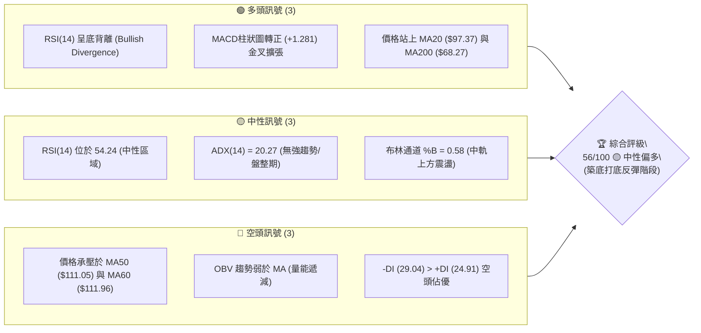
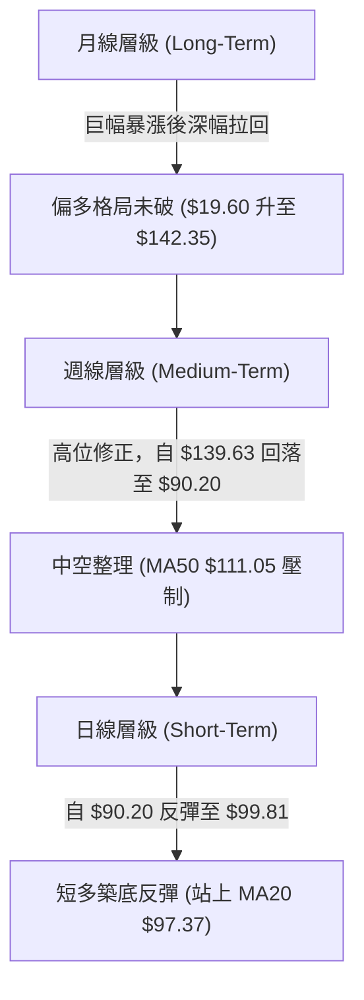
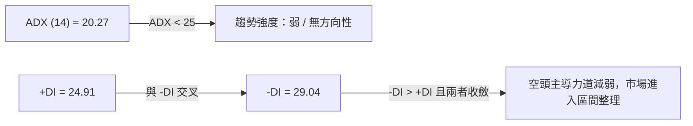
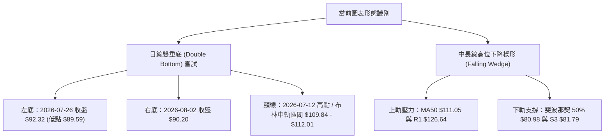
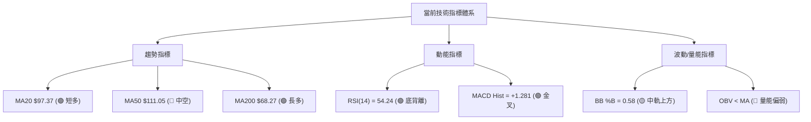
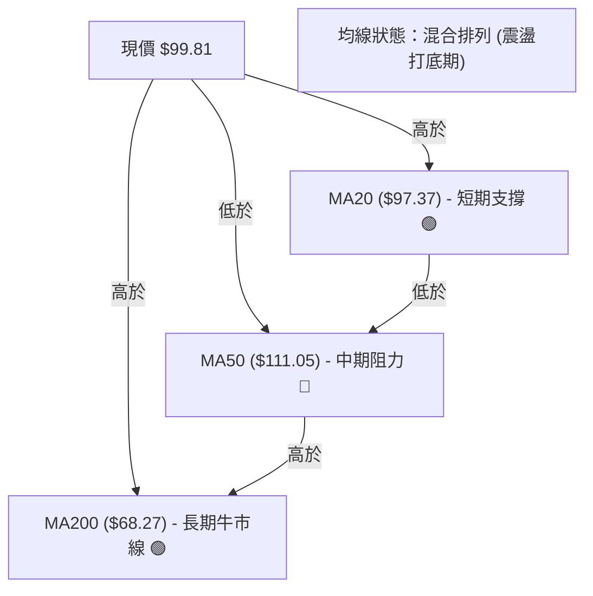
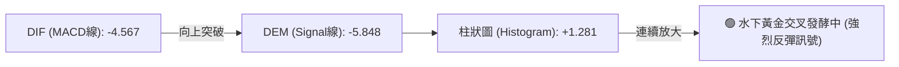
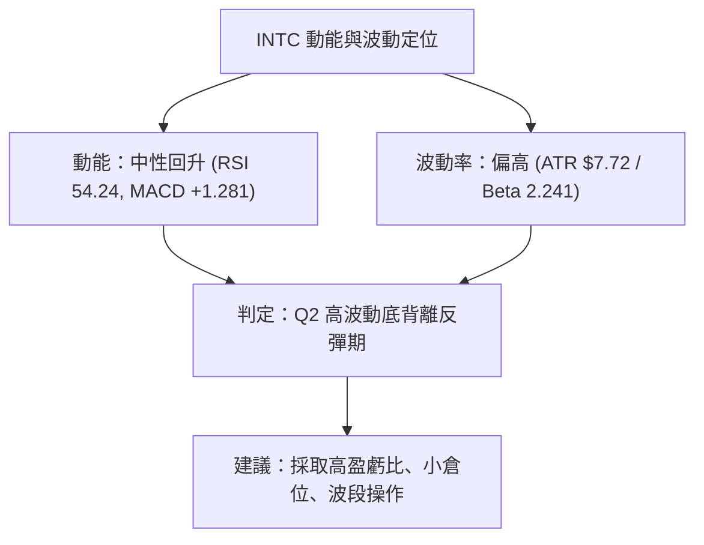
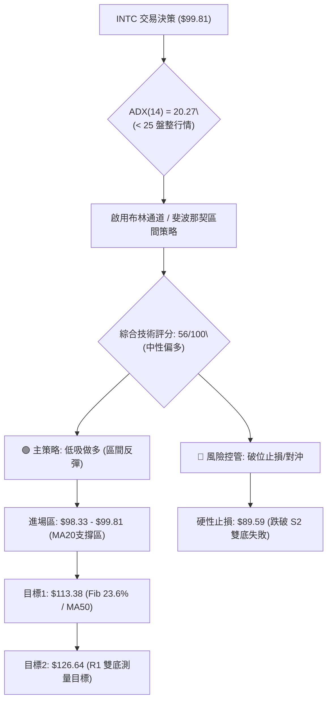
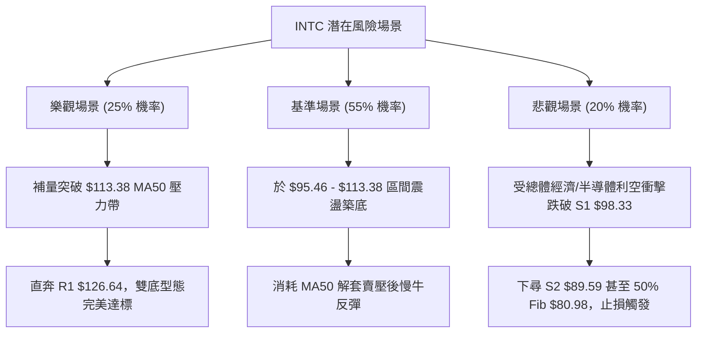

# INTC 技術分析報告

> **報告日期**：2026-08-07 ｜ **語言**：繁體中文 ｜ **數據來源**：Yahoo Finance ｜ **當前價格**：$99.81

---

## 目錄

| 章節 | 內容 |
|------|------|
| [1. 技術面概覽](#1-技術面概覽) | 訊號儀表板、核心指標、評分卡 |
| [2. 趨勢分析](#2-趨勢分析) | 多時框趨勢、長中短期走勢、ADX解讀 |
| [3. 圖表形態分析](#3-圖表形態分析) | 形態識別、信心度、K線組合、目標價 |
| [4. 支撐與阻力](#4-支撐與阻力) | 關鍵價位、斐波那契回調位分析 |
| [5. 技術指標深度解讀](#5-技術指標深度解讀) | MA/RSI/MACD/布林/成交量 |
| [6. 動能與波動率](#6-動能與波動率) | 動能評估、ATR、Beta與市場相關性 |
| [7. 多時框架總結](#7-多時框架總結) | 時框架評分矩陣、收斂結論 |
| [8. 交易策略建議](#8-交易策略建議) | 策略路由、多空情境、風險報酬比 |
| [9. 風險提示與監控](#9-風險提示與監控) | 監控指標、風險場景與倉位管理 |

---

## 1. 技術面概覽

### 🎯 技術訊號儀表板



---

### 📊 核心指標速覽表

| 指標類別 | 指標名稱 | 當前數值 | 訊號 | 技術面解讀 |
|----------|----------|----------|------|------------|
| **價格** | 當前收盤價 | $99.81 | 🟢 | 站上 MA20，位於 52 週區間 65.3% 位置 |
| **均線** | MA20 | $97.37 | 🟢 | 價格位於 MA20 上方 (+2.51%)，短線扭轉頹勢 |
| **均線** | MA50 | $111.05 | 🔴 | 價格位於 MA50 下方 (-10.12%)，形成中期頭頂壓力 |
| **均線** | MA200 | $68.27 | 🟢 | 價格遠高於 MA200 (+46.20%)，長期多頭基底穩固 |
| **動能** | RSI(14) | 54.24 | 🟢 | 中性偏強，出現顯著底背離訊號 (Bullish Divergence) |
| **動能** | MACD | -4.567 / Hist +1.281 | 🟢 | 柱狀圖翻正，水下黃金交叉發酵中 |
| **趨勢** | ADX(14) | 20.27 | 🟡 | ADX < 25 表示處於弱趨勢/區間盤整行情 |
| **波動** | ATR(14) | $7.72 | 🟡 | 占股價 7.74%，處於中高波動度，短線震盪劇烈 |
| **通道** | 布林通道 | 上軌 $112.01 / 下軌 $82.73 | 🟡 | %B=0.58，自下軌反彈至中軌上方 |
| **量能** | 量比 (20D) | 0.68x | 🔴 | 日成交量 7,718 萬股，量能未放大，量價稍微背離 |

---

### 🏆 技術評分卡

```
╔══════════════════════════════════════════════════════════════════╗
║              INTC 技術面綜合評分卡 (2026-08-07)                 ║
╠══════════════════════════════════════════════════════════════════╣
║ 趨勢強度      ▓▓▓▓▓▓▓▓░░░░░░░░░░░░  40/100  🟡 弱趨勢/盤整      ║
║ 動能指標      ▓▓▓▓▓▓▓▓▓▓▓▓▓░░░░░░░  65/100  🟢 底背離+MACD金叉 ║
║ 支撐穩定度    ▓▓▓▓▓▓▓▓▓▓▓▓▓▓░░░░░░  70/100  🟢 S1/S2 形成重疊底 ║
║ 成交量配合    ▓▓▓▓▓▓▓░░░░░░░░░░░░░  35/100  🔴 量能萎縮(0.68x) ║
║ 形態完整度    ▓▓▓▓▓▓▓▓▓▓▓▓░░░░░░░░  60/100  🟡 築底打底型態中   ║
║ 均線排列      ▓▓▓▓▓▓▓▓▓▓▓░░░░░░░░░  55/100  🟡 短多長多，中空   ║
╠══════════════════════════════════════════════════════════════════╣
║ 綜合評分      ▓▓▓▓▓▓▓▓▓▓▓░░░░░░░░░  56/100  評級：🟡 中性偏多    ║
╚══════════════════════════════════════════════════════════════════╝
```

---

## 2. 趨勢分析

### 🌐 多時框趨勢分析



---

### 📈 長期趨勢 — 24個月走勢圖（Unicode）

```
INTC 月線歷史走勢圖 (2024-08 至 2026-08)
價格軸 ($)
$140 ┤                                         ● 2026-06 ($139.63 Peak)
$120 ┤                                     ●
$100 ┤                                 ●           ● 現價 $99.81
$80  ┤                             ●
$60  ┤                         ●
$40  ┤                 ●   ●
$20  ┤ ●   ●   ●   ●       
     └─┬───┬───┬───┬───┬───┬───┬───┬───┬───┬───┬───┬───► 時間
      24/08   24/12   25/04   25/08   25/12   26/04   26/08
```

#### 走勢特徵階段拆解：
1. **打底沉澱期 (2024-08 ~ 2025-08)**：股價於 $19.43 ~ $24.35 窄幅區間整理，形成長達一年的底部箱體。
2. **主升段爆發期 (2025-09 ~ 2026-06)**：隨 Foundry 與 AI 晶片轉機，股價由 $33.55 單邊大漲至歷史高點 $142.35（月收盤高點 $139.63），漲幅超 470%。
3. **高位獲利了結與深幅修正 (2026-07)**：股價由 $139.63 急速回撤至 $90.20，跌幅達 35.4%，一舉跌破週 MA20 與日 MA50。
4. **築底反彈期 (2026-08)**：股價於 $89.59 - $90.20 尋獲強烈支撐，本月反彈至 $99.81，短線尋求止跌打底。

---

### 📊 中期趨勢（週線分析）

```
INTC 近 20 週價格與動能軌跡
價位 ($)
$140 ┤                     ●──●
$130 ┤                 ●       ●
$120 ┤             ●               ●
$110 ┤                                 ●
$100 ┤         ●                           ●← 現價 $99.81
$90  ┤                                         ● (底部 S2 $89.59)
$80  ┤     ●
$60  ┤ ●
     └─┬───┬───┬───┬───┬───┬───┬───┬───┬───┬───► 週次
      03/29   04/26   05/24   06/21   07/19   08/09
```

近 20 週顯示，股價在 2026-06-21 觸及 $133.99 週收盤高點後，MACD 柱狀圖由正轉負（自 +0.682 降至 -3.637），RSI 自 89.7 極度超買區急劇回落至 26.9 超賣區。2026-08-09 當週收盤強勢回升至 $99.81，RSI 彈升至 54.2，MACD 柱狀圖翻正至 +1.281，展現顯著的底背離止跌訊號。

---

### ⚡ 趨勢強度評估（ADX 解讀）



#### ADX 強度對照與市場狀態分析：
- **ADX(14) 數值**：20.27（< 25）。**結論**：當前不具備強烈單邊單向趨勢，屬於典型的「盤整築底/區間震盪行情」。
- **交易導向**：根據多時框收斂規則，當 ADX < 25 時，**不宜採用單邊突破追價策略**，應以布林通道上下軌（$82.73 - $112.01）與斐波那契回調位作為主要交易區間進行低吸高拋。

---

## 3. 圖表形態分析

### 🔍 形態識別系統



#### 形態信心度與目標價評估表：

| 形態類型 | 信心度 | 判斷依據（引用數據） | 完成度 | 目標價計算式 | 目標價 |
|----------|--------|----------------------|--------|--------------|--------|
| **雙重底 (W底)** | **65%** | 兩次低點落於 S2 $89.59 附近 ($92.32與$90.20)，日線 MACD 底背離 | 60% (等待突破頸線) | 頸線 $109.84 + (頸線 $109.84 - 右底 $90.20) | **$129.48** |
| **下降楔形** | **55%** | 高點遞減但跌勢在 S2 $89.59/斐波那契 38.2% $95.46 止步，成交量縮 | 50% (等待突破上軌) | 由楔形開口高度 ($142.35 - $90.20 = $52.15) 50% 推算 | **$116.28** |

---

### 🕯️ 重要 K 線形態分析

| 日期/週期 | 收盤價 | K 線形態名稱 | 技術特徵與解讀 | 多空訊號 |
|-----------|--------|--------------|----------------|----------|
| **2026-07-19** | $95.04 | 大陰線 (Long Bearish) | 強力殺跌，RSI 掉入 27.4 極度超買後之超賣區 | 🔴 空頭宣洩 |
| **2026-07-26** | $92.32 | 錘頭線 (Hammer) | 探底至 $89.59 獲買盤支撐下影線拉回 | 🟢 築底訊號 |
| **2026-08-02** | $90.20 | 縮量十字星 (Doji) | 再次測試 $90 關卡未破，量能收窄，賣壓衰竭 | 🟢 轉折準備 |
| **2026-08-09** | $99.81 | 中陽線突破 (Bullish Candle)| 一舉收復 MA20 ($97.37)，確認短線底背離生效 | 🟢 短多確立 |

---

### 📉 ASCII 走勢形態示意圖

```
INTC 日線雙底 (Double Bottom) 與頸線結構示意圖
價位 ($)
$112.01 ┤------------------------------------------- 頸線 / 布林上軌 (R1 重疊區)
        │                       /
$109.84 ┤......●.............../................... 歷史反彈高點頸線
        │     / \             /
$99.81  ┤----+---+---●-------+--------------------- 現價 ($99.81，突破 MA20)
        │   /     \ / \     /
$97.37  ┤--/-------\---+---/----------------------- MA20 中軌
        │ /         ●   \ /
$90.20  ┤●               ●                          左底 ($92.32) & 右底 ($90.20)
        └─┬─────────┬───┬─┬────────────────────────► 時間
       07/12       07/26 08/02 08/09
```

---

### 🎯 形態目標價計算

1. **雙重底形態測量目標價**：
   - 頸線位置 ($H_{neck}$)：$109.84
   - 形態底部 ($L_{bottom}$)：$90.20
   - 垂直高度 ($H$) = $109.84 - $90.20 = $19.64
   - 突破後理論目標價 = $109.84 + $19.64 = **$129.48**（此目標價與阻力位 R1 $126.64 相當接近）。

2. **布林通道均值回歸目標價**：
   - 現價 $99.81 突破中軌 $97.37，上軌目標價為 **$112.01**（對應 50 日均線壓力 $111.05）。

---

## 4. 支撐與阻力

### 🗺️ 關鍵價位分布圖（Unicode）

```
INTC 關鍵價位與結構分布圖
══════════════════════════════════════════════════════════════════
$142.35 ║████████████████████████████████████████║ 52W High / 0.0% Fib
$132.75 ║██████████████████████████████          ║ 強阻力 R2
$126.64 ║█████████████████████████               ║ 關鍵阻力 R1 (雙底目標區)
$113.38 ║███████████████████                     ║ 阻力位 / 23.6% Fib / MA50 ($111.05)
$99.81  ╠════════════════════════════════════════╣ ◄ 現價 (在 MA20 上方)
$98.33  ║▓▓▓▓▓▓▓▓▓▓▓▓▓▓▓▓                        ║ 近期關鍵支撐 S1
$95.46  ║▓▓▓▓▓▓▓▓▓▓▓▓▓                           ║ 支撐位 / 38.2% Fib
$89.59  ║████████████████                        ║ 強支撐 S2 (波段雙底區)
$80.98  ║████████████                            ║ 關鍵防守 S3 / 50.0% Fib ($80.98)
══════════════════════════════════════════════════════════════════
```

---

### 🚧 阻力位分析表

| 阻力級別 | 價位 | 形成原因（數據來源） | 突破難度 | 技術重要性 |
|----------|------|----------------------|----------|------------|
| **R1** | **$126.64** | 近一年波段高點聚類 / 雙底測量目標區 | 🔴 極高 | 前期密集交割區，突破將開啟新一輪多頭 |
| **R2** | **$132.75** | 波段高點聚類 / 2026-06 重置區 | 🔴 高 | 中期多空分水嶺 |
| **R3** | **$141.90** | 歷史極致高點 $142.35 下方密集區 | 🔴 極高 | 52 週頂部強阻力 |

*註：短期微觀阻力落在斐波那契 23.6% 回調位 **$113.38** 及 MA50 **$111.05**，為反彈首要考驗。*

---

### 🛡️ 支撐位分析表

| 支撐級別 | 價位 | 形成原因（數據來源） | 守住機率 | 技術重要性 |
|----------|------|----------------------|----------|------------|
| **S1** | **$98.33** | 近一年波段低點聚類 / 臨近當前 MA20 ($97.37) | 🟢 高 (75%) | 短線多空強弱防線，跌破則反彈中斷 |
| **S2** | **$89.59** | 波段低點聚類 / 2026-07、08 雙底打底區 | 🟢 極高 (85%) | 中期多頭最後防線，不容有失 |
| **S3** | **$81.79** | 波段低點聚類 / 接近 50.0% Fib ($80.98) | 🟢 極高 (90%) | 長期趨勢防守強支撐 |

---

### 📐 斐波那契回調位分析

根據 52 週高低點（高點 $142.35，低點 $19.60，總波幅 $122.75）精確計算：

| 斐波那契比例 | 精確價位 | 與現價距離 | 當前價位位置與意義解讀 |
|--------------|----------|------------|------------------------|
| **0.0% (52W High)** | $142.35 | +42.62% | 歷史高點壓力區 |
| **23.6%** | $113.38 | +13.60% | **反彈強阻力**：與 MA50 ($111.05) 及布林上軌 ($112.01) 共振 |
| **38.2%** | **$95.46** | -4.36% | **當前運作區**：現價 $99.81 企穩於此支撐上方，屬於強烈反彈區 |
| **50.0%** | **$80.98** | -18.87% | **多空中樞**：與 S3 ($81.79) 及布林下軌 ($82.73) 形成黃金支撐帶 |
| **61.8%** | $66.49 | -33.38% | 與 MA200 ($68.27) 重疊，為牛熊分界生命線 |
| **78.6%** | $45.87 | -54.04% | 長線深度回撤點 |
| **100.0% (52W Low)** | $19.60 | -80.35% | 起漲點低點 |

**結論**：當前股價 $99.81 處於 **38.2% ($95.46)** 與 **23.6% ($113.38)** 之間。突破 $113.38 將開啟挑戰 R1 $126.64 的空間；若跌破 $95.46，則下探 S2 $89.59。

---

## 5. 技術指標深度解讀

### 🎛️ 指標訊號總覽



---

### 📈 移動平均線排列分析



- **短天期均線 (MA5/10/20)**：MA5 ($96.59) > MA10 ($92.62)，且均線向上勾頭。現價 $99.81 成功站上 MA20 ($97.37)，短線多頭結構明確。
- **中長天期均線 (MA60/120/240)**：MA60 ($111.96) 下行形成蓋頂壓力；MA120 ($86.35) 與 MA200 ($68.27) 呈多頭排列且持續向上，代表中長期大趨勢並未潰敗。

---

### 📉 RSI(14) 分析

#### RSI 強度進度條：
```
超賣 (0)          中性 (50)          超買 (100)
├─────────────────┼█▓▓▓▓▓─────────────┤
                  54.24 (中性偏多區)
```

- **背離判斷**：⚠️ **存在顯著底背離 (Bullish Divergence)**。
  - **價格軌跡**：2026-07-26 股價低點為 $92.32，2026-08-02 低點下探至 $90.20（價格創新低）。
  - **RSI 軌跡**：2026-07-26 RSI 為 26.9，2026-08-02 RSI 抬升至 39.5，當前達 54.24（RSI 未創新低且顯著抬高）。
  - **結論**：動能背離確立，技術面反彈具備高度可信度。

---

### 📊 MACD(12,26,9) 訊號解讀



- **DIF 線**：-4.567
- **Signal 線**：-5.848
- **MACD 柱狀圖**：+1.281（由 2026-07-19 的 -3.637 轉正至 +1.281）。
- **解讀**：MACD 在零軸下方形成黃金交叉，且柱狀圖正向擴張，為典型的低位超賣反彈訊號，支持股價挑戰 MA50 ($111.05)。

---

### 📦 布林通道分析

```
INTC 日線布林通道當前位置示意圖
價位 ($)
$112.01 ┤----------------------------------- 上軌 (BB Upper) - 壓力
        │                  .
$99.81  ┤................●.................. 現價 (位於中軌上方，%B = 0.58)
$97.37  ┤----------------------------------- 中軌 (MA20) - 短期支撐
        │                  .
$82.73  ┤----------------------------------- 下軌 (BB Lower) - 強支撐
```

- **通道寬度**：上軌 $112.01，下軌 $82.73，帶寬 $29.28（波幅收窄後開始張口）。
- **%B 指標**：0.58，顯示股價自下軌（$82.73 附近）向上突破中軌，正運行於多頭反彈通道中。

---

### 💹 成交量分析（量價配合度）

- **量比與均量**：最新成交量 77,177,595 股，低於 20 日均量（114,327,955 股，量比 0.68x），亦低於 50 日均量（121,952,772 股）。
- **OBV 趨勢**：OBV < MA，顯示法人與大資金在此波反彈中尚未呈現爆量追價意願。
- **量價診斷**：**縮量反彈**。若欲進一步突破 $111.05 - $113.38 壓力帶，日成交量必須放大至 1.1 億股以上（量比 > 1.0x），否則易在 MA50 附近受阻回落。

---

## 6. 動能與波動率

### ⚡ 動能與波動評估

| 維度象限 | 動能強度 (RSI/MACD) | 波動率 (ATR/Beta) | 當前判定 | 策略含義 |
|----------|---------------------|-------------------|----------|----------|
| **Q1** | 強 (RSI > 60) | 低 (ATR < 5%) | — | 最佳單邊多頭行情 |
| **Q2** | **弱至中 (RSI 54)** | **高 (ATR 7.74%)**| **✓ 當前狀態** | **高波動區間打底，宜縮減倉位、拉大止損** |
| **Q3** | 強 | 高 | — | 突破暴漲暴跌行情 |
| **Q4** | 弱 | 低 | — | 沉悶盤整行情 |



---

### 📊 ATR 波動率分析

- **ATR(14)**：$7.72（占當前股價 7.74%）。
- **每日波幅預測**：日內正常波動區間為 $99.81 ± $7.72（即 $92.09 ~ $107.53）。
- **止損距離建議**：
  - **短線交易 (1.5x ATR)**：$7.72 × 1.5 = $11.58 → 止損設於 $99.81 - $11.58 = **$88.23**（稍低於 S2 $89.59）。
  - **波段交易 (2.0x ATR)**：$7.72 × 2.0 = $15.44 → 止損設於 $99.81 - $15.44 = **$84.37**（落於 S3 與 S2 之間）。

---

### 📐 Beta 與市場相關性

- **Beta 係數**：**2.241**。INTC 屬於高 Beta 科技股，波動度為美股大盤（S&P 500）的 2.24 倍。
- **對沖風險提示**：在大盤震盪或科技股回檔時，INTC 下殺風險較高；反之，若半導體板塊反彈，INTC 具備較高彈性。

---

## 7. 多時框架總結

### 📋 時框架評分矩陣

| 時框架 | 趨勢方向 | 動能狀態 | 均線結構 | 圖表形態 | 綜合評分 | 操作建議 |
|--------|----------|----------|----------|----------|----------|----------|
| **日線 (Short-Term)** | 🟢 築底反彈 | 🟢 底背離/MACD金叉 | 🟡 站上 MA20 | 🟢 雙底嘗試 | **62 / 100** | 低吸做多，目標 MA50 |
| **週線 (Medium-Term)**| 🔴 中期修正 | 🟡 超賣回升 (RSI 54) | 🔴 受制於 MA50 | 🟡 下降楔形 | **50 / 100** | 區間操作，嚴格止損 |
| **月線 (Long-Term)**  | 🟢 長多未破 | 🟢 處於起漲點上方 | 🟢 遠高於 MA200 | 🟢 大箱體向上突破 | **68 / 100** | 長線拉回逢低分批布局 |

---

### ⚖️ 多時框收斂結論

根據**多時框收斂規則**：
1. **當前 ADX(14) = 20.27 (< 25)**：確立當前市場為**「區間盤整 / 打底反彈行情」**，非單邊大趨勢。
2. **主導時框架收斂**：日線動能（RSI 底背離、MACD 金叉）提供強烈的反彈力道，引導價格由布林通道下軌向中軌及上軌（$112.01）發起衝擊；但週線受限於 MA50 ($111.05)，故**反彈空間受限於 $111.05 - $113.38 壓力帶**。
3. **最終方向性結論**：**🟡 中性偏多（區間震盪反彈行情）**。以 S1 ($98.33) / S2 ($89.59) 為防守基底，向上尋求試探斐波那契 23.6% ($113.38) 及 R1 ($126.64)。

---

## 8. 交易策略建議

### 🗺️ 策略決策流程圖



---

### 🧭 策略路由

**當前主策略方向 = 🟢 區間低吸做多 / 築底反彈操作（依綜合評分 56/100）**

因 ADX < 25 且評分處於 40–60 區間偏上方，本報告主推**「支撐位分批低吸，博弈雙底反彈」**策略。

---

### 🎯 價格情境階梯 (Price Scenarios)

| 觸發條件 | 下一目標價 | 後續延伸目標 | 情境技術含義 |
|----------|------------|--------------|--------------|
| **突破 23.6% Fib $113.38** | R1 $126.64 | R2 $132.75 | 雙底型態確立，中期空頭扭轉 |
| **站穩現價區間 ($98.33 - $99.81)** | Fib 23.6% $113.38 | R1 $126.64 | **（基準情境）** 循布林通道向上軌推進 |
| **跌破 S1 $98.33** | S2 $89.59 | S3 $81.79 | 短線反彈失敗，下探二次打底 |

---

### 📊 情境機率分佈

```
情境機率分佈估算：
┌─────────────────────────────────────────────────────────────┐
│ 🟢 基準反彈情境 (試探 $113.38 - $126.64)     ██████████ 55% │
│ 🟡 箱體窄幅震盪 ($95.46 - $105.00)           █████      25% │
│ 🔴 跌破防線探底 (下試 S2 $89.59 / S3 $81.79) ████       20% │
└─────────────────────────────────────────────────────────────┘
```

- **55% 向上反彈**：依據 RSI 底背離、MACD 水下金叉及股價站上 MA20。
- **25% 區間震盪**：依據 ADX=20.27 及成交量萎縮 (0.68x)。
- **20% 破位向下**：依據 -DI > +DI 及 MA50 蓋頂壓力。

---

### 🟢 主策略詳情

| 策略要素 | 策略 A：現價波段做多 (主推) | 策略 B：突破確認加碼多單 |
|----------|-----------------------------|--------------------------|
| **交易邏輯** | 依托 MA20 及 S1 支撐，博弈 RSI 底背離反彈 | 待股價突破 23.6% Fib 與 MA50 後順勢追擊 |
| **進場條件** | 股價回檔至 $98.33 - $99.81 區間企穩 | 日 K 線收盤強勢突破 $113.38 且量比 > 1.2x |
| **進場價格** | **$99.81** (當前現價) | **$113.50** |
| **目標價 T1**| **$113.38** (Fib 23.6% / MA50 壓力) | **$126.64** (R1 阻力位) |
| **目標價 T2**| **$126.64** (R1 阻力位 / 雙底測量目標) | **$132.75** (R2 阻力位) |
| **止損價格** | **$89.59** (精確錨定 S2 強支撐位) | **$108.00** (前波突破點) |
| **風險報酬比**| **2.63 : 1** (算式：($126.64-$99.81)/($99.81-$89.59)) | **2.40 : 1** |
| **勝率估計** | **55%** | **60%** |
| **建議倉位** | **10% - 15% 總資金** | **15% - 20% 總資金** |

---

### 🔴 反向風險觸發點（對沖與避險提示）

- **多頭失效觸發價**：若日 K 線收盤**跌破 S1 $98.33**，短線動能減弱，應主動減倉 50%。
- **空頭全面主導點**：若股價無量下跌並**收破 S2 $89.59**，宣告雙底形態失敗，多頭應立即清倉止損，並可考慮小倉位順勢建立空頭對沖避險，下看 S3 $81.79 及 50% Fib $80.98。

---

### ⭐ 整體訊號強度評星

```
做多訊號強度：★★★☆☆  (3.5/5 星) — 底背離與 MACD 金叉加分，量能稍嫌不足
做空訊號強度：★★☆☆☆  (2.0/5 星) — 空頭動能衰竭，下有 S1/S2 重重支撐
整體可信度：  ★★★☆☆  (3.5/5 星) — 數據完整，惟 ADX 顯示為震盪市，宜嚴格風控
```

---

## 9. 風險提示與監控

### ✅ 關鍵監控指標 Checklist

```
╔══════════════════════════════════════════════════════════════════╗
║                INTC 每日交易監控 Checklist                       ║
╠══════════════════════════════════════════════════════════════════╣
║ [ ] 價格是否守穩 MA20 ($97.37) 與 S1 ($98.33) 上方？            ║
║ [ ] 日成交量是否放大至 1.1 億股以上 (量比突破 1.0x)？            ║
║ [ ] MACD 柱狀圖是否持續擴張 (維持在 +1.281 以上)？               ║
║ [ ] RSI(14) 是否順利突破 60 進入強勢多頭區？                     ║
║ [ ] 股價試探 $111.05 - $113.38 時是否有長上影線拋壓？            ║
╚══════════════════════════════════════════════════════════════════╝
```

---

### ⚠️ 風險場景分析



---

### 🛡️ 風險管理重要提醒

1. **波動度保護**：INTC 當前 ATR 達 $7.72 (7.74%)，Beta 為 2.241，屬於高波動個股。切忌高倍槓桿操作，個股持倉上限建議控制在總投資組合的 **10% - 15%** 以內。
2. **量能確認機制**：目前反彈呈現量縮（量比 0.68x），若股價接近 MA50 ($111.05) 與 23.6% Fib ($113.38) 時量能仍無法放大，應預先獲利了結 50% 倉位，防止假突破拉回。
3. **嚴格紀律止損**：止損點必須堅決執行於 **$89.59**（S2 波段低點）。若破位下行，代表雙底底背離結構失效，市場將尋找 50% 斐波那契回調位 $80.98。

---

## 📋 報告總結

```
╔══════════════════════════════════════════════════════════════════╗
║                   INTC 技術分析報告總結                          ║
════════════════════════════════════════════════════════════════════
報告日期：2026-08-07
當前價格：$99.81
技術評級：🟡 56/100 (中性偏多 / 區間打底反彈)

關鍵技術指標結論：
├─ 長期趨勢：🟢 偏多 ($19.60 起漲，遠高於 MA200 $68.27)
├─ 中期趨勢：🔴 修正 (受制於 MA50 $111.05)
├─ 短期趨勢：🟢 反彈 (站上 MA20 $97.37，RSI 顯著底背離)
├─ 關鍵支撐：S1 $98.33 / S2 $89.59 (雙底防線)
├─ 關鍵阻力：Fib 23.6% $113.38 / R1 $126.64
└─ 法人共識目標價：$115.17 (與本報告 23.6% Fib 壓力 $113.38 高度吻合)

最佳交易策略組合：
1. 🥇 最佳機會 (現價波段多單)：
   - 進場：$99.81 (或回測 S1 $98.33 區間)
   - 止損：$89.59 (S2 防守位)
   - 目標：T1 $113.38 / T2 $126.64
   - 風報比：2.63 : 1
2. 🥈 次選機會 (突破加碼多單)：
   - 帶量突破 $113.38 後追擊，目標 $126.64 - $132.75
╚══════════════════════════════════════════════════════════════════╝
```

---

> ⚠️ **免責聲明**：本報告為 AI 自動生成之技術分析，所有數據、圖表與估算均基於市場公開歷史價格資訊（Yahoo Finance）。本報告**僅供研究與學術參考**，**不構成任何投資建議或買賣邀約**。投資有風險，入市需謹慎，投資人應自行評估風險並自負盈虧。

---

*報告生成時間：2026-08-07 ｜ 數據來源：Yahoo Finance ｜ 分析框架：多時框技術分析系統*