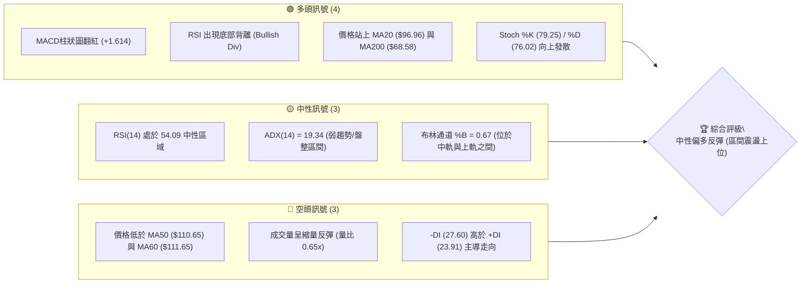
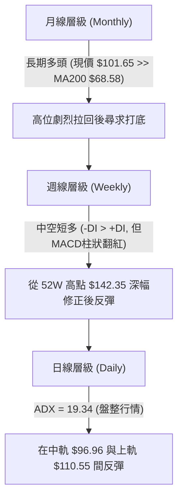
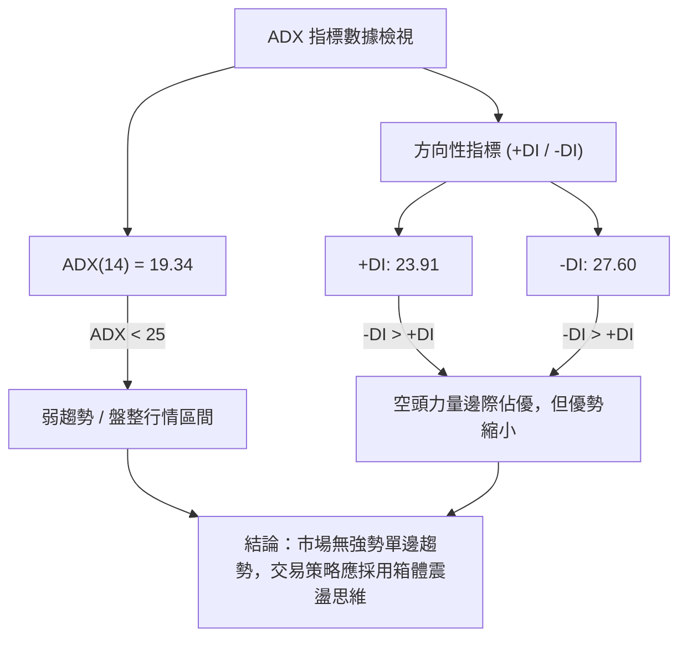
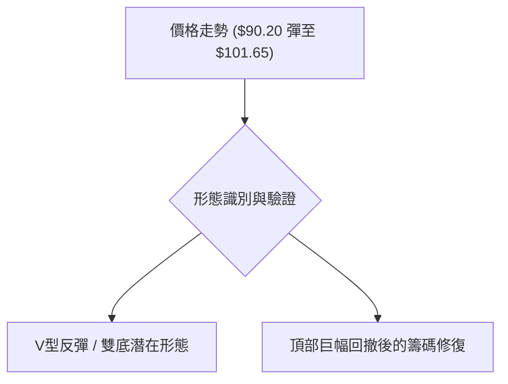
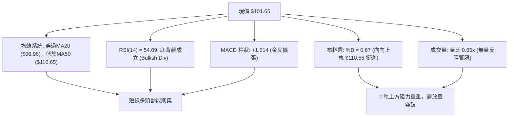
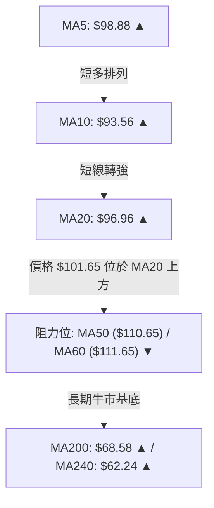
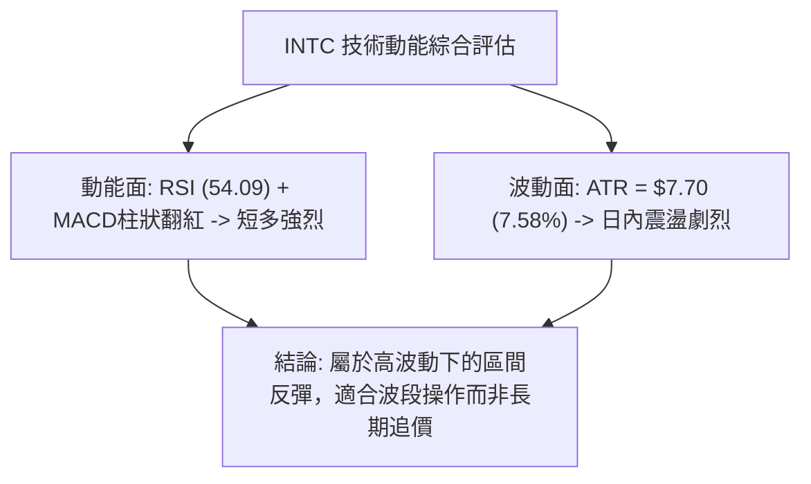
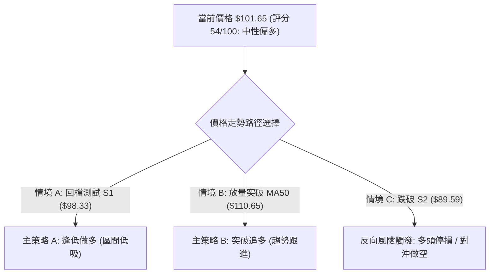
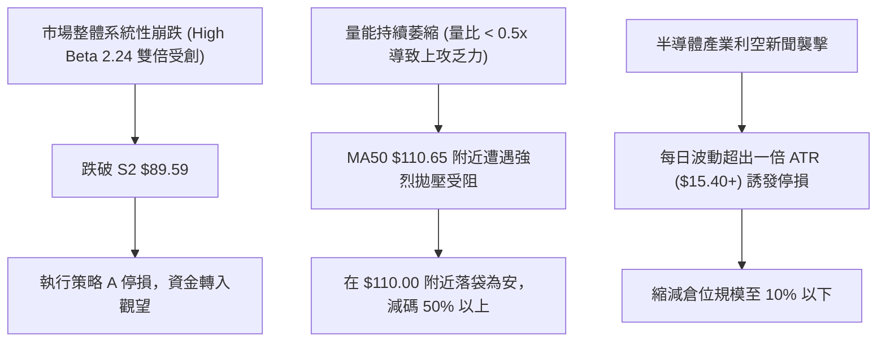

# INTC 技術分析報告

> **報告日期**：2026-08-08 ｜ **語言**：繁體中文 ｜ **數據來源**：Yahoo Finance ｜ **當前價格**：$101.65

---

## 目錄

| 章節 | 內容 |
|------|------|
| [1. 技術面概覽](#1-技術面概覽) | 訊號儀表板、核心指標、評分卡 |
| [2. 趨勢分析](#2-趨勢分析) | 多時框趨勢、長中短期走勢 |
| [3. 圖表形態分析](#3-圖表形態分析) | 形態識別、K線組合、目標價 |
| [4. 支撐與阻力](#4-支撐與阻力) | 關鍵價位、斐波那契回調 |
| [5. 技術指標深度解讀](#5-技術指標深度解讀) | MA/RSI/MACD/布林/成交量 |
| [6. 動能與波動率](#6-動能與波動率) | 動能評估、ATR、Beta |
| [7. 多時框架總結](#7-多時框架總結) | 時框架評分矩陣 |
| [8. 交易策略建議](#8-交易策略建議) | 多空策略、風險報酬比 |
| [9. 風險提示與監控](#9-風險提示與監控) | 監控指標、風險場景 |

---

## 1. 技術面概覽

### 🎯 技術訊號儀表板



### 📊 核心指標速覽表

| 指標類別 | 指標名稱 | 當前數值 | 訊號 | 解讀 |
|----------|----------|----------|------|------|
| **價格** | 當前價格 | $101.65 | 🟡 | 位於52週高低點之 66.8% 分位點，自底部反彈 |
| **均線** | MA20 | $96.96 | 🟢 | 價格已站上20日均線，短期止跌回升 |
| **均線** | MA50 | $110.65 | 🔴 | 價格受制於50日均線，中軌上方存有反彈壓力 |
| **均線** | MA200 | $68.58 | 🟢 | 遠高於200日均線，長期牛市架構未破壞 |
| **動能** | RSI(14) | 54.09 | 🟢 | 走出超賣區，並伴隨指標底部背離訊號 |
| **動能** | MACD | -3.831 | 🟢 | 柱狀圖 (+1.614) 呈現金叉向上擴張 |
| **趨勢** | ADX(14) | 19.34 | 🟡 | ADX < 25 處於無明顯趨勢之箱體盤整格局 |
| **波動** | ATR(14) | $7.70 | 🟡 | 每日平均波動率 7.58%，屬於中高波動狀態 |
| **量能** | 成交量比 | 0.65x | 🔴 | 最新量 74.29M 低於20日均量 114.55M，縮量上攻 |

### 🏆 技術評分卡

```
╔══════════════════════════════════════════════════════════════════╗
║                技術評分卡 — INTC (2026-08-08)                    ║
╠══════════════════════════════════════════════════════════════════╣
║ 趨勢強度 (ADX)     ▓▓▓▓▓▓▓░░░░░░░░░░░░░  38/100  🟡 弱趨勢/盤整 ║
║ 動能指標 (RSI/MACD)▓▓▓▓▓▓▓▓▓▓▓▓▓░░░░░░░  65/100  🟢 底背離金叉 ║
║ 支撐穩定度 (S1-S3) ▓▓▓▓▓▓▓▓▓▓▓▓▓▓░░░░░░  70/100  🟢 98.33/89.59║
║ 成交量配合度       ▓▓▓▓▓▓▓░░░░░░░░░░░░░  35/100  🔴 無量跟進   ║
║ 形態完整度         ▓▓▓▓▓▓▓▓▓▓▓▓░░░░░░░░  60/100  🟡 V型築底中  ║
║ 均線系統排列       ▓▓▓▓▓▓▓▓▓▓▓░░░░░░░░░  55/100  🟡 多空交錯   ║
╠══════════════════════════════════════════════════════════════════╣
║ 綜合評分           ▓▓▓▓▓▓▓▓▓▓▓░░░░░░░░░  54/100  🟡 中性偏多   ║
╚══════════════════════════════════════════════════════════════════╝
```

---

## 2. 趨勢分析

### 🌐 多時框趨勢分析



### 📈 長期趨勢 — 12個月走勢圖（Unicode）

近 12 個月以來，INTC 經歷了一波極為強勁的拋物線式狂飆，隨後出現快速深幅拉回。

```
INTC 月線走勢圖 (2025-08 至 2026-08)
價格軸 ($)
$140 ┤                                   ● (2026-06 $139.63 Peak)
$120 ┤                             ●
$100 ┤                       ●           ●             ● 現價 $101.65
$80  ┤
$60  ┤                 ●
$40  ┤           ●
$20  ┤ ●   ●
     └─┬───┬───┬───┬───┬───┬───┬───┬───┬───┬───┬───┬───
      M08 M09 M10 M11 M12 M01 M02 M03 M04 M05 M06 M07 M08
      (2025)                                     (2026)
```

#### 過去 12 個月走勢特徵分析表

| 時間階段 | 區間價格變化 | 漲跌幅 | 走勢特徵描述 |
|----------|--------------|--------|--------------|
| **2025-08 ~ 2025-11** | $24.35 → $40.56 | +66.57% | 築底完成，突破底部箱體帶量上攻 |
| **2025-12 ~ 2026-03** | $36.90 → $44.13 | +19.59% | 高檔橫盤消化獲利籌碼，蓄積突破動能 |
| **2026-04 ~ 2026-06** | $94.48 → $139.63 | +47.79% | 主升段拋物線狂飆，創下 52 週新高 $142.35 |
| **2026-07** | $139.63 → $90.20 | -35.40% | 多頭獲利了結，短線出現崩塌式深幅回調 |
| **2026-08 (最新)** | $90.20 → $101.65 | +12.69% | 止跌於 S2 ($89.59) 上方，展開技術性反彈 |

### 📊 中期趨勢（週線分析）

中期走勢顯示，INTC 在 2026 年 6 月達 $139.63 頂峰後，遭逢強烈拋售賣壓，於 2026 年 7 月最後一週下探至 $90.20。此處恰位於斐波那契 50.0% 回調位 ($80.98) 與 38.2% 回調位 ($95.46) 之間的強支撐地帶。目前週線已連續兩週收陽，最新週收盤價來到 $101.65，突破短期 20 日均線 ($96.96)，展現中期止跌築底跡象。

```
INTC 中期阻力與支撐結構示意圖
═══════════════════════════════════════════════════════════
 $142.35 ────────────────────────────────────── 52W 歷史高點 (0.0%)
 $126.64 ────────────────────────────────────── 強壓力 R1
 $113.38 ────────────────────────────────────── 斐波那契 23.6% 回調位
 $110.55 ────────────────────────────────────── 布林通道上軌 / MA50 ($110.65)
 $101.65 ◄───────────────────────────────────── 現價位置
 $98.33  ────────────────────────────────────── 短期支撐 S1
 $95.46  ────────────────────────────────────── 斐波那契 38.2% 回調位
 $89.59  ────────────────────────────────────── 關鍵波段低點支撐 S2
 $80.98  ────────────────────────────────────── 斐波那契 50.0% 強支撐
═══════════════════════════════════════════════════════════
```

### ⚡ 趨勢強度評估（ADX 解讀）



#### ADX 趨勢強度對照表

| ADX 數值區間 | 當前狀態 | 市場特徵 | 建議交易模式 |
|--------------|----------|----------|--------------|
| **0 – 20** | **19.34 (當前)** | **無趨勢 / 橫盤震盪** | **高拋低吸，關注布林上下軌** |
| **20 – 25** | — | 趨勢萌芽期 / 弱趨勢 | 觀望突破方向 |
| **25 – 50** | — | 強勁單邊趨勢 | 順勢交易，均線追蹤 |
| **50 – 100** | — | 極端強烈趨勢 | 防範過度延伸反轉 |

---

## 3. 圖表形態分析

### 🔍 形態識別系統



#### 形態信心度評估表（依據嚴格規則 15）

| 形態名稱 | 信心度 | 判斷依據（引用數據） | 完成度 | 目標價（附計算式） |
|----------|--------|----------------------|--------|--------------------|
| **V型急彈 / W底第一腳** | 65% | 7/26 底點 $90.20 守住 S2 ($89.59)，RSI 產生底背離 | 70% | 頸線 $110.55 + 形態高度 ($110.55-$89.59=$20.96) = **$131.51**（接近 R2 $132.75） |
| **布林中軌突破反彈** | 80% | 價格 $101.65 成功收復中軌 MA20 ($96.96) | 100% | 布林上軌目標 **$110.55** |
| **頭肩頂/大雙頂形態** | 35% | 數據不足以確認大級別反轉形態 | 20% | *訊號不足，僅做指標型解讀* |

### 🕯️ 重要 K 線形態分析

| 日期/月份 | 收盤價 | K 線形態名稱 | 技術面解讀 | 訊號強度 |
|-----------|--------|--------------|------------|----------|
| **2026-06** | $139.63 | 高檔長上影避雷針 | 攻高 $142.35 後主力強烈獲利了結，見頂訊號 | 🔴 強空 |
| **2026-07** | $90.20 | 大陰線向下探底 | 短線多頭棄守，直接灌破 MA50，急跌尋求支撐 | 🔴 空頭 |
| **2026-08-02** | $90.20 | 止跌十字星 (Doji) | 賣壓衰竭，多空於 S2 ($89.59) 附近達成短暫平衡 | 🟡 變盤 |
| **2026-08-09** | $101.65 | 中陽線穿透突破 | 實體陽線站上 MA20 ($96.96)，多頭展開反攻 | 🟢 強多 |

### 📉 ASCII 走勢形態示意圖

以下為 INTC 自 $142.35 高點回落後，於 S2 ($89.59) 附近形成底部背離並向上反彈至 $101.65 之形態示意圖：

```
INTC 日線反彈形態與指標背離示意圖
─────────────────────────────────────────────────────────────────
價格 ($)
$142.35 ┼──● (高點)
$120.00 ┼     \
$110.55 ┼──────\───────────────● 布林上軌 / MA50 壓力區
$101.65 ┼───────\─────────────● 現價反彈位置
$96.96  ┼────────\───●───────/   MA20 中軌
$89.59  ┼─────────\─●─●──────/    S2 波段雙重底 ($90.20)
─────────────────────────────────────────────────────────────────
RSI(14)
70      ┼──● (超買)
50      ┼─────\───────●──────●  RSI = 54.09 (向上突破50)
30      ┼──────\─────/───▲──/   
               底背離 (價格創新低 $90.20，RSI 底部抬高)
─────────────────────────────────────────────────────────────────
```

### 🎯 形態目標價計算

基於現行「V型底/潛在W底」反彈形態計算：
1. **第一階段目標價（布林通道上軌/MA50重合區）**：
   $$\text{Target 1} = \text{MA50 重合區} = \mathbf{\$110.65}$$
2. **第二階段目標價（斐波那契 23.6% 回調位）**：
   $$\text{Target 2} = \text{Fib 23.6\%} = \mathbf{\$113.38}$$
3. **形態全幅推算目標價（若突破頸線 $110.55）**：
   $$\text{頸線價位} (\$110.55) + \text{形態高度} (\$110.55 - \$89.59 = \$20.96) = \mathbf{\$131.51}$$
   *(註：$131.51 極度接近阻力位 R2 的 $132.75)*

---

## 4. 支撐與阻力

### 🗺️ 關鍵價位分布圖（Unicode）

```
INTC 價位結構分布圖 (由 OHLCV 精確計算)
═══════════════════════════════════════════════════════════════════════
$142.35 ║████████████████████████████████████████████║ 52W 歷史高點 (0.0%)
$141.90 ║██████████████████████████████████████████  ║ 強阻力 R3 (+39.60%)
$132.75 ║████████████████████████████████████        ║ 阻力 R2 (+30.60%)
$126.64 ║██████████████████████████████              ║ 關鍵阻力 R1 (+24.58%)
$113.38 ║▓▓▓▓▓▓▓▓▓▓▓▓▓▓▓▓▓▓▓▓▓▓▓▓                    ║ 斐波那契 23.6% 位
$110.65 ║▓▓▓▓▓▓▓▓▓▓▓▓▓▓▓▓▓▓▓                         ║ MA50 / BB上軌($110.55)
$101.65 ╠════════════════════════════════════════════╣ ◄ 當前價格 (現價)
$98.33  ║▒▒▒▒▒▒▒▒▒▒▒▒▒▒▒▒                            ║ 近期關鍵支撐 S1 (-3.27%)
$95.46  ║▒▒▒▒▒▒▒▒▒▒▒▒▒▒                              ║ 斐波那契 38.2% 位
$89.59  ║████████████████████████████                ║ 強支撐 S2 (-11.86%)
$81.79  ║██████████████████████████████████████████  ║ 極強支撐 S3 (-19.54%)
$80.98  ║██████████████████████████████████████████  ║ 斐波那契 50.0% 位
═══════════════════════════════════════════════════════════════════════
```

### 🚧 阻力位分析表

數據嚴格引用自 OHLCV 關鍵價位計算結果：

| 阻力級別 | 價位 | 形成原因 | 突破難度 | 重要性 |
|----------|------|----------|----------|--------|
| **R1** | **$126.64** | 近一年波段高點聚類一，回調前之密集交投區 | 🔴 極高 | ⭐️⭐️⭐️⭐️⭐️ |
| **R2** | **$132.75** | 近一年波段高點聚類二，形態目標推算重合點 | 🔴 高 | ⭐️⭐️⭐️⭐️ |
| **R3** | **$141.90** | 近一年波段極致高點聚類，接近 52W 高點 $142.35 | 🔴 極高 | ⭐️⭐️⭐️⭐️⭐️ |

### 🛡️ 支撐位分析表

數據嚴格引用自 OHLCV 關鍵價位計算結果：

| 支撐級別 | 價位 | 形成原因 | 守住機率 | 重要性 |
|----------|------|----------|----------|--------|
| **S1** | **$98.33** | 近一年波段低點聚類一，緊鄰 20日均線 ($96.96) | 🟢 75% | ⭐️⭐️⭐️⭐️ |
| **S2** | **$89.59** | 近一年波段低點聚類二，7 月末低點 $90.20 強支撐 | 🟢 85% | ⭐️⭐️⭐️⭐️⭐️ |
| **S3** | **$81.79** | 近一年波段低點聚類三，重合斐波那契 50% ($80.98) | 🟢 95% | ⭐️⭐️⭐️⭐️⭐️ |

### 📐 斐波那契回調位分析

基於 52 週區間波段（最低點 **$19.60** 至 最高點 **$142.35**，總波幅 $122.75）精確計算：

| 斐波那契位 | 精確價位 | 與現價距離 | 技術意義與解讀 |
|------------|----------|------------|----------------|
| **0.0%** | **$142.35** | +40.04% | 52 週最高點，強烈心理與實質壓力牆 |
| **23.6%** | **$113.38** | +11.54% | 第一重強回調壓力位，緊貼 MA50 ($110.65) |
| **38.2%** | **$95.46** | -6.09% | **當前價格位處點**：$101.65 已守住 38.2% 回調位 |
| **50.0%** | **$80.98** | -20.33% | 中期多空強弱分水嶺，與 S3 ($81.79) 形成超級共振支撐 |
| **61.8%** | **$66.49** | -34.58% | 黃金分割強支撐，接近 200日均線 MA200 ($68.58) |
| **78.6%** | **$45.87** | -54.87% | 深幅修正極限位 |
| **100.0%** | **$19.60** | -80.72% | 52 週最低點，起漲點起點 |

**位置解讀**：當前價格 **$101.65** 正位於 38.2% 回調位 ($95.46) 與 23.6% 回調位 ($113.38) 之間，顯示股價已順利在黃金分割 38.2% 關鍵防線前獲得支撐並啟動反彈，下一階段目標為挑戰 23.6% ($113.38) 壓力帶。

---

## 5. 技術指標深度解讀

### 🎛️ 指標訊號總覽



### 📈 移動平均線排列分析



#### 均線數據比較表

| 均線名稱 | 當前價位 | 與現價偏離度 | 走勢方向 | 角色與技術含義 |
|----------|----------|--------------|----------|----------------|
| **MA 5** | $98.88 | +2.81% | ▲ 上升 | 短線極速扣高支撐 |
| **MA 10** | $93.56 | +8.65% | ▲ 上升 | 短線多頭防守線 |
| **MA 20** | $96.96 | +4.84% | ▲ 上升 | 月線生命線，已突破轉為支撐 |
| **MA 50** | $110.65 | -8.13% | ▼ 下降 | 季線中期強壓力牆 |
| **MA 60** | $111.65 | -8.96% | ▼ 下降 | 中期反彈主要目標阻力 |
| **MA 120**| $86.81 | +17.10% | ▲ 上升 | 半年線，下方堅實屏障 |
| **MA 200**| $68.58 | +48.22% | ▲ 上升 | 年線，長線牛熊分水嶺 |

### 📉 RSI(14) 分析

*   **當前數值**：**54.09**
*   **強度進度條**：`███████████░░░░░░░░░` (54/100 中性偏多區)
*   **背離狀態**：⚠️ **明確底背離 (Bullish Divergence)** 成立。
    *   *現象證明*：7 月下旬價格跌破前低下探至 $90.20，但 RSI 指標並未創新低，反而由 26.9 抬高至 39.5，隨後拉升至 54.09。此為極標準的底部背離，預示空頭力竭，短線反彈動能充沛。

### 📊 MACD(12, 26, 9) 訊號解讀

*   **MACD 快線**：-3.831
*   **MACD 慢線 (Signal)**：-5.445
*   **MACD 柱狀圖 (Histogram)**：**+1.614** 🟢
*   **解讀**：MACD 快線已自下方金叉慢線，柱狀圖連續由負轉正並擴張至 +1.614。儘管雙線仍位於零軸下方（代表中長期修正尚未完全結束），但零軸下金叉通常是強烈的波段反彈買進訊號。

### 📦 布林通道分析

```
INTC 布林通道結構示意圖
═════════════════════════════════════════════════════════════════
 $110.55 ────────────────────────────────────── 布林通道上軌 (Upper Band)
                                                ▲ 反彈目標價
 $101.65 ◄───────────────────────────────────── 現價位處 %B = 0.67
 $96.96  ────────────────────────────────────── 布林通道中軌 (MA20)
                                                ▼ 下方支撐位
 $83.37  ────────────────────────────────────── 布林通道下軌 (Lower Band)
═════════════════════════════════════════════════════════════════
```

*   **上軌**：$110.55 ｜ **中軌 (MA20)**：$96.96 ｜ **下軌**：$83.37
*   **%B 指標**：0.67（代表當前價格已突破中軌，朝上軌運作）
*   **通道型態**：通道開口正在收斂後擴展，股價在中軌 $96.96 獲得支持，預期將回測上軌 **$110.55**。

### 💹 成交量分析（量價配合度）

*   **最新成交量**：74,293,938 股
*   **20日均量**：114,545,847 股（量比：**0.65x**）
*   **OBV 狀態**：OBV < OBV_MA，顯示整體籌碼仍在流出後的修復期。
*   **量價背離警訊**：價格從 $90.20 反彈至 $101.65，但成交量僅為 20 日均量的 65%，屬於典型「**無量反彈**」。若後續挑戰 MA50 ($110.65) 時無法補量至 1.1 億股以上，需提防在高點附近再次受阻回落。

---

## 6. 動能與波動率

### ⚡ 動能評估

根據 ADX (19.34) 與歷史波動率，當前股票在動能與波動率之四象限分佈如下：

| 象限 | 動能強度 | 波動率 | 當前狀態 | 交易含意與策略建議 |
|------|----------|--------|----------|--------------------|
| **Q1** | 強動能 | 低波動 | — | 趨勢突破最佳買點 |
| **Q2 (當前)** | **弱動能 (ADX < 25)** | **高波動 (ATR 7.58%)** | **✓ 採納** | **區間震盪、高拋低吸，嚴格控制止損** |
| **Q3** | 強動能 | 高波動 | — | 主升段/主跌段，追價風險高 |
| **Q4** | 弱動能 | 低波動 | — | 沉悶盤整，缺乏交易機會 |



### 📊 ATR 波動率分析

*   **ATR(14)**：**$7.70**（佔價格比列 **7.58%**）
*   **風控應用建議**：
    *   **短線止損距離 (1.0x ATR)**：$7.70
    *   **波段止損距離 (1.5x ATR)**：$11.55
    *   **寬鬆止損距離 (2.0x ATR)**：$15.40
*   *實務操作*：若以現價 $101.65 進場，防守線設於 S1 ($98.33)，距離約 $3.32 (0.43x ATR)；若設於 S2 ($89.59)，距離為 $12.06 (約 1.56x ATR)，技術上非常合理。

### 📐 Beta 與市場相關性

*   **Beta 係數**：**2.241**
*   **分析**：INTC 的 Beta 高達 2.24，屬於高貝塔科技股。在大盤（如 S&P 500 或費城半導體指數）上漲時具備 2.24 倍的放大彈升力，但在大盤回檔時亦面臨雙倍下行壓力。

---

## 7. 多時框架總結

### 📋 時框架評分表

| 時框架 | 趨勢方向 | 動能狀態 | 均線排列 | 形態結構 | 綜合評分 | 建議策略 |
|--------|----------|----------|----------|----------|----------|----------|
| **日線 (Daily)** | 🟢 止跌反彈 | 🟢 MACD金叉 | 🟡 多空交錯 | 🟢 V型打底 | **65/100** | 短線做多，目標 MA50 |
| **週線 (Weekly)**| 🟡 區間盤整 | 🟡 修正趨緩 | 🟡 跌破MA20 | 🟡 50%回調處 | **50/100** | 箱體操作，等待突破 |
| **月線 (Monthly)**| 🟢 長期看多 | 🟢 長線偏多 | 🟢 多頭排列 | 🟢 高檔拉回 | **70/100** | 長線逢低分批佈局 |

### ⚖️ 多時框收斂結論（依據規則 14 嚴格執行）

1.  **行情性質判定**：當前 ADX(14) = 19.34 (< 25)，依據多時框收斂規則，市場屬於**「盤整/箱體震盪行情」**。
2.  **主導框架**：以日線布林通道 ($83.37 – $110.55) 與關鍵斐波那契區間 ($95.46 – $113.38) 為主要交易邊界。
3.  **唯一方向性結論**：**中性偏多區間反彈 (Neutral-Bullish Range Rebound)**。
    *   週線深幅拉回已於 S2 ($89.59) 獲得支撐，日線指標（RSI底背離、MACD金叉）強烈支持價格向布林上軌/MA50 ($110.55–$110.65) 發起反彈衝擊。

---

## 8. 交易策略建議

### 🗺️ 策略決策流程圖



### 🧭 策略路由

*   **當前主策略方向**：**中性偏多反彈（波段做多）**（依評分卡 54/100 及 ADX 盤整定義）

### 🎯 價格情境階梯 (Price Scenarios)

所有價位嚴格引用第 4 章計算結果：

| 觸發條件 | 第一目標 | 第二目標 | 情境技術含義 |
|----------|----------|----------|--------------|
| **強勢突破 MA50 $110.65** | R1 $126.64 | R2 $132.75 | 中期多頭主升段重啟 |
| **站穩 S1 $98.33 上方** | 布林上軌 $110.55 | Fib 23.6% $113.38 | 箱體震盪上軌反彈中（當前情境） |
| **跌破 S1 $98.33** | S2 $89.59 | S3 $81.79 | 反彈失敗，向下二次探底 |

### 📊 情境機率分佈

| 情境劇本 | 機率 | 主要技術依據 |
|----------|------|--------------|
| **1. 向上反彈測試 MA50/上軌** | **55%** | RSI 底背離、MACD 金叉擴張、收復 MA20 |
| **2. 在 $95.46 – $105.00 箱體震盪** | **30%** | ADX = 19.34 顯示趨勢弱，成交量 0.65x 不足 |
| **3. 跌破 S1 下探 S2 重測底部** | **15%** | -DI (27.60) 仍高於 +DI (23.91)，大盤系統性風險 |

### 🟢 主策略詳情

#### 策略 A：區間低吸做多（首選波段策略）
*   **進場條件**：價格微幅拉回至 S1 ($98.33) 附近，或當前價位 ($101.65) 分批建立試探倉位。
*   **進場價格**：**$98.50 – $101.65**
*   **止損價格**：**$89.59**（跌破 S2 波段低點強勢停損，虧損空間約 $8.91 – $12.06）
*   **目標價 T1**：**$110.55**（布林上軌 / MA50 壓力牆）
*   **目標價 T2**：**$113.38**（斐波那契 23.6% 回調位）
*   **風險報酬比 (R:R)**：
    *   以進場價 $98.50 計算，止損 $89.59 (風險 $8.91)
    *   T1 ($110.55) 風報酬比 = $(\$110.55 - \$98.50) / \$8.91 = \mathbf{1.35 : 1}$
    *   T2 ($113.38) 風報酬比 = $(\$113.38 - \$98.50) / \$8.91 = \mathbf{1.67 : 1}$
*   **勝率估計**：55%
*   **建議倉位**：**15% - 20%** 總資金

#### 策略 B：突破追多策略（次選右側策略）
*   **進場條件**：日線收盤價帶量（日成交量 > 1.1 億股）強勢突破 MA50 ($110.65) 與 Fib 23.6% ($113.38)。
*   **進場價格**：**$113.50**
*   **止損價格**：**$98.33**（退守 S1 關鍵支撐區）
*   **目標價 T1**：**$126.64**（關鍵阻力 R1）
*   **目標價 T2**：**$132.75**（阻力 R2 及 W底全幅推算目標）
*   **風險報酬比 (R:R)**：
    *   止損距離 = $\$113.50 - \$98.33 = \$15.17$
    *   T1 ($126.64) 風報酬比 = $(\$126.64 - \$113.50) / \$15.17 = \mathbf{0.87 : 1}$
    *   T2 ($132.75) 風報酬比 = $(\$132.75 - \$113.50) / \$15.17 = \mathbf{1.27 : 1}$
*   **勝率估計**：45%
*   **建議倉位**：**10%** 總資金

### 🔴 反向風險觸發點（對沖提示）

*   **多頭失效警訊**：若日線收盤價收跌破 **$89.59 (S2)**，代表 V 型反彈結構徹底被破壞，價格將尋求跌向 **$81.79 (S3)** 及斐波那契 50% ($80.98)。此時多頭應全面離場，空頭對沖者可考量順勢避險。

### ⭐ 整體訊號強度評星

```
做多訊號強度：★★★☆☆  (3.5/5 星) — RSI底背離與MACD金叉支持反彈
做空訊號強度：★★☆☆☆  (2.0/5 星) — 跌勢已在 S2 止跌，短空風險大
整體可信度：  ★★★☆☆  (3.5/5 星) — 受到量能不足限制，屬於箱體反彈
```

---

## 9. 風險提示與監控

### ✅ 關鍵監控指標 Checklist

```
╔══════════════════════════════════════════════════════════════════╗
║                   每日交易前監控檢查清單 (Checklist)             ║
╠══════════════════════════════════════════════════════════════════╣
║ [ ] 價格是否維持在 MA20 ($96.96) 與 S1 ($98.33) 上方？           ║
║ [ ] 日成交量能否回升至 20日均量 (1.14 億股) 以上？               ║
║ [ ] MACD 柱狀圖 (+1.614) 是否持續正向擴張？                      ║
║ [ ] RSI(14) 能否進一步突破 60 衝向超買區？                       ║
║ [ ] 向上挑戰 MA50 ($110.65) 時是否出現長上影線受阻？             ║
║ [ ] -DI (27.60) 是否回落至 +DI (23.91) 下方完成多頭交叉？        ║
╚══════════════════════════════════════════════════════════════════╝
```

### ⚠️ 風險場景分析



### 🛡️ 風險管理重要提醒

1.  **縮量反彈陷阱**：目前價格反彈至 $101.65 但量比僅 0.65x，顯示主力資金未大規模追價，屬於技術性指標修正。**嚴禁在高於 $108.00 追高**。
2.  **高 Beta 倉位控管**：INTC Beta 為 2.241，波動顯著高於大盤。單一股票持倉建議不超過總投資組合之 **15%**，並嚴格執行 ATR 止損機制。

---

## 📋 報告總結

```
INTC 技術分析報告總結
═══════════════════════════════════════════════════════════════════════
報告日期：2026-08-08
當前價格：$101.65
分析評級：🟡 中性偏多（區間震盪上位反彈）

關鍵結論：
├─ 長期趨勢：🟢 仍處長線牛市架構（現價遠高於 MA200 $68.58）
├─ 中期趨勢：🟡 自 $142.35 頂峰深幅回調後，於 S2 ($89.59) 築底
├─ 短期趨勢：🟢 日線 RSI 底背離 + MACD 金叉，引發技術性反彈
├─ 關鍵支撐：S1 $98.33 / S2 $89.59
├─ 關鍵阻力：布林上軌 $110.55 / MA50 $110.65 / R1 $126.64
└─ 分析師目標：均值 $115.17（與技術面目標 Fib 23.6% $113.38 高度重合）

最優策略組合：
1. 🥇 最佳機會：採策略 A，於 $98.50 - $101.65 區間逢低做多，目標 $110.55 / $113.38，止損 $89.59。
2. 🥈 次選機會：待放量突破 MA50 ($110.65) 後，採策略 B 右側追多，目標 $126.64。
3. 🥉 保守選擇：觀望至 ADX > 25 且成交量放大至 1.1 億股以上再行進場。
═══════════════════════════════════════════════════════════════════════
```

---

> ⚠️ **免責聲明**：本報告為 AI 自動生成之技術分析報告，所有數據及價位均嚴格基於提供之歷史價格與指標資訊計算。本報告**僅供學術研究與參考**，**不構成任何投資建議與買賣操作依據**。金融市場投資具備極高風險，投資人應獨立思考並自行承擔交易風險。

---
*報告生成時間：2026-08-08 ｜ 數據來源：Yahoo Finance ｜ 分析框架：多時框技術分析*