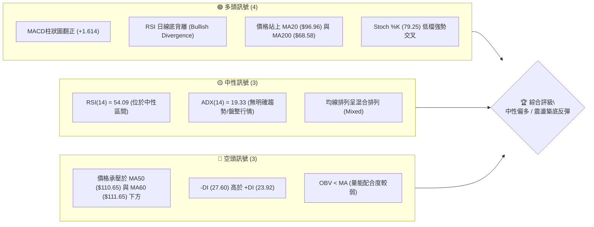
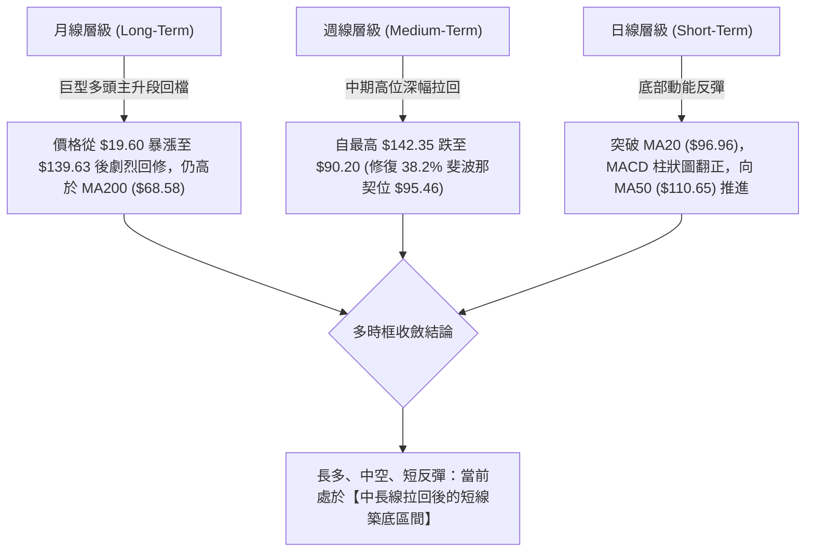
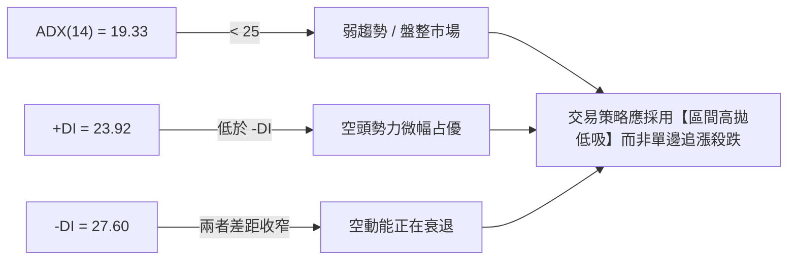
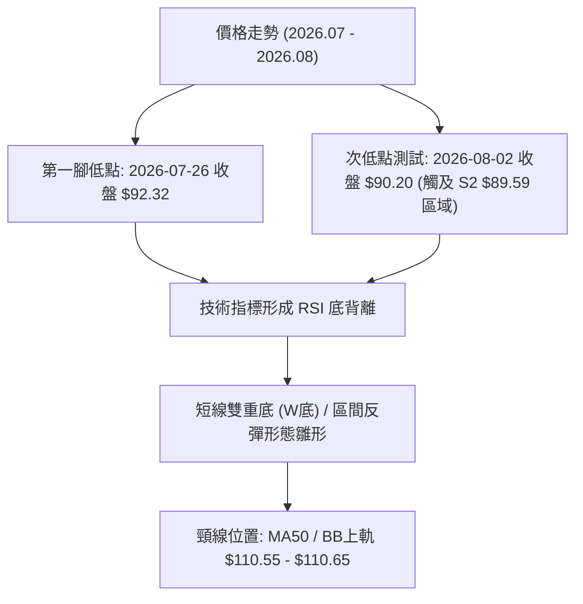
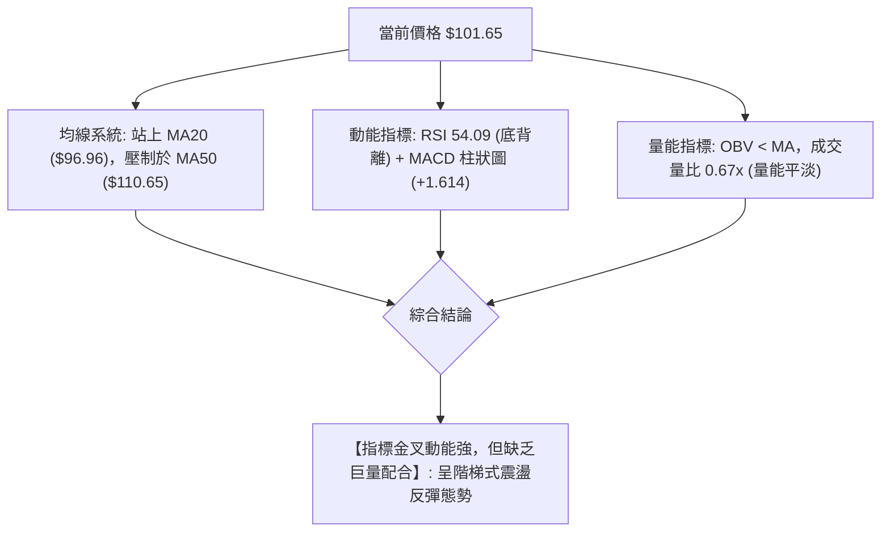
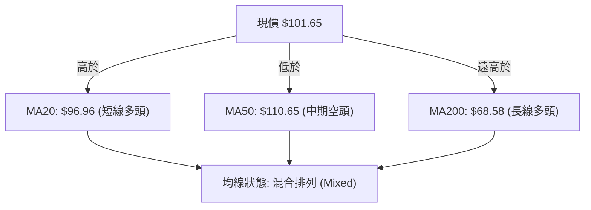
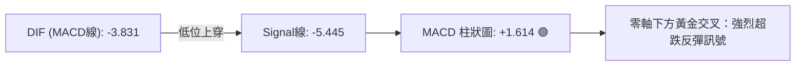
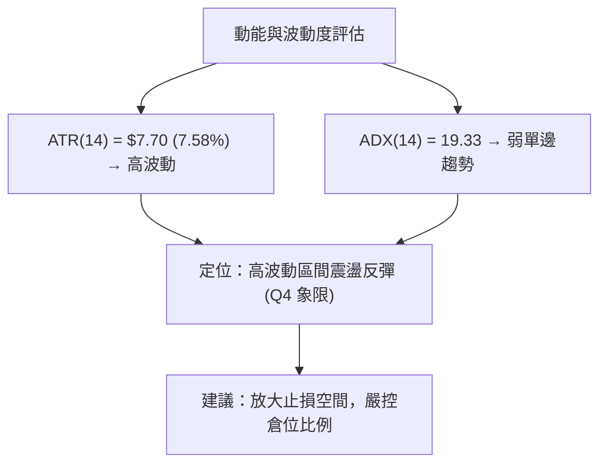
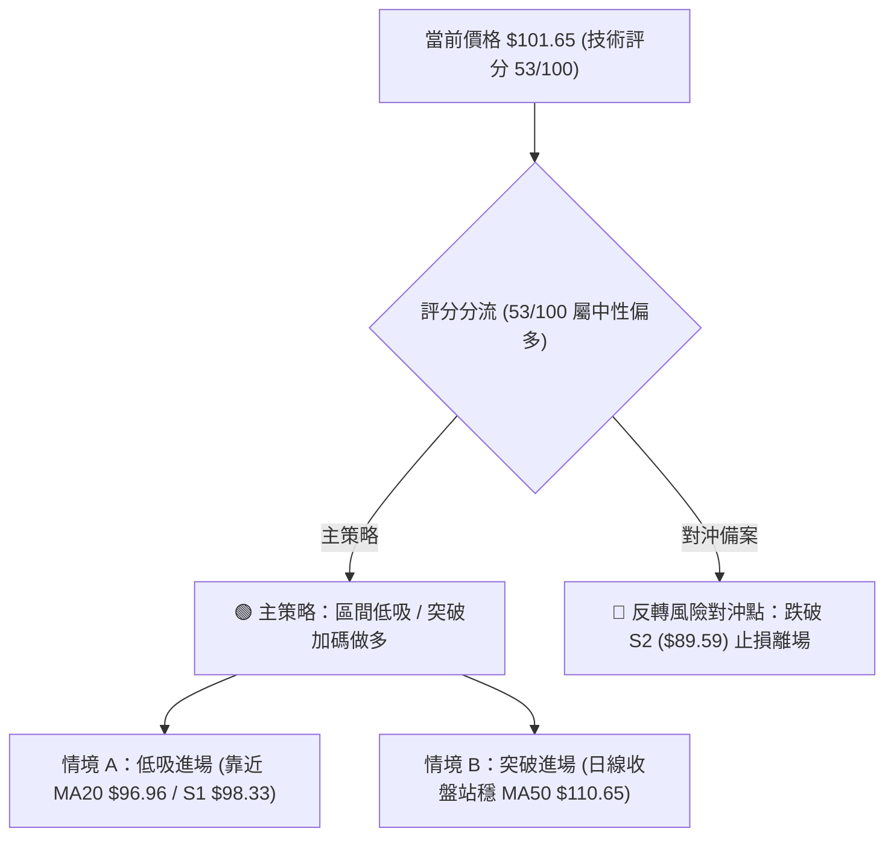
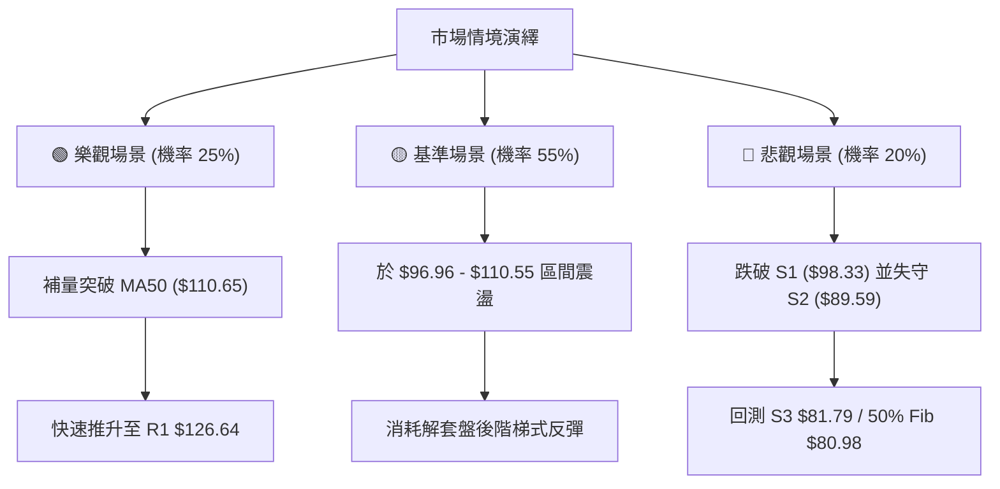

# INTC 技術分析報告

> **報告日期**：2026-08-09 ｜ **語言**：繁體中文 ｜ **數據來源**：Yahoo Finance ｜ **當前價格**：$101.65

---

## 目錄

| 章節 | 內容 |
|------|------|
| [1. 技術面概覽](#1-技術面概覽) | 訊號儀表板、核心指標、評分卡 |
| [2. 趨勢分析](#2-趨勢分析) | 多時框趨勢、長中短期走勢、ADX強弱 |
| [3. 圖表形態分析](#3-圖表形態分析) | 形態識別、K線組合、目標價推算 |
| [4. 支撐與阻力](#4-支撐與阻力) | 關鍵價位、斐波那契回調層級 |
| [5. 技術指標深度解讀](#5-技術指標深度解讀) | MA/RSI/MACD/布林通道/量能 |
| [6. 動能與波動率](#6-動能與波動率) | 動能評估、ATR與Beta分析 |
| [7. 多時框架總結](#7-多時框架總結) | 時框架評分矩陣與收斂結論 |
| [8. 交易策略建議](#8-交易策略建議) | 主策略、價格情境、風控點位 |
| [9. 風險提示與監控](#9-風險提示與監控) | 監控指標與情境演繹 |

---

## 1. 技術面概覽

### 🎯 技術訊號儀表板



### 📊 核心指標速覽表

| 指標類別 | 指標名稱 | 當前數值 | 訊號 | 解讀 |
|----------|----------|----------|------|------|
| **價格** | 當前收盤價 | $101.65 | 🟢 | 站上 52 週區間 66.8% 位置，自近週低點 $90.20 展開反彈 |
| **均線** | MA20 | $96.96 | 🟢 | 價格位於 MA20 上方 (+4.84%)，短線扭轉極度劣勢 |
| **均線** | MA50 | $110.65 | 🔴 | 價格位於 MA50 下方 (-8.13%)，中期反彈首要壓力區 |
| **均線** | MA200 | $68.58 | 🟢 | 價格遠高於 MA200 (+48.22%)，長期多頭基底完好 |
| **動能** | RSI(14) | 54.09 | 🟢 | 突破 50 中軸，且存在顯著之日/週線級別底背離 |
| **動能** | MACD(12,26,9) | -3.831 / Signal -5.445 | 🟢 | DIF 線上穿 Signal，MACD 柱狀圖 (+1.614) 擴大發散 |
| **波動** | ATR(14) | $7.70 | 🟡 | 占股價 7.58%，屬於中高波動狀態，每日振幅較大 |
| **趨勢** | ADX(14) | 19.33 | 🟡 | 低於 25，顯示當前非單邊趨勢，屬區間震盪整理 |

### 🏆 技術評分卡

```
╔══════════════════════════════════════════════════════════════════╗
║              INTC 技術面綜合評分卡 (2026-08-09)                 ║
╠══════════════════════════════════════════════════════════════════╣
║ 趨勢強度 (ADX)     ▓▓▓▓▓▓▓░░░░░░░░░░░░░  35/100  🟡 弱趨勢/盤整   ║
║ 動能指標 (MACD/RSI) ▓▓▓▓▓▓▓▓▓▓▓▓▓░░░░░░░  65/100  🟢 動能回升/背離 ║
║ 支撐穩定度 (Fib/S)  ▓▓▓▓▓▓▓▓▓▓▓▓▓▓░░░░░░  70/100  🟢 $89-$95撐住   ║
║ 成交量配合 (OBV)   ▓▓▓▓▓▓▓▓░░░░░░░░░░░░  40/100  🔴 量能未能大增 ║
║ 形態完整度 (W底)   ▓▓▓▓▓▓▓▓▓▓▓░░░░░░░░░  55/100  🟡 區間打底中   ║
║ 均線排列 (MA)      ▓▓▓▓▓▓▓▓▓▓░░░░░░░░░░  50/100  🟡 糾結混合排列 ║
╠══════════════════════════════════════════════════════════════════╣
║ 綜合評分           ▓▓▓▓▓▓▓▓▓▓▓░░░░░░░░░  53/100  ⚖️ 中性偏多    ║
╚══════════════════════════════════════════════════════════════════╝
```

---

## 2. 趨勢分析

### 🌐 多時框趨勢分析



### 📈 長期趨勢 — 24個月走勢圖（Unicode）

```
INTC 月線價格歷史走勢圖 (2024-08 至 2026-08)
價格軸 ($)
$140 ┤                                      ● (06/26: 139.63)
$120 ┤                                   ●  │
$100 ┤                               ●   │  ● (08/26: 101.65)
$80  ┤                            ●      │
$60  ┤                         ●         │
$40  ┤               ●  ●  ●             │
$20  ┤●  ●  ●  ●  ●  │  │  │              │
     └┼──┼──┼──┼──┼──┼──┼──┼──┼──┼──┼──┼──┼──┼──┼──
     08 10 12 02 04 06 08 10 12 02 04 06 08 (月份)
      2024      2025         2026
```

#### 走勢特徵分析表格

| 階段 | 時間區間 | 價格區間 | 累積漲跌幅 | 主要驅動因素與技術特徵 |
|------|----------|----------|------------|────────────────|
| **打底階段** | 2024.08 – 2025.07 | $19.43 - $24.35 | +10.5% | 長達一年的底部打底期，支撐區固若金湯 ($19.60) |
| **主升段破局** | 2025.08 – 2026.01 | $24.35 - $46.47 | +90.8% | 突破底部收斂三角形，成交量顯著放大，MA200 轉向向上 |
| **瘋狂噴出** | 2026.02 – 2026.06 | $44.13 - $139.63 | +216.4% | 強勢爆發行情，RSI 進入超買區 (>88)，創下 52 週高點 $142.35 |
| **劇烈修復** | 2026.07 – 2026.08 | $139.63 - $90.20 | -35.4% | 高位快速獲利結案拉回，於斐波那契 38.2% ($95.46) 及 S2 ($89.59) 獲得支撐 |
| **當前反彈** | 2026.08 最新 | $90.20 - $101.65 | +12.7% | 短線低檔放量背離反彈，企圖挑戰 MA50 阻力牆 |

### 📊 中期趨勢（週線分析）

```
INTC 週線壓力與支撐架構示意圖
===================================================================
 $142.35 ┤ ───────────────────────────────── 52W High / 波段天花板
         │
 $126.64 ┤ ═════════════════════════════════ R1 強壓區 (前波高點聚類)
         │
 $110.65 ┤ --------------------------------- MA50 / 布林上軌 ($110.55) [關鍵反彈目標]
         │
 $101.65 ┤ ◄────────── 現價 (站穩 MA20 $96.96 上方)
         │
 $98.33  ┤ --------------------------------- S1 近期支撐
 $95.46  ┤ ───────────────────────────────── 38.2% 斐波那契黃金分割位
 $89.59  ┤ ═════════════════════════════════ S2 波段低點強支撐 ($90.20 所在)
===================================================================
```

### ⚡ 趨勢強度評估（ADX 解讀）



#### ADX 趨勢強度指標對照

- **ADX 數據分析**：目前 ADX(14) 為 **19.33**，低於臨界值 25。這表明從 2026 年 6 月的高點 $139.63 回落至 $90.20 的單邊暴跌階段已經結束，市場已進入**震盪整理與築底期**。
- **DI 動向解讀**：+DI (23.92) 與 -DI (27.60) 呈現交錯對峙狀態。儘管 -DI 仍略高於 +DI，但差值正快速縮小，配合 MACD 柱狀圖翻正，顯示賣壓已大致宣洩完畢。

---

## 3. 圖表形態分析

### 🔍 形態識別系統



#### 形態識別信心度評估表

| 形態名稱 | 信心度 | 判斷依據（引用數據） | 完成度 | 形態目標價（附計算式） |
|----------|--------|----------------------|--------|------------------------|
| **日線雙重底 (W底)** | **65%** | 在 $90.20 - $92.32 築雙底（極度接近 S2 $89.59），配合 RSI 底背離 | 70% | 頸線 $110.65 + (頸線 $110.65 - 底部 $90.20) = **$131.10** (接近 R2 $132.75) |
| **布林通道下軌反彈** | **85%** | 價格於 2026-08-02 觸及布林下軌 $83.37 附近後強勢收紅，現回至 %B = 0.67 | 100% | 通道上軌目標價：**$110.55** |
| **中期頭肩頂 (大格局)** | **40%** | 若反彈無法突破 MA50 ($110.65) 並跌破 S2 ($89.59)，則可能演變為大型頭肩頂 | 30% | 訊號不足，僅做風險備案提示 |

### 🕯️ 重要K線形態分析

| 日期/週別 | 收盤價 | K線形態 | 技術特徵與解讀 | 多空訊號 |
|-----------|--------|---------|----------------|----------|
| **2026-07-19** | $95.04 | 大陰線 | 破位下殺，RSI 超賣 (27.4)，空頭極致宣洩 | 🔴 空頭宣洩 |
| **2026-07-26** | $92.32 | 縮量十字星 | 賣壓減緩，下影線測試 S2 ($89.59) 強支撐 | 🟡 變盤訊號 |
| **2026-08-02** | $90.20 | 錘頭線/底背離確立 | 探底 $90.20 後帶量回升，RSI 與價格形成強烈底背離 | 🟢 築底訊號 |
| **2026-08-09** | $101.65 | 長紅實體陽線 | 一舉突破 MA20 ($96.96)，量能溫和放大，確認短線轉強 | 🟢 多頭反攻 |

### 📉 ASCII 走勢形態示意圖

```
INTC 短線雙重底 (W-Bottom) 形態示意圖
===================================================================
$110.65 ┤                          [頸線阻力位 MA50 / R1: $126.64]
        │                          /
$101.65 ┤                         ● (現價突破 MA20)
        │                        /
$95.46  ┤       ● (中軸反彈)    /   (38.2% Fib 位)
        │      / \             /
$90.20  ┤  ●──/   \───────────●  (二腳打底，RSI底背離)
        │  (第一腳 $92.32)   (第二腳 $90.20)
===================================================================
```

### 🎯 形態目標價推算說明

1. **第一目標價（布林上軌/MA50 壓力位）**：$110.55 – $110.65。此處為 20 日布林通道上軌與 50 日均線的交會處。
2. **第二目標價（W底形態等高測幅）**：
   $$\text{目標價} = \text{頸線價位} + (\text{頸線價位} - \text{底部最低價}) = 110.65 + (110.65 - 90.20) = \$131.10$$
   *此推算數值與數據庫中關鍵阻力位 R2 ($132.75) 極度吻合。*

---

## 4. 支撐與阻力

### 🗺️ 關鍵價位分布圖（Unicode）

```
INTC 價位結構與關鍵密碼分布圖
═══════════════════════════════════════════════════════════════════
$142.35 ║████████████████████████████████████████║ 52W High / 0.0% Fib
$141.90 ║██████████████████████████████████████  ║ 強阻力 R3
$132.75 ║████████████████████████████            ║ 阻力 R2 (形態測幅點)
$126.64 ║████████████████████████                ║ 關鍵阻力 R1 (波段高點聚類)
$113.38 ║▓▓▓▓▓▓▓▓▓▓▓▓▓▓▓▓▓▓▓▓                    ║ 23.6% Fib 回調位
$110.65 ║▓▓▓▓▓▓▓▓▓▓▓▓▓▓▓▓▓▓                      ║ MA50 / BB上軌 ($110.55)
$101.65 ╠════════════════════════════════════════╣ ◄ 現價 (Current Price)
$98.33  ║▒▒▒▒▒▒▒▒▒▒▒▒▒▒▒                         ║ 近期支撐 S1 / MA20 ($96.96)
$95.46  ║▒▒▒▒▒▒▒▒▒▒▒▒                            ║ 38.2% Fib 回調位 (強支撐)
$89.59  ║████████████████                        ║ 強支撐 S2 (波段雙底低點)
$81.79  ║██████████                              ║ 關鍵強支撐 S3 / 50.0% Fib ($80.98)
═══════════════════════════════════════════════════════════════════
```

### 🚧 阻力位分析表

| 阻力級別 | 精確價位 | 數據來源與形成原因 | 突破難度 | 戰略重要性 |
|----------|----------|----------------────|----------|------------|
| **R1** | **$126.64** | 近一年波段高點聚類區間 (+24.58%) | 🔴 極高 | 解套解壓核心關卡，突破則確立多頭主升段重啟 |
| **R2** | **$132.75** | 波段高點聚類與 W 底形態測幅目標 (+30.60%) | 🔴 高 | 中期強阻力，多頭第二目標位 |
| **R3** | **$141.90** | 近 52 週歷史高點 $142.35 之密集的頭部壓力 (+39.60%) | 🔴 極高 | 歷史高點天花板 |
| **動態R** | **$110.65** | MA50 均線位置與布林通道上軌 ($110.55) | 🟡 中等 | 短線反彈的第一道考驗牆 |

### 🛡️ 支撐位分析表

| 支撐級別 | 精確價位 | 數據來源與形成原因 | 守住機率 | 戰略重要性 |
|----------|----------|----------------────|----------|------------|
| **S1** | **$98.33** | 近一年波段低點聚類，緊鄰 MA20 ($96.96) (-3.27%) | 🟢 高 | 短線多空分水嶺，守住維持反彈格局 |
| **S2** | **$89.59** | 近年核心低點聚類，近週探底 $90.20 之底部 (-11.86%) | 🟢 極高 | 中線防守鐵板，跌破則W底形態失效 |
| **S3** | **$81.79** | 近一年波段極限低點與布林下軌 ($83.37) (-19.54%) | 🟢 極高 | 長期多頭最後防線，鄰近 50% Fib ($80.98) |

### 📐 斐波那契回調位分析

基於 52 週完整波段（低點 **$19.60** → 高點 **$142.35**，總價差 **$122.75**）：

- **0.0% (52W High)**: $142.35
- **23.6% 回調位**: $113.38
- **38.2% 回調位**: **$95.46**  ◄ *核心黃金支撐位*
- **50.0% 回調位**: $80.98
- **61.8% 回調位**: $66.49
- **78.6% 回調位**: $45.87
- **100.0% (52W Low)**: $19.60

**位置解讀**：當前價格 **$101.65** 恰好落在 **38.2% ($95.46)** 與 **23.6% ($113.38)** 之間。前波拉回最低點 $90.20 短暫穿透 38.2% 後迅速拉回並站穩 $95.46 之上，驗證了 38.2% 黃金分割位的極強支撐力道。

---

## 5. 技術指標深度解讀

### 🎛️ 指標訊號總覽



### 📈 移動平均線排列分析



#### 均線數據比較與扣抵分析

- **MA5 ($98.88) & MA10 ($93.56)**：短期均線已呈現黃金交叉，扣抵值處於低價區，短線多頭排列明確。
- **MA20 ($96.96)**：價格突破 MA20 且 MA20 開始向上彎鉤，提供 $96.96 的動態支撐。
- **MA50 ($110.65) & MA60 ($111.65)**：中期均線下行，形成 $110.00 – $112.00 的強烈均線蓋頂壓力帶。

### 📉 RSI(14) 分析

$$\text{RSI 當前值} = 54.09 \quad \left[\text{░░░░░░░░░░███████████░░░░░░░░░░}\right]$$

- **超買超賣判斷**：位於 50–60 之中性偏多區間，脫離了 7 月底的超賣區 (26.9)，上行空間已打開。
- **背離判斷 (關鍵重點)**：
  - **價格走勢**：7 月 26 日收盤 $92.32 ➔ 8 月 2 日收盤 $90.20（價格破底創新低）。
  - **RSI 走勢**：7 月 26 日 RSI 26.9 ➔ 8 月 2 日 RSI 39.5（RSI 底部顯著抬高）。
  - **結論**：🟢 **標準日/週線級別底背離 (Bullish Divergence) 成立**，為強烈的趨勢反轉/反彈訊號。

### 📊 MACD(12,26,9) 訊號解讀



- **MACD 指標狀態**：DIF 線 (-3.831) 正向上穿越 Signal 線 (-5.445)，MACD 柱狀圖為 **+1.614**，紅柱連續擴大。這確認了短期下跌動能結束，多頭正接管市場節奏。

### 📦 布林通道分析

```
INTC 布林通道當前狀態示意圖
===================================================================
 $110.55 ┤ ───────────────────────────────── 上軌 (Upper Band)
         │                                   ▲ 目標阻力
 $101.65 ┤ ──────────────●────────────────── 現價 (%B = 0.67)
         │
 $96.96  ┤ ───────────────────────────────── 中軌 (Middle Band / MA20)
         │                                   ▼ 動態支撐
 $83.37  ┤ ───────────────────────────────── 下軌 (Lower Band)
===================================================================
```

- **%B 指標**：0.67（位於中軌與上軌之間）。
- **帶寬通道**：布林通道經歷前期的張口放大後，目前開始收斂，顯示暴跌階段結束，價格將在 **下軌 $83.37** 至 **上軌 $110.55** 之間進行區間箱體運作。

### 💹 成交量分析（量價配合度）

- **量能現況**：最新成交量為 76,609,900 股，低於 20 日均量 (114,661,645 股)，量比為 **0.67x**。
- **OBV (能量潮)**：OBV < MA，顯示累積能量仍處於弱勢。
- **解讀**：當前反彈屬於「無量溫和反彈」。若後續價格欲強勢突破 MA50 ($110.65) 與 R1 ($126.64)，**必須補量至 1.2億股以上**，否則容易在 $110.00 附近遭遇多頭力竭。

---

## 6. 動能與波動率

### ⚡ 動能評估四象限

| 象限 | 動能強度 | 波動率狀態 | INTC 當前位置 | 戰略含義 |
|------|----------|------------|---------------|----------|
| **Q1** | 強 (High) | 低 (Low) | — | 最佳單邊主升段 |
| **Q2** | 弱 (Low) | 低 (Low) | — | 低迷盤整期 |
| **Q3** | 強 (High) | 高 (High) | — | 高風險高收益劇烈行情 |
| **Q4** | 弱/溫和 (Moderate) | 高 (High) | **✓ (當前位置)** | **高波動區間打底反彈** |



### 📊 ATR 波動率分析

- **ATR(14) 精確值**：**$7.70**（占股價比例 **7.58%**）。
- **風險測算與止損距離設定**：
  - **保守型止損距離 (2.0x ATR)**：$7.70 \times 2 = \$15.40$
  - **緊密型止損距離 (1.0x ATR)**：$7.70 \times 1 = \$7.70$
  - **實務應用**：若在現價 $101.65 進場，技術止損位應設於 $101.65 - \$7.70 = \$93.95$（或直接使用結構支撐 S1 $98.33 / S2 $89.59）。

### 📐 Beta 與市場相關性

- **Beta 係數**：**2.241**。
- **分析**：INTC 的波動幅度約為標普 500 指數的 2.24 倍，屬於高 Beta 科技成長股。大盤每波動 1%，INTC 平均波動 2.24%。在大盤反彈波段中，INTC 具備極強的大盤β彈性。

---

## 7. 多時框架總結

### 📋 時框架評分表

| 時框架 | 趨勢方向 | 動能指標 | 均線排列 | 形態結構 | 綜合評分 | 操作建議 |
|--------|----------|----------|----------|----------|----------|----------|
| **月線 (Monthly)** | 🟢 多頭主升 | 🟡 中性回調 | 🟢 多頭排列 (價格 > MA200) | 巨型打底突破後回檔 | **75/100** | 長線拉回逢低分批布局 |
| **週線 (Weekly)** | 🔴 中期拉回 | 🟢 底背離確立 | 🟡 混合排列 | 深幅修復至 38.2% Fib | **50/100** | 中線尋求築底確立訊號 |
| **日線 (Daily)** | 🟢 短線反彈 | 🟢 MACD金叉 | 🟡 突破 MA20 | W底 / 布林下軌反彈 | **60/100** | 短線順勢做多，標的 MA50 |

### 🔲 綜合訊號矩陣

```
時框架訊號一致性矩陣
═══════════════════════════════════════════════════════════════════
時框架      均線 (MA)   RSI/MACD    布林通道    ADX趨勢    綜合多空
───────────────────────────────────────────────────────────────────
日線 (1D)     🟢 多       🟢 多       🟢 中軌上方    🟡 盤整      🟢 偏多
週線 (1W)     🟡 混合     🟢 背離     🟡 中軌下方    🔴 偏空      🟡 中性
月線 (1M)     🟢 多       🟡 中性     🟢 上軌下方    🟢 強趨勢    🟢 多頭
═══════════════════════════════════════════════════════════════════
```

### ⚖️ 多時框收斂結論

依據多時框收斂規則（規則 14）：當前 ADX(14) 為 19.33 (< 25)，確認市場處於**盤整與區間震盪行情**。
主導邏輯：**以日線布林通道上下軌 ($83.37 – $110.55) 與關鍵支撐阻力為主要交易區間**。中長期多頭趨勢未破，日線層級底背離啟動反彈，**最終收斂結論為：【中性偏多，區間反彈策略】**。

---

## 8. 交易策略建議

### 🗺️ 策略決策流程圖



> **當前主策略方向**：**偏多區間操作（依綜合評分 53/100，勝率導向區間反彈）**

### 🎯 價格情境階梯 (Price Scenarios)

| 觸發條件 | 下一目標價 | 後續延伸目標 | 情境技術含義 |
|----------|------------|--------------|--------------|
| **突破 MA50 ($110.65)** | R1 **$126.64** | R2 **$132.75** | 中期下降趨勢扭轉，W底形態完成 |
| **站穩現價區間 ($101.65)** | 布林上軌 **$110.55** | MA50 **$110.65** | 短線多頭掌控，持續推升 |
| **跌破 S1 ($98.33)** | S2 **$89.59** | 50% Fib **$80.98** | 短線反彈夭折，重新測試底部 |

### 📊 情境機率分佈

```
情境機率分佈推演
┌─────────────────────────────────────────────────────────┐
│ 🟢 區間反彈挑戰 MA50/R1 (55%) █████████████████████████ │
│ 🟡 箱體高位橫盤震盪 (30%)     ██████████████           │
│ 🔴 跌破 S2 再探底 S3 (15%)    ██████                   │
└─────────────────────────────────────────────────────────┘
```

- **55% 區間反彈 (主情境)**：基於 MACD 金叉與 RSI 底背離，價格預期將向布林上軌 $110.55 及 MA50 $110.65 推進。
- **30% 箱體震盪**：受制於成交量不足 (量比 0.67x)，價格在 $96.96 – $110.55 之間反复來回。
- **15% 二次破底**：若大盤發生系統性風險，跌破 S2 ($89.59) 將下探 S3 ($81.79)。

### 🟢 主策略詳情

#### 策略 A：現價/低吸區間做多（主推）

- **進場條件**：現價 $101.65 回檔至 MA20 ($96.96) 至 S1 ($98.33) 區間分批布局。
- **進場價格**：**$98.33 – $101.65**
- **第一目標價 (T1)**：**$110.55**（布林上軌 / MA50 壓力牆）
- **第二目標價 (T2)**：**$126.64**（關鍵阻力位 R1）
- **止損價格**：**$94.50**（跌破 38.2% Fib 位 $95.46 且離開 1.0x ATR 範圍）
- **風險報酬比 (R/R)**：
  - 以進場價 $100.00 計算：風險 = $100.00 - $94.50 = $5.50
  - 報酬(T1) = $110.55 - $100.00 = $10.55 ➔ **風報比 1 : 1.92**
  - 報酬(T2) = $126.64 - $100.00 = $26.64 ➔ **風報比 1 : 4.84**
- **勝率估計**：**60%**
- **建議倉位**：**15% – 20%**

#### 策略 B：突破 MA50 右側追價做多

- **進場條件**：日線收盤價強勢突破並站穩 MA50 ($110.65) 上方，且成交量放大至 1.2 億股以上。
- **進場價格**：**$111.00**
- **第一目標價 (T1)**：**$126.64** (R1)
- **第二目標價 (T2)**：**$132.75** (R2)
- **止損價格**：**$105.50**（重新跌回 MA50 之下）
- **風險報酬比 (R/R)**：風險 $5.50 / 報酬 $15.64 ➔ **風報比 1 : 2.84**
- **勝率估計**：**65%**
- **建議倉位**：**10% – 15%**

### 🔴 反向風險觸發點（對沖提示）

- **多頭失效觸發價**：**日線收盤跌破 S2 ($89.59)**。
- **對沖處置**：若價格無條件跌破 $89.59，宣告 W 底與底背離形態徹底失效，多頭應全數止損出場，並可建立小額避險空單，目標下看 S3 ($81.79) 及 50% Fib ($80.98)。

### ⭐ 整體訊號強度評星

```
做多訊號強度：★★★☆☆  (3.5/5星 - RSI底背離加持，但缺乏量能)
做空訊號強度：★★☆☆☆  (2.0/5星 - 跌勢趨緩，空頭動能衰退)
整體可信度：  ★★★★☆  (4.0/5星 - 多時框數據與關鍵價位極度收斂)
```

---

## 9. 風險提示與監控

### ✅ 關鍵監控指標 Checklist

```
╔══════════════════════════════════════════════════════════════════╗
║                INTC 技術面日常監控清單 (Checklist)               ║
╠══════════════════════════════════════════════════════════════════╣
║ [ ] 1. MA20 ($96.96) 動態支撐守備狀態                           ║
║ [ ] 2. MACD 柱狀圖 (+1.614) 是否持續擴大正向發散                 ║
║ [ ] 3. 價格挑戰 MA50 ($110.65) 時，單日成交量能否突破 1.2 億股   ║
║ [ ] 4. RSI(14) 能否順利站穩 60 以上進一步進入強勢區               ║
║ [ ] 5. 籌碼面：機構持股比率 (63.4%) 與賣空比率 (2.4%) 之變化       ║
╚══════════════════════════════════════════════════════════════════╝
```

### ⚠️ 風險場景分析



### 🛡️ 風險管理重要提醒

1. **高 Beta 波動風險**：INTC 的 Beta 高達 2.241，且 ATR 達 $7.70 (7.58%)。投資人切忌高槓桿操作，單筆交易虧損應控制在總資金的 1%–2% 以內。
2. **均線壓制風險**：MA50 ($110.65) 與 MA60 ($111.65) 呈平行下行態勢，短線若無大量配合，第一次碰觸該區間解套賣壓極重，切勿在 $110.00 – $111.00 盲目追高。
3. **無量反彈隱患**：目前成交量僅 0.67x 20日均量，屬於典型的「籌碼沉澱後的惜售反彈」，若後續價格上漲而成交量持續萎縮，需警惕「量價背離」引發的二次回踩。

---

## 📋 報告總結

```
INTC 技術分析報告總結
═══════════════════════════════════════════════════════════════════
報告日期：2026-08-09
當前價格：$101.65
分析評級：⚖️ 中性偏多 (區間築底反彈)

關鍵結論：
├─ 長期趨勢：🟢 多頭完好 (價格遠高於 MA200 $68.58)
├─ 中期趨勢：🟡 深幅修復 (於 38.2% Fib $95.46 / S2 $89.59 止跌)
├─ 短期趨勢：🟢 強勢反彈 (站上 MA20 $96.96，MACD金叉，RSI底背離)
├─ 關鍵支撐：S1 $98.33 / S2 $89.59
├─ 關鍵阻力：MA50 $110.65 / R1 $126.64
└─ 分析師共識目標價：$115.17 (平均) / $200.00 (最高)

最優策略組合：
1. 🥇 最佳機會：回檔至 $98.33 - $101.65 分批做多，標的 $110.55，止損 $94.50。
2. 🥈 次選機會：突破站穩 MA50 ($110.65) 後右側追價，標的 R1 $126.64。
3. 🥉 風控界線：日線收盤跌破 S2 ($89.59) 嚴格執行多頭止損並停損離場。
═══════════════════════════════════════════════════════════════════
```

---

> ⚠️ **免責聲明**：本報告為 AI 自動生成之技術分析，所有數據及估算均基於提供的歷史價格資訊。本報告**僅供研究與學術參考**，**不構成任何投資建議**。投資有風險，入市需謹慎。

*報告生成時間：2026-08-09 ｜ 數據來源：Yahoo Finance ｜ 分析框架：多時框技術分析*