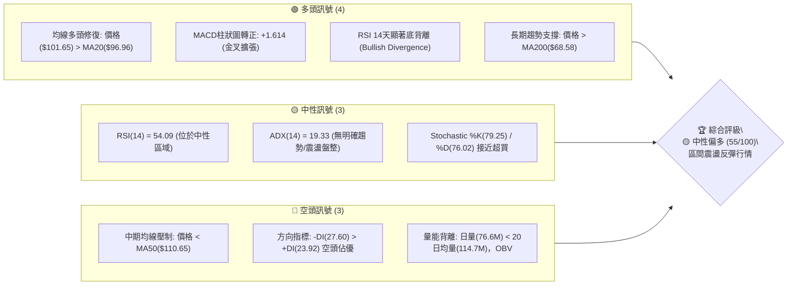
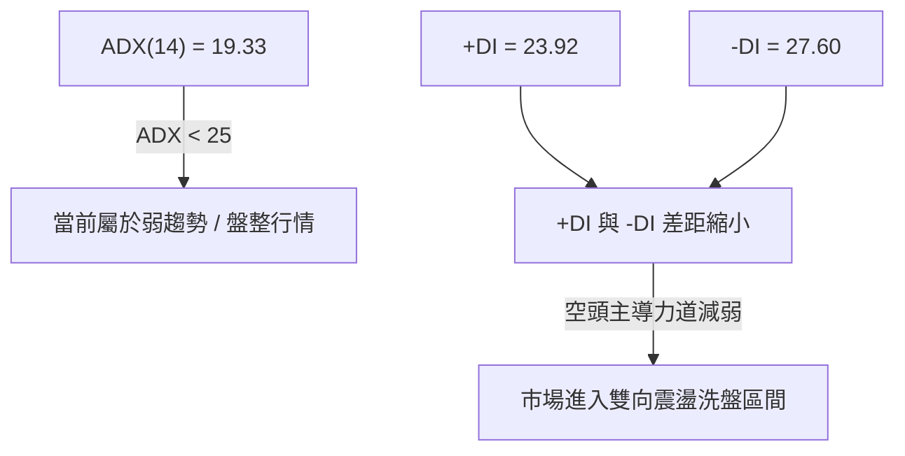
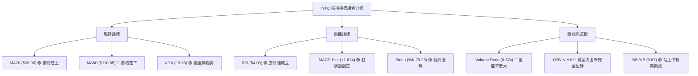
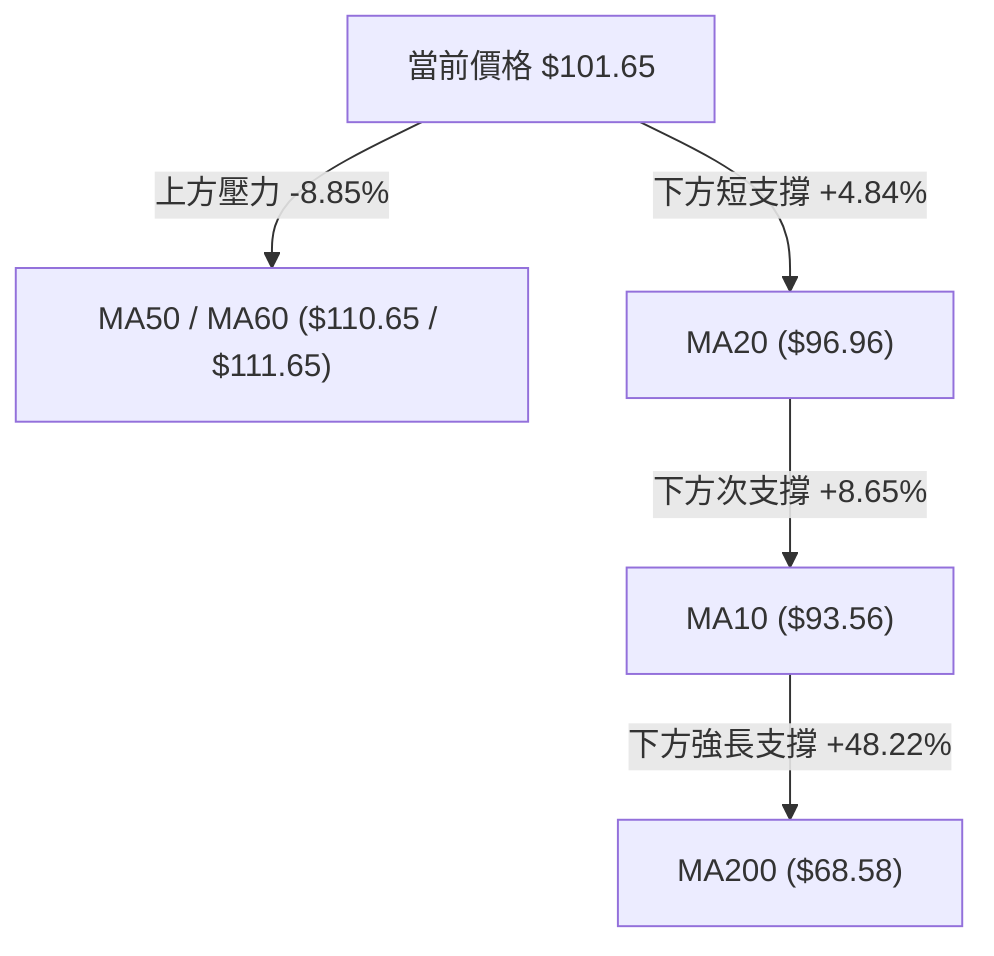
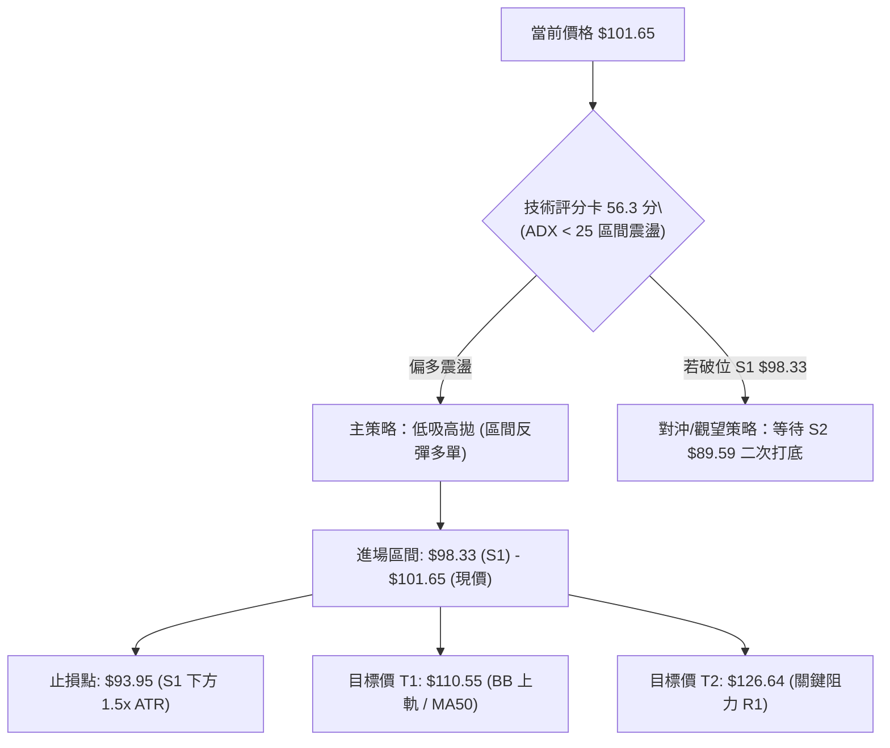
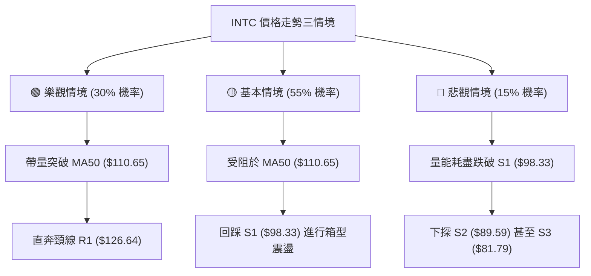

# INTC 技術分析報告

> **報告日期**：2026-08-10 ｜ **語言**：繁體中文 ｜ **數據來源**：Yahoo Finance ｜ **當前價格**：$101.65

---

## 目錄

| 章節 | 內容 |
|------|------|
| [1. 技術面概覽](#1-技術面概覽) | 訊號儀表板、核心指標、評分卡 |
| [2. 趨勢分析](#2-趨勢分析) | 多時框趨勢、長中短期走勢 |
| [3. 圖表形態分析](#3-圖表形態分析) | 形態識別、K線組合、目標價 |
| [4. 支撐與阻力](#4-支撐與阻力) | 關鍵價位、斐波那契回調 |
| [5. 技術指標深度解讀](#5-技術指標深度解讀) | MA/RSI/MACD/布林/成交量 |
| [6. 動能與波動率](#6-動能與波動率) | 動能評估、ATR、Beta |
| [7. 多時框架總結](#7-多時框架總結) | 時框架評分矩陣 |
| [8. 交易策略建議](#8-交易策略建議) | 多空策略、風險報酬比 |
| [9. 風險提示與監控](#9-風險提示與監控) | 監控指標、風險場景 |

---

## 1. 技術面概覽

### 🎯 技術訊號儀表板



### 📊 核心指標速覽表

| 指標類別 | 指標名稱 | 當前數值 | 訊號 | 解讀 |
|----------|----------|----------|------|------|
| **價格** | 當前收盤價 | $101.65 | 🟢 多頭 | 位於 52 週區間 ($19.60–$142.35) 之 66.8% 位置，自底波段大幅修復 |
| **均線** | MA20 (月線) | $96.96 | 🟢 多頭 | 價格高於 MA20 達 +4.84%，短線支撐確立 |
| **均線** | MA50 (季線) | $110.65 | 🔴 空頭 | 價格低於 MA50 達 -8.13%，上方面臨中期均線扣高壓制 |
| **均線** | MA200 (年線)| $68.58 | 🟢 多頭 | 價格高於 MA200 達 +48.22%，牛熊分界線極為穩固 |
| **動能** | RSI(14) | 54.09 | 🟢 多頭 | 中性偏強，且前波價格低點呈現標準底背離 (Bullish Divergence) |
| **動能** | MACD(12,26,9)| -3.831 | 🟢 多頭 | MACD 柱狀圖為 +1.614，快線正在向慢線靠攏形成底部位移 |
| **動能** | Stochastic | 79.25 / 76.02 | 🟡 中性 | 快慢線高位交纏，動能延續但短線逼近超買區 |
| **趨勢** | ADX(14) | 19.33 | 🟡 中性 | ADX < 25，代表目前屬於「區間盤整行情」，非強趨勢發展期 |
| **波動** | ATR(14) | $7.70 | 🟡 中性 | 日波動率為 7.58%，屬於中高波動性，操作需拉大止損寬限度 |
| **量能** | 20日量比 | 0.67x | 🔴 空頭 | 成交量 7,661 萬股低於 20 日均量 1.146 億股，呈現縮量反彈 |

### 🏆 技術評分卡

```
╔══════════════════════════════════════════════════════════════════╗
║              技術評分卡 — INTC (2026-08-10)                      ║
╠══════════════════════════════════════════════════════════════════╣
║ 趨勢強度 (Trend)     ████████░░░░░░░░░░░░  45/100  🟡 弱趨勢/盤整 ║
║ 動能指標 (Momentum)  █████████████░░░░░░░  65/100  🟢 底背離修復 ║
║ 支撐穩定度 (Support) ██████████████░░░░░░  70/100  🟢 S1/38.2%穩固║
║ 成交量配合 (Volume)  ████████░░░░░░░░░░░░  40/100  🔴 量能遞減    ║
║ 形態完整度 (Pattern) ████████████░░░░░░░  60/100  🟡 雙底構築中  ║
║ 均線排列 (MA System) ████████████░░░░░░░  58/100  🟡 短多長多/中空║
╠══════════════════════════════════════════════════════════════════╣
║ 綜合評分             ███████████░░░░░░░░░  56.3/100 🟡 中性偏多  ║
╚══════════════════════════════════════════════════════════════════╝
```

---

## 2. 趨勢分析

### 🌐 多時框趨勢分析

```mermaid
graph TD
    A["月線層級 (Long-term)"] -->|"價格介於 $19.60 - $142.35"| B["大型擴散底/宏觀復甦趨勢 (看多)"]
    B --> C["週線層級 (Medium-term)"]
    C -->|"從 $139.63 回調至 $90.20 後反彈"| D["波段 ABC 回調完成，尋求二次打底 (中性)"]
    D --> E["日線層級 (Short-term)"]
    E -->|"站上 MA20("$96.96")，MACD柱+1.614"| F["日線級別反彈浪啟動 (看多)"]
```

### 📈 長期趨勢 — 24個月走勢圖（Unicode）

```
INTC 24個月收盤價走勢圖 (2024-08 至 2026-08)
價格軸 ($)
$140 ┤                                           ● (2026-06 $139.63)
$120 ┤                                 ● (05 $114.68)
$100 ┤                             ● (04 $94.48)        ● (08 $101.65)
$80  ┤                                                    ● (07 $90.20)
$60  ┤
$40  ┤                         ● (01 $46.47)
$20  ┤●──●──●──●──●──●──●──●──● (2025-08 $24.35)
     └┬──┬──┬──┬──┬──┬──┬──┬──┬──┬──┬──┬──┬──┬──┬──┬──┬──┬──┬──┬──┬──┬──┬──
      08 09 10 11 12 01 02 03 04 05 06 07 08 09 10 11 12 01 02 03 04 05 06 07 08 (月份)
      2024                                2025                                2026
```

#### 走勢特徵分析表

| 階段 | 時間區間 | 價格區間 | 漲跌幅 | 走勢特徵分析 |
|------|----------|----------|--------|--------------|
| **築底期** | 2024-08 ~ 2025-08 | $19.43 – $24.35 | +10.5% | 長達一年的底部打底期，歷史低點 $19.60 奠定鋼鐵下軌。 |
| **主升段 1**| 2025-09 ~ 2026-01 | $24.35 – $46.47 | +90.8% | 帶量突破底部盤整區，MA200($68.58) 轉為向上翻揚。 |
| **飆升期** | 2026-02 ~ 2026-06 | $44.13 – $139.63| +216.4%| 垂直噴射行情，衝至 52 週高點 $142.35 附近，RSI 進入 >88 極度超買區。 |
| **劇烈拉回**| 2026-06 ~ 2026-07 | $139.63 – $90.20| -35.4% | 短期乖離過大引發獲利賣壓，回踩斐波那契 38.2% ($95.46) 及 50% ($80.98) 支撐帶。 |
| **反彈修復**| 2026-08 (最新)   | $90.20 – $101.65| +12.7% | 於 S2 ($89.59) 獲得明確支撐，日線站回 MA20 ($96.96)，展開技術性修復。 |

### 📊 中期趨勢（週線分析）

中期走勢顯示，INTC 在 2026 年 6 月創下 $139.63 的近期高點後，經歷了連續 6 週的急遽拉回，最低落至 2026-08-02 週的 $90.20。
- **壓力層級**：上方強烈壓力位於 MA50 ($110.65) 與 MA60 ($111.65)，此區間同時與斐波那契 23.6% 回調位 ($113.38) 重疊。
- **支撐層級**：下方第一支撐位於 $98.33 (S1)，第二支撐位於 $89.59 (S2)。受惠於斐波那契 38.2% ($95.46) 的支撐，股價已止跌回升。

### ⚡ 趨勢強度評估（ADX 解讀）



| 指標項 | 數值 | 門檻基準 | 趨勢解讀 |
|--------|------|----------|----------|
| **ADX (14)** | 19.33 | < 25 (弱/無趨勢) | 說明行情缺乏單邊爆發力，突破追高風險大，適合區間操作。 |
| **+DI (14)** | 23.92 | - | 多頭攻擊力道較前週 ($90.20 時) 明顯回升。 |
| **-DI (14)** | 27.60 | - | 空頭主導力道自 30 以上回落，空方優勢正被削弱。 |

---

## 3. 圖表形態分析

### 🔍 形態識別系統

在日線與週線圖表中，INTC 目前未形成極為標準的幾何頭肩頂或巨大順勢旗形，但呈現典型的**「W底（雙重底）築底初階」**與**「均線乖離修復」**形態。

| 形態名稱 | 信心度 | 判斷依據（引用數據） | 完成度 | 目標價（附計算式） |
|----------|--------|----------------------|--------|--------------------|
| **潛在 W 底 (Double Bottom)** | 65% | 第一底 $90.20 (2026-08-02)，第二底微幅墊高，收盤 $101.65 站上 MA20 | 50% | 頸線 R1 $126.64 - 底部 S2 $89.59 = $37.05。<br/>突破目標價 = $126.64 + $37.05 = **$163.69** |
| **下降通道突破 (Channel Breakout)** | 58% | 自 $139.63 降至 $90.20 的下降壓力線已被日線收盤價 $101.65 向上突破 | 85% | 形態高度 $139.63 - $90.20 = $49.43。<br/>目標價 = $101.65 + ($49.43 × 0.5) = **$126.37** |
| **布林帶下軌擠壓反彈** | 75% | 股價觸及 BB 下軌 $83.37 附近後急拉，突破 BB 中軌 $96.96 | 100% | 通道上軌 = **$110.55** |

### 🕯️ 重要 K 線形態分析

| 日期/週 | 收盤價 | K 線形態 | 解讀 | 訊號 |
|---------|--------|----------|------|------|
| **2026-07-19** | $95.04 | 大陰線 (Marubozu) | 帶量下殺，一舉跌破百元大關，賣壓極沉重。 | 🔴 強烈看空 |
| **2026-07-26** | $92.32 | 錘頭線 (Hammer) | 下影線探低，顯示低檔出現強烈買盤承接。 | 🟡 止跌訊號 |
| **2026-08-02** | $90.20 | 縮量十字星 (Doji) | 空頭動能衰竭，多空進入極度平衡狀態。 | 🟡 轉折點 |
| **2026-08-09** | $101.65 | 長陽長虹 (Bullish Engulfing) | 實體長陽包覆前二週K線，帶動 MACD 柱狀圖轉正，確定短線探底結束。 | 🟢 看多反轉 |

### 📉 ASCII 走勢形態示意圖

```
  INTC 日線 W 底與下降趨勢突破示意圖
  
  $139.63 ──┐ (高點 2026-06)
            ┆ \
            ┆  \ 下降通道壓力線
  $126.64 ──┼───\─────────────── (頸線阻力 R1)
            ┆    \        /
  $110.55 ──┼─────\──────/────── (BB 上軌 / 壓力)
  $101.65 ──┼──────\────●─────── ◄ 現價 (突破下降趨勢線)
   $96.96 ──┼───────\──/──────── (MA20 / BB 中軌支撐)
   $89.59 ──┼─●──────\/───────── (底 1: $90.20 / 底 2: $89.59 支撐 S2)
            └─┴──────┴──────────
             7月     8月
```

### 🎯 形態目標價計算

1. **下降通道突破推算**：
   - 形態波幅 = $139.63 - $90.20 = $49.43
   - 0.50 滿足位 = $101.65 + ($49.43 × 0.5) = **$126.37**（精確對應阻力位 R1 $126.64）
2. **布林通道均值回歸推算**：
   - 現已站上中軌 $96.96，短線目標為上軌 **$110.55**。

---

## 4. 支撐與阻力

### 🗺️ 關鍵價位分布圖（Unicode）

```
INTC 價位結構分布圖
═══════════════════════════════════════════════════════════════════
$142.35 ║████████████████████████████████████████║ 52W High / 0.0% Fib
$141.90 ║██████████████████████████████████████  ║ 強阻力 R3
$132.75 ║████████████████████████████            ║ 阻力 R2
$126.64 ║████████████████████████                ║ 關鍵阻力 R1 (頸線)
$113.38 ║██████████████████                      ║ 23.6% Fib / MA50($110.65)
$110.55 ║████████████████                        ║ 布林通道上軌
$101.65 ╠════════════════════════════════════════╣ ◄ 當前價格 ($101.65)
 $98.33 ║▓▓▓▓▓▓▓▓▓▓▓▓▓▓▓▓▓▓▓▓                    ║ 第一支撐 S1
 $95.46 ║▓▓▓▓▓▓▓▓▓▓▓▓▓▓▓▓▓                       ║ 38.2% Fib 關鍵分界
 $89.59 ║▓▓▓▓▓▓▓▓▓▓▓▓▓                           ║ 強支撐 S2 (近期雙底)
 $83.37 ║▓▓▓▓▓▓▓▓▓                              ║ 布林通道下軌
 $81.79 ║▓▓▓▓▓▓▓▓                                ║ 深層支撐 S3
 $80.98 ║▓▓▓▓▓▓▓                                 ║ 50.0% Fib 回調位
 $68.58 ║▓▓▓                            ║ MA200 年線支撐
═══════════════════════════════════════════════════════════════════
```

### 🚧 阻力位分析表

| 阻力級別 | 精確價位 | 形成原因 | 突破難度 | 重要性 |
|----------|----------|----------|----------|--------|
| **R1** | **$126.64** | 近一年波段高點聚類 / 形態頸線 | 🔴 極高 | 關鍵解套壓制區，突破代表中期重回多頭行情 |
| **R2** | **$132.75** | 波段次高點解套賣壓帶 | 🟡 中高 | 接近前高前的最後緩衝層 |
| **R3** | **$141.90** | 52週最高點 ($142.35) 密 集賣壓區 | 🔴 極高 | 歷史天花板，需極大成交量配合始能突破 |

### 🛡️ 支撐位分析表

| 支撐級別 | 精確價位 | 形成原因 | 守住機率 | 重要性 |
|----------|----------|----------|----------|--------|
| **S1** | **$98.33** | 近一年波段低點聚類 / 靠近 MA20 ($96.96) | 🟢 80% | 短線多空分界線，失守將重回探底格局 |
| **S2** | **$89.59** | 近年波段低點聚類 / 2026-08 低點 $90.20 | 🟢 85% | 雙底結構之關鍵基石，絕不能跌破 |
| **S3** | **$81.79** | 近一年深層密集成交區 / 接近 50% Fib ($80.98)| 🟢 92% | 中期極限回調防線，守住仍維持長多結構 |

### 📐 斐波那契回調位分析

基於 52 週區間 **$19.60 (低點)** 至 **$142.35 (高點)** 計算：

- **0.0% ($142.35)**：歷史高點壓力。
- **23.6% ($113.38)**：目前上方第一重扣高斐波那契壓力，與 MA50/MA60 ($110.65–$111.65) 及布林上軌 ($110.55) 構成強大壓制帶。
- **當前位置 ($101.65)**：位於 23.6% ($113.38) 與 38.2% ($95.46) 之間。
- **38.2% ($95.46)**：黃金分割重要防線！前波回調最低 $90.20 迅速收復 $95.46，確認此區間具備極強之強烈買盤支撐。
- **50.0% ($80.98)**：中軸支撐，若極端利空發生，此處與 S3 ($81.79) 形成鐵板支撐。
- **61.8% ($66.49)**：靠近 MA200 ($68.58)，為長線牛熊分界。

---

## 5. 技術指標深度解讀

### 🎛️ 指標訊號總覽



### 📈 移動平均線排列分析



- **排列狀態**：混合排列（Short-term Bullish / Medium-term Bearish / Long-term Bullish）。
- **均線支撐**：短天期 MA5 ($98.88)、MA10 ($93.56)、MA20 ($96.96) 呈多頭排列，提供短線向上推升力道。
- **均線反抗**：MA50 ($110.65) 仍扣高下彎，下彎速度為 -8.96%，是反彈行情的最主要障礙。

### 📉 RSI(14) 分析

- **當前數值**：**54.09** (位於 30–70 中性黃金走廊)。
- **進度條**：`███████████░░░░░░░░░ 54.1%`
- **背離分析（極度重要）**：
  - ⚠️ **底背離 (Bullish Divergence) 成立**：
  - 價格在 2026-07-26 至 2026-08-02 期間下探 $90.20（創波段新低），但 RSI 在同期的週線與日線層級自 26.9 翻升至 39.5 再至 54.1（低點不破前低），呈現標準的「價格新低，指標未創新低」，暗示空頭動能耗盡，迎來顯著反彈。

### 📊 MACD(12/26/9) 訊號解讀

- **MACD 快線**：-3.831
- **Signal 慢線**：-5.445
- **MACD 柱狀圖 (Histogram)**：**+1.614** 🟢
- **訊號解析**：雖然快慢線仍位於零軸下方（反映自 $139.63 跌下來的中期修正），但柱狀圖已連續大幅收斂並轉正（+1.614），代表**黃金交叉向上發散中**，屬於典型的「零軸下二次金叉/底部位移」買進訊號。

### 📦 布林通道分析

```
  INTC 布林通道示意圖 (Bollinger Bands)
  
  $110.55 ─────────────── Upper Band (上軌壓力)
             /   ●
  $101.65 ──/───●──────── 現價 ($101.65) — BB %B = 0.67
           /   ●
   $96.96 ────●────────── Middle Band (MA20 支撐)
         /
   $83.37 ─────────────── Lower Band (下軌支撐)
```
- **通道位置**：%B 為 **0.67**，代表股價已脫離下軌超賣區（%B=0.1），向上突破中軌 $96.96，目前運行於中軌與上軌之間。
- **通道開口**：布林帶帶寬收窄，暗示單邊暴跌階段結束，進入高低軌之間的箱型震盪。

### 💹 成交量與 OBV 分析

- **最新成交量**：76,609,900 股。
- **20日均量**：114,661,645 股（**量比 0.67x**）。
- **OBV 觀察**：目前 OBV < MA(OBV)，顯示在過去一個月的急跌中，機構資金有淨流出跡象。本次反彈成交量略顯不足，顯示買盤多為空頭補單與短線抄底資金，缺乏長線主力大買推進。**若要突破 R1 ($126.64)，日成交量必須回升至 1.2 億股以上。**

---

## 6. 動能與波動率

### ⚡ 動能與波動矩陣

| 象限區分 | 動能強度 (Momentum) | 波動率 (Volatility) | 當前 INTC 狀態 | 操作指導 |
|----------|---------------------|---------------------|----------------|----------|
| **Q1: 飆股象限** | 強 (RSI>60, MACD>0) | 低 (ATR% < 5%) | - | 順勢加碼 |
| **Q2: 反彈/震盪** | 中弱 (RSI 50-55)    | 中高 (ATR% = 7.58%) | **✓ INTC 位於此區** | **高拋低吸，區間操作** |
| **Q3: 高風險破位**| 弱 (RSI<40)         | 高 (ATR% > 8%) | - | 嚴格止損 |
| **Q4: 沉悶盤整** | 弱 (RSI<40)         | 低 (ATR% < 4%) | - | 觀望等待 |

### 📊 ATR 波動率分析

- **ATR (14)**：**$7.70**
- **價格百分比**：**7.58%**
- **風控指引**：
  - 日波幅達 $7.70，代表單日正常震盪範圍即可達 ±$7.70。
  - **止損距離建議**：至少需設定 1.5 × ATR = $11.55 的寬限空間，避免被正常市場噪音甩轎。

### 📐 Beta 與市場相關性

- **Beta 係數**：**2.241**
- **解讀**：INTC 的波動幅度為大盤（S&P 500）的 2.24 倍，屬於極高 Beta 的科技成長/轉型股。當大盤反彈時，INTC 具備強烈的槓桿彈升效應；反之，若大盤拉回，INTC 回檔亦極為劇烈。

---

## 7. 多時框架總結

### 📋 時框架評分表

| 時框架 | 趨勢方向 | 動能 (RSI/MACD) | 均線排列 | 形態狀態 | 綜合評分 | 操作建議 |
|--------|----------|-----------------|----------|----------|----------|----------|
| **月線 (Long)** | 🟢 看多 | 🟢 柱狀回升 | 🟢 價在 MA200 上 | 宏觀復甦 | **75/100** | 逢低偏多佈局 |
| **週線 (Mid)**  | 🟡 中性 | 🟡 底背離初現 | 🔴 價在 MA50 下 | ABC 修正尾聲 | **50/100** | 區間震盪高拋低吸 |
| **日線 (Short)**| 🟢 看多 | 🟢 MACD金叉 | 🟢 站上 MA20 | W底反彈浪 | **65/100** | 依支撐分批做多 |

### 🔲 綜合訊號矩陣

```
┌──────────────────────────────────────────────────────────┐
│              多時框架訊號收斂矩陣 (INTC)                 │
├─────────────────┬───────────────────┬────────────────────┤
│ 時框 / 指標     │ 均線系統          │ 動能指標           │
├─────────────────┼───────────────────┼────────────────────┤
│ 短期 (日線)     │ 🟢 站上 MA20       │ 🟢 MACD Hist +1.61 │
│ 中期 (週線)     │ 🔴 壓制於 MA50     │ 🟡 RSI 54 (背離)   │
│ 長期 (月線)     │ 🟢 穩守 MA200      │ 🟢 遠高於 52W 低點 │
└─────────────────┴───────────────────┴────────────────────┘
```

### ⚖️ 多時框收斂結論

依據多時框收斂規則：當前 **ADX(14) = 19.33 (<25)**，明確指示市場處於**「區間盤整行情」**。
因此，短期日線向上衝刺將受限於中期週線布林上軌 ($110.55) 與 MA50 ($110.65)。** 최종結論：偏多震盪格局**。交易策略應以**布林通道上下軌 ($83.37 – $110.55)** 與關鍵支撐阻力為主要邊界進行低買高賣，切忌在阻力位追高。

---

## 8. 交易策略建議

### 🗺️ 策略決策流程圖



### 🧭 策略路由

**當前主策略方向 = 偏多震盪低吸策略（依技術評分 56.3/100，ADX 19.33 無單邊趨勢）**

### 🎯 價格情境階梯 (Price Scenarios)

| 觸發條件 | 下一目標 | 後續延伸 | 情境含義 |
|----------|----------|----------|----------|
| **突破 MA50 / BB上軌 $110.55** | R1 $126.64 | R2 $132.75 | 中期多頭強勢回歸，挑戰前高 |
| **站穩 S1 $98.33 ~ 現價區間** | BB上軌 $110.55 | 23.6% Fib $113.38 | 標準區間箱型震盪，多頭佔優 |
| **跌破 S1 $98.33** | S2 $89.59 | 50% Fib $80.98 | 探底未結束，回測試驗 W 底下軌 |

### 📊 情境機率分佈

| 情境 | 機率 | 主要依據 |
|------|------|----------|
| **區間向上反彈 (試探 $110.55)** | **60%** | MACD 柱狀圖翻正 (+1.614)、RSI 底背離成立、站上 MA20。 |
| **區間橫盤震盪 ($95.46–$105.00)**| **25%** | ADX = 19.33 指示趨勢力道弱，成交量 0.67x 顯著不足。 |
| **再次破位下探 (試探 $89.59)**  | **15%** | MA50 扣高下彎壓制，且 -DI > +DI。 |

### 🟢 主策略詳情

#### 策略 A：現價/拉回低吸多單 (主推策略)

- **進場條件**：價格於 $98.33 (S1) 至 $101.65 (現價) 區域守穩，且日線收盤未跌破 MA20 ($96.96)。
- **進場價格**：**$101.65**（可於 $98.33–$101.65 分批佈局）
- **目標價 T1**：**$110.55**（布林通道上軌 / MA50 密集區，預期漲幅 +8.75%）
- **目標價 T2**：**$126.64**（關鍵阻力位 R1 / 形態頸線，預期漲幅 +24.58%）
- **止損價格**：**$93.95**（設於 S1 $98.33 下方，避開 ATR $7.70 之正常波動；若跌破 MA10 $93.56 則停損，虧損 -7.57%）
- **風險報酬比 (R:R)**：
  - 至 T1 = 8.75% / 7.57% = **1.16 : 1**
  - 至 T2 = 24.58% / 7.57% = **3.25 : 1**
- **成功機率**：60%
- **建議倉位**：**15% - 20%**（中等倉位）

#### 策略 B：突破追多策略 (次選高勝率策略)

- **進場條件**：日線帶量（成交量 > 1.2 億股）突破並站穩 MA50 ($110.65)。
- **進場價格**：**$111.00**
- **目標價 T1**：**$126.64** (R1 阻力位，預期漲幅 +14.09%)
- **目標價 T2**：**$132.75** (R2 阻力位，預期漲幅 +19.59%)
- **止損價格**：**$104.50**（設於假突破濾網，虧損 -5.86%）
- **風險報酬比 (R:R)**：至 T1 為 **2.40 : 1**
- **成功機率**：65%
- **建議倉位**：**10% - 15%**

### 🔴 反向風險觸發點（對沖提示）

- **觸發條件**：若股價無預警跌破 **$89.59 (S2)**，代表 W 底形態失敗，空頭攻勢再起。
- **對沖應對**：全面出清多單，並可建立小額對沖空單，目標下看 **$81.79 (S3)** 及 **$80.98 (50% Fib)**。

### ⭐ 整體訊號強度評星

```
做多訊號強度：★★★☆☆  (3.5/5星 — 底背離+MACD金叉，但受制於量縮與MA50)
做空訊號強度：★★☆☆☆  (2.0/5星 — 短線下移動能耗盡，RSI呈底背離)
整體可信度：  ★★───  (3.5/5星 — 數據結構明確，ADX顯示為區間格局)
```

---

## 9. 風險提示與監控

### ✅ 關鍵監控指標 Checklist

```
╔══════════════════════════════════════════════════════════════════╗
║                   每日技術面監控清單 (Checklist)                 ║
╠══════════════════════════════════════════════════════════════════╣
║ [ ] 價格是否維持在 MA20 ($96.96) 與 S1 ($98.33) 之上？            ║
║ [ ] MACD 柱狀圖是否持續擴張 (維持於 +1.614 以上)？               ║
║ [ ] 日成交量能否回升至 20日均量 (1.146 億股) 以上？              ║
║ [ ] 價格接近 MA50 ($110.65) 時，RSI(14) 是否出現超買鈍化？       ║
║ [ ] ADX(14) 是否突破 25，開啟單邊新趨勢？                        ║
╚══════════════════════════════════════════════════════════════════╝
```

### ⚠️ 風險場景分析



### 🛡️ 風險管理重要提醒

1. **量能未發散風險**：當前成交量僅 76.6M（量比 0.67x），縮量反彈容易在遇到密集套牢區（$110.65–$113.38）時發生無預警拉回。
2. **高 Beta 波動風險**：Beta 達 2.241，配合 ATR $7.70，價格單日震盪劇烈，嚴禁使用過高槓桿。
3. **中期均線蓋頂壓制**：MA50 ($110.65) 與 MA60 ($111.65) 扣高下彎，是典型的中期熊市壓制線，首次觸及成功突破機率較低，建議於 $108.00–$110.55 區間適度獲利入袋。

---

## 📋 報告總結

```
INTC 技術分析報告總結
═══════════════════════════════════════════════════════════════════
報告日期：2026-08-10
當前價格：$101.65
分析評級：🟡 中性偏多 (區間震盪反彈行情，評分 56.3/100)

關鍵結論：
├─ 長期趨勢：🟢 宏觀底修復，遠高於 MA200 ($68.58) 與 52W 低點 ($19.60)
├─ 中期趨勢：🟡 ABC 下修結束，於 S2 ($89.59) 打底，受制於 MA50 ($110.65)
├─ 短期趨勢：🟢 日線突破下降趨勢線，站上 MA20 ($96.96)，MACD 柱狀圖翻正
├─ 關鍵支撐：S1 $98.33 / 38.2% Fib $95.46 / S2 $89.59
├─ 關鍵阻力：布林上軌 $110.55 / MA50 $110.65 / R1 $126.64
└─ 分析師目標：均價 $115.17 (最高 $200.00 / 最低 $74.00)

最優策略組合：
1. 🥇 最佳機會 (策略A)：$98.33–$101.65 低吸，目標 $110.55 / $126.64，止損 $93.95
2. 🥈 次選機會 (策略B)：帶量突破 $110.65 後追多，目標 $126.64，止損 $104.50
3. 🥉 保守選擇：等待 ADX > 25 或價格回踩 S2 $89.59 出現明確止跌 K 線再行進場
═══════════════════════════════════════════════════════════════════
```

---

> ⚠️ **免責聲明**：本報告為 AI 自動生成之技術分析，所有數據及估算均基於提供的歷史價格資訊。本報告**僅供研究與學術參考**，**不構成任何投資建議**。投資有風險，入市需謹慎。

---

*報告生成時間：2026-08-10 ｜ 數據來源：Yahoo Finance ｜ 分析框架：多時框技術分析*