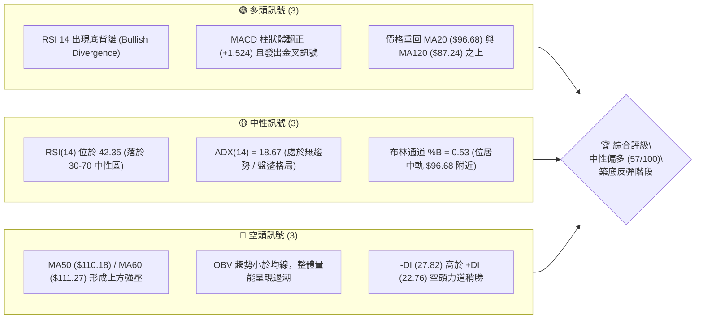
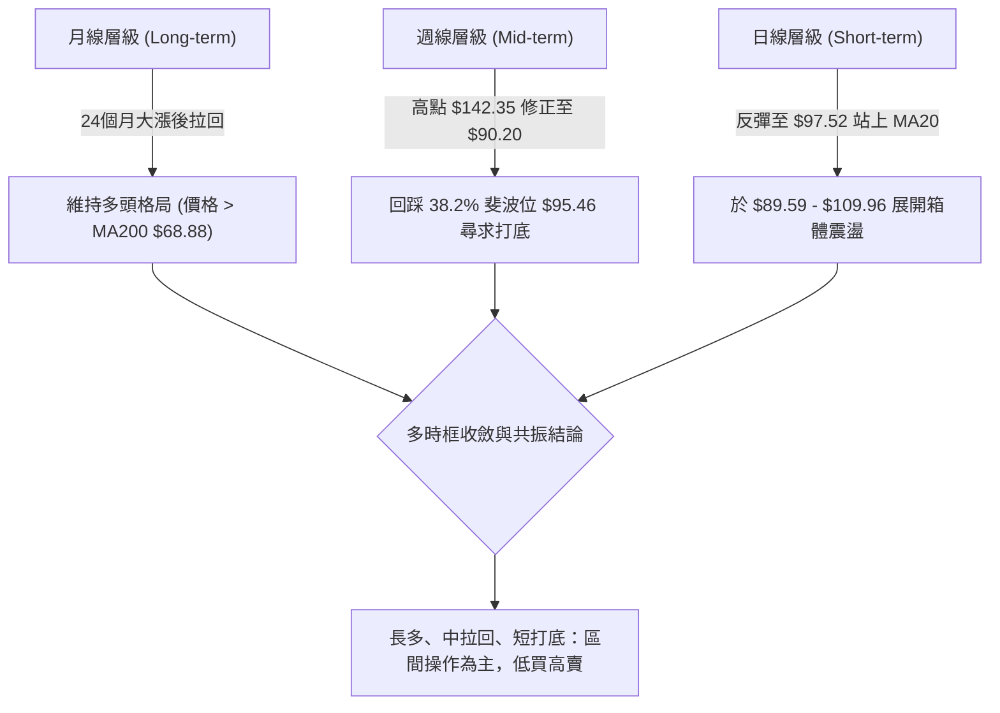
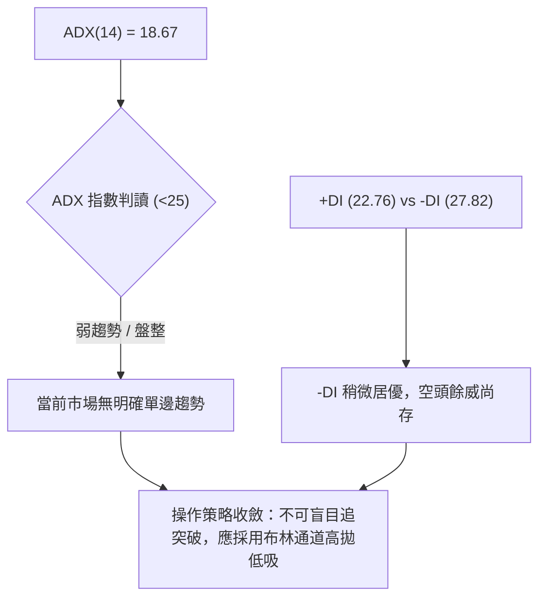
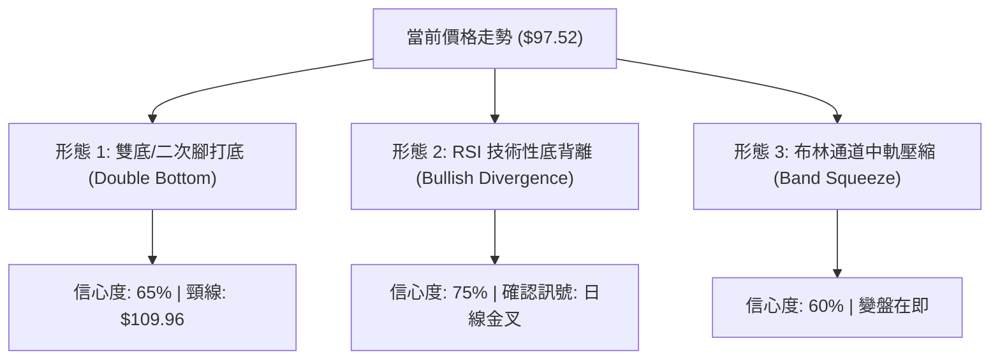
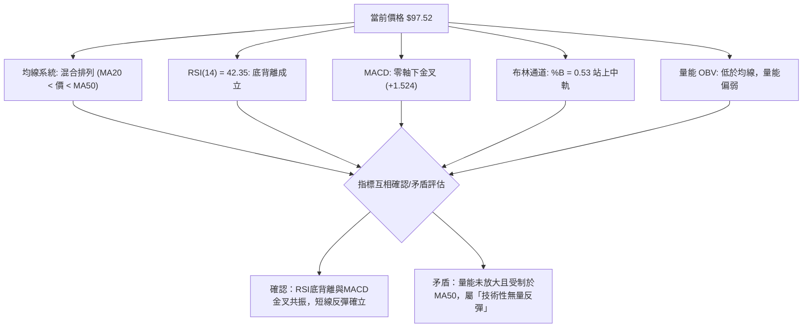
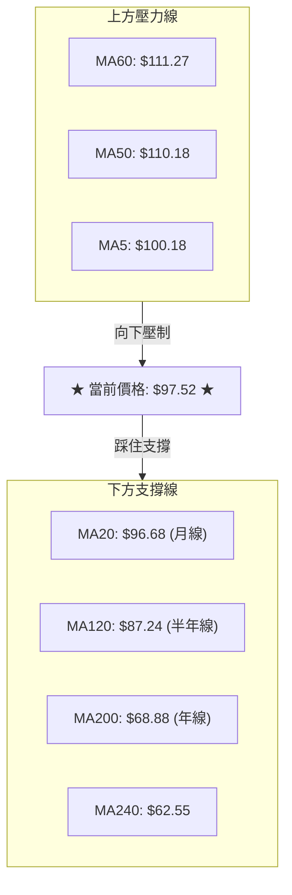
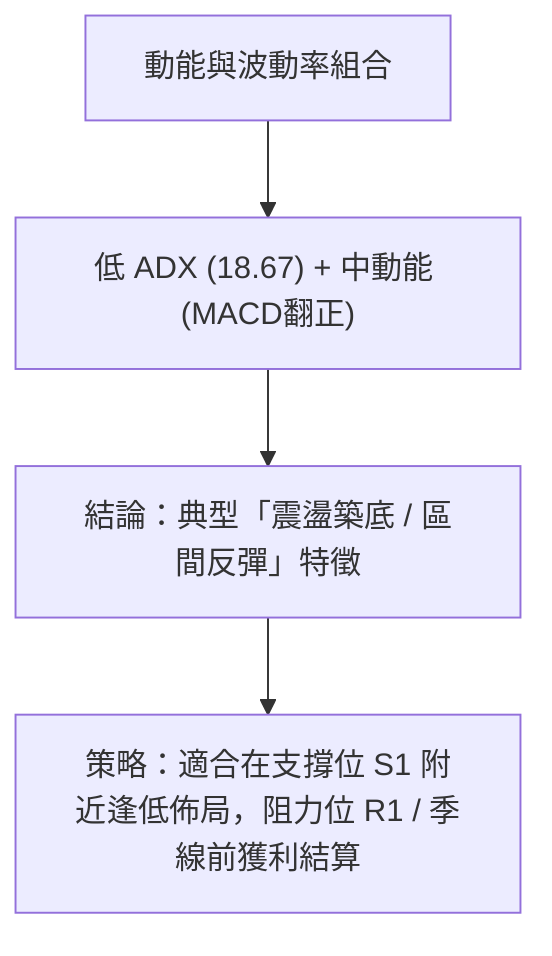
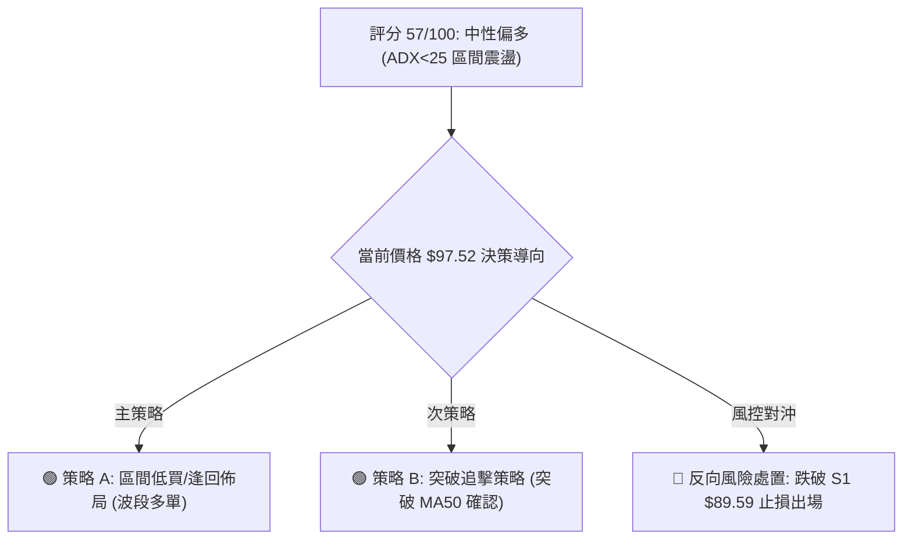
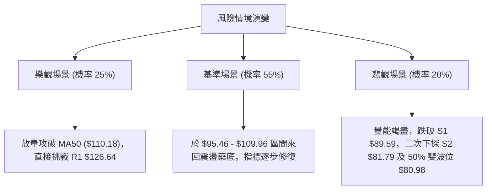

# INTC 技術分析報告

> **報告日期**：2026-08-11 ｜ **語言**：繁體中文 ｜ **數據來源**：Yahoo Finance ｜ **當前價格**：$97.52

---

## 目錄

| 章節 | 內容 |
|------|------|
| [1. 技術面概覽](#1-技術面概覽) | 訊號儀表板、核心指標、評分卡 |
| [2. 趨勢分析](#2-趨勢分析) | 多時框趨勢、長中短期走勢 |
| [3. 圖表形態分析](#3-圖表形態分析) | 形態識別、K線組合、目標價 |
| [4. 支撐與阻力](#4-支撐與阻力) | 關鍵價位、斐波那契回調 |
| [5. 技術指標深度解讀](#5-技術指標深度解讀) | MA/RSI/MACD/布林/成交量 |
| [6. 動能與波動率](#6-動能與波動率) | 動能評估、ATR、Beta |
| [7. 多時框架總結](#7-多時框架總結) | 時框架評分矩陣 |
| [8. 交易策略建議](#8-交易策略建議) | 多空策略、風險報酬比 |
| [9. 風險提示與監控](#9-風險提示與監控) | 監控指標、風險場景 |

---

## 1. 技術面概覽

### 🎯 技術訊號儀表板



### 📊 核心指標速覽表

| 指標類別 | 指標名稱 | 當前數值 | 訊號 | 解讀 |
|----------|----------|----------|------|------|
| **價格** | 當前收盤價 | $97.52 | 🟡 中性 | 位於 52 週高低區間 63.5% 位置，擺脫低點反彈中 |
| **均線** | MA20 (月線) | $96.68 | 🟢 看多 | 價格已微幅站上 MA20，短線止跌翻多 |
| **均線** | MA50 (季線) | $110.18 | 🔴 看空 | 價格位於 MA50 下方，中期反彈面臨壓制 |
| **均線** | MA200 (年線)| $68.88 | 🟢 看多 | 長期均線走揚且位於價格下方，提供長線強支撐 |
| **動能** | RSI(14) | 42.35 | 🟢 看多 | 雖低於 50 但日線/週線呈**底背離**，預示反彈 |
| **動能** | MACD(12,26,9)| -3.540 | 🟢 看多 | Signal -5.064，Hist +1.524，零軸下金叉開啟 |
| **波動** | ATR(14) | $7.42 | 🟡 中性 | ATR 佔股價 7.61%，每日波幅仍大，波動度適中 |
| **擺動** | Stoch %K/%D | 62.77 / 71.31 | 🟡 中性 | 從超賣區向上回升，動能修正完畢 |
| **趨勢** | ADX(14) | 18.67 | 🟡 中性 | 指數 < 25，顯示當前為**區間震盪/築底行情** |
| **量能** | 成交量 / 20日均 | 99.94M / 114.62M | 🔴 看空 | 量比 0.87x，上攻量力道略顯不足 |

### 🏆 技術評分卡

```
╔══════════════════════════════════════════════════════════════════╗
║                 INTC 技術評分卡 (2026-08-11)                     ║
╠══════════════════════════════════════════════════════════════════╣
║ 趨勢強度 (Trend)     ████████░░░░░░░░░░░░  40/100  🟡 盤整無主趨勢 ║
║ 動能指標 (Momentum)   ████████████░░░░░░░░  60/100  🟢 底背離金叉   ║
║ 支撐穩定度 (Support) ██████████████░░░░░░  70/100  🟢 S1聚類穩固   ║
║ 成交量配合 (Volume)   ████████░░░░░░░░░░░░  40/100  🔴 低於均量退潮 ║
║ 形態完整度 (Pattern) ████████████░░░░░░░░  60/100  🟢 雙底打底中   ║
║ 均線排列 (MA Align)  ████████████░░░░░░░░  60/100  🟡 混合打回均線 ║
╠══════════════════════════════════════════════════════════════════╣
║ 綜合評分 (Overall)   ███████████░░░░░░░░░  57/100  🟢 中性偏多築底 ║
╚══════════════════════════════════════════════════════════════════╝
```

---

## 2. 趨勢分析

### 🌐 多時框趨勢分析



### 📈 長期趨勢 — 24個月走勢圖（Unicode）

以下為 INTC 過去 24 個月（2024-08 至 2026-08）之收盤價格走勢軌跡與關鍵轉折點：

```
INTC 24 個月月線歷史價格走勢圖 ($)
$142.35 ┤                                      ● (52W High $142.35)
$130.00 ┤                                    ●   ●
$110.00 ┤                                  ●       ●
$97.52  ┤                                ●           ●  ● (現價 $97.52)
$80.00  ┤                              ●               ●
$60.00  ┤                            ●
$40.00  ┤                    ●  ●  ●
$19.61  ┤ ●  ●  ●  ●  ●  ●  ●  ● (52W Low $19.61)
        └─┬──┬──┬──┬──┬──┬──┬──┬──┬──┬──┬──┬──┬──┬──┬──┬──┬──┬──┬──┬──┬──┬──┬──
          24/ 24/ 24/ 24/ 25/ 25/ 25/ 25/ 25/ 25/ 26/ 26/ 26/ 26/ 26/ 26/ 26/ 26/
          08  10  12  02  04  06  08  10  12  02  04  05  06  07  08
```

#### 走勢特徵階段性分析表

| 階段 | 時間區間 | 價格區間 | 漲跌幅 | 走勢特徵與技術含義 |
|------|----------|----------|--------|--------------------|
| **1. 底部築底期** | 2024-08 ~ 2025-08 | $19.43 - $24.35 | +10.5% | 長期橫盤沉澱，奠定 $19.61 之 52 週歷史大底 |
| **2. 主升段飆漲期** | 2025-09 ~ 2026-06 | $33.55 - $139.63| +316.2%| 主力資金大幅進駐，爆發式突破，攻至高點 $142.35 |
| **3. 劇烈修正期** | 2026-07 ~ 2026-08 | $139.63 - $90.20| -35.4% | 獲利賣壓湧現，急速回踩斐波那契 38.2% ($95.46) 支撐 |
| **4. 築底反彈期** | 2026-08 (當前)   | $90.20 - $97.52 | +8.1%  | 於 S1 $89.59 上方止跌，日線 MACD 柱狀體翻正築底 |

### 📊 中期趨勢（週線分析）

近 20 週數據顯示，INTC 在 2026 年 5-6 月衝高至 $133.99-$139.63 後，面臨強烈獲利了結賣壓。7 月連續走低，收盤最低下探至 2026-08-02 週的 **$90.20**，該位置精準獲得近一年波段低點聚類 **S1 ($89.59)** 與斐波那契 38.2% ($95.46) 的強烈支撐。

2026-08-09 週強勢反彈收在 $101.65（週 RSI 回升至 54.1，週 MACD 柱翻正至 +1.614），目前拉回至 **$97.52**，形成「下探尋求二次腳驗證」的打底形態。

### ⚡ 趨勢強度評估（ADX 解讀）



| 指標名稱 | 當前數值 | 狀態門檻 | 技術判讀 |
|----------|----------|----------|----------|
| **ADX (14)** | **18.67** | < 25 (弱趨勢/盤整) | 趨勢動能耗盡，市場進入區間整理或橫盤打底 |
| **+DI (14)** | **22.76** | 多頭力道 | 多頭攻擊力道適中，從低位開始回升 |
| **-DI (14)** | **27.82** | 空頭力道 | 空頭力道高於多頭 5.06 個單位，空方仍佔微幅優勢 |

---

## 3. 圖表形態分析

### 🔍 形態識別系統



#### 形態識別信心度與目標價評估表

| 形態名稱 | 信心度 (%) | 判斷依據（引用數據） | 完成度 | 形態目標價計算式與精確數值 |
|----------|------------|----------------------|--------|----------------------------|
| **微型雙底 (Double Bottom)** | 65% | 首次低點 2026-08-02 的 $90.20，獲得 S1 ($89.59) 守護 | 70% | 頸線 $109.96 (BB上軌) - 低點 $89.59 = $20.37<br>突破後目標 = $109.96 + $20.37 = **$130.33** |
| **RSI 底背離** | 75% | 價格於 8 月打低至 $90.20，但 RSI(14) 保持在 39.5-42.35 顯著高於前期低點 | 90% | 指標驅動型反彈，目標看至 MA50 **$110.18** |
| **MA5/MA20 短線交叉** | 50% | MA20 ($96.68) 微幅下壓，MA5 ($100.18) 位於上方 | 40% | 訊號力道不足，僅做指標型震盪解讀 |

### 🕯️ 重要 K 線形態分析

| 週期/日期 | 收盤價 | K 線形態 | 技術解讀 | 多空訊號 |
|-----------|--------|----------|----------|----------|
| **2026-07-26 週** | $92.32 | 長陰墜落 | 空頭強勢貫穿，RSI 跌至 26.9 超賣區 | 🔴 極度悲觀 |
| **2026-08-02 週** | $90.20 | 探底錘子線 (Hammer) | 下影線觸及 $89.59 (S1) 後強烈買盤拉回 | 🟢 築底止跌 |
| **2026-08-09 週** | $101.65| 大陽線吞噬 (Engulfing) | 吞噬前週實體，MACD 柱狀體翻正 (+1.614) | 🟢 築底成功 |
| **2026-08-16 日** | $97.52 | 回踩小陰線 | 強勢反彈後的正常拉回，測試 MA20 ($96.68) | 🟡 中性整理 |

### 📉 ASCII 走勢形態示意圖

```
INTC 日線雙底築底與 RSI 底背離示意圖
════════════════════════════════════════════════════════════════════
價格 ($)
$109.96 ┤--------------------------------------[頸線 / BB 上軌]
        │                ● (08-09 反彈高點 $101.65)
$97.52  ┤--------------●----● (當前價格 $97.52, 踩住 MA20)
        │            ●   ●
$89.59  ┤● (底1: $90.20)  ● (底2: $89.59 聚類支撐)
        └───────────────────────────────────────────────────
RSI(14)
  50    ┤               ● (RSI 回升至 54.1)
  42.35 ┤----------●------● (底背離形成：價格新低但 RSI 未新低)
  26.9  ┤● (超賣低點)
════════════════════════════════════════════════════════════════════
```

---

## 4. 支撐與阻力

### 🗺️ 關鍵價位分布圖（Unicode）

```
INTC 關鍵價位結構分布圖
═══════════════════════════════════════════════════════════════════
$142.35 ╠══════════════════════════════════════════════════════════╣ 52W 高點 / 0.0% Fib
$141.90 ║██████████████████████████████████████████████████████████║ 強力阻力 R3 (+45.51%)
$132.75 ║██████████████████████████████████████████                ║ 波段阻力 R2 (+36.13%)
$126.64 ║██████████████████████████████                            ║ 首要阻力 R1 (+29.86%)
$113.38 -----------------------------------------------------------  23.6% 斐波那契回調位
$110.18 ║▓▓▓▓▓▓▓▓▓▓▓▓▓▓▓▓▓▓▓▓▓▓▓▓▓▓▓▓▓▓                            ║ MA50 季線反彈壓制
$109.96 ║▓▓▓▓▓▓▓▓▓▓▓▓▓▓▓▓▓▓▓▓▓▓▓▓▓▓▓▓▓▓                            ║ 布林通道上軌
$97.52  ╠══════════════════════════════════════════════════════════╣ ◄ 當前價格 $97.52
$96.68  ║░░░░░░░░░░░░░░░░░░░░░░░░░░░░░░                            ║ MA20 月線中軌支撐
$95.46  -----------------------------------------------------------  38.2% 斐波那契關鍵支撐
$89.59  ║██████████████████████████████                            ║ 近一年波段強支撐 S1 (-8.13%)
$83.39  ║▓▓▓▓▓▓▓▓▓▓▓▓▓▓▓▓▓▓▓▓▓▓▓▓▓▓▓▓▓▓                            ║ 布林通道下軌
$81.79  ║██████████████████████████████████████████                ║ 波段支撐 S2 (-16.13%)
$80.98  -----------------------------------------------------------  50.0% 斐波那契中性分界
$68.88  ║██████████████████████████████████████████████████████████║ MA200 年線防線
$42.58  ║██████████████████████████████████████████████████████████║ 長線最終支撐 S3 (-56.34%)
═══════════════════════════════════════════════════════════════════
```

### 🚧 阻力位分析表

| 阻力級別 | 精確價位 | 形成原因 | 突破難度 | 重要性 |
|----------|----------|----------|----------|--------|
| **阻力 R1** | **$126.64** | 近一年波段高點聚類與前期密集套牢區 | 🔴 極高 | 🟢🟢🟢 (關鍵反轉點) |
| **阻力 R2** | **$132.75** | 波段次高點聚類 | 🔴 高 | 🟢🟢 (中期目標) |
| **阻力 R3** | **$141.90** | 逼近 52 週最高點 $142.35 之歷史壓力 | 🔴 極高 | 🟢🟢🟢 (多頭終極天花板) |
| **動態壓制**| **$110.18** | MA50 (季線) 與布林上軌 ($109.96) 重疊 | 🟡 中等 | 🟢🟢 (短線解套賣壓區) |

### 🛡️ 支撐位分析表

| 支撐級別 | 精確價位 | 形成原因 | 守住機率 | 重要性 |
|----------|----------|----------|----------|--------|
| **支撐 S1** | **$89.59** | 近一年波段低點聚類（8月止跌腳） | 🟢 80% | 🟢🟢🟢 (短線多空生命線) |
| **支撐 S2** | **$81.79** | 近一年次低點聚類與布林下軌 ($83.39) 護盤區 | 🟢 85% | 🟢🟢 (中期防守陣地) |
| **支撐 S3** | **$42.58** | 歷史深遠波段低點聚類 | 🟢 99% | 🟢 (極端風險底線) |
| **長線防線**| **$68.88** | MA200 (年線) 長線牛熊分界線 | 🟢 90% | 🟢🟢🟢 (長線趨勢防線) |

### 📐 斐波那契回調位分析（以 52 週區間 $19.61 → $142.35 計算）

| 斐波那契比例 | 精確計算價位 | 與當前價格 ($97.52) 關係 | 技術意義解讀 |
|--------------|--------------|--------------------------|--------------|
| **0.0%** | **$142.35** | 上方 +45.97% | 52 週最高點，強烈賣壓牆 |
| **23.6%** | **$113.38** | 上方 +16.26% | 修正深度的首要反彈阻力位 |
| **38.2%** | **$95.46** | **下方 -2.11% (緊鄰現價)** | **關鍵黃金支撐位！現價已在其上方企穩** |
| **50.0%** | **$80.98** | 下方 -16.96% | 強弱分界點，與 S2 ($81.79) 形成重疊共振 |
| **61.8%** | **$66.50** | 下方 -31.81% | 黃金分割強支撐，與 MA200 ($68.88) 護盤區重疊 |
| **78.6%** | **$45.88** | 下方 -52.95% | 深幅回撤防線 |
| **100.0%**| **$19.61** | 下方 -79.89% | 52 週最低點 |

*解讀：現價 $97.52 位於 38.2% ($95.46) 與 23.6% ($113.38) 之間。38.2% 回調位提供強大防守，為本次築底成功的關鍵基石。*

---

## 5. 技術指標深度解讀

### 🎛️ 指標訊號總覽



### 📈 移動平均線排列分析



* **均線狀態**：混合排列。價格夾在短中期均線（MA5/MA50）與中長期均線（MA20/MA120/MA200）之間。
* **關鍵變化**：價格已成功突破並站上 MA20 ($96.68) 與 MA120 ($87.24)，且長期的 MA200 ($68.88) 呈現強勁的正斜率向上（+55.91%），奠定中長期的多頭底氣。

### 📉 RSI(14) 分析

* **當前數值**：**42.35** ▓▓▓▓▓▓▓▓░░░░░░░░ (中性區域)
* **區間定位**：由 7 月底的極端超賣區 (26.9) 強勢回升至 42.35，擺脫超賣危機。
* **背離判定**：**⚠️ 存在顯著底背離 (Bullish Divergence) 🟢**
  * *判定依據*：價格在 2026-08-02 下探至波段低點 $90.20，但 RSI(14) 卻從 7 月底的 26.9 大幅提振至 39.5，隨後回升至 42.35。價格創新低而指標未創新低，為典型多頭反轉訊號。

### 📊 MACD(12,26,9) 訊號解讀

* **DIF (MACD 線)**：-3.540
* **DEA (Signal 線)**：-5.064
* **MACD 柱狀體 (Hist)**：**+1.524 🟢**
* **技術解讀**：DIF 向上突破 DEA 形成「零軸下方黃金交叉」。雖然整體仍位於零軸下方，但柱狀體連續翻正拉升，顯示空頭動能已急劇衰退，多頭正在奪回短線主導權。

### 📦 布林通道分析

```
INTC 布林通道與價格相對位置
════════════════════════════════════════════════════════════════
$109.96 ┼─────────────────────────────────────── Upper Band (上軌)
        │
$97.52  ┼═══════════════════════════════════════ Price ($97.52)
$96.68  ┼─────────────────────────────────────── Middle Band (MA20 中軌)
        │
$83.39  ┼─────────────────────────────────────── Lower Band (下軌)
════════════════════════════════════════════════════════════════
```

* **通道邊界**：上軌 **$109.96** ｜ 中軌(MA20) **$96.68** ｜ 下軌 **$83.39**
* **%B 指標**：**0.53** (位居通道正中央略偏上)
* **頻寬分析**：通道自 7 月大波幅擴張後開始收斂，價格回歸中軌 $96.68 之上，預示劇烈下跌段結束，進入區間收縮震盪期。

### 💹 成交量分析（量價配合度）

* **最新成交量**：99,944,552 股
* **20 日均量**：114,616,968 股 (量比：**0.87x**)
* **OBV 能量潮**：OBV < MA，顯示量能指標未同步大幅放大。
* **量價評估**：當前反彈屬於「縮量打底」，市場賣壓已有所止血，但追高意願依然謹慎。若要突破季線阻力 MA50 ($110.18)，成交量必須放大至 1.2 億股以上。

---

## 6. 動能與波動率

### ⚡ 動能評估

| 動能與波動維度 | 狀態評估 | 技術指標依據 | 交易含義 |
|----------------|----------|--------------|----------|
| **動能強度 (Momentum)** | 🟡 中等偏強 | MACD Hist +1.524 / RSI 底背離 | 短線多頭具備反彈動能 |
| **趨勢強度 (Trend Strength)**| 🔴 弱勢/無趨勢 | ADX(14) = 18.67 (< 25) | 不宜採用突破追價策略 |
| **波動率 (Volatility)** | 🟡 中等高波動 | ATR(14) = $7.42 (7.61%) | 日內震盪劇烈，需寬止損 |



### 📊 ATR 波動率分析

* **ATR(14) 絕對值**：**$7.42**
* **ATR 相對百分比**：**7.61%**
* **風控與止損建議**：
  * **波段交易止損距離 (1.5 x ATR)**：1.5 × $7.42 = **$11.13**
  * **趨勢交易止損距離 (2.0 x ATR)**：2.0 × $7.42 = **$14.84**
  * **當前波段操作合理止損設定**：若於 $97.52 進場，基本止損應設於跌破 S1 ($89.59) 附近（約距現價 $7.93，即 1.07 個 ATR）。

### 📐 Beta 與市場相關性

* **Beta 係數**：**2.241** (高 Beta 屬性)
* **市場含義**：INTC 的波動幅度為大盤（S&P 500）的 2.24 倍。當半導體板塊或整體大盤反彈時，INTC 具備極強的彈升爆發力；反之拉回時跌幅亦會放大，倉位控管需更加嚴格。

---

## 7. 多時框架總結

### 📋 時框架評分表

| 時框架 | 趨勢方向 | 動能狀態 | 均線結構 | 形態結構 | 綜合評分 | 建議策略 |
|--------|----------|----------|----------|----------|----------|----------|
| **月線 (Long)** | 🟢 看多 | 🟡 中性 | MA200 向上支撐 | 歷史大底反彈後回踩 | **75/100** | 長線逢低分批佈局 |
| **週線 (Mid)**  | 🟡 中性 | 🟢 金叉築底 | 跌破 MA50，回踩 38.2% | 微型雙底形塑中 | **55/100** | 中線區間低吸高拋 |
| **日線 (Short)**| 🟢 中性偏多| 🟢 底背離 | 重回 MA20，突破 MA5 | 站穩 38.2% 斐波位 | **58/100** | 短線尋求低買機會 |

### 🔲 綜合訊號矩陣

```
╔══════════════════════════════════════════════════════════════════╗
║                   INTC 多時框架訊號矩陣                          ║
╠═════════════════════┬══════════════════════┬═════════════════════╣
║ 維度                ║ 訊號狀態             ║ 強度 / 權重         ║
╠═════════════════════┼══════════════════════┼═════════════════════╣
║ 長期趨勢 (MA200)    ║ 🟢 多頭 (位於上方)   ║ ██████████  (10/10)  ║
║ 中期趨勢 (MA50)     ║ 🔴 空頭 (位於下方)   ║ ██████░░░░  (6/10)   ║
║ 短期均線 (MA20)     ║ 🟢 多頭 (已站上)     ║ ███████░░░  (7/10)   ║
║ 擺動動能 (RSI/MACD) ║ 🟢 多頭底背離/金叉   ║ ████████░░  (8/10)   ║
║ 趨勢強度 (ADX)      ║ 🟡 無趨勢震盪        ║ ████░░░░░░  (4/10)   ║
║ 量能配合 (OBV)      ║ 🔴 量能退潮/無量     ║ ████░░░░░░  (4/10)   ║
╚═════════════════════╧══════════════════════╧═════════════════════╝
```

### ⚖️ 多時框收斂結論

依據多時框收斂規則：
1. **行情屬性判定**：當前 ADX(14) = 18.67 (< 25)，明確屬於**「無趨勢區間震盪行情」**。
2. **主導區間與時框**：由日線及週線布林通道（$83.39 - $109.96）與斐波那契 38.2% ($95.46) 定義主要交易區間。
3. **最終唯一收斂結論**：**中性偏多（築底反彈行情）**。長期趨勢多頭未破，短線超跌後出現 RSI 底背離與 MACD 金叉，目前正在 $89.59 - $95.46 區間打底完成，具備向季線 MA50 ($110.18) 及布林上軌 ($109.96) 發起反彈的技術條件。

---

## 8. 交易策略建議

### 🗺️ 策略決策流程圖



### 🧭 策略路由

**當前主策略方向：區間逢低做多 / 築底反彈操作（綜合評分 57/100）**
由於 ADX 指示當前為盤整格局，且 RSI 底背離與 MACD 金叉提供彈升動能，交易應以「逢支撐位佈局、近阻力位獲利」為核心，切忌追高。

### 🎯 價格情境階梯 (Price Scenarios)

| 觸發條件 | 下一目標價位 | 後續延伸目標 | 情境含義與技術解讀 |
|----------|--------------|--------------|--------------------|
| **向上突破 MA50 ($110.18)** | **R1 $126.64** | **R2 $132.75** | 中期拉回結束，多頭重啟波段攻勢 |
| **站穩現價區間 ($95.46-$97.52)**| **BB 上軌 $109.96**| **Fib 23.6% $113.38**| 震盪打底成功，進行技術性指標修正反彈 |
| **跌破 S1 ($89.59)** | **S2 $81.79** | **MA200 $68.88** | 雙底打底失敗，回踩 50% 斐波位尋求二次防守 |

### 📊 情境機率分佈

```
INTC 三大情境機率估計
════════════════════════════════════════════════════════════════
1. 築底反彈 / 攻向季線 (55%) ███████████████████████████░░░░░░░░░
2. 區間狹幅震盪 (30%)       ███████████████░░░░░░░░░░░░░░░░░░░
3. 破位下探 S2/MA200 (15%)  ███████░░░░░░░░░░░░░░░░░░░░░░░░░░░
════════════════════════════════════════════════════════════════
```

* **築底反彈 (55%)**：引用 MACD 柱狀體翻正 (+1.524)、RSI 底背離、價格站穩 MA20 ($96.68)。
* **區間震盪 (30%)**：引用 ADX = 18.67 (弱趨勢)、OBV 低於均線 (量能限制)。
* **破位下探 (15%)**：引用 -DI (27.82) 高於 +DI、MA50 在上方橫亘壓制。

### 🟢 主策略詳情

#### 策略 A：區間低買波段多單 (偏多首選)

| 策略要素 | 詳細設定（必須精確引用數據） | 技術依據與說明 |
|----------|------------------------------|----------------|
| **進場條件** | 價格回踩至 $95.46 - $97.52 區間獲支撐 | 踩住 38.2% 斐波位 ($95.46) 與 MA20 ($96.68) |
| **進場價格** | **$96.50** | 靠近 MA20 ($96.68) 附近掛單 |
| **目標價 T1** | **$109.96** | 精確對應布林通道上軌位（預期獲利 +13.95%） |
| **目標價 T2** | **$113.38** | 精確對應 23.6% 斐波那契回調位（預期獲利 +17.49%） |
| **止損價格** | **$89.00** | 實體跌破 S1 ($89.59) 止損（風險 -7.77%） |
| **風險報酬比** | **1.80 : 1** (以 T1 計) / **2.25 : 1** (以 T2 計) | 良好之風險報酬比 |
| **建議倉位** | **15% - 20%** | 因 ADX < 25 且高 Beta (2.241)，中等倉位即可 |

#### 策略 B：突破季線加碼多單 (順勢次選)

| 策略要素 | 詳細設定（必須精確引用數據） | 技術依據與說明 |
|----------|------------------------------|----------------|
| **進場條件** | 日線收盤價帶量突破 MA50 ($110.18) | 量能需 > 1.2 億股，確認突破季線壓制 |
| **進場價格** | **$111.00** | 確認站穩 MA50 ($110.18) 之上進場 |
| **目標價 T1** | **$126.64** | 精確引用首要波段阻力 R1 ($126.64)（獲利 +14.09%） |
| **目標價 T2** | **$132.75** | 精確引用阻力 R2 ($132.75)（獲利 +19.59%） |
| **止損價格** | **$105.00** | 假突破拉回跌破布林上軌 ($109.96) 止損（風險 -5.41%） |
| **風險報酬比** | **2.60 : 1** (以 T1 計) / **3.62 : 1** (以 T2 計) | 風險報酬比極佳 |
| **建議倉位** | **10% - 15%** | 突破確認後之加碼策略 |

### 🔴 反向風險觸發點（對沖與止損提示）

* **觸發條件**：若日線收盤價強勢跌破 S1 **$89.59**。
* **技術意義**：宣告二次腳打底失敗，RSI 底背離失效。
* **處置建議**：多單無條件離場觀望，耐心等待價格下探 S2 ($81.79) 或 50% 斐波位 ($80.98) 重新出現止跌訊號。

### ⭐ 整體訊號強度評星

```
做多訊號強度：★★★☆☆  (3.5/5 星) — RSI底背離與MACD金叉，具技術面反彈基礎
做空訊號強度：★★☆☆☆  (2.0/5 星) — 價格獲 S1 與 38.2% 斐波位強撐，空頭動能衰退
整體可信度：  ★★★☆☆  (3.8/5 星) — 數據量充足，ADX指示區間格局，信號高收斂
```

---

## 9. 風險提示與監控

### ✅ 關鍵監控指標 Checklist

```
╔══════════════════════════════════════════════════════════════════╗
║                   INTC 每日交易監控清單                          ║
╠══════════════════════════════════════════════════════════════════╣
║ [ ] 1. 價格是否防守 38.2% 斐波那契位 $95.46 及 MA20 $96.68?      ║
║ [ ] 2. MACD 柱狀體是否持續擴大 (+1.524 以上)?                    ║
║ [ ] 3. 成交量是否突破 20 日均線 (1.14 億股) 配合上攻?            ║
║ [ ] 4. 價格向上挑戰 MA50 ($110.18) 時是否有解套大賣壓湧現?       ║
║ [ ] 5. ADX 是否開始上升 (>25) 指示新一波單邊趨勢開啟?           ║
║ [ ] 6. 下方 S1 ($89.59) 是否被跌破 (作為絕對風控停損點)?         ║
╚══════════════════════════════════════════════════════════════════╝
```

### ⚠️ 風險場景分析



### 🛡️ 風險管理重要提醒

1. **高 Beta 波動風險**：INTC Beta 達 2.241，大盤小幅拉回可能引發個股顯著震盪。ATR 達 $7.42 (7.61%)，請勿使用過高的槓桿。
2. **季線強壓區**：MA50 ($110.18) 與布林上軌 ($109.96) 形成雙重阻力牆，第一次觸及該區域時解套賣壓將非常沉重，建議多單在 $109.00 - $110.00 區域先獲利入袋一部分。
3. **數據紀律**：嚴格執行止損。若實體 K 線收低於 **$89.00**（跌破 S1 $89.59），必須恪守紀律出場，避免面臨下探 S2 ($81.79) 甚至 MA200 ($68.88) 的深幅修正風險。

---

## 📋 報告總結

```
╔══════════════════════════════════════════════════════════════════╗
║                   INTC 技術分析報告總結                          ║
════════════════════════════════════════════════════════════════════
報告日期：2026-08-11
當前價格：$97.52
分析評級：🟢 中性偏多（區間築底反彈行情）｜ 技術總評分：57/100

關鍵價位與趨勢總結：
├─ 長期趨勢：🟢 多頭格局（價格高於 MA200 $68.88，且 MA200 走揚）
├─ 中期趨勢：🟡 修正打底（自高點 $142.35 回踩至 38.2% 斐波位 $95.46）
├─ 短期趨勢：🟢 築底反彈（RSI 底背離成立，MACD 金叉，站上 MA20 $96.68）
├─ 關鍵支撐：S1 $89.59 (波段低點) ｜ 斐波那契 38.2% $95.46
├─ 關鍵阻力：MA50 $110.18 ｜ 布林上軌 $109.96 ｜ R1 $126.64
└─ 分析師目標價：均價 $115.17 (最高 $200.00 / 最低 $74.00)

最優策略組合：
1. 🥇 最佳機會（策略 A）：於 $95.46 - $97.52 區間逢低佈局波段多單，
   目標價看至 $109.96 (BB上軌) / $113.38 (23.6% Fib)，止損設於 $89.00 (跌破 S1)。
2. 🥈 次選機會（策略 B）：等待帶量突破 MA50 ($110.18) 後順勢加碼，目標價 R1 $126.64。
3. 🥉 保守選擇：待 ADX > 25 且突破 $110.18 後再行進場，進行趨勢跟隨交易。
════════════════════════════════════════════════════════════════════
```

---

> ⚠️ **免責聲明**：本報告為 AI 自動生成之技術分析，所有數據及估算均基於所提供之歷史價格與技術指標資訊。本報告**僅供研究與學術參考**，**不構成任何投資建議或買賣邀約**。投資涉及風險，證券價格可升可跌，入市前請獨立思考並嚴格控管風險。

---

*報告生成時間：2026-08-11 ｜ 數據來源：Yahoo Finance ｜ 分析框架：多時框技術分析系統*