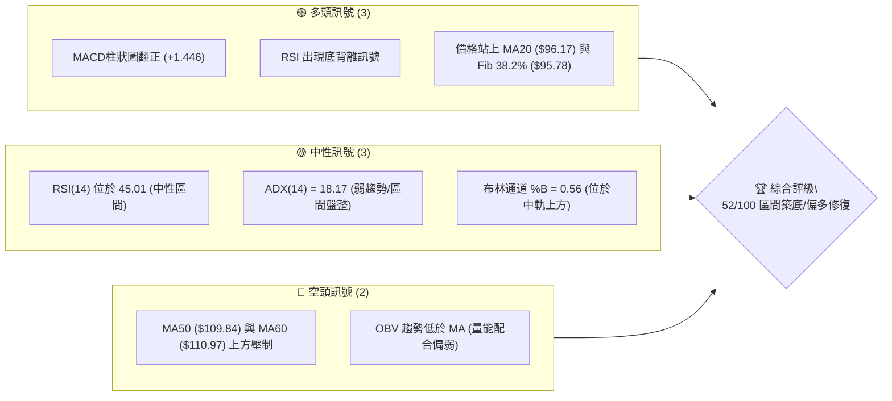
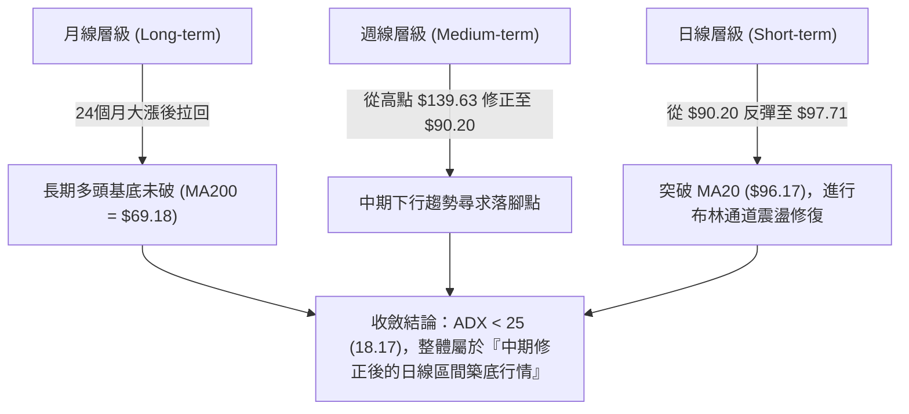
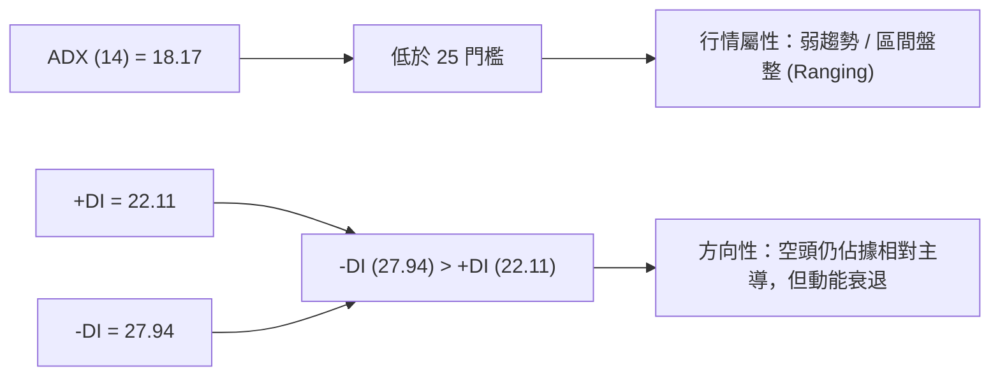
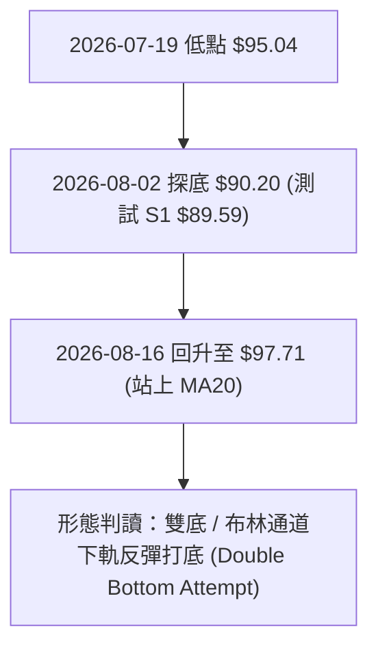
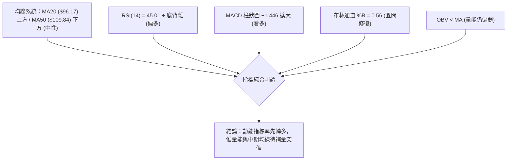
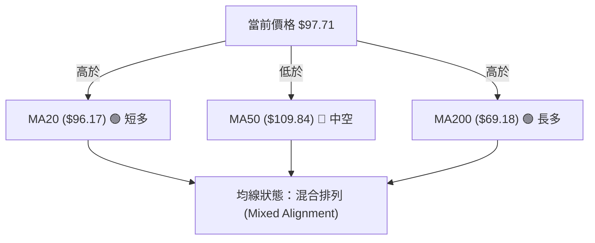
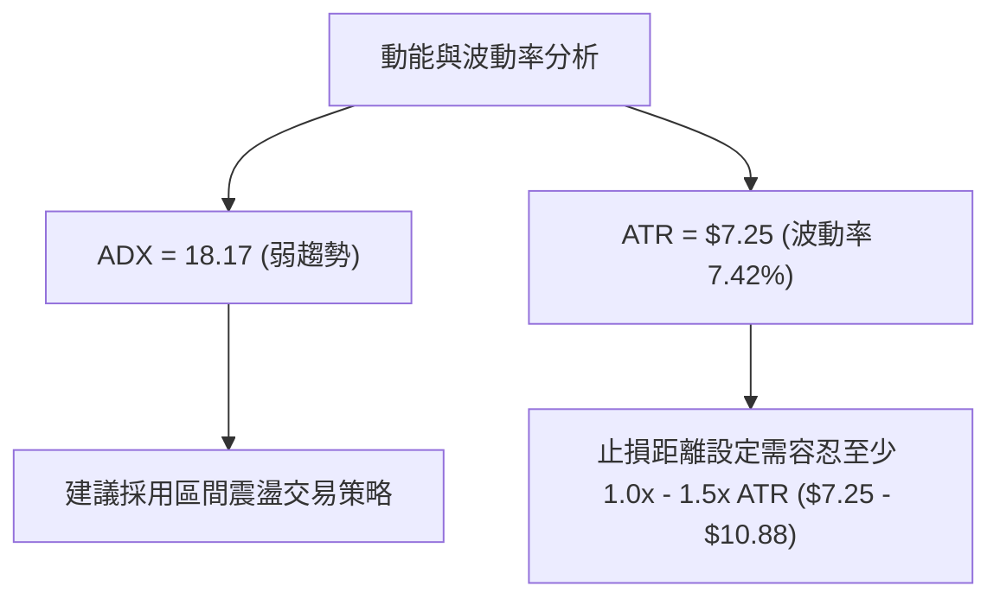
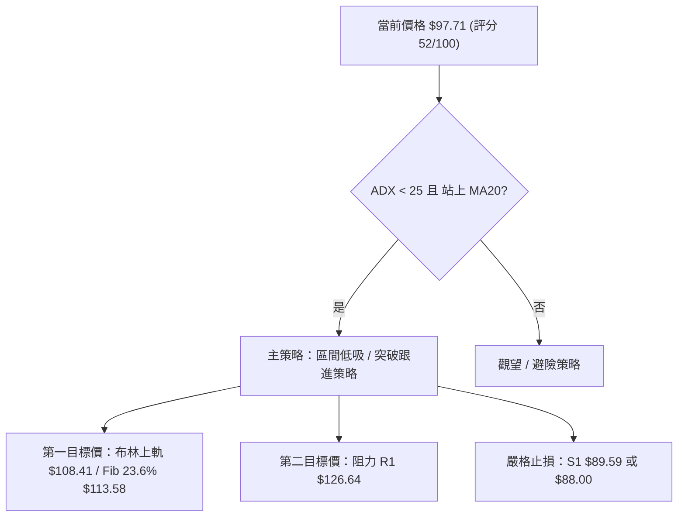
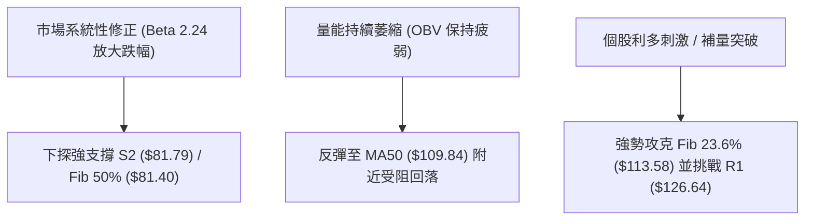

# INTC 技術分析報告

> **報告日期**：2026-08-12 ｜ **語言**：繁體中文 ｜ **數據來源**：Yahoo Finance ｜ **當前價格**：$97.71

---

## 目錄

| 章節 | 內容 |
|------|------|
| [1. 技術面概覽](#1-技術面概覽) | 訊號儀表板、核心指標、評分卡 |
| [2. 趨勢分析](#2-趨勢分析) | 多時框趨勢、長中短期走勢 |
| [3. 圖表形態分析](#3-圖表形態分析) | 形態識別、K線組合、目標價 |
| [4. 支撐與阻力](#4-支撐與阻力) | 關鍵價位、斐波那契回調 |
| [5. 技術指標深度解讀](#5-技術指標深度解讀) | MA/RSI/MACD/布林/成交量 |
| [6. 動能與波動率](#6-動能與波動率) | 動能評估、ATR、Beta |
| [7. 多時框架總結](#7-多時框架總結) | 時框架評分矩陣 |
| [8. 交易策略建議](#8-交易策略建議) | 多空策略、風險報酬比 |
| [9. 風險提示與監控](#9-風險提示與監控) | 監控指標、風險場景 |

---

## 1. 技術面概覽

### 🎯 技術訊號儀表板



### 📊 核心指標速覽表

| 指標類別 | 指標名稱 | 當前數值 | 訊號 | 解讀 |
|----------|----------|----------|------|------|
| **價格** | 當前價格 | $97.71 | 🟡 中性 | 處於 52 週區間 $20.44 - $142.35 之 63.4% 位置 |
| **均線** | MA20 | $96.17 | 🟢 看多 | 價格已成功突破並站上 20 日均線 |
| **均線** | MA50 | $109.84 | 🔴 看空 | 中期均線位於價格上方，形成動態阻力 |
| **均線** | MA200 | $69.18 | 🟢 看多 | 長期上升趨勢基底穩固，價格遠高於年線 |
| **動能** | RSI(14) | 45.01 | 🟡 中性 | 自超賣區回升，且日線/週線呈底背離構型 |
| **動能** | MACD | -3.256 | 🟢 看多 | MACD 柱狀圖 (+1.446) 連續擴大，低位金叉成立 |
| **波動** | ATR(14) | $7.25 | 🟡 中性 | 每日波動率 7.42%，屬於正常高Beta修正後整理期 |

### 🏆 技術評分卡

```
╔══════════════════════════════════════════════════════════════════╗
║                技術評分卡 — INTC (2026-08-12)                    ║
╠══════════════════════════════════════════════════════════════════╣
║ 趨勢強度      ████████░░░░░░░░░░░░  40/100  🟡 弱趨勢/盤整      ║
║ 動能指標      ████████████░░░░░░░░  60/100  🟢 底背離金叉      ║
║ 支撐穩定度    ██████████████░░░░░░  70/100  🟢 S1/Fib38.2%穩固  ║
║ 成交量配合    ████████░░░░░░░░░░░░  40/100  🟡 OBV偏弱/微增量  ║
║ 形態完整度    ██████████░░░░░░░░░░  50/100  🟡 區間打底中      ║
║ 均線排列      ██████████░░░░░░░░░░  50/100  🟡 短多長多/中空   ║
╠══════════════════════════════════════════════════════════════════╣
║ 綜合評分      ██████████░░░░░░░░░░  52/100  🟡 區間盤整偏多    ║
╚══════════════════════════════════════════════════════════════════╝
```

---

## 2. 趨勢分析

### 🌐 多時框趨勢分析



### 📈 長期趨勢 — 12個月走勢圖（Unicode）

```
INTC 月線走勢圖（過去12個月：2025-09 至 2026-08）
價格軸 ($)
$140 ┤                               ● (2026-06 High $139.63)
$120 ┤                         ●     │
$100 ┤                   ●     │     │           ● (現在 $97.71)
$80  ┤             ●     │     │     │     ●     │
$60  ┤       ●     │     │     │     │     │     │
$40  ┤ ●     │     │     │     │     │     │     │
     └─┬─────┬─────┬─────┬─────┬─────┬─────┬─────┬─────► 時間
     2025-09 11    2026-01 03    05    06    07    08
```

**走勢特徵分析表格**：

| 階段 | 時間區間 | 價格變動 | 幅度 | 走勢特徵分析 |
|------|----------|----------|------|--------------|
| **第一階段：爆發主升段** | 2025-09 至 2026-03 | $33.55 → $44.13 | +31.5% | 底層築底完成，量能溫和放大 |
| **第二階段：瘋狂主升段** | 2026-04 至 2026-06 | $44.13 → $139.63 | +216.4% | 籌碼極度拉抬，突破歷史多重阻力 |
| **第三階段：深度拉回段** | 2026-06 至 2026-07 | $139.63 → $90.20 | -35.4% | 獲利了結賣壓湧現，測試下方關鍵斐波那契支撐 |
| **第四階段：築底修復段** | 2026-07 至 2026-08 | $90.20 → $97.71 | +8.3% | 於 S1 ($89.59) 穩固落腳，MACD出現金叉訊號 |

### 📊 中期趨勢（週線分析）

```
週線壓力與支撐結構示意圖：
阻力層 R1: $126.64 ═════════════════════════════════════ (波段高點聚類)
阻力層 MA50: $109.84 --------------------------------- (中期均線反壓)
當前價格: $97.71   ▲ (嘗試向上挑戰中軌)
支撐層 S1: $89.59  --------------------------------- (近期波段支撐)
支撐層 S2: $81.79  ═════════════════════════════════════ (50% 斐波那契 / 強支撐)
```

### ⚡ 趨勢強度評估（ADX 解讀）



| 指標名稱 | 當前數值 | 參考門檻 | 評估結論 |
|----------|----------|----------|----------|
| **ADX (14)** | 18.17 | < 25 (盤整) / > 25 (趨勢) | 🟢 趨勢動能平緩，適合區間操作，不易發生單邊暴跌 |
| **+DI** | 22.11 | - | 多頭力道正從低檔回升 |
| **-DI** | 27.94 | - | 空頭力道逐步受控，差值正在收縮 |

---

## 3. 圖表形態分析

### 🔍 形態識別系統



**形態信心度與參數評估表**：

| 形態類別 | 信心度 | 判斷依據（引用數據） | 完成度 | 目標價（附計算式） |
|----------|--------|----------------------|--------|--------------------|
| **雙底反彈 (W底嘗試)** | 65% | 兩次下探 $95.04 與 $90.20 均守住 S1 ($89.59)，RSI 呈現低點墊高的底背離 | 60% | **$102.14**<br/>計算式：頸線 MA20 ($96.17) + (頸線 $96.17 - 低點 $90.20) = $102.14 |
| **布林通道下軌通道復歸** | 80% | 價格自布林下軌 $83.94 獲得支撐，連兩週回升突破中軌 $96.17 | 85% | **$108.41**<br/>計算式：直接指向布林上軌 $108.41 |
| **幾何頭肩形態** | <40% | 數據不足以支撐幾何頭肩形態，明確說明「訊號不足，僅做指標型解讀」 | N/A | 無 (數據不支援複雜幾何形態) |

### 🕯️ 重要K線形態分析

| 日期/週次 | 收盤價 | K線形態 | 解讀 | 訊號 |
|-----------|--------|---------|------|------|
| **2026-07-19** | $95.04 | 大陰線挫落 | 空頭宣洩，超賣壓力極大 (RSI 27.4) | 🔴 |
| **2026-08-02** | $90.20 | 下影鎚頭線 | 止跌訊號出現，買盤於 S1 ($89.59) 附近承接 | 🟢 |
| **2026-08-09** | $101.65 | 中陽線強反彈 | 突破短線壓力，確認底背離發酵 | 🟢 |
| **2026-08-16** | $97.71 | 小陰線回測 | 站穩 MA20 ($96.17) 進行常態性量縮洗盤 | 🟡 |

### 📉 ASCII 走勢形態示意圖

```
INTC 日線雙底打底示意圖：
$108.41 ┤------------------------------------------- 布林上軌 (目標價 2)
        │
$102.14 ┤ . . . . . . . . . . . . . . . . . . . . . 形態推估目標價 (頸線+高度)
        │                 ▲
$96.17  ┤─────────★──────/─\───── 頸線 (MA20)
        │        / \    /   \   ★ 當前現價 $97.71
$90.20  ┤───────●───\──●     \___
        │   (左腳)   (右腳 $90.20)
$89.59  ┤=========================================== 關鍵支撐 S1
```

---

## 4. 支撐與阻力

### 🗺️ 關鍵價位分布圖（Unicode）

```
INTC 價位結構分布圖 (由 OHLCV 與斐波那契精確算出)
═══════════════════════════════════════════════════════════════════
$141.90 ║████████████████████████████████████████║ 強阻力 R3 (52W高點附近)
$132.75 ║████████████████████████████            ║ 阻力 R2
$126.64 ║████████████████████████                ║ 阻力 R1
$113.58 ║▓▓▓▓▓▓▓▓▓▓▓▓▓▓▓▓▓▓▓▓                    ║ 斐波那契 23.6% 回調位
$108.41 ║▓▓▓▓▓▓▓▓▓▓▓▓▓▓                          ║ 布林通道上軌 / MA50 ($109.84)
$97.71  ╠════════════════════════════════════════╣ ◄ 當前價格 $97.71
$95.78  ║▓▓▓▓▓▓▓▓▓▓▓▓▓▓                          ║ 斐波那契 38.2% 回調位 / MA20 ($96.17)
$89.59  ║████████████████████████                ║ 近期波段關鍵支撐 S1
$83.94  ║████████████                            ║ 布林通道下軌
$81.79  ║████████████████████████████            ║ 強支撐 S2 / 斐波那契 50.0% ($81.40)
$42.58  ║████████████████████████████████████████║ 終極長線支撐 S3
═══════════════════════════════════════════════════════════════════
```

### 🚧 阻力位分析表

| 阻力級別 | 價位 | 形成原因 | 突破難度 | 重要性 |
|----------|------|----------|----------|--------|
| **短阻力 (BB上軌)** | $108.41 | 布林上軌與 MA50 ($109.84) 雙重重疊壓制 | 中等 | 🟡 短線多空分水嶺 |
| **阻力 R1** | $126.64 | 近一年波段高點聚類區間 | 高 | 🔴 中期多頭反彈強阻力 |
| **阻力 R2** | $132.75 | 歷史次高密集成交套牢區 | 極高 | 🔴 中長期解套賣壓區 |
| **阻力 R3** | $141.90 | 近一年 52 週最高點 ($142.35) 聚類 | 極高 | 🔴 歷史天花板 |

### 🛡️ 支撐位分析表

| 支撐級別 | 價位 | 形成原因 | 守住機率 | 重要性 |
|----------|------|----------|----------|--------|
| **短支撐 (Fib 38.2%)** | $95.78 | 52週漲幅之 38.2% 回調位與 MA20 ($96.17) | 75% | 🟢 短線防守第一線 |
| **支撐 S1** | $89.59 | 近一年波段低點聚類（2026-08-02 探底點） | 80% | 🟢 短線築底關鍵頸線 |
| **強支撐 S2** | $81.79 | 波段低點聚類與 50.0% 斐波那契 ($81.40) 雙重交會 | 88% | 🟢 中期多頭最後防線 |
| **終極支撐 S3** | $42.58 | 歷史起漲段密集交投區 | 98% | 🟢 長期結構底座 |

### 📐 斐波那契回調位分析

> **基準區間**：52 週低點 **$20.44** → 52 週高點 **$142.35**（垂直距離 $121.91）

| 回調比例 | 計算價位 | 當前價格相對位置與解讀 |
|----------|----------|------------------------|
| **0.0% (52W High)** | $142.35 | 頂部波段高點 |
| **23.6%** | $113.58 | 上方強阻力位，若能收復此位則宣示中期修正結束 |
| **38.2%** | $95.78 | **現價 $97.71 剛好站上此位**！顯示多頭已守住關鍵黃金分割回調線 |
| **50.0%** | $81.40 | 與 S2 ($81.79) 形成極為堅固的中期多空強弱分界線 |
| **61.8%** | $67.01 | 與 MA200 ($69.18) 形成長期強支撐帶 |
| **78.6%** | $46.53 | 深幅回調邊界（接近 S3 $42.58） |
| **100.0% (52W Low)**| $20.44 | 起漲點底座 |

---

## 5. 技術指標深度解讀

### 🎛️ 指標訊號總覽



### 📈 移動平均線排列分析



*   **短期均線**：MA5 ($99.55)、MA10 ($95.28)、MA20 ($96.17) 呈現交叉糾結。價格站上 MA10 與 MA20，短期具備止跌回升動能。
*   **中期均線**：MA50 ($109.84) 與 MA60 ($110.97) 快速向下扣抵，壓制於 $108 - $110 區間，將是反彈第一大障礙。
*   **長期均線**：MA120 ($87.67) 與 MA200 ($69.18) 穩定向上，長多格局並未因近期拉回而破壞。

### 📉 RSI(14) 分析

`RSI(14) 強度：█████████░░░░░░░░░░░ 45.01% (中性區間)`

```
RSI 背離判斷圖解：
價格走勢： 2026-07-19 ($95.04) ───► 2026-08-02 ($90.20) [價格創低] 📉
RSI 指標： 2026-07-19 (27.4)  ───► 2026-08-02 (39.5)  [RSI 墊高] 📈
結論：典型🟢「底背離 (Bullish Divergence)」，預示價格下行動能竭盡，反彈機率極高。
```

### 📊 MACD(12/26/9) 訊號解讀

*   **DIF (MACD線)**：-3.256
*   **DEA (Signal線)**：-4.702
*   **MACD柱狀圖**：+1.446（🟢 綠柱持續擴大）

**解讀**：DIF 於零軸下方向上穿越 DEA 形成「零軸下金叉」，且柱狀圖連續兩週呈現正值擴大 (+1.256 → +1.614 → +1.446)。此為典型的空頭力道衰退、短線多頭反彈訊號。

### 📦 布林通道分析

```
ASCII 布林通道位置示意圖：
$108.41 ┤========================================= 布林上軌
        │
$97.71  ┤─────────★────────────────────────────── 當前價 ($97.71, %B=0.56)
$96.17  ┤----------------------------------------- 布林中軌 (MA20)
        │
$83.94  ┤========================================= 布林下軌
```

*   **帶寬與位置**：通道上下軌寬度為 $24.47。當前 %B 為 0.56，代表價格已自下軌 ($83.94) 強勢反彈並突破中軌 ($96.17)，運行於上半通道。
*   **交易含義**：在 ADX < 25 的盤整格局下，價格通過中軌後，首要技術目標即為布林通道上軌 **$108.41**。

### 💹 成交量分析（量價配合度）

*   **當前成交量**：163,634,859 股
*   **20日均量**：118,302,703 股（**量比 1.38x** 🟢）
*   **OBV 趨勢**：OBV 指標小幅回升但仍低於其均線，顯示當前反彈主要由短線抄底資金與空頭平倉推升，法人級大資金追高意願仍有待觀察。

---

## 6. 動能與波動率

### ⚡ 動能評估

| 象限區間 | 動能強度 | 波動率水準 | INTC 當前位置與評估 |
|----------|----------|------------|---------------------|
| **Q1 (強動能/低波動)** | 強 | 低 | 穩健主升段 (非目前狀態) |
| **Q2 (弱動能/低波動)** | 弱 | 低 | **✓ 當前位置**：ADX 18.17 且 RSI 45.01，屬於低動能區間震盪築底 |
| **Q3 (強動能/高波動)** | 強 | 高 | 劇烈噴發段 |
| **Q4 (弱動能/高波動)** | 弱 | 高 | 恐慌殺盤段 |



### 📊 ATR 波動率分析

*   **ATR(14) 精確數值**：**$7.25**（占當前股價 7.42%）
*   **風控應用**：
    *   **短線止損距離 (1.0x ATR)**：$7.25
    *   **波段止損距離 (1.5x ATR)**：$10.88
    *   **多頭進場安全邊界**：現價 $97.71 減去 1.0x ATR = **$90.46**（極度接近 S1 支撐 $89.59，證明 S1 為極佳止損參考點）。

### 📐 Beta 與市場相關性

*   **Beta 係數**：**2.241**（屬極高波動個股，大盤上漲/下跌 1%，INTC 平均波動約 2.24%）。
*   **交易提醒**：高 Beta 特性意味著在反彈行情中具備極高槓桿彈性，但也要求嚴格執行止損紀律。

---

## 7. 多時框架總結

### 📋 時框架評分表

| 時框架 | 趨勢方向 | 動能指標 | 均線排列 | 形態結構 | 綜合評分 | 建議操作 |
|--------|----------|----------|----------|----------|----------|----------|
| **月線 (Long)** | 🟢 偏多 | 🟡 中性 | 🟢 多頭排列 | 主升段後拉回 | **75/100** | 長線逢低分批佈局 |
| **週線 (Medium)**| 🔴 偏空 | 🟢 底背離 | 🟡 混合糾結 | 深度修正落腳 | **48/100** | 區間操作/觀望 |
| **日線 (Short)** | 🟢 偏多 | 🟢 MACD金叉| 🟢 站上MA20 | 雙底反彈嘗試 | **62/100** | 短線偏多操作 |

### 🔲 綜合訊號矩陣

```
┌──────────────────────────────────────────────────────────┐
│ INTC 多時框架訊號收斂矩陣                                │
├──────────────┬──────────────┬──────────────┬─────────────┤
│ 時框架       │ 短期 (日線)  │ 中期 (週線)  │ 長期 (月線) │
├──────────────┼──────────────┼──────────────┼─────────────┤
│ 均線方向     │ 🟢 站上MA20  │ 🔴 MA50向下  │ 🟢 高於MA200│
│ 動能方向     │ 🟢 MACD金叉  │ 🟢 RSI底背離 │ 🟡 中性     │
│ 區間位置     │ 🟢 布林中軌上│ 🟡 38.2%斐波 │ 🟢 63.4%高位│
├──────────────┼──────────────┼──────────────┼─────────────┤
│ 綜合導向     │ 短多修復     │ 區間整理     │ 長多未變    │
└──────────────┴──────────────┴──────────────┴─────────────┘
```

### ⚖️ 多時框收斂結論

根據**多時框收斂規則**：當前 ADX(14) 為 **18.17 (< 25)**，市場確定處於**盤整行情（Ranging Market）**。

因此，主導交易邏輯必須以**日線與週線的布林通道上下軌及關鍵斐波那契位**為核心交易區間（$83.94 - $108.41）。日線 MACD 金叉與 RSI 底背離提供短線向上修復動能，最終結論收斂為：**區間震盪偏多，以布林上軌 $108.41 及 Fib 23.6% $113.58 為階段性反彈目標**。

---

## 8. 交易策略建議

### 🗺️ 策略決策流程圖



### 🧭 策略路由

> **當前主策略方向 = 區間低吸逢低做多（依綜合評分 52/100 偏多修復）**

由於綜合評分為 52/100 且 ADX 處於 18.17 的區間盤整型態，主推策略為**「布林通道區間操作與回檔低吸策略」**。

### 🎯 價格情境階梯（Price Scenarios）

| 觸發條件 | 下一目標 | 後續延伸 | 情境含義 |
|----------|----------|----------|----------|
| **強勢突破 $108.41 (BB上軌)** | $113.58 (Fib 23.6%) | $126.64 (R1) | 中期修正結束，重啟主升段 |
| **站穩現價 $97.71 區間** | $108.41 (BB上軌) | $113.58 (Fib 23.6%) | **基準情境**：布林通道內常態修復 |
| **跌破 S1 $89.59** | $81.79 (S2 / Fib 50%) | $67.01 (Fib 61.8%) | 築底失敗，向下二次探底 |

### 📊 情境機率分佈

| 情境 | 機率 | 主要依據 |
|------|------|----------|
| **區間向上反彈 (目標 $108.41 - $113.58)** | **55%** | MACD 零軸下金叉、RSI 底背離成立、價格站上 MA20 |
| **區間橫盤震盪 ($89.59 - $97.71)** | **30%** | ADX = 18.17 趨勢動能平緩，OBV 成交量未明顯放大 |
| **回落再探底 (跌破 S1 測試 S2 $81.79)** | **15%** | MA50 ($109.84) 下方賣壓過重或大盤系統性風險 |

### 🟢 主策略詳情

> **數據紀律說明**：所有進場、止損、目標價嚴格採用第四章及數據 package 中之精確價位。

| 策略要素 | 策略 A：區間低吸策略 (主推) | 策略 B：突破順勢策略 (預備) |
|----------|─────────────────────────────|─────────────────────────────|
| **進場條件** | 價格回測 MA20 ($96.17) 或 Fib 38.2% ($95.78) 守穩 | 日線收盤價強勢突破布林上軌 $108.41 |
| **進場價格** | **$96.17** (或現價 $97.71 分批) | **$108.50** |
| **目標價 T1** | **$108.41** (布林通道上軌) | **$113.58** (斐波那契 23.6%) |
| **目標價 T2** | **$113.58** (斐波那契 23.6%) | **$126.64** (關鍵阻力 R1) |
| **止損價格** | **$88.00** (跌破 S1 $89.59 緩衝區) | **$96.17** (回跌至 MA20 止損) |
| **風險報酬比** | **1.49 : 1** (以 T1 計) / **2.13 : 1** (以 T2 計) | **1.47 : 1** (以 T2 計) |
| **建議倉位** | **15% - 20%** 總資金 | **10% - 15%** 總資金 |

*策略 A 風報酬比計算式*：
- 進場 $96.17，止損 $88.00（風險 = $8.17）
- 目標 T1 $108.41（報酬 = $12.24）→ 風報比 = 12.24 / 8.17 = **1.50 : 1**
- 目標 T2 $113.58（報酬 = $17.41）→ 風報比 = 17.41 / 8.17 = **2.13 : 1**

### 🔴 反向風險觸發點（對沖提示）

*   **多頭失效條件**：若日線收盤價強勢跌破 **S1 $89.59**，宣告雙底築底失敗。
*   **風控對沖動作**：建議立即止損離場，或於跌破 $89.59 時建立反向對沖部位，下看 **S2 $81.79**。

### ⭐ 整體訊號強度評星

```
做多訊號強度：★★★☆☆  (3/5星 — 底背離與金叉加分，惟受制於 MA50)
做空訊號強度：★★☆☆☆  (2/2星 — 下有 S1 強支撐，空頭動能衰退)
整體可信度：  ★★★☆☆  (3/5星 — 區間盤整格局，適合波段區間操作)
```

---

## 9. 風險提示與監控

### ✅ 關鍵監控指標 Checklist

```
╔══════════════════════════════════════════════════════════════════╗
║                    每日技術面風控監控 CheckList                  ║
╠══════════════════════════════════════════════════════════════════╣
║ [ ] 價格是否持續穩守在 MA20 ($96.17) 與 Fib 38.2% ($95.78) 上方  ║
║ [ ] MACD 柱狀圖 (+1.446) 是否持續維持正向遞增                    ║
║ [ ] 每日成交量是否能突破 20 日均量 (118,302,703 股)              ║
║ [ ] 突破 $108.41 (BB上軌) 時，OBV 是否出現顯著放量確認           ║
║ [ ] 警報位設定：下限 $89.59 (S1)、上限 $108.41 (BB上軌)          ║
╚══════════════════════════════════════════════════════════════════╝
```

### ⚠️ 風險場景分析



### 🛡️ 風險管理重要提醒

1.  **高 Beta 波動控制**：INTC 的 Beta 高達 **2.241**，波動幅度為大盤的 2.2 倍以上。單一持股倉位切勿超過總投資組合的 **20%**。
2.  **嚴格執行 ATR 止損**：當前 ATR 為 **$7.25**，價格震盪劇烈，止損單請勿設得過窄，應以 **S1 $89.59 下方 ($88.00)** 為硬性止損點。
3.  **拒絕憑空預測，依訊號交易**：在 ADX 未升破 25 之前，切勿盲目喊出突破 $142.35 歷史高點，應恪守區間操作原則。

---

## 📋 報告總結

```
╔══════════════════════════════════════════════════════════════════╗
║                     INTC 技術分析報告總結                        ║
════════════════════════════════════════════════════════════════════
報告日期：2026-08-12
當前價格：$97.71
分析評級：🟡 52/100 (區間盤整偏多 / 反彈修復中)

關鍵結論：
├─ 長期趨勢：🟢 多頭基底穩固 (價格高於 MA200 $69.18)
├─ 中期趨勢：🟡 深度修正後尋求落腳，受制於 MA50 ($109.84)
├─ 短期趨勢：🟢 底背離發酵，站上 MA20 ($96.17)，短多佔優
├─ 關鍵支撐：$89.59 (S1) / $81.79 (S2)
├─ 關鍵阻力：$108.41 (BB上軌) / $113.58 (Fib 23.6%) / $126.64 (R1)
└─ 分析師目標：平均 $114.05 (最高 $200.00 / 最低 $74.00)

最優策略組合：
1. 🥇 主推策略：於 $95.78 - $96.17 區間低吸做多，止損 $88.00，目標 $108.41 / $113.58。
2. 🥈 預備策略：強勢帶量突破 $108.41 後順勢加碼，目標看至 R1 $126.64。
3. 🥉 風控提醒：若跌破 S1 $89.59 應全面離場觀望。
══════════════════════════════════════════════════════════════════╝
```

---

> ⚠️ **免責聲明**：本報告為 AI 自動生成之技術分析，所有數據及估算均基於提供的歷史價格資訊。本報告**僅供研究與學術參考**，**不構成任何投資建議**。投資有風險，入市需謹慎。

---

*報告生成時間：2026-08-12 ｜ 數據來源：Yahoo Finance ｜ 分析框架：多時框技術分析*