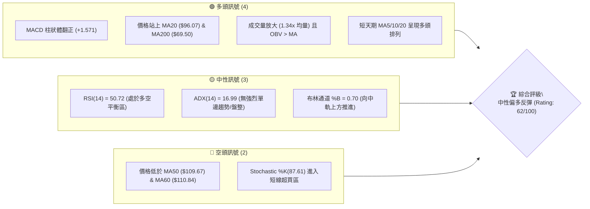
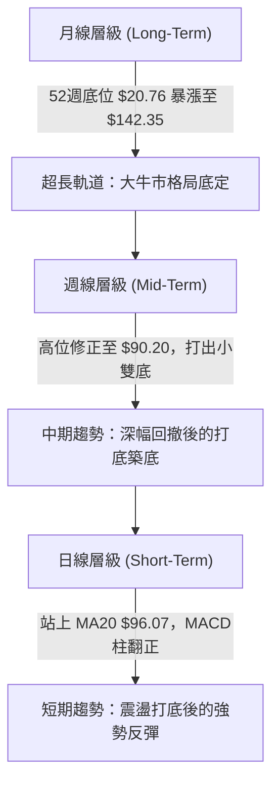
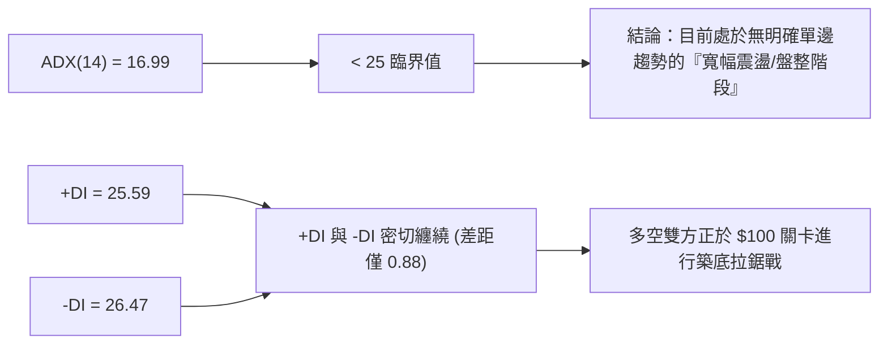
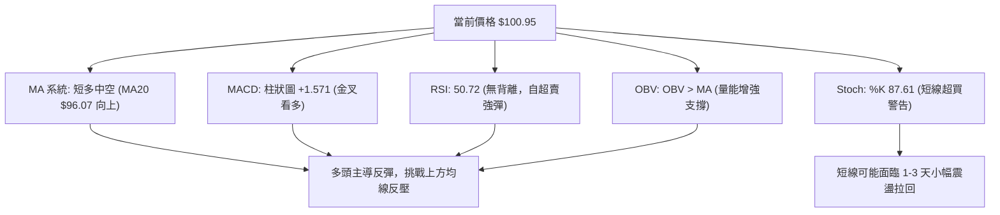
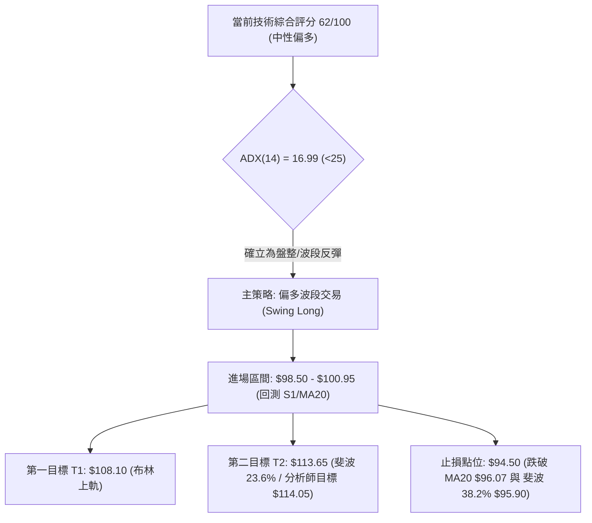
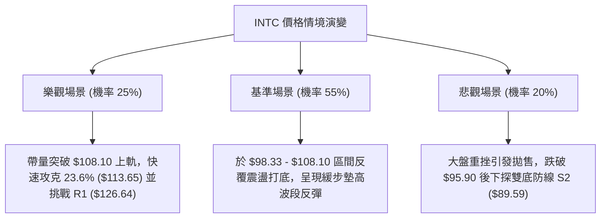

# INTC 技術分析報告

> **報告日期**：2026-08-13 ｜ **語言**：繁體中文 ｜ **數據來源**：Yahoo Finance ｜ **當前價格**：$100.95

---

## 目錄

| 章節 | 內容 |
|------|------|
| [1. 技術面概覽](#1-技術面概覽) | 訊號儀表板、核心指標、評分卡 |
| [2. 趨勢分析](#2-趨勢分析) | 多時框趨勢、長中短期走勢 |
| [3. 圖表形態分析](#3-圖表形態分析) | 形態識別、K線組合、目標價 |
| [4. 支撐與阻力](#4-支撐與阻力) | 關鍵價位、斐波那契回調 |
| [5. 技術指標深度解讀](#5-技術指標深度解讀) | MA/RSI/MACD/布林/成交量 |
| [6. 動能與波動率](#6-動能與波動率) | 動能評估、ATR、Beta |
| [7. 多時框架總結](#7-多時框架總結) | 時框架評分矩陣 |
| [8. 交易策略建議](#8-交易策略建議) | 多空策略、風險報酬比 |
| [9. 風險提示與監控](#9-風險提示與監控) | 監控指標、風險場景 |

---

## 1. 技術面概覽

### 🎯 技術訊號儀表板



### 📊 核心指標速覽表

| 指標類別 | 指標名稱 | 當前數值 | 訊號 | 解讀 |
|----------|----------|----------|------|------|
| **價格** | 當前價格 | $100.95 | 🟢 多頭 | 站穩 $100 整數關卡，自近期低點 $90.20 強勢反彈 |
| **均線** | MA20 | $96.07 | 🟢 多頭 | 價格位於 MA20 上方 (+5.08%)，短線扭轉頹勢 |
| **均線** | MA50 | $109.67 | 🔴 空頭 | 價格位於 MA50 下方 (-7.95%)，中期仍面臨均線反壓 |
| **均線** | MA200 | $69.50 | 🟢 多頭 | 價格遠高於 MA200 (+45.25%)，長期牛市架構未破 |
| **動能** | RSI(14) | 50.72 | 🟡 中性 | 從近超賣區 (26.9) 迅速回升至多空平衡中軸 |
| **動能** | MACD | -2.739 | 🟢 多頭 | 柱狀體為 +1.571，快慢線低位金叉後向上修復 |
| **波動** | ATR(14) | $7.29 | 🟡 中性 | 日波幅達 7.22%，提供豐富的短線波段操作空間 |
| **動能** | Stoch %K | 87.61 | 🔴 空頭 | %K(87.61) 高於 %D(73.83)，短線衝高進入超買區 |
| **量能** | 當日成交量 | 161.58M | 🟢 多頭 | 達20日均量 (120.37M) 之 1.34 倍，量增價漲 |

### 🏆 技術評分卡

```
╔══════════════════════════════════════════════════════════════════╗
║                   INTC 技術評分卡 (2026-08-13)                  ║
╠══════════════════════════════════════════════════════════════════╣
║ 趨勢強度 (ADX/MA)   █████████░░░░░░░░░░░  45/100  🟡 中性盤整  ║
║ 動能指標 (MACD/RSI)  █████████████░░░░░░░  65/100  🟢 動能修復  ║
║ 支撐穩定度 (S1/S2)   ███████████████░░░░░  75/100  🟢 底部堅實  ║
║ 成交量配合 (OBV/VOL) ██████████████░░░░░░  70/100  🟢 量能放大  ║
║ 形態完整度 (底型)    ███████████░░░░░░░░░  55/100  🟡 築底階段  ║
║ 均線排列 (多空糾結)  ████████████░░░░░░░░  60/100  🟡 短多中空  ║
╠══════════════════════════════════════════════════════════════════╣
║ 綜合技術評分         █████████████░░░░░░░  62/100  🟢 中性偏多  ║
╚══════════════════════════════════════════════════════════════════╝
```

---

## 2. 趨勢分析

### 🌐 多時框趨勢分析



### 📈 長期趨勢 — 24個月價格歷史與特徵

自 2024 年底低位築底以來，INTC 經歷了半導體產業週期復甦與 Foundry 轉型效應帶來的強烈價值重估。價格從 2024 年底的 $20.00 附近一路狂飆至 2026 年年中的歷史天價 $142.35，隨後因高位獲利賣壓與籌碼洗牌，快速拉回至 $90.20（恰於 50% 斐波那契回調位 $81.56 上方止跌），目前展現出強烈的反彈力道。

```
INTC 月線走勢示意圖（2024-08 至 2026-08）
價格軸 ($)
$140 ┤                               ● $139.63 (2026-06)
$120 ┤                         ●
$100 ┤                             ● $100.95 (現在)
 $80 ┤
 $60 ┤                 ●
 $40 ┤             ●
 $20 ┤●   ●   ●
     └───────────────────────────────────────────────────► 時間
      24/08 24/12 25/04 25/08 25/12 26/04 26/06 26/08
```

#### 24 個月歷史走勢階段拆解

| 階段 | 時間區間 | 價格區間 | 累積漲跌幅 | 走勢特徵分析 |
|------|----------|----------|------------|--------------|
| **1. 底部築底期** | 2024-08 ~ 2025-07 | $19.43 - $24.35 | +10.48% | 長期打底，交投清淡，市場對 Foundry 虧損計價充分 |
| **2. 主升段爆發** | 2025-08 ~ 2026-01 | $24.35 - $46.47 | +90.84% | 量能激增，基本面轉盈，股價突破長期下降趨勢線 |
| **3. 瘋狂主升段** | 2026-02 ~ 2026-06 | $44.13 - $139.63 | +216.41% | 拋物線式狂飆，最高觸及 $142.35，多頭情緒達到頂峰 |
| **4. 獲利回吐修正**| 2026-06 ~ 2026-07 | $139.63 - $90.20 | -35.40% | 獲利了結盤湧出，連續幾週無差別拉回，快速去槓桿 |
| **5. 止跌築底反彈**| 2026-08 ~ 現載 | $90.20 - $100.95 | +11.92% | 守住 $90 關鍵心理防線，短線帶量站回 MA20 上方 |

### 📊 中期趨勢（週線分析）

從近 20 週的週線數據觀察：
- **高點回撤**：自 2026-06-21 週收盤價 $133.99（盤中最高 $142.35）回落至 2026-08-02 的 $90.20，修正幅度達 36.6%。
- **週線超賣回升**：RSI 在 2026-07-26 週一度落至 **26.9** 的極端超賣區域，隨後於 2026-08-09 週強勢反彈至 **54.1**，週 MACD 柱狀體亦由 -1.256 急轉為 **+1.614**。
- **籌碼換手**：低檔 $90.20-$92.32 區間連續兩週爆出近 6 億至 6.8 億股的巨量，顯示機構資金在 $90-$95 區間進行積極抄底接盤。

### ⚡ 趨勢強度評估（ADX 解讀）



| 指標項 | 數值 | 評估標準 | 當前狀態解讀 |
|--------|------|----------|--------------|
| **ADX(14)** | **16.99** | < 20: 極弱趨勢 / 盤整<br>20-25: 溫和趨勢<br>> 25: 強勁單邊趨勢 | 目前極缺乏單邊強趨勢，**適用布林通道與支撐阻力區間操作策略**，不宜盲目追漲殺跌。 |
| **+DI(14)** | **25.59** | 買盤力道 | 自 low 點大幅回升，多頭動能正在重新聚集。 |
| **-DI(14)** | **26.47** | 賣盤力道 | 空頭主導力道急劇衰退，但仍微幅高於 +DI，空頭尚未完全放棄抵抗。 |

---

## 3. 圖表形態分析

### 🔍 形態識別系統

在日線與週線圖表中，INTC 呈現出「高位大幅拉回後的多重打底」與「布林通道區間修復」形態。

| 形態名稱 | 信心度 | 判斷依據（引用數據） | 完成度 | 目標價計算與精確數值 |
|----------|--------|----------------------|--------|----------------------|
| **W底 (雙重底)** | **70%** 🟢 | 1. 第一底 $92.32 (07/26週)<br>2. 第二底 $90.20 (08/02週)<br>3. 突破頸線 $101.65 (08/09週高點) | 85% | 形態高度 = $101.65 - $90.20 = $11.45<br>**突破目標價 = $101.65 + $11.45 = $113.10**<br>(完美重合 23.6% 斐波那契位 $113.65) |
| **布林通道下軌彈升** | **85%** 🟢 | 1. 價格踩平布林下軌 $84.04 止跌<br>2. 當前站上中軌 $96.07 (%B=0.70) | 100% | **通道上軌目標價 = $108.10** |
| **頭肩頂形態** | **35%** 🔴 | 數據不足以支撐幾何頭肩頂結構 | 0% | 信心度 < 50%，依數據規律**不作強行繪製**，改為指標型解讀。 |

### 🕯️ 重要K線形態分析

| 日期/週期 | 收盤價 | K線形態 | 技術含義 | 多空訊號 |
|-----------|--------|---------|----------|----------|
| **2026-07-26 週** | $92.32 | 倒錘子線 (Inverted Hammer) | 探底極限，$90 關卡買盤積極承接 | 🟡 止跌訊號 |
| **2026-08-02 週** | $90.20 | 長下影打底線 (Hammer) | 再次測試 $90 防線不破，成交量放大至 6.89 億股 | 🟢 底部確認 |
| **2026-08-09 週** | $101.65| 大陽線長驅直入 (Bullish Engulfing)| 一舉包覆前兩週高點，突破 MA20 $96.07 | 🟢 強烈買進 |
| **2026-08-16 現載**| $100.95| 高點十字星 (Doji/Consolidation) | 突破 $100 後的正常拉回回測，消化獲利賣壓 | 🟡 震盪整理 |

### 📉 ASCII 走勢形態示意圖（W底與布林通道反彈）

```
INTC 日線形態與通道結構 (2026-07 至 2026-08)

$113.65 ┤─────────────────────────────────────────── [斐波 23.6% / W底目標 $113.10]
        │
$108.10 ┤ - - - - - - - - - - - - - - - - - - - - - - [布林上軌 R]
        │                                  ● $101.65 (頸線突破)
$100.95 ┤───────────────────────────────●───┤ (當前現價)
$96.07  ┤ - - - - - - - - - - - - - - -● - - - - - -  [布林中軌 / MA20 支撐]
        │                      ●      /
$90.20  ┤──────────●──────────/─●────/──────────────  [底一 $92.32 / 底二 $90.20]
$84.04  ┤ - - - - - - - - - - - - - - - - - - - - - - [布林下軌 S]
```

---

## 4. 支撐與阻力

### 🗺️ 關鍵價位分布圖

```
INTC 價位結構分布圖 (當前現價 $100.95)
═══════════════════════════════════════════════════════════════════
$141.90 ║████████████████████████████████████████║ 強阻力 R3 (52W High $142.35 鄰近)
$132.75 ║██████████████████████████████        ║ 阻力 R2 (+31.50%)
$126.64 ║████████████████████████              ║ 關鍵阻力 R1 (+25.45%)
$113.65 ║▓▓▓▓▓▓▓▓▓▓▓▓▓▓▓▓▓▓▓▓                  ║ 斐波那契 23.6% 回調位 / 分析師均價 $114.05
$108.10 ║▓▓▓▓▓▓▓▓▓▓▓▓                          ║ 布林通道上軌
$100.95 ╠══════════════════════════════════════╣ ◄ 當前價格 $100.95
$98.33  ║▓▓▓▓▓▓▓▓▓▓▓                           ║ 關鍵支撐 S1 (-2.60%)
$95.90  ║▓▓▓▓▓▓▓▓                              ║ 斐波那契 38.2% 回調位 / MA20 $96.07
$89.59  ║████████████████████                  ║ 強支撐 S2 (-11.25%)
$81.79  ║██████████████████████████████        ║ 鐵板支撐 S3 / 斐波那契 50.0% ($81.56)
═══════════════════════════════════════════════════════════════════
```

### 🚧 阻力位分析表

所有阻力數據精確引用自 OHLCV 波段高點聚類與技術幾何位置：

| 阻力級別 | 價位 | 距離現價 | 形成原因與數據來源 | 突破難度 | 重要性 |
|----------|------|----------|--------------------|----------|--------|
| **次要阻力** | **$108.10** | +7.08% | 布林通道上軌 + 近期 60日均線 ($110.84) 反壓 | 🟡 中等 | 短線波段獲利了結點 |
| **關鍵阻力** | **$113.65** | +12.58%| 斐波那契 23.6% 回調位 + 分析師平均目標價 ($114.05) | 🔴 較高 | 多空中期分水嶺 |
| **阻力 R1** | **$126.64**| +25.45%| 近一年波段高點聚類 R1 | 🔴 高 | 中期多頭強勢區 |
| **阻力 R2** | **$132.75**| +31.50%| 近一年波段高點聚類 R2 | 🔴 極高 | 前高重災套牢區 |
| **阻力 R3** | **$141.90**| +40.56%| 近一年波段高點聚類 R3 (接近 52週高點 $142.35) | 🔴 極高 | 歷史天險 |

### 🛡️ 支撐位分析表

所有支撐數據精確引用自 OHLCV 波段低點聚類與技術幾何位置：

| 支撐級別 | 價位 | 距離現價 | 形成原因與數據來源 | 守住機率 | 重要性 |
|----------|------|----------|--------------------|----------|--------|
| **支撐 S1** | **$98.33** | -2.60% | 近一年波段低點聚類 S1 (短線回測首道防線) | 🟢 75% | 短線多頭防守點 |
| **關鍵支撐** | **$95.90** | -5.00% | 斐波那契 38.2% 回調位 ($95.90) + MA20 ($96.07) | 🟢 85% | 短線多空強弱基準線 |
| **支撐 S2** | **$89.59** | -11.25%| 近一年波段低點聚類 S2 (8月低點 $90.20 雙底區) | 🟢 90% | 中期波段防守大本營 |
| **支撐 S3** | **$81.79** | -18.98%| 近一年波段低點聚類 S3 + 斐波那契 50.0% ($81.56) | 🟢 95% | 長期牛熊生死線 |

### 📐 斐波那契回調位分析（52週區間 $20.76 → $142.35）

現價 **$100.95** 位於 52週區間的 **66.0%** 位置，精確夾在 **38.2% ($95.90)** 與 **23.6% ($113.65)** 回調位之間。

```
斐波那契結構解讀：
100.0% ($20.76) ───► 52週最低點 (2025年打底區域)
 78.6%  ($46.78) ───► 2026年初起漲突破口
 61.8%  ($67.21) ───► 接近 MA200 ($69.50)，長線強固基石
 50.0%  ($81.56) ───► 本輪暴跌之黃金對稱支撐 (與 S3 $81.79 重合)
 38.2%  ($95.90) ───►【當前下方第一支撐】成功站回，技術面轉強！
 23.6%  ($113.65) ───►【當前上方第一目標】多頭修復的關鍵目標位
  0.0% ($142.35) ───► 52週最高點
```
- **技術意義**：價格在拉回至 50.0% ($81.56) 前即於 $90.20 提前止跌反彈，並迅速強勢收復 38.2% ($95.90)。這表明市場對 INTC 的中期拉回屬於「強勢回調」，只要價格維持在 $95.90 (38.2%) 上方，大趨勢仍由多頭掌控，後續向上挑戰 23.6% ($113.65) 的機率極高。

---

## 5. 技術指標深度解讀

### 🎛️ 指標訊號總覽



### 📈 移動平均線排列分析

```
均線系統快照：
MA 5   : $99.53  (▲ +1.43%)  ████████████████████ (短線走揚)
MA 10  : $97.19  (▲ +3.87%)  ████████████████████ (短期向上)
MA 20  : $96.07  (▲ +5.08%)  ████████████████████ (月線轉多)
MA 50  : $109.67 (▼ -7.95%)  ░░░░░░░░░░░░░░░░░░░░ (季線下彎)
MA 60  : $110.84 (▼ -8.92%)  ░░░░░░░░░░░░░░░░░░░░ (季線下彎)
MA 120 : $88.14  (▲ +14.53%) ████████████████████ (半年線支撐)
MA 200 : $69.50  (▲ +45.25%) ████████████████████ (年線多頭)
```
- **分析**：短天期均線 (MA5 > MA10 > MA20) 呈現**多頭排列**，且價格已突破 MA20 ($96.07)；長天期均線 (MA120, MA200) 持續走揚，長多架構穩固。然而 MA50 ($109.67) 與 MA60 ($110.84) 仍呈現向下扣高之壓制狀態。短線交會點位於 $108.00 - $110.00 區域，將是反彈的首要遭遇戰。

### 📉 RSI(14) 動能分析

- **當前數值**：**50.72**
- **進度條**：█████████████░░░░░░░░░ 50.72% (中性多空平衡區)
- **背離判斷**：
  - **頂背離**：無。
  - **底背離**：無典型價格新低而指標未創新低之背離，但 RSI 自 7 月底極端超賣區 **26.9** 呈 V 型呈柱狀猛烈彈升至 **50.72**，宣告短線空頭力道枯竭，轉由買盤掌控。

### 📊 MACD (12, 26, 9) 訊號解讀

- **MACD 線**：-2.739
- **Signal 線**：-4.310
- **MACD 柱狀體**：**+1.571** 🟢 (看多)
- **解讀**：MACD 線在零軸下方向上突破 Signal 線形成**低位黃金交叉**，柱狀體連續多日擴大增長（自 -3.637 翻升至 +1.571），發出強烈的波段超賣反彈訊號，預示中短期股價具備持續向上修復動能。

### 📦 布林通道分析

```
INTC 布林通道結構 (20日通道，2倍標準差)

上軌 (Upper)  : $108.10  -------------------- (反彈第一目標壓位)
                          
當前價 (Price): $100.95  ========●=========== (%B = 0.70，偏向中軌與上軌間)

中軌 (Middle) : $96.07   -------------------- (MA20 關鍵動態支撐)

下軌 (Lower)  : $84.04   -------------------- (波段保護下限)
```
- **%B 指標**：**0.70**。當 %B > 0.5 時，代表股價落於中軌與上軌之間，屬於多頭強勢整理格局。布林帶寬呈現擴張後回收態勢，價格有朝向上軌 **$108.10** 試探的趨勢。

### 💹 成交量與 OBV 分析

- **成交量**：最新成交量 **161,584,069 股**，相較於 20日均量 (120,372,068 股) 之量比達 **1.34x**，呈現「量增價漲」健康結構。
- **OBV 趨勢**：**OBV > MA**。能量潮指標維持在移動平均線上頭，顯示在過去數週拉回過程中，機構籌碼未出現恐慌性鬆動，反而在 $90-$95 區間完成低位換手，量能全力支持當前上漲。

---

## 6. 動能與波動率

### ⚡ 動能與波動率定位表

| 象限區間 | 動能強度 (RSI / MACD) | 波動率 (ATR / Beta) | 當前 INTC 狀態定位 | 策略建議 |
|----------|-----------------------|---------------------|--------------------|----------|
| **Q1 (高動能/低波動)** | 強 (RSI > 60) | 低 (ATR% < 4%) | - | 穩定趨勢持股 |
| **Q2 (弱動能/低波動)** | 弱 (RSI < 40) | 低 (ATR% < 4%) | - | 沉悶盤整觀望 |
| **Q3 (強動能/高波動)** | 強 (MACD柱翻正)| 高 (Beta 2.24) | **✓ 當前定位 (Q3)** | **高彈性波段反彈交易** |
| **Q4 (弱動能/高波動)** | 弱 (RSI < 30) | 高 (ATR% > 7%) | 7月下旬狀態 (已過) | 避險 / 止損退出 |

### 📊 ATR 波動率與止損建議

- **ATR(14)**：**$7.29**（占當前股價 7.22%）
- **波動性評估**：INTC 目前日均波幅達 $7.29，屬於高 beta、高波動標的。
- **止損距離設計建議**：
  - **極短線交易 (Tight)**：1.0 × ATR = **$7.29**（距進場點約 7.2%）
  - **波段交易 (Standard)**：1.5 × ATR = **$10.94**（距進場點約 10.8%）
  - **波段防守點位**：進場價 $100.95 減去 1.0x ATR ($7.29) 得出 **$93.66**，恰落於 MA20 ($96.07) 與 S1 ($98.33) 下方，為極具保護力的技術止損點。

### 📐 Beta 與市場相關性

- **Beta 係數**：**2.241**
- **解讀**：INTC 的波動幅度為整體大盤 (S&P 500) 的 2.24 倍。當半導體板塊或大盤出現強彈時，INTC 具備極強的領漲爆發力；反之拉回時跌幅亦較深。

---

## 7. 多時框架總結

### 📋 時框架評分表

| 時框架 | 趨勢方向 | 動能狀態 | 均線排列 | 形態結構 | 綜合評分 | 建議 |
|--------|----------|----------|----------|----------|----------|------|
| **月線 (Long)** | 🟢 大牛市 | 🟢 強勁 | 🟢 多頭排列 | 巨型漲勢回調 | **85 / 100** | 偏多持股，逢低加碼 |
| **週線 (Mid)**  | 🟡 寬幅震盪| 🟢 底位金叉 | 🟡 均線高位回吐| W底打底完成 | **58 / 100** | 區間操作，逢低做多 |
| **日線 (Short)**| 🟢 帶量反彈| 🟢 柱狀體翻正| 🟢 短均多頭 | 突破 MA20 | **65 / 100** | 偏多操作，順勢買進 |

### 🔲 綜合訊號矩陣

```
┌──────────────────────────────────────────────────────────┐
│                   多時框架訊號收斂矩陣                   │
├──────────────┬──────────────────┬────────────────────────┤
│ 時框架       │ 訊號狀態         │ 權重評估               │
├──────────────┼──────────────────┼────────────────────────┤
│ 日線 (Short) │ 🟢 多頭 (突破MA20)│ 30% (尋找精確進場點)   │
│ 週線 (Mid)   │ 🟡 震盪 (W底頸線) │ 40% (決定主要區間/波段)│
│ 月線 (Long)  │ 🟢 多頭 (長多未破)│ 30% (確定大方向不作空) │
└──────────────┴──────────────────┴────────────────────────┘
```

### ⚖️ 多時框收斂結論

依據多時框收斂規則：
1. **當前 ADX = 16.99 (< 25)**，技術面確立為**盤整/寬幅震盪行情**。
2. 在盤整行情中，交易區間以**布林通道上下軌 ($84.04 - $108.10)** 與 **斐波那契位 ($95.90 - $113.65)** 為主要操作依據。
3. 日線展現出強烈的帶量金叉反彈訊號，收復 MA20 ($96.07)；週線亦在 $90.20 形成雙底打底完成。
4. **最終收斂方向**：**中性偏多 (Neutral-Bullish Swing Rebound)**。策略以「拉回順勢做多」為主，目標直指布林上軌 $108.10 與 斐波那契 23.6% ($113.65)。

---

## 8. 交易策略建議

### 🗺️ 策略決策流程圖



> **當前主策略方向：偏多波段操作（依綜合評分 62/100 分流）**

### 🎯 價格情境階梯 (Price Scenarios)

| 觸發條件 | 下一目標 | 後續延伸 | 情境含義 |
|----------|----------|----------|----------|
| **突破布林上軌 $108.10** | **$113.65** (斐波 23.6%) | **$126.64** (阻力 R1) | 強烈多頭主升修復，空頭棄守 |
| **站穩現價區間 ($98.33 - $100.95)** | **$108.10** (布林上軌) | **$113.65** | 溫和震盪反彈，沿 MA20 爬升 |
| **跌破 S1 $98.33 / MA20 $96.07** | **$89.59** (強支撐 S2) | **$81.79** (鐵板 S3) | 短線反彈夭折，重新回測雙底 |

### 📊 情境機率分佈

```
情境機率分佈估計：
┌──────────────────────────────────────────────────────────┐
│ 🟢 波段反彈 (挑戰 $108.10 - $113.65) : █████████████ 55%  │
│ 🟡 區間震盪 ($96.00 - $105.00 整理)  : █████████     30%  │
│ 🔴 再度下探 (跌破 $95.90 測 $89.59)  : ████          15%  │
└──────────────────────────────────────────────────────────┘
```
- **主要依據**：MACD 低位金叉柱狀體 (+1.571)、成交量達 1.34x 均量、OBV 指標走揚且價格已穩居 MA20 ($96.07) 上方。

### 🟢 主策略詳情（偏多波段與抄底策略）

所有價位均嚴格引用前述技術計算之精確數值：

| 策略要素 | 策略 A：現價/拉回做多 (主力策略) | 策略 B：突破追價做多 (確認策略) |
|----------|──────────────────────────────────|──────────────────────────────────|
| **進場條件** | 回測 S1 $98.33 守住或現價進場 | 強勢突破 $102.00 且日成交量 > 1.5 億股 |
| **進場價格** | **$99.50 - $100.95** | **$102.00 - $102.50** |
| **目標價 T1**| **$108.10** (布林上軌, 漲幅 +7.1%) | **$108.10** (布林上軌, 漲幅 +5.8%) |
| **目標價 T2**| **$113.65** (斐波23.6%, 漲幅 +12.6%)| **$113.65** (分析師目標, 漲幅 +11.4%)|
| **止損價格** | **$94.50** (跌破 MA20 $96.07 & 38.2%)| **$97.50** (跌破突破起漲點) |
| **潛在潛利/風險**| 盈利 $12.70 / 風險 $6.45 | 盈利 $11.15 / 風險 $4.75 |
| **風險報酬比** | **1.97 : 1** (以 T2 計算) | **2.35 : 1** (以 T2 計算) |
| **勝率估計** | **60%** | **65%** |
| **建議倉位** | **15% - 20%** (標準波段倉位) | **10% - 15%** (突破加碼倉位) |

### 🔴 反向風險觸發點（對沖提示）

- **風控觸發條件**：若股價收盤無預警跌破 **$95.90** (斐波 38.2% 與 MA20 雙重支撐)，顯示短線假突破。
- **對沖處置**：多頭應立即果斷止損離場，短線多單不得留存；避險投資人可考量建立適度空頭對沖，下看強支撐 **S2 $89.59**。

### ⭐ 整體訊號強度評星

```
做多訊號強度：★★██☆  (3.8 / 5星 - MACD低位金叉，量能配合良好)
做空訊號強度：★████  (1.5 / 5星 - 長多架構未破，短線空頭動能衰退)
整體可信度：  ★★██☆  (4.0 / 5星 - 多時框數據一致性高)
```

---

## 9. 風險提示與監控

### ✅ 關鍵監控指標 Checklist

```
╔══════════════════════════════════════════════════════════════════╗
║                   INTC 每日技術風控 Check List                 ║
╠══════════════════════════════════════════════════════════════════╣
║ [ ] 價格防禦線：日線收盤價是否守穩 MA20 ($96.07) 與 S1 ($98.33)║
║ [ ] 動能連續性：MACD 柱狀體是否持續維持在 0 上方 (當前 +1.571)  ║
║ [ ] 過熱警訊：Stoch %K (87.61) 是否出現高位死叉降溫           ║
║ [ ] 量能確認：日成交量是否維持在 1.2 億股 (20日均量) 之上      ║
║ [ ] 阻力試探：價格觸及 $108.10 (布林上軌) 時是否有長上影線     ║
╚══════════════════════════════════════════════════════════════════╝
```

### ⚠️ 風險場景分析



### 🛡️ 風險管理重要提醒

1. **高 Beta 波動控制**：INTC 的 Beta 高達 2.241，單日跌幅可能擴大。單筆交易槓桿不宜過高，資金佔比控制在總資產 20% 以內。
2. **均線扣高壓制**：MA50 ($109.67) 與 MA60 ($110.84) 目前呈下彎壓制，接近 **$108.00 - $113.00** 區域時切勿追高，宜分批獲利入袋。
3. **嚴格執行止損**：停損價位 **$94.50** 為本策略之紅線，一旦突破下限，即代表打底結構失敗，必須無條件離場。

---

## 📋 報告總結

```
╔══════════════════════════════════════════════════════════════════╗
║                   INTC 技術分析報告總結                          ║
════════════════════════════════════════════════════════════════════
報告日期：2026-08-13
當前價格：$100.95
綜合評級：🟢 中性偏多反彈 (Technical Score: 62/100)

關鍵結論：
├─ 長期趨勢：🟢 強烈多頭 (52週低點 $20.76 暴漲後之強勢回調)
├─ 中期趨勢：🟡 寬幅震盪 ($90.20 兩度打底成功，進行區間修復)
├─ 短期趨勢：🟢 強勢反彈 (帶量站上 MA20 $96.07，MACD 柱狀體 +1.571)
├─ 關鍵支撐：S1 $98.33 / 關鍵斐波支撐 $95.90 / S2 $89.59
├─ 關鍵阻力：布林上軌 $108.10 / 斐波 23.6% $113.65 / R1 $126.64
└─ 分析師目標：均價 $114.05 (區間 $74.00 - $200.00)

最優策略組合：
1. 🥇 最佳機會：拉回 $98.50 - $100.95 區間建立偏多波段倉位
   - 止損點：$94.50 (跌破 MA20)
   - 目標價：T1 $108.10 / T2 $113.65
   - 風險報酬比：1.97 : 1
2. 🥈 次選機會：待突破 $102.00 確認後追價加碼，目標看至 $113.65
╚══════════════════════════════════════════════════════════════════╝
```

---

> ⚠️ **免責聲明**：本報告為 AI 自動生成之技術分析，所有數據及估算均基於提供的歷史價格資訊。本報告**僅供研究與學術參考**，**不構成任何投資建議**。投資有風險，入市需謹慎。

---

*報告生成時間：2026-08-13 ｜ 數據來源：Yahoo Finance ｜ 分析框架：多時框技術分析*