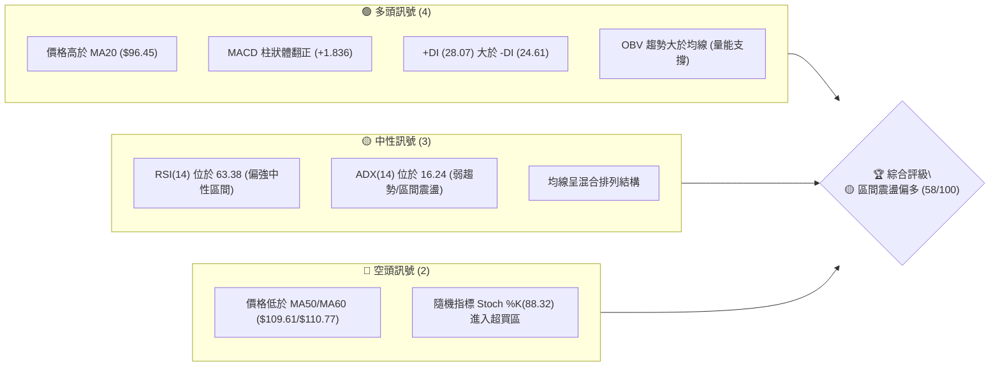
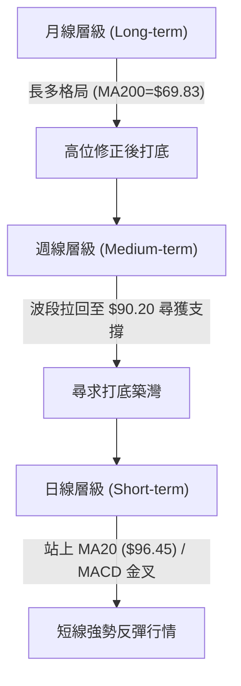
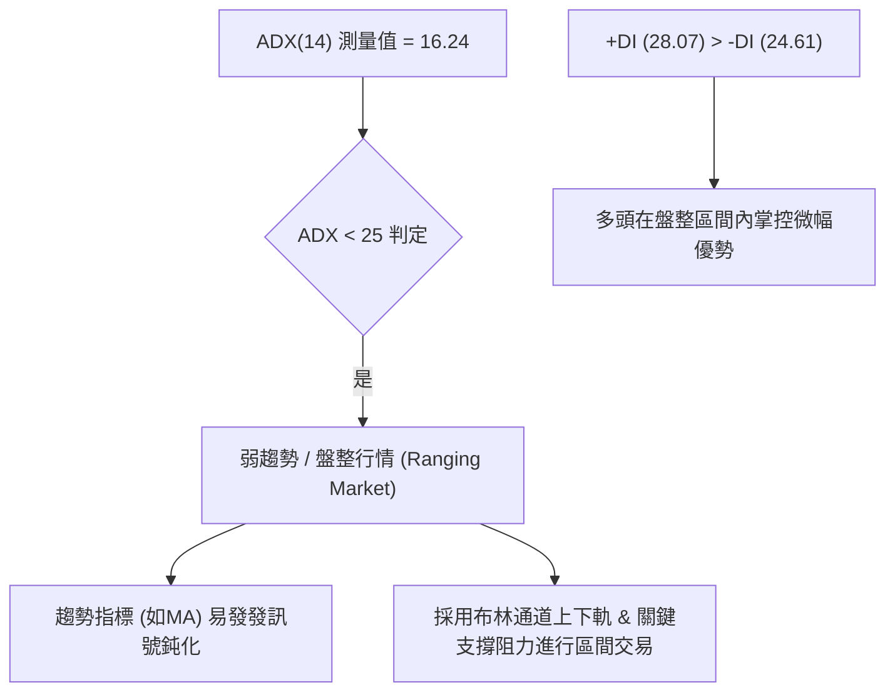
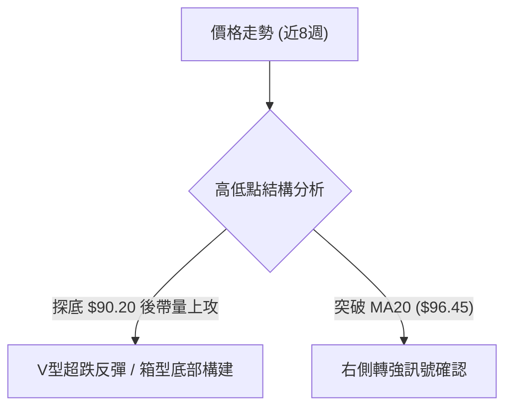
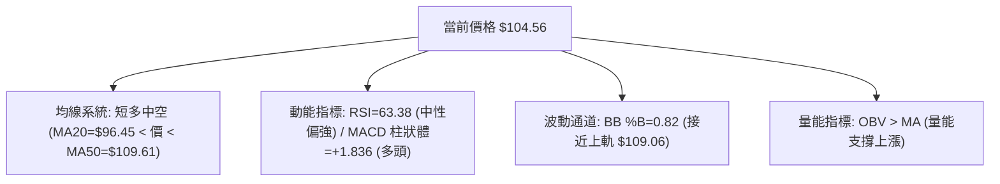
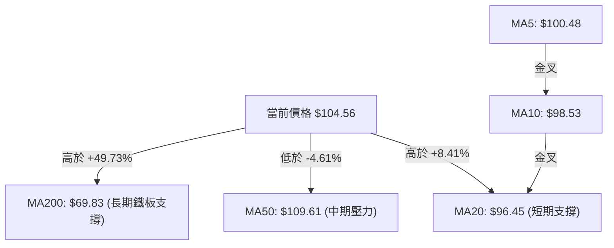
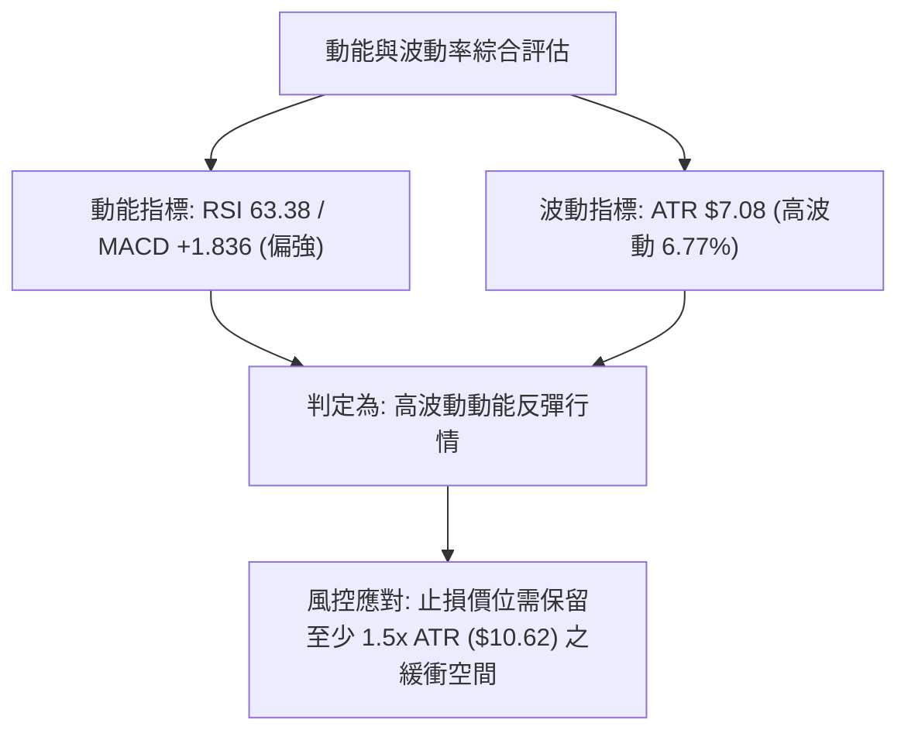
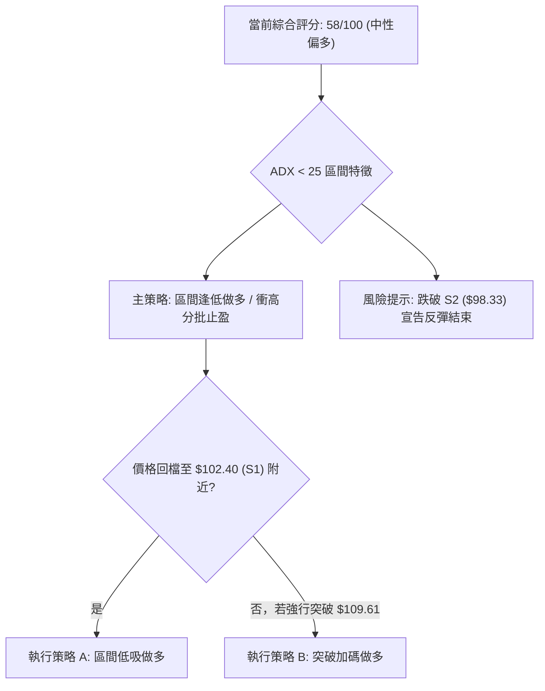
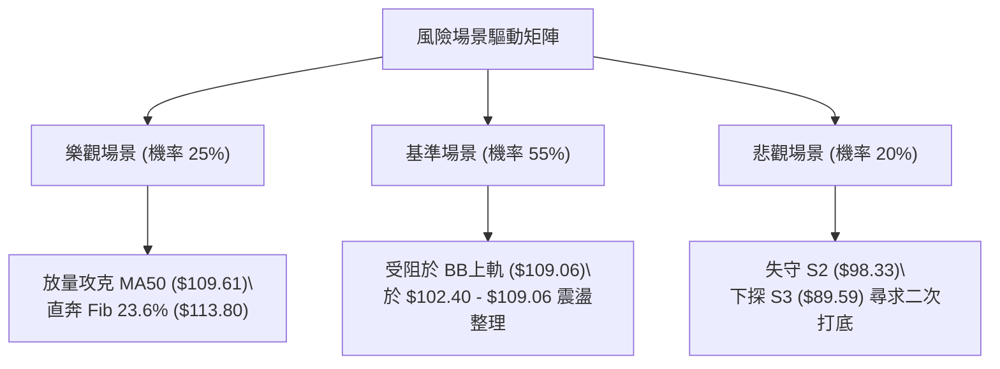

# INTC 技術分析報告

> **報告日期**：2026-08-14 ｜ **語言**：繁體中文 ｜ **數據來源**：Yahoo Finance ｜ **當前價格**：$104.56

---

## 目錄

| 章節 | 內容 |
|------|------|
| [1. 技術面概覽](#1-技術面概覽) | 訊號儀表板、核心指標、評分卡 |
| [2. 趨勢分析](#2-趨勢分析) | 多時框趨勢、長中短期走勢、ADX解讀 |
| [3. 圖表形態分析](#3-圖表形態分析) | 形態識別、信心度評估、K線組合與目標價 |
| [4. 支撐與阻力](#4-支撐與阻力) | 關鍵價位、價位結構分布圖、斐波那契回調 |
| [5. 技術指標深度解讀](#5-技術指標深度解讀) | MA/RSI/MACD/布林/成交量 |
| [6. 動能與波動率](#6-動能與波動率) | 動能評估四象限、ATR、Beta與市場相關性 |
| [7. 多時框架總結](#7-多時框架總結) | 時框架評分矩陣、多時框收斂結論 |
| [8. 交易策略建議](#8-交易策略建議) | 策略分流、價格情境階梯、主反向交易矩陣 |
| [9. 風險提示與監控](#9-風險提示與監控) | 監控指標Checklist、風險場景、風控提醒 |

---

## 1. 技術面概覽

### 🎯 技術訊號儀表板



### 📊 核心指標速覽表

| 指標類別 | 指標名稱 | 當前數值 | 訊號 | 專業解讀與市場含義 |
|----------|----------|----------|------|----------------───|
| **價格** | 當前價格 | $104.56 | 🟢 看多 | 站穩 $100 關卡，向布林上軌 ($109.06) 推進 |
| **均線** | MA20 (月線) | $96.45 | 🟢 看多 | 價格高於 MA20 (+8.41%)，短期均線呈多頭排列 |
| **均線** | MA50 (季線) | $109.61 | 🔴 看空 | 價格位於 MA50 下方 (-4.61%)，構成上方第一道均線反壓 |
| **均線** | MA200 (年線)| $69.83 | 🟢 看多 | 價格遠高於 MA200 (+49.73%)，超長期多頭趨勢未變 |
| **動能** | RSI(14) | 63.38 | 🟢 看多 | 動能偏強但未過熱 (<70)，無頂背離跡象 |
| **動能** | MACD(12,26,9)| -2.014 / +1.836 | 🟢 看多 | 柱狀體持續擴大 (+1.836)，雙線於零軸下金叉反彈 |
| **波動** | ATR(14) | $7.08 (6.77%) | 🟡 中性 | 日均波動達 $7.08，屬中高波動，交易宜放寬止損區間 |

### 🏆 技術評分卡

```
╔══════════════════════════════════════════════════════════════════╗
║                   技術評分卡 — INTC (2026-08-14)                ║
╠══════════════════════════════════════════════════════════════════╣
║ 趨勢強度      ▓▓▓▓▓▓▓▓░░░░░░░░░░░░  40/100  🟡 弱趨勢/ADX=16.24  ║
║ 動能指標      ▓▓▓▓▓▓▓▓▓▓▓▓▓░░░░░░░  65/100  🟢 MACD金叉/RSI上升 ║
║ 支撐穩定度    ▓▓▓▓▓▓▓▓▓▓▓▓▓▓░░░░░░  70/100  🟢 S1($102.40)守穩  ║
║ 成交量配合    ▓▓▓▓▓▓▓▓▓▓▓░░░░░░░░░  55/100  🟡 接近20日均量(0.93x)║
║ 形態完整度    ▓▓▓▓▓▓▓▓▓▓▓░░░░░░░░░  55/100  🟡 區間築底反彈形態  ║
║ 均線排列      ▓▓▓▓▓▓▓▓▓▓▓░░░░░░░░░  55/100  🟡 短多中空長多混合  ║
╠══════════════════════════════════════════════════════════════════╣
║ 綜合評分      ▓▓▓▓▓▓▓▓▓▓▓▓░░░░░░░░  58/100  🟡 中性偏多區間震盪  ║
╚══════════════════════════════════════════════════════════════════╝
```

---

## 2. 趨勢分析

### 🌐 多時框趨勢分析



### 📈 長期趨勢 — 12個月走勢圖（ASCII）

```
INTC 月線走勢圖（2025-08 至 2026-08）
價格軸 ($)
$140 ┤                                      ● (2026-06 $139.63)
$120 ┤                                ●
$100 ┤                                              ● (2026-08 $104.56)
 $80 ┤                          ●
 $60 ┤                    ●
 $40 ┤              ●
 $20 ┤●━━━━━━━●━━━━━●(2025-08 $24.35)               ● (2026-07 $90.20)
     └────────────────────────────────────────────────────────────►
      08  09  10  11  12  01  02  03  04  05  06  07  08  (月份)
```

#### 走勢特徵分析表

| 階段 | 時間區間 | 起始價 ➔ 終點價 | 漲跌幅 | 走勢特徵與結構說明 |
|------|----------|------------------|--------|----------------───|
| 奠基打底期 | 2024-08 ~ 2025-08 | $22.04 ➔ $24.35 | +10.48% | 於 $19.43 ~ $24.35 區間長達一年的低位盤整築底 |
| 主升段突破 | 2025-09 ~ 2026-03 | $33.55 ➔ $44.13 | +31.54% | 放量突破長期底部，突破 $40 大關建立長多主基調 |
| 拋物線狂飆 | 2026-04 ~ 2026-06 | $94.48 ➔ $139.63 | +47.79% | 爆發性脈衝行情，於 2026-06 刷出 52週高點 $142.35 |
| 劇烈拉回 | 2026-07 | $139.63 ➔ $90.20 | -35.40% | 獲利賣壓湧現，急跌至斐波那契 50% 回調位 ($81.86) 上方止跌 |
| 企穩反彈 | 2026-08 (當前) | $90.20 ➔ $104.56 | +15.92% | 週線止跌回升，連續兩週陽線攻克 $100 整數關卡 |

### 📊 中期趨勢（週線分析）

近期週線數據顯示，價格於 2026-08-02 當週探底 $90.20（接近 S3 $89.59）後強勁反彈，連續兩週上漲至當前的 $104.56。週 MACD 柱狀體由 -3.637 大幅收斂至 +1.836，RSI(14) 從超賣區的 26.9 回升至 63.4，顯示中期下行動能已徹底竭盡，正轉入箱型整理與反彈波段。

### ⚡ 趨勢強度評估（ADX 解讀）



*   **ADX(14) = 16.24**：明確小於 25，判定當前不屬於強烈單邊趨勢行情，而是**典型的區間震盪/打底反彈格局**。
*   **多空方向性**：+DI (28.07) 高於 -DI (24.61)，差值為 +3.46，顯示多頭在盤整架構中取得主導權，短線具備向上衝擊阻力區的動力。

---

## 3. 圖表形態分析

### 🔍 形態識別系統



#### 形態信心度與目標價評估表

| 形態名稱 | 信心度 | 判斷依據（引用數據） | 完成度 | 目標價計算式與精確價位 |
|----------|--------|----------------------|--------|------------------------|
| **V型超跌反彈** | 70% | 於 $90.20 築底後連收兩根長陽週線，突破 MA20 ($96.45) | 80% | 頸線 $96.45 + (頸線 $96.45 - 低點 $90.20 = $6.25) = **$102.70** (已達標) |
| **箱型震盪整理** | 65% | ADX=16.24，上受 MA50 ($109.61) 壓制，下有 S1 ($102.40) 支撐 | 60% | 採布林上軌/MA50 區間測算：**$109.06 - $109.61** |
| **雙重底 (潛在)**| 40% | 數據時間尚不足以繪製完整第二底，訊號不足 | 20% | 僅做指標型解讀，暫不推算二次突破目標價 |

### 🕯️ 重要 K 線形態分析

| 日期/週期 | 收盤價 | K 線形態 | 技術解讀 | 訊號強度 |
|-----------|--------|----------|----------|----------|
| 2026-08-02 週 | $90.20 | 長下影捶子線 | 長下影線觸及 $90.20 後強烈買盤進場，宣告短線探底完成 | 🟢 強烈看多 |
| 2026-08-09 週 | $101.65 | 大陽線 (Bullish Engulfing) | 一舉包覆前一週實體，RSI 從 39.5 跳升至 54.1，確認反轉 | 🟢 強烈看多 |
| 2026-08-16 週 | $104.56 | 溫和陽線 (當前) | 延續多頭慣性，收盤價突破 MA20 ($96.45) 並站穩 $100 整數關卡 | 🟢 穩定看多 |

### 📉 ASCII 走勢形態示意圖

```
        INTC 區間築底反彈形態示意圖
$110.00 ┤.............................. [BB上軌 $109.06 / MA50 $109.61 壓力區]
$104.56 ┤                       ▲ (現價)
$102.40 ┤...................../........ [支撐 S1 $102.40]
 $96.45 ┤.............▲....../......... [突破頸線 / MA20 $96.45]
 $90.20 ┤            ● (V型底部 $90.20)
        └─────────────────────────────────► 時間 (2026-07 ~ 2026-08)
```

### 🎯 形態目標價計算

1.  **第一階段（V型反彈基本測量）**：
    *   計算公式：頸線突破點 ($96.45) + 形態垂直高度 ($96.45 - $90.20 = $6.25) = **$102.70**（當前價格 $104.56 已順利突破達標）。
2.  **第二階段（箱型上軌延伸目標）**：
    *   計算公式：由底部 $90.20 向上前波密集套牢壓力區推算，目標指向布林通道上軌 **$109.06** 與 季線 MA50 **$109.61** 的重疊壓制帶。

---

## 4. 支撐與阻力

### 🗺️ 關鍵價位分布圖（ASCII）

```
                     INTC 價位結構分布圖
═══════════════════════════════════════════════════════════════════
$142.35 ║████████████████████████████████████████║ 52W 高點 (0.0% Fib)
$141.90 ║██████████████████████████████████████  ║ 強阻力 R3
$132.75 ║██████████████████████████              ║ 阻力 R2
$126.64 ║████████████████████                    ║ 阻力 R1
$113.80 ║░░░░░░░░░░░░░░░░░░░░░░░░░░░░░░░░░░░░░░░░║ 23.6% 斐波那契回調位
$109.61 ║▓▓▓▓▓▓▓▓▓▓▓▓▓▓▓▓▓▓▓▓                    ║ MA50 / BB上軌($109.06) 重疊壓力
$104.56 ╠════════════════════════════════════════╣ ◄ 當前價格 ($104.56)
$102.40 ║▓▓▓▓▓▓▓▓▓▓▓▓▓▓▓▓                        ║ 關鍵支撐 S1
 $98.33 ║████████████████████                    ║ 支撐 S2 / MA10 ($98.53)
 $96.13 ║░░░░░░░░░░░░░░░░░░░░░░░░░░░░░░░░░░░░░░░░║ 38.2% 斐波那契回調位 / MA20 ($96.45)
 $89.59 ║████████████████████████████            ║ 強支撐 S3
 $81.86 ║░░░░░░░░░░░░░░░░░░░░░░░░░░░░░░░░░░░░░░░░║ 50.0% 斐波那契回調位
$21.36  ║████████████████████████████████████████║ 52W 低點 (100.0% Fib)
═══════════════════════════════════════════════════════════════════
```

### 🚧 阻力位分析表

| 阻力級別 | 價位 | 形成原因與數據來源 | 突破難度 | 技術面重要性 |
|----------|------|--------------------|----------|--------------|
| **均線反壓**| **$109.61**| MA50 ($109.61) 與 BB上軌 ($109.06) 重疊 | 🟡 中等 | 中期多空分水嶺，突破將告別區間盤整 |
| **R1** | **$126.64**| 近一年波段高點聚類算術平均 | 🔴 極高 | 波段解套解套賣壓密集區 |
| **R2** | **$132.75**| 近一年波段次高點聚類 | 🔴 極高 | 挑戰 52週高點前的前哨站 |
| **R3** | **$141.90**| 近一年波段最高反壓區間 | 🔴 極高 | 靠近 52W 高點 $142.35 之終極阻力 |

### 🛡️ 支撐位分析表

| 支撐級別 | 價位 | 形成原因與數據來源 | 守住機率 | 技術面重要性 |
|----------|------|--------------------|----------|--------------|
| **S1** | **$102.40**| 近一年波段低點聚類 (短線防守點) | 🟢 很高 | 短線多頭防線，跌破則反彈動能熄火 |
| **S2** | **$98.33** | 波段低點聚類，接近 MA10 ($98.53) | 🟢 高 | 中短期強支撐，支撐區間強韌 |
| **S3** | **$89.59** | 波段低點聚類，接近 2026-08 低點 $90.20| 🟡 中等 | 多頭波段底線，失守將面臨深度回檔 |

### 📐 斐波那契回調位分析

依據 52 週區間最高點 **$142.35** 至最低點 **$21.36** 計算：

*   **0.0% (52W High)**: $142.35
*   **23.6% 回調位**: **$113.80**
*   **38.2% 回調位**: **$96.13**
*   **50.0% 回調位**: **$81.86**
*   **61.8% 回調位**: **$67.58**
*   **78.6% 回調位**: **$47.25**
*   **100.0% (52W Low)**: $21.36

**當前價格位置分析**：
當前價格 **$104.56** 精確落於 **38.2% ($96.13)** 與 **23.6% ($113.80)** 回調位之間。價格已成功收復 38.2% ($96.13) 關鍵防線，顯示先前的劇烈回檔（由 $139.63 跌至 $90.20）已於 50% 回調位 ($81.86) 上方獲得支撐。目前價格正在向上方 23.6% ($113.80) 回調位進行技術性修復。

---

## 5. 技術指標深度解讀

### 🎛️ 指標訊號總覽



### 📈 移動平均線排列分析



*   **短期均線 (MA5, MA10, MA20)**：MA5 ($100.48) > MA10 ($98.53) > MA20 ($96.45)，短期呈現標準多頭排列，股價站上所有短期均線，短線多頭掌控局勢。
*   **中期均線 (MA50, MA60, MA120)**：MA50 ($109.61) 與 MA60 ($110.77) 彎頭向下，位在價格上方，形成中期壓制帶。
*   **長期均線 (MA200, MA240)**：MA200 ($69.83) 與 MA240 ($63.50) 強勢上揚，遠低於當前價格，確立長線牛市架構未被破壞。

### 📉 RSI(14) 分析

*   **當前數值**：**63.38**
    `▓▓▓▓▓▓▓▓▓▓▓▓▓▓▓▓▓▓▓▓▓▓▓▓█░░░░░░░░░░░░░░░ 63.38%`
*   **區間判定**：位於 50–70 偏強多頭區間，尚未進入 >70 之極端超買區，顯示多頭推升仍有動能空間。
*   **背離分析**：價格從 2026-08-02 的 $90.20 升至 $104.56，RSI 同步由 39.5 回升至 63.4，**無頂背離亦無底背離**，量價與動能呈健康同步關係。

### 📊 MACD(12,26,9) 訊號解讀

*   **MACD 快線**：-2.014
*   **Signal 慢線**：-3.850
*   **MACD 柱狀圖**：**+1.836** 🟢（看多）
*   **解讀**：MACD 快線在零軸下方穿越慢線形成**「水下金叉」**，柱狀圖連續兩週期呈綠色擴展 (+1.836)，這是典型的超跌反彈且動能加速訊號，預示短線價格將繼續向上尋求均線扣抵。

### 📦 布林通道分析

```
布林通道現況 ($83.84 - $109.06)
$109.06 ┤──────────────────────── Alignment: Upper Band (上軌壓力)
$104.56 ┤              ● (現價 $104.56, %B = 0.82)
 $96.45 ┤──────────────────────── Alignment: Middle Band (MA20 中軌支撐)
 $83.84 ┤──────────────────────── Alignment: Lower Band (下軌)
```

*   **通道寬度與 %B**：%B 數值為 **0.82**，表明價格已運行至通道中上軌區域，直逼上軌 **$109.06**。由于 ADX 僅 16.24，布林上軌 $109.06 將提供強烈的均值回歸阻力。

### 💹 成交量分析（量價配合度）

*   **最新成交量**：111,938,635 股
*   **20日均量**：120,624,987 股 (量比 **0.93x**)
*   **OBV 趨勢**：OBV 指標高於其移動平均線，且成交量隨價格回升而溫和放大。雖非爆發性巨量，但屬於溫和換手升勢，未出現逢高大量出貨的異常跡象。

---

## 6. 動能與波動率

### ⚡ 動能評估象限

| 象限分佈 | 動能強度 (Momentum) | 波動率 (Volatility) | 當前狀態評估 | 交易戰術建議 |
|----------|---------------------|---------------------|--------------|--------------|
| Q1 象限 | 強 (>50) | 低 (<5%) | — | 穩定趨勢持股 |
| **Q2 象限 (當前)** | **強 (RSI 63.38)** | **高 (ATR 6.77%)** | **✓ 高波動反彈階段** | **縮減倉位、放大止損** |
| Q3 象限 | 弱 (<50) | 高 (>5%) | — | 高風險避開 |
| Q4 象限 | 弱 (<50) | 低 (<5%) | — | 沉悶盤整觀望 |



### 📊 ATR 波動率分析

*   **ATR(14)**：**$7.08**（占股價 **6.77%**）
*   **市場含義**：INTC 當前每日平均波幅高達 $7.08，屬於典型的高 Beta 波動股票。
*   **止損距離建議**：
    *   **緊密止損 (1.0x ATR)**：$7.08 ➔ 距進場點約 6.77%
    *   **標準止損 (1.5x ATR)**：$10.62 ➔ 距進場點約 10.16%
    *   **寬鬆止損 (2.0x ATR)**：$14.16 ➔ 距進場點約 13.54%

### 📐 Beta 與市場相關性

*   **Beta 係數**：**2.241**
*   **解讀**：Beta 高達 2.241，意味著 INTC 的波動幅度約為整體大盤（S&P 500）的 2.24 倍。在大盤上漲時具備強烈放大收益能力，但若大盤拉回，其下行風險亦顯著高於平均。

---

## 7. 多時框架總結

### 📋 時框架評分表

| 時框架 | 趨勢方向 | 動能狀態 | 均線排列 | 形態結構 | 綜合評分 | 戰術建議 |
|--------|----------|----------|----------|----------|----------|----------|
| **日線 (Short)** | 🟢 向上反彈 | 🟢 MACD金叉/超買 | 🟢 短期多頭 | V型超跌反彈 | **68/100** | 順勢尋求低吸/衝高止盈 |
| **週線 (Medium)**| 🟡 區間打底 | 🟡 RSI 54.1 轉強 | 🟡 壓制於MA50 | 箱型下軌反彈 | **55/100** | 區間操作，阻力位減碼 |
| **月線 (Long)**  | 🟢 長期看多 | 🟢 多頭架構維持 | 🟢 遠高於MA200| 拋物線後拉回 | **62/100** | 長線多頭回檔築底 |

### 🔲 綜合訊號矩陣

```
時框架訊號收斂矩陣:
短期 (日線) ─────────► [ 🟢 看多 ] ─┐
中期 (週線) ─────────► [ 🟡 中性 ] ─┼──► 最終結論: 🟡 中性偏多區間操作
長期 (月線) ─────────► [ 🟢 看多 ] ─┘    主導框架: 日線向上衝擊週線阻力
```

### ⚖️ 多時框收斂結論

依據多時框收斂規則：當前 **ADX(14) = 16.24 (< 25)**，嚴格判定為**盤整/區間行情**。
因此，本報告收斂結論以**布林通道上下軌 ($83.84 ~ $109.06)** 與 **均線區間 (MA20 $96.45 ~ MA50 $109.61)** 作為主要交易框架。日線的短線多頭動能（MACD 金叉、RSI 63.38）驅動價格自底部向上擴展，但受限於中期 ADX 弱趨勢特徵，價格衝高至 MA50 ($109.61) 及布林上軌 ($109.06) 附近時將面臨強烈壓制。

---

## 8. 交易策略建議

### 🗺️ 策略決策流程圖



### 🧭 策略路由

*   **當前主策略方向**：**區間逢低做多 (主推多頭策略，評分 58/100)**
*   **策略戰術定位**：基於 ADX<25 盤整行情與日線短多動能，以 **S1 ($102.40) - MA20 ($96.45)** 作為防守基石，目標看至 **布林上軌 ($109.06) - MA50 ($109.61)** 及 **23.6% 回調位 ($113.80)**。

### 🎯 價格情境階梯 (Price Scenarios)

| 觸發條件 | 下一目標價 | 後續延伸目標 | 情境技術含義 |
|----------|------------|--------------|--------------|
| **突破 MA50 ($109.61)** | **$113.80** (Fib 23.6%) | **$126.64** (R1) | 中期盤整結束，重啟主升段 |
| **站穩現價區間 ($102.40-$109.06)**| **$109.06** (BB上軌) | **$109.61** (MA50) | 保持強勢區間震盪推升 |
| **跌破 S1 ($102.40)** | **$98.33** (S2/MA10) | **$96.13** (Fib 38.2%/MA20) | 短線反彈受阻，回測月線支撐 |
| **跌破 S2 ($98.33)** | **$89.59** (S3) | **$81.86** (Fib 50.0%) | 區間打底失敗，二次探底 |

### 📊 情境機率分佈

| 情境劇本 | 估計機率 | 主要技術依據 |
|----------|----------|--------------|
| **1. 向上衝擊 MA50 / 布林上軌** | **55%** | MACD 柱狀圖翻正 (+1.836)，+DI 大於 -DI，短期均線多頭排列 |
| **2. $102.40 - $109.06 橫盤震盪** | **30%** | ADX(14) = 16.24 顯示趨勢極弱，成交量未見顯著爆發 |
| **3. 回落跌破 $98.33 再探底** | **15%** | 隨機指標 Stoch %K(88.32) 高位超買，大盤 Beta(2.241) 波動風險 |

### 🟢 主策略詳情

#### 策略 A：區間低吸 / 現價順勢多單（主推）

*   **進場條件**：現價 $104.56 附近或回檔至 S1 ($102.40) 企穩時分批佈局。
*   **進場價格**：**$103.50 - $104.56**
*   **目標價 T1**：**$109.06**（布林通道上軌 / MA50 壓制區，預期報酬 +4.30% ~ +5.37%）
*   **目標價 T2**：**$113.80**（斐波那契 23.6% 回調位，預期報酬 +8.84% ~ +9.95%）
*   **止損價格**：**$98.33**（跌破 S2 支撐位與 MA10 即嚴格止損）
*   **風險報酬比 (R/R Ratio)**：
    *   以進場價 $104.56、止損 $98.33（每股風險 $6.23）計算：
    *   至 T1 ($109.06) 之風報比 = $4.50 / $6.23 = **0.72 : 1**（短線部分獲利落袋）
    *   至 T2 ($113.80) 之風報比 = $9.24 / $6.23 = **1.48 : 1**
    *   若延伸至 R1 ($126.64) 之風報比 = $22.08 / $6.23 = **3.54 : 1**
*   **建議倉位**：15% - 20% 總資金

#### 策略 B：突破 MA50 確認加碼單（次選）

*   **進場條件**：日線收盤價強勢突破並站穩 MA50 ($109.61) 且成交量大於 20日均量 (1.2x 以上)。
*   **進場價格**：**$110.00**
*   **目標價 T1**：**$113.80** (Fib 23.6%)
*   **目標價 T2**：**$126.64** (R1 壓力區)
*   **止損價格**：**$104.56** (前波突破點轉支撐)
*   **風險報酬比**：至 T2 風報比 = ($126.64 - $110.00) / ($110.00 - $104.56) = $16.64 / $5.44 = **3.06 : 1**
*   **建議倉位**：10% - 15% 總資金

### 🔴 反向風險觸發點（對沖與避險提示）

*   **反轉觸發條件**：若價格無力突破 $109.06 且日線出現長上影線，隨後跌破 **$98.33 (S2)**。
*   **避險處置**：多單全面離場，保守交易者可於跌破 $98.33 後建立少量對沖空單，目標下看 **$89.59 (S3)**，止損設於 **$102.40**。

### ⭐ 整體訊號強度評星

```
做多訊號強度：★★★☆☆  (3.5/5 星) — 短期動能強勁，惟受限中期 MA50 壓力
做空訊號強度：★★☆☆☆  (2.0/5 星) — MACD 金叉且 OBV 支撐，作空勝率偏低
整體可信度：  ★★██☆  (4.0/5 星) — 多指標互相印證，ADX 確立區間格局
```

---

## 9. 風險提示與監控

### ✅ 關鍵監控指標 Checklist

```
╔══════════════════════════════════════════════════════════════════╗
║                    每日/每週技術面監控 Check List                ║
╠══════════════════════════════════════════════════════════════════╣
║ [ ] 價格是否站穩 S1 ($102.40) 關鍵支撐區間？                      ║
║ [ ] 價格衝擊 MA50 ($109.61) 時，成交量是否放量突破 1.2億股？       ║
║ [ ] RSI(14) 是否突破 70 進入超買，或出現高位死叉背離訊號？        ║
║ [ ] MACD 柱狀體 (+1.836) 是否持續擴大（綠柱增長）？               ║
║ [ ] ADX(16.24) 是否開始向上攀升突破 25（預示強趨勢啟動）？        ║
║ [ ] Stoch %K(88.32) 是否自超買區高位死叉下貫 %D(82.35)？         ║
╚══════════════════════════════════════════════════════════════════╝
```

### ⚠️ 風險場景分析



### 🛡️ 風險管理重要提醒

1.  **高 Beta 與高 ATR 防禦**：INTC 當前 Beta 為 **2.241**，ATR 為 **$7.08 (6.77%)**。個股單日波動極劇烈，**嚴禁高倍槓桿操作**，單筆交易虧損額度應嚴格控制在總資金的 **1.5% - 2.0%** 以內。
2.  **區間操作紀律**：在 ADX < 25 的環境下，切忌在接近布林上軌 ($109.06) 處盲目追高，應等待回檔至 S1 ($102.40) 附近建立頭寸，或等候明確突破 MA50 ($109.61) 之訊號。
3.  **指標矛盾處理**：Stoch %K 已達 88.32 超買，但 MACD 柱狀圖仍強勢擴展。此狀況顯示短線過熱但衝力未竭，可採「移動止盈 (Trailing Stop)」逐步鎖定獲利，止盈位可隨 MA5 ($100.48) 每日上移。

---

## 📋 報告總結

```
╔══════════════════════════════════════════════════════════════════╗
║                   INTC 技術分析報告總結                          ║
════════════════════════════════════════════════════════════════════
報告日期：2026-08-14
當前價格：$104.56
分析評級：🟡 中性偏多區間反彈 (綜合評分: 58/100)

關鍵結論：
├─ 長期趨勢：🟢 偏多 (遠高於 MA200 $69.83，牛市基調完好)
├─ 中期趨勢：🟡 盤整 (探底 $90.20 反彈，受制於 MA50 $109.61)
├─ 短期趨勢：🟢 看多 (站上 MA20 $96.45，MACD 金叉呈強勢)
├─ 關鍵支撐：S1 $102.40 / S2 $98.33 / S3 $89.59
├─ 關鍵阻力：MA50 $109.61 / Fib 23.6% $113.80 / R1 $126.64
└─ 分析師共識目標：$114.05 (極限高點: $200.00 / 低點: $74.00)

最優策略組合：
1. 🥇 最佳機會：現價/回檔 $103.50-$104.56 分批低吸，目標 $109.06 / $113.80，止損 $98.33。
2. 🥈 次選機會：靜待強勢突破 MA50 ($109.61) 後追價加碼，目標看至 R1 $126.64。
3. 🥉 保守選擇：等待價格拉回至 MA20 ($96.45) 附近且 ADX 出現止跌勾起時再行入場。
════════════════════════════════════════════════════════════════════
```

---

> ⚠️ **免責聲明**：本報告為 AI 自動生成之技術分析，所有數據及估算均基於提供的歷史價格資訊。本報告**僅供研究與學術參考**，**不構成任何投資建議**。投資有風險，入市需謹慎。

---

*報告生成時間：2026-08-14 ｜ 數據來源：Yahoo Finance ｜ 分析框架：多時框技術分析*