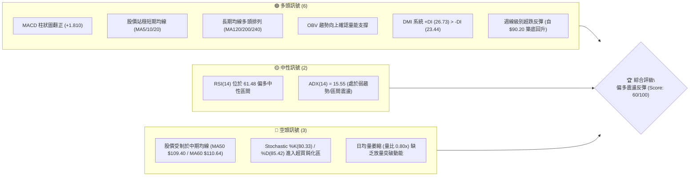
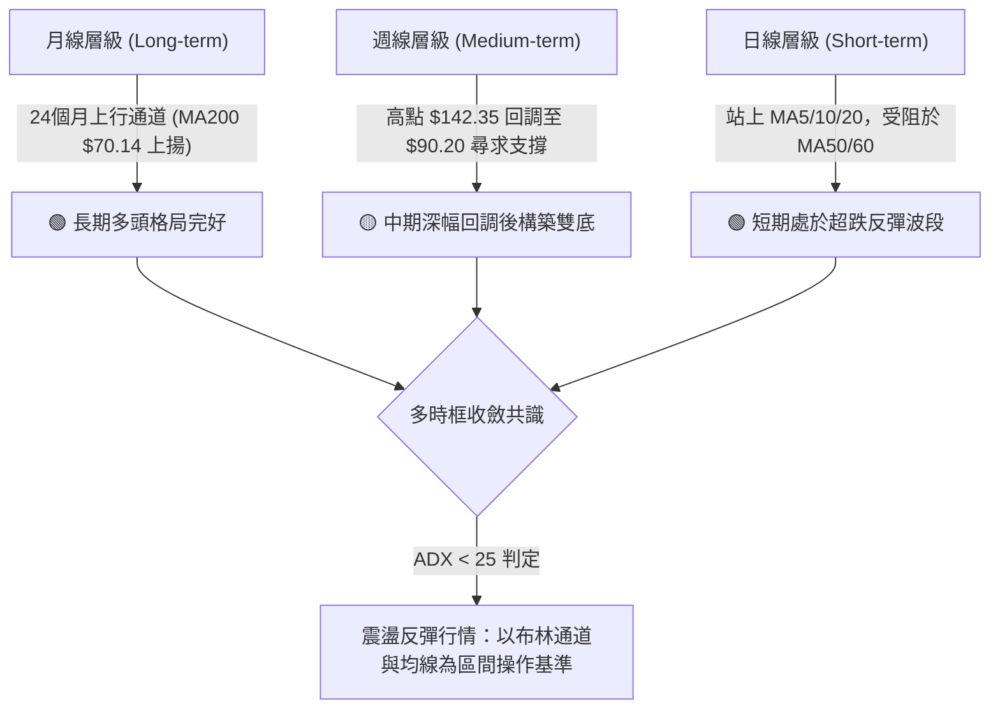
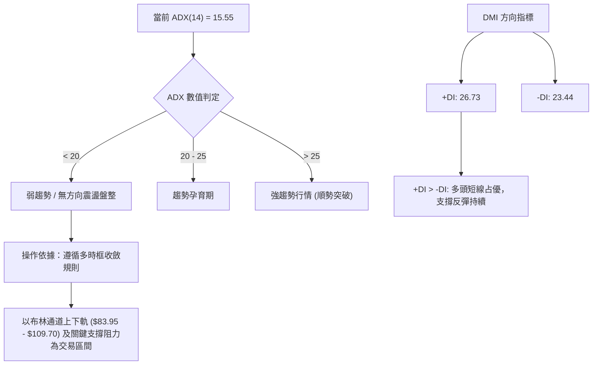
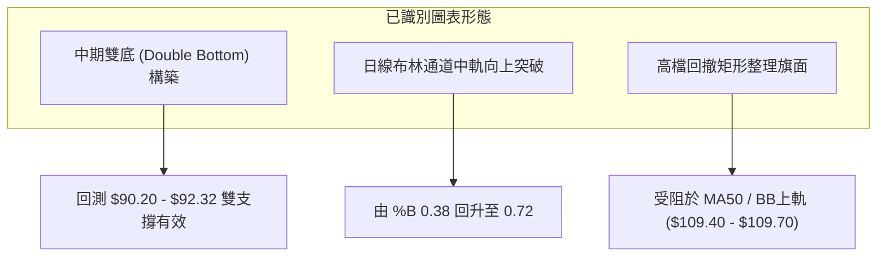
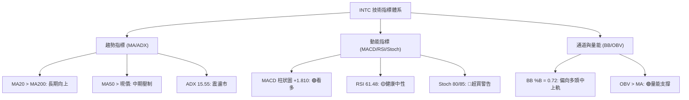
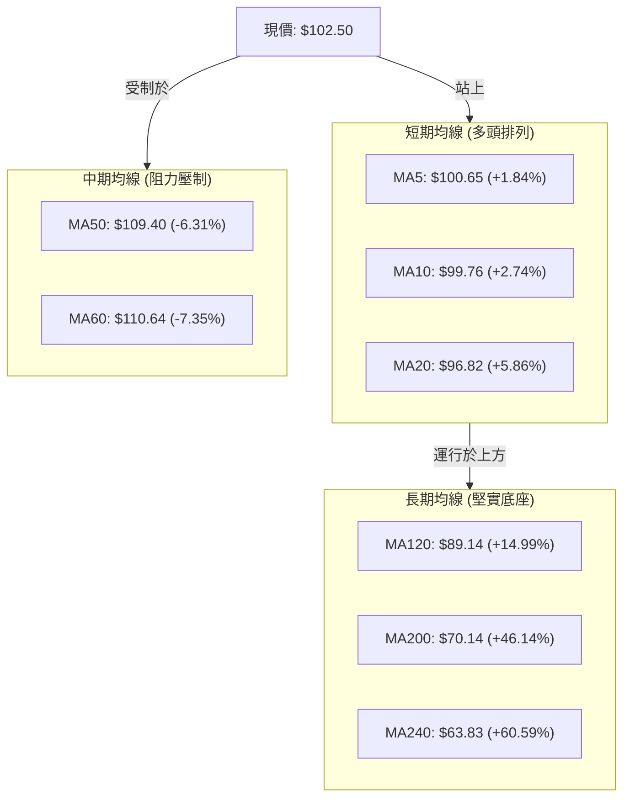
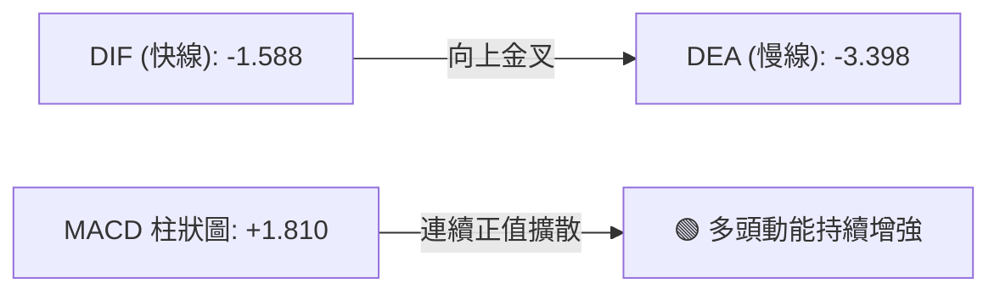
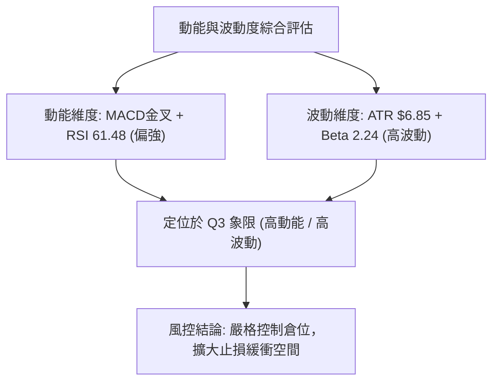
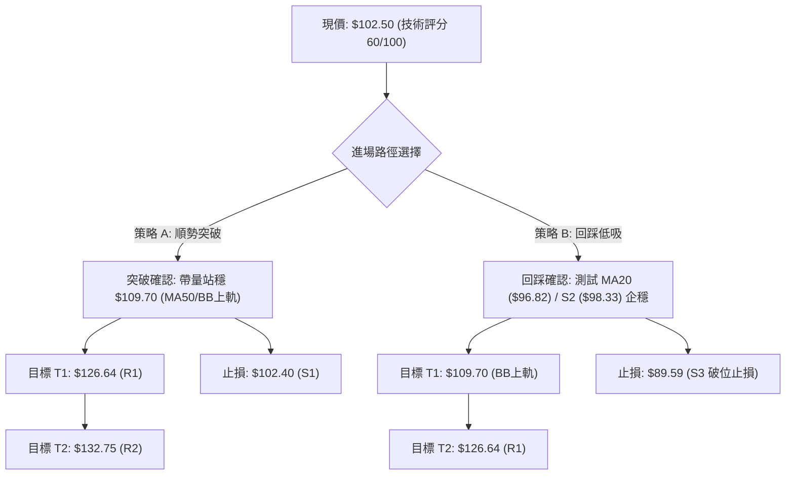
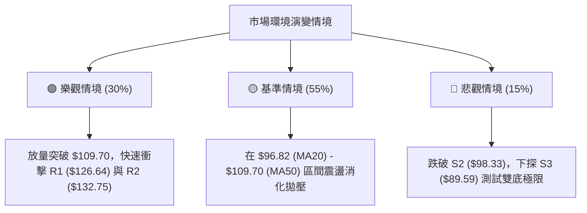

# INTC 技術分析報告

> **報告日期**：2026-08-16 ｜ **語言**：繁體中文 ｜ **數據來源**：Yahoo Finance ｜ **當前價格**：$102.50

---

## 目錄

| 章節 | 內容 |
|------|------|
| [1. 技術面概覽](#1-技術面概覽) | 訊號儀表板、核心指標、評分卡 |
| [2. 趨勢分析](#2-趨勢分析) | 多時框趨勢、長中短期走勢 |
| [3. 圖表形態分析](#3-圖表形態分析) | 形態識別、K線組合、目標價 |
| [4. 支撐與阻力](#4-支撐與阻力) | 關鍵價位、斐波那契回調 |
| [5. 技術指標深度解讀](#5-技術指標深度解讀) | MA/RSI/MACD/布林/成交量 |
| [6. 動能與波動率](#6-動能與波動率) | 動能評估、ATR、Beta |
| [7. 多時框架總結](#7-多時框架總結) | 時框架評分矩陣 |
| [8. 交易策略建議](#8-交易策略建議) | 多空策略、風險報酬比 |
| [9. 風險提示與監控](#9-風險提示與監控) | 監控指標、風險場景 |

---

## 1. 技術面概覽

### 🎯 技術訊號儀表板



---

### 📊 核心指標速覽表

| 指標類別 | 指標名稱 | 當前數值 | 訊號 | 解讀 |
|:---|:---|:---|:---:|:---|
| **價格** | 當前價格 | $102.50 | 🟢 | 自 7 月低點 $90.20 強勁反彈，站穩百元整數關卡 |
| **均線** | MA20 (布林中軌) | $96.82 | 🟢 | 現價高於 MA20 達 +5.86%，短期多頭掌控主導權 |
| **均線** | MA50 | $109.40 | 🔴 | 現價低於 MA50 約 -6.31%，上方中期解套賣壓沈重 |
| **均線** | MA200 | $70.14 | 🟢 | 現價大幅高於年線 +46.14%，長期多頭格局完好 |
| **動能** | RSI(14) | 61.48 | 🟡 | 脫離超賣區回升至偏多區，未見頂背離，動能健康 |
| **動能** | MACD (12/26/9) | 柱狀圖 +1.810 | 🟢 | DIF (-1.588) 向上穿越 DEA (-3.398) 黃金交叉擴散 |
| **隨機動能** | Stochastic (%K/%D) | 80.33 / 85.42 | 🔴 | 短線進入高檔超買區，需慎防回踩確認支撐 |
| **趨勢強度** | ADX(14) | 15.55 | 🟡 | 數值低於 25，顯示當前為弱趨勢反彈與震盪修復行情 |
| **通道狀態** | Bollinger Bands %B | 0.72 | 🟢 | 位於中軌 ($96.82) 與上軌 ($109.70) 之間，偏多推進 |
| **量能** | 20日均量比 | 0.80x | 🟡 | 成交量 95.10M 略低於 20 日均量 119.29M，呈現縮量反彈 |
| **波動** | ATR(14) | $6.85 (6.68%) | 🔴 | 日內波動幅度較大，持倉需嚴格設置止損區間 |

---

### 🏆 技術評分卡

```
╔══════════════════════════════════════════════════════════════╗
║                技術評分卡 — INTC (2026-08-16)                 ║
╠══════════════════════════════════════════════════════════════╣
║ 趨勢強度 (Trend)     ██████████░░░░░░░░░░  52/100  🟡 中性震盪 ║
║ 動能指標 (Momentum)  ██████████████░░░░░░  68/100  🟢 動能轉強 ║
║ 支撐穩定度 (Support) ██████████████░░░░░░  70/100  🟢 底部紮實 ║
║ 成交量配合 (Volume)  ████████████░░░░░░░░  58/100  🟡 縮量反彈 ║
║ 形態完整度 (Pattern) ████████████░░░░░░░░  60/100  🟢 雙底築底 ║
║ 均線排列 (MA System) ███████████░░░░░░░░░  55/100  🟡 混合排列 ║
╠══════════════════════════════════════════════════════════════╣
║ 綜合評分             ████████████░░░░░░░░  60/100  🟢 偏多反彈 ║
╚══════════════════════════════════════════════════════════════╝
```

---

## 2. 趨勢分析

### 🌐 多時框趨勢分析



---

### 📈 長期趨勢 — 12 個月走勢圖（Unicode）

```
INTC 月線走勢圖（2025-08 至 2026-08）
價格軸 ($)
$140 ┤                                          ● 2026-06 ($139.63, 52W High $142.35)
$130 ┤                                         ╱ ╲
$120 ┤                                        ╱   ╲
$110 ┤                                  ● 05 ╱     ╲
$100 ┤                                 ╱            ╲       ● 2026-08 ($102.50 現價)
$90  ┤                           ● 04 ╱              ● 07 ─╱ ($90.20 低點支撐)
$80  ┤                          ╱
$70  ┤                         ╱
$60  ┤                        ╱
$50  ┤                 ● 01  ╱
$40  ┤          ● 10 ─● 11 ╲╱ 02-03 ($44.13)
$30  ┤   ● 09  ╱
$20  ┤● 08 ($24.35)
     └─────────────────────────────────────────────────────────────
       08   09   10   11   12   01   02   03   04   05   06   07   08 (月份)
      2025                                  2026
```

#### 走勢特徵分析表格

| 階段區間 | 起止價格 | 漲跌幅 | 趨勢特徵與技術解讀 |
|:---|:---:|:---:|:---|
| **初升築底期** (2025.08 - 2025.11) | $24.35 → $40.56 | +66.57% | 放量脫離 $20 歷史底部區，長期均線開始扭轉向上。 |
| **平台整理期** (2025.12 - 2026.03) | $36.90 → $44.13 | +19.59% | 於 $36 - $46 區間強勢洗盤，消化前期獲利籌碼。 |
| **主升浪爆發** (2026.04 - 2026.06) | $44.13 → $139.63 | +216.41% | 呈現拋物線式噴發，創下 52 週新高 $142.35。 |
| **劇烈回撤期** (2026.06 - 2026.07) | $139.63 → $90.20 | -35.40% | 獲利盤湧出，連續下挫測試斐波那契 50% ($82.13) 上方支撐。 |
| **修復反彈期** (2026.08 至今) | $90.20 → $102.50 | +13.64% | 於 S3 ($89.59) 附近探底回升，重返 $100 整數心理關卡。 |

---

### 📊 中期趨勢（週線分析）

```
週線級別關鍵結構示意圖
$142.35 ═══════════════════════════════════ 52W 最高點 (強阻力頂部)
           ╲
            ╲  [下行回調浪]
             ╲
$109.70 ─────── [BB上軌 / MA50 阻力帶] ───── 中期強弱分水嶺
                 ▲
$102.50 ─────────┼───────────────────────── 當前價格 (突破頸線測試)
                 │  [反彈修復浪]
$90.20  ═════════╧═════════════════════════ 週線雙底支撐帶 ($90.20 - $92.32)
```

近 20 週數據顯示，INTC 在 2026-05-10 週創下 $124.92 高收盤價（當週 RSI 達 88.4 極端超買），隨後在 6 月下旬摸頂 $133.99 後展開回調。7 月底連續回測至 2026-07-26 週的 $92.32 與 2026-08-02 週的 $90.20（RSI 觸及 26.9 超賣區）。最近兩週（08-09 與 08-16）連續收出大陽線，週成交量由 461M 擴大至 639M，週線 RSI 強勢回升至 61.5，確認中期超跌反彈確立。

---

### ⚡ 趨勢強度評估（ADX 解讀）



#### ADX 趨勢強度指標對照表

| 指標變量 | 實際數值 | 參考閾值 | 市場狀態解讀 |
|:---|:---:|:---:|:---|
| **ADX(14)** | **15.55** | < 25 (弱) | 行情處於主升浪結束後的震盪修復期，缺乏單邊趨勢強度。 |
| **+DI (多頭動能)** | **26.73** | > 20 | 買方動能自低檔顯著復甦，掌控短線節奏。 |
| **-DI (空頭動能)** | **23.44** | < +DI | 賣方殺跌力量明顯衰竭，空頭動能減退。 |
| **綜合判定** | **弱勢反彈震盪** | — | **不宜追高單邊單，應採取回踩支撐低吸、逢阻力高拋策略。** |

---

## 3. 圖表形態分析

### 🔍 形態識別系統



#### 形態信心度評估表

| 形態名稱 | 信心度 | 判斷依據（引用實際數據） | 完成度 | 目標價（附嚴格計算式） |
|:---|:---:|:---|:---:|:---|
| **週線雙底形態** | **75%** | 兩次低點分別為 2026-07-26 週收盤 $92.32 與 2026-08-02 週收盤 $90.20，在 S3 ($89.59) 上方獲得強力支撐。 | 85% | 頸線為 2026-07-12 高點 $109.84。<br>形態高度 = $109.84 - $90.20 = $19.64。<br>突破目標價 = $109.84 + $19.64 = **$129.48**（接近 R1 $126.64 / R2 $132.75 聚類區）。 |
| **布林通道向上突破** | **70%** | 現價 $102.50 成功突破布林中軌 MA20 ($96.82)，%B 達到 0.72。 | 80% | 第一目標為布林上軌 **$109.70**。 |
| **頭肩底潛在形態** | **40%** | *訊號不足，僅做指標型解讀*（左肩及頸線定義尚不明確，ADX<25 不支持大型反轉推論）。 | 30% | 暫不予計算理論目標價。 |

---

### 🕯️ 重要 K 線形態分析

| 週期/月份 | 收盤價 | K 線組合形態 | 技術解讀 | 訊號 |
|:---|:---:|:---|:---|:---:|
| **2026-06** | $139.63 | 長上影流星線 (High $142.35) | 多頭極限衝高受阻，主力資金高檔減磅，形成頂部預警。 | 🔴 |
| **2026-07** | $90.20 | 長下影大陰線 | 恐慌盤宣洩，低檔承接買盤在 $90 關卡浮現。 | 🟡 |
| **2026-08 (W1)** | $101.65 | 大陽線吞噬 (Bullish Engulfing) | 週線級別收復前兩週跌幅，確認短期底部成立。 | 🟢 |
| **2026-08 (W2)** | $102.50 | 實體陽線溫和放量 | 股價站穩 $102.40 (S1 支撐位)，多頭持續推進。 | 🟢 |

---

### 📉 ASCII 走勢形態示意圖

```
週線級別雙底 (W-Bottom) 結構演變圖
$133.99 ─┐
         │ (下跌A浪)
         ▼
$109.84 ─── 頸線阻力 (Neckline Resistance) ───────────────────────
           ╲                                       ▲
            ╲           ┌── 雙底中樞反彈 ──┐       │ [預期突破測試]
             ╲         ╱                    ╲     ╱
              ▼       ╱                      ▼   ╱
$90.20 ════════ 底1 ($92.32) ══════════════ 底2 ($90.20) ═══════ (強力雙底基底)
               (2026-07-26)                 (2026-08-02)
```

---

### 🎯 形態目標價計算

依據標準幾何形態測量規則：
1. **雙底基礎高度 ($H$)**：
   $$H = \text{頸線價格} - \text{雙底最低價} = \$109.84 - \$90.20 = \$19.64$$
2. **保守最小量度目標價 ($T_1$)**：
   $$T_1 = \text{頸線價格} + H = \$109.84 + \$19.64 = \$129.48$$
   *(該目標價精確落於數據提供之阻力位 R1 \$126.64 與 R2 \$132.75 之間)*。
3. **斐波那契擴展目標價 ($T_2$)**：
   以回調低點 $90.20 測算 0.618 斐波那契反彈位對應至 **$122.41**，上方強阻力位對應 R3 **$141.90**。

---

## 4. 支撐與阻力

### 🗺️ 關鍵價位分布圖（Unicode）

```
INTC 價位結構分布圖
═══════════════════════════════════════════════════════════════════
$142.35 ║██████████████████████████████║ 52週歷史高點 (52W High)
$141.90 ║████████████████████████████  ║ 強阻力 R3 (+38.44%)
$132.75 ║████████████████████          ║ 阻力 R2 (+29.51%)
$126.64 ║████████████████████████      ║ 關鍵阻力 R1 (+23.55%)
$113.92 ║▓▓▓▓▓▓▓▓▓▓▓▓▓▓▓▓▓▓            ║ 斐波那契 23.6% 回調位
$109.70 ║████████████                  ║ 布林上軌 / MA50 ($109.40) 阻力帶
───────────────────────────────────────────────────────────────────
$102.50 ╠══════════════════════════════╣ ◄ 現價 (Current Price)
───────────────────────────────────────────────────────────────────
$102.40 ║▓▓▓▓▓▓▓▓▓▓▓▓▓▓▓▓▓▓▓▓▓▓▓▓▓▓▓▓    ║ 即時支撐 S1 (-0.10%)
$98.33  ║████████████████████          ║ 波段關鍵支撐 S2 (-4.07%)
$96.34  ║▓▓▓▓▓▓▓▓▓▓▓▓▓▓▓▓▓▓▓▓▓▓        ║ 斐波那契 38.2% 回調位 / MA20 ($96.82)
$89.59  ║██████████████████████████████║ 強支撐 S3 (-12.60%) / 7月雙底區
$82.13  ║▓▓▓▓▓▓▓▓▓▓▓▓▓▓▓▓▓▓            ║ 斐波那契 50.0% 中樞回調位
$70.14  ║██████████████████████████████║ 200日牛熊分界線 (MA200)
═══════════════════════════════════════════════════════════════════
```

---

### 🚧 阻力位分析表

所有阻力位嚴格引用技術數據聚類分析計算結果：

| 阻力級別 | 價位 | 形成原因與籌碼結構 | 突破難度 | 重要性 |
|:---|:---:|:---|:---:|:---:|
| **動態阻力** | **$109.70** | 布林帶上軌 ($109.70) 與 50日均線 MA50 ($109.40) 共振密集區。 | 🟡 中等 | ★★★☆☆ |
| **R1** | **$126.64** | 近一年波段高點聚類區，前期 5-6 月籌碼密集成交平台下沿。 | 🔴 較高 | ★★★★☆ |
| **R2** | **$132.75** | 次級高點聚類位，主升浪次頂套牢籌碼帶。 | 🔴 困難 | ★★★★☆ |
| **R3** | **$141.90** | 歷史極限高點阻力（逼近 52W 高點 $142.35），多頭歷史天花板。 | 🔴 極難 | ★★★★★ |

---

### 🛡️ 支撐位分析表

所有支撐位嚴格引用技術數據聚類分析計算結果：

| 支撐級別 | 價位 | 形成原因與籌碼結構 | 守住機率 | 重要性 |
|:---|:---:|:---|:---:|:---:|
| **S1** | **$102.40** | 近期波段回升頸線聚類支撐，與現價僅差 -0.10%，短線多頭防線。 | 75% | ★★★☆☆ |
| **S2** | **$98.33** | 近期日線突破平台低點聚類位，跌破則反彈節奏破壞。 | 80% | ★★★★☆ |
| **動態支撐** | **$96.82** | 20日均線 MA20 與斐波那契 38.2% ($96.34) 共振強支撐。 | 85% | ★★★★☆ |
| **S3** | **$89.59** | 近一年波段低點聚類核心，7 月底部低點 $90.20 的結構性防線。 | 90% | ★★★★★ |

---

### 📐 斐波那契回調位分析

依據 52 週完整波動區間（最低點 **$21.90** → 最高點 **$142.35**，總垂直落差 **$120.45**）精準計算：

| 回調比率 | 價位 | 當前價位相對位置與技術意義 |
|:---|:---:|:---|
| **0.0% (52W High)** | **$142.35** | 歷史多頭頂部極限，多頭終極目標。 |
| **23.6%** | **$113.92** | 強勢回調分水嶺。現價位於其下方，突破此處代表回調徹底結束。 |
| **38.2%** | **$96.34** | **黃金分割關鍵支撐**。現價 ($102.50) 位於 38.2% ($96.34) 與 23.6% ($113.92) 之間。 |
| **50.0%** | **$82.13** | 中樞均衡位。7 月低點 $90.20 成功在其上方止跌，維持強勢格局。 |
| **61.8%** | **$67.91** | 多頭防守底線，與 MA200 ($70.14) 形成長期雙重保護帶。 |
| **78.6%** | **$47.68** | 深度回撤位（數據中未觸及）。 |
| **100.0% (52W Low)**| **$21.90** | 歷史起漲點底座。 |

**解讀結論**：INTC 現價 $102.50 處於 38.2% ($96.34) 至 23.6% ($113.92) 之修復通道中。股價在回調不破 50% ($82.13) 的情況下自 $90.20 展開反彈，技術架構屬於典型的「強勢回調後二次確認」，只要 MA20 / 38.2% ($96.34 - $96.82) 不失守，後市將持續向上挑戰 23.6% ($113.92) 及 R1 ($126.64)。

---

## 5. 技術指標深度解讀

### 🎛️ 指標訊號總覽



---

### 📈 移動平均線排列分析



#### 均線系統詳細參數表

| 均線名稱 | 當前價格 | 與現價乖離 | 走勢特徵與斜率 | 交叉狀態與意涵 |
|:---|:---:|:---:|:---|:---|
| **MA5** | $100.65 | +1.84% | ▲ 快速向上 (██▆▆▅) | 短線強勢支撐，提供日內進場基準。 |
| **MA10** | $99.76 | +2.74% | ▲ 穩定向上 (██▇▇▇) | 10日短波段防守線。 |
| **MA20** | $96.82 | +5.86% | ▲ 拐頭向上 (█████) | 月線生命線已轉為支撐。 |
| **MA60** | $110.64 | -7.35% | ▼ 緩慢向下 (▁▁▂▃▄) | 季線阻力，構成中線上攻的主要關卡。 |
| **MA120** | $89.14 | +14.99% | ▲ 強勁向上 (▁▁▁▂▂) | 半年線支撐，與 7 月低點共振。 |
| **MA200** | $70.14 | +46.14% | ▲ 陡峭向上 (▁▁▁▁▂) | 長期牛市底線，長期多頭趨勢堅不可摧。 |

---

### 📉 RSI(14) 分析

*   **當前數值**：**61.48**
*   **強度進度條**：`████████████░░░░░░░░` 61.48% (偏多中性區)

```
RSI(14) 區間分佈分析
0 ────── 30 (超賣) ──────────── 50 (強弱分水嶺) ────● 61.48 ──── 70 (超買) ────── 100
             [7月低點 26.9]                      [當前位置]
```

*   **超買/超賣分析**：RSI 在 7 月下旬跌至 26.9 出現嚴重超賣後，呈現直線上升，目前回到 61.48，處於健康的偏多多頭區間（50-70），未進入 >70 的極端超買狀態。
*   **背離分析**：
    *   *頂背離檢驗*：股價自 $90.20 反彈至 $102.50，RSI 由 26.9 同步上升至 61.48，高點與指標方向一致，**無頂背離現象**。
    *   *底背離檢驗*：在 7 月底價格創出次低點 $90.20 時，週線 RSI 由 26.9 微幅抬升至 39.5，呈現輕微的**底背離確認訊號**，支撐了隨後的反彈行情。

---

### 📊 MACD(12/26/9) 訊號解讀



*   **數值解讀**：DIF (-1.588) 雖然仍處於零軸下方，但已顯著上穿 DEA (-3.398)，形成零下黃金交叉。
*   **柱狀圖動態**：柱狀圖數值達 **+1.810**（前週為 +1.614，7 月低點曾達 -3.637），呈現連續擴大格局，顯示短期反彈動能充沛，正在帶動快線向零軸發起衝擊。

---

### 📦 布林通道分析

```
布林通道 (Bollinger Bands, 20, 2) 結構圖
$109.70 ┬────────────────────────────────────────── 上軌 (Upper Band)
        │                                         ▲
$102.50 ┼─────────────────── 現價 ($102.50, %B=0.72) ─┘ 偏多運行
        │
$96.82  ┼─────────────────── 中軌 (MA20 Support)
        │
$83.95  ┴────────────────────────────────────────── 下軌 (Lower Band)
```

*   **通道寬度與狀態**：帶寬為 $109.70 - $83.95 = $25.75。通道在經歷 7 月暴跌後開始收口並轉為走平。
*   **%B 指標分析**：%B 當前值為 **0.72**，代表價格穩固在中軌 ($96.82) 之上，並逐步向布林上軌 ($109.70) 靠攏。根據布林通道統計特性，在 ADX<25 的震盪市場中，上軌 $109.70 將形成顯著的均值回歸阻力。

---

### 💹 成交量分析（量價配合度）

*   **最新日成交量**：95,105,600 股
*   **20日均量**：119,286,250 股（**量比 0.80x**）
*   **50日均量**：121,448,616 股
*   **OBV 趨勢**：OBV > MA，確認量能結構整體支撐上漲趨勢。
*   **量價背離診斷**：股價自 $90.20 反彈至 $102.50 過程中，週成交量由 689M 縮減至 461M，隨後回升至 639M。日線級別呈現輕微的「價漲量縮」現象（量比 0.80x），表明當前上漲主要由「空頭回補與賣壓減輕」推動，若後續欲有效突破 MA50 ($109.40)，日成交量必須放大至 120M 以上。

---

## 6. 動能與波動率

### ⚡ 動能評估四象限

| 象限代號 | 動能強度 | 波動率狀態 | 當前標的位置 | 操作評估與策略 |
|:---:|:---:|:---:|:---:|:---|
| **Q1** | 強 (High) | 低 (Low) | — | 最佳波段順勢機會 |
| **Q2** | 弱 (Low) | 低 (Low) | — | 謹慎觀望，等待突破 |
| **Q3** | **強 (High)** | **高 (High)** | **✓ INTC 當前位置** | **高波動反彈修復：適合設定明確止損的波段區間操作** |
| **Q4** | 弱 (Low) | 高 (High) | — | 避免進場，極易遭雙巴 |



---

### 📊 ATR 波動率分析

*   **當前 ATR(14)**：**$6.85**
*   **價格佔比**：**6.68%**（處於半導體板塊高波動範疇）
*   **止損距離建議**：
    *   *日內交易 (1.0 × ATR)*：距離進場點 **$6.85**。
    *   *波段操作 (1.5 × ATR)*：距離進場點 $1.5 \times 6.85 = \mathbf{\$10.28}$。
    *   *防守底線 (2.0 × ATR)*：距離進場點 $2.0 \times 6.85 = \mathbf{\$13.70}$。

---

### 📐 Beta 與市場相關性

*   **Beta 係數**：**2.241**
*   **特性分析**：INTC 的波動幅度為標普 500 指數的 2.24 倍，屬於典型的高彈性成長與轉型週期股。在大盤上漲時具備強大的超額收益（Alpha）潛力，但在大盤回調時亦會遭受放大級別的拋售。
*   **空頭部位比例**：Short % Float 僅 **2.5%**（Short Ratio 1.07），顯示市場未出現大規模做空押注，空頭逼空空間有限，上漲需依賴實質買盤推動。

---

## 7. 多時框架總結

### 📋 時框架評分表

| 時框架 | 趨勢方向 | 動能指標 | 均線排列狀態 | 形態特徵 | 綜合評分 | 操作建議 |
|:---|:---:|:---:|:---:|:---:|:---:|:---|
| **日線 (短期)** | 🟢 偏多反彈 | MACD 金叉 / RSI 61.5 | 站上 MA5/10/20，受阻 MA50 | 突破布林中軌，測試頸線 | **65/100** | 回踩低吸，逢高分批減磅 |
| **週線 (中期)** | 🟡 震盪築底 | 柱狀圖翻正 (+1.81) | 位於 MA20 下方，MA50 上方 | 雙底結構完成度 85% | **58/100** | 區間震盪操作，關注 $109.70 |
| **月線 (長期)** | 🟢 多頭趨勢 | 長期柱狀圖高檔震盪 | MA120/200/240 完美多頭 | 24個月大上升通道 | **72/100** | 長線持股底倉續抱 |

---

### 🔲 綜合訊號矩陣

```
時框架訊號矩陣
┌──────────────┬──────────────┬──────────────┬──────────────┐
│  分析維度    │  短期 (日線) │  中期 (週線) │  長期 (月線) │
├──────────────┼──────────────┼──────────────┼──────────────┤
│  趨勢方向    │   🟢 看多    │   🟡 震盪    │   🟢 看多    │
│  動能強弱    │   🟢 轉強    │   🟢 轉強    │   🟡 中性    │
│  均線支撐    │   🟢 MA20    │   🟡 混合    │   🟢 MA200   │
│  量價配合    │   🟡 縮量    │   🟢 放量    │   🟢 溫和    │
└──────────────┴──────────────┴──────────────┴──────────────┘
```

---

### ⚖️ 多時框收斂結論

依據多時框收斂規則：
1. **趨勢/盤整判定**：當前 ADX(14) = **15.55**（< 25），明確判定市場處於**中期盤整與區間修復行情**。
2. **主導時框與區間收斂**：在盤整行情中，交易邊界由日線與週線布林通道上下軌主導。中長期方向由上升的 MA200 ($70.14) 保障長期多頭底色，而中期走勢受制於 MA50 ($109.40) 與布林上軌 ($109.70)。
3. **最終唯一方向結論**：**【偏多區間震盪反彈】**。以回踩支撐低吸為主要策略，向上鎖定布林上軌及 R1 阻力帶。

---

## 8. 交易策略建議

### 🗺️ 策略決策流程圖



---

### 🧭 策略路由

**當前主策略方向 = 【主推多頭區間反彈與順勢突破策略】（依綜合評分 60/100 判定）**

---

### 🎯 價格情境階梯（Price Scenarios）

所有價位均嚴格引用關鍵價位分析數值：

| 觸發條件 | 第一目標 | 第二目標 | 後續延伸 | 情境含義與操作指引 |
|:---|:---:|:---:|:---:|:---|
| **強勢突破 R1 $126.64** | **$132.75 (R2)** | **$141.90 (R3)** | **$142.35 (52W高)** | 確立主升浪重啟，全面加碼追多。 |
| **向上突破 $109.70** | **$113.92 (Fibo 23.6%)**| **$126.64 (R1)**| **$132.75 (R2)** | 突破 MA50 壓制，雙底頸線確認突破。 |
| **維持現價 $102.50 震盪** | **$109.70 (BB上軌)** | **$98.33 (S2)** | — | 處於箱體修復區，維持高拋低吸。 |
| **回踩跌破 S1 $102.40** | **$98.33 (S2)** | **$96.82 (MA20)** | **$89.59 (S3)** | 短線回調確認，尋求中軌支撐。 |
| **深度跌破 S3 $89.59** | **$82.13 (Fibo 50%)** | **$70.14 (MA200)**| — | 雙底形態失敗，觸發全面止損。 |

---

### 📊 情境機率分佈

| 預測情境 | 機率 | 主要技術依據 |
|:---|:---:|:---|
| **情境一：震盪走高挑戰 MA50 ($109.70 - $126.64)** | **55%** | MACD 柱狀圖持續擴散 (+1.810)、OBV 支持上行、週線雙底成形。 |
| **情境二：在 $96.82 - $109.70 區間窄幅震盪** | **30%** | ADX(14) 僅 15.55 顯示缺乏爆發趨勢、日均量比 0.80x 呈現縮量。 |
| **情境三：回落破位再次下探 S3 ($89.59)** | **15%** | Stochastic 處於 85 高檔超買區，若半導體板塊突發利空可能引發殺跌。 |

---

### 🟢 主策略詳情

所有價位均嚴格取自數據庫聚類支撐阻力及均線數值：

| 策略要素 | 策略 A（回踩低吸 — 穩健型） | 策略 B（突破跟進 — 激進型） |
|:---|:---:|:---:|
| **進場條件** | 回踩 S2 ($98.33) 至 MA20 ($96.82) 區間企穩收陽 | 日線收盤帶量突破布林上軌與 MA50 ($109.70) |
| **進場價格** | **$98.33** | **$109.70** |
| **目標價 T1** | **$109.70** (布林上軌 / MA50) | **$126.64** (關鍵阻力 R1) |
| **目標價 T2** | **$126.64** (關鍵阻力 R1) | **$132.75** (阻力位 R2) |
| **止損價格** | **$89.59** (強支撐 S3 下方破位) | **$102.40** (即時支撐 S1 / 前頸線) |
| **風險報酬比 (R:R)**| **1 : 3.24** <br>*(風險 $8.74 / 潛在獲利 $28.31)* | **1 : 3.16** <br>*(風險 $7.30 / 潛在獲利 $23.05)* |
| **預估勝率** | **65%** | **55%** |
| **建議倉位** | **15% - 20%** | **10% - 15%** |

---

### 🔴 反向風險觸發點（對沖提示）

若出現以下極端訊號，判定主策略失效，應即刻轉向防禦或對沖：
1. **關鍵點位跌破**：若股價收盤跌破 **$89.59 (S3)**，代表 7 月以來的雙底形態徹底破局，下方將直奔斐波那契 50% 回調位 **$82.13** 甚至年線 **$70.14**。
2. **量能惡化訊號**：日線出現成交量放大至 150M 以上的實體長陰線，且 MACD 柱狀圖重新翻陰跌破 0 軸。

---

### ⭐ 整體訊號強度評星

```
╔══════════════════════════════════════════════════════════════╗
║ 做多訊號強度：  ★★★★☆  (3.8/5星) — 偏多震盪反彈確立          ║
║ 做空訊號強度：  ★★☆☆☆  (1.8/5星) — 缺乏破位做空依據          ║
║ 整體可信度：    ★★★★☆  (4.0/5星) — 指標與形態互相確認        ║
╚══════════════════════════════════════════════════════════════╝
```

---

## 9. 風險提示與監控

### ✅ 關鍵監控指標 Checklist

```
╔══════════════════════════════════════════════════════════════╗
║                每日交易監控清單 (Daily Checklist)            ║
╠══════════════════════════════════════════════════════════════╣
║ [ ] 價格防守監控：現價是否守穩 S1 ($102.40) 與 MA20 ($96.82) ║
║ [ ] 阻力突破監控：觀察向上衝擊 MA50 ($109.40) 時的量能變化   ║
║ [ ] 動能指標監控：MACD 柱狀圖是否維持在正值區 (+1.81 以上)    ║
║ [ ] 超買指標監控：Stochastic %K 是否在 >80 區間形成高檔鈍化   ║
║ [ ] 波動幅度監控：日內振幅是否異常超出 ATR ($6.85) 之 1.5 倍  ║
║ [ ] 趨勢強度監控：ADX(14) 是否由 15.55 向上突破 20.00 門檻   ║
╚══════════════════════════════════════════════════════════════╝
```

---

### ⚠️ 風險場景分析



---

### 🛡️ 風險管理重要提醒

1. **波動率管理（ATR 紀律）**：
   INTC 當前 ATR 高達 **$6.85 (6.68%)**，Beta 達 **2.241**。單日價格跳動劇烈，在倉位建構上，單筆交易的最大虧損金額應嚴格限制於總投資組合淨值的 **1.0% - 1.5%** 以內。
2. **均線阻力風險**：
   股價上方緊鄰 50 日均線 **$109.40** 與布林上軌 **$109.70**，在量比僅 0.80x 的背景下，切勿在 $108 - $110 阻力帶內盲目追高，耐心等待回踩確認或帶量突破。
3. **分批出場機制**：
   若執行主推策略，當價格達到目標價 T1 ($109.70 或 $126.64) 時，建議至少平倉 50% 鎖定利潤，並將剩餘倉位的止損點上移至進場保本點位（Trailing Stop）。

---

## 📋 報告總結

```
╔══════════════════════════════════════════════════════════════════╗
║                    INTC 技術分析報告總結                         ║
╠══════════════════════════════════════════════════════════════════╣
║ 報告日期：2026-08-16                                            ║
║ 當前價格：$102.50                                                ║
║ 分析評級：🟢 偏多震盪反彈 (Score: 60/100, 適合區間波段操作)     ║
╠══════════════════════════════════════════════════════════════════╣
║ 關鍵結論：                                                       ║
║ ├─ 長期趨勢：🟢 完好多頭 (站穩 MA200 $70.14 之上，24個月通道向上)║
║ ├─ 中期趨勢：🟡 雙底修復 (自 $90.20 反彈，構築 W 底形態)        ║
║ ├─ 短期趨勢：🟢 偏多推進 (站上 MA20 $96.82，MACD 柱狀圖 +1.810) ║
║ ├─ 關鍵支撐：S1: $102.40 ｜ S2: $98.33 ｜ S3: $89.59            ║
║ ├─ 關鍵阻力：MA50: $109.40 ｜ R1: $126.64 ｜ R2: $132.75        ║
║ └─ 分析師共識目標：$114.88 (最高 $200.00 / 最低 $75.00)          ║
╠══════════════════════════════════════════════════════════════════╣
║ 最優策略組合：                                                   ║
║ 1. 🥇 最佳機會：回踩 S2 ($98.33) / MA20 ($96.82) 企穩進場做多    ║
║                 (目標 T1: $109.70 / T2: $126.64, 止損 $89.59)    ║
║ 2. 🥈 次選機會：帶量突破 $109.70 追強勢多頭                      ║
║                 (目標 T1: $126.64 / T2: $132.75, 止損 $102.40)   ║
║ 3. 🥉 保守選擇：在 $96.82 - $109.70 區間內執行布林通道高拋低吸   ║
╚══════════════════════════════════════════════════════════════════╝
```

---

> ⚠️ **免責聲明**：本報告為技術分析研究成果，所有數據及估算均基於歷史價格與客觀技術指標計算。本報告**僅供研究與學術參考**，**不構成任何投資建議或買賣邀約**。金融市場投資具有高度風險，投資人應獨立評估風險並自負盈虧。

---

*報告生成時間：2026-08-16 ｜ 數據來源：Yahoo Finance ｜ 分析框架：多時框技術分析體系*