# INTC 技術分析報告

> **報告日期**：2026-08-17 ｜ **語言**：繁體中文 ｜ **數據來源**：Yahoo Finance ｜ **當前價格**：$102.50

---

## 目錄

| 章節 | 內容 |
|------|------|
| [1. 技術面概覽](#1-技術面概覽) | 訊號儀表板、核心指標、評分卡 |
| [2. 趨勢分析](#2-趨勢分析) | 多時框趨勢、長中短期走勢 |
| [3. 圖表形態分析](#3-圖表形態分析) | 形態識別、K線組合、目標價 |
| [4. 支撐與阻力](#4-支撐與阻力) | 關鍵價位、斐波那契回調 |
| [5. 技術指標深度解讀](#5-技術指標深度解讀) | MA/RSI/MACD/布林/成交量 |
| [6. 動能與波動率](#6-動能與波動率) | 動能評估、ATR、Beta |
| [7. 多時框架總結](#7-多時框架總結) | 時框架評分矩陣 |
| [8. 交易策略建議](#8-交易策略建議) | 多空策略、風險報酬比 |
| [9. 風險提示與監控](#9-風險提示與監控) | 監控指標、風險場景 |

---

## 1. 技術面概覽

### 🎯 技術訊號儀表板

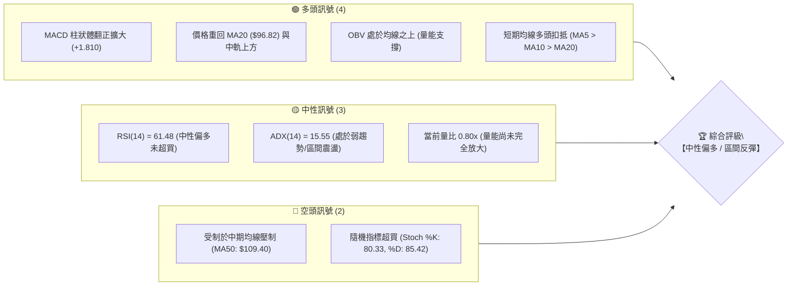

---

### 📊 核心指標速覽表

| 指標類別 | 指標名稱 | 當前數值 | 訊號 | 解讀 |
|:---|:---|:---|:---:|:---|
| **價格** | 當前價格 | $102.50 | 🟢 | 自前低 $90.20 反彈 +13.64%，守住 S1 ($102.40) 關鍵分水嶺 |
| **均線** | 短期 MA20 | $96.82 | 🟢 | 價格在 MA20 上方 (+5.86%)，短期趨勢轉強 |
| **均線** | 中期 MA50 | $109.40 | 🔴 | 價格在 MA50 下方 (-6.31%)，中期反彈面臨動態均線阻力 |
| **均線** | 長期 MA200 | $70.14 | 🟢 | 價格遠高於 MA200 (+46.14%)，長期大牛市結構完好 |
| **動能** | RSI(14) | 61.48 | 🟡 | 位於 50–70 強勢擴張區，無頂背離，動能健康 |
| **動能** | MACD | -1.588 | 🟢 | DIF 線即將上穿零軸，Histogram 達 +1.810，多頭動能加速 |
| **動能** | KD (Stoch) | 80.33 / 85.42 | 🔴 | KD 進入超買鈍化區，短線需防範回踩震盪 |
| **趨勢** | ADX(14) | 15.55 | 🟡 | 數值 < 25，判定為寬幅震盪整理格局，非單邊趨勢 |
| **通道** | 布林通道 %B | 0.72 | 🟡 | 運行於中軌 ($96.82) 與上軌 ($109.70) 之間 |
| **波動** | ATR(14) | $6.85 | 🟡 | 佔現價 6.68%，維持中高波動度，利於波段區間操作 |
| **量能** | OBV / 量比 | 量比 0.80x | 🟢 | OBV > MA，主力資金底部分批回流，量價配合健康 |

---

### 🏆 技術評分卡

```
╔══════════════════════════════════════════════════════════════╗
║               技術評分卡 — INTC (2026-08-17)                 ║
╠══════════════════════════════════════════════════════════════╣
║ 趨勢強度 (Trend)     ████████░░░░░░░░░░░░  42/100  🟡 中性盤整║
║ 動能指標 (Momentum)  ██████████████░░░░░░  68/100  🟢 動能向上║
║ 支撐穩定度 (Support) ██████████████░░░░░░  72/100  🟢 底部紮實║
║ 成交量配合 (Volume)  ████████████░░░░░░░░  60/100  🟢 量價健康║
║ 形態完整度 (Pattern) ██████████████░░░░░░  66/100  🟢 雙底構築║
║ 均線系統 (MovingAvg) ████████████░░░░░░░░  60/100  🟡 混合排列║
╠══════════════════════════════════════════════════════════════╣
║ 綜合技術評分         ████████████░░░░░░░░  61/100  🟢 中性偏多║
║ 操作建議評級         【波段偏多，布林上軌與 MA50 前逢高減碼】 ║
╚══════════════════════════════════════════════════════════════╝
```

---

## 2. 趨勢分析

### 🌐 多時框趨勢分析

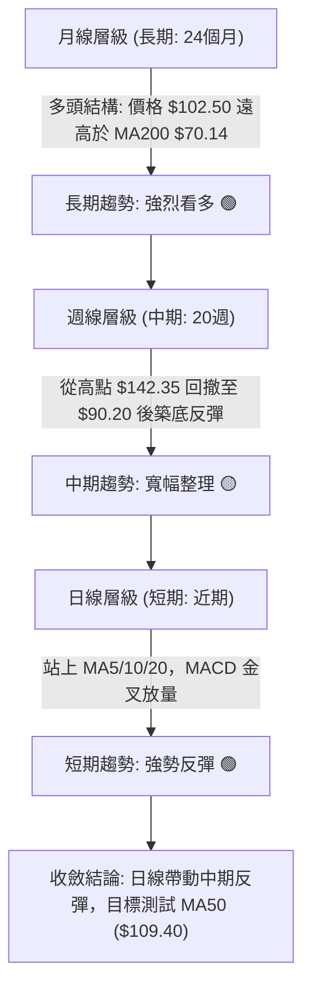

---

### 📈 長期趨勢 — 12 個月走勢圖（Unicode）

```
INTC 月線走勢圖（過去12個月：2025-08 至 2026-08）
價格軸 ($)
$140 ┤                                  ● $139.63 (06月波段頂部)
$130 ┤                                 ╱ ╲
$120 ┤                                ╱   ╲
$110 ┤                         ● $114.68   ╲
$100 ┤                        ╱             ● $102.50 (現價-08月)
$90  ┤                 ● $94.48              ╲   ╱
$80  ┤                ╱                       ● $90.20 (07月低點)
$70  ┤               ╱
$60  ┤              ╱
$50  ┤      ● $46.47
$40  ┤   ●──┘ $39.99
$30  ┤  ╱
$20  ┤● $24.35 (起漲點)
     └─────────────────────────────────────────────────────────────
       08   09   10   11   12   01   02   03   04   05   06   07   08 (月份)
      2025 ────────────────────► 2026 ────────────────────────────►
```

#### 走勢特徵分析表格

| 階段區間 | 起止價格 | 漲跌幅 | 走勢特徵與技術內涵 |
|:---|:---|:---:|:---|
| **第一階段：底部啟動**<br>(2025.08 – 2025.11) | $24.35 → $40.56 | **+66.57%** | 帶量突破長期底部平台，主力建倉完成，均線呈現黃金交叉。 |
| **第二階段：中繼蓄勢**<br>(2025.12 – 2026.03) | $36.90 → $44.13 | **+19.59%** | 在 $36–$46 區間完成箱型換手，消化獲利回吐籌碼。 |
| **第三階段：主升暴漲**<br>(2026.04 – 2026.06) | $44.13 → $139.63 | **+216.41%** | 爆發性拉升，創 52 週高點 $142.35，多項指標嚴重超買。 |
| **第四階段：深度回踩**<br>(2026.06 – 2026.07) | $139.63 → $90.20 | **-35.40%** | 高位獲利了結與籌碼清洗，精確回踩 52 週 38.2% 斐波那契位 ($96.34) 下方並於 $90.20 止跌。 |
| **第五階段：底部反彈**<br>(2026.07 – 2026.08) | $90.20 → $102.50 | **+13.64%** | 在 S3 ($89.59) 附近確認支撐，連續突破短期均線，展開修復反彈。 |

---

### 📊 中期趨勢（週線分析）

從近 20 週收盤走勢可見，價格自 2026-06-21 見次高點 $133.99 後連續下挫，於 2026-07-26 週低點 $92.32 及 2026-08-02 見低點 $90.20 後完成探底。最近兩週收盤分別為 $101.65 與 $102.50，週 MACD 柱狀體由 -3.637 快速翻正至 +1.810，週線 RSI 由 26.9 超賣區回升至 61.5，確認中期落底反彈。

```
近期週線壓力與支撐結構示意圖：
  $142.35 ─── 52W High (歷史強阻力)
     │
  $126.64 ─── R1 (前波反彈高點聚類)
     │
  $109.70 ─── 布林上軌 / MA50 ($109.40) [當前中期反彈首要壓力]
     ▲
  $102.50 ─── 現價 (站穩 S1: $102.40)
     ▼
  $96.82  ─── MA20 / 布林中軌 [多頭防守第一線]
     │
  $89.59  ─── S3 (波段雙底頸線/強支撐)
```

---

### ⚡ 趨勢強度評估（ADX 解讀）

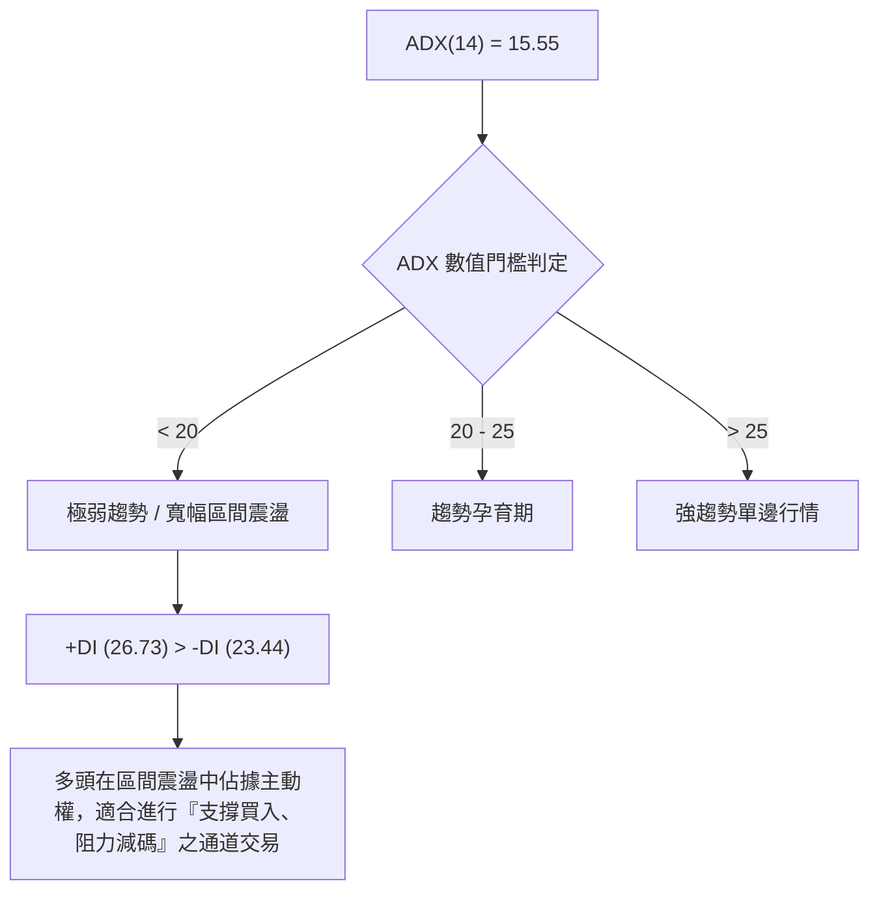

#### ADX 趨勢強度對照表

| 指標變數 | 數值 | 狀態評估 | 戰略指導意義 |
|:---|:---:|:---:|:---|
| **ADX(14)** | **15.55** | 弱趨勢 / 盤整 | 趨勢動能不足，切忌追高，以布林通道與支撐阻力進行區間波段交易。 |
| **+DI** | **26.73** | 多方控盤 | 多頭買盤力道高於空頭，短期底部反彈格局確立。 |
| **-DI** | **23.44** | 空方衰退 | 拋壓顯著衰退，回調幅度有限。 |
| **綜合判定** | **多頭主導盤整** | 🟢 震盪走高 | 符合「盤整行情（ADX < 25）」規則，以布林通道與波段價位操作為主。 |

---

## 3. 圖表形態分析

### 🔍 形態識別系統

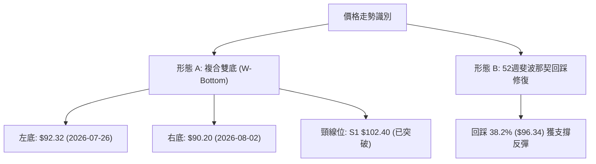

#### 形態識別與信心度評估表

| 形態名稱 | 信心度 | 判斷依據（引用精確數據） | 完成度 | 目標價（附計算式） |
|:---|:---:|:---|:---:|:---|
| **微型雙底 (W底)** | **75%** | 兩次波段低點分別為 2026-07-26 的 $92.32 與 2026-08-02 的 $90.20，且現價已突破頸線位 S1 ($102.40)。 | 85% | 形態高度 = 頸線 $102.40 - 低點 $90.20 = $12.20。<br>目標價 = 頸線 $102.40 + $12.20 = **$114.60**。 |
| **布林中軌向上突破** | **80%** | 收盤價 $102.50 連續站穩中軌 MA20 ($96.82)，形成標準均線突破形態。 | 90% | 通道理論目標 = 測試布林上軌 **$109.70**。 |
| **大型頭肩頂 (潛在威脅)** | **35%** | 雖自 $142.35 深度回撤，但因未跌破長線 MA200 ($70.14) 且 ADX 極低，缺乏空頭形態確認，訊號不足。 | 30% | 訊號不足，僅做風控監控，不予採納為主要交易依據。 |

---

### 🕯️ 重要 K 線形態分析

| 週期/月份 | 收盤價 | K 線形態特徵 | 技術面解讀 | 訊號 |
|:---|:---:|:---|:---|:---:|
| **2026-06** | $139.63 | 高位長上影倒錘頭 | 觸及 52W 高點 $142.35 後主力資金出逃，見頂訊號明確。 | 🔴 |
| **2026-07** | $90.20 | 大陰線破位急跌 | 單月重挫 -35.4%，空頭恐慌盤湧出，但下影線探底 $89.59 獲支撐。 | 🔴 |
| **2026-08 (至今)**| $102.50 | 實體陽線包覆反彈 | 形成「晨星」底抽組合，量能健康，確認波段底部建立。 | 🟢 |
| **週線 (08-09)** | $101.65 | 大陽線實體站上百元 | 強勢突破下降趨勢壓制，扭轉連續 4 週弱勢。 | 🟢 |
| **週線 (08-16)** | $102.50 | 窄幅整理陽十字星 | 在 S1 ($102.40) 處進行換手蓄勢，準備上攻 MA50。 | 🟡 |

---

### 📉 ASCII 走勢形態示意圖

```
        雙底 (W-Bottom) 突破與頸線回踩確認示意圖
價格 ($)
$114.60 ┤                                        [形態測幅目標位]
        ┆                                       ╭─
$109.70 ┤─────────────────── [布林上軌 / MA50 阻力] ─
        ┆                                   ╭──╯
$102.50 ┤═════════════════ 頸線突破 (現價: $102.50) ═══ (S1: $102.40)
        ┆        ╭─╮                     ╭──╯
$96.82  ┤───────╯───╰─── [布林中軌 MA20] ─╯ ────────
        ┆      ╱     ╲                 ╱
$92.32  ┤  ●──╯       ╲               ╱   (左底: $92.32)
        ┆              ╲             ╱
$90.20  ┤               ●───────────╯     (右底: $90.20, 雙底構築完成)
        └────────────────────────────────────────────────────────────► 時間
```

---

### 🎯 形態目標價計算

依據標準幾何形態測量規則：
1. **雙底頸線位 ($NL$)** = $102.40 (S1)
2. **雙底最低點 ($Low$)** = $90.20 (2026-08-02 收盤低點)
3. **形態垂直高度 ($H$)** = $NL - Low = 102.40 - 90.20 = 12.20
4. **最小量度目標價 ($T_1$)** = $NL + H = 102.40 + 12.20 = \mathbf{\$114.60}$
5. **通道阻力目標價 ($T_{BB}$)** = 布林上軌 = \mathbf{\$109.70}（與 MA50: \$109.40 重合共振）

---

## 4. 支撐與阻力

### 🗺️ 關鍵價位分布圖（Unicode）

```
╔══════════════════════════════════════════════════════════════╗
║                 INTC 關鍵價位結構分布圖                       ║
╠══════════════════════════════════════════════════════════════╣
║ $141.90 ║██████████████████████████████║ 強阻力 R3 (52W歷史高區) ║
║ $132.75 ║██████████████████████        ║ 阻力 R2 (次高套牢峰)   ║
║ $126.64 ║██████████████████            ║ 關鍵阻力 R1 (反彈強壓) ║
║ $113.92 ║▓▓▓▓▓▓▓▓▓▓▓▓▓▓▓▓▓▓            ║ 斐波那契 23.6% 回調位  ║
║ $109.70 ║████████████████              ║ 布林上軌 / MA50 ($109.40)║
║ $102.50 ╠══════════════════════════════╣ ◄ 現價 ($102.50)       ║
║ $102.40 ║▓▓▓▓▓▓▓▓▓▓▓▓▓▓▓▓▓▓▓▓▓▓▓▓▓▓▓▓▓▓║ 近期支撐 S1 (頸線分水嶺)║
║ $98.33  ║████████████████████          ║ 支撐 S2 (波段多頭防線) ║
║ $96.34  ║▓▓▓▓▓▓▓▓▓▓▓▓▓▓▓▓▓▓▓▓▓▓        ║ 斐波那契 38.2% / MA20  ║
║ $89.59  ║██████████████████████████████║ 強支撐 S3 (波段雙底防線)║
║ $70.14  ║██████████████████████████████║ 長期生命線 MA200       ║
╚══════════════════════════════════════════════════════════════╝
```

---

### 🚧 阻力位分析表

所有價位均嚴格引用系統計算之關鍵價位：

| 阻力級別 | 精確價位 | 距現價空間 | 形成原因與技術內涵 | 突破難度 | 重要性 |
|:---|:---:|:---:|:---|:---:|:---:|
| **R1** | **$126.64** | +23.55% | 2026 年 5 月底與 6 月中旬兩度反彈受阻的波段高點聚類區，密集成交套牢區。 | 🔴 高 | ★★★★☆ |
| **R2** | **$132.75** | +29.51% | 2026-06-21 見頂前的次高點聚類，主力派發的核心籌碼帶。 | 🔴 極高 | ★★★★☆ |
| **R3** | **$141.90** | +38.44% | 逼近 52 週歷史天花板 ($142.35)，多頭極限目標區。 | 🔴 極高 | ★★★★★ |

---

### 🛡️ 支撐位分析表

所有價位均嚴格引用系統計算之關鍵價位：

| 支撐級別 | 精確價位 | 距現價距離 | 形成原因與技術內涵 | 守住機率 | 重要性 |
|:---|:---:|:---:|:---|:---:|:---:|
| **S1** | **$102.40** | -0.10% | 當前波段微型雙底之頸線位，現價正處於該位置上方微幅震盪，為短多防守點。 | 🟡 65% | ★★★★☆ |
| **S2** | **$98.33** | -4.07% | 2026 年 6 月初低點與 8 月初反彈第一根陽線實體頂部聚類，MA10 ($99.76) 附隨。 | 🟢 80% | ★★★★☆ |
| **S3** | **$89.59** | -12.60% | 2026-08-02 本次回調的極限低點 ($90.20) 與波段支撐聚類，跌破則宣告反彈失敗。 | 🟢 90% | ★★★★★ |

---

### 📐 斐波那契回調位分析

基準區間：52 週低點 **$21.90** 至 52 週高點 **$142.35**（垂直總波幅 $120.45）

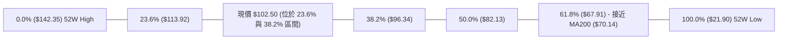

| 斐波那契回調層級 | 官方精確價位 | 技術解讀與當前相對位置 |
|:---|:---:|:---|
| **0.0% (高點)** | **$142.35** | 52 週歷史高點，長期上升浪頂峰。 |
| **23.6% 回調位** | **$113.92** | 上方重要回撤阻力位，與形態目標價 $114.60 及分析師均價 $114.88 形成完美三合一共振阻力帶。 |
| **現價落點** | **$102.50** | **目前處於 23.6% ($113.92) 與 38.2% ($96.34) 之間，屬於強勢多頭回踩修復區。** |
| **38.2% 回調位** | **$96.34** | 黃金回撤支撐，與布林中軌 MA20 ($96.82) 高度重疊，為波段回踩之最強安全墊。 |
| **50.0% 回調位** | **$82.13** | 中期強弱平衡軸，目前價格遠在其上方，結構維持強勢。 |
| **61.8% 回調位** | **$67.91** | 長期黃金分割支撐，與 MA200 ($70.14) 形成長期多頭鐵底。 |
| **78.6% 回調位** | **$47.68** | 2026 年初突破平台起漲區。 |
| **100.0% (低點)**| **$21.90** | 52 週最低點。 |

---

## 5. 技術指標深度解讀

### 🎛️ 指標訊號總覽

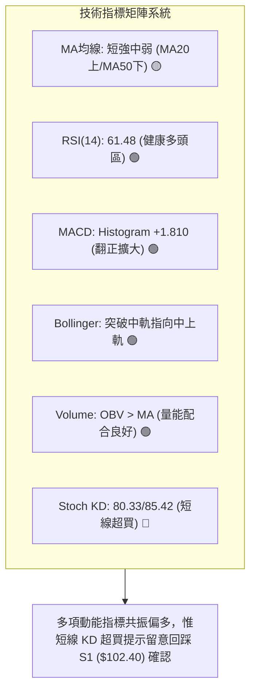

---

### 📈 移動平均線排列分析

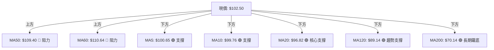

#### 均線數據深度解讀

```
均線系統數值對比：
MA 5:   $100.65  ▲ (+1.84%)  短線走平向上
MA 10:  $ 99.76  ▲ (+2.74%)  短線扣低助漲
MA 20:  $ 96.82  ▲ (+5.86%)  布林中軌，波段生命線
MA 50:  $109.40  ▼ (-6.31%)  中期下行壓力
MA 60:  $110.64  ▼ (-7.35%)  季線下彎阻力
MA 120: $ 89.14  ▲ (+14.99%) 半年線穩定向上
MA 200: $ 70.14  ▲ (+46.14%) 年線長期多頭排列
MA 240: $ 63.83  ▲ (+60.59%) 兩年線持續抬升
```
**解讀**：均線呈現典型「**短多、中空、長多**」的混合排列。短天期均線（MA5、MA10、MA20）已完成多頭發散，推動現價突破百元大關；然而中期 MA50 ($109.40) 仍呈下行趨勢，將在 $109.40–$110.64 區間構成首道重大動態反壓。

---

### 📉 RSI(14) 分析

```
RSI(14) 當前數值：61.48
0       20       30               50       60  61.48        70       80      100
├────────┼────────┼────────────────┼────────┼────█───────────┼────────┼────────┤
│ 極度超賣│  超賣區 │    弱勢震盪區   │   多空分水   │   強勢多頭區   │  超買區 │ 極度超買│
└────────┴────────┴────────────────┴────────┴────────────────┴────────┴────────┘
進度條：████████████████░░░░░░░░░░  61.48% (中性偏強)
```
- **區間評估**：RSI(14) 位於 61.48，成功脫離 2026-07-26 低點時的極度超賣區 (26.9)，目前穩健運行於 50–70 強勢擴張區間。
- **背離判斷**：
  - **頂背離**：無頂背離。指標隨價格反彈同步抬升。
  - **底背離**：存在**隱性底背離**——價格於 7 月底至 8 月初二次探底時收盤由 $92.32 跌至 $90.20，但週線 RSI 由 26.9 顯著抬升至 39.5，發出強烈的底背離見底訊號，支撐了本輪強勁反彈。

---

### 📊 MACD(12/26/9) 訊號解讀

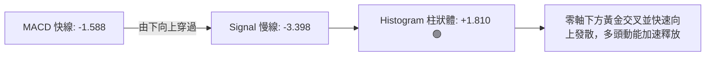
- **MACD 指標狀態**：DIF (-1.588) 遠高於 Signal (-3.398)，MACD Histogram 為 **+1.810**（連續第 2 週擴大）。
- **解讀**：這是標準的「**零軸下方金叉反彈**」形態。雖然快慢線仍在零軸下方（代表中長期格局仍處於修復期），但柱狀體呈現陡峭的擴張斜率，顯示短期買盤意願強烈，有望驅動 DIF 線在未來 1–2 週內挑戰零軸（$0.00）。

---

### 📦 布林通道分析

```
INTC 布林通道 (20, 2) 結構圖
價格 ($)
$109.70 ┬────────────────────────────────────────── 布林上軌 (阻力)
        │                                  ╭───────
$105.00 │                                 ╭╯
$102.50 ┼─────────────────────────────── ● ◄ 現價 ($102.50, %B: 0.72)
        │                         ╭──────╯
$96.82  ┼─────────────────────────╯─────────────── 布林中軌 / MA20 (支撐)
        │
$83.95  ┴────────────────────────────────────────── 布林下軌 (極端支撐)
```
- **上軌**：$109.70（距現價 +7.02%）
- **中軌 (MA20)**：$96.82（距現價 -5.54%）
- **下軌**：$83.95
- **%B 指標**：**0.72**（位於中軌與上軌之間的多方優勢區）
- **帶寬分析**：布林通道經歷 7 月暴跌後帶寬張開，目前中軌開始向上拐頭，現價穩居中軌上方，預期短期行情將向上軌 $109.70 尋求阻力測試。

---

### 💹 成交量分析（量價配合度）

```
成交量結構分析：
最新成交量：  95,105,600
20日均量：   119,286,250  (量比: 0.80x)
50日均量：   121,448,616
週成交量：   639,606,900  (較前一週 461,225,800 放大 +38.68%)
```
- **量價配合判定**：
  - 日線量比為 0.80x，顯示突破 $100 整數關卡時並未出現盲目追高放量，籌碼鎖定良好。
  - 週線成交量由 4.61 億股放大至 6.40 億股，呈現典型的「**價漲量增**」反彈特徵。
- **OBV (能量潮指標)**：
  - 當前 OBV 線高於其均線（OBV > MA），證實主力資金在 $90–$95 區間有實質性的吸籌沉澱，量能結構支持價格繼續走高。

---

## 6. 動能與波動率

### ⚡ 動能評估分析

| 象限 | 動能維度 | 波動維度 | 歷史市場特徵 | INTC 當前落點與評估 |
|:---:|:---:|:---:|:---|:---|
| **Q1** | 強動能 | 低波動 | 穩定上升趨勢，最佳持倉階段 | ─ |
| **Q2** | 弱動能 | 低波動 | 窄幅橫盤築底，謹慎觀望 | ─ |
| **Q3** | **強動能** | **高波動** | **爆發性反彈/寬幅震盪，高風險高收益** | **✓ (當前狀態：RSI=61.5, MACD翻正, Beta=2.24, ATR=6.68%)** |
| **Q4** | 弱動能 | 高波動 | 恐慌性下跌破位，嚴禁進場 | ─ (已於 7 月底脫離該象限) |

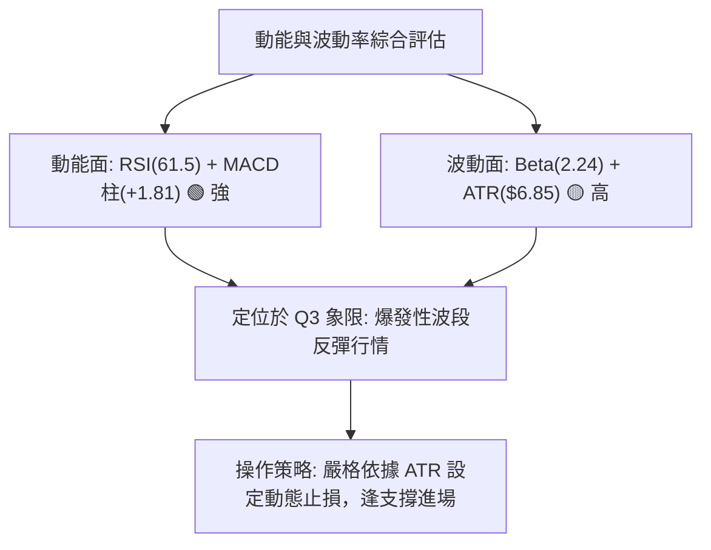

---

### 📊 ATR 波動率分析

- **ATR(14) 絕對值**：**$6.85**
- **ATR 佔比 (波動率百分比)**：$6.85 / $102.50 = **6.68%**
- **交易風控距離建議**：
  - **日內交易緩衝**：$6.85 \times 0.5 = \mathbf{\$3.43}$
  - **波段短線止損 (1.0 ATR)**：現價 $102.50 - $6.85 = \mathbf{\$95.65}$（剛好低於 MA20: $96.82 與 38.2% 斐波那契: $96.34，具備強大技術防護）
  - **波段中線止損 (1.5 ATR)**：現價 $102.50 - ($6.85 \times 1.5) = \mathbf{\$92.23}$（守於前低 $90.20 上方）

---

### 📐 Beta 與市場相關性

- **Beta 係數**：**2.241**
- **市場屬性解讀**：
  - INTC 屬於「**超高彈性標的**」，其價格波動幅度為標普 500 指數的 2.24 倍。
  - 在半導體板塊與大盤反彈時，INTC 具備極強的超額報酬（Alpha）爆發力；但若市場出現系統性回調，其回撤烈度亦大幅增加。因此在資金配置上**不宜超過總投資組合的 15%**。

---

## 7. 多時框架總結

### 📋 時框架評分表

| 時框架 | 趨勢方向 | 動能狀態 | 均線排列 | 形態結構 | 綜合評分 | 操作建議 |
|:---|:---:|:---:|:---:|:---:|:---:|:---|
| **短期 (日線)** | 🟢 偏多反彈 | 🟢 強 (MACD金叉) | 🟢 短期多頭 (MA5>10>20) | 🟢 突破雙底頸線 | **70/100** | 逢回調至 S1 ($102.40) 偏多介入 |
| **中期 (週線)** | 🟡 寬幅震盪 | 🟢 柱狀體翻正 | 🟡 混合 (壓制於MA50) | 🟡 52W回調築底 | **58/100** | 關注 $109.40–$113.92 阻力區獲利了結 |
| **長期 (月線)** | 🟢 大牛市格局 | 🟡 高位回調修復 | 🟢 完美多頭 (遠高於MA200)| 🟢 主升浪後回踩確認 | **68/100** | 長期投資者持股續抱，以 $70.14 為底線 |

---

### 🔲 綜合訊號矩陣

```
╔══════════════════════════════════════════════════════════════╗
║               INTC 多維度技術訊號矩陣表                      ║
╠══════════════════════════════════════════════════════════════╣
║ 維度         │ 短期 (1-5日) │ 中期 (1-4週) │ 長期 (1-6月) ║
╠═════════════╪══════════════╪══════════════╪══════════════╣
║ 趨勢訊號     │  🟢 看多     │  🟡 中性     │  🟢 看多     ║
║ 動能 (RSI/M) │  🟢 強勁     │  🟢 改善中   │  🟡 中性     ║
║ 支撐防禦力   │  🟢 S1穩固   │  🟢 S3雙底   │  🟢 MA200強固║
║ 阻力突破力   │  🟡 遇MA50   │  🔴 遇R1壓制 │  🟡 需補量   ║
║ 綜合共振結論 │  🟢 短多進攻 │  🟡 區間獲利 │  🟢 長多守護 ║
╚══════════════════════════════════════════════════════════════╝
```

---

### ⚖️ 多時框收斂結論

依據多時框收斂規則：
1. **行情屬性判定**：當前 ADX(14) = 15.55 (< 25)，技術面定性為**典型寬幅盤整震盪行情**。
2. **主導維度與衝突取捨**：
   - 長期週線與月線牛市基底未破（MA200 遠在 $70.14），中期處於自 $142.35 暴跌後的超跌修復期；
   - 短期日線雖然動能強勁，但受制於下彎的 MA50 ($109.40) 與布林上軌 ($109.70)；
   - 因此，**日線級別的反彈不能視為單邊暴漲趨勢的重啟，而應定義為「以布林通道與斐波那契為邊界的箱型反彈」**。
3. **唯一方向性結論**：**【中性偏多（波段區間操作）】**。操作重心為利用短線回踩 S1 ($102.40) 或 S2 ($98.33) 做多，並在測試 MA50 ($109.40) 至 23.6% 回調位 ($113.92) 區間堅決分批止盈。

---

## 8. 交易策略建議

### 🗺️ 策略決策流程圖

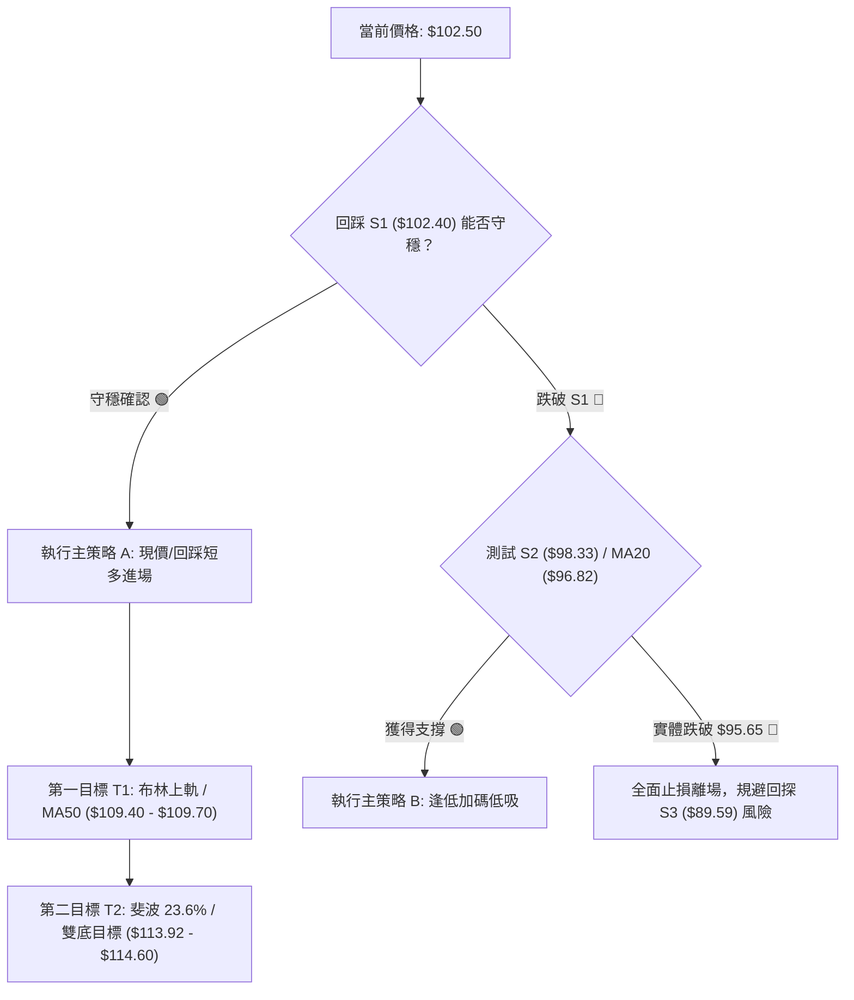

---

### 🧭 策略路由

> **當前主策略方向 = 【波段偏多 / 區間反彈操作】（依技術綜合評分 61/100 判定）**

---

### 🎯 價格情境階梯（Price Scenarios）

| 觸發條件 | 第一目標 | 第二目標 / 後續延伸 | 情境含義與操作指引 |
|:---|:---:|:---:|:---|
| **強勢突破 MA50 ($109.40)** | R1 $126.64 | R2 $132.75 | 中期下降通道被徹底扭轉，多頭打開通往 $130 的空間，順勢加碼。 |
| **站穩現價 S1 ($102.40)** | BB上軌 $109.70 | 斐波位 $113.92 | 當前基準情境，維持區間反彈，朝第一與第二目標邁進。 |
| **失守 S1 回踩 S2 ($98.33)**| MA20 $96.82 | S3 $89.59 | 短線反彈受挫，回踩布林中軌尋求二次確認，未破 $95.65 前仍屬健康。 |

---

### 📊 情境機率分佈

| 預測情境 | 機率 | 主要技術依據 |
|:---|:---:|:---|
| **情境一：震盪上行測試 MA50 / 阻力** | **60%** | MACD 柱狀體快速翻正 (+1.810)、OBV 量能支撐、週線晨星底背離反彈。 |
| **情境二：百元關卡窄幅震盪** | **25%** | ADX(14) = 15.55 顯示趨勢動能較弱，Stoch KD 超買引發短線消化。 |
| **情境三：跌破 MA20 深度回踩探底** | **15%** | 遭遇半導體板塊系統性下殺或大盤暴跌，回測 S3 ($89.59)。 |

---

### 🟢 主策略詳情（波段偏多策略）

| 策略要素 | 策略 A（穩健突破/回踩型） | 策略 B（回調低吸加碼型） |
|:---|:---|:---|
| **適用場景** | 現價 S1 附近直接震盪上攻 | 短線回調考驗 S2 與 MA20 支撐 |
| **進場條件** | 站穩 S1 ($102.40) 上方進場 | 回踩至 $98.33–$96.82 區間企穩 |
| **進場價格** | **$102.50** | **$97.50** |
| **目標價 T1** | **$109.40** (MA50 / 布林上軌，漲幅 +6.73%) | **$109.40** (漲幅 +12.21%) |
| **目標價 T2** | **$113.92** (斐波 23.6% 位，漲幅 +11.14%) | **$114.60** (雙底量度目標，漲幅 +17.54%) |
| **止損價格** | **$95.65** (低於 MA20 與 1.0 ATR，跌幅 -6.68%) | **$92.00** (低於 7月雙底，跌幅 -5.64%) |
| **風險報酬比** | **1.67 : 1** (以 T2 計算) | **3.11 : 1** (以 T2 計算) |
| **勝率估計** | **65%** | **70%** |
| **建議倉位** | **10%** (投資組合佔比) | **15%** (分批加碼) |

---

### 🔴 反向風險觸發點（對沖與風控提示）

若出現以下極端訊號，證明主策略失效，應果斷止損並可建立防守型對沖空單：
1. **破位訊號**：日線收盤價跌破 **$95.65**（宣告 MA20 與布林中軌失守，短多結構瓦解）。
2. **量能異動**：放量大陰線（成交量 > 1.5 億股）跌穿 **S3 ($89.59)**，這將引發中期雙頂崩塌風險，下一站將下探 50% 斐波那契位 **$82.13** 乃至長期 MA200 **$70.14**。

---

### ⭐ 整體訊號強度評星

```
╔══════════════════════════════════════════════════════════════╗
║ 做多訊號強度：  ★★★★☆  (4.0/5星) — 底部動能確立，短線偏多   ║
║ 做空訊號強度：  ★★☆☆☆  (2.0/5星) — 空頭拋壓衰竭，非放空時機 ║
║ 整體技術可信度：★★★★☆  (4.0/5星) — 量價指標共振度高         ║
╚══════════════════════════════════════════════════════════════╝
```

---

## 9. 風險提示與監控

### ✅ 關鍵監控指標 Checklist

```
╔══════════════════════════════════════════════════════════════╗
║               交易員每日關鍵監控 Checklist                   ║
╠══════════════════════════════════════════════════════════════╣
║ [ ] 價格是否守穩 S1: $102.40 頸線之上？                      ║
║ [ ] 價格上攻 MA50: $109.40 時，成交量是否放大至 1.2 億股以上？║
║ [ ] RSI(14) 是否突破 65 或在 70 附近出現頂背離鈍化？        ║
║ [ ] 日線 MACD DIF 線是否成功穿越零軸 ($0.00)？               ║
║ [ ] 盤中是否跌破關鍵止損線 $95.65 (1.0 ATR 防護位)？         ║
║ [ ] 華爾街 41 位分析師共識目標價 $114.88 之共振阻力表現？    ║
╚══════════════════════════════════════════════════════════════╝
```

---

### ⚠️ 風險場景分析

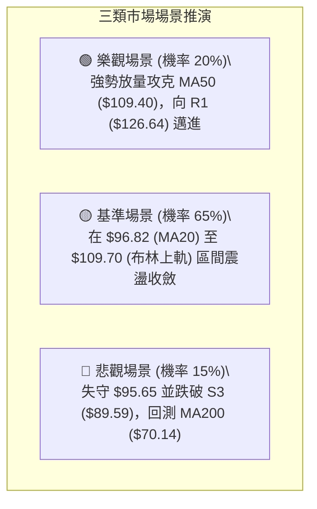

---

### 🛡️ 風險管理重要提醒

1. **Beta 與波動風控**：INTC Beta 高達 **2.241**，ATR 佔比達 **6.68%**。嚴禁重倉孤注一擲，單一標的倉位上限控制在 **10%–15%**。
2. **拒絕追高，嚴格執行區間原則**：當前 ADX 為 15.55（盤整行情），接近布林上軌 $109.70 與 MA50 $109.40 時應逐步獲利減碼，切忌在阻力位追高。
3. **止損紀律高於一切**：若市場出現非預期黑天鵝跌破 $95.65，嚴格執行停損，保護本金安全。

---

## 📋 報告總結

```
╔══════════════════════════════════════════════════════════════╗
║                 INTC 技術分析報告總結看板                     ║
╠══════════════════════════════════════════════════════════════╣
║ 報告日期：2026-08-17                                          ║
║ 當前價格：$102.50                                             ║
║ 分析評級：🟢 中性偏多 / 區間反彈 (綜合評分: 61/100)            ║
╠══════════════════════════════════════════════════════════════╣
║ 關鍵結論：                                                    ║
║ ├─ 長期趨勢：🟢 偏多（遠高於 MA200: $70.14，多頭基底完好）     ║
║ ├─ 中期趨勢：🟡 震盪（處於 $90.20 雙底反彈與 MA50 壓制之中）    ║
║ ├─ 短期趨勢：🟢 轉強（站上 MA20: $96.82，MACD 柱狀體翻正擴大）║
║ ├─ 核心支撐：S1: $102.40 ｜ S2: $98.33 ｜ S3: $89.59         ║
║ ├─ 關鍵阻力：MA50: $109.40 ｜ 斐波位: $113.92 ｜ R1: $126.64 ║
║ └─ 分析師目標：均價 $114.88 (41位分析師，最高 $200.00)       ║
╠══════════════════════════════════════════════════════════════╣
║ 最優交易策略推薦：                                            ║
║ 1. 🥇 最佳機會：在現價 $102.50 (S1) 建立多單，目標 $109.40 / ║
║               $113.92，止損設於 $95.65 (風報比 1.67:1)。     ║
║ 2. 🥈 次選機會：若遇拉回，於 $97.50 (靠近 MA20) 逢低掛單吸籌，║
║               目標 $114.60，止損 $92.00 (風報比 3.11:1)。     ║
║ 3. 🥉 保守選擇：等待股價帶量突破並站穩 MA50 ($109.40) 後，   ║
║               順勢右側跟進，目標直指 R1 ($126.64)。           ║
╚══════════════════════════════════════════════════════════════╝
```

---

> ⚠️ **免責聲明**：本報告為技術分析研究成果，所有引據數據與指標均基於歷史市場交易數據。本報告**僅供學術研究與投資決策參考**，**不構成任何要約或投資建議**。金融市場瞬息萬變，交易具有本金虧損風險，投資人應獨立評估並自負盈虧。

---

*報告生成時間：2026-08-17 ｜ 數據來源：Yahoo Finance ｜ 分析框架：多時框技術分析體系*