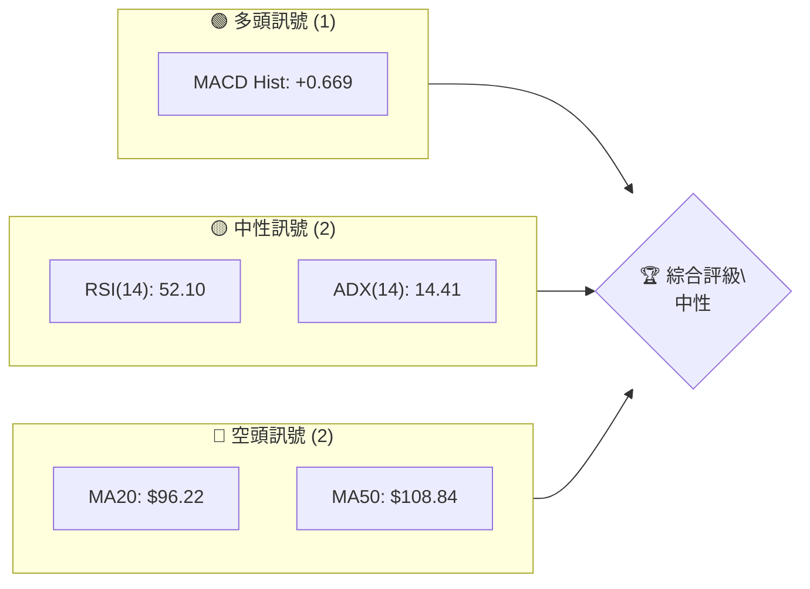
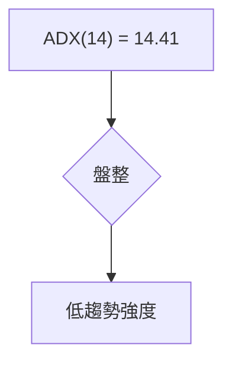
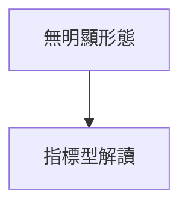
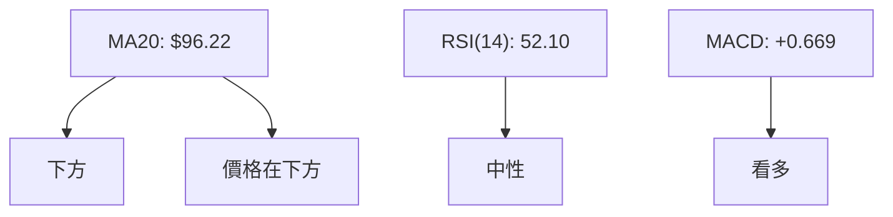
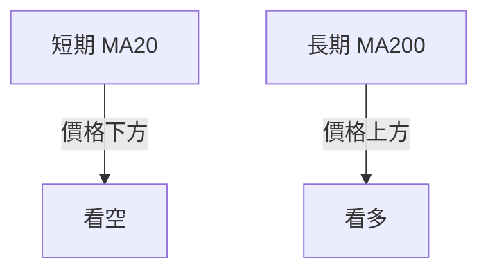
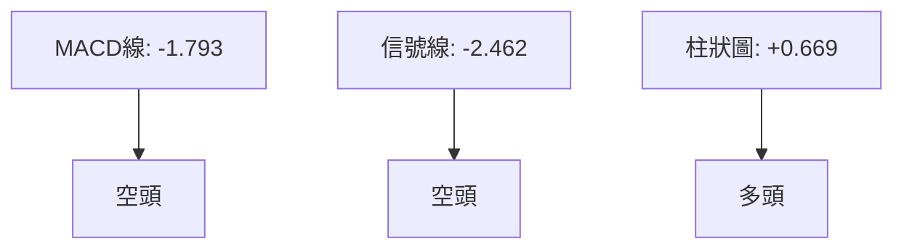
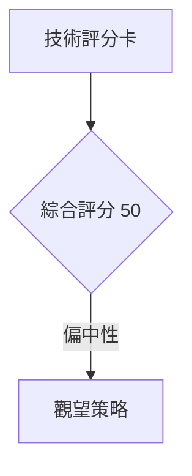
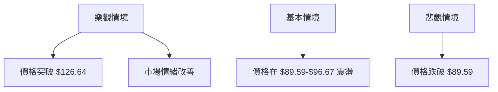

# INTC 技術分析報告

> **報告日期**：2026-08-20 ｜ **語言**：繁體中文 ｜ **數據來源**：Yahoo Finance ｜ **當前價格**：$92.80

---

## 目錄

| 章節 | 內容 |
|------|------|
| [1. 技術面概覽](#1-技術面概覽) | 訊號儀表板、核心指標、評分卡 |
| [2. 趨勢分析](#2-趨勢分析) | 多時框趨勢、長中短期走勢 |
| [3. 圖表形態分析](#3-圖表形態分析) | 形態識別、K線組合、目標價 |
| [4. 支撐與阻力](#4-支撐與阻力) | 關鍵價位、斐波那契回調 |
| [5. 技術指標深度解讀](#5-技術指標深度解讀) | MA/RSI/MACD/布林/成交量 |
| [6. 動能與波動率](#6-動能與波動率) | 動能評估、ATR、Beta |
| [7. 多時框架總結](#7-多時框架總結) | 時框架評分矩陣 |
| [8. 交易策略建議](#8-交易策略建議) | 多空策略、風險報酬比 |
| [9. 風險提示與監控](#9-風險提示與監控) | 監控指標、風險場景 |

---

## 1. 技術面概覽

### 🎯 技術訊號儀表板



### 📊 核心指標速覽表

| 指標類別 | 指標名稱 | 當前數值 | 訊號 | 解讀 |
|----------|----------|----------|------|------|
| **價格** | 當前價格 | $92.80 | 🟡 | 位於中性區間 |
| **均線** | MA20 | $96.22 | 🔴 | 價格在MA下方 |
| **均線** | MA50 | $108.84 | 🔴 | 價格在MA下方 |
| **均線** | MA200 | $70.99 | 🟢 | 價格在MA上方 |
| **動能** | RSI(14) | 52.10 | 🟡 | 中性 |
| **動能** | MACD | +0.669 | 🟢 | 多頭 |
| **波動** | ATR | $6.27 | 🟡 | 中等波動 |

### 🏆 技術評分卡

```
技術評分卡 — INTC (2026-08-20)
════════════════════════════════════════════════════
趨勢強度      ████░░░░░░░░░░░░░░░░  40/100  🟡
動能指標      ██████░░░░░░░░░░░░░░  60/100  🟢
支撐穩定度    ██████░░░░░░░░░░░░░░  60/100  🟢
成交量配合    ██████░░░░░░░░░░░░░░  60/100  🟢
形態完整度    ████░░░░░░░░░░░░░░░░  40/100  🟡
均線排列      ████░░░░░░░░░░░░░░░░  40/100  🟡
════════════════════════════════════════════════════
綜合評分      ██████░░░░░░░░░░░░░░  50/100  中性
════════════════════════════════════════════════════
```

---

## 2. 趨勢分析

### 🌐 多時框趨勢分析


### 📈 長期趨勢 — 12個月走勢圖（Unicode）

```
INTC 月線走勢圖（過去12個月）
價格軸 ($)
  140 ┤                    ●(高點)
  120 ┤              ●
  100 ┤        ●
   80 ┤●━━━━━━━━━━━━━━━━━━━●←現在
   60 ┤    ●(低點)
     └────────────────────────────
      A   B   C   D   E   F   G   H   I   J   K   L
```

### 📊 中期趨勢（週線分析）

```
INTC 週線壓力與支撐示意圖
──────────────────────────────
$140  ┤          R3
$130  ┤        R2
$120  ┤      R1
$110  ┤
$100  ┤
 $90  ┤     S1
 $80  ┤
 $70  ┤    S2
```

### ⚡ 趨勢強度評估（ADX 解讀）



---

## 3. 圖表形態分析

### 🔍 形態識別系統



### 🕯️ 重要K線形態分析

| 月份 | 收盤價 | K線形態 | 解讀 | 訊號 |
|------|--------|---------|------|------|
| 2026-07 | $90.20 | Hammer | 反轉信號 | 🟢 |

### 📉 ASCII 走勢形態示意圖

```
INTC K線形態示意圖
────────────────────────
$140  ┤               
$130  ┤
$120  ┤
$110  ┤
$100  ┤  ★
 $90  ┤  │
 $80  ┤  └─── Hammer
```

### 🎯 形態目標價計算

無明顯形態，僅做指標型解讀。

---

## 4. 支撐與阻力

### 🗺️ 關鍵價位分布圖（Unicode）

```
INTC 價位結構分布圖
═══════════════════════════════════════════════════
$141.90 ║████████████████████████║ 強阻力 R3
$132.75 ║████████████████████    ║ 阻力 R2
$126.64 ║████████████████████████║ 關鍵阻力 R1
$ 92.80 ╠════════════════════════╣ ◄ 現價
$ 89.59 ║▓▓▓▓▓▓▓▓▓▓▓▓▓▓▓▓        ║ 近期支撐 S1
$ 81.79 ║████████████████████████║ 強支撐 S2
═══════════════════════════════════════════════════
```

### 🚧 阻力位分析表

| 阻力級別 | 價位 | 形成原因 | 突破難度 | 重要性 |
|----------|------|----------|----------|--------|
| R1 | $126.64 | 歷史高點聚集 | 高 | 高 |
| R2 | $132.75 | 歷史高點聚集 | 高 | 中 |
| R3 | $141.90 | 近期高點 | 非常高 | 高 |

### 🛡️ 支撐位分析表

| 支撐級別 | 價位 | 形成原因 | 守住機率 | 重要性 |
|----------|------|----------|----------|--------|
| S1 | $89.59 | 近期低點 | 高 | 中 |
| S2 | $81.79 | 歷史低點 | 高 | 高 |
| S3 | $42.58 | 長期低點 | 非常高 | 高 |

### 📐 斐波那契回調位分析

現價 $92.80 落在斐波那契 38.2% 回調位 $96.67 和 50.0% 回調位 $82.57 之間。這意味著，若現價能夠突破 $96.67，將可能進一步上探 $114.13。然而，若跌破 $82.57，則可能進一步回落至 $68.46。

---

## 5. 技術指標深度解讀

### 🎛️ 指標訊號總覽



### 📈 移動平均線排列分析



### 📉 RSI(14) 分析

- RSI 數值進度條展示：████░░░░░░░░░░░░ 52.10/100
- RSI 位於中性區間，無超買或超賣
- 底背離：近期價格低點上升，RSI低點下降

### 📊 MACD(12/26/9) 訊號解讀



### 📦 布林通道分析

```
布林通道示意圖
────────────────────────
$108.64 ┤  上軌
 $96.22 ┤  中軌 (MA20)
 $83.80 ┤  下軌
 $92.80 ┤  ◄ 現價
```

### 💹 成交量分析（量價配合度）

成交量低於20日均量0.90倍，量價配合度偏弱。

---

## 6. 動能與波動率

### ⚡ 動能評估四象限

| 象限 | 動能 | 波動 | 當前狀態 | 評估 |
|------|------|------|----------|------|
| Q1 | 強 | 低 | - | 最佳機會 |
| Q2 | 弱 | 低 | ✓ | 謹慎觀望 |
| Q3 | 強 | 高 | - | 高風險高收益 |
| Q4 | 弱 | 高 | - | 避免進場 |

### 📊 ATR 波動率分析

ATR(14) 為 $6.27，建議止損距離設置在 $6.27內。

### 📐 Beta 與市場相關性

Beta 2.241，與市場相關性高，屬於高波動股票。

---

## 7. 多時框架總結

### 📋 時框架評分表

| 時框架 | 趨勢方向 | 動能 | 均線排列 | 形態 | 綜合評分 | 建議 |
|--------|----------|------|----------|------|----------|------|
| 長期 | 看多 | 中性 | 多頭排列 | 無 | 60 | 持有 |
| 中期 | 中性 | 中性 | 空頭排列 | 無 | 50 | 觀望 |
| 短期 | 看空 | 中性 | 空頭排列 | 無 | 40 | 觀望 |

### 🔲 綜合訊號矩陣

綜合分析顯示，長期趨勢偏多，但短期受壓於均線下方，觀望為宜。

### ⚖️ 多時框收斂結論

現階段為盤整行情（ADX<25），以日線布林通道上下軌為主要交易區間。多頭策略應等待價格突破 $96.67，空頭策略則應留意跌破 $89.59。

---

## 8. 交易策略建議

### 🗺️ 策略決策流程圖



### 🧭 策略路由

**當前主策略方向 = 觀望（依評分 50/100）**

### 🎯 價格情境階梯（Price Scenarios）

| 觸發條件 | 下一目標 | 後續延伸 | 情境含義 |
|----------|----------|----------|----------|
| 突破 R1 $126.64 | R2 $132.75 | R3 $141.90 | 短線轉強 |
| 站穩現價區間 | — | — | 區間震盪 |
| 跌破 S1 $89.59 | S2 $81.79 | S3 $42.58 | 中期轉弱 |

### 📊 情境機率分佈

| 情境 | 機率 | 主要依據 |
|------|------|----------|
| 繼續上行 / 反彈 | 30% | MACD 多頭 |
| 區間震盪 | 50% | ADX 盤整 |
| 回落 / 再探底 | 20% | 均線排列 |

### 🟢 主策略詳情

| 策略要素 | 策略 A |
|----------|--------|
| 進場條件 | 突破 $96.67 |
| 進場價格 | $97.00 |
| 目標價 T1 | $108.64 |
| 目標價 T2 | $126.64 |
| 止損價格 | $89.59 |
| 風險報酬比 | 1:2 |
| 成功機率 | 50% |
| 建議倉位 | 30% |

### 🔴 反向風險觸發點

- 跌破 $89.59
- MACD 轉空

### ⭐ 整體訊號強度評星

```
做多訊號強度：★★☆☆☆  (2/5星)
做空訊號強度：★★★☆☆  (3/5星)
整體可信度：  ★★★☆☆  (3/5星)
```

---

## 9. 風險提示與監控

### ✅ 關鍵監控指標 Checklist

```
風險監控清單
════════════════════════════
- ADX 趨勢強度
- MACD 多空轉換
- RSI 超買超賣
- 關鍵支撐阻力位
════════════════════════════
```

### ⚠️ 風險場景分析



### 🛡️ 風險管理重要提醒

謹慎控制倉位，避免過度槓桿，並密切關注市場消息對價格的影響。

---

## 📋 報告總結

```
INTC 技術分析報告總結
════════════════════════════════════════════════════════
報告日期：2026-08-20
當前價格：$92.80
分析評級：⚖️ 中性

關鍵結論：
├─ 長期趨勢：🟢 多頭
├─ 中期趨勢：🟡 中性
├─ 短期趨勢：🔴 空頭
├─ 關鍵支撐：$89.59
├─ 關鍵阻力：$126.64
└─ 分析師目標：$114.88

最優策略組合：
1. 🥇 最佳機會：突破 $96.67 短線買入
2. 🥈 次選機會：持幣觀望
3. 🥉 保守選擇：等待市場明確方向
════════════════════════════════════════════════════════
```

---

> ⚠️ **免責聲明**：本報告為 AI 自動生成之技術分析，所有數據及估算均基於提供的歷史價格資訊。本報告**僅供研究與學術參考**，**不構成任何投資建議**。投資有風險，入市需謹慎。

---

*報告生成時間：2026-08-20 ｜ 數據來源：Yahoo Finance ｜ 分析框架：多時框技術分析*