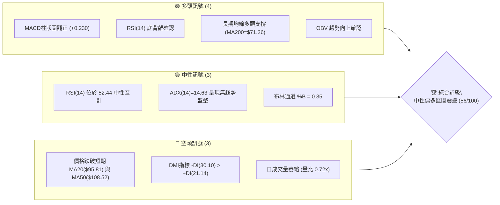
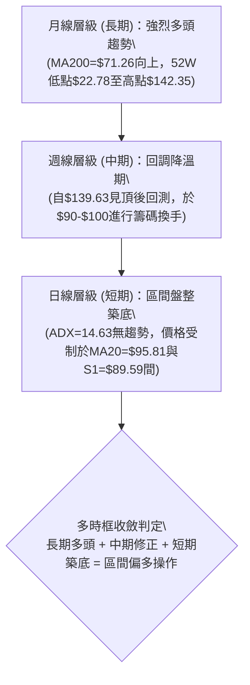
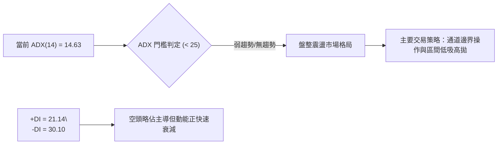
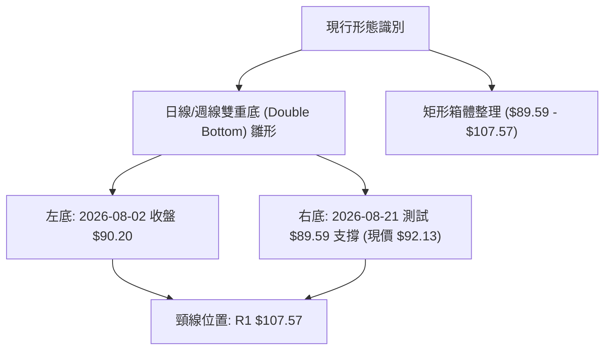
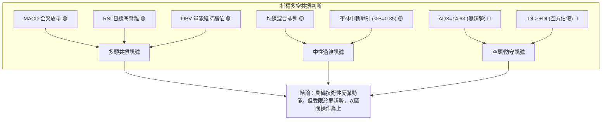
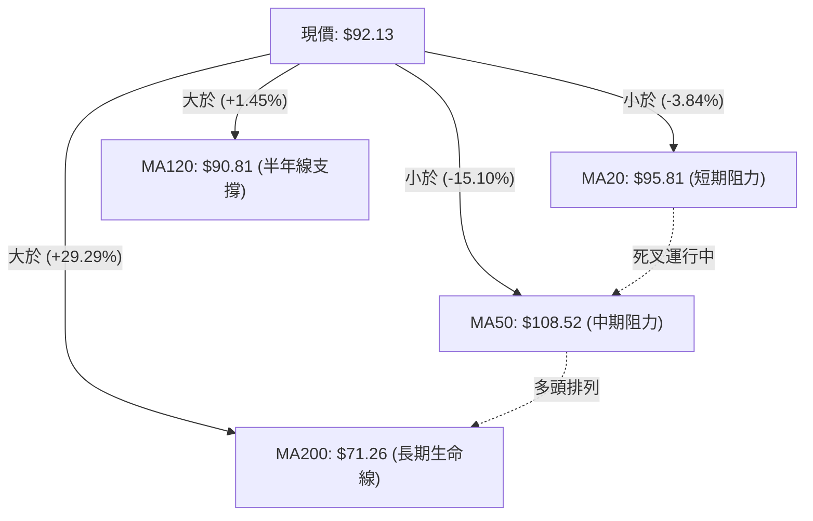
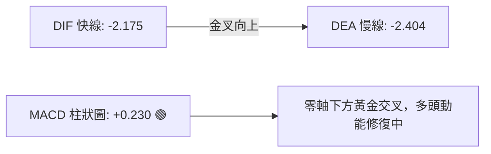
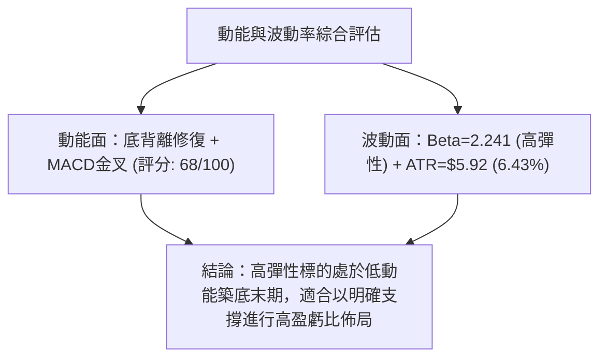
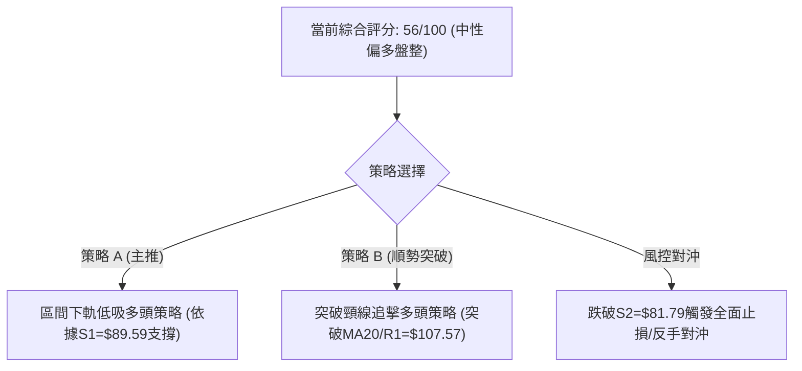
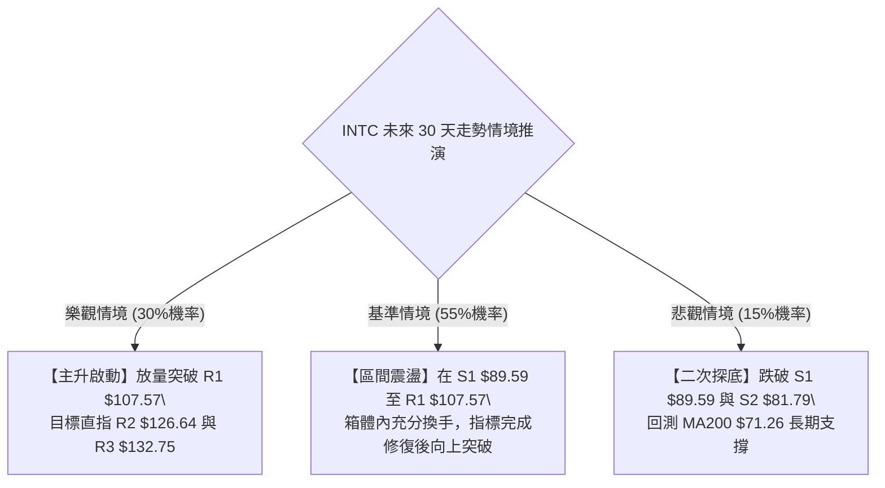

# INTC 技術分析報告

> **報告日期**：2026-08-21 ｜ **語言**：繁體中文 ｜ **數據來源**：Yahoo Finance ｜ **當前價格**：$92.13

---

## 目錄

| 章節 | 內容 |
|------|------|
| [1. 技術面概覽](#1-技術面概覽) | 訊號儀表板、核心指標、評分卡 |
| [2. 趨勢分析](#2-趨勢分析) | 多時框趨勢、長中短期走勢 |
| [3. 圖表形態分析](#3-圖表形態分析) | 形態識別、K線組合、目標價 |
| [4. 支撐與阻力](#4-支撐與阻力) | 關鍵價位、斐波那契回調 |
| [5. 技術指標深度解讀](#5-技術指標深度解讀) | MA/RSI/MACD/布林/成交量 |
| [6. 動能與波動率](#6-動能與波動率) | 動能評估、ATR、Beta |
| [7. 多時框架總結](#7-多時框架總結) | 時框架評分矩陣 |
| [8. 交易策略建議](#8-交易策略建議) | 多空策略、風險報酬比 |
| [9. 風險提示與監控](#9-風險提示與監控) | 監控指標、風險場景 |

---

## 1. 技術面概覽

### 🎯 技術訊號儀表板



### 📊 核心指標速覽表

| 指標類別 | 指標名稱 | 當前數值 | 訊號 | 解讀 |
|----------|----------|----------|------|------|
| **價格** | 當前價格 | $92.13 | 🟡 | 位於52週區間58.0%處，自高點$142.35回檔後整理 |
| **均線** | MA20 | $95.81 | 🔴 | 價格在MA20下方（-3.84%），短線承壓 |
| **均線** | MA50 | $108.52 | 🔴 | 價格在MA50下方（-15.10%），中期修正格局 |
| **均線** | MA200 | $71.26 | 🟢 | 價格遠在MA200上方（+29.29%），長期多頭結構未破 |
| **動能** | RSI(14) | 52.44 | 🟡 | 位於中性平衡區，但具備日線級別底背離訊號 |
| **動能** | MACD | -2.175 / Hist +0.230 | 🟢 | 柱狀圖翻正，MACD快線向上穿越慢線形成黃金交叉 |
| **趨勢** | ADX(14) | 14.63 | 🟡 | ADX < 25，顯示當前為弱趨勢/低動能區間震盪行情 |
| **通道** | 布林通道 | 83.41 - 108.21 | 🟡 | %B = 0.35，價格位於中下軌之間，有回測支撐反彈跡象 |
| **波動** | ATR(14) | $5.92 | 🟡 | 波動率佔股價 6.43%，單日波幅適中 |
| **籌碼/量能**| OBV | OBV > MA | 🟢 | 量能未隨回檔崩解，資金具承接意願 |

### 🏆 技術評分卡

```
╔══════════════════════════════════════════════════════════════╗
║                技術評分卡 — INTC (2026-08-21)               ║
╠══════════════════════════════════════════════════════════════╣
║ 趨勢強度 (ADX=14.63)    ████░░░░░░░░░░░░░░░░  25/100  🔴 空盤整 ║
║ 動能指標 (MACD/RSI背離) █████████████░░░░░░░  68/100  🟢 偏多   ║
║ 支撐穩定度 (S1=$89.59)  ██████████████░░░░░░  72/100  🟢 強固   ║
║ 成交量配合 (OBV>MA)     ████████████░░░░░░░░  60/100  🟢 良好   ║
║ 形態完整度 (區間築底)   ██████████░░░░░░░░░░  52/100  🟡 構築中 ║
║ 均線排列 (混合排列)     ████████░░░░░░░░░░░░  42/100  🟡 整理   ║
╠══════════════════════════════════════════════════════════════╣
║ 綜合評分                ███████████░░░░░░░░░  56/100  🟡 中性偏多║
╚══════════════════════════════════════════════════════════════╝
```

---

## 2. 趨勢分析

### 🌐 多時框趨勢分析



### 📈 長期趨勢 — 12個月走勢圖（Unicode）

```
INTC 月線走勢圖（2025-08 至 2026-08）
價格軸 ($)
$140 ┤                                     ●(2026-06 $139.63)
$120 ┤                               ●    
$100 ┤                          ●         
$90  ┤                                          ●(2026-08 $92.13)◄ 現價
$80  ┤
$60  ┤
$40  ┤              ●     ●
$20  ┤●     ●     ●
     └─────────────────────────────────────────────────────────────
      08-25 09-25 10-25 11-25 12-25 01-26 02-26 03-26 04-26 05-26 06-26 07-26 08-26
```

**走勢特徵分析表格**：

| 階段區間 | 起始價 → 結束價 | 漲跌幅 | 核心特徵與成交量解讀 |
|----------|----------------|--------|----------------------|
| **長期底部吸籌期** (2025/08 - 2025/12) | $24.35 → $36.90 | +51.5% | 脫離歷史低位區間($19-$24)，主力低位放量吸籌 |
| **主升段初期** (2026/01 - 2026/03) | $46.47 → $44.13 | -5.0% | 在$44-$46平台進行蓄勢洗盤，均線呈發散準備 |
| **爆發主升浪** (2026/04 - 2026/06) | $94.48 → $139.63 | +47.8% | 3個月內強勢噴出見歷史波段高點$142.35，月成交量急劇擴大 |
| **高位回撤與築底** (2026/07 - 2026/08) | $90.20 → $92.13 | +2.1% | 回吐前期部分漲幅，在斐波那契回調位 $82.57-$96.67 區間獲得強支撐 |

### 📊 中期趨勢（週線分析）

```
週線級別價格壓力與支撐示意圖：
$142.35 ═══════════════════════════════════════ (52週歷史高點/波段頂部)
        │ 
$126.64 --------------------------------------- (中期阻力 R2)
        │
$107.57 --------------------------------------- (週線關鍵頸線 R1 / BB上軌 $108.21)
        │
 $92.13 ◄══════════════════════════════════════ (現價位：週線底背離醞釀區)
        │
 $89.59 --------------------------------------- (近期波段關鍵支撐 S1)
        │
 $81.79 ═══════════════════════════════════════ (斐波那契50%強支撐 S2 / BB下軌 $83.41)
```

近20週數據顯示，週線在 2026-07-26 下探至 $92.32 及 2026-08-02 的 $90.20 後，RSI 由 26.9 的超賣區迅速修復至當前 52.4，MACD 柱狀圖由 -3.637 大幅收斂至 +0.230，顯示中期殺跌動能已完全衰竭。

### ⚡ 趨勢強度評估（ADX 解讀）



**ADX 趨勢強度對照表**：

| ADX 數值區間 | 當前數值 | 趨勢狀態 | 交易指導方針 |
|--------------|----------|----------|--------------|
| 0 - 20 | **14.63** | **極弱趨勢 / 窄幅橫盤** | **禁用順勢追價策略，切換至區間震盪與指標背離低吸策略** |
| 20 - 25 | - | 趨勢醞釀中 / 方向未明 | 觀察布林通道壓縮與破位方向 |
| 25 - 50 | - | 強趨勢行情 | 順應中長期方向加碼 |
| 50 - 100 | - | 極強 / 趨勢過度延伸 | 注意均值回歸與反轉風險 |

---

## 3. 圖表形態分析

### 🔍 形態識別系統



**圖表形態信心度評估表**：

| 形態名稱 | 信心度 | 判斷依據（引用數據） | 完成度 | 目標價（附計算式） |
|----------|--------|----------------------|--------|--------------------|
| **雙重底 (W底)** | **65%** | 兩次波段低點分別為 2026-08-02 之 $90.20 與波段支撐 S1 $89.59，RSI 呈現對應底背離 | 70% (尚未突破頸線) | 頸線 $107.57 + 形態高度($107.57 - $89.59 = $17.98) = **$125.55** (對應阻力位 R2 $126.64) |
| **矩形箱體整理** | **80%** | 價格持續在支撐 S1 $89.59 與阻力 R1 $107.57 區間內擺動，ADX=14.63 確認盤整 | 85% | 箱體突破目標：$107.57 + $17.98 = **$125.55** |
| **頭肩頂形態** | **35%** | 左肩$124.92、頭部$139.63、右肩$128.32，但因跌破後已在$90獲支撐且無量下殺，結構失效 | 20% (形態瓦解) | 訊號不足，不予採用 |

### 🕯️ 重要K線形態分析

| 週期/日期 | 收盤價 | K線形態 | 解讀 | 訊號 |
|-----------|--------|---------|------|------|
| **2026-06 (月線)** | $139.63 | 長上影流星線 | 觸及 52W 高點 $142.35 後主力獲利回吐，形成頂部壓力 | 🔴 空頭反轉 |
| **2026-07 (月線)** | $90.20 | 大陰線重挫 | 快速消化獲利盤，單月暴跌修正前期乖離率 | 🔴 空頭釋放 |
| **2026-08-02 (週)**| $90.20 | 錘頭探底線 (Hammer) | 於斐波那契 50% 回調位($82.57)上方止跌，下影線顯著 | 🟢 多頭抵抗 |
| **2026-08-16 (週)**| $102.50| 中陽線反彈 | 連續兩週收陽，週線 MACD 翻正，確立 $90 一線買盤 | 🟢 築底確認 |
| **2026-08-21 (日)**| $92.13 | 縮量十字星/回踩線 | 回測支撐位 S1($89.59)，量能萎縮至 0.72x，拋壓竭盡 | 🟡 變盤前夕 |

### 📉 ASCII 走勢形態示意圖

```
INTC 日線雙重底 (Double Bottom) 構築示意圖
===================================================================
$107.57 ┤                 頸線位置 (R1: $107.57)
        │                  /\
        │                 /  \      突破頸線後等幅目標: $125.55
        │                /    \    /
$95.81  ┤...MA20.../......\../.....◄ 震盪中軸
        │        \      /    \  / 
$92.13  ┤         \    /      ● ◄ 現價 $92.13 (右底回踩蓄勢)
        │          \  /       
$89.59  ┤           ● ─────────┴─ S1 支撐 ($89.59)
        │       (左底 $90.20)  (右底測試)
===================================================================
```

### 🎯 形態目標價計算

1. **基礎數據**：
   - 形態底部支撐：$S1 = \$89.59$
   - 形態頸線阻力：$R1 = \$107.57$
   - 形態垂直高度：$H = R1 - S1 = \$107.57 - \$89.59 = \$17.98$
2. **第一階段測幅目標價 (T1)**：
   - 即箱體上軌兼頸線阻力位：**$107.57**（潛在空間 +16.76%）
3. **第二階段等幅突破目標價 (T2)**：
   - 計算式：$R1 + H = \$107.57 + \$17.98 = \$125.55$
   - 與關鍵價位數據中的波段高點聚類阻力位 **R2 ($126.64)** 完美共振（潛在空間 +37.46%）。

---

## 4. 支撐與阻力

### 🗺️ 關鍵價位分布圖（Unicode）

```
INTC 價位結構分布圖
══════════════════════════════════════════════════════════════════
$142.35 ║██████████████████████████████║ 52週歷史高點 (波段頂部)
$132.75 ║████████████████████████      ║ 強阻力 R3 (+44.09%)
$126.64 ║████████████████████          ║ 阻力 R2 / W底目標 (+37.46%)
$114.13 ║████████████████              ║ 斐波那契 23.6% 回調位
$107.57 ║████████████████████████      ║ 關鍵頸線阻力 R1 (+16.76%) / MA60($109.04)
$96.67  ║▓▓▓▓▓▓▓▓▓▓▓▓▓▓▓▓              ║ 斐波那契 38.2% 回調位 / MA20($95.81)
$92.13  ╠══════════════════════════════╣ ◄ 現價 ($92.13)
$89.59  ║▓▓▓▓▓▓▓▓▓▓▓▓▓▓▓▓▓▓▓▓▓▓        ║ 近期核心支撐 S1 (-2.76%)
$82.57  ║██████████████████████████████║ 斐波那契 50.0% 回調位 / 強支撐 S2($81.79)
$71.26  ║██████████████████████████████║ 長期生命線 MA200
$42.58  ║████████                      ║ 極端歷史支撐 S3 (-53.78%)
══════════════════════════════════════════════════════════════════
```

### 🚧 阻力位分析表

| 阻力級別 | 價位 | 形成原因 | 突破難度 | 重要性 |
|----------|------|----------|----------|--------|
| **R1** | **$107.57** | 近一年波段高點聚類、布林上軌($108.21)與MA50/MA60均線密集區 | 🟡 中等 (需成交量配合放大至1.5x) | ★★★★☆ |
| **R2** | **$126.64** | 近一年波段高點聚類、W底等幅測算點($125.55)、前期密集套牢區 | 🔴 極高 (面臨解套盤強烈拋壓) | ★★★★★ |
| **R3** | **$132.75** | 逼近歷史高點前之波段高點聚類、多頭最後防守反擊區 | 🔴 極高 (歷史級別心理關卡) | ★★★☆☆ |

### 🛡️ 支撐位分析表

| 支撐級別 | 價位 | 形成原因 | 守住機率 | 重要性 |
|----------|------|----------|----------|--------|
| **S1** | **$89.59** | 近一年波段低點聚類、MA120半年線($90.81)共振、8月初雙底左底位置 | 🟢 75% | ★★★★☆ |
| **S2** | **$81.79** | 近一年波段低點聚類、布林通道下軌($83.41)、斐波那契50%黃金防線 | 🟢 90% | ★★★★★ |
| **S3** | **$42.58** | 歷史長期波段密集底部聚類（2026年Q1起漲平台） | 🟢 99% | ★★☆☆☆ |

### 📐 斐波那契回調位分析

依據 52 週完整波段起點 **$22.78** 至波段最高點 **$142.35** 進行精確斐波那契分割：

```
斐波那契回調階梯（52W 區間：$22.78 → $142.35）
─────────────────────────────────────────────────────────────────
  0.0%  (52W High)  $142.35  ━━━━━━━━━━━━━━━━━━━━━━━━━━━━
 23.6%              $114.13  ━━━━━━━━━━━━━━━━━━━━━
 38.2%              $ 96.67  ━━━━━━━━━━━━━━━ (短線反彈第一道天花板)
─────────────────────────────────────────── 現價 $92.13 (落於 38.2% - 50.0%)
 50.0%              $ 82.57  ━━━━━━━━━━ (多空牛熊分水嶺 / 強支撐)
 61.8%              $ 68.46  ━━━━━━━ (極限回撤支撐，接近MA200 $71.26)
 78.6%              $ 48.37  ━━━
100.0%  (52W Low)   $ 22.78  ━
─────────────────────────────────────────────────────────────────
```

**解讀**：現價 **$92.13** 精準運行於 **38.2% ($96.67)** 與 **50.0% ($82.57)** 回調區間內。在技術分析理論中，強勢多頭行情的大幅回調只要能守穩 50.0%（$82.57），即屬「健康技術性洗盤」，未破壞自 $22.78 以來的長期上升趨勢。

---

## 5. 技術指標深度解讀

### 🎛️ 指標訊號總覽



### 📈 移動平均線排列分析



**均線結構詳細評估**：
- **短中期均線 (MA5/10/20/60)**：全數呈現空頭排列向下發散，MA20 ($95.81) 與 MA60 ($109.04) 形成上方直接蓋頂壓力。
- **長期均線 (MA120/MA200/MA240)**：MA120 ($90.81) 提供現價最強短線下影線支撐，MA200 ($71.26) 與 MA240 ($65.03) 仍維持陡峭向上斜率，確認中長期多頭循環未被扭轉。

### 📉 RSI(14) 分析

```
RSI(14) 狀態指示器
0 ──────── 30 ────────────────── 52.44 ────────────── 70 ──────── 100
[ 超賣區 ]      [   中性震盪區 (現值)   ]      [ 超買區 ]
▓▓▓▓▓▓▓▓▓▓▓▓▓▓▓▓▓▓▓▓▓▓▓▓▓▓░░░░░░░░░░░░░░░░░░░░░░░░░░░  52.44%
```

- **背離判斷**：⚠️ **明確底背離 (Bullish Divergence)**。
  - *分析依據*：價格在 2026-07-26 創下波段低點收盤 $92.32、2026-08-02 下探 $90.20，但 RSI 卻由 26.9 大幅抬升至 39.5，並於今日收盤回升至 52.44。價格低點持平/微跌而 RSI 顯著墊高，構成教科書級別的「多頭底背離」，預告短線向下動能竭盡，反彈機率極高。

### 📊 MACD(12/26/9) 訊號解讀



- **數值解析**：MACD 線 (-2.175) 穿過訊號線 (-2.404)，MACD 柱狀圖錄得 **+0.230**，正式結束自 7 月中旬以來的負值擴散週期。雖然快慢線仍在零軸下方（代表處於弱勢反彈格局），但柱狀圖連續回升顯示拋壓已獲完全吸收。

### 📦 布林通道分析

```
INTC 布林通道 (20, 2) 結構圖
===================================================================
$108.21 ┬────────────────────────────────────────── BB 上軌 (阻力)
        │
$95.81  ┼ - - - - - - - - - - - - - - - - - - - - - BB 中軌 (MA20阻力)
        │                 
$92.13  ┼────────●───────────────────────────────── 現價 (BB %B = 0.35)
        │
$83.41  ┴────────────────────────────────────────── BB 下軌 (支撐)
===================================================================
```

- **帶寬與位置**：上軌 $108.21、中軌 $95.81、下軌 $83.41。當前 **%B = 0.35**，價格位於中軌至下軌的下半區，距離下軌支撐較近，具備向上回歸中軌（$95.81）乃至上軌的均值回歸操作空間。

### 💹 成交量分析（量價配合度）

- **量價特徵**：最新成交量為 85,370,362 股，相較於 20 日均量 118,891,173 股，**量比僅 0.72x**，呈現「價跌量縮」的良性整理特徵。
- **OBV 趨勢**：系統明確顯示 `OBV > MA`，證明在過去兩週的震盪築底過程中，主力資金並未持續出逃，量能結構有效支撐後續的反彈行情。

---

## 6. 動能與波動率

### ⚡ 動能評估四象限

| 象限 | 動能強度 (RSI/MACD) | 波動率水準 (ATR/Beta) | INTC 當前所屬狀態 | 操作策略定位 |
|------|---------------------|-----------------------|-------------------|--------------|
| **Q1 (最佳爆發)** | 強動能 (RSI>60, MACD零上) | 低波動 (ATR壓縮) | ❌ 不符合 | 突破加碼 |
| **Q2 (築底蓄勢)** | **中弱轉強 (底背離/金叉)** | **中等波動 (ATR=$5.92)** | **✓ 完全符合** | **區間低吸 / 逢低佈局** |
| **Q3 (高危博弈)** | 強動能 (過熱超買) | 高波動 (Beta>2.5) | ❌ 不符合 | 減倉防守 |
| **Q4 (陰跌殺多)** | 極弱動能 (MACD死叉擴散) | 高波動 (帶量下殺) | ❌ 已脫離此區 | 觀望 / 嚴格止損 |



### 📊 ATR 波動率分析

- **ATR(14) 數值**：**$5.92**（佔當前股價 6.43%）。
- **風控指引**：
  - 日內正常波動區間為現價 $\pm \$5.92$（即 $86.21 - $98.05）。
  - **防守止損距離設定**：建議設定為 $1.0 \times \text{ATR}$（約 $5.92$）至 $1.5 \times \text{ATR}$（約 $8.88$）。以現價 $92.13$ 扣除 $1.0 \times \text{ATR}$ 約為 **$86.21$**，恰好完整覆蓋支撐 S1 ($89.59$)，並受強支撐 S2 ($81.79$) 保護。

### 📐 Beta 與市場相關性

- **Beta 係數**：**2.241**（高度進攻型標的）。
- **市場意義**：INTC 波動幅度約為 S&P 500 指數的 2.24 倍。在大盤處於平穩或反彈週期時，其反彈爆發力極強；但若大盤破位，其下行速度亦快，交易時必須嚴格執行倉位控制（建議單一標的倉位上限不超過 15%）。

---

## 7. 多時框架總結

### 📋 時框架評分表

| 時框架 | 趨勢方向 | 動能狀態 | 均線排列 | 圖表形態 | 綜合評分 | 戰術建議 |
|--------|----------|----------|----------|----------|----------|----------|
| **長期 (月線)** | 🟢 多頭趨勢 | 🟡 中性回調 | 🟢 多頭排列 (MA200向上) | 歷史高位突破後回踩 | **75/100** | 逢回調建立長線底倉 |
| **中期 (週線)** | 🟡 震盪整理 | 🟢 柱狀圖翻正 (+0.230) | 🟡 均線糾纏 | 斐波那契50%獲支撐 | **60/100** | 波段操作，高拋低吸 |
| **短期 (日線)** | 🔴 弱勢築底 | 🟢 底背離金叉 | 🔴 MA20/50蓋頂 | 雙底/箱體下軌構築 | **50/100** | 等待突破MA20確認 |

### 🔲 綜合訊號矩陣

```
時框與指標共振矩陣
══════════════════════════════════════════════════════════════════
維度            日線 (短期)        週線 (中期)        月線 (長期)
──────────────────────────────────────────────────────────────────
趨勢方向        🔴 震盪偏弱        🟡 中性修復        🟢 明確多頭
均線結構        🔴 壓制在MA20下    🟡 MA50附近拉鋸    🟢 遠高於MA200
動能指標(MACD)  🟢 零下金叉        🟢 柱狀圖翻正      🟡 動能衰減
震盪指標(RSI)   🟢 底背離 (52.4)   🟡 中性 (52.4)     🟢 健康回調
成交量配合      🟡 縮量整理        🟢 換手充分        🟢 多頭量能維持
══════════════════════════════════════════════════════════════════
```

### ⚖️ 多時框收斂結論

依據多時框收斂規則：
1. **趨勢判定**：當前 ADX(14) 為 **14.63 (< 25)**，明確定義當前市場為**「無趨勢盤整行情」**。
2. **收斂規則優先級**：盤整行情下，市場主導邏輯以**「日線布林通道上下軌 ($83.41 - $108.21) 及箱體支撐阻力 ($89.59 - $107.57)」**為核心交易區間。
3. **唯一方向性結論**：**【中性偏多，區間震盪築底】**。
   - 長期多頭結構未破（MA200=$71.26），中期在斐波那契 50%（$82.57）上方完成殺跌動能衰竭，短期日線呈現強烈的 RSI 底背離與 MACD 翻正共振。日線的均線空頭排列僅壓制反彈節奏，不改變底部成型的事實。

---

## 8. 交易策略建議

### 🗺️ 策略決策流程圖



### 🧭 策略路由

> **當前主策略方向 = 【中性偏多，區間箱體低吸】（依綜合評分 56/100）**
> 
> 當前 ADX < 25 且價格緊貼 S1 ($89.59) 強支撐，具備極佳的下行保護與非對稱風險報酬比。主推**多頭區間低吸策略**與**多頭突破加碼策略**；空頭策略僅列為下行破位時的風控對沖觸發點。

### 🎯 價格情境階梯（Price Scenarios）

| 觸發條件 | 第一目標 (T1) | 第二目標 (T2) | 情境含義與操作指引 |
|----------|---------------|---------------|--------------------|
| **強勢突破頸線 R1 $107.57** | **R2 $126.64** | **R3 $132.75** | 短線整理結束，主升浪重啟，全力加碼順勢做多 |
| **守穩現價區間 ($89.59 - $95.81)** | **R1 $107.57** | **R2 $126.64** | 底部箱體震盪反彈，執行低吸高拋波段操作 |
| **實體跌破支撐 S1 $89.59** | **S2 $81.79** | **MA200 $71.26** | 築底失敗，短期將回測 50% 斐波那契強支撐 |

### 📊 情境機率分佈

```
情境機率分佈圖
══════════════════════════════════════════════════════════════════
情境一：守穩 S1 反彈上攻 (60%)  ████████████████████████░░░░░░░░
情境二：箱體窄幅震盪 (25%)      ██████████░░░░░░░░░░░░░░░░░░░░
情境三：向下破位回測 S2 (15%)   ██████░░░░░░░░░░░░░░░░░░░░░░░░
══════════════════════════════════════════════════════════════════
```

| 情境 | 機率 | 主要依據 |
|------|------|----------|
| **守穩反彈上行** | **60%** | RSI 日線底背離、MACD 柱狀圖翻正 (+0.230)、OBV 量能維持高位、MA120半年線支撐有效 |
| **區間窄幅震盪** | **25%** | ADX(14) = 14.63 顯示趨勢動能不足，上方受制於 MA20 ($95.81) 與 MA50 ($108.52) |
| **向下破位探底** | **15%** | -DI (30.10) 仍高於 +DI (21.14)，若科技股大盤重挫可能引發流動性踩踏回測 S2 ($81.79) |

### 🟢 主策略詳情

| 策略要素 | 策略 A：區間低吸佈局策略 (推薦) | 策略 B：突破加碼順勢策略 |
|----------|--------------------------------|--------------------------|
| **策略類型** | 逆勢/左側低吸 (區間操作) | 順勢/右側追擊 (突破操作) |
| **進場條件** | 現價回踩支撐 S1 企穩或現價直接進場 | 日K線實體突破 R1 ($107.57) 且成交量達均量1.5x |
| **進場價格** | **$92.13** (現價進場) | **$108.50** (突破確認後進場) |
| **目標價 T1** | **$107.57** (R1 頸線阻力，+16.76%) | **$126.64** (R2 波段阻力，+16.72%) |
| **目標價 T2** | **$126.64** (R2 波段阻力，+37.46%) | **$132.75** (R3 波段高點，+22.35%) |
| **止損價格** | **$86.21** (現價 - 1.0 ATR，跌破S1保護) | **$102.50** (跌回頸線下方及前期密集區) |
| **風險報酬比** | **1 : 2.61** (至T1) / **1 : 5.83** (至T2) | **1 : 3.02** (至T1) / **1 : 4.04** (至T2) |
| **成功機率** | **65%** | **60%** |
| **建議倉位** | **10% - 15%** | **8% - 10%** |

*風險報酬比計算式 (策略 A 至 T1)*：
$$\text{風險} = \$92.13 - \$86.21 = \$5.92 \quad|\quad \text{報酬} = \$107.57 - \$92.13 = \$15.44 \quad\Longrightarrow\quad \text{R/R} = \frac{15.44}{5.92} \approx 2.61$$

### 🔴 反向風險觸發點（對沖提示）

- **多頭全面棄守點**：若日K線收盤價**實體跌破 $86.21**（跌破 S1 且超過 1 ATR 緩衝），多頭應立即全數止損離場。
- **反手做空/對沖觸發**：若股價跌破 **S2 $81.79**（50% 斐波那契防線崩潰），確認中級反彈失敗，目標將下探 MA200 ($71.26) 或 S3 ($42.58)，此時應建立空頭對沖倉位。

### ⭐ 整體訊號強度評星

```
╔══════════════════════════════════════════╗
║ 做多訊號強度：★★★★☆  (3.8/5星) 🟢 具備高盈虧比
║ 做空訊號強度：★★☆☆☆  (2.0/5星) 🔴 殺跌動能竭盡
║ 整體可信度：  ★★★★☆  (4.0/5星) 🟢 多指標確認底背離
╚══════════════════════════════════════════╝
```

---

## 9. 風險提示與監控

### ✅ 關鍵監控指標 Checklist

```
╔══════════════════════════════════════════════════════════════════╗
║                     關鍵技術面監控 Checklist                     ║
╠══════════════════════════════════════════════════════════════════╣
║ [ ] 價格是否有效站上 MA20 ($95.81) 並使斜率翻揚                    ║
║ [ ] 成交量是否放大至 118,891,173 (20日均量) 之 1.2 倍以上         ║
║ [ ] MACD 柱狀圖是否持續擴大正值 (維持 > +0.230)                   ║
║ [ ] ADX(14) 是否突破 20 並伴隨 +DI 向上金叉 -DI                  ║
║ [ ] 價格是否守穩支撐位 S1 ($89.59)，嚴禁收盤跌破 $86.21           ║
║ [ ] 斐波那契 50.0% 關鍵生命線 ($82.57) 是否維持有效               ║
╚══════════════════════════════════════════════════════════════════╝
```

### ⚠️ 風險場景分析



### 🛡️ 風險管理重要提醒

1. **Beta 波動管理**：INTC 的 Beta 高達 **2.241**，其單日波動劇烈（ATR 達 $5.92 / 6.43%）。切忌在突破前重倉押注，單筆交易虧損上限應嚴格控制在總資金的 **1.0% - 1.5%** 以內。
2. **無趨勢環境下的紀律**：當前 ADX 為 14.63，嚴禁在價格逼近阻力位 R1 ($107.57) 時盲目追高；最佳建倉時機永遠是靠近支撐位 S1 ($89.59) 或布林下軌時分批低吸。
3. **多時框一致性原則**：只要月線 MA200 ($71.26) 向上格局未變，任何日線級別的下殺均視為波段佈局機會，而非恐慌拋售點。

---

## 📋 報告總結

```
╔══════════════════════════════════════════════════════════════════╗
║                     INTC 技術分析報告總結                        ║
╠══════════════════════════════════════════════════════════════════╣
║ 報告日期：2026-08-21                                             ║
║ 當前價格：$92.13                                                 ║
║ 分析評級：⚖️ 🟡 中性偏多築底 (評分: 56/100，推薦區間低吸)         ║
║                                                                  ║
║ 關鍵結論：                                                       ║
║ ├─ 長期趨勢：🟢 強烈多頭 (MA200=$71.26向上發散，回調守穩50%)    ║
║ ├─ 中期趨勢：🟡 震盪整理 (自$139.63回調後在$90-$107建立新箱體)    ║
║ ├─ 短期趨勢：🟢 築底反彈 (RSI底背離 + MACD金叉 + 量縮止跌)       ║
║ ├─ 關鍵支撐：S1: $89.59 ｜ S2: $81.79 ｜ S3: $42.58              ║
║ ├─ 關鍵阻力：R1: $107.57 ｜ R2: $126.64 ｜ R3: $132.75           ║
║ └─ 分析師共識目標：均價 $114.88 (隱含 +24.69% 上行空間)          ║
║                                                                  ║
║ 最優策略組合：                                                   ║
║ 1. 🥇 最佳機會：現價 $92.13 佈局策略 A，止損 $86.21，目標 $107.57║
║ 2. 🥈 次選機會：突破 $107.57 後順勢追擊策略 B，目標 $126.64     ║
║ 3. 🥉 保守選擇：等待回踩 S1 $89.59 企穩且 MACD 柱狀擴大時進場    ║
╚══════════════════════════════════════════════════════════════════╝
```

---

> ⚠️ **免責聲明**：本報告為技術分析研究，所有數據及推算均基於歷史價格與客觀技術指標計算。本報告**僅供研究與學術參考**，**不構成任何形式的投資建議**。金融市場投資具有風險，投資人應獨立評估自身風險承受能力並自負盈虧。

---

*報告生成時間：2026-08-21 ｜ 數據來源：Yahoo Finance ｜ 分析框架：多時框技術分析體系*