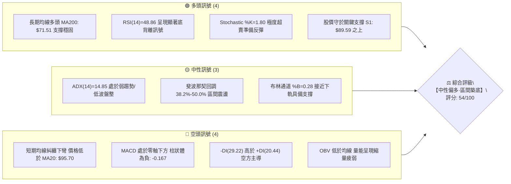
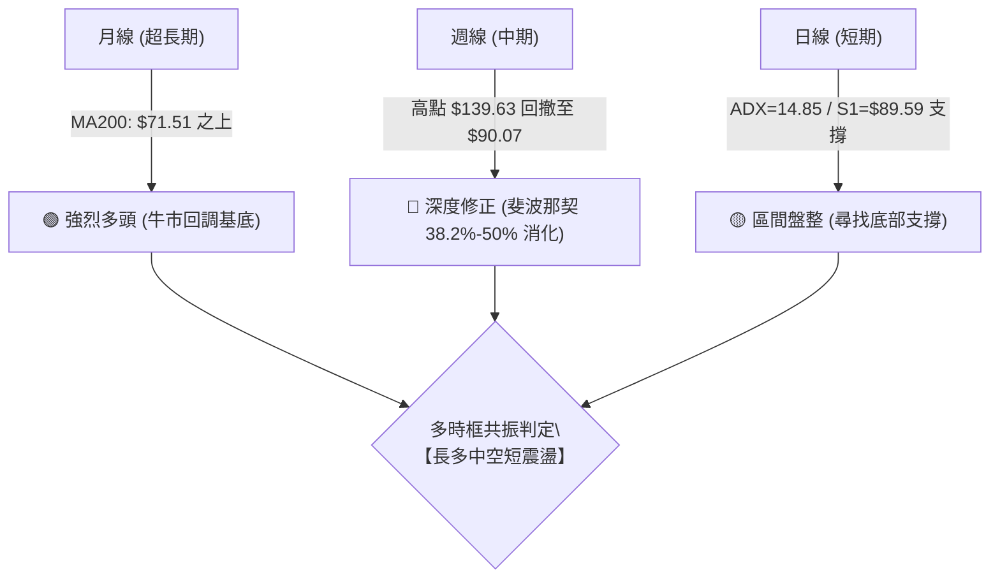
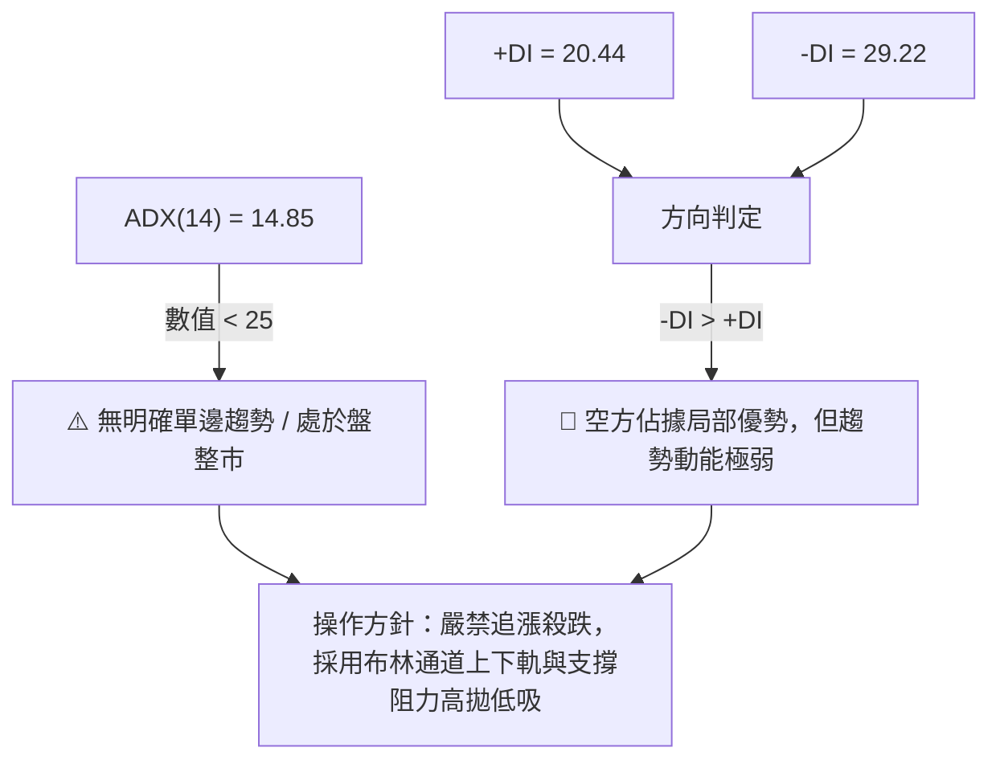
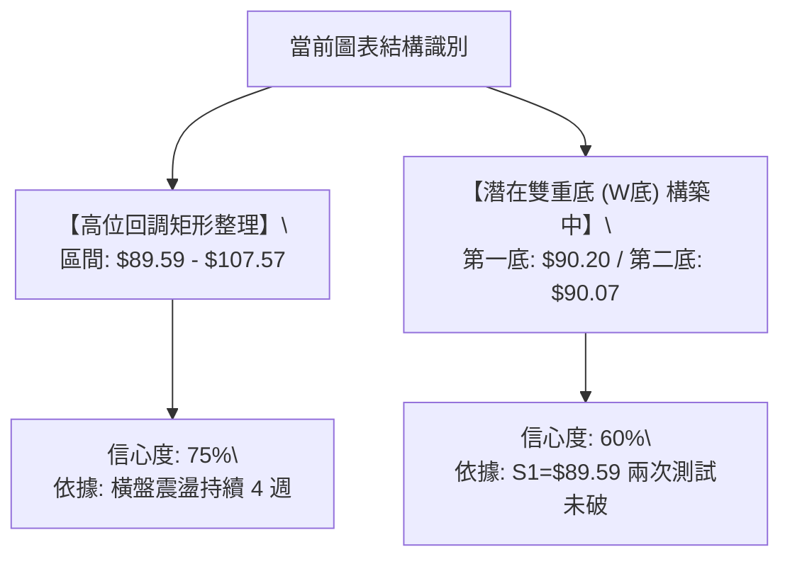
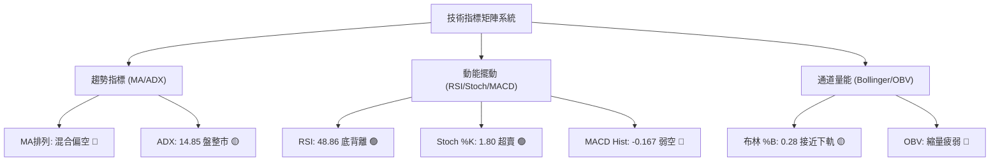
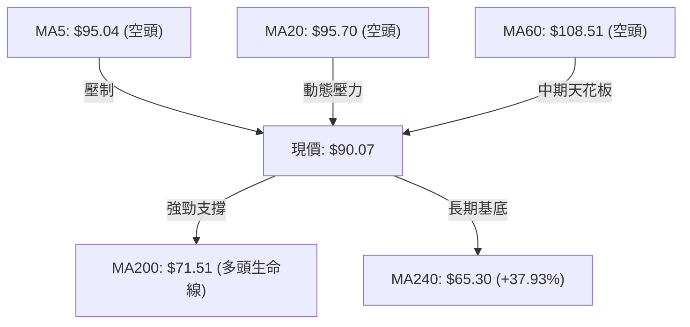
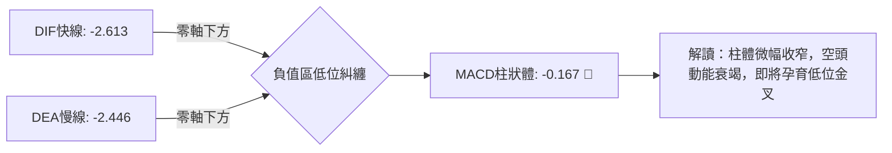
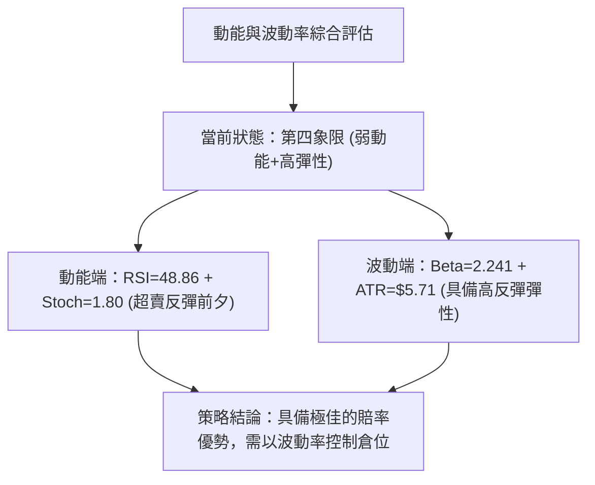
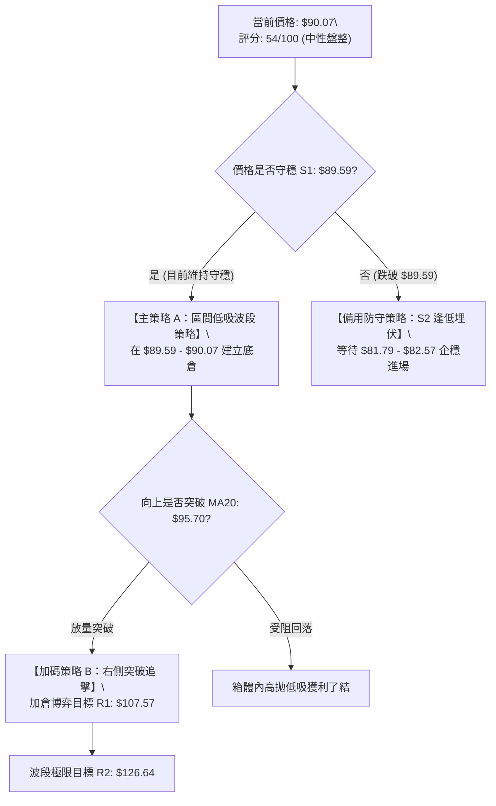
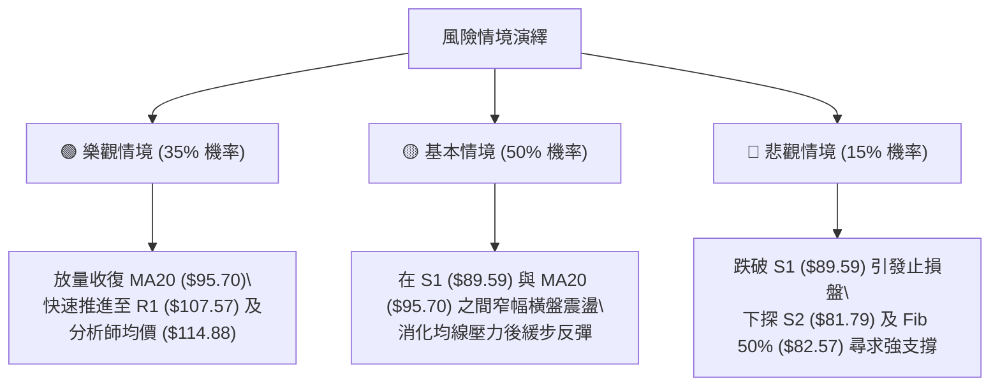

# INTC 技術分析報告

> **報告日期**：2026-08-22 ｜ **語言**：繁體中文 ｜ **數據來源**：Yahoo Finance ｜ **當前價格**：$90.07

---

## 目錄

| 章節 | 內容 |
|------|------|
| [1. 技術面概覽](#1-技術面概覽) | 訊號儀表板、核心指標、評分卡 |
| [2. 趨勢分析](#2-趨勢分析) | 多時框趨勢、長中短期走勢 |
| [3. 圖表形態分析](#3-圖表形態分析) | 形態識別、K線組合、目標價 |
| [4. 支撐與阻力](#4-支撐與阻力) | 關鍵價位、斐波那契回調 |
| [5. 技術指標深度解讀](#5-技術指標深度解讀) | MA/RSI/MACD/布林/成交量 |
| [6. 動能與波動率](#6-動能與波動率) | 動能評估、ATR、Beta |
| [7. 多時框架總結](#7-多時框架總結) | 時框架評分矩陣 |
| [8. 交易策略建議](#8-交易策略建議) | 多空策略、風險報酬比 |
| [9. 風險提示與監控](#9-風險提示與監控) | 監控指標、風險場景 |
| [📋 報告總結](#-報告總結) | 核心總結與策略佈局 |

---

## 1. 技術面概覽

### 🎯 技術訊號儀表板



### 📊 核心指標速覽表

| 指標類別 | 指標名稱 | 當前數值 | 訊號 | 解讀 |
|----------|----------|----------|------|------|
| **價格** | 當前價格 | $90.07 | 🟡 中性 | 守在 S1 ($89.59) 之上，自歷史高點回調後處於中段築底 |
| **均線** | MA20 | $95.70 | 🔴 空頭 | 價格位於 MA20 下方 (-5.88%)，短線面臨動態均線壓力 |
| **均線** | MA50 / MA60 | $108.18 / $108.51 | 🔴 空頭 | 價格顯著低於中期均線，中期趨勢仍處於回調修正期 |
| **均線** | MA200 / MA240 | $71.51 / $65.30 | 🟢 多頭 | 價格高於長期生命線 (+25.95%)，超長期牛市基調未變 |
| **動能** | RSI(14) | 48.86 | 🟢 多頭 | 中性區間內構築**底背離 (Bullish Divergence)**，下行動能衰竭 |
| **動能** | Stochastic (%K/%D) | 1.80 / 21.39 | 🟢 多頭 | %K 跌入個位數極度超賣區，具備強烈技術性反彈需求 |
| **動能** | MACD (12/26/9) | -2.613 / -2.446 | 🔴 空頭 | MACD 處於負值區且柱狀體為 -0.167，但空頭動能已顯著收斂 |
| **趨勢** | ADX (14) | 14.85 | 🟡 中性 | ADX < 25 表明單邊趨勢結束，市場進入橫盤整理與區間震盪 |
| **通道** | 布林通道 (%B) | 0.28 (寬度: $25.14) | 🟡 中性 | 股價運行於中軌 ($95.70) 與下軌 ($83.13) 之間，具下軌防禦 |
| **量能** | 20日成交均量比 | 0.79x (90.79M / 114.39M) | 🔴 空頭 | 縮量回調，OBV < MA 顯示量能疲弱，突破需補量配合 |
| **波動** | ATR(14) | $5.71 (6.34%) | 🟡 中性 | 每日波動幅度約 6.34%，屬於中高波動半導體權重股特性 |

### 🏆 技術評分卡

```
╔══════════════════════════════════════════════════════════════════╗
║                  技術評分卡 — INTC (2026-08-22)                   ║
╠══════════════════════════════════════════════════════════════════╣
║ 趨勢強度 (Trend)      ██████░░░░░░░░░░░░░░  30/100  🔴 ADX=14.85 ║
║ 動能指標 (Momentum)   ████████████░░░░░░░░  60/100  🟢 RSI底背離 ║
║ 支撐穩定度 (Support)  ██████████████░░░░░░  70/100  🟢 S1守穩中  ║
║ 成交量配合 (Volume)   ████████░░░░░░░░░░░░  40/100  🔴 縮量整理  ║
║ 形態完整度 (Pattern)  ████████████░░░░░░░░  60/100  🟡 矩形整理  ║
║ 均線排列 (MA System)  ████████████░░░░░░░░  60/100  🟡 多空交織  ║
╠══════════════════════════════════════════════════════════════════╣
║ 綜合評分 (Overall)    ███████████░░░░░░░░░  54/100  ⚖️ 中性觀望/ ║
║                                                     區間低吸佈局 ║
╚══════════════════════════════════════════════════════════════════╝
```

---

## 2. 趨勢分析

### 🌐 多時框趨勢分析



### 📈 長期趨勢 — 12個月走勢圖（Unicode）

```
INTC 月線歷史走勢圖（過去12個月：2025-08 至 2026-08）
價格 ($)
$140 ┤                                           ● 2026-06 ($139.63)
$130 ┤                                          ╱ ╲
$120 ┤                                 ● 2026-05      ╲
$110 ┤                                ╱ ($114.68)      ╲
$100 ┤                       ● 2026-04                  ╲
$90  ┤                      ╱ ($94.48)                   ●━━━━● 現價 ($90.07)
$80  ┤                     ╱                           2026-07  2026-08
$70  ┤                    ╱                           ($90.20) ($90.07)
$60  ┤                   ╱
$50  ┤          ● 2026-01
$40  ┤   ● 2025-10 ($39.99)
$30  ┤  ╱
$20  ┤ ● 2025-08 ($24.35)
     └─────────────────────────────────────────────────────────────
       08   09   10   11   12   01   02   03   04   05   06   07   08
      (2025)                      (2026)
```

#### 過去12個月走勢特徵分析

| 階段區間 | 起止價格 | 漲跌幅 | 趨勢特徵與結構解讀 |
|----------|----------|--------|--------------------|
| **第一階段：底部啟動** (2025-08 ~ 2025-11) | $24.35 → $40.56 | **+66.57%** | 突破長期底部平台，放量上攻，確立長線反轉架構。 |
| **第二階段：平台蓄勢** (2025-12 ~ 2026-03) | $36.90 → $44.13 | **+19.59%** | 在 $40.00~$46.00 建立高位中繼箱體，洗盤換手充分。 |
| **第三階段：主升浪爆發** (2026-04 ~ 2026-06) | $44.13 → $139.63 | **+216.41%** | 爆發性主升浪，成交量劇烈放大，觸及歷史波段頂點 $142.35。 |
| **第四階段：獲利了結與回調** (2026-07 ~ 2026-08) | $139.63 → $90.07 | **-35.49%** | 快速回吐主升浪漲幅，於 38.2% ($96.67) 與 50% ($82.57) 之間尋求支撐。 |

### 📊 中期趨勢（週線分析）

```
INTC 週線關鍵結構位示意圖
══════════════════════════════════════════════════════════════
  $142.35 ───────────────────────── 52W 歷史高點 (波段天花板)
          ╲
           ╲  獲利了結賣壓
            ╲
  $107.57 ───▼───────────────────── 關鍵頸線/週線阻力 R1 (MA60: $108.51)
              ▲
              │  當前區間震盪帶 ($89.59 ~ $107.57)
              ▼
  $90.07  ─── ◄──────────────────── 當前收盤價 ($90.07)
  $89.59  ───▲───────────────────── 近期波段關鍵支撐 S1 (日線守穩)
             │
  $81.79  ───┴───────────────────── 強力結構支撐 S2 (斐波那契 50.0% 匯聚區)
══════════════════════════════════════════════════════════════
```

近20週數據顯示，週線 RSI 從 2026-04 的極度超買 89.7 回落至當前 48.9，MACD 柱狀體從高點 +3.491 快速收斂至 -0.167。週線級別的高空動能已釋放 90% 以上，目前連續 3 週收盤於 $90.00~$102.50 窄幅區間，中期進入築底震盪。

### ⚡ 趨勢強度評估（ADX 解讀）



#### ADX 趨勢強度對照

| 指標項 | 數值 | 門檻標準 | 狀態評估 | 策略意義 |
|--------|------|----------|----------|----------|
| **ADX (14)** | **14.85** | < 20 極弱; 20-25 轉折; > 25 趨勢確立 | **極弱趨勢 / 盤整市場** | 擺動指標 (RSI/KD/布林) 優先於趨勢指標 (MA/MACD) |
| **+DI** | **20.44** | 多方買盤推動力 | **多頭推力不足** | 多方尚未發起總攻，反彈多以技術修復為主 |
| **-DI** | **29.22** | 空方拋壓推動力 | **空方佔優但未失控** | 雖空方佔優，但無強趨勢支撐，殺跌風險大於收益 |

---

## 3. 圖表形態分析

### 🔍 形態識別系統



#### 形態識別與信心度評估表

| 形態名稱 | 信心度 | 判斷依據（引用數據） | 完成度 | 目標價（附精確計算式） |
|----------|--------|----------------------|--------|------------------------|
| **矩形收斂區間** | **75%** | 底部在 S1 ($89.59) 獲得兩次支撐，頂部受制於 R1 ($107.57) | 80% | 向上突破目標：$107.57 + ($107.57 - $89.59) = **$125.55** (接近 R2: $126.64) |
| **潛在雙底 (W底)** | **60%** | 2026-08-02 低點 $90.20 與 2026-08-23 收盤 $90.07 形成雙腳，且 RSI 底背離 | 45% | 突破頸線 (MA20: $95.70) 目標：$95.70 + ($95.70 - $89.59) = **$101.81** |
| **頭肩頂形態 (反向)** | **35%** | 數據不足以確認完整右肩，且長期 MA200 ($71.51) 向上，訊號不足 | 20% | *訊號不足，不予採用幾何預測，僅做指標型防守解讀* |

### 🕯️ 重要K線形態分析

| 月份 / 週期 | 收盤價 | K線形態特徵 | 專業技術解讀 | 訊號 |
|-------------|--------|-------------|--------------|------|
| **2026-06** | $139.63 | 長上影流星線 (Shooting Star) | 衝高至 $142.35 後主力資金大幅出逃，確認階段性波段頂部 | 🔴 空頭反轉 |
| **2026-07** | $90.20 | 長實體大陰線 (Bearish Marubozu) | 恐慌盤湧出，單月重挫 35.4%，但下殺至 $90 附近量能開始衰竭 | 🔴 空頭延續 |
| **2026-08** | $90.07 | 窄幅十字星 / 孕線 (Harami) | 連續兩個月收盤於 $90 關口，波動率驟降，多空進入弱平衡平衡點 | 🟡 變盤築底 |

### 📉 ASCII 走勢形態示意圖

```
INTC 日線/週線 矩形整理與雙底築底示意圖
═════════════════════════════════════════════════════════════════════
  $107.57 ───┬────────────────────────────────────────── 阻力 R1 / 箱體上軌
             │         ▲                   ▲
             │        ╱ ╲                 ╱ ╲
  $95.70  ───┼───────╱───╲───────●───────╱───╲────────── 箱體中軸 / MA20
             │      ╱     ╲     ╱ ╲     ╱     ╲
             │     ╱       ╲   ╱   ╲   ╱       ╲
  $90.07  ───┼────●         ╲ ╱     ╲ ╱         ● ◄─── 現價 ($90.07)
  $89.59  ───┴─── S1 ────────▼───────▼───────── S1 ───── 支撐 S1 / 箱體下軌
                (第一腳 $90.20)     (第二腳 $90.07)
                 [─── 潛在雙底結構 (W-Bottom) ───]
═════════════════════════════════════════════════════════════════════
```

### 🎯 形態目標價計算

1. **箱體突破目標價**：
   - 形態下軌基點：$89.59 (S1)
   - 形態上軌頸線：$107.57 (R1)
   - 形態高度 ($H$) = $107.57 - $89.59 = **$17.98**
   - 向上突破目標 = $107.57 + $17.98 = **$125.55**（高度重合阻力位 R2: $126.64）
2. **箱體破位防守目標價**：
   - 向下破位測幅 = $89.59 - $17.98 = **$71.61**（高度重合 MA200: $71.51 支撐帶）

---

## 4. 支撐與阻力

### 🗺️ 關鍵價位分布圖（Unicode）

```
INTC 關鍵價位結構分布圖
══════════════════════════════════════════════════════════════════
$142.35 ║██████████████████████████████║ 52W 歷史最高點
$132.75 ║████████████████████████      ║ 強阻力 R3 (+47.39%)
$126.64 ║████████████████████          ║ 阻力 R2 (+40.60%)
$114.13 ║████████████████              ║ 斐波那契 23.6% 回調位
$107.57 ║████████████████████████      ║ 關鍵頸線阻力 R1 (+19.43%) / MA60
$96.67  ║████████████                  ║ 斐波那契 38.2% 回調位 / MA20附近
$90.07  ╠══════════════════════════════╣ ◄── 現價 ($90.07)
$89.59  ║▓▓▓▓▓▓▓▓▓▓▓▓▓▓▓▓▓▓▓▓▓▓▓▓      ║ 極近波段支撐 S1 (-0.53%)
$82.57  ║████████████████              ║ 斐波那契 50.0% 回調位 / 布林下軌附近
$81.79  ║████████████████████████      ║ 強力支撐 S2 (-9.19%)
$71.51  ║██████████████████            ║ 牛熊生命線 MA200
$42.58  ║██████████████████████████████║ 長期極限支撐 S3 (-52.73%)
══════════════════════════════════════════════════════════════════
```

### 🚧 阻力位分析表

| 阻力級別 | 精確價位 | 距離現價 | 形成原因 | 突破難度 | 重要性 |
|----------|----------|----------|----------|----------|--------|
| **R1** | **$107.57** | +19.43% | 近一年波段高點聚類、MA60 ($108.51) 與布林上軌 ($108.27) 密集重合區 | 🔴 極高 | ★★★★★ (中期牛熊分水嶺) |
| **R2** | **$126.64** | +40.60% | 歷史次高點密集換手區、2026-05 反彈頂部頸線位 | 🔴 高 | ★★★★☆ (主升浪強阻力) |
| **R3** | **$132.75** | +47.39% | 2026-06 歷史高點前的最後派發平台 | 🔴 極高 | ★★★☆☆ (歷史頂部密集成交區) |

### 🛡️ 支撐位分析表

| 支撐級別 | 精確價位 | 距離現價 | 形成原因 | 守住機率 | 重要性 |
|----------|----------|----------|----------|----------|--------|
| **S1** | **$89.59** | -0.53% | 近期波段雙底低點聚類、日線核心防禦點、整數關口防線 | 🟡 65% | ★★★★★ (短線多頭生死線) |
| **S2** | **$81.79** | -9.19% | 斐波那契 50% ($82.57) 與布林下軌 ($83.13) 共振支撐區 | 🟢 85% | ★★★★★ (中期強烈買盤支撐) |
| **S3** | **$42.58** | -52.73% | 2026年初爆發啟動平台、超長期籌碼堆積底座 | 🟢 98% | ★★★☆☆ (極端黑天鵝防線) |

### 📐 斐波那契回調位分析

*基準區間：52週波段低點 $22.78 → 52週波段高點 $142.35 (波幅: $119.57)*

```
斐波那契回調結構定位
0.0%  ── $142.35 (52W High)
23.6% ── $114.13
38.2% ── $96.67
         ▲
         │ 當前價格 $90.07 位於 38.2% ($96.67) 與 50.0% ($82.57) 之間
         ▼
50.0% ── $82.57 (黃金分割平衡點)
61.8% ── $68.46
78.6% ── $48.37
100.0%── $22.78 (52W Low)
```

#### 斐波那契關鍵位置解讀

| 回調比例 | 精確價位 | 技術含義與當前狀態分析 |
|----------|----------|------------------------|
| **0.0% (高點)** | $142.35 | 52週最高點，主升浪終點。 |
| **23.6%** | $114.13 | 第一反彈阻力位，接近分析師平均目標價 ($114.88)。 |
| **38.2%** | $96.67 | **強弱分界線**。現價處於其下方，短線偏弱；若能收復此位，反彈將加速展開。 |
| **50.0%** | $82.57 | **多頭核心防禦線**。通常強勢回調不應實質跌破 50% 關口，與 S2 ($81.79) 形成共振護城河。 |
| **61.8%** | $68.46 | 黃金分割極限回調位，緊鄰 MA200 ($71.51) 生命線。 |

---

## 5. 技術指標深度解讀

### 🎛️ 指標訊號總覽



### 📈 移動平均線排列分析



#### 均線體系詳細數據與狀態

| 均線名稱 | 當前價格 | 與現價乖離率 | 走勢特徵 (Sparkline) | 排列解讀與市場含義 |
|----------|----------|--------------|----------------------|--------------------|
| **MA 5** | $95.04 | -5.23% | `███▇▅▅▅▅▅▅▄▃▁▁` | 短線受壓，極速下扣，等待走平拐頭 |
| **MA 10** | $97.84 | -7.94% | `██▇▆▅▄▄▄▃▃▃▂▁▁` | 短期下行趨勢線，第一道動態反彈壓力 |
| **MA 20** | $95.70 | -5.88% | `████▇▇▆▆▅▅▄▄▃▂` | 布林中軌所在，多空短線分水嶺 |
| **MA 60** | $108.51 | -17.00% | `▃▄▄▅▆▇▇████▇▇▆` | 中期均線由升轉跌，構成 R1 強阻力區間 |
| **MA 120**| $91.18 | -1.22% | `▁▁▁▁▂▂▂▃▃▃▄▄▅` | 半年線與現價極度貼合，具備反覆爭奪特徵 |
| **MA 200**| $71.51 | +25.95% | `▁▁▂▂▃▃▄▄▅▅▆▇█` | 向上運行的年線生命線，長多格局基石 |
| **MA 240**| $65.30 | +37.93% | `▁▁▁▂▂▃▃▄▄▅▆▇█` | 兩年牛熊線，底部極其厚實 |

### 📉 RSI(14) 分析與背離判定

```
RSI (14) 指標狀態儀表
0 ──────────── 30 ──────────────── 50 ──────────────── 70 ─────────── 100
[ 超賣區間 ]  [    弱勢震盪區    ]  |  [    強勢推進區    ]  [ 超買區間 ]
                                   ▲
                           當前值: 48.86 (🟡 中性)
進度條: ████████████░░░░░░░░░░░░ 48.86%
```

#### ⚠️ RSI 底背離 (Bullish Divergence) 深度解析
- **價格走勢**：INTC 價格由 2026-07-26 的 $92.32 跌至 2026-08-23 的 $90.07，價格創出階段性新低。
- **RSI 軌跡**：RSI(14) 卻由 2026-07-26 的 **26.9** 大幅攀升至當前的 **48.9**，指標底部顯著抬高。
- **結論**：標準的**日線/週線級別看多底背離 (Bullish Divergence)**，表明空頭殺跌力竭，下行動能已實質耗盡，隨時可能引發技術性報復反彈。

### 📊 MACD(12/26/9) 訊號解讀



- **MACD 快線**：-2.613
- **MACD 慢線 (Signal)**：-2.446
- **MACD 柱狀體**：-0.167（相比 2026-07-19 的 -3.637 大幅收斂）
- **判定**：雖然仍處於零軸下方空頭區域，但負柱狀體已極度縮小（從 -3.637 → -0.167），即將在超賣區形成金叉預備結構。

### 📦 布林通道分析

```
INTC 布林通道結構示意圖 (寬度: $25.14)
═════════════════════════════════════════════════════════════════
  $108.27 ─────────────────────────────── 上軌 (Upper Band)
          ╲
           ╲
  $95.70  ─────────────────────────────── 中軌 (Middle Band / MA20)
             ╲
  $90.07  ────● ◄──────────────────────── 現價 (%B = 0.28)
               ╲
  $83.13  ─────────────────────────────── 下軌 (Lower Band)
═════════════════════════════════════════════════════════════════
```

- **帶寬特徵**：通道寬度 $25.14，開口未進一步發散，處於逐步收斂階段。
- **%B 指標**：0.28，處於下軌至中軌的弱勢吸籌區間，下軌 $83.13 與支撐位 S2 ($81.79) 構成強烈下檔支撐網絡。

### 💹 成交量分析（量價配合度）

- **當日成交量**：90,790,387 股
- **20日均量**：114,388,264 股（量比：**0.79x**）
- **50日均量**：118,764,540 股
- **OBV 狀態**：OBV < MA，能量潮處於低位沉睡狀態。
- **量價診斷**：當前呈現典型的**「縮量陰跌與築底」**特徵。未見恐慌性放量拋售，表明籌碼鎖定良好，但同時也反映出增量買盤仍在觀望，短期需一根放量長陽（日成交量突破 1.2 億股）方能確認突破。

---

## 6. 動能與波動率

### ⚡ 動能評估四象限

| 象限區間 | 動能強度 (RSI/MACD) | 波動率 (ATR/Beta) | INTC 當前定位 | 策略應對方針 |
|----------|---------------------|-------------------|---------------|--------------|
| **第一象限 (Q1)** | 強動能 (Bullish) | 低波動 (Low Vol) | ❌ | 穩健持股加倉 |
| **第二象限 (Q2)** | 弱動能 (Bearish) | 低波動 (Low Vol) | ❌ | 謹慎觀望，等待動能 |
| **第三象限 (Q3)** | 強動能 (Bullish) | 高波動 (High Vol) | ❌ | 追隨突破，嚴設止盈 |
| **第四象限 (Q4)** | **弱動能 (修復中)** | **高波動 (Beta=2.24)** | **✓ (當前狀態)** | **控制倉位，區間佈局低吸** |



### 📊 ATR 波動率分析

- **ATR(14)**：**$5.71** (佔現價比例：**6.34%**)
- **波動特性解讀**：每日平均震盪幅度達 $5.71，表明該股具有極高的交易活躍度與短線彈性。
- **風控與止損建議**：
  - 日內/短線交易止損距離建議設為 $1.0 \times \text{ATR} = \mathbf{\$5.71}$
  - 波段交易安全止損距離建議設為 $1.5 \times \text{ATR} = \mathbf{\$8.57}$
  - 現價 $90.07 下方波段安全防守位：$90.07 - $8.57 = **$81.50**（與 S2: $81.79 完美吻合）

### 📐 Beta 與市場相關性

- **Beta 係數**：**2.241**（極高 Beta 屬性）
- **市場敏感度**：INTC 對半導體板塊 (SOXX) 及納斯達克 100 指數 (QQQ) 具有放大 2.24 倍的波動特性。在大盤企穩反彈階段，該股將呈現顯著的超額 Alpha 彈性；但在大盤下挫時亦承擔雙倍下行風險。

---

## 7. 多時框架總結

### 📋 時框架評分表

| 時框架 | 趨勢方向 | 動能狀態 | 均線排列 | 形態結構 | 綜合評分 | 操作建議 |
|--------|----------|----------|----------|----------|----------|----------|
| **月線 (長期)** | 🟢 強烈多頭 | 🟡 中性回調 | 🟢 多頭排列 (MA200之上) | 突破長期底部後回踩 | **75/100** | 長線分批建倉 |
| **週線 (中期)** | 🔴 震盪偏空 | 🟢 衰竭收斂 | 🟡 均線糾纏 | 38.2%-50% 斐波那契回撤 | **50/100** | 逢低分批低吸 |
| **日線 (短期)** | 🟡 橫盤築底 | 🟢 底背離+超賣 | 🔴 均線壓制 | S1/S2 區間矩形箱體 | **55/100** | 區間高拋低吸 |

### 🔲 綜合訊號矩陣

```
時框架訊號收斂矩陣
┌───────────┬──────────────┬──────────────┬──────────────┬──────────────┐
│ 時框架    │ 均線系統     │ 動能指標     │ 量能指標     │ 形態支撐     │
├───────────┼──────────────┼──────────────┼──────────────┼──────────────┤
│ 短期(日線)│ 🔴 空頭壓制  │ 🟢 RSI底背離 │ 🔴 縮量整理  │ 🟢 S1支撐守穩│
│ 中期(週線)│ 🟡 均線糾纏  │ 🟡 柱體收斂  │ 🔴 量能衰退  │ 🟢 雙底成形中│
│ 長期(月線)│ 🟢 多頭生命線│ 🟢 歷史低位  │ 🟢 主力未出  │ 🟢 大底突破  │
└───────────┴──────────────┴──────────────┴──────────────┴──────────────┘
```

### ⚖️ 多時框收斂結論

> **依多時框收斂規則（嚴格要求 14）**：
> 1. **行情性質判定**：當前 ADX(14) = 14.85（遠低於 25 臨界值），明確判定當前市場處於**【盤整震盪行情】**，非單邊趨勢行情。
> 2. **主導時框與交易規則**：在盤整行情中，以**日線布林通道上下軌 ($83.13 ~ $108.27) 及波段 S/R ($89.59 ~ $107.57)** 作為核心交易邊界。
> 3. **最終方向性結論**：**【中性偏多·區間低吸觀望】**。長期多頭趨勢（MA200: $71.51）提供強大底部安全邊際，日線 RSI 底背離及 Stoch 超賣提供勝率支撐，策略以在支撐位 S1/S2 附近低吸為主。

---

## 8. 交易策略建議

### 🗺️ 策略決策流程圖



### 🧭 策略路由（依評分卡分流）

**當前主策略方向 = 【中性區間低吸 / 偏多反彈操作】（依評分 54/100）**
*在 ADX=14.85 盤整市中，依據布林下軌防禦及 RSI 底背離訊號，採取「左側支撐低吸 + 右側突破加碼」的區間震盪交易策略。*

---

### 🎯 價格情境階梯（Price Scenarios）

| 觸發條件 | 階段目標 | 後續延伸目標 | 情境技術含義 |
|----------|----------|--------------|--------------|
| **強勢突破 R1 ($107.57)** | **R2 ($126.64)** | **R3 ($132.75)** | 確認雙底突破，中期多頭主升浪重啟 |
| **突破 MA20 ($95.70)** | **R1 ($107.57)** | **Fib 23.6% ($114.13)** | 短線轉強，脫離底部箱體，挑戰中期均線 |
| **站穩現價 ($90.07) ~ S1 ($89.59)** | **MA20 ($95.70)** | **Fib 38.2% ($96.67)** | 區間築底震盪，底背離修復反彈 |
| **跌破 S1 ($89.59)** | **S2 ($81.79)** | **Fib 50.0% ($82.57)** | 箱體破位下尋支撐，測試布林下軌強支撐 |
| **極端跌破 S2 ($81.79)** | **MA200 ($71.51)** | **S3 ($42.58)** | 中期多頭形態破壞，回測年線超長生命線 |

---

### 📊 情境機率分佈

| 發展情境 | 機率預估 | 主要指標與技術依據 |
|----------|----------|--------------------|
| **情境一：守穩反彈 / 向上突破** | **55%** | RSI 日線底背離、Stoch %K=1.80 極度超賣、守穩 S1 ($89.59)、MACD 負柱大幅收斂 |
| **情境二：箱體窄幅震盪** | **30%** | ADX=14.85 處於盤整格局、成交量萎縮低於均量 (0.79x)、多空於 MA120 ($91.18) 糾纏 |
| **情境三：破位深跌 / 二次探底** | **15%** | -DI (29.22) 仍佔據主導、價格位於 MA20 下方，若大盤系統性下挫恐下探 S2 ($81.79) |

---

### 🟢 主策略詳情

#### 交易策略參數明細表

| 策略要素 | 策略 A：左側波段低吸 (區間底倉) | 策略 B：右側突破跟進 (動量加碼) |
|----------|--------------------------------|--------------------------------|
| **策略類型** | 支撐位低吸博弈底背離 | 突破均線確認後右側加倉 |
| **進場條件** | 股價守穩 S1 ($89.59)，回踩不破確認 | 日線實體突破並站穩 MA20 ($95.70) 且放量 |
| **進場價格** | **$90.07** (現價區間 $89.60~$90.10) | **$95.80** (突破 MA20 $95.70 後確認) |
| **目標價 T1** | **$96.67** (斐波那契 38.2% / 短線阻力) | **$107.57** (關鍵阻力位 R1) |
| **目標價 T2** | **$107.57** (關鍵阻力 R1 / 箱體上軌) | **$126.64** (波段阻力 R2) |
| **止損價格** | **$86.50** (跌破 S1 $89.59 後留緩衝) | **$91.00** (跌回 MA120 之下) |
| **風險空間** | $90.07 - $86.50 = **$3.57** | $95.80 - $91.00 = **$4.80** |
| **獲利空間(T2)**| $107.57 - $90.07 = **$17.50** | $126.64 - $95.80 = **$30.84** |
| **風險報酬比 (R:R)**| **1 : 4.90** (以 T2 計算) | **1 : 6.43** (以 T2 計算) |
| **預估勝率** | **65%** | **58%** |
| **建議倉位** | **15% - 20%** (總資金) | **10% - 15%** (加碼部位) |

---

### 🔴 反向風險觸發點（對沖與風控提示）

1. **短線破位止損點**：若日線收盤價**實體跌破 $89.59 (S1)**，表明雙底形態構建失敗，應立即將多頭部位減半，等待 $81.79~$82.57 支撐區間。
2. **中期多空反轉點**：若價格帶量**跌破 $81.79 (S2)**，技術面將形成中級破位下行，應全面清倉多頭並考慮買入 Put 期權或反向對沖標的。
3. **空方動能復甦訊號**：若 MACD 柱狀體未能形成金叉反而再次擴大跌破 -2.00，且 -DI 升至 35 以上，嚴禁任何抄底行為。

---

### ⭐ 整體訊號強度評星

```
╔══════════════════════════════════════════════════════════════════╗
║ 做多訊號強度：  ★★★☆☆  (3.5/5星) — RSI底背離與S1支撐支撐勝率     ║
║ 做空訊號強度：  ★★☆☆☆  (2.0/5星) — 動能指標嚴重超賣，殺跌動能弱 ║
║ 整體可信度：    ★★★★☆  (4.0/5星) — S/R 價位清晰，盈虧比極佳    ║
╚══════════════════════════════════════════════════════════════════╝
```

---

## 9. 風險提示與監控

### ✅ 關鍵監控指標 Checklist

```
╔══════════════════════════════════════════════════════════════════╗
║                     每日交易監控 Checklist                       ║
╠══════════════════════════════════════════════════════════════════╣
║ [ ] 價位監控：收盤價是否持續守在 S1: $89.59 之上                 ║
║ [ ] 突破確認：日線收盤是否放量突破 MA20: $95.70                  ║
║ [ ] 動能監控：RSI(14) 是否成功突破 50 中軸分水嶺                ║
║ [ ] 指標金叉：MACD DIF 是否向上穿越 Signal 線完成零下金叉       ║
║ [ ] 量能配合：反彈日成交量是否放大至 114M (20日均量) 以上        ║
║ [ ] 波動預警：日內振幅是否異常超出 ATR ($5.71) 觸發極端行情      ║
║ [ ] 機構評級：關注華爾街目標價均值 $114.88 之變動狀況            ║
╚══════════════════════════════════════════════════════════════════╝
```

### ⚠️ 風險場景分析



### 🛡️ 風險管理重要提醒

1. **高 Beta 波動控制**：INTC Beta 值高達 **2.241**，波動幅度為大盤的兩倍以上，總持倉部位不得超過投資組合總資金的 **25%**，避免單一標的過度暴露。
2. **ATR 動態止損紀律**：嚴格執行以 ATR ($5.71) 測算的止損位，絕不隨意向下移動止損線。
3. **盤整市追高風險**：ADX=14.85 揭示目前無單邊大趨勢，任何觸及布林上軌 ($108.27) 或阻力 R1 ($107.57) 的未放量陽線均為短線獲利點，切忌在阻力位追高。

---

## 📋 報告總結

```
╔══════════════════════════════════════════════════════════════════╗
║                   INTC 技術分析報告總結 (2026-08-22)             ║
╠══════════════════════════════════════════════════════════════════╣
║ 當前價格：$90.07       52W 區間：$22.78 - $142.35 (位於 56.3%)   ║
║ 技術評級：⚖️ 中性偏多 (54/100) — 盤整築底，盈虧比極佳區間         ║
╠══════════════════════════════════════════════════════════════════╣
║ 關鍵結論：                                                       ║
║ ├─ 長期趨勢：🟢 穩固多頭 (MA200: $71.51 向上運行，長線支撐極強)  ║
║ ├─ 中期趨勢：🟡 震盪回調 (高點回撤 35.5%，於斐波那契 38.2%-50% 築底)║
║ ├─ 短期趨勢：🟢 蓄勢反彈 (RSI 底背離確立，Stoch %K=1.80 極度超賣)║
║ ├─ 關鍵支撐：S1: $89.59 (極近防守) │ S2: $81.79 (強力波段底)    ║
║ ├─ 關鍵阻力：R1: $107.57 (箱體上軌) │ R2: $126.64 (波段目標)   ║
║ └─ 機構共識：Hold 評級 │ 目標均價: $114.88 (隱含 +27.5% 空間)   ║
╠══════════════════════════════════════════════════════════════════╣
║ 最優策略組合：                                                   ║
║ 1. 🥇 最佳機會：在現價 $90.07 附近逢低建立底倉，止損 $86.50，   ║
║                 目標直指 $107.57 (R:R = 1 : 4.90)               ║
║ 2. 🥈 右側加碼：待股價放量突破 MA20 ($95.70) 加倉，上看 $126.64 ║
║ 3. 🥉 保守選擇：若意外跌破 S1，於 S2 ($81.79) 附近掛單左側承接  ║
╚══════════════════════════════════════════════════════════════════╝
```

---

> ⚠️ **免責聲明**：本報告為技術分析研究成果，所有數據及技術推演均嚴格基於歷史 OHLCV 量價模型。本報告**僅供學術研究與投資策略參考**，**不構成任何具體投資建議**。金融市場具有高度風險，投資者應獨立評估風險並自負盈虧。

---
*報告生成時間：2026-08-22 ｜ 數據來源：Yahoo Finance ｜ 分析框架：多時框技術分析模型*