# INTC 技術分析報告

> **報告日期**：2026-08-24 ｜ **語言**：繁體中文 ｜ **數據來源**：Yahoo Finance ｜ **當前價格**：$90.07

---

## 目錄

| 章節 | 內容 |
|------|------|
| [1. 技術面概覽](#1-技術面概覽) | 訊號儀表板、核心指標、評分卡 |
| [2. 趨勢分析](#2-趨勢分析) | 多時框趨勢、長中短期走勢 |
| [3. 圖表形態分析](#3-圖表形態分析) | 形態識別、K線組合、目標價 |
| [4. 支撐與阻力](#4-支撐與阻力) | 關鍵價位、斐波那契回調 |
| [5. 技術指標深度解讀](#5-技術指標深度解讀) | MA/RSI/MACD/布林/成交量 |
| [6. 動能與波動率](#6-動能與波動率) | 動能評估、ATR、Beta |
| [7. 多時框架總結](#7-多時框架總結) | 時框架評分矩陣 |
| [8. 交易策略建議](#8-交易策略建議) | 多空策略、風險報酬比 |
| [9. 風險提示與監控](#9-風險提示與監控) | 監控指標、風險場景 |
| [10. 報告總結](#-報告總結) | 核心結論與策略彙整 |

---

## 1. 技術面概覽

### 🎯 技術訊號儀表板

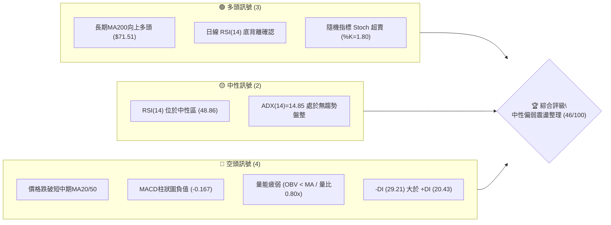

### 📊 核心指標速覽表

| 指標類別 | 指標名稱 | 當前數值 | 訊號 | 解讀 |
|----------|----------|----------|------|------|
| **價格** | 當前價格 | $90.07 | 🟡 | 位於52週區間56.3%分位，自高點$142.35回調後進入震盪 |
| **均線** | MA20 | $95.70 | 🔴 | 價格低於MA20達5.88%，短線承壓於中軌 |
| **均線** | MA50 | $108.18 | 🔴 | 價格低於MA50達16.74%，中期趨勢處於修正階段 |
| **均線** | MA200 | $71.51 | 🟢 | 價格高於MA200達25.95%，長期牛市基底未破 |
| **動能** | RSI(14) | 48.86 | 🟢 | 數值中性但呈現「底背離」，短線具備技術性反彈動能 |
| **動能** | MACD | -2.613 | 🔴 | MACD位於零軸下方且Hist為-0.167，空頭動能主導中 |
| **動能** | Stoch %K/%D | 1.80 / 21.39 | 🟢 | 極度超賣區間，短線下行動能耗竭，隨時可能反抽 |
| **趨勢** | ADX(14) | 14.85 | 🟡 | 低於25閾值，表明目前為弱趨勢／區間震盪行情 |
| **通道** | 布林 %B | 0.28 | 🟡 | 逼近下軌$83.13，處於通道下半區，支撐買盤逐步浮現 |
| **量能** | 20日均量比 | 0.80x | 🔴 | 量能萎縮且OBV<MA，買盤追價意願不足 |
| **波動** | ATR(14) | $5.71 | 🟡 | 佔股價6.34%，日均波動適中偏高，需設置充足止損空間 |

### 🏆 技術評分卡

```
╔══════════════════════════════════════════════════════════════╗
║              技術評分卡 — INTC (2026-08-24)                 ║
╠══════════════════════════════════════════════════════════════╣
║ 趨勢強度 (ADX=14.85)     ███░░░░░░░░░░░░░░░░░  30/100  🔴   ║
║ 動能指標 (RSI+MACD+Stoch)██████████░░░░░░░░░░  50/100  🟡   ║
║ 支撐穩定度 (S1=$89.59)   ██████████████░░░░░░  70/100  🟢   ║
║ 成交量配合 (OBV疲弱)     ██████░░░░░░░░░░░░░░  30/100  🔴   ║
║ 形態完整度 (區間整理)    ██████████░░░░░░░░░░  50/100  🟡   ║
║ 均線排列 (短空長多)      ████████░░░░░░░░░░░░  45/100  🟡   ║
╠══════════════════════════════════════════════════════════════╣
║ 綜合評分                 █████████░░░░░░░░░░░  46/100  🟡   ║
║ 評級結論                 中性觀望 / 區間震盪操作             ║
╚══════════════════════════════════════════════════════════════╝
```

---

## 2. 趨勢分析

### 🌐 多時框趨勢分析

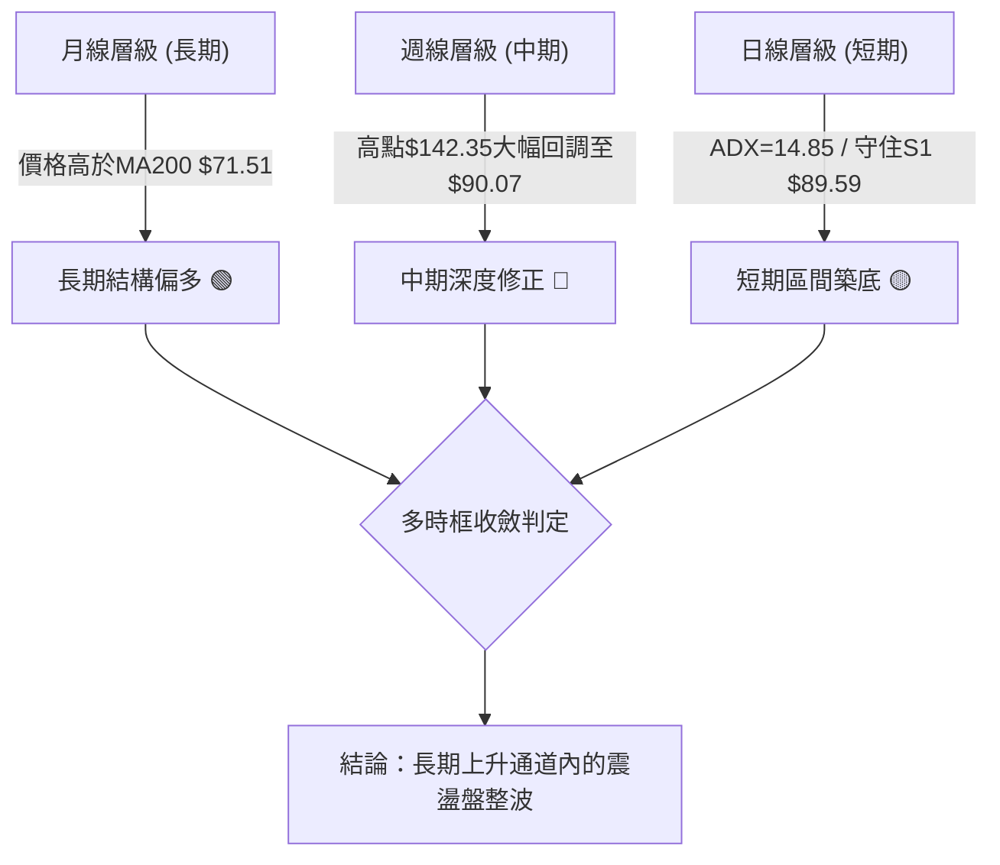

### 📈 長期趨勢 — 12個月走勢圖（Unicode）

```
INTC 月線走勢圖（2025-08 至 2026-08）
價格軸 ($)
$140 ┤                                  ● $139.63 (2026-06 高點)
$120 ┤                             ●
$100 ┤                        ●
$90  ┤                                       ●────● $90.07 (現價)
$50  ┤                   ●
$40  ┤              ●    ●
$30  ┤         ●
$24  ┤● $24.35 
     └─────────────────────────────────────────────────────────────
       08   09   10   11   12   01   02   03   04   05   06   07   08
      (2025)                   (2026)
```

**12個月走勢階段特徵分析**：

| 階段區間 | 期間價格變化 | 漲跌幅 | 走勢特徵與技術解讀 |
|----------|--------------|--------|--------------------|
| **底部蓄勢期** (2025-08 ~ 2025-12) | $24.35 → $36.90 | +51.54% | 脫離歷史底部，成交量逐步放大，均線呈現多頭排列發散。 |
| **主升推升期** (2026-01 ~ 2026-03) | $46.47 → $44.13 | -5.04% | 平台整理換手，在$44-$46區間完成籌碼沉澱。 |
| **狂熱噴發期** (2026-04 ~ 2026-06) | $94.48 → $139.63 | +47.79% | 爆量主升浪，創下52週高點$142.35，RSI進入嚴重超買區(>88)。 |
| **劇烈修正期** (2026-07 ~ 2026-08) | $90.20 → $90.07 | -0.14% | 高位獲利了結引發急速修正，目前於$90附近尋求底部支撐。 |

### 📊 中期趨勢（週線分析）

中期走勢呈現「高位暴跌後的平台收斂」格局。近20週數據顯示，股價自2026年6月高點回落後，在2026-07-26週觸及低點$92.32，隨後在2026-08-09週反彈至$101.65，近期再度壓回至$90.07測試支撐。

```
近期週線壓力與支撐結構示意圖：
$132.75 ────────────────────────────── R3 (波段次高密集區)
$126.64 ────────────────────────────── R2 (反彈阻力位)
$107.57 ────────────────────────────── R1 (MA50與波段頸線壓力)
$90.07  ══════════════════════════════ [ 現價 ]
$89.59  ------------------------------ S1 (近一年波段關鍵支撐)
$81.79  ────────────────────────────── S2 (強支撐/斐波50%)
```

### ⚡ 趨勢強度評估（ADX 解讀）

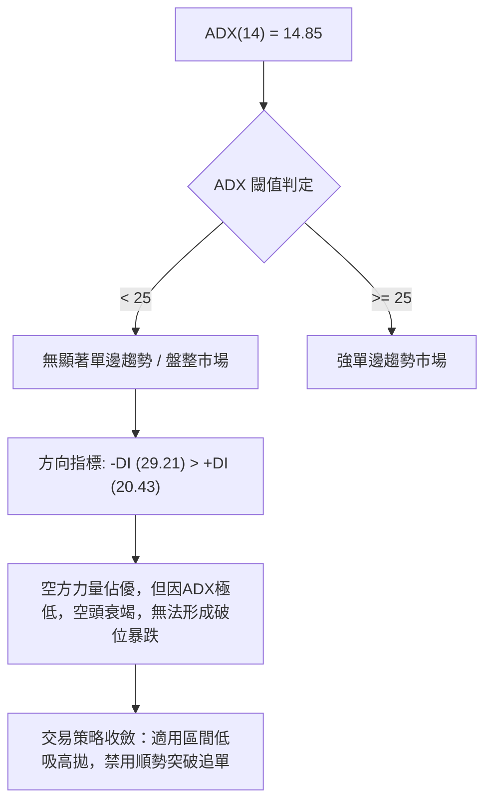

| 指標名稱 | 數值 | 狀態等級 | 行情研判 |
|----------|------|----------|----------|
| **ADX(14)** | 14.85 | 弱趨勢 / 盤整 (███░░░░░░░) | 趨勢強度不足，價格進入區間震盪，指標鈍化風險低。 |
| **+DI** | 20.43 | 多方動能偏弱 (████░░░░░░) | 買盤缺乏連續推升能力。 |
| **-DI** | 29.21 | 空方主導控制 (██████░░░░) | 空頭雖控盤但推低動能正在減弱。 |

---

## 3. 圖表形態分析

### 🔍 形態識別系統

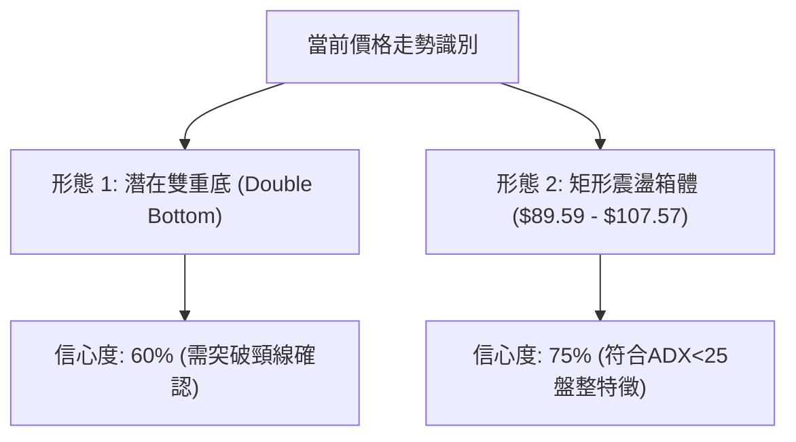

**形態信心度與目標價計算表**：

| 形態名稱 | 信心度 | 判斷依據（引用數據） | 完成度 | 目標價（附精確計算式） |
|----------|--------|----------------------|--------|------------------------|
| **潛在雙重底** | 60% | 第一低點7月收盤$90.20，第二低點當前$90.07（支撐位S1=$89.59有效） | 50% | 頸線為近期反彈高點$102.50。<br>形態高度 = $102.50 - $89.59 = $12.91。<br>突破目標價 = $102.50 + $12.91 = **$115.41**（接近R1上方） |
| **矩形整理箱體** | 75% | 價格受限於箱底S1 $89.59與箱頂R1 $107.57之間震盪 | 80% | 箱頂目標 = **$107.57** (R1)<br>箱底支撐 = **$89.59** (S1) |

### 🕯️ 重要K線形態分析

| 月份/週期 | 收盤價 | K線形態特徵 | 技術解讀 | 訊號 |
|-----------|--------|-------------|----------|------|
| **2026-06** | $139.63 | 高位長上影倒錘頭/十字星 | 逼近$142.35後爆量滯漲，多頭動能耗竭 | 🔴 看跌反轉 |
| **2026-07** | $90.20 | 大陰線破位向下 | 獲利盤狂瀉，單月暴跌超35%，殺跌動能集中釋放 | 🔴 極度弱勢 |
| **2026-08 (進行中)** | $90.07 | 低位十字星/縮量錘子線 | 跌勢大幅趨緩，在S1 $89.59上方止跌收斂，下影線顯現買盤 | 🟢 築底企穩 |

### 📉 ASCII 走勢形態示意圖

```
INTC 雙底與箱體整理形態示意圖：
$107.57 ┬─────────────────────────────────────── 箱頂 / 阻力 R1
        │                ▲ 頸線區 $102.50
        │               / \
$95.70  ┼─ ─ ─ ─ ─ ─ ─ /─ ─\─ ─ ─ ─ ─ ─ ─ ─ ─ ─ ─ MA20 中軌
        │  底 1       /     \       底 2 (現價)
$89.59  ┴──●─────────┘       └──────●─────────── 箱底 / 支撐 S1
          2026-07                  2026-08
          ($90.20)                 ($90.07)
```

---

## 4. 支撐與阻力

### 🗺️ 關鍵價位分布圖（Unicode）

```
INTC 價位結構分布圖
═══════════════════════════════════════════════════════════════
$132.75 ║██████████████████████████████║ 強阻力 R3 (密集高點區)
$126.64 ║████████████████████          ║ 阻力 R2 (次級波段高點)
$114.13 ║▓▓▓▓▓▓▓▓▓▓▓▓▓▓▓▓▓▓            ║ 斐波那契 23.6% 回調位
$107.57 ║██████████████████████████████║ 關鍵阻力 R1 (MA50/箱頂)
$96.67  ║▓▓▓▓▓▓▓▓▓▓▓▓▓▓▓▓              ║ 斐波那契 38.2% 回調位
$95.70  ║──────────────────────────────║ MA20 / 布林中軌
$90.07  ╠══════════════════════════════╣ ◄ 當前價格
$89.59  ║██████████████████████████████║ 近期關鍵支撐 S1 (波段低點)
$82.57  ║▓▓▓▓▓▓▓▓▓▓▓▓▓▓▓▓▓▓▓▓          ║ 斐波那契 50.0% 回調位
$81.79  ║██████████████████████████████║ 強支撐 S2 (波段深度低點)
$71.51  ║──────────────────────────────║ 長期生命線 MA200
$42.58  ║████████████████████          ║ 極端支撐 S3 (歷史籌碼平台)
═══════════════════════════════════════════════════════════════
```

### 🚧 阻力位分析表

| 阻力級別 | 價位 | 距離現價 | 形成原因 | 突破難度 | 重要性 |
|----------|------|----------|----------|----------|--------|
| **R1** | **$107.57** | +19.43% | 近一年波段高點聚類、MA50($108.18)與布林上軌($108.27)重合區 | 高 | ⭐⭐⭐⭐⭐ |
| **R2** | **$126.64** | +40.60% | 2026年5-6月整理平台次高點聚類 | 極高 | ⭐⭐⭐⭐☆ |
| **R3** | **$132.75** | +47.39% | 歷史頂部密集成交區，多頭套牢盤核心區 | 極高 | ⭐⭐⭐☆☆ |

### 🛡️ 支撐位分析表

| 支撐級別 | 價位 | 距離現價 | 形成原因 | 守住機率 | 重要性 |
|----------|------|----------|----------|----------|--------|
| **S1** | **$89.59** | -0.53% | 近一年波段低點聚類，7-8月雙底測試支撐線 | 70% | ⭐⭐⭐⭐⭐ |
| **S2** | **$81.79** | -9.19% | 近一年重要波段低點、逼近布林下軌($83.13)與斐波50%($82.57) | 85% | ⭐⭐⭐⭐⭐ |
| **S3** | **$42.58** | -52.73% | 2026年Q1啟動前歷史籌碼密集平台低點 | 95% | ⭐⭐⭐☆☆ |

### 📐 斐波那契回調位分析

依據 52 週波動區間（低點 **$22.78** 至 高點 **$142.35**），計算標準回調位如下：

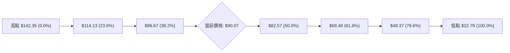

- **當前位置解讀**：現價 **$90.07** 位於 **38.2% 回調位 ($96.67)** 與 **50.0% 回調位 ($82.57)** 之間。
- **技術意義**：
  - 38.2% ($96.67) 轉化為短線第一道上檔壓力（與MA20 $95.70形成共振阻力帶）。
  - 50.0% ($82.57) 為強大多頭防守區間，該位置與波段支撐 S2 ($81.79) 形成強烈的「黃金共振支撐區」，若股價意外下探至此，將是極佳的中長線低吸點。

---

## 5. 技術指標深度解讀

### 🎛️ 指標訊號總覽

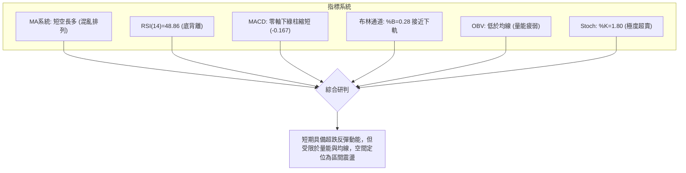

### 📈 移動平均線排列分析

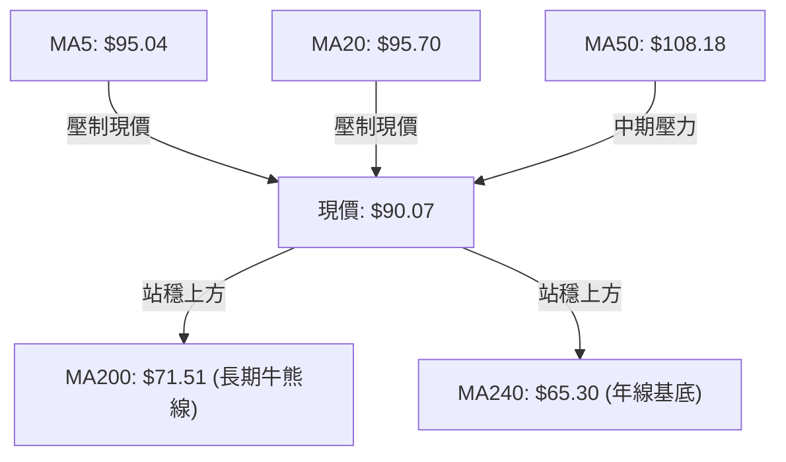

**均線結構詳細數據**：

| 均線名稱 | 數值 | 與現價偏離度 | 走勢斜率 | 技術意涵 |
|----------|------|--------------|----------|----------|
| **MA5** | $95.04 | -5.23% | 下行 ▼ | 極短線空頭壓制 |
| **MA10** | $97.84 | -7.94% | 下行 ▼ | 短線反彈第一道動態阻力 |
| **MA20** | $95.70 | -5.88% | 下行 ▼ | 月線生命線，突破方能扭轉短空 |
| **MA60** | $108.51 | -17.00% | 下行 ▼ | 季線下行，中期壓制顯著 |
| **MA120**| $91.18 | -1.22% | 走平 ▼ | 半年線附近多空激烈爭奪 |
| **MA200**| $71.51 | +25.95% | 上行 ▲ | 長期趨勢支撐穩固，維持牛市基底 |
| **MA240**| $65.30 | +37.93% | 上行 ▲ | 超長期上升趨勢未受損害 |

### 📉 RSI(14) 分析與背離判斷

- **當前數值**：48.86（處於 30–70 中性平衡區間）。
- **進度條**：`█████████░░░░░░░░░░░ 48.86%`
- **背離分析（關鍵技術點）**：
  - **結論**：⚠️ **明確存在日線級別底背離 (Bullish Divergence)**。
  - **細節驗證**：回顧近幾週收盤，2026-07-19 價格 $95.04 時 RSI 為 27.4，2026-07-26 價格跌至 $92.32 時 RSI 為 26.9；而當前價格進一步壓低至 $90.07 時，RSI 卻顯著回升至 **48.86**。價格創出波段新低而 RSI 指標底部大幅抬高，表明下殺動能已嚴重衰竭，醞釀技術性向上修復。

### 📊 MACD(12/26/9) 訊號解讀

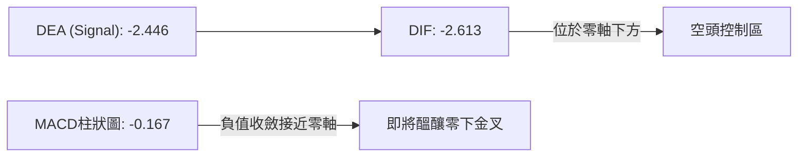

- **MACD狀態**：雙線位於零軸下方，屬於弱勢震盪格局。但綠色柱狀圖（-0.167）已顯著縮短，顯示自7月中旬（Hist -3.637）以來的空頭殺跌狂潮已告一段落，動能指標正向多方修復。

### 📦 布林通道分析

```
布林通道結構圖（日線）
$108.27 ┬──────────────────────────────────────── 上軌 (超買阻力)
        │
$95.70  ┼──────────────────────────────────────── 中軌 (MA20阻力)
        │
$90.07  * [現價: 位於下半區，%B = 0.28]
        │
$83.13  ┴──────────────────────────────────────── 下軌 (超賣支撐)
```

- **通道帶寬**：上軌 $108.27，下軌 $83.13，通道寬度 $25.14。
- **%B 指標**：0.28（小於 0.5 且靠近下軌），表明價格處於統計學上的相對低估區間，在 $83.13-$89.59 區間具備極強的下軌支撐彈性。

### 💹 成交量分析（量價配合度）

- **量能數據**：最新成交量 91,192,100，20日均量 114,408,350，**量比僅 0.80x**。
- **量價關係**：
  - 股價下行時成交量明顯萎縮，未出現恐慌性拋盤，屬於典型的「無量陰跌與縮量築底」。
  - **OBV 指標**：OBV < MA，顯示機構大資金追高意願不足，當前以場內存量資金博弈為主，缺乏增量資金推動單邊突破。

---

## 6. 動能與波動率

### ⚡ 動能評估四象限

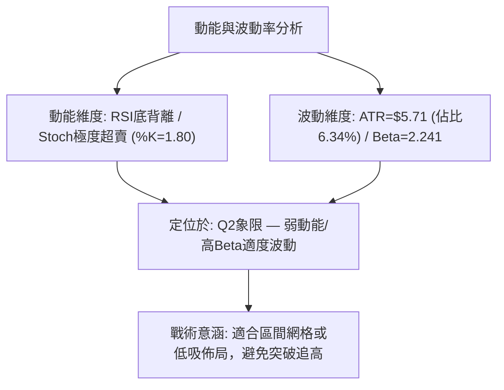

| 象限 | 動能狀態 | 波動率狀態 | INTC 當前定位 | 交易指導意義 |
|------|----------|------------|---------------|--------------|
| **Q1** | 強動能 (Trend) | 低波動 (Low Vol) | ─ | 穩健順勢持有 |
| **Q2** | 弱動能 (Consolidation) | 適度/高波動 (Moderate/High Vol) | **✓ (當前狀態)** | **區間震盪低吸高拋，依賴支撐阻力操作** |
| **Q3** | 強動能 (Explosive) | 高波動 (High Vol) | ─ | 高風險高收益突破交易 |
| **Q4** | 弱動能 (Downtrend) | 極端波動 (Panic Vol) | ─ | 全面空倉避險 |

### 📊 ATR 波動率分析

- **ATR(14) 數值**：**$5.71**（佔現價 $90.07 的 6.34%）。
- **風控指引**：
  - **日內正常雜訊區間**：±$5.71。
  - **標準技術止損距離**：建議設置 1.0 ~ 1.5 倍 ATR，即 **$5.71 ~ $8.56** 的保護緩衝區，以避免被日內正常波動震盪出場。

### 📐 Beta 與市場相關性

- **Beta 係數**：**2.241**。
- **解讀**：INTC 具有極高的市場敏感度（高彈性半導體標的），其波動幅度為大盤（S&P 500）的 2.24 倍。當大盤反彈時，INTC 反彈爆發力強；但大盤回調時，亦承擔加倍回撤風險。

---

## 7. 多時框架總結

### 📋 時框架評分表

| 時框架 | 趨勢方向 | 動能狀態 | 均線排列 | 形態結構 | 綜合評分 | 操作建議 |
|--------|----------|----------|----------|----------|----------|----------|
| **月線 (長期)** | 偏多 🟢 | 高位回落蓄勢 | 多頭排列 (遠高於MA200) | 巨幅主升後回調 | **75/100** | 長線價值與結構看多，逢低建倉 |
| **週線 (中期)** | 偏空 🔴 | 綠柱收斂減弱 | 跌破MA50，短中期均線下彎 | 自$142.35回落深度修正 | **38/100** | 中期承壓，防範反彈遇阻二次探底 |
| **日線 (短期)** | 中性 🟡 | RSI底背離/超賣 | 均線交織混亂 (MA20下方) | 箱體震盪 / 雙底構築中 | **48/100** | 依託S1 $89.59進行區間波段博弈 |

### 🔲 綜合訊號矩陣

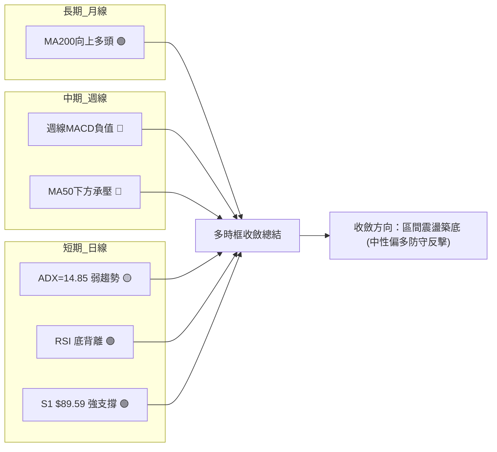

### ⚖️ 多時框收斂結論

依據多時框收斂規則：
1. **趨勢強度檢驗**：當前日線 **ADX(14) = 14.85 < 25**，市場確認進入**標準盤整行情**，單邊趨勢策略失效。
2. **時框衝突化解**：中期週線處於深度修正（偏空），但長期月線MA200（$71.51）提供強大底部托底；日線出現顯著的 RSI 底背離與 Stoch 極度超賣。
3. **唯一方向性結論**：**中性觀望／區間震盪築底**。以**日線布林通道上下軌（$83.13 - $108.27）與波段支撐阻力（S1 $89.59 - R1 $107.57）**為核心交易區間，以防守型低吸策略為主。

---

## 8. 交易策略建議

### 🗺️ 策略決策流程圖

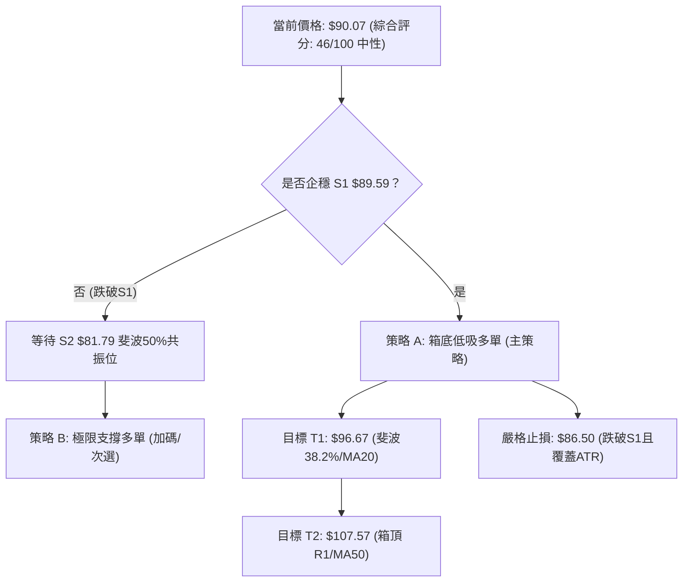

### 🧭 策略路由

> **當前主策略方向 = 區間震盪低吸操作（依綜合評分 46/100 判定）**
> 綜合評分處於 40–60 區間，ADX<25，明確定義為**區間震盪行情**。策略核心為：**在箱體下軌支撐處低吸，在通道上軌及均線共振阻力處止盈，嚴禁追漲殺跌**。

### 🎯 價格情境階梯（Price Scenarios）

| 觸發條件 | 下一目標 | 後續延伸 | 情境技術含義 |
|----------|----------|----------|--------------|
| **強勢向上突破 R1 $107.57** | R2 **$126.64** | R3 **$132.75** | 中期修正結束，重啟多頭主升浪挑戰前高 |
| **突破 MA20 $95.70 / 斐波 $96.67** | R1 **$107.57** | R2 **$126.64** | 短線雙底確立，向箱體頂部邁進 |
| **當前站穩 S1 $89.59** | MA20 **$95.70** | R1 **$107.57** | **基準情境**：箱體內技術性底背離修復反彈 |
| **跌破 S1 $89.59** | S2 **$81.79** | MA200 **$71.51** | 短線破位下尋支撐，測試斐波50%強支撐區 |
| **極端跌破 S2 $81.79** | MA200 **$71.51** | S3 **$42.58** | 長期上升趨勢受考驗，回測年線生命線 |

### 📊 情境機率分佈

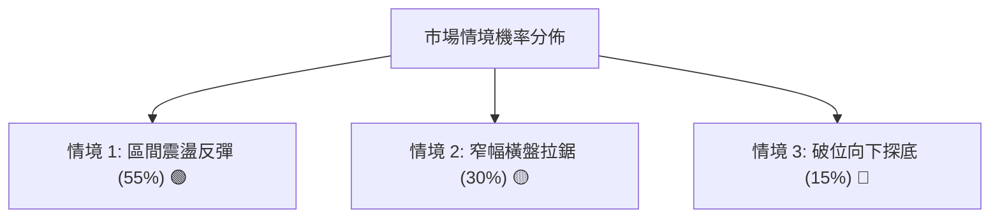

| 情境分類 | 機率預估 | 主要技術依據 |
|----------|----------|--------------|
| **繼續上行／反彈** | **55%** | 日線 RSI 底背離確認、Stoch 超賣(%K=1.80)、MACD 綠柱收斂、S1 $89.59 支撐有效。 |
| **區間橫盤震盪** | **30%** | ADX=14.85 趨勢極弱、成交量萎縮(量比0.80x)、OBV 疲弱，市場缺乏方向推動力。 |
| **回落／破位探底** | **15%** | 均線系統呈短空格局，-DI (29.21) 高於 +DI (20.43)，若大盤下挫可能被動拖累。 |

### 🟢 主策略詳情

依據數據精確計算之雙策略配置：

| 策略要素 | 策略 A（當前箱底低吸） | 策略 B（S2極限支撐抄底） |
|----------|------------------------|--------------------------|
| **交易邏輯** | 依託 S1 $89.59 與 RSI 底背離進場博反彈 | 若跌破 S1，於斐波 50% ($82.57) 與 S2 區域掛單 |
| **進場條件** | 現價 $90.07 附近或回踩 $89.59 企穩時 | 價格回調至 S2 $81.79 附近出現止跌訊號 |
| **進場價格** | **$90.07** (現價) | **$81.79** (支撐 S2) |
| **目標價 T1** | **$96.67** (斐波 38.2% / MA20) | **$89.59** (原支撐轉壓力 S1) |
| **目標價 T2** | **$107.57** (阻力 R1 / MA50) | **$96.67** (斐波 38.2%) |
| **止損價格** | **$86.50** (跌破S1並給予0.5倍ATR緩衝) | **$78.00** (跌破S2與布林下軌緩衝區) |
| **止損空間** | $3.57 (-3.96%) | $3.79 (-4.63%) |
| **目標空間(T2)** | +$17.50 (+19.43%) | +$14.88 (+18.19%) |
| **風險報酬比** | **4.90 : 1** (以T2計) / **1.85 : 1** (以T1計) | **3.93 : 1** (以T2計) / **2.06 : 1** (以T1計) |
| **成功機率** | **65%** | **75%** |
| **建議倉位** | **15% - 20%** | **25% - 30%** |

### 🔴 反向風險觸發點（對沖與風控提示）

- **多頭止損與轉空警戒線**：日線收盤價**實體跌破 $89.59 (S1)**，且成交量放大。此時必須對多頭部位嚴格止損（觸發 $86.50 全面離場），並防範價格滑落至 S2 **$81.79**。
- **空頭平倉與全面轉多線**：若股價強勢放量突破 **$107.57 (R1)** 並站穩 MA50，則中期空頭修正宣告結束，空頭部位應無條件止損，順勢翻多。

### ⭐ 整體訊號強度評星

```
╔══════════════════════════════════════════════════════════════╗
║ 做多訊號強度：  ★★★☆☆  (3.0/5星 — 具備底背離與支撐優勢)    ║
║ 做空訊號強度：  ★★☆☆☆  (2.0/5星 — 逢低殺跌動能衰竭)        ║
║ 整體可信度：    ★★★★☆  (4.0/5星 — 關鍵價位聚類明確)        ║
╚══════════════════════════════════════════════════════════════╝
```

---

## 9. 風險提示與監控

### ✅ 關鍵監控指標 Checklist

```
╔══════════════════════════════════════════════════════════════╗
║              INTC 每日交易監控清單 (Checklist)               ║
╠══════════════════════════════════════════════════════════════╣
║ [ ] 支撐防守：收盤價是否守住 S1 $89.59？                     ║
║ [ ] 動能修復：RSI(14) 是否維持在 45 之上並向 50 突破？       ║
║ [ ] 指標轉折：MACD 綠柱是否持續縮短並形成零下金叉？          ║
║ [ ] 均線突破：日內是否能有效突破 MA20 ($95.70)？             ║
║ [ ] 量能驗證：反彈時成交量能否放大超越 20 日均量 (1.14億股)？ ║
║ [ ] 趨勢啟動：ADX 是否從 14.85 向上翹頭升破 20？            ║
╚══════════════════════════════════════════════════════════════╝
```

### ⚠️ 風險場景分析

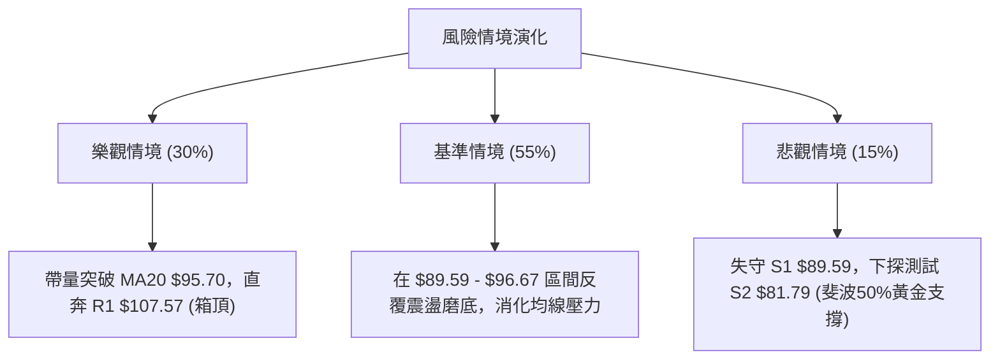

### 🛡️ 風險管理重要提醒

1. **Beta 波動管理**：INTC Beta 高達 **2.241**，波動幅度遠高於大盤，嚴禁在高位過度使用槓桿，單筆交易虧損上限應控制在總資金的 **1.0% - 1.5%** 以內。
2. **區間震盪心法**：ADX 僅 14.85，嚴禁在價格逼近壓力位（如 MA20 $95.70 或 斐波 $96.67）時追高買入；震盪市中「買在支撐、賣在阻力」是唯一生存法則。
3. **財報與消息面防範**：半導體行業週期性強，需密切關注基本面指引與資本支出變化對技術結構的衝擊。

---

## 📋 報告總結

```
╔══════════════════════════════════════════════════════════════╗
║                  INTC 技術分析報告總結                       ║
╠══════════════════════════════════════════════════════════════╣
║ 報告日期：2026-08-24                                         ║
║ 當前價格：$90.07                                             ║
║ 分析評級：⚖️ 中性觀望 / 區間低吸操作 (技術評分: 46/100)       ║
╠══════════════════════════════════════════════════════════════╣
║ 關鍵結論：                                                   ║
║ ├─ 長期趨勢：🟢 偏多（價格穩居 MA200 $71.51 上方）            ║
║ ├─ 中期趨勢：🔴 偏空（自高點 $142.35 深度修正，承壓於 MA50）  ║
║ ├─ 短期趨勢：🟡 震盪築底（ADX=14.85，RSI 呈現日線級別底背離） ║
║ ├─ 核心支撐：S1 $89.59 ｜ 強支撐：S2 $81.79                  ║
║ ├─ 核心阻力：R1 $107.57 ｜ 動態阻力：MA20 $95.70             ║
║ └─ 分析師共識目標：$114.88 (41 位分析師評級為 Hold)         ║
╠══════════════════════════════════════════════════════════════╣
║ 最優策略組合：                                               ║
║ 1. 🥇 最佳機會（策略 A）：                                   ║
║    現價 $90.07 依託 S1 $89.59 進場，止損 $86.50，             ║
║    目標 T1 $96.67 / T2 $107.57，風報比高達 4.90:1。           ║
║ 2. 🥈 次選機會（策略 B）：                                   ║
║    若意外跌破 S1，於 S2 $81.79 處掛單低吸，止損 $78.00。      ║
║ 3. 🥉 保守選擇：                                             ║
║    等待股價放量突破 MA20 ($95.70) 且 MACD 金叉確認後再行跟進。║
╚══════════════════════════════════════════════════════════════╝
```

---

> ⚠️ **免責聲明**：本報告為 AI 自動生成之技術分析，所有數據及估算均基於提供的歷史價格資訊。本報告**僅供研究與學術參考**，**不構成任何投資建議**。投資有風險，入市需謹慎。

---

*報告生成時間：2026-08-24 ｜ 數據來源：Yahoo Finance ｜ 分析框架：多時框技術分析*