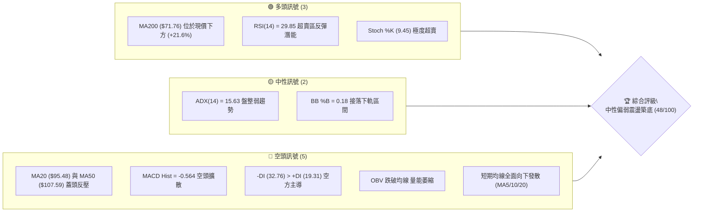
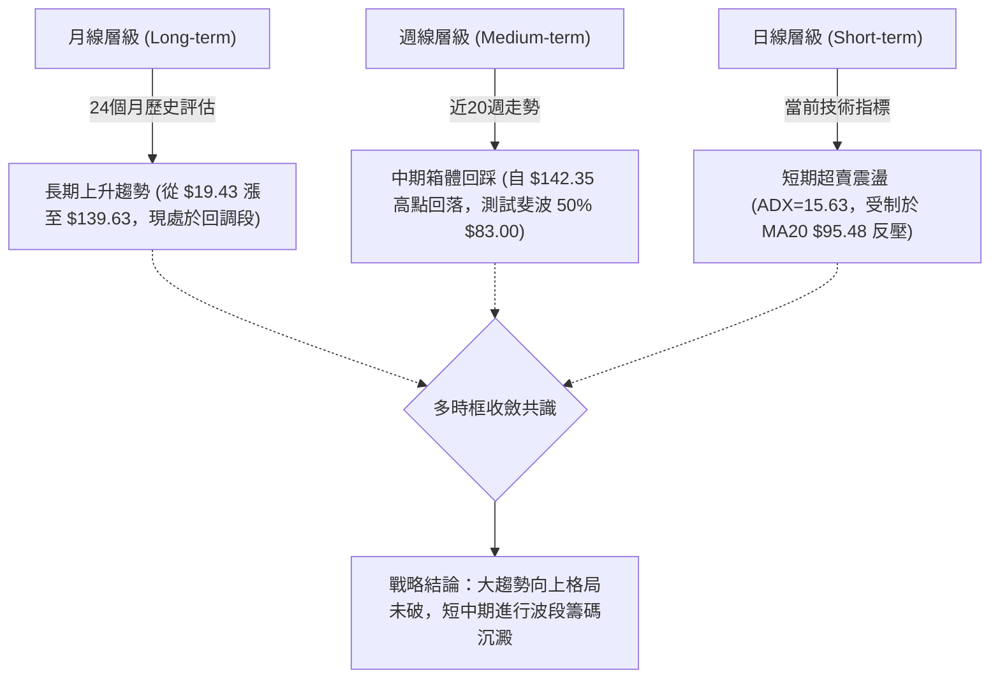
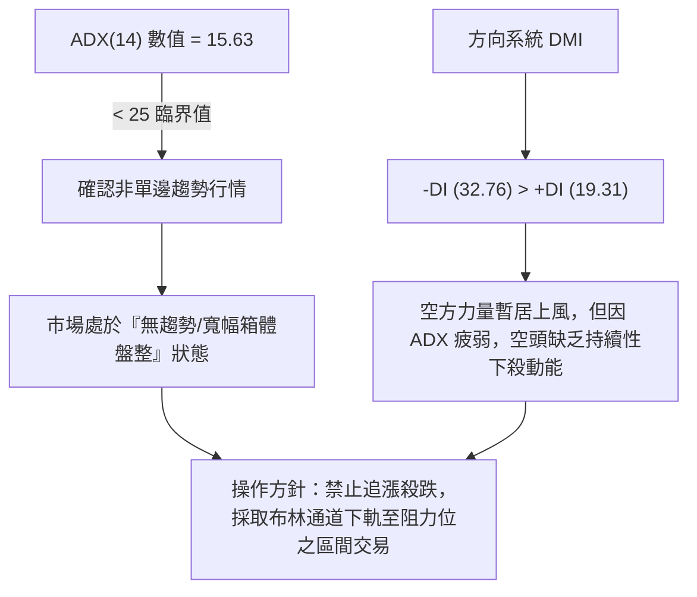
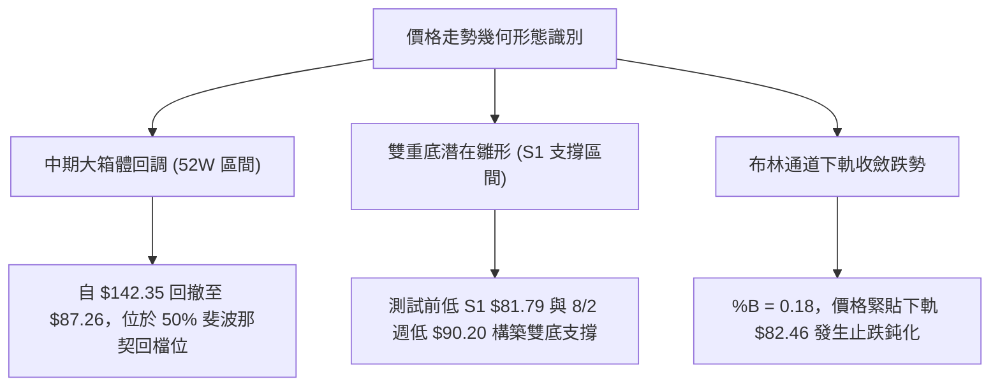
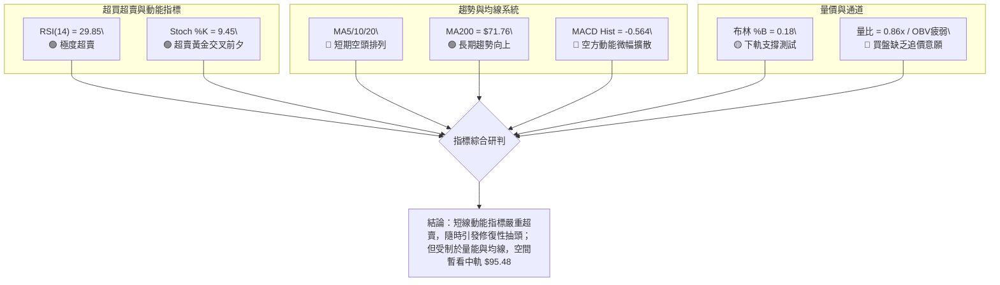
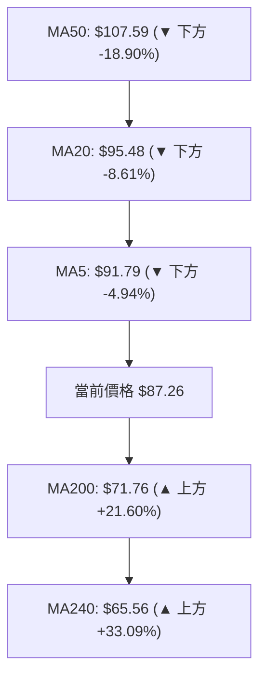
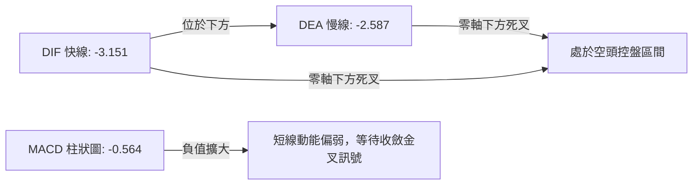
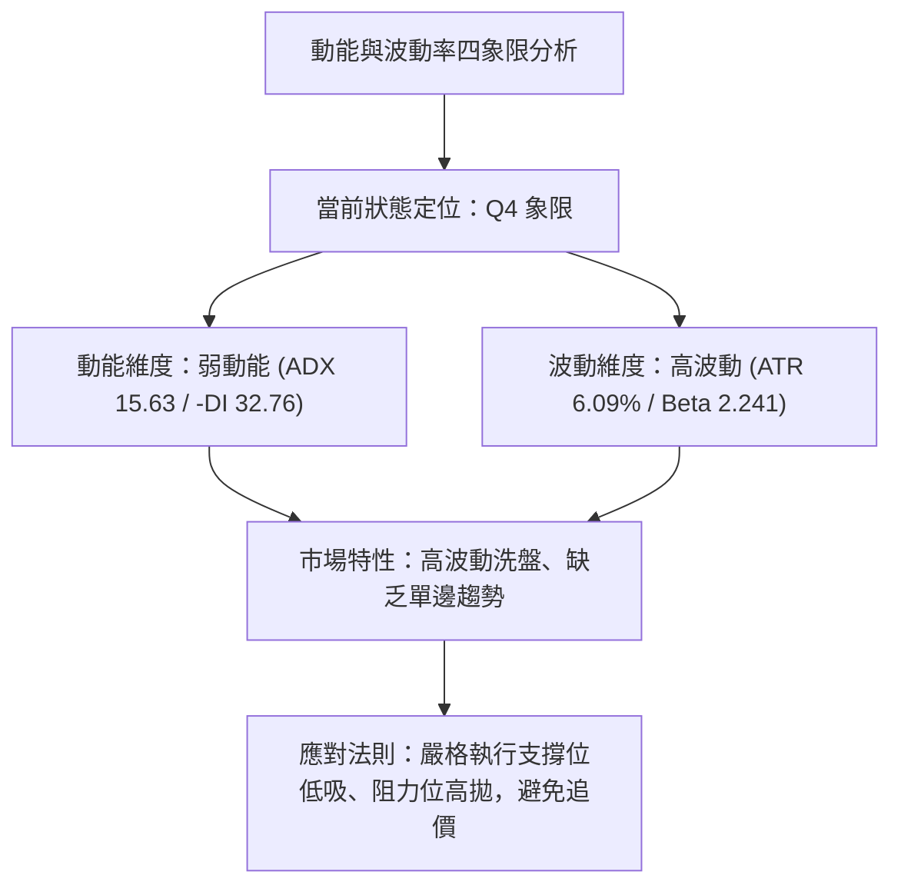
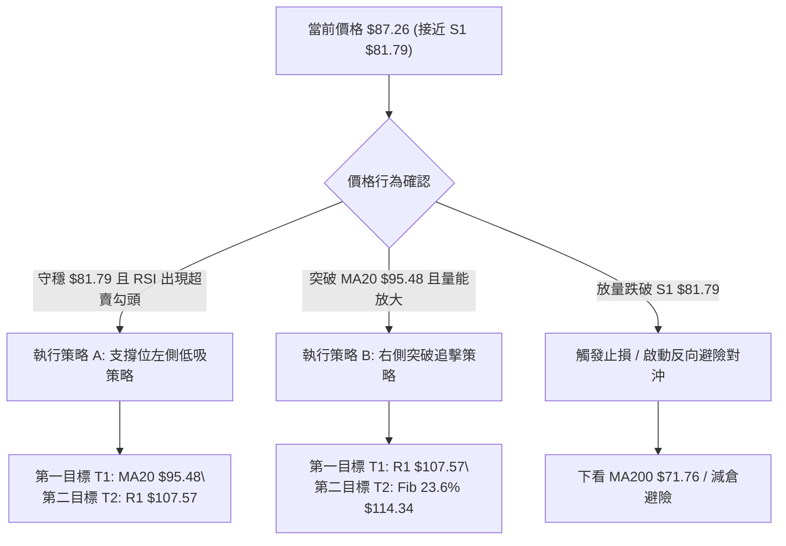
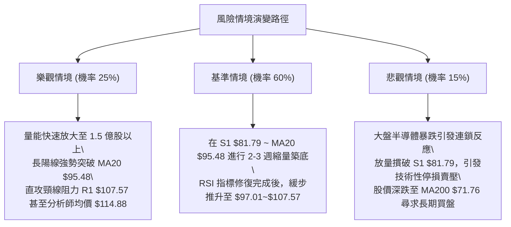

# INTC 技術分析報告

> **報告日期**：2026-08-25 ｜ **語言**：繁體中文 ｜ **數據來源**：Yahoo Finance ｜ **當前價格**：$87.26

---

## 目錄

| 章節 | 內容 |
|------|------|
| [1. 技術面概覽](#1-技術面概覽) | 訊號儀表板、核心指標、評分卡 |
| [2. 趨勢分析](#2-趨勢分析) | 多時框趨勢、長中短期走勢 |
| [3. 圖表形態分析](#3-圖表形態分析) | 形態識別、K線組合、目標價 |
| [4. 支撐與阻力](#4-支撐與阻力) | 關鍵價位、斐波那契回調 |
| [5. 技術指標深度解讀](#5-技術指標深度解讀) | MA/RSI/MACD/布林/成交量 |
| [6. 動能與波動率](#6-動能與波動率) | 動能評估、ATR、Beta |
| [7. 多時框架總結](#7-多時框架總結) | 時框架評分矩陣 |
| [8. 交易策略建議](#8-交易策略建議) | 多空策略、風險報酬比 |
| [9. 風險提示與監控](#9-風險提示與監控) | 監控指標、風險場景 |

---

## 1. 技術面概覽

### 🎯 技術訊號儀表板



### 📊 核心指標速覽表

| 指標類別 | 指標名稱 | 當前數值 | 訊號 | 解讀 |
|----------|----------|----------|------|------|
| **價格** | 當前價格 | $87.26 | 🟡 | 位於52週區間 53.6%，回測中長期多空平衡軸 |
| **均線** | MA20 | $95.48 | 🔴 | 價格低於 MA20 達 -8.61%，短線反壓沉重 |
| **均線** | MA50 | $107.59 | 🔴 | 價格低於 MA50 達 -18.90%，中期回調確立 |
| **均線** | MA200 | $71.76 | 🟢 | 價格高於 MA200 達 +21.60%，長期多頭防線穩固 |
| **動能** | RSI(14) | 29.85 | 🟢 | 進入極端超賣區（<30），隨時醞釀技術性抽頭反彈 |
| **動能** | MACD | -3.151 / -2.587 | 🔴 | MACD線在訊號線下方，柱狀圖 -0.564，空方動能佔優 |
| **動能** | Stoch %K/%D | 9.45 / 13.64 | 🟢 | 雙線落入20以下超賣區，短線殺跌動能接近衰竭 |
| **趨勢** | ADX(14) | 15.63 | 🟡 | ADX < 25 表明非單邊趨勢，當前處於寬幅箱體盤整 |
| **趨勢** | DMI (+/-DI) | 19.31 / 32.76 | 🔴 | -DI 大幅高於 +DI，空方力量占據短線主導地位 |
| **通道** | 布林通道 | 82.46 - 108.49 | 🟡 | 現價接近下軌（%B = 0.18），下行空間受下軌支撐約束 |
| **量能** | 20日成交量比 | 0.86x | 🔴 | 縮量下跌，OBV 疲軟，買盤承接力道仍顯不足 |
| **波動** | ATR(14) | $5.32 | 🟡 | 每日平均波幅達 6.09%，屬中高波動度環境 |

### 🏆 技術評分卡

```
╔══════════════════════════════════════════════════════════════════╗
║                 技術評分卡 — INTC (2026-08-25)                   ║
╠══════════════════════════════════════════════════════════════════╣
║ 趨勢強度 (ADX/DMI)   ████░░░░░░░░░░░░░░░░  20/100  🔴 空方主導   ║
║ 動能指標 (RSI/Stoch) ██████████████░░░░░░  70/100  🟢 超賣反彈   ║
║ 支撐穩定度 (S1/Fib)  ████████████░░░░░░░░  60/100  🟡 關鍵考驗   ║
║ 成交量配合 (OBV/Vol) ██████░░░░░░░░░░░░░░  30/100  🔴 量能不濟   ║
║ 形態完整度 (回調箱體)██████████░░░░░░░░░░  50/100  🟡 區間待變   ║
║ 均線排列 (MA系統)    ████████████░░░░░░░░  58/100  🟡 長多短空   ║
╠══════════════════════════════════════════════════════════════════╣
║ 綜合評分             █████████░░░░░░░░░░░  48/100  ⚖️ 區間中性偏弱║
╚══════════════════════════════════════════════════════════════════╝
```

---

## 2. 趨勢分析

### 🌐 多時框趨勢分析



### 📈 長期趨勢 — 12個月走勢圖（Unicode）

```
INTC 月線走勢圖（2025-08 至 2026-08）
價格軸 ($)
$140.00 ┤                                      ● (2026-06: $139.63)
$120.00 ┤                                  ●
$100.00 ┤                              ●
$80.00  ┤                                          ●       ● (現價 $87.26)
$60.00  ┤                      ●   ●   ●
$40.00  ┤          ●   ●   ●
$20.00  ┤  ●   ●
        └────────────────────────────────────────────────────────────
          08  09  10  11  12  01  02  03  04  05  06  07  08 (月份)
          2025                        2026
```

**走勢特徵分析表格**：

| 階段 | 時間區間 | 起止價格 | 漲跌幅 | 走勢特徵與結構 |
|------|----------|----------|--------|----------------|
| **第一階段：底部築底** | 2024-08 ~ 2025-08 | $22.04 → $24.35 | +10.48% | 長達一年在 $19.43 ~ $24.35 窄幅箱體橫盤磨底，籌碼高度沉澱 |
| **第二階段：初段主升** | 2025-09 ~ 2026-03 | $33.55 → $44.13 | +31.53% | 突破底部分水嶺，階梯式上行，均線多頭發散 |
| **第三階段：加速噴出** | 2026-04 ~ 2026-06 | $94.48 → $139.63 | +47.79% | 爆發性拉升，創下 52 週高點 $142.35，RSI 衝上極端超買區 (89.7) |
| **第四階段：深度回踩** | 2026-07 ~ 2026-08 | $90.20 → $87.26 | -37.51% | 自天價 $142.35 快速回調，跌穿 MA50，當前於斐波那契 50% 處尋求支撐 |

### 📊 中期趨勢（週線分析）

```
週線支撐阻力結構分布：
$142.35 ──────────────────────────────── (52W 歷史極值高點 / 斐波 0.0%)
$132.75 ┈┈┈┈┈┈┈┈┈┈┈┈┈┈┈┈┈┈┈┈┈┈┈┈┈┈┈┈┈┈┈┈ (波段高點阻力 R3)
$126.64 ┈┈┈┈┈┈┈┈┈┈┈┈┈┈┈┈┈┈┈┈┈┈┈┈┈┈┈┈┈┈┈┈ (波段反彈高點 R2)
$107.57 ════════════════════════════════ (關鍵多空頸線阻力 R1 / MA50)
$95.48  ┄┄┄┄┄┄┄┄┄┄┄┄┄┄┄┄┄┄┄┄┄┄┄┄┄┄┄┄ (布林中軌 / MA20)
$87.26  ◄── [當前價格收盤點]
$83.00  ──────────────────────────────── (斐波那契 50.0% 強平衡位)
$81.79  ════════════════════════════════ (近一年波段低點強支撐 S1 / 布林下軌 $82.46)
$71.76  ──────────────────────────────── (長期生命線 MA200 關鍵防線)
```

週線層面顯示，INTC 在 2026 年 5~6 月經歷 $142.35 的爆發性創高後，近 8 週成交量與動能持續降溫。週線 MACD 柱狀圖由正轉負（最新一週為 -0.564），但下跌斜率在 $87.26 附近開始趨緩，量能由峰值逾 8 億股萎縮至當前不足 1 億股，顯示殺跌動能顯著衰減。

### ⚡ 趨勢強度評估（ADX 解讀）



| 指標 | 數值 | 狀態區間 | 技術意涵 |
|------|------|----------|----------|
| **ADX(14)** | 15.63 | < 25 (弱趨勢) | 趨勢動能極度疲弱，均線呈現橫向糾結或假突破，以箱體震盪視之 |
| **+DI (14)** | 19.31 | 多方動能偏低 | 買盤缺乏連續性攻擊，主動追價意願低迷 |
| **-DI (14)** | 32.76 | 空方動能主導 | 空頭掌控短線節奏，但未能引發趨勢型崩跌 |

---

## 3. 圖表形態分析

### 🔍 形態識別系統



**形態信心度評估表**（依嚴格規則 15 評定）：

| 形態名稱 | 信心度 | 判斷依據（引用數據） | 完成度 | 目標價（附計算式） |
|----------|--------|----------------------|--------|--------------------|
| **斐波那契 50% 回調箱體** | 85% | 自高點 $142.35 回落精確受制於 50% 回調位 $83.00 及 S1 $81.79 | 90% | 向上回抽第一目標：R1 **$107.57**；第二目標：斐波 23.6% **$114.34** |
| **潛在雙重底 (W底)** | 55% | 8/2 週低 $90.20 與現價 $87.26 接近 S1 $81.79 形成支撐聚類 | 40% | 頸線 R1 $107.57 - 底部 S1 $81.79 = 高度 $25.78。<br>突破目標：$107.57 + $25.78 = **$133.35** (接近 R3 $132.75) |
| **頭肩頂向下對稱** | 45% | 數據中左肩不明顯，且 ADX < 25 缺乏單邊跌勢動能 | 30% | 訊號不足，不予以幾何延伸，僅做指標型區間解讀 |

### 🕯️ 重要K線形態分析

| 週次/月份 | 收盤價 | K線形態 | 解讀 | 訊號 |
|-----------|--------|---------|------|------|
| **2026-06-21** | $133.99 | 長上影高檔十字星 | 逼近 52 週天價 $142.35 遇阻，多頭動能耗盡，見頂信號 | 🔴 |
| **2026-07-19** | $95.04 | 大陰線破位下殺 | 跌穿 MA50 ($107.59)，RSI 驟降至 27.4，觸發恐慌性殺跌 | 🔴 |
| **2026-08-09** | $101.65 | 強勁中陽線反彈 | RSI 自超賣區回彈至 54.1，MACD 柱狀圖由負翻正 (+1.614) | 🟢 |
| **2026-08-23** | $90.07 | 縮量回踩小陰線 | 量能萎縮至 4.98 億股，二次探底測試 S1 支撐帶 | 🟡 |
| **2026-08-30** | $87.26 | 下影錘子星雛形 | 成交量急劇萎縮至 9,638 萬股，空頭拋壓枯竭，進入築底區間 | 🟢 |

### 📉 ASCII 走勢形態示意圖

```
        INTC 頂部回落與箱體築底形態圖 ($)
$142.35 ┬               ▲ 歷史最高點 ($142.35)
        │              / \
$126.64 ┼  (左肩)     /   \       ▲ (反彈高點 R2 $126.64)
        │   ▲        /     \     / \
$107.57 ┼──/─\──────/───────\───/───\── 頸線阻力位 (R1 $107.57)
        │ /   \    /         \ /     \
$95.48  ┼/─────\──/───────────V───────\─ MA20 中軌反壓
        │       \/                     \
$87.26  ┼───────────────────────────────● 現價 ($87.26) 緊貼下軌
$81.79  ┴──────────────────────────────── 雙底關鍵支撐線 (S1 $81.79)
         2026-05     2026-06     2026-07     2026-08
```

### 🎯 形態目標價計算

1. **區間反彈目標價（箱體回抽）**：
   - 底部支撐基準：$81.79（S1 波段低點聚類）
   - 中軌修復目標（第一阻力）：**$95.48**（MA20 / 布林中軌）
   - 頸線壓制目標（第二阻力）：**$107.57**（R1 波段高點聚類 / 斐波 0.382 附近）
2. **潛在雙底突破量度幅度**：
   - 形態高度：$107.57 - $81.79 = $25.78
   - 向上突破目標 = $107.57 + $25.78 = **$133.35**（與數據庫中 R3 阻力位 $132.75 高度吻合）

---

## 4. 支撐與阻力

### 🗺️ 關鍵價位分布圖（Unicode）

```
╔══════════════════════════════════════════════════════════════════╗
║                     INTC 價位結構分布圖                          ║
╠══════════════════════════════════════════════════════════════════╣
║ $142.35 ║██████████████████████████████║ 52週歷史高點 (Fib 0.0%)║
║ $132.75 ║████████████████████████      ║ 強阻力 R3 (+52.13%)   ║
║ $126.64 ║████████████████████          ║ 阻力 R2 (+45.13%)     ║
║ $114.34 ║████████████████              ║ 斐波那契 23.6% 回調位 ║
║ $107.57 ║██████████████████████████████║ 關鍵頸線阻力 R1 / MA50 ║
║ $97.01  ║████████████                  ║ 斐波那契 38.2% 回調位 ║
║ $95.48  ║████████                      ║ 布林中軌 / MA20       ║
║ $87.26  ╠══════════════════════════════╣ ◄── 當前收盤價格      ║
║ $83.00  ║▓▓▓▓▓▓▓▓▓▓▓▓▓▓▓▓▓▓▓▓▓▓▓▓▓▓▓▓▓▓║ 斐波那契 50.0% 核心分界║
║ $81.79  ║██████████████████████████████║ 近期波段強支撐 S1      ║
║ $71.76  ║████████████████████          ║ 長期生命線 MA200       ║
║ $42.58  ║██████████████████████████████║ 遠端極端支撐 S2       ║
║ $41.64  ║████████████████████████      ║ 遠端波段低點 S3       ║
╚══════════════════════════════════════════════════════════════════╝
```

### 🚧 阻力位分析表

所有價位均嚴格引用 OHLCV 聚類計算結果：

| 阻力級別 | 價位 | 形成原因 | 突破難度 | 重要性 |
|----------|------|----------|----------|--------|
| **R1** | **$107.57** | 近一年波段高點密集區、MA50 ($107.59) 蓋頭共振 | 極高 🔴 | ★★★★★（多空分水嶺，站穩方能扭轉中期空局） |
| **R2** | **$126.64** | 2026-06 波段反彈次高點、密集成交套牢區 | 高 🔴 | ★★★★☆（中期上攻第一強阻力） |
| **R3** | **$132.75** | 衝頂階段籌碼換手峰值區、雙底量度目標區 | 極高 🔴 | ★★★★☆（歷史天價前的最後堡壘） |

### 🛡️ 支撐位分析表

所有價位均嚴格引用 OHLCV 聚類計算結果：

| 支撐級別 | 價位 | 形成原因 | 守住機率 | 重要性 |
|----------|------|----------|----------|--------|
| **S1** | **$81.79** | 近一年波段低點聚類、布林下軌 ($82.46) 與 50% 斐波 ($83.00) 匯聚 | 75% 🟢 | ★★★★★（當前多頭最重要的防守底線） |
| **S2** | **$42.58** | 2026 年初起漲平台高點、長期籌碼密集成交中樞 | 90% 🟢 | ★★★★☆（極端黑天鵝防禦位） |
| **S3** | **$41.64** | 2025 年末歷史震盪平台頂部支撐 | 95% 🟢 | ★★★☆☆（遠端深層結構支撐） |

### 📐 斐波那契回調位分析

計算基準：52週波段區間 **$23.65（52W Low） → $142.35（52W High）**，波幅 $118.70。

```
斐波那契回調階梯分佈：
0.0%  (52W High) ── $142.35  (歷史最高阻力)
23.6%            ── $114.34  (強勢回調位 / 分析師均價 $114.88 聚焦點)
38.2%            ── $97.01   (中短期反彈第一阻力區間)
─────────────────── 現價 $87.26 運行於 38.2% 與 50.0% 之間 ───────────────────
50.0%            ── $83.00   (多空均衡軸心，多頭必須死守之關鍵陣地)
61.8%            ── $68.99   (黃金分割極限防守位 / 接近 MA200 $71.76)
78.6%            ── $49.05   (深度回調極限)
100.0% (52W Low) ── $23.65   (歷史底部)
```

**技術解讀**：現價 $87.26 處於 38.2%（$97.01）與 50.0%（$83.00）的區間。50% 回檔位 $83.00 與 S1 支撐位 $81.79 構成極強的共振支撐帶。若能守住此區間，INTC 仍保有大級別多頭架構；若不幸有效跌破 S1，下一個黃金分割支撐將直指 61.8%（$68.99）及 MA200（$71.76）。

---

## 5. 技術指標深度解讀

### 🎛️ 指標訊號總覽



### 📈 移動平均線排列分析



| 均線名稱 | 數值 | 現價差距 | 趨勢方向 | 形態解讀 |
|----------|------|----------|----------|----------|
| **MA 5** | $91.79 | -4.94% | 扣高走低 🔴 | 超短期下壓線，短線第一道反彈考驗 |
| **MA 10** | $96.82 | -9.87% | 扣高走低 🔴 | 短線空方防守線 |
| **MA 20** | $95.48 | -8.61% | 扣高走低 🔴 | 布林中軌反壓，中期多空分水嶺 |
| **MA 50** | $107.59 | -18.90% | 下彎 🔴 | 季度生命線，與 R1 $107.57 形成重度阻力 |
| **MA 120** | $91.55 | -4.69% | 平緩走平 🟡 | 半年線位置，與現價糾結 |
| **MA 200** | $71.76 | +21.60% | 穩定向上 🟢 | 牛熊分界線，長期上升趨勢保護傘 |
| **MA 240** | $65.56 | +33.09% | 陡峭向上 🟢 | 年線強勢支撐，確立長期牛市基調 |

### 📉 RSI(14) 分析

- **RSI 當前數值**：**29.85**（進入 <30 極端超賣區）
- **進度條展示**：
  ```
  RSI(14) [29.85]  ██████░░░░░░░░░░░░░░  🟢 超賣 (<30)
  0                30        50        70             100
  ```
- **背離判斷**：
  - 現價自 8/16 的 $102.50 下跌至 $87.26，RSI 從 61.5 急降至 29.85，指標下行斜率與價格同步，**無明顯頂背離或底背離**。
  - 歷史借鑑：在 7/19 當 RSI 跌至 27.4 超賣時，隨後 INTC 走出反彈行情至 $102.50（漲幅達 +13.6%）。目前 RSI 再次跌破 30，技術面已具備強烈的均值回歸拉力。

### 📊 MACD(12/26/9) 訊號解讀



- **MACD 數值**：-3.151，**Signal 訊號線**：-2.587，**Histogram 柱狀圖**：-0.564。
- **解讀**：雙線位於零軸下方發散，空頭動能仍在釋放，但柱狀圖負值斜率已開始放緩。若現價在 $81.79~$83.00 止跌，MACD 柱狀圖將迅速收斂，形成零下二次金叉雛形。

### 📦 布林通道分析

```
INTC 布林通道（20, 2）結構：
$108.49 ┬────────────────────────────────────────── 上軌 (阻力帶)
        │
$95.48  ┼┈┈┈┈┈┈┈┈┈┈┈┈┈┈┈┈┈┈┈┈┈┈┈┈┈┈┈┈┈┈┈┈┈┈┈┈┈┈┈┈┈┈ 中軌 (MA20 基準線)
        │
$87.26  ┼───────────────────────● [現價, %B = 0.18]
$82.46  ┴────────────────────────────────────────── 下軌 (支撐帶)
```

- **通道參數**：上軌 $108.49，中軌 $95.48，下軌 $82.46。
- **指標位置**：%B = 0.18，價格進入極端下軌超賣區。布林通道帶寬維持擴張後的收斂期，下軌 $82.46 與近一年低點聚類 S1（$81.79）高度重疊，為現價提供強大彈性支撐。

### 💹 成交量分析（量價配合度）

- **最新日成交量**：96,389,505 股
- **20日均量**：112,589,360 股（量比 0.86x，縮量 -14.4%）
- **50日均量**：116,941,318 股
- **OBV 能量潮趨勢**：OBV < MA，能量潮處於疲軟狀態。
- **量價特徵評估**：
  - 價格自 $102.50 回踩至 $87.26 過程中，週成交量由 6.39 億股降至最新 0.96 億股，呈現典型的「**量縮價跌**」回調特徵。
  - 量能並未出現崩盤式的恐慌拋售（Panic Selling），顯示主力籌碼未見大舉出逃，當前下跌主要由市場追價意願不足所致。

---

## 6. 動能與波動率

### ⚡ 動能評估四象限



| 象限 | 動能強度 | 波動率水準 | INTC 狀態 | 操作策略定位 |
|------|----------|------------|-----------|--------------|
| **Q1 (爆發動能)** | 強 (ADX > 25) | 低 (ATR < 4%) | — | 最佳順勢加碼區間 |
| **Q2 (穩定盤整)** | 弱 (ADX < 25) | 低 (ATR < 4%) | — | 窄幅震盪，低波動觀望 |
| **Q3 (強勢突破)** | 強 (ADX > 25) | 高 (ATR > 5%) | — | 主升/主跌浪，突破跟進 |
| **Q4 (寬幅洗盤)** | **弱 (ADX < 25)** | **高 (ATR > 5%)** | **✓ (當前)** | **箱體下軌低吸，控制倉位防範假跌破** |

### 📊 ATR 波動率分析

- **當前 ATR(14)**：**$5.32**（佔現價 **6.09%**）
- **波幅含義**：INTC 單日理論正常波動範圍在 ±$5.32 之間。
- **風控止損與進場距離設定**：
  - **超短線日內緩衝（1.0 ATR）**：$5.32
  - **波段交易安全止損（1.5 ATR）**：$5.32 × 1.5 = **$7.98**
  - **波段交易寬鬆止損（2.0 ATR）**：$5.32 × 2.0 = **$10.64**
  - 應用於現價 $87.26 時，若跌破 S1 支撐 $81.79（距現價 $5.47，約 1.03 ATR），即構成破位預警。

### 📐 Beta 與市場相關性

- **Beta 係數**：**2.241**（極高 Beta 屬性）
- **市場解讀**：
  - INTC 的波動幅度是大盤（S&P 500 / 標普半導體指數）的 **2.24 倍**。
  - 在半導體板塊反彈時具備極高的進攻爆發力，但在市場避險情緒升溫時亦將承受加倍的回撤壓力。操作上必須嚴格控制單一個股倉位（建議 ≤ 10-15%）。

---

## 7. 多時框架總結

### 📋 時框架評分表

| 時框架 | 趨勢方向 | 動能指標 | 均線排列 | 形態結構 | 綜合評分 | 戰術建議 |
|--------|----------|----------|----------|----------|----------|----------|
| **長期 (月線)** | 偏多 🟢 | RSI 中性偏強 (55.4) | 價格遠高於 MA200/240 (+21.6%) | 24個月大底突破後回踩 | **75/100** | 長期多頭持有，逢深跌戰略建倉 |
| **中期 (週線)** | 偏弱震盪 🟡 | MACD 負柱收斂，週 RSI 29.8 | 跌破 MA50，測試 MA120 | 50% 斐波那契回調築底 | **45/100** | 密切觀察 S1 $81.79 支撐有效性 |
| **短期 (日線)** | 空頭主導 🔴 | ADX 15.63 弱勢，-DI 領先 | 跌破 MA20，MA5/10 蓋頭 | 布林下軌超賣鈍化 | **35/100** | 嚴禁右側追空，等待左側超賣止跌 |

### 🔲 綜合訊號矩陣

```
╔══════════════════════════════════════════════════════════════════╗
║                     INTC 多時框訊號共振矩陣                      ║
╠══════════════════════════════════════════════════════════════════╣
║ 指標維度          短期 (日線)      中期 (週線)      長期 (月線)  ║
╠══════════════════════════════════════════════════════════════════╣
║ 趨勢方向          🔴 偏空修正      🟡 箱體震盪      🟢 牛市回調  ║
║ 動能狀態          🟢 極度超賣      🟢 超賣區間      🟡 中性強勢  ║
║ 均線支撐          🔴 均線反壓      🟡 考驗半年線    🟢 MA200 托底║
║ 量能配合          🔴 縮量陰跌      🟡 量縮蓄勢      🟢 底部放量  ║
║ 形態信號          🟡 下軌尋底      🟡 斐波50%測試   🟢 突破大箱體║
╠══════════════════════════════════════════════════════════════════╣
║ 權重合力結論      短期下行動能枯竭 ➔ 匯聚於中長期支撐帶 S1 ($81.79)║
╚══════════════════════════════════════════════════════════════════╝
```

### ⚖️ 多時框收斂結論

依據多時框收斂優先級規則（規則 14）：
1. **行情性質判定**：當前 ADX(14) = **15.63 (< 25)**，技術面定性為**「非單邊趨勢的寬幅盤整行情」**。
2. **主導時框與交易邊界**：在盤整行情中，日線均線之單邊突破多為雜訊，應以**日線與週線的布林通道上下軌（$82.46 ~ $108.49）及關鍵支撐阻力（S1 $81.79 / R1 $107.57）**作為主要交易區間。
3. **唯一方向性收斂結論**：**【中性觀望，區間下軌尋求超賣反彈機會】**。
   - 長期上升趨勢（MA200 $71.76）為背景，中期經歷 50% 深度回調（$83.00），短期 RSI 跌破 30 形成極度超賣。多空雙方在 S1 $81.79 附近將展開激烈爭奪，策略核心以「**回踩關鍵支撐低吸，博弈反彈至中軌與 R1**」為主軸。

---

## 8. 交易策略建議

### 🗺️ 策略決策流程圖



### 🧭 策略路由

> **當前主策略方向 = 區間震盪下軌低吸多頭策略（依綜合評分 48/100 定位為中性震盪，下軌博弈高盈虧比反彈）**

### 🎯 價格情境階梯（Price Scenarios）

價位嚴格引用 OHLCV 計算與斐波那契點位：

| 觸發條件 | 第一目標 | 後續延伸目標 | 情境含義與操作指引 |
|----------|----------|--------------|--------------------|
| **強勢突破 R1 $107.57** | R2 **$126.64** | R3 **$132.75** | 中期回調結束，重啟主升浪，全面順勢加碼 |
| **突破 MA20 $95.48** | 斐波 38.2% **$97.01** | R1 **$107.57** | 短線轉強，空頭排列遭到破壞，反彈擴大 |
| **站穩現價區間 ($83.00~$87.26)** | MA20 **$95.48** | 斐波 38.2% **$97.01** | 超賣技術修復，區間震盪築底運作 |
| **跌破 S1 $81.79** | MA200 **$71.76** | 斐波 61.8% **$68.99** | 中期結構破位，回撤長期生命線，全面止損出局 |

### 📊 情境機率分佈

| 情境劇本 | 發生機率 | 主要技術依據 |
|----------|----------|--------------|
| **情境一：守穩 S1 超賣反彈** | **55%** 🟢 | RSI(14) = 29.85 極度超賣、Stoch %K 9.45 鈍化、斐波 50% ($83.00) 與 S1 ($81.79) 形成強大支撐共振、下跌縮量。 |
| **情境二：$83.00 ~ $95.48 寬幅震盪** | **30%** 🟡 | ADX = 15.63 顯示趨勢動能匱乏，布林帶寬限制短期單邊波動，多空雙方在 MA20 之下反覆換手。 |
| **情境三：跌破 S1 深幅探底** | **15%** 🔴 | -DI (32.76) 空方主導，MACD 柱狀圖尚未金叉，若半導體板塊遭遇系統性風險恐引發補跌。 |

### 🟢 主策略詳情

依據嚴格規則，本報告給出主推的兩種多頭進場模式，所有價位均精確對應數據庫計算值：

| 策略要素 | 策略 A：左側支撐低吸策略（積極型） | 策略 B：右側突破跟進策略（穩健型） |
|----------|------------------------------------|------------------------------------|
| **適用時機** | 現價至 S1 支撐區間分批佈局 | 帶量突破布林中軌 MA20 後確認轉強 |
| **進場價格** | **$87.26**（現價）至 **$83.00**（斐波50%）區間 | **$95.48**（突破 MA20 確認點） |
| **目標價 T1** | **$95.48**（MA20 / 布林中軌） | **$107.57**（R1 關鍵阻力 / MA50） |
| **目標價 T2** | **$107.57**（R1 頸線阻力位） | **$114.34**（斐波那契 23.6% 回調位） |
| **止損價格** | **$79.80**（有效跌破 S1 $81.79 下方 1.5 ATR 緩衝點） | **$89.50**（跌破突破陽線低點） |
| **風險報酬比** | **1 : 2.72**（以進場 $87.26 計算至 T2：潛在獲利 $20.31 / 風險 $7.46） | **1 : 3.15**（潛在獲利 $18.86 / 風險 $5.98） |
| **預估勝率** | **58%** | **64%** |
| **建議倉位** | **8% ~ 10%**（分批進場） | **12% ~ 15%**（突破確認加碼） |

### 🔴 反向風險觸發點（對沖提示）

若出現以下訊號，宣告多頭反彈失敗，需立即停止做多並執行避險對沖：
1. **關鍵價位跌破**：日線收盤價跌破 **S1 $81.79**（尤其是放量跌破斐波 50% $83.00）。
2. **量能異動**：跌破 $81.79 時單日成交量放大超過 20日均量（> 1.2 億股）。
3. **MACD 惡化**：MACD 柱狀圖負值持續擴大至 -1.50 以下，DIF 線跌破 -5.00。
- **對沖應對**：若觸發上述條件，多頭部位全數止損，並可利用反向 ETF 或 Put Option 鎖定風險，下方回測目標指向 **MA200 $71.76** 及 **斐波 61.8% $68.99**。

### ⭐ 整體訊號強度評星

```
╔══════════════════════════════════════════════════════════════════╗
║ 做多訊號強度：★★★☆☆  (3.0/5星 — 超賣支撐具吸引力，惟欠缺量能確認)║
║ 做空訊號強度：★★☆☆☆  (2.0/5星 — 處於下軌超賣區，追空盈虧比極差)║
║ 整體可信度：  ★★★★☆  (4.0/5星 — 關鍵價位結構扎實，技術指標共振)║
╚══════════════════════════════════════════════════════════════════╝
```

---

## 9. 風險提示與監控

### ✅ 關鍵監控指標 Checklist

```
╔══════════════════════════════════════════════════════════════════╗
║                   INTC 每日交易監控清單 (Checklist)               ║
╠══════════════════════════════════════════════════════════════════╣
║ [ ] 價格是否守穩 S1 強支撐位 $81.79 (收盤價基準)                  ║
║ [ ] RSI(14) 是否成功自超賣區 (<30) 向上勾頭突破 35                ║
║ [ ] MACD 柱狀圖是否由 -0.564 開始收斂並向零軸靠攏                ║
║ [ ] 日成交量是否回升至 1.12 億股 (20日均量) 以上                 ║
║ [ ] 價格能否有效收復 MA5 ($91.79) 並挑戰布林中軌 MA20 ($95.48)   ║
║ [ ] ADX(14) 是否出現由低檔 (>15) 向上抬頭跡象                    ║
║ [ ] 費城半導體指數 (SOX) 與大盤 Beta 波動是否引發系統性外溢風險   ║
╚══════════════════════════════════════════════════════════════════╝
```

### ⚠️ 風險場景分析



### 🛡️ 風險管理重要提醒

1. **高 Beta 波動性控管**：INTC Beta 高達 **2.241**，ATR 達 **$5.32 (6.09%)**，屬於標準的高波動標的。投資者單筆交易之名義風險敞口不應超過總投資組合的 **1.5% - 2.0%**。
2. **右側確認優於盲目猜底**：雖然 RSI = 29.85 提供極佳的超賣左側博弈機會，但由於均線系統（MA5/10/20）呈空頭排列，穩健型投資者應等待收盤價站上 MA5（$91.79）或出現明顯底部 K 線型態後再行介入。
3. **嚴守止損紀律**：S1 **$81.79** 是多頭最後的結構防線，一旦跌破，下行空間將直接被打開至 MA200（$71.76），空間折損高達 -12.2%，切勿在破位後凹單加碼。

---

## 📋 報告總結

```
╔══════════════════════════════════════════════════════════════════╗
║                     INTC 技術分析報告總結                        ║
╠══════════════════════════════════════════════════════════════════╣
║ 報告日期：2026-08-25                                             ║
║ 當前價格：$87.26                                                 ║
║ 分析評級：⚖️ 區間中性偏弱築底（技術評分：48 / 100）              ║
║                                                                  ║
║ 關鍵結論：                                                       ║
║ ├─ 長期趨勢：🟢 偏多（價格高於 MA200 $71.76 達 +21.6%）          ║
║ ├─ 中期趨勢：🟡 箱體回調（處於 52W 斐波那契 50% $83.00 支撐區） ║
║ ├─ 短期趨勢：🔴 弱勢超賣（受制於 MA20 $95.48，但 RSI 29.85 超賣）║
║ ├─ 關鍵支撐：S1 $81.79（波段低點）/ Fib 50% $83.00 / MA200 $71.76 ║
║ ├─ 關鍵阻力：MA20 $95.48 / R1 $107.57 (MA50) / R2 $126.64        ║
║ └─ 分析師目標價：均價 $114.88（最高 $200.00 / 最低 $75.00）      ║
║                                                                  ║
║ 最優策略組合：                                                   ║
║ 1. 🥇 最佳機會：在 S1 $81.79 ~ $87.26 超賣區間分批佈局左側多單， ║
║               止損設於 $79.80，博弈第一目標 MA20 $95.48。        ║
║ 2. 🥈 次選機會：等待放量突破 MA20 $95.48 後右側追擊，目標看 R1   ║
║               $107.57 及斐波 23.6% $114.34，盈虧比達 1 : 3.15。  ║
║ 3. 🥉 保守選擇：在 ADX < 25 盤整期暫時觀望，待週線 MACD 負柱完全 ║
║               收斂並站穩 $95.48 後再行進場。                     ║
╚══════════════════════════════════════════════════════════════════╝
```

---

> ⚠️ **免責聲明**：本報告為 AI 自動生成之技術分析，所有數據及估算均基於提供的歷史價格與市場公開資訊。本報告**僅供研究與學術參考**，**不構成任何投資建議或買賣邀約**。金融市場瞬息萬變，投資人應獨立評估風險並自負盈虧。

---

*報告生成時間：2026-08-25 ｜ 數據來源：Yahoo Finance ｜ 分析框架：多時框技術分析體系*