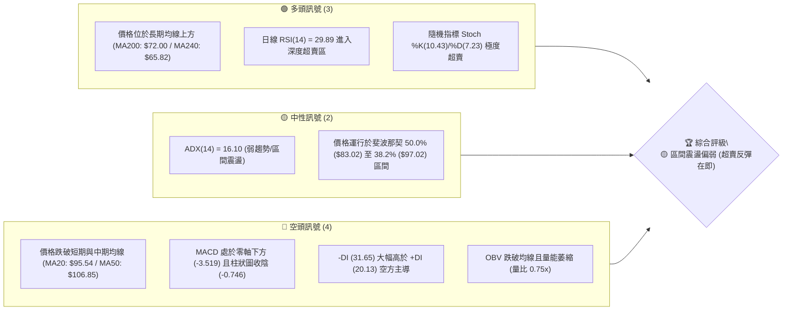
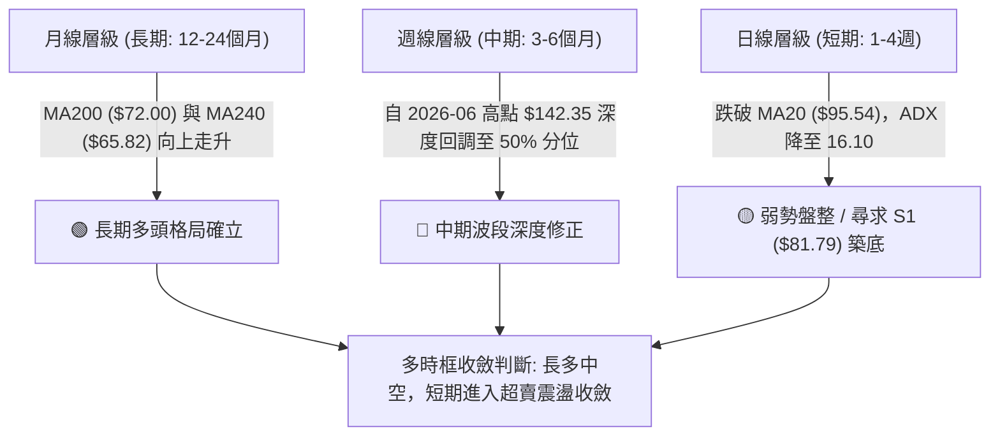
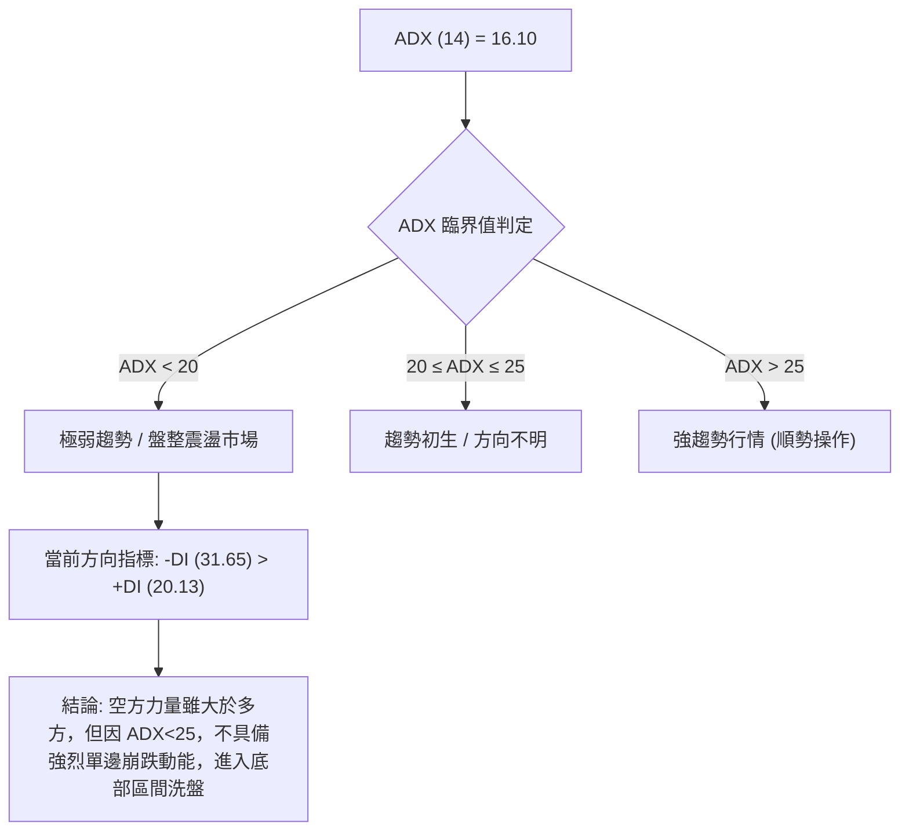
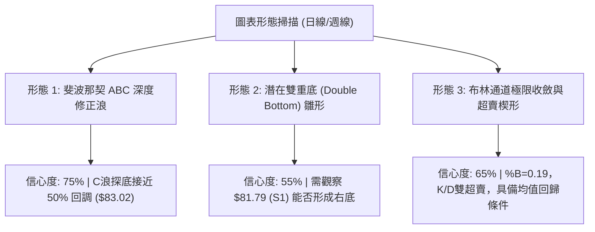
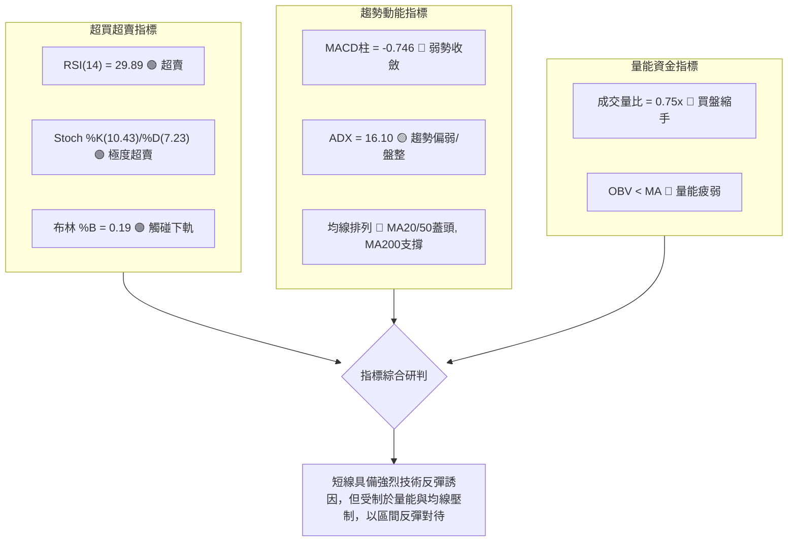
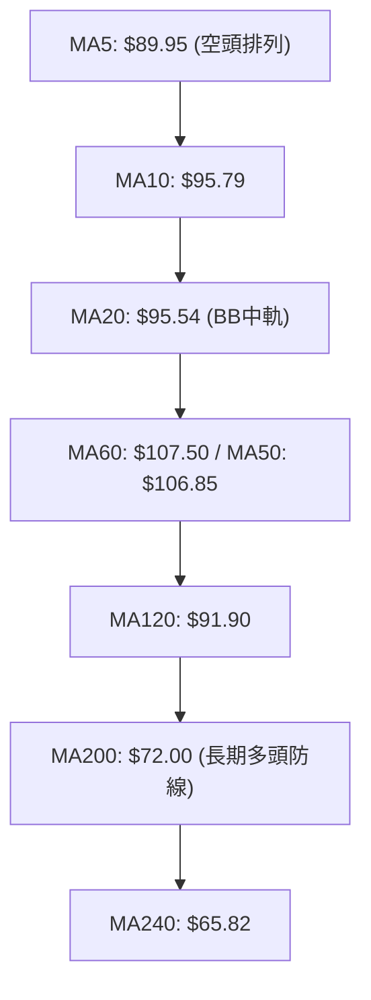
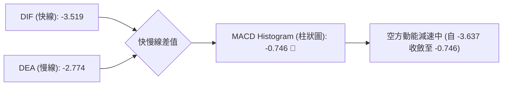
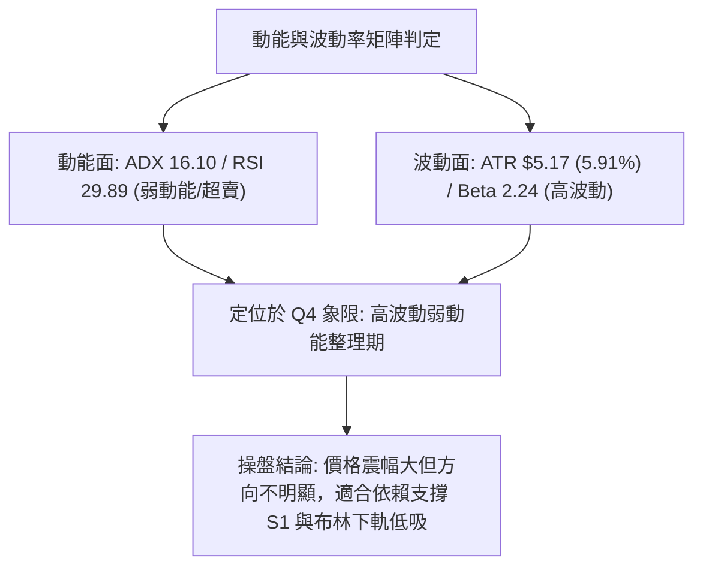
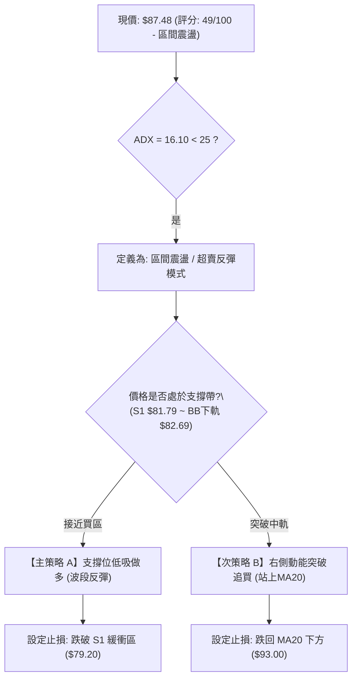
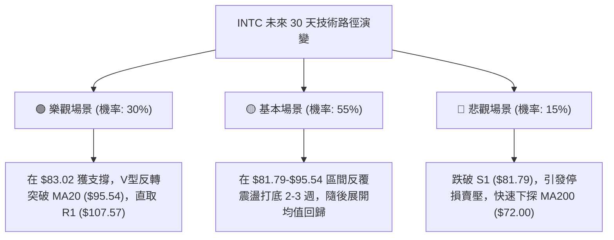

# INTC 技術分析報告

> **報告日期**：2026-08-26 ｜ **語言**：繁體中文 ｜ **數據來源**：Yahoo Finance ｜ **當前價格**：$87.48

---

## 目錄

| 章節 | 內容 |
|------|------|
| [1. 技術面概覽](#1-技術面概覽) | 訊號儀表板、核心指標、評分卡 |
| [2. 趨勢分析](#2-趨勢分析) | 多時框趨勢、長中短期走勢 |
| [3. 圖表形態分析](#3-圖表形態分析) | 形態識別、K線組合、目標價 |
| [4. 支撐與阻力](#4-支撐與阻力) | 關鍵價位、斐波那契回調 |
| [5. 技術指標深度解讀](#5-技術指標深度解讀) | MA/RSI/MACD/布林/成交量 |
| [6. 動能與波動率](#6-動能與波動率) | 動能評估、ATR、Beta |
| [7. 多時框架總結](#7-多時框架總結) | 時框架評分矩陣 |
| [8. 交易策略建議](#8-交易策略建議) | 多空策略、風險報酬比 |
| [9. 風險提示與監控](#9-風險提示與監控) | 監控指標、風險場景 |

---

## 1. 技術面概覽

### 🎯 技術訊號儀表板



### 📊 核心指標速覽表

| 指標類別 | 指標名稱 | 當前數值 | 訊號 | 解讀 |
|----------|----------|----------|:----:|------|
| **價格** | 當前價格 | $87.48 | 🟡 | 位於52週區間53.8%處，自高點$142.35回撤-38.55% |
| **均線** | MA20 | $95.54 | 🔴 | 價格低於MA20 (-8.43%)，短線承壓 |
| **均線** | MA50 | $106.85 | 🔴 | 價格低於MA50 (-18.13%)，中期回檔修正 |
| **均線** | MA200 | $72.00 | 🟢 | 價格高於MA200 (+21.50%)，長期多頭基底未破 |
| **動能** | RSI(14) | 29.89 | 🟢 | 觸及超賣線 (<30)，具技術性反彈動能 |
| **動能** | MACD | -3.519 | 🔴 | DIF < DEA (-2.774)，柱狀圖 -0.746，空方動能延續 |
| **趨勢** | ADX(14) | 16.10 | 🟡 | ADX < 25 表明單邊趨勢衰竭，進入低動能整理 |
| **通道** | 布林通道 %B | 0.19 | 🟡 | 逼近布林下軌 ($82.69)，下行空間收窄 |
| **波動** | ATR(14) | $5.17 | 🟡 | 佔股價 5.91%，日間波動度維持中高水準 |
| **量能** | 20日量比 | 0.75x | 🔴 | 今日量 81.19M < 20日均量 108.96M，買盤觀望 |

### 🏆 技術評分卡

```
╔══════════════════════════════════════════════════════════════╗
║              技術評分卡 — INTC (2026-08-26)                  ║
╠══════════════════════════════════════════════════════════════╣
║ 趨勢強度 (ADX/均線)     ███████░░░░░░░░░░░░░  35/100  🔴 空方佔優 ║
║ 動能指標 (RSI/MACD/KD)  ██████████░░░░░░░░░░  50/100  🟡 極度超賣 ║
║ 支撐穩定度 (S1/Fib50%)  ██████████████░░░░░░  70/100  🟢 接近關鍵 ║
║ 成交量配合 (OBV/量比)   ████████░░░░░░░░░░░░  40/100  🔴 量能疲弱 ║
║ 形態完整度 (回撤架構)   ████████████░░░░░░░░  60/100  🟡 震盪築底 ║
║ 均線排列 (多空糾結)     ████████░░░░░░░░░░░░  40/100  🔴 短空長多 ║
╠══════════════════════════════════════════════════════════════╣
║ 綜合評分                ██████████░░░░░░░░░░  49/100  🟡 區間震盪 ║
╚══════════════════════════════════════════════════════════════╝
```

---

## 2. 趨勢分析

### 🌐 多時框趨勢分析



### 📈 長期趨勢 — 12個月走勢圖（Unicode）

```
INTC 月線走勢圖（過去12個月：2025-09 至 2026-08）
價格軸 ($)
$140 ┤                                      ● 2026-06 ($139.63 / 52W高點 $142.35)
$120 ┤                                ●
$100 ┤                          ●
$80  ┤                                            ● 2026-07 ($90.20)
$60  ┤                                               ● 2026-08 現價 ($87.48)
$40  ┤            ●     ●     ●
$20  ┤● 2025-08 ($24.35)
     └─────────────────────────────────────────────────────────────►
       09    10    11    12    01    02    03    04    05    06    07    08 (月份)
      [───── 2025 年末起漲 ─────] [─── 2026 年初爆發 ───] [── 衝頂 ──] [ 深度修正 ]
```

#### 走勢特徵分析表格

| 階段 | 期間 | 價格區間 | 漲跌幅 | 走勢特徵與量價結構 |
|------|------|----------|:------:|--------------------|
| **第一階段：低檔築底起漲** | 2025-08 ~ 2025-11 | $24.35 → $40.56 | +66.57% | 突破底部箱體，成交量顯著放大，均線呈現黃金交叉。 |
| **第二階段：中繼高檔換手** | 2025-12 ~ 2026-03 | $36.90 → $44.13 | +19.59% | 於 $36.90-$46.47 區間形成長達4個月之高檔三角形收斂整理。 |
| **第三階段：主升段噴出** | 2026-04 ~ 2026-06 | $44.13 → $139.63 | +216.41% | 暴力主升段，單月最高觸及 $142.35，週成交量突破 8.8 億股。 |
| **第四階段：獲利了結回調** | 2026-07 ~ 2026-08 | $139.63 → $87.48 | -37.35% | 高檔獲利回吐，價格跌穿 MA20 與 MA50，於斐波那契 50% 處尋求支撐。 |

### 📊 中期趨勢（週線分析）

```
INTC 週線關鍵波段與壓力支撐結構
═══════════════════════════════════════════════════════════════════════════
$142.35 ───────────────────────────────────────────── 52W 最高點 (2026-06)
                 ▼ 主力派發
$126.64 ───────────────────────────── 波段阻力 R2
                       ▼ 跌破頸線
$107.57 ───────────────────────────────────── 關鍵阻力 R1 (MA60: $107.50 / MA50: $106.85)
                             ▼ 持續修正
$95.54  ───────────────────────────── BB中軌 / MA20 壓力位
                                   ▼ 當前位置
$87.48  ═════════════════════════════════════ 【現價 $87.48】(超賣測試區)
                                   ▲
$83.02  ───────────────────────────── 52W 斐波那契 50.0% 回調位
$81.79  ───────────────────────────────────── 近期波段低點支撐 S1 (BB下軌: $82.69)
═══════════════════════════════════════════════════════════════════════════
```

### ⚡ 趨勢強度評估（ADX 解讀）



| 指標項 | 數值 | 狀態 | 意涵與操作指引 |
|--------|:----:|:----:|----------------|
| **ADX(14)** | 16.10 | 弱趨勢/盤整 | 趨勢動能處於低位，切忌追漲殺跌，應採用區間震盪逆勢策略。 |
| **+DI (14)** | 20.13 | 弱多頭 | 多頭主動買盤動能衰退，等待突破確認。 |
| **-DI (14)** | 31.65 | 強空頭 | 賣方掌控局部盤面，但 -DI 已自高點鈍化，預示拋壓趨緩。 |

---

## 3. 圖表形態分析

### 🔍 形態識別系統



#### 形態信心度評估表

| 形態名稱 | 信心度 | 判斷依據（引用技術數據） | 完成度 | 目標價（附嚴格計算式） |
|----------|:------:|--------------------------|:------:|------------------------|
| **斐波那契回調 ABC 浪** | **75%** | 價格自頂部 $142.35 回跌，於 2026-07-26 創低 $92.32，反彈至 $102.50 後二度探底現價 $87.48。 | 85% | 形態回撤目標 = 斐波那契 50.0% **$83.02** 與 S1 **$81.79** 區間。 |
| **潛在雙重底 (W底)** | **55%** | S1 波段低點為 **$81.79**，近期次低點於 $87.48 測試；頸線位於反彈高點 R1 **$107.57**。 | 40% | 突破頸線理論目標 = 頸線 $107.57 + ($107.57 - $81.79) = **$133.35**（接近 R3 $132.75）。 |
| **布林下軌均值回歸** | **65%** | 價格觸及 BB 下軌 **$82.69** 上方，%B 達 0.19，RSI 為 29.89。 | 90% | 第一目標 = BB 中軌 (MA20) **$95.54**；第二目標 = MA50 **$106.85**。 |

### 🕯️ 重要 K 線形態分析

| 月份 / 日期 | 收盤價 | K線形態 | 解讀 | 訊號強度 |
|-------------|:------:|---------|------|:--------:|
| **2026-06** | $139.63 | **高檔長上影避雷針** | 盤中衝擊 $142.35 52W高點後大幅回落，主力主力派發訊號顯著。 | 🔴 強烈看空 |
| **2026-07** | $90.20 | **大陰線摜破短期均線** | 單月暴跌 -35.40%，跌破 MA20 與 MA60，市場恐慌拋售盤湧現。 | 🔴 空頭吞噬 |
| **2026-08-16** | $102.50 | **波段反彈受阻十字星** | 反彈至 MA50 ($106.85) 下方遇阻回落，形成下降通道中繼點。 | 🟡 壓力確認 |
| **2026-08-26** | $87.48 | **下影線縮量十字星** | 逼近下軌 $82.69 與 S1 $81.79，量能降至 81.19M，賣壓衰竭。 | 🟢 止跌初現 |

### 📉 ASCII 走勢形態示意圖

```
INTC 潛在雙底與斐波那契支撐形態結構
價格 ($)
$142.35 ──┐ (52W 峰值)
          │╲
$126.64 ──┼─╲────── R2 阻力
          │  ╲
$107.57 ──┼───●───── 頸線位 / R1 阻力 (反彈高點 $102.50~$107.57)
          │  ╱ ╲
$95.54  ──┼─╱───╲── MA20 / BB中軌
          │╱     ╲
$87.48  ──●───────●─► 【現價測試點】(潛在右底構建中)
          │ (左底)
$81.79  ──┴───────┴─ 近期波段最低點 S1 / 斐波那契 50.0% ($83.02)
```

---

## 4. 支撐與阻力

### 🗺️ 關鍵價位分布圖（Unicode）

```
INTC 價位結構分布圖（OHLCV 實際計算）
═════════════════════════════════════════════════════════════════════
$142.35 ║████████████████████████████████║ 52週歷史高點 (0.0% Fib)
$132.75 ║██████████████████████████      ║ 強阻力 R3 (+51.75%)
$126.64 ║████████████████████            ║ 阻力 R2 (+44.76%)
$114.34 ║██████████████████              ║ 斐波那契 23.6% 回調位
$107.57 ║████████████████████████████████║ 關鍵阻力 R1 / MA60 ($107.50)
$97.02  ║██████████████                  ║ 斐波那契 38.2% 回調位
$95.54  ║████████████                    ║ 布林中軌 / MA20
════════╬════════════════════════════════╬═══════════════════════════
$87.48  ╠════════════════════════════════╣ ◄ 當前收盤價 ($87.48)
════════╬════════════════════════════════╬═══════════════════════════
$83.02  ║▓▓▓▓▓▓▓▓▓▓▓▓▓▓▓▓▓▓▓▓▓▓▓▓▓▓▓▓    ║ 斐波那契 50.0% 強共振位
$81.79  ║████████████████████████████████║ 關鍵支撐 S1 (-6.50%)
$72.00  ║▓▓▓▓▓▓▓▓▓▓▓▓▓▓▓▓▓▓▓▓            ║ 長期均線 MA200 支撐
$69.01  ║▓▓▓▓▓▓▓▓▓▓▓▓▓▓                  ║ 斐波那契 61.8% 黃金分割位
$42.58  ║████████████████████████████████║ 強支撐 S2 (-51.33%)
$41.64  ║████████████████████████████████║ 極限支撐 S3 (-52.40%)
═════════════════════════════════════════════════════════════════════
```

### 🚧 阻力位分析表

| 阻力級別 | 價位 | 形成原因 | 突破難度 | 技術重要性 |
|----------|:----:|----------|:--------:|:----------:|
| **R1** | **$107.57** | 近一年波段高點聚類、MA60 ($107.50) 及 MA50 ($106.85) 重合共振區。 | ★★★★☆ | 極高。多空波段分水嶺，站穩方能宣告中期修正結束。 |
| **R2** | **$126.64** | 近一年次高波段聚類，2026年6月中旬反彈平台頂部。 | ★★★★☆ | 高。此處套牢籌碼密集，需量能放大至 1.5 億股上方。 |
| **R3** | **$132.75** | 主升浪派發高點密集區，僅次於 52W 高點 $142.35。 | ★★★★★ | 極高。歷史級別頂部解套阻力位。 |

### 🛡️ 支撐位分析表

| 支撐級別 | 價位 | 形成原因 | 守住機率 | 技術重要性 |
|----------|:----:|----------|:--------:|:----------:|
| **S1** | **$81.79** | 近一年波段低點聚類，與斐波那契 50% ($83.02) 及 BB 下軌 ($82.69) 構成支撐帶。 | 75% | 極高。短期多頭防線，失守將下探 MA200 ($72.00)。 |
| **S2** | **$42.58** | 2026年首季突破平台之起漲頸線密集聚類區。 | 90% | 歷史級。長期價值中樞支撐。 |
| **S3** | **$41.64** | 近一年底部平台起漲點支撐。 | 95% | 終極底線。 |

### 📐 斐波那契回調位分析

依據 52 週低點 **$23.68** 至 52 週高點 **$142.35** 計算之精確斐波那契回調結構：

```
0.0%  (52W High)  $142.35 ──────────────────────────────────────────
23.6%             $114.34 ──────────────────────────────────────────
38.2%             $97.02  ──────────────────────────────────────────
                  【現價 $87.48 位於 38.2% 與 50.0% 之間】
50.0%             $83.02  ══════════════════════════════════════════ (第一防禦核心)
61.8%             $69.01  ────────────────────────────────────────── (黃金分割強支撐)
78.6%             $49.08  ──────────────────────────────────────────
100.0% (52W Low)  $23.68  ──────────────────────────────────────────
```
* **現狀解讀**：現價 $87.48 跌破 38.2% ($97.02) 後，正精準朝向 50.0% 回調位 **$83.02** 靠攏。50.0% 水準與波段低點支撐 S1 **$81.79** 形成僅 1.5% 的極狹窄支撐共振帶，是技術派買盤的最佳介入防區。

---

## 5. 技術指標深度解讀

### 🎛️ 指標訊號總覽



### 📈 移動平均線排列分析



| 均線名稱 | 當前價格 | 與現價偏離度 | 斜率與走勢 | 多空意涵 |
|----------|:--------:|:------------:|:----------:|:--------:|
| **MA 5** | $89.95 | -2.74% | 下行 (█▇▆▅) | 超短期下壓，短線第一阻力 |
| **MA 10** | $95.79 | -8.68% | 下行 (█▇▆▅) | 短期反彈壓力 |
| **MA 20** | $95.54 | -8.43% | 下行 (███▇) | 20日成本線，布林中軌阻力 |
| **MA 50 / 60** | $106.85 / $107.50 | -18.62% | 下行 (▅▆██) | 中期空頭反壓，R1 關鍵阻力 |
| **MA 120** | $91.90 | -4.81% | 平緩 (▁▂▃▄) | 中半年線，反彈首要測試區 |
| **MA 200** | $72.00 | +21.50% | 上揚 (▁▂▃▄▅▆▇█) | 長期牛熊分水嶺，提供堅實底部支撐 |

### 📉 RSI(14) 分析

* **數值進度條**：
  `RSI(14) = 29.89` ｜ ██████░░░░░░░░░░░░░░ 29.89% (🟢 進入超賣區 <30)
* **超買超賣研判**：RSI 自 2026-04 高點 89.7 降至當前的 29.89，已進入深度超賣區間，技術性空頭殺跌力道已達極限，隨時誘發空頭回補。
* **背離分析**：
  * 2026-07-19 週線低點收盤 $95.04 (RSI: 27.4)，2026-07-26 收盤 $92.32 (RSI: 26.9)；目前現價 $87.48，RSI 為 29.89。價格再創新低而 RSI 未創新低，**呈現日線級別潛在底背離（Bullish Divergence）初階訊號**。

### 📊 MACD(12/26/9) 訊號解讀


* **解讀**：MACD 快慢線皆於零軸下方運行，屬空頭市場；然而週線級別柱狀圖已由 2026-07 的 -3.637 顯著收窄至 -0.746，顯示殺跌動能正在衰退，距離低檔金叉僅一步之遙。

### 📦 布林通道分析

```
INTC 布林通道寬度與現價位置 (日線週期)
═════════════════════════════════════════════════════════════════════
$108.39 ────────────────────────────────────────── 布林上軌 (Upper Band)
                     ↑
                     │ 通道寬度 = $25.70
$95.54  ────────────────────────────────────────── 布林中軌 (MA20)
                     │
$87.48  ─────────────┼──────────────────────────── 【現價位置 %B = 0.19】
                     ↓
$82.69  ────────────────────────────────────────── 布林下軌 (Lower Band)
═════════════════════════════════════════════════════════════════════
```
* **通道狀態**：%B 數值為 **0.19**，逼近下軌 $82.69。在 ADX=16.10 的低趨勢盤整市場中，價格觸及下軌往往構成極佳的通道逆勢做多買點，目標直指中軌 **$95.54**。

### 💹 成交量分析（量價配合度）

* **量價特徵**：最新日成交量為 **81.19M**，顯著低於 20 日均量 **108.96M**（量比 0.75x）及 50 日均量 **115.55M**。
* **OBV 能量潮**：OBV 趨勢低於其均線，反映機構資金在中期修正過程中呈現淨流出。
* **量價背離結論**：股價下跌但成交量大幅萎縮（縮量下挫），表明非恐慌性拋售，而是市場買盤暫時觀望；「跌無量」格局通常預示底部即將在支撐位（S1: $81.79）附近確立。

---

## 6. 動能與波動率

### ⚡ 動能評估四象限

| 象限 | 動能維度 | 波動維度 | 當前狀態 | 策略意涵 |
|:----:|:--------:|:--------:|:--------:|:---------|
| **Q1** | 強動能 | 低波動 | — | 穩定多頭趨勢，順勢加碼 |
| **Q2** | 弱動能 | 低波動 | — | 窄幅無量整理，流動性枯竭 |
| **Q3** | 強動能 | 高波動 | — | 主升/主跌段，高風險高回報 |
| **Q4** | **弱動能 (ADX: 16.10)** | **高波動 (ATR: 5.91%, Beta: 2.24)** | **✓ INTC 當前位置** | **超賣震盪洗盤，嚴格執行逢低吸納與區間操作** |



### 📊 ATR 波動率分析

* **當前數值**：`ATR(14) = $5.17`（佔股價比重 **5.91%**）。
* **風控與止損設定**：
  * **單日安全緩衝距離**：1.0 × ATR = **$5.17**
  * **波段操作停損間距**：1.5 × ATR = **$7.76**
  * **止損價位計算**：以 S1 支撐 $81.79 為基準向下跌破 0.5×ATR（$2.59），設定硬性止損點於 **$79.20**。

### 📐 Beta 與市場相關性

* **Beta 係數**：`Beta = 2.241`（高 Beta 屬性）。
* **意涵**：INTC 的波動幅度為標普 500 指數的 2.24 倍。在大盤回暖時具備極高彈性，但回調時跌幅亦會放大。當前高 Beta 股票在 RSI<30 時，往往伴隨劇烈的均值回歸彈升。

---

## 7. 多時框架總結

### 📋 時框架評分表

| 時框架 | 趨勢方向 | 動能指標 | 均線系統 | 形態結構 | 綜合評分 | 交易建議 |
|--------|:--------:|:--------:|:--------:|:--------:|:--------:|:---------|
| **短期 (日線)** | 🔴 弱勢探底 | 🟢 RSI超賣/底背離 | 🔴 均線蓋頭 | 🟡 測試布林下軌 | **45/100** | 逢低分批吸納，博弈反彈 |
| **中期 (週線)** | 🔴 深度修正 | 🟡 MACD柱收窄 | 🔴 跌破MA20/50 | 🟡 50%斐波那契回調 | **48/100** | 區間震盪操作，不追高 |
| **長期 (月線)** | 🟢 多頭完好 | 🟢 處於起漲半山腰 | 🟢 遠高於MA200 | 🟢 大週期突破後回踩 | **75/100** | 長期投資者之黃金建倉區 |

### 🔲 綜合訊號矩陣

```
時框架訊號收斂矩陣
┌──────────────┬──────────────────┬──────────────────┬──────────────────┐
│ 維度         │ 短期 (1-10日)    │ 中期 (2-8週)     │ 長期 (3-12月)    │
├──────────────┼──────────────────┼──────────────────┼──────────────────┤
│ 價格 vs 均線 │ 🔴 位於MA20下方  │ 🔴 位於MA50下方  │ 🟢 位於MA200上方 │
│ 動能 (RSI/KD)│ 🟢 極度超賣 (<30)│ 🟡 尋求中軸平衡  │ 🟢 位於強勢擴張區│
│ 趨勢強度 ADX │ 🟡 16.10 (無趨勢)│ 🟡 弱化修正      │ 🟢 大週期多頭    │
│ 支撐阻力共振 │ 🟢 S1 $81.79 支撐│ 🟢 Fib 50% $83.02│ 🟢 MA200 $72.00  │
└──────────────┴──────────────────┴──────────────────┴──────────────────┘
```

### ⚖️ 多時框收斂結論

> **依據規則 14 嚴格收斂判定**：
> 當前日線與週線 **ADX(14) = 16.10 (<25)**，明確定義市場處於**「非單邊趨勢之盤整/震盪行情」**。
> 根據多時框優先級收斂原則：
> 1. **主導維度**：盤整行情以**日線布林通道上下軌 ($82.69 ~ $108.39)** 及關鍵支撐 S1 **$81.79** 為主要交易邊界。
> 2. **方向定調**：中長期多頭格局（MA200: $72.00）未被破壞，短期跌破 MA20 乃極度超賣之深蹲。
> 3. **唯一方向結論**：**【中性偏多觀望 / 區間下軌高盈虧比搏反彈】**。

---

## 8. 交易策略建議

### 🗺️ 策略決策流程圖



### 🧭 策略路由（依評分卡分流）

* **當前綜合評分**：`49/100`（落於 40–60 區間）
* **當前主策略方向** = **【區間震盪反彈操作（以布林下軌及 S1 支撐低吸為主）】**

### 🎯 價格情境階梯（Price Scenarios）

| 觸發條件 | 第一目標 | 第二目標 | 情境技術含義 |
|----------|:--------:|:--------:|:-------------|
| **站穩 S1 $81.79 並突破 MA20 $95.54** | **R1: $107.57** | **R2: $126.64** | 超賣強烈反彈，日線底部確立 |
| **維持於 $83.02 ~ $95.54 區間震盪** | BB中軌 $95.54 | Fib 38.2% $97.02 | 消化空頭籌碼，ADX 築底收斂 |
| **有效跌破 S1 $81.79 (收盤價確認)** | MA200: $72.00 | Fib 61.8%: $69.01 | 深度擴大回撤，測試長期均線 |

### 📊 情境機率分佈

| 情境劇本 | 機率 | 主要技術依據 |
|----------|:----:|--------------|
| **情境一：支撐處超賣反彈** | **55%** | RSI(14)=29.89 極度超賣、Stoch %K/%D <15、Fib 50% ($83.02) 強共振。 |
| **情境二：區間底部窄幅拉鋸** | **30%** | ADX=16.10 趨勢動能匱乏、成交量萎縮至 81.19M、多空暫時均衡。 |
| **情境三：跌破 S1 深幅探底** | **15%** | MACD 零軸下綠柱延續、均線全面空頭反壓。 |

### 🟢 主策略詳情

| 策略要素 | 策略 A（左側逢低佈局 - 支撐低吸） | 策略 B（右側確認進場 - 突破買入） |
|----------|-----------------------------------|-----------------------------------|
| **進場條件** | 價格回踩 S1/Fib50% 區間且收出日線下影線 | 日線收盤價強勢突破 MA20 且成交量 > 1.1 億股 |
| **進場價格** | **$83.50**（$82.00 - $85.00 區間分批） | **$96.50**（確認站穩 MA20: $95.54） |
| **第一目標 (T1)**| **$95.54**（MA20 / BB中軌，獲利 +14.42%） | **$107.57**（R1 阻力位 / MA60，獲利 +11.47%）|
| **第二目標 (T2)**| **$107.57**（R1 關鍵阻力，獲利 +28.83%） | **$126.64**（R2 波段阻力，獲利 +31.23%）|
| **止損價格** | **$79.20**（跌破 S1 $81.79 - 0.5×ATR） | **$92.00**（跌破回踩低點） |
| **風險報酬比** | **1 : 3.32**（承擔 $4.30 風險換取 $14.27 期望值）| **1 : 2.46**（承擔 $4.50 風險換取 $11.07 期望值）|
| **成功機率** | **65%** | **58%** |
| **建議倉位** | **15% 總資金** | **20% 總資金** |

### 🔴 反向風險觸發點（對沖與風控提示）

* **空頭破位對沖觸發價**：**$81.00**（日線收盤確認摜破 S1 $81.79 與 Fib 50% $83.02）。
* **避險因應**：若此點位失守，多頭策略全面停損，並可買入反向保護或將現貨減倉 50%，目標下看 MA200 **$72.00**。

### ⭐ 整體訊號強度評星

```
╔═══════════════════════════════════════════════════════════╗
║ 做多訊號強度：★★★☆☆  (3.0/5星 - 超賣反彈結構確立)      ║
║ 做空訊號強度：★★☆☆☆  (2.0/5星 - 追空盈虧比極差)        ║
║ 整體可信度：  ★★★★☆  (4.0/5星 - 價位與指標高度收斂)    ║
╚═══════════════════════════════════════════════════════════╝
```

---

## 9. 風險提示與監控

### ✅ 關鍵監控指標 Checklist

```
╔══════════════════════════════════════════════════════════════════╗
║              INTC 每日交易監控清單 (Checklist)                   ║
╠══════════════════════════════════════════════════════════════════╣
║ [ ] 價格是否跌破防禦底線 S1 ($81.79) ──────── 破位立即停損離場  ║
║ [ ] RSI(14) 是否由超賣區 (<30) 向上突破 35 ── 確認動能拐點出現  ║
║ [ ] 日成交量是否放大至 1.08 億股 (20MA) ──── 驗證買盤主動進場  ║
║ [ ] MACD 柱狀圖是否收窄至 -0.200 以上 ────── 觀察底背離金叉    ║
║ [ ] 價格能否有效收復 MA20 ($95.54) ──────── 判斷反彈空間打開  ║
╚══════════════════════════════════════════════════════════════════╝
```

### ⚠️ 風險場景分析



### 🛡️ 風險管理重要提醒

1. **波動性管理**：鑑於 INTC **Beta 高達 2.241** 且 **ATR 為 $5.17 (5.91%)**，單筆交易虧損必須控制在總投資組合的 1.0% 以內。
2. **倉位配置原則**：在 ADX < 25 的盤整期間，總持倉不宜超過 30%，以分批（4-3-3 原則）逢低進場，切忌一次性滿倉。
3. **止損紀律**：嚴格遵守跌破 **$79.20** 無條件停損之紀律，防範小虧損演變為跌向 $72.00 的深幅套牢。

---

## 📋 報告總結

```
╔══════════════════════════════════════════════════════════════════════╗
║                    INTC 技術分析報告總結                             ║
╠══════════════════════════════════════════════════════════════════════╣
║ 報告日期：2026-08-26                                                 ║
║ 當前價格：$87.48                                                     ║
║ 技術評級：🟡 區間震盪築底 / 超賣反彈在即 (評分: 49/100)               ║
╠══════════════════════════════════════════════════════════════════════╣
║ 關鍵結論：                                                           ║
║ ├─ 長期趨勢：🟢 偏多（股價穩居 MA200 $72.00 之上 +21.50%）           ║
║ ├─ 中期趨勢：🔴 修正（自高點 $142.35 回調至斐波那契 50.0% $83.02）   ║
║ ├─ 短期趨勢：🟡 超賣（RSI 29.89 觸底，布林 %B 0.19，跌勢趨緩）       ║
║ ├─ 關鍵支撐：S1 $81.79 ｜ Fib 50.0% $83.02 ｜ MA200 $72.00          ║
║ ├─ 關鍵阻力：MA20 $95.54 ｜ R1 $107.57 ｜ R2 $126.64                 ║
║ └─ 華爾街共識目標價：$114.88 (隱含 +31.32% 上行空間)                  ║
╠══════════════════════════════════════════════════════════════════════╣
║ 最優策略組合：                                                       ║
║ 1. 🥇 最佳機會：於 $82.00 - $85.00 區間逢低做多，停損設於 $79.20，     ║
║                 目標直指 MA20 ($95.54) 與 R1 ($107.57)。             ║
║ 2. 🥈 次選機會：待日線突破 MA20 ($95.54) 右側追多，博弈 R1 ($107.57)。║
║ 3. 🥉 保守選擇：空手觀望，等待日線 MACD 零軸下金叉及成交量放大確認。 ║
╚══════════════════════════════════════════════════════════════════════╝
```

---

> ⚠️ **免責聲明**：本報告為 AI 自動生成之技術分析，所有數據及估算均基於提供的歷史價格資訊。本報告**僅供研究與學術參考**，**不構成任何投資建議**。投資有風險，入市需謹慎。

---

*報告生成時間：2026-08-26 ｜ 數據來源：Yahoo Finance ｜ 分析框架：多時框技術分析*