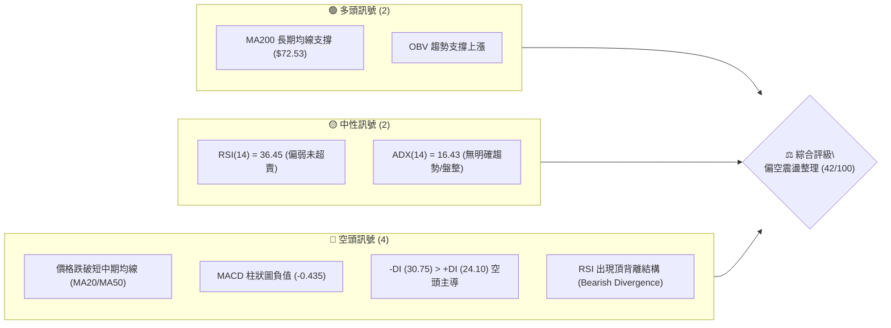
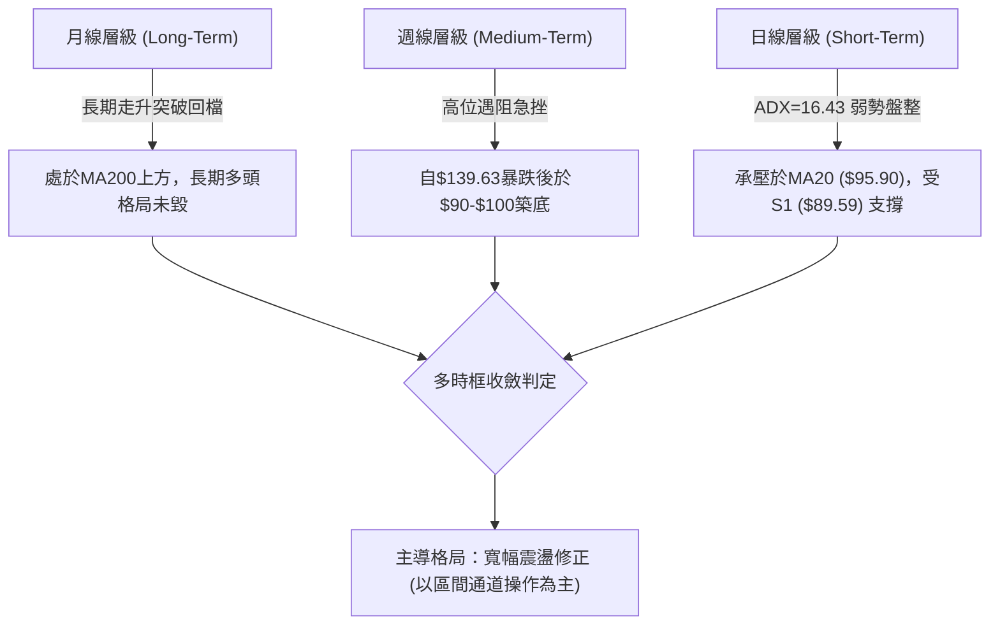
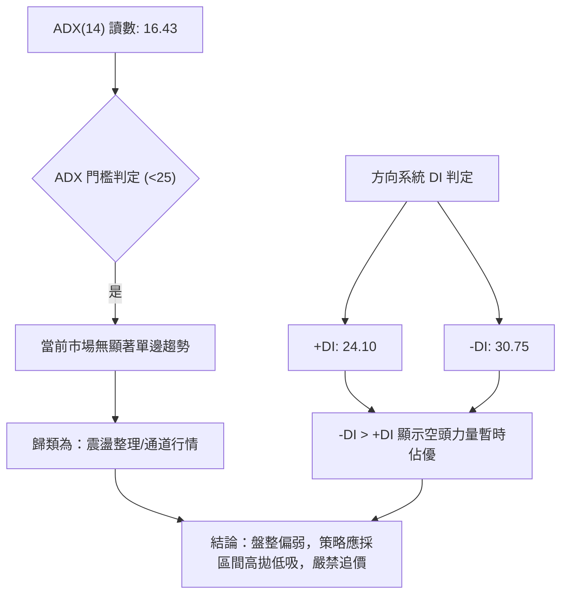
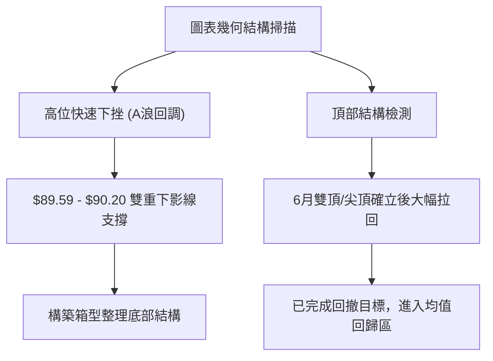
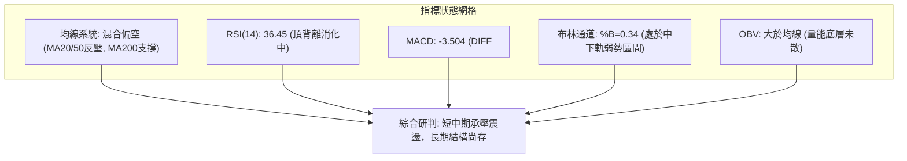
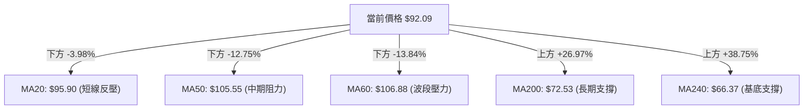
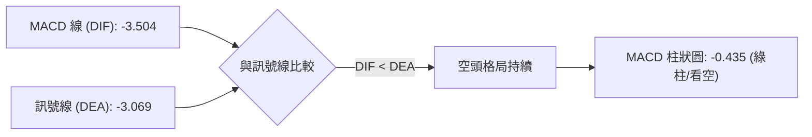
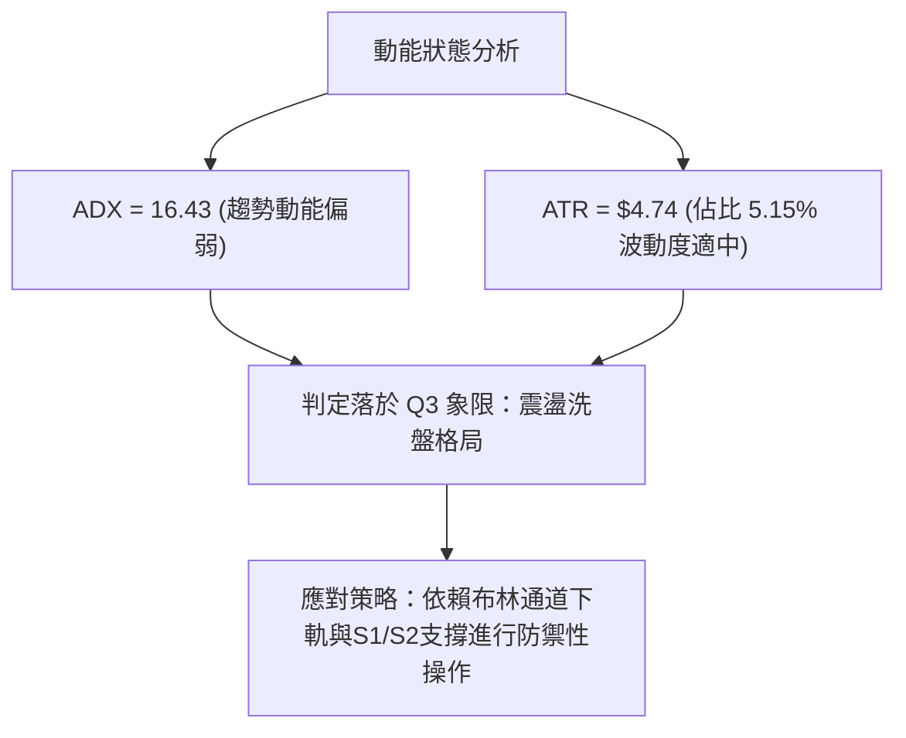
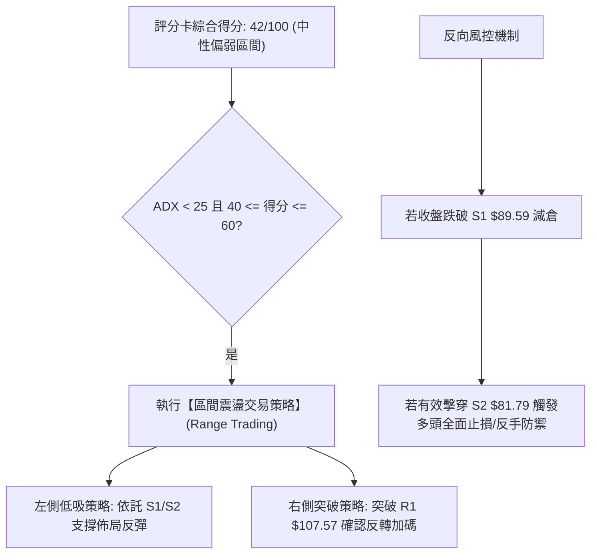
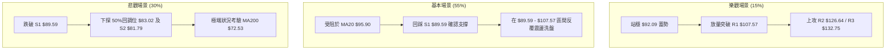

# INTC 技術分析報告

> **報告日期**：2026-08-28 ｜ **語言**：繁體中文 ｜ **數據來源**：Yahoo Finance ｜ **當前價格**：$92.09

---

## 目錄

| 章節 | 內容 |
|------|------|
| [1. 技術面概覽](#1-技術面概覽) | 訊號儀表板、核心指標、評分卡 |
| [2. 趨勢分析](#2-趨勢分析) | 多時框趨勢、長中短期走勢 |
| [3. 圖表形態分析](#3-圖表形態分析) | 形態識別、K線組合、目標價 |
| [4. 支撐與阻力](#4-支撐與阻力) | 關鍵價位、斐波那契回調 |
| [5. 技術指標深度解讀](#5-技術指標深度解讀) | MA/RSI/MACD/布林/成交量 |
| [6. 動能與波動率](#6-動能與波動率) | 動能評估、ATR、Beta |
| [7. 多時框架總結](#7-多時框架總結) | 時框架評分矩陣 |
| [8. 交易策略建議](#8-交易策略建議) | 多空策略、風險報酬比 |
| [9. 風險提示與監控](#9-風險提示與監控) | 監控指標、風險場景 |

---

## 1. 技術面概覽

### 🎯 技術訊號儀表板



### 📊 核心指標速覽表

| 指標類別 | 指標名稱 | 當前數值 | 訊號 | 解讀 |
|----------|----------|----------|------|------|
| **價格** | 當前價格 | $92.09 | 🟡 | 位於52週區間57.6%分位，自歷史高點回調整理 |
| **均線** | MA20 | $95.90 | 🔴 | 價格低於MA20 (-3.98%)，短期下行壓力存在 |
| **均線** | MA50 | $105.55 | 🔴 | 價格低於MA50，中期多頭架構遭到破壞 |
| **均線** | MA200 | $72.53 | 🟢 | 價格高於MA200 (+26.97%)，長期結構仍處多頭基底 |
| **動能** | RSI(14) | 36.45 | 🟡 | 位於中性偏弱區間，伴隨頂背離修正訊號 |
| **動能** | MACD(12,26,9) | -3.504 / -3.069 | 🔴 | MACD低於訊號線且柱狀圖為-0.435，動能偏空 |
| **波動** | ATR(14) | $4.74 | 🟡 | 佔股價5.15%，日均波動適中，震盪洗盤顯著 |

### 🏆 技術評分卡

```
╔══════════════════════════════════════════════════════════════════╗
║                   技術評分卡 — INTC (2026-08-28)                 ║
╠══════════════════════════════════════════════════════════════════╣
║ 趨勢強度 (Trend)     ████░░░░░░░░░░░░░░░░  25/100  🔴 弱趨勢/盤整║
║ 動能指標 (Momentum)  ██████░░░░░░░░░░░░░░  32/100  🔴 空方動能佔優║
║ 支撐穩定度 (Support) ████████████░░░░░░░░  60/100  🟡 S1具初步支撐║
║ 成交量配合 (Volume)  ██████████░░░░░░░░░░  50/100  🟡 量能略有萎縮║
║ 形態完整度 (Pattern) ████████░░░░░░░░░░░░  42/100  🟡 寬幅箱體回測║
║ 均線排列 (Moving Avg)████████░░░░░░░░░░░░  40/100  🔴 均線糾結偏空║
╠══════════════════════════════════════════════════════════════════╣
║ 綜合評分             ████████░░░░░░░░░░░░  42/100  ⚖️ 偏弱區間震盪║
╚══════════════════════════════════════════════════════════════════╝
```

---

## 2. 趨勢分析

### 🌐 多時框趨勢分析



### 📈 長期趨勢 — 12個月走勢圖（Unicode）

```
INTC 月線走勢圖（2025-08 至 2026-08）
價格軸 ($)
$140 ┤                                           ● (2026-06 $139.63)
$120 ┤                                      ●
$100 ┤                                ●
$90  ┤                                                ●──● ($92.09 現在)
$50  ┤                         ●──●
$40  ┤                  ●──●
$30  ┤             ●
$20  ┤● (2025-08 $24.35)
     └─────────────────────────────────────────────────────────────────
       08   09   10   11   12   01   02   03   04   05   06   07   08 (月份)
```

**走勢特徵分析表格**：

| 階段區間 | 起始/結束價 | 期間漲跌幅 | 走勢特徵解讀 | 技術含義 |
|----------|------------|------------|--------------|----------|
| **2025-08 ~ 2025-11** | $24.35 → $40.56 | +66.57% | 底部放量突破，脫離20元低檔平台 | 築底完成，初期主升段 |
| **2025-12 ~ 2026-03** | $36.90 → $44.13 | +19.59% | 40元關卡上方強勢橫盤整理 | 中繼蓄勢平台形成 |
| **2026-04 ~ 2026-06** | $94.48 → $139.63 | +47.79% | 垂直加速噴出，創52週高點$142.35 | 狂熱主升浪，頂部量能耗盡 |
| **2026-07 ~ 2026-08** | $90.20 → $92.09 | +2.10% | 斷崖式急跌後於$90關卡獲得支撐 | 均值回歸，進入寬幅震盪整理 |

### 📊 中期趨勢（週線分析）

```
週線關鍵阻力與支撐分佈
─────────────────────────────────────────────────────────────
[高點反壓]   $139.63 ══════════════════ (6月歷史頂部)
             $126.64 ------------------ (R2 強阻力區)
             $107.57 ------------------ (R1 / BB上軌反壓)
[現價位置]   $ 92.09 ◄═════════════════ (現價落點)
             $ 89.59 ------------------ (S1 近期波段支撐)
[強力防線]   $ 81.79 ══════════════════ (S2 / 50%斐波那契強支撐)
─────────────────────────────────────────────────────────────
```

### ⚡ 趨勢強度評估（ADX 解讀）



**ADX 趨勢強度對照解讀**：
- **當前 ADX(14) = 16.43**（░░░░░░░░░░ 16.43%），代表單邊趨勢力道極微，當前行情為典型的**無趨勢震盪市**。
- **+DI (24.10) vs -DI (30.75)**：負向指標大於正向指標，說明空方在短期博弈中稍佔上風，但因 ADX 偏低，尚未形成單邊暴跌的破位趨勢。

---

## 3. 圖表形態分析

### 🔍 形態識別系統



**圖表形態信心度矩陣**：

| 形態類別 | 信心度 | 判斷依據（引用數據） | 完成度 | 目標價（附計算式） |
|----------|--------|----------------------|--------|--------------------|
| **高位急跌後雙底雛形** | 55% | 2026-07收盤$90.20與S1 $89.59形成雙低點支撐 | 45% | 頸線$107.57 + ($107.57 - $89.59) = **$125.55** |
| **頂背離修正結構** | 80% | 週線RSI自89.7頂部持續滑落，日線RSI頂背離驗證 | 85% | 50%斐波那契回調位：**$83.02** |
| **頭肩底 / 三角形** | <30% | 數據不足以確認複雜幾何形態 | 0% | *訊號不足，僅做指標型區間解讀* |

### 🕯️ 重要K線形態分析

| 月份 | 收盤價 | K線形態 | 解讀 | 訊號 |
|------|--------|---------|------|------|
| **2026-05** | $114.68 | 巨幅長陽線 | 伴隨歷史天量持續推升，多頭極盛 | 🟢 強烈買訊 |
| **2026-06** | $139.63 | 高位長上影倒錘頭/十字星 | 衝高至$142.35後遇阻回落，買盤耗盡 | 🔴 見頂反轉 |
| **2026-07** | $90.20 | 大陰線破位下殺 | 獲利盤恐慌湧出，跌破短期多道均線 | 🔴 空頭釋放 |
| **2026-08** | $92.09 | 低檔縮量十字星/錘頭線 | 於$90.00大關上方止跌，空頭動能衰退 | 🟡 止跌企穩 |

### 📉 ASCII 走勢形態示意圖

```
INTC 日/週線區間箱型形態示意圖
$107.57 ─────────────────────── 阻力區 R1 / 箱體頂部
          │ ┌─┐
          │ │ │   ┌─┐
          └─┘ │   │ │
              └───┘ │   ┌─┐
                    └───┘ │ ◄── 現價 $92.09 (受阻於中軌 $95.90)
                          │
$89.59  ─────────────────────── 支撐區 S1 / 箱體底部 (多次測試未破)
```

### 🎯 形態目標價計算

1. **箱體下軌反彈目標（向上）**：
   - 形態底部：$89.59（S1）
   - 形態頸線：$107.57（R1）
   - 形態高度：$107.57 - $89.59 = $17.98
   - 向上突破目標價 = $107.57 + $17.98 = **$125.55**（高度貼近 R2 強阻力位 $126.64）
2. **破位下行測幅目標（向下）**：
   - 若S1 $89.59 失守，向下等距測幅 = $89.59 - $17.98 = **$71.61**（貼近 MA200 長期均線 $72.53）

---

## 4. 支撐與阻力

### 🗺️ 關鍵價位分布圖（Unicode）

```
INTC 價位結構分布圖
═══════════════════════════════════════════════════════════════════
$132.75 ║██████████████████████████████║ 強烈阻力 R3 (歷史密集成交頂部)
$126.64 ║████████████████████          ║ 波段阻力 R2 (反彈高點聚類)
$107.57 ║██████████████████████████████║ 核心阻力 R1 (布林上軌 / 頸線)
$ 97.02 ║░░░░░░░░░░░░░░░░░░░░░░        ║ 斐波那契 38.2% 阻力
$ 92.09 ╠══════════════════════════════╣ ◄ 現價落點 $92.09
$ 89.59 ║▓▓▓▓▓▓▓▓▓▓▓▓▓▓▓▓▓▓▓▓▓▓        ║ 關鍵支撐 S1 (近期波段低點聚類)
$ 83.02 ║████████████████              ║ 斐波那契 50.0% 回調強防線
$ 81.79 ║██████████████████████████████║ 波段強支撐 S2 (多頭生命線)
$ 72.53 ║██████████████████████        ║ MA200 年線長期支撐
$ 42.58 ║██████████████████████████████║ 極限支撐 S3 (前期中繼突破口)
═══════════════════════════════════════════════════════════════════
```

### 🚧 阻力位分析表

| 阻力級別 | 價位 | 形成原因 | 突破難度 | 重要性 |
|----------|------|----------|----------|--------|
| **R1** | **$107.57** | 近期反彈高點聚類，重合布林上軌 ($107.52) 與 MA60 ($106.88) | 🔴 高 | ★★★★★ 極高（突破方能扭轉中期空局） |
| **R2** | **$126.64** | 2026年6月中旬反彈次高點密集成交區 | 🔴 極高 | ★★★★☆ 高（強阻力壓制區） |
| **R3** | **$132.75** | 歷史頂部平台密集套牢區 | 🔴 極難 | ★★★★☆ 高（多頭歷史天花板） |

### 🛡️ 支撐位分析表

| 支撐級別 | 價位 | 形成原因 | 守住機率 | 重要性 |
|----------|------|----------|----------|--------|
| **S1** | **$89.59** | 8月多次回踩最低點聚類，與布林下軌 ($84.29) 構成防護區間 | 🟡 65% | ★★★★☆ 高（短線多空分水嶺） |
| **S2** | **$81.79** | 52週區間 50% 斐波那契 ($83.02) 重合區間波段低點 | 🟢 80% | ★★★★★ 極高（中期多頭核心堡壘） |
| **S3** | **$42.58** | 2026年Q1起漲點中繼平台 | 🟢 95% | ★★★☆☆ 中（極端黑天鵝防守位） |

### 📐 斐波那契回調位分析

基準區間：52週低點 **$23.68** → 52週高點 **$142.35**（總波幅 $118.67）

| 斐波那契回調級別 | 精確價位 | 相對現價位置 | 技術意義與狀態解讀 |
|------------------|----------|--------------|--------------------|
| **0.0% (52W High)** | $142.35 | +54.58% | 歷史最高點，極強心理天花板 |
| **23.6%** | $114.34 | +24.16% | 第一道深度回調阻力位 |
| **38.2%** | $97.02 | +5.35% | 現價上方直接阻力，重合 MA20 ($95.90) |
| **【現價落點】** | **$92.09** | **0.00%** | **位於 38.2% ($97.02) 與 50.0% ($83.02) 區間** |
| **50.0%** | $83.02 | -9.85% | 多空平衡分水嶺，強力買盤防禦區（鄰近 S2 $81.79） |
| **61.8%** | $69.01 | -25.06% | 黃金分割強支撐，鄰近 MA200 ($72.53) |
| **78.6%** | $49.08 | -46.70% | 長期多頭極限防線 |
| **100.0% (52W Low)**| $23.68 | -74.29% | 循環起漲基底 |

---

## 5. 技術指標深度解讀

### 🎛️ 指標訊號總覽



### 📈 移動平均線排列分析



- **均線排列判定**：目前呈現 `MA200 < 現價 < MA20 < MA50` 的**混合排列**。
- **解讀**：短天期均線（MA5、MA10、MA20）下彎形成蓋頭反壓，短線多頭難以直接發動攻勢；然而 MA200（$72.53）與 MA240（$66.37）強烈向上發散，顯示中長期多頭基本架構未被實質破壞。

### 📉 RSI(14) 分析

- **RSI 數值**：**36.45**
- **強度進度條**：███████░░░░░░░░░░░░░ 36.45%（中性偏弱）
- **背離分析**：**頂背離（Bearish Divergence）**。在2026年4-5月價格飆升至高點時，RSI高達89.7，隨後價格在6月再創新高$139.63，但週線RSI僅達67.2，形成典型頂背離，引發了7月以來的暴跌。目前日線 RSI 在 36.45 徘徊，尚未進入 <30 的絕對超賣區，顯示空頭下行動能雖趨緩但尚未完全扭轉。

### 📊 MACD(12/26/9) 訊號解讀



- **狀態**：DIFF 與 DEA 均在零軸下方運行，柱狀圖為 **-0.435**，顯示目前仍處於空頭控盤週期。
- **量化細節**：近兩週柱狀圖自 -1.810 縮小至 -0.435，負動能有所收斂，若短期能在 $90-$92 區間築底並引發 DIF 上穿 DEA，將形成日線級別「零下金叉」反彈訊號。

### 📦 布林通道分析

```
布林通道結構示意圖 (Bandwidth: $23.23)
─────────────────────────────────────────────────────────────
$107.52 ┬─────────────────────────────────────── 上軌 (強阻力區)
        │
$95.90  ┼────────────────── MA20 (中軌反壓)
        │
$92.09  * ◄── 現價落點 (%B = 0.34)
        │
$84.29  ┴─────────────────────────────────────── 下軌 (波段支撐區)
─────────────────────────────────────────────────────────────
```

- **%B 指標 = 0.34**：價格位於中軌與下軌之間，偏向弱勢運行區。
- **通道走勢**：中軌由升轉平並略向下傾斜，通道開口保持一定寬度，價格未跌破下軌 $84.29，說明當前未進入極端單邊超賣暴跌，而是處於下軌有撐的箱型震盪。

### 💹 成交量分析（量價配合度）

- **最新成交量**：100,251,700 股
- **20日均量**：103,154,775 股（量比：**0.97x**）
- **50日均量**：113,735,972 股
- **OBV 趨勢解讀**：目前 OBV > 均線，說明雖然短期價格經歷劇烈回調，但底層機構並未出現全面性量能潰逃，屬於高位獲利了結後的縮量洗盤。

---

## 6. 動能與波動率

### ⚡ 動能評估四象限

| 象限 | 動能維度 | 波動維度 | INTC 當前落點 | 策略含義 |
|------|----------|----------|---------------|----------|
| **Q1 (突破爆發)** | 強動能 (ADX>25) | 高波動 (ATR高) | — | 順勢突破追價 |
| **Q2 (穩定盤整)** | 弱動能 (ADX<25) | 低波動 (ATR低) | — | 網格高拋低吸 |
| **Q3 (震盪洗盤)** | **弱動能 (ADX=16.43)** | **高/中波動 (ATR=5.15%)** | **✓ INTC 位於此象限** | **嚴禁追高，嚴守支撐位逢低分批佈局** |
| **Q4 (單邊崩跌)** | 強動能 (空頭主導) | 高波動 | — | 順勢放空 / 全面止損 |



### 📊 ATR 波動率分析

- **ATR(14) 數值**：**$4.74**（佔當前股價 **5.15%**）。
- **止損距離建議**：
  - **保守型（1.5 × ATR）**：$4.74 × 1.5 = **$7.11** 緩衝空間。
  - **激進型（1.0 × ATR）**：$4.74 × 1.0 = **$4.74** 緩衝空間。
- **解讀**：每日震盪幅度約在 5 美元上下，因此進場價位必須嚴格設定於關鍵支撐附近，以避免被日常波動掃出場。

### 📐 Beta 與市場相關性

- **Beta 係數**：**2.241**（極高 Beta 屬性）。
- **解讀**：INTC 相較於標普500指數具有 2.24 倍的波動槓桿，大盤若出現 1% 的回調，INTC 可能產生超過 2% 的劇烈震盪，因此在建倉時需嚴格控制總體部位比例。

---

## 7. 多時框架總結

### 📋 時框架評分表

| 時框架 | 趨勢方向 | 動能狀態 | 均線排列 | 圖表形態 | 綜合評分 | 操作建議 |
|--------|----------|----------|----------|----------|----------|----------|
| **月線 (長期)** | 🟢 偏多 | 🟡 中性回調 | 🟢 多頭排列 (價在MA200上) | 頂部拉回均值 | **68/100** | 長期投資者逢低關注 |
| **週線 (中期)** | 🔴 偏空 | 🔴 頂背離下殺 | 🟡 跌破短期均線 | 寬幅回撤構築平台 | **38/100** | 耐心等待底部構築確認 |
| **日線 (短期)** | 🟡 震盪偏弱| 🔴 MACD負值 | 🔴 承壓於MA20/50 | S1/布林下軌支撐測試 | **42/100** | 區間操作，嚴設停損 |

### 🔲 綜合訊號矩陣

```
╔══════════════════════════════════════════════════════════════════╗
║                   多時框架訊號矩陣收斂表                         ║
╠════════════════╦════════════╦════════════╦═══════════════════════╣
║ 維度           ║ 長期 (月)  ║ 中期 (週)  ║ 短期 (日)             ║
╠════════════════╬════════════╬════════════╬═══════════════════════╣
║ 趨勢方向       ║ 🟢 多頭    ║ 🔴 空頭    ║ 🟡 橫盤震盪           ║
║ 動能指標       ║ 🟡 減弱    ║ 🔴 負值    ║ 🔴 偏弱 (RSI 36.45)   ║
║ 支撐壓力有效性 ║ 🟢 MA200強 ║ 🟡 S1測試  ║ 🟢 S1 ($89.59) 暫守穩 ║
║ 成交量配合度   ║ 🟢 OBV未破 ║ 🔴 放量急跌║ 🟡 縮量整理           ║
╚════════════════╩════════════╩════════════╩═══════════════════════╝
```

### ⚖️ 多時框收斂結論

依據多時框收斂規則：
1. **趨勢/盤整判定**：當前日線 **ADX(14) = 16.43 < 25**，明確定義當前處於**盤整行情**。
2. **主導維度收斂**：在盤整行情中，市場缺乏單邊趨勢，交易邏輯應以**日線布林通道上下軌（$84.29 - $107.52）及關鍵支撐阻力（S1 $89.59 / R1 $107.57）構成的震盪區間**為主導。
3. **方向性唯一結論**：**中性偏弱觀望（區間操作為主，主控價位 $89.59 - $107.57）**。中期週線頂背離下殺動能已初步釋放，短期在 S1 獲得防守支撐，因此不盲目追空，亦不激進抄底。

---

## 8. 交易策略建議

### 🗺️ 策略決策流程圖



### 🧭 策略路由

> **當前主策略方向 = 區間操作 / 偏弱防禦型低吸（依評分 42/100）**
> 
> 由於綜合評分落於 40–60 分之中性區間，且 ADX(14) 為 16.43 呈現低動能盤整，策略禁止盲目追高或過度殺跌，核心操作邏輯為**圍繞 S1 支撐位至 R1 阻力位進行網格震盪交易**。

### 🎯 價格情境階梯（Price Scenarios）

| 觸發條件 | 下一目標 | 後續延伸 | 情境含義 |
|----------|----------|----------|----------|
| **強勢突破 R1 $107.57** | **R2 $126.64** | **R3 $132.75** | 宣告中期洗盤結束，重啟上升趨勢浪 |
| **突破斐波那契 38.2% $97.02** | **R1 $107.57** | **R2 $126.64** | 站穩 MA20 短期均線，向箱體頂部推進 |
| **維持在現價 $92.09 震盪** | **MA20 $95.90** | **S1 $89.59** | 窄幅無方向震盪，時間換取空間 |
| **跌破 S1 $89.59** | **50%回調 $83.02** | **S2 $81.79** | 短期支撐破位，下探考驗核心生命線 |
| **跌破 S2 $81.79** | **MA200 $72.53** | **S3 $42.58** | 中期多頭架構瓦解，進入深幅修正 |

### 📊 情境機率分佈

| 情境 | 機率 | 主要依據 |
|------|------|----------|
| **區間震盪築底 ($89.59 - $107.57)** | **55%** | ADX=16.43 弱趨勢、OBV未散、布林中下軌提供彈性 |
| **回落探測 S2 / 50%斐波那契 ($81.79-$83.02)** | **30%** | MACD負值未轉正、RSI=36.45 偏弱、-DI 仍佔優勢 |
| **強勢單邊反轉突破 R1 ($107.57以上)** | **15%** | 均線仍處空頭排列，上方套牢籌碼沉重，需時間消化 |

### 🟢 主策略詳情（方向：區間防守與反彈低吸）

| 策略要素 | 策略 A：S1 支撐低吸策略 (波段) | 策略 B：突破 R1 追隨策略 (順勢) |
|----------|--------------------------------|----------------------------------|
| **進場條件** | 價格回測 S1 $89.59 企穩且出現日線下影線 | 日線收盤價帶量突破 R1 $107.57 |
| **進場價格** | **$89.59**（允許容錯區間 $89.60-$90.50） | **$107.57** |
| **目標價 T1** | **$97.02** (38.2% 斐波那契位) | **$126.64** (R2 強阻力位) |
| **目標價 T2** | **$107.57** (R1 箱頂阻力位) | **$132.75** (R3 歷史高點密集區) |
| **止損價格** | **$84.85** (低於S1約1.0×ATR，守布林下軌) | **$102.83** (跌回突破頸線下方1.0×ATR) |
| **風險報酬比** | **1 : 3.79** (以T2計：獲利$17.98 / 風險$4.74) | **1 : 3.94** (以T1計：獲利$19.07 / 風險$4.74) |
| **成功機率** | **58%** | **45%** |
| **建議倉位** | **10% - 15%** (分批建倉) | **15% - 20%** (確認突破後加碼) |

### 🔴 反向風險觸發點（對沖提示）

- **多頭止損防線**：若日線收盤價跌破 **$89.59（S1）**，所有短期多頭倉位應立即減半；若進一步跌破 **$81.79（S2 / 50%斐波那契）**，顯示回調演化為深幅下殺，必須全面清倉離場，防範回測 MA200（$72.53）。
- **空頭回補警戒**：若盤中帶量站上 **$97.02（38.2%回調位與MA20）**，短期空方動能瓦解，嚴禁追空。

### ⭐ 整體訊號強度評星

```
做多訊號強度：★★☆☆☆  (2.5/5星 - 依託支撐博反彈，勝率適中)
做空訊號強度：★★☆☆☆  (2.5/5星 - 接近箱體下軌，盈虧比不佳)
整體可信度：  ★★★★☆  (4.0/5星 - 區間邊界清晰，風控點位明確)
```

---

## 9. 風險提示與監控

### ✅ 關鍵監控指標 Checklist

```
╔══════════════════════════════════════════════════════════════════╗
║                   每日交易風控監控清單 (Checklist)               ║
╠══════════════════════════════════════════════════════════════════╣
║ [ ] 價格是否跌破關鍵防守點 S1: $89.59                            ║
║ [ ] RSI(14) 是否跌入 <30 超賣區或形成「底背離」                   ║
║ [ ] MACD 柱狀圖是否由負轉正 (向上穿越 0 軸產生金叉)              ║
║ [ ] 每日成交量是否放大至 50日均量 (1.13億股) 以上                ║
║ [ ] ADX(14) 是否突破 25 (確認走出盤整進入單邊趨勢)               ║
║ [ ] 價格能否收復並站穩 MA20 中軌 ($95.90)                        ║
╚══════════════════════════════════════════════════════════════════╝
```

### ⚠️ 風險場景分析



### 🛡️ 風險管理重要提醒

1. **高 Beta 波動防護**：INTC 的 Beta 高達 **2.241**，單日波動極大（ATR = $4.74）。在震盪市中，切忌使用全額倉位或高槓桿工具，單筆交易最大虧損額度應嚴格控制在總資金的 **1.0% - 1.5%** 以內。
2. **非對稱風險處置**：若價格向下觸及 $89.59 並伴隨放量跌破，不可抱持僥倖心理向下攤平，必須執行紀律性停損。
3. **量能配合驗證**：若反彈行情無法伴隨成交量放大至 1 億股以上，視為無量虛抽，觸及阻力位應及時獲利了結。

---

## 📋 報告總結

```
╔══════════════════════════════════════════════════════════════════╗
║                   INTC 技術分析報告總結                          ║
╠══════════════════════════════════════════════════════════════════╣
║ 報告日期：2026-08-28                                             ║
║ 當前價格：$92.09                                                 ║
║ 分析評級：⚖️ 偏弱區間震盪 (技術評分: 42/100)                     ║
║                                                                  ║
║ 關鍵結論：                                                       ║
║ ├─ 長期趨勢：🟢 偏多 (現價高於 MA200 $72.53 達 26.97%)           ║
║ ├─ 中期趨勢：🔴 偏空 (高位頂背離下殺，處於均值回歸修復期)        ║
║ ├─ 短期趨勢：🟡 震盪 (ADX=16.43 弱趨勢，圍繞 $92 築底)          ║
║ ├─ 核心支撐：S1: $89.59  │  S2: $81.79  │  50%斐波: $83.02       ║
║ ├─ 核心阻力：R1: $107.57 │  R2: $126.64 │  38.2%斐波: $97.02    ║
║ └─ 分析師共識：目標均價 $114.88 (評級: Hold, 41位分析師)         ║
║                                                                  ║
║ 最優策略組合：                                                   ║
║ 1. 🥇 最佳機會：於 S1 $89.59 附近分批低吸，博弈回抽 $97.02/$107.57║
║ 2. 🥈 次選機會：靜待突破 R1 $107.57 頸線後右側追隨進場           ║
║ 3. 🥉 保守選擇：維持空倉觀望，等待 ADX > 25 單邊趨勢明朗化      ║
╚══════════════════════════════════════════════════════════════════╝
```

---

> ⚠️ **免責聲明**：本報告為 AI 自動生成之技術分析，所有數據及估算均基於提供的歷史價格資訊。本報告**僅供研究與學術參考**，**不構成任何投資建議**。投資有風險，入市需謹慎。

---

*報告生成時間：2026-08-28 ｜ 數據來源：Yahoo Finance ｜ 分析框架：多時框技術分析*