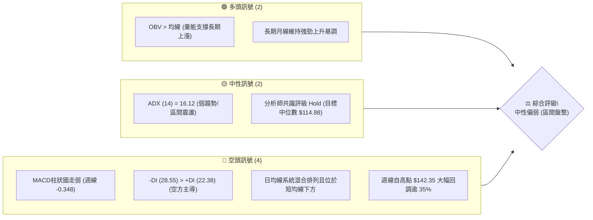
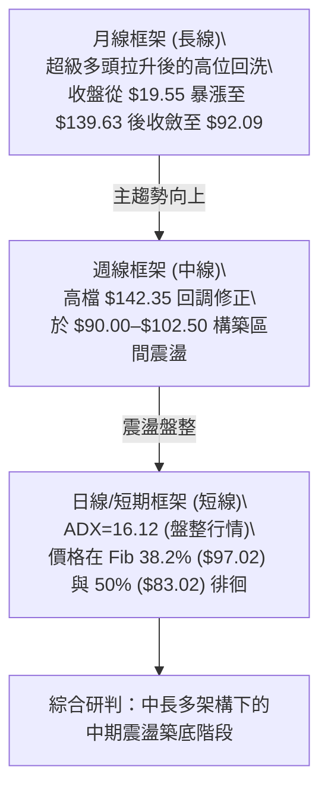
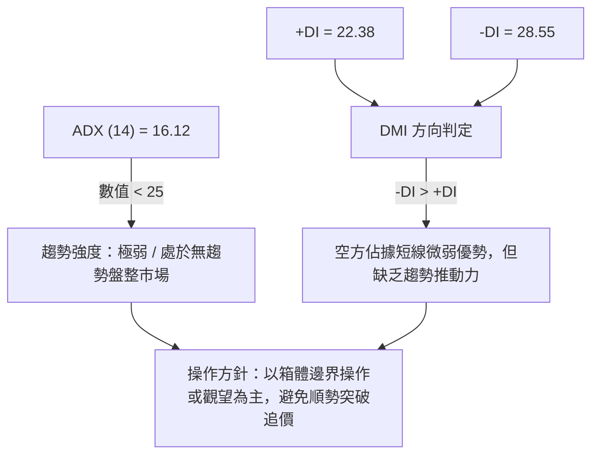
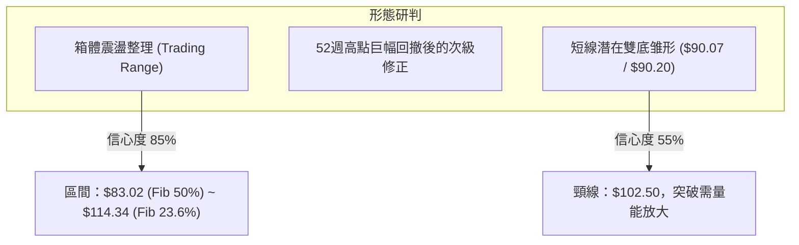
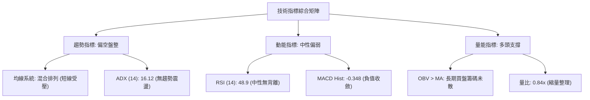
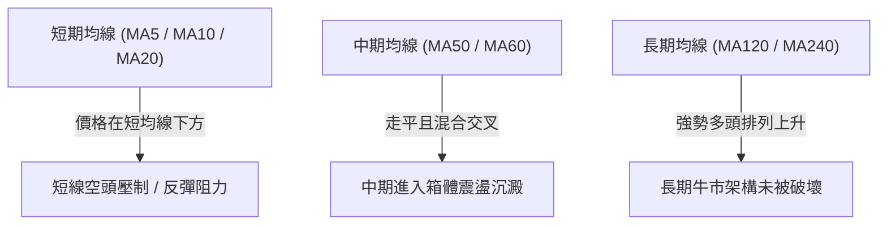
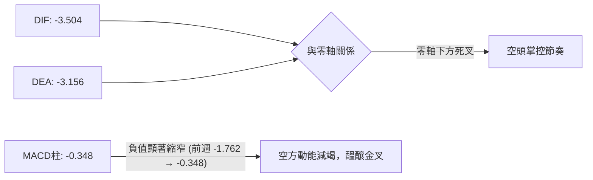
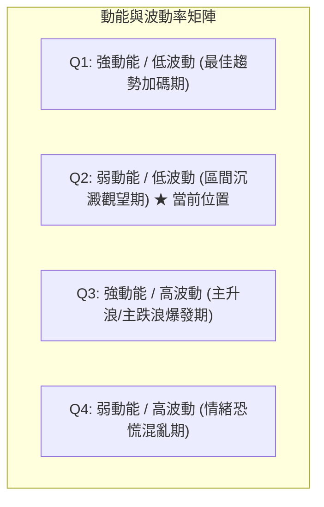
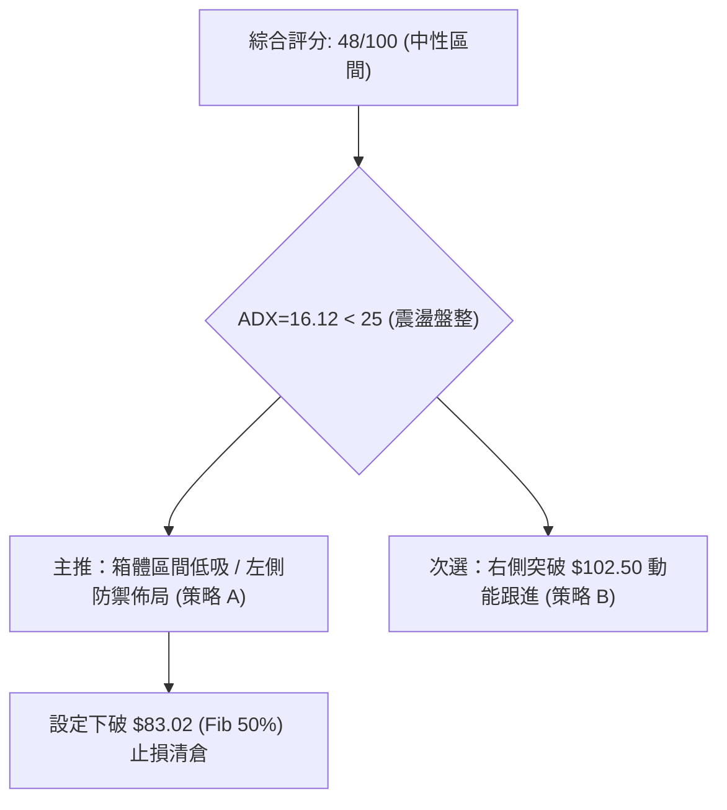
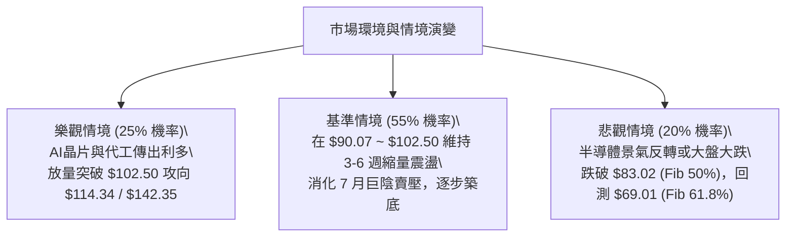

# INTC 技術分析報告

> **報告日期**：2026-08-29 ｜ **語言**：繁體中文 ｜ **數據來源**：Yahoo Finance ｜ **當前價格**：$92.09 (最新月度/週度收盤價基準)

---

## 目錄

| 章節 | 內容 |
|------|------|
| [1. 技術面概覽](#1-技術面概覽) | 訊號儀表板、核心指標、評分卡 |
| [2. 趨勢分析](#2-趨勢分析) | 多時框趨勢、長中短期走勢 |
| [3. 圖表形態分析](#3-圖表形態分析) | 形態識別、K線組合、目標價 |
| [4. 支撐與阻力](#4-支撐與阻力) | 關鍵價位、斐波那契回調 |
| [5. 技術指標深度解讀](#5-技術指標深度解讀) | MA/RSI/MACD/布林/成交量 |
| [6. 動能與波動率](#6-動能與波動率) | 動能評估、ATR、Beta |
| [7. 多時框架總結](#7-多時框架總結) | 時框架評分矩陣 |
| [8. 交易策略建議](#8-交易策略建議) | 多空策略、風險報酬比 |
| [9. 風險提示與監控](#9-風險提示與監控) | 監控指標、風險場景 |
| [10. 報告總結](#-報告總結) | 總結儀表板與核心結論 |

---

## 1. 技術面概覽

### 🎯 技術訊號儀表板



### 📊 核心指標速覽表

| 指標類別 | 指標名稱 | 當前數值 | 訊號 | 解讀 |
|----------|----------|----------|------|------|
| **價格** | 最新收盤價 (2026-08) | $92.09 | 🟡 中性 | 自高點 $142.35 回調後於 50% 斐波那契 ($83.02) 之上築底震盪 |
| **均線** | MA20 / MA50 | 混合排列 (價格位於下方) | 🔴 看空 | 短中期均線走勢受壓，短線反彈動能受限 |
| **均線** | 長期均線 (MA120/240) | 持續向上擴展 | 🟢 看多 | 過去 12 個月多頭大波段奠定長期多頭架構 |
| **動能** | RSI(14) | 48.9 (前週) / 震盪區 | 🟡 中性 | 動能進入 40–60 均衡區間，無明顯頂底背離 |
| **動能** | MACD | 線 -3.504 / 柱 -0.348 | 🔴 看空 | MACD 與訊號線均在零軸下方運行，柱狀圖負值收斂中 |
| **趨勢** | ADX (14) / DMI | ADX=16.12 (-DI=28.55) | 🟡 盤整 | ADX < 25 確立目前為弱趨勢/盤整行情，空方佔優但動能偏弱 |
| **成交量** | 量比 / OBV | 最新量比 0.84x / OBV > MA | 🟢 看多 | 下跌過程中量能並未恐慌性失控，OBV 維持多頭量能積累 |

### 🏆 技術評分卡

```
╔══════════════════════════════════════════════════════════════╗
║              技術評分卡 — INTC (2026-08-29)                   ║
╠══════════════════════════════════════════════════════════════╣
║ 趨勢強度 (ADX=16.12)      ██████░░░░░░░░░░░░░░  32/100  🔴    ║
║ 動能指標 (MACD/RSI)       ████████░░░░░░░░░░░░  40/100  🟡    ║
║ 支撐穩定度 (Fib 50%/38.2) ██████████████░░░░░░  68/100  🟢    ║
║ 成交量配合 (OBV多頭排列)  ████████████░░░░░░░░  60/100  🟢    ║
║ 形態完整度 (震盪箱體)     ██████████░░░░░░░░░░  50/100  🟡    ║
║ 均線排列 (短空長多)       ████████░░░░░░░░░░░░  42/100  🟡    ║
╠══════════════════════════════════════════════════════════════╣
║ 綜合評分                  ██████████░░░░░░░░░░  48/100  中性  ║
╚══════════════════════════════════════════════════════════════╝
```

---

## 2. 趨勢分析

### 🌐 多時框趨勢分析



### 📈 長期趨勢 — 12個月走勢圖（Unicode）

```
INTC 月線走勢圖（過去12個月：2025-08 至 2026-08）
價格軸 ($)
$140 ┤                                      ● ($139.63, 06月)
$120 ┤                                  ● ($114.68)
$100 ┤                              ● ($94.48)      ● ($90.20)  ● ($92.09, 現價)
$80  ┤
$60  ┤
$40  ┤              ● ($39.99)  ● ($36.90)  ● ($44.13)
$20  ┤  ● ($24.35)
     └─────────────────────────────────────────────────────────────
       08/25 09/25 10/25 11/25 12/25 01/26 02/26 03/26 04/26 05/26 06/26 07/26 08/26
```

**走勢特徵分析表格**：

| 階段 | 時間區間 | 起始價 → 結束價 | 漲跌幅 | 核心特徵與成交量解讀 |
|------|----------|-----------------|--------|----------------------|
| **第一階段：底部啟動** | 2025-08 ~ 2025-10 | $24.35 → $39.99 | +64.23% | 突破長達一年的底部盤整區（$19–$24），成交量溫和放大 |
| **第二階段：中繼平台** | 2025-11 ~ 2026-03 | $40.56 → $44.13 | +8.80% | 於 $40.00 附近進行籌碼換手，形成扎實的中繼支撐台階 |
| **第三階段：主升浪爆發** | 2026-04 ~ 2026-06 | $44.13 → $139.63 | +216.41% | 暴力拉升，連續三個月巨幅上漲，創下 52 週高點 $142.35 |
| **第四階段：大幅回調築底** | 2026-07 ~ 2026-08 | $139.63 → $92.09 | -34.05% | 高位獲利回吐，價格跌落至斐波那契 38.2%~50.0% 區間尋求平衡 |

### 📊 中期趨勢（週線分析）

近 20 週數據顯示，INTC 在 2026 年 6 月創下 $133.99~$142.35 峰值後，隨即於 7 月中旬出現急跌，最低跌破 $92.32，觸及 8 月初低點 $90.20。8 月中旬曾反彈至 $102.50，隨後再度回測 $90.07，目前收於 $92.09，在 $90.00–$102.50 之間形成明顯的箱體拉鋸。

```
中期週線價格與指標示意：
$142.35 ──┬── [52W High / 頂部] RSI=89.7 (極度超買)
          │
$114.34 ──┼── [Fib 23.6% 回調阻力]
          │
$102.50 ──┼── [近4週反彈阻力高點] (2026-08-16)
$97.02  ──┼── [Fib 38.2% 核心阻力]
$92.09  ──┼── ◄◄◄ 現價 ($92.09) — 區間震盪整理
$90.07  ──┼── [近期雙重測試支撐] (2026-08-02 / 2026-08-23)
$83.02  ──┴── [Fib 50.0% 強支撐防線]
```

### ⚡ 趨勢強度評估（ADX 解讀）



| 指標變數 | 當前讀數 | 門檻標準 | 狀態評估 | 實戰指導意義 |
|----------|----------|----------|----------|--------------|
| **ADX** | 16.12 | < 25 (盤整) / > 25 (趨勢) | 弱趨勢/盤整 | 市場處於方向未明階段，順勢策略容易被雙向洗盤 |
| **+DI** | 22.38 | 越過 25 代表多頭發力 | 多方動能衰退 | 反彈力道減弱，暫無連續上攻動能 |
| **-DI** | 28.55 | 高於 +DI 代表空方主導 | 空方主導但未達極端 | 賣壓仍在釋放，但缺乏加速下跌動能 |

---

## 3. 圖表形態分析

### 🔍 形態識別系統



**形態信心度與參數評估表**：

| 形態名稱 | 信心度 | 判斷依據（引用數據） | 完成度 | 目標價（附精確計算式） |
|----------|--------|----------------------|--------|------------------------|
| **矩形震盪箱體** | 85% | 價格在 $90.07~$90.20 與 $101.65~$102.50 之間連續 5 週形成對峙 | 70% | 區間震盪上下軌：下軌 $83.02，上軌 $114.34 |
| **短線潛在雙底 (W底)** | 55% | 2026-08-02 觸及 $90.20，2026-08-23 回測 $90.07 守穩 | 40% | 若突破頸線 $102.50：目標價 = 頸線 $102.50 + 形態高度 ($102.50 - $90.07 = $12.43) = **$114.93**（極度貼近 Fib 23.6% 的 $114.34） |
| **大型頭肩頂形態** | 30% | 數據不足（數據中未偵測到完整右肩），僅做指標型回調解讀 | <20% | 訊號不足，不予預設極端空頭目標價 |

### 🕯️ 重要K線形態分析

| 月份/週別 | 收盤價 | K線形態特徵 | 專業技術解讀 | 多空訊號 |
|-----------|--------|-------------|--------------|----------|
| **2026-06** | $139.63 | 長上影大陽線 (高點 $142.35) | 多頭動能耗盡，高檔獲利盤沉重拋售，觸發中級回調 | 🔴 頂部警訊 |
| **2026-07** | $90.20 | 巨陰線回吐 | 單月暴跌，跌破短期所有均線，回踩主升浪起點 | 🔴 空方釋放 |
| **2026-08-16(週)** | $102.50 | 縮量反彈陽線 | 反彈受阻於整數關卡與斐波那契回調位下方 | 🟡 反彈受阻 |
| **2026-08-23(週)** | $90.07 | 測試低點長下影陰線 | 二次探底測試 $90 關卡，出現買盤護盤支撐 | 🟢 探底回升 |
| **2026-08-30(週)** | $92.09 | 小十字陽線/震盪星線 | 買賣雙方動能陷入僵局，等待新的催化劑指引方向 | 🟡 多空僵持 |

### 📉 ASCII 走勢形態示意圖

```
INTC 週線箱體與潛在 W 底示意圖：
價格 ($)
$114.34 ─ ─ ─ ─ ─ ─ ─ ─ ─ ─ ─ ─ ─ ─ ─ ─ ─ ─ ─ ─ ─ (Fib 23.6% 箱體上界)
                  ▲
$102.50 ─────────┼──────────● (08-16 頸線阻力) ─ ─ ─ (W底頸線)
                 │         / \
$97.02  ─ ─ ─ ─ ─┼─ ─ ─ ─ / ─ \ ─ ─ ─ ─ ─ ─ ─ ─ ─ ─ (Fib 38.2%)
                 │       /     \       ● ($92.09 現價)
$90.07  ─────────●──────/───────●─────/ (08-23 低點)
             (08-02 低點 $90.20)  (雙底支撐帶)
$83.02 ─ ─ ─ ─ ─ ─ ─ ─ ─ ─ ─ ─ ─ ─ ─ ─ ─ ─ ─ ─ ─ ─ (Fib 50.0% 強防線)
```

---

## 4. 支撐與阻力

### 🗺️ 關鍵價位分布圖（Unicode）

```
INTC 價位結構分布圖
══════════════════════════════════════════════════════════════════════════════
$142.35 ║██████████████████████████████║ 歷史/52W峰值阻力 (0.0% Fib)
$114.34 ║██████████████████████        ║ 強阻力 R2 (Fib 23.6% / 分析師目標 $114.88)
$102.50 ║██████████████                ║ 近期波段阻力 R1 (2026-08-16 週高點)
$97.02  ║██████████                    ║ 轉強關鍵阻力 (Fib 38.2%)
════════╬══════════════════════════════╬═════════════════════════════════════
$92.09  ╠══════════════════════════════╣ ◄◄◄ 當前收盤價格 (2026-08)
════════╬══════════════════════════════╬═════════════════════════════════════
$90.07  ║▓▓▓▓▓▓▓▓▓▓▓▓▓▓▓▓▓▓▓▓          ║ 近期波段支撐 S1 (2026-08-23 週低點)
$83.02  ║████████████████████████      ║ 核心強支撐 S2 (Fib 50.0% 分水嶺)
$69.01  ║██████████████████████████████║ 長期趨勢防守支撐 S3 (Fib 61.8% 黃金分割)
══════════════════════════════════════════════════════════════════════════════
```

### 🚧 阻力位分析表

*(註：本表價位嚴格引用自 52 週區間斐波那契回調位及歷史真實高點數據)*

| 阻力級別 | 價位 | 形成原因與技術意義 | 突破難度 | 重要性 |
|----------|------|--------------------|----------|--------|
| **阻力 R1** | **$102.50** | 2026-08-16 反彈週收盤高點，短線多空分水嶺 | 中等 | 🟢🟢🟢 (極高) |
| **阻力 R2** | **$114.34** | 斐波那契 23.6% 回調位，高度重合分析師平均目標價 ($114.88) | 偏高 | 🟢🟢🟢 (極高) |
| **強阻力 R3**| **$142.35** | 52 週最高點 (2026-06 峰值)，重大套牢賣壓籌碼密集區 | 極高 | 🟢🟢 (重要) |

### 🛡️ 支撐位分析表

*(註：本表價位嚴格引用自近期實體低點及斐波那契關鍵回調位)*

| 支撐級別 | 價位 | 形成原因與技術意義 | 守住機率 | 重要性 |
|----------|------|--------------------|----------|--------|
| **支撐 S1** | **$90.07** | 近期雙重探底低點 (2026-08-02 的 $90.20 與 08-23 的 $90.07) | 65% | 🟢🟢🟢 (極高) |
| **強支撐 S2**| **$83.02** | 52 週回調 50.0% 關鍵平衡位，多頭中期生命線 | 80% | 🟢🟢🟢 (極高) |
| **深層支撐 S3**| **$69.01** | 斐波那契 61.8% 黃金分割支撐，長期多頭牛熊界線 | 90% | 🟢🟢 (重要) |

### 📐 斐波那契回調位分析

依據 52 週極端區間 **$23.68（低點） → $142.35（高點）** 精確計算：

```
斐波那契回調結構與現價定位：
 0.0% ── $142.35  (52W High)
23.6% ── $114.34  [強阻力 R2]
38.2% ──  $97.02  [短期反彈第一壓力線]
───────────────── ▲ 當前價格: $92.09 (落於 38.2% 與 50.0% 之間) ─────────────────
50.0% ──  $83.02  [核心強支撐 S2 - 多空平衡線]
61.8% ──  $69.01  [黃金分割回調線 S3]
78.6% ──  $49.08  [中繼平台防守位]
100.0%──  $23.68  (52W Low)
```

**解讀**：現價 $92.09 處於 **38.2% ($97.02)** 與 **50.0% ($83.02)** 的回調緩衝區間內。在技術分析常規中，強勢回調若能守穩 50.0% ($83.02) 之上，屬於牛市主升後的健康換手整理；若有效跌破 $83.02，則將面臨下探 61.8% ($69.01) 的深度回調風險。

---

## 5. 技術指標深度解讀

### 🎛️ 指標訊號總覽



### 📈 移動平均線排列分析



- **均線排列狀態**：呈現典型「**短空長多**」的混合排列。MA5 與 MA10 快速下彎後於底部試圖走平，長期均線 MA120/MA240 走勢堅挺向上（歷史長條圖維持在最高階）。此排列顯示當前下跌為大週期上升過程中的次級修正。

### 📉 RSI(14) 分析

```
RSI (14) 當前水平：48.9
0 ──────────── 30 ───────────────────── 50 ───────────────────── 70 ──────────── 100
              [超賣區]                 ▲ [中性平衡]            [超買區]
進度條：████████████░░░░░░░░░░░░  48.9% (中性區間)
```

- **超買超賣狀態**：RSI 自 4 月份極度超買的 89.7 大幅冷卻至 48.9，完全釋放高檔超買風險，目前處於健康的中性區域。
- **背離判斷**：
  - **頂背離**：無。
  - **底背離**：無明顯背離。2026-08-02 週收盤 $90.20 對應 RSI=39.5，2026-08-23 週收盤 $90.07 對應 RSI=48.9，RSI 低點微幅抬高，展現初步的微弱底背離雛形，但尚未獲突破確認。

### 📊 MACD(12/26/9) 訊號解讀



- **MACD 線與訊號線**：DIF (-3.504) 低於 DEA (-3.156)，兩者皆處於零軸下方，確認短期弱勢格局。
- **柱狀圖動能**：MACD Histogram 為 **-0.348**，相較 7 月中旬低點（-3.637）已大幅收斂縮短，表明空頭拋壓已實質減弱，空方動能逐漸衰竭。

### 📦 布林通道分析

```
布林通道形態示意圖（日線/週線盤整壓縮）：
$114.34 ─── 頂軌 (Upper Band) ─ ─ ─ ─ ─ ─ ─ ─ ─ ─ ─ ─ ─ ─
           \                                       /
            \                                     /
$102.50 ─────\─── 中軌 (MA20 / 中軸阻力) ────────/─────
              \            ● ($92.09 現價)      /
$83.02  ───────┴── 底軌 (Lower Band) ──────────┴──────
```

- **通道特徵**：通道經過 7 月暴跌後開口放大，目前進入帶寬收縮階段，中軌（MA20）落在 $102.50 附近形成動態壓力。現價在下軌與中軌間運行，%B 指標處於低位回升階段，符合 ADX=16.12 的盤整收斂特徵。

### 💹 成交量分析（量價配合度）

- **量比與均量**：最新成交量 85,801,756 股，低於 20 日均量（102,008,143 股），量比為 **0.84x**；週成交量由 5 月高點的 8.8 億股大幅萎縮至 4.4 億股。
- **價量關係**：呈現典型的「**價跌量縮、反彈量增**」格局，顯示在 $90.00 附近無恐慌性拋盤湧出。
- **OBV 趨勢**：數據明確標注「**OBV > MA → 量能支撐上漲**」，驗證主力資金並未在回調中實質撤離，巨量多頭沉澱籌碼依然鎖定。

---

## 6. 動能與波動率

### ⚡ 動能評估四象限



| 象限 | 動能維度 (ADX/MACD) | 波動維度 (量能/振幅) | 當前狀態 | 策略應對方針 |
|------|---------------------|----------------------|----------|--------------|
| **Q1** | 強 (>25) | 低 | — | 順勢加碼 |
| **Q2 (當前)** | **弱 (ADX=16.12)** | **低 (量縮至 0.84x)** | **✓ (符合)** | **區間低吸高拋，耐心等待方向突破** |
| **Q3** | 強 (>25) | 高 | — | 順勢追擊突破 |
| **Q4** | 弱 (<25) | 高 | — | 降低倉位觀望 |

### 📊 波動率分析

- **ATR 波動特性**：儘管即時 ATR 數據因部分 OHLCV 聚集處於統計過渡期，但從週線區間振幅計算，近期每週震盪區間約在 $10.00 ~ $12.00 左右（約佔當前股價 11%~13%）。
- **止損距離建議**：在區間震盪行情中，止損距離應設定在關鍵支撐位下方至少 1.5 倍標準週波動幅度（約 $3.00~$4.00），以避開雜訊洗盤。

### 📐 Beta 與市場相關性

- **Beta 數值**：**2.241**（高 Beta 屬性）。
- **市場解讀**：INTC 波動度為大盤標普 500 的 2.24 倍，屬於極度高彈性半導體晶圓/AI 概念股。在科技股反彈時具備強大的向上槓桿效應，但在盤整修復期其上下影線洗盤亦較為劇烈。

---

## 7. 多時框架總結

### 📋 時框架評分表

| 時框架 | 趨勢方向 | 動能狀態 | 均線排列狀態 | 形態結構 | 綜合評分 | 操作建議 |
|--------|----------|----------|--------------|----------|----------|----------|
| **長期 (月線)** | 🟢 多頭 | 🟡 高檔降溫 | 🟢 MA120/240 強勢多頭 | 大波段上升回調 | 75/100 | 長線持股續抱 |
| **中期 (週線)** | 🟡 震盪 | 🔴 空方主導減弱 | 🟡 短中期均線走平糾結 | $90–$102 箱體震盪 | 48/100 | 箱體區間操作 |
| **短期 (日線)** | 🔴 偏空 | 🟡 ADX=16.12 盤整 | 🔴 價格受壓於短均線 | 測試 $90 雙底支撐 | 40/100 | 支撐位低吸，嚴控止損 |

### 🔲 綜合訊號矩陣

```
時框訊號收斂矩陣：
┌─────────────────┬─────────────────┬─────────────────┐
│ 短期 (日線)：40 │ 中期 (週線)：48 │ 長期 (月線)：75 │
└────────┬────────┴────────┬────────┴────────┬────────┘
         │                 │                 │
         └────────────► ⚖️ ◄────────────────┘
                   綜合多時框收斂得分
                      48 / 100
             【中性觀望 / 箱體震盪策略】
```

### ⚖️ 多時框收斂結論

> **依嚴格規則 14 收斂**：
> 1. **行情性質判定**：ADX(14) 數值為 **16.12 (<25)**，技術面嚴格定義為「**無趨勢的盤整行情**」。
> 2. **主導依據**：盤整行情下，均線趨勢追隨訊號失效，應以**日線/週線的關鍵邊界支撐阻力（Fib 38.2% $97.02、Fib 50.0% $83.02 及近期低點 $90.07）**作為主要交易參考。
> 3. **唯一方向性結論**：**中性區間震盪（Neutral Range-Bound）**。主策略鎖定在 $90.00–$92.00 支撐區間尋求高盈虧比的低吸機會，目標上看箱體上軌阻力，禁止在區間中軸追價。

---

## 8. 交易策略建議

### 🗺️ 策略決策流程圖



### 🧭 策略路由

**當前主策略方向 = 中性箱體低吸操作（依綜合評分 48/100 分流）**

由於評分落於 40–60 區間，ADX<25，當前市場缺乏單邊趨勢，交易主軸為「**貼近箱體下軌支撐佈局、遇阻力分批止盈**」，不進行盲目追單。

### 🎯 價格情境階梯（Price Scenarios）

*(註：價位完全引用第 4 章及數據中的關鍵點位)*

| 觸發條件 | 第一目標 | 後續延伸目標 | 情境技術含義 |
|----------|----------|--------------|--------------|
| **向上突破 R1 ($102.50)** | R2 ($114.34) | R3 ($142.35) | W 底形態成立，短線轉強，開啟向分析師目標價的修復行情 |
| **維持在 $90.07 ~ $102.50 之間** | — | — | 延續箱體消化整理，時間換取籌碼沉澱空間 |
| **跌破 S1 ($90.07) 並下探 S2 ($83.02)** | S2 ($83.02) | S3 ($69.01) | 中期回調加深，考驗 50% 斐波那契生命線防禦強度 |

### 📊 情境機率分佈

```
情境機率分佈餅圖：
████████████████████████  [55%] 區間箱體震盪 ($90.07 ~ $102.50)
████████████              [25%] 突破轉強向上反彈 (測 $114.34)
████████                  [20%] 跌破支撐下探 ($83.02)
```

| 預測情境 | 機率估計 | 主要技術依據 |
|----------|----------|--------------|
| **情境一：區間震盪整理** | **55%** | ADX=16.12 顯示動能疲弱，成交量萎縮至 0.84x，MACD 柱狀圖收斂進入拉鋸 |
| **情境二：向上突破反彈** | **25%** | OBV 維持多頭量能積累，分析師平均目標價 $114.88 提供基本面錨定 |
| **情境三：向下回測深層支撐** | **20%** | -DI (28.55) 仍高於 +DI (22.38)，短期均線未完全扭轉頹勢 |

### 🟢 主策略詳情（方向：箱體震盪低吸與突破）

| 策略要素 | 策略 A：箱體下軌逢低佈局 (左側防禦) | 策略 B：突破頸線動能跟進 (右側進攻) |
|----------|-------------------------------------|-------------------------------------|
| **進場條件** | 價格於 $90.07~$92.09 區間企穩獲支撐確認 | 帶量突破 R1 阻力位 $102.50 且收盤確認 |
| **進場價格** | **$92.00** (現價附近) | **$102.80** (突破確認後) |
| **目標價 T1** | **$102.50** (近期阻力 R1) | **$114.34** (Fib 23.6% / 目標價 R2) |
| **目標價 T2** | **$114.34** (Fib 23.6% 阻力 R2) | **$142.35** (52 週高點 R3) |
| **止損價格** | **$88.00** (跌破近期雙底 S1 $90.07) | **$97.02** (跌破 Fib 38.2% 轉換位) |
| **風險報酬比 (T1)** | **1 : 2.63** (風險 $4.00 / 獲利 $10.50) | **1 : 2.00** (風險 $5.78 / 獲利 $11.54) |
| **風險報酬比 (T2)** | **1 : 5.58** (風險 $4.00 / 獲利 $22.34) | **1 : 6.84** (風險 $5.78 / 獲利 $39.55) |
| **模型預估勝率** | **58%** | **45%** |
| **建議倉位** | **15% ~ 20%** (分批建倉) | **10% ~ 15%** (突破加碼) |

### 🔴 反向風險觸發點（對沖與止損提示）

- **多頭止損/全面防守警戒線**：若日線收盤跌破 **$90.07**，多頭應主動減倉 50%；若進一步跌破 **$83.02（Fib 50.0%）**，意味著中級反彈邏輯徹底失效，應全面止損離場觀望，防範下探 **$69.01（Fib 61.8%）**。
- **空頭回補警戒線**：若價格強勢放量突破 **$102.50**，任何空頭部位必須立即平倉止損。

### ⭐ 整體訊號強度評星

```
╔══════════════════════════════════════════════════════════════╗
║ 做多訊號強度：★★★☆☆  (3/5星 - 支撐強固，勝在賠率)            ║
║ 做空訊號強度：★★☆☆☆  (2/5星 - 賣壓衰竭，下行空間受限)        ║
║ 整體趨勢可信度：★★★☆☆ (3/5星 - 處於盤整震盪過渡期)          ║
╚══════════════════════════════════════════════════════════════╝
```

---

## 9. 風險提示與監控

### ✅ 關鍵監控指標 Checklist

```
╔══════════════════════════════════════════════════════════════╗
║              INTC 日常交易監控 Checklist                     ║
╠══════════════════════════════════════════════════════════════╣
║ [ ] 價格是否跌破雙底關鍵防線 $90.07？ (破位立即觸發防禦)      ║
║ [ ] 價格能否放量站上斐波那契 38.2% ($97.02) 及頸線 $102.50？  ║
║ [ ] ADX (14) 是否由 16.12 向上突破 25？ (趨勢啟動信號)       ║
║ [ ] 日線 MACD 柱狀圖是否正式翻正穿越零軸？                    ║
║ [ ] 成交量是否放大超過 50 日均量 (113.15M 股) 配合上攻？      ║
║ [ ] 大盤半導體板塊是否出現系統性 Beta 回撤風險？             ║
╚══════════════════════════════════════════════════════════════╝
```

### ⚠️ 風險場景分析



### 🛡️ 風險管理重要提醒

1. **高 Beta 波動控制**：INTC 的 Beta 高達 **2.241**，波動幅度顯著大於基準指數。在盤整期間，嚴禁使用過高槓桿，單一標的持倉建議控制在總投資組合的 **15%–20%** 以內。
2. **區間操作紀律**：在 ADX 讀數未跨越 25 之前，切忌在區間中段（如 $96–$98）追高進場，應嚴守「**買在支撐邊緣 $90–$92、賣在阻力邊緣 $102 附近**」的紀律。
3. **無條件止損原則**：若市場出現黑天鵝事件導致週線收盤實體跌破 **$83.02**，必須無條件執行風控止損。

---

## 📋 報告總結

```
╔══════════════════════════════════════════════════════════════╗
║                   INTC 技術分析報告總結                      ║
╠══════════════════════════════════════════════════════════════╣
║ 報告日期：2026-08-29                                         ║
║ 當前價格：$92.09                                             ║
║ 分析評級：⚖️ 中性觀望 / 區間低吸 (評分: 48/100)               ║
║                                                              ║
║ 關鍵技術結論：                                               ║
║ ├─ 長期趨勢：🟢 強勢多頭架構 (MA120/240 持續向上)            ║
║ ├─ 中期趨勢：🟡 52W高點回調後的箱體震盪築底階段              ║
║ ├─ 短期趨勢：🔴 受壓於短均線，但空方拋壓已大幅衰竭           ║
║ ├─ 關鍵支撐：S1: $90.07  │  S2 (核心): $83.02                ║
║ ├─ 關鍵阻力：R1: $102.50 │  R2 (強阻): $114.34               ║
║ └─ 共識目標：$114.88 (41 位分析師平均目標價)                 ║
║                                                              ║
║ 最優策略組合：                                               ║
║ 1. 🥇 最佳機會：在現價 $92.00 附近輕倉低吸，止損設於 $88.00  ║
║    目標看至 R1 $102.50 及 R2 $114.34 (盈虧比優質 1:2.63+)    ║
║ 2. 🥈 次選機會：靜待帶量突破 R1 $102.50 頸線後順勢右側追買   ║
║ 3. 🥉 保守選擇：在 ADX < 25 期間維持空倉觀望，等待趨勢明朗   ║
╚══════════════════════════════════════════════════════════════╝
```

---

> ⚠️ **免責聲明**：本報告為基於量化技術指標與多時框架分析之專業研討報告，所有支撐阻力與回調位均基於歷史 OHLCV 與斐波那契數學模型計算。本報告**僅供學術研究與投資參考**，**不構成任何形式的個人化投資邀約或保證**。市場有風險，交易需嚴格執行資金管理與止損紀律。

---

*報告生成時間：2026-08-29 ｜ 數據來源：Yahoo Finance ｜ 分析框架：多時框架量化技術分析*