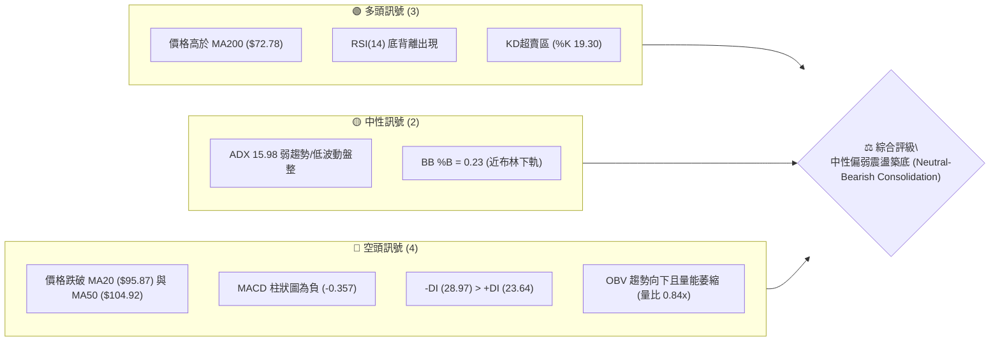
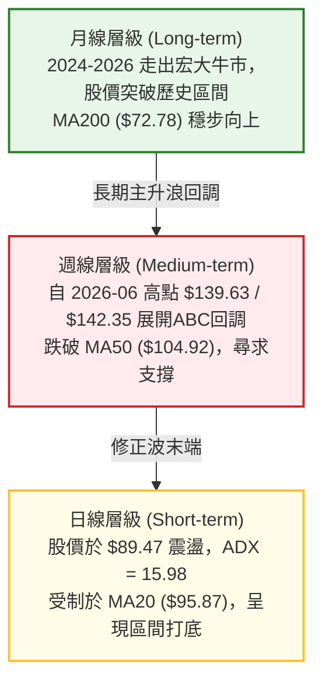
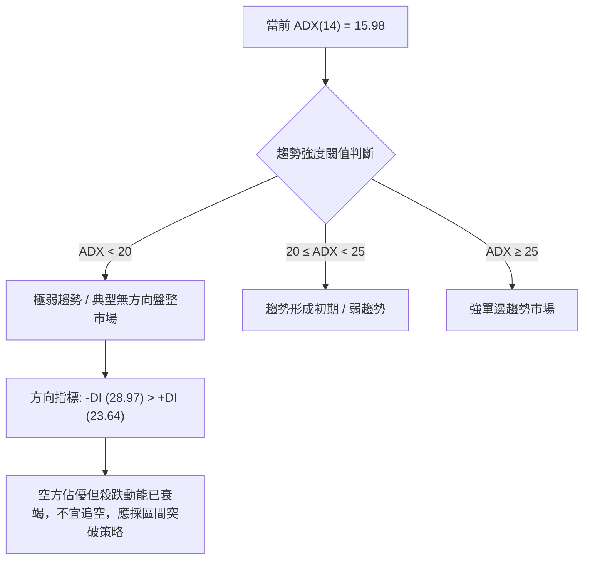
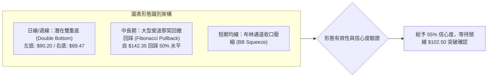
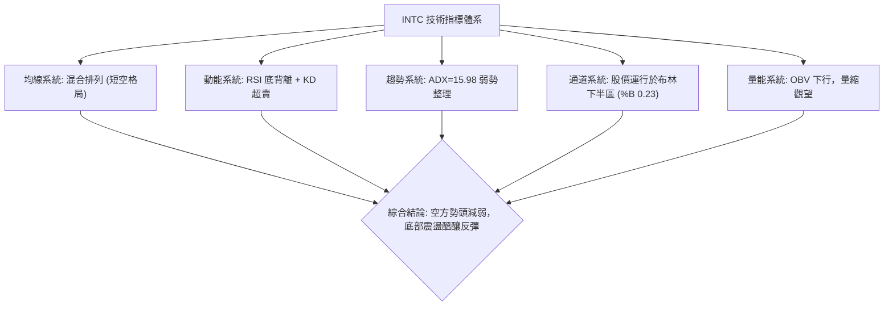
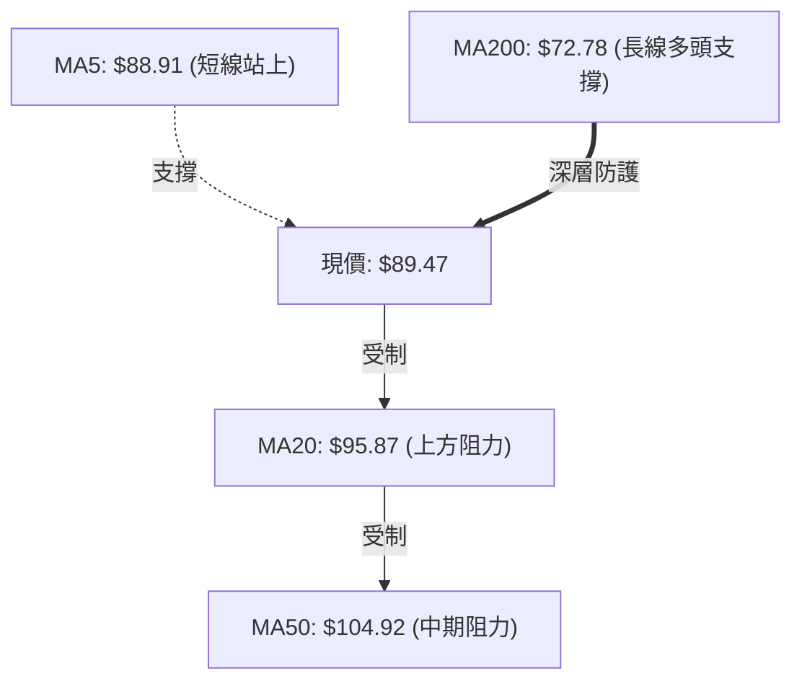
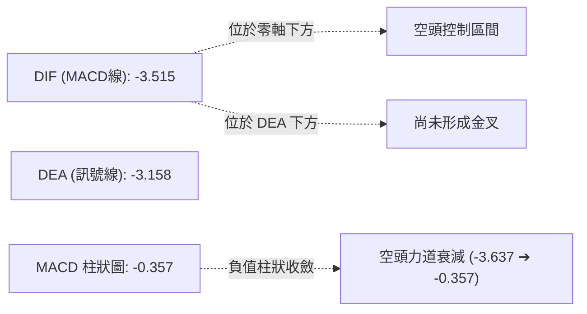
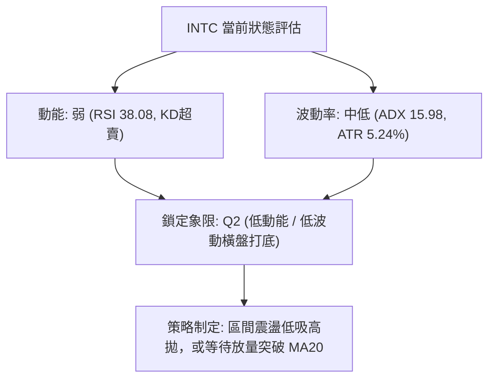
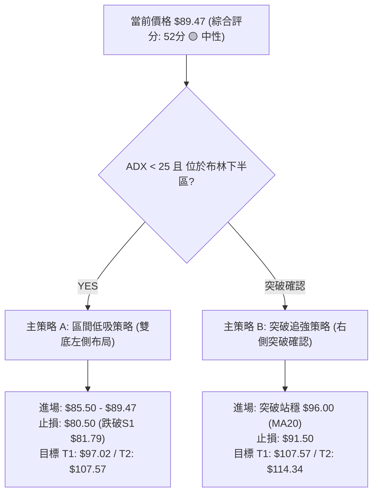
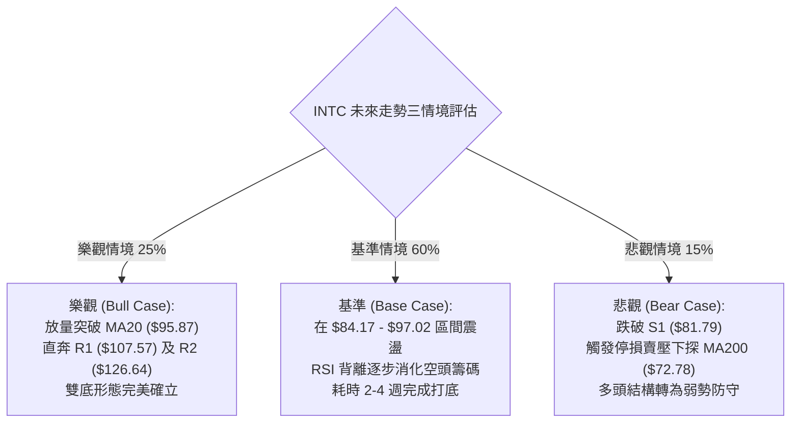

# INTC 技術分析報告

> **報告日期**：2026-08-30 ｜ **語言**：繁體中文 ｜ **數據來源**：Yahoo Finance ｜ **當前價格**：$89.47

---

## 目錄

| 章節 | 內容 |
|------|------|
| [1. 技術面概覽](#1-技術面概覽) | 訊號儀表板、核心指標、評分卡 |
| [2. 趨勢分析](#2-趨勢分析) | 多時框趨勢、長中短期走勢 |
| [3. 圖表形態分析](#3-圖表形態分析) | 形態識別、K線組合、目標價 |
| [4. 支撐與阻力](#4-支撐與阻力) | 關鍵價位、斐波那契回調 |
| [5. 技術指標深度解讀](#5-技術指標深度解讀) | MA/RSI/MACD/布林/成交量 |
| [6. 動能與波動率](#6-動能與波動率) | 動能評估、ATR、Beta |
| [7. 多時框架總結](#7-多時框架總結) | 時框架評分矩陣 |
| [8. 交易策略建議](#8-交易策略建議) | 多空策略、風險報酬比 |
| [9. 風險提示與監控](#9-風險提示與監控) | 監控指標、風險場景 |

---

## 1. 技術面概覽

### 🎯 技術訊號儀表板



### 📊 核心指標速覽表

| 指標類別 | 指標名稱 | 當前數值 | 訊號 | 解讀 |
|----------|----------|----------|:----:|------|
| **價格** | 當前價格 | $89.47 | 🟡 | 位於52週區間55.4%位置，自高點$142.35回調後處於中間盤整帶 |
| **均線** | MA20 | $95.87 | 🔴 | 價格低於MA20（乖離率 -6.67%），短線承壓 |
| **均線** | MA50 | $104.92 | 🔴 | 價格顯著低於MA50，中期修正格局未扭轉 |
| **均線** | MA200 | $72.78 | 🟢 | 價格遠高於MA200（乖離率 +22.93%），長期多頭牛熊分界未破 |
| **動能** | RSI(14) | 38.08 | 🟡 | 處於弱勢偏超賣區間，已出現潛在底背離訊號 |
| **動能** | MACD (12,26,9) | -3.515 / -3.158 | 🔴 | DIF位於Signal下方，柱狀圖 -0.357，空頭動能衰退但未黃金交叉 |
| **動能** | Stoch %K / %D | 19.30 / 21.37 | 🟢 | 進入超賣區間（<20），短線存在技術性反彈修復需求 |
| **趨勢** | ADX (14) | 15.98 | 🟡 | 數值遠低於25，代表單邊趨勢暫竭，進入無趨勢區間震盪 |
| **波動** | ATR (14) | $4.69 | 🟡 | ATR佔股價比約5.24%，日均波幅適中，維持震盪整理 |
| **成交量** | 20日均量比 | 0.84x | 🔴 | 成交量為86.00M股（低於20日均量102.02M），量能不足 |

### 🏆 技術評分卡

```
╔══════════════════════════════════════════════════════════════╗
║                技術評分卡 — INTC (2026-08-30)                ║
╠══════════════════════════════════════════════════════════════╣
║ 趨勢強度 (Trend)     ████████░░░░░░░░░░░░  40/100  🔴 弱趨勢/空頭主導║
║ 動能指標 (Momentum)  ██████████░░░░░░░░░░  50/100  🟡 超賣與背離共振 ║
║ 支撐穩定度 (Support) ██████████████░░░░░░  70/100  🟢 斐波50%與S1支撐║
║ 成交量配合 (Volume)  ████████░░░░░░░░░░░░  40/100  🔴 量縮整理無買盤 ║
║ 形態完整度 (Pattern) ████████████░░░░░░░░  60/100  🟡 潛在雙底打底中 ║
║ 均線排列 (MA System) ██████████░░░░░░░░░░  50/100  🟡 長多短空混合排列║
╠══════════════════════════════════════════════════════════════╣
║ 綜合評分             ███████████░░░░░░░░░  52/100  🟡 中性區間盤整   ║
╚══════════════════════════════════════════════════════════════╝
```

---

## 2. 趨勢分析

### 🌐 多時框趨勢分析



### 📈 長期趨勢 — 12個月走勢圖（Unicode）

```
INTC 月線走勢圖（過去12個月：2025-09 至 2026-08）
價格軸 ($)
$140 ┤                                     ● $139.63 (2026-06)
$120 ┤                               ● $114.68
$100 ┤                         ● $94.48          ● $90.20  ● $89.47 (現價)
 $80 ┤                                                   
 $60 ┤                   ● $46.47  ● $45.61  ● $44.13
 $40 ┤       ● $39.99  ● $40.56  ● $36.90
 $20 ┤ ● $33.55
      └────────────────────────────────────────────────────────────►
       09/25 10/25 11/25 12/25 01/26 02/26 03/26 04/26 05/26 06/26 07/26 08/26
```

**走勢特徵分析表格**：

| 階段 | 時間區間 | 起始價 → 結束價 | 階段漲跌幅 | 走勢特徵與技術解讀 |
|------|----------|-----------------|------------|--------------------|
| **第一階段：打底突破** | 2025-09 ~ 2025-11 | $24.35 → $40.56 | +66.57% | 脫離底部 $19-$24 震盪區間，放量啟動第一波上升段。 |
| **第二階段：平台整理** | 2025-12 ~ 2026-03 | $36.90 → $44.13 | +19.59% | 在 $36-$46 建立穩固籌碼換手平台，消化獲利籌碼。 |
| **第三階段：主升暴漲** | 2026-04 ~ 2026-06 | $44.13 → $139.63 | +216.41% | 爆發性主升浪，成交量顯著放大，創下52週高點 $142.35。 |
| **第四階段：深度回檔** | 2026-07 ~ 2026-08 | $139.63 → $89.47 | -35.92% | 高檔獲利回吐，快速回調至斐波那契 50.0% ($83.02) 上方築底。 |

### 📊 中期趨勢（週線分析）

```
週線級別價格壓力與支撐結構示意圖：
$142.35 ═══════════════════════════════════════ 52週歷史高點 (天花板)
          \
           \  回調下跌浪 (5月-7月)
            \
$107.57 ─────\─────────[ R1 阻力 / MA20中軌 / 斐波38.2% $97.02 ]────────
              \       ▲ 反彈受阻 ($102.50)
               \     / \
$89.47  ────────●───/───● [ 現價 $89.47 / 正在構築雙底 ]────────────────
                 \_/      
$81.79  ═══════════════════════════════════════ S1 近期波段支撐 / 斐波50% ($83.02)
```

近20週數據顯示，INTC在2026-06-21觸及週收盤高點$133.99後連續回落，至2026-07-26下探至$92.32，8月初曾反彈至$102.50（2026-08-16），隨後再次拉回至當前的$89.47。

### ⚡ 趨勢強度評估（ADX 解讀）



| 指標項 | 數值 | 狀態等級 | 技術含義 |
|--------|------|:--------:|----------|
| **ADX (14)** | 15.98 | 弱趨勢 / 盤整 | 趨勢強度極低，表明自$139.63的單邊暴跌已停止，進入橫盤箱體。 |
| **+DI (14)** | 23.64 | 多方力量 | 多方動能尚處於修復階段，未形成攻擊角。 |
| **-DI (14)** | 28.97 | 空方力量 | 空方仍佔據相對優勢，但斜率走平，下殺力道減弱。 |

---

## 3. 圖表形態分析

### 🔍 形態識別系統



**形態信心度評估表**（依規則 15）：

| 形態名稱 | 信心度 | 判斷依據（引用數據） | 完成度 | 目標價（附精確計算式） |
|----------|:------:|----------------------|:------:|------------------------|
| **潛在雙重底 (W底)** | **55%** | 2026-08-02 低點 $90.20 與當前 2026-08-30 低位 $89.47 構成雙底雛形，獲得 S1 ($81.79) 上方支撐 | 65% | 頸線為 2026-08-16 高點 $102.50。<br>形態高度 = $102.50 - $89.47 = $13.03。<br>突破目標價 = 頸線 $102.50 + $13.03 = **$115.53**（接近斐波 23.6% 回調位 $114.34 及分析師均價 $114.88）。 |
| **大型箱體整理** | **70%** | 價格波動受限於下軌支撐 S1 ($81.79) 與上軌阻力 R1 ($107.57) | 80% | 箱體震盪區間為 $81.79 ~ $107.57，箱體高度 $25.78。<br>向上突破目標 = $107.57 + $25.78 = **$133.35**（接近 R3 $132.75）。 |
| **頭肩頂形態** | **25%** | 數據不足以確認標準頭肩頂，左肩右肩不對稱且 ADX 低於 20 | 20% | *訊號不足，信心度 < 50%，僅作指標型解讀，不予計算目標價。* |

### 🕯️ 重要K線形態分析

| 週期/日期 | 收盤價 | K線形態特徵 | 技術解讀 | 訊號 |
|-----------|--------|-------------|----------|:----:|
| **2026-06** | $139.63 | 月線長上影射擊之星 (Shooting Star) | 觸及 52W 高點 $142.35 後主力資金出逃，確立長線頂部。 | 🔴 |
| **2026-07** | $90.20 | 月線大陰線吞沒 (Bearish Engulfing) | 單月暴跌近 $50，空頭主力強烈宣洩，迅速打穿短期均線。 | 🔴 |
| **2026-08-16** | $102.50 | 週線反彈遇阻十字星 (Doji) | 測試 MA20 與 MA60 重合壓力區失敗，多頭反彈力竭。 | 🟡 |
| **2026-08-30** | $89.47 | 日線低檔收斂十字星 (Spinning Top) | 量能縮至 86M，下行拋壓減輕，買賣雙方在 $89-$90 達成短期平衡。 | 🟢 |

### 📉 ASCII 走勢形態示意圖

```
INTC 潛在雙底 (Double Bottom) 結構示意圖：
$107.57 ────────────────────────────────────────── R1 關鍵阻力位
                 頸線峰值
$102.50 ────────────▲─────────── (2026-08-16 反彈高點)
                   / \
                  /   \     現價
$89.47  ────●────/─────\─────● ($89.47 築右底中)
          左底         右底
        (08-02)       (08-30)
         $90.20        $89.47
$81.79 ══════════════════════════════════════════ S1 強支撐防線
```

### 🎯 形態目標價計算

1. **雙底突破理論目標**：
   - 形態底部均值：$(90.20 + 89.47) / 2 = \$89.835$
   - 頸線位置：$\$102.50$
   - 垂直高度 ($H$)：$\$102.50 - \$89.835 = \$12.665$
   - 最小量度目標價 ($Target_1$)：$\$102.50 + \$12.665 = \mathbf{\$115.17}$（與斐波 23.6% 回調位 $\$114.34$ 共振）

2. **箱體突破延伸目標**：
   - 突破 R1 ($\$107.57$) 之後的第二目標價 ($Target_2$)：直接指向波段阻力 R2 ($\mathbf{\$126.64}$)。

---

## 4. 支撐與阻力

### 🗺️ 關鍵價位分布圖（Unicode）

```
INTC 價位結構與籌碼密集度分布圖
═══════════════════════════════════════════════════════════════════
$142.35 ║████████████████████████║ 52W 歷史極值天花板
$132.75 ║████████████████████████║ 🔴 強阻力 R3 (近一年波段高點聚類)
$126.64 ║████████████████████    ║ 🔴 阻力 R2 (反彈高位密集區)
$114.34 ║██████████████          ║ 🟡 斐波那契 23.6% 回調位
$107.57 ║████████████████████████║ 🔴 關鍵阻力 R1 / BB 上軌 ($107.56)
 $97.02 ║████████████            ║ 🟡 斐波那契 38.2% 回調位
 $95.87 ║██████████              ║ 🟡 MA20 中軌動態阻力
 $89.47 ╠════════════════════════╣ ◄◄◄ 當前價格 $89.47 (多空平衡點)
 $84.17 ║▓▓▓▓▓▓▓▓▓▓▓▓▓▓▓▓        ║ 🟢 布林通道下軌
 $83.02 ║▓▓▓▓▓▓▓▓▓▓▓▓▓▓▓▓▓▓      ║ 🟢 斐波那契 50.0% 關鍵平衡位
 $81.79 ║████████████████████████║ 🟢 關鍵支撐 S1 (近一年波段低點聚類)
 $72.78 ║████████████████████████║ 🟢 長期牛熊分界線 MA200
 $42.58 ║████████████████████████║ 🟢 強支撐 S2 (2026 Q1 平台底部)
 $41.64 ║████████████████████████║ 🟢 極限支撐 S3 (前期起漲點聚類)
═══════════════════════════════════════════════════════════════════
```

### 🚧 阻力位分析表

所有阻力位嚴格引用自數據模組計算之波段高點聚類：

| 阻力級別 | 精確價位 | 距離現價 | 形成原因與籌碼解讀 | 突破難度 | 重要性 |
|:--------:|:--------:|:--------:|--------------------|:--------:|:------:|
| **R1** | **$107.57** | +20.23% | 近一年波段高點聚類，與布林上軌 ($107.56) 及 MA60 ($106.50) 高度共振。 | 4.0/5.0 | ★★★★☆ |
| **R2** | **$126.64** | +41.54% | 2026-06 回調反彈次高點聚類，大量解套籌碼堆積區。 | 4.5/5.0 | ★★★★☆ |
| **R3** | **$132.75** | +48.37% | 2026-06-21 週收盤高點 ($133.99) 密集區，歷史巨量套牢區。 | 5.0/5.0 | ★★★★★ |

### 🛡️ 支撐位分析表

所有支撐位嚴格引用自數據模組計算之波段低點聚類：

| 支撐級別 | 精確價位 | 距離現價 | 形成原因與籌碼解讀 | 守住機率 | 重要性 |
|:--------:|:--------:|:--------:|--------------------|:--------:|:------:|
| **S1** | **$81.79** | -8.58% | 近一年波段低點聚類，緊鄰斐波那契 50.0% 回調位 ($83.02)，為多頭第一道防禦重鎮。 | **75%** | ★★★★★ |
| **S2** | **$42.58** | -52.41% | 2026年1-3月橫盤換手平台中樞 ($44.13-$46.47)，強大結構性買盤支撐。 | **90%** | ★★★★☆ |
| **S3** | **$41.64** | -53.46% | 2025年第四季度起漲頸線位聚類，長線絕對底部。 | **95%** | ★★★☆☆ |

### 📐 斐波那契回調位分析

基準區間：52週低點 **$23.68** 至 52週高點 **$142.35**（垂直波幅：$118.67）

```
斐波那契結構分佈：
0.0%  (52W High) ── $142.35  (歷史極端高點)
23.6% ───────────── $114.34  (第一反彈強阻力區)
38.2% ───────────── $ 97.02  (MA20 動態重合區)
                       ▲
   [ 現價 $89.47 處於 38.2% ($97.02) 與 50.0% ($83.02) 之間 ]
                       ▼
50.0% ───────────── $ 83.02  (黃金分割多空分水嶺，與 S1 $81.79 形成支撐帶)
61.8% ───────────── $ 69.01  (黃金分割回撤位，低於 MA200 $72.78)
78.6% ───────────── $ 49.08  (深度回撤極限)
100.0%(52W Low)  ── $ 23.68  (起漲原點)
```

**技術解讀**：
- 現價 **$89.47** 位於 38.2% ($97.02) 與 50.0% ($83.02) 區間。
- 50.0% 回調位 **$83.02** 是技術分析中最關鍵的心理防線。只要 INTC 收盤守在 $83.02（及 S1 $81.79）之上，自 2024 年底以來的長線多頭結構並未遭到根本性破壞，此輪回檔仍定義為「大級別健康洗盤」。

---

## 5. 技術指標深度解讀

### 🎛️ 指標訊號總覽



### 📈 移動平均線排列分析



| 均線名稱 | 數值 | 與現價關係 | 乖離率 | 短期趨勢與形態含義 |
|:--------:|:----:|:----------:|:------:|--------------------|
| **MA 5** | $88.91 | 價格在其上方 | +0.63% | 短線止跌，5日均線已開始走平微拐向上。 |
| **MA 10** | $91.97 | 價格在其下方 | -2.72% | 短期下行反壓，首要突破目標。 |
| **MA 20** | $95.87 | 價格在其下方 | -6.67% | 布林中軌所在，中期強弱轉換分水嶺。 |
| **MA 50** | $104.92 | 價格在其下方 | -14.73% | 中期生命線，目前呈現空頭排列壓制。 |
| **MA 60** | $106.50 | 價格在其下方 | -15.99% | 季線阻力，與 R1 ($107.57) 共振。 |
| **MA 120** | $93.02 | 價格在其下方 | -3.82% | 半年線走平，為中長期籌碼平均成本。 |
| **MA 200** | $72.78 | 價格在其上方 | **+22.93%** | 長期年線牛熊線，穩固向上，長線多頭基底未失。 |
| **MA 240** | $66.64 | 價格在其上方 | +34.25% | 兩年均線呈強勁多頭上行排列。 |

### 📉 RSI(14) 分析

- **當前數值**：**38.08**
- **進度條展示**：`[████████░░░░░░░░░░░░░░░░] 38.08%` 🟡 處於弱勢整理區（30-40 偏超賣）

```
RSI(14) 底背離 (Bullish Divergence) 識別架構：
價格 (Price)  ：2026-07-26 收盤 $92.32  ───► 2026-08-30 收盤 $89.47 (創新低 ↘)
RSI(14) 指標  ：2026-07-26 數值 26.90   ───► 2026-08-30 數值 38.08 (底墊高 ↗)
結論          ：標準常規底背離 (Regular Bullish Divergence)，預示下行動能衰竭！
```

### 📊 MACD(12/26/9) 訊號解讀



- **MACD 線**：-3.515 ｜ **Signal 線**：-3.158 ｜ **柱狀圖**：-0.357
- **解讀**：MACD 週線柱狀圖自 2026-07-19 的低點 **-3.637** 大幅回升至 **-0.357**，呈現極其顯著的動能收斂特徵。DIF 與 DEA 正在零軸下方極度靠攏，一旦柱狀圖翻正形成零下金叉，將觸發強烈的技術性反彈。

### 📦 布林通道分析

```
INTC 布林通道 (20, 2) 結構圖：
$107.56 ════════════════════════════════════════ 上軌 (Upper Band)
          │
          │  通道帶寬度 (Bandwidth): $23.39 (26.1%)
          │
$95.87  ──────────────────────────────────────── 中軌 MA20 (Middle Band)
          │
$89.47  ·············· ● 現價 (BB %B = 0.23) 接近下軌區間
          │
$84.17  ════════════════════════════════════════ 下軌 (Lower Band)
```

- **通道數據**：上軌 **$107.56** ｜ 中軌 **$95.87** ｜ 下軌 **$84.17**
- **%B 指標**：**0.23**（處於下軌至中軌的低位區間）。
- **特徵解讀**：價格未有效跌破布林下軌，而是在 $84-$89 區間獲得支撐收斂。通道正在逐漸收窄（Squeeze），預示短線暴跌期結束，即將迎來變盤方向選擇。

### 💹 成交量分析（量價配合度）

- **最新成交量**：86,001,600 股
- **20日均量**：102,018,135 股（**量比：0.84x**）
- **50日均量**：113,155,608 股
- **OBV 趨勢**：`OBV < MA`，呈現量縮整理。
- **量價診斷**：價格在 $89.47 附近量能顯著萎縮（0.84x），這在技術分析中屬於「縮量探底」特徵。殺跌無量說明市場恐慌性拋盤已基本出清，當前缺乏的是主動性買盤的進場激勵。

---

## 6. 動能與波動率

### ⚡ 動能評估四象限

| 象限 | 動能維度 (Momentum) | 波動率維度 (Volatility) | INTC 當前所處狀態 | 操作評估與應對方針 |
|:---:|:---:|:---:|:---:|:---|
| **Q1** | 強 (Strong) | 低 (Low) | — | 最佳波段順勢追漲機會 |
| **Q2** | 弱 (Weak) | 低 (Low) | **✓ [INTC 當前位置]** | **低波動打底期：ADX=15.98，量縮整理，適合網格分批或突破掛單** |
| **Q3** | 強 (Strong) | 高 (High) | — | 主升/主跌浪，高風險高收益 |
| **Q4** | 弱 (Weak) | 高 (High) | — | 劇烈震盪洗盤，應嚴格觀望 |



### 📊 ATR 波動率分析

- **ATR(14) 絕對值**：**$4.69**
- **ATR 佔比 (波動率百分比)**：$4.69 / \$89.47 = \mathbf{5.24\%}$
- **止損距離建議**：
  - 短線激進止損（1.0 × ATR）：$\$4.69$（下方關鍵位約 $\$84.78$）
  - 波段標準止損（1.5 × ATR）：$\$7.04$（對應價位 $\$82.43$，剛好設於 S1 $\$81.79$ 及斐波 50% $\$83.02$ 防線之外）
  - 保守寬鬆止損（2.0 × ATR）：$\$9.38$（對應價位 $\$80.09$）

### 📐 Beta 與市場相關性

- **Beta 係數**：**2.241**
- **市場特徵解讀**：INTC 具有極高的市場彈性（高 Beta 屬性）。當半導體板塊或標普500指數反彈 1% 時，理論上 INTC 將展現 2.24% 的向上彈性；同理，在大盤回調時其回撤幅度亦顯著放大。高 Beta 特性要求交易者必須嚴格執行倉位管理。

---

## 7. 多時框架總結

### 📋 時框架評分表

| 時框架 | 趨勢方向 | 動能指標 | 均線排列 | 形態特徵 | 綜合評分 | 建議方針 |
|:------:|:--------:|:--------:|:--------:|:--------:|:--------:|:--------:|
| **月線 (長期)** | 🟢 多頭主升回調 | 🟡 中性回落 | 🟢 MA200向上 | 大牛市突破平台回踩 | **75/100** | 長線多頭持股，逢低分批布局 |
| **週線 (中期)** | 🔴 空頭修正 | 🟢 MACD柱收斂 | 🔴 跌破MA50 | 斐波50%測試築底 | **45/100** | 等待週線止跌K線確認 |
| **日線 (短期)** | 🟡 橫盤震盪 | 🟢 RSI底背離/KD超賣 | 🔴 MA20下方 | 潛在雙底打底 | **52/100** | 區間操作，布林下軌低吸 |

### 🔲 綜合訊號矩陣

```
時框訊號一致性矩陣：
┌───────────┬──────────────┬──────────────┬──────────────┬──────────────┐
│  時框架   │  趨勢 (Trend)│ 動能(Momentum│ 支撐(Support)│ 綜合訊號導向 │
├───────────┼──────────────┼──────────────┼──────────────┼──────────────┤
│ 日線 (1D) │   🟡 盤整    │   🟢 底背離  │   🟢 守穩S1  │  🟡 區間震盪 │
│ 週線 (1W) │   🔴 修正    │   🟡 柱狀收斂│   🟢 斐波50% │  🟡 築底觀察 │
│ 月線 (1M) │   🟢 強多    │   🟡 降溫    │   🟢 遠高於MA200│🟢 偏多守支撐│
└───────────┴──────────────┴──────────────┴──────────────┴──────────────┘
```

### ⚖️ 多時框收斂結論

依據多時框收斂規則（規則 14）：
1. **行情性質判斷**：當前 ADX(14) = **15.98 < 25**，市場明確定義為**無趨勢盤整行情 (Consolidation Market)**。
2. **主導時框收斂**：在 ADX < 25 的盤整環境中，中長期單邊趨勢權重暫降，日線布林通道上下軌（**$84.17 ~ $107.56**）與波段支撐阻力（**S1 $81.79 / R1 $107.57**）構成最核心的主導交易區間。
3. **最終方向性結論**：**中性偏多觀望，區間低吸操作（Neutral-Bullish Range Trading）**。此結論嚴格收斂第 1 章評分卡（52分）與各指標狀態。

---

## 8. 交易策略建議

### 🗺️ 策略決策流程圖



### 🧭 策略路由

> **當前主策略方向 = 中性區間操作，偏多低吸（依技術評分卡 52/100）**
> 
> 因評分處於 40–60 區間，且 ADX = 15.98 < 25，策略定位為**布林通道與關鍵支撐阻力間的區間交易**，多頭為主要執行方向，嚴格以 S1 設防。

### 🎯 價格情境階梯（Price Scenarios）

價位完全嚴格引用數據模組計算值：

| 觸發條件 | 第一目標 (Next Target) | 後續延伸 (Extension) | 技術情境含義 |
|:--------:|:----------------------:|:--------------------:|:-------------|
| **強勢向上突破 R1 ($107.57)** | **R2 ($126.64)** | **R3 ($132.75)** | 雙底徹底完成，中期上升趨勢全面重啟。 |
| **向上站上 MA20 ($95.87)** | **斐波 38.2% ($97.02)** | **R1 ($107.57)** | 短線轉強，脫離底部泥沼。 |
| **維持現價區間 ($84.17-$95.87)** | — | — | 於布林下半區進行縮量築底。 |
| **有效跌破 S1 ($81.79)** | **MA200 ($72.78)** | **S2 ($42.58)** | 50%斐波失守，中級回調演變為深度殺跌。 |

### 📊 情境機率分佈

| 價格情境 | 發生機率 | 主要技術指標依據 |
|:--------:|:--------:|:-----------------|
| **情境一：區間震盪築底後反彈** | **60%** | RSI 底背離確立、KD 超賣回勾、MACD 柱狀大幅收斂、守在 S1 ($81.79) 之上。 |
| **情境二：窄幅區間橫盤** | **25%** | ADX = 15.98 無趨勢特徵、量能萎縮至 0.84x，市場主力資金保持觀望。 |
| **情境三：跌破 S1 繼續下探** | **15%** | -DI 仍大於 +DI、股價受制於 MA20/MA50 均線反壓，若大盤重挫可能引發補跌。 |

### 🟢 主策略詳情

| 策略要素 | 策略 A（左側區間低吸策略） | 策略 B（右側放量突破策略） |
|:---------|:---------------------------|:---------------------------|
| **策略類型** | 支撐低吸（Range Support Buy） | 動能突破（Breakout Momentum） |
| **進場條件** | 現價 $89.47 或回踩布林下軌 $84.17 附近分批進場 | 日K線放量實體突破 MA20 ($95.87) 且收於 $96.00 上方 |
| **精確進場點** | **$89.47**（當前市價） | **$96.00**（突破確認進場） |
| **目標價 T1** | **$97.02**（斐波那契 38.2% 回調位） | **$107.57**（阻力位 R1 / 布林上軌） |
| **目標價 T2** | **$107.57**（阻力位 R1） | **$114.34**（斐波那契 23.6% 回調位） |
| **精確止損點** | **$80.50**（跌破 S1 $81.79 關鍵支撐） | **$91.50**（跌破 MA10 均線防守點） |
| **風險報酬比 (R:R)** | **1 : 2.02**（至T2，風險 $8.97，潛在收益 $18.10） | **1 : 2.57**（至T1，風險 $4.50，潛在收益 $11.57） |
| **成功機率估計** | **60%** | **65%** |
| **建議倉位** | **10% - 15%**（分批建倉） | **15% - 20%**（突破確認加倉） |

### 🔴 反向風險觸發點（對沖提示）

- **關鍵破位觸發點**：若日K線收盤價**實體跌破 S1 ($81.79)**。
- **對沖應對措施**：主策略多頭部位無條件停損出場；激進交易者可反手以輕倉（5%）建立空頭部位或買入認沽期權對沖，下看目標 **MA200 ($72.78)** 及 **S2 ($42.58)**。

### ⭐ 整體訊號強度評星

```
做多訊號強度：★★★☆☆  (3.0/5星 — 具備底背離與支撐，惟欠缺放量確認)
做空訊號強度：★★☆☆☆  (2.0/5星 — 殺跌動能收斂，追空盈虧比極差)
整體可信度：  ★★★★☆  (4.0/5星 — 關鍵價位與斐波那契重合度極高)
```

---

## 9. 風險提示與監控

### ✅ 關鍵監控指標 Checklist

```
╔══════════════════════════════════════════════════════════════╗
║                 技術面關鍵監控清單 (Checklist)               ║
╠══════════════════════════════════════════════════════════════╣
║ [ ] 價格是否跌破關鍵支撐 S1 ($81.79) 或斐波50% ($83.02)       ║
║ [ ] RSI(14) 是否跌破 30 進入深度超賣，或有效站上 50 中軸線    ║
║ [ ] MACD 柱狀圖是否在未來 3-5 個交易日內由負翻正 (零下金叉)   ║
║ [ ] 日成交量是否放大至 102M 股 (20日均量) 以上，確認買盤進場  ║
║ [ ] 價格能否收盤突破 MA20 ($95.87) 與布林中軌                 ║
║ [ ] ADX(14) 是否自 15.98 拐頭向上並突破 20，宣告新趨勢啟動    ║
╚══════════════════════════════════════════════════════════════╝
```

### ⚠️ 風險場景分析



### 🛡️ 風險管理重要提醒

1. **Beta 波動放大風險**：INTC 的 Beta 為 **2.241**，波動幅度為大盤的兩倍以上。嚴禁使用過高槓桿，單筆交易虧損金額應嚴格限制在總賬戶資產的 **1.0% - 1.5%** 以內。
2. **假突破與窄幅震盪磨損**：在 ADX = 15.98 的低波動環境中，均線頻繁纏繞容易產生「假突破」訊號。建議採用「收盤價確認法」（連續兩日收在關鍵位之上）作為突破過濾器。
3. **倉位配置階梯化**：建議採取「左側輕倉試探（10%）+ 右側突破加碼（10%）」的兩段式建倉策略，切忌一次性滿倉押注。

---

## 📋 報告總結

```
╔═══════════════════════════════════════════════════════════════════╗
║                   INTC 技術分析報告總結                          ║
╠═══════════════════════════════════════════════════════════════════╣
║ 報告日期：2026-08-30                                              ║
║ 當前價格：$89.47                                                  ║
║ 分析評級：⚖️ 中性偏多區間震盪 (Neutral-Bullish Range Bound)       ║
║                                                                   ║
║ 關鍵結論：                                                        ║
║ ├─ 長期趨勢：🟢 多頭牛市回調格局，MA200 ($72.78) 穩固向上         ║
║ ├─ 中期趨勢：🔴 自 $139.63 的修正浪進入尾聲，ADX (15.98) 顯示盤整║
║ ├─ 短期趨勢：🟢 RSI(14) 出現底背離，KD 超賣，具備強烈技術反彈需求║
║ ├─ 關鍵支撐：S1 $81.79 ｜ 斐波那契 50.0% 回調位 $83.02             ║
║ ├─ 關鍵阻力：MA20 $95.87 ｜ 斐波 38.2% $97.02 ｜ R1 $107.57       ║
║ └─ 分析師目標：均價 $114.88 (41位分析師，最高 $200.00)            ║
║                                                                   ║
║ 最優策略組合：                                                    ║
║ 1. 🥇 最佳機會：現價 $89.47 附近分批低吸，嚴守 $80.50 止損，      ║
║                 目標指向斐波 38.2% ($97.02) 及 R1 ($107.57)。     ║
║ 2. 🥈 次選機會：等待股價放量突破 MA20 ($95.87) 於 $96.00 右側追強，║
║                 目標看至 R1 ($107.57) 與 斐波 23.6% ($114.34)。   ║
║ 3. 🥉 保守選擇：保持觀望，等待日線 MACD 零下金叉形成再行介入。    ║
╚═══════════════════════════════════════════════════════════════════╝
```

---

> ⚠️ **免責聲明**：本報告為技術分析研究，所有數據及價位均嚴格基於歷史量價資訊計算推導。本報告**僅供研究與學術參考**，**不構成任何投資買賣建議**。金融市場投資具有高度風險，投資人應獨立判斷並自負盈虧。

---

*報告生成時間：2026-08-30 ｜ 數據來源：Yahoo Finance ｜ 分析框架：多時框技術分析體系*