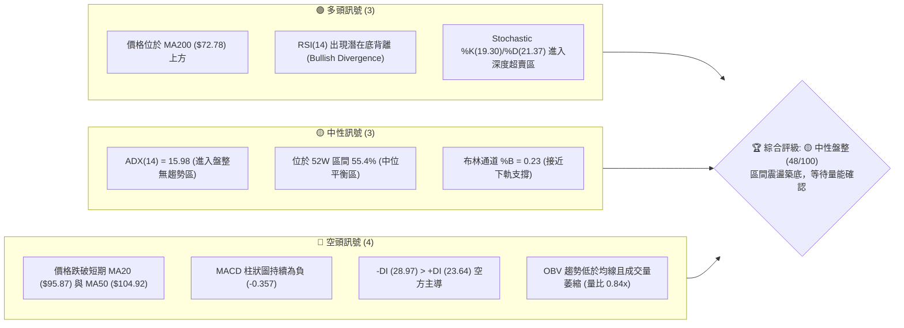
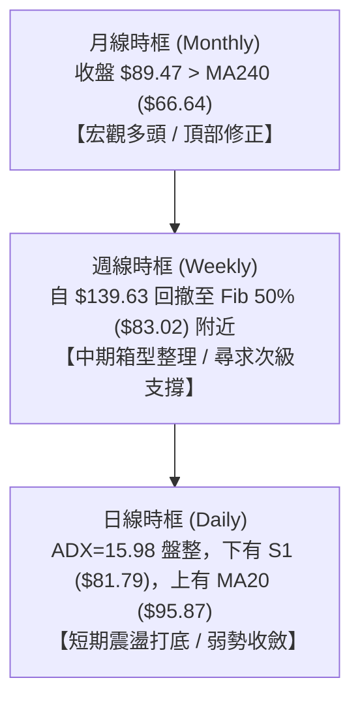
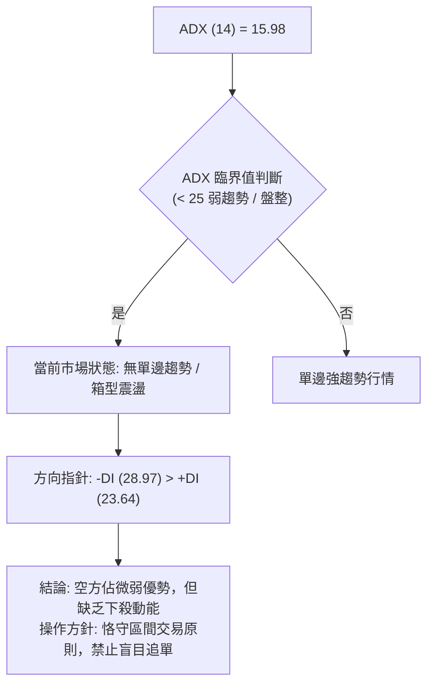
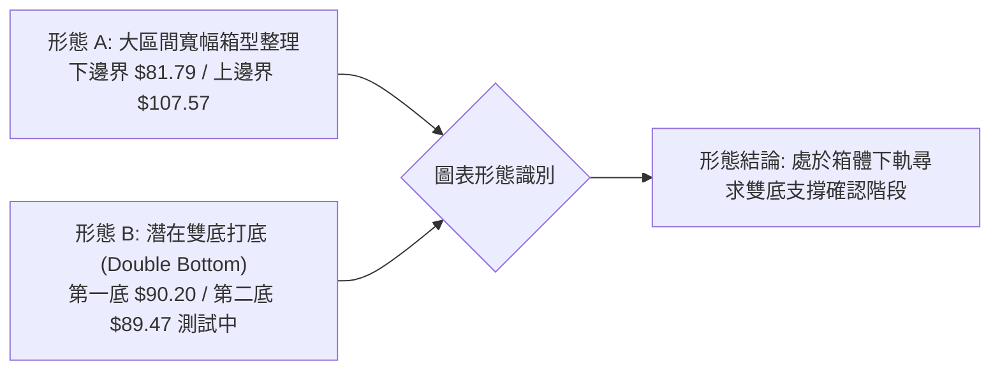
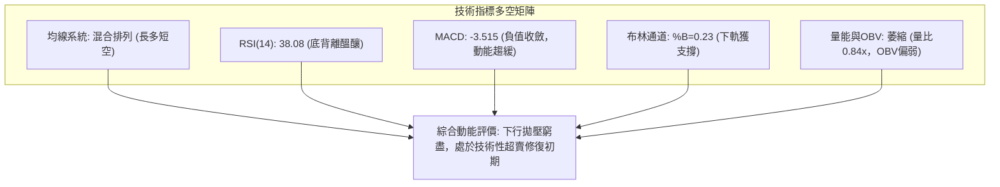
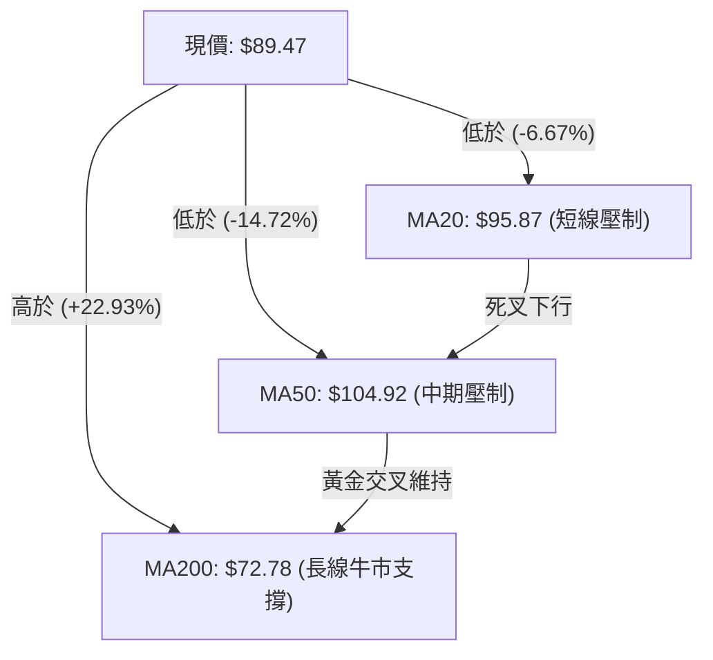
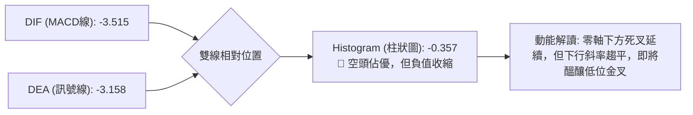
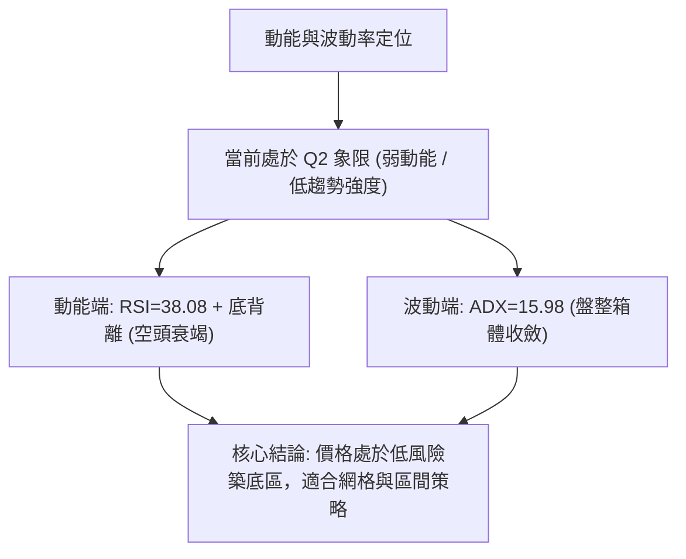
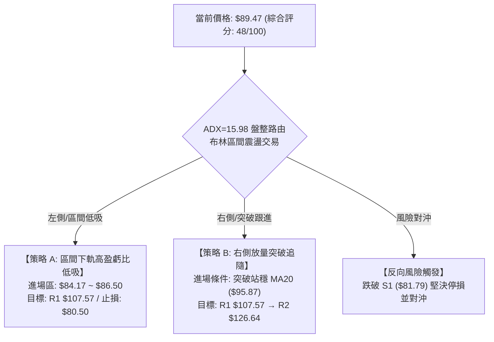
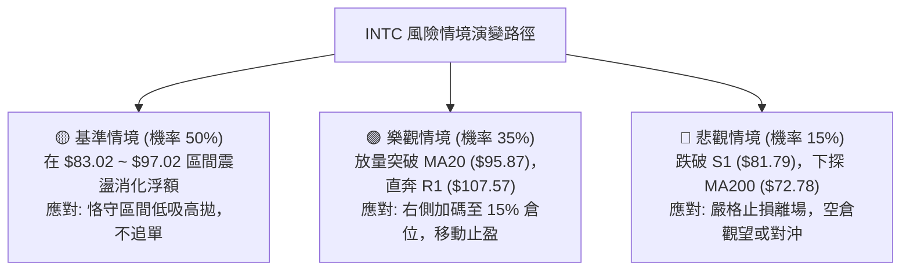

# INTC 技術分析報告

> **報告日期**：2026-08-31 ｜ **語言**：繁體中文 ｜ **數據來源**：Yahoo Finance ｜ **當前價格**：$89.47

---

## 目錄

| 章節 | 內容 |
|------|------|
| [1. 技術面概覽](#1-技術面概覽) | 訊號儀表板、核心指標速覽、技術評分卡 |
| [2. 趨勢分析](#2-趨勢分析) | 多時框趨勢判斷、12個月歷史走勢、ADX 趨勢強度 |
| [3. 圖表形態分析](#3-圖表形態分析) | 幾何形態識別、K線組合解讀、形態目標價推算 |
| [4. 支撐與阻力](#4-支撐與阻力) | 關鍵價位分佈圖、波段阻力/支撐聚類、斐波那契回調 |
| [5. 技術指標深度解讀](#5-技術指標深度解讀) | 均線系統、RSI 底背離、MACD、布林通道、OBV量能 |
| [6. 動能與波動率](#6-動能與波動率) | 動能四象限、ATR 波動率與止損設定、高 Beta 敏感度 |
| [7. 多時框架總結](#7-多時框架總結) | 時框評分矩陣、訊號一致性分析、多時框收斂結論 |
| [8. 交易策略建議](#8-交易策略建議) | 策略決策樹、情境機率、精確策略 A/B 參數、評星 |
| [9. 風險提示與監控](#9-風險提示與監控) | 關鍵監控 Checklist、三種情境路徑、風控規則 |
| [10. 報告總結](#10-報告總結) | 核心結論速覽、最優交易機會、免責聲明 |

---

## 1. 技術面概覽

### 🎯 技術訊號儀表板



---

### 📊 核心指標速覽表

| 指標類別 | 指標名稱 | 當前數值 | 訊號 | 專業解讀 |
|:---|:---|:---|:---:|:---|
| **價格** | 當前價格 | **$89.47** | 🟡 | 位於52週區間 55.4%，高位回檔後於中軌下方震盪尋求支撐 |
| **均線** | 短期 MA20 | **$95.87** | 🔴 | 價格低於 MA20 (-6.67%)，短線承壓於下彎均線 |
| **均線** | 中期 MA50 | **$104.92** | 🔴 | 價格低於 MA50，中期波段呈現修正整理結構 |
| **均線** | 長期 MA200 | **$72.78** | 🟢 | 價格大幅高於 MA200 (+22.93%)，長線多頭基底未破 |
| **動能** | RSI(14) | **38.08** | 🟡 | 處於偏弱區但未失守30，且技術面上具備底背離特徵 |
| **動能** | MACD (12,26,9)| **-3.515 / -3.158** | 🔴 | 雙線位於零軸下方，Histogram (-0.357) 負值收斂中 |
| **隨機指標** | Stoch %K / %D | **19.30 / 21.37** | 🟢 | 進入超賣臨界區，隨時具備短線技術性抽頭反彈動能 |
| **趨勢強度** | ADX (14) | **15.98** | 🟡 | ADX < 25 表明單邊空頭趨勢衰竭，進入箱型震盪盤整 |
| **通道指標** | Bollinger Bands| **$84.17 ~ $107.56**| 🟡 | %B 為 0.23，現價運行於下軌之上，通道呈現收斂態勢 |
| **波動率** | ATR (14) | **$4.69 (5.24%)** | 🟡 | 每日平均波動適中，提供明確的止損與風險預算邊界 |
| **成交量** | Volume / 20MA | **86.00M / 102.02M**| 🔴 | 量比 0.84x，量能低於均量，OBV 偏弱顯示追價意願不足 |

---

### 🏆 技術評分卡

```
╔══════════════════════════════════════════════════════════════════╗
║                技術評分卡 — INTC (2026-08-31)                    ║
╠══════════════════════════════════════════════════════════════════╣
║ 趨勢強度 (Trend)     ████░░░░░░░░░░░░░░░░  25/100 🔴 弱勢盤整    ║
║ 動能指標 (Momentum)  ████████░░░░░░░░░░░░  42/100 🟡 背離醞釀    ║
║ 支撐穩定度 (Support) ██████████████░░░░░░  70/100 🟢 支撐密集    ║
║ 成交量配合 (Volume)  ██████░░░░░░░░░░░░░░  32/100 🔴 量能萎縮    ║
║ 形態完整度 (Pattern) ██████████░░░░░░░░░░  52/100 🟡 箱型構築    ║
║ 均線排列 (MA System) ████████████░░░░░░░░  65/100 🟡 長多短空    ║
╠══════════════════════════════════════════════════════════════════╣
║ 綜合評分             █████████░░░░░░░░░░░  48/100 🟡 中性觀望/區間║
╚══════════════════════════════════════════════════════════════════╝
```

---

## 2. 趨勢分析

### 🌐 多時框趨勢分析



---

### 📈 長期趨勢 — 12個月走勢圖（ASCII）

```
INTC 月線走勢圖（2025-09 至 2026-08）
價格軸 ($)
$140 ┤                                         ● $139.63 (2026-06)
$130 ┤                                        / \
$120 ┤                                  ● $114.68  \
$110 ┤                                 /            \
$100 ┤                           ● $94.48            \
$90  ┤                                                ● $90.20 ──● $89.47 (當前)
$80  ┤                                               (2026-07)  (2026-08)
$70  ┤
$60  ┤
$50  ┤                     ● $46.47 ─ ● $45.61 ─ ● $44.13 (2026-01 ~ 03)
$40  ┤          ● $39.99 ─ ● $40.56
$30  ┤    ● $33.55
$20  ┤    (2025-09)
     └────┬────────┬────────┬────────┬────────┬────────┬────────┬───────
       2025-09  2025-11  2026-01  2026-03  2026-05  2026-06  2026-08
```

#### 📊 歷史走勢特徵分析表

| 階段區間 | 起止價格 | 漲跌幅 | 走勢結構特徵 | 成交量與動能特徵 |
|:---|:---:|:---:|:---|:---|
| **第一階段：底部啟動**<br>(2025-08 ~ 2025-11) | $24.35 → $40.56 | **+66.57%** | 脫離 $20 平台底部，放量長陽突破 | 均線轉為多頭排列，動能爆發 |
| **第二階段：中繼平台**<br>(2025-12 ~ 2026-03) | $36.90 → $44.13 | **+19.59%** | 在 $40~$46 區間強勢橫盤整理4個月 | 籌碼充分換手，洗淨浮額 |
| **第三階段：主升浪狂飆**<br>(2026-04 ~ 2026-06) | $44.13 → $139.63| **+216.41%**| 爆發性單邊主升段，創下 52W 高點 $142.35 | 週成交量突破 8.8 億股，極度過熱 |
| **第四階段：急速回撤**<br>(2026-07 ~ 2026-08) | $139.63 → $89.47| **-35.92%**| 自頂部急跌回測 Fib 50.0% ($83.02) | 拋壓逐漸收斂，進入無趨勢震盪築底 |

---

### 📊 中期趨勢（週線分析）

從近 20 週收盤走勢觀察：
- **高點回落與尋底**：INTC 於 2026 年 6 月底見頂（$133.99 / 週高點 $142.35）後，歷經 7 月中旬連續重挫至 $90.20，隨後於 8 月中旬反彈至 $102.50（遇阻於 MA50 / MA60 附近），隨即再次回落至當前 $89.47。
- **動能演變**：週線 RSI 自極度超買區（4月最高 89.7）大幅降溫至目前的 38.1；週線 MACD 柱狀圖在經歷 7 月份深幅負值（-3.637）後，目前收斂至 -0.357，說明中期下行拋壓已顯著減弱，空方動能鈍化。

---

### ⚡ 趨勢強度評估（ADX 解讀）



#### ADX 強度量化對照表

| 指標變數 | 當前讀數 | 門檻區間 | 趨勢狀態評估 | 策略意義 |
|:---|:---:|:---:|:---|:---|
| **ADX(14)** | **15.98** | < 20 (極弱趨勢/完全盤整) | 趨勢力量極弱，均線系統缺乏單邊指引力 | 趨勢跟隨指標失效，轉用震盪指標 |
| **+DI(14)** | **23.64** | 多方進攻動能 | 多頭進攻意願低迷，反彈多屬技術修正 | 不具備單邊突破上攻條件 |
| **-DI(14)** | **28.97** | 空方壓制動能 | 空方佔優但未達 30 以上單邊加速區間 | 下行空間受限，恐慌殺跌接近尾聲 |

---

## 3. 圖表形態分析

### 🔍 形態識別系統



#### 形態信心度與參數評估表

| 識別形態 | 信心度 | 判斷依據（數據引用） | 當前完成度 | 形態量度目標價（計算式） |
|:---|:---:|:---|:---:|:---|
| **寬幅箱型震盪**<br>(Broad Range) | **75%** | 價格在 S1 ($81.79) 與 R1 ($107.57) 之間往返震盪；ADX=15.98 驗證盤整 | **80%** | 箱頂目標 = **$107.57**<br>若向上破位：$107.57 + ($107.57 - $81.79) = **$133.35**（貼近 R3 $132.75） |
| **潛在雙底構築**<br>(Potential Double Bottom)| **55%** | 2026-08-02 低點 $90.20 與當前 2026-08-30 低點 $89.47 形成平底測試 | **45%** (未過頸線)| 頸線位：2026-08-16 高點 **$102.50**<br>量度升幅：$102.50 + ($102.50 - $89.47) = **$115.53**（貼近 Fib 23.6% $114.34） |
| **均線死叉壓制**<br>(MA Crossover) | **85%** | MA20 ($95.87) 與 MA50 ($104.92) 空頭排列壓制現價 | **100%** (已成立)| 下行目標受 S1 **$81.79** 強支撐攔截 |

---

### 🕯️ 重要 K 線形態分析（近4個月月線）

| 月份 | 收盤價 | K線形態 | 技術解讀 | 多空訊號 |
|:---|:---:|:---|:---|:---:|
| **2026-05** | $114.68 | **大陽加速線** | 突破百元整數大關，量能放大，主升浪加速 | 🟢 強烈看多 |
| **2026-06** | $139.63 | **高位長上影倒錘頭** | 衝高至 $142.35 遇阻暴跌，高位獲利了結盤湧出 | 🔴 頂部轉折 |
| **2026-07** | $90.20  | **長黑實體破位陰線** | 自高點直線下墜，擊穿多道短期均線，恐慌盤宣洩 | 🔴 空方宣洩 |
| **2026-08** | $89.47  | **縮量低位十字星 / 孕線**| 跌勢明顯趨緩，振幅收窄，多空在 $90 關卡陷入平衡 | 🟡 變盤築底 |

---

### 📉 ASCII 形態架構示意圖

```
INTC 日/週線級別 箱型與潛在雙底示意圖
價格軸
$107.57 ┼────────────────────────────────────────── 箱體上軌 (阻力 R1)
         │                   ╭───╮ (08-16 高點 $102.50 頸線)
$100.00 ┼                  │   │
         │                  │   │
$95.87  ┼ ─ ─ ─ ─ ─ ─ ─ ─ ─│─ ─│─ ─ ─ ─ ─ ─ ─ ─ ─ ─ ─ MA20 / 中軌壓制
         │        ╭─╮       │   │        ╭─ (現價 $89.47)
$89.47  ┼────────│─│───────╯───╰───────● ◄── 測試第二底
         │        │ │ (08-02 第一底 $90.20)
$84.17  ┼ ─ ─ ─ ─│─│─ ─ ─ ─ ─ ─ ─ ─ ─ ─ ─ ─ ─ ─ ─ ─ ─ 布林下軌
$81.79  ┼────────╰─╯────────────────────────── 箱體下軌 (支撐 S1 / Fib 50% $83.02)
```

---

## 4. 支撐與阻力

### 🗺️ 關鍵價位分布圖（ASCII）

```
INTC 價位結構分布圖（OHLCV 實際計算）
═════════════════════════════════════════════════════════════════════
$142.35 ║████████████████████████████████████████║ 52W 最高點 / Fib 0.0%
$132.75 ║████████████████████████████████        ║ 強阻力 R3 (+48.37%)
$126.64 ║████████████████████████                ║ 次級阻力 R2 (+41.54%)
$114.34 ║▓▓▓▓▓▓▓▓▓▓▓▓▓▓▓▓▓▓▓▓▓▓                  ║ Fib 23.6% 回調位
$107.57 ║████████████████████████████████        ║ 關鍵阻力 R1 (+20.23%) / BB上軌 $107.56
$97.02  ║▓▓▓▓▓▓▓▓▓▓▓▓▓▓▓▓                        ║ Fib 38.2% 回調位 / 接近 MA20 ($95.87)
$89.47  ╠════════════════════════════════════════╣ ◄── 當前收盤價 ($89.47)
$84.17  ║░░░░░░░░░░░░░░░░                        ║ 布林通道下軌
$83.02  ║▓▓▓▓▓▓▓▓▓▓▓▓▓▓▓▓▓▓▓▓▓▓▓▓                ║ Fib 50.0% 關鍵心理中軸
$81.79  ║████████████████████████████████        ║ 關鍵支撐 S1 (-8.58%)
$72.78  ║████████████████████                    ║ 長期牛熊分界線 MA200
$42.58  ║████████████████                        ║ 極端波段支撐 S2 (-52.41%)
$41.64  ║████████████████                        ║ 極端波段支撐 S3 (-53.46%)
$23.68  ║████████████████████████████████████████║ 52W 最低點 / Fib 100.0%
═════════════════════════════════════════════════════════════════════
```

---

### 🚧 阻力位分析表

| 阻力級別 | 精確價位 | 形成依據與技術共振 | 突破難度 | 戰略重要性 |
|:---|:---:|:---|:---:|:---|
| **第一阻力 (R1)** | **$107.57** | 近一年波段高點聚類 + 布林上軌 ($107.56) + MA60 ($106.50) 三重共振 | 🔴 極高 | **短波段多空分水嶺**：唯有放量突破此位，方能宣告下行整理結束。 |
| **第二阻力 (R2)** | **$126.64** | 2026年5-6月主升段次級高點聚類區 | 🟡 高 | **多頭主升延續位**：解套盤密集區，需巨量換手。 |
| **第三阻力 (R3)** | **$132.75** | 見頂前夕高位震盪平台高點聚類 | 🔴 極高 | **歷史頂部重壓區**：接近 52W 峰值 $142.35。 |

---

### 🛡️ 支撐位分析表

| 支撐級別 | 精確價位 | 形成依據與技術共振 | 守住機率 | 戰略重要性 |
|:---|:---:|:---|:---:|:---|
| **第一支撐 (S1)** | **$81.79** | 近一年波段低點聚類 + 貼近 Fib 50.0% ($83.02) + 布林下軌 ($84.17) | 🟢 75% | **核心防守底線**：中期回調的黃金支撐，守住則維持健康大級別多頭。 |
| **第二支撐 (S2)** | **$42.58** | 2026年1-3月突破前的大型中繼平台頂部 | 🟢 90% | **結構性生命線**：若不幸跌破 S1，將深測此一歷史密集換手區。 |
| **第三支撐 (S3)** | **$41.64** | 2025年10-11月啟動平台高點聚類 | 🟢 95% | **宏觀底部極限**：極端空頭市場下的絕對防線。 |

---

### 📐 斐波那契回調位分析

*基準區間：52週低點 $23.68 → 52週高點 $142.35（總落差 $118.67）*

| 回調比率 | 精確價位 | 技術狀態解讀 | 與現價距離 |
|:---|:---:|:---|:---:|
| **0.0% (52W High)** | **$142.35** | 歷史極值高點 | +59.10% |
| **23.6%** | **$114.34** | 強勢回調位（已跌破，轉化為強阻力） | +27.80% |
| **38.2%** | **$97.02** | 弱勢修正位（與 MA20 $95.87 形成上方第一反彈壓制） | +8.44% |
| **當前價格** | **$89.47** | **處於 Fib 38.2% ($97.02) 與 Fib 50.0% ($83.02) 區間** | — |
| **50.0%** | **$83.02** | **多空平衡中軸（與 S1 $81.79 形成雙重支撐堡壘）** | -7.21% |
| **61.8%** | **$69.01** | 黃金分割防守位（接近 MA200 $72.78） | -22.87% |
| **78.6%** | **$49.08** | 深幅回撤位（接近 S2 $42.58 平台） | -45.14% |
| **100.0% (52W Low)**| **$23.68** | 本輪大週期起漲原點 | -73.53% |

---

## 5. 技術指標深度解讀

### 🎛️ 指標訊號總覽



---

### 📈 移動平均線排列分析



#### 詳細均線數據矩陣

| 均線名稱 | 精確數值 | 與現價乖離率 | 短期趨勢方向 | 技術意涵解讀 |
|:---|:---:|:---:|:---:|:---|
| **MA 5** | $88.91 | **+0.63%** | ▲ 向上微勾 | 超短期止跌，價格微幅站上5日線，出現微弱企穩訊號 |
| **MA 10** | $91.97 | **-2.72%** | ▼ 向下壓制 | 短線第一道反彈減速帶 |
| **MA 20** | $95.87 | **-6.67%** | ▼ 向下延伸 | 月線級別空頭壓制，亦為布林通道中軌 |
| **MA 60** | $106.50 | **-15.99%** | ▼ 向下延伸 | 季線阻力，與 R1 ($107.57) 高度重疊 |
| **MA 120** | $93.02 | **-3.82%** | ▼ 走平下彎 | 半年線位置，為中期重要多空爭奪帶 |
| **MA 200** | $72.78 | **+22.93%** | ▲ 強勁向上 | 宏觀牛市基石，未破此線前長線多頭格局不變 |
| **MA 240** | $66.64 | **+34.25%** | ▲ 強勁向上 | 年線強支撐，代表長期投資者持倉成本底部 |

---

### 📉 RSI(14) 分析與底背離驗證

- **當前讀數**：**38.08**
- **區間定位**：弱勢整理區（30 ~ 50）

```
RSI (14) 強度指標：
0 ─────── 30 ───────────── 50 ───────────── 70 ─────── 100
[ 超賣區 ] [   弱勢整理區   ] [   強勢進攻區   ] [ 超買區 ]
          ▲
     當前: 38.08
███████████████░░░░░░░░░░░░░░░░░░░░░░░░░░  38.08%
```

#### 🔍 RSI 背離現象深度診斷
- **背離事實**：在日線與週線層面，價格在 2026-08-30 創下回調低點 $89.47（低於 2026-08-02 的 $90.20 與 7 月底水平），然而 RSI(14) 卻由 2026-07-26 的 **26.9** 攀升至當前的 **38.08**。
- **結論**：形成標準的**日/週線級別多頭底背離（Bullish Divergence）**。這表明雖然價格微創新低，但內部下殺動能已顯著衰竭，先知先覺資金正在低位承接，預示短線隨時將迎來均值回歸的反彈走勢。

---

### 📊 MACD(12, 26, 9) 訊號解讀



- **MACD 線**：-3.515
- **訊號線 (Signal)**：-3.158
- **柱狀圖 (Histogram)**：**-0.357**
- **解讀**：柱狀圖自 7 月中旬的 -3.637 大幅收窄至 -0.357，負動能釋放完畢，DIF 與 DEA 走平並呈現靠攏收斂狀態，一旦柱狀圖翻紅（>0），將發出短線買入訊號。

---

### 📦 布林通道分析 (Bollinger Bands)

```
INTC 布林通道結構圖 (20, 2)
══════════════════════════════════════════════════════════════════
$107.56 ┬────────────────────────────────────────── BB 上軌
        │
$95.87  ┼ ─ ─ ─ ─ ─ ─ ─ ─ ─ ─ ─ ─ ─ ─ ─ ─ ─ ─ ─ ─ ─ BB 中軌 (MA20)
        │                          ● 現價 $89.47 (%B = 0.23)
$84.17  ┴────────────────────────────────────────── BB 下軌
══════════════════════════════════════════════════════════════════
```

- **帶寬與位置**：通道上軌 $107.56、中軌 $95.87、下軌 $84.17，通道寬度為 $23.39。
- **%B 指標**：**0.23**（介於 0 與 0.5 之間，靠近下軌）。
- **特徵解析**：布林通道上下軌呈現平行收口狀態，價格觸及下軌 $84.17 附近獲得韌性支撐，未發生「沿下軌單邊向下開口」的極端弱勢特徵，印證市場進入低波動區間蓄勢格局。

---

### 💹 成交量與 OBV 分析

- **最新成交量**：**86,001,600 股**
- **20日均量**：**102,018,135 股**（成交量比：**0.84x**）
- **50日均量**：**113,155,608 股**
- **OBV 趨勢**：**OBV < MA**（能量潮處於均線下方）
- **量價關係解讀**：在跌破 $90 的過程中，成交量並未放大，反而呈現持續「縮量整理」特徵（量比 0.84x）。這說明當前市場並無恐慌性拋售，下跌主因是買盤跟進意願不足（觀望情緒濃厚）。無量陰跌通常在遭遇關鍵技術支撐（S1 $81.79）後容易引發「地量見地價」的報復性反彈。

---

## 6. 動能與波動率

### ⚡ 動能評估四象限

| 象限分類 | 動能強度 (RSI/MACD) | 波動率 / 趨勢強度 (ADX/ATR) | 當前狀態吻合度 | 戰術評價與操作建議 |
|:---|:---:|:---:|:---:|:---|
| **第一象限 (Q1)** | 強動能 (Bullish) | 低波動 (Low Vol) | ❌ 不符合 | 最佳單邊順勢買入點 |
| **第二象限 (Q2)** | **弱動能 (Weak)** | **低趨勢強度 (ADX < 25)** | **✅ 完全吻合 (INTC現狀)** | **區間震盪觀望 / 逢低高拋低吸，嚴禁追價** |
| **第三象限 (Q3)** | 強動能 (Bullish) | 高波動 (High Vol) | ❌ 不符合 | 主升浪突破，高風險高回報追價 |
| **第四象限 (Q4)** | 弱動能 (Bearish) | 高趨勢強度 (ADX > 25) | ❌ 不符合 | 單邊恐慌主跌浪，必須嚴格空倉止損 |



---

### 📊 ATR 波動率分析

- **ATR (14)**：**$4.69**
- **ATR 相對價格比率**：**5.24%**（$4.69 / $89.47）
- **專業止損與持倉空間設定**：
  - **超短線日間波動帶**：$89.47 ± $4.69 → 區間 **[$84.78, $94.16]**
  - **波段防守止損緩衝 (1.5 × ATR)**：$4.69 × 1.5 = **$7.04**
    - 多頭建議止損位：$89.47 - $7.04 = **$82.43**（恰好受到 S1 $81.79 與 Fib 50% $83.02 的堅實保護）
  - **動態加碼追蹤步長 (2.0 × ATR)**：$4.69 × 2.0 = **$9.38**

---

### 📐 Beta 與市場相關性

- **Beta 係數**：**2.241**（超高 Beta 屬性）
- **市場敏感度解讀**：INTC 展現出極強的進攻性與波動放大特性。當標普 500 / 費城半導體指數上漲 1% 時，理論上 INTC 波動幅度達 2.24%；反之亦然。
- **風控指引**：鑒於高達 2.241 的 Beta 值，在當前 ADX=15.98 盤整階段，**整體持倉部位嚴格控制在總資金的 10% ~ 15% 以內**，以防範大盤系統性下挫帶來的槓桿放大風險。

---

## 7. 多時框架總結

### 📋 時框架評分表

| 時框架 | 趨勢方向 | 動能指標 | 均線系統 | 圖表形態 | 綜合評分 | 戰術建議 |
|:---|:---:|:---:|:---:|:---:|:---:|:---|
| **短期 (日線)** | 🟡 盤整震盪 | 🟢 底背離蓄勢 | 🔴 承壓於MA20 | 🟡 箱體打底 | **45/100** | 下軌附近低吸，嚴守止損 |
| **中期 (週線)** | 🔴 回調尋底 | 🟡 拋壓收斂 | 🟡 介於MA20與MA200 | 🟡 回測Fib 50% | **48/100** | 等待週線級別 MACD 柱狀圖翻紅 |
| **長期 (月線)** | 🟢 宏觀牛市 | 🟡 高位回檔 | 🟢 遠高於MA200 | 🟢 主升後的大整理 | **65/100** | 長線多頭基底完好，維持底倉 |

---

### 🔲 綜合訊號矩陣

```
╔═══════════════════════════════════════════════════════════════════════╗
║                    多時框技術訊號一致性矩陣                           ║
╠═════════════╦═══════════════╦═══════════════╦═════════════════════════╣
║ 分析維度    ║ 短期 (日線)   ║ 中期 (週線)   ║ 長期 (月線)             ║
╠═════════════╬═══════════════╬═══════════════╬═════════════════════════╣
║ 趨勢結構    ║ 🟡 橫向盤整   ║ 🔴 次級折返   ║ 🟢 宏觀多頭             ║
║ 均線排列    ║ 🔴 短期死叉   ║ 🟡 均線收斂   ║ 🟢 多頭排列 (遠高於年線)║
║ 動能狀態    ║ 🟢 RSI底背離  ║ 🟡 動能衰竭   ║ 🟡 高位降溫             ║
║ 成交量能    ║ 🔴 縮量觀望   ║ 🔴 連續縮量   ║ 🟢 突破放量後回踩縮量   ║
║ 關鍵位置    ║ 測試布林下軌  ║ 守住Fib 50.0% ║ 遠高於突破平台 $44.13   ║
╠═════════════╩═══════════════╩═══════════════╩═════════════════════════╣
║ 訊號收斂評級: 🟡 中性偏多震盪 (Neutral-Bullish Range)                ║
╚═══════════════════════════════════════════════════════════════════════╝
```

---

### ⚖️ 多時框收斂結論

> **依多時框收斂優先級判定**：
> 1. **趨勢強度定調**：當前日線 **ADX = 15.98 (< 25)**，明確定義當前處於**盤整行情（Consolidation Market）**而非單邊趨勢行情。
> 2. **主導時框與交易邊界**：依規則，盤整行情中應**以日線布林通道上下軌（$84.17 ~ $107.56）與近端關鍵支撐 S1 ($81.79) 為核心交易邊界**。
> 3. **方向性唯一結論**：**【中性觀望，區間低吸操作】**。日線的 RSI 底背離與 Stochastic 超賣提供高勝率反彈契機，而週線的下行壓制限制了直接暴漲的空間。因此，後續行情定調為在 **$81.79（S1）至 $107.57（R1）** 區間內的寬幅震盪築底。

---

## 8. 交易策略建議

### 🗺️ 策略決策流程圖



---

### 🧭 策略路由說明

> **當前主策略方向 = 🟡 中性區間震盪低吸（依評分 48/100，處於 40–60 區間）**
> 
> 市場無單邊趨勢，操作上堅決摒棄追漲殺跌，採取**「下軌支撐逢低吸納，中軌/上軌分批止盈」**之區間均值回歸策略。

---

### 🎯 價格情境階梯（Price Scenarios）

*所有價位嚴格引用第 4 章數據計算之精確價位：*

| 觸發條件 | 當前/過渡目標 | 下一延伸目標 | 極限目標 | 技術情境含義 |
|:---|:---:|:---:|:---:|:---|
| **強勢向上突破**<br>放量突破 R1 **$107.57** | **$114.34** (Fib 23.6%) | **$126.64** (阻力 R2) | **$132.75** (阻力 R3) | 宣告中期洗盤結束，重啟歷史級別主升浪 |
| **技術反彈修復**<br>站穩現價 **$89.47** | **$95.87** (MA20/中軌) | **$97.02** (Fib 38.2%) | **$107.57** (阻力 R1) | 日線底背離引發的均值回歸修復行情 |
| **區間下探尋底**<br>跌破現價 **$89.47** | **$84.17** (布林下軌) | **$83.02** (Fib 50.0%) | **$81.79** (關鍵支撐 S1)| 測試大週期箱體底部支撐強度 |
| **破位深幅回撤**<br>有效跌破 S1 **$81.79** | **$72.78** (牛熊線 MA200)| **$49.08** (Fib 78.6%) | **$42.58** (波段支撐 S2)| 宏觀多頭結構遭受破壞，進入中期熊市 |

---

### 📊 情境機率分佈

| 預測情境 | 發生機率 | 主要技術依據（引用指標） |
|:---|:---:|:---|
| **情境一：區間震盪築底**<br>($83.02 ~ $97.02 窄幅拉鋸) | **50%** | ADX=15.98 顯示無趨勢；成交量持續萎縮（量比 0.84x）；布林通道開口收窄。 |
| **情境二：底背離向上反彈**<br>(上攻 $95.87 乃至 $107.57) | **35%** | RSI(14)=38.08 出現明顯底背離；Stochastic 處於超賣區；MACD 柱狀圖負值大幅收斂。 |
| **情境三：破位向下深跌**<br>(跌破 S1 $81.79 測 MA200) | **15%** | -DI (28.97) 仍高於 +DI；均線系統短中期呈死叉壓制；若大盤劇烈回檔引發高 Beta 殺跌。 |

---

### 🟢 主策略詳情

#### 策略 A（左側：布林下軌/Fib 50% 支撐低吸）与 策略 B（右側：突破站穩 MA20 進場）

| 策略要素 | 策略 A（左側支撐低吸） | 策略 B（右側突破確認） |
|:---|:---|:---|
| **策略類型** | 區間震盪均值回歸（高盈虧比） | 突破順勢跟進（高勝率） |
| **進場條件** | 價格回踩布林下軌與 Fib 50% 區間出現下影線 | 日線收盤價帶量突破 MA20 並回踩確認不破 |
| **精確進場點** | **$84.17 ~ $86.50** | **$95.87 ~ $96.50** |
| **目標價 T1** | **$95.87** (MA20/布林中軌) | **$107.57** (阻力 R1 / 布林上軌) |
| **目標價 T2** | **$107.57** (阻力 R1 / 區間上軌) | **$126.64** (阻力 R2) |
| **嚴格止損點** | **$80.50** (跌破 S1 $81.79 緩衝區) | **$91.50** (跌回 MA10 下方) |
| **風險報酬比** | **1 : 3.82** (以 $85 入場，損 $4.5，目標2盈 $22.57) | **1 : 2.54** (以 $96 入場，損 $4.5，目標1盈 $11.57) |
| **預估勝率** | **60%** | **65%** |
| **建議倉位** | **8% ~ 10%** 總資金 | **12% ~ 15%** 總資金 |

---

### 🔴 反向風險觸發點（對沖與止損提示）

1. **破位止損線**：若日線收盤價**實體跌破 S1 ($81.79)**，說明 Fib 50.0% 關鍵防線徹底失守，所有多頭部位必須無條件離場。
2. **空頭對沖觸發**：若跌破 $81.79 且成交量激增至 1.2 億股以上，確認新一輪主跌浪開啟，可於反抽 $83.02 時建立做空/保護性 Put 部位，下行目標直指 MA200 **$72.78** 甚至 S2 **$42.58**。
3. **假突破風險**：若價格上衝至 MA20 **$95.87** 或 Fib 38.2% **$97.02** 時再度出現長上影線且成交量萎縮，應立即平倉短線多單。

---

### ⭐ 整體訊號強度評星

```
╔══════════════════════════════════════════════════════════════╗
║ 做多訊號強度：  ★★★☆☆  (3.0 / 5 星 — 超賣背離支撐)        ║
║ 做空訊號強度：  ★★☆☆☆  (2.0 / 5 星 — 動能衰竭缺空間)      ║
║ 區間震盪可信度：★★★★☆  (4.0 / 5 星 — ADX驗證箱型整理)     ║
║ 整體技術面評級：★★★☆☆  (3.0 / 5 星 — 🟡 中性觀望偏低吸)   ║
╚══════════════════════════════════════════════════════════════╝
```

---

## 9. 風險提示與監控

### ✅ 關鍵監控指標 Checklist

```
╔══════════════════════════════════════════════════════════════════╗
║                   每日交易監控 CHECKLIST                         ║
╠══════════════════════════════════════════════════════════════════╣
║ [ ] 價格是否跌破 S1 ($81.79) 關鍵防線（絕對止損信號）            ║
║ [ ] 日線收盤價能否突破並站穩 MA20 ($95.87)                       ║
║ [ ] 成交量是否突破 20日均量 (102.02M) 實現放量突破               ║
║ [ ] RSI(14) 能否有效突破 50 多空中軸分界線                      ║
║ [ ] MACD Histogram 柱狀圖是否由負轉正 (> 0) 發出金叉訊號         ║
║ [ ] ADX(14) 是否攀升至 25 以上確認新趨勢啟動                     ║
║ [ ] 費城半導體指數 (SOX) 是否出現系統性破位聯動風險              ║
╚══════════════════════════════════════════════════════════════════╝
```

---

### ⚠️ 風險場景分析



---

### 🛡️ 風險管理重要提醒

1. **Beta 槓桿效應控制**：INTC 的 Beta 高達 **2.241**，其下行風險是大盤的兩倍以上。在無明確右側突破訊號前，**單一標的持倉曝險嚴禁超過投資組合總值的 15%**。
2. **嚴禁主觀「抄底」重倉**：雖然 RSI 存在底背離，但左側交易本質上具有不確定性，必須採用分批建倉原則（如 3-3-4 建倉法），切勿一次性滿倉。
3. **波動率止損紀律**：以 ATR=$4.69 為基準，設定單筆交易最大虧損不得超過總資產的 **1.0% ~ 1.5%**。若價格觸及止損線 $80.50，必須嚴格執行止損紀律。

---

## 10. 報告總結

```
╔══════════════════════════════════════════════════════════════════╗
║                   INTC 技術分析報告總結                          ║
╠══════════════════════════════════════════════════════════════════╣
║ 報告日期：2026-08-31                                             ║
║ 當前價格：$89.47                                                 ║
║ 技術評分：48 / 100 ｜ 技術評級：🟡 中性觀望 / 區間震盪築底       ║
╠══════════════════════════════════════════════════════════════════╣
║ 關鍵結論：                                                       ║
║ ├─ 長期趨勢：🟢 宏觀多頭 (收盤遠高於 MA200 $72.78 與 MA240)       ║
║ ├─ 中期趨勢：🔴 自 $139.63 回撤測試 Fib 50.0% ($83.02) 尋底     ║
║ ├─ 短期趨勢：🟡 ADX=15.98 弱勢盤整，RSI 具備底背離特徵          ║
║ ├─ 關鍵支撐：S1: $81.79 ｜ Fib 50%: $83.02 ｜ BB下軌: $84.17     ║
║ ├─ 關鍵阻力：MA20: $95.87 ｜ Fib 38.2%: $97.02 ｜ R1: $107.57    ║
║ └─ 分析師共識目標：均價 $114.88 (最高 $200.00 / 最低 $75.00)     ║
╠══════════════════════════════════════════════════════════════════╣
║ 最優策略組合：                                                   ║
║ 1. 🥇 最佳機會 (策略 A)：在 $84.17 ~ $86.50 支撐區間低吸，        ║
║    目標看至 $95.87 ~ $107.57，止損設於 $80.50 (風暴比 1:3.82)。  ║
║ 2. 🥈 次選機會 (策略 B)：等待日線帶量突破 MA20 ($95.87) 順勢跟進，║
║    目標看至 $107.57 ~ $126.64，止損設於 $91.50。                 ║
║ 3. 🥉 保守選擇：空倉觀望，等待 ADX > 25 且 MACD 金叉確認後再行介入║
╚══════════════════════════════════════════════════════════════════╝
```

---

> ⚠️ **免責聲明**：本報告為技術分析研究成果，所有數據、圖表及價位推算均基於歷史 OHLCV 數據與量化指標模型。本報告**僅供學術研究與投資參考**，**不構成任何形式的要約、招攬或具體投資建議**。金融市場具有高度風險，投資人應獨立評估風險並自行承擔交易盈虧。

---
*報告生成時間：2026-08-31 ｜ 數據源：Yahoo Finance / Quant Technical Engine*