# INTC 技術分析報告

> **報告日期**：2026-09-01 ｜ **語言**：繁體中文 ｜ **數據來源**：Yahoo Finance ｜ **當前價格**：$89.51

---

## 目錄

| 章節 | 內容 |
|------|------|
| [1. 技術面概覽](#1-技術面概覽) | 訊號儀表板、核心指標、評分卡 |
| [2. 趨勢分析](#2-趨勢分析) | 多時框趨勢、長中短期走勢 |
| [3. 圖表形態分析](#3-圖表形態分析) | 形態識別、K線組合、目標價 |
| [4. 支撐與阻力](#4-支撐與阻力) | 關鍵價位、斐波那契回調 |
| [5. 技術指標深度解讀](#5-技術指標深度解讀) | MA/RSI/MACD/布林/成交量 |
| [6. 動能與波動率](#6-動能與波動率) | 動能評估、ATR、Beta |
| [7. 多時框架總結](#7-多時框架總結) | 時框架評分矩陣 |
| [8. 交易策略建議](#8-交易策略建議) | 多空策略、風險報酬比 |
| [9. 風險提示與監控](#9-風險提示與監控) | 監控指標、風險場景 |

---

## 1. 技術面概覽

### 🎯 技術訊號儀表板

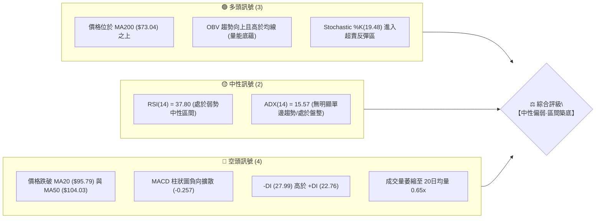

### 📊 核心指標速覽表

| 指標類別 | 指標名稱 | 當前數值 | 訊號 | 解讀 |
|----------|----------|----------|------|------|
| **價格** | 當前價格 | $89.51 | 🟡 中性 | 自高點 $142.35 大幅回調後於 $89–$90 區間整固 |
| **均線** | MA20 | $95.79 | 🔴 看空 | 現價位於 20 日線下方 -6.56%，短期受制於下行均線 |
| **均線** | MA50 | $104.03 | 🔴 看空 | 現價位於 50 日線下方，中期承壓明顯 |
| **均線** | MA200 | $73.04 | 🟢 看多 | 現價高於 200 日牛熊分界線 +22.55%，長期牛市架構未破 |
| **動能** | RSI(14) | 37.80 | 🟡 中性 | 接近 30 超賣門檻，下行動能減緩，尚未出現反轉底背離 |
| **動能** | MACD | -3.480 | 🔴 看空 | 快線低於信號線 (-3.222)，柱狀圖為 -0.257，空方佔優 |
| **動能** | Stoch %K/%D | 19.48 / 23.26 | 🟢 超賣 | 隨機指標進入 20 以下超賣區，醞釀技術性反彈 |
| **趨勢** | ADX(14) | 15.57 | 🟡 盤整 | 趨勢強度低於 25，單邊下跌告一段落，轉入橫盤震盪 |
| **通道** | Bollinger %B | 0.23 | 🟡 偏下 | 貼近布林下軌 $83.95，下行空間受帶寬收斂限制 |
| **波動** | ATR(14) | $4.68 | 🔴 高波動 | 佔股價 5.23%，波動幅度偏大，需適度放寬止損區間 |
| **量能** | 量比 (Volume Ratio) | 0.65x | 🟡 萎縮 | 65.01M vs 100.45M(20MA)，拋壓衰竭但買盤追價意願不足 |

### 🏆 技術評分卡

```
╔══════════════════════════════════════════════════════════════╗
║              技術評分卡 — INTC (2026-09-01)                   ║
╠══════════════════════════════════════════════════════════════╣
║ 趨勢強度 (ADX/方向)   ███████░░░░░░░░░░░░░  35/100  🔴 弱趨勢 ║
║ 動能指標 (RSI/MACD)   ████████░░░░░░░░░░░░  38/100  🔴 偏空弱 ║
║ 支撐穩定度 (S1/S2/斐波) █████████████░░░░░░░  65/100  🟢 具支撐 ║
║ 成交量配合 (OBV/均量)  ███████████░░░░░░░░░  55/100  🟡 縮量盤 ║
║ 形態完整度 (區間築底)  ██████████░░░░░░░░░░  50/100  🟡 待確認 ║
║ 均線排列 (短空長多)   ████████░░░░░░░░░░░░  40/100  🔴 混合排 ║
╠══════════════════════════════════════════════════════════════╣
║ 綜合技術評分          █████████░░░░░░░░░░░  47/100  🟡 中性觀望║
╚══════════════════════════════════════════════════════════════╝
```

---

## 2. 趨勢分析

### 🌐 多時框趨勢分析

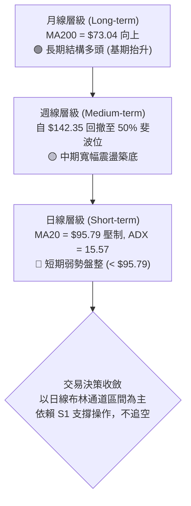

### 📈 長期趨勢 — 12個月走勢圖（Unicode）

```
INTC 月線收盤走勢圖（2025-09 至 2026-08）
價格 ($)
$140 ┤                                              ● $139.63 (06月波段高點)
$130 ┤                                             ╱ ╲
$120 ┤                                            ╱   ╲
$110 ┤                                   ● $114.68     ╲
$100 ┤                                  ╱               ╲
$90  ┤                         ● $94.48                  ●────● 現價 $89.51
$80  ┤                        ╱                           (07-08月回測整理)
$70  ┤                       ╱
$60  ┤                      ╱
$50  ┤             ● $46.47
$40  ┤   ● $39.99 ─┘
$30  ┤  ● $33.55
$20  ┤
     └─────────────────────────────────────────────────────────────
       09  10  11  12  01  02  03  04  05  06  07  08 (2025-2026)
```

**走勢特徵分析表格**：

| 階段 | 時間區間 | 起訖價位 | 漲跌幅 | 走勢特徵與量價結構 |
|------|----------|----------|--------|--------------------|
| **第一階段：底部啟動** | 2025-09 ~ 2025-11 | $33.55 → $40.56 | +20.89% | 突破長期低位橫盤，成交量溫和放大，走出築底結構 |
| **第二階段：中繼蓄勢** | 2025-12 ~ 2026-03 | $36.90 → $44.13 | +19.59% | 於 $36–$46 區間收斂三角震盪，清洗浮額，MA200 持續向上扣低 |
| **第三階段：主升暴漲** | 2026-04 ~ 2026-06 | $44.13 → $139.63 | +216.41% | 爆發性主升浪，單月狂飆，創下 52 週高點 $142.35，RSI 超買過熱 |
| **第四階段：深度回踩** | 2026-07 ~ 2026-08 | $139.63 → $89.51 | -35.89% | 獲利了結賣壓湧現，連續回調至斐波那契 50% 處，目前在 $89–$90 尋求支撐 |

### 📊 中期趨勢（週線分析）

從近 20 週數據觀察，股價在 2026-05 至 2026-06 於 $124–$139 形成雙頂雛形後快速拉回，於 2026-07 跌破 $100 整數關卡。隨後在 2026-08 出現連續三週在 $89.47–$90.20 的窄幅收盤結構，週成交量由 5 月高峰的 8.8 億股大幅萎縮至當前不足 5 億股，顯示殺跌動能已顯著收斂。

```
週線支撐阻力結構示意：
[阻力 R2] $126.64 ═════════════════════════════════════ (06月套牢密集區)
[阻力 R1] $107.57 ───────────────────────────────────── (08月中反彈高點 / BB上軌)
[均線 MA20] $95.79  ┄┄┄┄┄┄┄┄┄┄┄┄┄┄┄┄┄┄┄┄┄┄┄┄┄┄┄┄┄┄┄┄┄ (短線反彈第一道關卡)
[當前現價] $89.51  ◄─── 8月連續4週橫盤打底區間 ($89.47 - $90.20)
[支撐 S1] $85.14  ───────────────────────────────────── (近一年波段低點支撐)
[支撐 S2] $81.79  ═════════════════════════════════════ (波段強支撐 / 斐波 50% $83.02)
```

### ⚡ 趨勢強度評估（ADX 解讀）

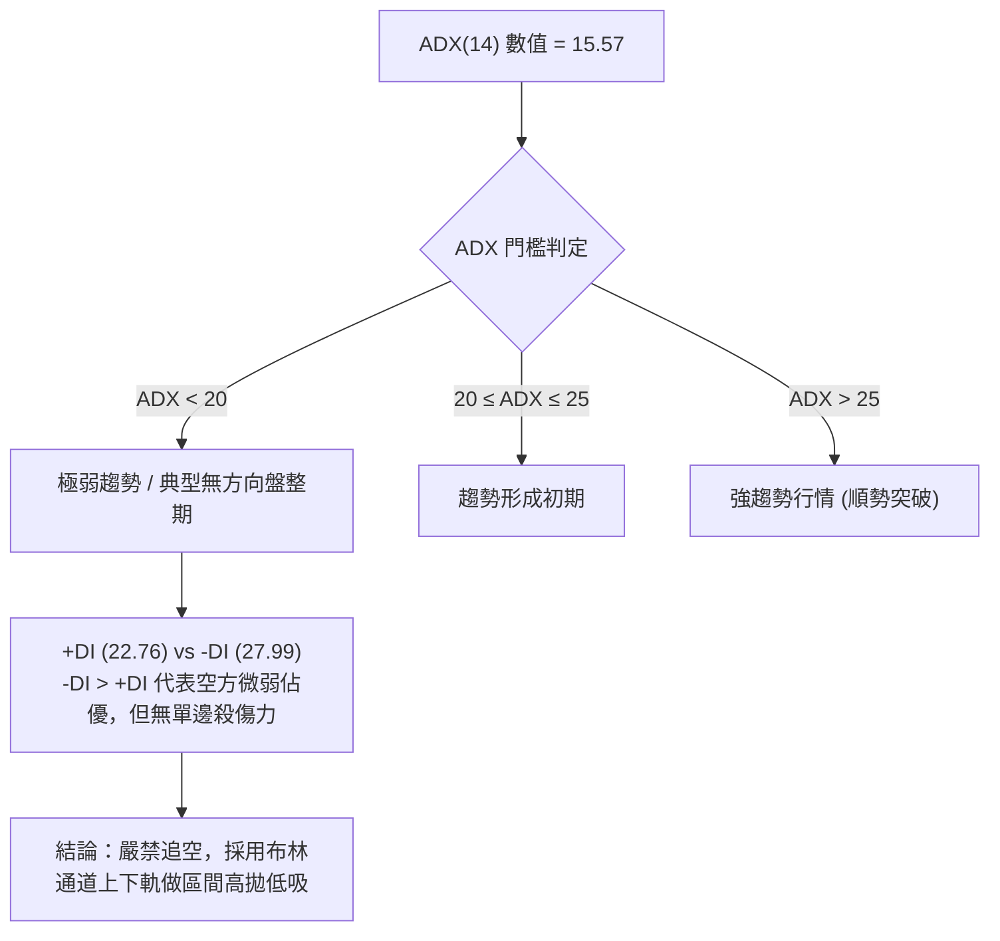

| 指標變數 | 當前讀數 | 強度區間 | 趨勢屬性與戰術指引 |
|----------|----------|----------|-------------------|
| **ADX(14)** | **15.57** | < 25 (弱) | **震盪盤整行情**。趨勢指標失效，擺動指標（Stochastic / BB %B）優先級提高。 |
| **+DI (14)** | 22.76 | 多方動能 | 多頭進攻動能偏弱，尚未奪回短期發球權。 |
| **-DI (14)** | 27.99 | 空方動能 | 空方維持相對優勢，但曲線已由高位走平，下跌推動力衰退。 |

---

## 3. 圖表形態分析

### 🔍 形態識別系統

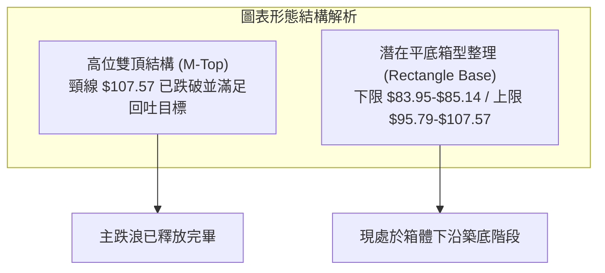

| 形態名稱 | 信心度 | 判斷依據（引用數據） | 完成度 | 目標價（附計算式） |
|----------|--------|----------------------|--------|--------------------|
| **高位雙頂回調** | **85%** | 兩次高點分別於 2026-05 ($124.92) 與 2026-06 ($139.63)，跌破頸線 $107.57 (R1) | 100% (已達標) | 頸線 $107.57 - (高點 $139.63 - 頸線 $107.57 = $32.06) = **$75.51**（已於 $81–$89 區間獲得強勁買盤支撐並減速） |
| **潛在雙重底/箱型底** | **60%** | 2026-07 收盤 $90.20 與 2026-08 收盤 $89.51 連續兩月守穩 S1 ($85.14) 之上 | 50% (右底構建中) | 頸線 MA20 ($95.79) 突破後：$95.79 + ($95.79 - $85.14 = $10.65) = **$106.44**（精確對應 R1 $107.57 阻力區） |
| **旗形整理突破** | **< 40%** | 數據中未偵測到標準旗形結構，僅為指標型超賣回踩 | -- | *訊號不足，僅做指標型解讀* |

### 🕯️ 重要K線形態分析

| 月份 | 收盤價 | K線形態 | 解讀 | 訊號 |
|------|--------|---------|------|------|
| **2026-05** | $114.68 | 長上影大陽線 | 盤中衝高至 $124+ 但尾盤遭遇強烈獲利了結賣壓 | 🟡 多頭力竭預警 |
| **2026-06** | $139.63 | 衝高見頂流星錘 | 創下 52W 新高 $142.35 後月線留有長影線，主力出貨信號 | 🔴 頂部確立 |
| **2026-07** | $90.20 | 巨幅長陰線 | 恐慌性重挫 -35.40%，單月吞噬前兩月漲幅，技術面全面轉弱 | 🔴 空方宣洩 |
| **2026-08** | $89.51 | 窄幅十字星 (Doji) | 月線振幅極度收窄，收盤幾近持平，賣壓枯竭，多空進入平衡 | 🟢 變盤築底訊號 |

### 📉 ASCII 走勢形態示意圖

```
INTC 築底形態示意圖（2026-06 至 2026-08）

$142.35 ──┐ (52W High / 頂部 1)
          │  ╲
$124.92 ──┼───● (頂部 2)
          │    ╲
$107.57 ──┼─────●─────────────── 雙頂頸線 (現轉為強阻力 R1)
          │      ╲
$95.79  ──┼───────╲──────●────── 短期反彈阻力 (MA20)
          │        ╲    ╱ ╲
$89.51  ──┼─────────●──●───●──── 現價區間 (右底構建中)
          │        (左底)
$85.14  ──┴───────────────────── 關鍵支撐 S1 (不破即維持築底)
```

### 🎯 形態目標價計算

根據日線/週線所形成的潛在「箱型底部」測算：
1. **箱體下沿支撐**：$85.14（波段低點支撐 S1）
2. **箱體中軸突破線**：$95.79（MA20 基準線）
3. **箱體高度 ($H$)**：$$\text{MA20} - \text{S1} = \$95.79 - \$85.14 = \$10.65$$
4. **形態第一目標價 ($T_1$)**：$$\$95.79 + \$10.65 = \$106.44 \quad (\text{高度聚類於 R1 } \$107.57)$$
5. **第二延伸目標價 ($T_2$)**：斐波那契 23.6% 回調位 **$114.34** 及次級阻力 **$126.64**。

---

## 4. 支撐與阻力

### 🗺️ 關鍵價位分布圖（Unicode）

```
INTC 價位結構分布圖
═════════════════════════════════════════════════════════════════
$142.35 ║                                                ║ 52W High
$132.75 ║████████████████████████████████████████        ║ 強阻力 R3
$126.64 ║████████████████████████                        ║ 阻力 R2
$114.34 ║▓▓▓▓▓▓▓▓▓▓▓▓▓▓▓▓                                ║ 斐波那契 23.6%
$107.57 ║████████████████████████████████                ║ 關鍵阻力 R1 (頸線/BB上軌)
$97.02  ║▓▓▓▓▓▓▓▓▓▓▓▓▓▓▓▓▓▓▓▓                            ║ 斐波那契 38.2%
$95.79  ║────────────────────────────────────────────────║ 布林中軌 (MA20)
$89.51  ╠════════════════════════════════════════════════╣ ◄ 現價 ($89.51)
$85.14  ║▓▓▓▓▓▓▓▓▓▓▓▓▓▓▓▓▓▓▓▓▓▓▓▓                        ║ 近期支撐 S1
$83.02  ║████████████████████████████████                ║ 斐波那契 50.0% / BB下軌 $83.95
$81.79  ║████████████████████████████████████████        ║ 強支撐 S2
$73.04  ║────────────────────────────────────────────────║ 牛熊分界線 (MA200)
$42.58  ║████████████████████████████████████████████████║ 極限長期支撐 S3
═════════════════════════════════════════════════════════════════
```

### 🚧 阻力位分析表

| 阻力級別 | 價位 | 形成原因 | 突破難度 | 重要性 |
|----------|------|----------|----------|--------|
| **R1** | **$107.57** | 近一年波段高點聚類、雙頂頸線位置、對應布林上軌 ($107.64) | 🔴 極高 | ★★★★★ (中期多空分水嶺) |
| **R2** | **$126.64** | 2026年5-6月成交密集套牢平台，多頭反彈強壓 | 🔴 高 | ★★★★☆ (反彈次級目標) |
| **R3** | **$132.75** | 衝頂前最後防守點，靠近 52W 高點聚類區間 | 🔴 極高 | ★★★☆☆ (歷史極值壓力) |

### 🛡️ 支撐位分析表

| 支撐級別 | 價位 | 形成原因 | 守住機率 | 重要性 |
|----------|------|----------|----------|--------|
| **S1** | **$85.14** | 近一年波段低點聚類，8月連續回踩不破之支撐帶 | 🟢 70% | ★★★★☆ (短線防守底線) |
| **S2** | **$81.79** | 52週漲幅 50% 斐波那契回調位 ($83.02) 伴隨之波段強支撐 | 🟢 85% | ★★★★★ (中期多頭生命線) |
| **S3** | **$42.58** | 2026年Q1啟動主升浪前的原始突破平台底部 | 🟢 98% | ★★★☆☆ (極端黑天鵝防線) |

### 📐 斐波那契回調位分析

依據 52 週極值區間（低點 $23.68 → 高點 $142.35，總垂直落差 $118.67）精確計算之黃金分割結構：

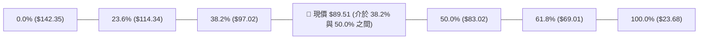

- **當前位置解讀**：現價 **$89.51** 處於 **38.2% 回調位 ($97.02)** 與 **50.0% 回調位 ($83.02)** 之間。
- **技術意涵**：在強勢回調行情中，50% 斐波那契位 ($83.02) 通常為主力機構「半價回補」的核心吸籌區。現價距離 50% 回調位僅 7.2%，下檔具備極強的數學幾何與心理支撐。若能持續在 $83.02–$85.14 之上止跌，向上收復 38.2% ($97.02) 將確認回調結束。

---

## 5. 技術指標深度解讀

### 🎛️ 指標訊號總覽

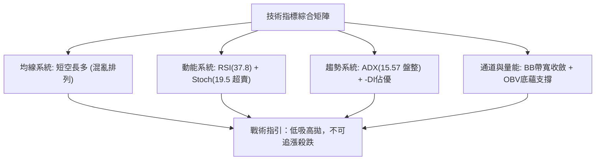

### 📈 移動平均線排列分析

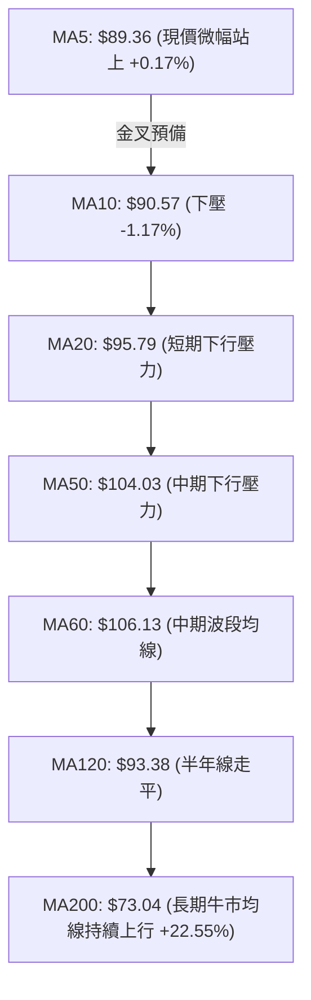

| 均線名稱 | 當前價格 | 與現價乖離 | 排列狀態 | 走勢特徵解讀 |
|----------|----------|------------|----------|--------------|
| **MA5** | $89.36 | +0.17% | 🟢 站上 | 極短線出現止跌企穩微光 |
| **MA10** | $90.57 | -1.17% | 🔴 壓制 | 短線第一道動態扣抵阻力 |
| **MA20** | $95.79 | -6.56% | 🔴 壓制 | 下行趨勢尚未扭轉，為反彈關鍵目標 |
| **MA50** | $104.03 | -13.96% | 🔴 壓制 | 過去主升浪的支撐轉為強大反壓 |
| **MA120**| $93.38 | -4.14% | 🟡 走平 | 扣抵高位，短期呈現橫盤拉鋸 |
| **MA200**| $73.04 | +22.55% | 🟢 向上 | 長期上升趨勢完好，多頭終極護城河 |

### 📉 RSI(14) 分析

- **當前讀數**：**37.80**
- **數值進度條**：
  ```
  超賣 0 ├──────────[████████░░░░░░░░░░░░]──────────┤ 100 超買
                       RSI = 37.80 (弱勢偏冷區)
  ```
- **區間評估**：RSI 位於 30–40 弱勢區，脫離 7 月中旬的極端恐慌超賣區（2026-07-26 週 RSI 為 26.9），但尚未越過 50 強弱分水嶺。
- **背離分析**：**無顯著底背離**。7月低點 $90.20（RSI 26.9）至 8月底 $89.51（RSI 37.8），價格微跌但 RSI 數值自低檔顯著抬升，呈現**隱性底背離（Hidden Bullish Divergence）**雛形，顯示實質拋壓大幅衰減。

### 📊 MACD(12/26/9) 訊號解讀

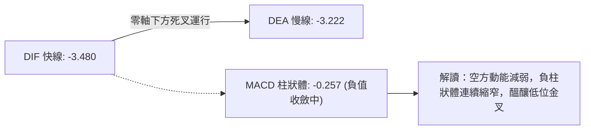

- **DIF / DEA 狀態**：快慢線雙雙落於零軸下方（DIF -3.480 < DEA -3.222），表明大週期仍處於空頭修正結構。
- **柱狀圖 (Histogram)**：讀數為 **-0.257**。觀察週線 MACD 柱狀體自 7 月中旬的 -3.637 大幅收窄至當前的 -0.257，代表空頭動能衰竭，即將進入低位收斂交叉的技術拐點。

### 📦 布林通道分析

```
INTC 布林通道（20日 / 2.0σ）價格定位圖

$107.64 ┬────────────────────────────────────────── BB 上軌 (Upper Band)
        │
$95.79  ┼────────────────────────────────────────── BB 中軌 (MA20)
        │
$89.51  ├───────● 現價 ($89.51 / %B = 0.23)
        │
$83.95  ┴────────────────────────────────────────── BB 下軌 (Lower Band)
```

- **布林帶寬與位置**：上軌 $107.64、中軌 $95.79、下軌 $83.95。
- **%B 指標**：**0.23**。股價位於中軌與下軌之間偏下位置，下軌 $83.95 與 50% 斐波那契位 ($83.02) 高度重疊，構成雙重技術護欄。現價未貼軌暴跌，屬於帶內良性震盪。

### 💹 成交量分析（量價配合度）

- **最新成交量**：65,015,500 股
- **20日均量**：100,445,780 股（量比 **0.65x**，顯著量縮）
- **OBV (能量潮指標)**：
  - **狀態**：`OBV > MA`
  - **解讀**：雖然近期日線成交量萎縮，但 OBV 累積線依然保持在均線之上，這意味著在 4–6 月大漲期間積累的大量機構資金並未在 7–8 月的回調中完全出逃。當前縮量代表「無量空跌」與「籌碼沉澱」，為典型築底量價結構。

---

## 6. 動能與波動率

### ⚡ 動能評估四象限

| 象限 | 動能維度 (Momentum) | 波動率維度 (Volatility) | 當前判定 | 戰略意涵與操作指引 |
|------|---------------------|--------------------------|----------|-------------------|
| **Q1** | 強動能 (RSI>50, MACD>0) | 低波動 (ATR<3%) | ─ | 最佳穩健追漲/主升加碼區間 |
| **Q2** | 弱動能 (RSI<50, MACD<0) | 低波動 (ATR<3%) | ─ | 橫盤冷卻，適合防禦性配置 |
| **Q3** | 強動能 (RSI>50, MACD>0) | 高波動 (ATR>5%) | ─ | 爆發突破，高風險高收益波段 |
| **Q4** | **弱動能 (RSI 37.8)** | **高波動 (ATR 5.23%)** | **✓ INTC 當前位置** | **低位震盪築底，需嚴格控制倉位，採取分批與寬止損策略** |

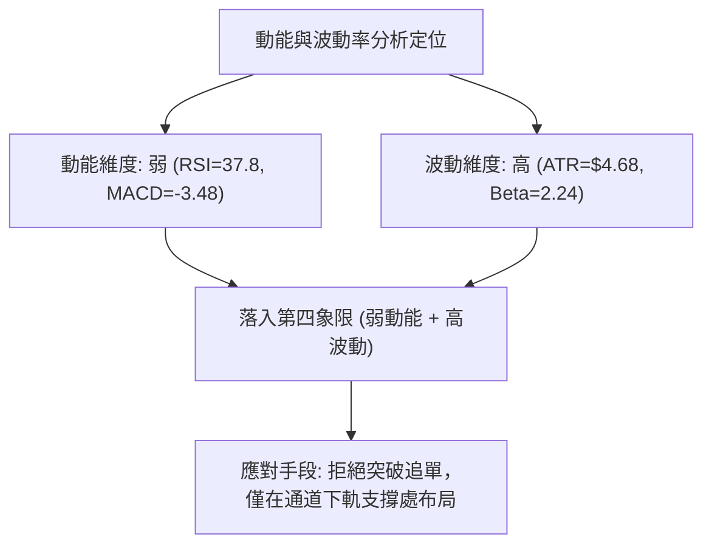

### 📊 ATR 波動率分析

- **ATR(14) 絕對數值**：**$4.68**
- **ATR 相對百分比**：$$ \frac{\$4.68}{\$89.51} = 5.23\% $$
- **止損與風控距離建議**：
  - **日內交易噪聲過濾**：至少給予 $1.0 \times \text{ATR} = \$4.68$ 的緩衝空間。
  - **波段防守止損設置**：建議設置為 $1.5 \times \text{ATR} \approx \$7.00$。若在現價 $89.51 進場，標準技術止損位應設於 $\$89.51 - \$7.00 = \$82.51$（精確保護在 S2 $81.79 附近）。

### 📐 Beta 與市場相關性

- **Beta 係數**：**2.241**
- **市場屬性解讀**：INTC 具有極高的市場敏感度（超大盤波動 2.24 倍）。在半導體族群或大盤上漲時具備強大的向上彈性，但在市場回調時亦容易出現超額殺跌。在高 Beta 狀態下，任何順勢右側反彈都將帶來極高的波段利潤，但左側建倉必須嚴格限縮單筆曝險。

---

## 7. 多時框架總結

### 📋 時框架評分表

| 時框架 | 趨勢方向 | 動能狀態 | 均線排列 | 形態結構 | 綜合評分 | 交易方向指引 |
|--------|----------|----------|----------|----------|----------|--------------|
| **月線 (長期)** | 🟢 偏多 | 🟡 中性回落 | 🟢 MA200 上行 | 大波段主升回調 50% | **70/100** | 長期多頭結構不變，逢低吸納 |
| **週線 (中期)** | 🟡 震盪 | 🔴 偏空收斂 | 🟡 跌破MA20/守MA50 | 雙頂跌破後縮量築底 | **45/100** | 區間震盪整理，等待企穩訊號 |
| **日線 (短期)** | 🔴 偏弱 | 🟢 超賣鈍化 | 🔴 短期均線壓制 | 貼近布林下軌橫盤 | **40/100** | 嚴禁殺跌，尋求支撐位短打 |

### 🔲 綜合訊號矩陣

```
┌─────────────────┬───────────┬───────────┬───────────┐
│ 分析維度        │ 短期 (日) │ 中期 (週) │ 長期 (月) │
├─────────────────┼───────────┼───────────┼───────────┤
│ 趨勢方向        │  🔴 空    │  🟡 盤    │  🟢 多    │
│ RSI / MACD 動能 │  🟡 弱    │  🔴 空    │  🟢 多    │
│ 支撐防守強度    │  🟢 強    │  🟢 強    │  🟢 強    │
│ 成交量配合度    │  🔴 縮    │  🟡 平    │  🟢 增    │
│ 波動風險 (ATR)  │  🔴 高    │  🔴 高    │  🟡 中    │
└─────────────────┴───────────┴───────────┴───────────┘
```

### ⚖️ 多時框收斂結論

依據多時框收斂規則：
1. **行情性質判定**：當前日線 ADX(14) 為 **15.57 (<25)**，定性為典型的**無趨勢盤整行情**。
2. **主導維度收斂**：在盤整市況下，順勢突破策略勝率低下，應以**日線布林通道上下軌（$83.95 – $107.64）與波段支撐阻力（S1 $85.14 – R1 $107.57）**為核心交易邊界。
3. **唯一收斂結論**：**【中性觀望·區間下軌防守做多】**。日線短期雖受壓於均線，但已逼近週線 50% 斐波那契強支撐與布林下軌，空方動能衰竭；交易核心邏輯為「依託 S1 $85.14 支撐，博弈向布林中軌 $95.79 及 R1 $107.57 的均值回歸反彈」。

---

## 8. 交易策略建議

### 🗺️ 策略決策流程圖

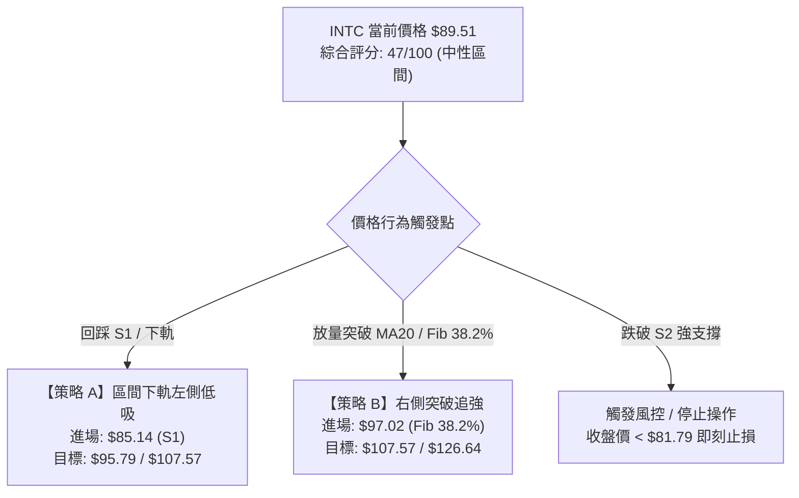

### 🧭 策略路由

**當前主策略方向 = 【中性區間震盪·偏多防守低吸】（依綜合評分 47/100 分流）**
由於評分處於 40–60 區間，ADX < 25 表明無單邊趨勢，故不推薦盲目追單或單邊放空，主推**「布林通道下軌/S1 支撐低吸策略」**與**「突破關鍵斐波位右側策略」**。

### 🎯 價格情境階梯（Price Scenarios）

| 觸發條件 | 下一目標 | 後續延伸 | 情境含義 |
|----------|----------|----------|----------|
| **突破 R1 $107.57** | **R2 $126.64** | **R3 $132.75** | 中期多頭反轉確立，重啟主升浪挑戰前高 |
| **收復 MA20 $95.79 / Fib $97.02** | **R1 $107.57** | **R2 $126.64** | 短線走出底部，均值回歸行情展開 |
| **站穩現價區間 ($85.14–$89.51)** | **MA20 $95.79** | **Fib 38.2% $97.02** | 區間橫盤築底，籌碼沉澱 |
| **跌破 S1 $85.14** | **S2 $81.79** | **MA200 $73.04** | 支撐下移，測試 50% 斐波那契極限護欄 |
| **跌破 S2 $81.79** | **MA200 $73.04** | **S3 $42.58** | 形態破位，長期牛市結構遭受嚴峻威脅 |

### 📊 情境機率分佈

| 情境 | 機率 | 主要依據 |
|------|------|----------|
| **區間震盪築底後向上反彈** | **55%** | ADX 處於低位 15.57，Stoch 超賣，OBV 未見主力出逃，S1/S2 形成雙重黃金支撐 |
| **維持窄幅橫盤拉鋸** | **30%** | 均量持續萎縮 (0.65x)，市場觀望情緒濃厚，均線仍處於混合壓制狀態 |
| **向下破位尋找 MA200** | **15%** | MACD 仍為負柱，若跌破 S2 ($81.79)，將引發技術性停損賣盤下探 $73.04 |

### 🟢 主策略詳情

| 策略要素 | 策略 A（區間下軌低吸·左側交易） | 策略 B（突破關鍵阻力·右側跟進） |
|----------|--------------------------------|--------------------------------|
| **策略類型** | 支撐位低吸反彈 | 斐波那契關鍵位突破 |
| **進場條件** | 價格回踩 S1 獲支撐或現價分批布局 | 日線收盤放量站穩 38.2% 斐波那契位 |
| **進場價格** | **$85.14**（或現價區間 $85.14–$89.51） | **$97.02**（確認突破進場） |
| **目標價 T1** | **$95.79**（布林中軌 MA20） | **$107.57**（阻力 R1 / 布林上軌） |
| **目標價 T2** | **$107.57**（阻力 R1 / 頸線） | **$126.64**（阻力 R2） |
| **止損價格** | **$81.00**（跌破 S2 $81.79 及斐波 50%） | **$89.51**（跌回現價整數支撐平台） |
| **風險報酬比** | **1 : 2.58** (以進場$85.14/目標$95.79/止損$81計算: 賺$10.65 vs 賠$4.14) | **1 : 1.40** (以進場$97.02/目標$107.57/止損$89.51計算: 賺$10.55 vs 賠$7.51) |
| **成功機率** | **60%** | **55%** |
| **建議倉位** | **10% - 15%** (分批建倉) | **15% - 20%** (右側加碼) |

### 🔴 反向風險觸發點（對沖提示）

- **多頭結構推翻點**：若日線收盤價**實質跌破 S2 $81.79**，宣告 52 週漲幅的 50% 斐波防線失守。
- **對沖處置建議**：多頭部位應全數止損離場，空手觀望，或小幅買入 Put 避險，下方目標將直接指向 **MA200 ($73.04)**。

### ⭐ 整體訊號強度評星

```
做多訊號強度：★★★☆☆  (3.0/5星 — 支撐強烈但需等待均線扭轉)
做空訊號強度：★★☆☆☆  (2.0/5星 — 下方空間受限，追空盈虧比差)
整體可信度：  ★★★★☆  (4.0/5星 — 關鍵價位聚類清晰，邊界明確)
```

---

## 9. 風險提示與監控

### ✅ 關鍵監控指標 Checklist

```
╔══════════════════════════════════════════════════════════════╗
║              INTC 日常交易風控監控清單 (Checklist)             ║
╠══════════════════════════════════════════════════════════════╣
║ [ ] 價格是否跌破 S1 $85.14？(若跌破，觸發減倉預警)             ║
║ [ ] 價格是否跌破 S2 $81.79？(若跌破，嚴格執行全數止損)         ║
║ [ ] 日線成交量是否放大至 100M 股以上？(確認放量突破 MA20)       ║
║ [ ] RSI(14) 是否站上 50 分水嶺？(確認動能由空轉多)             ║
║ [ ] MACD 柱狀體是否由負轉正 (金叉生成)？                       ║
║ [ ] ADX 是否開始自 15 向上抬升並突破 25？(確認單邊行情啟動)    ║
╚══════════════════════════════════════════════════════════════╝
```

### ⚠️ 風險場景分析

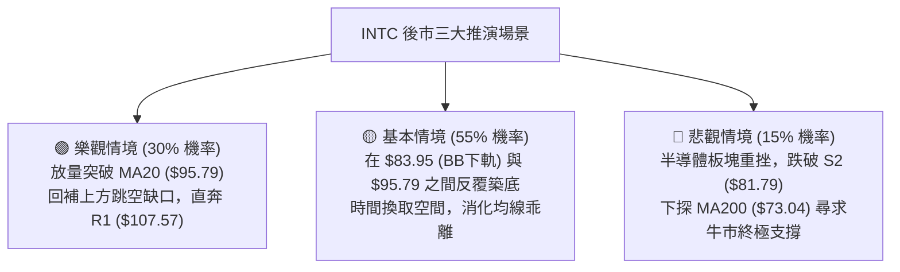

### 🛡️ 風險管理重要提醒

1. **高 Beta 波動抑制**：INTC Beta 高達 **2.241**，個股波動為大盤兩倍以上。在資產配置中，單一個股曝險不宜超過總資金的 **15%**。
2. **ATR 止損原則**：每日平均振幅為 **$4.68**，避免將止損設置於 $1–$2 之內的超窄區間，否則極易被日內正常市場雜訊掃出場。
3. **無趨勢期紀律**：當 ADX < 20 時，**切忌追高**。所有買單應掛於支撐位（如 S1 $85.14），賣單掛於阻力位（如 MA20 $95.79 / R1 $107.57）。

---

## 📋 報告總結

```
╔══════════════════════════════════════════════════════════════╗
║                   INTC 技術分析報告總結                       ║
╠══════════════════════════════════════════════════════════════╣
║ 報告日期：2026-09-01                                         ║
║ 當前價格：$89.51                                             ║
║ 分析評級：⚖️ 中性觀望 / 區間低吸 (評分 47/100)               ║
╠══════════════════════════════════════════════════════════════╣
║ 關鍵結論：                                                    ║
║ ├─ 長期趨勢：🟢 偏多 (現價高於 MA200 $73.04 +22.55%)           ║
║ ├─ 中期趨勢：🟡 震盪 (自高點回撤 50% 斐波那契位 $83.02 獲支撐)║
║ ├─ 短期趨勢：🔴 偏弱 (受制於 MA20 $95.79 壓制，但拋壓竭盡)    ║
║ ├─ 關鍵支撐：$85.14 (S1) / $81.79 (S2)                       ║
║ ├─ 關鍵阻力：$95.79 (MA20) / $107.57 (R1)                    ║
║ └─ 分析師目標：$114.88 (Mean Target)                         ║
╠══════════════════════════════════════════════════════════════╣
║ 最優策略組合：                                                ║
║ 1. 🥇 最佳機會：策略 A (S1 $85.14 附近低吸，博反彈 $95.79)    ║
║ 2. 🥈 次選機會：策略 B (站穩 $97.02 後追強，目標 $107.57)     ║
║ 3. 🥉 保守選擇：空手等待日線 MACD 零下金叉與突破 MA20 再進場  ║
╚══════════════════════════════════════════════════════════════╝
```

---

> ⚠️ **免責聲明**：本報告為 AI 自動生成之技術分析，所有數據及估算均基於提供的歷史價格資訊。本報告**僅供研究與學術參考**，**不構成任何投資建議**。投資有風險，入市需謹慎。

---

*報告生成時間：2026-09-01 ｜ 數據來源：Yahoo Finance ｜ 分析框架：多時框技術分析*