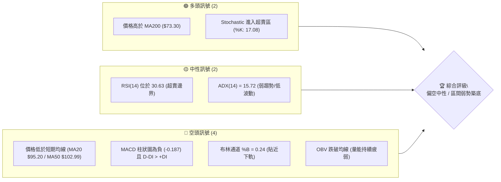
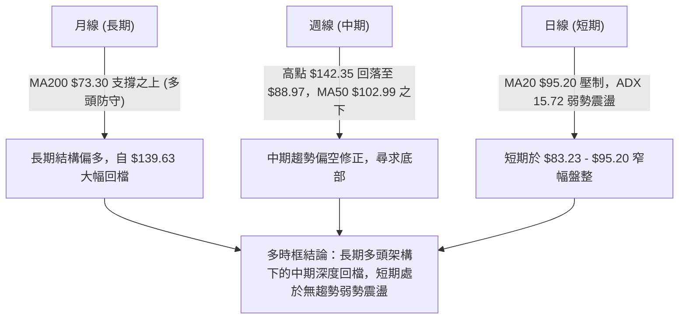
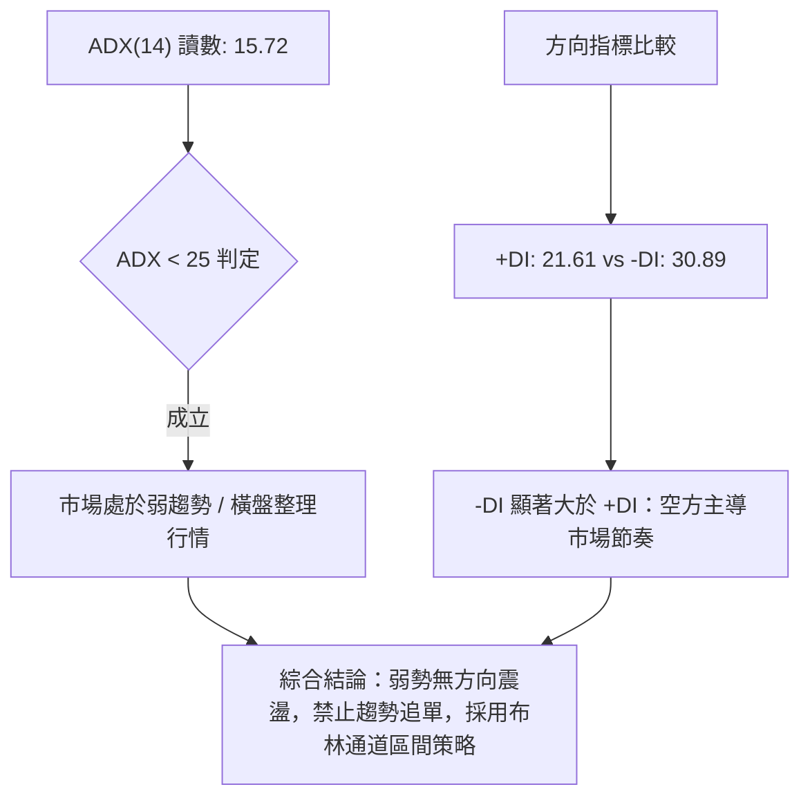
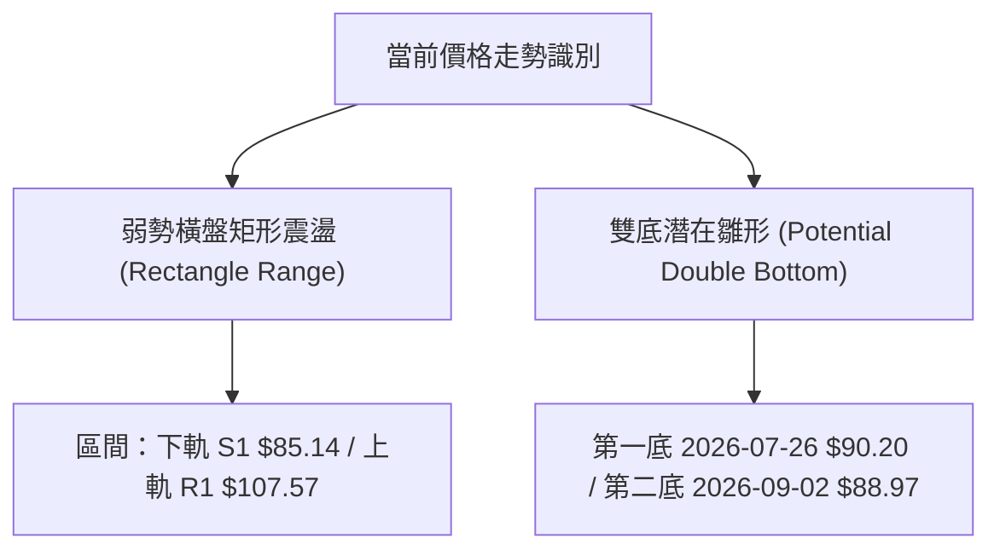
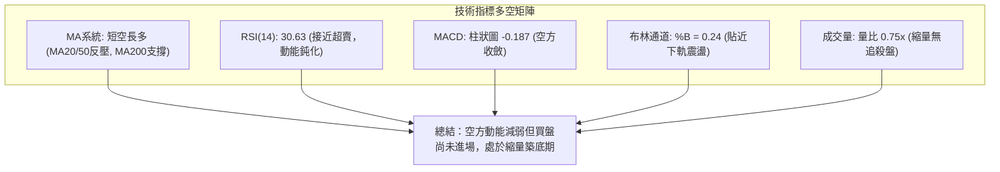
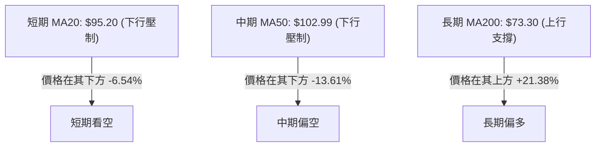
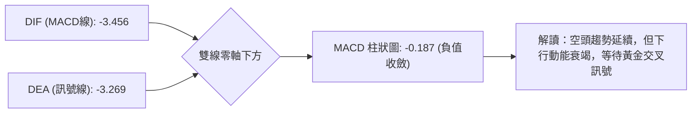
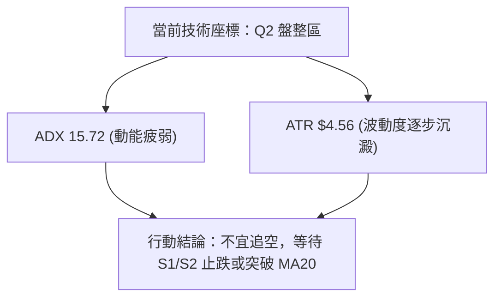
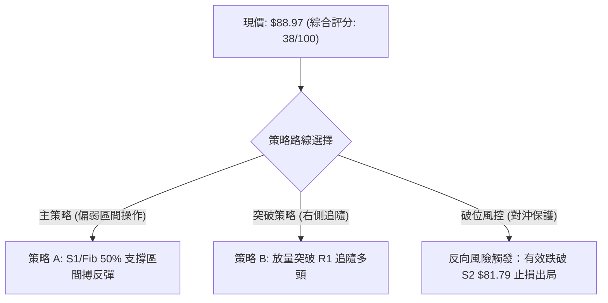
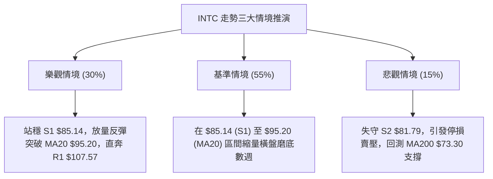

# INTC 技術分析報告

> **報告日期**：2026-09-02 ｜ **語言**：繁體中文 ｜ **數據來源**：Yahoo Finance ｜ **當前價格**：$88.97

---

## 目錄

| 章節 | 內容 |
|------|------|
| [1. 技術面概覽](#1-技術面概覽) | 訊號儀表板、核心指標、評分卡 |
| [2. 趨勢分析](#2-趨勢分析) | 多時框趨勢、長中短期走勢 |
| [3. 圖表形態分析](#3-圖表形態分析) | 形態識別、K線組合、目標價 |
| [4. 支撐與阻力](#4-支撐與阻力) | 關鍵價位、斐波那契回調 |
| [5. 技術指標深度解讀](#5-技術指標深度解讀) | MA/RSI/MACD/布林/成交量 |
| [6. 動能與波動率](#6-動能與波動率) | 動能評估、ATR、Beta |
| [7. 多時框架總結](#7-多時框架總結) | 時框架評分矩陣 |
| [8. 交易策略建議](#8-交易策略建議) | 多空策略、風險報酬比 |
| [9. 風險提示與監控](#9-風險提示與監控) | 監控指標、風險場景 |

---

## 1. 技術面概覽

### 🎯 技術訊號儀表板



### 📊 核心指標速覽表

| 指標類別 | 指標名稱 | 當前數值 | 訊號 | 解讀 |
|----------|----------|----------|------|------|
| **價格** | 當前價格 | $88.97 | 🔴 | 較52週高點 $142.35 回撤 37.5%，處於52週區間 55.0% 位置 |
| **均線** | MA20 | $95.20 | 🔴 | 價格低於 MA20 (-6.54%)，短期下行壓力顯著 |
| **均線** | MA50 | $102.99 | 🔴 | 價格低於 MA50 (-13.61%)，中期趨勢呈現空頭排列修正 |
| **均線** | MA200 | $73.30 | 🟢 | 價格高於 MA200 (+21.38%)，長期多頭基底尚未被破壞 |
| **動能** | RSI(14) | 30.63 | 🟡 | 逼近 30 超賣臨界點，空頭動能放緩但尚未見明確反轉訊號 |
| **動能** | MACD (12,26,9) | -3.456 / -3.269 | 🔴 | MACD 柱狀圖 -0.187，雙線於零軸下方運行，空頭占優 |
| **趨勢** | ADX(14) | 15.72 | 🟡 | ADX < 25，強烈趨勢已轉為弱勢盤整，-DI (30.89) > +DI (21.61) |
| **通道** | 布林通道 (%B) | 0.24 ($83.23~$107.16) | 🔴 | 運行於下軌 ($83.23) 與中軌 ($95.20) 之間，受中軌壓制 |
| **波動** | ATR(14) | $4.56 (5.13%) | 🟡 | 每日平均波動幅度約 $4.56，波動度適中偏高 |

### 🏆 技術評分卡

```
╔══════════════════════════════════════════════════════════════╗
║              技術評分卡 — INTC (2026-09-02)                  ║
╠══════════════════════════════════════════════════════════════╣
║ 趨勢強度 (ADX/方向)   ████░░░░░░░░░░░░░░░░  20/100  🔴 空方主導弱勢 ║
║ 動能指標 (RSI/MACD)  ██████░░░░░░░░░░░░░░  30/100  🔴 動能疲弱接近超賣║
║ 支撐穩定度 (S1/Fib)   ████████████░░░░░░░░  60/100  🟡 Fib 50%附近承接 ║
║ 成交量配合 (OBV/量比) ██████░░░░░░░░░░░░░░  30/100  🔴 量縮無買盤推升  ║
║ 形態完整度 (箱體整理) ██████████░░░░░░░░░░  50/100  🟡 弱勢矩形震盪    ║
║ 均線排列 (短空長多)   ████████░░░░░░░░░░░░  40/100  🔴 短中期均線下彎  ║
╠══════════════════════════════════════════════════════════════╣
║ 綜合評分             ███████░░░░░░░░░░░░░  38/100  🔴 偏弱盤整 / 偏空 ║
╚══════════════════════════════════════════════════════════════╝
```

---

## 2. 趨勢分析

### 🌐 多時框趨勢分析



### 📈 長期趨勢 — 12個月走勢圖（Unicode）

```
INTC 月線走勢圖（過去12個月：2025-09 至 2026-09）
價格軸 ($)
$140 ┤                                   ●(2026-06: $139.63 高點)
$120 ┤                             ●(2026-05: $114.68)
$100 ┤                       ●(2026-04: $94.48)
 $90 ┤                                         ●───────●───────●←現價 $88.97 (07-09月)
 $45 ┤             ●(2026-01: $46.47)
 $40 ┤       ●(2025-10: $39.99)
 $33 ┤ ●(2025-09: $33.55)
     └──────────────────────────────────────────────────────────────────────────
       09/25 10/25 11/25 12/25 01/26 02/26 03/26 04/26 05/26 06/26 07/26 08/26 09/26
```

**走勢特徵分析表格**：

| 階段區間 | 起訖價位 | 漲跌幅 | 趨勢特徵與量價解讀 |
|----------|----------|--------|--------------------|
| 2025-09 ~ 2026-01 | $33.55 → $46.47 | +38.51% | **第一波突破推升**：脫離底部 $20 平台，量能平穩增長。 |
| 2026-01 ~ 2026-03 | $46.47 → $44.13 | -5.03% | **高檔平台蓄勢**：於 $44-$46 進行均線沉澱，為爆發期做準備。 |
| 2026-04 ~ 2026-06 | $44.13 → $139.63 | +216.41% | **主升段爆發暴漲**：單月連續突破，創下 52 週高點 $142.35。 |
| 2026-07 ~ 2026-09 | $139.63 → $88.97 | -36.28% | **斷崖式修正與沉澱**：連續急跌後於 $88-$90 區間縮量收斂。 |

### 📊 中期趨勢（週線分析）

```
週線關鍵位示意圖：
$142.35 (52W High) ══════════════════════════════════════════ [極強天花板]
                     │
$107.57 (R1 / BB上軌) ────────────────────────────────────── [週線強阻力]
                     │
$102.99 (MA50)     - - - - - - - - - - - - - - - - - - - - - - [中期生命線阻力]
$95.20 (MA20 / 中軌) - - - - - - - - - - - - - - - - - - - - - - [短期動能壓制]
$88.97 (當前價格)   ◄─── 正在此處橫盤收斂 (Fib 50% $83.02 守護區)
$85.14 (S1 支撐)   ────────────────────────────────────────── [第一道防線]
$81.79 (S2 支撐)   ══════════════════════════════════════════ [核心防守底線]
```

### ⚡ 趨勢強度評估（ADX 解讀）



| 指標名稱 | 當前數值 | 閾值標準 | 狀態評估 |
|----------|----------|----------|----------|
| **ADX (14)** | 15.72 | < 20 (極弱) / < 25 (弱趨勢) | 處於無明確方向的低動能盤整期 |
| **+DI (14)** | 21.61 | 基準線 | 多頭買盤力道偏弱 |
| **-DI (14)** | 30.89 | > +DI (差距 9.28) | 空方仍控制短中期反彈高度 |

---

## 3. 圖表形態分析

### 🔍 形態識別系統



**形態信心度與目標價計算表**：

| 形態名稱 | 信心度 | 判斷依據（引用數據） | 完成度 | 目標價（附計算式） |
|----------|--------|----------------------|--------|--------------------|
| **弱勢矩形震盪** | 75% | 7-9月價格持續受限於 S1 $85.14 至 R1 $107.57 之間，ADX 15.72 確認盤整。 | 80% | 區間頂部目標價 = **$107.57**（即 R1） |
| **潛在雙底形態** | 45% | 7月底低點 $90.20 與當前 $88.97 接近，但 MACD 柱狀圖仍為負，未放量突破頸線 $102.50。 | 35% | 若突破頸線 $102.50：<br>形態高度 = $102.50 - $88.97 = $13.53<br>推算目標價 = $102.50 + $13.53 = **$116.03**（接近 Fib 23.6% $114.34） |

### 🕯️ 重要K線形態分析

| 週/月份 | 收盤價 | K線形態 | 解讀 | 訊號 |
|---------|--------|---------|------|------|
| **2026-06** | $139.63 | 爆量長上影線（高點 $142.35） | 主升段竭盡，獲利盤出逃，形成歷史天花板 | 🔴 強烈見頂 |
| **2026-07** | $90.20 | 長黑大陰線跌破均線 | 多頭踩踏斷崖式下殺，單月崩跌 35% | 🔴 空頭宣洩 |
| **2026-08-16 週** | $102.50 | 弱勢反彈倒錘頭線 | 向上挑戰 MA50 ($102.99) 受阻回落 | 🔴 反彈遇阻 |
| **2026-09-02 (當前)** | $88.97 | 窄幅十字星 / 紡錘線 | 價格波動收窄，賣壓減輕，於 Fib 50% 處尋求沉澱 | 🟡 變盤觀望 |

### 📉 ASCII 走勢形態示意圖

```
INTC 近期矩形整理與潛在雙底形態示意：
$107.57 (R1 矩形頂部) ──────────────────────────────────────┐
                                                           │
$102.50 (雙底潛在頸線)   ───────● (08-16)                  │ 震盪箱體
                               ╱ ╲                         │
$95.20 (MA20 中軌)    ───────╱───╲─────────────────────────┤
                            ╱     ╲                        │
$90.20 (第一底 07-26) ─────●       ╲       ●現價 $88.97    │
                                    ╲     ╱ (潛在第二底)   │
$85.14 (S1 矩形底部)  ───────────────●───╱────────────────┘
                                  (08-23: $90.07)
```

---

## 4. 支撐與阻力

### 🗺️ 關鍵價位分布圖（Unicode）

```
INTC 價位結構分布圖 (由 OHLCV 與歷史波段計算)
═════════════════════════════════════════════════════════════════
$142.35 ║████████████████████████████████║ 52週最高點 / 極強天花板
$132.75 ║████████████████████████        ║ 波段強阻力 R3 (+49.21%)
$126.64 ║████████████████████            ║ 波段阻力 R2 (+42.34%)
$114.34 ║▓▓▓▓▓▓▓▓▓▓▓▓▓▓▓▓▓▓▓▓            ║ 斐波那契 23.6% 回調位
$107.57 ║████████████████████████        ║ 關鍵阻力 R1 / BB上軌 (+20.91%)
$97.02  ║▓▓▓▓▓▓▓▓▓▓▓▓                    ║ 斐波那契 38.2% 回調位
$95.20  ║--------------------------------║ 短期 MA20 / 布林中軌
$88.97  ╠════════════════════════════════╣ ◄ 當前價格 $88.97
$85.14  ║▓▓▓▓▓▓▓▓▓▓▓▓▓▓▓▓                ║ 近期波段支撐 S1 (-4.30%)
$83.02  ║████████████████████            ║ 斐波那契 50.0% 關鍵平衡位
$81.79  ║████████████████████████        ║ 強支撐 S2 / 近期防守底線 (-8.07%)
$73.30  ║████████████████████████████    ║ 長期生命線 MA200 支撐
$42.58  ║████████████████████████████████║ 遠端極端支撐 S3 (-52.14%)
═════════════════════════════════════════════════════════════════
```

### 🚧 阻力位分析表

| 阻力級別 | 價位 | 形成原因 | 突破難度 | 重要性 |
|----------|------|----------|----------|--------|
| **R1** | **$107.57** | 近一年波段密集高點聚類、布林通道上軌 ($107.16) 重合區 | 🔴 極高（需成交量放大至 1.5x 以上） | ★★★★☆ |
| **R2** | **$126.64** | 2026年6月中旬反彈次高點套牢區聚類 | 🔴 極高（大量套牢籌碼堆積） | ★★★☆☆ |
| **R3** | **$132.75** | 衝擊 52W 高點前最後震盪平台聚類 | 🔴 難以逾越 | ★★★★★ |

### 🛡️ 支撐位分析表

| 支撐級別 | 價位 | 形成原因 | 守住機率 | 重要性 |
|----------|------|----------|----------|--------|
| **S1** | **$85.14** | 近一年波段低點聚類、接近布林下軌 ($83.23) | 🟡 65%（短期震盪第一道緩衝區） | ★★★★☆ |
| **S2** | **$81.79** | 近一年波段核心低點聚類、斐波那契 50% ($83.02) 護城河 | 🟢 80%（多頭中期最後堡壘） | ★★★★★ |
| **S3** | **$42.58** | 2026年Q1爆發前長週期平台底部（遠端極端支撐） | 🟢 95%（極端行情防線） | ★★☆☆☆ |

### 📐 斐波那契回調位分析

依據 52 週區間 **$23.68（0% 起點）→ $142.35（100% 頂點）** 精確計算：

```
0.0%  (52W High)  : $142.35 ──┐
23.6%             : $114.34   │ 回檔空間
38.2%             : $97.02    │
══════════════════════════════╡
【當前現價: $88.97 落在 38.2% ($97.02) 與 50.0% ($83.02) 之間】
══════════════════════════════╡
50.0%             : $83.02    │ 支撐防守區
61.8%             : $69.01    │ (若破位進入深淵)
78.6%             : $49.08    │
100.0% (52W Low)  : $23.68  ──┘
```

**解讀**：現價 $88.97 正處於回調 50%（$83.02）關鍵心理與技術防守位上方。50% 回調位是多空多空勢力的分水嶺，只要能守穩 $83.02 - $85.14 區間，長期上漲結構即未被徹底破壞；若失守，將進一步下探 61.8% 黃金分割位 $69.01（靠近 MA200 $73.30）。

---

## 5. 技術指標深度解讀

### 🎛️ 指標訊號總覽



### 📈 移動平均線排列分析



| 均線名稱 | 數值 | 偏離率 | 狀態解讀 |
|----------|------|--------|----------|
| **MA5** | $89.66 | -0.77% | 短期均線走平，下行速率減緩 |
| **MA10** | $89.80 | -0.93% | 貼近現價，日線級別爭奪激烈 |
| **MA20** | $95.20 | -6.54% | 下降斜率顯著，短線第一道強反壓 |
| **MA60** | $105.96 | -16.03%| 季線嚴重負乖離，具備中期修復需求 |
| **MA120** | $93.72 | -5.07% | 半年線下穿，形成密集反壓區 |
| **MA240** | $67.18 | +32.44%| 年線長期向上，提供結構性長線保護 |

### 📉 RSI(14) 分析

- **當前讀數**：**30.63**
- **進度條**：`██████░░░░░░░░░░░░░░` 30.63% (處於超賣區邊緣 30.0)
- **超買超賣解讀**：RSI 自 2026-05 的 88.4 極端超買區持續回落，目前進入 30-35 的超賣鈍化區間。通常進入 30 以下容易引發空頭回補，但目前並無顯著買盤介入。
- **背離判斷**：
  - 價格在 2026-07-26 低點 $92.32，當時 RSI 為 26.9；
  - 價格在 2026-09-02 來到 $88.97（微創新低），但 RSI 為 30.63（未創新低）；
  - **結論**：RSI 出現**輕微日線/週線底背離跡象**（價格破底而指標未破底），暗示空方拋售動能已近枯竭，隨時可能出現技術性抽頭反彈。

### 📊 MACD(12/26/9) 訊號解讀



- **MACD 線**：-3.456 ｜ **訊號線**：-3.269 ｜ **柱狀圖**：-0.187
- **背離狀態**：週線 MACD 柱狀圖由 2026-07-19 的 -3.637 大幅收窄至當前的 -0.187，呈現明顯的**柱狀圖底背離收斂**，空方殺跌力量已大不如前。

### 📦 布林通道分析

```
布林通道結構示意圖 (寬度: $23.93)
$107.16 ── 上軌 (Upper Band)
          │
          │
$95.20  ── 中軌 (MA20) ───── 阻力區
          │
$88.97  ── 現價 (%B = 0.24) ── 弱勢區間
          │
$83.23  ── 下軌 (Lower Band) ── 第一道動態支撐
```

- **帶寬分析**：%B = 0.24，價格持續運行於中軌與下軌之間，顯示目前仍處於空方主導的弱勢震盪帶，但並未發生沿下軌暴跌的「開口向下破位」行情。

### 💹 成交量分析（量價配合度）

- **最新成交量**：73,777,800
- **20日均量**：97,925,550（**量比 0.75x**，顯著量縮）
- **50日均量**：108,716,404
- **OBV 分析**：OBV 低於其移動平均線，且週成交量自 5 月份的 8.8 億股大幅萎縮至當前每週 1.38 億股。
- **結論**：**量價背離（量縮跌不深）**。成交量急凍說明市場賣壓基本釋放完畢，但多頭缺乏主動買盤進場承接，行情陷入典型的「縮量磨底」狀態。

---

## 6. 動能與波動率

### ⚡ 動能評估四象限

| 象限 | 動能維度 | 波動維度 | INTC 當前位置 | 策略指引 |
|------|----------|----------|:-------------:|----------|
| **Q1 (衝刺區)** | 強動能 (ADX>25) | 低波動 (ATR低) | — | 趨勢持有 / 順勢加碼 |
| **Q2 (盤整區)** | **弱動能 (ADX<25)** | **低/中波動 (ATR 5.1%)** | **✓ (當前狀態)** | **高拋低吸 / 區間震盪 / 觀望** |
| **Q3 (爆發區)** | 強動能 (ADX>25) | 高波動 (ATR高) | — | 突破追單 / 嚴設止損 |
| **Q4 (陷阱區)** | 弱動能 (ADX<25) | 極高波動 (ATR高) | — | 觀望為主，避免頻繁被洗盤 |



### 📊 ATR 波動率分析

- **當前 ATR(14)**：**$4.56**（佔當前股價 **5.13%**）
- **波動特性**：相較於 5-6 月暴漲暴跌時期（單週振幅達 $20 以上），當前 ATR 已大幅收斂至 $4.56，表明極端拋售已結束，市場正轉入常態波動。
- **止損距離建議**：
  - 短線交易止損：1.0 × ATR = **$4.56**
  - 波段交易止損：1.5 × ATR = **$6.84**
  - 寬鬆防守止損：2.0 × ATR = **$9.12**

### 📐 Beta 與市場相關性

- **Beta 係數**：**2.241**（極高 Beta 屬性）
- **解讀**：INTC 具有典型的高彈性半導體晶片股特徵，其波動幅度約為標普 500 指數的 2.24 倍。在大盤處於調整或震盪期時，INTC 的下行慣性會被放大；反之，一旦大盤止跌反彈，其修復爆發力亦將顯著高於大盤。

---

## 7. 多時框架總結

### 📋 時框架評分表

| 時框架 | 趨勢方向 | 動能 (RSI/MACD) | 均線排列 | 形態結構 | 綜合評分 | 操作建議 |
|--------|----------|-----------------|----------|----------|:--------:|----------|
| **短期 (日線)** | 弱勢盤整 🟡 | 30.63 (超賣收斂) 🟡 | 短均空頭排列 🔴 | 矩形窄幅收斂 🟡 | **40/100** | 區間操作 / 尋求低吸 |
| **中期 (週線)** | 空頭修正 🔴 | MACD 負柱收窄 🟡 | 位於 MA50 之下 🔴 | 暴跌後平台磨底 🔴 | **35/100** | 逢反彈減倉 / 觀望 |
| **長期 (月線)** | 多頭回檔 🟢 | 長線指標回調 🟡 | 位於 MA200 之上 🟢 | 長期雙重底突破後回踩 🟢 | **65/100** | 長線分批價值建倉 |

### 🔲 綜合訊號矩陣

```
時框訊號一致性矩陣：
┌─────────────┬───────────┬───────────┬───────────┐
│ 指標維度    │ 短期(日線)│ 中期(週線)│ 長期(月線)│
├─────────────┼───────────┼───────────┼───────────┤
│ 均線系統    │   🔴 空   │   🔴 空   │   🟢 多   │
│ 動能指標    │   🟡 中   │   🔴 空   │   🟢 多   │
│ 量能配合    │   🔴 空   │   🔴 空   │   🟡 中   │
│ 形態支撐    │   🟡 中   │   🟡 中   │   🟢 多   │
└─────────────┴───────────┴───────────┴───────────┘
```

### ⚖️ 多時框收斂結論

> **依規則 14 收斂判定**：
> 1. **行情性質識別**：當前 ADX(14) 為 **15.72 (< 25)**，技術面嚴格定義為**「無方向盤整 / 弱勢震盪行情」**。
> 2. **主導時框判定**：在盤整行情中，中長期趨勢訊號暫時鈍化，交易邏輯應以**日線布林通道上下軌（$83.23 - $107.16）及波段支撐阻力（S1 $85.14 / R1 $107.57）**為主要依據。
> 3. **唯一收斂結論**：**【偏空中性觀望 / 區間箱體磨底】**。綜合評分 38/100 確立了空方仍握有短中期壓制權，但考量 RSI 超賣、量能枯竭及 Fib 50% 支撐，不具備追空價值，策略以**「以守代攻的區間低吸高拋」**或**「等待突破確認」**為主。

---

## 8. 交易策略建議

### 🗺️ 策略決策流程圖



### 🧭 策略路由

> **當前主策略方向 = 【偏弱區間操作 / 逢低搏反彈】（依評分 38/100 判定）**
> 
> 由於綜合評分處於 38/100（偏弱區間），中期空方佔優但短期殺跌動能枯竭，市場進入窄幅震盪。主策略採用**嚴控倉位的左側支撐低吸（策略 A）**與**右側突破進場（策略 B）**，嚴禁盲目追空或重倉抄底。

### 🎯 價格情境階梯（Price Scenarios）

| 觸發條件 | 下一目標 | 後續延伸 | 情境含義 |
|----------|----------|----------|----------|
| **突破 R1 $107.57** | R2 **$126.64** | R3 **$132.75** | 中期空頭結構瓦解，重啟多頭主升行情 |
| **突破 MA20 $95.20** | R1 **$107.57** | R2 **$126.64** | 短線轉強，向布林上軌發動修復性反彈 |
| **站穩現價 $88.97** | MA20 **$95.20** | Fib 38.2% **$97.02** | 於箱體下半部進行築底沉澱 |
| **跌破 S1 $85.14** | S2 **$81.79** | Fib 61.8% **$69.01** | 短線防線告失，向下測試 Fib 50% 與 S2 |
| **跌破 S2 $81.79** | MA200 **$73.30**| S3 **$42.58** | 多頭堡壘徹底崩潰，進入深度熊市下探 |

### 📊 情境機率分佈

| 情境 | 機率 | 主要依據 |
|------|:----:|----------|
| **區間弱勢震盪 (橫盤磨底)** | **55%** | ADX 15.72 低動能、量比 0.75x 極度量縮、布林帶寬收窄 |
| **技術性向上反彈 (修復乖離)** | **30%** | RSI 30.63 呈現底背離雛形、Stochastic 超賣、負乖離率大 |
| **向下破位尋底 (跌破S2)** | **15%** | 均線空頭壓制、-DI (30.89) 仍高於 +DI、大盤系統性風險 |

### 🟢 主策略詳情

| 策略要素 | 策略 A（左側支撐區間搏反彈） | 策略 B（右側放量突破進場） |
|----------|------------------------------|----------------------------|
| **進場條件** | 價格回踩 S1 附近出現止跌紅K | 日線收盤放量突破 R1 且成交量 > 1.2億 |
| **進場價格** | **$85.50**（S1 $85.14 上方掛單） | **$108.00**（突破 R1 $107.57 確認） |
| **目標價 T1** | **$95.20**（MA20 / 布林中軌） | **$126.64**（波段阻力 R2） |
| **目標價 T2** | **$107.57**（關鍵阻力 R1） | **$132.75**（波段強阻力 R3） |
| **止損價格** | **$81.50**（跌破 S2 $81.79 嚴格止損） | **$101.50**（跌回 MA50 $102.99 之下） |
| **風險報酬比** | **1 : 5.52**<br>(風險 $4.00 : 潛在獲利 $22.07) | **1 : 2.87**<br>(風險 $6.50 : 潛在獲利 $18.64) |
| **成功機率** | **58%** | **65%** |
| **建議倉位** | **10% - 15%** (輕倉防禦) | **20% - 25%** (順勢加碼) |

### 🔴 反向風險觸發點（對沖提示）

- **多頭全面止損/做空對沖點**：若日線收盤價**實體跌破 $81.79 (S2)**，代表 Fib 50% 核心防線失守，應立即平倉所有多單，並可建立小額空頭對沖，目標直指 **$73.30 (MA200)**。
- **空頭全面回補點**：若日線帶量收復 **$95.20 (MA20)**，所有短線空頭部位應無條件平倉觀望。

### ⭐ 整體訊號強度評星

```
╔══════════════════════════════════════════════════════════════╗
║ 做多訊號強度：★★☆☆☆  (2/5星 - 僅限極窄區間防禦性試單)       ║
║ 做空訊號強度：★★★☆☆  (3/5星 - 中期趨勢佔優但空間受限)       ║
║ 整體可信度：  ★★★★☆  (4/5星 - 支撐與阻力聚類清晰)           ║
╚══════════════════════════════════════════════════════════════╝
```

---

## 9. 風險提示與監控

### ✅ 關鍵監控指標 Checklist

```
╔══════════════════════════════════════════════════════════════╗
║              INTC 每日盤後關鍵風控監控清單                   ║
╠══════════════════════════════════════════════════════════════╣
║ [ ] 價格是否跌破 S1 ($85.14) 或 S2 ($81.79) 關鍵防線          ║
║ [ ] RSI(14) 是否跌破 30 進入深度超賣或反彈突破 40            ║
║ [ ] 日成交量是否放大至 100M 以上 (驗證是否有主力機構表態)     ║
║ [ ] MACD 柱狀圖是否由負翻正 (確認出現黃金交叉)               ║
║ [ ] 價格能否有效收復並站穩 MA20 ($95.20)                     ║
║ [ ] ADX 是否開始自 15.72 向上翹頭 (確認新趨勢啟動)           ║
╚══════════════════════════════════════════════════════════════╝
```

### ⚠️ 風險場景分析



### 🛡️ 風險管理重要提醒

1. **Beta 槓桿風險**：INTC Beta 高達 2.241，當科技板塊或半導體指數回檔時，其跌幅往往加劇。總持倉曝險比例不宜超過投資組合之 15%。
2. **止損紀律執行**：嚴禁在 S2 ($81.79) 跌破後進行「越跌越買」的逆勢攤平操作，下方至 MA200 ($73.30) 存在近 10% 的真空下跌區間。
3. **縮量盤整耐心**：當前 ADX 為 15.72，盤整期容易出現頻繁的上下假突破，切勿頻繁進出以免損耗交易成本。

---

## 📋 報告總結

```
╔══════════════════════════════════════════════════════════════════╗
║                  INTC 技術分析報告總結                          ║
╠══════════════════════════════════════════════════════════════════╣
║ 報告日期：2026-09-02                                             ║
║ 當前價格：$88.97                                                 ║
║ 分析評級：⚖️ 偏弱盤整 / 區間防禦 (綜合評分: 38/100)              ║
║                                                                  ║
║ 關鍵結論：                                                       ║
║ ├─ 長期趨勢：🟢 偏多 (價格穩居 MA200 $73.30 之上)                ║
║ ├─ 中期趨勢：🔴 偏空 (MA50 $102.99 壓制，處於主升後深幅修正)    ║
║ ├─ 短期趨勢：🟡 盤整 (ADX 15.72，於 $85.14 - $95.20 窄幅收斂)   ║
║ ├─ 關鍵支撐：S1: $85.14  /  S2: $81.79 (Fib 50% 核心防線)       ║
║ ├─ 關鍵阻力：R1: $107.57 /  R2: $126.64                         ║
║ └─ 分析師目標：均價 $114.88 (最低 $75.00 / 最高 $200.00)         ║
║                                                                  ║
║ 最優策略組合：                                                   ║
║ 1. 🥇 最佳機會：於 S1 $85.50 附近輕倉低吸，止損設 S2 $81.50     ║
║ 2. 🥈 次選機會：耐心等待右側放量突破 R1 $107.57 後順勢追多       ║
║ 3. 🥉 保守選擇：在 ADX < 20 期間全面空倉觀望，等待形態收斂完成  ║
╚══════════════════════════════════════════════════════════════════╝
```

---

> ⚠️ **免責聲明**：本報告為技術分析研究，所有數據、圖表及價位推算均基於歷史量價資訊。本報告**僅供學術研究與投資參考**，**不構成任何形式的投資買賣建議**。金融市場存在高度波動風險，投資人應獨立評估自身風險承受能力並嚴格執行風控紀律。

---

*報告生成時間：2026-09-02 ｜ 數據來源：Yahoo Finance ｜ 分析框架：多時框量化技術分析*