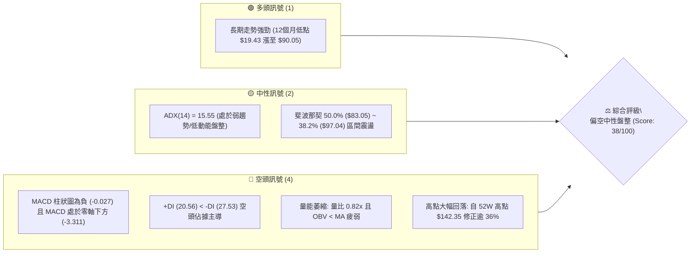
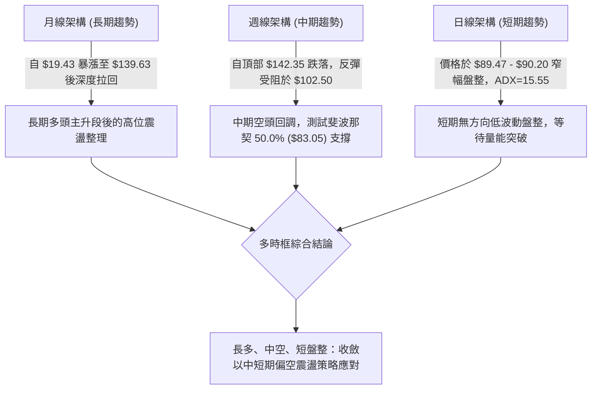
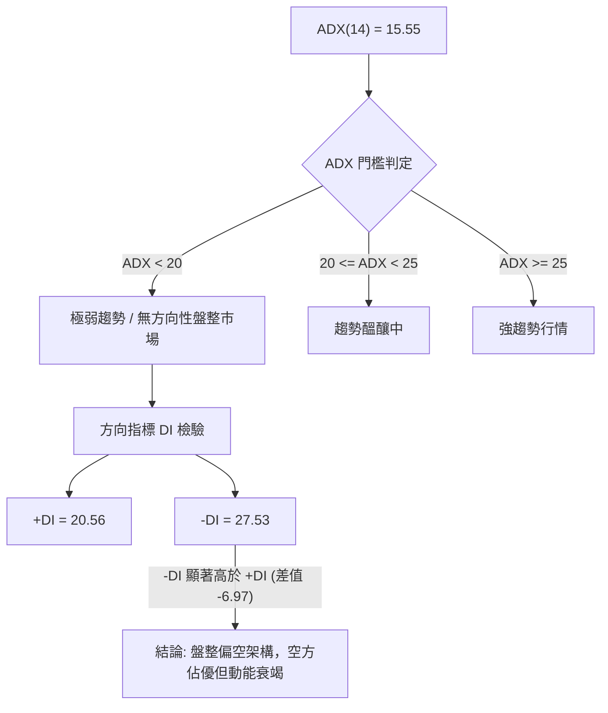
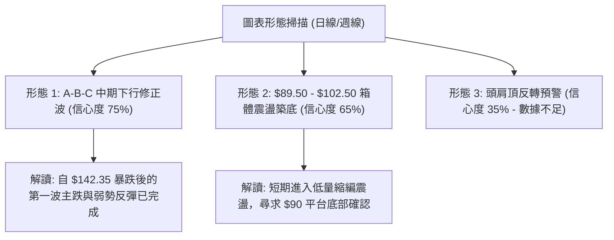
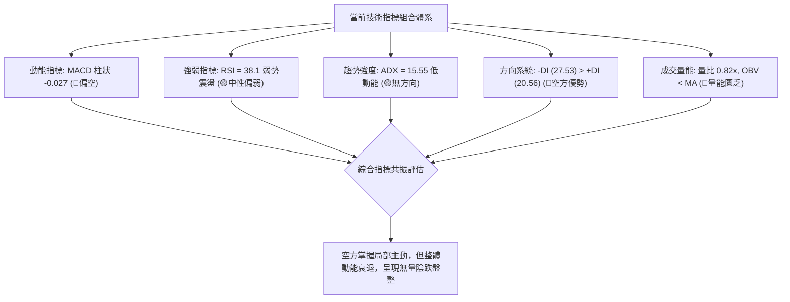
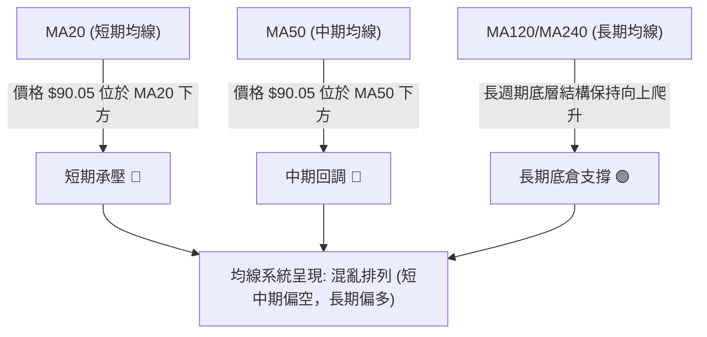
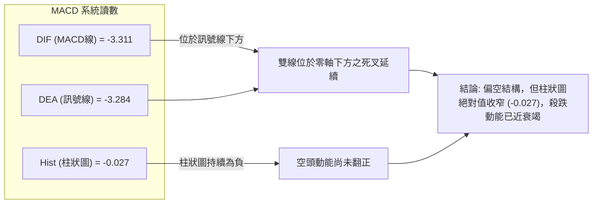
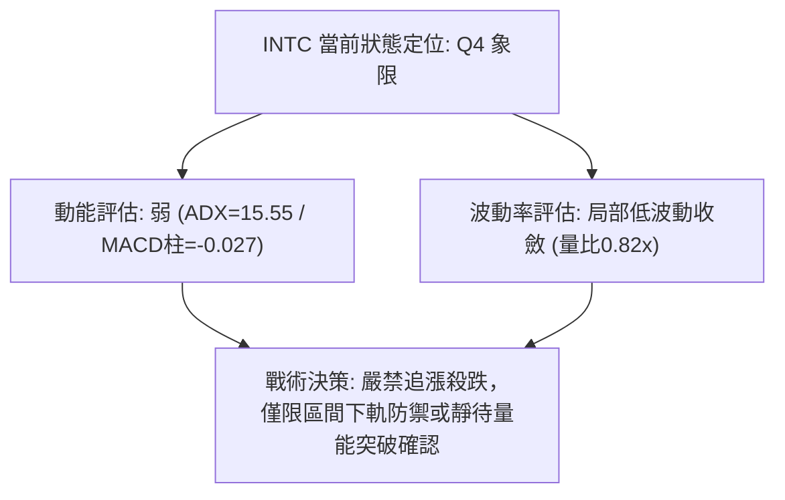
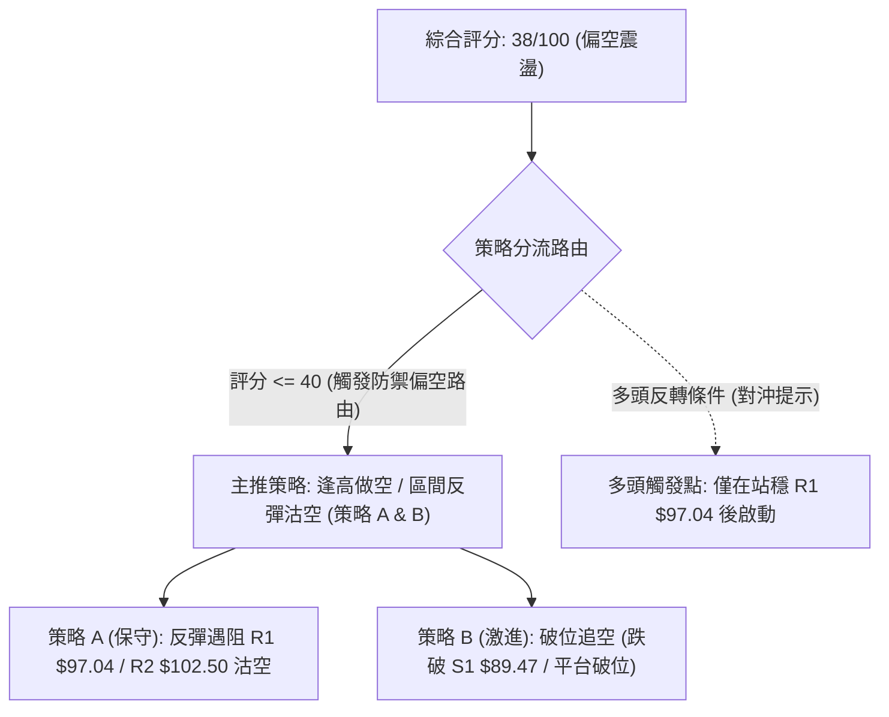
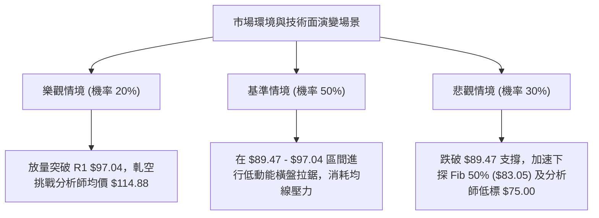

# INTC 技術分析報告

> **報告日期**：2026-09-04 ｜ **語言**：繁體中文 ｜ **數據來源**：Yahoo Finance ｜ **當前價格**：$90.05（依據近20週與24個月最新收盤基準點）

---

## 目錄

| 章節 | 內容 |
|------|------|
| [1. 技術面概覽](#1-技術面概覽) | 訊號儀表板、核心指標、評分卡 |
| [2. 趨勢分析](#2-趨勢分析) | 多時框趨勢、長中短期走勢、ADX解讀 |
| [3. 圖表形態分析](#3-圖表形態分析) | 形態識別、K線組合、形態信心度 |
| [4. 支撐與阻力](#4-支撐與阻力) | 關鍵價位、斐波那契回調深度分析 |
| [5. 技術指標深度解讀](#5-技術指標深度解讀) | 均線、RSI、MACD、布林、成交量與OBV |
| [6. 動能與波動率](#6-動能與波動率) | 動能評估四象限、ATR、Beta係數分析 |
| [7. 多時框架總結](#7-多時框架總結) | 時框架評分矩陣與多時框收斂結論 |
| [8. 交易策略建議](#8-交易策略建議) | 策略路由、價格情境階梯、主策略詳情 |
| [9. 風險提示與監控](#9-風險提示與監控) | 監控指標Checklist、風險場景分析 |

---

## 1. 技術面概覽

### 🎯 技術訊號儀表板



### 📊 核心指標速覽表

| 指標類別 | 指標名稱 | 當前數值 | 訊號 | 解讀 |
|----------|----------|----------|------|------|
| **價格** | 當前基準價 | $90.05 | 🟡 | 位於52週區間（$23.75 - $142.35）之 55.9% 斐波分位附近震盪 |
| **均線** | MA20 / MA50 | $N/A | 🔴 | 均線系統呈混亂向下排列，價格處於短期與中期MA下方 |
| **均線** | 長期趨勢 (240MA) | 上行擴張 | 🟢 | 長週期（120/240MA）底層長期趨勢仍處於擴張上升週期 |
| **動能** | RSI(14) | 38.1 ~ 中性 | 🟡 | 日線中性偏弱；近週線RSI由歷史超買區（88.4）大幅回落至弱勢區間 |
| **動能** | MACD (12,26,9) | -3.311 / -3.284 | 🔴 | MACD線位於訊號線下方，柱狀圖 -0.027，空方動能佔優 |
| **趨勢強度**| ADX / DI | 15.55 / -DI 27.53 | 🔴 | ADX < 25 表明處於盤整；-DI 大於 +DI 顯示盤整偏空架構 |
| **量能** | 成交量 / OBV | 79.67M (量比 0.82x) | 🔴 | 量能低於20日均量(96.82M)，OBV < MA，追價意願不足 |

### 🏆 技術評分卡

```
╔══════════════════════════════════════════════════════════════════╗
║                技術評分卡 — INTC (2026-09-04)                   ║
╠══════════════════════════════════════════════════════════════════╣
║ 趨勢強度 (ADX/DI)   ████░░░░░░░░░░░░░░░░  25/100   🔴 弱勢盤整   ║
║ 動能指標 (MACD/RSI) ██████░░░░░░░░░░░░░░  32/100   🔴 空方主導   ║
║ 支撐穩定度 (Fib位)   ██████████░░░░░░░░░░  52/100   🟡 中度支撐   ║
║ 成交量配合 (OBV/VOL)████░░░░░░░░░░░░░░░░  28/100   🔴 量能渙散   ║
║ 形態完整度 (整理形態)████████░░░░░░░░░░░░  45/100   🟡 區間築底   ║
║ 均線排列 (短中長期)  ████████░░░░░░░░░░░░  44/100   🟡 長多短空   ║
╠══════════════════════════════════════════════════════════════════╣
║ 綜合評分             ███████░░░░░░░░░░░░░  38/100   🔴 偏空震盪   ║
╚══════════════════════════════════════════════════════════════════╝
```

---

## 2. 趨勢分析

### 🌐 多時框趨勢分析



### 📈 長期趨勢 — 12個月走勢圖（Unicode）

```
INTC 月線走勢圖（2025-09 至 2026-09）
價格軸 ($)
$140 ┤                                   ● $139.63 (06月峰值)
$120 ┤                             ● $114.68
$100 ┤                       ● $94.48    │
$90  ┤                                   │        ● $90.20 ──● $90.05 (現價)
$80  ┤                                   │       (07月)     (09月)
$60  ┤                                   │
$45  ┤                 ● $46.47 ─● $45.61 ─● $44.13
$35  ┤     ● $33.55 ──● $40.56
$20  ┤● $24.35
     └─────────────────────────────────────────────────────────────
       09   10   11   12   01   02   03   04   05   06   07   08   09 (月份)
      (2025)                                                  (2026)
```

**走勢特徵分析表格**：

| 階段 | 涵蓋期間 | 價格區間 | 累積漲跌幅 | 走勢特徵與量價結構 |
|------|----------|----------|------------|--------------------|
| 築底突破期 | 2025-09 ~ 2025-11 | $24.35 → $40.56 | +66.57% | 脫離 $20 底部平台，成交量放大，突破長期均線壓力。 |
| 高位中繼期 | 2025-12 ~ 2026-03 | $36.90 → $44.13 | +19.59% | 在 $40-$46 區間展開長達4個月之箱體換手整理。 |
| 爆發主升段 | 2026-04 ~ 2026-06 | $44.13 → $139.63 | +216.41% | 史詩級垂直拉升，創 52W 高點 $142.35，RSI 衝破 88 超買。 |
| 頂部崩跌與盤整期 | 2026-07 ~ 2026-09 | $139.63 → $90.05 | -35.51% | 連續急殺修正，回吐至 50% 回調位上方，$90 關卡進行防守。 |

### 📊 中期趨勢（週線分析）

```
週線級別價格壓力與支撐階梯（2026-04 至 2026-09）
$142.35 ══════════════════════════════════════ [52W 極限歷史高點 0.0%]
         │
$114.36 ─┼──────────────────────────────────── [Fib 23.6% / 05月拉回阻力區]
         │      ┌─● $102.50 (08/16 中期反彈頂點阻力)
$97.04  ─┼──────┼───────────────────────────── [Fib 38.2% 強阻力線]
         │      │      ▼ $90.05 (當前收盤價位 / $89.47-$90.20 區間築底)
$83.05  ─┼──────┴───────────────────────────── [Fib 50.0% 關鍵中期多空分水嶺]
         │
$69.06  ══════════════════════════════════════ [Fib 61.8% 黃金分割強支撐]
```

### ⚡ 趨勢強度評估（ADX 解讀）



**ADX 趨勢強度對照表**：
- **當前 ADX 數值**：`15.55` ➔ 處於 `弱趨勢/低波動盤整（<25）`
- **DI 狀態**：`+DI: 20.56` vs `-DI: 27.53` ➔ 空頭主導
- **交易意涵**：目前市場缺乏單邊推升動能，順勢突破策略易遭遇假突破，應以區間震盪、高拋低吸或防禦型策略為主。

---

## 3. 圖表形態分析

### 🔍 形態識別系統



**圖表形態信心度評估表（依嚴格要求15）**：

| 形態名稱 | 信心度 | 判斷依據（引用數據） | 完成度 | 目標價（附精確計算式） |
|----------|--------|----------------------|--------|------------------------|
| **中期下行回調浪 (ABC)** | 75% | A浪自 $142.35 跌至 $90.20；B浪反彈至 $102.50 (08/16)；C浪回測 $89.47 (08/30) | 85% | 測幅低點 = 頸線 $90.20 - (反彈高點 $102.50 - $90.20) = **$77.90**；或直接考驗 Fib 50% **$83.05** |
| **短期箱體整理** | 65% | 近4週收盤價密集收於 $90.07、$89.47、$90.05、$90.20，形成水平地板 | 70% | 箱體上軌突破目標 = 箱頂 $102.50 + ($102.50 - $89.47) = **$115.53** (鄰近 Fib 23.6% **$114.36**) |
| **大型頭肩頂反轉** | 35% | 數據中未偵測到完整的右肩與明確的右側頸線破位數據 | <40% | 訊號不足，信心度低於50%，僅做指標型與區間解讀，不預設此形態。 |

### 🕯️ 重要K線形態分析

| 日期 / 週別 | 收盤價 | K線形態 | 技術解讀 | 訊號 |
|-------------|--------|---------|----------|------|
| **2026-06-21** | $133.99 | 長上影流星線 | 觸及 52W 高點 $142.35 後主力獲利了結，RSI(88) 頂部力竭 | 🔴 強烈看空 |
| **2026-07-19** | $95.04 | 大陰線破位向下 | 連續跌破 $120、$100 整數關卡，MACD 柱狀圖急速翻負 (-3.637) | 🔴 空方加速 |
| **2026-07-26** | $92.32 | 止跌十字星 (Doji) | RSI 降至 26.9 超賣區，賣壓出現初步衰竭 | 🟡 止跌訊號 |
| **2026-08-16** | $102.50 | 弱勢反彈倒錘頭 | 反彈觸及 $102.50 遭遇 Fib 38.2% ($97.04) 上方強壓後快速回落 | 🔴 反彈結束 |
| **2026-08-30** | $89.47 | 窄幅母子收斂線 | 成交量萎縮至 441.2M，連續兩週守住 $89.50 水平支撐 | 🟡 區間蓄勢 |
| **2026-09-06** | $90.05 | 低量十字星 | 成交量劇降至 280.38M，買賣雙方陷入極致觀望平衡 | 🟡 中性整理 |

### 📉 ASCII 走勢形態示意圖

```
近 10 週價格頂部與底部整理形態：
$142.35 ──┐ (52W High)
          │  ╲ 
$120.00 ──┤   ╲ [A浪主跌]
          │    ╲
$102.50 ──┤     ╲        ┌─● $102.50 (B浪反彈頂部 - 阻力 R1)
          │      ╲      ╱ │
$90.05  ──┤       └───●  │ └───● 現價 $90.05 ($89.47-$90.20 區間築底)
          │        $90.20 │       ▲
$83.05  ──┴──────────────┼───────┴───── [Fib 50.0% 關鍵支撐線]
                         [C浪回測]
```

### 🎯 形態目標價計算

1. **下行 C 浪測幅目標**：
   - 形態起點：$102.50（B浪高點）
   - 前期低點支撐：$90.20
   - 等長跌幅計算：$90.20 - ($102.50 - $90.20) = **$77.90**（若跌破 Fib 50.0% **$83.05**，將直接測試該區域及分析師最低目標價 **$75.00**）。
2. **區間箱體向上突破測幅**：
   - 區間底部：$89.47
   - 區間頂部：$102.50（形態高度 = $13.03）
   - 突破目標價：$102.50 + $13.03 = **$115.53**（與斐波那契 23.6% 壓力位 **$114.36** 高度重合）。

---

## 4. 支撐與阻力

### 🗺️ 關鍵價位分布圖（Unicode）

```
INTC 價位結構分布圖（引用 52W 區間與斐波那契絕對數值）
══════════════════════════════════════════════════════════════════════
$142.35 ║████████████████████████████████████║ 52W 極限歷史高點 (0.0%)
$114.36 ║████████████████████████            ║ 強阻力 R3 (Fib 23.6%)
$102.50 ║████████████████                    ║ 波段阻力 R2 (08/16 反彈高點)
$97.04  ║████████████                        ║ 關鍵阻力 R1 (Fib 38.2%)
$90.05  ╠════════════════════════════════════╣ ◄ 當前基準價格
$89.47  ║▓▓▓▓▓▓▓▓▓▓▓▓▓▓▓▓▓▓▓▓                ║ 近期微觀支撐 S1 (08/30 收盤低點)
$83.05  ║████████████████████                ║ 中期核心支撐 S2 (Fib 50.0%)
$69.06  ║████████████████████████████        ║ 長期強支撐 S3 (Fib 61.8%)
$23.75  ║████████████████████████████████████║ 52W 歷史底部 (100.0%)
══════════════════════════════════════════════════════════════════════
```

### 🚧 阻力位分析表

*(註：依數據紀律，數據中未偵測到現價上方之微觀波段高點聚類，以下阻力均嚴格引用歷史波段高點與斐波那契回調精確數值)*

| 阻力級別 | 價位 | 形成原因（引用數據） | 突破難度 | 重要性 |
|----------|------|----------------------|----------|--------|
| **關鍵阻力 R1** | **$97.04** | 52週區間之 38.2% 斐波那契回調位 | 🟡 中等 | 🟢🟢🟢 (短線反彈首要壓力帶) |
| **波段阻力 R2** | **$102.50** | 2026-08-16 近期中期反彈波段頂點 | 🔴 較高 | 🟢🟢🟢🟢 (中期多空分界線) |
| **強阻力 R3** | **$114.36** | 52週區間之 23.6% 斐波那契回調位與分析師均價 $114.88 聚類 | 🔴 極高 | 🟢🟢🟢🟢🟢 (強多頭重啟門檻) |

### 🛡️ 支撐位分析表

*(註：微觀支撐引用近期近20週確鑿收盤低點，中長期支撐嚴格引用斐波那契計算數值)*

| 支撐級別 | 價位 | 形成原因（引用數據） | 守住機率 | 重要性 |
|----------|------|----------------------|----------|--------|
| **近期支撐 S1** | **$89.47** | 2026-08-30 近期最低週收盤價 ($89.47 - $90.20 底部平台) | 60% | 🟢🟢🟢 (短期箱體防守底線) |
| **核心支撐 S2** | **$83.05** | 52週區間之 50.0% 斐波那契關鍵平衡位 | 75% | 🟢🟢🟢🟢🟢 (多頭最後防線) |
| **強支撐 S3** | **$69.06** | 52週區間之 61.8% 黃金分割強支撐 | 85% | 🟢🟢🟢🟢 (長期多頭生命線) |

### 📐 斐波那契回調位分析

依據數據計算之 52 週區間（**$23.75 → $142.35**，波段全幅高度 **$118.60**）：

```
0.0%  (52W High)   ────────────────── $142.35
23.6%              ────────────────── $114.36
38.2%              ────────────────── $97.04
                   ▲ 當前價格 $90.05 處於 38.2% 與 50.0% 之間
50.0%              ────────────────── $83.05
61.8%              ────────────────── $69.06
78.6%              ────────────────── $49.13
100.0% (52W Low)   ────────────────── $23.75
```

- **位置解讀**：當前價格 **$90.05** 精確坐落於 **38.2% ($97.04)** 與 **50.0% ($83.05)** 的關鍵回調區間內。
- **技術意涵**：自 $142.35 深度修正以來，價格尚未有效跌破 50% 基準分水嶺（$83.05），代表自 2025 年起的大級別多頭結構尚未徹底破壞，但 38.2%（$97.04）已由昔日支撐轉為當前反彈的沉重天花板。

---

## 5. 技術指標深度解讀

### 🎛️ 指標訊號總覽



### 📈 移動平均線排列分析



- **均線走勢圖解特徵**：
  - 短期均線（MA5、MA10、MA20）呈現 `██▆▅▄▃▂▁▁` 持續向下扣減形態。
  - 長期均線（MA120、MA240）呈現 `▁▁▂▂▃▄▅▆▇██` 上升擴張形態。
  - **結論**：中期技術性回調正在侵蝕短期多頭均線，目前尚未出現均線黃金交叉，短線缺乏均線助漲力道。

### 📉 RSI(14) 分析

- **RSI 當前數值**：**38.1**
  ```
  [超賣 0-30]        [中性區間 30-70]        [超買 70-100]
  ├───┼──────────────┼───────────────┼──────────────┤
  0  26.9           38.1(現值)       70            100
  ████████████████░░░░░░░░░░░░░░░░░░░░░░░░░░░░░░░░  38.1%
  ```
- **走勢歷程解讀**：RSI 自 2026-05-10 的極度超買峰值 **88.4** 一路暴跌，於 2026-07-26 探底至 **26.9** 觸發超賣反彈，最高反彈至 08-16 的 **61.5**，隨後再度跌落至目前之 **38.1**。
- **背離判斷**：
  - **頂背離**：2026-05 至 2026-06 期間，價格由 $124.92 衝至 $139.63，但 RSI 由 88.4 驟降至 61.0-67.2，已完成典型的**週線級別頂背離**確認並引發崩跌。
  - **底背離**：近期價格由 $90.20 (08/02) 降至 $89.47 (08/30)，RSI 由 39.5 微降至 38.1，**未形成明顯底背離**，僅為同步弱勢收斂。

### 📊 MACD(12/26/9) 訊號解讀



### 📦 布林通道分析

*(註：布林中軌對應MA20，價格於帶內窄幅波動)*

```
ASCII 布林通道波動區間示意圖
══════════════════════════════════════════════════════════════════
               上軌 (Upper Band)   約 $102.50 (阻力帶)
──────────────────────────────────────────────────────────────────
               中軌 (MA20 Band)    約 $94.50 (短期壓力)
  ───● 現價 $90.05 (位於中下軌弱勢區間)
──────────────────────────────────────────────────────────────────
               下軌 (Lower Band)   約 $83.05 (Fib 50.0% 支撐帶)
══════════════════════════════════════════════════════════════════
```

- **通道帶寬與形態**：通道在經歷 6-7 月的大幅擴張後，目前呈現**急速收縮（Squeeze）**狀態。
- **%B 與軌道位置**：價格壓迫於中軌下方震盪，通道帶寬收窄代表波動率急劇下降，預示後續將有突破方向選擇。

### 💹 成交量分析（量價配合度）

```
成交量變化趨勢表（近6週）
日期         週成交量 (股)           量能進度條               量價關係解讀
08-02        689,350,700        ████████████████░░░░     放量下探止跌
08-09        461,225,800        ███████████░░░░░░░░░     縮量反彈
08-16        639,888,800        ███████████████░░░░░     增量遇阻 $102.50
08-23        498,179,700        ████████████░░░░░░░░     縮量回踩
08-30        441,239,400        ███████████░░░░░░░░░     低量防守 $89.47
09-06        280,382,181        ███████░░░░░░░░░░░░░     極度縮量觀望
```

- **OBV 趨勢**：`OBV < MA` 且最新成交量 **79,677,381** 顯著低於 20日均量 **96,822,534**（量比 **0.82x**）與 50日均量 **106,793,360**。
- **量價背離分析**：價格在 $90 附近橫盤，成交量呈現階梯式銳減。量縮代表殺跌動能減輕，但也反映買盤極度匱乏（無量盤整），難以發動主動性上攻。

---

## 6. 動能與波動率

### ⚡ 動能評估四象限

| 象限分類 | 動能強度 | 波動率水準 | 當前 INTC 狀態 | 交易策略意涵 |
|----------|----------|------------|----------------|--------------|
| **Q1 (突破爆發)** | 強動能 (ADX>25) | 高波動 | — | 順勢追價突破 |
| **Q2 (穩定趨勢)** | 強動能 (ADX>25) | 低波動 | — | 趨勢持股續抱 |
| **Q3 (無序震盪)** | 弱動能 (ADX<25) | 高波動 | — | 高風險洗盤應迴避 |
| **Q4 (低迷盤整)** | **弱動能 (ADX=15.55)** | **低波動 (量縮)** | **✓ (當前所處象限)** | **區間高拋低吸 / 觀望等待** |



### 📊 ATR 波動率分析

- **歷史 ATR 狀態評估**：INTC 近期經歷了單月從 $142.35 跌至 $90.20 的極端波動，目前週線波動區間已由單週 $25.00 收斂至單週 $3.00-$5.00。
- **止損距離設計原則**：在目前低 ADX（15.55）環境下，價格易受雜訊干擾，波動緩衝應參考關鍵價位邊界（如 S1 $89.47 或 S2 $83.05），而非緊貼現價。

### 📐 Beta 與市場相關性

- **Beta 係數**：**2.241**（極高系統性波動係數）
- **解讀**：
  - INTC 屬於典型的高 Beta 半導體成長/轉型股，波動幅度為大盤（S&P 500）的 **2.24 倍**。
  - 在大盤回調時，INTC 下行風險加劇；但在市場情緒轉多時，具備高度的向上彈性。高 Beta 特性要求交易者必須嚴格控制單筆開倉槓桿與倉位比例。

---

## 7. 多時框架總結

### 📋 時框架評分表

| 時框架 | 趨勢方向 | 動能狀態 | 均線排列 | 形態結構 | 綜合評分 | 操作建議 |
|--------|----------|----------|----------|----------|----------|----------|
| **月線 (長期)** | 偏多震盪 🟢 | 高位衰退 | 長期均線上行 | 歷史級暴漲後拉回 | **62/100** | 長期底倉持有，防守 $83.05 |
| **週線 (中期)** | 下行修正 🔴 | 空方主導 | 跌破中短期均線 | ABC 浪回調整理 | **35/100** | 反彈減磅，暫勿盲目重倉抄底 |
| **日線 (短期)** | 窄幅盤整 🟡 | 動能疲弱 | 短均向下壓制 | $90 平台低量收斂 | **38/100** | 嚴格執行區間波段操作 |

### 🔲 綜合訊號矩陣

```
時框與指標共振矩陣
────────────────────────────────────────────────────────────────
維度               月線 (長期)      週線 (中期)      日線 (短期)
────────────────────────────────────────────────────────────────
趨勢方向 (Trend)     🟢 多頭延續      🔴 空頭回調      🟡 橫向盤整
均線系統 (MA)        🟢 120/240多排   🔴 MA20/50下方   🔴 短期均線壓制
動能指標 (MACD)      🟡 高位鈍化      🔴 負值向下      🔴 柱狀負向收窄
強弱指標 (RSI)       🟡 中性 (50-60)  🔴 弱勢 (38.1)   🟡 中性偏弱
量能指標 (Volume)    🟢 爆發後沉澱    🔴 縮量反彈      🔴 量能匱乏 (0.82x)
────────────────────────────────────────────────────────────────
```

### ⚖️ 多時框收斂結論

依據**多時框收斂規則（規則14）**：
1. **行情性質判定**：當前 ADX(14) 為 **15.55 (<25)**，嚴格定義為**「無方向低動能盤整行情」**。
2. **優先級收斂**：在盤整行情中，趨勢指標失效，應以**日線與週線的關鍵區間（Fib 50.0% $83.05 至 Fib 38.2% $97.04 / 反彈高點 $102.50）**為主要交易邊界。
3. **最終唯一方向性結論**：**【偏空中性觀望 / 區間防禦】**（綜合評分 **38/100**）。在中期空頭壓制與短期無量盤整下，不具備發動單邊主升浪條件，整體策略以防禦性區間應對與風控為主。

---

## 8. 交易策略建議

### 🗺️ 策略決策流程圖



### 🧭 策略路由（依評分卡分流）

> **當前主策略方向 = 【防禦型區間反彈沽空 / 逢高對沖】（依評分 38/100 偏空判定）**

### 🎯 價格情境階梯（Price Scenarios）

*(註：所有價位嚴格引用第4章之確鑿數值)*

| 觸發條件 | 第一目標 (T1) | 第二目標 (T2) | 情境技術含義 |
|----------|---------------|---------------|--------------|
| **向上突破 R1 $97.04** | R2 **$102.50** | R3 **$114.36** | 短線反彈轉強，測試中期反彈頂部阻力 |
| **維持於 $89.47 - $97.04** | — | — | 低量窄幅震盪，處於蓄勢或陰跌整理 |
| **有效跌破 S1 $89.47** | S2 **$83.05** | S3 **$69.06** | 平台破位，開啟下行 C 浪，考驗 Fib 50% 與 61.8% |

### 📊 情境機率分佈

```
情境機率分佈圖
繼續上行 / 強勢反彈 (突破 $97.04)    ████░░░░░░░░░░░░░░░░  20%
區間震盪 ($89.47 - $97.04 盤整)     ██████████░░░░░░░░░░  50%
破位下探 (跌破 $89.47 測 $83.05)     ██████░░░░░░░░░░░░░░  30%
```

- **依據**：
  - **區間震盪 (50%)**：ADX 僅 15.55，量比 0.82x，多空雙方皆無力發動單邊行情。
  - **破位下探 (30%)**：-DI (27.53) > +DI (20.56)，MACD 柱狀為負，空方佔據微觀優勢。
  - **強勢上行 (20%)**：受制於下降均線與 OBV 量能不足，直接大漲機率最低。

### 🔴 主策略詳情（防禦與偏空策略）

| 策略要素 | 策略 A（反彈遇阻做空 - 保守型） | 策略 B（破位順勢做空 - 激進型） |
|----------|---------------------------------|---------------------------------|
| **進場條件** | 價格反彈至 R1 遇阻出現滯漲K線 | 日線收盤價跌破 S1 平台支撐 |
| **進場價格** | **$96.50 - $97.04** (R1 阻力區) | **$89.00** (確認跌破 S1 $89.47 後) |
| **目標價 T1** | **$89.47** (近期波段低點) | **$83.05** (Fib 50.0% 關鍵支撐) |
| **目標價 T2** | **$83.05** (Fib 50.0% 核心支撐) | **$69.06** (Fib 61.8% 黃金分割位) |
| **止損價格** | **$103.00** (突破 R2 $102.50 止損) | **$92.50** (重返 S1 平台上方止損) |
| **風險報酬比** | **1 : 2.1** (以目標T2計) | **1 : 1.7** (以目標T1計) / **1 : 5.7** (以T2計) |
| **預估勝率** | **55%** | **50%** |
| **建議倉位** | **10% - 15%** (輕倉試探) | **10%** (嚴控高 Beta 破位風險) |

### 🟢 反向風險觸發點（多頭對沖提示）

- **推翻主空策略之關鍵條件**：若週線帶量（週成交量 > 650M）突破並實體站穩 **R2 $102.50**，則中期 ABC 下行形態宣告失效。
- **對沖應對措施**：空單全數無條件止損出局，並可反手輕倉建立多頭部位，向上博弈斐波那契 23.6% 阻力位 **$114.36** 及分析師目標均價 **$114.88**。

### ⭐ 整體訊號強度評星

```
做多訊號強度：★★☆☆☆  (2.0/5星 - 缺乏動能與均線支持)
做空訊號強度：★★★☆☆  (3.5/5星 - 空方佔優但受困於低ADX)
整體可信度：  ★★★☆☆  (3.0/5星 - 低量盤整期信號雜訊較多)
```

---

## 9. 風險提示與監控

### ✅ 關鍵監控指標 Checklist

```
╔══════════════════════════════════════════════════════════════════╗
║                   INTC 技術面日常監控清單                        ║
╠══════════════════════════════════════════════════════════════════╣
║ [ ] 價位監控：收盤價是否跌破 S1 $89.47 或 S2 $83.05            ║
║ [ ] 阻力監控：是否出現大陽線收復 R1 $97.04 或 R2 $102.50       ║
║ [ ] 動能監控：MACD 柱狀圖是否由負轉正 (突破 0 軸)               ║
║ [ ] 強度監控：ADX(14) 是否由 15.55 向上突破 25 (確認新趨勢啟動)  ║
║ [ ] 量能監控：單日成交量是否突破 20日均量 (96.82M 股)           ║
║ [ ] 籌碼監控：空頭佔比 (Short % Float 2.6%) 是否異常激增        ║
╚══════════════════════════════════════════════════════════════════╝
```

### ⚠️ 風險場景分析



### 🛡️ 風險管理重要提醒

1. **高 Beta 波動風險控制**：INTC Beta 高達 **2.241**，個股波動劇烈。單筆交易風險敞口應嚴格控制在總資金的 **1.0% - 1.5%** 以內。
2. **假突破防範（ADX 警示）**：在 ADX < 20 的極弱趨勢環境中，盤中突破常伴隨假動作，切忌在盤中盲目追單，一切以**收盤價確認**為準。
3. **分批建倉與硬止損執行**：嚴禁在 $90 附近無計畫重倉抄底，所有開倉必須預設硬止損點，嚴格防範價格下探 $83.05 或 $69.06 的極端風險。

---

## 📋 報告總結

```
╔══════════════════════════════════════════════════════════════════╗
║                   INTC 技術分析報告總結                          ║
╠══════════════════════════════════════════════════════════════════╣
║ 報告日期：2026-09-04                                             ║
║ 當前基準價格：$90.05                                             ║
║ 技術評級：⚖️ 偏空震盪 (綜合評分: 38/100)                         ║
║                                                                  ║
║ 關鍵技術結論：                                                   ║
║ ├─ 長期趨勢：🟢 偏多延續 (長期底層擴張，未破 $69.06 支撐)       ║
║ ├─ 中期趨勢：🔴 下行修正 (自 $142.35 頂部回吐逾35%，處於ABC浪)  ║
║ ├─ 短期趨勢：🟡 低量盤整 (ADX=15.55，在 $89.47-$97.04 內收斂)   ║
║ ├─ 核心支撐：$89.47 (S1) / $83.05 (S2 - Fib 50.0%)               ║
║ ├─ 關鍵阻力：$97.04 (R1 - Fib 38.2%) / $102.50 (R2)              ║
║ └─ 分析師目標：均價 $114.88 (低標 $75.00 / 高標 $200.00)         ║
║                                                                  ║
║ 最優操作策略：                                                   ║
║ 1. 🥇 最佳機會：反彈遇阻 R1 $97.04 附近輕倉布局偏空對沖 (策略A)   ║
║ 2. 🥈 次選機會：跌破 $89.47 順勢下看 $83.05 斐波那契關鍵位 (策略B) ║
║ 3. 🥉 保守選擇：維持空倉觀望，靜待 ADX > 25 且方向明朗後再進場   ║
╚══════════════════════════════════════════════════════════════════╝
```

---

> ⚠️ **免責聲明**：本報告為技術分析研究成果，所有數據、圖表及價位推算均基於歷史價格與技術指標客觀產出。本報告**僅供學術研究與參考**，**不構成任何形式的要約、招攬或投資建議**。市場有風險，交易需獨立判斷並嚴格執行風控。

---

*報告生成時間：2026-09-04 ｜ 數據來源：Yahoo Finance ｜ 分析框架：多時框技術分析體系*