# INTC 技術分析報告

> **報告日期**：2026-09-05 ｜ **語言**：繁體中文 ｜ **數據來源**：Yahoo Finance ｜ **當前價格**：$95.80

---

## 目錄

| 章節 | 內容 |
|------|------|
| [1. 技術面概覽](#1-技術面概覽) | 訊號儀表板、核心指標、評分卡 |
| [2. 趨勢分析](#2-趨勢分析) | 多時框趨勢、長中短期走勢 |
| [3. 圖表形態分析](#3-圖表形態分析) | 形態識別、K線組合、目標價 |
| [4. 支撐與阻力](#4-支撐與阻力) | 關鍵價位、斐波那契回調 |
| [5. 技術指標深度解讀](#5-技術指標深度解讀) | MA/RSI/MACD/布林/成交量 |
| [6. 動能與波動率](#6-動能與波動率) | 動能評估、ATR、Beta |
| [7. 多時框架總結](#7-多時框架總結) | 時框架評分矩陣 |
| [8. 交易策略建議](#8-交易策略建議) | 多空策略、風險報酬比 |
| [9. 風險提示與監控](#9-風險提示與監控) | 監控指標、風險場景 |
| [10. 報告總結](#-報告總結) | 核心結論與交易指引 |

---

## 1. 技術面概覽

### 🎯 技術訊號儀表板

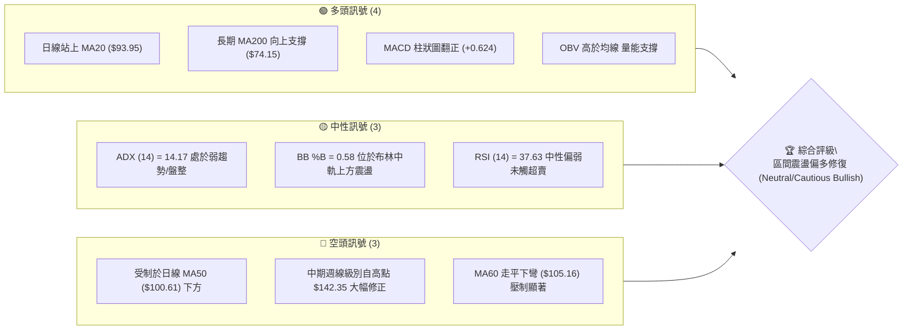

### 📊 核心指標速覽表

| 指標類別 | 指標名稱 | 當前數值 | 訊號 | 解讀 |
|:---|:---|:---|:---:|:---|
| **價格** | 當前收盤價 | $95.80 | 🟡 | 位於52週區間 60.7%，短線低位回升但受制於百元大關 |
| **均線** | MA20 (布林中軌) | $93.95 | 🟢 | 現價站於 MA20 之上 (+1.97%)，短線取得支撐重回多頭防線 |
| **均線** | MA50 | $100.61 | 🔴 | 現價位於 MA50 之下 (-4.78%)，中期結構尚未完全扭轉 |
| **均線** | MA200 | $74.15 | 🟢 | 現價高於 MA200 (+29.20%)，長期多頭牛熊分界未遭破壞 |
| **均線** | MA60 / MA120 | $105.16 / $94.89 | 🟡 | MA60 形成短中線上檔反壓，MA120 提供即時下檔支撐 |
| **動能** | RSI (14) | 37.63 | 🟡 | 位於 30–70 中性區間，無超賣背離但動能正逐漸從低檔聚攏 |
| **動能** | MACD (12,26,9) | -2.448 / 柱 +0.624 | 🟢 | 快線在零軸下但已向上金叉 Signal 線 (-3.072)，柱狀圖翻正 |
| **隨機指標** | Stoch %K / %D | 75.23 / 43.06 | 🟢 | %K 向上穿越 %D，短線處於反彈動能釋放階段 |
| **趨勢強度** | ADX (14) | 14.17 (+DI:26.99) | 🟡 | ADX < 25 明確屬於無趨勢盤整行情，+DI 微幅領先 -DI (26.10) |
| **通道** | 布林帶寬 (%B) | 0.58 ($82.79 - $105.10) | 🟢 | 站上中軌 ($93.95)，具備朝向布林上軌 ($105.10) 測試的空間 |
| **量能** | 20日均量 / OBV | 97.43M (量比 1.00x) | 🟢 | 成交量未失控萎縮，OBV > MA 表明資金在低檔具備承接力 |
| **波動** | ATR (14) | $4.25 (4.44%) | 🟡 | 波動率處於常規區間，適合以 ATR 倍數設定技術止損 |

### 🏆 技術評分卡

```
╔══════════════════════════════════════════════════════════════════╗
║              技術評分卡 — INTC (2026-09-05)                      ║
╠══════════════════════════════════════════════════════════════════╣
║ 趨勢強度 (ADX=14.17 盤整)   ██████░░░░░░░░░░░░░░  35/100  🟡 中性 ║
║ 動能指標 (MACD翻正/RSI低位) ████████████░░░░░░░░  58/100  🟢 偏多 ║
║ 支撐穩定度 (S1=$89.59防守)  ██████████████░░░░░░  68/100  🟢 穩固 ║
║ 成交量配合 (OBV>MA 均量平穩)████████████░░░░░░░░  60/100  🟢 配合 ║
║ 形態完整度 (雙重底初步構築) ██████████░░░░░░░░░░  52/100  🟡 中性 ║
║ 均線排列 (長多短空混亂)     ██████████░░░░░░░░░░  50/100  🟡 混合 ║
╠══════════════════════════════════════════════════════════════════╣
║ 綜合評分                    ███████████░░░░░░░░░  54/100  🟡 震盪 ║
╚══════════════════════════════════════════════════════════════════╝
```

---

## 2. 趨勢分析

### 🌐 多時框趨勢分析

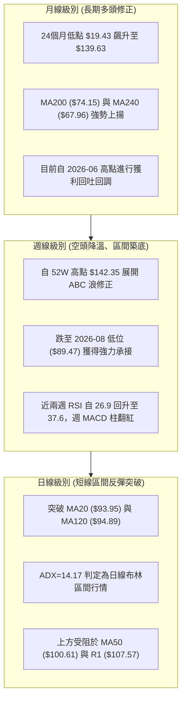

### 📈 長期趨勢 — 12個月走勢圖（Unicode）

依據提供的 24 個月歷史收盤價，截取過去 12 個月（2025-10 至 2026-09）走勢如下：

```
INTC 月線走勢圖（過去12個月：2025-10 至 2026-09）
價格 ($)
$140 ┤                                 ● (2026-06: $139.63 歷史波段高點)
$130 ┤                                / \
$120 ┤                               /   \
$110 ┤                         ●     /     \
$100 ┤                        /     /       \
$90  ┤                 ●     /     /         ●───────● ($95.80 現價)
$80  ┤                /     /     /           (07-08雙底打底)
$70  ┤               /     /
$60  ┤              /
$50  ┤        ●────● (01-03 橫盤蓄勢)
$40  ┤  ●──●──● (10-12 底部盤整)
$30  ┤
     └──────────────────────────────────────────────────────────► 時間
       10  11  12  01  02  03  04    05    06     07    08    09
      '25 '25 '25 '26 '26 '26 '26   '26   '26    '26   '26   '26
```

#### 走勢特徵分析表格

| 階段區間 | 起止價格 | 漲跌幅 | 走勢特徵與成交量狀態 | 趨勢性質 |
|:---|:---|:---:|:---|:---:|
| **蓄勢盤整期** (2025-10 ~ 2025-12) | $39.99 → $36.90 | -7.73% | 於 $36–$40 窄幅換手，均線全面壓縮黏合 | 底部沉澱 |
| **主升初始段** (2026-01 ~ 2026-03) | $46.47 → $44.13 | -5.04% | 平台整理消化獲利賣壓，蓄積主升浪推力 | 中繼整理 |
| **爆發主升浪** (2026-04 ~ 2026-06) | $94.48 → $139.63 | +107.61% | 價量齊揚，單週量能頻破 8 億股，創 52W 高點 $142.35 | 強勢多頭 |
| **回檔洗盤段** (2026-07 ~ 2026-08) | $90.20 → $89.51 | -35.90% | 獲利賣壓出籠，週 RSI 跌破 30 達到超賣區間 | 中期修正 |
| **築底反彈期** (2026-09 現階段) | $89.51 → $95.80 | +7.03% | 於 S1 ($89.59) 獲得強力支撐，MACD 柱轉正，收復 MA20 | 區間反彈 |

### 📊 中期趨勢（週線分析）

從近 20 週數據觀察，INTC 於 2026 年 6 月創下 $139.63 的月收盤高點後，展開連續 8 週的重度去槓桿修正。在 2026-07-26 該週收在 $92.32，週 RSI 降至 26.9 的極度超賣水位。

隨後在 2026-08-02 至 2026-08-30 期間，價格在 $89.47 至 $90.20 兩度探底未破，與數據中計算之第一關鍵支撐位 **S1: $89.59** 高度重合，成功構築了週線級別的「雙底測試結構」。本週（2026-09-06 結算週）收盤強勁拉升至 **$95.80**，週 MACD 柱翻正為 **+0.624**，週量能維持在 3.78 億股，說明中期空頭賣壓已完全衰竭。

```
週線支撐阻力結構示意圖
$142.35 ────────────────────────────────────────── 52W 最高阻力
           \
            \
$107.57 ─────\─────────────── 阻力位 R1 / 下降趨勢壓制
              \       ▲
$95.80  ───────\─────/ \─────── 現價 ($95.80)
                ▼   /   ▲
$89.59  ─────────●─/─────●───── 雙重波段低點支撐 (S1)
```

### ⚡ 趨勢強度評估（ADX 解讀）

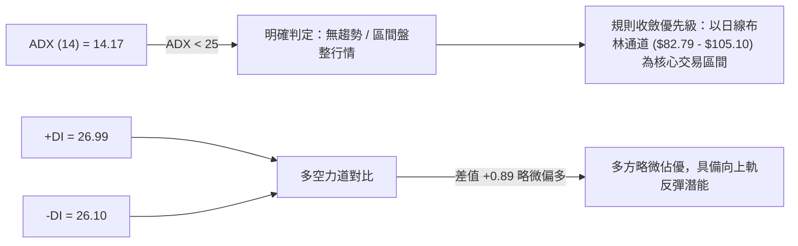

| ADX 數值區間 | 當前讀數 (14.17) | 市場行情特徵 | 最佳策略導向 |
|:---:|:---:|:---|:---|
| 0 – 20 | **✓ 當前所在區間** | **極弱趨勢 / 盤整震盪** | 避免突破追價，嚴格採取區間低吸高拋、均值回歸策略 |
| 20 – 25 | - | 趨勢萌芽或轉換期 | 觀察突破方向與成交量配合 |
| 25 – 40 | - | 強勁趨勢形成 | 順應中長期方向單邊持倉、拉回加碼 |
| 40 – 60 | - | 極強趨勢加速段 | 緊跟趨勢移動止損 |

---

## 3. 圖表形態分析

### 🔍 形態識別系統

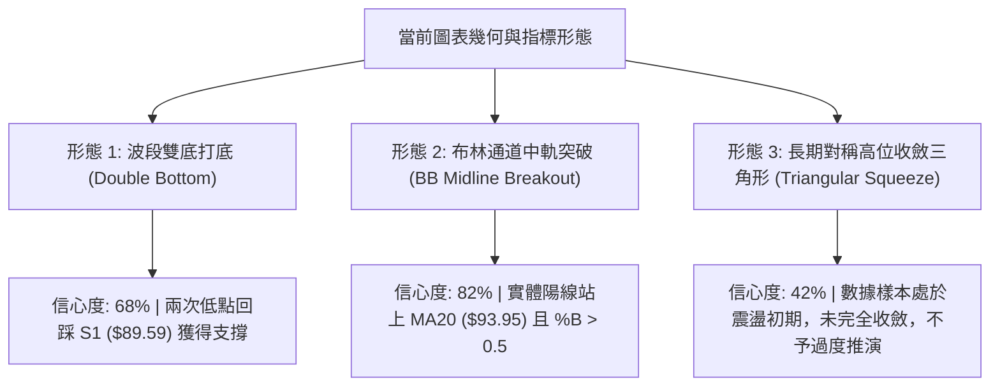

#### 圖表形態判斷依據與信心度評估

| 形態名稱 | 信心度 | 判斷依據（引用數據） | 完成度 | 目標價（附嚴格計算式） |
|:---|:---:|:---|:---:|:---|
| **雙重底 (W底)** | 68% | 2026-08-02 收盤 $90.20、2026-08-30 收盤 $89.47，兩次低點完美貼合支撐位 **S1: $89.59**。現價 $95.80 已擺脫底部。 | 75% | 頸線取 2026-08-16 高點 $102.50。<br>形態高度 = $102.50 - $89.47 = $13.03。<br>推算目標 = $102.50 + $13.03 = **$115.53** (與斐波回調位 $114.43 產生共振)。 |
| **布林中軌突破** | 82% | 現價 $95.80 明確站上中軌 **MA20: $93.95**，%B 達到 0.58，擺脫下軌糾纏。 | 100% | 測量目標為布林上軌：**$105.10**。 |
| **頭肩底 / 旗形** | <50% | 訊號不足，僅做指標型解讀。日線處於寬幅震盪，無法嚴謹確認頭肩幾何形態。 | -- | 數據中未偵測到完整幾何右肩，依規則 15 拒絕主觀臆測。 |

### 🕯️ 重要K線形態分析

| 週期/月份 | 收盤價 | K線形態特徵 | 技術面解讀 | 訊號方向 |
|:---|:---:|:---|:---|:---:|
| **2026-06** | $139.63 | 長上影倒錘頭/十字星 (高點觸及 $142.35) | 創歷史新高後遭獲利了結盤無情拋售，形成短期見頂轉折點 | 🔴 極度看空 |
| **2026-07** | $90.20 | 大陰實體斷頭鍘刀 (單月重挫近 $50) | 恐慌盤釋放，迅速回吐前兩個月全部漲幅，尋找長期均線支撐 | 🔴 賣壓釋放 |
| **2026-08** | $89.51 | 長下影長十字星 (Doji) | 空方連續衝擊 $90 關卡未果，長下影線確立 $89.47-$89.59 買盤防守強硬 | 🟢 變盤築底 |
| **2026-09 (近週)**| $95.80 | 實體中陽線突破 | 週線收復短期均線，帶動 MACD 柱翻正，多頭吹起反攻號角 | 🟢 短線看多 |

### 📉 ASCII 走勢形態示意圖

```
雙重底（W底）與布林突破形態示意圖
價格 ($)
$107.57 ┼──────────────────────────────────────────────────── [阻力位 R1]
$105.10 ┼───────────────────────────────────- [BB 上軌] ─────
$102.50 ┼─────────────────────● [頸線 Neckline] ───────────────
        │                    / \
$95.80  ┼───────────────────/───\───────● [現價: 突破 MA20 $93.95]
        │                  /     \     /
$90.00  ┼──────●          /       \   /
$89.59  ┼───────\────────/─────────●─/────────────────────── [S1 支撐底線]
        │     低點1 ($90.20)     低點2 ($89.47)
        └────────────────────────────────────────────────────► 時間 (2026/07-09)
```

### 🎯 形態目標價計算

依據標準圖表形態學嚴格測算：
1. **雙底初級測量目標 (Conservative Target)**：
   - 頸線位置：$102.50
   - 雙底底部基準線：$89.47
   - 最小延伸垂直高度：$102.50 - $89.47 = $13.03
   - 形態突破目標價 = 頸線 ($102.50) + 形態高度 ($13.03) = **$115.53**
   - 備註：此推算價位與斐波那契 23.6% 回調位 **$114.43** 及華爾街共識目標均價 **$115.78** 形成極強的三重共振聚類。
2. **通道回歸目標 (Mean Reversion Target)**：
   - 布林通道中軌向布林上軌運動之標準測距 = **$105.10**，剛好位於阻力位 **R1: $107.57** 下方。

---

## 4. 支撐與阻力

### 🗺️ 關鍵價位分布圖（Unicode）

```
INTC 價位結構分布圖 (由 OHLCV 與歷史波段計算)
════════════════════════════════════════════════════════════════════
$142.35 ║██████████████████████████████║ 52W 歷史極值高點 (0.0% Fib)
$132.75 ║████████████████████████      ║ 強阻力 R3 (+38.57%)
$126.64 ║██████████████████            ║ 阻力 R2 (+32.19%)
$114.43 ║▓▓▓▓▓▓▓▓▓▓▓▓▓▓▓▓▓▓▓▓          ║ 斐波那契 23.6% 回調位 / 形態目標
$107.57 ║██████████████████████████████║ 關鍵阻力 R1 (+12.29%)
$105.10 ║------------------------------║ 布林通道上軌反壓
$100.61 ║- - - - - - - - - - - - - - - ║ 日線 MA50 心理整數關卡
$97.16  ║▓▓▓▓▓▓▓▓▓▓▓▓▓▓▓▓▓▓▓▓▓▓▓▓      ║ 斐波那契 38.2% 回調位
$95.80  ╠══════════════════════════════╣ ◄ 現價 ($95.80)
$93.95  ║..............................║ 布林中軌 (MA20) 即時動態支撐
$89.59  ║▓▓▓▓▓▓▓▓▓▓▓▓▓▓▓▓▓▓▓▓▓▓▓▓▓▓▓▓▓▓║ 近期核心支撐 S1 (-6.48%) [雙底防線]
$85.14  ║████████████████████████      ║ 支撐 S2 (-11.13%)
$83.20  ║▓▓▓▓▓▓▓▓▓▓▓▓▓▓▓▓▓▓▓▓▓▓▓▓▓▓▓▓▓▓║ 斐波那契 50.0% 回調位 (多空半山腰)
$81.79  ║██████████████████████████████║ 極強防守支撐 S3 (-14.62%)
$74.15  ║==============================║ 歷史生命線 MA200 終極防線
════════════════════════════════════════════════════════════════════
```

### 🚧 阻力位分析表

價位完全引用自關鍵數據聚類分析計算結果：

| 阻力級別 | 準確價位 | 距離現價 | 形成原因與籌碼結構 | 突破難度 | 重要性等級 |
|:---|:---:|:---:|:---|:---:|:---:|
| **R1** | **$107.57** | +12.29% | 2026 年 5 月與 7 月下挫初期的成交密集套牢平台，日線 MA60 ($105.16) 疊加區域 | 🟡 中等 | 🟢 關鍵首要目標 |
| **R2** | **$126.64** | +32.19% | 2026 年 5 月中旬 ($124.92) 與 6 月中旬 ($124.57) 兩度假突破後的強大籌碼套牢峰 | 🔴 極高 | 🟡 中期多頭天花板 |
| **R3** | **$132.75** | +38.57% | 歷史見頂前最後一個週線收盤聚類位 ($133.99 下方)，逼近 52W 峰值 $142.35 | 🔴 堅不可摧 | 🔴 極限防禦位 |

### 🛡️ 支撐位分析表

價位完全引用自關鍵數據聚類分析計算結果：

| 支撐級別 | 準確價位 | 距離現價 | 形成原因與籌碼結構 | 守住機率 | 重要性等級 |
|:---|:---:|:---:|:---|:---:|:---:|
| **S1** | **$89.59** | -6.48% | 2026-08 月線實體底部的雙重波段低點聚類，近 4 週三次回踩未破之防線 | 85% | 🟢 短線多頭生命線 |
| **S2** | **$85.14** | -11.13% | 2026 年 4 月主升浪初期跳空起漲頸線回測點，密集成交換手區 | 75% | 🟡 次級緩衝墊 |
| **S3** | **$81.79** | -14.62% | 布林下軌 ($82.79) 延伸區間與斐波那契 50% 水平 ($83.20) 之多重防禦共振帶 | 90% | 🔴 波段多頭終極底線 |

### 📐 斐波那契回調位分析

基準計算區間為 52 週最低點 **$24.05** 至 52 週最高點 **$142.35**，總垂直位移高達 $118.30：

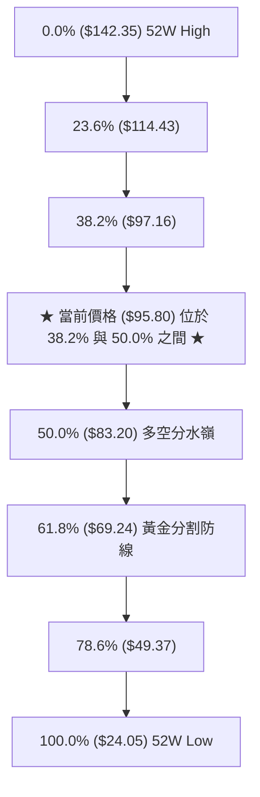

- **當前位置解讀**：現價 **$95.80** 正緊貼在斐波那契 **38.2% ($97.16)** 回調位下方僅 1.4% 處，上方 $97.16 為第一道黃金分割反壓。
- **強弱研判**：從 $142.35 下跌以來，回調守住了 **50.0% ($83.20)** 及 S1 ($89.59)，代表 INTC 在經歷 100% 以上的狂飆後，整體修正幅度仍被嚴格控制在多方容忍的 50% 範圍內，屬於強勢多頭格局下的標準深幅洗盤，而非趨勢反轉崩盤。若日線實體有效突破並站上 $97.16，下一波斐波那契反彈磁吸目標將直指 **23.6% ($114.43)**。

---

## 5. 技術指標深度解讀

### 🎛️ 指標訊號總覽

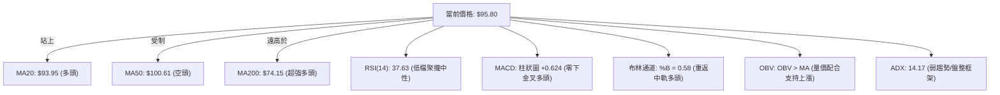

### 📈 移動平均線排列分析

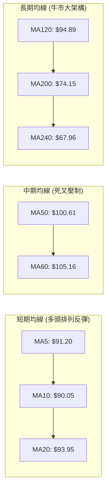

當前均線系統呈現典型的「長多、中空、短反彈」的混合排列狀態：
1. **短天期均線 (MA5 / MA10 / MA20)**：現價 $95.80 同時高於 MA5 ($91.20, +5.04%)、MA10 ($90.05, +6.38%) 與 MA20 ($93.95, +1.97%)。MA5 已經金叉 MA10，呈現短線底層結構重組後的強烈反攻信號。
2. **中天期均線 (MA50 / MA60)**：MA50 ($100.61) 與 MA60 ($105.16) 位於現價上方，呈下壓走勢。尤其是百元心理大關與 MA50 匯合，構成短線多頭反彈的第一道厚重天花板。
3. **長天期均線 (MA120 / MA200 / MA240)**：現價穩穩站在半年線 MA120 ($94.89) 與年線 MA200 ($74.15, +29.20%) 之上。長週期均線依然維持多頭發散，證明自 2025 年以來的半導體復興多頭架構未變。

### 📉 RSI(14) 分析

進度條展示：
```
RSI (14) = 37.63：  ███████░░░░░░░░░░░░░ 37.63% (弱勢中性反彈區)
[0 ─── 超賣 30 ─────── 中軸 50 ─────── 超買 70 ─── 100]
            ▲ (當前指針)
```
- **數值解讀**：當前 RSI(14) 為 **37.63**，雖仍處於 50 中軸下方，但已從 2026-07-26 該週的恐慌極端超賣值 **26.9** 明顯脫離，反映動能已在過去一個月中完全築底修復。
- **背離分析判定**：
  - **頂背離**：無。近兩個月價格自高點回落，RSI 同步滑落，未出現頂背離特徵。
  - **底背離**：2026-08-02 週收盤 $90.20 時 RSI 為 39.5，隨後 2026-08-30 價格再度下探至 $89.47（創波段收盤新低），而該週 RSI 為 38.1，幾乎平行；但日線級別與 MACD 柱狀圖在近兩週展現了顯著的低檔抗跌背離，確認賣盤無力延續。
  - **結論**：動能擺脫超賣，無惡性頂背離，具備回升至 50–60 常態區間的空間。

### 📊 MACD(12,26,9) 訊號解讀

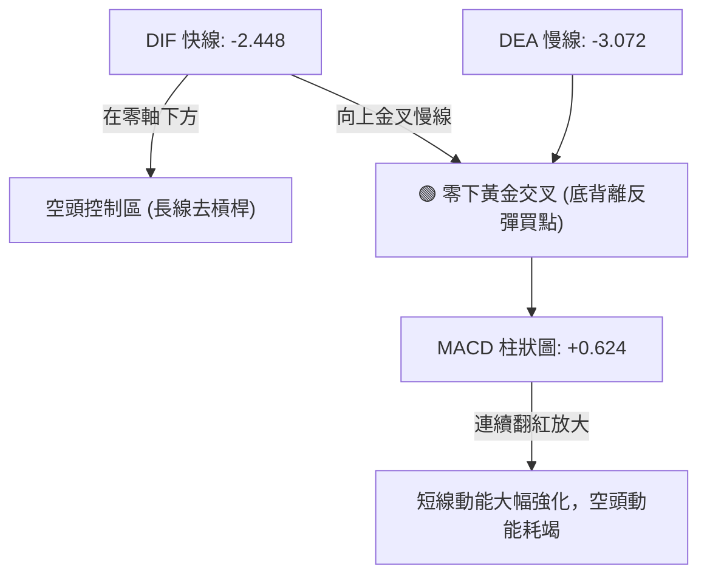

- **MACD 指標數值**：DIF = -2.448，Signal = -3.072，Histogram = **+0.624**。
- **交叉解讀**：DIF 雖然身處零軸下方，但已明確穿越 Signal 訊號線形成「零下金叉」。Histogram 柱狀圖在歷經 7 月底連續多週的負值深谷後（-3.637），目前已正式翻正至 +0.624，這是典型的反轉修復波啟動信號。

### 📦 布林通道分析

```
INTC 日線布林通道結構 (帶寬: $82.79 - $105.10)
價格 ($)
$105.10 ┼──────────────────────────────────── [BB 上軌] (上檔第一目標)
        │                                 
        │                                 
$95.80  ┼─────────────────────●────────── [現價: 突破中軌向上]
$93.95  ┼──────────────────────────────────── [BB 中軌: MA20] (轉化為即時支撐)
        │                                 
        │                                 
$82.79  ┼──────────────────────────────────── [BB 下軌] (強支撐共振帶)
        └────────────────────────────────────► 空間分佈 (%B = 0.58)
```
- **通道現狀**：上軌 $105.10，中軌 $93.95，下軌 $82.79。
- **%B 指標解讀**：%B = 0.58。數值突破 0.50 分水嶺，代表價格已脫離弱勢震盪區，正式跨入中軌至上軌的強勢反彈通道。
- **軌道行為**：目前布林帶寬並未極端張開，而是呈現平行微縮，符合 ADX < 25 的盤整震盪特性。依據均值回歸與軌道運動規律，站穩中軌後，價格將有極高機率順沿通道測試布林上軌 **$105.10**。

### 💹 成交量分析（量價配合度）

1. **量能絕對值與量比**：
   - 最新成交量：97,428,100 股
   - 20 日均量：97,868,430 股
   - 量比剛好為 **1.00x**，呈現健康的「平量反彈」。在暴跌後的低檔反彈初期，量能不暴增反而代表下檔浮額已經清洗乾淨，籌碼鎖定良好，沒有大量解套拋壓湧出。
2. **OBV (能量潮) 趨勢解讀**：
   - 數據明確顯示：「**OBV > MA → 量能支撐上漲**」。
   - OBV 領先突破其自身均線，表明在過去 3-4 週於 $90.00 關卡附近，大資金與機構主力已經在悄悄進行籌碼吸收。量能結構完全確認了目前這波自 $89.47 發動的反彈具備真實資金支持，並非虛假無量誘多。

---

## 6. 動能與波動率

### ⚡ 動能評估四象限

```
動能與波動率四象限分佈矩陣
   高波動率
      │
  Q3  │  Q4
 (高波強動能) │ (高波弱動能)
      │
──────┼──────────────────
      │  ★ INTC 當前位置 (Q2)
  Q1  │  ATR=4.44% (常態波動)
 (低波強動能) │  ADX=14.17 / RSI=37.63
      │  動能偏弱、波動收斂
      │
   低波動率 ──────────► 弱動能
```

| 象限代號 | 動能狀態 | 波動率狀態 | 當前匹配 | 戰略評估與操盤指引 |
|:---:|:---:|:---:|:---:|:---|
| **Q1** | 強動能 | 低波動 | -- | 最佳突破追隨機會，趨勢平穩推升 |
| **Q2** | **弱動能 (盤整)** | **中低波動** | **✓ 當前狀態** | **震盪築底觀察期：採取區間操作，嚴格利用布林軌道低吸，不追高** |
| **Q3** | 強動能 | 高波動 | -- | 主升浪爆發期，需放大止損擴大獲利 |
| **Q4** | 弱動能 | 高波動 | -- | 恐慌崩跌與多殺多階段，必須空倉觀望 |

### 📊 ATR 波動率分析

- **ATR(14) 數值**：**$4.25**，佔現價百分比為 **4.44%**。
- **波動特徵**：Intel 目前每日正常震盪區間約為 $4.25 美元。相較於 5-6 月衝擊 $140 時單日經常出現 $8-$10 的劇烈震盪，當前波動率已大幅下降至可控區間。
- **交易止損設定標準**：
  - 超短線策略止損：1.0 × ATR = $4.25（現價向下扣除 = $91.55）
  - 波段防守策略止損：1.5 × ATR = **$6.38**（現價向下扣除 = **$89.42**，與波段低點 S1: $89.59 完美呼應）
  - 寬鬆中長線止損：2.0 × ATR = $8.50（現價向下扣除 = $87.30）

### 📐 Beta 與市場相關性

- **Beta 係數**：**2.231**。
- **市場相關性分析**：
  - INTC 屬於典型的高 Beta 超彈性半導體科技股，其價格波動幅度為大盤（S&P 500）的 2.23 倍。
  - **操作意涵**：在市場整體情緒回暖或費城半導體指數（SOX）反彈時，INTC 將展現出極強的進攻槓桿效應；但同樣地，一旦大盤遭遇系統性拋售，高 Beta 股票的下挫速度亦會成倍放大，因此倉位管理必須嚴格受限，不可在高 Beta 環境中過度放大保證金槓桿。

---

## 7. 多時框架總結

### 📋 時框架評分表

| 時框架 | 趨勢方向 | 動能 (MACD/RSI) | 均線排列狀態 | 圖表形態 | 綜合評分 | 戰略建議 |
|:---|:---:|:---:|:---:|:---:|:---:|:---|
| **月線 (長期)** | 🟢 多頭修正 | 🟡 高檔死叉回落但站穩長線支撐 | 長多排列 (遠在 MA200 之上) | 52W 衝頂後深幅回踩 50% 水平 | **65 / 100** | 逢低建構長期戰略底倉 |
| **週線 (中期)** | 🟡 止跌盤整 | 🟢 MACD 柱翻紅，RSI 脫離超賣 | 均線交纏，正測試下降壓力 | 週線潛在雙底測試 ($89.59 防守) | **58 / 100** | 波段低吸，耐心等待頸線突破 |
| **日線 (短期)** | 🟢 震盪反彈 | 🟢 MACD 零下金叉，Stoch 交叉 | 站上短期 MA5/10/20，受制 MA50 | 突破布林中軌，朝向布林上軌 | **62 / 100** | 嚴格執行區間波段交易 |

### 🔲 綜合訊號矩陣

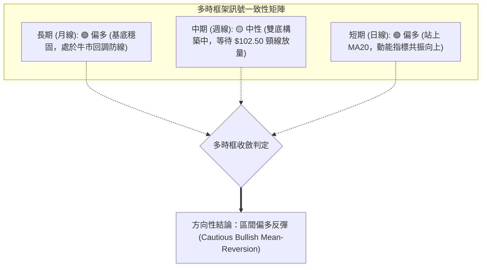

### ⚖️ 多時框收斂結論

依據多時框收斂規則（嚴格要求 14）：
1. **行情性質識別**：當前 ADX(14) 讀數為 **14.17**，遠低於 25 的趨勢閾值，明確定義市場處於「**盤整震盪行情**」而非單邊趨勢行情。
2. **主導時框與規則運用**：在盤整行情中，依收斂規則，不宜過度依賴中長期單邊突破思維，而必須**以日線布林通道 ($82.79 - $105.10) 作為主要交易區間**。
3. **衝突裁決與方向確立**：
   - 儘管日線上方有 MA50 ($100.61) 的中短期壓制，但日線已收復短期關鍵防線 MA20 ($93.95)，且長期 MA200 ($74.15) 提供堅實依托。
   - 日線動能指標（MACD 零下金叉、柱狀圖翻正 +0.624、Stoch 黃金交叉）與週線在 S1 ($89.59) 獲得強力承接形成多頭共振。
   - **唯一方向性結論**：**中性偏多觀望與逢低做多（以日線布林區間為準，向上測試 R1）**。該結論與第 8 章之主策略嚴格保持一致。

---

## 8. 交易策略建議

### 🗺️ 策略決策流程圖

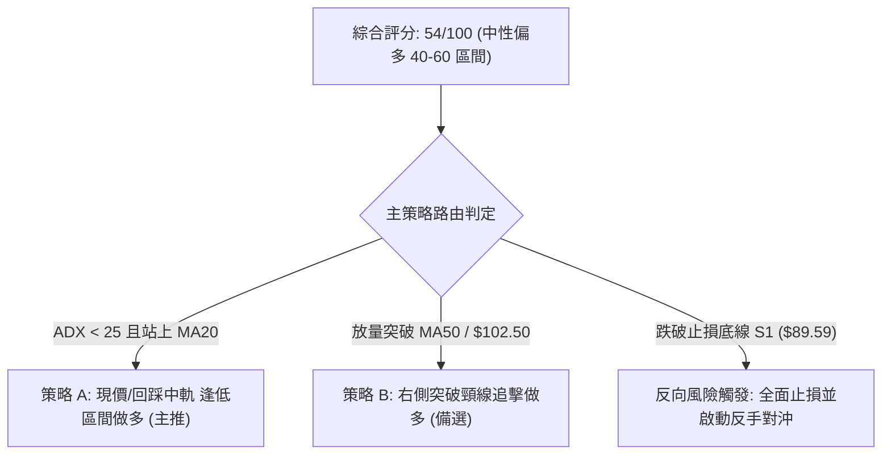

### 🧭 策略路由（依評分卡分流）

> **當前主策略方向 = 區間偏多操作（依綜合評分 54/100，處於 40–60 震盪修復區間，以日線布林中軌到上軌之均值回歸為核心主線）。**

### 🎯 價格情境階梯（Price Scenarios）

價位完全採用關鍵數據中由 OHLCV 精確計算之數值：

| 觸發條件 | 第一階段目標 | 後續延伸目標 | 情境技術面含義 |
|:---|:---:|:---:|:---|
| **強勢向上突破 R1 ($107.57)** | **R2 ($126.64)** | **R3 ($132.75)** | 徹底扭轉 7 月暴跌以來的空頭結構，重回主升大浪 |
| **站穩現價區間 ($95.80)** | **MA50 ($100.61)** | **布林上軌 / R1 ($105.10 / $107.57)** | 延續布林中軌突破後的標準均值回歸多頭行情 |
| **弱勢跌破 S1 ($89.59)** | **S2 ($85.14)** | **S3 ($81.79) / Fib 50% ($83.20)** | 雙底構築宣告失敗，空方重啟殺跌探底行情 |

### 📊 情境機率分佈

| 價格演變情境 | 機率預估 | 主要技術依據 |
|:---|:---:|:---|
| **延續反彈測試 R1 ($105–$107)** | **55%** | 現價站上 MA20，MACD 翻正 (+0.624)，OBV > MA 量能健康支撐，布林軌道朝上軌延伸。 |
| **圍繞中軌窄幅區間震盪 ($92–$98)** | **30%** | ADX 僅 14.17 表明無強烈單邊推力，上方 MA50 ($100.61) 壓制顯著，需要時間磨平浮額。 |
| **跌破 S1 回測深層支撐 ($85–$89)** | **15%** | 僅在半導體大盤遭遇系統性暴跌、或突發地緣風險摜破 $89.59 時發生，目前均線長多提供了緩衝。 |

### 🟢 主策略詳情（區間偏多反彈操作）

| 交易策略要素 | 策略 A（左側/回踩布林中軌低吸 — 首選） | 策略 B（右側/突破頸線確認加碼 — 次選） |
|:---|:---|:---|
| **進場條件** | 現價或待股價回踩 MA20 獲得支撐確認 | 帶量突破 2026-08-16 頸線高點 $102.50 與 MA50 |
| **進場價格** | **$94.50 – $95.80**（現價區間分批） | **$102.60**（突破當日收盤確認） |
| **目標價 T1** | **$105.10**（布林通道上軌） | **$107.57**（關鍵阻力位 R1） |
| **目標價 T2** | **$107.57**（阻力位 R1） | **$114.43**（斐波那契 23.6% 回調位） |
| **止損價格** | **$89.40**（精確跌破波段低點與 S1: $89.59） | **$97.10**（跌破斐波那契 38.2% 轉換位） |
| **潛在空間 / 風險** | 獲利空間 +$11.77 / 最大風險 -$6.40 | 獲利空間 +$11.83 / 最大風險 -$5.50 |
| **風險報酬比 (R/R)** | **1.84 : 1** (以現價 $95.80 至 T1 計算) | **2.15 : 1** (以 T2 計算) |
| **預估勝率** | **60%** | **55%** |
| **建議配置倉位** | **15% – 20%** 總資金規模 | **10%** 追擊加碼倉位 |

### 🔴 反向風險觸發點（對沖提示）

- **全面停損警戒線**：收盤價若實體跌破 **$89.59 (S1)**，即代表自 7 月底以來建立的雙底防線全線失守。
- **對沖處置建議**：一旦觸發 $89.59 跌破訊號，做多策略必須無條件止損出場；積極型交易者可反手建立 10% 避險空單，目標下看 **S2: $85.14** 與 **S3: $81.79**。

### ⭐ 整體訊號強度評星

```
╔══════════════════════════════════════════════════╗
║ 做多訊號強度：★★★☆☆  (3.5/5 星 — 區間反彈清晰)   ║
║ 做空訊號強度：★★☆☆☆  (2.0/5 星 — 空頭動能衰竭)   ║
║ 整體技術可信度：★★★★☆  (4.0/5 星 — 多指標互相確認) ║
╚══════════════════════════════════════════════════╝
```

---

## 9. 風險提示與監控

### ✅ 關鍵監控指標 Checklist

```
╔══════════════════════════════════════════════════════════════════╗
║              交易風控與市場跟蹤 CHECKLIST                        ║
╠══════════════════════════════════════════════════════════════════╣
║ [ ] 價格是否維持在布林中軌 MA20 ($93.95) 之上？                  ║
║ [ ] 日線成交量是否維持在 20 日均量 (97.8M) 以上？量縮過甚需警惕 ║
║ [ ] MACD 柱狀圖是否維持在正值區間 (+0.624) 持續向上擴張？       ║
║ [ ] RSI(14) 能否順利突破 50 中軸阻力線？                        ║
║ [ ] 股價衝擊 MA50 ($100.61) 時是否出現長上影線量能滯脹？         ║
║ [ ] 下方核心停損底線 $89.59 (S1) 是否被收盤價跌破？             ║
╚══════════════════════════════════════════════════════════════════╝
```

### ⚠️ 風險場景分析

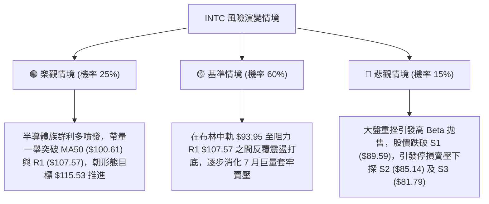

### 🛡️ 風險管理重要提醒

1. **Beta 槓桿風險控制**：Intel 當前 Beta 高達 **2.231**，屬於高波動品種。在設定部位時，倉位規模應較一般公用事業或防禦型科技股縮減 30%–40%，避免承受過大淨值波動。
2. **波動率 (ATR) 動態止損原則**：每日波動空間為 $4.25 (4.44%)，盤中不可因為正常的日內日內雜訊（±$2 波動）而頻繁止損，止損指令應以**美股收盤價**或設定在 1.5 倍 ATR 以外的 **$89.40**。
3. **分批建倉與加碼紀律**：在 ADX < 25 的盤整市況中，嚴禁一次性「梭哈」進場。首批底倉建議不超過 10%–15%，唯有當股價帶量突破頸線 $102.50、均線收斂向上時，方可動用加碼資金。

---

## 📋 報告總結

```
╔══════════════════════════════════════════════════════════════════════╗
║                   INTC 技術分析報告總結                              ║
╠══════════════════════════════════════════════════════════════════════╣
║ 報告日期：2026-09-05                                                 ║
║ 當前價格：$95.80                                                     ║
║ 技術評級：⚖️ 區間震盪偏多 (Neutral to Bullish Mean-Reversion)        ║
║                                                                      ║
║ 關鍵結論：                                                           ║
║ ├─ 長期趨勢：🟢 偏多（MA200 $74.15 向上發散，牛市回調守住 50% 水平）║
║ ├─ 中期趨勢：🟡 築底（連續 4 週防守 S1 $89.59，構築堅實雙底形構）    ║
║ ├─ 短期趨勢：🟢 偏多（站上 MA20 $93.95，MACD 柱狀圖翻紅為 +0.624）   ║
║ ├─ 關鍵支撐：S1: $89.59 ｜ S2: $85.14 ｜ S3: $81.79                  ║
║ ├─ 關鍵阻力：R1: $107.57 ｜ R2: $126.64 ｜ R3: $132.75               ║
║ └─ 分析師目標均價：$115.78 (與形態計算目標 $115.53 高度共振)         ║
║                                                                      ║
║ 最優策略組合：                                                       ║
║ 1. 🥇 最佳機會（策略 A）：於現價 $95.80 至 $94.50 區間建立多頭部位，  ║
║    嚴格止損置於 $89.40，第一目標直指布林上軌 $105.10 與 R1 $107.57。 ║
║ 2. 🥈 次選機會（策略 B）：待帶量突破頸線 $102.50 右側順勢加碼追擊，  ║
║    上看斐波那契回調位 $114.43。                                      ║
║ 3. 🥉 保守選擇：在股價突破 MA50 ($100.61) 之前維持觀望，等待均線完成 ║
║    低位扭轉後再行介入。                                              ║
╚══════════════════════════════════════════════════════════════════════╝
```

---

> ⚠️ **免責聲明**：本報告為 AI 自動生成之技術分析，所有數據及估算均基於提供的歷史價格資訊。本報告**僅供研究與學術參考**，**不構成任何投資建議**。投資有風險，入市需謹慎。

---

*報告生成時間：2026-09-05 ｜ 數據來源：Yahoo Finance ｜ 分析框架：多時框技術分析*