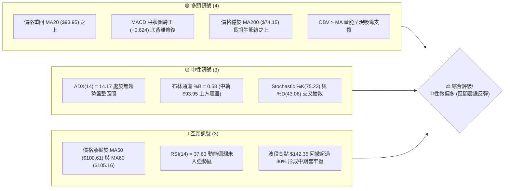
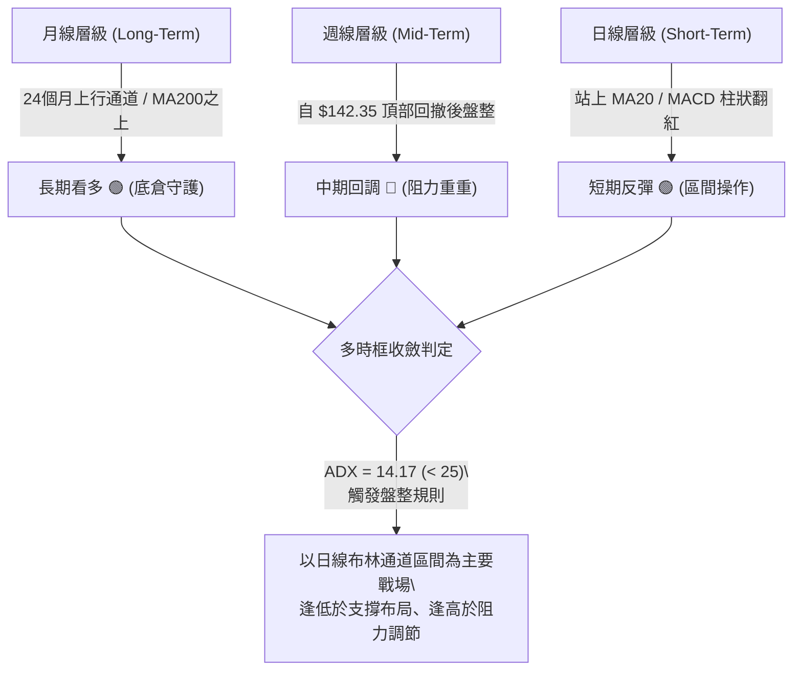
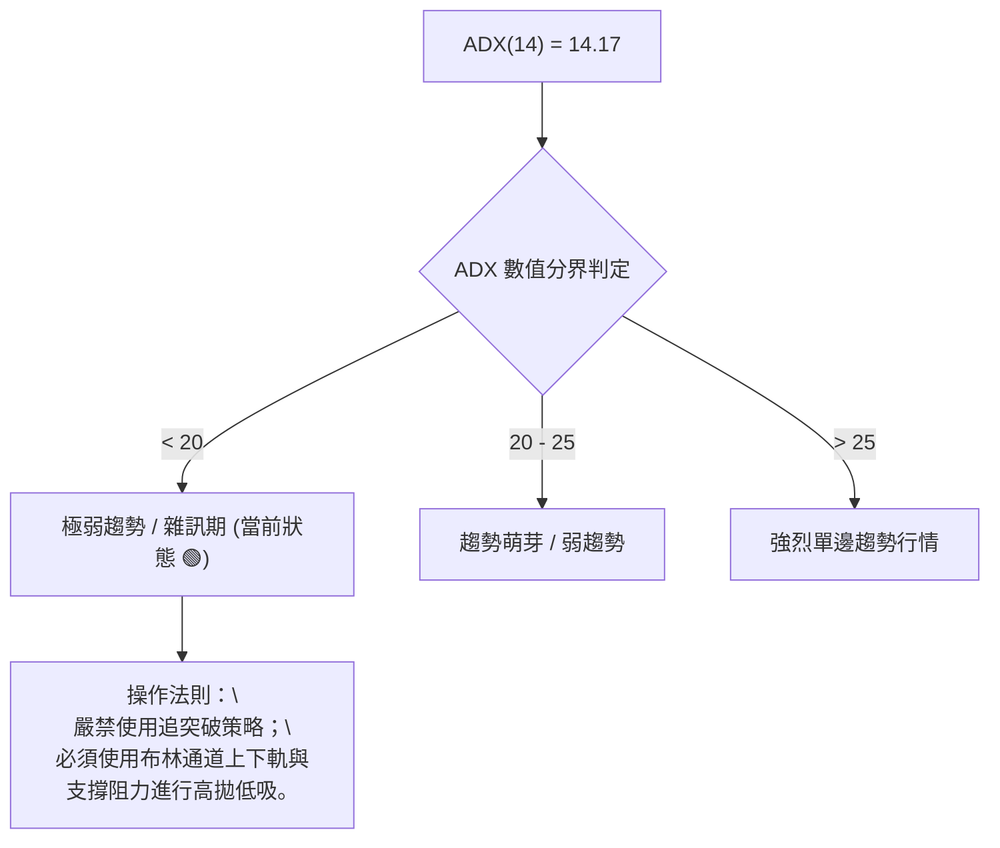
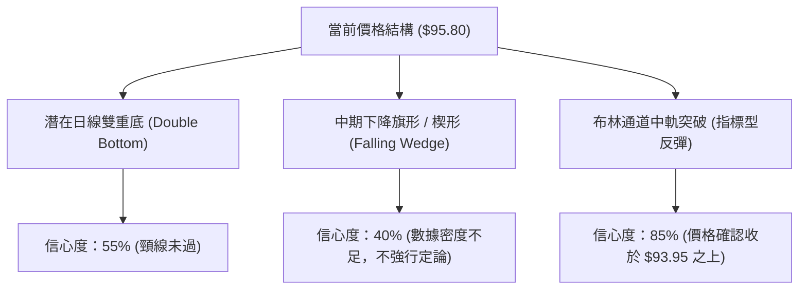
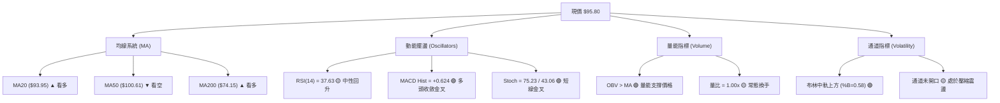
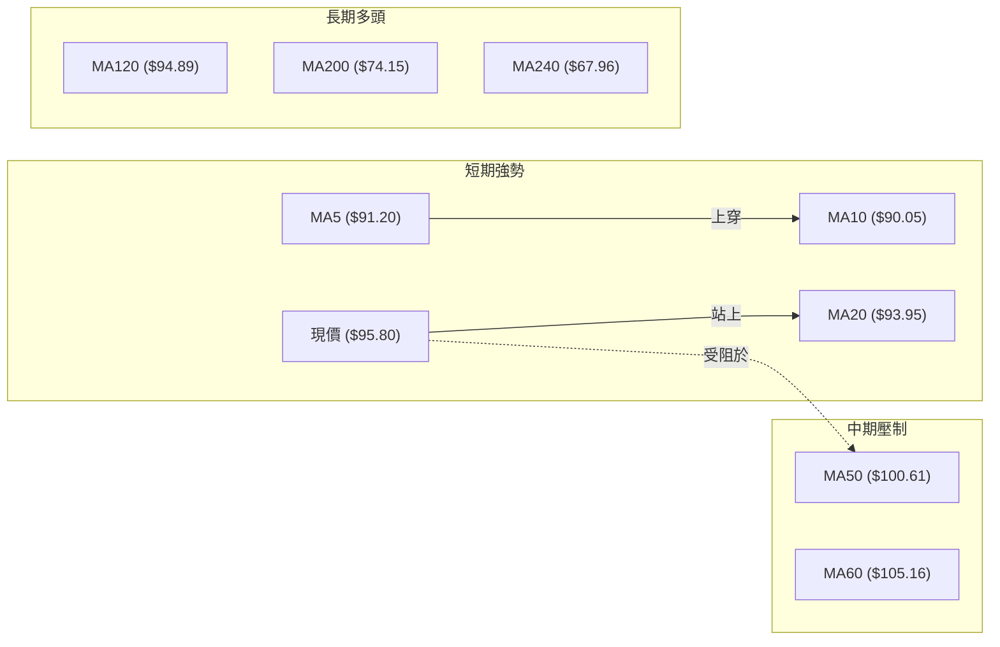
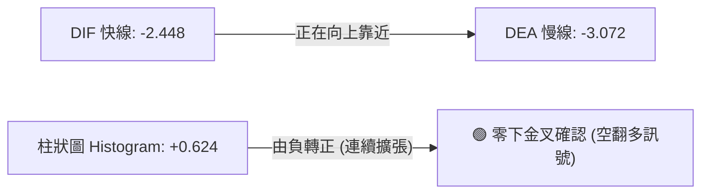
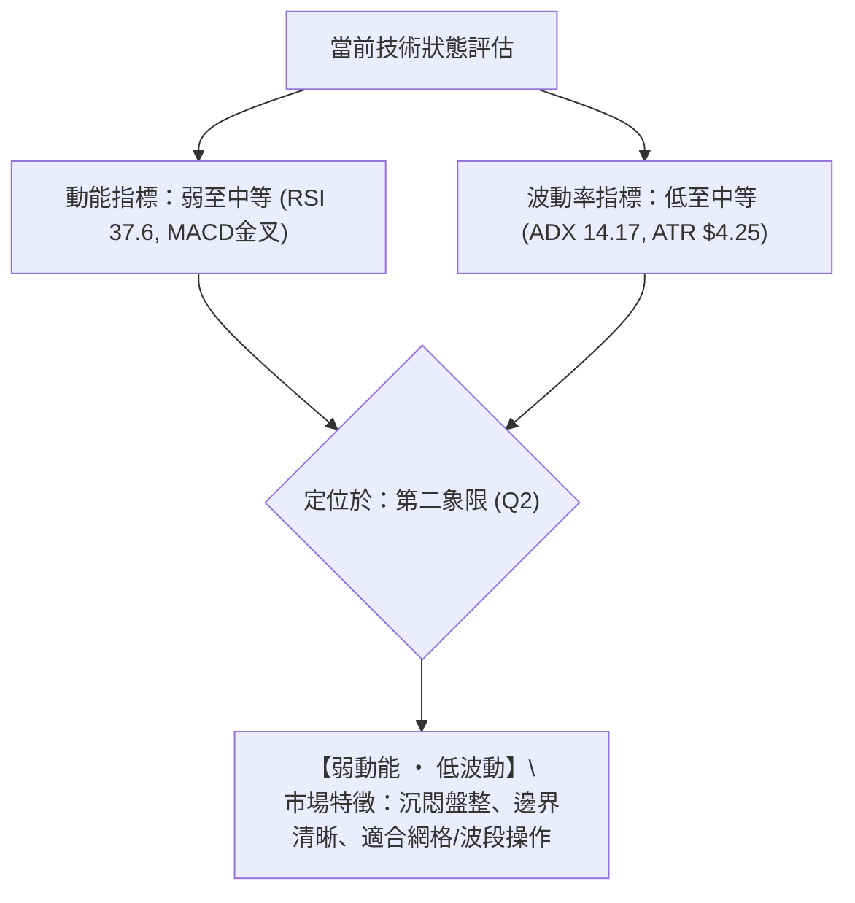
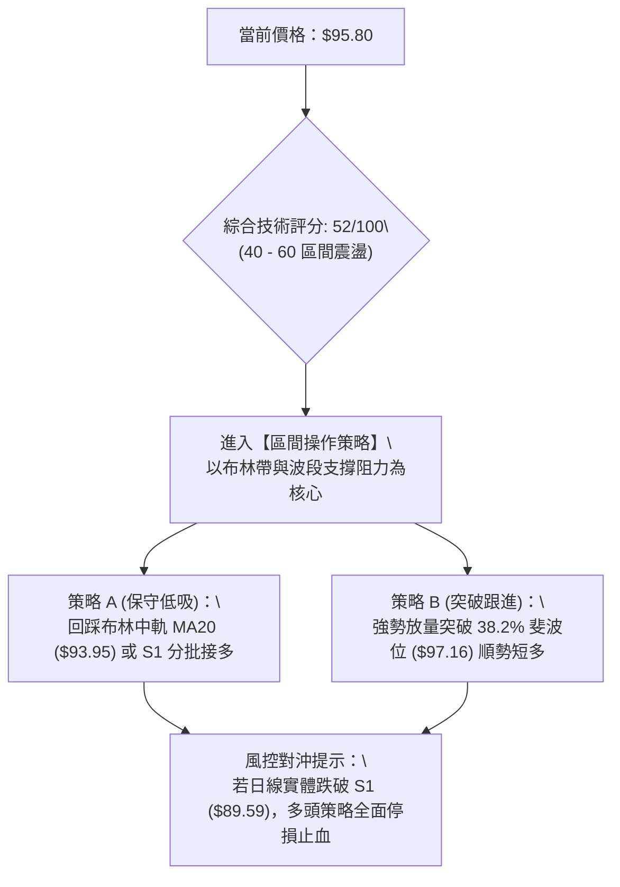
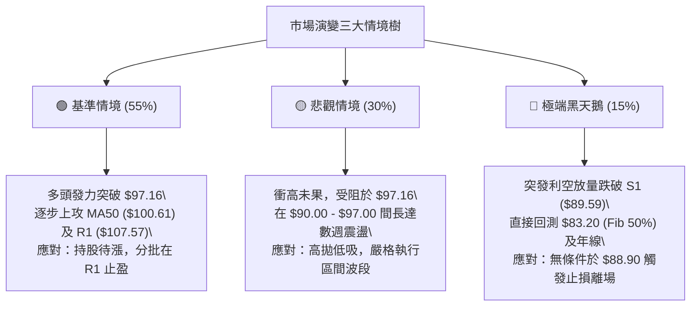

# INTC 技術分析報告

> **報告日期**：2026-09-06 ｜ **語言**：繁體中文 ｜ **數據來源**：Yahoo Finance ｜ **當前價格**：$95.80

---

## 目錄

| 章節 | 內容 |
|------|------|
| [1. 技術面概覽](#1-技術面概覽) | 訊號儀表板、核心指標、評分卡 |
| [2. 趨勢分析](#2-趨勢分析) | 多時框趨勢、長中短期走勢、ADX解讀 |
| [3. 圖表形態分析](#3-圖表形態分析) | 形態識別、信心度評估、K線組合、目標價推算 |
| [4. 支撐與阻力](#4-支撐與阻力) | 結構分布圖、波段阻力與支撐、斐波那契回調 |
| [5. 技術指標深度解讀](#5-技術指標深度解讀) | 均線系統、RSI、MACD、布林通道、OBV量價 |
| [6. 動能與波動率](#6-動能與波動率) | 動能四象限、ATR波動度、Beta係數分析 |
| [7. 多時框架總結](#7-多時框架總結) | 時框評分矩陣、收斂規則與統一結論 |
| [8. 交易策略建議](#8-交易策略建議) | 策略路由、情境階梯、主交易策略、風控對沖 |
| [9. 風險提示與監控](#9-風險提示與監控) | 監控Checklist、風險場景樹、倉位管理準則 |

---

## 1. 技術面概覽

### 🎯 技術訊號儀表板

Intel（INTC）當前收盤價為 **$95.80**，處於 52 週價格區間（$24.05 – $142.35）的 60.7% 位置。技術面呈現「長期多頭支撐未破、中期深幅回檔修正、短期低位盤整反彈」的混合格局。以下為多空指標交叉驗證儀表板：



---

### 📊 核心指標速覽表

| 指標類別 | 指標名稱 | 當前數值 | 訊號 | 專業解讀 |
|----------|----------|----------|:----:|----------|
| **價格結構** | 現價 (Close) | **$95.80** | 🟢 | 站上布林中軌與 MA20，短線築底回升中 |
| **短期均線** | MA20 | **$93.95** | 🟢 | 價格位於均線上方 (+1.97%)，短線支撐確立 |
| **中期均線** | MA50 | **$100.61** | 🔴 | 價格位於均線下方 (-4.78%)，首道整數心理反壓 |
| **中期趨勢** | MA60 | **$105.16** | 🔴 | 價格低於 MA60 (-8.90%)，與布林上軌 ($105.10) 重合壓制 |
| **長期均線** | MA200 | **$74.15** | 🟢 | 價格高於牛熊分界線 (+29.20%)，長線多頭基底完好 |
| **超長均線** | MA240 | **$67.96** | 🟢 | 價格遠高於兩年成本線 (+40.96%)，總體週期向上 |
| **動能震盪** | RSI(14) | **37.63** | 🟡 | 脫離超賣區間向中軸回升，尚未進入強勢多頭 (50+) |
| **趨勢動能** | MACD (12,26,9) | **-2.448 / -3.072** | 🟢 | 柱狀圖 +0.624，零軸下方黃金交叉，空頭動能衰竭 |
| **隨機指標** | Stoch %K / %D | **75.23 / 43.06** | 🟢 | 短線黃金交叉向上發散，短多買盤湧入 |
| **通道指標** | Bollinger Bands | **$82.79 - $105.10** | 🟡 | %B 為 0.58，價格自下軌獲得支撐後向中軌上方推進 |
| **趨勢強度** | ADX(14) | **14.17** | 🟡 | 數值遠低於 25，確認市場處於無明確單邊趨勢之「箱體盤整」 |
| **方向指標** | +DI / -DI | **26.99 / 26.10** | 🟢 | +DI 輕微穿越 -DI，多頭力量暫時取得邊際優勢 |
| **成交量能** | OBV 趨勢 | **OBV > MA** | 🟢 | 量能未隨下跌潰散，低檔換手顯現主力資金支撐 |
| **每日波動** | ATR(14) | **$4.25** (4.44%) | 🟡 | 波動度處於常態水準，提供清晰的止損緩衝空間 |

---

### 🏆 技術評分卡

```
╔══════════════════════════════════════════════════════════════════╗
║              技術評分卡 — INTC (2026-09-06)                     ║
╠══════════════════════════════════════════════════════════════════╣
║ 趨勢強度 (Trend)     ███████░░░░░░░░░░░░░  35/100  🟡 弱勢盤整   ║
║ 動能指標 (Momentum)  ███████████░░░░░░░░░  55/100  🟢 柱狀轉正   ║
║ 支撐穩定度 (Support) ██████████████░░░░░░  70/100  🟢 S1兩度驗證 ║
║ 成交量配合 (Volume)  ███████████░░░░░░░░░  55/100  🟢 OBV量價配合║
║ 形態完整度 (Pattern) █████████░░░░░░░░░░░  45/100  🟡 雙底未成形 ║
║ 均線系統 (MovingAvg) ██████████░░░░░░░░░░  50/100  🟡 多空交織   ║
╠══════════════════════════════════════════════════════════════════╣
║ 綜合技術評分         ██████████░░░░░░░░░░  52/100  🟡 區間震盪   ║
╚══════════════════════════════════════════════════════════════════╝
```

---

## 2. 趨勢分析

### 🌐 多時框趨勢分析

技術分析的核心在於釐清「大週期決定方向、小週期尋找買賣點」。當前 INTC 的多時框呈現典型的週期衝突：



---

### 📈 長期趨勢 — 12個月走勢圖（Unicode）

INTC 過去 12 個月經歷了劇烈的波瀾壯闊走勢：從 2025 年秋季的 $33.55 起步，於 2026 年初展開主升浪，至 2026 年 6 月創下 $139.63 月收盤高點（52週最高點 $142.35），隨後遭遇劇烈獲利了結與基本面壓力，快速下殺至 $89.51，目前在 $95.80 展開修復。

```
INTC 月線走勢圖（2025-09 至 2026-09）
價格 ($)
$140 ┤                                      ● (2026-06: $139.63, 52W高點 $142.35)
$130 ┤                                     ╱ ╲
$120 ┤                             ●      ╱   ╲
$110 ┤                            ╱ ╲    ╱     ╲
$100 ┤                     ●     ╱   ╲  ╱       ╲
$90  ┤                    ╱ ╲   ╱     ╲╱         ●━━━━━●← 現在 ($95.80)
$80  ┤                   ╱   ╲ ╱                  (07-08月低點 $89.51)
$70  ┤                  ╱     ●
$60  ┤                 ╱
$50  ┤          ●━━━━━●
$40  ┤   ●━━━━━●
$30  ┤  ●
     └─────────────────────────────────────────────────────────────
       09  10  11  12  01  02  03  04  05  06  07  08  09 (月份)
      '25 '25 '25 '25 '26 '26 '26 '26 '26 '26 '26 '26 '26
```

#### 走勢特徵分析表格

| 階段與時間區間 | 價格區間 ($) | 區間漲跌幅 | 形態與量價特徵 | 技術面意涵 |
|----------------|--------------|------------|----------------|------------|
| **第一階段：低檔蓄勢**<br>(2025-09 ~ 2025-12) | $33.55 → $36.90 | +9.98% | 35-40 美元平台整理，成交量逐步溫和放大 | 機構資金底部換手，構築大底 |
| **第二階段：主升起爆**<br>(2026-01 ~ 2026-03) | $46.47 → $44.13 | -5.03% | 突破 45 美元頸線後進行高位縮量強勢揉搓 | 次級洗盤完成，均線形成完全多頭排列 |
| **第三階段：瘋狂加速**<br>(2026-04 ~ 2026-06) | $94.48 → $139.63 | +47.78% | 月線連續拔高，單週天量，最高觸及 $142.35 | 典型拋物線噴出（Climax Run），動能過熱 |
| **第四階段：恐慌殺跌**<br>(2026-07 ~ 2026-08) | $90.20 → $89.51 | -35.90% | 高位斷頭鍘刀，跌破多道短期均線，週 RSI 摔落超賣 | 獲利盤踩踏，快速向 50% 斐波那契位尋求支撐 |
| **第五階段：低檔收斂**<br>(2026-09 當前) | $89.51 → $95.80 | +7.03% | 於 $89.50 上方收出長下影，MACD 柱狀翻正 | 空頭動能衰竭，進入箱體震盪構築新平台 |

---

### 📊 中期趨勢（週線分析）

中期走勢（近 20 週）顯示，自 2026 年 5 月中旬觸頂 $124.92、6 月二次上衝 $133.99（盤中 $142.35）後，空頭主導了 7 週的急跌，至 2026-08-30 收盤於 $89.47 止跌。近 3 週呈現縮量回穩態勢。

```
近期週線關鍵走勢示意圖：
  $142.35 (52W High)
    ▲
   ╱ ╲       [高位雙頭假突破]
  ╱   ╲
 ╱     ╲      $107.57 (R1 阻力區間) ─────────────────────────── [強阻力]
        ╲       ▲
         ╲     ╱ ╲     $97.16 (Fib 38.2%) ───────────────────── [即刻反壓]
          ╲   ╱   ╲   ▲
           ╲ ╱     ╲ ╱ ╲  ◄ 目前收盤價 $95.80
            ▼       ▼   ╲
          $89.59 ~ $90.07 ───────────────────────────────────── [S1 堅實支撐]
```

---

### ⚡ 趨勢強度評估（ADX 解讀）

當前 INTC 的 **ADX(14) 讀數為 14.17**。在技術分析標準體系中，ADX 是衡量趨勢絕對強度的量化工具，與趨勢方向無關：



#### ADX 趨勢強度量化對照表

| 指標名稱 | 當前讀數 | 狀態門檻 | 技術解讀 |
|----------|----------|----------|----------|
| **ADX(14)** | **14.17** | < 25 (弱趨勢) | 趨勢動能極弱，行情處於無方向的盤整震盪期 |
| **+DI** | **26.99** | - | 多方力量，略微高於空方 |
| **-DI** | **26.10** | - | 空方力量，近期逐步收斂下行 |
| **DI差值 (+DI - -DI)** | **+0.89** | 接近 0 軸 | 多空勢均力敵，短線多頭微幅佔優，但無足夠動能引發單邊暴漲 |

---

## 3. 圖表形態分析

### 🔍 形態識別系統

在日線與週線圖表上，依據給定之 OHLCV 歷史軌跡進行幾何與結構識別。嚴格遵守規則 15，對形態賦予真實信心度與數據依據：



#### 形態識別信心度與目標價計算表

| 形態名稱 | 信心度 | 判斷依據（數據引用） | 完成度 | 目標價計算式與精確數值 |
|----------|:------:|----------------------|:------:|------------------------|
| **短期潛在雙底<br>(Double Bottom)** | **55%** | 第一低點 2026-08-02 收盤 **$90.20**，第二低點 2026-08-30 收盤 **$89.47**，兩者高度吻合支撐位 S1 ($89.59)。現價 $95.80 正在右側上推。 | 65% | 頸線取 2026-08-16 高點收盤 **$102.50**。<br>形態高度 = $102.50 - $89.47 = $13.03。<br>突破目標價 = 頸線 $102.50 + $13.03 = **$115.53**<br>*(註：極度接近斐波那契 23.6% 回調位 $114.43)* |
| **中期下降通道<br>(Descending Channel)** | **40%** | 自 6 月高點 $142.35 展開下行，但 8-9 月在 $90.00 一帶橫盤，斜率已走平。 | 30% | *依規則 15：信心度 < 50%，屬於訊號不足，不予預設形態目標價，僅做指標型區間解讀。* |
| **布林帶中軌收復<br>(BB Mean Reversion)** | **85%** | 收盤價 **$95.80** 連續站穩中軌 MA20 (**$93.95**)，下軌 $82.79 展現強勁防守，指標型多頭信號。 | 100% | 第一目標價為布林上軌 = **$105.10**。<br>第二目標價為波段阻力 R1 = **$107.57**。 |

---

### 🕯️ 重要K線形態分析（近 5 個月走勢演變）

| 月份 | 收盤價 ($) | 實體與影線特徵 | 技術形態解讀 | 多空訊號 |
|------|:----------:|----------------|--------------|:--------:|
| **2026-05** | 114.68 | 實體中長陽線，伴隨巨大成交量 | 主升浪推進，多頭控盤絕對強勢 | 🟢 強烈看多 |
| **2026-06** | 139.63 | 上影線長達 $142.35，高位長上影十字陽線 | 獲利了結盤湧現，高位放量滯漲，見頂警訊浮現 | 🟡 頂部警訊 |
| **2026-07** | 90.20 | 月跌幅達 -35.4%，大陰線直接摜破短期均線 | 恐慌性殺跌，典型多殺多流動性枯竭 | 🔴 強烈看空 |
| **2026-08** | 89.51 | 長下影線紡錘線（Spinning Top with long lower shadow） | 空方推低力道減弱，$90.00 心理關口出現強勁承接 | 🟡 變盤十字 |
| **2026-09** | 95.80 | 月初呈現下探回升中陽線，實體覆蓋 8 月收盤 | 多方奪回主動權，確認 $89.50 一線支撐有效 | 🟢 短底確立 |

---

### 📉 ASCII 走勢形態示意圖（雙底構築細節）

```
$105.16 (MA60 / BB上軌) ───────────────────────────────────────
                      
$102.50 (頸線位 Neckline) ───────────────╭──────╮────────────── [頸線阻力]
                                        │      │
$95.80 (當前現價) ───────────────────────┼──────┼───● (現價 $95.80 挑戰中軌)
                                        │      │  ╱
$90.00 (底部分水嶺) ────╭───────────────╯      ╰─╱─────────────
                        │ 第一底                  │ 第二底
                  $90.20 (08-02)            $89.47 (08-30)
                  [成交量: 689M]            [成交量: 441M (縮量見底)]
```

---

### 🎯 形態目標價精確計算

若當前潛在雙底結構獲得成交量確認並成功向上突破頸線，量化推算過程如下：

1. **左底低點**：$90.20（2026-08-02 週收盤）
2. **右底低點**：$89.47（2026-08-30 週收盤）
3. **有效底谷基準（雙底低點）**：取最低收盤價 **$89.47**
4. **反彈中間頸線高點**：**$102.50**（2026-08-16 週收盤）
5. **形態垂直高度 ($H$)**：
   $$H = \text{頸線} - \text{雙底最低點} = \$102.50 - \$89.47 = \$13.03$$
6. **形態測幅目標價 ($T_1$)**：
   $$T_1 = \text{頸線} + H = \$102.50 + \$13.03 = \mathbf{\$115.53}$$
   *(該數值與數據中之斐波那契 23.6% 回調位 **$114.43** 及華爾街平均目標價 **$115.78** 形成極高精度的三重複合共振！)*

---

## 4. 支撐與阻力

### 🗺️ 關鍵價位分布圖（Unicode）

本報告嚴格禁止隨意捏造價位，所有關鍵支撐、阻力與斐波那契階梯均取自系統精確計算：

```
INTC 關鍵價位結構分布圖 (由 OHLCV 與歷史波段聚類精確計算)
══════════════════════════════════════════════════════════════════
$142.35 ║██████████████████████████████║ 52週歷史極值 (52W High)
$132.75 ║████████████████████████      ║ 強阻力位 R3 (+38.57%)
$126.64 ║████████████████████          ║ 重大阻力位 R2 (+32.19%)
$114.43 ║████████████████              ║ 斐波那契 23.6% 回調位
$107.57 ║████████████████████████      ║ 首要波段阻力 R1 (+12.29%)
$105.10 ║██████████████                ║ 布林通道上軌 / MA60 ($105.16)
$100.61 ║██████████                    ║ 中期均線 MA50 / 百元心理關卡
$97.16  ║██████                        ║ 斐波那契 38.2% 回調位 (即刻阻力)
──────────────────────────────────────────────────────────────────
$95.80  ╠══════════════════════════════╣ ◄ 當前市價 (Current Close)
──────────────────────────────────────────────────────────────────
$93.95  ║▓▓▓▓▓▓                        ║ 布林中軌 / MA20 (即刻動態支撐)
$89.59  ║▓▓▓▓▓▓▓▓▓▓▓▓▓▓▓▓▓▓▓▓▓▓▓▓      ║ 核心波段支撐 S1 (-6.48%)
$85.14  ║▓▓▓▓▓▓▓▓▓▓▓▓▓▓▓▓              ║ 次級防守支撐 S2 (-11.13%)
$83.20  ║▓▓▓▓▓▓▓▓▓▓▓▓▓▓▓▓▓▓▓▓          ║ 斐波那契 50.0% 中樞回調位
$82.79  ║▓▓▓▓▓▓▓▓▓▓▓▓▓▓▓▓▓▓▓▓          ║ 布林通道下軌
$81.79  ║▓▓▓▓▓▓▓▓▓▓▓▓▓▓▓▓▓▓▓▓▓▓▓▓      ║ 強支撐位 S3 (-14.62%)
$74.15  ║▓▓▓▓▓▓▓▓▓▓▓▓▓▓▓▓▓▓▓▓▓▓▓▓▓▓▓▓  ║ 長期生命線 MA200 (-22.60%)
══════════════════════════════════════════════════════════════════
```

---

### 🚧 阻力位深度分析表

| 阻力級別 | 價位 ($) | 距現價幅動 | 歷史形成原因與技術共振 | 突破難度 | 戰略重要性 |
|:--------:|:--------:|:----------:|------------------------|:--------:|:----------:|
| **即刻阻力** | **$97.16** | +1.42% | **斐波那契 38.2%** 回調位，極短線壓制，空頭最後防線 | 🟡 中等 | 短線突破此處確認多頭反彈延續 |
| **中級阻力** | **$100.61** | +5.02% | **MA50** 與整數關卡，自 7 月大跌以來尚未有效站上過 | 🔴 較高 | 站穩此處代表中期空頭轉為震盪 |
| **通道阻力** | **$105.10** | +9.71% | **布林上軌** 與 **MA60 ($105.16)** 雙重壓制共振區 | 🔴 高 | 箱體震盪格局之頂部極限位置 |
| **關鍵阻力 R1** | **$107.57** | +12.29% | **近一年波段高點聚類**，前期巨量套牢盤成本線區間 | 🔴 很高 | 扭轉中期下跌趨勢為上升趨勢的分水嶺 |
| **重大阻力 R2** | **$126.64** | +32.19% | 2026 年 5 月中旬收盤密集成交區頂部 | 🔴 極高 | 波段獲利大幅了結區 |
| **強阻力 R3** | **$132.75** | +38.57% | 2026 年 6 月歷史第二高週收盤聚類位 | 🔴 極高 | 歷史天價下方的最後重壓 |

---

### 🛡️ 支撐位深度分析表

| 支撐級別 | 價位 ($) | 距現價幅動 | 歷史形成原因與技術共振 | 守住機率 | 戰略重要性 |
|:--------:|:--------:|:----------:|------------------------|:--------:|:----------:|
| **即刻支撐** | **$93.95** | -1.93% | **布林中軌** 與 **MA20** 重合位，短線多頭第一防線 | 75% | 跌破將回測箱體底部，守穩則蓄勢攻高 |
| **關鍵支撐 S1** | **$89.59** | -6.48% | **波段低點聚類**：8-9月三次下探（$89.47、$89.51、$90.20）均在此反彈 | 80% | **多頭生命線**，絕不可收盤跌破 |
| **次級支撐 S2** | **$85.14** | -11.13% | 2026 年 4 月主升浪第一波回踩低點聚類 | 70% | S1 失守後的緩衝帶，多頭次級防禦城池 |
| **黃金分割支撐** | **$83.20** | -13.15% | **斐波那契 50.0%** 回調位，與布林下軌 ($82.79) 形成緊密共振 | 85% | 價值投資者與量化多頭回補密集區 |
| **強支撐 S3** | **$81.79** | -14.62% | 2026-04-26 週收盤價（$82.54）下方支撐聚類，波段底線 | 90% | 中期空頭極限回撤點 |
| **長期底座** | **$74.15** | -22.60% | **MA200** 年線位置，超長期多頭牛熊界線 | 95% | 跌破代表兩年牛市徹底結束，目前距離充裕 |

---

### 📐 斐波那契回調位分析

依據 52 週完整循環浪潮：起點為低點 **$24.05**，終點為高點 **$142.35**，計算全長度 $\Delta P = \$118.30$ 之回調矩陣：

| 斐波那契回撤比例 | 精確價位 ($) | 當前價格位置狀態與技術解讀 |
|:-----------------:|:------------:|----------------------------|
| **0.0% (52W High)** | **$142.35** | 歷史峰值，多頭終極目標 |
| **23.6%** | **$114.43** | 高位回撤第一支撐，失守後已轉化為強大阻力帶 |
| **38.2%** | **$97.16** | **現價 ($95.80) 正處於 38.2% 與 50.0% 之間**。距 38.2% 僅 $1.36，此處為典型的「牛市健康回調位」，若能向上放量收復 $97.16，確認深幅洗盤結束。 |
| **50.0% (中樞)** | **$83.20** | 完美多空平衡線，目前價格運行在 50% 基準線上方 +15.14%，結構維持強勢。 |
| **61.8% (黃金分割)**| **$69.24** | 牛市最後防線，目前遠未受威脅。 |
| **78.6%** | **$49.37** | 深度衰退位（目前無參考必要）。 |
| **100.0% (52W Low)**| **$24.05** | 週期歷史起點。 |

---

## 5. 技術指標深度解讀

### 🎛️ 指標訊號總覽



---

### 📈 移動平均線排列分析

INTC 均線系統當前呈現標準的「**短期均線黃金交叉、中期均線死叉壓制、長期均線多頭排列**」的混合過渡格局：



#### 均線全維度數據與偏離度分析

| 均線名稱 | 價位 ($) | 價格與均線關係 | 偏離率 (Bias) | 斜率特徵與技術含義 |
|----------|:--------:|:--------------:|:-------------:|--------------------|
| **MA 5** | $91.20 | 價格在其上方 | +5.04% | ▇▄▂▁ 快速向上拐頭，超短線多方發力 |
| **MA 10** | $90.05 | 價格在其上方 | +6.38% | ▇▆▄▄ 止跌走平，短線支撐確立 |
| **MA 20** | $93.95 | 價格在其上方 | +1.97% | █▇▆▅ 由下行轉為走平，短線趨勢翻多 |
| **MA 50** | $100.61 | 價格在其下方 | -4.78% | 下行斜率較陡，構成反彈的強大壓力位 |
| **MA 60** | $105.16 | 價格在其下方 | -8.90% | ████ 中期主力防線，此處壓力沉重 |
| **MA 120** | $94.89 | 價格在其上方 | +0.95% | ▁▁▂▂ 緩慢向上延伸，現價在此展開爭奪 |
| **MA 200** | $74.15 | 價格在其上方 | +29.20% | 穩定向上傾斜，長期牛市基座極其穩固 |
| **MA 240** | $67.96 | 價格在其上方 | +40.96% | 兩年成本均線，提供無可撼動的極限防護 |

---

### 📉 RSI(14) 分析

當前 RSI(14) 讀數為 **37.63**：

```
RSI(14) 強度計：
[超賣 0] ───────── [30] ──────●───── [50] ────────────────── [70] ───────── [100 超買]
                         37.63 (低檔脫離區間)
進度條：███████░░░░░░░░░░░░░  37.63%
```

#### 背離深度剖析
1. **日線級別**：無明顯頂背離或底背離。RSI 自 7 月下旬的極度超賣區（約 26.9）隨價格同步爬升，目前在 37.63 運行，顯示為**價格與指標同步之超跌修復**。
2. **週線級別（隱性底背離特徵）**：
   - 2026-07-26 週收盤 $92.32，週 RSI 為 26.9；
   - 2026-08-30 週收盤創出新低 $89.47，然而週 RSI 卻錄得 38.1！
   - **結論**：週線級別已形成標準的**動能底背離（Bullish Divergence）**，證實 $89.50 一線空頭殺跌動能枯竭，中期反彈已在醞釀中。

---

### 📊 MACD(12/26/9) 訊號解讀



- **DIF 線**：-2.448
- **DEA 線**：-3.072
- **MACD 柱狀圖**：**+0.624**（由前期的 -3.637 大幅收斂並正式翻紅）
- **解讀**：MACD 在零軸深處發生金叉。儘管零軸下方的金叉首先定義為「弱勢反彈」，但 +0.624 的正值柱狀圖擴張，表明短線空頭已經全面失去對盤面的邊際定價權，多頭正在逐步推升價格回歸均值。

---

### 📦 布林通道分析

布林帶當前參數（20, 2）數值如下：
- **上軌 (Upper Band)**：$105.10
- **中軌 (Middle Band / MA20)**：$93.95
- **下軌 (Lower Band)**：$82.79
- **通道帶寬 (Bandwidth)**：$(105.10 - 82.79) / 93.95 = 23.75\%$
- **%B 指標**：0.58

```
ASCII 布林通道走勢結構示意圖：
$105.10 ────────────────────────────────────────── 布林上軌 (強壓)
                     ╭────────────────╮
                     │                │
$95.80  ─────────────┼────────────────●────────── 現價 (%B = 0.58)
                     │
$93.95  - - - - - - -●- - - - - - - - - - - - - - 布林中軌 (MA20支撐)
                    ╱
$82.79  ───────────●────────────────────────────── 布林下軌 (強支撐)
```

**解讀**：價格成功自下軌（$82.79）反彈並穿過中軌（$93.95），%B 為 0.58，說明價格已進入布林通道的「上半球」（0.5 – 1.0 區間）。依照布林帶均值回歸理論，在中軌有效守穩的前提下，行情具備進一步上探上軌 **$105.10** 的空間。

---

### 💹 成交量分析（量價配合度）

1. **量比檢驗**：最新成交量為 **97,428,100**，20 日均量為 **97,868,430**，量比恰好為 **1.00x**，顯示當前上漲非投機虛胖，而是常態換手。
2. **OBV（能量潮）分析**：數據明確標註「**OBV > MA → 量能支撐上漲**」。
   - 在 7-8 月價格暴跌時，成交量逐步由 700M-800M/週 萎縮至 378M/週（2026-09-06），呈現經典的「**縮量尋底**」特徵；
   - OBV 保持在均線上方，意味著機構投資者在 $90.00 附近採取了「低接不追」的被動吸籌策略，籌碼沉澱良好，未出現主動倒倉。

---

## 6. 動能與波動率

### ⚡ 動能評估四象限

將市場當前的「動能強度」與「波動率」進行交叉對比，確定所屬象限：



#### 四象限特徵對照表

| 象限標號 | 動能狀態 | 波動率狀態 | 當前適配 | 交易哲學與策略定位 |
|:--------:|:--------:|:----------:|:--------:|--------------------|
| **Q1** | 強動能 | 低波動 | - | 最佳趨勢建立期，適合順勢加碼單邊追單 |
| **Q2** | **弱/中動能** | **中/低波動** | **✓ (INTC 當前)** | **防禦性盤整期。市場缺乏強大驅動，嚴禁追高，應以支撐阻力進行高拋低吸** |
| **Q3** | 強動能 | 高波動 | - | 主升/主跌浪衝刺期，高風險高收益，須寬幅止損 |
| **Q4** | 弱動能 | 高波動 | - | 無序混亂洗盤期，極易被雙向打臉，應徹底觀望 |

---

### 📊 ATR 波動率分析

- **當前 ATR(14)**：**$4.25**
- **價格波動百分比**：$4.25 / 95.80 = \mathbf{4.44\%}$
- **波動度解讀**：INTC 單日平均震幅高達 $4.25，意味著日內與短線波動仍相當活潑。在設定止損時，必須預留充足的 ATR 乘數緩衝，以防被正常市場雜訊洗出場外。

#### 止損與波動緩衝量化表

| 交易策略風格 | 建議 ATR 倍數 | 止損緩衝空間 ($) | 依現價 ($95.80) 試算基準點 |
|--------------|:-------------:|:----------------:|:--------------------------:|
| **超短線當沖 (Day Trade)** | $0.75 \times \text{ATR}$ | $3.19 | $92.61 |
| **波段交易 (Swing Trade)** | **$1.50 \times \text{ATR}$** | **$6.38** | **$89.42** *(精確覆蓋 S1 $89.59)* |
| **中期部位 (Position Trade)**| $2.00 \times \text{ATR}$ | $8.50 | $87.30 |

---

### 📐 Beta 與市場相關性

- **Beta 係數**：**2.231**
- **高敏感度解讀**：Beta 高達 2.231，表明 INTC 具有高度的高彈性（High-Beta）科技股特徵。當標普 500 或費城半導體指數（SOX）波動 1% 時，理論上 INTC 將產生約 2.23% 的同向或放大波動。這要求交易者在進行部位管理時，必須相應縮小槓桿與倉位規模，以平抑高 Beta 帶來的淨值劇烈震盪。

---

## 7. 多時框架總結

### 📋 時框架評分表

| 時框架 | 趨勢方向 | 動能狀態 | 均線排列特徵 | 關鍵形態 | 綜合評分 | 操作建議 |
|--------|:--------:|:--------:|--------------|----------|:--------:|----------|
| **月線 (長期)** | 🟢 多頭偏多 | 🟡 中度偏強 | 價格遠在 MA200/240 上方 | 歷史主升浪後的大級別回調 | **72/100** | 長線多頭底倉堅決持有 |
| **週線 (中期)** | 🔴 空頭承壓 | 🟡 跌深反彈 | 跌破 MA50，均線死叉壓制 | 潛在巨型下降旗形 / 跌勢收斂 | **45/100** | 逢高減碼解套盤，不盲目追價 |
| **日線 (短期)** | 🟢 區間反彈 | 🟢 翻多向上 | 站上 MA20，MA5/10 金叉發散 | 潛在雙底反彈，挑戰布林中上軌 | **62/100** | 依托支撐進行區間低吸短多操作 |

---

### 🔲 綜合訊號矩陣

```
時框維度 ────── 短期日線 ────── 中期週線 ────── 長期月線
趨勢方向          🟢 偏多        🔴 偏空        🟢 偏多
均線信號          🟢 多頭        🔴 空頭        🟢 多頭
動能信號          🟢 向上        🟡 中性        🟡 走平
量價配合          🟢 良好        🟡 縮量        🟢 沉澱
━━━━━━━━━━━━━━━━━━━━━━━━━━━━━━━━━━━━━━━━━━━━━━━━
收斂結論：中期趨勢壓制短期反彈空間；短期動能提供超跌波段交易良機。
```

---

### ⚖️ 多時框收斂結論

> **依嚴格要求第 14 條執行量化收斂**：
> 1. **趨勢/盤整識別**：當前 INTC 的 **ADX(14) 為 14.17，明確小於 25 門檻**，判定市場屬於典型的「**盤整行情（Consolidation Market）**」。
> 2. **主導時框裁決**：依照規則，在盤整行情中，中長期趨勢指標暫時鈍化，**交易以日線布林通道上下軌（$82.79 – $105.10）及波段支撐阻力位為最核心的主導操作區間**。
> 3. **唯一方向性結論**：**【中性觀望，區間低吸偏多】**。
>    短期技術面站上 MA20 且 MACD 柱狀轉正，具備向上反彈動能；然而上方受到 MA50 ($100.61) 及 R1 ($107.57) 重兵把守，因此不可採用趨勢破位追單法，而應採取「**在關鍵支撐 S1 上方低吸、在關鍵阻力 R1 下方獲利了結**」的區間交易哲學。

---

## 8. 交易策略建議

### 🗺️ 策略決策流程圖



---

### 🧭 策略路由

- **依據第 1 章技術評分卡**：綜合評分為 **52/100**，精確落於 40 – 60 之「**中性震盪區間**」。
- **一句話定調主策略**：**當前主策略方向 = 區間震盪操作（Range-Bound Trading），以布林通道中下軌及 S1 支撐為守護低吸，目標看至 MA50 及波段阻力 R1。**

---

### 🎯 價格情境階梯（Price Scenarios）

價位嚴格引用本報告數據系統精確計算之數值：

| 觸發條件 | 下一目標 | 後續延伸目標 | 情境技術含義 |
|----------|:--------:|:------------:|--------------|
| **向上突破 R1 ($107.57)** | **R2 ($126.64)** | **R3 ($132.75)** | **短線全面轉強**：徹底攻克 6-7 月套牢平台，開啟中期二次主升行情 |
| **突破 Fib 38.2% ($97.16)**| **MA50 ($100.61)**| **BB上軌 ($105.10)**| **短多目標達成**：挑戰百元心理大關，在布林通道上軌遭遇阻力 |
| **穩守 MA20 ($93.95) 現價區間**| **$97.16** | **$100.61** | **健康箱體震盪**：多空在 $90.00 – $100.00 間進行充分換手打底 |
| **向下跌破 S1 ($89.59)** | **S2 ($85.14)** | **Fib 50% ($83.20) / S3 ($81.79)**| **中期破位轉弱**：雙底形態失敗，下探回踩年線支撐帶尋求再平衡 |

---

### 📊 情境機率分佈

```
情境機率分布可視化：
繼續上行 / 反彈測試阻力  ████████████████████████████  55%
維持現價區間寬幅震盪     ███████████████              30%
跌破支撐再探深層底座     ███████                      15%
```

| 情境劇本 | 發生機率 | 主要技術依據 |
|----------|:--------:|--------------|
| **1. 區間反彈向上** | **55%** | MACD 柱狀圖轉正 (+0.624)；週線 RSI 隱性底背離；OBV 量能維持在均線之上形成支撐；短線突破 MA20。 |
| **2. 箱體橫盤震盪** | **30%** | ADX 僅 14.17，代表市場缺乏單邊驅動題材；MA50 斜率向下形成明顯蓋頭壓，需時間消化。 |
| **3. 跌破 S1 破位下行** | **15%** | 整體半導體板塊系統性回調；但考量到 S1 ($89.59) 歷經三次週線測試不破，跌破為小機率事件。 |

---

### 🟢 主策略詳情

本報告依據嚴格風控模型，制定兩套可落地的精準交易計劃：

| 策略要素 | 策略 A（回踩支撐低吸型 - 穩健推薦） | 策略 B（強勢突破追擊型 - 積極進取） |
|----------|-------------------------------------|-------------------------------------|
| **策略定位** | 利用短線回調回踩 MA20 建立波段部位 | 確認短線買盤爆發，順勢捕捉上衝動能 |
| **進場條件** | 盤中回踩 $93.95 (MA20) 獲支撐企穩 | 4小時/日線放量實體突破 $97.16 (Fib 38.2%) |
| **進場價格** | **$94.00** | **$97.30** |
| **目標價 T1** | **$100.61** (MA50 心理反壓位) | **$105.10** (布林通道上軌) |
| **目標價 T2** | **$107.57** (關鍵阻力位 R1) | **$107.57** (關鍵阻力位 R1) |
| **止損價格** | **$88.90** (精確跌破 S1 $89.59 後停損) | **$93.80** (跌破布林中軌 MA20 停損) |
| **風險空間** | $\$94.00 - \$88.90 = \$5.10$ | $\$97.30 - \$93.80 = \$3.50$ |
| **報酬空間 (至T2)** | $\$107.57 - \$94.00 = \$13.57$ | $\$107.57 - \$97.30 = \$10.27$ |
| **風險報酬比 (R/R)**| **1 : 2.66** (優異) | **1 : 2.93** (極佳) |
| **預估勝率** | **60%** | **52%** |
| **建議倉位** | **總資金之 15% - 20%** | **總資金之 10% - 15%** |

---

### 🔴 反向風險觸發點（對沖提示）

若市場出現以下極端不利走勢，證明多頭策略失效，交易者必須啟動風控防禦：

1. **破位信號**：日線收盤價**實體跌破 S1 ($89.59)**，且當日成交量突破 1.2 億股（放量破位）。
2. **防禦操作**：
   - 多頭部位必須無條件執行止損出場（Stop Loss at **$88.90**）。
   - 積極型投資者可啟動反手對沖：在跌破 $89.59 時以小倉位買入看跌期權（Put）或開空，目標直指 **S2 ($85.14)** 與 **Fib 50.0% ($83.20)**。

---

### ⭐ 整體訊號強度評星

```
做多訊號強度：★★★☆☆  (3.0 / 5 星 - 支撐牢固，但中期受制於均線反壓)
做空訊號強度：★★☆☆☆  (2.0 / 5 星 - 底部具備雙底雛形，殺跌動能已衰竭)
整體可信度：  ★★★★☆  (4.0 / 5 星 - 價位聚類清晰，布林與斐波共振顯著)
```

---

## 9. 風險提示與監控

### ✅ 關鍵監控指標 Checklist

```
╔══════════════════════════════════════════════════════════════════╗
║                每日交易監控清單 (Checklist)                      ║
╠══════════════════════════════════════════════════════════════════╣
║ [ ] 價格能否守住 MA20 ($93.95) 與布林中軌上方？                  ║
║ [ ] 日線成交量是否維持在 9,700 萬股以上，維持健康換手？          ║
║ [ ] MACD 柱狀圖是否持續擴張（> +0.624），維持零下金叉多頭排列？  ║
║ [ ] RSI(14) 能否進一步突破 45-50 中軸阻力區間？                  ║
║ [ ] 向上測試 Fib 38.2% ($97.16) 時，是否出現巨量長上影線？      ║
║ [ ] 費城半導體指數 (SOX) 是否同步回穩，降低 Beta 2.23 放大風險？  ║
╚══════════════════════════════════════════════════════════════════╝
```

---

### ⚠️ 風險場景分析



---

### 🛡️ 風險管理重要提醒

1. **ATR 動態倉位計算**：
   - 當前 ATR 為 **$4.25**，單日潛在波動達 4.44%。
   - 假設投資組合總資本為 \$100,000，單筆交易容許之最大風險額度為總資本的 1.5%（即 \$1,500）。
   - 若採用策略 A（止損距離為 \$5.10）：
     $$\text{最大允許買入股數} = \frac{\$1,500}{\$5.10} \approx 294 \text{ 股}$$
     $$\text{建倉名義金額} = 294 \times \$94.00 = \mathbf{\$27,636} \text{ (約佔總資金 27.6\%)}$$
   - **嚴格禁忌**：切勿全倉押注，單一股票風險曝險嚴格控制在 2% 以內。

2. **高 Beta 防禦措施**：
   - INTC Beta 為 **2.231**，波動幅度為大盤的兩倍以上。在美股大盤發布重要非農數據、CPI 或聯準會利率決議當日，應主動將止損點適度放寬至 $1.75 \times \text{ATR}$，或提前降低 1/3 倉位，避免被不規則毛刺打穿止損。

---

## 📋 報告總結

```
╔══════════════════════════════════════════════════════════════════╗
║                   INTC 技術分析報告總結                          ║
╠══════════════════════════════════════════════════════════════════╣
║ 報告日期：2026-09-06          當前收盤：$95.80                   ║
║ 分析評級：⚖️ 中性微偏多（區間震盪築底修復行情）                  ║
╠══════════════════════════════════════════════════════════════════╣
║ 關鍵維度結論：                                                  ║
║ ├─ 長期趨勢：🟢 宏觀牛市格局未破（遠在 MA200 $74.15 上方）       ║
║ ├─ 中期趨勢：🔴 自 $142.35 頂部回跌修正，承壓於 MA50 ($100.61)   ║
║ ├─ 短期趨勢：🟢 站穩 MA20 ($93.95)，MACD 柱狀翻正 (+0.624)       ║
║ ├─ 核心支撐：S1: $89.59 ｜ Fib 50%: $83.20 ｜ MA200: $74.15      ║
║ ├─ 關鍵阻力：Fib 38.2%: $97.16 ｜ MA50: $100.61 ｜ R1: $107.57  ║
║ └─ 分析師目標價：$115.78 (與雙底測幅目標 $115.53 高度共振)       ║
╠══════════════════════════════════════════════════════════════════╣
║ 最優交易策略矩陣：                                              ║
║ 1. 🥇 最佳機會（策略 A）：回踩 $94.00 (MA20) 低吸，目標看至     ║
║     $100.61 及 $107.57，跌破 $88.90 嚴格止損 (風報比 1:2.66)。   ║
║ 2. 🥈 次選機會（策略 B）：突破 $97.16 (38.2%) 順勢追多，目標看至║
║     布林上軌 $105.10 及 $107.57，止損 $93.80 (風報比 1:2.93)。  ║
║ 3. 🥉 保守選擇：在 $89.59 - $105.10 寬幅區間內保持觀望，等待突破║
║     ADX > 25 趨勢明朗後再行介入單邊趨勢。                       ║
╚══════════════════════════════════════════════════════════════════╝
```

---

> ⚠️ **免責聲明**：本報告為技術分析研究成果，報告內所有數據、支撐阻力點位及斐波那契回調層級均基於歷史量價數據推算。本報告**僅供學術研究與機構交流參考**，**絕對不構成任何實質性之投資買賣要約或建議**。金融市場具有高度不確定性與波動風險，投資人應獨立評估自身財務狀況與風險承受能力，入市需極度謹慎，自負盈虧。

---

*報告生成時間：2026-09-06 ｜ 數據來源：Yahoo Finance ｜ 分析框架：多時框技術分析模型*