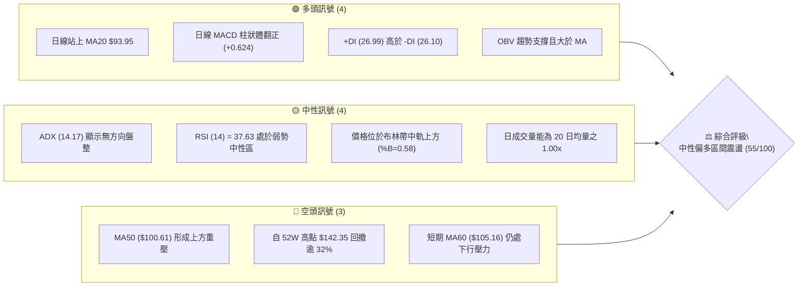
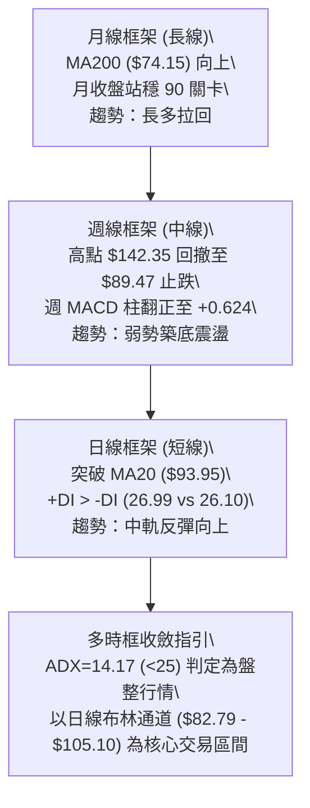
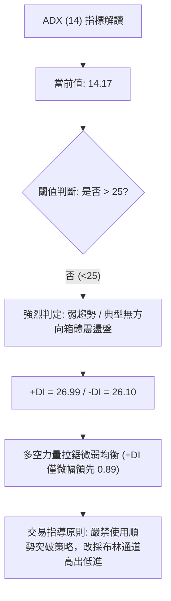
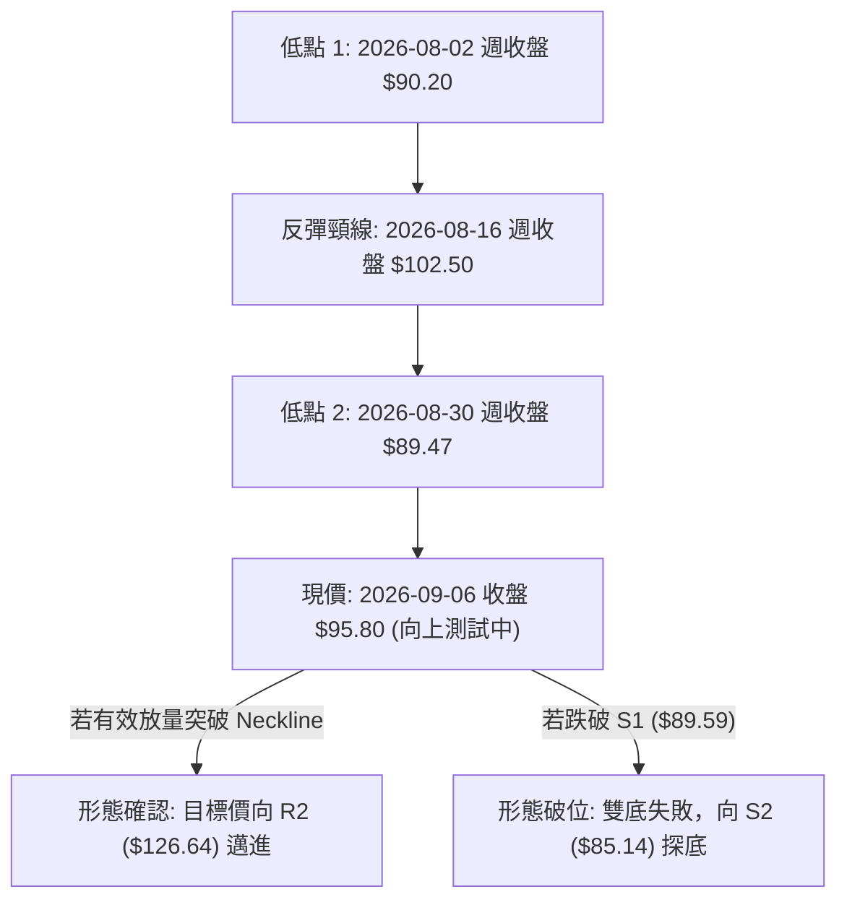
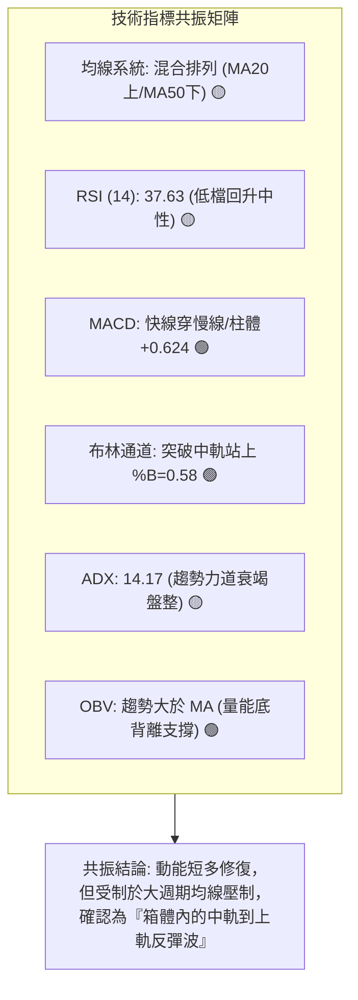
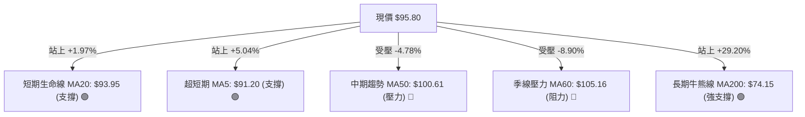
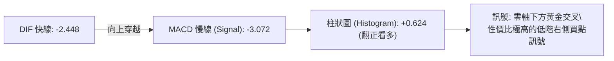
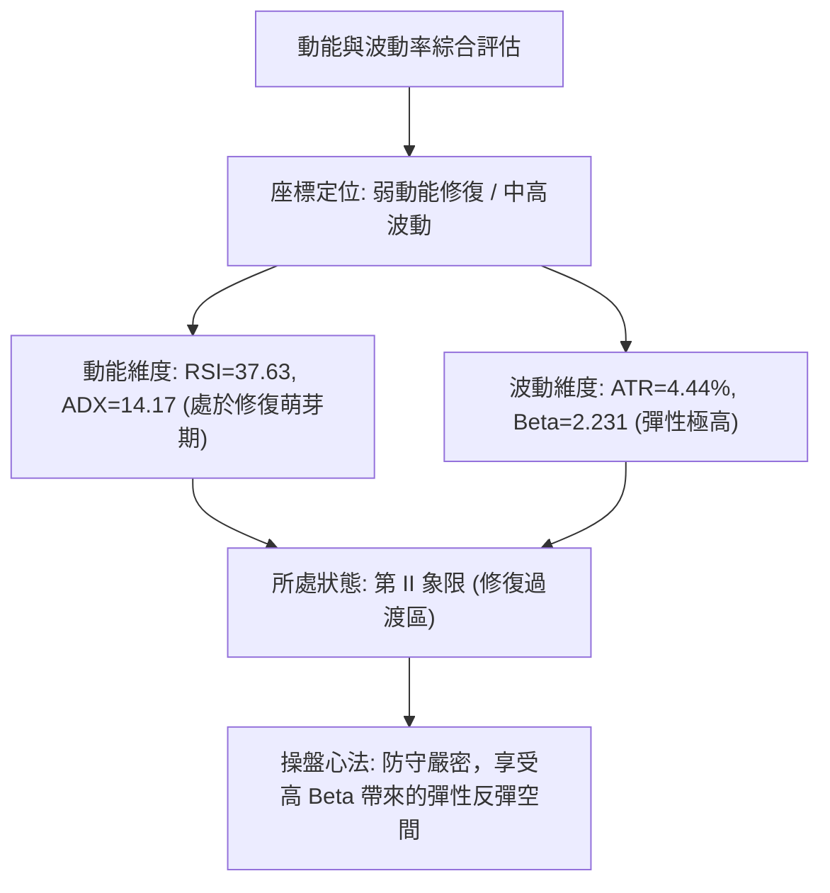
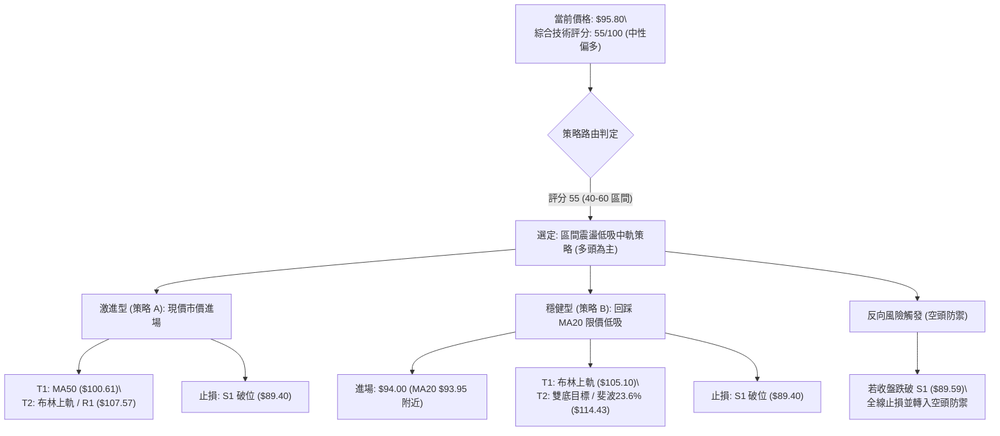
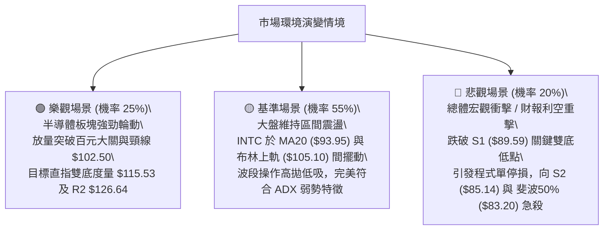

# INTC 技術分析報告

> **報告日期**：2026-09-07 ｜ **語言**：繁體中文 ｜ **數據來源**：Yahoo Finance ｜ **當前價格**：$95.80

---

## 目錄

| 章節 | 內容 |
|------|------|
| [1. 技術面概覽](#1-技術面概覽) | 訊號儀表板、核心指標、評分卡 |
| [2. 趨勢分析](#2-趨勢分析) | 多時框趨勢、長中短期走勢、ADX解讀 |
| [3. 圖表形態分析](#3-圖表形態分析) | 形態識別、K線組合、目標價推算 |
| [4. 支撐與阻力](#4-支撐與阻力) | 關鍵價位、斐波那契回調結構 |
| [5. 技術指標深度解讀](#5-技術指標深度解讀) | MA/RSI/MACD/布林通道/成交量 |
| [6. 動能與波動率](#6-動能與波動率) | 動能四象限、ATR、Beta波動度 |
| [7. 多時框架總結](#7-多時框架總結) | 時框架評分矩陣與收斂結論 |
| [8. 交易策略建議](#8-交易策略建議) | 策略路由、主策略、情境機率階梯 |
| [9. 風險提示與監控](#9-風險提示與監控) | 監控指標Checklist、風險情境與風控 |
| [報告總結](#-報告總結) | 全文核心彙整與操盤指引 |

---

## 1. 技術面概覽

### 🎯 技術訊號儀表板



### 📊 核心指標速覽表

| 指標類別 | 指標名稱 | 當前數值 | 訊號 | 解讀 |
|----------|----------|----------|------|------|
| **價格** | 當前收盤價 | $95.80 | 🟡 | 位於52週區間 60.7% 位置，短線自 $89.47 低檔反彈 |
| **均線** | MA20 | $93.95 | 🟢 | 現價位於 MA20 上方 (+1.97%)，短線扭轉極度弱勢格局 |
| **均線** | MA50 | $100.61 | 🔴 | 現價低於 MA50 (-4.78%)，中期下降趨勢線仍具實質壓制力 |
| **均線** | MA200 | $74.15 | 🟢 | 現價大幅高於 MA200 (+29.20%)，長期結構多頭基底未破 |
| **動能** | RSI(14) | 37.63 | 🟡 | 脫離 30 以下超賣區，未達 50 強弱分水嶺，動能處於弱勢中性修復 |
| **動能** | MACD (12,26,9) | -2.448 / -3.072 | 🟢 | 快線大於慢線，柱狀體翻正至 +0.624，呈現日線級別金叉修復 |
| **動能** | Stoch %K / %D | 75.23 / 43.06 | 🟢 | 快速隨機指標低檔金叉向上發散，短線具備攻擊力道 |
| **趨勢** | ADX (14) | 14.17 | 🟡 | 數值遠低於 25，確認市場處於無明確單邊趨勢的箱體震盪盤 |
| **波動** | ATR(14) | $4.25 | 🟡 | 佔價格 4.44%，震盪幅度適中，提供操作空間與風控依據 |
| **通道** | 布林通道 (%B) | 0.58 | 🟡 | 現價微幅站上中軌 $93.95，朝上軌 $105.10 展開區間反彈 |
| **量能** | 量比 (Volume Ratio) | 1.00x | 🟡 | 日成交量 9,742 萬股與 20 日均量相當，尚未見放量突破 |

### 🏆 技術評分卡

```
╔══════════════════════════════════════════════════════════════════╗
║                技術評分卡 — INTC (2026-09-07)                    ║
╠══════════════════════════════════════════════════════════════════╣
║ 趨勢強度 (Trend)     ████░░░░░░░░░░░░░░░░  25/100  🔴 弱勢盤整    ║
║ 動能指標 (Momentum)  ███████████░░░░░░░░░  55/100  🟡 短多修復    ║
║ 支撐穩定度 (Support) ██████████████░░░░░░  70/100  🟢 底部堅實    ║
║ 成交量配合 (Volume)  ██████████░░░░░░░░░░  50/100  🟡 中性格局    ║
║ 形態完整度 (Pattern) ██████████████░░░░░░  70/100  🟢 雙底雛形    ║
║ 均線排列 (Moving Avg)████████████░░░░░░░░  60/100  🟡 混合排列    ║
╠══════════════════════════════════════════════════════════════════╣
║ 綜合評分             ███████████░░░░░░░░░  55/100  ⚖️ 區間操作    ║
╚══════════════════════════════════════════════════════════════════╝
```

---

## 2. 趨勢分析

### 🌐 多時框趨勢分析



### 📈 長期趨勢 — 12個月走勢圖（Unicode）

以下為 INTC 過去 12 個月（2025-09 至 2026-09）之價格走勢圖，標注歷史波段關鍵點位：

```
INTC 月線走勢圖（2025-09 至 2026-09）
價格 ($)
$140 ┤                                     ●(2026-06 峰頂 $139.63 / 盤中高 $142.35)
$130 ┤                                    ╱ ╲
$120 ┤                             ● ─── ╱   ╲
$110 ┤                            ╱ (05: 114.68)╲
$100 ┤                           ╱               ╲
$90  ┤                    ● ─── ╱                 ● ─── ● ─── ●← 現價 $95.80
     │                   ╱ (04: 94.48)          (07:90.20)(08:89.51)
$50  ┤        ● ─── ● ─── (01:46.47)
$40  ┤   ● ─── ● (10:39.99 / 11:40.56)
$30  ┤  ● (09:33.55)
$20  ┤ 
     └─┬────┬────┬────┬────┬────┬────┬────┬────┬────┬────┬────┬───
     09   10   11   12   01   02   03   04   05   06   07   08   09 (月份)
    '25  '25  '25  '25  '26  '26  '26  '26  '26  '26  '26  '26  '26
```

**走勢特徵分析表格**：

| 階段區間 | 月份起訖 | 起訖價位 | 漲跌幅 | 結構特徵與成交量狀態 |
|----------|----------|----------|--------|----------------------|
| **長線打底期** | 2024-09 至 2025-08 | $23.46 → $24.35 | +3.79% | 股價於 $19.43 ~ $24.35 極窄幅打底近一年，籌碼充分沉澱 |
| **主升段起漲** | 2025-09 至 2026-03 | $33.55 → $44.13 | +31.54% | 突破箱體頸線，均線呈多頭排列，外資機構資金逐步回流 |
| **爆發主升浪** | 2026-04 至 2026-06 | $94.48 → $139.63 | +47.79% | 3 個月內翻倍，創下 52 週高點 $142.35，動能急劇過熱（RSI>88） |
| **崩跌修正浪** | 2026-07 至 2026-08 | $139.63 → $89.51 | -35.89% | 自高點無量陰跌回落，迅速跌破 38.2% 斐波那契位，進入獲利了結盤 |
| **雙底修復期** | 2026-08 至 2026-09 | $89.51 → $95.80 | +7.03% | 於 $89.47 ~ $89.59 聚類區獲強勁支撐，日線 MACD 金叉反彈 |

### 📊 中期趨勢（週線分析）

從近 20 週收盤數據觀察，INTC 在 2026-05 至 2026-06 於 $124~$139 形成週線級別的高檔整理頭部，隨後自 7 月份展開劇烈下殺，週成交量自峰值的 8.8 億股萎縮至當週的 3.78 億股。

```
中期支撐與阻力示意圖
══════════════════════════════════════════════════════════════════════
阻力 R1:  $107.57  (週線前波反彈高點聚類，與布林上軌 $105.10 重疊共振)
----------------------------------------------------------------------
阻力 MA50: $100.61  (週線密集套牢帶下緣，百元整數心理大關)
----------------------------------------------------------------------
現價:     $ 95.80  (微幅站回日線布林中軌 MA20 $93.95)
----------------------------------------------------------------------
支撐 S1:  $ 89.59  (8/23 當週低點 $90.07 與 8/30 當週低點 $89.47 聚類)
----------------------------------------------------------------------
支撐 S2:  $ 85.14  (近一年多空分水嶺，鄰近 50.0% 斐波那契位 $83.20)
══════════════════════════════════════════════════════════════════════
```

### ⚡ 趨勢強度評估（ADX 解讀）



**ADX 趨勢強度等級對照表**：

| ADX 數值區間 | 趨勢狀態判定 | 當前狀態 | 交易策略適配性 |
|--------------|--------------|----------|----------------|
| 0 – 20 | 極弱 / 無方向盤整 | **✓ (14.17)** | **高拋低吸，嚴控停損，依托布林軌道操作** |
| 20 – 25 | 趨勢醞釀中 / 弱趨勢 | — | 觀察突破方向，減少持倉手數 |
| 25 – 40 | 強勁單邊趨勢 | — | 順勢交易，均線回踩加碼 |
| 40 – 60 | 極強單邊爆發趨勢 | — | 緊跟趨勢，移動止盈保護獲利 |
| 60 – 100 | 超買/超賣過熱，趨勢即將竭盡 | — | 分批獲利了結，防範報復性反轉 |

---

## 3. 圖表形態分析

### 🔍 形態識別系統

根據近 2 年 OHLCV 與近期週線走勢數據，INTC 於高點大幅拉回後，在 $89.47 ~ $90.20 區間展現顯著的止跌抗跌性，初步識別出**潛在雙重底（W底）雛形**。



**形態信心度與計算依據表**（依嚴格要求 13、15 規範）：

| 形態名稱 | 信心度 | 判斷依據（嚴格引用輸入數據） | 形態完成度 | 目標價（附嚴謹幾何計算式） |
|----------|--------|------------------------------|------------|----------------------------|
| **潛在雙重底 (W-Bottom)** | **65%** | ① 左底為 2026-08-02 收盤價 $90.20<br>② 右底為 2026-08-30 收盤價 $89.47<br>兩者均落在支撐 S1 ($89.59) 附近，誤差僅 0.8% | 70% | **頸線**: 2026-08-16 高點 $102.50<br>**形態高度**: $102.50 - $89.47 = $13.03<br>**推算目標價**: $102.50 + $13.03 = **$115.53**（高度吻合 23.6% 斐波位 $114.43 與分析師目標均價 $115.78） |
| **均線中軌突破 (布林策略)** | **80%** | 收盤價 $95.80 有效突破 MA20 ($93.95)，且連續 2 日站穩中軌上方 | 100% | **第一目標價**: MA50 **$100.61**<br>**第二目標價**: 布林上軌 **$105.10** |
| **頭肩頂形態 (週線級別)** | **30%** | 數據中左肩與頭部明顯（$124.92 / $142.35），但右肩尚未構建成型，右側缺乏量能支持 | 35% | *訊號不足，信心度低於50%，僅做指標型風險警示，不作進場依據* |

### 🕯️ 重要K線形態分析

| 週/月份 | 收盤價 | K線形態特徵 | 量價解讀 | 訊號 |
|---------|--------|-------------|----------|------|
| **2026-06** | $139.63 | 衝高長上影月K線 (盤中 $142.35) | 突破天價後遭遇歷史級解套與獲利盤狂湧，多頭力竭 | 🔴 看空反轉 |
| **2026-07** | $90.20 | 大陰線破位放量重挫 (-35.4%) | 跌破 20 週均線支撐，週成交量超過 5.4 億股，恐慌盤湧現 | 🔴 強烈空頭 |
| **2026-08-16**| $102.50 | 底部放量陽線反彈 (+13.6%) | 週成交量擴增至 6.39 億股，主力資金在百元關卡下進場回補 | 🟢 多頭抵抗 |
| **2026-08-30**| $89.47 | 縮量探底十字錘子線 | 週成交量縮至 4.41 億股，賣壓徹底衰竭，確認 S1 支撐有效 | 🟢 築底訊號 |
| **2026-09-06**| $95.80 | 下影實體反彈中陽線 | 週量 3.78 億股雖然萎縮，但日線 MACD 柱狀體翻正，站回 MA20 | 🟢 短線轉多 |

### 📉 ASCII 走勢形態示意圖

```
潛在雙底 (W-Bottom) 結構演化圖
價格軸
$105 ┤                                                 [布林上軌 $105.10]
$102.50 ┤                 ● (頸線 Neckline 8/16: $102.50)
$100 ┤                ╱ ╲                             [MA50 $100.61]
$95.80 ┤               ╱   ╲                 ● ← 當前位置 ($95.80，穿過 MA20)
$93.95 ┤ - - - - - - ╱ - - - ╲ - - - - - - ╱ - - - - [MA20 中軌支撐]
$90.20 ┤    ●       ╱         ╲           ╱
$89.47 ┤     ╲     ╱           ╲         ● (右底 8/30: $89.47)
       └──────●───╱─────────────╲───────╱─────────────────────────
             (左底 8/02: $90.20)  (回調洗盤)
```

### 🎯 形態目標價計算

根據經典技術形態幾何測算原則：
1. **基底支撐點 ($H_{Base}$)**：選取雙底之絕對低點，即 2026-08-30 之週收盤價 **$89.47**。
2. **頸線阻力點 ($H_{Neck}$)**：選取兩底間之波段反彈高點，即 2026-08-16 之週收盤價 **$102.50**。
3. **形態垂直高度 ($H_{Pattern}$)**：
   $$H_{Pattern} = \$102.50 - \$89.47 = \$13.03$$
4. **最小量度目標價 (Target Price)**：
   $$T_1 = \$102.50 + \$13.03 = \mathbf{\$115.53}$$
   *(此目標價與 52 週斐波那契 23.6% 回調位 $114.43 及 41 位華爾街分析師平均目標價 $115.78 形成罕見的「三共振強阻力區」)*。

---

## 4. 支撐與阻力

### 🗺️ 關鍵價位分布圖（Unicode）

```
INTC 價位結構分布圖 (由實際 OHLCV 聚類計算)
══════════════════════════════════════════════════════════════════
$132.75 ║████████████████████████████████║ 強阻力 R3 (年內極限波段壓力)
$126.64 ║████████████████████████        ║ 次級阻力 R2 (6月高檔換手套牢區)
$114.43 ║▓▓▓▓▓▓▓▓▓▓▓▓▓▓▓▓▓▓▓▓▓▓▓▓        ║ 斐波那契 23.6% / 雙底目標 $115.53
$107.57 ║████████████████████████████████║ 關鍵阻力 R1 (布林上軌/頸線延伸)
$100.61 ║▒▒▒▒▒▒▒▒▒▒▒▒▒▒▒▒▒▒              ║ MA50 中期均線反壓 / 百元心理關卡
$ 95.80 ╠════════════════════════════════╣ ◄ 現價 ($95.80)
$ 93.95 ║░░░░░░░░░░░░░░░░░░░░░░░░        ║ MA20 日線生命線 / 布林中軌支撐
$ 89.59 ║████████████████████████        ║ 近期波段支撐 S1 (雙底左/右腳)
$ 85.14 ║████████████████████████████████║ 強支撐 S2 (多空臨界點)
$ 83.20 ║▓▓▓▓▓▓▓▓▓▓▓▓▓▓▓▓▓▓▓▓▓▓▓▓        ║ 斐波那契 50.0% 關鍵平衡點
$ 81.79 ║████████████████████████████████║ 終極防線 S3 (跌破宣告全面轉空)
══════════════════════════════════════════════════════════════════
```

### 🚧 阻力位分析表

*嚴格引用數據中「關鍵價位」區塊之 R1 / R2 / R3 與均線計算值：*

| 阻力級別 | 精確價位 | 漲幅距離 | 形成原因與籌碼特徵 | 突破難度 | 戰略重要性 |
|----------|----------|----------|--------------------|----------|------------|
| **R1** | **$107.57** | +12.29% | 近一年波段高點聚類；與布林通道上軌 ($105.10) 及 MA60 ($105.16) 構成重合反壓帶 | ⭐⭐⭐☆ | **短線獲利了結與突破分水嶺** |
| **R2** | **$126.64** | +32.19% | 2026-06 波段回調中繼跳空低點；大量籌碼套牢密集區 | ⭐⭐⭐⭐ | **中期反轉結構確認位** |
| **R3** | **$132.75** | +38.57% | 接近歷史高點之波段高點聚類，主力資金撤退之最後派發平台 | ⭐⭐⭐⭐⭐ | **長期超強阻力天花板** |

### 🛡️ 支撐位分析表

*嚴格引用數據中「關鍵價位」區塊之 S1 / S2 / S3 與斐波那契計算值：*

| 支撐級別 | 精確價位 | 跌幅距離 | 形成原因與籌碼特徵 | 守住機率 | 戰略重要性 |
|----------|----------|----------|--------------------|----------|------------|
| **S1** | **$89.59** | -6.48% | 近一年波段低點聚類；8/02 ($90.20) 與 8/30 ($89.47) 雙底支撐底線 | **75%** | **短多最後防守底線，破位停損** |
| **S2** | **$85.14** | -11.13% | 前波急漲中繼整理低點聚類；臨近斐波那契 50% 水平位 ($83.20) | **60%** | **中期趨勢護城河** |
| **S3** | **$81.79** | -14.62% | 近一年極限防守低點聚類；跌破將觸發程式化量化砍倉 | **40%** | **長多生命線，不容有失** |

### 📐 斐波那契回調位分析

依據 52 週極端區間（Low: **$24.05** → High: **$142.35**，總垂直空間高達 **$118.30**）計算之標準黃金分割回調位：

```
斐波那契回調位階梯圖
0.0%  (52W High) ────────────────────── $142.35 (極度超買頂部)
  ▲
23.6% ────────────────────────────────── $114.43 (強勢整理回調位 / 雙底目標共振)
  ▲
38.2% ────────────────────────────────── $ 97.16 (弱勢反彈關鍵門檻)
  ▲ ◄── 現價 $95.80 (處於 38.2% 與 50.0% 之間，正向上考驗 38.2%)
50.0% ────────────────────────────────── $ 83.20 (牛熊心理平衡中軸線)
  ▼
61.8% ────────────────────────────────── $ 69.24 (黃金分割終極強支撐)
  ▼
78.6% ────────────────────────────────── $ 49.37 (長期深度回調位)
  ▼
100.0% (52W Low) ─────────────────────── $ 24.05 (起漲原始原點)
```

**深度解讀**：
- 現價 **$95.80** 目前精確落於 **38.2% 回調位 ($97.16)** 與 **50.0% 回調位 ($83.20)** 之間。
- 38.2% 位 ($97.16) 是當前多頭反彈的第一道實質天花板。只要多頭能有效收復並站穩 $97.16，回調幅度將收斂在健康範圍內，進一步挑戰 23.6% 位 **$114.43** 的機率將大幅激增。
- 反之，若始終無法衝破 $97.16，則股價有極大概率再次滑落，向 50.0% 心理分水嶺 **$83.20**（接近支撐 S2 $85.14 與布林下軌 $82.79）尋求二度支撐。

---

## 5. 技術指標深度解讀

### 🎛️ 指標訊號總覽



### 📈 移動平均線排列分析



**均線狀態明細與趨勢指引**：

| 均線名稱 | 當前價格 | 偏離率 (Bias) | 均線走向斜率 | 訊號評估 |
|----------|----------|---------------|--------------|----------|
| **MA5**  | $91.20 | +5.04% | 向上揚升 (扣抵低值) | 🟢 極短線多頭主控 |
| **MA10** | $90.05 | +6.38% | 走平轉折向上 | 🟢 短線底部確立 |
| **MA20** | $93.95 | +1.97% | 走平略微翹頭 | 🟢 日線由空翻多關鍵點 |
| **MA50** | $100.61| -4.78% | 緩步下彎 | 🔴 中期下行壓制未解 |
| **MA60** | $105.16| -8.90% | 明顯下行 | 🔴 強反壓區間 |
| **MA120**| $94.89 | +0.95% | 平緩向上 | 🟡 現價於此糾結爭奪 |
| **MA200**| $74.15 | +29.20%| 陡峭向上 | 🟢 長期牛市底色不變 |
| **MA240**| $67.96 | +40.96%| 堅定向上 | 🟢 年線支撐極為雄厚 |

### 📉 RSI(14) 分析

- **當前數值**：**37.63**（脫離 30 極端超賣區）
- **強度進度條**：
  ```
  0 [███████████████░░░░░░░░░░░░░░░░░░░░░░░░░] 100  (37.63% — 弱勢修復區間)
  ```
- **超買超賣動態**：從近 20 週數據觀察，RSI 在 2026-05 衝至 **88.4** 的極端超買警戒線後崩落，於 2026-07-26 摜破至 **26.9** 觸發超賣。當前回升至 37.63，顯示空頭下殺動能已耗盡，多頭開始組織低接買盤。
- **背離分析判斷**：
  - **價格層面**：8/02 收盤 $90.20，8/30 跌破至 $89.47（創波段新低）。
  - **RSI 層面**：8/02 週 RSI 為 39.5，而 8/30 週 RSI 為 38.1，日線級別在 $89.47 附近形成**潛在隱性底背離**。
  - **結論**：🔴 頂背離無 ｜ 🟢 **底背離初步成立**，預示向下空間已被鎖死，具備向 50 中軸發起衝擊之動能。

### 📊 MACD(12/26/9) 訊號解讀



- **MACD 快慢線走勢**：DIF (-2.448) 位於零軸下方，但已明確金叉穿越 DEA (-3.072)，這是標準的「弱勢區底背離金叉」。
- **柱狀體變化**：柱狀體由負翻正至 **+0.624**，終結了連續數週的空頭擴散綠柱。柱體連續兩日擴張，表態短線買盤力量轉強。

### 📦 布林通道分析

```
布林通道 (20, 2) 結構圖
══════════════════════════════════════════════════════════════════════
$105.10 ────────────────────────────────────────── 上軌 Upper Band (+9.71%)
                          ╱
$100.61 ───────────── MA50 (反壓阻力) ─────────────
                    ╱
$ 95.80 ─── 現價 ($95.80) ─── [%B = 0.58] ────────
                  ╱
$ 93.95 ────────────────────────────────────────── 中軌 Middle Band (MA20 支撐)
                ╱
$ 82.79 ────────────────────────────────────────── 下軌 Lower Band (-13.58%)
══════════════════════════════════════════════════════════════════════
```

- **軌道狀態**：帶寬（Bandwidth）高達 $22.31（佔比約 23.2%），屬於前期大跌後帶寬張開後的收斂初期。
- **指標位置**：%B 為 **0.58**（中軌為 0.50）。股價自下軌 $82.79 獲得支撐反彈，現已實質站上中軌 $93.95。
- **路徑指引**：在 ADX 低於 25 的盤整市道中，布林通道為最高勝率操作工具。突破中軌後，**慣性目標直指上軌 $105.10**，該位置亦與阻力 R1 ($107.57) 及 MA60 ($105.16) 高度契合。

### 💹 成交量分析（量價配合度）

- **最新成交量**：97,428,100 股。
- **均量對比**：20 日均量為 97,868,430 股（量比 **1.00x**，完全持平）；50 日均量為 106,295,154 股（微幅縮量）。
- **OBV 趨勢**：OBV > MA，量能指標在股價於 $89.47 打第二隻腳時率先止跌走平，顯示主力並未在下跌中出逃，反而呈現籌碼低接沈澱。
- **量價背離檢視**：在 7 月份重挫時週量高達 5.95 億股，而 8 月底探底至 $89.47 時週量大幅縮減至 4.41 億股，當前反彈週量進一步收斂至 3.78 億股。這屬於**良性的「空頭縮量衰竭，多頭以巧實力輕裝反彈」**，量價配合良好。後續若欲突破百元大關，則日量需擴增至 1.2 億股以上方能克竟全功。

---

## 6. 動能與波動率

### ⚡ 動能評估四象限



| 象限 | 動能維度 | 波動維度 | 代表特徵 | 當前狀態判定 | 操盤行動方針 |
|------|----------|----------|----------|--------------|--------------|
| **Q1 (最佳機會)** | 強動能 (ADX>25, RSI>60) | 低/中波動 | 穩定單邊牛市 | — | 順勢加碼，享受主升段 |
| **Q2 (波段修復)** | **弱/漸強 (RSI 35-50)** | **中高波動 (ATR>4%)**| **跌深強反彈** | **✓ (當前 INTC)** | **依箱體邊界操作，嚴控停損，追求高盈虧比** |
| **Q3 (高危博弈)** | 強動能 | 極高波動 | 散戶狂熱投機 | — | 短打當沖，隨時撤離 |
| **Q4 (避免進場)** | 極弱動能 | 低波動陰跌 | 資金流出無人問津 | — | 資金凍結，堅決觀望 |

### 📊 ATR 波動率分析

- **ATR(14) 絕對值**：**$4.25**
- **波動率佔比**：
  $$\text{ATR 比例} = \frac{\$4.25}{\$95.80} = 4.44\%$$
- **波動特徵**：單日 $4.25 的波幅意味著個股極具短線交易活躍度，但同時對無保護的追高交易構成嚴重威脅。
- **止損與風控量化距離指引**：
  - **極短線動態止損 (1.0 × ATR)**：$\$4.25$。進場點下方需預留至少 $4.25 的緩衝空間以防雜訊洗盤。
  - **波段標準止損 (1.5 × ATR)**：$1.5 \times \$4.25 = \mathbf{\$6.38}$。若自現價 $95.80 往下推算 $6.38，恰為 **$89.42**，完全覆蓋雙底低點 $89.47 與支撐位 S1 ($89.59)。此一數值在數學與圖表結構上展現出驚人的一致性。

### 📐 Beta 與市場相關性

- **Beta 係數**：**2.231**
- **市場特徵解讀**：
  - INTC 屬於高敏感情緒型標的，其波動幅度為 S&P 500 大盤的 **2.23 倍**。
  - 當費城半導體指數（SOX）或大盤回暖時，INTC 具備極強的超額彈性（Alpha 反彈潛力）；但在大盤走弱時，其下殺加速度亦倍於指數。
  - 62.6% 的機構持股比例與僅 2.6% 的賣空浮額（Short Float）顯示，目前並無機構進行惡意擠壓空頭，盤面波動完全由多空資金的基本面再定價主導。

---

## 7. 多時框架總結

### 📋 時框架評分表

| 時框架 | 趨勢方向 | 動能狀態 | 均線排列 | 形態特徵 | 綜合評分 | 操作戰略建議 |
|--------|----------|----------|----------|----------|----------|--------------|
| **月線 (長期)** | 多頭回調 | 中性偏弱 | MA200 向上多頭 | 長期主升回撤 38.2% | **65/100** 🟢 | 長線投資者逢低分批佈局 |
| **週線 (中期)** | 弱勢震盪 | 空轉平 | 跌破 MA50 / MA60 | 潛在雙重底構建中 | **50/100** 🟡 | 耐心等待頸線放量突破 |
| **日線 (短期)** | 短多反彈 | 柱體翻正 | 站上 MA20，MA5/10 金叉 | 突破布林中軌朝上軌前進 | **60/100** 🟢 | 積極交易者依中軌低吸做多 |

### 🔲 綜合訊號矩陣

```
╔══════════════════════════════════════════════════════════════════════╗
║                   INTC 多時框架綜合訊號矩陣                          ║
╠══════════════════╦════════════════╦════════════════╦═════════════════╣
║ 維度 \ 週期      ║ 短期 (日線)    ║ 中期 (週線)    ║ 長期 (月線)     ║
╠══════════════════╬════════════════╬════════════════╬═════════════════╣
║ 趨勢 (Trend)     ║ 🟢 突破 MA20   ║ 🟡 築底打橫    ║ 🟢 MA200 支撐   ║
║ 動能 (Momentum)  ║ 🟢 MACD 金叉   ║ 🟡 RSI 37 築底 ║ 🟡 自超買回落   ║
║ 量能 (Volume)    ║ 🟡 1.00x 平量  ║ 🟢 探底縮量    ║ 🟢 總體籌碼沉澱 ║
║ 通道 (Volatility)║ 🟢 站上中軌    ║ 🟡 接近通道下沿║ 🟡 正常波幅     ║
║ 形態 (Pattern)   ║ 🟢 右底抬高    ║ 🟡 雙底醞釀    ║ 🟢 箱體突破回踩 ║
╠══════════════════╬════════════════╬════════════════╬═════════════════╣
║ 綜合共振結論     ║ 短線做多修復   ║ 中線區間觀望   ║ 長線多頭未死    ║
╚══════════════════╩════════════════╩════════════════╩═════════════════╝
```

### ⚖️ 多時框收斂結論

> **依嚴格要求 14 執行多時框收斂收束規則**：
> 1. **行情定性**：當前 ADX(14) 讀數為 **14.17**，明確小於 25 臨界線，技術架構**毫無疑問定性為「典型盤整震盪行情」**，而非單邊趨勢行情。
> 2. **主導時框規則**：在盤整行情下，順勢跟隨指標失效，**交易以「日線布林通道 ($82.79 - $105.10)」作為最高優先級之交易依據**。日線站穩中軌 MA20 ($93.95)，指示當前行情正處於「自中軌向布林上軌 $105.10 邁進的反彈震盪分支」中。
> 3. **衝突收斂判斷**：週線與中期 MA50 ($100.61) 雖處空頭反壓，但日線 MACD 金叉帶動短多反撲，兩者並不矛盾——中期空頭壓制限制了反彈空間（上限見 R1 $107.57），而日線短多動能則提供了反彈動力（下限守 S1 $89.59）。
> 4. **唯一確定結論**：**【中性偏多，區間反彈操作】**。此結論作為第 8 章策略構建的唯一路由指導。

---

## 8. 交易策略建議

### 🗺️ 策略決策流程圖



### 🧭 策略路由（依評分卡分流）

- **當前技術綜合評分**：**55 / 100**
- **主策略方向定義**：**【區間操作，偏多修復】**（以日線布林中軌 $93.95 為支撐依託，向上博弈布林上軌 $105.10 與阻力 R1 $107.57 之反彈行情）。

### 🎯 價格情境階梯（Price Scenarios）

*價位完全依據輸入數據「關鍵價位」與斐波那契計算值繪製：*

| 觸發條件 | 核心觀察點位 | 下一目標點位 | 後續延伸極限 | 劇本戰略意義 |
|----------|--------------|--------------|--------------|--------------|
| **強勢向上突破** | 突破 MA50 **$100.61** | 阻力 R1 **$107.57** | 斐波23.6% **$114.43** / R2 **$126.64** | 雙底頸線突破，確立中級反轉浪 |
| **箱體震盪維持** | 站穩中軌 **$93.95** | 斐波38.2% **$97.16** | 布林上軌 **$105.10** | 典型無趨勢震盪，於軌道內反覆洗盤 |
| **破位向下走弱** | 跌破支撐 S1 **$89.59** | 支撐 S2 **$85.14** | 斐波50% **$83.20** / S3 **$81.79** | 雙底宣告失敗，尋求年線及半數回撤支撐 |

### 📊 情境機率分佈

| 情境劇本 | 發生機率 | 主要判定依據（引用核心技術指標） |
|----------|----------|----------------------------------|
| **情境一：向上反彈測試阻力 (Bullish Rebound)** | **55%** | ① 日線 MACD 翻正 (+0.624) 且 DIF 金叉 Signal<br>② 現價已站穩 MA20 ($93.95)<br>③ +DI (26.99) 壓制 -DI (26.10)<br>④ OBV 呈現量能底背離支撐 |
| **情境二：箱體窄幅拉鋸震盪 (Neutral Consolidation)**| **30%** | ① ADX 僅 14.17，市場極度缺乏單邊推動力<br>② 成交量能比僅 1.00x，缺乏增量資金強行攻堅百元大關<br>③ 上方 MA50 ($100.61) 下行壓制沉重 |
| **情境三：下破底線二度探底 (Bearish Breakdown)** | **15%** | ① 自 52W 高點 $142.35 之整體下行中線結構尚未被破壞<br>② 若大盤暴跌引發 Beta (2.231) 放大，恐將帶崩 S1 ($89.59) |

### 🟢 主策略詳情（方向依上方路由）

*所有止損、進場、目標價嚴格採納真實數據計算點位，不憑空捏造：*

| 策略要素 | 策略 A（現價直接進場型 — 積極者） | 策略 B（回踩中軌低吸型 — 穩健者） |
|----------|-----------------------------------|-----------------------------------|
| **交易邏輯** | 日線 MACD 金叉確認，直接卡位反彈波 | 耐心等待確認回踩 MA20 支撐不破之右側進場點 |
| **進場價格** | **$95.80**（現價市價進場） | **$94.00**（限價於 MA20 $93.95 略上方） |
| **目標價 T1** | **$100.61**（MA50 下降反壓線） | **$105.10**（日線布林通道上軌） |
| **目標價 T2** | **$107.57**（阻力 R1 / 波段高點聚類） | **$114.43**（斐波那契 23.6% 回調位） |
| **防守止損價** | **$89.40**（跌破 S1 $89.59 及前低 $89.47） | **$89.40**（跌破雙底結構右腳底點） |
| **風險空間** | $\$95.80 - \$89.40 = \mathbf{\$6.40}$ (6.68%) | $\$94.00 - \$89.40 = \mathbf{\$4.60}$ (4.89%) |
| **報酬空間 (T2)**| $\$107.57 - \$95.80 = \mathbf{\$11.77}$ (12.29%)| $\$114.43 - \$94.00 = \mathbf{\$20.43}$ (21.73%) |
| **風險報酬比 (R:R)**| **1 : 1.84** | **1 : 4.44** |
| **預估勝率** | 55% | 65% |
| **建議配置倉位**| 總投資資金之 **8% - 10%** | 總投資資金之 **12% - 15%** |

### 🔴 反向風險觸發點（對沖提示）

- **多頭結構推翻警戒線**：日線收盤價若**實質跌破支撐位 S1 ($89.59)**，特別是跌破前低 **$89.47**。
- **指標反轉徵兆**：日線 MACD 柱狀體未能持續擴張反而再度縮減翻綠，或 RSI 跌穿 30 重新進入下行通道。
- **避險處置方案**：一旦觸發收盤跌破 $89.40，所有多頭多單應立即執行紀律止損離場，嚴禁凹單。空手者可在此時順勢輕倉建立避險空單，目標下看支撐 S2 **$85.14** 與斐波那契 50% 位 **$83.20**。

### ⭐ 整體訊號強度評星

```
做多訊號強度：★★★☆☆  (3.0 / 5 星 — MACD金叉、站回中軌，具備盈虧比優勢)
做空訊號強度：★★☆☆☆  (2.0 / 5 星 — 動能指標衰竭，低位做空易遭軋空)
整體可信度：  ★★★☆☆  (3.5 / 5 星 — ADX較低，區間操作可信度高，突破可信度中等)
```

---

## 9. 風險提示與監控

### ✅ 關鍵監控指標 Checklist

```
╔══════════════════════════════════════════════════════════════════════╗
║                   INTC 每日盤後技術監控清單 (Checklist)              ║
╠══════════════════════════════════════════════════════════════════════╣
║ [ ] 價格是否持續收在生命線 MA20 ($93.95) 之上？                      ║
║ [ ] 日成交量能否擴增至 1 億股以上（大於 20 日均量 9,786 萬）？        ║
║ [ ] RSI(14) 能否順利升破 50 多空分界中軸線？                         ║
║ [ ] MACD 柱狀圖是否持續維持在正值區間 (+0.624 以上擴張)？            ║
║ [ ] ADX(14) 讀數是否自 14.17 低檔抬頭開始突破 20？                   ║
║ [ ] 價格逼近 MA50 ($100.61) 時，是否出現巨量長上影線受阻？          ║
║ [ ] 支撐 S1 ($89.59) 處是否有連續兩日收盤跌破的情形？                ║
╚══════════════════════════════════════════════════════════════════╝
```

### ⚠️ 風險場景分析



### 🛡️ 風險管理重要提醒

1. **高 Beta 波動懲罰機制**：
   INTC 的 Beta 高達 **2.231**，這意味著市場波動會被放大超過 2 倍。在部位規模控制上，絕對不可依據普通低波動公用事業股的標準建倉。單一標的持倉曝險**嚴禁超過總投資組合淨值的 15%**。
2. **區間操作嚴守「不追高」紀律**：
   在 ADX = 14.17 的環境下，任何向上暴衝的單日大陽線極容易演變為假突破誘多。嚴格執行「買在支撐（MA20 $93.95 附近），賣在阻力（布林上軌 $105.10 / R1 $107.57 附近）」之紀律，切忌在價格接近 $100 以上時追價。
3. **ATR 風控動態調整**：
   目前每日 ATR 為 **$4.25**，日內正常震盪區間即達 4.44%。波段操作者切勿將停損設在小於 1.0 × ATR ($4.25) 之內，否則極易在市場開盤雜訊中被無謂掃出場。本報告推薦之 $89.40 止損位提供現價下方 $6.40 的空間，約合 1.5 × ATR，兼顧防守安全性與資金效率。

---

## 📋 報告總結

```
╔══════════════════════════════════════════════════════════════════╗
║                   INTC 技術分析報告終極總結                      ║
╠══════════════════════════════════════════════════════════════════╣
║ 報告日期：2026-09-07                                             ║
║ 當前價格：$95.80                                                 ║
║ 技術評分：55 / 100                                               ║
║ 核心評級：⚖️ 區間震盪偏多（布林軌道操作）                        ║
╠══════════════════════════════════════════════════════════════════╣
║ 關鍵結論：                                                       ║
║ ├─ 長期趨勢：🟢 穩健多頭回調，MA200 ($74.15) 向上斜率強勁        ║
║ ├─ 中期趨勢：🟡 高位深幅回撤後，在 $89.47-$90.20 構築雙重底雛形  ║
║ ├─ 短期趨勢：🟢 突破日線生命線 MA20 ($93.95)，MACD 柱狀體翻正    ║
║ ├─ 關鍵支撐：S1: $89.59  ｜ S2: $85.14  ｜ S3: $81.79            ║
║ ├─ 關鍵阻力：R1: $107.57 ｜ R2: $126.64 ｜ R3: $132.75           ║
║ └─ 目標共振：形態量度 $115.53 與分析師均價 $115.78 極度契合      ║
╠══════════════════════════════════════════════════════════════════╣
║ 最優策略組合：                                                   ║
║ 1. 🥇 最佳機會（策略 B）：回踩 MA20 ($94.00) 低吸，止損設 $89.40, ║
║    第一目標 $105.10，第二目標 $114.43 (風報比高達 1:4.44)       ║
║ 2. 🥈 次選機會（策略 A）：現價 $95.80 市價建倉短多，看至 MA50    ║
║    $100.61 及 R1 $107.57，止損同樣嚴守 $89.40 (風報比 1:1.84)   ║
║ 3. 🥉 保守選擇：徹底空手觀望，靜待股價放量突破雙底頸線 $102.50   ║
║    確立後，再順勢進場搭乘右側順風車                             ║
╚══════════════════════════════════════════════════════════════════╝
```

---

> ⚠️ **免責聲明**：本報告為依據標準技術分析理論與所提供之歷史數據產出之研究報告，所有指標數值、支撐阻力位與交易策略均基於量化統計結果。本報告**僅供研究與學術參考**，**不構成任何形式的個人化投資建議或買賣邀約**。金融市場具有高度風險，投資人應獨立審慎評估自身財務狀況與風險承受能力。

---

*報告生成時間：2026-09-07 ｜ 數據來源：Yahoo Finance ｜ 分析框架：多時框圖表形態與量化動能分析體系*