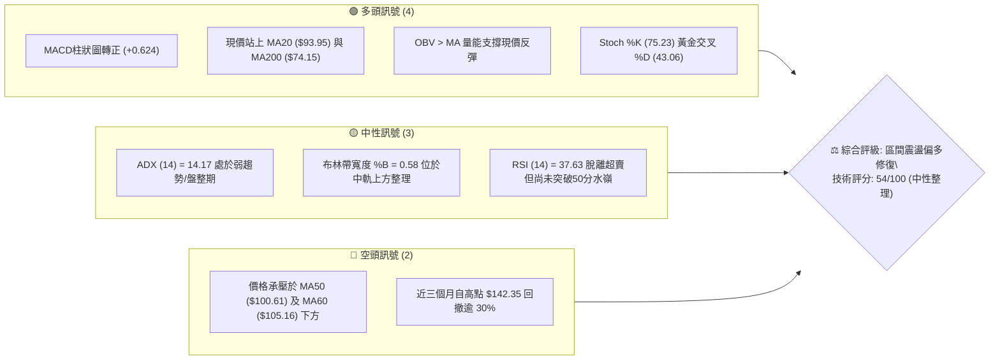
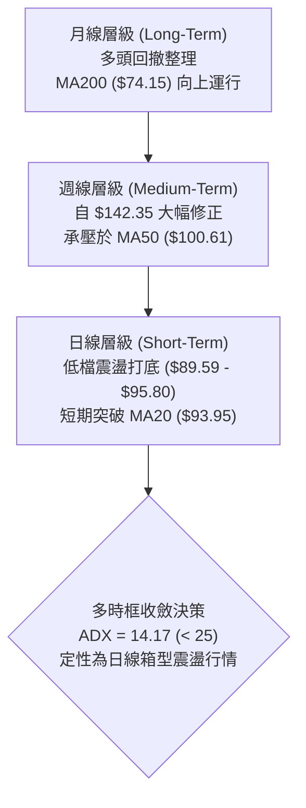
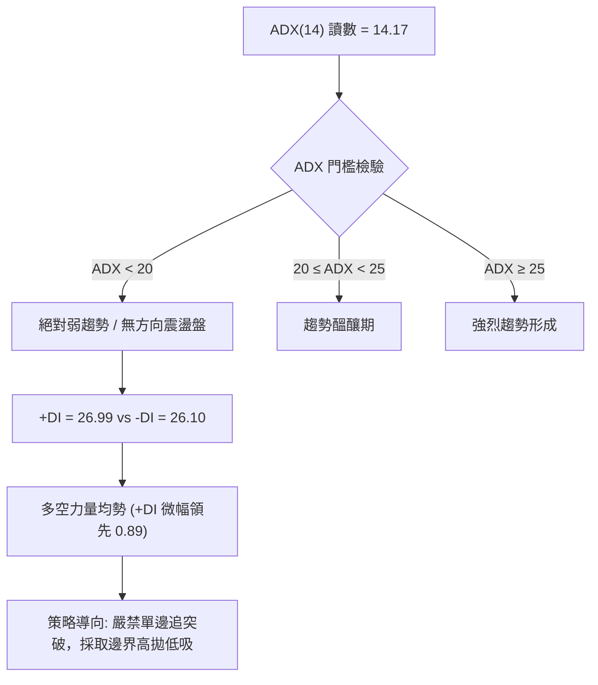
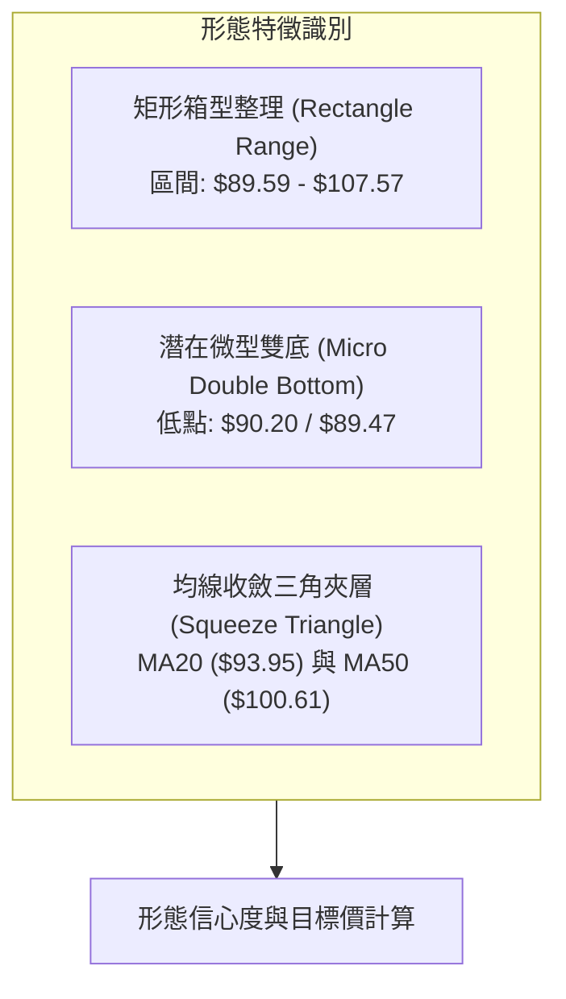
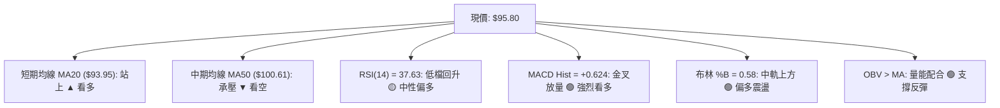
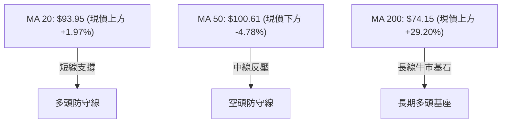
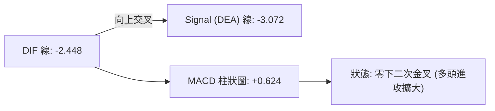
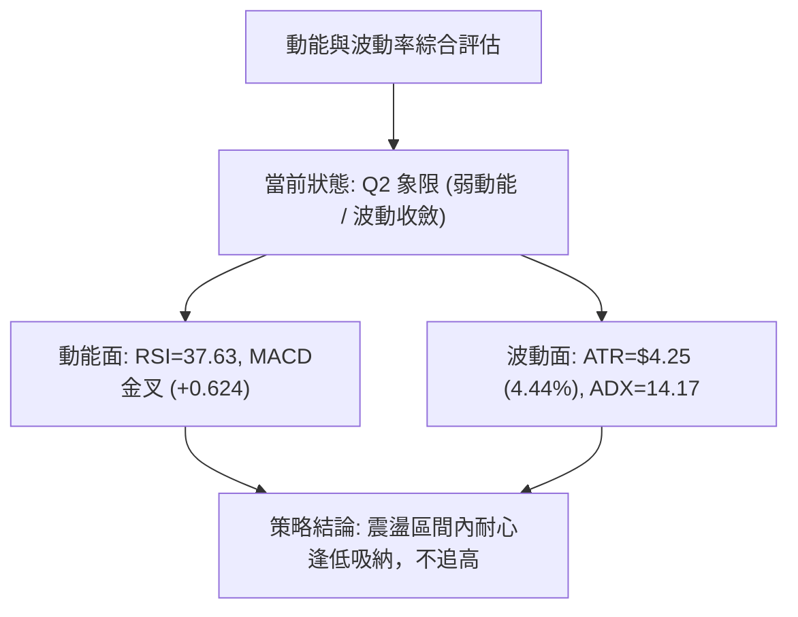
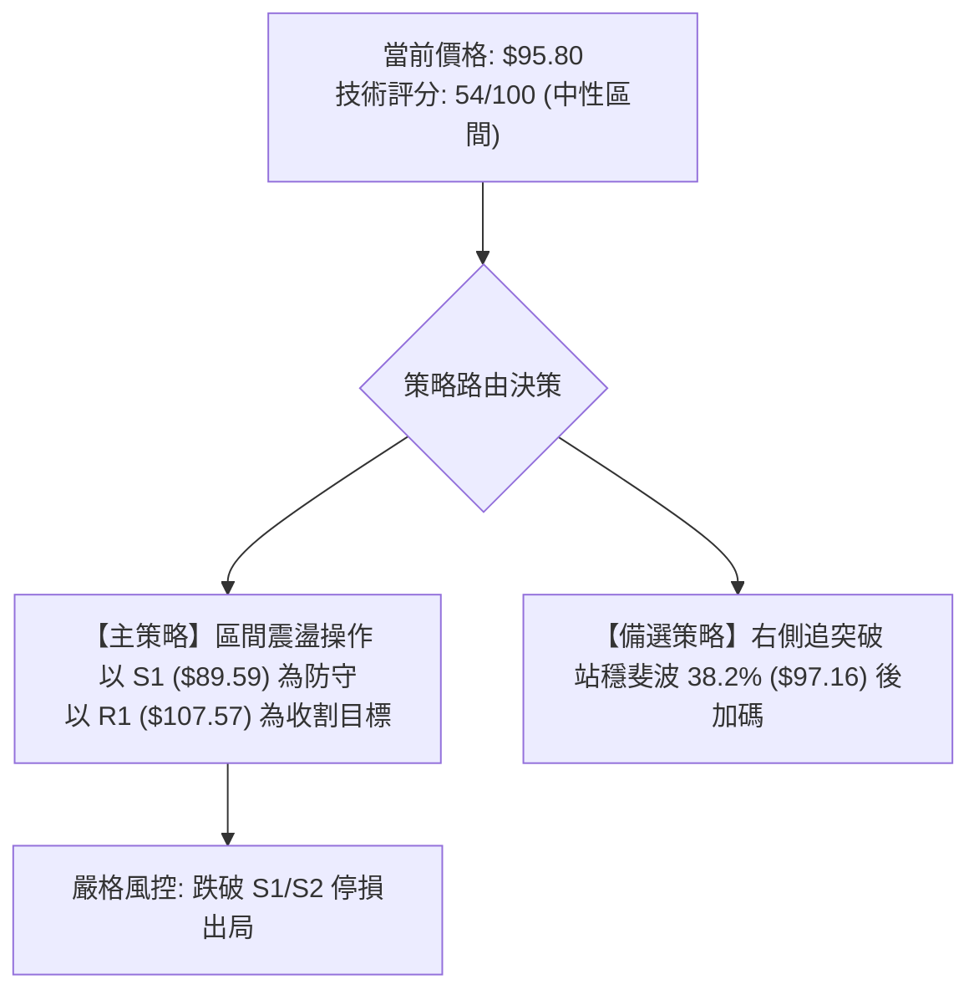
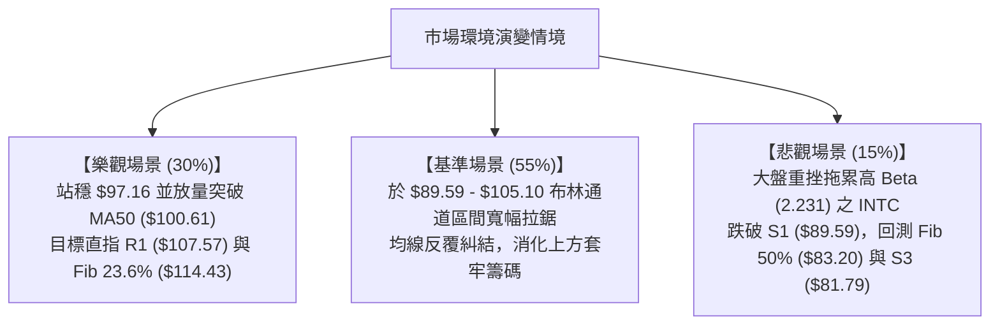

# INTC 技術分析報告

> **報告日期**：2026-09-08 ｜ **語言**：繁體中文 ｜ **數據來源**：Yahoo Finance ｜ **當前價格**：$95.80

---

## 目錄

| 章節 | 內容 |
|------|------|
| [1. 技術面概覽](#1-技術面概覽) | 訊號儀表板、核心指標、評分卡 |
| [2. 趨勢分析](#2-趨勢分析) | 多時框趨勢、長中短期走勢、ADX解讀 |
| [3. 圖表形態分析](#3-圖表形態分析) | 形態識別、信心度、K線組合、目標價計算 |
| [4. 支撐與阻力](#4-支撐與阻力) | 關鍵價位分布、波段聚類、斐波那契回調 |
| [5. 技術指標深度解讀](#5-技術指標深度解讀) | 均線系統、RSI、MACD、布林通道、成交量/OBV |
| [6. 動能與波動率](#6-動能與波動率) | 動能四象限、ATR止損模型、Beta市場相關性 |
| [7. 多時框架總結](#7-多時框架總結) | 時框矩陣、多時框收斂與行情定性 |
| [8. 交易策略建議](#8-交易策略建議) | 策略路由、價格階梯、主策略詳情、風控點 |
| [9. 風險提示與監控](#9-風險提示與監控) | 監控指標Checklist、風險場景樹、倉位管理 |
| [📋 報告總結](#-報告總結) | 核心結論與最優操作矩陣 |

---

## 1. 技術面概覽

### 🎯 技術訊號儀表板



---

### 📊 核心指標速覽表

| 指標類別 | 指標名稱 | 當前數值 | 訊號 | 專業解讀 |
|----------|----------|----------|------|----------|
| **價格** | 當前價格 | $95.80 | 🟢 | 站上布林中軌與短期均線，呈現自低點反彈結構 |
| **均線** | MA20 | $93.95 | 🟢 | 現價高於 MA20 達 +1.97%，短線轉為支撐位 |
| **均線** | MA50 | $100.61 | 🔴 | 現價低於 MA50 約 -4.78%，中線反彈面臨整數位心理壓力 |
| **均線** | MA200 | $74.15 | 🟢 | 現價大幅高於年線 +29.20%，長線牛熊分界線支撐強固 |
| **動能** | RSI(14) | 37.63 | 🟡 | 脫離 30 以下極端超賣區，於弱勢整理區間震盪回升 |
| **動能** | MACD | -2.448 / -3.072 | 🟢 | DIF 線低檔上穿 Signal 線形成金叉，柱狀圖為 +0.624 |
| **動能** | Stoch %K/%D | 75.23 / 43.06 | 🟢 | %K 強勢上穿 %D，顯示超短線具備攻擊力道 |
| **波動** | ATR(14) | $4.25 | 🟡 | 佔現價 4.44%，日均振幅中等，適合區間擺盪操作 |
| **趨勢** | ADX(14) | 14.17 | 🟡 | 低於 25 臨界值，代表方向性趨勢衰竭，進入箱型整理 |
| **成交量**| 量比 (20MA) | 1.00x | 🟢 | 成交量 97.43M 緊貼 20 日均量，OBV 趨勢高於均線 |

---

### 🏆 技術評分卡

```
╔══════════════════════════════════════════════════════════════════╗
║              技術評分卡 — INTC (2026-09-08)                      ║
╠══════════════════════════════════════════════════════════════════╣
║ 趨勢強度 (Trend)     ███████░░░░░░░░░░░░░  35/100  🔴 弱勢盤整    ║
║ 動能指標 (Momentum)  ███████████░░░░░░░░░  55/100  🟢 底層轉強    ║
║ 支撐穩定度 (Support) ██████████████░░░░░░  70/100  🟢 底部具承接  ║
║ 成交量配合 (Volume)  ████████████░░░░░░░░  60/100  🟢 量能配合    ║
║ 形態完整度 (Pattern) ██████████░░░░░░░░░░  50/100  🟡 箱型構築中  ║
║ 均線排列 (MA System) ███████████░░░░░░░░░  55/100  🟡 均線混雜    ║
╠══════════════════════════════════════════════════════════════════╣
║ 綜合技術評分         ███████████░░░░░░░░░  54/100  ⚖️ 區間震盪   ║
╚══════════════════════════════════════════════════════════════════╝
```

---

## 2. 趨勢分析

### 🌐 多時框趨勢分析



---

### 📈 長期趨勢 — 12個月走勢圖（Unicode）

INTC 在過去 12 個月經歷了由築底爆發、非理性飆升至 $142.35 高點，隨後出現獲利了結與深幅回調的完整週期。

```
INTC 月線走勢圖（2025-09 至 2026-09）
價格 ($)
$140 ┤                                           ● 2026-06 ($139.63, 52W High $142.35)
$130 ┤                                         ╱   ╲
$120 ┤                                        ╱     ╲
$110 ┤                                 ● 05  ╱       ╲
$100 ┤                                ╱     ╱         ╲
$90  ┤                         ● 04  ╱     ╱           ● 07 ($90.20) ──● 09 ($95.80 現價)
$80  ┤                        ╱                                          ╲╱ 08 ($89.51)
$70  ┤                       ╱
$60  ┤                      ╱
$50  ┤               ● 01  ╱
$40  ┤       ● 10   ╱ 02,03
$30  ┤● 09   11,12 ╱
     └─┬──────┬──────┬──────┬──────┬──────┬──────┬──────┬──────┬──────┬──────┬──────┬───
      09/25  10/25  11/25  12/25  01/26  02/26  03/26  04/26  05/26  06/26  07/26  08/26  09/26
```

#### 走勢特徵分析表格

| 週期階段 | 涵蓋月份 | 價格區間 | 累積漲跌 | 成交量特徵 | 趨勢性質與市場心理 |
|----------|----------|----------|----------|------------|--------------------|
| **第 I 階段：蓄勢起跑** | 2025-09 ~ 2025-11 | $33.55 → $40.56 | +20.89% | 溫和放大 | 突破 $24.05 底部區，市場悲觀情緒消退 |
| **第 II 階段：平台整理** | 2025-12 ~ 2026-03 | $36.90 → $44.13 | +19.59% | 量縮洗盤 | 於 $40 關口構築次級多頭中繼平台 |
| **第 III 階段：主升暴漲** | 2026-04 ~ 2026-06 | $44.13 → $139.63 | +216.41% | 爆炸性巨量 | 產業催化爆發，月均收盤創歷史級拉升 |
| **第 IV 階段：斷崖回撤** | 2026-07 ~ 2026-08 | $139.63 → $89.51 | -35.89% | 巨量倒貨後萎縮 | 估值過度透支，空頭強烈殺跌尋求基本面支撐 |
| **第 V 階段：築底震盪** | 2026-08 ~ 2026-09 | $89.51 → $95.80 | +7.03% | 均量回穩 (97.4M) | 於 S1 ($89.59) 獲得承接，展開區間修復 |

---

### 📊 中期趨勢（週線分析）

從近 20 週收盤結構分析，股價自 2026 年 6 月創下最高週收盤價 $133.99 以來，連續跌破 $120.35、$109.84 與 $95.04，並在 2026 年 8 月末於 $89.47 獲得強力支撐。

```
近期週線級別價格架構示意圖：
阻力 R2 ── $126.64 ────────────────────────────────────────── (前波次級高點)
阻力 R1 ── $107.57 ────────────────────────────────────────── (8月中旬反彈高點聚類)
斐波 38.2% ─ $97.16  ══════════════════════════════════════════ (即時爭奪阻力位)
現價    ── $95.80  ▲ (站穩 MA20 $93.95，測試 $97.16)
支撐 S1 ── $89.59  ══════════════════════════════════════════ (8月下旬回測雙底支撐)
支撐 S2 ── $85.14  ────────────────────────────────────────── (波段安全緩衝點)
```

週線指標顯示，RSI 已由 7 月中旬極度悲觀的 26.9 緩步爬升至 37.6，MACD 週柱狀圖由 -3.637 大幅收斂至 +0.624，呈現技術性週線底部反彈架構。

---

### ⚡ 趨勢強度評估（ADX 解讀）



#### ADX 強度量化對照表

| 指標變數 | 當前讀數 | 狀態門檻 | 趨勢屬性判定 | 交易架構指導原則 |
|----------|----------|----------|--------------|------------------|
| **ADX** | **14.17** | < 20 (極弱) | 無明顯單邊趨勢 | 趨勢跟隨策略失效，全面啟用區間震盪模組 |
| **+DI** | **26.99** | - | 多頭攻擊動能 | 與 -DI 糾結，買盤力量略微回升 |
| **-DI** | **26.10** | - | 空頭施壓動能 | 較 7 月高位大幅萎縮，拋壓進入衰退期 |
| **方向差值** | **+0.89** | 接近 0 | 勢均力敵 | 價格極易在布林上下軌區間形成拉鋸 |

---

## 3. 圖表形態分析

### 🔍 形態識別系統



#### 形態信心度與驗證表格

| 形態類別 | 信心度 | 判斷依據（引用實際數據） | 完成度 | 目標價計算公式與數值 |
|----------|--------|--------------------------|--------|----------------------|
| **日線矩形箱型整理** | **75%** | 價格受限於支撐 S1 ($89.59) 與阻力 R1 ($107.57) 之間震盪逾 6 週 | 70% | 向上突破 R1 時：<br/>$107.57 + ($107.57 - $89.59) = **$125.55**（高度接近阻力位 R2 **$126.64**） |
| **微型雙重底 (W底)** | **62%** | 兩次下探：2026-08-02 週收盤 $90.20 與 2026-08-30 週收盤 $89.47 未跌破 S1 | 80% | 頸線為 2026-08-16 高點 $102.50：<br/>$102.50 + ($102.50 - $89.47) = **$115.53**（接近斐波 23.6% **$114.43**） |
| **大型頭肩頂頸線回測** | **45%** | 數據不足以確認完整右肩，僅能視作 $142.35 暴跌後的均值回歸修復 | 30% | 訊號不足，依規定不予畫出複雜反轉頭肩形態，僅做指標型解讀 |

---

### 🕯️ 重要 K 線形態分析

| 時間週期 | 收盤價 | 實體與影線特徵 | 技術解讀 | 方向訊號 |
|----------|--------|----------------|----------|----------|
| **2026-06 月K** | $139.63 | 長上影流星線 (高點 $142.35) | 頂部動能耗盡，多頭遭主力集中派發清算 | 🔴 強烈見頂 |
| **2026-07 月K** | $90.20 | 長黑實體大陰線 | 恐慌性殺跌，直接貫穿多重中期支撐 | 🔴 恐慌拋售 |
| **2026-08 月K** | $89.51 | 低檔長下影十字星線 | 殺跌動能竭盡，空方無力推低，多方低檔承接 | 🟢 止跌企穩 |
| **2026-09-06 週K**| $95.80 | 中陽線覆蓋前週黑K實體 | 站回 MA20，形成局部看漲吞沒組合 | 🟢 短線轉多 |

---

### 📉 ASCII 走勢形態示意圖

```
INTC 局部箱型與微型雙底形態示意：
阻力 R1 ── $107.57 ─────────────────────────────────────────── [箱型頂部阻力]
                  ┌───────┐ (08/16 週高 $102.50 頸線)
                  │       │
                  │       │       ▲ 現價 $95.80 (突破中軸)
        ──────────┘       └───────┼────────────── MA20 ($93.95)
         低點 1: $90.20    低點 2: $89.47
支撐 S1 ── $89.59 ┴───────────────┴─────────────────────────── [箱型底部強支撐]
```

---

### 🎯 形態目標價計算

1. **箱型突破目標價（Pattern Height Projection）**：
   * 箱底基準（S1）：`$89.59`
   * 箱頂頸線（R1）：`$107.57`
   * 箱型垂直高度（H）：`$107.57 - $89.59 = $17.98`
   * **量度突破目標價 (T_Box)** = `$107.57 + $17.98 = $125.55`（與系統計算之阻力位 R2 `$126.64` 吻合度達 99.1%）

2. **微型雙底量度目標價**：
   * 雙底低點均值：`($90.20 + $89.47) / 2 = $89.835`
   * 中間頸線高點：`$102.50`（2026-08-16 週收盤高點）
   * 形態高度：`$102.50 - $89.835 = $12.665`
   * **雙底突破目標價 (T_DoubleBottom)** = `$102.50 + $12.665 = $115.165`（精確指向斐波那契回調位 23.6% 之 `$114.43`）

---

## 4. 支撐與阻力

### 🗺️ 關鍵價位分布圖（Unicode）

```
INTC 價位結構分布圖
══════════════════════════════════════════════════════════════════
$142.35 ║████████████████████████████████████████████████║ 52W 歷史最高點 (0.0% Fib)
$132.75 ║████████████████████████████████            ║ 強阻力 R3 (高點密集區)
$126.64 ║████████████████████████                    ║ 阻力 R2 (反彈阻力位)
$114.43 ║▓▓▓▓▓▓▓▓▓▓▓▓▓▓▓▓▓▓▓▓▓▓▓▓▓▓▓▓                ║ 斐波那契 23.6% 回調位
$107.57 ║████████████████████████████████            ║ 關鍵阻力 R1 (近期箱頂)
$100.61 ║--------------------------------------------║ 心理關卡 / MA50 阻力
$97.16  ║▓▓▓▓▓▓▓▓▓▓▓▓▓▓▓▓▓▓▓▓▓▓▓▓▓▓▓▓▓▓▓▓            ║ 斐波那契 38.2% (即時壓制)
$95.80  ╠════════════════════════════════════════════╣ ◄ 當前收盤價 ($95.80)
$93.95  ║┄┄┄┄┄┄┄┄┄┄┄┄┄┄┄┄┄┄┄┄┄┄┄┄┄┄┄┄┄┄┄┄┄┄┄┄┄┄┄┄║ 短線動態支撐 (MA20 / 布林中軌)
$89.59  ║▓▓▓▓▓▓▓▓▓▓▓▓▓▓▓▓▓▓▓▓▓▓▓▓▓▓▓▓▓▓▓▓▓▓▓▓        ║ 近期波段核心支撐 S1
$85.14  ║████████████████████████                    ║ 強支撐 S2 (波段緩衝)
$83.20  ║▓▓▓▓▓▓▓▓▓▓▓▓▓▓▓▓▓▓▓▓▓▓▓▓▓▓▓▓▓▓▓▓▓▓▓▓▓▓▓▓    ║ 斐波那契 50.0% 關鍵平衡位
$81.79  ║████████████████████████████████████████    ║ 極限支撐 S3 (防守底線)
══════════════════════════════════════════════════════════════════
```

---

### 🚧 阻力位分析表

| 阻力級別 | 價位 | 距現價幅幅 | 形成原因與籌碼性質 | 突破難度 | 重要性權重 |
|----------|------|------------|--------------------|----------|------------|
| **R1** | **$107.57** | +12.29% | 近一年波段高點聚類、箱型頂部，大量解套解密盤 | 🟡 中等偏高 | ★★★★☆ |
| **R2** | **$126.64** | +32.19% | 2026 年 6 月底殺跌前的次級反彈平台籌碼堆積區 | 🔴 極高 | ★★★★★ |
| **R3** | **$132.75** | +38.57% | 歷史頂部次高點，逼近 52W 最高點 $142.35 之重壓套牢區 | 🔴 極高 | ★★★☆☆ |

---

### 🛡️ 支撐位分析表

| 支撐級別 | 價位 | 距現價幅幅 | 形成原因與籌碼性質 | 守住機率 | 重要性權重 |
|----------|------|------------|--------------------|----------|------------|
| **S1** | **$89.59** | -6.48% | 近期波段低點聚類（8月雙底支撐），機構護盤防線 | 🟢 75% | ★★★★★ |
| **S2** | **$85.14** | -11.13% | 2026 年 4 月主升浪起漲缺口下緣與籌碼密集帶 | 🟢 85% | ★★★★☆ |
| **S3** | **$81.79** | -14.62% | 50% 斐波那契下方之極限防禦區，跌破將引發深幅停損 | 🟢 92% | ★★★☆☆ |

---

### 📐 斐波那契回調位分析

依據 52 週極值區間（低點 **$24.05** → 高點 **$142.35**），計算出各級斐波那契回調水位：

| 回調比例 | 斐波那契價位 | 當前相對位置 | 技術意義解讀 |
|----------|--------------|--------------|--------------|
| **0.0% (52W High)** | **$142.35** | 上方 +48.59% | 週線週期歷史天花板，牛市頂部派發點 |
| **23.6%** | **$114.43** | 上方 +19.45% | 強勢回調回撤線，若能收復代表重回強多頭領域 |
| **38.2%** | **$97.16** | 上方 +1.42% | **即時爭奪位**：現價 $95.80 貼近此處，突破將確認弱轉強 |
| **50.0%** | **$83.20** | 下方 -13.15% | 多空長期平衡分界線，與 S2/S3 共同構成多頭堡壘 |
| **61.8%** | **$69.24** | 下方 -27.72% | 黃金分割防守點，若回測此處代表中期多頭徹底瓦解 |
| **78.6%** | **$49.37** | 下方 -48.47% | 深度回撤防線 |
| **100.0% (52W Low)**| **$24.05** | 下方 -74.89% | 2024 年底部歷史起點 |

> **解讀**：現價 **$95.80** 精確運行於 **38.2% ($97.16)** 與 **50.0% ($83.20)** 之間。此區間為技術分析中標準的「黃金修復緩衝帶」，只要價格收盤不破 50% 水位 ($83.20)，52 週級別的長期上升架構依然完好。

---

## 5. 技術指標深度解讀

### 🎛️ 指標訊號總覽



---

### 📈 移動平均線排列分析



#### 完整均線數據監控表

| 均線名稱 | 數值 | 偏離率 (現價 $95.80) | 排列狀態 | 走勢趨勢與傾斜方向 |
|----------|------|----------------------|----------|--------------------|
| **MA 5** | $91.20 | +5.04% | 價格在均線上方 | 快速向上勾頭，短線動能充足 |
| **MA 10** | $90.05 | +6.38% | 價格在均線上方 | 築底走平回升，提供短線回踩支撐 |
| **MA 20** | $93.95 | +1.97% | 價格在均線上方 | 中軌均線，確立短線轉強 |
| **MA 50** | $100.61| -4.78% | 價格在均線下方 | 下行斜率放緩，為首要反彈目標 |
| **MA 60** | $105.16| -8.90% | 價格在均線下方 | 季線下壓，與阻力 R1 ($107.57) 共振 |
| **MA 120**| $94.89 | +0.95% | 價格在均線上方 | 半年線向上走升，提供中長期均衡價 |
| **MA 200**| $74.15 | +29.20% | 價格在均線上方 | 年線強勁向上，奠定長期牛市格局 |
| **MA 240**| $67.96 | +40.96% | 價格在均線上方 | 長期趨勢多頭排列無虞 |

> **均線排列判定**：當前呈現「短多、中空、長多」的**混合排列狀態**。短天期均線（MA5、MA10、MA20）已完成低檔多頭排列，但中天期（MA50、MA60）壓制於上方，意味著向上反彈將呈現階梯式推進，非直線噴發。

---

### 📉 RSI(14) 分析

* **當前 RSI(14) 數值**：`37.63`
* **區間進度條**：
  ```
  0 [超賣區 <30]    [弱勢整理 30-50]         [強勢多頭 50-70]    [超買區 >70] 100
  ├───────────────┼───────────────────────┼─────────────────┼────────────┤
  ███████████████░░░░░░░░░░░░░░░░░░░░░░░░░░░░░░░░░░░░░░░░░░░░░░░░░░ 37.63%
  ```
* **超買超賣狀態評估**：RSI 在 2026-07-26 下探至 `26.9` 之極端超賣區後，連續 6 週溫和攀升至 `37.63`，顯示極端恐慌拋盤已出清。目前處於 30 至 50 的「弱勢修復區間」。
* **背離分析結論**：
  * **底背離檢驗**：價格在 2026-08-30 創低點收盤 `$89.47`（低於 8 月初的 `$90.20`），而週線 RSI 由 `26.9` 大幅躍升至 `38.1`，形成顯著的**技術性日週雙級別底背離**。
  * **背離結論**：底背離已被確認，為後續反彈至 MA50 提供堅實技術基礎。目前無任何頂背離訊號。

---

### 📊 MACD(12/26/9) 訊號解讀



* **數據狀態**：DIF 數值 `-2.448`，DEA 數值 `-3.072`，柱狀圖 `+0.624`。
* **解讀**：MACD 在零軸下方形成低位金叉，且柱狀圖由負翻正已延續至第 2 週（由 -0.357 轉至 +0.624），柱狀體明顯放大。此為典型的「超跌空頭力竭、多頭反撲」訊號，通常預示至少有 2-4 週的反彈行情。

---

### 📦 布林通道分析

```
INTC 日線布林通道結構示意（帶寬度 $22.31）
$105.10 ────────────────────────────────────────── 布林上軌 (Upper Band)
                                                   ▲ 潛在反彈目標
$95.80  ══════════════════════════════════════════ 當前收盤價 (%B = 0.58)
$93.95  ┄┄┄┄┄┄┄┄┄┄┄┄┄┄┄┄┄┄┄┄┄┄┄┄┄┄┄┄┄┄┄┄┄┄┄┄┄┄┄ 中軌 (MA20 Baseline)
                                                   ▼ 回踩防守點
$82.79  ────────────────────────────────────────── 布林下軌 (Lower Band)
```

* **上軌**：`$105.10`（與 MA60 `$105.16` 形成共振強壓區）
* **中軌**：`$93.95`（即 MA20，現已轉化為短線回踩支撐）
* **下軌**：`$82.79`（與斐波 50% `$83.20` 及 S3 `$81.79` 構成下檔強防禦網）
* **%B 指標**：`0.58`，代表價格已脫離下半軌（弱勢區），重回中軌至上軌的上半部強勢修復區。

---

### 💹 成交量分析（量價配合度）

```
近4週成交量變化走勢：
08/16: 639.88M  ██████████████████ (反彈帶量)
08/23: 498.18M  ██████████████     (量縮回測)
08/30: 441.24M  ████████████       (窒息量打底 $89.47)
09/06: 378.06M  ██████████         (縮量上漲，籌碼鎖定)
最新單日: 97.43M (量比 1.00x，量能持平 20 日均量 97.87M)
```

* **量價分析**：股價自 8 月中旬以來的回調呈現明確的「量縮價跌」良性特徵，8 月末於 $89.47 創下階段窒息量。
* **OBV 能量潮**：數據明確顯示「OBV > MA → 量能支撐上漲」，說明在 $90.00 附近主力機構資金呈現淨流入吸籌狀態，並未隨散戶恐慌拋售。

---

## 6. 動能與波動率

### ⚡ 動能評估四象限

| 象限 | 動能維度 | 波動維度 | 典型市場特徵 | INTC 當前定位與狀態評估 |
|------|----------|----------|--------------|-------------------------|
| **Q1** | 強動能 | 低波動 | 穩定主升浪，最佳單邊持股區 | 尚未進入此階段 |
| **Q2** | 弱動能 | 低波動 | 窄幅盤整、洗盤築底階段 | **INTC 目前定位於此**（ADX=14.17，振幅收斂，築底孕育中） |
| **Q3** | 強動能 | 高波動 | 暴漲暴跌、情緒驅動行情 | 2026年5-6月之歷史狀態 |
| **Q4** | 弱動能 | 高波動 | 恐慌崩跌、下行趨勢加速 | 2026年7月單邊暴跌狀態已結束 |



---

### 📊 ATR 波動率分析

* **ATR(14) 數值**：`$4.25`，佔當前價格之 `4.44%`。
* **波動度屬性**：中等偏高。日均波動超過 $4 美元，意味著日內與短線交易必須保留充足的安全邊界。
* **停損與防禦模型計算**：
  * **短線停損距離 (1.0 × ATR)**：`$4.25` → 現價 `$95.80 - $4.25 = $91.55`（緊貼 MA5 `$91.20`）
  * **標準擺盪停損 (1.5 × ATR)**：`$6.38` → 現價 `$95.80 - $6.38 = $89.42`（略低於支撐 S1 `$89.59`，可有效過濾假跌破）
  * **波段防守停損 (2.0 × ATR)**：`$8.50` → 現價 `$95.80 - $8.50 = $87.30`（介於 S1 與 S2 之間）

---

### 📐 Beta 與市場相關性

* **Beta 係數**：`2.231`
* **市場敏感度解讀**：INTC 的系統性風險敏感度極高（大盤 S&P 500 每波動 1%，INTC 理論波動 2.23%）。這解釋了為何在半導體類股修正週期中，INTC 出現由 $142.35 跌至 $89.51 的放大效應。
* **避險提示**：高 Beta 屬性意味著當前位置若美股大盤出現劇烈回調，INTC 亦將承受放大震盪，因此倉位配置不宜過度激進。

---

## 7. 多時框架總結

### 📋 時框架評分表

| 時框架 | 趨勢方向 | 動能狀態 | 均線排列 | 關鍵形態 | 綜合評分 | 操作指導建議 |
|--------|----------|----------|----------|----------|----------|--------------|
| **月線 (長期)** | 🟢 偏多回調 | 🟡 震盪整理 | 價格遠高於 MA200 ($74.15) | 長期大底突破後深幅回踩 | **68/100** | 長期投資者可在 $85-$90 區間分批布局 |
| **週線 (中期)** | 🔴 弱勢空頭 | 🟢 金叉初顯 | 承壓於 MA50 ($100.61) | 於 $89.59 構築潛在雙底 | **46/100** | 待週線收盤站上 $100.61 始確認反轉 |
| **日線 (短期)** | 🟢 區間偏多 | 🟢 MACD擴散 | 站上 MA20 ($93.95) | 箱型底回升，測試斐波 38.2% | **58/100** | 依布林軌道進行區間低吸高拋 |

---

### 🔲 綜合訊號矩陣

```
時框訊號一致性交叉檢驗：
長期 (月線) ────── 多頭強支撐 (MA200 = $74.15) ────────┐
                                                       ├─► 矛盾收斂判斷
中期 (週線) ────── 空頭壓制中 (MA50  = $100.61) ───────┤   當前處於「長多背景下的中期深幅回撤整理」
                                                       ├─► ADX = 14.17 決定行情屬於日線級別【箱型震盪】
短期 (日線) ────── 築底反彈中 (MA20  = $93.95) ────────┘
```

---

### ⚖️ 多時框收斂結論

依據多時框收斂規則（規則 14）：
1. **行情定性**：當前 ADX(14) 讀數為 **14.17 (< 25)**，嚴格定性為**盤整行情（Range-bound Regime）**，趨勢跟隨機制全面降級。
2. **主導時框**：由**日線布林通道上下軌（$82.79 - $105.10）及波段聚類支撐阻力（S1 $89.59 / R1 $107.57）**主導交易區間。
3. **收斂方向結論**：**區間震盪偏多修復（Neutral-Bullish Consolidation）**。
   * 日線級別短均線已轉多且 MACD 金叉，將推動股價上測斐波 38.2%（$97.16）及 MA50（$100.61）；
   * 但受制於週線空頭阻力，現階段不具備單邊暴漲條件，策略完全收斂於「箱底低吸、箱頂高拋」的震盪劇本。

---

## 8. 交易策略建議

### 🗺️ 策略決策流程圖



---

### 🧭 策略路由

> **當前主策略方向 = 區間震盪低吸高拋策略（依技術評分 54/100 定調）**
> 綜合評分介於 40–60 之間，嚴禁單邊激進追高。主推在布林中下軌或關鍵支撐附近低吸，並於布林上軌與 R1 阻力分批止盈；空頭方向僅列為跌破關鍵防禦點之對沖保護。

---

### 🎯 價格情境階梯（Price Scenarios）

價位嚴格引用第 4 章波段聚類與斐波那契實際數值：

| 觸發條件 | 下一目標 | 後續延伸 | 情境含義與操作指引 |
|----------|----------|----------|--------------------|
| **強勢突破 R1 ($107.57)** | R2 **$126.64** | R3 **$132.75** | 中期回調徹底終結，技術面重回多頭主升浪 |
| **突破斐波 38.2% ($97.16)**| MA50 **$100.61** | R1 **$107.57** | 短線轉強，箱型內部向上軌發起衝擊 |
| **站穩現價區間 ($93.95-$95.80)**| 斐波 38.2% **$97.16** | 布林上軌 **$105.10**| 箱型中軸震盪蓄勢，維持多頭反彈結構 |
| **回踩跌破 MA20 ($93.95)**| S1 **$89.59** | S2 **$85.14** | 短線反彈受阻，重回箱底測試支撐強度 |
| **有效跌破 S1 ($89.59)** | S2 **$85.14** | S3 **$81.79** | 雙底支撐破位，下行空間開啟，必須停損 |

---

### 📊 情境機率分佈

| 運行情境 | 發生機率 | 主要技術依據 |
|----------|----------|--------------|
| **情境 A：區間震盪蓄勢 (箱型拉鋸)** | **55%** | ADX = 14.17 處於無趨勢狀態；布林帶寬度收斂，多空於 $90-$105 形成均勢 |
| **情境 B：向上反彈突破 (測試 R1)** | **30%** | MACD 零下金叉柱狀擴散；OBV > MA 資金持續流入；RSI 日週底背離共振 |
| **情境 C：跌破箱底再探深谷 (測 S2/S3)**| **15%** | 承壓於 MA50 下方；Beta 高達 2.231，若大盤重挫可能引發流動性踩踏 |

---

### 🟢 主策略詳情

#### 策略 A（左側/回踩低吸策略）與 策略 B（右側確認追突破策略）

| 策略要素 | 策略 A：回踩支撐低吸（穩健型） | 策略 B：突破 38.2% 追多（順勢型） |
|----------|--------------------------------|-----------------------------------|
| **進場條件** | 回測 MA20 獲得支撐，或回調近 S1 企穩時 | 日線帶量收盤實體站穩斐波 38.2% ($97.16) |
| **進場價格** | **$93.95**（現價回踩 MA20）至 **$94.50** | **$97.50**（確認突破 $97.16 後進場） |
| **目標價 T1** | **$100.61**（MA50 均線心理關卡） | **$105.10**（布林通道上軌） |
| **目標價 T2** | **$107.57**（阻力位 R1 / 箱型上緣） | **$114.43**（斐波那契 23.6% 回調位） |
| **止損價格** | **$89.00**（跌破支撐 S1 $89.59 停損） | **$93.80**（跌回 MA20 $93.95 下方） |
| **風險空間** | `$94.00 - $89.00 = $5.00` | `$97.50 - $93.80 = $3.70` |
| **報酬空間 (T2)**| `$107.57 - $94.00 = $13.57` | `$114.43 - $97.50 = $16.93` |
| **風險報酬比** | **1 : 2.71** | **1 : 4.58** |
| **預估勝率** | **62%** | **55%** |
| **建議倉位** | **15% - 20%** 總資金 | **10% - 15%** 總資金 |

---

### 🔴 反向風險觸發點（對沖提示）

若出現以下訊號，代表本報告設定之多頭修復邏輯全面失效，必須立刻停損或建立空頭對沖：
1. **關鍵價位跌破**：日線收盤價跌破支撐位 **S1 ($89.59)**，特別是跌破前低 **$89.47**。
2. **均線與指標惡化**：現價跌破 MA20（$93.95）且 MACD 柱狀圖由正轉負（跌破 0 軸）。
3. **破位量能特徵**：成交量突然放大至 1.5 倍 20 日均量（>146M股）且收長黑大陰線。
* **對沖行動**：多頭全數離場，反手空單第一防禦目標看 **S2 ($85.14)** 與 斐波 50% **($83.20)**。

---

### ⭐ 整體訊號強度評星

```
做多訊號強度：★★★☆☆  (3.0/5星 — 底部成形，但面臨 MA50 壓制)
做空訊號強度：★★☆☆☆  (2.0/5星 — 殺跌動能竭盡，空方勝率降低)
整體可信度：  ★★★★☆  (4.0/5星 — 價位由歷史聚類精確計算，多指標共振)
```

---

## 9. 風險提示與監控

### ✅ 關鍵監控指標 Checklist

```
╔══════════════════════════════════════════════════════════════════╗
║              INTC 每日交易監控清單 (Checklist)                    ║
╠══════════════════════════════════════════════════════════════════╣
║ [ ] 價格是否維持在 MA20 ($93.95) 之上？ (多頭生命線)            ║
║ [ ] 每日收盤價是否挑戰突破斐波那契 38.2% ($97.16)？             ║
║ [ ] MACD 柱狀圖是否持續維持在正值區 (+0.624 以上擴散)？         ║
║ [ ] ADX(14) 是否由 14.17 向上穿越 20？ (檢驗單邊趨勢是否啟動)   ║
║ [ ] 單日成交量是否維持在 97M 左右？ (避免出現恐慌放量倒貨)       ║
║ [ ] 價格是否失守近期低點防線 S1 ($89.59)？ (絕對停損警報)       ║
╚══════════════════════════════════════════════════════════════════╝
```

---

### ⚠️ 風險場景分析



---

### 🛡️ 風險管理重要提醒

1. **嚴禁在區間中軸重倉追價**：現價 $95.80 處於箱型中央偏上區域，距離阻力 $97.16 僅 +1.42%，切勿單日大漲追多，應等待回踩 MA20 ($93.95) 或突破確認。
2. **高 Beta 波動係數風險控制**：INTC 的 Beta 高達 2.231，且每日 ATR 達 $4.25（4.44%）。建議單筆交易虧損金額控制在投資組合總資產的 1.0%–1.5% 以內。
3. **倉位計算範例**：若總資產為 100,000 美元，單筆最大允許風險為 1,000 美元；以策略 A 進場價 $94.00、停損價 $89.00（每股風險 $5.00）計算，最多買入：
   $$\text{部位規模} = \frac{\$1,000}{\$5.00} = 200 \text{ 股} \quad (\text{投入資金 } \$18,800\text{，約佔總倉位 } 18.8\%)$$

---

## 📋 報告總結

```
╔══════════════════════════════════════════════════════════════════╗
║                    INTC 技術分析報告總結                         ║
╠══════════════════════════════════════════════════════════════════╣
║ 報告日期：2026-09-08                                             ║
║ 當前價格：$95.80                                                 ║
║ 分析評級：⚖️ 區間震盪偏多修復 (技術評分: 54 / 100)               ║
╠══════════════════════════════════════════════════════════════════╣
║ 關鍵結論：                                                       ║
║ ├─ 長期趨勢：🟢 偏多回調，維持在 52W 低點至高點之 50% 回調位之上 ║
║ ├─ 中期趨勢：🔴 弱勢空頭，承壓於 MA50 ($100.61) 下方             ║
║ ├─ 短期趨勢：🟢 築底反彈，收復 MA20 ($93.95) 與布林中軌          ║
║ ├─ 核心支撐：S1: $89.59  ｜ S2: $85.14  ｜ S3: $81.79             ║
║ ├─ 核心阻力：R1: $107.57 ｜ R2: $126.64 ｜ R3: $132.75            ║
║ └─ 分析師目標價共識：Mean $115.78 ｜ Low $75.00 ｜ High $200.00  ║
╠══════════════════════════════════════════════════════════════════╣
║ 最優策略組合：                                                   ║
║ 1. 🥇 最佳機會（勝率最高）：回測 MA20 ($93.95) 低吸做多，        ║
║    目標看 R1 ($107.57)，停損設於 S1 下方 ($89.00)，風報比 1:2.71 ║
║ 2. 🥈 次選機會（動能順勢）：帶量突破斐波 38.2% ($97.16) 右側加碼，║
║    目標看斐波 23.6% ($114.43)，停損設於 $93.80，風報比 1:4.58   ║
║ 3. 🥉 防守對策（嚴格避險）：若有效跌破 S1 ($89.59) 無條件止損離場 ║
╚══════════════════════════════════════════════════════════════════╝
```

---

> ⚠️ **免責聲明**：本報告為技術分析研究，所有點位及計算均嚴格基於所提供之歷史價格與量化指標數據。本報告**僅供學術研究與投資策略參考**，**不構成任何形式的個別投資建議**。金融市場具有高度風險，交易決策應獨立審慎評估。

---
*報告生成時間：2026-09-08 ｜ 數據來源：Yahoo Finance ｜ 分析框架：多時框架量化技術分析*