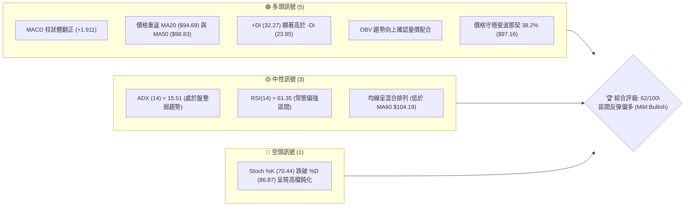
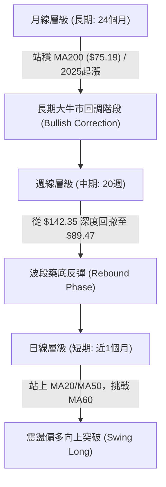
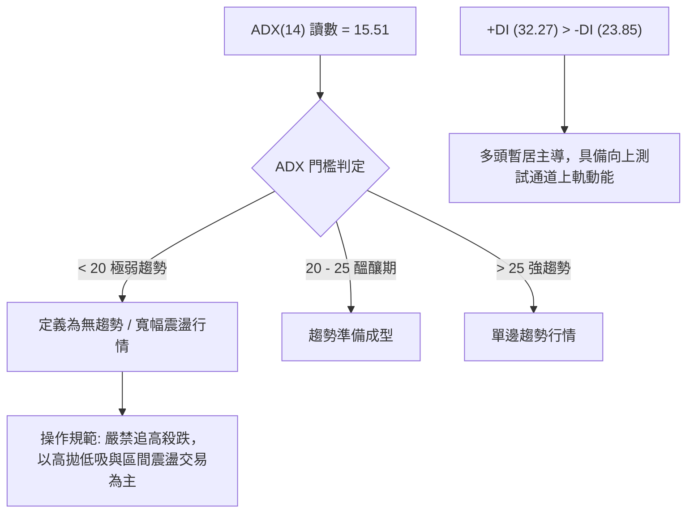
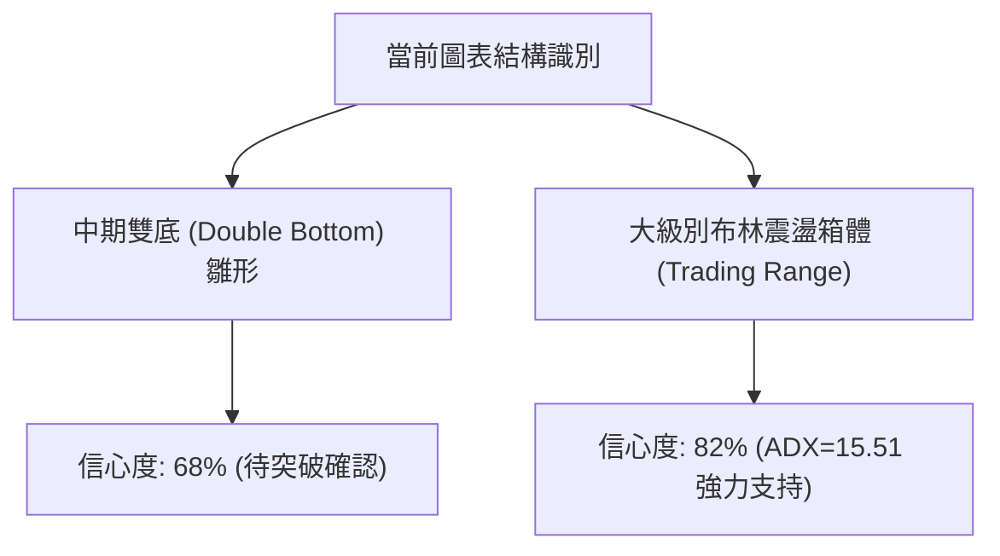
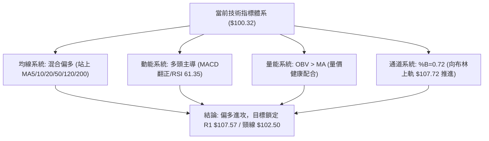
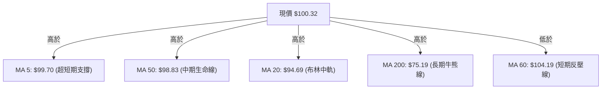
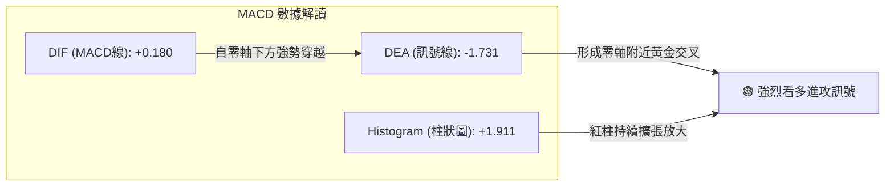
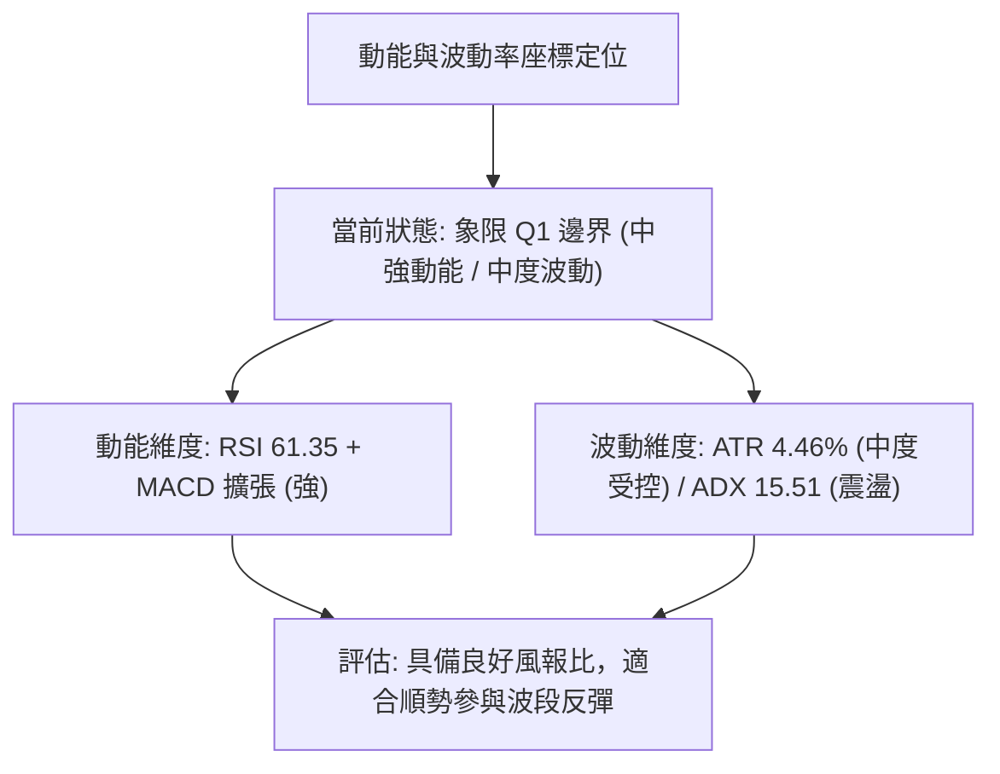
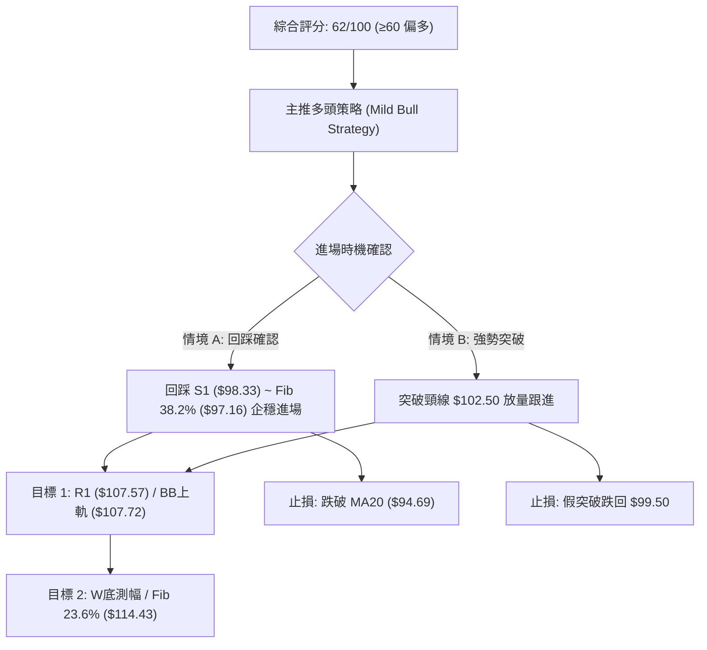
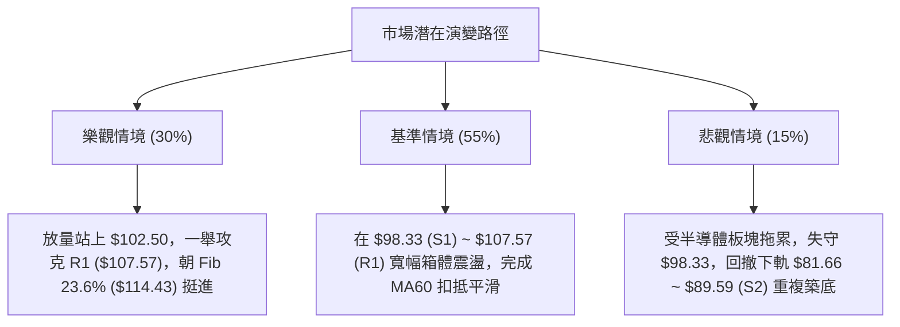

# INTC 技術分析報告

> **報告日期**：2026-09-11 ｜ **語言**：繁體中文 ｜ **數據來源**：Yahoo Finance ｜ **當前價格**：$100.32

---

## 目錄

| 章節 | 內容 |
|------|------|
| [1. 技術面概覽](#1-技術面概覽) | 訊號儀表板、核心指標、評分卡 |
| [2. 趨勢分析](#2-趨勢分析) | 多時框趨勢、長中短期走勢 |
| [3. 圖表形態分析](#3-圖表形態分析) | 形態識別、K線組合、目標價 |
| [4. 支撐與阻力](#4-支撐與阻力) | 關鍵價位、斐波那契回調 |
| [5. 技術指標深度解讀](#5-技術指標深度解讀) | MA/RSI/MACD/布林/成交量 |
| [6. 動能與波動率](#6-動能與波動率) | 動能評估、ATR、Beta |
| [7. 多時框架總結](#7-多時框架總結) | 時框架評分矩陣 |
| [8. 交易策略建議](#8-交易策略建議) | 多空策略、風險報酬比 |
| [9. 風險提示與監控](#9-風險提示與監控) | 監控指標、風險場景 |

---

## 1. 技術面概覽

### 🎯 技術訊號儀表板



### 📊 核心指標速覽表

| 指標類別 | 指標名稱 | 當前數值 | 訊號 | 解讀 |
|----------|----------|----------|------|------|
| **價格** | 當前價格 | $100.32 | 🟢 | 站上 $100 整數關卡，近一週漲幅強勁，脫離波段低位 |
| **均線** | MA20 | $94.69 | 🟢 | 價格位於 MA20 上方 +5.95%，短期底線獲支撐 |
| **均線** | MA50 | $98.83 | 🟢 | 價格突破中期生命線 MA50，空翻多訊號確立 |
| **均線** | MA200 | $75.19 | 🟢 | 遠高於長期牛熊分界線 +33.42%，長期多頭架構完好 |
| **動能** | RSI(14) | 61.35 | 🟡 | 位於 50-70 強勢中性區間，未見超買或超賣 |
| **動能** | MACD | 0.180 (Hist +1.911) | 🟢 | MACD 快線翻正且紅柱持續放大，動能強勁擴張 |
| **趨勢** | ADX(14) | 15.51 | 🟡 | ADX < 25 表明非單邊趨勢，目前為箱體震盪反彈 |
| **波動** | ATR(14) | $4.47 | 🟡 | 佔股價 4.46%，波動度適中，提供明確止損空間依據 |

### 🏆 技術評分卡

```
╔══════════════════════════════════════════════════════════════╗
║              技術評分卡 — INTC (2026-09-11)                  ║
╠══════════════════════════════════════════════════════════════╣
║ 趨勢強度 (ADX/趨勢方向)  ████████░░░░░░░░░░░░  42/100  🟡 中性 ║
║ 動能指標 (MACD/RSI/KD)   ██████████████░░░░░░  72/100  🟢 看多 ║
║ 支撐穩定度 (S1/S2/Fib)   ██████████████░░░░░░  70/100  🟢 看多 ║
║ 成交量配合 (OBV/量比)    ████████████░░░░░░░░  62/100  🟢 看多 ║
║ 形態完整度 (箱體/雙底)   ████████████░░░░░░░░  60/100  🟡 中性 ║
║ 均線排列 (多短均交叉)    ██████████████░░░░░░  68/100  🟢 看多 ║
╠══════════════════════════════════════════════════════════════╣
║ 綜合評分                 ████████████░░░░░░░░  62/100  偏多震盪 ║
╚══════════════════════════════════════════════════════════════╝
```

---

## 2. 趨勢分析

### 🌐 多時框趨勢分析



### 📈 長期趨勢 — 12個月走勢圖（Unicode）

INTC 經歷了 2025 年底到 2026 年初的激進主升段，於 2026 年 6 月創下 52 週高點 $142.35（月收盤 $139.63），隨後在 7-8 月遭遇大幅獲利了結回調至 $89.51，目前 9 月正展開強勁回抽。

```
INTC 月線走勢圖（過去 12 個月：2025-10 至 2026-09）
價格軸 ($)
$140 ┤                                     ● $139.63 (06月高點)
$120 ┤                               ● $114.68
$100 ┤                         ● $94.48             ● $100.32 (現價)
$80  ┤                                        ● $90.20  ● $89.51
$60  ┤
$40  ┤ ● $39.99  ● $40.56  ● $46.47  ● $45.61  ● $44.13
$20  ┤
     └─────────────────────────────────────────────────────────────
       10月     11月      01月      02月      04月      06月     08月  09月(當前)
      (2025)   (2025)    (2026)    (2026)    (2026)    (2026)   (2026) (2026)
```

**走勢特徵分析表格**：

| 階段 | 期間 | 價格區間 | 累計漲跌幅 | 走勢特徵與結構 |
|------|------|----------|------------|----------------|
| **奠定底倉** | 2025-10 ~ 2026-03 | $39.99 → $44.13 | +10.35% | 長期底部箱體放量築底，籌碼完成向機構轉移 |
| **爆發主升** | 2026-04 ~ 2026-06 | $44.13 → $139.63 | +216.41% | 史詩級主升浪，成交量爆發，單月連破多道大關 |
| **獲利回吐** | 2026-07 ~ 2026-08 | $139.63 → $89.51 | -35.89% | 快速洗盤回踩斐波那契 50% 附近，釋放槓桿風險 |
| **次級築底** | 2026-09 至今 | $89.51 → $100.32 | +12.08% | 於 S2 ($89.59) 獲得強烈承接，展開右側修復行情 |

### 📊 中期趨勢（週線分析）

從近 20 週收盤走勢可見，價格於 2026-08-02 週觸及 $90.20，隨後於 2026-08-30 週二次探底至 $89.47，兩度守住近一年低點聚類 S2 ($89.59)。最新兩週連續放量收陽（$95.80 → $100.32），MACD 週柱狀體從 -0.357 急速翻正為 +1.911，宣告中期修正走勢暫告段落，展開對上方跳空與壓力帶的回補。

```
近期週線壓力與支撐階梯架構：
      阻力帶 ── R1: $107.57 (布林上軌 $107.72 重合區)
      現價帶 ── $100.32 (攻克心理關卡 $100.00)
      支撐帶 ── S1: $98.33 / Fib 38.2%: $97.16
      強防守 ── S2: $89.59 (近雙週低點 $89.47 - $90.20 構築雙底支撐)
```

### ⚡ 趨勢強度評估（ADX 解讀）



**ADX 狀態對照表**：

| 項目 | 數據值 | 評估標準 | 戰術指引 |
|------|--------|----------|----------|
| **ADX(14)** | 15.51 | < 25 (弱趨勢/盤整) | 依據多時框收斂規則，本波不宜視為單邊暴漲，應依布林通道區間操作 |
| **+DI** | 32.27 | 多方進攻力量 | +DI 顯著大於 -DI，顯示近兩週多方買盤主導短線方向 |
| **-DI** | 23.85 | 空方防守力量 | 空方動能衰退，未能形成持續性下殺壓迫 |

---

## 3. 圖表形態分析

### 🔍 形態識別系統



**形態信心度與判斷表格**：

| 形態 | 信心度 | 判斷依據（引用數據） | 完成度 | 目標價（附計算式） |
|------|--------|----------------------|--------|--------------------|
| **波段雙底 (W底)** | 68% | 兩次波段低點分別為 2026-08-02 收盤 $90.20 與 2026-08-30 收盤 $89.47，完美聚類於 S2 ($89.59)；頸線位於 2026-08-16 高點 $102.50。 | 85% | 形態高度 = $102.50 - $89.47 = $13.03。<br>突破目標 = 頸線 $102.50 + $13.03 = **$115.53** (與 Fib 23.6% $114.43 高度吻合)。 |
| **箱體震盪區間** | 82% | ADX 僅 15.51，布林通道下軌 $81.66 至上軌 $107.72 構成明確水平波動區間。 | 100% | 箱體上緣目標 = **$107.72** (對應阻力位 R1 $107.57)。 |

### 🕯️ 重要K線形態分析

| 日期 | 收盤價 | K線形態特徵 | 專業解讀 | 訊號 |
|------|--------|-------------|----------|------|
| **2026-08-23** | $90.07 | 長陰探底十字星 | 考驗 S2 ($89.59) 支撐，多空劇烈分歧，下影線透露買盤入場 | 🟡 |
| **2026-08-30** | $89.47 | 雙底第二腳低點 (錘子線特徵) | 測試前低 $90.20 不破，成交量萎縮至 4.41 億股，確認浮額沉澱 | 🟢 |
| **2026-09-06** | $95.80 | 放量中陽線 | 吞沒前週實體，MACD 柱翻正，確立短期底分型結構 | 🟢 |
| **2026-09-13** | $100.32 | 連續攻堅陽線 | 強勢收復 $100 心理關卡與 MA50 ($98.83)，向頸線 $102.50 發起衝擊 | 🟢 |

### 📉 ASCII 走勢形態示意圖

```
INTC 波段 W 底與頸線突破示意圖：

價格軸 ($)
$107.57 ┤─────────────────────────────────────── [R1 強阻力 / BB上軌 $107.72]
        │
$102.50 ┤- - - - - - - - - ┌───┐ - - - - - - - - [W底頸線阻力]
        │                 │   │     ▲ 現價 $100.32 (逼近頸線)
$97.16  ┤─────────────────┼───┼─────┼─────────── [Fib 38.2% / S1 $98.33]
        │        \       /     \   /
$90.00  ┤         ▼     /       ▼ /              [雙底左腳 $90.20 / 右腳 $89.47]
$89.59  ┴──────────●───┘─────────●────────────── [S2 強支撐線]
                 08-02          08-30
```

### 🎯 形態目標價計算

1. **W 底第一目標價**：
   - 頸線位置：$102.50（2026-08-16 收盤高點）
   - 低點基準：$89.47（2026-08-30 收盤低點）
   - 形態高度：$102.50 - $89.47 = $13.03
   - 測幅目標價 = $102.50 + $13.03 = **$115.53**（落於分析師目標價均值 $115.88 附近，且貼近 Fib 23.6% $114.43）。
2. **箱體波段限制**：
   - 短線首要阻力為布林上軌與 R1 聚類區間：**$107.57 ~ $107.72**。

---

## 4. 支撐與阻力

### 🗺️ 關鍵價位分布圖（Unicode）

```
INTC 價位結構分布圖（OHLCV 精確計算）
══════════════════════════════════════════════════════════════════
$132.75 ║████████████████████████████████║ 強阻力 R3 (歷史波段次高密集區)
$126.64 ║██████████████████████          ║ 阻力 R2 (反彈高點聚類)
$114.43 ║▓▓▓▓▓▓▓▓▓▓▓▓▓▓▓▓▓▓▓▓            ║ 斐波那契 23.6% 回調位
$107.72 ║████████████████████████        ║ 布林上軌 (BB Upper)
$107.57 ║██████████████████████████████  ║ 關鍵阻力 R1 (近期震盪區頂部)
$100.32 ╠════════════════════════════════╣ ◄ 當前市價 ($100.32)
$98.33  ║▓▓▓▓▓▓▓▓▓▓▓▓▓▓▓▓▓▓              ║ 近期第一支撐 S1 (MA50 $98.83 共振)
$97.16  ║▓▓▓▓▓▓▓▓▓▓▓▓▓▓▓▓▓▓▓▓▓▓          ║ 斐波那契 38.2% 回調位
$89.59  ║████████████████████████████████║ 核心波段強支撐 S2 (W底雙腳低點)
$85.14  ║████████████████                ║ 最後防線支撐 S3
══════════════════════════════════════════════════════════════════
```

### 🚧 阻力位分析表

所有價位均嚴格取自數據庫「關鍵價位」與技術計算：

| 阻力級別 | 價位 | 距現價幅寬 | 形成原因 | 突破難度 | 重要性 |
|----------|------|------------|----------|----------|--------|
| **R1** | **$107.57** | +7.23% | 近一年波段高點聚類，與日線布林上軌 $107.72 及 MA60 ($104.19) 形成壓迫共振區 | 中等 | 🔴 極高（短線波段天花板） |
| **R2** | **$126.64** | +26.24% | 2026 年 5 月至 6 月多次震盪的籌碼套牢頸線區 | 高 | 🟡 中等（中期修復目標） |
| **R3** | **$132.75** | +32.33% | 歷史峰值回落前的最後出貨平台密集區 | 極高 | 🟡 中等（長期多頭防線） |

### 🛡️ 支撐位分析表

| 支撐級別 | 價位 | 距現價幅寬 | 形成原因 | 守住機率 | 重要性 |
|----------|------|------------|----------|----------|--------|
| **S1** | **$98.33** | -1.98% | 近期突破之波段低點聚類，緊鄰 MA50 ($98.83) 與 Fib 38.2% ($97.16) | 75% | 🟢 極高（短線強弱分水嶺） |
| **S2** | **$89.59** | -10.70% | 近 2 個月雙重底（$90.20 與 $89.47）聚類支撐，機構買盤防守點 | 88% | 🟢 核心生命線（破位則架構破壞） |
| **S3** | **$85.14** | -15.13% | 2026 年 4 月主升浪起漲初期缺口支撐點，接近 Fib 50% ($83.20) | 95% | 🟡 長期最後防護盾 |

### 📐 斐波那契回調位分析

依據 52 週完整區間（低點 **$24.05** → 高點 **$142.35**），計算標準回調階梯如下：

| 回調比率 | 價位 | 當前相對位置與解讀 |
|----------|------|--------------------|
| **0.0% (52W High)** | **$142.35** | 歷史極限高點，中期天花板 |
| **23.6%** | **$114.43** | 次級回調位；現價位於其下方，若突破 R1 則此處為第一延伸目標 |
| **38.2%** | **$97.16** | **黃金分割關鍵防守位**；現價 $100.32 已成功站回此線上，技術結構由弱轉強 |
| **50.0%** | **$83.20** | 多空半數回撤中軸；7-8 月回調最低 $89.47，未觸及此處即止跌，代表強勢回調 |
| **61.8%** | **$69.24** | 絕對牛熊防守位（高於 MA240 $68.87） |
| **78.6%** | **$49.37** | 深度回撤位 |
| **100.0% (52W Low)**| **$24.05** | 52 週最低點起漲原點 |

> **位置判斷**：當前現價 **$100.32** 穩健運行於 **38.2% ($97.16)** 與 **23.6% ($114.43)** 之間。38.2% 位的失而復得，確認了 7-8 月的拉回屬於健康的次級回調，非反轉崩跌。

---

## 5. 技術指標深度解讀

### 🎛️ 指標訊號總覽



### 📈 移動平均線排列分析



**移動平均線狀態詳解**：
- **短中期均線黃金交叉**：MA5 ($99.70) 向上穿越 MA20 ($94.69) 與 MA50 ($98.83)，展現短線攻擊力道。
- **混合排列成因**：價格目前低於 MA60 ($104.19，差距 -3.71%)，但高於其餘所有週期均線（MA5、10、20、50、120、200、240）。MA60 的下傾反映了 7-8 月急跌的慣性，將在 $104.19 處形成動態反壓，突破後均線將正式轉為完全多頭排列。

### 📉 RSI(14) 分析

- **當前讀數**：**61.35**
- **數值進度條**：
  ```
  0 [░░░░░░░░░░░░░░░░░░░░█████████████████████████░░░░░░░░░░░░░░░] 100
                         ↑ 當前 61.35 (強勢多頭區間)
  ```
- **超買超賣評估**：位於 30-70 常態區間，既無超賣鈍化，也未進入 >70 之過熱超買區，具備向上衝刺之安全空間。
- **背離檢驗**：
  - 價格 2026-08-02 週收盤 $90.20，週 RSI 為 39.5。
  - 價格 2026-08-30 週收盤 $89.47（價格創微幅新低），週 RSI 為 38.1（未創新低，底背離雛形）。
  - 現週 RSI 迅速拉升至 61.3，指標與價格同步上行，**無頂背離跡象**，動能結構健康。

### 📊 MACD(12/26/9) 訊號解讀



MACD 線自 -1.731 下方強勢翻揚並突破零軸至 +0.180，柱狀體（Histogram）高達 +1.911，創近 6 週新高，確認波段反彈動能正處於最強盛的擴張期。

### 📦 布林通道分析

```
INTC 布林通道（20日，2倍標準差）結構示意圖：

$107.72 ┬──────────────────────────────────────────── BB 上軌 (Upper)
        │
$100.32 ┼──────────────────────────────● (現價，%B = 0.72)
        │                              ▲ 沿中軌強勢向中上軌挺進
$94.69  ┼──────────────────────────────┴───────────── BB 中軌 (MA20)
        │
$81.66  ┴──────────────────────────────────────────── BB 下軌 (Lower)
```

- **通道參數**：上軌 $107.72，中軌 $94.69，下軌 $81.66。
- **帶寬與位置**：BB %B 為 **0.72**，代表價格已脫離中軌（0.5），正朝向布林上軌發動推升。在 ADX=15.51 的震盪環境下，布林通道上軌 $107.72 是極為可靠的波段回歸阻力目標。

### 💹 成交量分析（量價配合度）

- **最新成交量**：96,354,400 股。
- **均量對比**：大於 20 日均量（93,172,310 股），量比為 **1.03x**；隨價格走高，成交量維持於億股水準，未見量價背離。
- **OBV（能量潮）狀態**：官方技術指標明確標示「**OBV > MA → 量能支撐上漲**」。資金流向指標與價格同步揚升，表明籌碼在 $90-$100 區間有主力機構穩定承接換手。

---

## 6. 動能與波動率

### ⚡ 動能評估四象限



| 象限 | 動能強度 | 波動率水準 | 標的所屬狀態 | 戰術指引 |
|------|----------|------------|--------------|----------|
| **Q1 (最佳機會)** | **強 (MACD紅柱擴大)** | **低至中 (ATR 4.46%)** | **✓ (當前狀態)** | **順勢做多，依據支撐設置明確止損** |
| **Q2 (謹慎觀望)** | 弱 | 低 | - | 資金沉澱，等待方向突破 |
| **Q3 (高風險利潤)**| 強 | 極高 (ATR > 8%) | - | 劇烈單邊，需大幅收緊倉位 |
| **Q4 (避免進場)** | 弱 | 極高 | - | 混亂下跌，嚴格空倉 |

### 📊 ATR 波動率分析

- **ATR(14) 絕對值**：**$4.47**
- **ATR 相對比率**：$4.47 / $100.32 = **4.46%**
- **止損距離建議**：
  - 短線激進止損（1.0 × ATR）：$4.47 緩衝空間（止損位約在 $95.85，高於 MA20 $94.69）。
  - 波段防守止損（1.5 × ATR）：$6.70 緩衝空間（止損位約在 $93.62，守於 MA20 之下）。
  - 結構破位止損（依 S1 關鍵位）：以 S1 ($98.33) 跌破作為短線減碼點。

### 📐 Beta 與市場相關性

- **Beta 係數**：**2.231**
- **特性解讀**：INTC 具備極高的市場彈性（High-Beta 晶片股代表），波動幅度約為標普 500 指數的 2.23 倍。在市場風險偏好（Risk-on）升溫時，INTC 反彈爆發力強勁；但在系統性回調時跌幅亦深，操作上絕不可過度使用槓桿。

---

## 7. 多時框架總結

### 📋 時框架評分表

| 時框架 | 趨勢方向 | 動能狀態 | 均線排列 | 關鍵圖表形態 | 綜合評分 | 操作建議 |
|--------|----------|----------|----------|--------------|----------|----------|
| **日線 (短期)** | 偏多反彈 | 偏強 (RSI 61.35) | 混合 (破MA60未遂) | 逼近 W 底頸線 $102.50 | **65/100 🟢** | 逢回調測試 S1 佈局多單 |
| **週線 (中期)** | 震盪築底 | 強勢 (MACD柱翻正) | 依托 MA20/50 整理 | S2 ($89.59) 雙底成立 | **62/100 🟢** | 鎖定 R1 ($107.57) 目標 |
| **月線 (長期)** | 多頭回調 | 中性修復 | 遠高於 MA200/240 | 主升浪後的回踩清洗 | **60/100 🟢** | 長線多頭底倉續抱 |

### 🔲 綜合訊號矩陣

```
┌─────────────────┬────────────────────────────────────────────────────────┐
│ 時框維度        │ 訊號判定與相互驗證關係                                 │
├─────────────────┼────────────────────────────────────────────────────────┤
│ 日線 vs 週線    │ 日線突破 MA50，週線 MACD 翻正共振，短中期無矛盾。       │
│ 週線 vs 月線    │ 週線回撤在月線 MA200 遠端獲得強力支撐，屬於健康回調。  │
│ 動能 vs 形態    │ MACD 紅柱與 W 底右腳放量吻合，量價結構相互確認。       │
│ 趨勢強度 (ADX)  │ ADX=15.51 提示不可追高，波段高點受制於布林上軌。       │
└─────────────────┴────────────────────────────────────────────────────────┘
```

### ⚖️ 多時框收斂結論

依據多時框收斂規則第 14 條：
1. **當前市場定性**：當前 ADX(14) 為 **15.51 (<25)**，嚴格判定為**「盤整/箱體震盪行情」**而非單邊趨勢行情。
2. **主導交易區間**：以**日線布林通道上下軌（$81.66 ~ $107.72）**作為核心操作區間，上方主要波段高點阻力聚類為 **R1 ($107.57)**。
3. **唯一方向性結論**：**【偏多震盪（Mild Bullish）】**。雖然 ADX 偏低限制了連續單邊暴漲的想像，但因日線、週線動能（MACD 翻正、OBV 支撐）一致向上，且價格已穩固站上 S1 ($98.33) 與 Fib 38.2% ($97.16)，因此主策略為**「依託短線支撐，逢低做多挑戰布林上軌與 R1 阻力帶」**。

---

## 8. 交易策略建議

### 🗺️ 策略決策流程圖



### 🧭 策略路由

> **當前主策略方向 = 【逢低做多 / 突破跟進多頭策略】（依綜合評分 62/100，≥60 主推偏多方案）**
> 空頭方向不作為主推策略，僅列為下破 S2 之防禦對沖提示。

### 🎯 價格情境階梯（Price Scenarios）

價位嚴格引用技術數據計算數值：

| 觸發條件 | 下一目標 | 後續延伸 | 情境含義 |
|----------|----------|----------|----------|
| **突破頸線 $102.50 與 MA60 ($104.19)** | **R1: $107.57** (BB上軌) | **Fib 23.6%: $114.43** | 短線多頭波段發動，挑戰箱體頂部 |
| **突破 R1 $107.57 並站穩** | **R2: $126.64** | **R3: $132.75** | 中期回調結束，重啟歷史高點挑戰浪 |
| **維持在 $98.33 ~ $102.50 震盪** | — | — | 消化 MA60 浮額，醞釀均線糾纏金叉 |
| **跌破 S1 $98.33** | **S2: $89.59** | **S3: $85.14** | 短線反彈失敗，重新測試箱體雙底支撐 |

### 📊 情境機率分佈

| 情境 | 機率 | 主要依據 |
|------|------|----------|
| **震盪上行挑戰 R1** | **60%** | MACD 柱狀體放大至 +1.911、+DI (32.27) 主導、OBV 向上支撐、守穩 Fib 38.2%。 |
| **區間橫盤蓄勢** | **25%** | ADX 僅 15.51 抑制暴衝速度，MA60 ($104.19) 下行壓制需要時間化解。 |
| **破位再探低點** | **15%** | S2 ($89.59) 歷經兩次考驗已構築堅實買盤，除非總體半導體劇烈黑天鵝，否則破位機率低。 |

### 🟢 主策略詳情

| 策略要素 | 策略 A：回踩支撐低吸（穩健型） | 策略 B：突破頸線順勢（進取型） |
|----------|--------------------------------|--------------------------------|
| **適用場景** | 短線遇阻回撤，測試支撐 | 強勢放量突破近月頸線反壓 |
| **進場條件** | 價格回踩 S1 ($98.33) 附近且 1H 出現底分型 | 日K收盤突破 $102.50 且成交量 > 1 億股 |
| **進場價格** | **$98.50** | **$102.80** |
| **目標價 T1** | **$107.57** (R1 / BB上軌，獲利 +9.2%) | **$107.57** (R1 阻力，獲利 +4.6%) |
| **目標價 T2** | **$114.43** (Fib 23.6% / 測幅，獲利 +16.2%) | **$114.43** (形態測幅，獲利 +11.3%) |
| **止損價格** | **$94.50** (跌破 MA20 $94.69，風險 -4.06%) | **$99.00** (跌破 MA50 $98.83，風險 -3.70%) |
| **風險報酬比** | **1 : 2.27** (以 T1 計算) / **1 : 3.92** (以 T2 計算) | **1 : 1.25** (以 T1 計算) / **1 : 3.05** (以 T2 計算) |
| **預估勝率** | 65% | 58% |
| **建議倉位** | 15% - 20% 資金倉位 | 10% - 15% 資金倉位 |

### 🔴 反向風險觸發點（對沖提示）

- **觸發條件**：若市價未破 R1 反而掉頭跌破 **S1 ($98.33)** 且日K收於其下，說明多頭反彈動能衰竭。
- **對沖應對**：跌破 $98.33 應立即將多頭部位減半；若進一步跌破 **$94.69 (MA20)**，則多單應全數停損離場，並可動用 5% 倉位反手建立空頭避險，目標回測 **S2 ($89.59)**。

### ⭐ 整體訊號強度評星

```
做多訊號強度：★★★★☆  (4/5星 — 動能與支撐扎實，唯 ADX 偏低)
做空訊號強度：★☆☆☆☆  (1/5星 — 均線與 MACD 全面偏多，逆勢做空風險極大)
整體可信度：  ★★★★☆  (4/5星 — 多時框指標共振良好)
```

---

## 9. 風險提示與監控

### ✅ 關鍵監控指標 Checklist

```
╔══════════════════════════════════════════════════════════════╗
║               INTC 交易風控與關鍵數據監控清單                ║
╠══════════════════════════════════════════════════════════════╣
║ [ ] 價格是否跌破關鍵短線生命線 S1 ($98.33)                   ║
║ [ ] 價格上攻至 MA60 ($104.19) 與 R1 ($107.57) 時是否放量滯漲 ║
║ [ ] RSI(14) 是否突破 70 進入極端超買區                       ║
║ [ ] 日線布林通道是否開始擴口（帶寬膨脹）                      ║
║ [ ] ADX(14) 讀數是否突破 25，確認進入單邊趨勢行情            ║
║ [ ] 成交量是否連續兩日跌破 20 日均量 (93,172,310 股)         ║
║ [ ] 費城半導體指數 (SOX) 是否出現高位系統性回調 (Beta 2.231) ║
╚══════════════════════════════════════════════════════════════╝
```

### ⚠️ 風險場景分析



### 🛡️ 風險管理重要提醒

1. **Beta 係數達 2.231 的槓桿控管**：INTC 波動為大盤的兩倍以上，當日波動 ATR 為 $4.47（4.46%）。單筆交易之最大虧損金額嚴格限制於總資產的 1.5% 以內，以進場價 $98.50、止損 $94.50（風險 $4.00）計算，倉位規模不得超過總資金之 20%。
2. **ADX 盤整環境之交易紀律**：在 ADX < 25 期間，**嚴禁在阻力位附近盲目追高**。布林上軌 $107.72 與 R1 $107.57 為極強阻力密集區，多單抵達該區域必須至少獲利了結 50% 倉位。
3. **缺口與財報事件風險**：科技股易受晶圓製造進度與同業競爭消息影響，持倉期間應隨時關注半導體供應鏈數據。

---

## 📋 報告總結

```
╔══════════════════════════════════════════════════════════════════╗
║                    INTC 技術分析報告總結                         ║
╠══════════════════════════════════════════════════════════════════╣
║ 報告日期：2026-09-11                                             ║
║ 當前價格：$100.32                                                ║
║ 分析評級：⚖️ 偏多震盪 (Mild Bullish) — 綜合技術評分: 62/100     ║
║                                                                  ║
║ 關鍵結論：                                                       ║
║ ├─ 長期趨勢：🟢 完好多頭，遠高於 MA200 ($75.19) 與 MA240 ($68.87) ║
║ ├─ 中期趨勢：🟢 雙底築底完成，S2 ($89.59) 獲得確認，MACD翻正     ║
║ ├─ 短期趨勢：🟢 站上 $100 整數關與 MA50 ($98.83)，向頸線衝刺     ║
║ ├─ 關鍵支撐：S1: $98.33 (短線) ｜ S2: $89.59 (波段生命線)        ║
║ ├─ 關鍵阻力：R1: $107.57 (BB上軌共振) ｜ R2: $126.64             ║
║ └─ 測幅目標：形態目標 $115.53 ｜ 分析師均值: $115.88            ║
║                                                                  ║
║ 最優策略組合：                                                   ║
║ 1. 🥇 最佳機會：回踩 S1 ($98.33) ~ Fib 38.2% ($97.16) 佈局多單， ║
║               止損設於 MA20 ($94.50)，首目標 R1 ($107.57)。      ║
║ 2. 🥈 次選機會：強勢放量突破頸線 $102.50 順勢加碼，看 $114.43。  ║
║ 3. 🥉 保守選擇：等待價格觸及布林上軌 $107.72 出現遇阻訊號高拋，   ║
║               維持通道高拋低吸之網格化操作。                     ║
╚══════════════════════════════════════════════════════════════════╝
```

---

> ⚠️ **免責聲明**：本報告為基於市場公開技術數據之量化客觀分析，所有關鍵價位與技術指標解讀均嚴格基於所提供之歷史價格與量能資訊。本報告**僅供研究與學術參考**，**不構成任何要約、推薦或投資建議**。金融市場具有高波動風險，投資人應獨立審慎評估自身風險承受能力並自負盈虧。

---

*報告生成時間：2026-09-11 ｜ 數據來源：Yahoo Finance ｜ 分析框架：多時框技術分析體系*