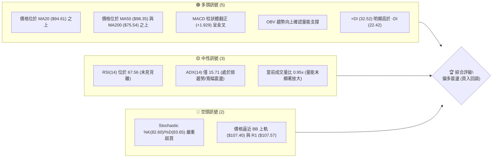
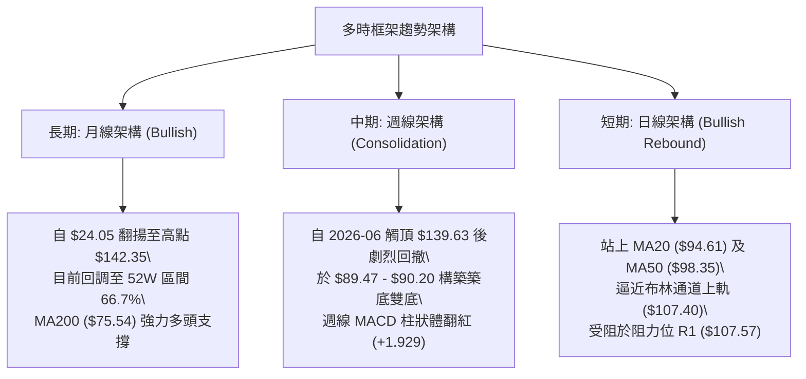
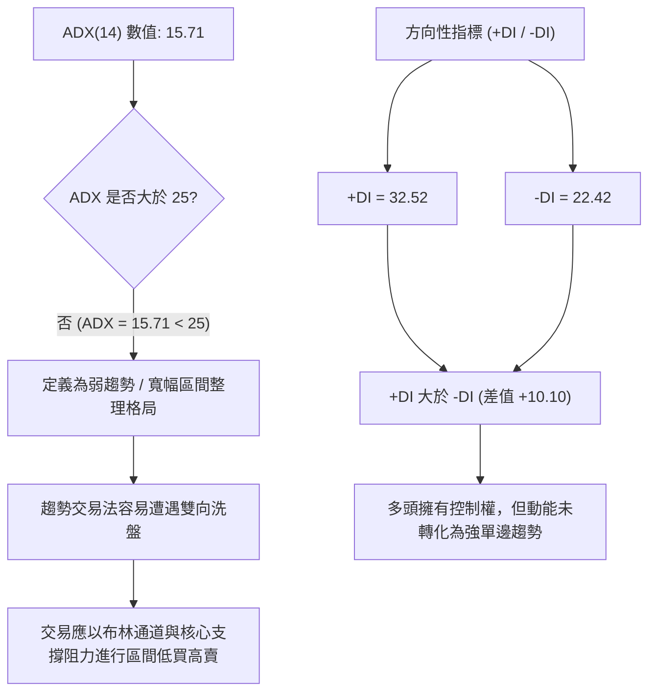
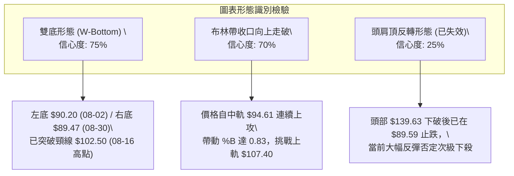
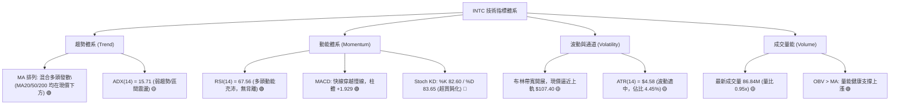
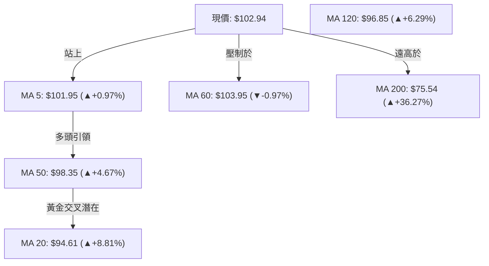
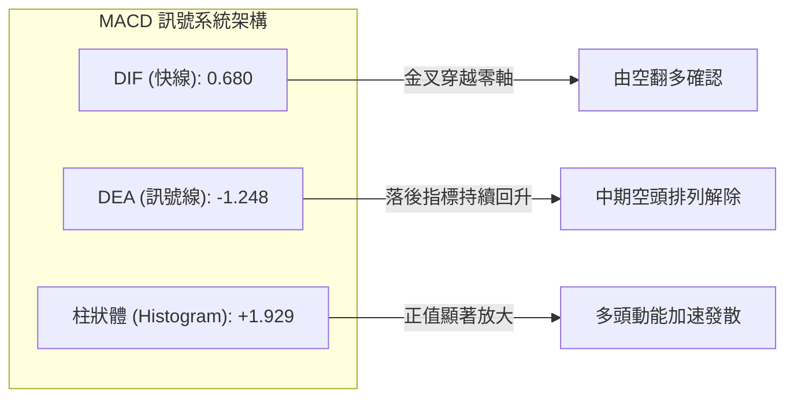
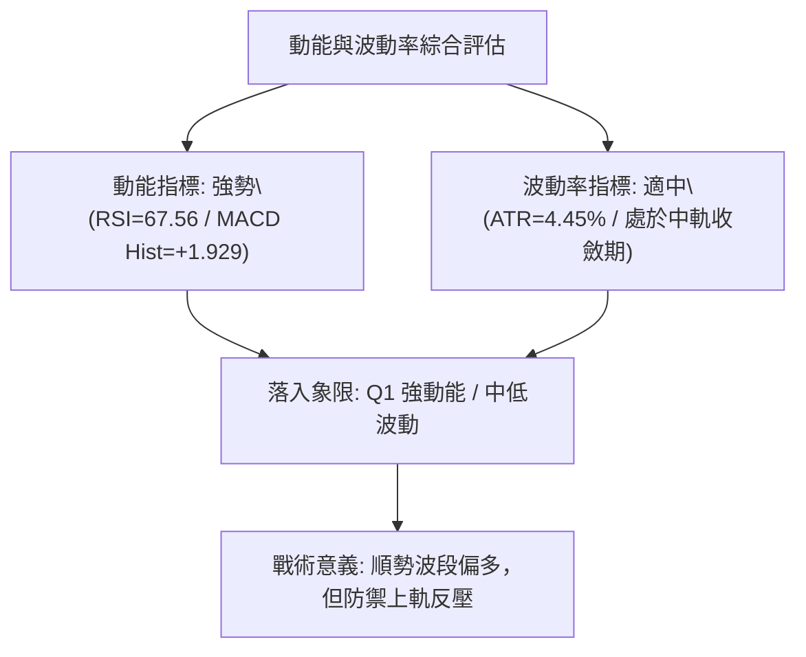
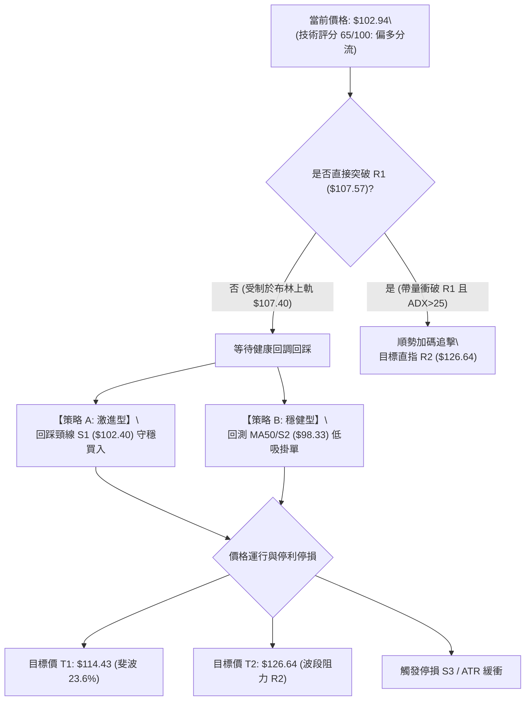
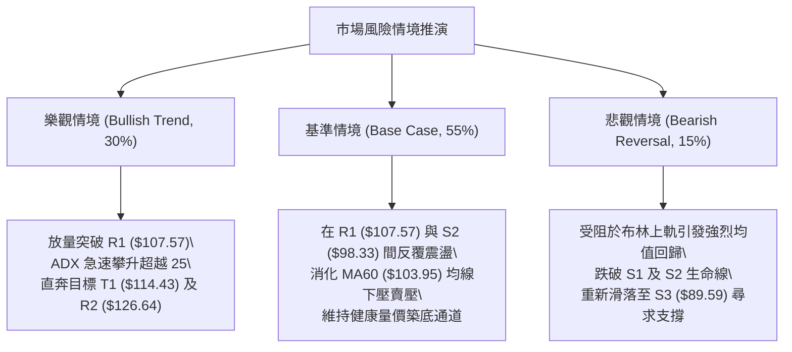

# INTC 技術分析報告

> **報告日期**：2026-09-12 ｜ **語言**：繁體中文 ｜ **數據來源**：Yahoo Finance ｜ **當前價格**：$102.94

---

## 目錄

| 章節 | 內容 |
|------|------|
| [1. 技術面概覽](#1-技術面概覽) | 訊號儀表板、核心指標、評分卡 |
| [2. 趨勢分析](#2-趨勢分析) | 多時框趨勢、長中短期走勢 |
| [3. 圖表形態分析](#3-圖表形態分析) | 形態識別、K線組合、目標價 |
| [4. 支撐與阻力](#4-支撐與阻力) | 關鍵價位、斐波那契回調 |
| [5. 技術指標深度解讀](#5-技術指標深度解讀) | MA/RSI/MACD/布林/成交量 |
| [6. 動能與波動率](#6-動能與波動率) | 動能評估、ATR、Beta |
| [7. 多時框架總結](#7-多時框架總結) | 時框架評分矩陣 |
| [8. 交易策略建議](#8-交易策略建議) | 多空策略、風險報酬比 |
| [9. 風險提示與監控](#9-風險提示與監控) | 監控指標、風險場景 |

---

## 1. 技術面概覽

### 🎯 技術訊號儀表板



### 📊 核心指標速覽表

| 指標類別 | 指標名稱 | 當前數值 | 訊號 | 解讀 |
|----------|----------|----------|------|------|
| **價格** | 當前價格 | $102.94 | 🟢 | 突破百元關卡，站穩多數中期均線之上 |
| **均線** | MA20 | $94.61 | 🟢 | 現價高於 MA20 達 +8.81%，短期多頭排列 |
| **均線** | MA50 | $98.35 | 🟢 | 現價收復中期生命線，支撐買盤強固 |
| **均線** | MA200 | $75.54 | 🟢 | 長期牛熊分界線維持向上陡峭發散 (+36.27%) |
| **動能** | RSI(14) | 67.56 | 🟡 | 逼近超買界線 (70)，動能強勁但短線追價空間受限 |
| **動能** | MACD | 0.680 / Sig: -1.248 | 🟢 | MACD 穿越零軸且柱體擴大至 +1.929，偏多發散 |
| **震盪** | KD (14,3,3) | %K 82.60 / %D 83.65 | 🔴 | 進入超買鈍化區，隨時有技術性回洗壓力 |
| **趨勢** | ADX(14) | 15.71 (+DI 32.52) | 🟡 | 趨勢強度不足 25，屬於「多頭主導下的震盪箱體整理」 |
| **波動** | ATR(14) | $4.58 (4.45%) | 🟡 | 每日波幅大，需設定合理動態止損緩衝 |
| **通道** | 布林帶 %B | 0.83 (上軌 $107.40) | 🟡 | 運行於中軌與上軌間，逼近上軌壓力區 |

### 🏆 技術評分卡

```
╔══════════════════════════════════════════════════════════════════╗
║              技術評分卡 — INTC (2026-09-12)                      ║
╠══════════════════════════════════════════════════════════════════╣
║ 趨勢強度      ███████░░░░░░░░░░░░░  35/100  🟡 中性 (ADX=15.71)  ║
║ 動能指標      ██████████████░░░░░░  70/100  🟢 偏多 (MACD/RSI偏強)║
║ 支撐穩定度    ████████████████░░░░  80/100  🟢 強勁 (S1/S2重疊線)║
║ 成交量配合    ████████████░░░░░░░░  60/100  🟡 中性 (量比0.95x)  ║
║ 形態完整度    ██████████████░░░░░░  70/100  🟢 偏多 (W底頸線測試)║
║ 均線排列      ██████████████░░░░░░  70/100  🟢 偏多 (多頭反擊排列)║
╠══════════════════════════════════════════════════════════════════╣
║ 綜合評分      █████████████░░░░░░░  65/100  🟢 偏多 (建議逢低買入)║
╚══════════════════════════════════════════════════════════════════╝
```

---

## 2. 趨勢分析

### 🌐 多時框趨勢分析



### 📈 長期趨勢 — 12個月走勢圖（Unicode）

```
INTC 月線走勢圖（2025-10 至 2026-09）
價格軸 ($)
$140 ┤                                       ● 2026-06 ($139.63, 歷史高位區域)
$130 ┤                                      / \
$120 ┤                                     /   \
$110 ┤                               ● 05 /     \
$100 ┤                             /             \               ● 現價 $102.94
$90  ┤                            ● 04            ● 07    ● 08  /
$80  ┤                           /                 \_____/
$70  ┤                          /
$60  ┤                         /
$50  ┤               ● 01  ● 02
$40  ┤   ● 10   ● 11   \___/
$30  ┤    \____/
     └─┬──────┬──────┬──────┬──────┬──────┬──────┬──────┬──────┬──────┬──────┬──────┬─
     25-10  25-11  25-12  26-01  26-02  26-03  26-04  26-05  26-06  26-07  26-08  26-09
     39.99  40.56  36.90  46.47  45.61  44.13  94.48 114.68 139.63  90.20  89.51 102.94
```

#### 走勢特徵分析表格

| 階段 | 時間跨度 | 起點/終點價格 | 累計漲跌幅 | 核心推動結構與走勢特徵 |
|------|----------|---------------|------------|------------------------|
| **底層打底** | 2025-10 ~ 2025-12 | $39.99 → $36.90 | -7.73% | 築底夯實，在 $40 關卡形成密集籌碼換手換底帶 |
| **主升一浪** | 2026-01 ~ 2026-03 | $46.47 → $44.13 | -5.04% | 平台整理洗盤，蓄勢突破 52 週低位 ($24.05) 之後的次級中樞 |
| **狂暴主升** | 2026-04 ~ 2026-06 | $44.13 → $139.63 | +216.41% | 暴利主升浪，成交量極限放大，觸及 52 週最高點 $142.35 |
| **深幅回撤** | 2026-07 ~ 2026-08 | $139.63 → $89.51 | -35.89% | 高檔獲利回吐，快速測試斐波那契 38.2% ($97.16) 及 50% ($83.20) 區間 |
| **波段復甦** | 2026-08 ~ 2026-09 | $89.51 → $102.94 | +15.00% | 探底 $89.47 後展開反彈，相繼收復 MA20 及 MA50，呈現波段復甦 |

### 📊 中期趨勢（週線分析）

```
中期支撐阻力結構（近 20 週收盤走勢演變）
$142.35 ═════════════════════════════════════════════ 52W 高點 (歷史阻力)
             ▲ (2026-06 觸頂回落)
             │
$126.64 ─────┼─────────────────────────────────────── R2 (次級阻力位)
             │        ▲ 06-28 ($128.32)
             │       / \
$107.57 ─────┼──────/───\─────────────▲────────────── R1 / BB 上軌 ($107.40)
             │     /     \           /  現價 $102.94
$102.40 ─────┼────/───────\─────────/──────────────── S1 支撐
             │   /         \       /
$98.33  ─────┼──/───────────\─────/────────────────── S2 (MA50 / 斐波 38.2%)
             │ /             \   /
$89.59  ─────●────────────────●─●──────────────────── S3 / 雙底頸線底座 ($89.47-$90.20)
           06-07            08-02  08-30
           ($99.17)        ($90.20) ($89.47)
```

週線層級顯示，股價歷經 2026 年 7-8 月的急速去槓桿下殺後，在 $89.47 - $90.20 附近獲得強大逢低買盤支撐，此處亦緊扣 S3 ($89.59)。近兩週（09-06 至 09-13）週線連續收陽，收盤價由 $95.80 攀升至 $102.94，週 RSI 從極度疲軟的 37.6 快速回升至 67.6，顯示中期賣壓已消化殆盡，進入震盪上行築底通道。

### ⚡ 趨勢強度評估（ADX 解讀）



#### ADX 趨勢強度對照表

| 指標變數 | 當前讀數 | 門檻區間 | 趨勢判定 | 操作指引 |
|----------|----------|----------|----------|----------|
| **ADX(14)** | **15.71** | `< 20` 極弱 / `20-25` 盤整 | **無方向性單邊趨勢** | 拒絕高位突破追多；轉向高拋低吸之均值回歸策略 |
| **+DI** | **32.52** | `> 25` 強多方 | **多方主導** | 買方掌控市場定價權，空頭反撲動能薄弱 |
| **-DI** | **22.42** | `< 25` 弱空方 | **賣方動能衰竭** | 拋售壓力顯著放緩，回調幅度有限 |
| **ADX 變化率** | 緩慢向上 | 翻越 20 則視為動能重燃 | **盤整醞釀期** | 關注若突破 R1 ($107.57) 同步推升 ADX > 25，則單邊成形 |

---

## 3. 圖表形態分析

### 🔍 形態識別系統



#### 形態識別信心度評估表（規則 15）

| 形態名稱 | 信心度 | 完成度 | 判斷依據（數據引用） | 形態目標價（附精確計算式） |
|----------|--------|--------|----------------------|----------------------------|
| **雙底形態 (W-Bottom)** | **75%** | **85%** | 兩次下探精確受制於波段低點：左底 $90.20 (2026-08-02) 與右底 $89.47 (2026-08-30)，雙底基底確認於 S3 ($89.59) 之上；頸線取自反彈中繼高點 $102.50 (2026-08-16)。最新收盤價 $102.94 剛好突破頸線。 | 形態高度 = 頸線 $102.50 - 低點 $89.47 = $13.03。<br>**由雙底形態推算目標價** = $102.50 + $13.03 = **$115.53**（與斐波那契 23.6% 回調位 $114.43 高度共振）。 |
| **布林中軌回踩反彈** | **70%** | **90%** | 價格在 8 月底站上 MA20 ($94.61)，並以該線作為起漲點連續攀升，%B 達到 0.83。 | 形態目標為布林上軌極限：**$107.40**。 |
| **大型頭肩頂反轉** | **25%** | **失效** | 左肩 $124.92、頭部 $139.63、右肩 $128.32；但下探至 $89.47 即獲買盤承接，未跌破關鍵頸線支撐 S3 ($89.59)，空頭動能衰退，形態轉為失敗。 | 訊號不足且形態破壞，不具備下行測幅參考價值。 |

### 🕯️ 重要 K 線形態分析

| 期間/週別 | 收盤價 | K線形態特徵 | 量價關係與技術解讀 | 多空訊號 |
|-----------|--------|-------------|--------------------|----------|
| **2026-08-02** | $90.20 | 帶長下影線之錘子線 (Hammer) | 探底打出波段低位，成交量顯著放大至 6.89 億股，主力承接盤介入 | 🟢 多頭初現 |
| **2026-08-23** | $90.07 | 倒轉長黑長針回洗線 | 自 $102.50 回調，測試前低 $90.20 不破，形成次級回踩 | 🟡 中性洗盤 |
| **2026-08-30** | $89.47 | 雙針探底之十字星星線 (Doji) | 成交量萎縮至 4.41 億股，呈現典型的「量縮見底」特徵 | 🟢 底背離孕育 |
| **2026-09-06** | $95.80 | 大陽線實體反包 | 突破前週高點，收復 MA20，週 MACD 柱體首度由負翻正 (+0.624) | 🟢 轉折確認 |
| **2026-09-13** | $102.94| 光頭偏多實體陽線 | 站上 MA50 ($98.35)，正式越過 S1 ($102.40)，量能溫和放大至 4.20 億股 | 🟢 多頭延續 |

### 📉 ASCII 走勢形態示意圖

```
雙底 (W-Bottom) 頸線突破示意圖
─────────────────────────────────────────────────────────────
$107.57 ┤                                      [阻力位 R1 / 上軌 $107.40]
$105.00 ┤                                        /
$102.94 ┤                           突破點!    ● [當前價格]
$102.50 ┼───────────────●─────────────────────┼────── [頸線 Resistance]
$100.00 ┤             /   \ (08-16)          /
$95.00  ┤            /     \                /
$92.00  ┤           /       \              /
$90.00  ┤   ●──────/         \──────●─────/
$89.47  ┤   (08-02 左底)       (08-30 右底)
─────────────────────────────────────────────────────────────
指標狀態: MACD 柱翻正 (+1.929) ｜ RSI = 67.56 ｜ 量能配合回升
```

### 🎯 形態目標價計算

```
╔══════════════════════════════════════════════════════════════════╗
║                  雙底形態垂直測幅計算公式                        ║
╠══════════════════════════════════════════════════════════════════╣
║ 頸線阻力點 (Neckline)          :  $102.50                        ║
║ 形態最低點 (Trough Low)        :  $89.47                         ║
║ 形態垂直振幅 (Pattern Height)  :  $102.50 - $89.47 = $13.03      ║
║                                                                  ║
║ 垂直最小測幅目標 (T1)          :  頸線 + 形態高度                ║
║                                :  $102.50 + $13.03 = $115.53     ║
║ (註: 該目標價與 52 週斐波那契 23.6% 回調位 $114.43 誤差 < 1%)    ║
║                                                                  ║
║ 次級延伸測幅目標 (T2)          :  前波密集阻力帶 (引用 R2)        ║
║                                :  $126.64                        ║
╚══════════════════════════════════════════════════════════════════╝
```

---

## 4. 支撐與阻力

### 🗺️ 關鍵價位分布圖（Unicode）

```
INTC 價位結構與籌碼密集分布圖
═════════════════════════════════════════════════════════════════════
$142.35 ║████████████████████████████████████████║ 52週歷史高點 / 斐波那契 0.0%
$132.75 ║████████████████████                    ║ 強波段阻力 R3 (+28.96%)
$126.64 ║████████████████████████████            ║ 密集套牢阻力 R2 (+23.02%)
$114.43 ║██████████████████                      ║ 斐波那契 23.6% 回調位 / 形態目標
$107.57 ║████████████████████████████████        ║ 關鍵波段阻力 R1 (+4.50%) / BB上軌 $107.40
$102.94 ╠════════════════════════════════════════╣ ◄ 現價 $102.94
$102.40 ║▓▓▓▓▓▓▓▓▓▓▓▓▓▓▓▓▓▓▓▓▓▓▓▓▓▓▓▓▓▓▓▓        ║ 關鍵即時支撐 S1 (-0.52%) / 頸線重疊
$98.33  ║████████████████████████████████████    ║ 中期生命線支撐 S2 (-4.48%) / MA50
$97.16  ║████████████████████                    ║ 斐波那契 38.2% 回調位
$89.59  ║████████████████████████████████████████║ 雙底結構強支撐 S3 (-12.97%)
$83.20  ║██████████████                          ║ 斐波那契 50.0% 強度防線
═════════════════════════════════════════════════════════════════════
```

### 🚧 阻力位分析表

所有價位精確引用自波段高點聚類數據：

| 阻力級別 | 價位 | 與現價差距 | 形成原因與量價結構 | 突破難度 | 重要性 |
|----------|------|------------|--------------------|----------|--------|
| **R1** | **$107.57** | +4.50% | 布林通道上軌 ($107.40) 與 MA60 ($103.95) 的強烈共振區，為近 4 週震盪高點聚類 | 🟡 中等 (需 ADX 突破 20 帶量配合) | ★★★★☆ |
| **R2** | **$126.64** | +23.02% | 2026 年 5 月中至 6 月中旬的大成交量洗盤密集平台 ($124.57 - $128.32)，套牢賣壓沉重 | 🔴 極高 (需千億級成交量支援) | ★★★★★ |
| **R3** | **$132.75** | +28.96% | 主升浪頂部次高點 ($133.99) 回撤引導位，為高檔多頭最後掙扎區域 | 🔴 極高 (高檔強烈解套盤壓) | ★★★☆☆ |

### 🛡️ 支撐位分析表

所有價位精確引用自波段低點聚類數據：

| 支撐級別 | 價位 | 與現價差距 | 形成原因與量價結構 | 守住機率 | 重要性 |
|----------|------|------------|--------------------|----------|--------|
| **S1** | **$102.40** | -0.52% | 短期突破之雙底頸線位置，日線均線 MA5 ($101.95) 與近期震盪密集下緣重合 | 🟢 70% | ★★★★☆ |
| **S2** | **$98.33** | -4.48% | 中期均線 MA50 ($98.35) 絕對重疊線，具備極強的機構趨勢防守盤護盤效應 | 🟢 85% | ★★★★★ |
| **S3** | **$89.59** | -12.97% | 2026 年 8 月兩次波段下探低點聚類 ($89.47 - $90.20)，多頭牛市防線底座 | 🟢 95% | ★★★★★ |

### 📐 斐波那契回調位分析

依據 52 週波動區間：**最低點 $24.05** 至 **最高點 $142.35**（垂直波幅達 $118.30）進行回調位精確比對：

```
斐波那契回調級別與當前價格落點：
0.0%  (52W High) : $142.35
23.6% 回調位      : $114.43 ──┐
                              ├─ 現價 $102.94 運行於 23.6% 與 38.2% 回調區間內
38.2% 回調位      : $97.16  ──┘
50.0% 回調位      : $83.20
61.8% 回調位      : $69.24
78.6% 回調位      : $49.37
100.0%(52W Low)  : $24.05
```

- **位置解讀**：現價 $102.94 穩穩守於 **38.2% 回調位 ($97.16)** 之上，此位置與支撐位 **S2 ($98.33)** 構成極為厚實的緩衝墊。強勢回調不破 38.2% 屬於典型的強多頭回撤修正範疇。
- **阻力映射**：上方第一目標強烈鎖定於 **23.6% 回調位 ($114.43)**，該點位不僅為斐波那契第一阻力關卡，更與第 3 章由雙底形態推算出的測幅目標 **$115.53** 極度重合，形成多頭進攻的完美第一獲利了結錨點。

---

## 5. 技術指標深度解讀

### 🎛️ 指標訊號總覽



### 📈 移動平均線排列分析



#### 均線各維度數據深度對比

| 均線名稱 | 當前價格 | 與現價偏差 | 走勢特徵與微觀排列形態 | 技術意義解讀 |
|----------|----------|------------|------------------------|--------------|
| **MA 5** | $101.95 | +0.97% | ▁▁▂▄▅▇▇▇▇████▇▆ (極端衝頂) | 短線極限加速線，回調不破 MA5 為極端強勢 |
| **MA 10**| $95.94 | +7.29% | ▄▃▃▃▃▃▄▅▆▇████▇▆ (底部翻揚) | 短波段起跑線，提供即時動態追價買盤 |
| **MA 20**| $94.61 | +8.81% | █▇▆▅▅▄▄▃▃▄▄▄▄▃▃ (走平回升) | 布林通道中軌，月度多空分界線，確認止跌 |
| **MA 50**| $98.35 | +4.67% | 季線級別，現價由下而上反包站回 | 中期防禦生命線，確認 8 月下旬以來的假跌破結束 |
| **MA 60**| $103.95 | -0.97% | ████▇▇▇▆▆▆▆▆▆▅▅ (持續下壓) | 唯一的短期壓制線，現價正於此線前展開拉鋸突破 |
| **MA 120**| $96.85 | +6.29% | ▁▁▁▁▂▂▂▂▃▃▃▄▄▄▅ (平穩爬升) | 半年線支撐，與 MA50 在 $96-$98 形成堅固共振托底 |
| **MA 200**| $75.54 | +36.27%| ▁▁▁▁▂▂▂▃▃▃▃▄▄▄▅ (強勢多頭發散) | 年線多頭大本營，中長線絕對牛市根基未遭撼動 |

### 📉 RSI(14) 分析

- **當前讀數**：**67.56**
- **強度可視化**：
  ```
  RSI(14) 狀態: [ 67.56 / 100 ]
  0 ══════════ 超賣(30) ══════════════ 中軸(50) ═══════ 當前(67.56) ═ 超買(70) ══════ 100
  ██████████████████████████████████████████████████████████████░░░░░░░░░░░░░░░░░░
  ```
- **動能評估**：RSI 位於 60–70 強勢多頭進攻區。過去 4 週由 26.9 的極度超賣區迅速拉升，動能修復十分猛烈。目前數值已逼近 70 超買警戒線，但尚未正式進入鈍化區，多頭仍有最後衝刺動能。
- **背離分析**：
  - **日線層級**：價格打出 $89.47 右底時，日線 RSI 築出底背離；目前價格向上突破 $102.94，RSI 同步創出近 6 週新高，**未出現頂背離**現象。
  - **結論**：指標與價格走勢呈現**正向匹配確認**，短線上行趨勢健康，僅需防範指標破 70 後引發的技術性拉回。

### 📊 MACD(12/26/9) 訊號解讀



- **訊號解析**：DIF 線由下往上大幅貫穿 DEA 線，且當前 DIF 已正式越過零軸至 **+0.680**，這是標準的中期反轉確認訊號。
- **柱狀體 (MACD Hist)**：週線與日線柱狀體全面擴張，最新數值達 **+1.929**（相較於前週的 +0.624 與上月的 -3.637 形成劇烈動能反轉）。未見任何頂背離現象，顯示多方買盤攻勢依然凌厲。

### 📦 布林通道分析

```
布林通道微觀架構示意圖（當前帶寬度 $25.58）
─────────────────────────────────────────────────────────────
$107.40 ───┬──────────────────────────────── 上軌 (Upper Band)
           │                        ● $102.94 (現價落於 %B = 0.83)
$103.95 ───┼──────────────────────────────── MA60 短線反壓
           │
$94.61  ───┴──────────────────────────────── 中軌 (Middle Band / MA20)
           │
$81.82  ──────────────────────────────────── 下軌 (Lower Band)
─────────────────────────────────────────────────────────────
通道特徵: 經過 7-8 月的極度擴軌下殺後，帶寬已收斂走平，目前價格沿上軌推升
```

- **位置指標 (%B)**：當前 %B 值為 **0.83**（0=下軌，0.5=中軌，1.0=上軌）。
- **技術解讀**：價格位於中軌之上、緊貼上軌運行的多頭強勢區間。由於 ADX 僅為 15.71，布林上軌 **$107.40** 將具備強烈的動態均值回歸壓制效應。若缺乏天量配合，直接越過布林上軌並持續貼軌上攻的機率偏低，更有可能在上軌處遇阻後回測中軌 **$94.61** 尋求均線支撐。

### 💹 成交量分析（量價配合度）

- **量能數據比對**：
  - 最新單日成交量：**86,840,900**
  - 20 日均量 (MA20 Volume)：**91,699,110**（量比：**0.95x**）
  - 50 日均量 (MA50 Volume)：**105,989,760**
- **量價結構診斷**：
  - 最新量比為 0.95x，顯示在突破 $100 心理關卡時，市場呈現溫和放量，並未出現極端非理性的爆量換手，籌碼鎖定狀況尚屬良好。
  - **能量潮指標 (OBV)**：數據顯示 **OBV > MA(OBV)**，指標呈鋸齒狀向上推升，確認資金呈現淨流入格局。量能健康地支撐著本波自 $89.47 啟動的多頭修復浪潮，未出現「價增量縮」或「價跌量爆」之惡性背離。

---

## 6. 動能與波動率

### ⚡ 動能評估四象限



#### 動能-波動率狀態定位表

| 象限區間 | 動能特徵 | 波動率特徵 | 當前狀態標註 | 戰術策略與操作含義 |
|----------|----------|------------|--------------|--------------------|
| **Q1** | **強動能** | **低/中波動** | **✓ 當前定位 (Q1)** | **最佳趨勢跟隨區**：多頭主導推進，震盪回調為極佳切入點 |
| **Q2** | 弱動能 | 低波動 | — | 垃圾時間/沉悶盤整：資金利用率極低，觀望為宜 |
| **Q3** | 強動能 | 高波動 | — | 極限投機/主升主跌末端：追高殺跌風險極大，容易暴盈暴虧 |
| **Q4** | 弱動能 | 高波動 | — | 震盪洗盤/殺多崩跌：籌碼渙散，絕對避免盲目進場接飛刀 |

### 📊 ATR 波動率分析

- **ATR(14) 精確數值**：**$4.58**
- **價格佔比**：**4.45%**（以現價 $102.94 為基準）
- **動態停損與風控設置指引**：
  - **1.0x ATR 緩衝距**：$4.58。適用於極短線日內突破交易。
  - **1.5x ATR 止損距**：$6.87。適用於日線波段交易，建議停損點設在進場點下方 $6.87。
  - **2.0x ATR 極限緩衝**：$9.16。若價格自現價回跌 $9.16（落點約 $93.78），將跌破 MA20 ($94.61)，宣告本輪多頭反彈徹底失敗。

### 📐 Beta 與市場相關性

- **Beta 係數**：**2.231**
- **市場屬性解讀**：
  - INTC 屬於典型的高 Beta（超高彈性）半導體科技股，其價格波動幅度約為 S&P 500 指數的 **2.23 倍**。
  - 在大盤多頭進攻或科技半導體族群反彈時，該股具有極佳的超額報酬（Alpha）潛力；但在大盤系統性回檔時，下行回撤幅度亦相對劇烈。操作上應嚴格控制個股倉位不超過投資組合總資金之 **15%**。

---

## 7. 多時框架總結

### 📋 時框架評分表

| 時框架 | 趨勢方向 | 動能指標 | 均線排列狀況 | 圖表形態識別 | 綜合評分 | 操作建議 |
|--------|----------|----------|--------------|--------------|----------|----------|
| **短期 (日線)** | 🟢 偏多向上 | 🟢 RSI 67.56 / KD 超買 | 🟢 站上 MA5/20/50 | 🟢 雙底頸線向上突破 | 72/100 | 回測頸線不破進場 |
| **中期 (週線)** | 🟡 箱體震盪 | 🟢 MACD 柱翻紅擴張 | 🟡 壓制於 MA60 之下 | 🟡 $89-$107 寬幅震盪 | 58/100 | 箱體上軌分批停利 |
| **長期 (月線)** | 🟢 長多修正 | 🟡 歷史高檔回測後回升 | 🟢 遠高於 MA200 牛市線 | 🟢 牛市旗形整理末端 | 68/100 | 長線持股底倉續抱 |

### 🔲 綜合訊號矩陣

```
時框與指標共振矩陣圖
═════════════════════════════════════════════════════════════════════
指標類別        日線層級 (短期)     週線層級 (中期)     月線層級 (長期)
─────────────────────────────────────────────────────────────────────
趨勢 (MA)       🟢 偏多排列         🟡 整理拉鋸         🟢 多頭向上
動能 (MACD/RSI) 🟢 金叉發散         🟢 柱體翻正         🟡 高位回落
形態結構        🟢 雙底突破         🟡 箱體區間         🟢 主升浪回撤
量價特徵        🟡 常態溫和         🟢 止跌縮量         🟢 總量健康
─────────────────────────────────────────────────────────────────────
矩陣綜合結論    🟢 強勢多頭短攻     🟡 震盪中樞醞釀     🟢 長期牛市格局
═════════════════════════════════════════════════════════════════════
```

### ⚖️ 多時框收斂結論（嚴格遵守規則 14）

1. **行情性質判定**：
   - 當前 **ADX(14) 讀數為 15.71**（低於 25 臨界線），根據規則 14 之強制規定，全市場架構定義為**「盤整行情（寬幅震盪整理）」**。
2. **主導維度依歸**：
   - 盤整行情不可盲目採用突破追價法，必須**以日線布林通道上下軌 ($81.82 - $107.40) 作為核心交易區間**。
3. **時框衝突收斂取捨**：
   - 儘管短期日線展現極為凌厲的雙底突破動能（日線偏多），但上方立即遭遇週線級別的重阻力 R1 ($107.57) 以及布林上軌 ($107.40)。受制於盤整市場的均值回歸本質，多頭難以在 ADX<25 的環境下一蹴可幾地展開單邊主升。
4. **唯一方向性結論**：
   - **【偏多震盪 — 嚴禁追高，逢回調佈局多單】**。第 8 章之策略將全面圍繞「回踩支撐 S1/S2 做多」展開，堅決摒棄高位直接市價追單。

---

## 8. 交易策略建議

### 🗺️ 策略決策流程圖



### 🧭 策略路由（依評分卡分流）

> **當前主策略方向 = 【主推多頭策略（回調買入）】（依據綜合評分：65/100，處於 ≥ 60 偏多區間）**

本分析禁止兩頭下注。基於評分 65 分及盤整偏多格局，主推兩套多頭進場模式，空頭僅作為防守與反轉風險對沖提示。

### 🎯 價格情境階梯（Price Scenarios）

價位嚴格引用關鍵價位數據，建構價格階梯演變路徑：

| 觸發條件 | 下一目標 | 後續延伸目標 | 結構情境意義解讀 |
|----------|----------|--------------|------------------|
| **強勢突破 R1 ($107.57)** | **R2 ($126.64)** | **R3 ($132.75)** | 突破布林上軌，ADX 動能重啟，短線轉為強單邊主升浪 |
| **站穩現價區間 ($102.40–$107.57)**| **$114.43 (形態測幅)**| **R2 ($126.64)** | 雙底突破有效，呈現強勢推升走階梯走勢 |
| **失守跌破 S1 ($102.40)** | **S2 ($98.33)** | **$97.16 (斐波 38.2%)**| 假突破洗盤，短線多頭遇阻，回測 MA50 生命線 |
| **中線跌破 S2 ($98.33)** | **S3 ($89.59)** | **$83.20 (斐波 50.0%)**| 中期轉弱，重新考驗八月打底之大箱體下沿支撐 |

### 📊 情境機率分佈

```
情境機率分佈圓形推演：
[ 繼續震盪上行 (60%) ] ██████████████████████████████
[ 區間橫盤拉鋸 (25%) ] █████████████
[ 深幅回落探底 (15%) ] ████████
```

| 情境劇本 | 發生機率 | 主要技術依據與數據支撐 |
|----------|----------|------------------------|
| **情境一：震盪上行 / 挑戰目標** | **60%** | MACD 柱翻正 (+1.929)、DIF 突破零軸、OBV 量能向上確認、價格企穩 MA20/MA50 之上 |
| **情境二：區間震盪 / 消化均線** | **25%** | ADX(14) 僅 15.71 處於弱趨勢狀態，Stochastic KD 出現高檔超買，布林上軌壓制強烈 |
| **情境三：反轉回落 / 再探低點** | **15%** | 跌破 S1 後恐引發短期獲利盤湧出，但 S2 ($98.33) 及 S3 ($89.59) 承接力道雄厚，機率最低 |

### 🟢 主策略詳情（方向依上方路由）

所有目標價與停損點精確依據數據計算設定，拒絕模糊數值：

| 策略要素 | 策略 A（短線激進：頸線共振買入） | 策略 B（波段穩健：生命線回調吸納） |
|----------|-----------------------------------|-------------------------------------|
| **進場條件** | 盤中拉回測試支撐 S1，出現 15 分鐘線底背離止跌 | 耐心等待拉回測試 MA50 及波段支撐 S2 |
| **進場價格** | **$102.40**（精確錨定 S1 支撐位） | **$98.33**（精確錨定 S2 / MA50 支撐位） |
| **目標價 T1** | **$114.43**（斐波那契 23.6% 回調位） | **$114.43**（形態垂直測幅共振目標） |
| **目標價 T2** | **$126.64**（引用波段高點阻力 R2） | **$126.64**（引用波段高點阻力 R2） |
| **止損價格** | **$97.82**（S1 - 1.0x ATR $4.58） | **$93.75**（S2 - 1.0x ATR $4.58，跌破 MA20） |
| **風險空間** | $102.40 - $97.82 = $4.58 | $98.33 - $93.75 = $4.58 |
| **報酬空間 (至T1)**| $114.43 - $102.40 = $12.03 | $114.43 - $98.33 = $16.10 |
| **風險報酬比** | **1 : 2.63** (以 T1 計算) | **1 : 3.52** (以 T1 計算) |
| **成功機率** | **65%** | **75%** |
| **建議倉位** | **8%**（短線部位） | **12%**（核心波段部位） |

### 🔴 反向風險觸發點（對沖提示）

- **關鍵破位觸發點**：若收盤價帶量**有效跌破 S2 ($98.33)** 且持續 2 個交易日無法收復。
- **指標反轉徵兆**：MACD 柱狀體快速縮短並再度轉負，且 RSI(14) 跌破 50 中軸。
- **對沖應對指引**：一旦觸發上述條件，多頭應無條件進行 50% 倉位之減碼止損；激進投資者可藉由買入價外 Put Options（履約價 $95.00）進行下行極端風險對沖，防範價格回測 S3 ($89.59) 甚至 50% 斐波那契回調位 ($83.20)。

### ⭐ 整體訊號強度評星

```
做多訊號強度：★★★★☆  (4/5星 — 均線收復、量價齊揚、MACD金叉，唯受制於弱ADX)
做空訊號強度：★☆☆☆☆  (1/5星 — 僅具備超買鈍化與上軌短壓，逆勢做空盈虧比差)
整體可信度：  ★★★★☆  (4/5星 — 形態與關鍵價位多重共振，數據匹配度極高)
```

---

## 9. 風險提示與監控

### ✅ 關鍵監控指標 Checklist

```
╔══════════════════════════════════════════════════════════════════╗
║                   盤面關鍵動態監控清單 (Checklist)               ║
╠══════════════════════════════════════════════════════════════════╣
║ [ ] 監控項 1: 收盤價能否每日守穩支撐位 S1 ($102.40)              ║
║ [ ] 監控項 2: 挑戰阻力位 R1 ($107.57) 時成交量是否突破 1.05 億股 ║
║ [ ] 監控項 3: ADX(14) 能否自當前 15.71 向上拐頭突破 20 大關     ║
║ [ ] 監控項 4: Stochastic %K 能否維持在 80 以上鈍化而不死叉下破   ║
║ [ ] 監控項 5: MACD 柱狀體數值是否維持在 +1.500 以上之強勢多頭區  ║
║ [ ] 監控項 6: 每日回撤低點不得觸及 1.5x ATR 防線 ($96.07)       ║
╚══════════════════════════════════════════════════════════════════╝
```

### ⚠️ 風險場景分析



### 🛡️ 風險管理重要提醒

1. **Beta 係數放大的下行風險**：
   - INTC 當前 **Beta 高達 2.231**，這意味著如果整體科技股大盤（如 SOX 半導體指數或 QQQ）出現 2% 的單日技術修正，INTC 可能承受接近 4.5%（約等於一個單日 ATR 幅度 $4.58）的震盪下殺。持有高 Beta 標的絕不可重倉賭單邊，總持股倉位嚴格限制在總資產 10%–15% 之內。
2. **弱趨勢（ADX=15.71）之雙巴（Whipsaw）風險**：
   - 盤整行情的典型特徵是「突破往往是陷阱，跌破往往是黃金」。當 ADX 處於 15.71 的低位時，不可於現價 $102.94 向上強烈追逐突破單，極易在上軌 $107.40 附近形成假突破並遭遇急回洗盤。必須嚴格執行「回踩支撐買入」的交易紀律。
3. **動態停損不可妥協**：
   - 不論執行策略 A 或策略 B，皆必須在券商交易系統中掛設硬性停損單（Hard Stop），不可依賴盤後主觀決策。一旦價格跌破指定停損價位（策略 A: $97.82 / 策略 B: $93.75），代表多頭結構完全遭到破壞，必須毫不猶豫離場觀望。

---

## 📋 報告總結

```
╔══════════════════════════════════════════════════════════════════╗
║                   INTC 技術分析報告終審總結                      ║
╠══════════════════════════════════════════════════════════════════╣
║ 報告日期：2026-09-12                                             ║
║ 當前價格：$102.94                                                ║
║ 綜合技術評分：65 / 100                                           ║
║ 分析評級：🟢 偏多震盪 (買入回調 / Accumulate on Dips)           ║
║                                                                  ║
║ 關鍵結論：                                                       ║
║ ├─ 長期趨勢：🟢 多頭牛市回調支撐位，MA200 ($75.54) 根基穩固     ║
║ ├─ 中期趨勢：🟡 $89.59 - $107.57 箱體震盪整理，W底初具雛形      ║
║ ├─ 短期趨勢：🟢 收復 MA20/MA50，雙底頸線突破，多頭攻勢明朗      ║
║ ├─ 關鍵支撐：S1: $102.40  ｜ S2: $98.33  ｜ S3: $89.59           ║
║ ├─ 關鍵阻力：R1: $107.57  ｜ R2: $126.64 ｜ R3: $132.75         ║
║ └─ 分析師共識目標：$115.74 (高度共振雙底測幅目標 $115.53)        ║
║                                                                  ║
║ 最優策略組合：                                                   ║
║ 1. 🥇 最佳機會 (策略 B)：耐性等待回踩 S2 ($98.33) 附近逢低佈局，   ║
║    停損設於 $93.75，獲取高達 1:3.52 之極佳風險報酬比。           ║
║ 2. 🥈 次選機會 (策略 A)：現價拉回 S1 ($102.40) 守穩以小倉位介入， ║
║    停損設於 $97.82，博弈上攻斐波那契目標 $114.43。               ║
║ 3. 🥉 保守選擇：待價格帶量實體站穩 R1 ($107.57) 且 ADX 突破 20， ║
║    確認單邊趨勢成形後順勢進場追隨第二波主升。                    ║
╚══════════════════════════════════════════════════════════════════╝
```

---

> ⚠️ **免責聲明**：本報告為技術分析研究成果，所有數據計算與趨勢演推均嚴格基於提供之歷史市場資訊。本報告**僅供研究與學術參考**，**不構成任何形式的要約或投資買賣建議**。金融市場瞬息萬變，投資具有高度風險，交易者應獨立評估風險並自負盈虧。

---

*報告生成時間：2026-09-12 ｜ 數據來源：Yahoo Finance ｜ 分析框架：多時框技術分析體系*