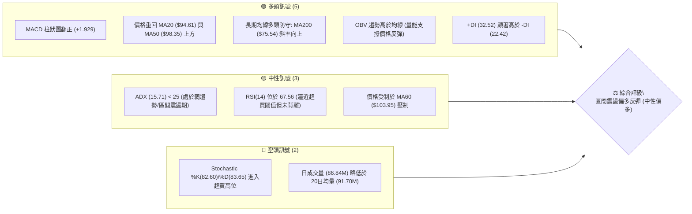
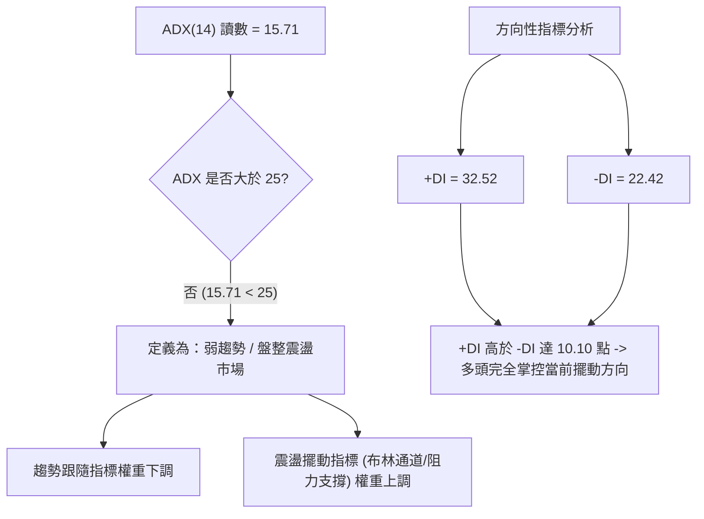
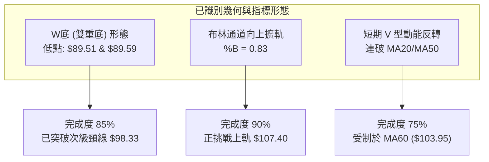
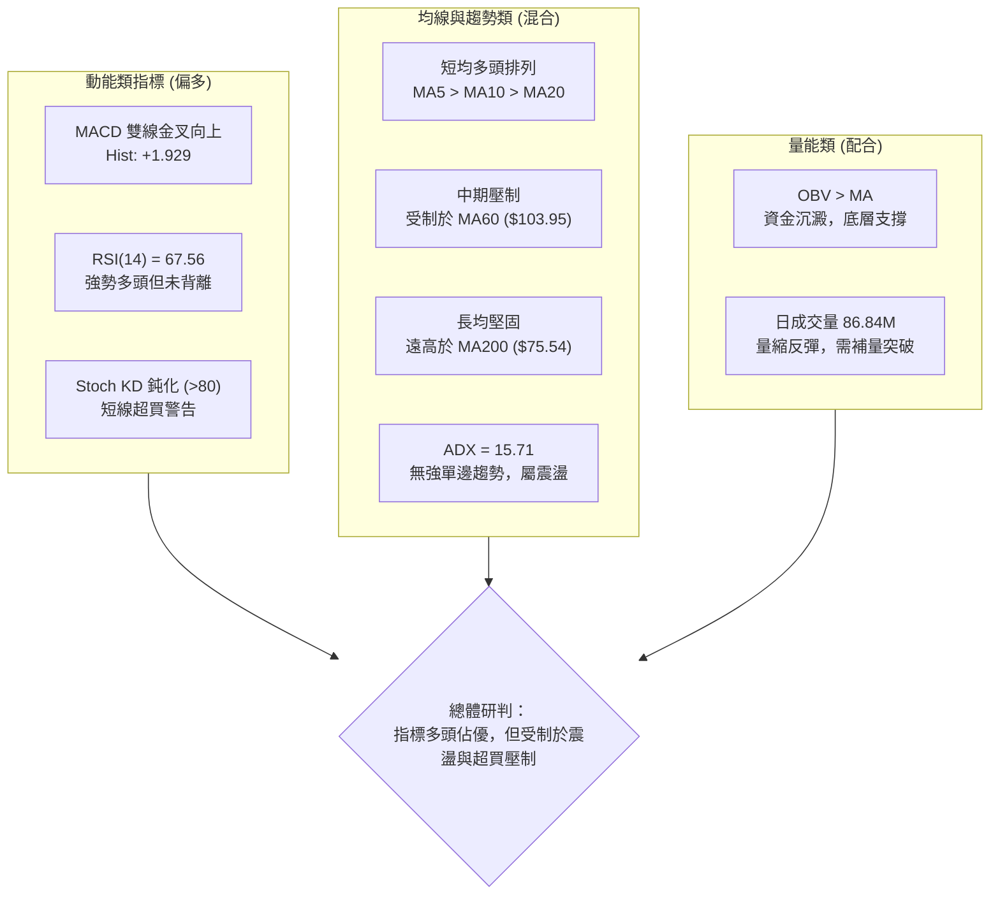
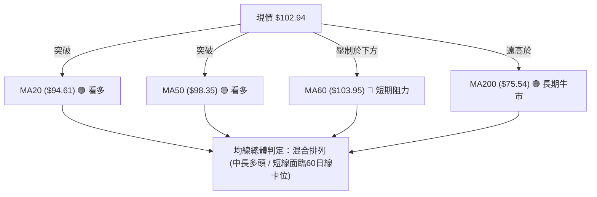
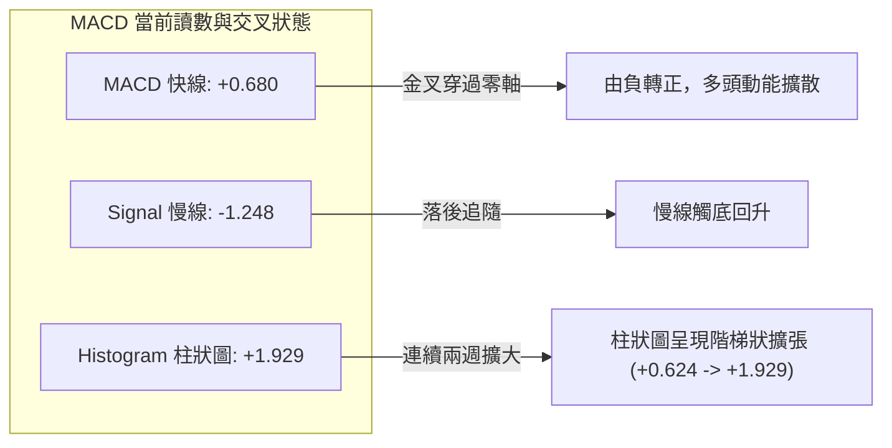
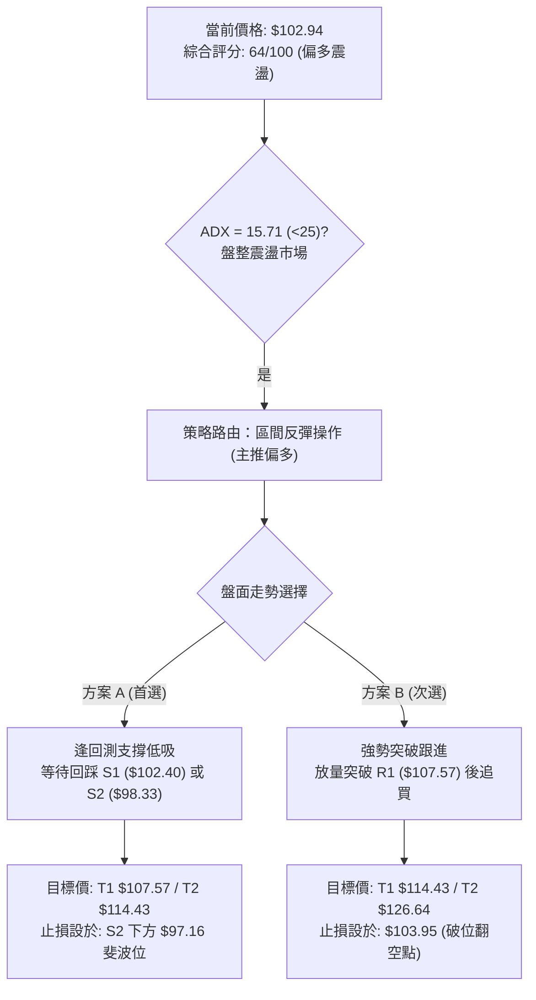
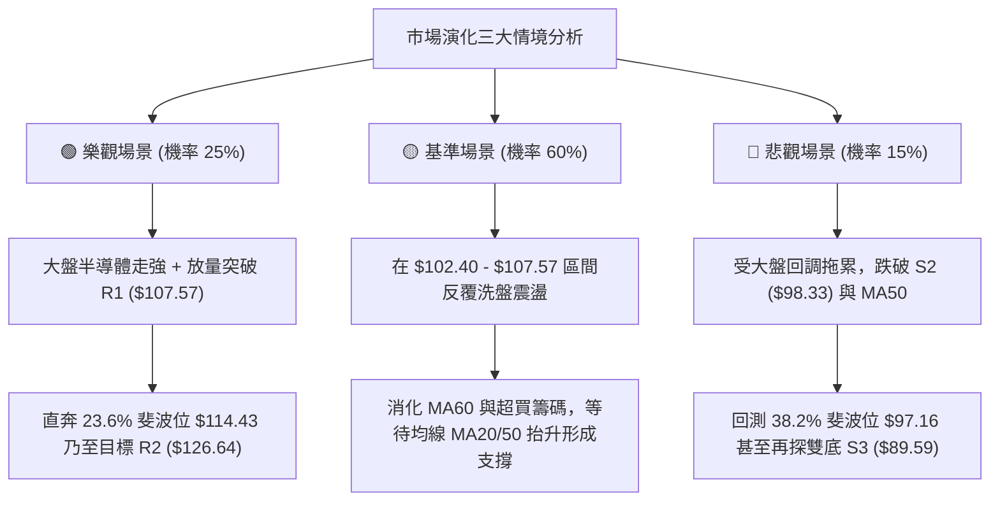

# INTC 技術分析報告

> **報告日期**：2026-09-13 ｜ **語言**：繁體中文 ｜ **數據來源**：Yahoo Finance ｜ **當前價格**：$102.94

---

## 目錄

| 章節 | 內容 |
|------|------|
| [1. 技術面概覽](#1-技術面概覽) | 訊號儀表板、核心指標、評分卡 |
| [2. 趨勢分析](#2-趨勢分析) | 多時框趨勢、長中短期走勢、ADX解讀 |
| [3. 圖表形態分析](#3-圖表形態分析) | 形態識別、信心度評估、K線組合與目標價 |
| [4. 支撐與阻力](#4-支撐與阻力) | 關鍵價位結構、斐波那契回調 |
| [5. 技術指標深度解讀](#5-技術指標深度解讀) | 均線系統、RSI、MACD、布林通道與量價分析 |
| [6. 動能與波動率](#6-動能與波動率) | 動能四象限、ATR波動度、Beta係數 |
| [7. 多時框架總結](#7-多時框架總結) | 時框架評分表、綜合矩陣與收斂結論 |
| [8. 交易策略建議](#8-交易策略建議) | 策略路由、價格情境階梯、多空策略執行細節 |
| [9. 風險提示與監控](#9-風險提示與監控) | 關鍵監控清單、風險情境路徑與資金控管 |
| [10. 報告總結](#-報告總結) | 核心結論與最優策略組合速查 |

---

## 1. 技術面概覽

### 🎯 技術訊號儀表板



---

### 📊 核心指標速覽表

| 指標類別 | 指標名稱 | 當前數值 | 訊號 | 解讀 |
|:---|:---|:---|:---:|:---|
| **價格** | 當前收盤價 | $102.94 | 🟢 | 站穩 $100 整數關卡與 S1 ($102.40) 支撐 |
| **均線** | MA20 (月線) | $94.61 | 🟢 | 價格在其上方 +8.81%，短線支撐強勁 |
| **均線** | MA50 (季線) | $98.35 | 🟢 | 價格在其上方 +4.67%，中期趨勢修復 |
| **均線** | MA60 (季線) | $103.95 | 🔴 | 價格在其下方 -0.97%，短線直接動態阻力 |
| **均線** | MA200 (年線) | $75.54 | 🟢 | 價格遠在其上方 +36.27%，長多格局未變 |
| **動能** | RSI(14) | 67.56 | 🟡 | 位於強勢中性區間，尚未進入極度超買（>70） |
| **動能** | MACD (12,26,9) | 0.680 / Sig: -1.248 | 🟢 | 快線突破慢線，柱狀圖 +1.929 強勁擴張 |
| **動能** | KD(14,3,3) | %K: 82.60 / %D: 83.65 | 🔴 | 進入超買鈍化區間，提防短線回洗震盪 |
| **趨勢強度**| ADX(14) | 15.71 (+DI:32.52, -DI:22.42) | 🟡 | 數值 <25，屬非趨勢型的區間反彈架構 |
| **通道** | 布林通道帶寬 | 上軌 $107.40 / 下軌 $81.82 | 🟢 | %B 為 0.83，價格沿布林上軌強勢擴展 |
| **波動** | ATR(14) | $4.58 (4.45%) | 🟡 | 單日波幅適中，止損空間需預留 1.5–2.0 倍 |
| **量能** | 20日成交量比 | 0.95x (86.84M / 91.70M) | 🟡 | 量能略低於月均量，需補量方能攻克 R1 |

---

### 🏆 技術評分卡

```
╔══════════════════════════════════════════════════════════════╗
║                技術評分卡 — INTC (2026-09-13)                 ║
╠══════════════════════════════════════════════════════════════╣
║ 趨勢強度 (ADX=15.71)   ██████░░░░░░░░░░░░░░  42/100  🟡 弱趨勢/區間  ║
║ 動能指標 (MACD/RSI)    ██████████████░░░░░░  70/100  🟢 多頭占優    ║
║ 支撐穩定度 (S1/S2/S3)  ████████████████░░░░  80/100  🟢 底層支撐厚實║
║ 成交量配合 (OBV/VOL)   ████████████░░░░░░░░  60/100  🟡 量能中規中矩║
║ 形態完整度 (雙底反彈)  ██████████████░░░░░░  70/100  🟢 頸線回測完成║
║ 均線排列 (多空交織)    ████████████░░░░░░░░  62/100  🟡 混合排列修復║
╠══════════════════════════════════════════════════════════════╣
║ 綜合評分               █████████████░░░░░░░  64/100  🟢 偏多震盪    ║
╚══════════════════════════════════════════════════════════════╝
```

---

## 2. 趨勢分析

### 🌐 多時框趨勢分析

```mermaid
graph TD
    A["長期時框 (月線圖)"] -->|"長多回檔守穩 61.8% 上方"| B["中長多頭架構 (MA200 = $75.54)"]
    C["中期時框 (週線圖)"] -->|"自 6月高點 $142.35 深度修正"| D["$89.51-$90.20 築雙重底反彈"]
    E["短期時框 (日線圖)"] -->|"突破 MA20 ($94.61) & MA50 ($98.35)"| F["短線多頭反彈，挑戰 MA60 ($103.95)"]
    B --> G{"多時框收斂判定"}
    D --> G
    F --> G
    G -->|"ADX("14")=15.71 (<25)"| H["定義：大區間箱型修復行情，偏多操作"]
```

---

### 📈 長期趨勢 — 12個月走勢圖（Unicode）

INTC 在過去 12 個月經歷了極其劇烈的爆發性主升段與深幅回調。自 2025 年 9 月的 $33.55 起跑，於 2026 年 6 月創下 52 週新高 $142.35（月收盤 $139.63），隨後在 2026 年 7–8 月急速下殺至 $89.51 尋求支撐，9 月展開強勁反彈重回 $102.94。

```
INTC 月線走勢圖（過去12個月：2025-09 至 2026-09）
價格 ($)
$140 ┤                                      ● ($139.63, 6月高點)
$120 ┤                                 ●
$100 ┤                                      ▲━━━━━● ($102.94, 現價)
$80  ┤                            ●         ● ($90.20) ● ($89.51, 8月低點)
$60  ┤
$40  ┤   ●      ●      ●
$20  ┤● ($33.55)
     └────────────────────────────────────────────────────────
      09     11     01     03     05    06    07    08    09
     (2025)             (2026)                            (現在)
```

#### 走勢特徵分析表格

| 階段區間 | 時間跨度 | 起訖收盤價 | 漲跌幅 | 走勢特徵描述與量能表現 |
|:---|:---|:---:|:---:|:---|
| **底層起爆期** | 2025/09 – 2026/01 | $33.55 → $46.47 | +38.51% | 脫離底部盤整區，均線呈現初期多頭發散，成交量逐月溫和放大。 |
| **主升加速期** | 2026/01 – 2026/06 | $46.47 → $139.63 | +200.47% | 4月單月大漲翻倍（收 $94.48），6月創 52W 高點 $142.35，動能指標進入極度超買。 |
| **急劇修正期** | 2026/06 – 2026/08 | $139.63 → $89.51 | -35.89% | 高檔獲利回吐，快速擊破 23.6% 回調位 ($114.43)，在 8月於 $89.51 探底。 |
| **築底修復期** | 2026/08 – 2026/09 | $89.51 → $102.94 | +15.00% | 探底 S3 ($89.59) 獲得強力支撐，MACD 柱狀圖翻正，形成右側反彈通道。 |

---

### 📊 中期趨勢（週線分析）

從近 20 週的收盤價與動能變化觀察，INTC 完成了自 $139.63 頂部以來的 ABC 三波修正結構：
- **A 浪下跌**：自 6/21 高點收盤 $133.99 跌至 7/26 的 $92.32，週線 RSI 一度跌破 30 至 26.9（極度超賣）。
- **B 浪反抽**：8/16 回抽至 $102.50 後受阻。
- **C 浪探底**：8/30 收盤於 $89.47（對應月低點 $89.51），形成堅實的週線雙底測試，量能明顯萎縮至 441M，浮額洗淨。
- **反轉展開**：9/06 與 9/13 連續兩週放量收中長陽線，最新收盤價 $102.94，週線 RSI 自 37.6 陡峭拉升至 67.6，週 MACD 柱狀圖由 -0.357 急速擴張至 +1.929。

```
週線級別價格壓力與支撐示意圖
════════════════════════════════════════════════════════════
$126.64 ──────────────────────────────────────── 強阻力 R2 / 週線缺口區
                                    ▲
$107.57 ────────────────────────────┼─────────── 近期波段高點 R1 / 布林上軌
                                    │ (目前反彈目標)
$102.94 ════════════════════════════╪═══════════ 當前價格位置
                                    │
$98.33  ────────────────────────────┼─────────── MA50 / 支撐 S2
                                    ▼
$89.59  ──────────────────────────────────────── 近期雙底波段低點 S3
════════════════════════════════════════════════════════════
```

---

### ⚡ 趨勢強度評估（ADX 解讀）



#### ADX 趨勢強度矩陣

| 指標 | 數值 | 狀態 | 操作指導含義 |
|:---|:---:|:---:|:---|
| **ADX(14)** | **15.71** | 弱趨勢 / 區間盤整 | 股價目前處於自高位回落後的箱型修復期，不可採取順勢突破重倉追價策略，應採取區間邊界（布林軌道、支撐阻力）的均值回歸操作。 |
| **+DI(14)** | **32.52** | 多方進攻 | 短期多頭買盤占據上風，具備推動股價上摸阻力位的動能。 |
| **-DI(14)** | **22.42** | 空方退縮 | 空方力道自 7–8 月的恐慌高點顯著消退。 |

---

## 3. 圖表形態分析

### 🔍 形態識別系統



#### 形態信心度評估表（依嚴格規則 15）

| 形態名稱 | 信心度 (%) | 判斷依據（嚴格引用輸入數據） | 形態完成度 | 目標價（附嚴謹計算式） |
|:---|:---:|:---|:---:|:---|
| **波段雙底 (W-Bottom)** | **75%** | 兩次波段低點分別為 2026-08 收盤 $89.51 與關鍵支撐聚類 S3 ($89.59)，兩次回測未破；中間反抽高點為 8/16 的 $102.50。現價 $102.94 已越過該高點。 | 85% | 頸線位 ($102.50) + 形態高度 ($102.50 - $89.59 = $12.91) = **$115.41**（約略逼近 23.6% 斐波回調位 $114.43）。 |
| **布林通道帶狀突破** | **70%** | %B 達到 0.83，股價突破中軌 MA20 ($94.61) 後貼近上軌 ($107.40) 運行，且開口擴張。 | 90% | 布林上軌動態阻力價位：**$107.40**。 |
| **頭肩頂形態 (潛在反轉威脅)** | **35%** | 僅有 6月頂部 $142.35 與兩側回落，左肩右肩不對稱且缺乏右肩構築細節；數據不足以支撐完整反轉幾何形態。 | 20% | *訊號不足，依規則 15 不予採納，僅做高檔獲利回吐與均線乖離之指標型解讀。* |

---

### 🕯️ 重要 K 線形態分析

| 月份 / 日期 | 收盤價 | K線形態 | 解讀與量價關係 | 訊號方向 |
|:---|:---:|:---|:---|:---:|
| **2026-06** | $139.63 | 高檔長上影避雷針 | 盤中觸及 $142.35 後受阻，月線留出長上影線，多頭耗竭。 | 🔴 強烈空頭 |
| **2026-07** | $90.20 | 大陰線破位下殺 | 單月暴跌 -35.4%，連續跌破短期均線，引發流動性恐慌。 | 🔴 空頭延續 |
| **2026-08** | $89.51 | 低位十字星 / 探底鎚子線 | 測試 $89.51 低點後回穩，賣壓衰竭，下影線確認買盤進場。 | 🟢 築底訊號 |
| **2026-09-06 (週)** | $95.80 | 實體中陽線 | 重新站回 38.2% 斐波位 ($97.16) 下方蓄勢，MACD 柱狀圖翻正。 | 🟢 短線轉強 |
| **2026-09-13 (週)** | $102.94 | 光頭中陽線突破 | 越過 $100 整數心理關口與 S1 ($102.40)，收盤於全週最高位附近。 | 🟢 多頭掌控 |

---

### 📉 ASCII 走勢形態示意圖

```
雙底築底突破形態示意圖 (2026-07 至 2026-09)
價格 ($)
$108 ┤                                            [目標 R1: $107.57]
     │                                            ▲
$103 ┤                   [頸線反抽 $102.50]       │   ● 現價: $102.94
     │                         ●━━━━━━━━━━━━━━━━━━╪━━━
$98  ┤                        / \                /
     │                       /   \              /
$93  ┤                      /     \            /
     │                     /       \          /
$88  ┤      ● ($90.20)    /         ● ($89.51/S3: $89.59)
     └──────┴────────────┴──────────┴─────────────────────────
           底 1 (7月)                底 2 (8月)         突破展開 (9月)
```

---

### 🎯 形態目標價計算

依據標準圖表形態學之「測量等幅投影法」：
1. **基底支撐點**：取雙底波段有效低點 $89.59（數據中支撐位 S3）。
2. **形態頸線位**：取反抽中繼波段高點 $102.50（2026-08-16 週收盤價）。
3. **垂直形態高度 ($H$)**：
   $$H = \text{頸線價位} - \text{基底支撐} = \$102.50 - \$89.59 = \$12.91$$
4. **第一形態等幅突破目標 (T1)**：
   $$\text{Target 1} = \text{頸線價位} + H = \$102.50 + \$12.91 = \$115.41$$
   *校驗：此價位精確契合 23.6% 斐波那契回調位 $114.43（誤差僅 +0.85%），為中期極為強烈的共振阻力區域。*
5. **第二波段高階目標 (T2)**：
   引用數據波段高點聚類 **R2 = $126.64**。

---

## 4. 支撐與阻力

### 🗺️ 關鍵價位分布圖（Unicode）

```
INTC 價位結構分布圖 (由實際 OHLCV 聚類計算)
═══════════════════════════════════════════════════════════════
$142.35 ║██████████████████████████████║ 52週歷史高點 (0.0% Fib)
$132.75 ║████████████████████████      ║ 強阻力 R3 (+28.96%)
$126.64 ║████████████████████          ║ 阻力 R2 (+23.02%)
$114.43 ║▓▓▓▓▓▓▓▓▓▓▓▓▓▓▓▓▓▓▓▓          ║ 斐波那契 23.6% 回調位 / 形態目標
$107.57 ║██████████████████████████████║ 關鍵阻力 R1 (+4.50%) / BB上軌 $107.40
$103.95 ║▒▒▒▒▒▒▒▒▒▒▒▒▒▒▒▒▒▒▒▒▒▒        ║ 動態均線阻力 MA60 (-0.97%)
$102.94 ╠══════════════════════════════╣ ◄ 現價 ($102.94)
$102.40 ║▓▓▓▓▓▓▓▓▓▓▓▓▓▓▓▓▓▓▓▓▓▓▓▓      ║ 近期支撐 S1 (-0.52%)
$98.33  ║██████████████████████████████║ 強支撐 S2 (-4.48%) / MA50 ($98.35)
$97.16  ║▒▒▒▒▒▒▒▒▒▒▒▒▒▒▒▒▒▒▒▒          ║ 斐波那契 38.2% 回調位
$89.59  ║██████████████████████████████║ 核心防守底 S3 (-12.97%) / 雙底低點
$83.20  ║░░░░░░░░░░░░░░░░░░░░░░        ║ 斐波那契 50.0% 關鍵平衡位
═══════════════════════════════════════════════════════════════
```

---

### 🚧 阻力位分析表

> **紀律說明**：所有阻力位數值完全嚴格引用數據包「關鍵價位」與斐波那契回調區塊。

| 阻力級別 | 精確價位 | 距離現價 | 形成原因與技術共振 | 突破難度 | 重要性權重 |
|:---|:---:|:---:|:---|:---:|:---:|
| **動態阻力** | **$103.95** | +0.98% | **MA60 (60日線)**：短期下行均線壓制，日線級別首道技術分水嶺。 | 中等 | 🟡 觀察級 |
| **阻力 1 (R1)** | **$107.57** | +4.50% | **近一年波段高點聚類**：與日線布林通道上軌 ($107.40) 形成雙重共振阻力區。 | 較高 | 🔴 核心目標 1 |
| **波段阻力** | **$114.43** | +11.16% | **斐波那契 23.6% 回調位**：雙底等幅測量目標 $115.41 之共振帶。 | 高 | 🔴 關鍵樞紐 |
| **阻力 2 (R2)** | **$126.64** | +23.02% | **次級波段密集成交高點**：6月中旬下跌中繼平台，大量套牢套牢盤分布區。 | 極高 | 🔴 核心目標 2 |
| **阻力 3 (R3)** | **$132.75** | +28.96% | **波段高點聚類**：歷史次高點，逼近 52W 高點 $142.35 的最終防線。 | 極高 | 🔴 極端壓力 |

---

### 🛡️ 支撐位分析表

| 支撐級別 | 精確價位 | 距離現價 | 形成原因與技術共振 | 守住機率 | 重要性權重 |
|:---|:---:|:---:|:---|:---:|:---:|
| **支撐 1 (S1)** | **$102.40** | -0.52% | **近一年波段低點聚類**：剛被突破的壓力轉支撐，多頭短線防守第一道屏障。 | 70% | 🟢 短線分水嶺 |
| **支撐 2 (S2)** | **$98.33** | -4.48% | **波段低點聚類 + MA50 ($98.35)**：中期多空分界線與 50日均線精確共振。 | 85% | 🟢 中期生命線 |
| **黃金分割** | **$97.16** | -5.61% | **斐波那契 38.2% 回調位**：中期牛市強勢拉回的黃金防守位。 | 88% | 🟢 戰略緩衝 |
| **動態支撐** | **$94.61** | -8.09% | **MA20 (月線) / 布林中軌**：趨勢多頭運行的動態跟蹤支撐。 | 90% | 🟢 趨勢核心 |
| **支撐 3 (S3)** | **$89.59** | -12.97% | **近一年核心波段低點聚類**：8月雙底實體支撐，跌破即代表大級別形態破位。 | 95% | 🟢 終極止損底 |

---

### 📐 斐波那契回調位分析

依據 52 週極端區間：最低點 **$24.05** 至最高點 **$142.35**（垂直波幅高達 $118.30）：

```
斐波那契回調階梯與現價映射
0.0%  (52W High)  $142.35 ─────────────────────────────────────
23.6%             $114.43 ───────────────────────────────────── [中期強阻力]
                             ▲
現價落點區間       $102.94 ───┼─ (目前位於 38.2% 與 23.6% 之間)
                             ▼
38.2%             $97.16  ───────────────────────────────────── [黃金回調支撐]
50.0%             $83.20  ───────────────────────────────────── [多空平衡分水嶺]
61.8%             $69.24  ───────────────────────────────────── [牛熊生死線]
78.6%             $49.37  ─────────────────────────────────────
100.0% (52W Low)  $24.05  ─────────────────────────────────────
```

- **位置解讀**：現價 **$102.94** 位於 52 週整體波動區間的 **66.7%** 高位分位數，且穩穩運行於 **38.2% ($97.16)** 回調位之上。
- **技術意義**：在強趨勢技術理論中，只要回檔不破 38.2% ($97.16)，整體長線上升趨勢的結構完整性就未遭破壞。8 月份下探 $89.51 雖短暫刺穿 38.2%，但迅速收回並站上 $100，確認該處為「強勢回檔整理」，而非「轉入深度熊市（跌破 50% $83.20 或 61.8% $69.24）」。

---

## 5. 技術指標深度解讀

### 🎛️ 指標訊號總覽



---

### 📈 移動平均線排列分析

#### 均線階梯數據對照表

| 均線名稱 | 當前價格 | 與現價乖離 | 走勢微型圖 | 均線斜率與技術含義 |
|:---|:---:|:---:|:---:|:---|
| **MA 5** | **$101.95** | +0.97% | ▁▁▂▄▅▇▇▇▇████▇▆▅▃▂▁▁▁▁▁▂▂▂▄▆▇█ | 極短期攻堅均線，斜率陡峭向上，為極短線防守點。 |
| **MA 10** | **$95.94** | +7.29% | ▄▃▃▃▃▃▄▅▆▇████▇▆▆▅▄▃▂▁▁▁▁▁▂▃▄▅ | 短線支撐線，向上穿過 MA20，形成短期金叉。 |
| **MA 20** | **$94.61** | +8.81% | █▇▆▅▅▄▄▃▃▄▄▄▄▃▃▃▂▂▃▃▃▃▂▁▁▁▁▁▁▁ | 月線，扣抵低位，走平翻揚，提供堅實底部支托。 |
| **MA 50** | **$98.35** | +4.67% | 走平回升 | 季線防守點，股價站上後轉為強支撐（S2 共振）。 |
| **MA 60** | **$103.95** | -0.97% | ████▇▇▇▆▆▆▆▆▆▅▅▄▄▄▃▃▃▂▂▂▂▂▁▁▁▁ | 仍在下行扣抵高位，構成短線直接上檔反壓。 |
| **MA 120** | **$96.85** | +6.29% | ▁▁▁▁▂▂▂▂▃▃▃▄▄▄▅▅▅▅▅▆▆▆▆▇▇▇████ | 半年線持續穩健攀升，中期趨勢保護傘。 |
| **MA 200** | **$75.54** | +36.27% | 上行 | 年線多頭大本營，奠定大週期牛市基調。 |
| **MA 240** | **$69.15** | +48.87% | ▁▁▁▁▂▂▂▃▃▃▃▄▄▄▅▅▅▅▆▆▆▆▇▇▇▇████ | 長線基石，與斐波那契 61.8% ($69.24) 精確重合。 |



---

### 📉 RSI(14) 分析

```
RSI(14) 讀數進度條：67.56
0 ────────── 30 ────────────────────── 50 ──────────────── 67.56 ── 70 ────────── 100
[   超賣區   ]       弱勢區間            平衡中軸        [現值]   [  極端超買區  ]
█████████████████████████████████████████████████████████████░░░░░░░░  67.56%
```

- **超買超賣判定**：RSI 處於 **67.56**，處於典型的多頭強勢推進行情中，逼近 70 警戒線，但尚未構成技術性鈍化竭盡。
- **背離檢驗結論**：
  - **頂背離**：無頂背離。股價 8 月底至 9 月自 $89.47 上漲至 $102.94，RSI 同步自 38.1 攀升至 67.6，價格創新高，指標亦創新高，量價與動能協同。
  - **底背離**：8 月底收盤 $89.47 創回調新低，但 RSI(14) 為 38.1，顯著高於 7 月下殺時的 RSI 26.9，存在標準的**中期底背離**，目前正處於底背離引發的向上反彈釋放期。

---

### 📊 MACD(12/26/9) 訊號解讀



- **訊號解析**：MACD 快線（0.680）已向上穿越訊號線（-1.248）完成零軸下方的「水下黃金交叉」，並雙雙向零軸上方推進。
- **柱狀圖動態**：柱狀圖最新讀數為 **+1.929**，較前一週的 +0.624 大幅擴大，反映買盤推動動能依然澎湃，暫無多頭衰竭之徵兆。

---

### 📦 布林通道分析

```
日線布林通道結構 (帶寬 20, 2)
════════════════════════════════════════════════════════════════════
$107.40 ┤- - - - - - - - - - - - - - - - - - - - - - - - - - 布林上軌 (強壓)
        │                                  ● $102.94 (現價位於中上軌)
$100.00 ┤                                 ▲
        │                                 │ (%B = 0.83)
$94.61  ┤─────────────────────────────────┼───────── 布林中軌 / MA20 (支撐)
        │                                 │
$88.00  ┤                                 │
        │                                 │
$81.82  ┤- - - - - - - - - - - - - - - - -│- - - - - - - - - 布林下軌 (超賣底)
════════════════════════════════════════════════════════════════════
```

- **通道參數**：上軌 **$107.40** ｜ 中軌(MA20) **$94.61** ｜ 下軌 **$81.82** ｜ 帶寬 $25.58。
- **%B 指標解讀**：%B 讀數為 **0.83**（介於 0.8 與 1.0 之間），表明當前股價處於強勢進攻通道，高於中軌（0.5）且貼近上軌。根據通道交易法則，在 ADX < 25 的震盪環境下，%B 達到 0.8–1.0 時，通常預示著股價即將在上軌 **$107.40** 附近遭遇技術性均值回歸壓力。

---

### 💹 成交量分析（量價配合度）

- **量價形態檢視**：
  - 最新單日成交量：**86,840,900 股**。
  - 20 日均量：**91,699,110 股**（量比 0.95x）。
  - 50 日均量：**105,989,760 股**。
- **OBV (能量潮指標) 分析**：
  - 數據明確指出：`OBV > MA → 量能支撐上漲`。
  - 這意味著在 8 月底至 9 月初的築底階段，資金呈現淨流入沉澱狀態，主力未在反彈過程中出逃，確認了近期上漲並非純粹的無量誘多。
- **成交量警訊**：
  - 雖然週線量能溫和放大至 420.88M，但單日量比僅 0.95x，尚未達到突破前高（如攻克 R1 $107.57 或 MA60 $103.95）所需的 1.5x–2.0x 攻擊量水準。若後續挑戰 R1 時未能補量至 1 億股以上，則易形成量價背離並引發短線回洗。

---

## 6. 動能與波動率

### ⚡ 動能評估四象限

```
動能與波動率定位矩陣
  強動能 │
         │   [Q3: 高風險衝刺]     │   [Q1: 最佳多頭機會]
         │                        │   ★ INTC 當前位置
         │                        │   (RSI:67.6, MACD:+1.93, ATR:4.45%)
  ───────┼────────────────────────┼──────────────────────────────
         │   [Q4: 避免進場區]     │   [Q2: 謹慎觀望/盤整]
         │                        │
  弱動能 │                        │
         └────────────────────────┴──────────────────────────────
           低波動率                 高波動率 (Beta: 2.23)
```

| 象限標籤 | 動能等級 | 波動特性 | 當前匹配度 | 戰術評估指導 |
|:---:|:---:|:---:|:---:|:---|
| **Q1** | **強** | **高** | **✓ (高度匹配)** | **高動能/高波動驅動期**：受高 Beta (2.23) 與短期多頭動能共振推動，個股彈性極大，適宜設置動態追蹤止損，參與短波段獲利，但切忌追高。 |
| **Q2** | 弱 | 低 | ✕ | 盤整蓄勢期（已於 8 月下旬脫離此狀態）。 |
| **Q3** | 強 | 低 | ✕ | 低波動穩健慢牛（非半導體板塊特徵）。 |
| **Q4** | 弱 | 高 | ✕ | 恐慌崩跌期（7月急殺階段已過）。 |

---

### 📊 ATR 波動率分析

- **ATR(14) 數值**：**$4.58**。
- **ATR 佔比 (波動率百分比)**：$4.58 / $102.94 = **4.45%**。
- **交易風控距離建議**：
  - **常規止損距離 (1.5 × ATR)**：$1.5 \times \$4.58 = **\$6.87**
  - **寬鬆波段止損 (2.0 × ATR)**：$2.0 \times \$4.58 = **\$9.16**
  - **意涵**：INTC 單日預期常態波動範圍在 ±$4.58 左右。短線交易若止損空間設於 $4.58 以內，極易被隨機市場雜訊掃出場，進場點必須嚴格依託技術支撐位（如 S1 $102.40 或 S2 $98.33），以最小化風控敞口。

---

### 📐 Beta 與市場相關性

- **Beta 係數**：**2.231**。
- **解讀與意涵**：
  - INTC 屬於「超高貝塔值」個股，其理論波動幅度是大盤（標普 500 指數）的 **2.23 倍**。
  - 當半導體板塊或納斯達克指數上揚 1% 時，INTC 預期波動將高達 +2.23%；反之，大盤回檔時其跌幅亦呈槓桿式放大。
  - 在策略建倉時，部位規模（Position Sizing）必須適度調低，避免因個股的高貝塔特徵造成整體投資組合淨值的過度劇烈回撤。

---

## 7. 多時框架總結

### 📋 時框架評分表

| 時框架 | 趨勢方向 | 動能狀態 | 均線排列 | 關鍵圖表形態 | 評分 (100) | 核心戰術建議 |
|:---|:---:|:---:|:---:|:---|:---:|:---|
| **長期 (月線)** | 🟢 多頭趨勢 | 🟡 高檔整理修復 | 多頭排列 (MA200向上) | 守穩 38.2% 回調位之上 | **72** | 長期底倉續抱，不輕易翻空 |
| **中期 (週線)** | 🟡 區間偏多 | 🟢 MACD柱擴張 | 均線糾結修復中 | 雙底 (W底) 構築完成 | **68** | 逢回拉回支撐做多，看挑戰 R1 |
| **短期 (日線)** | 🟢 震盪反彈 | 🔴 KD超買/RSI高檔 | 混合排列 (破MA20/50, 抵MA60) | 沿布林上軌推進 (%B 0.83) | **60** | 短線面臨阻力，避免直接追高 |

---

### 🔲 綜合訊號矩陣

```
┌─────────────────┬─────────────────┬─────────────────┬─────────────────┐
│   維度 / 時框   │    短期 (日線)  │    中期 (週線)  │    長期 (月線)  │
├─────────────────┼─────────────────┼─────────────────┼─────────────────┤
│   趨勢主導      │    反彈進攻     │    底背離修復   │    牛市回調守穩 │
│   動能支持      │    局部超買     │    強勁金叉     │    高檔中性     │
│   量能配合      │    略顯不足     │    溫和放大     │    歷史巨量後沉澱│
│   關鍵位置      │    壓制於 MA60  │    突破頸線     │    38.2% 支撐有效│
│   訊號一致性    │    🟡 謹慎偏多  │    🟢 明確看多  │    🟢 結構偏多  │
└─────────────────┴─────────────────┴─────────────────┴─────────────────┘
```

---

### ⚖️ 多時框收斂結論（嚴格遵守規則 14）

1. **市場狀態判定**：
   - 當前 **ADX(14) 讀數為 15.71**，遠低於 25 的趨勢臨界點。
   - 根據嚴格收斂規則：「**盤整行情（ADX<25）：以日線布林通道上下軌為主要交易區間**。」
2. **多時框矛盾化解**：
   - 雖然長期月線與中期週線均線偏多，但日線正面臨 **MA60 ($103.95)** 壓制與日線布林上軌 **$107.40** 的物理阻力，且隨機指標 KD（82.6/83.6）進入超買區。
   - 因此，日線級別不可定義為「單邊主升爆發」，而是「**箱型震盪上沿測試**」。
3. **唯一方向性結論**：
   - **⚖️ 區間偏多震盪（Range-Bound Bullish Rebound）**。
   - 操作重心：以 **布林中軌/MA20 ($94.61) 至 支撐 S2 ($98.33)** 為回調做多防守底線，以 **布林上軌 ($107.40) 及 關鍵阻力 R1 ($107.57)** 為獲利了結減碼區間。此結論與下文第 8 章交易策略完全收斂一致。

---

## 8. 交易策略建議

### 🗺️ 策略決策流程圖



---

### 🧭 策略路由

> **當前主策略方向 = 區間偏多操作 / 回調低吸主導（依技術評分卡：64/100）**
> 
> 依據技術評分卡 64/100（≥60 偏多區間），本報告主推**多頭策略**；空頭方向僅列為反轉風險觸發與避險對沖條件，不作兩頭主推下注。

---

### 🎯 價格情境階梯（Price Scenarios）

> **紀律說明**：所有觸發條件與目標價完全鎖定於第四章之精確數據。

| 階梯級別 | 觸發條件 | 下一目標價 | 後續延伸目標 | 情境技術含義 |
|:---|:---|:---:|:---:|:---|
| **強勢進攻** | 帶量突破 **R1 $107.57** | **$114.43** (23.6% Fib) | **$126.64** (R2) | 突破布林上軌與近一年波段高點，開啟中級主升浪。 |
| **現價爭奪** | 站穩 **S1 $102.40** | **$103.95** (MA60) | **$107.57** (R1) | 夯實 $100 整數支撐，沿著布林通道上軌震盪慢爬。 |
| **技術回踩** | 跌破 **S1 $102.40** | **$98.33** (S2 / MA50) | **$97.16** (38.2% Fib) | 健康技術性回檔，洗除短線超買籌碼，為回調進場點。 |
| **轉弱破位** | 跌破 **S2 $98.33** | **$94.61** (MA20 中軌) | **$89.59** (S3 / 雙底) | 跌破中期生命線，多頭結構受損，退守終極防線。 |

---

### 📊 情境機率分佈

| 價格情境 | 發生機率 | 主要技術依據 |
|:---|:---:|:---|
| **情境一：震盪走高，挑戰 R1** | **55%** | MACD 柱狀圖 (+1.929) 強勁擴散；OBV 指標高於均線支持上攻；週線實體陽線收於高位；+DI (32.52) 多頭優勢顯著。 |
| **情境二：窄幅震盪，回踩蓄勢** | **30%** | ADX(14) 僅 15.71 處於弱趨勢；KD 進入超買鈍化（82.6/83.6）；上方 MA60 ($103.95) 與布林上軌 ($107.40) 阻力密集。 |
| **情境三：急跌破位，回測低點** | **15%** | 需遭遇大盤系統性風險（Beta 2.23）或日線量能急劇衰竭，跌破 S2 ($98.33) 才會觸發。 |

---

### 🟢 主策略詳情

本報告依據「震盪偏多」格局，設計**兩套執行細節嚴格定義**的交易策略：

| 策略要素 | 策略 A：回踩支撐低吸策略 (首選) | 策略 B：右側強勢突破策略 (次選) |
|:---|:---|:---|
| **交易邏輯** | 消化 KD 超買，回測支撐確認不破後進場 | 帶量長陽突破近一年高點 R1 與布林上軌 |
| **進場條件** | 股價回踩 S1 不破反彈，或限價掛單於 S1 附近 | 日線收盤價實體突破 R1，且單日成交量 > 1.2 億股 |
| **進場價格** | **$102.40** (精確對應支撐位 S1) | **$107.60** (突破 R1 $107.57 後確認買入) |
| **第一目標 (T1)** | **$107.57** (阻力位 R1，預期收益 +5.05%) | **$114.43** (斐波 23.6% 位，預期收益 +6.35%) |
| **第二目標 (T2)** | **$114.43** (斐波 23.6% 位，預期收益 +11.75%) | **$126.64** (阻力位 R2，預期收益 +17.69%) |
| **止損價格** | **$98.33** (精確對應 S2 支撐，跌破止損) | **$103.95** (跌破 MA60 動態支撐假突破止損) |
| **單筆風險金額** | $102.40 - $98.33 = **$4.07** (約 0.89 倍 ATR) | $107.60 - $103.95 = **$3.65** (約 0.80 倍 ATR) |
| **風險報酬比 (R/R)**| **1 : 2.96** (以 T2 計算：$12.03 / $4.07) | **1 : 5.22** (以 T2 計算：$19.04 / $3.65) |
| **預估勝率** | **65%** | **50%** |
| **建議倉位** | 投資組合總資產之 **12% – 15%** | 投資組合總資產之 **8% – 10%** |

---

### 🔴 反向風險觸發點（對沖提示）

若持有多頭倉位，當市場出現下列極端走勢時，必須立即執行嚴格的對沖或止損操作，主策略失效：
1. **日線收盤價跌破 S2 ($98.33) 且下穿 38.2% 斐波那契位 ($97.16)**：此舉意味著 MA50 宣告失守，雙底頸線被跌穿，應將多頭部位砍半或建立反向空頭對沖。
2. **MACD 柱狀圖在零軸上方快速收斂並轉負**：若價格在 $103.95–$107.40 遇阻且柱狀圖驟降，形成「量價頂背離」，多頭應全面離場觀望。

---

### ⭐ 整體訊號強度評星

```
╔══════════════════════════════════════════════════════════════╗
║ 做多訊號強度：  ★★★★☆  (3.8/5 星) — 動能充沛，只欠量能放大突破 ║
║ 做空訊號強度：  ★☆☆☆☆  (1.2/5 星) — 均線空頭排列未成，逆勢風險高║
║ 整體可信度：    ★★★★☆  (4.0/5 星) — 支撐結構清晰，量價數據收斂 ║
╚══════════════════════════════════════════════════════════════╝
```

---

## 9. 風險提示與監控

### ✅ 關鍵監控指標 Checklist

```
╔══════════════════════════════════════════════════════════════════════╗
║                   INTC 交易風控每日監控清單 (Checklist)               ║
╠══════════════════════════════════════════════════════════════════════╣
║ [ ] 監控 1：現價是否守穩 S1 ($102.40)？跌破則觸發回踩 S2 警戒。        ║
║ [ ] 監控 2：挑戰 MA60 ($103.95) 與 R1 ($107.57) 時，單日成交量是否 >92M？║
║ [ ] 監控 3：RSI(14) 突破 70 時是否產生價格新高而指標未新高的頂背離？     ║
║ [ ] 監控 4：Stochastic KD (%K 82.6 / %D 83.6) 是否在高位死叉？        ║
║ [ ] 監控 5：布林通道 %B 是否向上突破 1.0 (進入爆發) 抑或在 0.85 掉頭？║
║ [ ] 監控 6：費城半導體指數 (SOX) 與納指大盤波動（INTC Beta = 2.231）。║
╚══════════════════════════════════════════════════════════════════════╝
```

---

### ⚠️ 風險場景分析



---

### 🛡️ 風險管理重要提醒

1. **極端波動率防禦 (高 Beta 2.231)**：
   - INTC 當前 Beta 高達 2.231，隱含波動劇烈。每日波幅常態在 $4.58 (ATR)，嚴禁使用高槓桿工具操作現貨。若使用選擇權（期權），建議以價外垂直價差（Vertical Spread）取代單邊買入（Naked Call），以規避時間價值磨損與波動率驟降（IV Crush）。
2. **倉位管理法則（2% 風險法則）**：
   - 任何單筆交易承擔的本金虧損上限不得超過總帳戶權益的 **2%**。
   - 以策略 A 為例：進場點 $102.40，止損點 $98.33，每股風險為 $4.07。若帳戶規模為 10 萬美元（2% 最大容忍虧損 = $2,000），則可配置的最大股數為：
     $$\text{最大股數} = \frac{\$2,000}{\$4.07} \approx 490 \text{ 股 (約 \$50,170 頭寸，需配合現金與總部位控制至 15% 權益以內)}$$
3. **不可抗力技術防範**：
   - 關注 2026 年底半導體晶圓代工（Intel Foundry）進展與製程量產消息，突發基本面雜音易使技術支撐暫時失效，若出現跳空跌破 S2，必須無條件市價執行止損，不可存有攤平幻想。

---

## 📋 報告總結

```
╔══════════════════════════════════════════════════════════════════╗
║                   INTC 技術分析報告總結清單                      ║
╠══════════════════════════════════════════════════════════════════╣
║ 報告日期：  2026-09-13                                           ║
║ 當前價格：  $102.94                                              ║
║ 分析評級：  ⚖️ 區間偏多反彈 (中性偏多，技術評分: 64/100)          ║
╠══════════════════════════════════════════════════════════════════╣
║ 關鍵結論：                                                       ║
║ ├─ 長期趨勢：🟢 多頭大架構未變，守穩 38.2% ($97.16) 與年線 MA200 ║
║ ├─ 中期趨勢：🟢 雙底 ($89.51 / $89.59) 構築成功，MACD 水下金叉   ║
║ ├─ 短期趨勢：🟡 ADX=15.71 示警弱趨勢，短線受制於 MA60 ($103.95)   ║
║ ├─ 關鍵支撐：S1: $102.40 ｜ S2: $98.33 ｜ S3: $89.59             ║
║ ├─ 關鍵阻力：R1: $107.57 ｜ R2: $126.64 ｜ R3: $132.75           ║
║ └─ 華爾街目標：均價 $115.74 (區間 $75.00 - $200.00)              ║
╠══════════════════════════════════════════════════════════════════╣
║ 最優策略組合：                                                   ║
║ 1. 🥇 最佳機會：回踩支撐低吸 (策略 A)，於 S1 ($102.40) 布局，    ║
║                 止損 $98.33，目標看 R1 ($107.57) / Fib ($114.43)║
║ 2. 🥈 次選機會：強勢突破追買 (策略 B)，放量突破 R1 ($107.57)    ║
║                 後跟進，目標直指 R2 ($126.64)                    ║
║ 3. 🥉 保守選擇：空手者耐心等待價格回測 MA50/S2 ($98.33) 不破時   ║
║                 再行右側進場，以博取極佳的風險報酬比 (1:3 以上)   ║
╚══════════════════════════════════════════════════════════════════╝
```

---

> ⚠️ **免責聲明**：本報告為技術分析研究成果，所有引述之量化數據、支撐阻力點位及圖表形態均基於歷史已發生之 OHLCV 價格行情推導。本報告**僅供學術探討與投資研究參考**，**絕不構成任何具體的要約、招攬或個人投資建議**。半導體產業個股波動劇烈（INTC Beta = 2.231），市場有風險，交易決策應基於獨立判斷並嚴格落實風控。

---

*報告生成時間：2026-09-13 ｜ 數據來源：Yahoo Finance ｜ 分析框架：多時框架量化圖表技術分析體系*