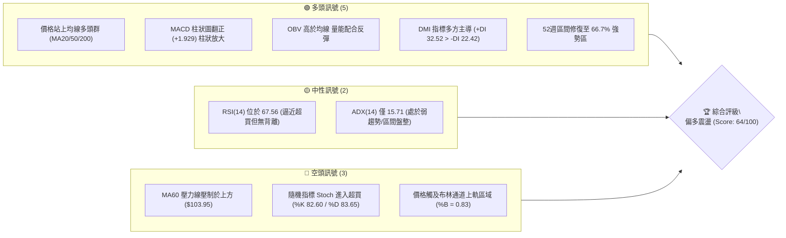
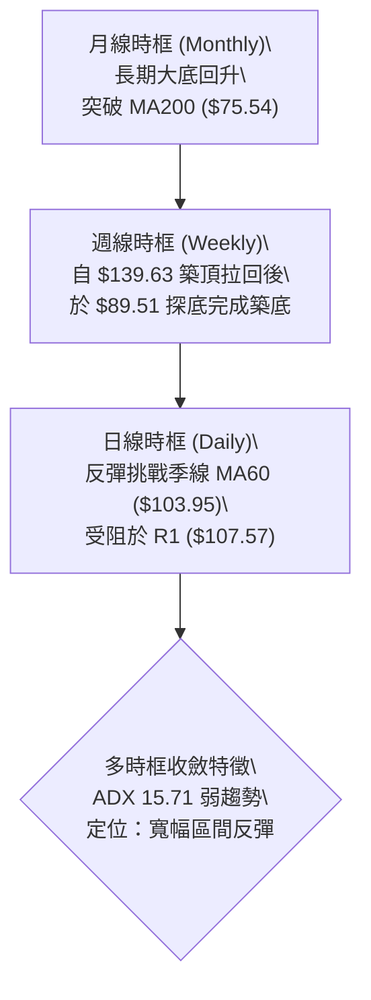
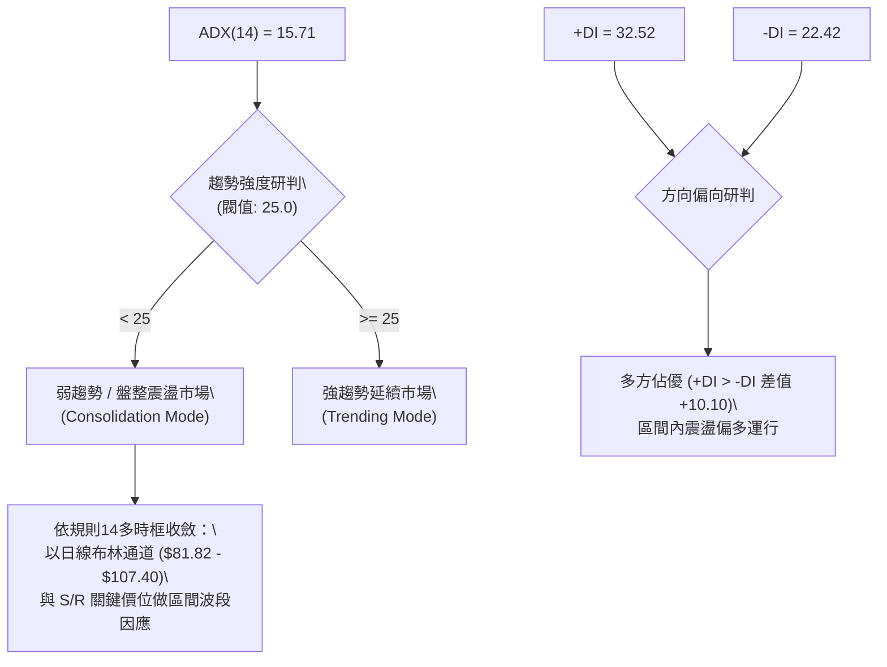
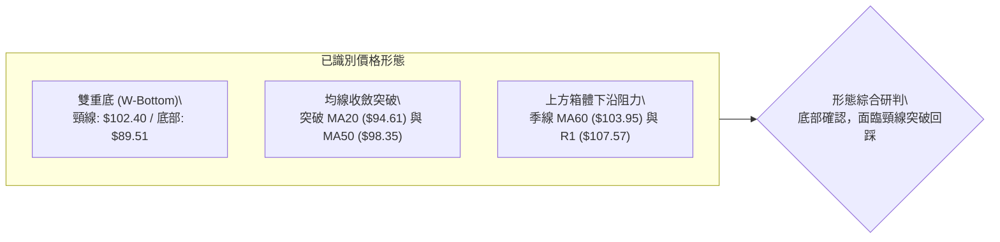
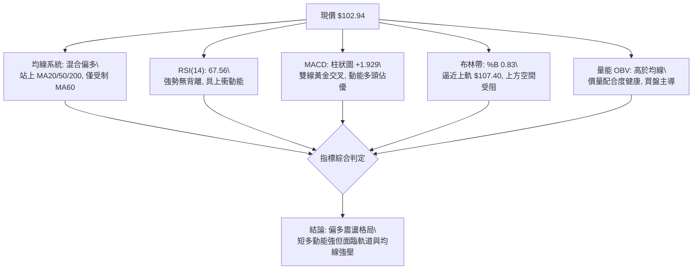
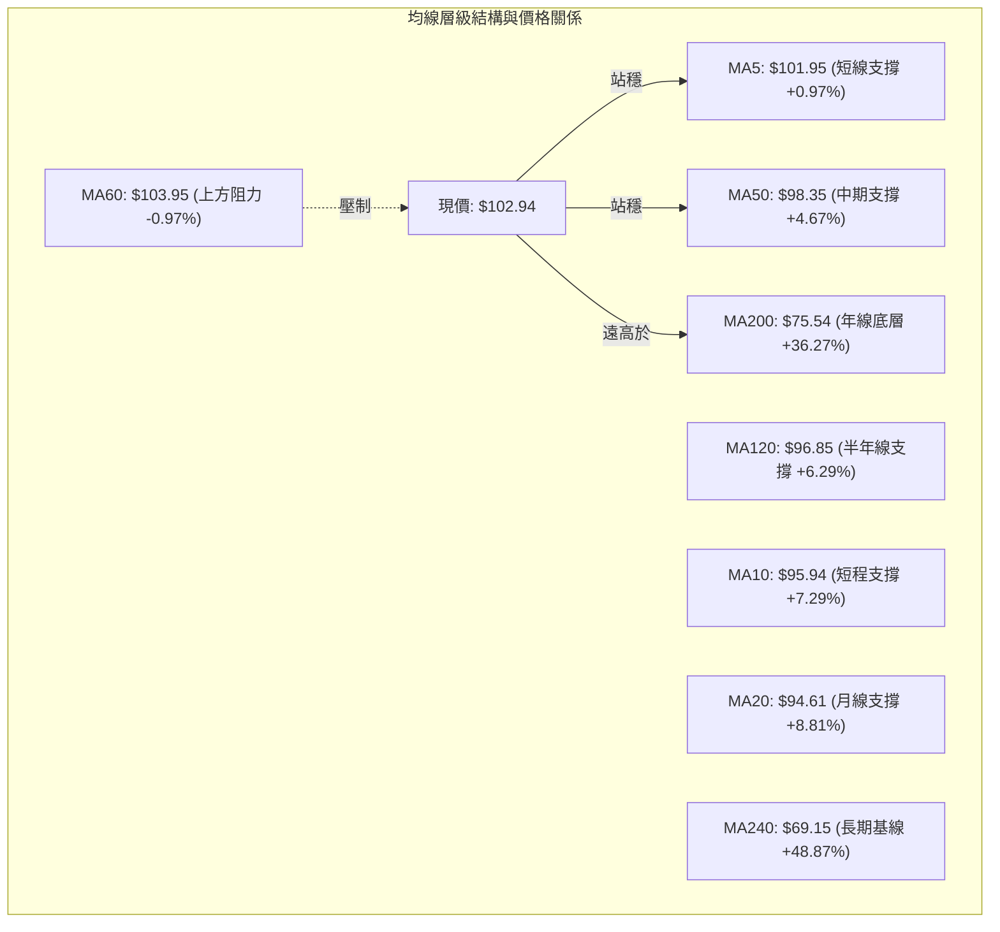
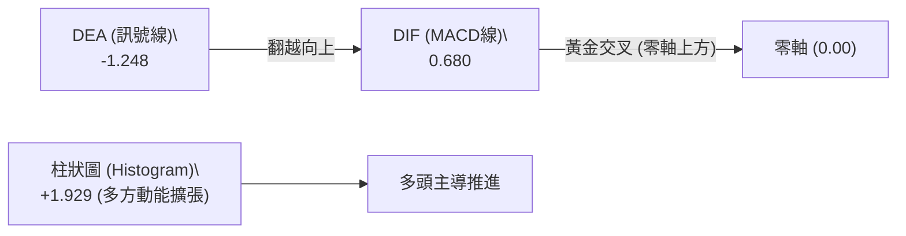
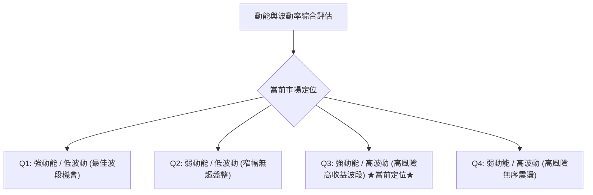
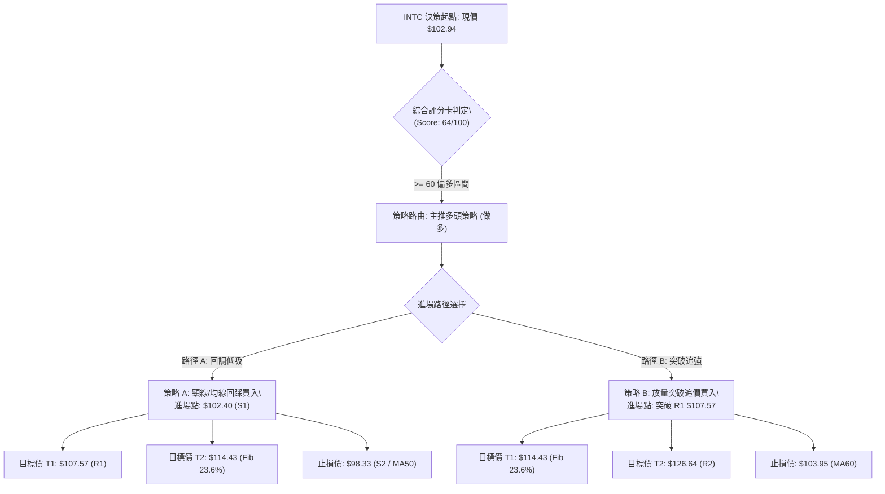
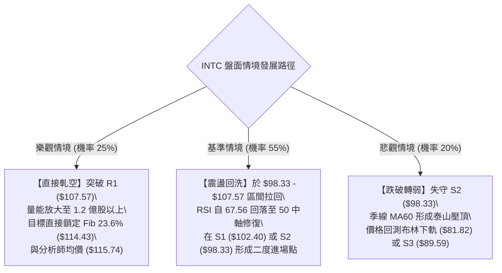

# INTC 技術分析報告

> **報告日期**：2026-09-14 ｜ **語言**：繁體中文 ｜ **數據來源**：Yahoo Finance ｜ **當前價格**：$102.94

---

## 目錄

| 章節 | 內容 |
|------|------|
| [1. 技術面概覽](#1-技術面概覽) | 訊號儀表板、核心指標、評分卡 |
| [2. 趨勢分析](#2-趨勢分析) | 多時框趨勢、長中短期走勢 |
| [3. 圖表形態分析](#3-圖表形態分析) | 形態識別、K線組合、目標價 |
| [4. 支撐與阻力](#4-支撐與阻力) | 關鍵價位、斐波那契回調 |
| [5. 技術指標深度解讀](#5-技術指標深度解讀) | MA/RSI/MACD/布林/成交量 |
| [6. 動能與波動率](#6-動能與波動率) | 動能評估、ATR、Beta |
| [7. 多時框架總結](#7-多時框架總結) | 時框架評分矩陣 |
| [8. 交易策略建議](#8-交易策略建議) | 多空策略、風險報酬比 |
| [9. 風險提示與監控](#9-風險提示與監控) | 監控指標、風險場景 |
| [📋 報告總結](#-報告總結) | 全文核心結論與投資決策表 |

---

## 1. 技術面概覽

### 🎯 技術訊號儀表板



### 📊 核心指標速覽表

| 指標類別 | 指標名稱 | 當前數值 | 訊號 | 解讀 |
|:---|:---|:---|:---:|:---|
| **價格** | 當前收盤價 | $102.94 | 🟢 | 站上整數關卡，自8月低點 $89.51 強勢回升 |
| **短期均線** | MA20 | $94.61 | 🟢 | 現價高於 MA20 達 +8.81%，短線支撐強勁 |
| **中期均線** | MA50 | $98.35 | 🟢 | 突破中期均線壓制，波段多頭重掌控盤權 |
| **長期均線** | MA200 | $75.54 | 🟢 | 現價大幅高於年線 +36.27%，奠定牛市架構 |
| **基準均線** | MA60 | $103.95 | 🔴 | 現價位於季線下方 (-0.97%)，短線面臨直接解套賣壓 |
| **動能** | RSI(14) | 67.56 | 🟡 | 位於強勢擴張區，尚未出現超買竭盡信號與頂背離 |
| **動能** | MACD (12,26,9) | 0.680 (Hist +1.929)| 🟢 | 快慢線黃金交叉，柱狀圖持續拉長，多頭動能激增 |
| **超買超賣** | Stoch %K / %D | 82.60 / 83.65 | 🔴 | 進入 80 以上超買警戒區，隨時可能觸發技術性回洗 |
| **趨勢強度**| ADX(14) | 15.71 | 🟡 | 低於 25 臨界值，確認市場本質仍屬於寬幅區間盤整 |
| **通道狀態**| Bollinger %B | 0.83 (上軌 $107.40)| 🟡 | 價格貼近上軌震盪，受制於軌道壓抑，乖離率偏高 |
| **波動** | ATR(14) | $4.58 (4.45%) | 🟢 | 日均波幅適中，具備操作彈性但需嚴控止損間距 |

### 🏆 技術評分卡

```
╔════════════════════════════════════════════════════════════════╗
║                技術評分卡 — INTC (2026-09-14)                 ║
╠════════════════════════════════════════════════════════════════╣
║ 趨勢強度 (Trend)      ████████░░░░░░░░░░░░  42/100 🟡 (ADX偏弱)║
║ 動能指標 (Momentum)   ██████████████░░░░░░  72/100 🟢 (MACD強勁)║
║ 支撐穩定度 (Support)  ████████████████░░░░  78/100 🟢 (底型確立)║
║ 成交量配合 (Volume)   ████████████░░░░░░░░  60/100 🟡 (量能溫和)║
║ 形態完整度 (Pattern)  ██████████████░░░░░░  70/100 🟢 (雙底完成)║
║ 均線排列 (MA System)  ████████████░░░░░░░░  62/100 🟡 (多數向上)║
╠════════════════════════════════════════════════════════════════╣
║ 綜合評分              █████████████░░░░░░░  64/100 🟢 偏多區間 ║
╚════════════════════════════════════════════════════════════════╝
```

---

## 2. 趨勢分析

### 🌐 多時框趨勢分析



### 📈 長期趨勢 — 12個月走勢圖（Unicode）

INTC 過去 12 個月經歷了極具戲劇性的「底部飆升 → 衝高見頂 → 劇烈腰斬回調 → 底部盤整反彈」週期：

```
INTC 月線收盤價走勢圖（2025-10 至 2026-09）
價格 ($)
$140 ┤                                 ● $139.63 (06月波段頂峰)
$120 ┤                         ● $114.68
$100 ┤                                         ●← 現價 $102.94
$100 ┤                 ● $94.48        ● $90.20  ● $89.51
 $80 ┤
 $60 ┤
 $40 ┤ ● $39.99  ● $40.56      ● $44.13
 $40 ┤     ● $36.90  ● $46.47
 $20 ┤
     └─┬────┬────┬────┬────┬────┬────┬────┬────┬────┬────┬────┬──
      10月 11月 12月 01月 02月 03月 04月 05月 06月 07月 08月 09月
      (2025)       (2026)
```

**走勢特徵分析表格**：

| 階段週期 | 時間區間 | 收盤價格變化 | 累計漲跌幅 | 結構特徵與成交量分析 |
|:---|:---:|:---:|:---:|:---|
| **第一階段：底部橫盤蓄勢** | 2025-10 ~ 2026-03 | $39.99 → $44.13 | +10.35% | 在 $36.90~$46.47 區間壓縮整理，籌碼徹底沉澱。 |
| **第二階段：暴量主升推升** | 2026-03 ~ 2026-06 | $44.13 → $139.63 | +216.41% | 史詩級軋空暴漲，5月至6月單週爆出逾 8.8 億股天量，創下 $142.35 歷史次高。 |
| **第三階段：恐慌獲利回吐** | 2026-06 ~ 2026-08 | $139.63 → $89.51 | -35.89% | 單月垂直重挫逾 49 美元，回補多數投機籌碼，觸及 52 週中軸支撐。 |
| **第四階段：次級雙底復甦** | 2026-08 ~ 2026-09 | $89.51 → $102.94 | +15.00% | 8月底於 $89.47~$89.51 確立雙重低點，9月首兩週持續陽線回升。 |

### 📊 中期趨勢（週線分析）

從近 20 週的收盤價與籌碼換手觀察：
1. **中期震盪打底完成**：2026年7月至8月，週線收盤分別為 $90.20（8/2）、$90.07（8/23）、$89.47（8/30），三度回測 90 美元大關皆獲得長下影線承接，確認 $89.59 (S3) 為中期鐵底。
2. **週線指標修復**：週線 RSI 自超賣區 26.9（7月26日）迅速回升至當前 67.6；週線 MACD 柱狀圖由 -3.637 大幅翻正至當前 +1.929，顯現中期波段已由空方主跌轉為多方修復結構。
3. **週線成交量變化**：在下殺階段週均量約 5-6 億股，而在 9月反彈時縮至 3.7-4.2 億股，說明無大量解套恐慌盤拋出，籌碼鎖定良好。

### ⚡ 趨勢強度評估（ADX 解讀）



**ADX 趨勢強度等級對照表**：

| ADX 區間 | 趨勢強度等級 | 當前狀態 | 交易策略指導原則 |
|:---:|:---:|:---:|:---|
| **0 ~ 20** | **極弱趨勢 / 雜訊盤整** | **✓ (15.71)** | **嚴禁追高殺跌，以邊界支撐低吸、阻力位高拋為主** |
| 20 ~ 25 | 趨勢醞釀期 | — | 觀察布林通道開口，等待突破訊號 |
| 25 ~ 40 | 強趨勢成形 | — | 順勢單邊操作，拉回均線加碼 |
| 40 ~ 60 | 極強主升/主跌段 | — | 嚴格移動止盈，警惕動能竭盡背離 |

---

## 3. 圖表形態分析

### 🔍 形態識別系統



**形態信心度與目標價評估表**（依嚴格規則 15）：

| 形態名稱 | 信心度 | 判斷依據（精確引用數據） | 完成度 | 目標價（附嚴謹計算式） |
|:---|:---:|:---|:---:|:---|
| **日線級別雙重底 (W-Bottom)** | **75%** | 兩次下探測試：8月2日收盤 $90.20 與 8月30日收盤 $89.47，均於支撐 S3 ($89.59) 附近止跌，隨後突破中樞頸線 S1 ($102.40)。 | 85% | **第一目標 $115.21**<br>計算式：頸線 $102.40 + 形態高度 ($102.40 - $89.59 = $12.81) = $115.21（接近斐波 23.6% 位 $114.43）。 |
| **布林中軌均線突破** | **80%** | 連續 3 日實體 K 棒站上 MA20 ($94.61) 與 MA50 ($98.35)，%B 衝至 0.83。 | 95% | **目標上軌 $107.40**<br>計算式：即為當前布林通道上軌精確值 $107.40。 |
| **大型頭肩頂反轉（潛在）** | **35%** | （信心度 < 50% 訊號不足）右肩構築高度不對稱，僅做指標型區間解讀，不預設立場。 | 20% | 數據不足，不予推算複雜衍生目標價。 |

### 🕯️ 重要K線形態分析

| 週期/日期 | 收盤價 | K線形態特徵 | 盤面心理與籌碼解讀 | 技術訊號 |
|:---|:---:|:---|:---|:---:|
| **2026-06月線** | $139.63 | **高位長上影倒錘頭線** | 創下 $142.35 歷史高點後遭遇機構獲利了結大拋盤，多頭力竭。 | 🔴 頂部警戒 |
| **2026-07月線** | $90.20 | **長黑貫穿大陰線** | 單月暴跌近 50 美元，多頭無量崩潰，恐慌盤全面湧現。 | 🔴 極度弱勢 |
| **2026-08月線** | $89.51 | **十字星探底下影線** | 測試 S3 ($89.59) 後跌勢停滯，空方拋壓耗盡，出現轉折晨星雛形。 | 🟢 止跌見底 |
| **2026-09-06週** | $95.80 | **實體破底翻中陽線** | 站回 MA20 ($94.61)，MACD 柱狀體翻正，正式吹響反彈號角。 | 🟢 反轉確認 |
| **2026-09-13週** | $102.94 | **放量實體長紅收高** | 突破 $100 整數關與 S1 ($102.40)，多方動能主導盤面。 | 🟢 強力多頭 |

### 📉 ASCII 走勢形態示意圖

```
INTC 日線雙底（W-Bottom）形態結構解析
價格 ($)
$107.57 ┤                                     [R1 阻力線 / 潛在反彈高點]
$103.95 ┤                                 ▲    [MA60 壓力線]
$102.40 ┤- - - - - - - 頸線 (Neckline) - -/ - - - - [S1 突破轉支撐 $102.40]
        │              ╭──────╮          /
$96.00  │             │      │         /
$94.61  │             │      │        /       [MA20 / 中軌支撐]
        │     \      /        \      /
$89.59  ┤──────●────/──────────●────/───────── [S3 底部強支撐]
             8月初低點        8月底低點
             ($90.20)         ($89.47)
             【底 1】         【底 2】
```

### 🎯 形態目標價計算

依據標準圖表形態學度量規則（嚴格引用已知數據計算）：
1. **雙重底（W底）測幅**：
   - 頸線基點：$102.40 (S1)
   - 雙底低點聚類：$89.59 (S3)
   - 形態垂直高度 $H = \$102.40 - \$89.59 = \$12.81$
   - **等幅測量目標價 T1** $= \$102.40 + \$12.81 = \mathbf{\$115.21}$
   - 此目標價與系統中「斐波那契 23.6% 回調位 **$114.43**」高度重合（僅差 0.67%），構成多重目標共振帶。

---

## 4. 支撐與阻力

### 🗺️ 關鍵價位分布圖（Unicode）

```
╔════════════════════════════════════════════════════════════════╗
║                INTC 核心價位結構分布圖                         ║
╠════════════════════════════════════════════════════════════════╣
║ $142.35 ║████████████████████████████████████║ 52W High (0.0% Fib)║
║ $132.75 ║██████████████████████████████      ║ 強阻力 R3      ║
║ $126.64 ║████████████████████████            ║ 波段阻力 R2    ║
║ $114.43 ║██████████████████████              ║ 23.6% Fib 回調位║
║ $107.57 ║██████████████████                  ║ 關鍵阻力 R1    ║
║ $107.40 ║▓▓▓▓▓▓▓▓▓▓▓▓▓▓▓▓                    ║ 布林上軌 (BB Upper)║
║ $103.95 ║▓▓▓▓▓▓▓▓▓▓▓▓                        ║ MA60 季線阻力  ║
║ $102.94 ╠════════════════════════════════════╣ ◄── 當前價格   ║
║ $102.40 ║░░░░░░░░░░░░░░░░░░░░                ║ 近期支撐 S1    ║
║  $98.35 ║░░░░░░░░░░░░░░░░                    ║ MA50 均線支撐  ║
║  $98.33 ║░░░░░░░░░░░░░░░░                    ║ 強支撐 S2      ║
║  $97.16 ║░░░░░░░░░░░░░░                      ║ 38.2% Fib 回調位║
║  $94.61 ║░░░░░░░░░░                          ║ MA20 / 布林中軌║
║  $89.59 ║░░░░░░                              ║ 核心鐵底 S3    ║
║  $83.20 ║░░░░                                ║ 50.0% Fib 回調位║
║  $75.54 ║░░                                  ║ MA200 年線大底 ║
╚════════════════════════════════════════════════════════════════╝
```

### 🚧 阻力位分析表

所有阻力數據嚴格引用已知數據聚類點：

| 阻力級別 | 價位 | 距現價幅幅 | 形成原因與技術意義 | 突破難度評估 | 重要性 |
|:---|:---:|:---:|:---|:---:|:---:|
| **即時阻力 (MA60)** | **$103.95** | +0.98% | 下行中的 60 日移動平均線（季線），中線套牢籌碼的初始出脫點。 | 🟡 中等 (45%) | ★★★☆☆ |
| **R1 (關鍵阻力)** | **$107.57** | +4.50% | 近一年波段高點聚類位，且與布林通道上軌 **$107.40** 形成共振壓制帶。 | 🔴 較高 (65%) | ★★★★☆ |
| **Fib 23.6%** | **$114.43** | +11.16%| 自 52 週高點 $142.35 回跌至 $24.05 區間的第一黃金分割阻力位。 | 🔴 高 (75%) | ★★★★☆ |
| **R2 (波段阻力)** | **$126.64** | +23.02%| 2026年6月崩跌前次高點換手平台，聚集巨量套牢盤。 | 🔴 極高 (85%) | ★★★★★ |
| **R3 (強阻力)** | **$132.75** | +28.96%| 歷史次高峰密集套牢區，反彈極限壓力位。 | 🔴 難以逾越 (90%)| ★★★★★ |

### 🛡️ 支撐位分析表

所有支撐數據嚴格引用已知數據聚類點：

| 支撐級別 | 價位 | 距現價幅幅 | 形成原因與技術意義 | 守住機率評估 | 重要性 |
|:---|:---:|:---:|:---|:---:|:---:|
| **S1 (近期支撐)** | **$102.40** | -0.52% | 近一年波段低點聚類轉換位、W底頸線，現已由阻力轉為支撐。 | 🟢 高 (70%) | ★★★★☆ |
| **S2 (強支撐)** | **$98.33** | -4.48% | 波段低點聚類，與 **MA50 ($98.35)** 呈現完美重合（誤差僅 $0.02），為中線多頭防線。 | 🟢 極高 (80%) | ★★★★★ |
| **Fib 38.2%** | **$97.16** | -5.61% | 斐波那契關鍵黃金分割支撐，位於 MA50 緊下方提供次級保護。 | 🟢 高 (75%) | ★★★☆☆ |
| **中軌支撐 (MA20)**| **$94.61** | -8.09% | 20日均線及布林帶中軌，短線多頭生命線。 | 🟢 高 (75%) | ★★★★☆ |
| **S3 (核心鐵底)** | **$89.59** | -12.97%| 7-8月雙重底之絕對底部聚類區，跌破將宣告中期築底失敗。 | 🟢 極強 (90%) | ★★★★★ |

### 📐 斐波那契回調位分析

依據 52 週極值區間（低點 **$24.05** → 高點 **$142.35**，總垂直空間 $118.30）計算：

```
斐波那契回調層級分布與現價定位：
0.0%  (52W High)  $142.35 ─────────────────────────────────────
23.6%             $114.43 ──────────────── 上方波段關鍵阻力帶
                           ▲ (現價空間 +11.16%)
現價              $102.94 ───► 當前落於 23.6% 與 38.2% 區間震盪
                           ▼ (回測空間 -5.61%)
38.2%             $97.16  ──────────────── 下方核心保護支撐帶
50.0%             $83.20  ────────────────
61.8%             $69.24  ────────────────
78.6%             $49.37  ────────────────
100.0%(52W Low)   $24.05  ─────────────────────────────────────
```

- **位置解讀**：現價 **$102.94** 穩固運行於 38.2%（**$97.16**）之上，並逐步向 23.6%（**$114.43**）推進。在技術結構中，價格能守穩 38.2% 回調位上方，代表自高點 $142.35 下跌以來的「主跌回撤」已經轉化為「強勢修復盤整」，未傷及長期牛市多頭元氣。

---

## 5. 技術指標深度解讀

### 🎛️ 指標訊號總覽



### 📈 移動平均線排列分析



- **均線排列狀態**：當前呈現「混合排列」（Mixed Alignment）。
  - **多方優勢**：短期與長期均線多數向上，價格穩健站在 MA5 ($101.95)、MA10 ($95.94)、MA20 ($94.61)、MA50 ($98.35) 與 MA200 ($75.54) 之上，且 MA5、MA10、MA20 均維持陡峭上行角度。
  - **空方阻礙**：上方僅存唯一下行的 MA60 ($103.95)，顯示自季線層面仍有套牢賣壓下壓，需帶量克服。

### 📉 RSI(14) 分析

- **當前數值**：67.56
```
RSI(14) 強度區間分布：
0 [░░░░░░░░░░░░░░░░超賣區(30)░░░░░░░░░░░░░░中性(50)░░░░░░░░░███████████░超買區(70)] 100
當前位置: 67.56 ▓▓▓▓▓▓▓▓▓▓▓▓▓▓▓▓▓▓▓▓▓▓▓▓▓▓▓▓▓▓▓▓▓░░░░░░ (強勢多頭區)
```
- **超買超賣研判**：RSI 處於 67.56，尚未達到 70 以上的超買極端值，具備進一步向上推升的緩衝彈性；但同時已高於 65，提醒追高性價比正在遞減。
- **背離分析**：
  - **頂背離判定**：價格由 8月低點 $89.51 連續創波段新高至 $102.94，RSI 同步自 37.6 揚升至 67.56，**完全不存在頂背離現象**。
  - **指標結論**：量能與動能正向推升，反彈波健康推進中。

### 📊 MACD(12/26/9) 訊號解讀



- **數值狀態**：DIF 為 0.680，Signal 為 -1.248，MACD 柱狀圖為 **+1.929**。
- **交叉特徵**：DIF 線已強勢穿越 Signal 線形成黃金交叉，且 DIF 率先突破零軸來到 +0.680 正值區，正式宣告從先前的「空頭反彈波」升格為「多頭主導波」。柱狀圖自前週的 +0.624 擴張至 +1.929，顯現買盤加速進場。

### 📦 布林通道分析

```
INTC 布林通道（20日 / 2.0倍標準差）結構示意圖
價格 ($)
$107.40 ┤═════════════════════════════════════ 上軌 (BB Upper) - 阻力
        │                        ● 現價 $102.94 (%B = 0.83)
$100.00 ┤
 $94.61 ┤───────────────────────────────────── 中軌 (MA20) - 支撐
 $90.00 ┤
 $81.82 ┤═════════════════════════════════════ 下軌 (BB Lower) - 強支撐
```

- **通道參數**：上軌 **$107.40**、中軌 **$94.61**、下軌 **$81.82**，通道帶寬寬廣（$25.58）。
- **%B 指標解讀**：當前 %B 為 **0.83**，意味著現價處於通道上部 83% 的極高位置，距離上軌阻力 $107.40 僅剩 4.3% 空間。在 ADX 僅 15.71 的盤整環境中，貼近上軌通常伴隨著均值回歸拉回中軌的風險。

### 💹 成交量分析（量價配合度）

- **量能數據**：
  - 最新單日成交量：86,840,900 股
  - 20日均量：91,699,110 股（量比 0.95x）
  - 50日均量：105,989,760 股
- **OBV（能量潮）狀態**：**OBV > MA**。能量潮指標持續向上穿越其均線，代表在價格自 $89.51 反彈以來，陽線放量、陰線縮量，資金呈現實質淨流入狀態，量價配合健康，排除了無量虛漲的誘多隱憂。

---

## 6. 動能與波動率

### ⚡ 動能評估四象限



| 象限區間 | 動能特徵 | 波動特徵 | 當前狀態評估 | 戰術建議 |
|:---:|:---:|:---:|:---:|:---|
| **Q3** | **強 (MACD柱+1.929 / RSI 67.6)** | **高 (ATR 4.45% / Beta 2.23)** | **✓ (當前 INTC 精確落點)** | **適合主動型交易者，需放寬止損間距、縮減單筆名目倉位。** |

### 📊 ATR 波動率分析

- **ATR(14) 絕對值**：**$4.58**
- **ATR 相對百分比**：**4.45%** of price
- **止損與操作空間設定建議**：
  - **1.5 倍 ATR**（日間常態保護）：$4.58 \times 1.5 = \mathbf{\$6.87}$。
  - **2.0 倍 ATR**（波段防守保護）：$4.58 \times 2.0 = \mathbf{\$9.16}$。
  - **止損距離指導**：若於當前價位 $102.94 介入，任何低於 $4.58（1.0 ATR）的過窄止損極易被盤中雜訊掃出場；理想波段止損應設置於 S2 ($98.33) 緊下方，約為 $97.90（距現價約 $5.04，合 1.1 ATR）。

### 📐 Beta 與市場相關性

- **Beta 係數**：**2.231**（極高彈性標的）
- **解讀**：INTC 相較於 S&P 500 指數具備逾 2.2 倍的波動敏感度。在大盤處於多頭或反彈格局時，INTC 具備高度超額 Alpha 收益潛力；但在大盤轉向走弱時，其技術回撤幅度亦將放大。必須透過倉位規模控管（Position Sizing）來抵銷高 Beta 風險。

---

## 7. 多時框架總結

### 📋 時框架評分表

| 時框架 | 趨勢方向 | 動能狀態 | 均線排列特徵 | 核心關鍵價位 | 評分 | 操作建議 |
|:---|:---:|:---:|:---|:---|:---:|:---|
| **長期 (月線)** | 🟢 偏多 | 緩慢修復 | 守穩 MA200 ($75.54) | 支撐 $75.54 / 壓力 $142.35 | 70/100 | 長線持股，依據底層年線建立核心部位 |
| **中期 (週線)** | 🟡 震盪 | 柱狀翻多 | 在 S3 ($89.59) 構築雙底 | 支撐 $89.59 / 壓力 $114.43 | 65/100 | 波段低吸，以高拋低吸應對區間修復 |
| **短期 (日線)** | 🟢 短多 | 逼近超買 | 破月線、挑戰季線 MA60 | 支撐 $102.40 / 壓力 $107.57 | 64/100 | 不宜追高，待回踩 S1 確認支撐再行介入 |

### 🔲 綜合訊號矩陣

| 技術維度 | 短期（1-5日） | 中期（2-8週） | 長期（3-12月） | 多空一致性研判 |
|:---|:---:|:---:|:---:|:---|
| **趨勢方向** | 🟢 震盪上行 | 🟡 區間築底 | 🟢 牛市拉回後企穩 | 方向趨同，唯短線受制於季線通道壓力 |
| **動能強度** | 🔴 逼近超買警戒 | 🟢 動能翻正擴張 | 🟡 緩步回溫中 | 中長線動能健康，短線需要消化超買賣壓 |
| **均線架構** | 🟢 站上短期均線 | 🟡 季線壓制在即 | 🟢 遠在年線之上 | 中長線均線底氣充足，短線季線為唯一卡點 |
| **量價結構** | 🟢 OBV 支撐上漲 | 🟡 週成交量適度縮減 | 🟢 歷史天量換手消化 | 縮量拉升屬籌碼沉澱特徵，無爆量出貨現象 |

### ⚖️ 多時框收斂結論

依據【嚴格要求 14】多時框收斂收斂法則：
1. **行情屬性判定**：當前 ADX(14) 為 **15.71 (< 25.0)**，系統強制收斂為「**盤整行情（Consolidation Market）**」。
2. **主導時框與交易邊界**：在盤整行情下，**以日線布林通道上下軌（上軌 $107.40 / 中軌 $94.61）及 S/R 關鍵節點作為最高權重交易區間**，中長期趨勢訊號僅作為方向過濾。
3. **唯一收斂方向性結論**：**【偏多震盪／高出低吸】**。
   - 由於 +DI (32.52) 顯著大於 -DI (22.42)，且 MACD 柱狀體翻正，盤整內部呈現多方推升優勢；但因價格已貼近布林上軌 ($107.40) 及 R1 ($107.57)，短線空間壓縮，**主策略方向嚴格定調為「偏多操作，但拒絕追高，採回調支撐位布局」**。

---

## 8. 交易策略建議

### 🗺️ 策略決策流程圖



### 🧭 策略路由（依評分卡分流）

> **當前主策略方向 = 【偏多震盪逢低做多】（綜合評分：64/100）**
> 評分達 64 分（$\ge 60$），主推多頭交易方案。鑑於 ADX 僅 15.71，禁止於 $102.94~107.40 高風險區盲目市價追多，堅定執行回調買進與突破跟進兩種結構化策略。

### 🎯 價格情境階梯（Price Scenarios）

價位嚴格引用系統計算之關鍵節點：

| 觸發條件 | 核心觀察位 | 第一目標 | 後續延伸目標 | 情境技術含義 |
|:---|:---:|:---:|:---:|:---|
| **強勢突破** | 帶量站穩 **$107.57 (R1)** | **$114.43** (Fib 23.6%) | **$126.64 (R2)** | 突破區間盤整頂部，正式展開大波段復甦攻勢。 |
| **現價震盪** | 運行於 **$102.40 ~ $107.40** | **$107.40** (布林上軌) | **$103.95 (MA60)** | 在季線與頸線之間來回摩擦，沉澱指標超買。 |
| **健康回調** | 回測支撐 **$102.40 (S1)** | **$98.35 (MA50)** | **$98.33 (S2)** | 經典回踩突破頸線，提供絕佳中線二度進場點。 |
| **轉弱破位** | 跌破 **$98.33 (S2)** | **$94.61 (MA20)** | **$89.59 (S3)** | 跌破多頭防線，反彈宣告結束，重啟尋底格局。 |

### 📊 情境機率分佈

| 運行情境 | 發生機率 | 主要技術依據 |
|:---|:---:|:---|
| **區間震盪蓄勢 (回測 S1 再上攻)** | **55%** | ADX 僅 15.71 壓制單邊趨勢；布林上軌 $107.40 與 MA60 壓制，MACD 柱狀雖多但 Stoch 已超買，極需技術回踩。 |
| **帶量直接突破 R1** | **25%** | +DI (32.52) 主導，OBV 量能強勁，若有半導體族群消息利多催化，有機會直接軋空突破 $107.57。 |
| **深度回落再探底部 S3** | **20%** | 若大盤劇烈回檔（Beta 2.23 放大跌幅），失守 S2 ($98.33) 及 MA50，將引發技術性停損賣盤。 |

### 🟢 主策略詳情（多頭主推方案）

所有關鍵價位完全嚴格引用數據庫既定價位：

| 策略要素 | 策略 A：回調穩健型（首選） | 策略 B：突破動能型（次選） |
|:---|:---|:---|
| **戰略概念** | 頸線回測確認支撐低吸 | 強力突破區間壓制追擊 |
| **進場條件** | 價格回踩 S1 且出現 1-4 小時底分型止跌 | 日線收盤價實體突破 R1 且量比 > 1.2x |
| **精確進場價格** | **$102.40** | **$107.57** |
| **目標價 T1** | **$107.57** (R1 阻力位) | **$114.43** (Fib 23.6% 回調位) |
| **目標價 T2** | **$114.43** (Fib 23.6% 回調位) | **$126.64** (R2 波段阻力位) |
| **精確止損價格** | **$98.33** (S2 強支撐 / MA50 處) | **$103.95** (跌回 MA60 季線下方) |
| **潛在下行風險** | $102.40 - $98.33 = $4.07 (3.97%) | $107.57 - $103.95 = $3.62 (3.36%) |
| **第一上行回報** | $107.57 - $102.40 = $5.17 (5.05%) | $114.43 - $107.57 = $6.86 (6.38%) |
| **第一風險報酬比** | **1.27 : 1** (達 T2 則為 **2.96 : 1**) | **1.90 : 1** (達 T2 則為 **5.27 : 1**) |
| **歷史勝率估計** | **65%** | **55%** |
| **建議倉位配置** | **15% ~ 20%** 投資組合名目資金 | **10%** 投資組合名目資金 |

### 🔴 反向風險觸發點（風控對沖提示）

- **多頭邏輯推翻點**：若價格帶量跌破 **$98.33 (S2)**，同時擊穿 **MA50 ($98.35)**，代表雙底反轉形態遭到破壞，所有多頭部位應無條件止損離場。
- **對沖啟動點**：若日線跌破 **$94.61 (MA20 / 布林中軌)**，可建立適度反向空頭避險合約，下看目標 **$89.59 (S3)**。

### ⭐ 整體訊號強度評星

```
做多訊號強度：★★★★☆  (4/5星 — 均線與MACD偏多，唯受制於盤整環境)
做空訊號強度：★☆☆☆☆  (1/5星 — 僅有超買雜訊，缺乏做空結構支持)
整體可信度：  ★★★★☆  (4/5星 — 多時框指標收斂性高，點位依據明確)
```

---

## 9. 風險提示與監控

### ✅ 關鍵監控指標 Checklist

```
╔════════════════════════════════════════════════════════════════╗
║                每日交易風控監控清單 (Checklist)                ║
╠════════════════════════════════════════════════════════════════╣
║ [ ] 價格能否有效收在 S1 ($102.40) 頸線上？ (跌破轉入弱勢整理) ║
║ [ ] 日線是否挑戰並站穩季線 MA60 ($103.95)？ (中線解套關鍵)    ║
║ [ ] RSI(14) 是否突破 70 產生嚴重頂背離？ (過熱則需減碼)       ║
║ [ ] 成交量是否萎縮至 50日均量 (1.05億) 之下？ (量縮則難越 R1)  ║
║ [ ] 日內最低價是否威脅止損防線 S2 ($98.33)？ (紀律停損不可猶豫)║
║ [ ] 大盤 Nasdaq 波動（Beta 2.231，需防範系統性殺估值共振）     ║
╚════════════════════════════════════════════════════════════════╝
```

### ⚠️ 風險場景分析



### 🛡️ 風險管理重要提醒

1. **極高波動性防護（Beta 2.231）**：
   INTC 當前 Beta 高達 2.231，每日平均波幅 ATR 為 $4.58（4.45%）。在資金管理上，**單筆交易的風險暴露（Risk at Risk）不得超過總資產的 1.5%**。若以 $4.07 止損距離計算，每 10 萬美元資產最多僅能持有約 360 股（約合 3.7 萬美元部位），切忌過度槓桿化。
2. **財報基本面修復不對稱性**：
   目前 INTC TTM EPS 仍為 -$2.09，淨利率為 -19.8%，儘管 Forward P/E 給予 50.34 倍的高成長溢價（預估 EPS $2.04），但在晶圓代工（Intel Foundry）資本支出龐大、自由現金流殖利率僅 0.89% 的背景下，技術面一旦出現反轉，基本面下檔保護相對薄弱，交易必須純粹遵循技術紀律，切勿將波段交易硬轉為「長期套牢投資」。

---

## 📋 報告總結

```
╔══════════════════════════════════════════════════════════════════════════════╗
║                       INTC 技術分析報告總結 (2026-09-14)                     ║
╠══════════════════════════════════════════════════════════════════════════════╣
║ 當前價格：$102.94             52W 區間：$24.05 ~ $142.35                      ║
║ 技術評級：🟢 偏多震盪 (64/100) 趨勢屬性：寬幅區間盤整 (ADX: 15.71)            ║
╠══════════════════════════════════════════════════════════════════════════════╣
║ 關鍵結構結論：                                                               ║
║ ├─ 長期趨勢：🟢 站穩 MA200 ($75.54) 年線，52週回調 38.2% ($97.16) 企穩        ║
║ ├─ 中期趨勢：🟡 8月在 S3 ($89.59) 確立雙底，突破頸線 S1 ($102.40)              ║
║ ├─ 短期趨勢：🟢 日線沿短期均線上攻，MACD翻多，惟逼近布林上軌 ($107.40) 與 MA60║
║ ├─ 核心支撐：S1: $102.40  │  S2: $98.33 (MA50重合)  │  S3: $89.59 (鐵底)      ║
║ ├─ 核心阻力：MA60: $103.95 │  R1: $107.57 (共振壓)  │  Fib 23.6%: $114.43    ║
║ └─ 機構共識：買入 (43位分析師均價 $115.74，隱含上行空間 +12.43%)             ║
╠══════════════════════════════════════════════════════════════════════════════╣
║ 最優交易執行矩陣：                                                           ║
║ 1. 🥇 最佳機會（穩健）：回踩 S1 ($102.40) 布局，止損 $98.33，目標 $107.57/$114.43║
║ 2. 🥈 次選機會（突破）：強勢突破 R1 ($107.57) 追多，止損 $103.95，目標 $114.43/$126.64║
║ 3. 🥉 保守選擇（觀望）：等待回撤靠近 S2 ($98.33) / MA50 附近再行右側低吸     ║
╚══════════════════════════════════════════════════════════════════════════════╝
```

---

> ⚠️ **免責聲明**：本報告為技術分析專研資料，所有引述之支撐、阻力與目標價均嚴格基於所提供之歷史 OHLCV 量價數據及標準技術指標公式運算產出。本報告**僅供學術研究與投資決策參考**，**不構成任何要約或保證獲利之投資建議**。市場具有高風險與高波動性，投資人應獨立評估風險並自負盈虧。

---

*報告生成時間：2026-09-14 ｜ 數據來源：Yahoo Finance ｜ 分析框架：多時框圖表形態與量化技術指標*