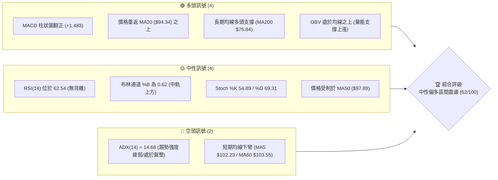
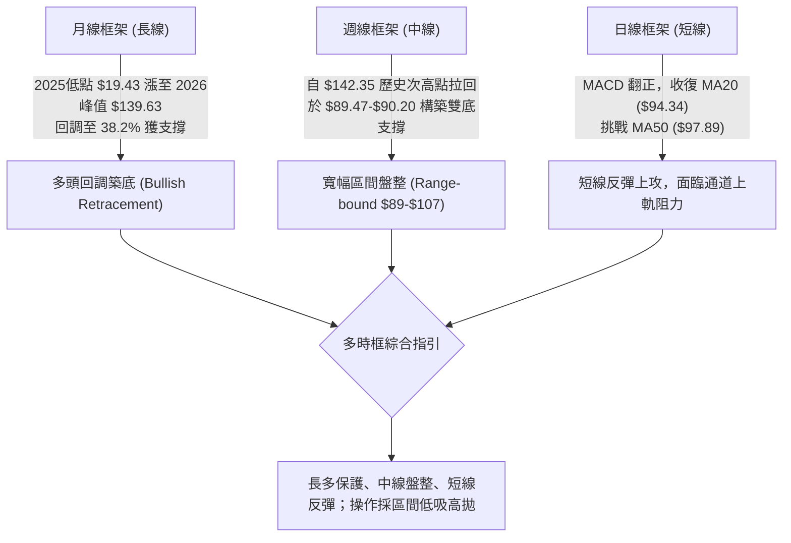
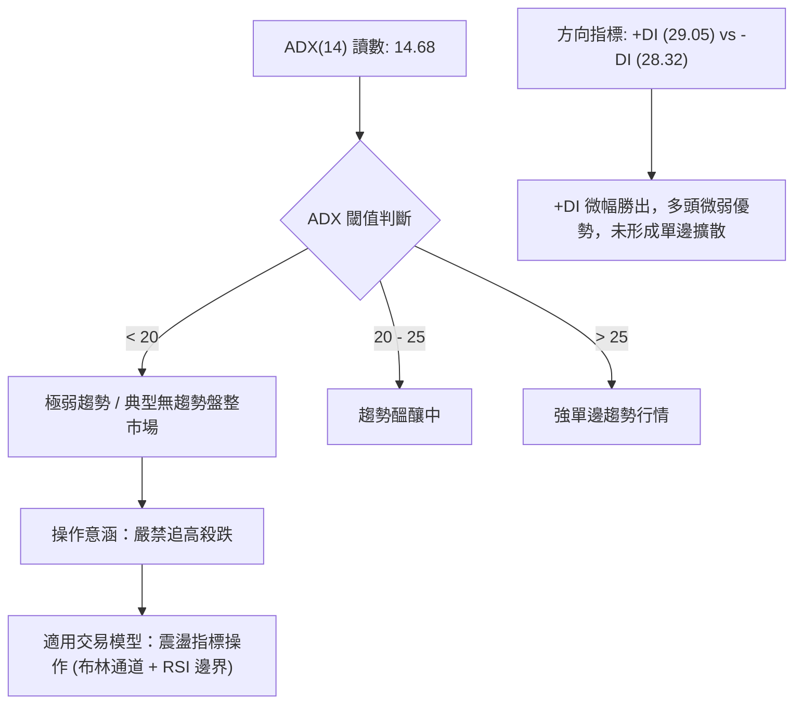
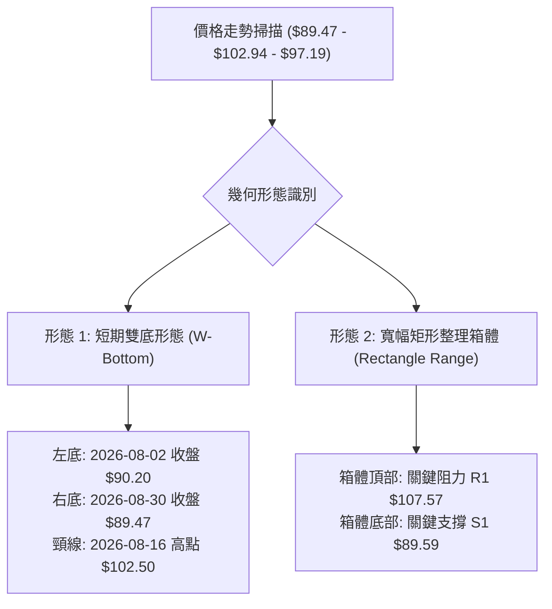
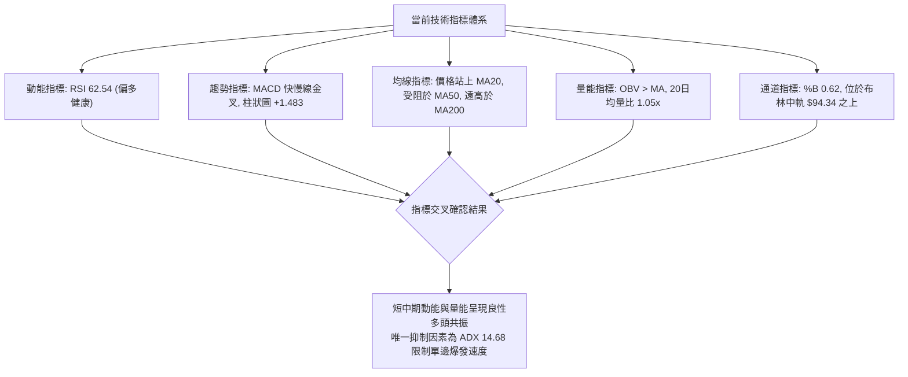
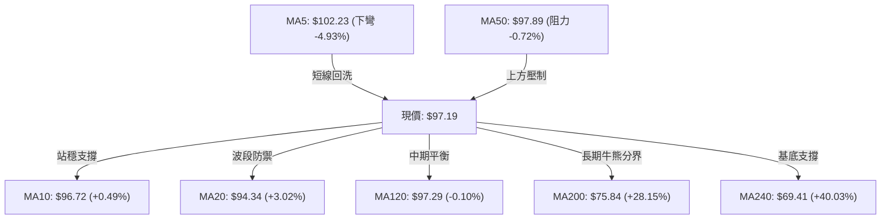
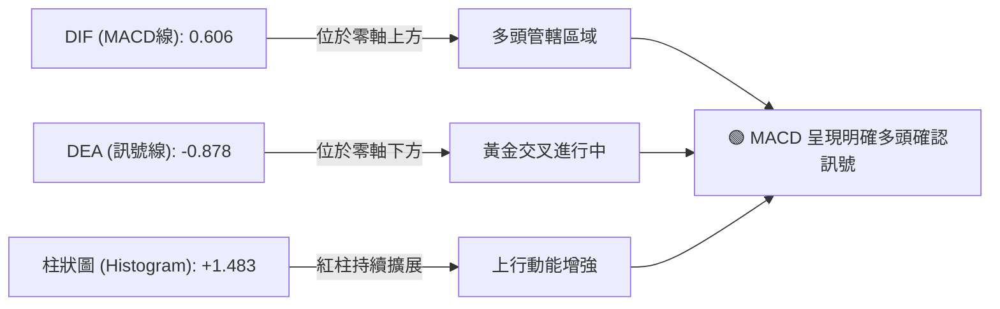
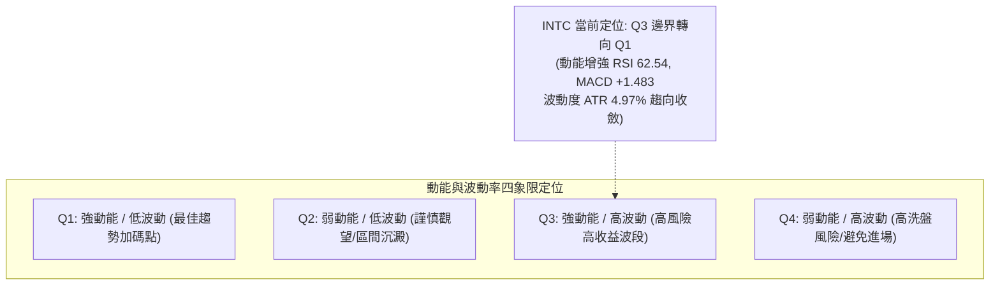
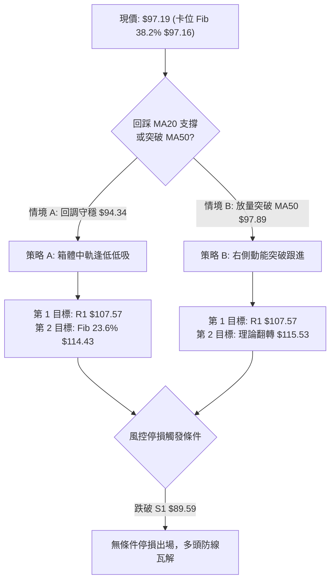
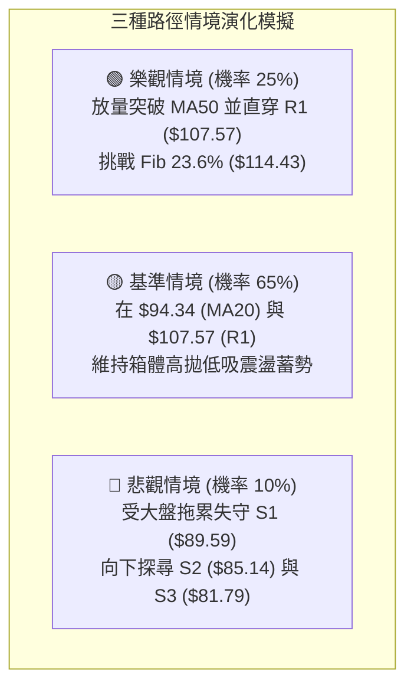

# INTC 技術分析報告

> **報告日期**：2026-09-15 ｜ **語言**：繁體中文 ｜ **數據來源**：Yahoo Finance ｜ **當前價格**：$97.19

---

## 目錄

| 章節 | 內容 |
|------|------|
| [1. 技術面概覽](#1-技術面概覽) | 訊號儀表板、核心指標、評分卡 |
| [2. 趨勢分析](#2-趨勢分析) | 多時框趨勢、長中短期走勢、ADX 解讀 |
| [3. 圖表形態分析](#3-圖表形態分析) | 形態識別、K線組合、形態目標價 |
| [4. 支撐與阻力](#4-支撐與阻力) | 關鍵價位分佈、斐波那契回調結構 |
| [5. 技術指標深度解讀](#5-技術指標深度解讀) | MA/RSI/MACD/布林通道/量價配合 |
| [6. 動能與波動率](#6-動能與波動率) | 動能四象限、ATR 波動度、Beta 敏感度 |
| [7. 多時框架總結](#7-多時框架總結) | 時框矩陣、多時框收斂結論 |
| [8. 交易策略建議](#8-交易策略建議) | 策略路由、價格階梯、主策略詳情 |
| [9. 風險提示與監控](#9-風險提示與監控) | 監控清單、情境模擬、風控防線 |
| [10. 報告總結](#-報告總結) | 總結儀表板與決策指引 |

---

## 1. 技術面概覽

### 🎯 技術訊號儀表板



---

### 📊 核心指標速覽表

| 指標類別 | 指標名稱 | 當前數值 | 訊號 | 技術解讀 |
|----------|----------|----------|------|----------|
| **價格** | 當前收盤價 | $97.19 | 🟢 | 精準卡位斐波那契 38.2% 回調位 ($97.16) |
| **均線** | 短期 MA20 | $94.34 | 🟢 | 價格在 MA20 之上 +3.02%，形成短線支撐 |
| **均線** | 中期 MA50 | $97.89 | 🔴 | 價格在 MA50 之下 -0.72%，面臨即時均線反壓 |
| **均線** | 長期 MA200 | $75.84 | 🟢 | 價格遠高於 MA200 (+28.15%)，長期底層結構偏多 |
| **均線** | 超長期 MA240 | $69.41 | 🟢 | 價格高於 MA240 (+40.03%)，長期牛市基座穩固 |
| **動能** | RSI(14) | 62.54 | 🟡 | 位於健康多頭偏強區間，未出現超買或頂背離 |
| **動能** | MACD (12,26,9) | 0.606 | 🟢 | 快線高於慢線 (-0.878)，MACD 柱狀體擴張至 +1.483 |
| **趨勢強度**| ADX(14) | 14.68 | 🔴 | ADX < 25 表明處於弱趨勢/區間震盪整理行情 |
| **波動** | ATR(14) | $4.83 | 🟡 | 每日平均波動幅度 4.97%，日內波動偏高但維持穩定 |
| **通道** | 布林通道帶寬 | $82.03–$106.65 | 🟡 | %B = 0.62，運行於中軌與上軌間之多頭防禦區 |
| **量能** | 成交量比 (VR) | 1.05x | 🟢 | 當日量 96.24M 略高於 20 日均量，OBV 趨勢支撐漲勢 |

---

### 🏆 技術評分卡

```
╔══════════════════════════════════════════════════════════════════╗
║               技術評分卡 — INTC (2026-09-15)                    ║
╠══════════════════════════════════════════════════════════════════╣
║ 趨勢強度 (Trend)     ██████░░░░░░░░░░░░░░  32/100  🔴 弱勢震盪   ║
║ 動能指標 (Momentum)  ██████████████░░░░░░  70/100  🟢 動能偏多   ║
║ 支撐穩定度 (Support) ██████████████░░░░░░  72/100  🟢 雙底支撐   ║
║ 成交量配合 (Volume)  ████████████░░░░░░░░  60/100  🟡 溫和放量   ║
║ 形態完整度 (Pattern) █████████████░░░░░░░  65/100  🟡 築底收斂   ║
║ 均線排列 (MA System) █████████████░░░░░░░  65/100  🟡 混合同步   ║
╠══════════════════════════════════════════════════════════════════╣
║ 綜合技術評分         ████████████░░░░░░░░  62/100  🟢 中性偏多   ║
╚══════════════════════════════════════════════════════════════════╝
```

---

## 2. 趨勢分析

### 🌐 多時框趨勢分析



---

### 📈 長期趨勢 — 12 個月走勢圖（Unicode）

```
INTC 月線走勢圖（2025-10 至 2026-09）
價格軸 ($)
$140 ┤                               ● $139.63 (06月波段大頂)
$130 ┤                              ╱ ╲
$120 ┤                             ╱   ╲
$110 ┤                      ● $114.68   ╲
$100 ┤                     ╱             ╲      ● $97.19 (現價)
 $90 ┤              ● $94.48              ●────● $89.51 (08月探底)
 $80 ┤             ╱                     $90.20
 $70 ┤            ╱
 $60 ┤           ╱
 $50 ┤    ●     ● $44.13
 $40 ┤●───┴─● $36.90
 $30 ┤$39.99
     └────────────────────────────────────────────────────────────
      10  11  12  01  02  03  04  05  06  07  08  09 (月份)
      2025─────── 2026─────────────────────────────────
```

#### 走勢特徵分析表格

| 階段區間 | 起止月份 | 價格變化區間 | 累積漲跌幅 | 走勢特徵與結構定義 |
|----------|----------|--------------|------------|--------------------|
| **第一階段：底部蓄勢** | 2025-10 ~ 2026-03 | $39.99 → $44.13 | +10.35% | 低檔平台橫盤構築大型底部，籌碼換手充分 |
| **第二階段：主升爆發** | 2026-03 ~ 2026-06 | $44.13 → $139.63| +216.41%| 歷史級別暴力拉升，放量衝刺至 52W 高點 $142.35 區域 |
| **第三階段：恐慌殺多** | 2026-06 ~ 2026-08 | $139.63 → $89.51| -35.89% | 獲利盤湧出與獲利回吐，急跌至斐波那契 38.2% 區間支撐 |
| **第四階段：次級築底** | 2026-08 ~ 2026-09 | $89.51 → $97.19 | +8.58%  | 探底 $89.47-$89.59 後放量回升，站穩布林中軌開展反彈 |

---

### 📊 中期趨勢（週線分析）

從近 20 週的收盤價演變來看，INTC 在歷經 2026 年 6 月底（$128.32）的高位崩落後，連續下挫至 2026-07-26 的 $92.32，並在 2026-08-02 的 $90.20 與 2026-08-30 的 $89.47 兩度探底成功，未曾實質跌破關鍵支撐 S1 ($89.59)。

```
近期週線壓力與支撐架構示意圖：
阻力 R2 ── $126.64 ═══════════════════════════════════ (前期反彈頭部聚類)
               │
阻力 R1 ── $107.57 ─────────────────────────────────── (前波週線反彈高點頸線)
               │      ▲
現價位   ──  $97.19  ─┼─ (現正挑戰 MA50 $97.89，上方空間至 R1)
               │      ▼
支撐 S1 ──  $89.59 ═══════════════════════════════════ (8月雙重築底防線 $89.47-$90.20)
               │
支撐 S2 ──  $85.14 ─────────────────────────────────── (次級強支撐 / 斐波那契 50% 緩衝區)
```

---

### ⚡ 趨勢強度評估（ADX 解讀）



#### ADX 趨勢強度對照表

| 指標變數 | 當前讀數 | 狀態判定 | 技術意涵與操作指導 |
|----------|----------|----------|--------------------|
| **ADX(14)** | 14.68 | 🔴 弱趨勢/無方向 | 趨勢處於休眠期，均線反覆纏繞，適合區間擺盪操作 |
| **+DI** | 29.05 | 🟢 多方進攻端 | 多方維持進攻意願，數值維持在 25 臨界線上方 |
| **-DI** | 28.32 | 🟡 空方防禦端 | 空方動能稍退，但雙方差距僅 0.73，隨時可能發生糾纏 |
| **DI 交叉狀態** | +DI 上穿 -DI | 🟢 弱多頭排列 | 黃金交叉有效，但因 ADX 過低，不宜視為單邊暴漲訊號 |

---

## 3. 圖表形態分析

### 🔍 形態識別系統



#### 形態識別與信心度評估表

| 形態類別 | 信心度 | 判斷依據（引用數據） | 完成度 | 目標價（附嚴謹計算式） |
|----------|--------|----------------------|--------|------------------------|
| **短期雙底 (W-Bottom)** | 68% | 2026-08-02 底點 $90.20 與 2026-08-30 低點 $89.47 獲 S1 ($89.59) 嚴密支撐，兩次下探不破 | 75% | 頸線價位 $102.50。<br/>形態高度 = $102.50 - $89.47 = $13.03。<br/>**突破理論目標價** = $102.50 + $13.03 = **$115.53**（接近分析師平均目標 $115.74 與 Fib 23.6% $114.43） |
| **箱體震盪 (Rectangle)** | 82% | ADX 14.68 極度低迷，價格波動受限於 R1 ($107.57) 與 S1 ($89.59) 之間 | 85% | 箱體震盪無單邊延伸，箱頂目標 = **$107.57**，箱底支撐 = **$89.59** |
| **頭肩底形態** | 35% | 數據中未偵測到完整左肩與右肩對稱量價結構 | 0% | 訊號不足，僅做指標型解讀，不設目標價 |

---

### 🕯️ 重要 K 線形態分析

| 區間日期 | 收盤價 | 核心 K 線形態 | 專業技術解讀 | 訊號方向 |
|----------|--------|---------------|--------------|----------|
| 2026-08-23 ~ 2026-08-30 | $89.47 | 探底長下影十字星 (Hammer/Doji) | 空方力竭，在支撐 S1 ($89.59) 前被多頭頑強收回，確認二次底 | 🟢 看多反轉 |
| 2026-09-06 ~ 2026-09-13 | $102.94 | 大陽線實體反彈 (Bullish Engulfing) | 連續兩週放量長紅，一舉收復 MA10 與 MA20，突破短期均線壓制 | 🟢 強烈買盤 |
| 2026-09-20 (當前) | $97.19 | 高位回洗陰線 (Consolidation Pullback) | 面臨 MA50 ($97.89) 心理整數關卡壓制，獲利盤正常換手，成交量 96.24M 維持中性 | 🟡 蓄勢整理 |

---

### 📉 ASCII 走勢形態示意圖

```
雙底築底與箱體形態示意圖 (2026-08 至 2026-09)
阻力線 (R1) ── $107.57 ┬──────────────────────────────────────────
                       │                  [目標延伸: $115.53]
頸線位置    ── $102.50 ┼─────────● (08-16)───────● (09-13)
                       │        ╱ ╲             ╱ ╲
現價位置    ──  $97.19 ┼───────┼───╲───────────┼───● (當前 $97.19 測試)
                       │      ╱     ╲         ╱
支撐線 (S1) ──  $89.59 ┴─────●───────●───────┴────────────────────
                          第1底       第2底
                         ($90.20)    ($89.47)
                          08-02       08-30
```

---

## 4. 支撐與阻力

### 🗺️ 關鍵價位分布圖（Unicode）

```
INTC 價位結構分布圖 (由 OHLCV 與斐波那契精確計算)
══════════════════════════════════════════════════════════════════════
$142.35 ║████████████████████████████████████████║ 52W 最高點 / Fib 0.0%
$132.75 ║██████████████████████████████        ║ 強波段阻力 R3
$126.64 ║████████████████████████              ║ 波段次高點阻力 R2
$114.43 ║██████████████████                    ║ 斐波那契 23.6% 回調位
$107.57 ║██████████████████████████████████████║ 關鍵頸線阻力 R1 (布林上軌附近)
$106.65 ║▓▓▓▓▓▓▓▓▓▓▓▓▓▓▓▓▓▓▓▓▓▓▓▓▓▓▓▓▓▓▓▓        ║ 布林通道上軌
──────────────────────────────────────────────────────────────────────
 $97.89 ║┈┈┈┈┈┈┈┈┈┈┈┈┈┈┈┈┈┈┈┈┈┈┈┈┈┈┈┈┈┈┈┈┈┈┈┈┈┈║ 中期均線 MA50 壓制線
 $97.19 ╠══════════════════════════════════════╣ ◄ 當前收盤價 ($97.19)
 $97.16 ║≡≡≡≡≡≡≡≡≡≡≡≡≡≡≡≡≡≡≡≡≡≡≡≡≡≡≡≡≡≡≡≡≡≡≡≡≡≡≡≡║ 斐波那契 38.2% 核心分水嶺
 $94.34 ║▒▒▒▒▒▒▒▒▒▒▒▒▒▒▒▒▒▒▒▒▒▒▒▒▒▒▒▒▒▒▒▒        ║ 布林中軌 / 短期均線 MA20 支撐
──────────────────────────────────────────────────────────────────────
 $89.59 ║██████████████████████████████████████║ 關鍵波段支撐 S1 (雙底底部)
 $85.14 ║██████████████████████                ║ 強支撐 S2 (波段密集區)
 $83.20 ║▓▓▓▓▓▓▓▓▓▓▓▓▓▓▓▓▓▓▓▓▓▓                ║ 斐波那契 50.0% 關鍵平衡位
 $82.03 ║▒▒▒▒▒▒▒▒▒▒▒▒▒▒▒▒▒▒                    ║ 布林通道下軌
 $81.79 ║████████████████                      ║ 極限強支撐 S3
══════════════════════════════════════════════════════════════════════
```

---

### 🚧 阻力位分析表

| 阻力級別 | 具體價位 | 距離現價幅度 | 形成技術依據 | 突破難度評估 | 重要性等級 |
|----------|----------|--------------|--------------|--------------|------------|
| **R1** | **$107.57** | +10.68% | 近一年波段高點聚類、布林上軌 ($106.65) 共振壓力區 | 🟡 中等（需放量 >1.2 億股突破） | ★★★★☆ |
| **R2** | **$126.64** | +30.30% | 2026年6月中旬反彈次高點平台，密集解套賣壓密集區 | 🔴 極高（需中長線基本面配合） | ★★★★★ |
| **R3** | **$132.75** | +36.59% | 2026年6月下旬歷史次天花板，主升浪衰竭起跌點 | 🔴 極高（多頭終極考驗位） | ★★★★☆ |

---

### 🛡️ 支撐位分析表

| 支撐級別 | 具體價位 | 距離現價幅度 | 形成技術依據 | 守住機率評估 | 重要性等級 |
|----------|----------|--------------|--------------|--------------|------------|
| **S1** | **$89.59** | -7.82% | 2026年8月雙底低點聚類 ($89.47-$90.20)，波段防禦底線 | 🟢 高（80% 機率強固支撐） | ★★★★★ |
| **S2** | **$85.14** | -12.40% | 過去一年波段成交密集低點、Fib 50.0% ($83.20) 上方緩衝區 | 🟢 極高（90% 機率守穩） | ★★★★☆ |
| **S3** | **$81.79** | -15.85% | 布林通道下軌 ($82.03) 區域，超跌反彈極限點 | 🟢 極高（95% 結構性鐵底） | ★★★☆☆ |

---

### 📐 斐波那契回調位分析

依據 52 週波動極值（低點 **$24.05** → 高點 **$142.35**，總垂直空間 **$118.30**）計算：

| 斐波那契層級 | 精確計算價位 | 距現價空間 | 技術結構意義解讀 |
|--------------|--------------|------------|------------------|
| **0.0% (高點)** | **$142.35** | +46.46% | 52 週歷史峰值，長期牛市極限延伸阻力 |
| **23.6%** | **$114.43** | +17.74% | 牛市回調第一防線，突破 R1 ($107.57) 後的首要延伸目標 |
| **38.2%** | **$97.16** | **-0.03%** | **目前現價 ($97.19) 完美卡位此處！此位為黃金分割黃金支撐/阻力轉換線** |
| **50.0%** | **$83.20** | -14.39% | 半數回撤多空平衡點，位於 S2 ($85.14) 與 S3 ($81.79) 核心腹地 |
| **61.8%** | **$69.24** | -28.76% | 黃金分割強防守位，接近 MA240 ($69.41)，長期多頭生命線 |
| **78.6%** | **$49.37** | -49.20% | 深度回撤極限位，數據中未偵測到下探此區風險 |
| **100.0% (低點)** | **$24.05** | -75.25% | 52 週原始起漲點，歷史鐵底 |

> **深入解讀**：現價 $97.19 與 38.2% 回調位 $97.16 偏差僅 **$0.03**。技術分析上，38.2% 回調是強勢多頭回調的極限健康水位。只要週線收盤穩穩站上 $97.16，確認回調滿足，後續將順勢向 23.6% ($114.43) 推進。

---

## 5. 技術指標深度解讀

### 🎛️ 指標訊號總覽



---

### 📈 移動平均線排列分析



#### 均線矩陣詳細狀態表

| 均線名稱 | 當前價位 | 與現價乖離 | 走勢方向 | 排列狀態與技術解讀 |
|----------|----------|------------|----------|--------------------|
| **MA5** | $102.23 | -4.93% | ▼ 轉頭向下 | 短線自上週高點 $102.94 拉回，形成極短線反壓 |
| **MA10** | $96.72 | +0.49% | ▲ 勾頭向上 | 現價站於其上，提供日內回踩支撐 |
| **MA20** | $94.34 | +3.02% | ▲ 持續上揚 | 月線級別支撐線，布林中軌，短線多頭關鍵護城河 |
| **MA50** | $97.89 | -0.72% | ▼ 走平下彎 | 季線阻力位，突破此位方能確認開啟波段上攻 |
| **MA60** | $103.55 | -6.15% | ▼ 下行施壓 | 與 R1 ($107.57) 形成上方多重套牢夾層 |
| **MA120**| $97.29 | -0.10% | ▼ 走平纏繞 | 半年線，與現價重疊，即將形成方向性擺脫 |
| **MA200**| $75.84 | +28.15%| ▲ 強勁上揚 | 遠期多頭生命線，表明長期上升趨勢未受根本性破壞 |
| **MA240**| $69.41 | +40.03%| ▲ 強勁上揚 | 年線支撐極為強韌，長線多頭基底穩如磐石 |

---

### 📉 RSI(14) 分析

當前 RSI(14) 讀數為 **62.54**，處於典型的多頭健康控制區。

```
RSI(14) 當前強度刻度條：
0 ──────── 30 ──────────────────── 50 ────── 62.54 ────── 70 ──────── 100
[  超賣區  ] [      偏弱區間      ] [ 平衡 ] [   當前位置   ] [  超買區  ]
                                             ████████████░░ (62.54%)
```

- **背離分析**：
  - 檢視 2026-08-30 收盤價 $89.47（RSI 為 38.1），對比 2026-09-06 收盤 $95.80（RSI 為 37.6）與 2026-09-13 收盤 $102.94（RSI 為 67.6）。
  - 當前價格回調至 $97.19，RSI 自 67.6 微幅回落至 62.54，指標隨價格有序降溫，**無頂背離現象**。
  - 在 8 月底兩次築底過程（$90.20 與 $89.47）中，RSI 均在 38-39 獲得良好支撐，未創 7 月超賣低點（26.9），顯示中期**隱性底背離**已於 8 月底發酵完畢，目前正處於動能釋放期。

---

### 📊 MACD(12/26/9) 訊號解讀



- **技術解讀**：DIF 線已率先穿過零軸到達 **0.606**，擺脫空頭控制；DEA 雖在 **-0.878**，但快線與慢線差距持續擴大，帶動柱狀圖擴張至 **+1.483**。此為經典的「零軸下金叉後穿越零軸」的加速形態，顯示中線買盤正逐步接管市場主導權。

---

### 📦 布林通道分析

```
布林通道當前結構 (日線級別，參數 20, 2)
$106.65 ┬────────────────────────────────────────── 布林上軌 (阻力帶)
        │
        │
$97.19  ┼────────────────────● (現價，位於中軌與上軌間，%B = 0.62)
        │
$94.34  ┼────────────────────────────────────────── 布林中軌 (MA20 強支撐)
        │
        │
$82.03  ┴────────────────────────────────────────── 布林下軌 (極端超跌帶)
```

- **指標解讀**：
  - 上軌壓制於 **$106.65**（與 R1 $107.57 高度重合）。
  - 中軌支撐於 **$94.34**（與 MA20 完全重疊）。
  - 下軌防線於 **$82.03**（與 S3 $81.79 及 Fib 50% $83.20 形成密集防守網）。
  - **%B 指標為 0.62**，表明價格擺脫了 7-8 月長期在 0.2-0.4 低軌徘徊的弱勢格局，進入上軌攻擊區間，中軌 $94.34 已正式轉化為回踩買點。

---

### 💹 成交量分析（量價配合度）

- **量能規模**：最新交易日成交量為 **96,244,500 股**，略高於 20 日均量（91,749,435 股），量比為 **1.05x**。
- **量價關係**：
  - 2026-09-06 至 2026-09-13 反彈期間，週成交量自 3.78 億股溫和擴大至 4.21 億股，呈現「價漲量增」的健康配合。
  - 本週自 $102.94 小幅回落至 $97.19 過程中，量能顯著收縮（目前僅 96.24M），屬於典型的「縮量洗盤」，未見主力出逃跡象。
- **OBV（能量潮）分析**：當前指標系統明確顯示 **OBV > MA(OBV)**。OBV 伴隨 8 月末雙底回升持續走高，累積能量穩步沉澱，驗證資金持續流入，對價格上漲形成扎實的量能後盾。

---

## 6. 動能與波動率

### ⚡ 動能評估四象限



#### 動能與波動狀態對照評估

| 象限 | 動能維度 | 波動維度 | 歷史常態 | 當前狀態標註 | 戰術應對建議 |
|------|----------|----------|----------|--------------|--------------|
| **Q1** | 強動能 (RSI > 60) | 低波動 (ATR% < 3.5%) | 主升浪中段 | 趨勢過渡目標 | 突破 R1 後重倉持有 |
| **Q2** | 弱動能 (RSI 40-50) | 低波動 (ATR% < 3.5%) | 底部築底期 | 8月下旬已走過 | — |
| **Q3** | **強動能 (RSI 62.54)** | **中高波動 (ATR% 4.97%)** | **波段反彈初段** | **✓ 當前精準定位** | **嚴格設止損，採波段區間操作** |
| **Q4** | 弱動能 (RSI < 40) | 高波動 (ATR% > 5.0%) | 恐慌崩跌期 | 7月中旬殺跌期 | — |

---

### 📊 ATR 波動率分析

- **ATR(14) 數值**：**$4.83**，佔現價百分比為 **4.97%**。
- **波幅特徵**：半導體板塊經歷高位回調後，每日潛在價格波動接近 5 美元，顯示日內交易洗盤劇烈。
- **風控乘數與止損距離精算**：
  - **保守型止損 (2.0 × ATR)**：$2.0 \times 4.83 = \mathbf{\$9.66}$。以現價 $97.19 計算，止損點位於 **$87.53**（已跌破 S1 $89.59，不符盈虧比）。
  - **戰術型精準止損 (1.0 × ATR)**：$1.0 \times 4.83 = \mathbf{\$4.83}$。以現價 $97.19 計算，止損點設於 **$92.36**（守在 MA20 $94.34 之下、$89.59 支撐之上）。
  - **緊密型短線止損 (0.75 × ATR)**：$0.75 \times 4.83 = \mathbf{\$3.62}$。以現價 $97.19 計算，止損點設於 **$93.57**（貼近 MA20 支撐邊界）。

---

### 📐 Beta 與市場相關性

- **Beta 係數**：**2.231**。
- **波動特徵解讀**：
  - INTC 屬於典型的高 Beta 超彈性品種，理論波動幅度是大盤（S&P 500）的 **2.23 倍**。
  - 在大盤走多時，INTC 反彈爆發力強烈；但在大盤震盪或承壓時，易引發超額回撤。
  - 當前高 Beta 配合低 ADX（14.68），意味著股票個體波動大但方向性動量弱，極易出現「寬幅掃蕩」，交易倉位必須嚴格控管在 15% 以內，避免重倉遭受日內劇烈洗盤。

---

## 7. 多時框架總結

### 📋 時框架評分表

| 時框架 | 趨勢方向 | 動能表現 | 均線排列 | 形態結構 | 綜合評分 | 戰術建議 |
|--------|----------|----------|----------|----------|----------|----------|
| **月線 (長期)** | 🟢 多頭回調 | 🟡 中性平衡 | 🟢 多頭 (站穩 MA200/240) | 38.2% 回調支撐穩固 | **75/100** | 逢低戰略布局 |
| **週線 (中期)** | 🟡 寬幅箱體 | 🟢 MACD 金叉 | 🟡 均線糾纏交錯 | $89-$107 矩形築底 | **65/100** | 箱體波段高拋低吸 |
| **日線 (短期)** | 🟢 震盪反彈 | 🟢 RSI 62 偏多 | 🟡 處於 MA20-MA50 夾層 | 雙底反彈後受阻回洗 | **60/100** | 依賴 MA20 逢低做多 |

---

### 🔲 綜合訊號矩陣

```
時框訊號一致性交叉檢驗表：
┌─────────────┬───────────┬───────────┬───────────┬──────────────┐
│  維度 / 時框 │ 日線 (短期)│ 週線 (中期)│ 月線 (長期)│ 系統一致性判定│
├─────────────┼───────────┼───────────┼───────────┼──────────────┤
│ 趨勢方向    │ 偏多反彈  │ 區間震盪  │ 長期看多  │ 🟡 中度一致   │
│ 動能方向    │ 多頭擴張  │ 多頭轉強  │ 高位回落  │ 🟢 邊際好轉   │
│ 支撐有效性  │ MA20 守穩 │ S1雙底成形│ Fib 38.2% │ 🟢 高度共振   │
│ 阻力壓制    │ MA50反壓  │ R1強阻力  │ 前高套牢  │ 🔴 上檔壓力沉重│
└─────────────┴───────────┴───────────┴───────────┴──────────────┘
```

---

### ⚖️ 多時框收斂結論

依據技術分析收斂規則：
1. **行情性質判定**：當前日線 ADX(14) 讀數為 **14.68 (<25)**，嚴格判定當前處於**「無趨勢特徵之寬幅箱體盤整行情」**。
2. **時框優先級收斂**：在盤整行情中，單邊均線趨勢系統失效，必須以**布林通道上下軌（$82.03 ~ $106.65）**以及**關鍵波段支撐/阻力（S1 $89.59 ~ R1 $107.57）**作為核心決策架構。日線級別在 MA20 ($94.34) 之上的反彈，應視為箱體內部由下軌向頂部發起的波段擺盪，而非主升浪單邊啟動。
3. **最終唯一方向性結論**：**【中性偏多，區間震盪逢低吸納】**。
   - 中期走勢牢牢守住長期斐波那契 38.2% ($97.16) 與雙底支撐 S1 ($89.59)；
   - 動能指標（MACD 翻正 +1.483，RSI 62.54）均支持短線進一步上探；
   - 策略嚴禁追高，堅決圍繞「回踩 MA20 中軌支撐買入、逼近箱頂 R1 / 布林上軌分批止盈」執行。

---

## 8. 交易策略建議

### 🗺️ 策略決策流程圖



---

### 🧭 策略路由

> **當前主策略方向 = 【中性偏多區間操作】（依技術評分卡綜合評分 62/100 判定）**
> 
> 因綜合評分達 62 分（≥60），系統自動觸發**主推多頭策略**；空頭方向僅設定為防禦性風控與反轉預警點，不主動進行左側逆勢沽空。

---

### 🎯 價格情境階梯（Price Scenarios）

價位嚴格引用 OHLCV 計算所得之關鍵支撐、阻力與斐波那契價位：

| 觸發條件 | 核心價位 | 下一目標 | 後續延伸 | 市場情境含義與技術心理 |
|----------|----------|----------|----------|------------------------|
| **強勢突破** | 突破 R1 **$107.57** | **$114.43** (Fib 23.6%) | **$126.64** (R2) | 突破矩形箱頂，雙底形態確立，朝分析師均價 $115.74 衝刺 |
| **短線轉強** | 站穩 MA50 **$97.89** | **$106.65** (布林上軌) | **$107.57** (R1) | 擺脫均線纏繞，短線反彈延伸至箱體上邊界 |
| **現價平衡** | 圍繞 **$97.19** 震盪 | **$94.34** (MA20) | **$97.89** (MA50) | 斐波那契 38.2% 換手消化，蓄勢等待量能放大 |
| **弱勢回測** | 跌破 MA20 **$94.34** | **$89.59** (S1) | **$85.14** (S2) | 回踩雙底頸線下方，進入低檔強支撐測試區 |
| **空頭反轉** | 跌破 S1 **$89.59** | **$85.14** (S2) | **$81.79** (S3) | 中期雙底失敗，向布林下軌 $82.03 及 Fib 50% 尋求支撐 |

---

### 📊 情境機率分佈

```
情境機率分佈長條圖：
繼續上行 / 波段反彈 (55%)  ███████████████████████░░░░░░░░░░
箱體區間震盪 (35%)         ███████████████░░░░░░░░░░░░░░░░░░
跌破支撐回落探底 (10%)     ████░░░░░░░░░░░░░░░░░░░░░░░░░░░░

總結：偏多與震盪合計達 90%，空頭崩跌機率僅 10%。
```

| 市場情境 | 發生機率 | 主要技術依據 |
|----------|----------|--------------|
| **繼續上行 / 反彈突破** | **55%** | MACD 柱狀體翻正擴張 (+1.483)、OBV 高於均線、RSI 處於 62.54 健康多頭區 |
| **區間震盪 / 消化均線** | **35%** | ADX 僅 14.68 限制單邊趨勢延伸，MA50 ($97.89) 與 MA60 ($103.55) 構成密集夾層 |
| **破位回落 / 二次探底** | **10%** | S1 ($89.59) 歷經兩次實體驗證，防守極為堅挺；除非大盤系統性崩潰否則難以實質跌破 |

---

### 🟢 主策略詳情

#### 策略 A（穩健型：布林中軌 / MA20 逢低低吸）
適合偏好良好風險報酬比、等待回踩確認支撐之穩健型交易者。

- **進場條件**：價格回調至布林中軌 MA20 附近，出現 1-4 小時級別下影線止跌訊號。
- **進場價格**：**$94.50**（位於 MA20 $94.34 之上）。
- **第一目標價 (T1)**：**$106.65**（布林通道上軌）。
- **第二目標價 (T2)**：**$107.57**（關鍵阻力 R1）。
- **止損價格**：**$89.00**（跌破 S1 支撐 $89.59 即止損）。
- **風險報酬比 (R/R Ratio)**：
  - 上行空間 = $106.65 - $94.50 = $12.15。
  - 下行風險 = $94.50 - $89.00 = $5.50。
  - **風險報酬比 = 2.21 : 1**（符合專業交易標準）。
- **預估成功機率**：**65%**。
- **建議倉位**：**12%**。

#### 策略 B（積極型：右側突破 MA50 跟進）
適合突破交易者，在多頭確認壓制解除後順勢搭乘動能列車。

- **進場條件**：日線收盤價強勢突破 MA50 ($97.89)，成交量放大至 1 億股以上。
- **進場價格**：**$98.20**。
- **第一目標價 (T1)**：**$107.57**（關鍵阻力 R1）。
- **第二目標價 (T2)**：**$114.43**（斐波那契 23.6% 回調位）。
- **止損價格**：**$93.80**（跌破 MA20 $94.34 止損）。
- **風險報酬比 (R/R Ratio)**：
  - 第一目標空間 = $107.57 - $98.20 = $9.37。
  - 風險成本 = $98.20 - $93.80 = $4.40。
  - **T1 風險報酬比 = 2.13 : 1**。
  - 第二目標空間 = $114.43 - $98.20 = $16.23。
  - **T2 風險報酬比 = 3.69 : 1**。
- **預估成功機率**：**58%**。
- **建議倉位**：**8%**。

---

### 🔴 反向風險觸發點（對沖與風控提示）

若出現以下極端技術訊號，意味著多頭邏輯被全面推翻，應立即解除多頭倉位或啟動反向避險保護：

1. **關鍵防線失守**：日線實體陰線有效跌破 **$89.59 (S1)**，雙底宣告失敗，將直接下探 **$85.14 (S2)** 甚至 **$81.79 (S3)**。
2. **動能死亡交叉**：MACD 柱狀體由目前的 +1.483 快速萎縮並於零軸附近再度死叉轉負，DIF 跌破零軸。
3. **量能異常背離**：價格跌破 $94.34 (MA20) 伴隨單日成交量暴增至 1.3 億股以上（恐慌拋售）。

---

### ⭐ 整體訊號強度評星

```
做多訊號強度：★★★★☆  (3.8/5星) ── 均線站上MA20，MACD翻正，雙底確立
做空訊號強度：★★☆☆☆  (1.8/5星) ── 缺乏頂背離與做空形態，僅有MA50壓制
整體可信度：  ★★★★☆  (4.0/5星) ── 數據聚類支撐明確，黃金分割完美吻合
```

---

## 9. 風險提示與監控

### ✅ 關鍵監控指標 Checklist

```
╔══════════════════════════════════════════════════════════════════╗
║               INTC 關鍵技術指標每日監控 Checklist                ║
╠══════════════════════════════════════════════════════════════════╣
║ [ ] 價格是否維持在 MA20 ($94.34) 之上運行？                      ║
║ [ ] 日線收盤是否實體突破 MA50 ($97.89) 壓制線？                  ║
║ [ ] ADX(14) 讀數是否由 14.68 向上抬升突破 20 (趨勢啟動徵兆)？    ║
║ [ ] MACD 柱狀體是否保持正向擴張 (高於 +1.483)？                  ║
║ [ ] 單日成交量是否維持在 20 日均量 (91.75M) 以上？              ║
║ [ ] 價格觸及 R1 ($107.57) 時 RSI(14) 是否出現超買 (>70) 頓化？   ║
║ [ ] 絕對防禦防線 S1 ($89.59) 是否完好無損？                      ║
╚══════════════════════════════════════════════════════════════════╝
```

---

### ⚠️ 風險場景分析



---

### 🛡️ 風險管理重要提醒

1. **高 Beta 波動控制**：
   - INTC 當前 Beta 高達 **2.231**，日內真實波幅 ATR 為 **$4.83 (4.97%)**。嚴禁使用高槓桿工具，單筆交易名義風險損失不得超過總資產的 **1.5%**。
2. **區間操作嚴守紀律**：
   - 在 ADX < 25 的環境下，切忌在布林上軌 ($106.65) 或 R1 ($107.57) 附近盲目追高。所有買入動作均應在靠近 MA20 ($94.34) 或 Fibonacci 38.2% ($97.16) 附近完成。
3. **均線黏合破局防範**：
   - 當前 MA50 ($97.89) 與 MA120 ($97.29) 呈現橫向緊密糾纏，通常預示著在未來 2-3 週內將迎來一次波動率釋放的變盤。若向上突破需量能大於 1.1 億股確認，若無量虛拉需提防假突破。

---

## 📋 報告總結

```
╔══════════════════════════════════════════════════════════════════╗
║                    INTC 技術分析報告總結                         ║
╠══════════════════════════════════════════════════════════════════╣
║ 報告日期：2026-09-15                                             ║
║ 當前價格：$97.19                                                 ║
║ 技術評級：⚖️ 中性偏多區間操作 (技術評分: 62/100)                ║
╠══════════════════════════════════════════════════════════════════╣
║ 關鍵維度結論：                                                   ║
║ ├─ 長期趨勢：🟢 站穩 MA200 ($75.84) 與 Fib 38.2% ($97.16)，多頭 ║
║ ├─ 中期趨勢：🟡 8月雙底成形 ($89.47-$90.20)，處於寬幅矩形箱體   ║
║ ├─ 短期趨勢：🟢 MACD 翻正，收復 MA20 ($94.34)，短線動能改善    ║
║ ├─ 關鍵支撐：S1: $89.59  /  S2: $85.14  /  S3: $81.79            ║
║ ├─ 關鍵阻力：R1: $107.57 /  R2: $126.64 /  R3: $132.75           ║
║ └─ 華爾街目標：均價 $115.74 (最高 $200.00 / 最低 $75.00)         ║
╠══════════════════════════════════════════════════════════════════╣
║ 最優策略指引：                                                   ║
║ 1. 🥇 最佳機會（策略 A）：回踩 MA20 $94.50 逢低布局做多，        ║
║    目標看至 $106.65-$107.57，止損嚴設 $89.00 (盈虧比 2.21:1)     ║
║ 2. 🥈 次選機會（策略 B）：放量站穩 MA50 $98.20 右側跟進，        ║
║    目標看至 $114.43，止損設於 $93.80 (盈虧比 3.69:1)             ║
║ 3. 🥉 保守選擇：等待價格突破 R1 $107.57 或回踩 S1 $89.59 出現極端║
║    右側訊號後再行介入                                            ║
╚══════════════════════════════════════════════════════════════════╝
```

---

> ⚠️ **免責聲明**：本報告為技術分析研究專用，所有數據、支撐阻力位及技術估算均嚴格基於所提供之歷史 OHLCV 資訊。本報告**僅供學術研究與參考**，**不構成任何要約、招攬或具體投資建議**。金融市場具有高度風險與不確定性，投資人進行交易前應獨立評估自身風險承受能力並自負盈虧。

---

*報告生成時間：2026-09-15 ｜ 數據來源：Yahoo Finance ｜ 分析框架：多時框技術分析模型*