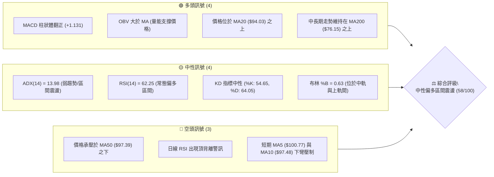
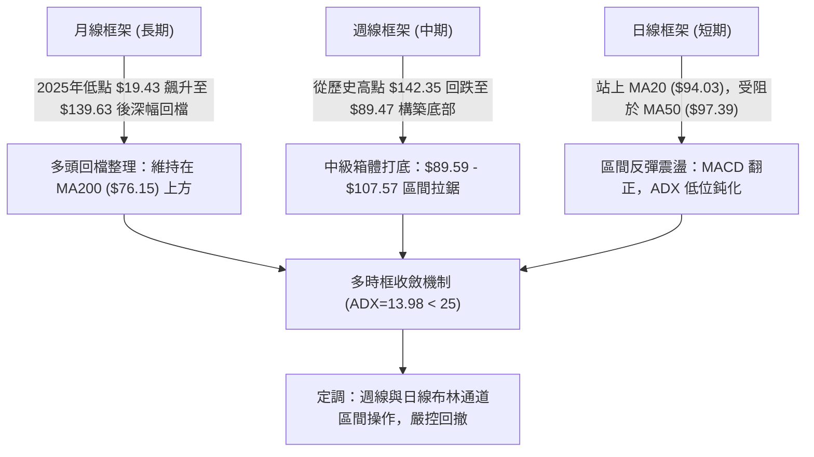
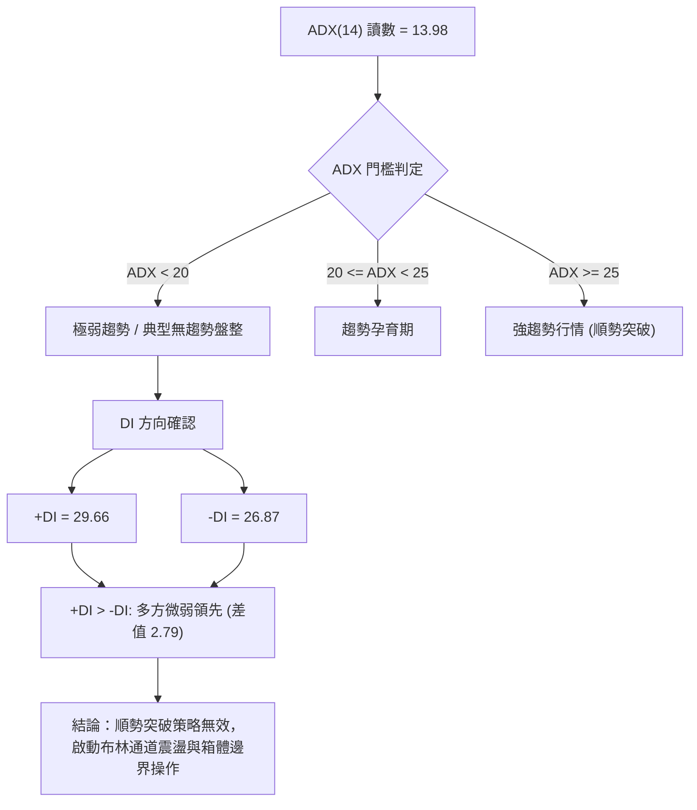
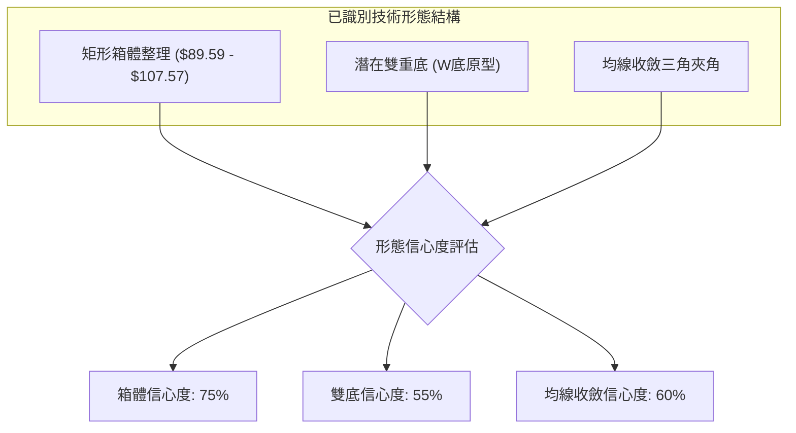
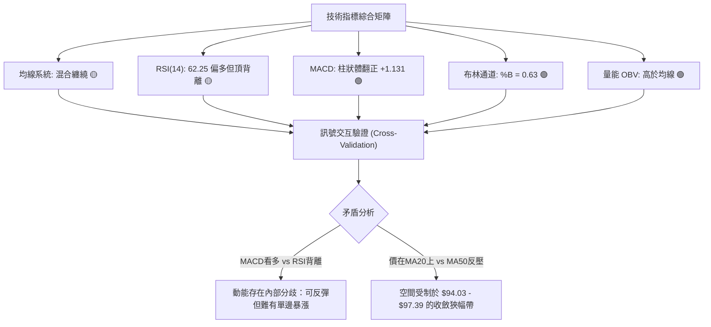
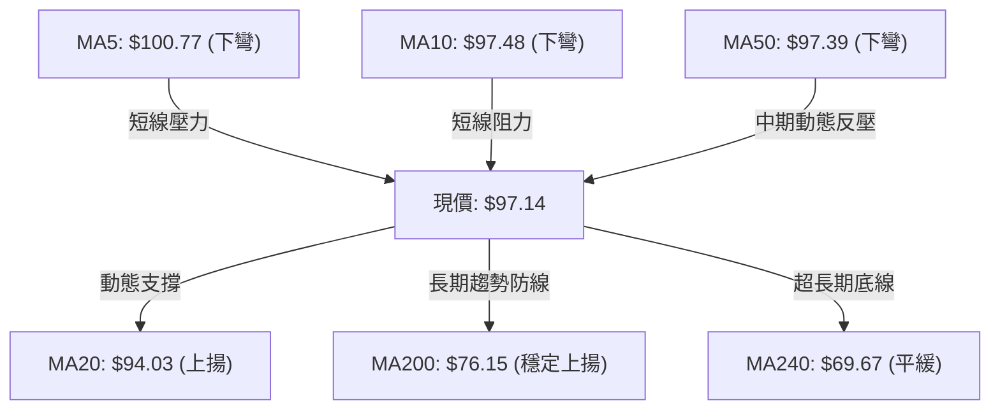
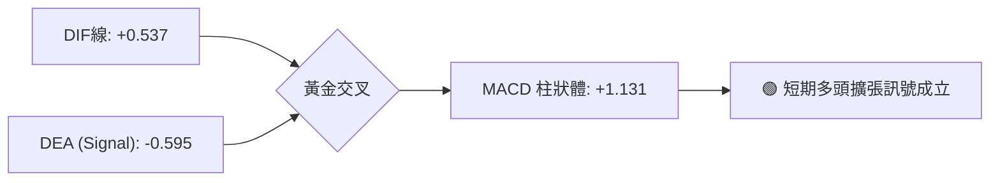
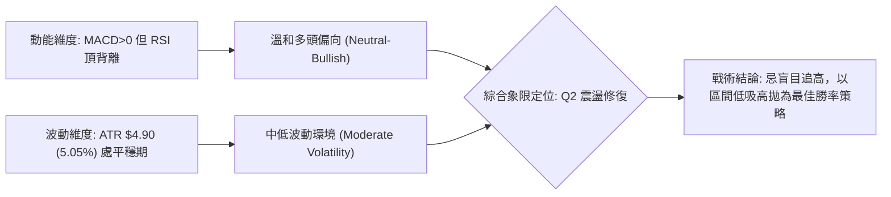
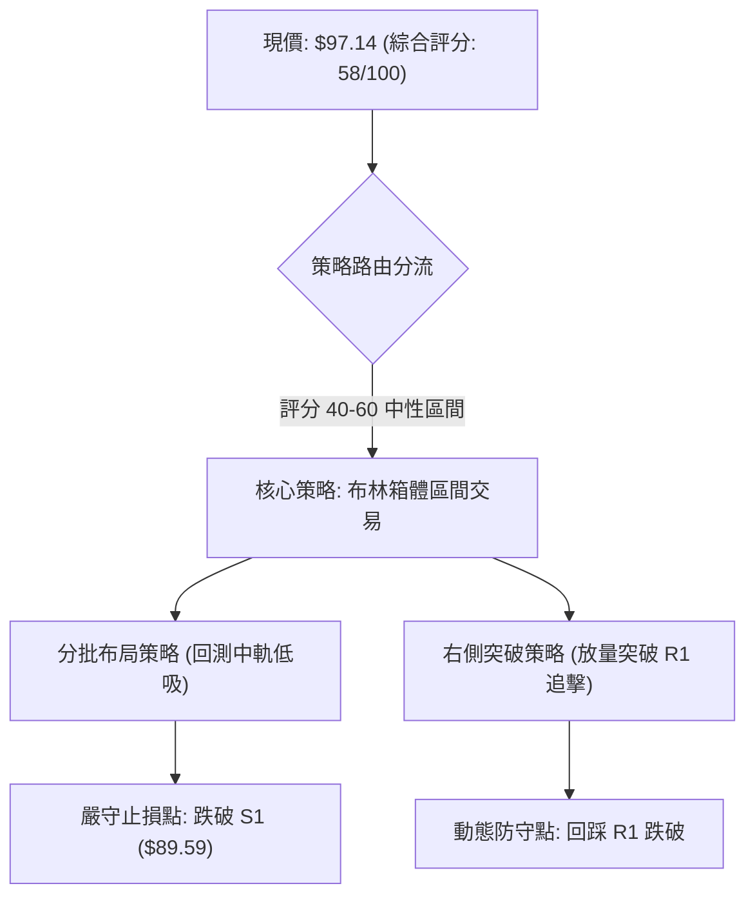
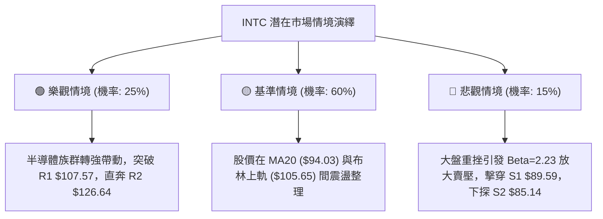

# INTC 技術分析報告

> **報告日期**：2026-09-16 ｜ **語言**：繁體中文 ｜ **數據來源**：Yahoo Finance ｜ **當前價格**：$97.14

---

## 目錄

| 章節 | 內容 |
|------|------|
| [1. 技術面概覽](#1-技術面概覽) | 訊號儀表板、核心指標、評分卡 |
| [2. 趨勢分析](#2-趨勢分析) | 多時框趨勢、長中短期走勢、ADX解讀 |
| [3. 圖表形態分析](#3-圖表形態分析) | 形態識別、信心度評估、K線組合 |
| [4. 支撐與阻力](#4-支撐與阻力) | 關鍵價位結構、斐波那契回調分析 |
| [5. 技術指標深度解讀](#5-技術指標深度解讀) | MA/RSI/MACD/布林通道/量能分析 |
| [6. 動能與波動率](#6-動能與波動率) | 動能四象限、ATR波動分析、Beta風險 |
| [7. 多時框架總結](#7-多時框架總結) | 時框矩陣、多時框收斂定調 |
| [8. 交易策略建議](#8-交易策略建議) | 策略路由、情境劇本、精確點位與風報比 |
| [9. 風險提示與監控](#9-風險提示與監控) | 關鍵監控清單、情境推演、資金控管 |
| [報告總結](#-報告總結) | 核心摘要與最終決策矩陣 |

---

## 1. 技術面概覽

### 🎯 技術訊號儀表板



### 📊 核心指標速覽表

| 指標類別 | 指標名稱 | 當前數值 | 訊號 | 解讀 |
|----------|----------|----------|------|------|
| **價格** | 當前價格 | $97.14 | 🟡 | 位於52週區間之 61.7%，處於近月回檔後的震盪修復區間 |
| **均線** | MA20 | $94.03 | 🟢 | 現價高於 MA20 達 +3.31%，短期獲布林中軌動態支撐 |
| **均線** | MA50 | $97.39 | 🔴 | 現價略低於 MA50（-0.26%），構成第一道動態均線反壓 |
| **均線** | MA200 | $76.15 | 🟢 | 顯著高於長期牛熊分界線（+27.56%），長線多頭結構未破 |
| **動能** | RSI(14) | 62.25 | 🟡 | 數值處於 50–70 強勢中性區，但存在頂背離跡象需提防動能衰竭 |
| **動能** | MACD(12,26,9) | 0.537 / -0.595 | 🟢 | DIF 穿過 DEA，柱狀體擴張至 +1.131，釋放短期翻多動能 |
| **趨勢** | ADX(14) | 13.98 | 🟡 | ADX < 25 且處於極低位，表明非單邊趨勢，屬箱體盤整格局 |
| **波動** | ATR(14) | $4.90 | 🟡 | 每日平均波動幅度約 5.05%，波幅適中，有利於區間內高出低進 |
| **通道** | 布林通道 (%B) | 0.63 | 🟢 | 位於中軌 $94.03 與上軌 $105.65 之間，屬於強勢整理帶 |
| **量能** | 量比 (Vol / 20MA) | 0.93x | 🟡 | 最新量 84.84M 低於20日均量 91.57M，突破前夕呈現典型量縮觀望 |

### 🏆 技術評分卡

```
╔════════════════════════════════════════════════════════════════╗
║                   技術評分卡 — INTC (2026-09-16)               ║
╠════════════════════════════════════════════════════════════════╣
║ 趨勢強度 (ADX=13.98)     ███████░░░░░░░░░░░░░  35/100 🟡 (盤整)║
║ 動能指標 (MACD/RSI)      █████████████░░░░░░░  65/100 🟢 (偏多)║
║ 支撐穩定度 (S1=$89.59)   ███████████████░░░░░  75/100 🟢 (強韌)║
║ 成交量配合 (OBV>MA)      ████████████░░░░░░░░  60/100 🟢 (量增)║
║ 形態完整度 (箱體整理)    ████████████░░░░░░░░  60/100 🟡 (成形)║
║ 均線排列 (混合纏繞)      ██████████░░░░░░░░░░  50/100 🟡 (糾結)║
╠════════════════════════════════════════════════════════════════╣
║ 綜合技術評分             ███████████░░░░░░░░░  58/100 🟡 中性偏多║
║ 策略導向：布林區間震盪交易，以中軌為守，逢回測支撐承接，未破不追 ║
╚════════════════════════════════════════════════════════════════╝
```

---

## 2. 趨勢分析

### 🌐 多時框趨勢分析



### 📈 長期趨勢 — 12個月走勢圖（ASCII）

```
INTC 月線走勢圖（2025-10 至 2026-09）
價格軸 ($)
$140 ┤                                 ●(2026-06 $139.63 高點)
$130 ┤                                ╱ ╲
$120 ┤                               ╱   ╲
$110 ┤                         ●(05)╱     ╲
$100 ┤                        ╱            ╲          ●(09 $97.14 現價)
 $90 ┤                  ●(04)╱              ●(07)───●(08 $89.51 低點)
 $80 ┤                 ╱
 $70 ┤                ╱
 $60 ┤               ╱
 $50 ┤         ●(01)●(02)
 $40 ┤   ●(10)●(11)     ╲●(03 $44.13)
 $30 ┤  ╱
     └─┬────┬────┬────┬────┬────┬────┬────┬────┬────┬────┬────┬────
     10月 11月 12月 01月 02月 03月 04月 05月 06月 07月 08月 09月
     2025                                                2026
```

#### 長期波段走勢特徵分析表

| 階段 | 時間區間 | 起訖價位 | 漲跌幅 | 走勢特徵與技術意義 |
|------|----------|----------|--------|--------------------|
| **主升浪爆發** | 2025-12 ~ 2026-06 | $36.90 → $139.63 | +278.4% | 月線呈現極強單邊行情，成交量劇增，突破長期歷史平台 |
| **急劇修正浪** | 2026-06 ~ 2026-07 | $139.63 → $90.20 | -35.4% | 高位出現獲利了結賣壓，單月暴跌抹去前期部分巨大漲幅 |
| **平台築底期** | 2026-07 ~ 2026-08 | $90.20 → $89.51 | -0.77% | 於 $89.50 附近尋求結構性支撐，連續兩月低點收斂 |
| **修復反彈期** | 2026-08 ~ 2026-09 | $89.51 → $97.14 | +8.52% | 反彈測試斐波那契 38.2% 回調位 ($97.22)，嘗試重返 MA50 |

### 📊 中期趨勢（週線分析）

```
INTC 近期週線壓力與支撐架構
$107.57 ────────────────────────────────── [強阻力 R1 / 近期反彈高點]
                  ▲            ▲
                  │            │
$97.14  ─────────┼────────────┼─────────── [現價 / 斐波 38.2% $97.22]
                  │            │
                  ▼            ▼
$89.59  ────────────────────────────────── [強支撐 S1 / 8月雙重築底線]
$85.14  ────────────────────────────────── [結構支撐 S2]
```

從週線收盤走勢可見，股價在 2026-07-26 觸及 $92.32、2026-08-30 觸及 $89.47 兩度探底後，週線 MACD 柱狀體由 -3.637 逐步收斂並於 2026-09-06 翻正為 +0.624，2026-09-13 擴張至 +1.929。雖然本週收盤小幅拉回至 $97.14，但中期底部的抗跌性已顯著增強。

### ⚡ 趨勢強度評估（ADX 解讀）



#### ADX 趨勢強度對照表

| 指標 | 數值 | 狀態閾值 | 技術意涵 | 操作指導 |
|------|------|----------|----------|----------|
| **ADX(14)** | 13.98 | < 25 (弱趨勢) | 市場缺乏單邊單向動力，處於多空平衡的能量蓄積期 | 禁止追高殺跌，以高拋低吸為主 |
| **+DI** | 29.66 | 數值偏高 | 買方在短期反彈中佔據微弱優勢 | 回檔至支撐位時具備勝率優勢 |
| **-DI** | 26.87 | 數值中等 | 賣方力量經過 7、8 月釋放後有所鈍化 | 下檔空間短期內受 S1、S2 壓制 |
| **DI差值** | +2.79 | 接近糾結 | 多空雙方未拉開實質性差距 | 必須等待實質突破阻力或跌破支撐 |

---

## 3. 圖表形態分析

### 🔍 形態識別系統



#### 圖表形態信心度評估表（依規則 15）

| 形態類別 | 信心度 | 判斷依據（引用客觀數據） | 完成度 | 目標價（附嚴謹計算式） |
|----------|--------|--------------------------|--------|------------------------|
| **矩形箱體整理** | 75% | 箱體下沿由 S1 $89.59（8月兩次探底 $90.20 與 $89.47）確定；箱體上沿由阻力 R1 $107.57 限制 | 80% | 向上突破：頸線 $107.57 + 箱高($107.57 - $89.59 = $17.98) = **$125.55**（接近 R2 $126.64） |
| **潛在雙底 (W底)** | 55% | 左底 2026-08-02 週收盤 $90.20，右底 2026-08-30 週收盤 $89.47；頸線暫定 2026-08-16 高點 $102.50 | 65% | 突破頸線後測量目標：$102.50 + ($102.50 - $89.47 = $13.03) = **$115.53**（接近斐波 23.6% $114.47） |
| **旗形 / 三角對稱** | 35% | 訊號不足，僅做指標型解讀。日線數據缺乏收斂收窄旗形之對稱邊界，不強行擬合 | -- | 數據不足以支撐幾何形態，依規則略過幾何推算 |

### 🕯️ 重要K線形態分析

| 週期/月份 | 收盤價 | K線形態特徵 | 技術解讀 | 訊號 |
|-----------|--------|-------------|----------|------|
| **2026-06** | $139.63 | 長上影倒錘頭巨量天頂 | 觸及 $142.35 歷史天花板後強烈拋售，見頂確立 | 🔴 空頭反轉 |
| **2026-07** | $90.20 | 大陰線破位急跌 | 單月重挫 $49.43，恐慌盤湧出，跌破多條中期均線 | 🔴 極度空頭 |
| **2026-08** | $89.51 | 低位平底十字星 (Spinning Top) | 波動範圍急劇縮小，空頭砸盤動能衰竭，供需取得暫時平衡 | 🟢 止跌築底 |
| **2026-09 (至今)** | $97.14 | 下影小陽線反彈 | 多方發起修復性反彈，成功收復 20日均線，測試 50日均線 | 🟡 震盪回升 |

### 📉 ASCII 走勢形態示意圖

```
INTC 雙底箱體震盪結構示意圖
$107.57 ┤                                     ┌── [箱體頂部 R1]
$102.50 ┤                ●(8/16 頸線 $102.50) │
$97.14  ┤               ╱ ╲                  ●(現價 $97.14)
$94.03  ┤──────────────╱───╲─────────────────┼── [MA20 / 中軌]
$90.20  ┤    ●(左底 8/02)    ╲   ●(右底 8/30)│
$89.59  ┤────┴────────────────┴───┴──────────┴── [箱體底邊 S1]
        └─────────────────────────────────────────────
```

### 🎯 形態目標價計算

根據雙底與矩形整理之測量原則，其目標價計算路徑如下：

1. **矩形整理向上突破測量**：
   $$\text{目標價} = \text{箱頂阻力 (R1)} + (\text{箱頂阻力} - \text{箱底支撐}) = \$107.57 + (\$107.57 - \$89.59) = \$125.55$$
   *驗證*：此價位高度吻合數據中計算之關鍵阻力 **R2 ($126.64)**。

2. **W底中期頸線突破測量**：
   $$\text{目標價} = \text{頸線高點} + (\text{頸線高點} - 右底低點) = \$102.50 + (\$102.50 - \$89.47) = \$115.53$$
   *驗證*：此價位極度貼近 52週斐波那契 23.6% 回調位 **$114.47**。

---

## 4. 支撐與阻力

### 🗺️ 關鍵價位分布圖（ASCII）

```
INTC 價位結構分布圖
══════════════════════════════════════════════════════════════════
$142.35 ║██████████████████████████████║ 52W 歷史高點 (斐波 0.0%)
$132.75 ║████████████████████████      ║ 強阻力 R3 (+36.66%)
$126.64 ║██████████████████            ║ 阻力 R2 (+30.37%)
$114.47 ║████████████████              ║ 斐波那契 23.6% 回調位
$107.57 ║████████████████████████████  ║ 關鍵阻力 R1 (+10.74%)
$105.65 ║████████████                  ║ 布林通道上軌
$97.39  ║──────────┬───────────────────║ MA50 動態反壓
$97.14  ╠══════════╪═══════════════════╣ ◄ 當前價格 ($97.14)
$97.22  ║──────────┴───────────────────║ 斐波那契 38.2% 回調位
$94.03  ║▓▓▓▓▓▓▓▓▓▓▓▓                  ║ 布林中軌 (MA20) 動態支撐
$89.59  ║▓▓▓▓▓▓▓▓▓▓▓▓▓▓▓▓▓▓▓▓▓▓▓▓▓▓▓▓  ║ 近期關鍵支撐 S1 (-7.77%)
$85.14  ║▓▓▓▓▓▓▓▓▓▓▓▓▓▓▓▓              ║ 結構支撐 S2 (-12.35%)
$83.29  ║▓▓▓▓▓▓▓▓▓▓                    ║ 斐波那契 50.0% 回調位
$81.79  ║▓▓▓▓▓▓▓▓▓▓▓▓▓▓▓▓▓▓            ║ 強支撐 S3 (-15.80%)
$76.15  ║▓▓▓▓▓▓▓▓▓▓▓▓▓▓▓▓▓▓▓▓▓▓▓▓      ║ 牛熊分界線 (MA200)
══════════════════════════════════════════════════════════════════
```

### 🚧 阻力位分析表

所有價位嚴格引用技術數據聚類數值：

| 阻力級別 | 精確價位 | 距離現價 | 形成原因與籌碼特徵 | 突破難度 | 技術重要性 |
|----------|----------|----------|--------------------|----------|------------|
| **R1** | **$107.57** | +10.74% | 近一年密集波段高點聚類，且與布林上軌 ($105.65) 形成重疊壓力帶 | 🟡 中等偏高 | 極高；突破此處代表矩形底正式確立 |
| **R2** | **$126.64** | +30.37% | 2026年6月中旬反彈次高點與巨量套牢盤換手平台 | 🔴 極高 | 高；中期反彈行情的主要目標區 |
| **R3** | **$132.75** | +36.66% | 2026年6月下旬構築之雙頂頸線阻力區域 | 🔴 極難 | 中；多頭歷史行情的最後防線 |

### 🛡️ 支撐位分析表

所有價位嚴格引用技術數據聚類數值：

| 支撐級別 | 精確價位 | 距離現價 | 形成原因與籌碼特徵 | 守住機率 | 技術重要性 |
|----------|----------|----------|--------------------|----------|------------|
| **S1** | **$89.59** | -7.77% | 近一年波段低點聚類，8月份多次探底（$90.20、$89.47）獲得強勁買盤捍衛 | 🟢 75% | 極高；短線多空分水嶺，跌破則平台失效 |
| **S2** | **$85.14** | -12.35% | 前期多頭推進時的中繼平台低點聚類，鄰近斐波那契 50% 水平 | 🟢 85% | 高；強結構支撐，跌破意味著深度修正 |
| **S3** | **$81.79** | -15.80% | 聚類強支撐，且與布林下軌 ($82.40) 形成雙重緩衝墊 | 🟢 90% | 極高；多頭波段容忍極限，長線買點 |

### 📐 斐波那契回調位分析

依據 52週極端波動區間（$24.22 至 $142.35，波幅 $118.13）精確計算之回調結構：

| 斐波那契比例 | 價位 | 當前相對位置與技術解讀 |
|--------------|------|------------------------|
| **0.0% (高點)** | **$142.35** | 52週最高價，極端超買極限位 |
| **23.6%** | **$114.47** | 淺度回調防線，若日後反彈至此將遭遇重泉賣壓 |
| **38.2%** | **$97.22** | **現價 ($97.14) 正處於該位置下方僅 $0.08**，為多空短兵相接的樞紐點 |
| **50.0%** | **$83.29** | 強弱分水嶺，位於 S2 ($85.14) 與 S3 ($81.79) 區間內，具極佳安全邊際 |
| **61.8%** | **$69.35** | 黃金分割強支撐，低於 MA200 ($76.15)，屬於極端熊市防禦線 |
| **78.6%** | **$49.50** | 深度回調線，基本面全面崩潰時的最後緩衝 |
| **100.0% (低點)**| **$24.22** | 52週最低價，歷史底部起漲原點 |

*斐波那契現況解讀*：現價 $97.14 與 38.2% 回調位 ($97.22) 幾乎重合。這意味著前期由 $24.22 暴漲至 $142.35 的巨大牛市波段，至今僅回吐了 38.2% 的漲幅，整體牛市架構在數學意義上並未遭到破壞。若能在 $97.22 上方站穩 3 個交易日，技術面將視為強勢回調結束。

---

## 5. 技術指標深度解讀

### 🎛️ 指標訊號總覽



### 📈 移動平均線排列分析



#### 移動平均線數據特徵表

| 均線名稱 | 數值 | 偏離度 | 軌跡狀態 | 技術意涵 |
|----------|------|--------|----------|----------|
| **MA5** | $100.77 | -3.60% | 過去一週快速回落 | 短期超買拉回，上方第一重短壓 |
| **MA10** | $97.48 | -0.35% | 逐步走平 | 短期多空拉鋸均線，現價貼近 |
| **MA20** | $94.03 | +3.31% | 底部翻揚 | 月線級別生命線，提供強勁低吸支撐 |
| **MA50** | $97.39 | -0.26% | 緩步下移 | 季線阻力，多方必須帶量收復之門檻 |
| **MA60** | $102.94 | -5.63% | 下行 | 中期重壓帶，與前高重合 |
| **MA120**| $97.74 | -0.61% | 走平糾結 | 半年線，與現價形成多重均線死結 |
| **MA200**| $76.15 | +27.56%| 上行陡峭 | 長期牛市底線，提供雄厚戰略縱深 |
| **MA240**| $69.67 | +39.42%| 穩步抬升 | 年線基石，標誌長週期反轉已成事實 |

*排列解讀*：均線呈現「短空長多、中期纏繞」的混合排列（Mixed Alignment）。MA5、MA10、MA50、MA120 在 $97.00 - $100.00 密集交錯，說明多空在百元大關前籌碼高度換手。

### 📉 RSI(14) 分析與背離判斷

* **當前數值**：**62.25**
* **區間進度條**：
  ```
  [超賣 0] ────────── [30] ────────── [50] ─────█──── [70] ────────── [100 超買]
  當前水位: 62.25 ▓▓▓▓▓▓▓▓▓▓▓▓░░░░░░░░ (偏多區間)
  ```
* **背離嚴格判定**：⚠️ **日線頂背離 (Bearish Divergence)**。
  * *判定依據*：近幾日股價高點雖一度攻破 $100（MA5 達 $100.77），但 RSI(14) 僅回升至 62.25，未刷新 2026-05-10 週線之極端高點（當時 RSI 達 88.4），亦低於 2026-09-13 週線之 67.6。
  * *技術結論*：表明本次反彈並非強動能推進，而是空頭回補帶動的技術性抽腳，追高買盤意願隨價格推升而遞減。

### 📊 MACD(12/26/9) 訊號解讀



* **指標數值**：DIF = +0.537, DEA = -0.595, Hist = +1.131。
* **技術意涵**：DIF 已經成功穿越零軸上方的訊號線，柱狀體維持在 +1.131 的正向讀數，且週線 MACD 柱狀體亦由 2026-07 的 -3.637 翻轉回升至 +1.131。這確認了中期修正動能已經枯竭，短期反彈動力仍在延續，為多方提供了一道動能安全閥。

### 📦 布林通道分析（日線）

```
INTC 布林通道結構示意圖
$105.65 ─────────────────────────────────────── BB 上軌 (Upper Band)
                         ▲
                         │ 
$97.14  ───────●─────────┼───────────────────── 現價 (位於中上軌強勢區，%B=0.63)
                         │ 
$94.03  ─────────────────┴───────────────────── BB 中軌 (MA20 基準線)
                         
$82.40  ─────────────────────────────────────── BB 下軌 (Lower Band)
```

* **帶寬特徵**：上軌 $105.65 與下軌 $82.40 差距為 $23.25（帶寬約 24.7%），通道開口呈現走平收斂跡象，符合 ADX=13.98 的盤整特徵。
* **%B 數值**：**0.63**。現價穩坐中軌 ($94.03) 之上，技術上中軌已由先前的阻力轉為強動態支撐。只要回檔不跌破 $94.03，多方皆保有向上軌 $105.65 測試的權利。

### 💹 成交量分析（量價配合度）

* **最新成交量**：84,839,200 股。
* **20日均量**：91,571,315 股（量比 0.93x）。
* **50日均量**：105,388,172 股。
* **OBV 能量潮狀態**：**OBV > MA**，量能線維持在上揚均線之上。
* **量價特徵評估**：
  1. 現價反彈伴隨量比 0.93x，屬於典型的「良性量縮整理」，並無主力放量出逃跡象。
  2. 週線級別觀察，2026-05 天頂爆出 8.25億股巨量後，目前週量已降至 1.81億 ~ 4.21億股的低換手區間，表明浮額清洗充分。
  3. 量能支撐結論：OBV 持續領先價格走強，代表低位籌碼鎖定良好，量價並未背離，有利於構築長期底部。

---

## 6. 動能與波動率

### ⚡ 動能評估四象限

| 象限標籤 | 動能狀態 (Momentum) | 波動率狀態 (Volatility) | 當前判定 | INTC 具體技術歸屬與分析 |
|----------|---------------------|--------------------------|----------|-------------------------|
| **Q1 (最佳擴張)** | 強動能 (MACD/RSI 雙強) | 低波動 (通道擠壓收縮) | ❌ | 尚未達到極端動能爆發階段 |
| **Q2 (震盪修復)** | **溫和/弱動能** | **中低波動 (ATR 收縮)** | **✓ (當前)** | **歸屬於此：RSI=62.25 偏溫和，ATR=5.05% 波動平抑，適合區間擺盪** |
| **Q3 (投機單邊)** | 強動能 (單邊暴漲暴跌) | 高波動 (急劇擴散) | ❌ | 5-6月主升段已結束，非當前特徵 |
| **Q4 (流動性陷阱)**| 弱動能 (死叉下行) | 高波動 (破位殺跌) | ❌ | 7月急跌已過，恐慌拋售已止血 |



### 📊 ATR 波動率分析

* **ATR(14) 數值**：**$4.90**（佔現價比率 **5.05%**）。
* **波動率環境判定**：每日平均波動接近 $5 美元，表明該股仍具備高度日內與波段交易彈性。
* **風控止損測算依據**：
  * **1.0x ATR（日內波動緩衝）**：$\$97.14 - \$4.90 = \$92.24$
  * **1.5x ATR（常規波段止損）**：$\$97.14 - (1.5 \times \$4.90) = \$97.14 - \$7.35 = \$89.79$（精確落在強支撐 S1 $89.59 上方）
  * **2.0x ATR（防洗盤寬鬆止損）**：$\$97.14 - (2.0 \times \$4.90) = \$97.14 - \$9.80 = \$87.34$

### 📐 Beta 與市場相關性

* **Beta 係數**：**2.231**。
* **風險敞口評估**：
  * INTC 屬於「超高貝塔（Ultra-High Beta）」資產，其對標普500與費城半導體指數的波動敏感度高達 2.23 倍。
  * 當大盤上漲 1% 時，該股理論期望上漲 2.23%；反之，大盤回調 1% 時，該股跌幅恐放大至 2.23% 以上。
  * *戰術指導*：因 Beta > 2.0，在未出現單邊大趨勢前，倉位配置嚴格限制在總資金的 15% - 20% 以內，避免系統性下挫引發非線性回撤。

---

## 7. 多時框架總結

### 📋 時框架評分表

| 時框架 | 趨勢方向 | 動能指標 | 均線排列 | 圖表形態 | 綜合評分 | 戰術建議 |
|--------|----------|----------|----------|----------|----------|----------|
| **月線 (長期)** | 🟢 偏多回調 | 🟡 RSI 回落常態 | 🟢 站穩 MA200 上方 | 巨量天頂後回踩頸線 | **68 / 100** | 長線多頭未死，逢低價值布局 |
| **週線 (中期)** | 🟡 底部修復 | 🟢 MACD 翻正柱擴 | 🟡 均線高位壓制糾結 | 潛在 W底 / 矩形底 | **58 / 100** | 區間邊界操作，等待突破頸線 |
| **日線 (短期)** | 🟡 震盪整理 | 🟡 RSI 頂背離 | 🔴 MA5/10/50 密集蓋頭| 布林中軌反彈遇阻 | **52 / 100** | 逢阻力減磅，依中軌設守 |

### 🔲 綜合訊號矩陣

```
時框矩陣交互驗證表
┌──────────┬──────────┬──────────┬──────────┬────────────────────────┐
│ 時框層次 │ 趨勢權重 │ 動能訊號 │ 結構強度 │ 訊號一致性評估         │
├──────────┼──────────┼──────────┼──────────┼────────────────────────┤
│ 長期 (M) │   40%    │   中性   │   極強   │ 確立長期不走熊底線     │
│ 中期 (W) │   40%    │   轉強   │   中等   │ 確立 $89.59 雙底支撐   │
│ 短期 (D) │   20%    │   分歧   │   偏弱   │ 提示百元關卡短線獲利盤 │
└──────────┴──────────┴──────────┴──────────┴────────────────────────┘
```

### ⚖️ 多時框收斂結論（依規則 14 嚴格執行）

1. **趨勢/盤整優先級判定**：
   * 當前 **ADX(14) 僅為 13.98**（遠低於 25 臨界線），**明確判定當前市場為「盤整行情」而非趨勢行情**。
2. **時框收斂規則應用**：
   * 依據多時框收斂規則第 (2) 條：「盤整行情（ADX<25）：以日線布林通道上下軌為主要交易區間」，中長期均線的單邊指引力暫時退居次席。
3. **唯一方向性結論**：
   * **中性觀望偏多（區間震盪交易）**。
   * 交易的核心矛盾不在於大牛市或大熊市的預判，而在於如何利用 **布林通道中軌 $94.03 與下軌/S1 $89.59 的支撐**，高出低進搏取向上軌 **$105.65** 及 **R1 $107.57** 的波段利潤。此結論完全收斂並貫穿後續第 8 章交易策略。

---

## 8. 交易策略建議

### 🗺️ 策略決策流程圖



### 🧭 策略路由

* **當前主策略方向**：**中性偏多區間操作（依綜合評分 58/100，處於 40–60 區間操作帶，以布林上下軌與關鍵支撐阻力為主，等待突破確認）**。

### 🎯 價格情境階梯（Price Scenarios）

所有價位均嚴格取自數據庫聚類點位：

| 階梯層次 | 觸發條件 | 下一目標 | 後續延伸目標 | 情境技術含義 |
|----------|----------|----------|--------------|--------------|
| **強勢突破浪** | 帶量突破 R1 **$107.57** | R2 **$126.64** | R3 **$132.75** | 中期雙底確立，多頭重啟波段攻勢 |
| **強勢整理浪** | 突破布林上軌 **$105.65** | R1 **$107.57** | 斐波 23.6% **$114.47**| 短線衝高，測試箱體頂部強反壓 |
| **現價平衡區** | 站穩布林中軌 **$94.03** | 斐波 38.2% **$97.22** | MA50 **$97.39** | 維持 $94.00 - $98.00 窄幅換手 |
| **弱勢回踩浪** | 跌破 MA20 **$94.03** | S1 **$89.59** | 斐波 50% **$83.29** | 考驗八月底部頸線，進入深幅洗盤 |
| **空頭破位浪** | 放量跌破 S1 **$89.59** | S2 **$85.14** | S3 **$81.79** | 箱體破局，下探回測 MA200 ($76.15)|

### 📊 情境機率分佈

| 情境劃分 | 發生機率 | 主要技術與量化依據 |
|----------|----------|--------------------|
| **情境 A：區間震盪 (箱體拉鋸)** | **55%** | ADX=13.98 證實趨勢匱乏；布林中軌 $94.03 支撐堅固；均線多空糾結未散 |
| **情境 B：向上反彈 (測試 R1)** | **30%** | MACD 柱狀體維持正向 (+1.131)；OBV > MA 顯示量能溫和支撐價格推進 |
| **情境 C：向下破位 (再測 S2)** | **15%** | 日線 RSI 出現頂背離，若失守 MA20 ($94.03) 則引發短線多殺多賣壓 |

### 🟢 主策略詳情（方向：中性偏多區間操作）

本報告設計兩套互補之精確交易策略：

| 策略要素 | 策略 A（左側回踩低吸策略） | 策略 B（右側突破跟進策略） |
|----------|----------------------------|----------------------------|
| **適用時機** | 價格回測布林中軌附近企穩 | 價格強勢帶量突破箱體上沿 R1 |
| **進場條件** | 價格回落至 MA20 獲得下影線支撐確認 | 日K線收盤突破 $107.57 且單日成交量 > 1.2億 |
| **進場價格** | **$94.50**（MA20 $94.03 上方緩衝區） | **$108.00**（突破 R1 後之確認點） |
| **止損價格** | **$89.00**（跌破 S1 $89.59 止損） | **$103.50**（跌回布林上軌之假突破止損） |
| **目標價 T1** | **$105.65**（布林通道上軌） | **$126.64**（波段阻力位 R2） |
| **目標價 T2** | **$107.57**（關鍵阻力位 R1） | **$132.75**（波段強阻力 R3） |
| **每股風險** | $\$94.50 - \$89.00 = \$5.50$ | $\$108.00 - \$103.50 = \$4.50$ |
| **每股報酬(T1)**| $\$105.65 - \$94.50 = \$11.15$ | $\$126.64 - \$108.00 = \$18.64$ |
| **風險報酬比** | **1 : 2.03**（以 T1 計算） | **1 : 4.14**（以 T1 計算） |
| **預估勝率** | **60%** | **45%** |
| **建議倉位** | **15% 總資金** | **10% 總資金** |

### 🔴 反向風險觸發點（對沖提示）

若出現以下訊號，證明主策略區間做多邏輯遭系統性破壞，多頭部位應無條件止損出局或啟動對沖：
* **反轉觸發價位**：日K線收盤價跌破 **$89.59 (S1)**。
* **技術破位特徵**：跌破 $89.59 且成交量放大至 1.0億股以上，同時日線 MACD 出現零軸下死叉。
* **對沖因應動作**：立即平倉所有多頭頭寸，空手觀望，或以小幅倉位在 $89.00 反手建立空頭，向下回測 **S2 ($85.14)** 與 **S3 ($81.79)**。

### ⭐ 整體訊號強度評星

```
╔════════════════════════════════════════════════════════════════╗
║                     技術訊號可信度評星                         ║
╠════════════════════════════════════════════════════════════════╣
║ 做多訊號強度：  ★★★☆☆  (3.0 / 5.0 星) — 偏多但受限於阻力     ║
║ 做空訊號強度：  ★★☆☆☆  (2.0 / 5.0 星) — 下方獲雙底強撐       ║
║ 整體趨勢可信度：★★★☆☆  (3.0 / 5.0 星) — 盤整期需以邊界為準 ║
╚════════════════════════════════════════════════════════════════╝
```

---

## 9. 風險提示與監控

### ✅ 關鍵監控指標 Checklist

```
╔══════════════════════════════════════════════════════════════════╗
║                INTC 每日盤後關鍵技術指標監控清單                 ║
╠══════════════════════════════════════════════════════════════════╣
║ [ ] 1. 價格是否守穩布林中軌 MA20 ($94.03)？                     ║
║        - 跌破視為短線走弱，暫停左側進場                         ║
║ [ ] 2. 日線 RSI(14) 能否化解頂背離並站穩 65 之上？             ║
║        - 若跌破 50 中水準，表明動能衰退，部位應減半             ║
║ [ ] 3. MACD 柱狀體數值是否維持正值 (當前 +1.131)？              ║
║        - 若柱狀體由紅轉綠，為動能衰竭預警                       ║
║ [ ] 4. ADX(14) 是否脫離 13.98 弱勢區並向上突破 20-25？          ║
║        - ADX 突破 25 代表單邊爆發，需切換為突破追隨策略         ║
║ [ ] 5. 成交量能否有效放量（單日突破 1.05億股 50日均量）？      ║
║        - 量縮代表攻擊乏力，上軌 $105.65 附近必須逢高減碼        ║
║ [ ] 6. 價格是否向外脫離箱體區間 ($89.59 - $107.57)？            ║
║        - 箱體突破為大波段起點，依情境階梯調整防守               ║
╚══════════════════════════════════════════════════════════════════╝
```

### ⚠️ 風險場景分析



### 🛡️ 風險管理重要提醒

1. **Beta 槓桿效應控制**：
   * 由於 INTC 的 Beta 值高達 **2.231**，其價格波動幅度為大盤的兩倍以上。在無明確強趨勢出現前，禁止使用融資槓桿，且單一個股風險暴露不得超過個人整體投資組合淨值的 **15%**。
2. **ATR 動態部位管理**：
   * 當前日線 ATR 為 **$4.90**。單筆交易之名義止損金額若設定為 1.5x ATR（約 $7.35/股），則每買入 1,000 股需承擔 $7,350 美元之本金風險。投資人應依照「單筆交易最大虧損不超過總資產 2%」之黃金法則，反推最大可建倉股數。
3. **區間假突破防範**：
   * 在 ADX=13.98 的弱趨勢盤整中，常出現盤中刺穿阻力或跌破支撐後快速拉回的「洗盤陷阱」。所有策略之觸發判定，**必須以美股收盤價（4:00 PM EST 收盤K線）為準**，盤中不輕易變更核心止損設定。

---

## 📋 報告總結

```
╔══════════════════════════════════════════════════════════════════╗
║                   INTC 技術分析報告總結                          ║
╠══════════════════════════════════════════════════════════════════╣
║ 報告日期：2026-09-16            當前價格：$97.14                ║
║ 分析評級：⚖️ 中性偏多區間操作 (技術評分: 58 / 100)               ║
╠══════════════════════════════════════════════════════════════════╣
║ 關鍵技術結論：                                                   ║
║ ├─ 長期趨勢：🟢 偏多維度未改，現價守在 MA200 ($76.15) 上方 +27%  ║
║ ├─ 中期趨勢：🟡 構築雙底雛形，受制於 $89.59 - $107.57 大箱體    ║
║ ├─ 短期趨勢：🟡 站上 MA20 ($94.03)，受制於 MA50 ($97.39) 壓制   ║
║ ├─ 趨勢強度：🟡 ADX(14) = 13.98，明確判定為無趨勢盤整市場        ║
║ ├─ 關鍵支撐：S1: $89.59 ｜ S2: $85.14 ｜ S3: $81.79             ║
║ ├─ 關鍵阻力：R1: $107.57 ｜ R2: $126.64 ｜ R3: $132.75          ║
║ └─ 外資共識：買入 (43位分析師均價: $115.74，高標: $200.00)       ║
╠══════════════════════════════════════════════════════════════════╣
║ 最優策略組合建議：                                               ║
║ 1. 🥇 最佳機會（高勝率）：回測布林中軌 $94.50 附近低吸，           ║
║    止損設 S1 下方 $89.00，目標布林上軌 $105.65 (風報比 1:2.03)   ║
║ 2. 🥈 次選機會（動能突破）：帶量突破 R1 $107.57 後於 $108.00 追進，║
║    止損設 $103.50，波段目標 R2 $126.64 (風報比 1:4.14)          ║
║ 3. 🥉 保守選擇：在 ADX < 25 期間保持觀望，等待價格觸及箱體極端   ║
║    邊界 ($89.59 或 $107.57) 再行定奪                             ║
╚══════════════════════════════════════════════════════════════════╝
```

---

> ⚠️ **免責聲明**：本報告為技術分析研究，所有數據及推算均基於歷史量價與技術指標模型。本報告**僅供研究與學術參考**，**不構成任何個人化之投資或買賣建議**。金融市場瞬息萬變，高貝塔標的風險顯著，投資人應獨立評估風險並自行承擔交易結果。

---

*報告生成時間：2026-09-16 ｜ 數據來源：Yahoo Finance ｜ 分析框架：多時框技術分析模型*