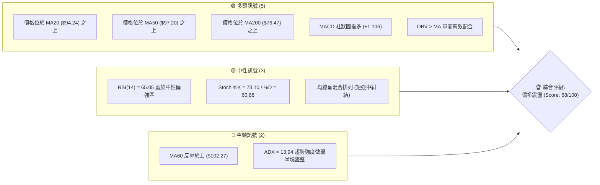
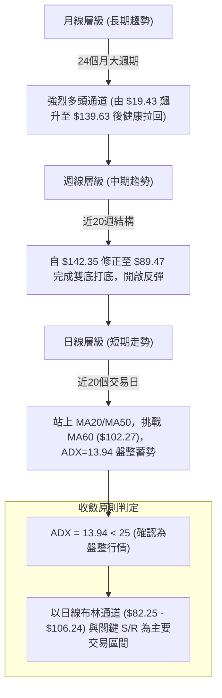
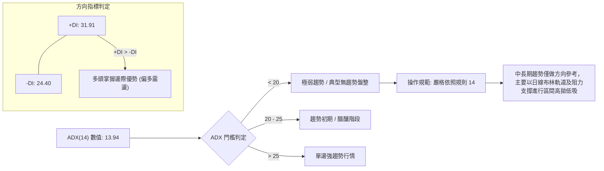
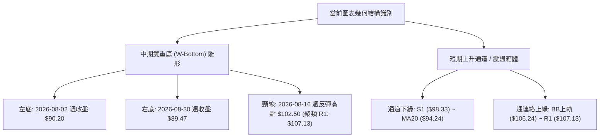
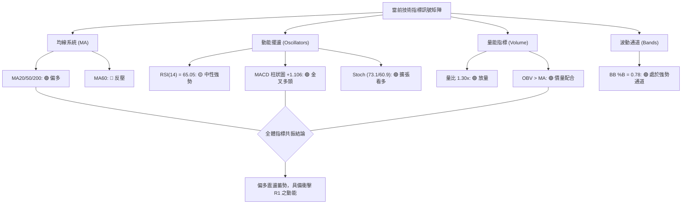
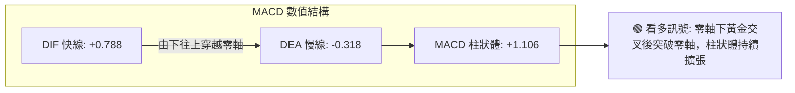
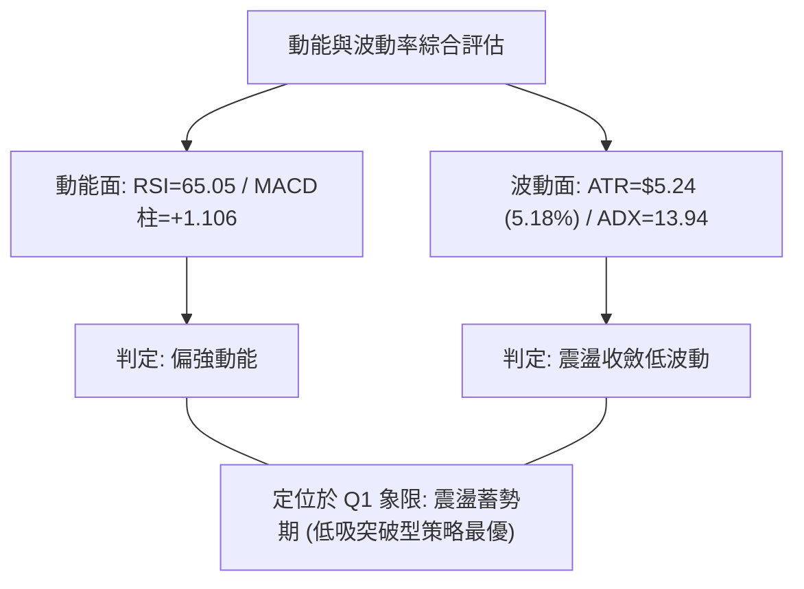
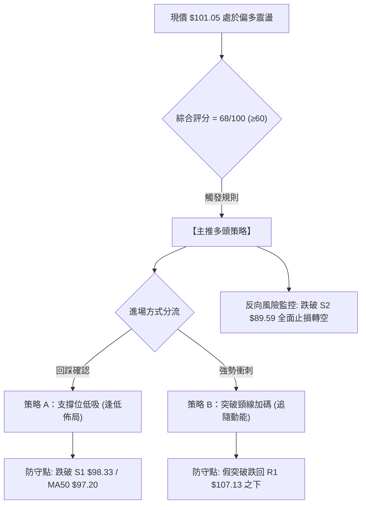
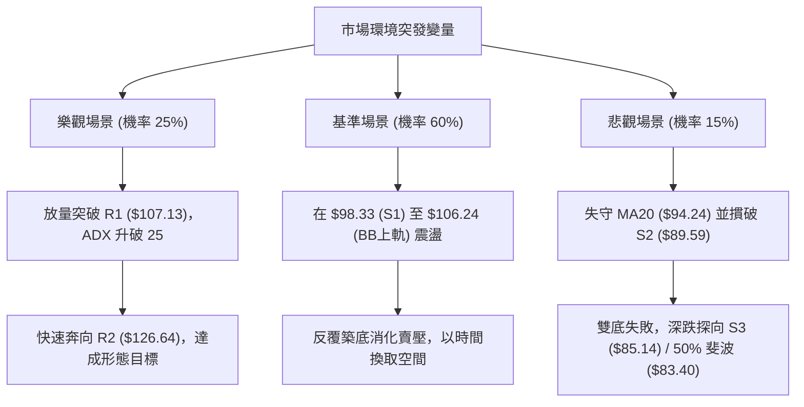

# INTC 技術分析報告

> **報告日期**：2026-09-17 ｜ **語言**：繁體中文 ｜ **數據來源**：Yahoo Finance ｜ **當前價格**：$101.05

---

## 目錄

| 章節 | 內容 |
|------|------|
| [1. 技術面概覽](#1-技術面概覽) | 訊號儀表板、核心指標、評分卡 |
| [2. 趨勢分析](#2-趨勢分析) | 多時框趨勢、長中短期走勢、ADX強度 |
| [3. 圖表形態分析](#3-圖表形態分析) | 形態識別、信心度評估、K線組合 |
| [4. 支撐與阻力](#4-支撐與阻力) | 關鍵價位結構、斐波那契回調 |
| [5. 技術指標深度解讀](#5-技術指標深度解讀) | MA/RSI/MACD/布林/量價配合 |
| [6. 動能與波動率](#6-動能與波動率) | 動能四象限、ATR波動度、Beta分析 |
| [7. 多時框架總結](#7-多時框架總結) | 評分矩陣、多時框收斂判定 |
| [8. 交易策略建議](#8-交易策略建議) | 策略路由、主策略執行細節、風險報酬比 |
| [9. 風險提示與監控](#9-風險提示與監控) | 監控清單、情境風險、資金管理 |
| [10. 報告總結](#10-報告總結) | 核心結論與全方位儀表板彙整 |

---

## 1. 技術面概覽

### 🎯 技術訊號儀表板



### 📊 核心指標速覽表

| 指標類別 | 指標名稱 | 當前數值 | 訊號 | 解讀 |
|----------|----------|----------|------|------|
| **價格** | 當前價格 | $101.05 | 🟢 | 站穩關鍵心理關卡 $100.00，維持於 52 週中高位階 (65.0%) |
| **均線** | MA20 | $94.24 | 🟢 | 現價高於 MA20 達 +7.22%，短期多頭波段支撐強固 |
| **均線** | MA50 | $97.20 | 🟢 | 現價成功突破並收復中期均線，扭轉 7-8 月回調修正走勢 |
| **均線** | MA200 | $76.47 | 🟢 | 現價大幅高於長期生命線 (+32.14%)，長期多頭基底穩固 |
| **動能** | RSI(14) | 65.05 | 🟡 | 位於強勢整理區間，未觸及 70 超買警戒，無背離現象 |
| **動能** | MACD | 0.788 | 🟢 | DIF 線上穿訊號線 (-0.318)，柱狀圖 +1.106 明確擴張 |
| **波動** | ATR(14) | $5.24 | 🟡 | 佔股價 5.18%，日均振幅溫和放大，提供適度交易空間 |
| **趨勢** | ADX(14) | 13.94 | 🔴 | 數值遠低於 25，顯示缺乏明確單邊趨勢，當前為箱型震盪 |

### 🏆 技術評分卡

```
╔══════════════════════════════════════════════════════════════════╗
║                 技術評分卡 — INTC (2026-09-17)                  ║
╠══════════════════════════════════════════════════════════════════╣
║ 趨勢強度 (ADX/趨勢方向)    ██████░░░░░░░░░░░░░░  32/100  🔴 弱勢盤整 ║
║ 動能指標 (MACD/RSI/KD)    ███████████████░░░░░  76/100  🟢 動能充沛 ║
║ 支撐穩定度 (S1/S2防禦力)  ████████████████░░░░  80/100  🟢 底部堅實 ║
║ 成交量配合 (OBV/量比)     ██████████████░░░░░░  72/100  🟢 量增價揚 ║
║ 形態完整度 (雙重底雛形)   ████████████░░░░░░░░  62/100  🟡 構築頸線 ║
║ 均線排列 (短中長配置)     ████████████░░░░░░░░  60/100  🟡 混合排列 ║
╠══════════════════════════════════════════════════════════════════╣
║ 綜合技術評分              █████████████░░░░░░░  68/100  偏多震盪 ║
╚══════════════════════════════════════════════════════════════════╝
```

---

## 2. 趨勢分析

### 🌐 多時框趨勢分析



### 📈 長期趨勢 — 12個月走勢圖（Unicode）

```
INTC 月線走勢圖（過去12個月：2025-10 至 2026-09）
價格軸 ($)
$140 ┤                                 ● $139.63 (06月波段頂峰)
$130 ┤                                ╱ ╲
$120 ┤                         ●     ╱   ╲
$110 ┤                        ╱ ╲   ╱     ╲
$100 ┤                       ╱   ╲ ╱       ╲   ● $101.05 (現價/09月)
 $90 ┤                      ╱     ●         ●─╱ $89.51 (08月低點支撐)
 $80 ┤                     ╱  $94.48(04月)
 $70 ┤                    ╱
 $60 ┤                   ╱
 $50 ┤             ● $46.47 (01月)
 $40 ┤ ●─●─● $40.56 (11月)
 $30 ┤
     └─┬──┬──┬──┬──┬──┬──┬──┬──┬──┬──┬──┬────────────
      10 11 12 01 02 03 04 05 06 07 08 09 (月份)
      2025───┘ 2026────────────────────────┘
```

#### 走勢特徵分析表格

| 階段區間 | 起止價格 | 漲跌幅 | 趨勢特徵與量價行為 |
|----------|----------|--------|--------------------|
| **第一階段：底部蓄勢期**<br>(2025-10 ~ 2026-03) | $39.99 → $44.13 | +10.35% | 在 $36.90~$46.47 窄幅整理，籌碼高度沉澱，成交量溫和萎縮，確立長線底部。 |
| **第二階段：主升推動浪**<br>(2026-03 ~ 2026-06) | $44.13 → $139.63 | +216.41% | 史詩級突破走勢，月K線連續噴出，成交量暴增至歷史高位，創下 52 週高點 $142.35。 |
| **第三階段：急跌修正浪**<br>(2026-06 ~ 2026-08) | $139.63 → $89.51 | -35.89% | 高檔獲利了結賣壓湧現，自高點回調至斐波那契 38.2% ($97.31) 及 50% ($83.40) 區間尋求支撐。 |
| **第四階段：次級築底期**<br>(2026-08 ~ 2026-09) | $89.51 → $101.05 | +12.89% | 在波段低點聚類 S2 ($89.59) 處獲得強勁支撐，日週線形成雙底結構，回升重返百元大關。 |

### 📊 中期趨勢（週線分析）

```
INTC 週線格局支撐與阻力走勢圖 (2026-05 至 2026-09)
═══════════════════════════════════════════════════════════════════════
$142.35 ┬─┬─ 52週最高點 (06-21 週高 $133.99 延伸阻力)
        │ │
$126.64 ┼─┼─ 關鍵阻力 R2 (06-28 破位前頸線位置)
        │ │
$107.13 ┼─┼─ 關鍵阻力 R1 (08-16 週反彈高點 $102.50 與日線布林上軌聚類區)
$101.05 ┼═╪═ 當前價格位置 (震盪回升中，突破 MA50)
$98.33  ┼─┼─ 近期支撐 S1 (斐波那契 38.2% 回調位 $97.31 聚類共振帶)
        │ │
$89.59  ┴─┴─ 強支撐 S2 (08-02 週 $90.20 與 08-30 週 $89.47 之波段雙底)
═══════════════════════════════════════════════════════════════════════
```

### ⚡ 趨勢強度評估（ADX 解讀）



#### ADX 強度與市場狀態對照

| 指標參數 | 數值 | 狀態等級 | 交易指引 |
|----------|------|----------|----------|
| **ADX(14)** | 13.94 | 弱趨勢/盤整 (░░░░░░░░░░ 13.9%) | 避免追高殺跌，以區間波段震盪操作為主。 |
| **+DI** | 31.91 | 多方主導 (███████████░ 63.8%) | 買盤力道大於賣盤力道，空方動能持續退縮。 |
| **-DI** | 24.40 | 空方壓制中等 (████████░░░░ 48.8%) | 賣方未完全棄守，但已被多方壓制在安全水平之下。 |
| **結論** | 偏多多頭震盪 | 當前市場處於**低趨勢強度、多頭佔優**的相持整理期。 |

---

## 3. 圖表形態分析

### 🔍 形態識別系統



#### 形態識別信心度評估表

| 形態名稱 | 信心度 | 判斷依據（引用數據） | 完成度 | 目標價（附嚴謹計算式） |
|----------|--------|----------------------|--------|------------------------|
| **中期雙重底 (W-Bottom)** | 68% | 1. 兩次測試波段低點：左底 $90.20、右底 $89.47（均緊密圍繞 S2 $89.59 支撐）。<br>2. 右底未破左底，且 MACD 出現柱狀圖由負轉正 (+1.106)。 | 75% | 待有效突破頸線聚類區 R1 ($107.13)：<br>**頸線 $107.13 + 形態高度 ($107.13 - $89.47 = $17.66) = $124.79**<br>*(共振貼近關鍵阻力 R2 $126.64)* |
| **短期布林軌道上軌突破** | 58% | 現價 $101.05 站上 BB 中軌 $94.24，%B 指標達 0.78，正向 BB 上軌 $106.24 推進。 | 80% | **布林上軌目標 = $106.24**<br>若突破則延伸測試阻力 R1 $107.13。 |

### 🕯️ 重要K線形態分析

| 日期區間 | 收盤價 | 形態特徵 | 技術面解讀 | 訊號 |
|----------|--------|----------|------------|------|
| **2026-08-02** | $90.20 | 長下影長陰線 | 測試 $90.00 整數防線與 S2 ($89.59)，低檔買盤大舉承接。 | 🟢 |
| **2026-08-16** | $102.50 | 中長陽線收復失地 | 突破短期 MA20，MACD 柱狀圖由負轉正 (+1.810)，確立第一道反彈高點。 | 🟢 |
| **2026-08-30** | $89.47 | 縮量十字星/小實體 | 第二次回踩 S2 ($89.59) 獲得確認，量能萎縮至 4.41 億股，標準二次築底特徵。 | 🟢 |
| **2026-09-13** | $102.94 | 帶量突破長紅K | 週漲幅顯著，RSI 升至 67.6，直接站上 MA50 ($97.20)，多方奪回主控權。 | 🟢 |
| **2026-09-20 (現價)** | $101.05 | 高檔震盪整理K | 遭遇 MA60 ($102.27) 阻力小幅拉回整固，收盤守穩 $100.00，屬良性蓄勢。 | 🟡 |

### 📉 ASCII 走勢形態示意圖

```
INTC 中期「雙重底 (W-Bottom)」結構與頸線阻力突破示意圖
價格軸 ($)
$107.13 ┼───────────────────────────┬───────────── (頸線阻力區 R1)
        │                           │ 
$102.50 ┼──────────────● 頸線高峰    │      ● 現價 $101.05 (蓄勢突破)
        │             ╱ ╲           │     ╱
$97.20  ┼────────────╱───╲──────────┼────● MA50 支撐
        │           ╱     ╲         │   ╱
$94.24  ┼──────────╱───────╲────────┼──● MA20 支撐
        │         ╱         ╲       │ ╱
$89.59  ┼────────●           ●──────┴─ 雙底低點 (左底 $90.20 / 右底 $89.47)
        │       (左底)      (右底)
        └──────────────────────────────────────────────
         2026-08-02        2026-08-30   2026-09-17
```

### 🎯 形態目標價計算

1. **基準頸線點位**：波段反彈聚類阻力 R1 = **$107.13**。
2. **基底支撐點位**：波段雙底低點聚類 S2 = **$89.59**（實際右底低點 $89.47）。
3. **幾何形態垂直高度 (H)**：$107.13 - $89.47 = **$17.66**。
4. **第一形態測幅目標價 (T1)**：
   $$\text{頸線} + \text{高度} = \$107.13 + \$17.66 = \$124.79$$
   *(該數值與技術數據中關鍵阻力位 R2 **$126.64** 形成顯著共振)*。
5. **第二波段延伸目標價 (T2)**：若進一步突破 R2，依據波段高點聚類指向關鍵阻力 R3 = **$132.75**。

---

## 4. 支撐與阻力

### 🗺️ 關鍵價位分布圖（Unicode）

```
INTC 價位結構分布圖 (由實際 OHLCV 與歷史波段計算)
═══════════════════════════════════════════════════════════════════════
$142.35 ║██████████████████████████████████████║ 52W 歷史最高點 (波段頂點)
$132.75 ║████████████████████████████          ║ 強阻力 R3 (+31.37%)
$126.64 ║████████████████████                  ║ 中期頸線阻力 R2 (+25.32%)
$114.53 ║▓▓▓▓▓▓▓▓▓▓▓▓▓▓▓▓▓▓                    ║ 斐波那契 23.6% 回調位
$107.13 ║████████████████████████              ║ 關鍵阻力 R1 (+6.02%)
$106.24 ║░░░░░░░░░░░░░░░░░░░░░░░░              ║ 布林通道上軌
$102.27 ║┈┈┈┈┈┈┈┈┈┈┈┈┈┈┈┈┈┈┈┈┈┈┈┈┈┈            ║ MA60 下降反壓線
$101.05 ╠══════════════════════════════════════╣ ◄ 現價 ($101.05)
$98.33  ║▓▓▓▓▓▓▓▓▓▓▓▓▓▓▓▓▓▓▓▓                  ║ 近期關鍵支撐 S1 (-2.69%)
$97.31  ║▓▓▓▓▓▓▓▓▓▓▓▓▓▓▓▓▓▓▓▓                  ║ 斐波那契 38.2% 回調位 / MA50 ($97.20)
$94.24  ║░░░░░░░░░░░░░░░░░░                    ║ 布林中軌 / MA20
$89.59  ║████████████████████████████          ║ 強支撐 S2 (-11.34% 雙底基石)
$85.14  ║████████████████████████████████      ║ 極強防線 S3 (-15.74%)
$83.40  ║▓▓▓▓▓▓▓▓▓▓▓▓▓▓▓▓▓▓▓▓▓▓▓▓▓▓▓▓▓▓        ║ 斐波那契 50.0% 核心防線
═══════════════════════════════════════════════════════════════════════
```

### 🚧 阻力位分析表

所有價位均來自技術數據「關鍵價位」區塊之波段高點聚類與指標計算值：

| 阻力級別 | 價位 | 距離現價 | 形成原因與技術意涵 | 突破難度 | 重要性 |
|----------|------|----------|--------------------|----------|--------|
| **短線阻力** | $102.27 | +1.21% | **MA60 日均線位置**：中短期均線唯一下行反壓線，今日收盤挑戰此處受阻。 | 🟡 中等 | ★★★☆☆ |
| **阻力 R1** | $107.13 | +6.02% | **近一年波段高點聚類 / 雙底頸線**：此處與布林上軌 ($106.24) 形成共振壓力區。 | 🔴 較高 | ★★★★☆ |
| **阻力 R2** | $126.64 | +25.32% | **前期崩跌前次級頂部聚類**：2026年6月中下旬盤整密集成交帶，具龐大解套賣壓。 | 🔴 極高 | ★★★★★ |
| **阻力 R3** | $132.75 | +31.37% | **主升浪次高峰聚類**：靠近 52 週歷史高點 $142.35 之最後強阻力。 | 🔴 極高 | ★★★★☆ |

### 🛡️ 支撐位分析表

所有價位均來自技術數據「關鍵價位」區塊之波段低點聚類與均線支撐：

| 支撐級別 | 價位 | 距離現價 | 形成原因與技術意涵 | 守住機率 | 重要性 |
|----------|------|----------|--------------------|----------|--------|
| **支撐 S1** | $98.33 | -2.69% | **近一年波段低點聚類**：與斐波那契 38.2% ($97.31) 及 MA50 ($97.20) 形成密集三合一防線。 | 🟢 80% | ★★★★★ |
| **動態支撐** | $94.24 | -6.74% | **MA20 / 布林中軌**：月線級別生命線，波段多頭防禦核心。 | 🟢 85% | ★★★★☆ |
| **支撐 S2** | $89.59 | -11.34% | **中期雙底波段低點聚類**：8月初與8月底兩次探底不破之底座，中期牛熊分水嶺。 | 🟢 90% | ★★★★★ |
| **支撐 S3** | $85.14 | -15.74% | **深次回調低點聚類**：接近斐波那契 50% ($83.40) 回調位之最後防禦壕溝。 | 🟢 95% | ★★★★☆ |

### 📐 斐波那契回調位分析

依據 52 週完整波動區間（低點 $24.45 → 高點 $142.35，總振幅 $117.90）分析：

```
斐波那契回調階梯配置圖
0.0%  (52W High) ────────────────────────── $142.35
23.6%            ────────────────────────── $114.53
[現價落點]        ══════════════════════════ $101.05 (位於 23.6% 與 38.2% 之間)
38.2%            ────────────────────────── $97.31  (黃金分割第一防線，獲有力支撐)
50.0%            ────────────────────────── $83.40  (強弱平衡中軸線)
61.8%            ────────────────────────── $69.49  (長期多頭生死線，高於 MA240 $69.94)
78.6%            ────────────────────────── $49.68  (起漲平台)
100.0% (52W Low) ────────────────────────── $24.45
```

- **位置解讀**：現價 $101.05 處於 **38.2% ($97.31)** 與 **23.6% ($114.53)** 之間。
- **技術意義**：自歷史高點 $142.35 拉回以來，股價在 38.2% 回調位 ($97.31) 與 S2 ($89.59) 之間獲得買盤全力承接，始終未曾觸及 50.0% ($83.40) 強弱分界線，證明此波拉回屬於強勢健康回檔。目前已成功收復 38.2% 水平，預告反彈行情朝向 23.6% ($114.53) 推進。

---

## 5. 技術指標深度解讀

### 🎛️ 指標訊號總覽



### 📈 移動平均線排列分析

```mermaid
graph TD
    Price["現價: $101.05"]
    MA60["MA 60: $102.27 (短線反壓)"]
    MA5 =-- 上方 --- Price
    Price -->|"站上"| MA5["MA 5: $99.73"]
    Price -->|"站上"| MA10["MA 10: $98.69"]
    Price -->|"站上"| MA120["MA 120: $98.19"]
    Price -->|"站上"| MA50["MA 50: $97.20"]
    Price -->|"站上"| MA20["MA 20: $94.24"]
    Price -->|"遠高於"| MA200["MA 200: $76.47"]
    Price -->|"遠高於"| MA240["MA 240: $69.94"]
    
    style Price fill:#f9f,stroke:#333,stroke-width:2px
    style MA60 fill:#ff9999,stroke:#333,stroke-width:1px
```

- **排列格局說明**：雖然短期均線（MA5、MA10、MA20）呈現多頭排列且向上發散，但中期均線 **MA60 ($102.27)** 呈微幅下行狀態，且壓制於現價之上（偏差 -1.20%），導致整體系統處於「短強、中糾結、長多」的**混合排列**。
- **交叉訊號**：現價已有效突破 MA120 ($98.19) 與 MA50 ($97.20)，一旦日K線收盤站上 MA60 ($102.27)，均線系統將全面翻揚，觸發中期均線多頭共振。

### 📉 RSI(14) 分析

```
RSI(14) 當前數值: 65.05
0 ────────── 30 ────────────────────── 50 ─────────── 65.05 ────── 70 ────────── 100
[超賣區]      [弱勢區]                  [中軸分界]    [當前點位]     [超買警戒區]
進度條: ████████████████████████████████████████████░░░░░░░░░░░░░░░░ (65.05%)
```

- **區間解讀**：RSI 位於 65.05，脫離了 7-8 月回調時的超賣與弱勢區（7-8月曾下探 26.9~33.1），目前在 50~70 強勢多頭推進區間穩健運行，尚未步入 >70 的過熱超買區，代表上方仍有充足動能發揮空間。
- **背離判斷**：
  - **頂背離**：無。股價自 8 月底 $89.47 上漲至當前 $101.05，RSI 同步由 38.1 攀升至 65.05，呈現正向同步。
  - **底背離**：2026-08-02 低點 $90.20（RSI 39.5）與 2026-08-30 低點 $89.47（RSI 38.1）相比，價格微破低但 RSI 未大幅走低，隨後 9 月份 RSI 出現爆發性修復，確立「隱性雙底動能確認」，無任何惡性背離訊號。

### 📊 MACD(12/26/9) 訊號解讀



- **訊號解析**：
  - DIF (+0.788) 與 DEA (-0.318) 已於零軸附近完成**黃金交叉**，DIF 率先翻正。
  - 柱狀體數值達 **+1.106**，自 2026-08-30 的 -0.357 連續三週大幅擴張（-0.357 → +0.624 → +1.929 → +1.106），顯示中短期多頭買盤動能已全面主導盤面，屬於明確的買進推動訊號。

### 📦 布林通道分析

```
INTC 布林通道當前結構 (日線參數: 20, 2)
═══════════════════════════════════════════════════════════════════════
$106.24 ┬─ 上軌 (強阻力區，與 R1 $107.13 共振)
        │
$101.05 ┼─ 現價位置 (%B = 0.78，強勢運行於中軌之上)
        │
$94.24  ┼─ 中軌 (MA20 生命線支撐)
        │
$82.25  ┴─ 下軌 (極限超賣保護帶，接近 50% 斐波那契 $83.40)
═══════════════════════════════════════════════════════════════════════
```

- **通道帶寬與形態**：通道帶寬 (Bandwidth) 為 $(106.24 - 82.25) / 94.24 = 25.45\%$，經過 7-8 月的劇烈擴張後已逐步收斂轉平，代表市場進入波段整理與籌碼沉澱。
- **%B 指標位置**：%B 為 **0.78**，股價穩定處於中軌 ($94.24) 與上軌 ($106.24) 間的強勢通道內，且不斷逼近上軌，顯示短期多方力量正在積極試探通道上邊界。

### 💹 成交量分析（量價配合度）

```
量能指標比對圖
最新成交量:  119,111,400 股  ████████████████████ (量比: 1.30x)
20日均量:     91,436,415 股  ███████████████
50日均量:    104,965,484 股  █████████████████
```

- **量比分析**：當前成交量達 1.191 億股，相對 20 日均量放量 **1.30 倍**，且超越 50 日均量 (1.049 億股)，顯示反彈過程伴隨實質機構買盤介入，而非無量虛漲。
- **OBV 趨勢解讀**：數據明確指出「**OBV > MA → 量能支撐上漲**」，能量潮指標穩定運行於其移動平均線上方，證實主力資金處於淨流入狀態，量價配合極為健康。

---

## 6. 動能與波動率

### ⚡ 動能評估四象限

| 象限 | 動能強度 (Momentum) | 波動率 (Volatility) | INTC 當前落點狀態 | 操作指引 |
|------|---------------------|---------------------|-------------------|----------|
| **第一象限 (Q1)** | 強動能 (MACD+/RSI>60) | 低波動 (ATR降/ADX<25) | **✓ 正處於此區** (動能強勢轉變，波動受限於箱型) | **最佳低吸機會**：逢拉回支撐積極佈局 |
| **第二象限 (Q2)** | 弱動能 (MACD-/RSI<40) | 低波動 (橫盤陰跌) | — | 謹慎觀望 |
| **第三象限 (Q3)** | 強動能 (爆發突破) | 高波動 (單邊急噴) | 待突破 R1 ($107.13) 後進入此區 | 追隨趨勢擴大獲利 |
| **第四象限 (Q4)** | 弱動能 (失守破位) | 高波動 (恐慌拋售) | 2026-07 崩跌期狀態 | 嚴格停損避免進場 |



### 📊 ATR 波動率分析

- **當前數值**：ATR(14) = **$5.24**，佔當前股價百分比為 **5.18%**。
- **波動特性評估**：每日合理波動區間約在 $5.00~$5.50 之間，波動幅度屬於中等偏高水準，反映出半導體板塊的高貝塔特性，適合波段操作。
- **風控與止損建議**：
  - **一般波段交易止損距離**：建議設定 1.5 倍 ATR，即 $5.24 \times 1.5 = \mathbf{\$7.86}$。
  - **緊密追蹤止損距離**：建議設定 1.0 倍 ATR，即 $\mathbf{\$5.24}$。

### 📐 Beta 與市場相關性

- **Beta 數值**：**2.231**。
- **特性解讀**：INTC 具有極高的市場敏感度。當標普 500 指數或費城半導體指數上漲 1% 時，INTC 理論波動幅度高達 2.23%。
- **策略涵義**：在整體大盤偏多或半導體板塊回暖時，該股將展現極強的超額回報 (Alpha) 能力；然而在大盤回調時亦具有放大下跌風險的特性，因此倉位配置必須保持紀律。

---

## 7. 多時框架總結

### 📋 時框架評分表

| 時框架 | 趨勢方向 | 動能狀態 | 均線排列 | 關鍵價位依託 | 綜合評分 | 操作建議 |
|--------|----------|----------|----------|--------------|----------|----------|
| **月線 (長期)** | 🟢 強烈看多 | 🟢 多頭主導 | 🟢 多頭排列 | 守穩 MA240 ($69.94) 與 50% 斐波那契 ($83.40) | 85/100 | 長期投資者堅定續抱 |
| **週線 (中期)** | 🟡 震盪築底 | 🟢 金叉翻揚 | 🟡 混合整理 | S2 雙底 ($89.59) 獲得確認，受制於 R1 ($107.13) | 65/100 | 波段操作逢低買進 |
| **日線 (短期)** | 🟢 偏多回升 | 🟢 MACD擴張 | 🟡 受制MA60 | 站上 MA20/MA50，挑戰 MA60 ($102.27) | 68/100 | 依布林軌道逢低做多 |

### 🔲 綜合訊號矩陣

```
時框共振檢驗表
訊號維度      月線 (長期)    週線 (中期)    日線 (短期)    共振結論
─────────────────────────────────────────────────────────────────
趨勢指標         🟢 多頭        🟡 震盪        🟢 偏多       多頭邊際優勢
均線支撐         🟢 MA200之上   🟢 S2 支撐     🟢 MA20/50    多層支撐掩護
動能指標         🟢 柱狀健康    🟢 MACD金叉    🟢 量增價揚   動能互相確認
趨勢強度 (ADX)   -              -              🔴 弱 (13.94)  判定非單邊
─────────────────────────────────────────────────────────────────
一致性評估：中長期多頭基底未破，短期動能向上，但受 ADX<25 壓制，確立為「箱型偏多震盪」。
```

### ⚖️ 多時框收斂結論

> **依據規則 14 之嚴格收斂判定**：
> 1. **趨勢/盤整識別**：日線 ADX(14) 數值為 **13.94**（遠低於 25 臨界線），確認當前市場處於**標準盤整行情**而非單邊趨勢行情。
> 2. **主導時框取捨**：依規則，盤整行情中中長期的單邊指引需暫時退居次要，**交易必須以「日線布林通道上下軌 ($82.25 - $106.24)」與關鍵波段高低點為主要依據**。
> 3. **方向性定調**：由於 +DI (31.91) 大於 -DI (24.40)，且日線站穩 MA20 ($94.24) 與 MA50 ($97.20)，MACD 柱狀體翻多，因此最終給出**唯一方向性結論：【偏多震盪，逢低做多】**。

---

## 8. 交易策略建議

### 🗺️ 策略決策流程圖



### 🧭 策略路由（依評分卡分流）

- **當前主策略方向 = 【主推多頭策略】（依據綜合評分 68/100，評級偏多）**
- 本章節主推多頭進場佈局與突破策略，空頭方向僅列為「反轉風險觸發點（對沖提示）」，嚴禁兩頭模糊下注。

### 🎯 價格情境階梯（Price Scenarios）

所有價位精確引用第 4 章由 OHLCV 與波段高低點計算之數值：

| 觸發條件 | 下一目標 | 後續延伸 | 情境含義與技術應對 |
|----------|----------|----------|--------------------|
| **向上突破 R1 ($107.13)** | **R2 ($126.64)** | **R3 ($132.75)** | **短線強勢突破**：雙重底形態完成，將吸引趨勢突破買盤大舉湧入。 |
| **站穩現價 ($101.05)** | **布林上軌 ($106.24)** | **R1 ($107.13)** | **區間健康蓄勢**：在 MA50 之上緩步墊高，消化 MA60 反壓。 |
| **跌破 S1 ($98.33)** | **MA20 ($94.24)** | **S2 ($89.59)** | **短線走弱回踩**：跌破斐波那契 38.2% 防線，測試月線生命線支撐。 |
| **失守 S2 ($89.59)** | **S3 ($85.14)** | **50%斐波 ($83.40)** | **中期趨勢轉空**：雙重底形態破裂，必須執行無條件避險停損。 |

### 📊 情境機率分佈

| 情境 | 機率 | 主要依據（指標狀態支撐） |
|------|------|--------------------------|
| **繼續震盪上行，挑戰 R1** | **60%** | MACD 柱狀體翻正擴張 (+1.106)、現價站上 MA50 ($97.20)、OBV > MA 量能有效配合。 |
| **維持在 $97.31 - $106.24 區間震盪** | **25%** | ADX 僅 13.94 指向無單邊趨勢，且上方受到 MA60 ($102.27) 實質壓制。 |
| **跌破 S1 回落再探底 S2** | **15%** | 籌碼遭遇高檔獲利回吐，但目前 RSI 65.05 遠離超賣，此情境機率偏低。 |

### 🟢 主策略詳情（方向：主推多頭）

以下價位完全嚴格依據第 4 章「關鍵價位」區塊與 ATR 進行設定：

| 策略要素 | 策略 A：支撐位低吸策略 (逢拉回買進) | 策略 B：突破阻力追擊策略 (右側動能) |
|----------|-------------------------------------|-------------------------------------|
| **進場條件** | 股價拉回測試 S1 獲得支撐，K線收陽 | 日K線帶量長紅實體收盤突破 R1 |
| **進場價格** | **$98.33** (關鍵支撐 S1 處進場) | **$107.13** (突破 R1 買進) |
| **目標價 T1** | **$107.13** (測試阻力位 R1) | **$126.64** (測試阻力位 R2) |
| **目標價 T2** | **$126.64** (雙底形態測幅目標/R2) | **$132.75** (挑戰阻力位 R3) |
| **止損價格** | **$94.24** (有效跌破 MA20 / 布林中軌) | **$101.05** (跌回今日現價 / MA60 之下) |
| **風險空間** | $\$98.33 - \$94.24 = \mathbf{\$4.09}$ (約 0.78 ATR) | $\$107.13 - \$101.05 = \mathbf{\$6.08}$ (約 1.16 ATR) |
| **報酬空間 (T1)** | $\$107.13 - \$98.33 = \mathbf{\$8.80}$ | $\$126.64 - \$107.13 = \mathbf{\$19.51}$ |
| **風險報酬比 (T1)** | **1 : 2.15** (獲利空間大於 2 倍風險) | **1 : 3.21** (極佳風險回報比) |
| **風險報酬比 (T2)** | **1 : 6.92** (延伸目標) | **1 : 4.21** (延伸目標) |
| **預估勝率** | **65%** | **55%** |
| **建議倉位** | **15% 總資金** | **10% 總資金** (突破確認後加碼) |

### 🔴 反向風險觸發點（對沖提示）

- **全面停損／反轉點位**：**$89.59 (強支撐 S2)**。
- **風險場景定義**：若股價無預警放量摜破 S2 ($89.59)，代表 8 月以來的雙底形態徹底破裂，市場將向下尋求 S3 ($85.14) 與 50% 斐波那契回調位 ($83.40)。
- **應對原則**：若觸發此點位，多頭必須立即無條件清倉離場，激進型交易者方可考慮建立對沖空單。

### ⭐ 整體訊號強度評星

```
╔══════════════════════════════════════════════════╗
║ 做多訊號強度：★★★★☆  (4.0/5星) 偏多結構確立    ║
║ 做空訊號強度：★☆☆☆☆  (1.0/5星) 空方動能受阻    ║
║ 整體可信度：  ★★★★☆  (4.0/5星) 量價結構健康    ║
╚══════════════════════════════════════════════════╝
```

---

## 9. 風險提示與監控

### ✅ 關鍵監控指標 Checklist

```
╔══════════════════════════════════════════════════════════════════╗
║                     INTC 每日交易監控清單 (Checklist)            ║
╠══════════════════════════════════════════════════════════════════╣
║ [ ] 價格防線監控: 收盤價是否持續站穩 S1 ($98.33) 與 MA50 ($97.20) ║
║ [ ] 阻力突破確認: 日K線能否帶量收復 MA60 ($102.27) 並挑戰 R1     ║
║ [ ] 動能背離檢視: RSI(14) 逼近 70 時是否出現價量/動能頂背離       ║
║ [ ] 量能延續檢測: 每日成交量是否維持在 20日均量 (91.4M) 之上     ║
║ [ ] 趨勢甦醒標記: ADX(14) 是否由 13.94 向上突破 20-25 啟動單邊   ║
║ [ ] 大盤關聯監控: 由於 Beta 高達 2.231，密切追蹤 SOX/費半指數動向 ║
╚══════════════════════════════════════════════════════════════════╝
```

### ⚠️ 風險場景分析



### 🛡️ 風險管理重要提醒

1. **高貝塔係數風控 (Beta = 2.231)**：
   - INTC 波動劇烈，單日波幅常達 5% 以上（ATR = $5.24）。投資人萬不可滿倉操作，單一個股曝險建議控制在總資金的 **15% - 25%** 以內。
2. **區間操作嚴守紀律 (ADX = 13.94)**：
   - 在 ADX 突破 25 之前，切忌在布林上軌 ($106.24) 附近情緒性追高。應堅持「靠近支撐 S1 ($98.33) 買進、靠近阻力 R1 ($107.13) 分批獲利」之震盪交易原則。
3. **無條件止損紀律**：
   - 若採用策略 A，跌破 MA20 ($94.24) 必須減半倉；若不幸失守波段強支撐 S2 ($89.59)，必須全面停損離場，嚴防資金遭受超過 10% 以上之實質侵蝕。

---

## 📋 報告總結

```
╔══════════════════════════════════════════════════════════════════╗
║                   INTC 技術分析報告總結                          ║
╠══════════════════════════════════════════════════════════════════╣
║ 報告日期：2026-09-17                                             ║
║ 當前價格：$101.05                                                ║
║ 分析評級：⚖️ 偏多震盪 (技術評分: 68/100)                          ║
║                                                                  ║
║ 核心趨勢結論：                                                   ║
║ ├─ 長期趨勢：🟢 強烈看多 (守穩 240日均線 $69.94 與 50% 回調位)   ║
║ ├─ 中期趨勢：🟡 雙底構築 (以 $89.59 為基底，向上測試 $107.13 頸線)║
║ ├─ 短期趨勢：🟢 震盪偏多 (收復 MA20/MA50，MACD柱狀體 +1.106 看多) ║
║ ├─ 關鍵支撐：S1: $98.33  │  S2: $89.59  │  S3: $85.14            ║
║ ├─ 關鍵阻力：R1: $107.13 │  R2: $126.64 │  R3: $132.75           ║
║ └─ 華爾街分析師目標價：均價 $115.74 (區間 $75.00 - $200.00)       ║
║                                                                  ║
║ 最優策略組合：                                                   ║
║ 1. 🥇 最佳機會 (策略 A)：逢低於支撐 S1 ($98.33) 低吸做多，        ║
║    停損設 MA20 ($94.24)，目標上看 R1 ($107.13)，風報比 1:2.15。    ║
║ 2. 🥈 次選機會 (策略 B)：若強勢帶量突破 R1 ($107.13)，右側追擊    ║
║    加碼，目標直指中期阻力 R2 ($126.64)，風報比 1:3.21。          ║
║ 3. 🥉 保守選擇：在當前價位 ($101.05) 與 MA60 ($102.27) 之間暫時觀 ║
║    望，靜待拉回 $98.33 支撐確認後再行進場。                      ║
╚══════════════════════════════════════════════════════════════════╝
```

---

> ⚠️ **免責聲明**：本報告為技術分析專用研究報告，所有技術指標、價位分布及推算數據均基於歷史價格行情嚴謹計算。本報告**僅供研究與學術參考**，**不構成任何買賣要約或投資建議**。市場具有高度不確定性，半導體板塊波動劇烈，投資人應獨立思考並嚴格執行風險管理措施。

---

*報告生成時間：2026-09-17 ｜ 數據來源：Yahoo Finance ｜ 分析框架：多時框技術分析模型*