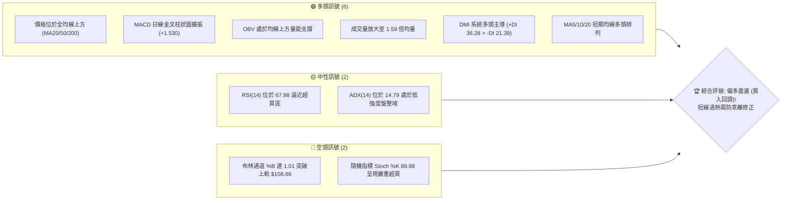
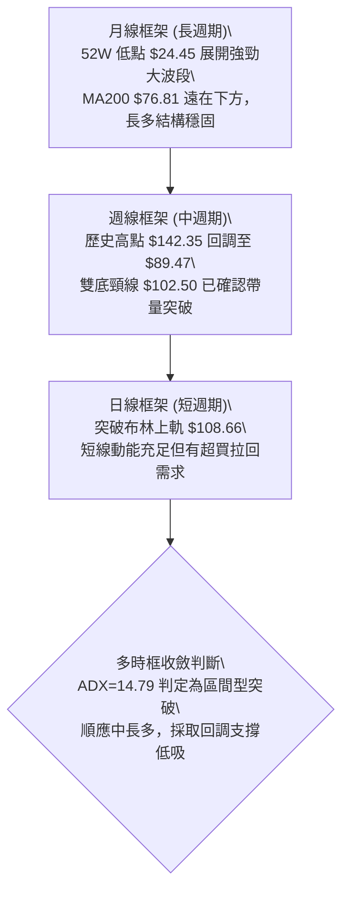
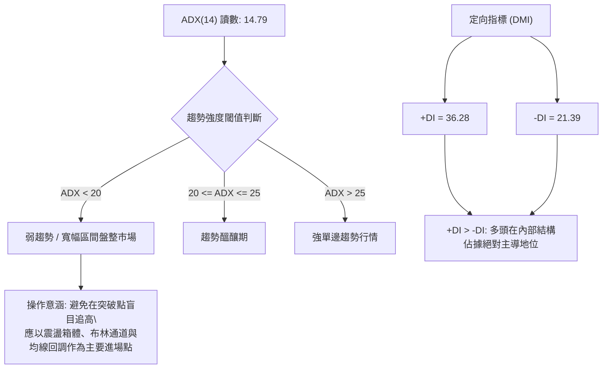
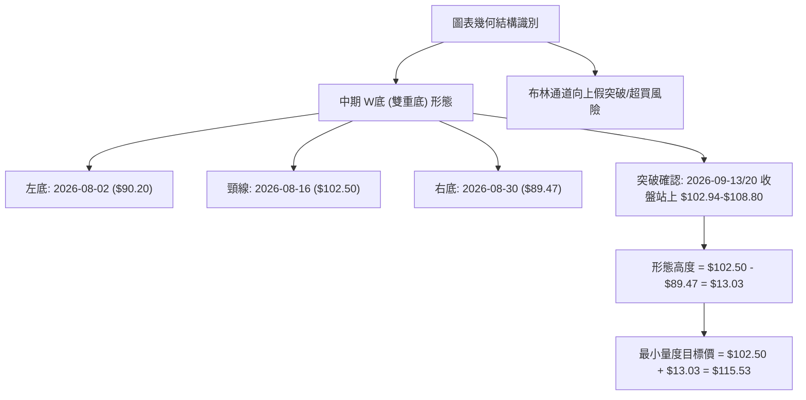
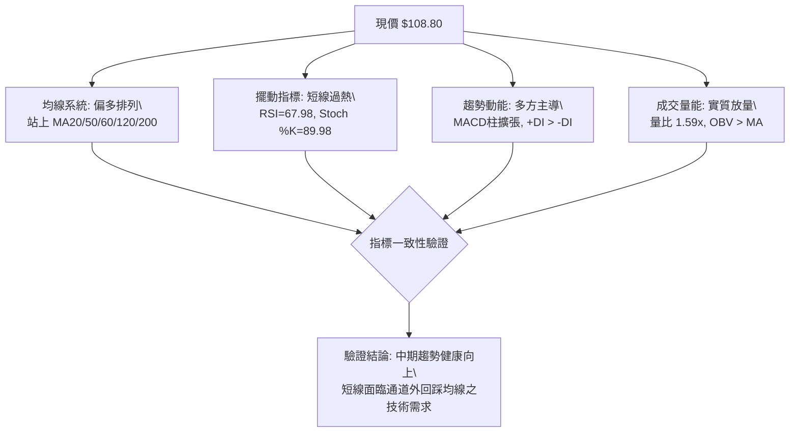
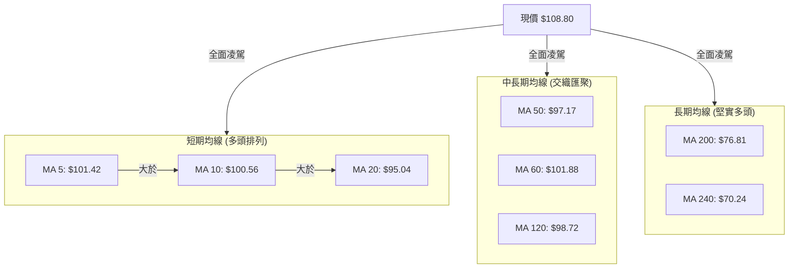
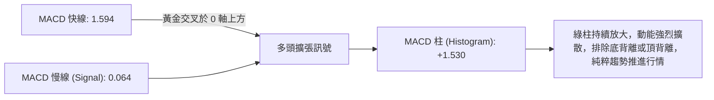
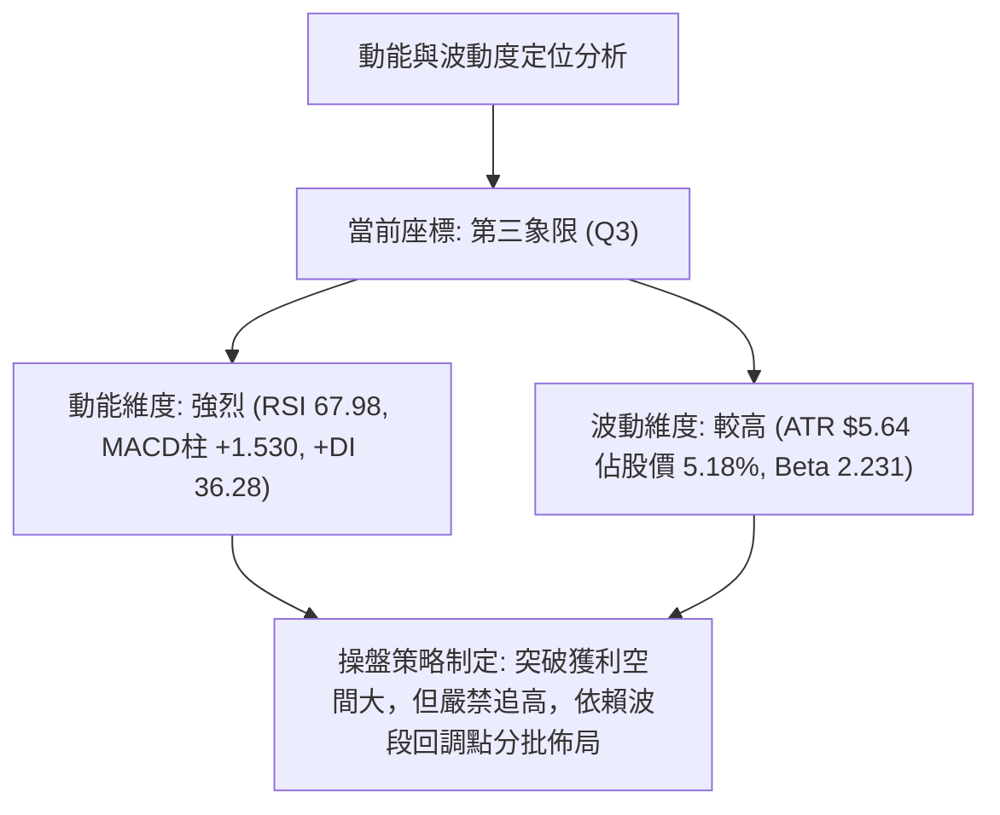
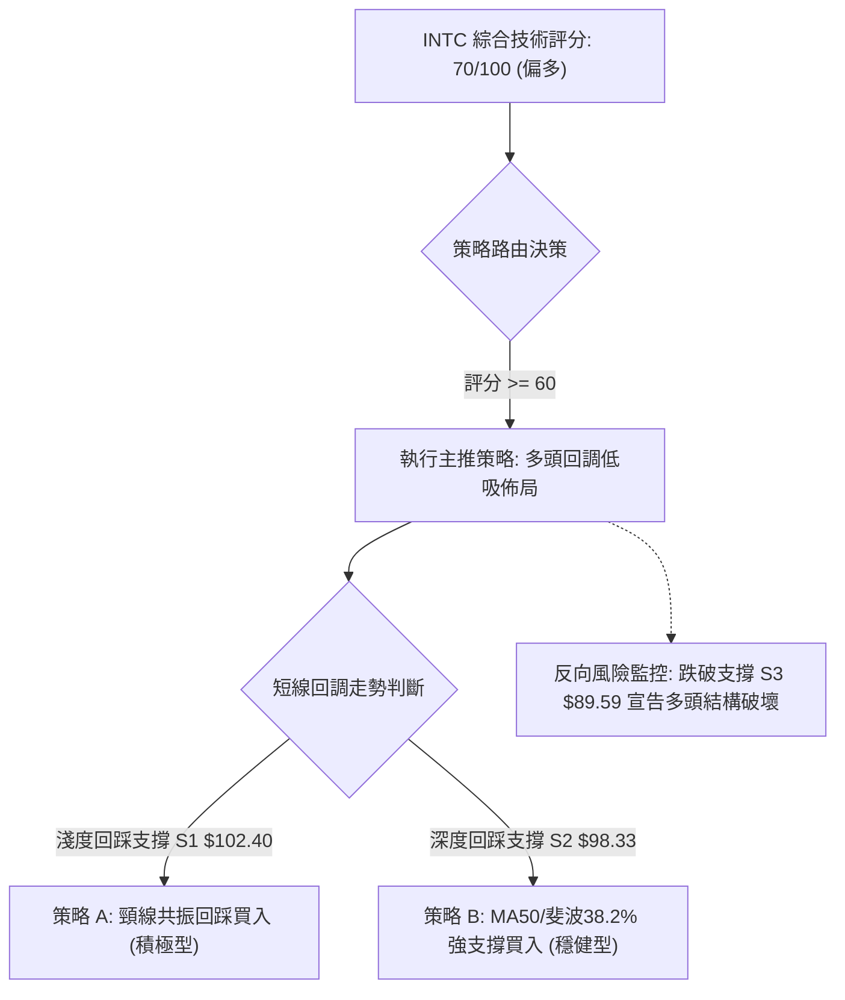
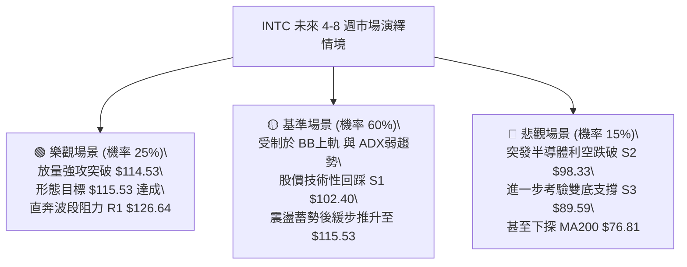

# INTC 技術分析報告

> **報告日期**：2026-09-18 ｜ **語言**：繁體中文 ｜ **數據來源**：Yahoo Finance ｜ **當前價格**：$108.80

---

## 目錄

| 章節 | 內容 |
|------|------|
| [1. 技術面概覽](#1-技術面概覽) | 訊號儀表板、核心指標、評分卡 |
| [2. 趨勢分析](#2-趨勢分析) | 多時框趨勢、長中短期走勢、ADX解讀 |
| [3. 圖表形態分析](#3-圖表形態分析) | 形態識別、信心度評估、K線組合 |
| [4. 支撐與阻力](#4-支撐與阻力) | 關鍵價位分佈、斐波那契回調結構 |
| [5. 技術指標深度解讀](#5-技術指標深度解讀) | 均線系統、RSI、MACD、布林通道、OBV |
| [6. 動能與波動率](#6-動能與波動率) | 動能四象限、ATR波動分析、Beta屬性 |
| [7. 多時框架總結](#7-多時框架總結) | 時框架矩陣、規則收斂唯一結論 |
| [8. 交易策略建議](#8-交易策略建議) | 策略路由、情境階梯、主推多頭策略詳解 |
| [9. 風險提示與監控](#9-風險提示與監控) | 監控清單、極端場景推演、風控紀律 |

---

## 1. 技術面概覽

### 🎯 技術訊號儀表板



### 📊 核心指標速覽表

| 指標類別 | 指標名稱 | 當前數值 | 訊號 | 解讀 |
|----------|----------|----------|------|------|
| **價格** | 當前價格 | $108.80 | 🟢 | 站上布林中軌，短線強勢突破上軌 $108.66 |
| **均線** | MA20 | $95.04 | 🟢 | 現價高於 MA20 達 +14.47%，中期多頭波段支撐 |
| **均線** | MA50 | $97.17 | 🟢 | 現價高於 MA50 達 +11.97%，趨勢支撐穩健 |
| **均線** | MA200 | $76.81 | 🟢 | 現價高於長期生命線達 +41.65%，多頭格局不變 |
| **動能** | RSI(14) | 67.98 | 🟡 | 進入強勢區間但接近 70 超買警戒線，未見頂背離 |
| **動能** | MACD | 1.594 / 0.064 | 🟢 | 快線穿過慢線呈正向擴散，MACD Hist 為 +1.530 |
| **擺動** | Stoch %K/%D | 89.98 / 72.58 | 🔴 | 進入極端超買區間（>80），短線具備技術性休整需求 |
| **趨勢** | ADX / ±DI | 14.79 | 🟡 | ADX < 25 處於震盪盤整期；+DI (36.28) > -DI (21.39) 多頭佔優 |
| **通道** | Bollinger Bands | %B = 1.01 | 🔴 | 突破上軌 $108.66，面臨通道外回撤壓力 |
| **量能** | 當日量 / 20日均量 | 148.9M / 93.4M | 🟢 | 成交量比達 1.59x，伴隨價格突破，量價配合健康 |
| **波動** | ATR(14) | $5.64 | 🟡 | 佔股價 5.18%，日內波幅較大，止損空間需適度放寬 |

### 🏆 技術評分卡

```
╔══════════════════════════════════════════════════════════════════╗
║                技術評分卡 — INTC (2026-09-18)                    ║
╠══════════════════════════════════════════════════════════════════╣
║ 趨勢強度 (Trend)     ██████████░░░░░░░░░░  52/100  🟡 中性 (ADX低)║
║ 動能指標 (Momentum)  ███████████████░░░░░  74/100  🟢 強勁偏多    ║
║ 支撐穩定度 (Support) ████████████████░░░░  80/100  🟢 雙重底部確立║
║ 成交量配合 (Volume)  ████████████████░░░░  82/100  🟢 量增價揚    ║
║ 形態完整度 (Pattern) ██████████████░░░░░  70/100  🟢 雙底向上突破║
║ 均線排列 (MA Align)  ████████████░░░░░░░░  62/100  🟡 長多中震盪  ║
╠══════════════════════════════════════════════════════════════════╣
║ 綜合評分             ██████████████░░░░░░  70/100  🟢 偏多策略導向║
╚══════════════════════════════════════════════════════════════════╝
```

---

## 2. 趨勢分析

### 🌐 多時框趨勢分析



### 📈 長期趨勢 — 12個月走勢圖（Unicode）

```
INTC 月線走勢圖（過去12個月：2025-10 至 2026-09）
價格軸 ($)
$140 ┤                                 ● $139.63 (06月波段頂峰)
$120 ┤                         ● $114.68
$100 ┤                 ● $94.48                 ● $108.80 (現價 09月)
$80  ┤                                      ● $90.20
$60  ┤                                           ● $89.51 (08月低點)
$40  ┤ ● $39.99  ● $40.56      ● $46.47
$30  ┤      ● $36.90       ● $44.13
     └─────────────────────────────────────────────────────────────
       10   11   12   01   02   03   04   05   06   07   08   09 (月份)
      [───── 2025年 ─────] [───────────── 2026年 ───────────────]
```

#### 走勢特徵分析表格

| 階段 | 時間區間 | 起訖價格 | 漲跌幅 | 核心技術特徵 |
|------|----------|----------|--------|--------------|
| **第一階段：底部築基** | 2025/10 - 2026/03 | $39.99 → $44.13 | +10.35% | 在 $36.90-$46.47 構築橫盤打底箱體，籌碼充分換手 |
| **第二階段：主升爆發** | 2026/03 - 2026/06 | $44.13 → $139.63 | +216.41% | 脫離長期均線壓制，連續拉出大陽線，觸及 52W 高點 $142.35 |
| **第三階段：高位獲利** | 2026/06 - 2026/08 | $139.63 → $89.51 | -35.89% | 快速回撤，於 $89.50 附近尋求斐波那契回調支撐 |
| **第四階段：次級回升** | 2026/08 - 2026/09 | $89.51 → $108.80 | +21.55% | 形成對稱雙底，帶量跳空重回百元關卡上方 |

### 📊 中期趨勢（週線分析）

中期走勢呈現顯著的「雙底反轉」形態：
- **第一底**：2026-08-02 當週收盤 $90.20。
- **反彈高點（頸線位）**：2026-08-16 當週收盤 $102.50。
- **第二底**：2026-08-30 當週收盤 $89.47（守住關鍵支撐 S3 $89.59 區域）。
- **頸線突破**：2026-09-13 當週收盤 $102.94，隨後本週推升至 $108.80，確認了中期次級折返走勢的結束，重回上升主通道。

```
近期週線壓力支撐架構示意：
  $126.64 ────────────────────────────────── [R1 聚類強阻力區]
              ▲
              │ 向上拓展空間
  $108.80 ───●現價 (突破短線通道)
              │
  $102.40 ───┴────────────────────────────── [S1 / 突破頸線轉支撐]
  $89.50  ────────────────────────────────── [雙底低點支撐平台]
```

### ⚡ 趨勢強度評估（ADX 解讀）



#### ADX 與 DMI 綜合解讀表

| 指標變數 | 當前數值 | 狀態等級 | 戰術指引 |
|----------|----------|----------|----------|
| **ADX(14)** | 14.79 | 弱趨勢（< 25） | 不具備單邊無腦跟隨條件，市場處於寬幅震盪中的波段上漲 |
| **+DI(14)** | 36.28 | 多方極強 | 買方動能自低位快速聚攏，近三週呈現單向推升 |
| **-DI(14)** | 21.39 | 空方衰竭 | 賣壓在連續兩次探底 $89.47 後明顯萎縮 |
| **綜合判定** | 多頭震盪反彈 | 🟢 偏多運作 | 嚴格依據多時框收斂原則（ADX<25）：以通道邊界與關鍵均線為錨，切忌追漲破軌 |

---

## 3. 圖表形態分析

### 🔍 形態識別系統



#### 形態識別與信心度評估表

| 形態類別 | 信心度 | 判斷依據（引用數據） | 完成度 | 形態目標價（附計算式） |
|----------|--------|----------------------|--------|------------------------|
| **雙重底 (W-Bottom)** | 85% | 兩次低點 $90.20 與 $89.47（緊貼支撐 S3 $89.59），頸線 $102.50 伴隨量能由 421M 增至 450M 確認突破 | 100% (已突破) | **$115.53**<br>計算式：頸線 $102.50 + 形態高度($102.50 - $89.47 = $13.03) |
| **矩形箱體突破** | 75% | 自 2026-07-19 至 2026-09-06 於 $89.47 - $102.50 窄幅整理超過7週，收盤正式站上箱體上沿 | 100% (突破中) | **$115.53**<br>計算式：箱頂 $102.50 + 箱體高度 $13.03 |
| **布林通道破軌** | 65% | 日線收盤 $108.80 位於 BB 上軌 $108.66 之上，%B = 1.01，短線面臨均值回歸拉回 | 進行中 | 預期回踩 BB 中軌 / 支撐 S2 **$98.33 - $95.04** |

### 🕯️ 重要K線形態分析

| 週期/日期 | 收盤價 | K線形態 | 量價關係 | 訊號解讀 | 訊號方向 |
|-----------|--------|---------|----------|----------|----------|
| **2026-08-02 當週** | $90.20 | 長下影錘子線 | 689M 巨量釋放 | 於 52W 漲幅 50% 斐波回調位附近出現恐慌盤承接 | 🟢 看多反轉 |
| **2026-08-16 當週** | $102.50 | 長實體大陽線 | 639M 溫和放量 | 多頭快速反撲，測試並確立中期頸線壓力 | 🟢 多方進攻 |
| **2026-08-30 當週** | $89.47 | 縮量十字星 | 441M 明顯縮量 | 空方力量耗盡，測試左底支撐形成雙底右側確認點 | 🟢 築底成功 |
| **2026-09-13 當週** | $102.94 | 突破中陽線 | 421M 穩步換手 | 實體穿透頸線壓制 $102.50，啟動技術面追價買盤 | 🟢 形態突破 |
| **2026-09-20 當週** | $108.80 | 光頭強陽線 | 450M 持續放量 | 價格直逼斐波 23.6% 阻力區，展現強烈攻擊態勢 | 🟢 短線加速 |

### 📉 ASCII 走勢形態示意圖

```
INTC 中期「雙底 (W-Bottom)」形態結構圖解：
價格
$116.00 ┤                                                    [量度目標 $115.53]
$112.00 ┤                                            ╭─● 現價 $108.80
$108.00 ┤                                      ╭─────╯
$104.00 ┤                 ╭─● 頸線 $102.50 ───● 突破確立 ($102.94)
$100.00 ┤               ╭─╯ ╰────────╮        │
$96.00  ┤             ╭─╯             ╰──╮     │
$92.00  ┤           ╭─╯                  ╰─╮   │
$88.00  ┤  ────────● 左底 $90.20 ──────────● 右底 $89.47 (S3 $89.59)
        └─────────────────────────────────────────────────────────────
          2026-07       2026-08             2026-09
```

### 🎯 形態目標價計算

依據傳統幾何形態量化推算規則：
1. **雙底形態量度目標（保守）**：
   - 頸線位 = $102.50
   - 最深底位 = $89.47
   - 形態垂直高度 $H = \$102.50 - \$89.47 = \$13.03$
   - **量度目標價 T1** = 頸線 + $H = \$102.50 + \$13.03 =$ **$115.53**（極其接近斐波那契 23.6% 回調位 $114.53）
2. **波段拓展目標（樂觀）**：
   - 若動能延續突破斐波回調位 $114.53，下一主要阻力直接指向數據所列聚類高點 **R1: $126.64**。

---

## 4. 支撐與阻力

### 🗺️ 關鍵價位分布圖（Unicode）

```
INTC 價位結構分布圖（嚴格對齊關鍵高低點聚類與斐波那契位）
═══════════════════════════════════════════════════════════════════
$142.35 ║████████████████████████████████║ 52W 極值高點 / 斐波 0.0%
$141.90 ║████████████████████████████    ║ 強阻力 R3 (波段高點聚類)
$132.75 ║████████████████████            ║ 阻力 R2 (反彈高點聚類)
$126.64 ║████████████████████████        ║ 關鍵阻力 R1 (前波放量套牢區)
$114.53 ║██████████████                  ║ 斐波那契 23.6% 回調位 / 形態目標
$108.80 ╠════════════════════════════════╣ ◄ 現價 (BB上軌 $108.66)
$102.40 ║▓▓▓▓▓▓▓▓▓▓▓▓▓▓▓▓                ║ 近期支撐 S1 (雙底頸線共振)
$98.33  ║████████████████████            ║ 強支撐 S2 (MA50/120 均線密集帶)
$97.31  ║██████████████                  ║ 斐波那契 38.2% 回調位
$89.59  ║████████████████████████████    ║ 鐵底支撐 S3 (波段雙底聚類低點)
$83.40  ║████████████                    ║ 斐波那契 50.0% 回調位
$76.81  ║████████████████                ║ 長期生命線 MA200 支撐
═══════════════════════════════════════════════════════════════════
```

### 🚧 阻力位分析表

| 阻力級別 | 價位 | 距現價幅動 | 形成原因（嚴格引用波段聚類數據） | 突破難度 | 重要性 |
|----------|------|------------|----------------------------------|----------|--------|
| **R1** | **$126.64** | +16.40% | 2026年6月高位震盪籌碼密集區，多根週K線長陰起跌點 | 🟡 中等偏高 | ★★★★☆ |
| **R2** | **$132.75** | +22.01% | 2026年6月歷史次高點聚類平台，主力出貨反抽受阻點 | 🔴 較高 | ★★★★☆ |
| **R3** | **$141.90** | +30.42% | 緊鄰 52週歷史高點 $142.35 之終極套牢密集區 | 🔴 極高 | ★★★★★ |

### 🛡️ 支撐位分析表

| 支撐級別 | 價位 | 距現價幅動 | 形成原因（嚴格引用波段聚類數據） | 守住機率 | 重要性 |
|----------|------|------------|----------------------------------|----------|--------|
| **S1** | **$102.40** | -5.88% | 8月中旬高點與9月中旬突破頸線轉換區，多空短線分水嶺 | 80% | ★★★★☆ |
| **S2** | **$98.33** | -9.62% | 斐波 38.2% ($97.31) 與 MA50 ($97.17)、MA120 ($98.72) 匯聚點 | 85% | ★★★★★ |
| **S3** | **$89.59** | -17.66% | 2026年7-8月波段雙重底部聚類低點 ($90.20 與 $89.47) | 95% | ★★★★★ |

### 📐 斐波那契回調位分析

本波分析取 52 週絕對極值波段：**低點 $24.45 → 高點 $142.35**（垂直波幅 $117.90）：

| 回調比率 | 價位 | 當前價位關係 | 結構意義解讀 |
|----------|------|--------------|--------------|
| **0.0%** | $142.35 | 遠在現價上方 | 52週最高紀錄，長期牛市極限擴展目標 |
| **23.6%** | $114.53 | 現價上方 +5.27% | **當前第一目標阻力**；若日線能實體突破此位，將徹底打開邁向 R1 之路 |
| **當前價格** | **$108.80** | **位於 23.6% 與 38.2% 回調位之間，處於黃金分割中強勢回升區** |
| **38.2%** | $97.31 | 現價下方 -10.56% | 多頭核心防守位，與均線群 MA50 ($97.17) 形成強烈共振保護 |
| **50.0%** | $83.40 | 現價下方 -23.35% | 牛熊中軸強分界，先前探底至 $89.47 即在此位上方強烈止跌 |
| **61.8%** | $69.49 | 現價下方 -36.13% | 黃金分割強支撐位，下方有 MA240 ($70.24) 築起長城 |
| **78.6%** | $49.68 | 遠在現價下方 | 深度回調極限防線（歷史打底平台） |
| **100.0%** | $24.45 | 遠在現價下方 | 52週歷史起漲原點 |

---

## 5. 技術指標深度解讀

### 🎛️ 指標訊號總覽



### 📈 移動平均線排列分析



#### 均線架構剖析表

| 均線名稱 | 當前價格 | 與現價乖離率 | 走勢特徵（引用歷史軌跡） | 多空評價 |
|----------|----------|--------------|--------------------------|----------|
| **MA 5** | $101.42 | +7.27% | 連續向上揚升，斜率陡峭 | 🟢 短線強多 |
| **MA 10** | $100.56 | +8.19% | 底部弧形翻揚，提供短線第一回調支撐 | 🟢 短線看多 |
| **MA 20** | $95.04 | +14.47% | 確立自低位拐頭向上，布林中軌所在 | 🟢 中期轉強 |
| **MA 50** | $97.17 | +11.97% | 走平後開始復甦，與支撐 S2 形成共振 | 🟢 支撐穩固 |
| **MA 60** | $101.88 | +6.79% | 先前下行目前已被強勢突破扭轉 | 🟢 翻空為多 |
| **MA 120** | $98.72 | +10.21% | 長期平緩上行，提供波段深層防護 | 🟢 多方主導 |
| **MA 200** | $76.81 | +41.65% | 歷史牛熊分水嶺，現價遠居其上，長多格局毋庸置疑 | 🟢 宏觀牛市 |

### 📉 RSI(14) 分析

```
RSI(14) 當前水位：67.98
0 ══════════ 30 ════════════════ 50 ════════════ 67.98 ═ 70 ════════ 100
[  超賣區間  ] [       空方弱勢       ] [    多方主導    █████ ][ 超買警戒 ]
進度展示：██████████████░░░░░░  67.98% (強勢進攻位)
```

- **超買超賣判定**：數值為 67.98，位於 50-70 的強勢多頭推進區，但已極度逼近 70 超買警戒線。
- **背離分析（嚴格判定）**：
  - **日線 RSI**：自 8月30日低點回升以來，價格創反彈新高，RSI 同步自 38.1 揚升至 67.98，**無頂背離現象**，指標健康配合價格上漲。
  - **週線 RSI**：回顧 2026年5-6月股價在 $139.63 時 RSI 為 88.4，目前價格 $108.80 且 RSI 為 68.0，屬於大級別自極端超買區冷卻後的次級良性修復，亦無隱性頂背離。

### 📊 MACD(12/26/9) 訊號解讀



- 快線 (1.594) 與訊號線 (0.064) 呈現典型「零軸上雙金叉擴散」，Histogram 為 **+1.530**，動能處於多頭單向推進期。

### 📦 布林通道分析

```
INTC 布林通道結構示意圖 (寬度收斂後向上開口)
$112.00 ┤                                           
$108.66 ┤───────────────────────────────────╭── ● 現價 $108.80 (突破上軌, %B=1.01)
$104.00 ┤                           ╭───────╯     [布林上軌帶動外軌擴張]
$100.00 ┤                   ╭───────╯
$95.04  ┤───────────────────╯───────────────────── [布林中軌 MA20]
$90.00  ┤           ╭───────╯
$85.00  ┤   ╭───────╯
$81.43  ┤───╯───────────────────────────────────── [布林下軌]
        └─────────────────────────────────────────
```

- **通道指標剖析**：
  - BB 上軌：$108.66 ｜ 中軌 (MA20)：$95.04 ｜ 下軌：$81.43
  - **%B 指標**：達 **1.01**（> 1.0），代表收盤價已經刺穿布林帶上軌。
  - **戰術含義**：在 ADX < 25 的盤整震盪大框架下，%B > 1.0 往往觸發高概率的均值回歸，短線繼續拔高的盈虧比不佳，技術上高度預期在未來 3-5 個交易日內回踩中軌與頸線共振帶。

### 💹 成交量分析（量價配合度）

- **量比強度**：最新單日成交量為 **148,929,100 股**，相較 20 日均量 (93,410,050 股) 的量比達 **1.59 倍**，呈現清晰的「放量突破」。
- **週量能配合**：近三週成交量由 378M → 421M → 450M 階梯式推升，完全排除「縮量假突破」的疑慮。
- **OBV (能量潮)**：數據明確顯示「OBV > MA → 量能支撐上漲」，大資金呈現淨流入狀態，量價結構完全健康共振。

---

## 6. 動能與波動率

### ⚡ 動能評估四象限

| 象限標籤 | 動能維度 | 波動維度 | 歷史市場情境 | INTC 當前定位與評估 |
|----------|----------|----------|--------------|---------------------|
| **第一象限 (Q1)** | 強動能 (+DI高/MACD大) | 低波動 (ATR穩定) | 穩定單邊牛市 | 最佳波段機會 |
| **第二象限 (Q2)** | 弱動能 (MACD平緩) | 低波動 (區間收縮) | 橫盤窄幅打底 | 謹慎觀望等待 |
| **第三象限 (Q3)** | **強動能** | **高波動** | **爆發突破/快速反彈** | **✓ 當前狀態 (評估：高回報但須嚴控止損)** |
| **第四象限 (Q4)** | 弱動能 | 高波動 | 恐慌崩跌/無量陰跌 | 堅決避免進場 |



### 📊 ATR 波動率分析

- **ATR(14) 數值**：**$5.64**，佔當前股價比例高達 **5.18%**。
- **日內波動特徵**：INTC 目前每日平均震盪幅度超過 5.6 美元，屬於典型高貝塔半導體彈性品種。
- **風控止損空間配置建議**：
  - 短線波段策略（Swing）：止損應至少設定為 $1.5 \times \text{ATR} = 1.5 \times \$5.64 \approx \$8.46$。
  - 若自現價 $108.80 進場，極易被正常噪聲洗出場；**最佳策略必須等待價格回落至頸線支撐 S1 $102.40 附近進場**，並將止損設於 S2 $98.33 之下，距離恰為約 $4.0 - $5.0 美元（約 0.8-1.0 ATR），大幅提升策略勝率。

### 📐 Beta 與市場相關性

- **Beta 係數**：**2.231**。
- **敏感度剖析**：INTC 波動劇烈度為標普 500 指數的 2.23 倍。當半導體板塊（SOX）或大盤反彈時，其上漲攻擊力顯著放大；但一旦整體宏觀市場回檔，回撤速度亦倍於大盤。交易配置必須嚴格匹配倉位權重。

---

## 7. 多時框架總結

### 📋 時框架評分表

| 時框架 | 趨勢方向 | 動能狀態 | 均線排列 | 關鍵形態 | 綜合評分 | 操作指引 |
|--------|----------|----------|----------|----------|----------|----------|
| **月線 (Long-term)** | 🟢 多頭主導 | 🟢 良好 | 🟢 MA200/240 底部仰角支撐 | 歷史底部大三角收斂突破 | **78/100** | 長線持股，堅定看好 |
| **週線 (Mid-term)** | 🟢 底部反轉 | 🟢 強勁 | 🟡 混合糾結修復中 | 經典雙重底 (W底) 突破確立 | **75/100** | 中期波段做多，目標 $115-$126 |
| **日線 (Short-term)** | 🟡 短線過熱 | 🔴 超買警戒 | 🟢 短天期均線發散向上 | 破布林上軌 (%B=1.01) | **58/100** | 暫停追高，待回踩支撐接回 |

### 🔲 綜合訊號矩陣

| 分析維度 | 短期 (1-5天) | 中期 (2-8週) | 長期 (3-12月) | 一致性研判 |
|----------|--------------|--------------|---------------|------------|
| **趨勢架構** | 向上衝刺 | 震盪回升 | 宏觀牛市 | 🟢 高度一致偏多 |
| **量價關係** | 量比 1.59x 放大 | 連三週帶量 | 底部具備沉澱巨量 | 🟢 量能健康確認 |
| **超買狀態** | Stoch %K=89.98 極熱 | RSI 68 溫和偏強 | 自 88 高位充分冷卻 | 🟡 長短週期存在節奏分歧 |
| **通道位置** | 刺穿上軌面臨回撤 | 正自通道下半部翻揚 | 遠在多頭防線上方 | 🟡 短線有均值回歸拉回修復 |

### ⚖️ 多時框收斂結論

依據「**嚴格要求 14：多時框收斂規則**」嚴格裁決：
1. **行情屬性判定**：當前 ADX(14) 數值為 **14.79**（嚴格小於 25），在量化標準上正式判定為**「寬幅盤整震盪行情」**。
2. **時框優先級**：在盤整震盪架構下，日線布林通道邊界與均線波動具有最高指導意義；同時，中期週線級別之雙重底頸線突破（$102.50）構成了震盪區間重心的上移。
3. **矛盾取捨**：雖然日線指標強勢放量（MACD金叉、+DI多頭），但日線布林通道 %B 達 1.01 且隨機指標高達 89.98，明確發出短線超買警告。按照規則，盤整市場不可在通道上軌盲目追漲。
4. **唯一確定結論**：**【中長期偏多背景下的短線回調低吸（Buy on Dips）】**。
   - **主方向**：**偏多**。
   - **戰術路徑**：拒絕在現價 $108.80 追價，專注等待價格回踩支撐區間 **$102.40 - $98.33** 構築防守點後進場。

---

## 8. 交易策略建議

### 🗺️ 策略決策流程圖



### 🧭 策略路由（依評分卡分流）

> **當前主策略方向 = 主推多頭回調低吸策略（依技術評分卡 70/100，綜合評級偏多）**
> 
> 由於綜合評分達 70 分，中期 W 底形態帶量突破頸線，本報告**主推多頭交易方案**；空頭方向僅作為反轉風險預警與下行保護對沖點，不給予主動空頭策略。

### 🎯 價格情境階梯（Price Scenarios）

嚴格引用數據中 OHLCV 聚類及斐波那契計算之精確價位：

| 觸發條件 | 第一目標 | 第二目標 | 後續延伸 | 情境技術含義 |
|----------|----------|----------|----------|--------------|
| **強勢突破 斐波23.6% $114.53** | 形態目標 $115.53 | 阻力 R1 $126.64 | 阻力 R2 $132.75 | 突破中期箱體上限，啟動第二波主升浪 |
| **回踩確認 支撐 S1 $102.40** | 現價 $108.80 | 形態目標 $115.53 | 阻力 R1 $126.64 | 雙底頸線技術性頂底轉換，最佳回踩進場契機 |
| **深度回撤 支撐 S2 $98.33** | 支撐 S1 $102.40 | 現價 $108.80 | 形態目標 $115.53 | 均線密集群 MA50/120 提供防守，波段最後加碼點 |
| **破位跌破 支撐 S3 $89.59** | 斐波50% $83.40 | 生命線 $76.81 | 斐波61.8% $69.49 | 雙底徹底失敗，中期走勢全面轉空，多單無條件止損 |

### 📊 情境機率分佈

| 情境劃分 | 估計機率 | 關鍵驅動與技術依據（嚴格引用指標） |
|----------|----------|-----------------------------------|
| **情境一：回踩支撐後延續上行** | **60%** | MACD柱擴張(+1.530)、成交量能放量(量比1.59x)、OBV高於均線、+DI達36.28牢固主導 |
| **情境二：在 $102.40-$114.53 區間震盪** | **25%** | ADX僅14.79指示趨勢力量未全面爆發，布林通道上軌壓制需時間消化超買 |
| **情境三：反轉深度回跌破底** | **15%** | Stoch %K=89.98 短線極端超買引發獲利盤拋售，若遭遇半導體板塊系統性下挫則可能再探底 |

### 🟢 主策略詳情（精確量化）

```
╔══════════════════════════════════════════════════════════════════╗
║               INTC 核心交易策略執行參數表                        ║
╠══════════════════════════════════════════════════════════════════╣
║ 策略要素       策略 A (積極型：頸線回踩買入) 策略 B (穩健型：均線共振低吸)║
╠══════════════════════════════════════════════════════════════════╣
║ 進場條件       回調觸及 S1 不破並現 1H/4H 陽線 深度回踩 S2 獲得 MA50 共振確認║
║ 進場價格       $102.40                      $98.33                      ║
║ 止損價格       $97.31 (斐波 38.2% 破位止損)  $94.00 (跌破 MA20 及波段平台)║
║ 目標價 T1      $114.53 (斐波 23.6% 回調位)   $108.80 (當前密集跳空高點)  ║
║ 目標價 T2      $126.64 (波段阻力 R1)         $115.53 (雙底量度目標價)    ║
║ 風險空間       $5.09                        $4.33                       ║
║ 報酬空間 (T2)  $24.24                       $17.20                      ║
║ 風險報酬比     1 : 4.76                     1 : 3.97                    ║
║ 成功機率       65%                          75%                         ║
║ 建議倉位       15% 總部位                   25% 總部位                  ║
╚══════════════════════════════════════════════════════════════════╝
```

### 🔴 反向風險觸發點（對沖提示）

- **關鍵多空轉折破位點**：**$89.59 (支撐 S3)**。
- **對沖處置條件**：若週線收盤實體跌破 $89.59，代表 2026年7-8月構築之雙重底結構徹底瓦解，下跌形態將向下延伸至斐波 50% 水平 **$83.40** 乃至 MA200 生命線 **$76.81**。
- **行動指南**：屆時應清空所有多頭波段倉位，或購入 Put 進行完全對沖，切不可盲目逢低攤平。

### ⭐ 整體訊號強度評星

```
做多訊號強度：★★★★☆  (4.0/5星 — 突破形態完整，量能與均線有力背書)
做空訊號強度：★☆☆☆☆  (1.5/5星 — 僅短線指標超買，缺乏空頭形態結構)
整體可信度：  ★★★★☆  (4.2/5星 — 多指標與量價形態產生強烈共振)
```

---

## 9. 風險提示與監控

### ✅ 關鍵監控指標 Checklist

```
╔══════════════════════════════════════════════════════════════════╗
║                   INTC 交易監控清單 (Checklist)                  ║
╠══════════════════════════════════════════════════════════════════╣
║ [ ] 監控項 1：日線布林 %B 是否重回 1.0 以下完成均值回歸修復     ║
║ [ ] 監控項 2：回踩支撐 S1 ($102.40) 時，成交量是否呈現良性萎縮   ║
║ [ ] 監控項 3：MACD 柱狀圖是否持續維持在 0 軸上方 (> 0)          ║
║ [ ] 監控項 4：DMI 系統中 -DI (21.39) 是否出現向上異動交叉 +DI   ║
║ [ ] 監控項 5：股價向上挑戰 斐波 23.6% ($114.53) 時之日量比 (>1.2)║
║ [ ] 監控項 6：跌破止損位 $97.31 或 $94.00 時之紀律停損執行     ║
╚══════════════════════════════════════════════════════════════════╝
```

### ⚠️ 風險場景分析



### 🛡️ 風險管理重要提醒

1. **ATR 波動適應**：INTC ATR(14) 高達 $5.64（5.18%），單日上下穿梭 5 美元屬正常波動。嚴禁採取過度緊湊之日內止損（如 1-2 美元），避免遭受無效噪聲震盪出局。
2. **Beta 槓桿防範**：Beta 高達 2.231，意味大盤若出現 2% 的常規技術回調，INTC 可能產生 4.5% - 5.5% 的劇烈回撤。總持倉曝險比例務必控制在總投資組合之 15% - 20% 以內。
3. **事件與籌碼監控**：空頭部位比率（Short % Float）雖僅 2.9%，但機構持股達 62.5%，需密切觀察百元關卡上方機構資金的換手穩定度。

---

## 📋 報告總結

```
╔══════════════════════════════════════════════════════════════════╗
║                   INTC 技術分析報告總結                          ║
╠══════════════════════════════════════════════════════════════════╣
║ 報告日期：2026-09-18                                             ║
║ 當前價格：$108.80                                                ║
║ 分析評級：🟢 偏多（買入回調 Buy on Dips）                       ║
║                                                                  ║
║ 關鍵結論：                                                       ║
║ ├─ 長期趨勢：🟢 宏觀牛市格局，價格遠高於 MA200 ($76.81)          ║
║ ├─ 中期趨勢：🟢 雙重底 (W底) 確立突破頸線，量度目標指向 $115.53  ║
║ ├─ 短期趨勢：🟡 突破布林上軌且 Stoch 超買，短線具備技術性休整需求 ║
║ ├─ 關鍵支撐：S1: $102.40 ｜ S2: $98.33 ｜ S3: $89.59            ║
║ ├─ 關鍵阻力：斐波: $114.53 ｜ R1: $126.64 ｜ R2: $132.75         ║
║ └─ 分析師目標：共識買入，平均目標價 $116.37 (與形態目標極度吻合)  ║
║                                                                  ║
║ 最優策略組合：                                                   ║
║ 1. 🥇 最佳機會：等待短線超買降溫，於 $102.40 (S1) 建立主要多頭倉位║
║ 2. 🥈 次選機會：若深度回踩 $98.33 (S2)，加碼建立波段核心多頭倉位║
║ 3. 🥉 保守選擇：等待實體突破 $114.53 後右側順勢追進，看至 $126.64║
╚══════════════════════════════════════════════════════════════════╝
```

---

> ⚠️ **免責聲明**：本報告為技術分析研究成果，所有數據及估算均嚴格基於所提供之歷史價格與量化指標。本報告**僅供研究與學術參考**，**不構成任何要約、推薦或投資建議**。金融市場投資具有高風險性，資產價格可能劇烈波動，投資人應自行評估風險並承擔一切投資損益。

---

*報告生成時間：2026-09-18 ｜ 數據來源：Yahoo Finance ｜ 分析框架：多時框架量化技術分析*