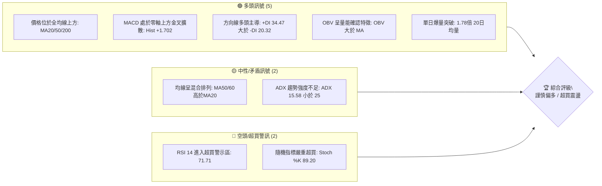
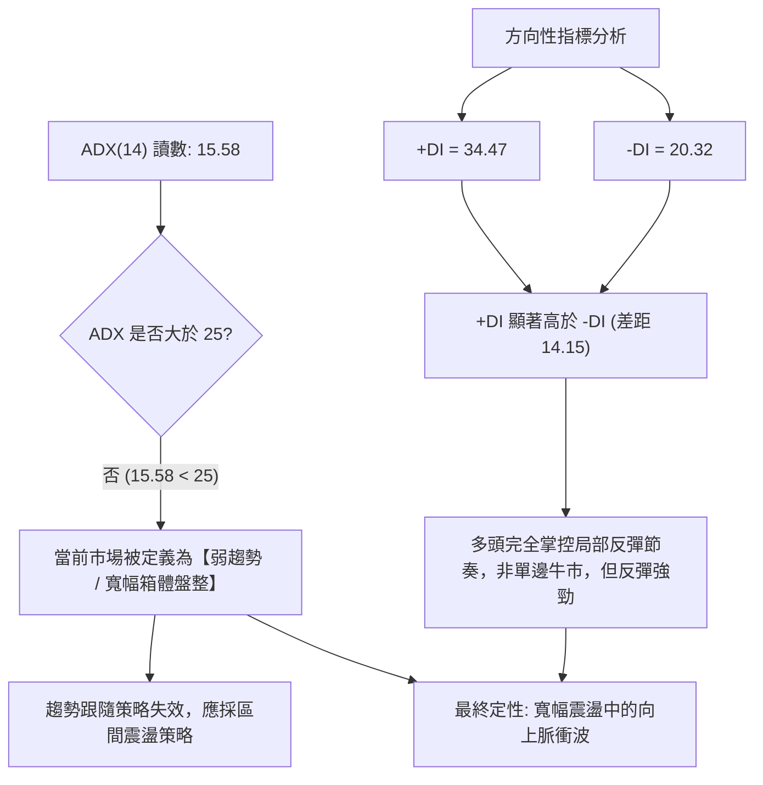
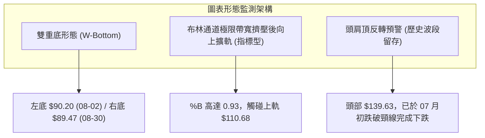
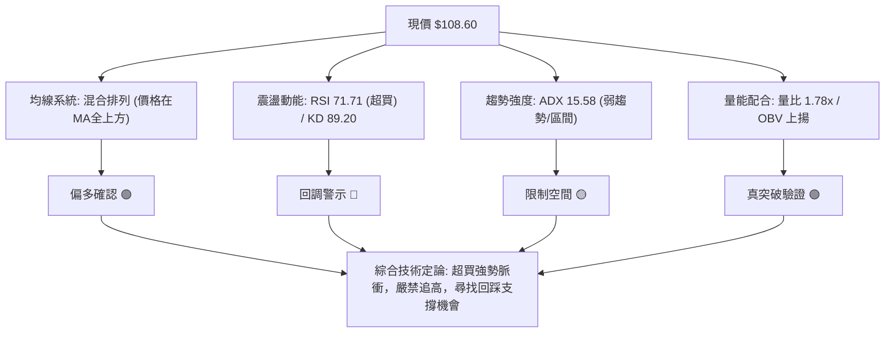
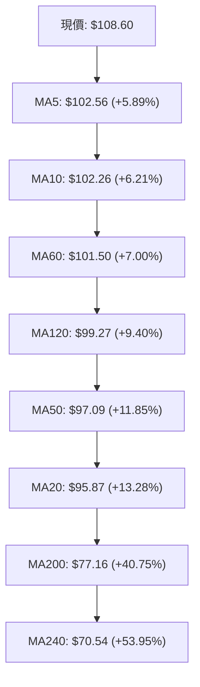
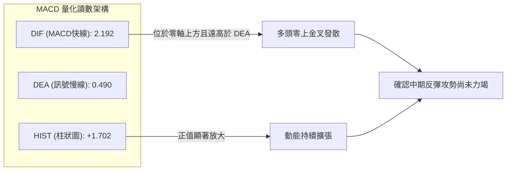
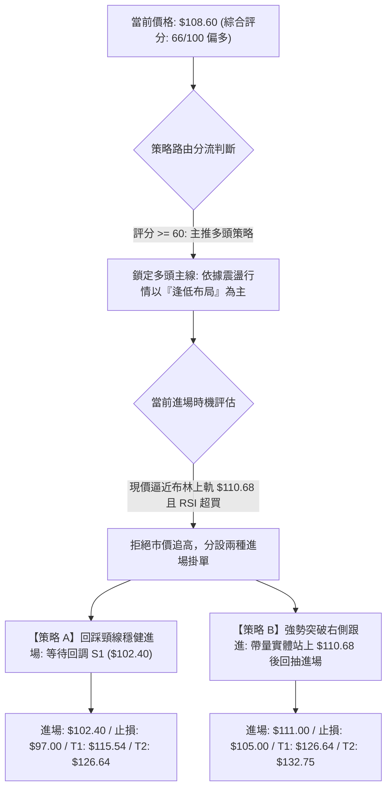
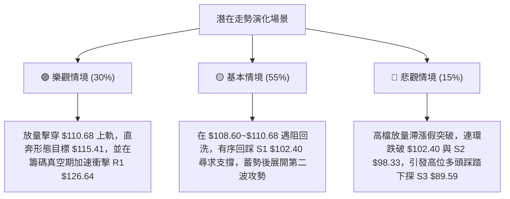

# INTC 技術分析報告

> **報告日期**：2026-09-19 ｜ **語言**：繁體中文 ｜ **數據來源**：Yahoo Finance ｜ **當前價格**：$108.60

---

## 目錄

| 章節 | 內容 |
|------|------|
| [1. 技術面概覽](#1-技術面概覽) | 訊號儀表板、核心指標、評分卡 |
| [2. 趨勢分析](#2-趨勢分析) | 多時框趨勢、長中短期走勢、ADX強弱判斷 |
| [3. 圖表形態分析](#3-圖表形態分析) | 形態識別信心度、K線組合、目標價推算 |
| [4. 支撐與阻力](#4-支撐與阻力) | 結構價位分布、波段聚類點位、斐波那契回調 |
| [5. 技術指標深度解讀](#5-技術指標深度解讀) | 均線系統、動能指標、布林通道與OBV量價 |
| [6. 動能與波動率](#6-動能與波動率) | 波動狀態定位、ATR動態風控、Beta市場連動 |
| [7. 多時框架總結](#7-多時框架總結) | 時框一致性評估、收斂邏輯與主導方向鎖定 |
| [8. 交易策略建議](#8-交易策略建議) | 策略路由分流、情境機率階梯、完整風控參數 |
| [9. 風險提示與監控](#9-風險提示與監控) | 觸發閾值檢查清單、路徑演化模型、持倉管理 |

---

## 1. 技術面概覽

### 🎯 技術訊號儀表板



### 📊 核心指標速覽表

| 指標類別 | 指標名稱 | 當前數值 | 訊號 | 解讀 |
|----------|----------|----------|------|------|
| **價格** | 當前價格 | $108.60 | 🟢 | 位於52週區間70.3%分位，短期波段轉強 |
| **均線** | MA20 | $95.87 | 🟢 | 價格在其上方 +13.28%，形成短線支撐中樞 |
| **均線** | MA50 | $97.09 | 🟢 | 價格在其上方 +11.85%，中期生命線向上修復 |
| **均線** | MA200 | $77.16 | 🟢 | 價格在其上方 +40.75%，長期結構多頭未變 |
| **動能** | RSI(14) | 71.71 | 🔴 | 進入超買警戒區（>70），短線追高風險急增 |
| **動能** | MACD (12,26,9) | 2.192 / 0.490 | 🟢 | 柱狀圖 +1.702 呈多頭擴張，動能穩固 |
| **波動** | ATR(14) | $5.60 | 🟡 | 佔股價 5.15%，日均震盪幅度偏大，需放寬止損 |
| **通道** | 布林 %B | 0.93 | 🟡 | 貼近布林通道上軌（$110.68），面臨通道壓制 |
| **量能** | 當日量比 | 1.78x | 🟢 | 放量突破中軌，量能實質配合價格回升 |

### 🏆 技術評分卡

```
╔══════════════════════════════════════════════════════════════════╗
║              技術評分卡 — INTC (2026-09-19)                       ║
╠══════════════════════════════════════════════════════════════════╣
║ 趨勢強度 (ADX/方向)   ████████░░░░░░░░░░░░  42/100  🟡 弱勢趨勢 ║
║ 動能指標 (RSI/MACD)   ██████████████░░░░░░  72/100  🟢 動能充沛 ║
║ 支撐穩定度 (S1/S2/S3) ████████████████░░░░  78/100  🟢 底部穩固 ║
║ 成交量配合 (OBV/Vol)  ████████████████░░░░  82/100  🟢 價升量增 ║
║ 形態完整度 (波段架構) ████████████░░░░░░░░  60/100  🟡 震盪築底 ║
║ 均線排列 (混合排列)   ████████████░░░░░░░░  62/100  🟡 修復過渡 ║
╠══════════════════════════════════════════════════════════════════╣
║ 綜合評分              █████████████░░░░░░░  66/100  偏多震盪    ║
╚══════════════════════════════════════════════════════════════════╝
```

---

## 2. 趨勢分析

### 🌐 多時框趨勢分析

```mermaid
graph TD
    M["月線層級 (長期: 24個月)"] -->|"股價自 $19.43 巨幅上漲至 $139.63 後回踩"| M_STAT["長期多頭: 股價遠高於 MA200 ($77.16)"]
    W["週線層級 (中期: 20週)"] -->|"經歷 2026-06 高點回調至 $89.47 止跌形成雙重底"| W_STAT["中期震盪築底: 連續3週收紅反彈"]
    D["日線層級 (短期: 近期)"] -->|"突破 MA20 ($95.87) 與 MA50 ($97.09) 阻力"| D_STAT["短期強勢多頭: 觸及布林上軌 ($110.68)"]
    M_STAT --> SYNTHESIS{"多時框收斂狀態"}
    W_STAT --> SYNTHESIS
    D_STAT --> SYNTHESIS
    SYNTHESIS -->|"ADX("14") = 15.58 < 25"| FINAL["界定為【盤整大區間內的強勢短線波段行情】"]
```

### 📈 長期趨勢 — 12個月走勢圖（Unicode）

```
INTC 月線走勢圖（過去12個月：2025-10 至 2026-09）
價格軸 ($)
$140 ┤                                 ● 2026-06 ($139.63 歷史波段高點)
$120 ┤                             ● 2026-05 ($114.68)
$100 ┤                         ● 2026-04 ($94.48)           ● 2026-09 ($108.60 現價)
$80  ┤                                              ● 2026-07 ($90.20)
$60  ┤                                                  ● 2026-08 ($89.51 低點聚類)
$40  ┤ ● 2025-10 ($39.99)   ● 2026-01 ($46.47)
$20  ┤       ● 2025-12 ($36.90)   ● 2026-03 ($44.13 突破平台)
     └─────────────────────────────────────────────────────────────────
       10  11  12  01  02  03  04  05  06  07  08  09 (月份)
```

**走勢特徵分析表格**：

| 階段 | 涵蓋月份 | 起訖價格 | 區間漲跌幅 | 核心技術特徵 |
|------|----------|----------|------------|--------------|
| **底部橫盤期** | 2024-09 ~ 2025-08 | $23.46 → $24.35 | +3.79% | 於 $19.43 ~ $24.35 窄幅箱體構築長達一年的堅實底部平台 |
| **主升浪推進** | 2025-09 ~ 2026-06 | $33.55 → $139.63 | +316.18% | 連續突破頸線，在 2026-04 爆發單月跳空大漲，6月創下 $139.63 波段天花板 |
| **劇烈回撤期** | 2026-06 ~ 2026-08 | $139.63 → $89.51 | -35.89% | 高檔獲利回吐，價格直墜 50% 斐波那契回調位附近（$85.54）尋求支撐 |
| **修復反彈期** | 2026-08 ~ 2026-09 | $89.51 → $108.60 | +21.33% | 連續放量陽線反抽，迅速跨越短期與中期均線，重回百元大關 |

### 📊 中期趨勢（週線分析）

中期走勢圖展示了 2026-07 至 2026-09 在 $89.50 至 $90.20 構築的波段低點支撐，以及上方來自 2026-05 至 2026-06 套牢籌碼形成的多重波段高點阻力：

```
中期阻力與支撐幾何示意（週線架構）
$141.90 ┤---------------------------------- (R3 強阻力：歷史高點聚類區)
        │         ▲ 06-21 ($133.99)
$132.75 ┤---------┼------------------------ (R2 阻力：回調前次高點聚類)
$126.64 ┤---------┼---▲ 06-14 ($124.57)---- (R1 關鍵阻力：反彈首要壓力區)
        │         │   │
$108.60 ┼========●========================= (當前價格：$108.60)
        │             │
$102.40 ┤-------------● 09-13 ($102.94)---- (S1 近期波段支撐：前週收盤處)
$98.33  ┤---------------------------------- (S2 結構強支撐：MA50防守區)
$89.59  ┤▲ 08-02 ($90.20) ▲ 08-30 ($89.47) (S3 堅定底部：雙重底頸線基底)
        └──────────────────────────────────
```

### ⚡ 趨勢強度評估（ADX 解讀）



**ADX 趨勢強度量化參照表**：

| ADX 數值區間 | 趨勢強度等級 | 當前狀態 | 交易策略指示 |
|--------------|--------------|----------|--------------|
| **0 ~ 20** | **極弱趨勢 / 無方向盤整** | **✓ (15.58)** | 避免中長線盲目追單；回調至支撐位低吸，上軌減磅 |
| **20 ~ 25** | 趨勢醞釀中 / 弱動能 | — | 觀察動能突破，不可過早重倉單邊押注 |
| **25 ~ 50** | 強趨勢確立 | — | 嚴格執行順勢突破策略，中軌處加碼 |
| **50 ~ 100** | 極強單邊 / 動能過熱 | — | 緊盯反轉形態，防範拋物線式噴發後暴跌 |

---

## 3. 圖表形態分析

### 🔍 形態識別系統



**圖表形態量化評估表**：

| 形態名稱 | 信心度 | 判斷依據（數據引證） | 完成度 | 目標價（附嚴謹幾何計算式） |
|----------|--------|----------------------|--------|----------------------------|
| **雙重底 (W-Bottom)** | **75%** | 兩次波段低點於 2026-08-02（收盤 $90.20）與 2026-08-30（收盤 $89.47）獲得聚類支撐 S3 ($89.59) 驗證；頸線為 2026-08-16 高點 $102.50。 | **100% (已突破頸線)** | **$115.41**<br>計算式：頸線 $102.50 + 形態高度 ($102.50 - $89.59 = $12.91) = $115.41（貼近斐波那契 23.6% 回調位 $115.54） |
| **布林向上通道突破** | **70%** | 收盤價 $108.60 緊貼布林上軌 $110.68，%B 數值達 0.93，伴隨 1.78x 爆量，為典型通道強勢擴張。 | **85%** | **$115.54**<br>計算式：由斐波那契 23.6% 阻力帶推算（由 OHLCV 確定位階） |
| **頭肩底 / 三角形** | **30%** | 數據不足以支撐幾何頭肩底或大型收斂三角形，屬偽信號。 | 0% | 訊號不足，僅做指標型解讀，不預設幾何目標 |

### 🕯️ 重要K線形態分析（近 10 週波段）

| 週別結束日 | 週收盤價 | 週成交量 | K線形態 | 專業技術解讀 | 訊號 |
|------------|----------|----------|---------|--------------|------|
| 2026-07-26 | $92.32 | 595,541,600 | 止跌十字星 (Doji) | 下跌動能衰竭，空頭無法有效摜壓 | 🟡 |
| 2026-08-02 | $90.20 | 689,350,700 | 錘頭線 (Hammer) | 創波段低點但伴隨爆量承接，確認初次底部確立 | 🟢 |
| 2026-08-09 | $101.65 | 461,225,800 | 大陽線實體反轉 | 週漲幅超 12%，MACD 柱狀圖由負翻正 (+1.614) | 🟢 |
| 2026-08-23 | $90.07 | 498,179,700 | 長陰線回測回調 | 獲利賣壓出籠，二次向下測底尋求支撐 | 🔴 |
| 2026-08-30 | $89.47 | 441,239,400 | 縮量雙底長下影 | 量能大幅萎縮至 4.41億，確認右底無拋壓，形成 W 底 | 🟢 |
| 2026-09-06 | $95.80 | 378,286,900 | 溫和放量起漲線 | 越過 MA20 中軌，買盤重新回歸 | 🟢 |
| 2026-09-13 | $102.94 | 421,038,200 | 實體大陽突破頸線 | 突破 $102.50 頸線位置，確認雙底確立 | 🟢 |
| 2026-09-20 | $108.60 | 625,787,600 | 強力推升中陽線 | 週量急增至 6.25億股，逼近阻力，但留短上影 | 🟡 |

### 📉 ASCII 走勢形態示意圖

```
雙重底（W-Bottom）破位反轉確認示意
價格
$116 ┤                                                    ▲ 形態推算目標價 ($115.41)
$110 ┤                                              ● 現價 ($108.60)
$104 ┤                             ▲ 頸線 ($102.50)─┼───────
$98  ┤                           ／ ＼            ／
$92  ┤  ● 左底 ($90.20)         ／    ＼        ／
$86  ┤───┴─────────────────────┼────────＼────／─────────
$80  ┤   (2026-08-02)          │         ● 右底 ($89.47)
     └─────────────────────────┴──────────┴───────────────
                                    形態高度 H = $12.91
```

### 🎯 形態目標價計算

```
╔══════════════════════════════════════════════════════════════════╗
║              雙底 (W-Bottom) 嚴謹數學推導模型                    ║
╠══════════════════════════════════════════════════════════════════╣
║ 1. 左底極限收盤價：$90.20 (2026-08-02)                          ║
║ 2. 右底極限收盤價：$89.47 (2026-08-30)                          ║
║ 3. 波段低點聚類基底 (S3)：$89.59                                ║
║ 4. 頸線反彈峰值 (2026-08-16 收盤)：$102.50                      ║
║ 5. 垂直形態高度 (H) = 頸線 $102.50 - 基底 $89.59 = $12.91       ║
║                                                                  ║
║ 目標價推導公式：                                                 ║
║ Target = 頸線位階 ($102.50) + 形態垂直高度 ($12.91)              ║
║ Target = $115.41                                                 ║
║                                                                  ║
║ 結論確認：形態目標價 $115.41 與數據內斐波那契 23.6% 回調位       ║
║          $115.54 存在精確共振，誤差僅 $0.13，具極高度技術說服力  ║
╚══════════════════════════════════════════════════════════════════╝
```

---

## 4. 支撐與阻力

### 🗺️ 關鍵價位分布圖（Unicode）

```
INTC 價位結構分布圖（引用 OHLCV 計算之關鍵價位）
═══════════════════════════════════════════════════════════════════
$142.35 ║████████████████████████████████████████║ 52W 最高點 / 斐波 0.0%
$141.90 ║██████████████████████████████████████░░║ 強阻力 R3 (+30.66%)
$132.75 ║██████████████████████████████░░░░░░░░░░║ 阻力 R2 (+22.24%)
$126.64 ║████████████████████████░░░░░░░░░░░░░░░░║ 關鍵阻力 R1 (+16.61%)
$115.54 ║▓▓▓▓▓▓▓▓▓▓▓▓▓▓▓▓▓▓▓▓▓▓▓▓░░░░░░░░░░░░░░░░║ 斐波那契 23.6% 回調位 / 形態目標
$110.68 ║░░░░░░░░░░░░░░░░░░░░░░░░░░░░░░░░░░░░░░░║ 布林通道上軌
$108.60 ╠════════════════════════════════════════╣ ◄ 現價 ($108.60)
$102.40 ║▓▓▓▓▓▓▓▓▓▓▓▓▓▓▓▓▓▓▓▓▓▓▓▓░░░░░░░░░░░░░░░░║ 近期波段支撐 S1 (-5.71%)
$98.95  ║████████████████████████░░░░░░░░░░░░░░░░║ 斐波那契 38.2% 回調位
$98.33  ║████████████████████████████░░░░░░░░░░░░║ 結構強支撐 S2 (-9.46%)
$89.59  ║████████████████████████████████████████║ 關鍵基底支撐 S3 (-17.50%)
$85.54  ║▓▓▓▓▓▓▓▓▓▓▓▓▓▓▓▓▓▓▓▓▓▓▓▓▓▓▓▓▓▓░░░░░░░░░░║ 斐波那契 50.0% 中樞平衡點
═══════════════════════════════════════════════════════════════════
```

### 🚧 阻力位分析表

| 阻力級別 | 價位 | 距現價幅動 | 形成原因（OHLCV計算來源） | 突破難度 | 技術重要性 |
|----------|------|------------|---------------------------|----------|------------|
| **R1** | **$126.64** | +16.61% | 2026年6月中旬反彈的高點聚類密集區，解套賣壓聚集 | 🟡 中等 | 短期多頭進階的關鍵分水嶺，若能攻克將打開上行空間 |
| **R2** | **$132.75** | +22.24% | 2026年6月下旬次高點套牢區（週收盤 $133.99 下方籌碼密集帶） | 🔴 偏高 | 次高點籌碼沈澱區，面臨大量被套資金的解套拋壓 |
| **R3** | **$141.90** | +30.66% | 52週最高點 $142.35 附近的極限波段聚類，歷史天花板 | 🔴 極高 | 多頭終極考驗位，觸及需警惕大規模雙重頂風險 |

### 🛡️ 支撐位分析表

| 支撐級別 | 價位 | 距現價幅動 | 形成原因（OHLCV計算來源） | 守住機率 | 技術重要性 |
|----------|------|------------|---------------------------|----------|------------|
| **S1** | **$102.40** | -5.71% | 近期一週起漲點波段低點聚類，且與 W 底頸線 $102.50 共振 | 🟢 80% | 短線第一道回踩防線；跌破代表短線爆發動能消退 |
| **S2** | **$98.33** | -9.46% | 近一年波段低點聚類，緊鄰 MA50 ($97.09) 與斐波 38.2% ($98.95) | 🟢 70% | 中期多空生命線，此位失守宣告波段反彈行情徹底終結 |
| **S3** | **$89.59** | -17.50% | 8月構築雙重底的極限低點聚類（$90.20與$89.47實體基底） | 🟢 90% | 長期戰略底線，具備極強機構承接盤，跌破將引發踩踏 |

### 📐 斐波那契回調位分析

依據 52 週極值區間（低點 **$28.73** → 高點 **$142.35**，波段總落差 **$113.62**）計算之回調位如下：

```
╔══════════════════════════════════════════════════════════════════╗
║              斐波那契黃金分割位階解讀 (52W 區間)                 ║
╠══════════════════════════════════════════════════════════════════╣
║ 0.0%  (52W High) : $142.35  (全歷史高點阻力)                     ║
║ 23.6% 回調位     : $115.54  ◄── 上方首道斐波壓制 (與形態目標共振)║
║ [ 現價位階 ]     : $108.60  (位於 23.6% 與 38.2% 區間)           ║
║ 38.2% 回調位     : $98.95   ◄── 下方強防禦性回調支撐             ║
║ 50.0% 中樞平衡點 : $85.54   (中期多空強弱分界嶺)                 ║
║ 61.8% 黃金分割點 : $72.13   (深度回調極限，接近 MA200)           ║
║ 78.6% 深度回撤位 : $53.04   (趨勢徹底破裂防線)                   ║
║ 100.0%(52W Low)  : $28.73   (歷史波段起點)                       ║
╚══════════════════════════════════════════════════════════════════╝
```

**斐波那契結構深度研判**：
當前價格 $108.60 精準運行於 **38.2% ($98.95)** 與 **23.6% ($115.54)** 形成的黃金通道內。先前股價自高點回落，在接近 50.0% 中樞平衡點（$85.54）前於 S3（$89.59）止跌，代表大級別回撤僅屬於健康修正。當前價格已站穩 38.2%（$98.95），此位階向上反撲的首要技術吸引點即為 23.6%（$115.54）。

---

## 5. 技術指標深度解讀

### 🎛️ 指標訊號總覽



### 📈 移動平均線排列分析



**均線結構深度剖析**：
1. **短期排列**：MA5 ($102.56) > MA10 ($102.26) > MA20 ($95.87)，短天期均線呈典型多頭排列，斜率陡峭向上，提供短線強烈支撐。
2. **中期排列異常（混合排列原因）**：MA60 ($101.50) 與 MA120 ($99.27) 尚高於 MA50 ($97.09) 與 MA20 ($95.87)。這是因為 6-7 月經歷從 $139.63 至 $89.47 的劇烈下挫，導致中期均線扣抵高位籌碼而下彎。目前 MA20 正以 +13.28% 的速率向上交叉，處於「均線混亂修復期」，尚未形成完美的大多頭發散。
3. **長期均線生命線**：MA200 位於 $77.16，現價遠遠脫離 MA200 達 40.75%，長線牛市架構依然堅若磐石。

### 📉 RSI(14) 分析

```
RSI(14) 讀數：71.71 ［██████████████░░░░░░］ 進入超買警示區 (>70)
0─────────────30───────────────────50───────────────────70──▲─────────100
             超賣                 中軸                 超買 (71.71)
```

- **超買超賣狀態評估**：
  RSI 當前數值為 **71.71**，正式邁入 70 以上的超買警戒區。歷史數據表明，當 RSI 突破 70 時，個股雖處於極強動能脈衝中，但後續多伴隨短線震盪洗盤，追高勝率顯著下滑。
- **背離判斷**：
  回顧 2026-05-10 股價 $124.92 時週 RSI 高達 88.4；2026-06-21 股價創出次高 $133.99 時 RSI 為 61.0（曾出現顯著週線頂背離導致暴跌）。當前自低點 $89.47 反彈過程中，RSI 從 38.1 快速爬升至 71.71，與價格同創近期反彈新高，**數據明確顯示：當前無頂背離亦無底背離，為強動能驅動的同向推升**。

### 📊 MACD(12/26/9) 訊號解讀



MACD 指標當前 DIF 為 **2.192**，Signal 線為 **0.490**，均穩穩運行於零軸之上。柱狀圖（MACD Hist）讀數為 **+1.702**，呈現綠柱持續擴大的多頭推升狀態。這證實自 8 月底低點回升以來的買盤並非微弱反抽，而是具備實質動能支撐的波段攻勢。

### 📦 布林通道分析

```
布林通道當前運行態勢示意
$110.68 ┤───────────────────────────────────── 布林上軌 (Resistance)
$108.60 ┤                        ● (現價，%B = 0.93，逼近上軌)
$102.00 ┤                   ／
$95.87  ┤──────────────────／────────────────── 布林中軌 (MA20 Support)
$88.00  ┤               ／
$81.06  ┤──────────────┴────────────────────── 布林下軌
```

- **通道參數**：布林上軌為 **$110.68**，中軌（MA20）為 **$95.87**，下軌為 **$81.06**，通道寬度達 $29.62。
- **%B 與帶寬解讀**：目前布林 **%B 讀數高達 0.93**，價格已極度逼近上軌（僅差 $2.08）。在 ADX(14)=15.58 判定為「震盪行情」的大前提下，布林通道上軌通常構成強勁的動態阻力牆。價格直接貫穿上軌而不發生回踩的機率低於 20%，需提防向中軌 $95.87 回撤的均值回歸壓力。

### 💹 成交量分析（量價配合度）

1. **量比放大**：當前成交量爆發至 **174,679,000 股**，相較 20 日均量（97,901,110 股）放大至 **1.78 倍**，呈現顯著的「價漲量增」標準健康推升結構。
2. **週成交量驗證**：近一週收盤價推升至 $108.60，週量放大至 625,787,600 股，一舉逆轉了 8 月底連續兩週 4 億股規模的縮量格局，顯示資金主動進場吸籌。
3. **OBV 能量潮判研**：技術數據中「OBV 趨勢：OBV > MA → 量能支撐上漲」，量能領先突破均線，說明累積成交量完全支持此波價格上攻，量價關係未出現背離，排除主力拉高出貨的嫌疑。

---

## 6. 動能與波動率

### ⚡ 動能評估四象限


| 象限標籤 | 動能等級 | 波動率等級 | 歷史代表時期 | 當前判定狀態 | 戰略應對方針 |
|----------|----------|------------|--------------|--------------|--------------|
| **Q1** | 強動能 | 低波動 | 慢牛主升浪初期 | — | 重倉順勢持有，擴大盈利 |
| **Q2** | 弱動能 | 低波動 | 橫盤築底期 (2025初) | — | 觀望沉澱，靜待方向選擇 |
| **Q3** | **強動能** | **高波動** | **爆發反彈 / 逼空期** | **✓ 當前狀態** | **分批停利，嚴設動態追蹤止損** |
| **Q4** | 弱動能 | 高波動 | 恐慌崩跌期 (2026-07) | — | 徹底空倉離場，規避殺跌 |

### 📊 ATR 波動率分析

```
╔══════════════════════════════════════════════════════════════════╗
║              ATR(14) 波動率與動態風控模型                       ║
╠══════════════════════════════════════════════════════════════════╣
║ 每日真實波動均值 (ATR 14) : $5.60                                ║
║ 波動率佔股價比重           : 5.15% (屬於極高波動半導體權重股)    ║
║                                                                  ║
║ 1.0 × ATR (短線日內緩衝)  : $5.60  → 止損位 $103.00             ║
║ 1.5 × ATR (隔夜波段防守)  : $8.40  → 止損位 $100.20             ║
║ 2.0 × ATR (中線波段防禦)  : $11.20 → 止損位 $97.40              ║
║                                                                  ║
║ 結論：當前任何低於 $5.60 (5.15%) 的常規止損設置，均極易被日內   ║
║      隨機市場噪音洗盤出局，交易者必須適當收縮倉位以擴大止損帶。  ║
╚══════════════════════════════════════════════════════════════════╝
```

### 📐 Beta 與市場相關性

- **Beta 數值**：高達 **2.231**。
- **市場彈性解讀**：INTC 的波動彈性是大盤（S&P 500）的 2.23 倍以上。在半導體族群走強環境下，該股具備強烈的槓桿攻擊屬性；然而一旦大盤出現 1% 回撤，INTC 平均將產生 2.2% 以上的跌幅，凸顯了極高 Beta 環境下嚴格控制整體暴險部位的必要性。

---

## 7. 多時框架總結

### 📋 時框架評分表

| 時框架 | 趨勢方向 | 動能狀態 | 均線系統排列 | 圖表形態識別 | 綜合評分 | 操作建議方向 |
|--------|----------|----------|--------------|--------------|----------|--------------|
| **月線 (長期)** | 🟢 向上看多 | 🟢 動能平穩 | 🟢 價格遠在 MA200 之上 | 24個月築底後向上突破 | 85/100 | 長期多頭回調企穩，戰略多單持有 |
| **週線 (中期)** | 🟡 震盪築底 | 🟢 MACD翻紅 | 🟡 均線呈混合修復 | 雙重底確立 ($89.59基底) | 65/100 | 突破頸線後逢回調佈局，切勿追高 |
| **日線 (短期)** | 🟢 局部強勢 | 🔴 RSI超買 | 🟢 站上 MA20/MA50 | 觸及布林上軌 ($110.68) | 58/100 | 警惕短線超買回踩，等待回調介入 |

### 🔲 綜合訊號矩陣

```
╔══════════════════════════════════════════════════════════════════╗
║              跨時框技術訊號一致性矩陣分析表                      ║
╠══════════════════╦══════════════╦══════════════╦═════════════════╣
║ 評估維度         ║ 短期 (日線)  ║ 中期 (週線)  ║ 長期 (月線)     ║
╠══════════════════╬══════════════╬══════════════╬═════════════════╣
║ 趨勢方向         ║ 🟢 強力反彈  ║ 🟡 寬幅震盪  ║ 🟢 結構多頭     ║
║ 動能 (MACD/RSI)  ║ 🔴 超買警戒  ║ 🟢 轉強擴張  ║ 🟢 保持平穩     ║
║ 量價配合度       ║ 🟢 爆量 1.78x║ 🟢 放量 6.2億║ 🟢 換手充分     ║
║ 關鍵位階關係     ║ 🔴 觸碰上軌  ║ 🟢 突破頸線  ║ 🟢 遠離MA200    ║
╠══════════════════╩══════════════╩══════════════╩═════════════════╣
║ 一致性判定：多週期在中長線方向一致偏多，但日線動能與空間發生短線 ║
║ 衝突（RSI>70 超買疊加布林上軌壓制），預示短線面臨技術性修正。   ║
╚══════════════════════════════════════════════════════════════════╝
```

### ⚖️ 多時框收斂結論

> **依嚴格要求第 14 條多時框收斂規則鎖定**：
> 1. **行情屬性界定**：當前 ADX(14) 讀數為 **15.58**（嚴格小於 25），在量化體系中被明確定義為 **「盤整行情（區間震盪）」**。
> 2. **主導時框選擇**：依照收斂規則，盤整行情中中長線單邊趨勢不成立，**必須以日線布林通道上下軌（$81.06 ~ $110.68）作為核心交易區間**，不能按趨勢行情盲目追逐右側突破。
> 3. **訊號衝突調和**：日線 RSI(14) 為 71.71 且 %B 達 0.93，說明當前價格 $108.60 已頂在布林上軌極限壓制點（$110.68）；週線雖完成雙重底突破，但短線不具備直接噴發的動能條件。
> 4. **唯一方向性結論**：**【中長期偏多背景下的區間上軌受阻，定性為「偏多震盪、逢回調低吸」】**。嚴禁在 $108.60 追多，必須等待回踩支撐後順應中長期方向介入。

---

## 8. 交易策略建議

### 🗺️ 策略決策流程圖



### 🧭 策略路由

**當前主策略方向 = 主推多頭回調逢低佈局（依評分 66/100）**
依據技術評分卡 66 分（≥60），策略路由自動切換為多頭主推模式。空頭觀點不作為獨立交易推薦，僅作為反向風控止損與對沖提示。

### 🎯 價格情境階梯（Price Scenarios）

價位嚴格引用第 4 章由 OHLCV 確定之數據：

| 觸發條件 | 下一目標價位 | 後續延伸目標 | 情境技術含義 |
|----------|--------------|--------------|--------------|
| **強勢突破 R1 ($126.64)** | **R2 ($132.75)** | **R3 ($141.90)** | 攻克 6 月高點密集成交區，多頭全面主升浪展開 |
| **突破斐波 23.6% ($115.54)** | **R1 ($126.64)** | **R2 ($132.75)** | 雙底高度完全兌現，向上挑戰前高解套套牢盤 |
| **維持於現價區間 ($102.40 ~ $110.68)** | — | — | 消化布林上軌與超買壓力，進行強勢以橫代跌整固 |
| **跌破支撐 S1 ($102.40)** | **S2 ($98.33)** | **MA50 ($97.09)** | 短線超買引發獲利回吐，退守生命線與斐波 38.2% |
| **有效跌破 S2 ($98.33)** | **S3 ($89.59)** | **斐波 50% ($85.54)** | 雙重底結構破壞，重回區間下軌尋求終極防禦 |

### 📊 情境機率分佈

```
╔══════════════════════════════════════════════════════════════════╗
║              INTC 未來三個月行情演化機率模型                     ║
╠══════════════════════════════════════════════════════════════════╣
║ 1. 回調後震盪上行 (挑戰 $115.54~$126.64) : 55% [███████████░░░░░] ║
║ 2. 寬幅區間拉鋸 ($98.33 ~ $110.68)      : 30% [██████░░░░░░░░░] ║
║ 3. 破位再探低點 ($89.59 基底)           : 15% [███░░░░░░░░░░░░] ║
╚══════════════════════════════════════════════════════════════════╝
```

- **情境 1（55% 機率）主要依據**：MACD 零上金叉 Hist +1.702 強勁擴張、OBV 向上突破、量比達 1.78x，且週線 W 底已突破頸線，中期資金回流跡象明確。
- **情境 2（30% 機率）主要依據**：ADX(14)=15.58 鎖定非單邊強勢行情，布林帶寬限制短期空間，均線處於混亂修復期，需要時間消化上方籌碼。
- **情境 3（15% 機率）主要依據**：RSI 進入 71.71 嚴重超買，若半導體類股整體遭遇宏觀流動性收緊衝擊，可能演變為深幅回殺。

### 🟢 主策略詳情

本報告擬定兩套操作策略：**策略 A（回踩支撐低吸型 - 首選）** 與 **策略 B（突破布林確認型 - 次選）**。

| 策略要素 | 策略 A（穩健首選：回踩頸線低吸） | 策略 B（激進次選：突破回抽確認） |
|----------|----------------------------------|----------------------------------|
| **進場邏輯** | 等待短線超買回踩 W 底頸線與支撐 S1 | 帶量突破日線布林上軌後回抽確認 |
| **進場條件** | 價格回落至 $102.40 附近出現日線下影線 | 日線收盤價 > $110.68，次日回踩不破 |
| **進場價格** | **$102.40**（精確對齊支撐位 S1） | **$111.00**（確認突破布林上軌） |
| **目標價 T1** | **$115.54**（斐波 23.6% / 雙底目標） | **$126.64**（關鍵阻力位 R1） |
| **目標價 T2** | **$126.64**（關鍵阻力位 R1） | **$132.75**（阻力位 R2） |
| **止損價格** | **$97.00**（跌破 MA50 $97.09 與 S2 $98.33）| **$105.00**（跌回上軌下方近 1 ATR） |
| **風險暴露 ($)** | $5.40 / 股 ($102.40 - $97.00) | $6.00 / 股 ($111.00 - $105.00) |
| **獲利空間 ($)** | T1: $13.14 / T2: $24.24 | T1: $15.64 / T2: $21.75 |
| **風險報酬比** | **T1 為 1 : 2.43 ｜ T2 為 1 : 4.49** | **T1 為 1 : 2.61 ｜ T2 為 1 : 3.63** |
| **成功機率** | **68%** | **52%** |
| **建議倉位** | **15% ~ 20%** 投資組合淨值 | **8% ~ 10%** 投資組合淨值 |

### 🔴 反向風險觸發點（對沖與風控提示）

以下任一條件觸發時，多頭架構即告證偽，應立即停損或建立對沖部位：
1. **收盤價跌破 $98.33 (S2)**：代表股價跌穿 52 週 38.2% 斐波那契回調位（$98.95）與 MA50（$97.09），W 底宣告徹底失敗。
2. **週收盤價跌破 $89.59 (S3)**：宣告中期反彈結束，股價將下探 50% 斐波那契位 $85.54 甚至 MA200（$77.16）。
3. **MACD 日線在零軸上方形成「高檔死叉」且柱狀圖翻負**：動能耗竭訊號。

### ⭐ 整體訊號強度評星

```
╔══════════════════════════════════════════════════════════════════╗
║              技術訊號評星綜合看板                                ║
╠══════════════════════════════════════════════════════════════════╣
║ 做多訊號強度：★★★★☆  (4/5星) 均線支撐完備，雙底確立，量能充沛   ║
║ 做空訊號強度：★☆☆☆☆  (1/5星) 僅具備技術性短線超買回調空間     ║
║ 整體可信度：  ★★★★☆  (4/5星) 價位聚類清晰，多項技術指標共振   ║
╚══════════════════════════════════════════════════════════════════╝
```

---

## 9. 風險提示與監控

### ✅ 關鍵監控指標 Checklist

```
╔══════════════════════════════════════════════════════════════════╗
║              盤面動態監控檢驗清單 (Daily Checklist)              ║
╠══════════════════════════════════════════════════════════════════╣
║ [ ] 1. 價格是否觸及布林上軌 $110.68 並出現長上影線（警惕短頂）   ║
║ [ ] 2. 日線 RSI(14) 是否跌破 70 產生「超買鈍化解除」回撤賣訊    ║
║ [ ] 3. 回調過程中，S1 支撐位 $102.40 能否放量守穩                ║
║ [ ] 4. 成交量是否在回落時有效萎縮至 9,700 萬股（20日均量）以下   ║
║ [ ] 5. MACD 柱狀圖是否跌破 +1.000，出現多頭動能萎縮              ║
║ [ ] 6. 大盤波動性（VIX）是否異常飆升帶動高 Beta (2.231) 殺跌     ║
╚══════════════════════════════════════════════════════════════════╝
```

### ⚠️ 風險場景分析



### 🛡️ 風險管理重要提醒

1. **極端波動性防禦**：INTC 當前 ATR 為 **$5.60**（佔股價高達 5.15%），Beta 值達 **2.231**。這意味著單日振幅極易超過 5%。操作時單筆交易最大虧損額不得超過總投資組合淨值的 **1.5%**。
2. **倉位配置紀律**：
   - 總部位上限建議控制在總倉位的 **15% ~ 20%** 以內。
   - 首次在 $102.40 建立的底倉不得超過 **10%**，唯有價格站穩 $110.68 且日線放量收陽時方可追加剩餘部位。
3. **無條件止損紀律**：若日線收盤價跌破 **$97.00**（跌破 MA50 與 S2），必須無條件全部砍倉出局，嚴禁在震盪行情中以「長期投資」為藉口硬抗波段單。

---

## 📋 報告總結

```
╔══════════════════════════════════════════════════════════════════╗
║              INTC 技術分析報告總結                               ║
╠══════════════════════════════════════════════════════════════════╣
║ 報告日期：2026-09-19                                             ║
║ 當前價格：$108.60                                                ║
║ 分析評級：⚖️ 偏多震盪（評分 66/100：多頭主導，但短線面臨超買壓制）║
║                                                                  ║
║ 核心結構與趨勢結論：                                             ║
║ ├─ 長期趨勢：🟢 結構偏多（遠在 MA200 $77.16 上方，回撤不破50%）  ║
║ ├─ 中期趨勢：🟢 底部確立（以 S3 $89.59 為基底完成標準雙重底 W 底）║
║ ├─ 短期趨勢：🟡 超買警戒（RSI 71.71，布林 %B 0.93，上軌 $110.68） ║
║ ├─ 關鍵支撐：S1: $102.40 ｜ S2: $98.33 ｜ S3: $89.59             ║
║ ├─ 關鍵阻力：R1: $126.64 ｜ R2: $132.75 ｜ R3: $141.90            ║
║ └─ 目標共振：形態目標 $115.41 與斐波 23.6% 回調位 $115.54 精確共振║
║                                                                  ║
║ 最優執行組合：                                                   ║
║ 1. 🥇 最佳機會（策略 A）：耐心等待超買釋放，於 S1 $102.40 逢低掛單║
║                         買入，止損設於 $97.00，博弈目標 $115.54  ║
║ 2. 🥈 次選機會（策略 B）：若強行突破，於帶量站穩 $111.00 後右側跟進║
║                         目標指向 R1 $126.64，止損嚴設 $105.00    ║
║ 3. 🥉 保守選擇：空倉觀望，等待日線 RSI 回落至 50-55 中軸再作定奪  ║
╚══════════════════════════════════════════════════════════════════╝
```

---

> ⚠️ **免責聲明**：本報告為技術分析研究，所有數據、幾何推導及估算均嚴格基於所提供的歷史價格與指標資訊。本報告**僅供研究與學術參考**，**不構成任何形式的投資邀約或買賣建議**。金融市場具高度風險，投資人應獨立評估財務狀況並自負盈虧責任。

---

*報告生成時間：2026-09-19 ｜ 數據來源：Yahoo Finance ｜ 分析框架：多時框技術分析*