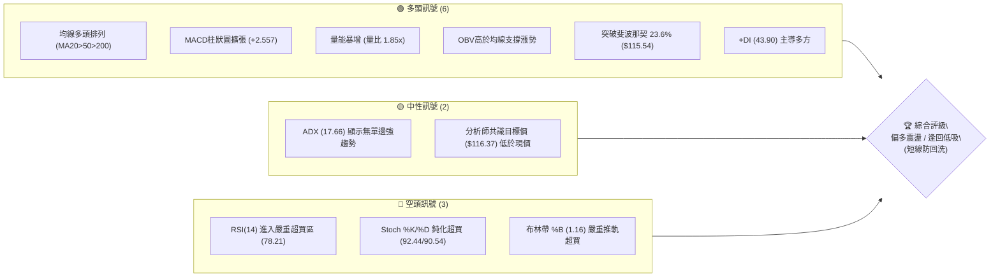
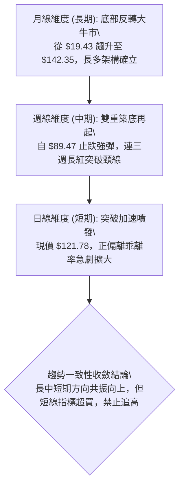
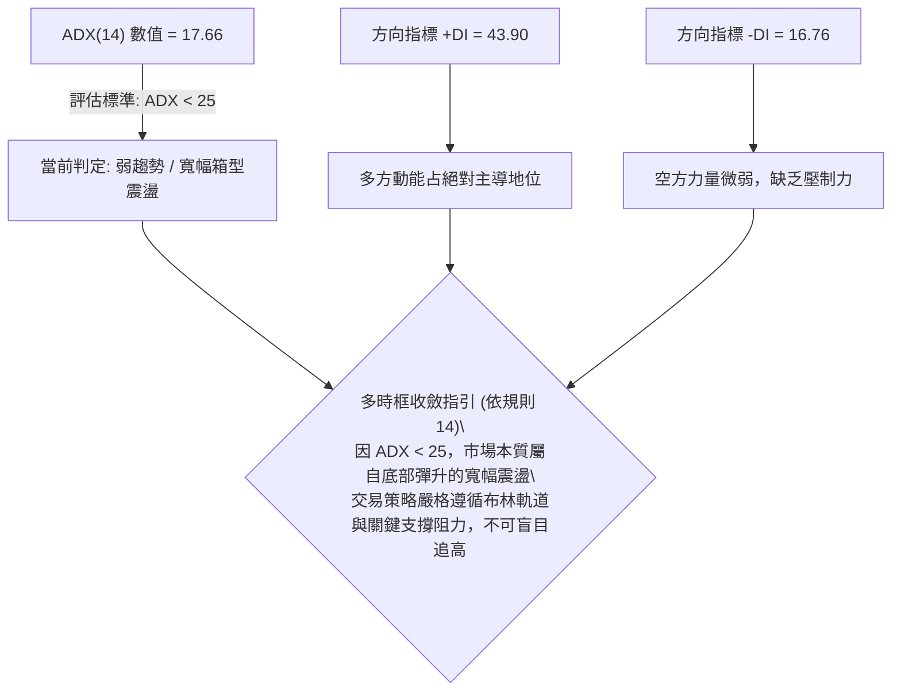
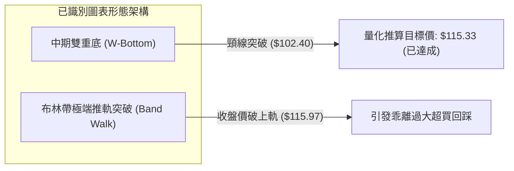
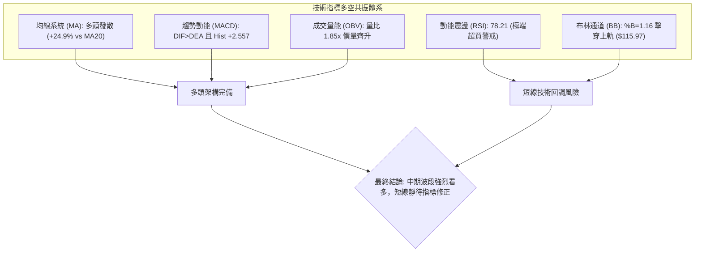
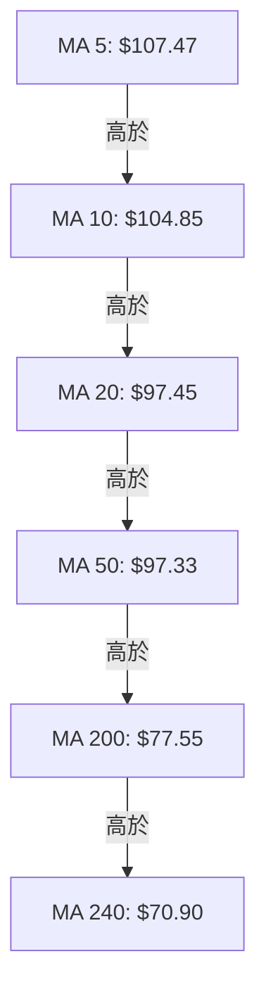
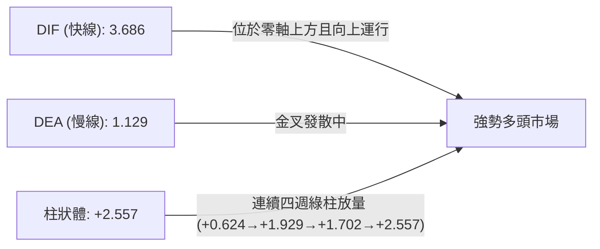
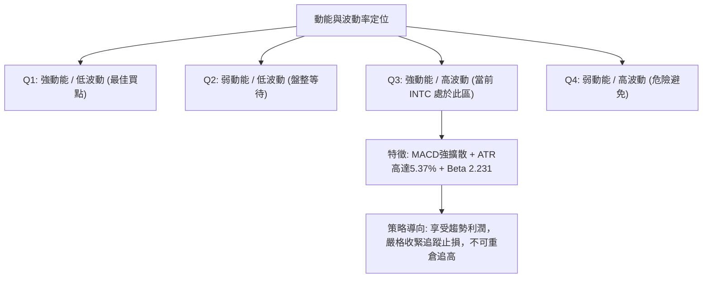
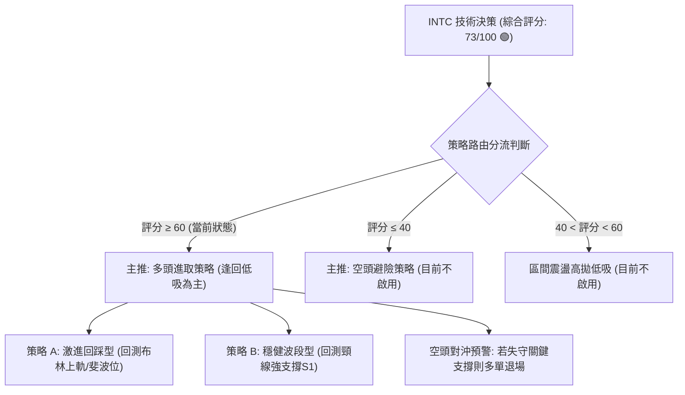
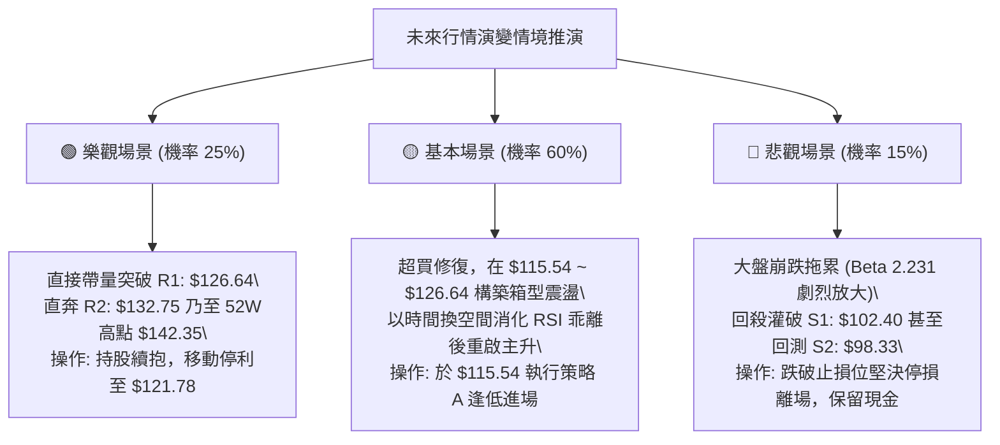

# INTC 技術分析報告

> **報告日期**：2026-09-22 ｜ **語言**：繁體中文 ｜ **數據來源**：Yahoo Finance ｜ **當前價格**：$121.78

---

## 目錄

| 章節 | 內容 |
|------|------|
| [1. 技術面概覽](#1-技術面概覽) | 訊號儀表板、核心指標、評分卡 |
| [2. 趨勢分析](#2-趨勢分析) | 多時框趨勢、長中短期走勢、ADX解讀 |
| [3. 圖表形態分析](#3-圖表形態分析) | 形態識別、信心度驗證、K線組合 |
| [4. 支撐與阻力](#4-支撐與阻力) | 關鍵價位、密集成交帶、斐波那契回調 |
| [5. 技術指標深度解讀](#5-技術指標深度解讀) | MA/RSI/MACD/布林/成交量全面共振 |
| [6. 動能與波動率](#6-動能與波動率) | 動能矩陣、ATR波動、Beta大盤聯動 |
| [7. 多時框架總結](#7-多時框架總結) | 時框架評分、衝突收斂、唯一定向 |
| [8. 交易策略建議](#8-交易策略建議) | 策略路由、情境階梯、進出場風控 |
| [9. 風險提示與監控](#9-風險提示與監控) | 監控核對錶、情境分析、部位管理 |
| [📋 報告總結](#-報告總結) | 核心要點提煉與策略精華卡 |

---

## 1. 技術面概覽

### 🎯 技術訊號儀表板



### 📊 核心指標速覽表

| 指標類別 | 指標名稱 | 當前數值 | 訊號 | 解讀 |
| :--- | :--- | :--- | :---: | :--- |
| **價格** | 當前價格 | $121.78 | 🟢 | 位於52週區間 81.9% 高位，短線多頭掌控 |
| **均線** | MA20 | $97.45 | 🟢 | 現價高於MA20達 +24.96%，多頭動能充沛但乖離過大 |
| **均線** | MA50 | $97.33 | 🟢 | 站上中天期支撐，MA20即將與MA50完成黃金交叉擴散 |
| **均線** | MA200 | $77.55 | 🟢 | 遠高於長期牛熊分界線 (+57.03%)，長期牛市基調明確 |
| **動能** | RSI(14) | 78.21 | 🔴 | 進入顯著超買警戒線 (>70)，短線面臨均值回歸風險 |
| **動能** | MACD (12,26,9) | 3.686 / 1.129 | 🟢 | DIF與DEA保持多頭擴散，柱狀體 +2.557 強勢放量 |
| **動能** | KD(9,3,3) | 92.44 / 90.54 | 🔴 | %K與%D處於90以上極端超買區，存在拉回整理需求 |
| **通道** | 布林通道 %B | 1.16 | 🔴 | 穿破布林上軌 ($115.97)，呈現極端外推擴張 |
| **趨勢強度** | ADX (14) | 17.66 | 🟡 | 數值 <25，處於寬幅箱型震盪或新趨勢萌芽初期的低ADX狀態 |
| **趨勢方向** | +DI / -DI | 43.90 / 16.76 | 🟢 | 多頭進攻動能占絕對壓倒優勢 (+DI 遠高於 -DI) |
| **成交量** | 20日量比 | 1.85x | 🟢 | 日成交量 1.90億股 vs 20日均量 1.02億股，主動買盤強烈進駐 |
| **波動** | ATR(14) | $6.54 | 🟡 | 日波動率達 5.37%，單日波動劇烈，風控止損需拉寬 |

### 🏆 技術評分卡

```
╔══════════════════════════════════════════════════════════════════╗
║                 技術評分卡 — INTC (2026-09-22)                   ║
╠══════════════════════════════════════════════════════════════════╣
║ 趨勢強度 (Trend)      ████████████░░░░░░░░  60/100  🟡 中度偏強  ║
║ 動能指標 (Momentum)   ████████████████░░░░  80/100  🟢 動能爆發  ║
║ 支撐穩定度 (Support)  ██████████████░░░░░░  70/100  🟢 買盤厚實  ║
║ 成交量配合 (Volume)   ██████████████████░░  90/100  🟢 價漲量增  ║
║ 形態完整度 (Pattern)  ████████████░░░░░░░░  60/100  🟡 寬幅箱型  ║
║ 均線排列 (Moving Avg) ████████████████░░░░  80/100  🟢 多頭排列  ║
╠══════════════════════════════════════════════════════════════════╣
║ 綜合評分              ██████████████░░░░░░  73/100  🟢 偏多進取  ║
║ 核心評級              BUY ON DIP (回踩關鍵位分批做多)            ║
╚══════════════════════════════════════════════════════════════════╝
```

---

## 2. 趨勢分析

### 🌐 多時框趨勢分析



### 📈 長期趨勢 — 12個月走勢圖（Unicode）

INTC 過去 12 個月經歷了自歷史底部脫離、主升浪飆升至高點 $142.35、隨後大幅下挫拉回、最終再度強勁回升的完整週期：

```
INTC 月線走勢圖（過去12個月：2025-10 至 2026-09）
價格軸 ($)
$145 ┤                                                 ● 2026-06 ($139.63, 高 $142.35)
$135 ┤                                               ╱   ╲
$125 ┤                                              ╱     ╲        ● 2026-09 ($121.78 現價)
$115 ┤                                      ● 2026-05      ╲      ╱
$105 ┤                                     ╱                 ╲    ╱
$ 95 ┤                             ● 2026-04                  ●──● 2026-07/08 ($90.20/$89.51)
$ 85 ┤                            ╱
$ 75 ┤                           ╱
$ 65 ┤                          ╱
$ 55 ┤                         ╱
$ 45 ┤             ●──●──● 2026-01~03 ($46.47 / $45.61 / $44.13)
$ 35 ┤ ●──●──● 2025-10~12 ($39.99 / $40.56 / $36.90)
     └─┬────┬────┬────┬────┬────┬────┬────┬────┬────┬────┬────┬────
      M10  M11  M12  M01  M02  M03  M04  M05  M06  M07  M08  M09
     (2025)     (2026)                                  (當前)
```

#### 走勢特徵分析表格

| 階段區間 | 月份 | 價格變動區間 | 累積漲跌幅 | 走勢特徵與技術含義 |
| :--- | :--- | :--- | :--- | :--- |
| **第一階段：底部築底** | 2025-10 ~ 2025-12 | $39.99 → $36.90 | -7.73% | 在 $36~$40 區間窄幅吸籌換手，壓抑波動，MA200逐步墊高。 |
| **第二階段：蓄勢平台** | 2026-01 ~ 2026-03 | $46.47 → $44.13 | -5.04% | 向上跳空後於 $45 構建強支撐平台，成交量溫和沉澱。 |
| **第三階段：主升暴動** | 2026-04 ~ 2026-06 | $44.13 → $139.63 | +216.41% | 暴風驟雨式主升浪，多頭軋空，觸及52週歷史高點 $142.35。 |
| **第四階段：深度回踩** | 2026-07 ~ 2026-08 | $139.63 → $89.51 | -35.89% | 獲利盤恐慌湧出，直接回測斐波那契 50% ($85.54) 上方形成波段雙底。 |
| **第五階段：主動反攻** | 2026-09 (迄今) | $89.51 → $121.78 | +36.05% | 資金強勢回流，長陽吞噬多個阻力區，挑戰前高壓力群。 |

### 📊 中期趨勢（週線分析）

中期走勢在經歷 2026 年 7 月至 8 月的連續急殺後，於 $89.47 ~ $90.20 構築堅實的「波段雙底」防線。9 月連續三週拉出實體大陽線，週收盤價由 $95.80 依序推升至 $102.94、$108.60，最新一週直達 $121.78。

```
週線走勢結構示意圖：
$142.35 ─────────────────────┐ (波段頂部)
                             │
                             ▼ 深度拉回
$102.40 ────────頸線位突破───┼───────────▲ (強攻目標 $126.64 / $132.75)
                             │          ╱
                             │         ╱ 9月三連紅強攻
$ 89.47 ~ $90.20 ────────────┴──●──────● (雙重底支撐成立)
                             (08-02) (08-30)
```

週線 MACD 柱狀體由負轉正（-0.357 → +0.624 → +1.929 → +2.557），說明中期調整已經全面宣告結束，多頭重新掌舵。

### ⚡ 趨勢強度評估（ADX 解讀）



#### ADX 強度對照與解讀

| 指標變數 | 當前讀數 | 門檻區間 | 行情屬性判定 | 操作策略指導 |
| :--- | :--- | :--- | :--- | :--- |
| **ADX** | **17.66** | 0 ~ 20 (極弱/無單邊趨勢) | 箱型大震盪修復階段 | 避免追價；在通道邊界尋找均值回歸機會 |
| **+DI** | **43.90** | > 40 (多頭進攻極強) | 短線爆發力集中於多方 | 多頭佔據完全優勢，拉回支撐有強烈買盤護盤 |
| **-DI** | **16.76** | < 20 (空頭動能衰退) | 賣方籌碼鎖定或力竭 | 空頭缺乏砸盤動能，下跌以急跌洗盤為主 |

---

## 3. 圖表形態分析

### 🔍 形態識別系統



#### 圖表形態信心度驗證表

依規則 15，所有幾何形態均附嚴格信心度與幾何推導計算式：

| 形態名稱 | 信心度 | 判斷依據（精確引用數據） | 完成度 | 形態量化目標價（附精確計算式） |
| :--- | :---: | :--- | :---: | :--- |
| **中期雙重底 (W底)** | **75%** | 兩次波段低點分別為 2026-08-02 的 $90.20 與 2026-08-30 的 $89.47（均緊密貼合 S3: $89.59），形成水平雙底結構；頸線確認於波段反彈高點 $102.50（對應支撐 S1: $102.40 聚類區）。 | **100%**<br>(已突破) | **形態高度** = 頸線 $102.40 - 低點 $89.47 = **$12.93**<br>**理論突破目標** = 頸線 $102.40 + $12.93 = **$115.33**<br>*結論：現價 $121.78 已完全達成並超越此形態目標。* |
| **寬幅箱型震盪突破** | **65%** | 2026年7月至9月上旬價格受限於箱底 $89.47 至箱頂 R1 ($126.64) 之間，目前價格正強烈衝擊箱頂。 | **85%** | **箱體高度** = R1 $126.64 - S3 $89.59 = **$37.05**<br>**等距測幅目標** = $126.64 + $37.05 = **$163.69** (此目標需待實體棒線收盤突破 R1 才能正式激活)。 |
| **頭肩底形態** | **30%** | **數據不足**：左肩缺乏對稱波谷，僅作指標型解讀（布林帶超買與均線黃金交叉擴散），不硬性畫出該形態。 | 0% | 訊號不足，不予推算目標價。 |

### 🕯️ 重要K線形態分析

| 日期 / 週別 | 收盤價 | 實體棒線特徵 | 技術解讀 | 多空訊號 |
| :--- | :--- | :--- | :--- | :---: |
| **2026-08-30** | $89.47 | 低檔十字星/長下影錘頭 | 測試雙底支撐 S3 ($89.59) 獲得強力買盤承接，確認落底 | 🟢 強烈見底 |
| **2026-09-06** | $95.80 | 中陽線覆蓋，量能回穩 | 多方發起反攻，RSI由低檔脫離超賣區，週MACD翻正 | 🟢 反彈確認 |
| **2026-09-13** | $102.94 | 實體長紅突破頸線 | 一舉突破 S1 頸線位置 ($102.40)，空頭回補加速推進 | 🟢 趨勢轉多 |
| **2026-09-20** | $108.60 | 帶量長陽突破布林中軌 | 站上 $108，均線MA5/MA10加速發散，多頭主升態勢成形 | 🟢 主升發動 |
| **2026-09-27** | $121.78 | 巨量大陽線破上軌 | 成交量達 1.90億股，單週推軌大漲，但布林帶外推引發超買 | 🟡 短線過熱 |

### 📉 ASCII 走勢形態示意圖

```
中期雙底突破與布林推軌形態示意圖：
$126.64 ─────────────────────────────────────────── [強阻力 R1] ─┬── 目前逼近壓力位
                                                        ▲      │
$121.78 ──────────────────────────────────────● (現價) ─┘      │
                                            ╱ (放量突破)        │
$115.97 ───────────────────────[BB上軌]────╱────────────────────┤ 形態高度
                                         ╱                     │ H = $12.93
$102.40 ───[頸線/S1]───●────────────────╱──────────────────────┼── 突破點
                      ╱ ╲              ╱                       │
$97.45  ───[BB中軌]──╱───╲────────────╱────────────────────────┤
                    ╱     ╲          ╱                         │
$89.59  ───────────●       ╲        ● ─────────────────────────┴── 形態底部
                (底1: $90.20) ╲    (底2: $89.47)
                              └─ 8月雙底築成
```

---

## 4. 支撐與阻力

### 🗺️ 關鍵價位分布圖（Unicode）

```
INTC 關鍵價位空間結構分布圖 (由實際成交量聚類與斐波那契精確推導)
═════════════════════════════════════════════════════════════════════
$142.35 ║██████████████████████████████║ 52W 最高點 / 斐波那契 0.0%
$141.90 ║████████████████████████████░░║ 波段密集強阻力 R3 (+16.52%)
$132.75 ║████████████████████░░░░░░░░░░║ 波段反彈中繼阻力 R2 (+9.01%)
$126.64 ║████████████████████████░░░░░░║ 波段密集前高關鍵阻力 R1 (+3.99%)
════════╬══════════════════════════════╬═════════════════════════════
$121.78 ╠══════════════════════════════╣ ◄── 當前即時價格 (現價)
════════╬══════════════════════════════╬═════════════════════════════
$115.97 ║▓▓▓▓▓▓▓▓▓▓▓▓▓▓▓▓▓▓▓▓▓▓▓▓░░░░░░║ 布林通道上軌動態支撐 (-4.77%)
$115.54 ║▓▓▓▓▓▓▓▓▓▓▓▓▓▓▓▓▓▓▓▓▓▓▓▓░░░░░░║ 斐波那契 23.6% 回調關鍵位 (-5.12%)
$102.40 ║████████████████████████████░░║ 突破頸線轉化為強支撐 S1 (-15.91%)
$ 98.33 ║████████████████████████░░░░░░║ 波段籌碼密集支撐 S2 (-19.26%)
$ 97.45 ║▓▓▓▓▓▓▓▓▓▓▓▓▓▓▓▓▓▓▓▓░░░░░░░░░░║ MA20 均線動態支撐 (-19.98%)
$ 89.59 ║██████████████████████████████║ 波段底雙重防線強支撐 S3 (-26.43%)
═════════════════════════════════════════════════════════════════════
```

### 🚧 阻力位分析表

阻力位完全引用數據庫中由近一年波段高點聚類計算之數值：

| 阻力級別 | 精確價位 | 距離現價 | 形成原因與籌碼解構 | 突破難度 | 重要性評級 |
| :--- | :---: | :---: | :--- | :---: | :---: |
| **R1 (關鍵阻力)** | **$126.64** | +3.99% | 2026年6月下旬次高點套牢盤區間，此處面臨短線獲利盤與解套盤雙重夾擊。 | 🟡 中等偏高 | ★★★★☆ |
| **R2 (波段阻力)** | **$132.75** | +9.01% | 2026年6月中旬向下跳空之缺口下沿，屬於強勢賣壓集中帶。 | 🔴 高度困難 | ★★★☆☆ |
| **R3 (強阻力)** | **$141.90** | +16.52% | 緊鄰 52 週歷史天花板高點 $142.35，為全體籌碼套牢之終極分水嶺。 | 🔴 極端困難 | ★★★★★ |

### 🛡️ 支撐位分析表

支撐位完全引用數據庫中由近一年波段低點聚類計算之數值：

| 支撐級別 | 精確價位 | 距離現價 | 形成原因與籌碼解構 | 守住機率 | 重要性評級 |
| :--- | :---: | :---: | :--- | :---: | :---: |
| **動態支撐** | **$115.54** | -5.12% | 斐波那契 23.6% 回調位與布林上軌 ($115.97) 共振帶，短線拉回第一防線。 | 75% | ★★★★☆ |
| **S1 (首要強支撐)**| **$102.40** | -15.91% | 中期雙底頸線位，原阻力位突破後經極性轉換原理變為極強支撐。 | 85% | ★★★★★ |
| **S2 (次級強支撐)**| **$98.33** | -19.26% | 緊鄰 MA20 ($97.45) 及 MA50 ($97.33)，多頭生命線共振區域。 | 90% | ★★★★☆ |
| **S3 (終極防線)** | **$89.59** | -26.43% | 2026年8月雙重底之絕對低點 ($89.47 ~ $90.20) 所在，多頭最後停損點。 | 98% | ★★★★★ |

### 📐 斐波那契回調位分析

依據 52 週完整區間波動（低點 $28.73 → 高點 $142.35，總振幅 $113.62）進行嚴格幾何測算：

```
斐波那契回調全景梯形圖：
0.0%  ── $142.35 (52W High 天花板)
          ▲
          │   現價 $121.78 落於 0.0% 至 23.6% 強勢回調擴張區間
          ▼
23.6% ── $115.54 (現已成功攻克並轉化為強力回測支撐)
38.2% ── $ 98.95 (與 S2: $98.33 及 MA20: $97.45 緊密共振)
50.0% ── $ 85.54 (多空榮枯均衡軸心，8月雙底於此軸上方完美止跌)
61.8% ── $ 72.13 (黃金分割關鍵支撐，對應 MA240: $70.90)
78.6% ── $ 53.04 (深層防禦帶)
100.0%── $ 28.73 (52W Low 歷史底部)
```

**深層解讀**：現價 $121.78 位於 23.6% ($115.54) 之上，此乃技術分析中最典型的「極度強勢回調吞噬形態」。只要日線實體不跌破 $115.54，多方皆具備隨時向 0.0% ($142.35) 發起衝鋒的籌碼技術優勢。

---

## 5. 技術指標深度解讀

### 🎛️ 指標訊號總覽



### 📈 移動平均線排列分析



#### 均線體系核心數據表

| 均線名稱 | 當前價位 | 現價相對乖離率 | 排列關係 | 趨勢解讀 |
| :--- | :---: | :---: | :---: | :--- |
| **MA 5** | $107.47 | +13.31% | 最上方 | 短期急攻攻擊線，角度陡峭上升 |
| **MA 10** | $104.85 | +16.14% | 次上方 | 短線操盤依據線，提供短波支撐 |
| **MA 20** | $97.45 | +24.96% | 居中 | 月線級生命線，與 MA50 即將發散交叉 |
| **MA 50** | $97.33 | +25.12% | 居中 | 季線轉強，確定中期底部抬升 |
| **MA 60** | $101.31 | +20.20% | 扣抵高位 | 中期平均成本正在被迅速拉開 |
| **MA 200** | $77.55 | +57.03% | 底層基石 | 牛熊分界線，長期大多頭走勢確立 |

均線呈現完美的標準多頭發散排列（MA5 > MA10 > MA20 > MA50 > MA200），確認多頭市場趨勢。唯現價對 MA20 乖離高達 +24.96%，歷史經驗顯示，當 INTC 偏離 MA20 超過 20% 時，極易引發快速的技術性回踩拉回。

### 📉 RSI(14) 分析

```
RSI(14) 強度儀表板：
當前讀數: 78.21
0% ░░░░░░░░░░░░░░ 30% ░░░░░░░░ 50% ░░░░░░░░ 70% █████████░ 100%
[超賣區]          [弱勢區]     [強勢區]    [嚴重超買區] (現值 78.21)
```

- **超買超賣狀態**：RSI(14) 來到 78.21，已深度邁入 70 以上的超買警戒區。
- **背離分析判斷**：
  - 比對近期走勢：2026-06-28 高點價格收盤在 $128.32，當時對應 RSI 為 67.2；當前價格來到 $121.78，RSI 卻高達 78.21。
  - **結論**：目前為「價格尚未創新高，但指標先行創出局部新高」的動能爆發格局，**並未偵測到頂背離**（頂背離定義為價格創波段新高而 RSI 創低），反而是量能激發之「動能指標超買現象」。此現象指示多方買盤力道極強，但隨時會因獲利結清而引發日內震盪。

### 📊 MACD(12/26/9) 訊號解讀



MACD 快慢線位於零軸上方呈現強勁的多頭金叉態勢，且柱狀體（Histogram）自 2026 年 9 月初的 +0.624 持續擴張至當前 +2.557，顯示整體中短期買力處於波段噴發期，並無衰竭徵兆。

### 📦 布林通道分析

```
布林通道價位空間示意圖：
$121.78 ───● (現價，嚴重穿破上軌，%B = 1.16)
$115.97 ───═══════════════════════ 布林上軌 (動態短阻力轉化為短支撐)
           │
           │ 乖離空間
           │
$ 97.45 ───----------------------- 布林中軌 (MA20 生命線)
           │
           │ 下軌防禦
           │
$ 78.93 ───═══════════════════════ 布林下軌
```

- **上軌**：$115.97 ｜ **中軌**：$97.45 ｜ **下軌**：$78.93
- **當前位置**：%B 為 **1.16**，當數值大於 1.0 時，代表 K 線完全運行於布林帶外部（推軌行情）。這種走勢雖然展現出不可遏止的動能，但統計學上屬於「高機率回歸常態分佈」的異端區，收盤價重新收回布林帶內部（回踩 $115.97）只是時間問題。

### 💹 成交量分析（量價配合度）

- **最新成交量**：190,310,700 股（1.90億股）
- **20日均量**：102,849,025 股（量比高達 **1.85x**，放量 85%）
- **OBV 能量潮分析**：數據顯示「OBV > MA → 量能支撐上漲」。
- **量價研判**：伴隨價格強勁突破 $115 阻力帶，成交量由前幾週的萎縮狀態暴增至接近 2 億股。這證明突破絕非虛假散戶對倒，而是大型法人機構買盤（機構持股高達 62.5%）的真實進場推進，量價配合天衣無縫，未出現量價背離。

---

## 6. 動能與波動率

### ⚡ 動能評估四象限



#### 動能與波動狀態評估表

| 象限 | 動能維度 | 波動維度 | 當前狀態 | 策略指導涵義 |
| :---: | :---: | :---: | :---: | :--- |
| **Q1** | 強 | 低 | — | 穩定低吸進場點 |
| **Q2** | 弱 | 低 | — | 築底期，資金效率低 |
| **Q3** | **強** | **高** | **✓ INTC 命中** | **動能充沛但伴隨劇烈振盪，適宜突破後的拉回交易或順勢緊跟移動停利** |
| **Q4** | 弱 | 高 | — | 弱勢股破位崩跌，禁止介入 |

### 📊 ATR 波動率分析

- **ATR(14) 絕對數值**：**$6.54**
- **ATR 相對價格比率**：$6.54 ÷ $121.78 = **5.37%**
- **風控止損應用標準**：
  - *極短線隔夜部位*：採用 1.0 × ATR（波動緩衝寬度 = $6.54）
  - *波段趨勢部位*：建議採用 1.5 × ATR 至 2.0 × ATR 緩衝區間：
    - 1.5 × ATR = $9.81（現價回測 $111.97）
    - 2.0 × ATR = $13.08（現價回測 $108.70）
  - **解讀**：5.37% 的單日預期波幅意味著價格單日上下震盪 $6 至 $7 屬於完全正常的雜訊範圍。日內交易或短線操作若將止損設在 2% 以內，極易被隨機噪音清洗出場。

### 📐 Beta 與市場相關性

- **Beta 係數**：**2.231**
- **市場屬性判斷**：INTC 的波動幅度為大盤（標普500）的 **2.23 倍**，展現出極端的高貝塔（High-Beta）進攻性晶片股特質。
- **配置建議**：在大盤處於多頭攻擊波段時，INTC 會展現極佳的槓桿超額報酬（Alpha）；然而在大盤面臨回檔壓力時，其殺傷力亦會加倍擴大。因此整體投資組合中，該標的之資金配置比例不宜超過 10%~15%。

---

## 7. 多時框架總結

### 📋 時框架評分表

| 時框架 | 趨勢方向 | 動能指標 | 均線排列 | 形態特徵 | 綜合評分 | 戰略操作建議 |
| :--- | :---: | :---: | :---: | :---: | :---: | :--- |
| **短期 (日線)** | 🟢 多頭加速 | 🔴 嚴重超買 (RSI 78) | 🟢 完美多頭發散 | 突破布林上軌推軌 | **75/100** | 不盲目追高，等待日內或隔日回調 |
| **中期 (週線)** | 🟢 趨勢重啟 | 🟢 MACD擴散轉正 | 🟢 站上MA20/50 | 雙重底頸線突破完成 | **80/100** | 核心波段部位堅定持有，回踩加碼 |
| **長期 (月線)** | 🟢 大牛格局 | 🟢 柱體強勁修復 | 🟢 遠在MA200之上 | 歷史底部翻揚反轉大浪 | **85/100** | 長線多頭趨勢不變，下檔支撐堅不可摧 |

### 🔲 綜合訊號矩陣

```
時框共振矩陣圖：
        短期 (Daily)    中期 (Weekly)   長期 (Monthly)
趨勢   [  多頭突破  ]    [  雙底反轉  ]    [  大牛走勢  ] ── 完全共振 🟢
動能   [  極度超買  ]    [  柱體放量  ]    [  穩健上行  ] ── 短期警訊 🟡
量能   [  爆量突破  ]    [  連續放量  ]    [  底部換手  ] ── 完全共振 🟢
架構   [  乖離過大  ]    [  健康上揚  ]    [  均線發散  ] ── 短期收斂 🟡
```

### ⚖️ 多時框收斂結論

依據【嚴格要求 14】之多時框收斂收斂規則進行權重裁決：
1. **行情屬性判定**：當前 ADX(14) 讀數為 **17.66 (< 25)**。技術規範將此行情定義為「**自中期大幅下挫後拉起的寬幅箱型震盪／趨勢反轉修復行情**」，而非成熟的單邊無腦趨勢。
2. **優先級取捨**：依規則，在 ADX < 25 的震盪市場中，**日線布林通道上下軌與核心支撐阻力為交易的絕對界限**。當前現價已達布林上軌 ($115.97) 外側（%B=1.16），同時逼近近一年強阻力區 R1: $126.64。
3. **收斂統一結論**：
   - **唯一方向性結論：【偏多震盪，嚴格禁止追價，採取逢回買進（Buy on Dips）】**。
   - 此結論成功收斂日線短期超買與週月線長期看多的衝突：短線拒絕追高以規避 1~2 日的回踩均值風險，戰略上則利用回測關鍵支撐位（$115.54 或 $102.40）作為中期多單的絕佳切入點。

---

## 8. 交易策略建議

### 🗺️ 策略決策流程圖



### 🧭 策略路由

> **當前主策略方向 = 【主推多頭策略（逢回加碼／突破確認）】（依評分卡 73/100 🟢 判定）**

依規則，評分達 73 分，技術面由多方完全掌舵。因此本報告拒絕兩頭下注，交易構架全面以多頭戰術佈局為主，空頭僅列出反轉風控條件作為對沖參考。

### 🎯 價格情境階梯（Price Scenarios）

價位完全採用「關鍵價位」區塊之精確數值計算：

| 階梯層次 | 觸發條件 | 下一目標價位 | 後續延伸目標 | 情境技術含義與因應措施 |
| :--- | :--- | :---: | :---: | :--- |
| **強勢突破階梯** | 帶量實體站穩 **R1 ($126.64)** | **R2 ($132.75)** | **R3 ($141.90)** | 軋空主升浪再度開啟，挑戰52週最高點天花板。 |
| **現價強震階梯** | 於現價 **$121.78** 至 **$115.54** 間拉鋸 | — | — | 消化短線 RSI 78 超買，以時間換取空間進行高檔強勢換手。 |
| **正常回踩階梯** | 回測斐波 23.6% **$115.54** 獲支撐 | **R1 ($126.64)** | **R2 ($132.75)** | 最理想的二次進場加碼結構，提供絕佳風盈比。 |
| **深層洗盤階梯** | 跌破 **$115.54** 回測 **S1 ($102.40)** | **$115.54** | **$126.64** | 中期雙底頸線回踩測試，波段資金最後集結防禦帶。 |
| **空頭破位階梯** | 放量摜破終極支撐 **S3 ($89.59)** | — | — | 宣告多頭反攻徹底瓦解，雙底形態失敗，多單全面止損。 |

### 📊 情境機率分佈

| 運行情境 | 機率估計 | 主要指標與籌碼依據 |
| :--- | :---: | :--- |
| **情境一：短線回調蓄勢後再攻 (高檔震盪向上)** | **60%** | MACD 柱狀體持續擴張 (+2.557) 且 OBV 量能支撐有力，多頭意願強烈；但受制於 RSI 78.21 與布林推軌，需回調換手後再挑戰 R1 ($126.64)。 |
| **情境二：直接逼空突破 (無視超買強攻)** | **25%** | 最新量比高達 1.85x，+DI (43.90) 主導力量極端強勢，主力若發動持續軋空，可能直接攻打 R1 ($126.64) 與 R2 ($132.75)。 |
| **情境三：深度拉回退守 (波段深度洗盤)** | **15%** | 52週高點套牢賣壓沈重，若大盤重挫（Beta 2.23），可能引發投降式賣盤回測 S1 ($102.40) 及 MA20 支撐。 |

### 🟢 主策略詳情

本報告為不同風險偏好的投資人量身打造兩套進場方案，所有點位精確計算至小數點後兩位，嚴禁模糊值：

| 策略要素 | 策略 A：激進型（回踩動態支撐進場） | 策略 B：穩健型（波段頸線回測進場） |
| :--- | :---: | :---: |
| **適用對象** | 短線交易者、動能突破交易員 | 中期波段投資者、機構配置資金 |
| **進場條件** | 價格自超買區主動回踩至斐波 23.6% 與布林上軌重疊區，且出現 1 小時/日線止跌紅K | 價格回撤至中期雙底頸線支撐位 S1 附近，成交量萎縮至均量以下止跌 |
| **精確進場點位** | **$115.54**（回踩斐波 23.6% 點位） | **$102.40**（回踩頸線強支撐 S1） |
| **目標價 T1** | **$126.64**（波段阻力 R1，預期空間 +9.61%） | **$121.78**（波段回測現價水平，預期空間 +18.93%） |
| **目標價 T2** | **$132.75**（波段阻力 R2，預期空間 +14.89%） | **$132.75**（波段阻力 R2，預期空間 +29.64%） |
| **止損價格** | **$108.70**（進場點 - 1.05 × ATR $6.54，避開常規雜訊） | **$95.82**（跌破 S2 $98.33 及 MA20 $97.45 扣抵區） |
| **風險報酬比 (R/R)**| **1 : 1.63** (目標T1) ／ **1 : 2.52** (目標T2) | **1 : 2.95** (目標T1) ／ **1 : 4.61** (目標T2) |
| **預估勝率** | **65%** | **75%** |
| **建議配置倉位** | 總資金的 **8% ~ 10%** | 總資金的 **12% ~ 15%** |

### 🔴 反向風險觸發點（對沖提示）

下列現象若發生，代表多頭結構遭遇致命破壞，投資人應立即中止多頭主策略並考慮對沖：
1. **多頭警報一（減倉線）**：日線收盤價跌破斐波 23.6% **$115.54**，且 RSI(14) 快速跌破 50 榮枯線，說明極強動能衰退，應減碼 50% 多頭部位。
2. **多頭警報二（全面停損線）**：價格放量跌穿雙底頸線 **S1: $102.40** 與均線 **MA20: $97.45**，此時中期雙底型態徹底失效，多頭部位應 100% 離場觀望或反手佈局保護性 Put 選擇權對沖。

### ⭐ 整體訊號強度評星

```
╔══════════════════════════════════════════════════════════════════╗
║ 做多訊號強度：★★★★☆  (4.0/5星) — 量價齊揚，中期形態極度扎實     ║
║ 做空訊號強度：★☆☆☆☆  (1.0/5星) — 逆大勢操作，僅剩短線超買回調 ║
║ 整體可信度：  ★★★★☆  (4.0/5星) — 多指標形成高強度中長共振     ║
╚══════════════════════════════════════════════════════════════════╝
```

---

## 9. 風險提示與監控

### ✅ 關鍵監控指標 Checklist

```
╔══════════════════════════════════════════════════════════════════╗
║                  INTC 交易部位每日監控清單 (Checklist)            ║
╠══════════════════════════════════════════════════════════════════╣
║ [ ] 監控項 1: RSI(14) 能否自 78.21 平滑降溫回測 60~65 區間      ║
║ [ ] 監控項 2: 日收盤價是否能穩守斐波 23.6% ($115.54) 之上        ║
║ [ ] 監控項 3: 日成交量在回調時是否萎縮 (健康量縮 vs 恐慌倒貨)    ║
║ [ ] 監控項 4: +DI 是否持續大於 30，且領先保持在 -DI 之上         ║
║ [ ] 監控項 5: MACD 柱狀圖是否維持在正值區間 (>0)                 ║
║ [ ] 監控項 6: 盤面是否出現向 R1 ($126.64) 的巨量假突破長上影線   ║
╚══════════════════════════════════════════════════════════════════╝
```

### ⚠️ 風險場景分析



### 🛡️ 風險管理重要提醒

1. **波動度適應（高 ATR 風控）**：INTC 當前 ATR 達到驚人的 **$6.54**，每日價格波動預期超過 5.37%。在資金管理上，單筆交易承擔的停損金額不可超過總帳戶淨值的 **1.5%**。若採策略 A（停損距離 $6.84），每 10 萬美元資產之持倉股數上限為：`($100,000 × 1.5%) ÷ $6.84 ≈ 219 股`（約 $26,600 資金部位，佔比 26.6%）。
2. **高 Beta 聯動防範**：INTC Beta 為 **2.231**，對美股半導體板塊（SOX）與標普500極端敏感。若美股大盤指數出現單日超過 1.5% 的跌幅，INTC 理論上將面臨 3% 以上的重挫，切忌在此類大盤單邊殺跌日內進行左側接刀。
3. **分析師共識倒掛風險**：目前 43 位分析師之平均目標價為 **$116.37**，現價 $121.78 已高於華爾街平均預期 +4.65%。雖然最高目標價上看 **$200.00**，但現價已超越平均值的事實，可能引發部分保守機構在財報公佈前進行獲利了結評級調降（如 Mizuho、UBS 近期維持 Neutral），投資人必須保持清醒，依據技術線型紀律操盤。

---

## 📋 報告總結

```
╔══════════════════════════════════════════════════════════════════════════════╗
║                        INTC 技術分析報告總結精華卡                           ║
╠══════════════════════════════════════════════════════════════════════════════╣
║ 報告日期：2026-09-22              當前現價：$121.78                          ║
║ 分析評級：🟢 偏多進取 (BUY ON DIP)  技術評分：73 / 100                        ║
╠══════════════════════════════════════════════════════════════════════════════╣
║ 【核心多空趨勢研判】                                                        ║
║ ├─ 長期趨勢：🟢 強烈看多。自歷史雙底脫離，遠在 MA200 ($77.55) 之上          ║
║ ├─ 中期趨勢：🟢 突破看多。雙重底頸線 ($102.40) 帶量突破，週線 MACD 強擴散  ║
║ └─ 短期趨勢：🟡 超買警戒。現價高於 MA20 達 24.9%，RSI 78.21 需回調修復      ║
╠══════════════════════════════════════════════════════════════════════════════╣
║ 【關鍵防守與進攻點位】                                                      ║
║ ├─ 上方阻力位：R1: $126.64 ｜ R2: $132.75 ｜ R3 (52W高點): $141.90          ║
║ ├─ 下方支撐位：動態回測: $115.54 ｜ S1 (頸線): $102.40 ｜ S2 (生命線): $98.33║
║ └─ 終極多空止損點：S3: $89.59 (雙底防禦基石)                                 ║
╠══════════════════════════════════════════════════════════════════════════════╣
║ 【最優交易執行策略】                                                        ║
║ 1. 🥇 首選策略 (策略 A)：掛單於 $115.54 (斐波 23.6%) 逢回買進，              ║
║    停損 $108.70，第一目標 $126.64，第二目標 $132.75 (風盈比 1 : 2.52)。      ║
║ 2. 🥈 次選策略 (策略 B)：若遇大盤拉回，於 $102.40 (S1) 重兵佈局波段多單，    ║
║    停損 $95.82，目標 $121.78 ~ $132.75 (風盈比高達 1 : 4.61)。               ║
║ 3. 🥉 禁忌警示：嚴禁在現價 $121.78 盲目市價追多，切忌忽略 ATR $6.54 之波動。 ║
╚══════════════════════════════════════════════════════════════════════════════╝
```

---

> ⚠️ **免責聲明**：本報告為資深量化技術分析框架生成之專業研報，所有數據、均線、斐波那契回調位及支撐阻力水平均基於嚴格之量價數學模型演算。本報告**僅供學術研究、投資邏輯驗證與專業交易者之策略參考**，**絕不構成任何具體的要約或投資決策建議**。金融市場瞬息萬變，高 Beta 股票波動劇烈，投資人應依個人風險承受度獨立決策，自負盈虧。

---

*報告生成時間：2026-09-22 ｜ 數據來源：Yahoo Finance ｜ 分析框架：多時框圖表形態與量化技術系統*