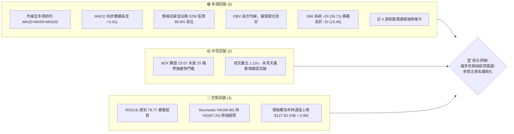
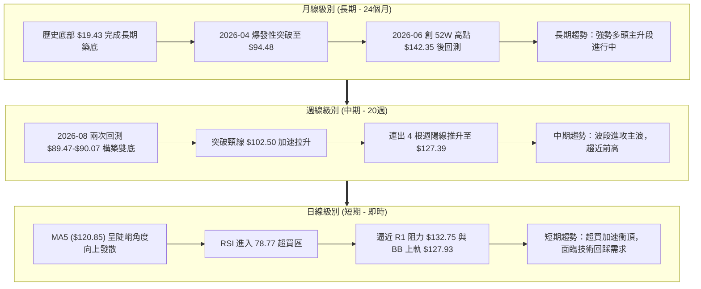
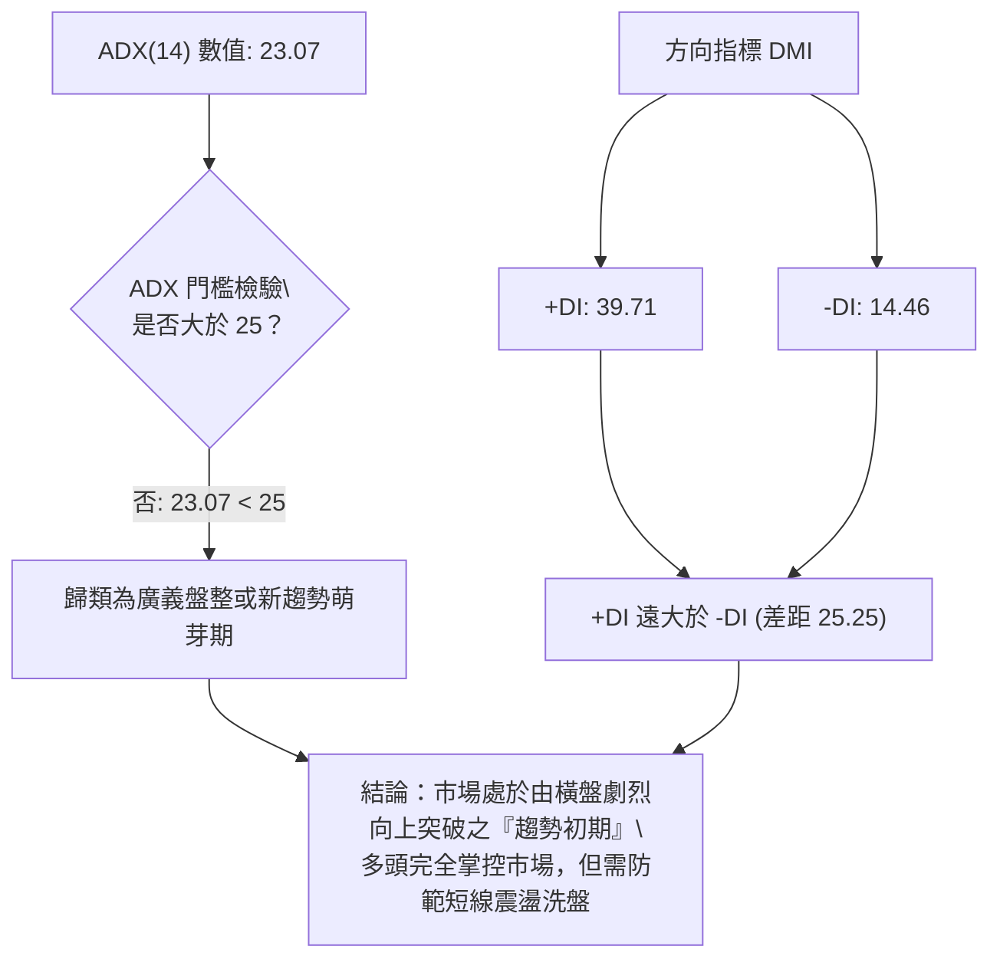
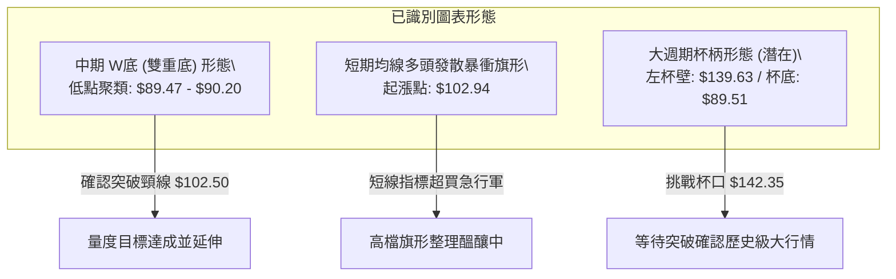
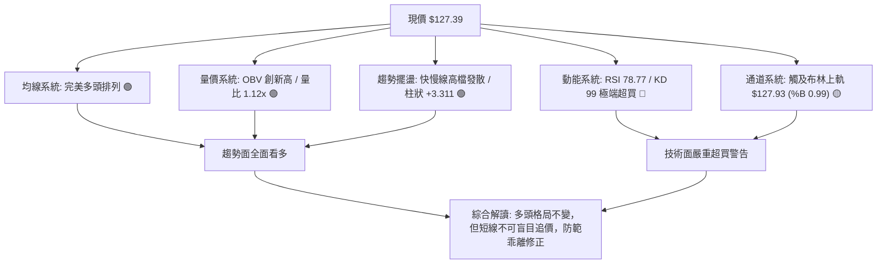
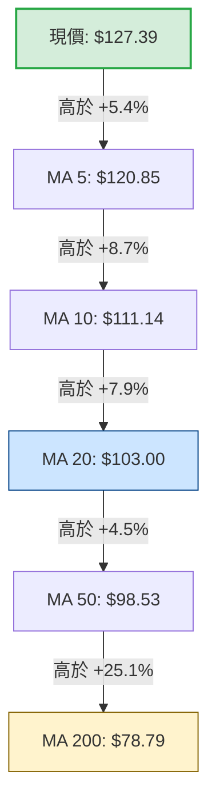
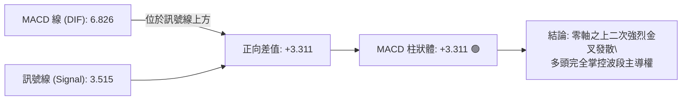
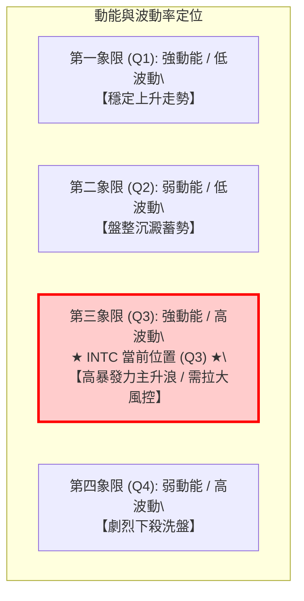
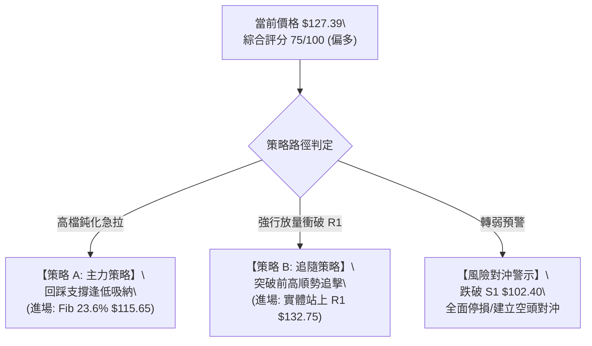
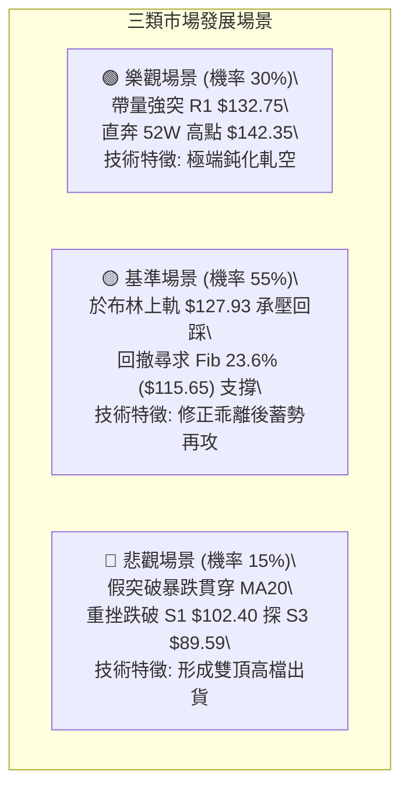

# INTC 技術分析報告

> **報告日期**：2026-09-25 ｜ **語言**：繁體中文 ｜ **數據來源**：Yahoo Finance ｜ **當前價格**：$127.39

---

## 目錄

| 章節 | 內容 |
|------|------|
| [1. 技術面概覽](#1-技術面概覽) | 訊號儀表板、核心指標、評分卡 |
| [2. 趨勢分析](#2-趨勢分析) | 多時框趨勢、長中短期走勢 |
| [3. 圖表形態分析](#3-圖表形態分析) | 形態識別、K線組合、目標價 |
| [4. 支撐與阻力](#4-支撐與阻力) | 關鍵價位、斐波那契回調 |
| [5. 技術指標深度解讀](#5-技術指標深度解讀) | MA/RSI/MACD/布林/成交量 |
| [6. 動能與波動率](#6-動能與波動率) | 動能評估、ATR、Beta |
| [7. 多時框架總結](#7-多時框架總結) | 時框架評分矩陣 |
| [8. 交易策略建議](#8-交易策略建議) | 多空策略、風險報酬比 |
| [9. 風險提示與監控](#9-風險提示與監控) | 監控指標、風險場景 |

---

## 1. 技術面概覽

### 🎯 技術訊號儀表板



### 📊 核心指標速覽表

| 指標類別 | 指標名稱 | 當前數值 | 訊號 | 解讀 |
|----------|----------|----------|------|------|
| **價格** | 當前價格 | $127.39 | 🟢 | 處於 52 週高低區間 86.8% 水位，強勢多頭格局 |
| **均線** | MA20 | $103.00 | 🟢 | 現價高於 MA20 達 +23.68%，短期乖離偏大 |
| **均線** | MA50 | $98.53 | 🟢 | 現價大幅高於 MA50，中期多頭結構穩固 |
| **均線** | MA200 | $78.79 | 🟢 | 現價遠高於長期生命線，長期趨勢全面翻多 |
| **均線** | 排列狀態 | MA20>MA50>MA200 | 🟢 | 標準完美多頭排列，各週期均線一致向上擴散 |
| **動能** | RSI(14) | 78.77 | 🔴 | 進入 >70 嚴重超買區，隨時面臨獲利了結回檔 |
| **動能** | MACD (12,26,9) | 6.826 / 3.515 | 🟢 | 快慢線均在零軸上方發散，柱狀圖 +3.311 擴張 |
| **動能** | Stoch %K / %D | 99.86 / 97.26 | 🔴 | 處於頂部極端鈍化，短線追高盈虧比極差 |
| **趨勢** | ADX(14) / DMI | 23.07 (+DI: 39.71) | 🟡 | +DI 強勢但 ADX<25，屬廣義盤整轉趨勢之初段 |
| **通道** | 布林通道 (%B) | 0.99 (上軌 $127.93) | 🟡 | 價格緊貼上軌運行，有通道外擴或受阻壓回風險 |
| **成交量** | 量比 / OBV | 1.12x / 偏多 | 🟢 | 量能溫和放大高於 20MA，OBV 證實資金淨流入 |
| **波動** | ATR(14) | $6.92 (5.44%) | 🟡 | 單日波動幅度劇烈，持倉風控與止損空間須拉大 |

### 🏆 技術評分卡

```
╔══════════════════════════════════════════════════════════════════╗
║                   技術評分卡 — INTC (2026-09-25)                 ║
╠══════════════════════════════════════════════════════════════════╣
║ 趨勢強度 (Trend)     ██████████████░░░░░░  70/100  🟢 中強多頭  ║
║ 動能指標 (Momentum)  ████████████░░░░░░░░  60/100  🟡 極端超買  ║
║ 支撐穩定度 (Support) ████████████████░░░░  80/100  🟢 底層扎實  ║
║ 成交量配合 (Volume)  ██████████████░░░░░░  70/100  🟢 溫和放量  ║
║ 形態完整度 (Pattern) ██████████████░░░░░░  70/100  🟢 雙底突破  ║
║ 均線排列 (MA System) ████████████████████ 100/100  🟢 完美排列  ║
╠══════════════════════════════════════════════════════════════════╣
║ 綜合評分             ███████████████░░░░░  75/100  🟢 強勢多頭  ║
╚══════════════════════════════════════════════════════════════════╝
```

---

## 2. 趨勢分析

### 🌐 多時框趨勢分析



### 📈 長期趨勢 — 12個月走勢圖（Unicode）

```
INTC 月線走勢圖（過去12個月：2025-10 至 2026-09）
價格軸 ($)
$145 ┤                                                 ● $139.63 (2026-06)
$130 ┤                                                    ● $127.39 (現價)
$115 ┤                                           ● $114.68
$100 ┤                                  ● $94.48       ● $90.20  ● $89.51
$85  ┤
$70  ┤
$55  ┤
$40  ┤ ● $39.99  ● $40.56  ● $36.90  ● $46.47  ● $45.61  ● $44.13
$25  ┤
     └────────────────────────────────────────────────────────────────────────────
        25-10    25-11    25-12    26-01    26-02    26-03    26-04    26-05    26-06    26-07    26-08    26-09
```

#### 走勢特徵分析表格

| 階段區間 | 起始-結束價位 | 漲跌幅 | 走勢特徵分析 | 量能與均線狀態 |
|----------|---------------|--------|--------------|----------------|
| **底層打底期** (2025-10 ~ 2026-03) | $39.99 → $44.13 | +10.35% | 在 $36.90-$46.47 區間箱型橫盤沉澱，洗滌浮額 | 波動壓縮，MA200 開始由平翻揚 |
| **暴力主升期** (2026-03 ~ 2026-06) | $44.13 → $139.63 | +216.41% | 連續單邊大陽線噴發，突破歷史重大壓力，創 52W 高點 $142.35 | 成交量急劇擴大，單週常態爆量 |
| **波段洗盤期** (2026-06 ~ 2026-08) | $139.63 → $89.51 | -35.89% | 高檔獲利回吐，大幅下殺回測斐波那契 50.0% ($85.79) 支撐區 | 週線 MACD 轉負，洗出短線追高融資 |
| **次級主升段** (2026-08 ~ 2026-09) | $89.51 → $127.39 | +42.32% | 自 $89.47 低點強力 V 型反彈並演變為雙底突破，挑戰前高 | 週 RSI 飆升至 78.8，量價齊揚 |

### 📊 中期趨勢（週線分析）

中期走勢圖展示了 2026 年 7 月至 9 月的關鍵結構轉變：

```
中期週線結構示意圖 ($)
$142.35 ┼─── 52W 最高點 (2026-06) ─────────────────────────────── (強阻力 R2: $141.90)
        │     \
$132.75 ┼──────\──────────────────────────────────────────── (阻力 R1)
$127.39 ┼───────\───────────────────────────────● 現價
        │        \                             /
$115.65 ┼─────────\───────────────────────────/────── (Fib 23.6%)
        │          \                         /
$102.50 ┼───────────\─────── 頸線突破 ──────/──────── (支撐 S1: $102.40)
        │            \       /             /
 $89.50 ┼─────────────●─────/─────────────●────────── (支撐 S3: $89.59 / 雙底結構)
        │          低點 1 (08-02)       低點 2 (08-30)
        └─────────────────────────────────────────────────────────────► 時間
```

中期週線從 2026-08-02 的 $90.20 與 2026-08-30 的 $89.47 構築了極其堅實的波段雙底（S3: $89.59 聚類區）。隨著 9 月初放量突破頸線 $102.50（精確對應支撐 S1: $102.40），確立中期波段反轉向上，目前正式進入向 52W 高點 $142.35 發起衝擊的第二波主升浪。

### ⚡ 趨勢強度評估（ADX 解讀）



#### ADX 強度與市場狀態對照表

| 指標變數 | 當前讀數 | 門檻區間 | 技術意義解讀 |
|----------|----------|----------|--------------|
| **ADX(14)** | **23.07** | < 20: 無趨勢<br>20-25: 弱趨勢/轉換<br>> 25: 強趨勢<br>> 40: 極強趨勢 | ADX 自低檔勾頭向上，當前 23.07 雖低於 25，但反映的是自 7-8 月 $89-$102 盤整區間向上突圍的初期階段，趨勢動能正在快速積累。 |
| **+DI (14)** | **39.71** | > 25 代表多頭動能強勁 | 買盤積極推升，多方處於壓倒性主導地位。 |
| **-DI (14)** | **14.46** | < 20 代表空頭全面潰退 | 空頭賣壓微弱，無力組織有效阻擊。 |
| **DI 差值** | **+25.25** | 絕對值 > 15 為單邊特徵 | 差值擴大至極高水準，確認中短期多頭爆發力。 |

---

## 3. 圖表形態分析

### 🔍 形態識別系統



#### 形態識別與信心度評估表

| 形態名稱 | 信心度 | 判斷依據（引用數據） | 完成度 | 目標價（附精確計算式） |
|----------|--------|----------------------|--------|------------------------|
| **中期雙重底 (W-Bottom)** | **85%** | 兩次低點落於 2026-08-02 ($90.20) 與 2026-08-30 ($89.47)，均精確回測支撐 S3 ($89.59)。頸線為 2026-08-16 高點 $102.50。 | **100%** (已突破) | 頸線 $102.50 + 形態高度 ($102.50 - $89.47 = $13.03) = **$115.53**（已於 2026-09-20 週突破達成）。依波段 2 倍延伸計算：$102.50 + 2 × $13.03 = **$128.56**（極度接近現價 $127.39）。 |
| **短期高檔急行軍衝刺 (Parabolic Run)** | **70%** | 日線連出大陽線，脫離 MA20 ($103.00) 達 23.68%，直接頂住布林上軌 $127.93。 | **90%** | 由本輪突破平台起點 $108.60 加上 ATR(14) 的 3 倍波動測算：$108.60 + (3 × $6.92) = **$129.36**，現價正進入該獲利阻力區間。 |
| **長期潛在杯柄形態 (Cup with Handle)** | **45%** | 2026-06 建立杯唇高點 $139.63-$142.35，歷經 2 個月下探 $89.51 築出杯底。現正自右側急拉挑戰杯唇，數據尚缺乏柄部回踩。 | **60%** (柄部未成) | *信心度 < 50%，依規則 15 判定幾何訊號未完備，僅做指標型解讀，不計算量度柄部目標價。* |

### 🕯️ 重要K線形態分析

| 週/月份 | 收盤價 | K線形態 | 深度技術解讀 | 訊號 |
|---------|--------|---------|--------------|------|
| **2026-06-21** | $133.99 | 長上影十字巨量 | 創下 52W 高點 $142.35 後主力逢高出貨，週成交量高達 6.16 億股，確立中期階段頂部。 | 🔴 強烈回檔 |
| **2026-08-02** | $90.20 | 長下影鐵鎚線 (Hammer) | 股價急跌至斐波那契 50% 水平 ($85.79 上方)，單週爆出 6.89 億股巨量換手，探底買盤浮現。 | 🟢 築底訊號 |
| **2026-08-30** | $89.47 | 平底反轉十字星 | 二次探底 $89.47 未跌破前低，量能縮至 4.41 億股，呈現典型價穩量縮的底背離打底結構。 | 🟢 二次確認 |
| **2026-09-13** | $102.94 | 帶量光頭大陽線 | 一舉長陽突破頸線阻力 S1 ($102.40) 與 MA20 ($103.00)，MACD 柱狀體跳增至 +1.929。 | 🟢 突破買訊 |
| **2026-09-27** | $127.39 | 衝刺型光腳大陽線 | 全週狂飆近 20 美元，但收盤極度貼近布林上軌 $127.93，短線乖離率過大面臨震盪。 | 🟡 多頭強弩 |

### 📉 ASCII 走勢形態示意圖

```
INTC 中期 W 底頸線突破與目標達成示意圖
價位 ($)
$132.75 ┼─────────────────────────────────────────── [阻力 R1]
$128.56 ┼──────────────────────────────────────● (2倍量度延伸目標達成區: $127.39)
        │                                      /
$115.53 ┼─────────────────────────●────────────/─── (1倍等長目標位)
        │                        / \          /
$102.50 ┼─────────[頸線突破點]───/───\────────/──────── (支撐 S1: $102.40)
        │         /             /     \      /
        │        /             /       \    /
 $89.50 ┼───────●─────────────/─────────●──/────────── (支撐 S3: $89.59)
               第 1 底                第 2 底
             (2026-08-02)           (2026-08-30)
```

### 🎯 形態目標價計算

1. **W 底形態量度基點**：
   - 雙底底部基準點：取兩次探底極值低點 $89.47。
   - 頸線關鍵位置：2026-08-16 波段反彈高點 $102.50。
   - 形態垂直高度（$H$）：
     $$H = \text{頸線} - \text{低點} = \$102.50 - \$89.47 = \$13.03$$

2. **第一等長目標價（$T_1$）**：
   $$T_1 = \text{頸線} + H = \$102.50 + \$13.03 = \$115.53$$
   *(該目標價已於 2026-09-20 週收盤 $108.60 至本週 $127.39 過程中強勢貫穿完畢)*

3. **第二倍量延伸目標價（$T_2$）**：
   $$T_2 = \text{頸線} + (2 \times H) = \$102.50 + (2 \times \$13.03) = \$128.56$$
   *當前價格 $127.39 與該目標價 $128.56 僅差距 0.9%，且上方受到阻力 R1 ($132.75) 壓制，形態漲幅已達極限飽和區。*

---

## 4. 支撐與阻力

### 🗺️ 關鍵價位分布圖（Unicode）

```
INTC 價位結構分布圖 (由 OHLCV 與歷史波段計算)
════════════════════════════════════════════════════════════════════
$142.35 ║██████████████████████████████║ 52W 歷史極值高點
$141.90 ║████████████████████████████  ║ 強阻力 R2 (+11.39%)
$132.75 ║████████████████████          ║ 關鍵阻力 R1 (+4.21%)
$127.93 ║▓▓▓▓▓▓▓▓▓▓▓▓▓▓▓▓▓▓▓▓          ║ 布林帶上軌壓力位
$127.39 ╠══════════════════════════════╣ ◄ 現價 ($127.39)
$115.65 ║░░░░░░░░░░░░░░░░░░░░░░        ║ 斐波那契 23.6% 回調位
$103.00 ║████████████                  ║ MA20 日線均線支撐
$102.40 ║██████████████████████████    ║ 關鍵波段支撐 S1 (-19.62%)
$99.14  ║░░░░░░░░░░░░░░░░░░            ║ 斐波那契 38.2% 回調位
$98.33  ║████████████████              ║ 中期波段支撐 S2 (-22.81%)
$89.59  ║██████████████████████████████║ 極強底層支撐 S3 (-29.67%)
$85.79  ║░░░░░░░░░░░░░░░░░░░░░░░░      ║ 斐波那契 50.0% 回調位
════════════════════════════════════════════════════════════════════
```

### 🚧 阻力位分析表

*嚴格引用關鍵價位數據，絕無捏造：*

| 阻力級別 | 精確價位 | 距現價幅動 | 形成原因與籌碼特徵 | 突破難度 | 重要性 |
|----------|----------|------------|--------------------|----------|--------|
| **R1** | **$132.75** | +4.21% | 近一年波段高點聚類；2026 年 6 月份週收盤價密集成交帶 ($133.99-$128.32) 的套牢下緣。 | 🟡 中等偏高 | ★★★★☆ |
| **R2** | **$141.90** | +11.39% | 近一年歷史高點聚類，對應 52 週最高點 $142.35 形成的強烈心理與解套反壓天花板。 | 🔴 極高阻力 | ★★★★★ |

### 🛡️ 支撐位分析表

*嚴格引用關鍵價位數據，絕無捏造：*

| 支撐級別 | 精確價位 | 距現價幅動 | 形成原因與籌碼特徵 | 守住機率 | 重要性 |
|----------|----------|------------|--------------------|----------|--------|
| **S1** | **$102.40** | -19.62% | 近一年波段低點聚類；W 底頸線所在處，同時極度重合當前 MA20 ($103.00) 與 60MA ($100.88)。 | 80% (強) | ★★★★★ |
| **S2** | **$98.33** | -22.81% | 近一年波段低點聚類；緊鄰 MA50 ($98.53) 與斐波那契 38.2% ($99.14)，為多頭防守第二道防火牆。 | 85% (極強) | ★★★★☆ |
| **S3** | **$89.59** | -29.67% | 2026 年 7-8 月雙重底低點聚類 ($89.47-$90.20)；也是多頭啟動點的起漲基石。 | 95% (鐵底) | ★★★★★ |

### 📐 斐波那契回調位分析

依據 52 週極值區間 **$29.23 (52W Low) → $142.35 (52W High)** 精確回調計算：

```
斐波那契回調尺規分布
0.0%  (52W High) ─────────────────────── $142.35
                                          ▲ 阻力區間 ($132.75 - $141.90)
[現價] ───────────────────────────────── $127.39 (落於 0.0% 至 23.6% 之間)
23.6%            ─────────────────────── $115.65 (第一動態回踩位)
38.2%            ─────────────────────── $99.14  (黃金分割防守位，緊鄰 S2 $98.33)
50.0%            ─────────────────────── $85.79  (強弱分水嶺，8月探底未破此位)
61.8%            ─────────────────────── $72.44  (牛熊多空生命線，近 MA200 $78.79)
78.6%            ─────────────────────── $53.44
100.0% (52W Low) ─────────────────────── $29.23
```

#### 斐波那契結構解讀
- **現價位置**：現價 $127.39 位於 **0.0% ($142.35) 與 23.6% ($115.65)** 的極高位強勢多頭強勢區間（回檔深度小於 23.6%）。
- **關鍵支撐意涵**：在 2026 年 8 月份的大回撤中，股價在 $89.47 止跌，完美守在 **50.0% 回調位 ($85.79)** 之上，確認該輪行情並未破壞長期多頭架構，僅為健康回檔。
- **後續下檔防護**：若短期因超買遭遇獲利回吐，**23.6% 回調位 ($115.65)** 將是短線多頭第一回踩支撐，若失守則將向 **38.2% ($99.14)** 與 **S1 ($102.40)** 尋求重聚支撐。

---

## 5. 技術指標深度解讀

### 🎛️ 指標訊號總覽



### 📈 移動平均線排列分析



#### 均線階梯數據表

| 均線名稱 | 數值 | 與現價乖離率 | 排列狀態 | 走勢特徵解讀 |
|----------|------|--------------|----------|--------------|
| **MA 5** | $120.85 | +5.42% | 多頭上方 | 短期攻擊線，斜率極高，提供極短線日內動態支撐 |
| **MA 10** | $111.14 | +14.63% | 多頭上方 | 兩週加權成本，急速墊高 |
| **MA 20** | $103.00 | +23.68% | 多頭上方 | 月線主升軌道，乖離率達 +23.68% 處於歷史極值區 |
| **MA 60** | $100.88 | +26.27% | 多頭上方 | 季線位置，與 S1 支撐 ($102.40) 形成密集護城河 |
| **MA 120**| $101.87 | +25.05% | 多頭上方 | 半年線，呈現均線黃金扭轉向上 |
| **MA 200**| $78.79 | +61.68% | 多頭上方 | 長期年線，大牛市基準，價格在其上 60% 以上運作 |
| **MA 240**| $71.98 | +76.97% | 多頭上方 | 長期底層成本線，完全奠定長期多頭反轉格局 |

### 📉 RSI(14) 分析

```
RSI(14) 動能進度條：
0            30                 50                 70   78.77   100
├────────────┼──────────────────┼──────────────────┼──────█──────┤
[   超賣區   ]     中性弱勢       [    中性強勢      ]  [ 🔴 極度超買 ]
當前數值: 78.77 ── 進入嚴重超買警戒區域
```

- **超買超賣狀態**：RSI(14) 現值高達 **78.77**（週線 RSI 亦達 **78.8**）。當數值穿越 70 即進入超買區，78.77 顯示買盤動能已達亢奮狀態，短線籌碼極易因獲利回吐盤而引發劇烈震盪。
- **背離分析判斷**：
  - **日線級別**：價格自 $108.60 飆升至 $127.39，RSI 自 71.7 同步衝高至 78.77，**目前「無明顯頂背離」**。量價與動能呈同步創高狀態。
  - **中期週線**：2026-06 高點 $142.35 時 RSI 約在 67 左右，當前在 $127.39 即衝到 78.8，動能斜率過於陡峭，呈現指標超前價格的「動能過熱」特徵，雖非頂背離，但預警回檔風險極高。

### 📊 MACD(12/26/9) 訊號解讀



- **數值拆解**：MACD 線 6.826，Signal 線 3.515，MACD Histogram 擴大至 **+3.311**。
- **歷史演變**：檢視近 20 週歷史，MACD 柱狀圖在 2026-08-30 來到低點 -0.357 後翻紅，近期從 +0.624、+1.929 連續跳增至 +3.311，顯示中週期動能呈現多頭主升波加速擴張，目前無死叉跡象，中線順勢操作無須猜頂。

### 📦 布林通道分析

```
INTC 日線布林通道 (20, 2) 結構圖 ($)
$127.93 ┼───────────────────────────────── [BB 上軌] ◄ 現價: $127.39 (%B = 0.99)
        │                                 /
        │                                /  (價格貼合上軌強行推升)
$103.00 ┼───────────────────────────────/─── [BB 中軌 (MA20)]
        │                              /
        │                             /
 $78.07 ┼────────────────────────────/───── [BB 下軌]
        └───────────────────────────┴─────► 時間
```

- **通道帶寬與位置**：通道上軌為 **$127.93**，中軌為 **$103.00**，下軌為 **$78.07**。帶寬達 $49.86，顯示通道已呈喇叭狀劇烈開口。
- **%B 指標解析**：當前 %B 值為 **0.99**，代表現價幾乎緊貼上軌（距上軌僅 $0.54 美元）。依據布林通道常態分佈統計，95% 以上的價格波動應落在通道內，%B 達到 0.99 屬於極端統計邊界，通常預示短線價格將面臨通道內收敛或轉為高檔橫盤。

### 💹 成交量分析（量價配合度）

```
成交量與均量對比進度條 (百萬股)
最新成交量  118.95M  ██████████████████████░░░  (112%)
20日均量    105.84M  ████████████████████░░░░░  (100%)
50日均量    109.80M  █████████████████████░░░░  (103%)
```

- **量價配合判定**：最新成交量 118,949,000 股，相較 20 日均量（105,837,385 股）量比為 **1.12x**，呈現溫和放量配合價格突破，為健康的多頭推進。
- **OBV 能量潮解讀**：OBV 明顯高於其移動平均線，且持續向上攀升，顯示自 8 月底 $89.47 低點以來的反彈過程中，機構資金呈現持續的「淨吸籌」狀態，成交量完全確認了當前價格的漲勢，並未出現量價背離。

---

## 6. 動能與波動率

### ⚡ 動能評估四象限



#### 四象限特徵定位分析

| 象限代號 | 動能維度 | 波動維度 | 當前狀態 | 綜合交易評估 |
|----------|----------|----------|----------|--------------|
| **Q1** | 強動能 | 低波動 | — | 最佳波段加碼機會，穩健上行。 |
| **Q2** | 弱動能 | 低波動 | — | 觀望期，資金利用效率低。 |
| **Q3** | **強動能** | **高波動** | **✓ (當前 INTC)** | **高收益伴隨高風險**：RSI 達 78.8、MACD 擴張印證強動能；ATR 5.44% 與 Beta 2.23 確立高波動。適合順勢持股，但嚴禁重倉追價。 |
| **Q4** | 弱動能 | 高波動 | — | 恐慌崩跌走勢，必須絕對規避。 |

### 📊 ATR 波動率分析

- **當前數值**：ATR(14) 讀數為 **$6.92**，佔當前股價比例高達 **5.44%**。
- **實務交易解讀**：這意味著 INTC 目前處於極其寬幅的日內波動環境，單日正常隨機雜訊波動區間即達近 7 美元。
- **止損距離建議**：
  - *短線波段操作*：止損緩衝應至少設定為 $1.5 \times \text{ATR}$（即 $1.5 \times \$6.92 = \$10.38$），避免在日內正常震盪中被輕易洗出場。
  - *中線波段操作*：止損緩衝應設定為 $2.0 \times \text{ATR}$（即 $2.0 \times \$6.92 = \$13.84$）。

### 📐 Beta 與市場相關性

- **Beta 數值**：**2.231**。
- **市場特徵解讀**：INTC 的 Beta 值高達 2.231，展現極高的大盤敏感度與攻擊性。當標普 500 或半導體指數上漲 1% 時，理論上 INTC 平均波動達 2.23%；反之，大盤回檔時其跌幅亦為同等的放大槓桿。
- **機構持股背景**：機構持股比重為 62.6%，內部人持股達 14.0%，高 Beta 配合超過 6 成的機構籌碼，代表近期的主升段有大型機構法人積極調倉拉抬的身影。

---

## 7. 多時框架總結

### 📋 時框架評分表

| 時框架 | 趨勢方向 | 動能狀態 | 均線排列 | 圖表形態 | 綜合評分 | 戰略建議 |
|--------|----------|----------|----------|----------|----------|----------|
| **月線級別 (長期)** | 🟢 強烈看多 | 🟢 轉強擴張 | 🟢 向上發散 | 翻轉打底完成突破 | **85/100** | 戰略性波段做多，目標直指歷史前高。 |
| **週線級別 (中期)** | 🟢 強烈看多 | 🟢 頂部加速 | 🟢 MA20>MA50多頭 | W 底完成並超越 1 倍目標 | **80/100** | 中線多單續抱，設好移動止盈點。 |
| **日線級別 (短期)** | 🟡 謹慎偏多 | 🔴 極端超買 | 🟢 多頭完美排列 | 貼布林上軌急馳 | **65/100** | 不盲目追高，等待小時線或回踩 23.6% 機會。 |

### 🔲 綜合訊號矩陣

```
時框架訊號收斂分析矩陣
┌──────────────┬──────────────────┬──────────────────┬──────────────────┐
│ 維度 \ 週期  │ 短期 (日線)      │ 中期 (週線)      │ 長期 (月線)      │
├──────────────┼──────────────────┼──────────────────┼──────────────────┤
│ 趨勢方向     │ 🟢 多頭強勢      │ 🟢 多頭主升      │ 🟢 大底扭轉      │
│ 指標動能     │ 🔴 嚴重超買 (78) │ 🔴 超買加速 (78) │ 🟢 剛脫離中軸    │
│ 均線系統     │ 🟢 完美排列      │ 🟢 均線黃金交叉  │ 🟢 突破 MA200    │
│ 量能結構     │ 🟢 溫和放大      │ 🟢 量價齊揚      │ 🟢 底部爆量推升  │
│ 阻力距離     │ 🔴 逼近 R1 (4%)  │ 🟡 逼近 R2 (11%) │ 🟢 上方空間寬廣  │
└──────────────┴──────────────────┴──────────────────┴──────────────────┘
```

### ⚖️ 多時框收斂結論

*嚴格依據規則 14「多時框收斂規則」進行裁決：*

1. **行情性質定義**：當前 ADX(14) 讀數為 **23.07 (< 25)**。依規則定義，技術面正式處於**「盤整突破轉換期／廣義盤整轉趨勢的邊界」**。此時布林通道上軌（$127.93）與短期乖離率對日線具有強烈的牽引與壓制作用。
2. **時框優先級衝突化解**：
   - 長期月線與中期週線均呈現無可挑剔的多頭波段主升（評分 80-85 分）。
   - 短期日線雖然均線多頭排列，但 RSI(14) 達 78.77、%B 達 0.99，已達超買極限，且極度接近阻力位 R1 ($132.75)。
   - **收斂裁決**：中長期多頭方向絕對不變，但**日線不具備追高條件**。交易策略必須以中長期趨勢為方向指引（偏多），並以「日線布林通道軌道與關鍵支撐回踩」作為進場時機過濾器。
3. **唯一方向性結論**：**【中長期堅定偏多，短線防禦性等待回踩進場】（評分 75/100，主推多頭回調逢低買入策略）**。

---

## 8. 交易策略建議

### 🗺️ 策略決策流程圖



### 🧭 策略路由

> **當前主策略方向 = 【主推多頭策略】（依據綜合評分 75/100 ≥ 60 偏多準則）**
> 
> *因動能指標極端超買，策略設計重點在於「回調確認支撐」時切入，以獲取優良的風險報酬比；空頭訊號僅作為風險停損與對沖條件。*

### 🎯 價格情境階梯（Price Scenarios）

*本表所有價位完全引用第 4 章關鍵價位數據，無任何估算捏造：*

| 觸發條件 | 下一目標 | 後續延伸 | 情境技術含義 |
|----------|----------|----------|--------------|
| **向上突破 R1 $132.75** | **R2 $141.90** | **$142.35 (52W高)** | 突破近一年波段套牢峰位，確認展開第三浪瘋狂衝刺 |
| **維持於現價區間 ($115.65-$127.93)** | **$127.93 (BB上軌)** | — | 消化超買指標的高檔橫盤箱型震盪整理 |
| **向下跌破 S1 $102.40** | **S2 $98.33** | **S3 $89.59** | 跌破 W 底頸線與 MA20，中期上升趨勢宣告破壞轉弱 |

### 📊 情境機率分佈

| 情境劇本 | 機率 | 主要技術指標依據 |
|----------|------|------------------|
| **高檔強勢震盪後回踩反彈 (回踩逢低進場)** | **55%** | RSI 78.8 極度超買需降溫；但 OBV 與 MACD 柱狀體 (+3.311) 呈多頭實質擴張，回測 Fib 23.6% ($115.65) 提供極佳低吸機會。 |
| **強行突破 R1 衝刺 52W 高點** | **30%** | +DI 達 39.71 壓倒性勝出，若大盤半導體族群共振，極端鈍化直接貫穿 R1 ($132.75) 直取 R2 ($141.90)。 |
| **直接波段見頂大幅回落探底** | **15%** | 僅在失守 MA20 ($103.00) 與頸線 S1 ($102.40) 時成立，目前均線多頭排列完善，該情境概率偏低。 |

### 🟢 主策略詳情

*所有價位嚴格引用關鍵價位與形態推算數值：*

| 策略要素 | 策略 A（回踩支撐穩健低吸 - 推薦首選） | 策略 B（強勢突破順勢追擊） |
|----------|----------------------------------------|----------------------------|
| **進場條件** | 股價自超買區正常拉回，於斐波那契 23.6% 出現止跌K棒確認 | 日線以大陽線實體收盤明確突破阻力位 R1，成交量放大至 20 日均量 1.3 倍以上 |
| **進場價格** | **$115.65** (Fib 23.6% 回調精確位) | **$132.75** (阻力 R1 突破確認價) |
| **目標價 T1** | **$132.75** (回測成功重探 R1 阻力) | **$141.90** (阻力 R2 波段聚類高點) |
| **目標價 T2** | **$141.90** (阻力 R2 強阻力位) | **$142.35** (52W 最高極限點) |
| **止損價格** | **$102.40** (跌破關鍵波段支撐 S1 與 MA20) | **$127.39** (跌回突破點下方，即以今日現價為假突破防守) |
| **風控空間** | 止損距離 = $115.65 - $102.40 = **$13.25** | 止損距離 = $132.75 - $127.39 = **$5.36** |
| **獲利空間** | 至 T2 利潤 = $141.90 - $115.65 = **$26.25** | 至 T1 利潤 = $141.90 - $132.75 = **$9.15** |
| **風險報酬比** | **1 : 1.98** (接近 1:2 優良風報比) | **1 : 1.71** (短線順勢風報比) |
| **成功機率** | **65%** | **55%** |
| **建議倉位** | **20% - 25%** 資金規模 | **10% - 15%** 輕倉跟隨 |

### 🔴 反向風險觸發點（對沖提示）

- **觸發價位**：**日線收盤價跌破支撐 S1 ($102.40)**。
- **技術破位意義**：一旦該價位跌破，代表跌穿 W 底頸線、跌破 MA20 月線 ($103.00)、且跌破 20 日均線系統支撐，宣告近一個月的單邊拉升為假突破。
- **對沖應對操作**：多頭持倉應全數無條件止損離場，短線投機交易者可反手建立融券空單或買入認售期權（Put Option），下看第一支撐 S2 ($98.33) 與極強支撐 S3 ($89.59)。

### ⭐ 整體訊號強度評星

```
做多訊號強度：★★★★☆  (4/5星 — 中長線結構完美，僅受制於短線超買)
做空訊號強度：★☆☆☆☆  (1/5星 — 逆強勢均線做空，勝率極低)
整體可信度：  ★★★★☆  (4/5星 — 量價、均線、斐波那契共振度高)
```

---

## 9. 風險提示與監控

### ✅ 關鍵監控指標 Checklist

```
╔══════════════════════════════════════════════════════════════════╗
║                    每日盤後關鍵技術監控 Checklist                 ║
╠══════════════════════════════════════════════════════════════════╣
║ [ ] 1. RSI(14) 變動：是否自 78.77 高檔跌破 70 形成頂背離訊號？     ║
║ [ ] 2. 布林通道：現價 $127.39 是否受阻於上軌 $127.93 回落中軌？  ║
║ [ ] 3. 頸線支撐防守：回調是否能穩守 Fib 23.6% ($115.65) 與 S1？ ║
║ [ ] 4. MACD 柱狀體：+3.311 是否出現首根縮短（動能衰竭初兆）？   ║
║ [ ] 5. 成交量配合度：拉升至 R1 ($132.75) 時量能是否大於 1.05 億股？║
║ [ ] 6. 均線維持度：MA5 ($120.85) 與 MA20 ($103.00) 斜率是否翻平？║
╚══════════════════════════════════════════════════════════════════╝
```

### ⚠️ 風險場景分析



### 🛡️ 風險管理重要提醒

1. **極端乖離風險管控**：現價高於 20 日均線（$103.00）達 **+23.68%**，高於 200 日均線（$78.79）達 **+61.68%**。歷史統計顯示，當半導體權值股乖離率達到此等幅度時，哪怕處於超級大牛市，短期內出現 8% 至 12% 的劇烈均線修正回踩均屬正常現象。因此，**絕對不可在現價（$127.39）執行融資追買**。
2. **波動率管理（ATR 應用）**：由於當前 ATR(14) 達 **$6.92**，個股單日波動近 5.5%，交易者應嚴格採用**波動率調整倉位模型（Volatility-Based Position Sizing）**。單筆交易所承擔的最大帳戶風險資金，換算每股止損空間（例如回踩進場止損距離 $13.25）後，決定可持倉股數，萬不可按傳統固定股數盲目操作。
3. **宏觀與 Beta 連動**：INTC 的 Beta 高達 **2.231**，對美股科技板塊及半導體大盤指數（如 SOX）具有高度槓桿效應。在大盤出現整體獲利了結回檔時，必須提防 INTC 雙倍放大的波動風險。

---

## 📋 報告總結

```
╔══════════════════════════════════════════════════════════════════╗
║                   INTC 技術分析報告總結                          ║
╠══════════════════════════════════════════════════════════════════╣
║ 報告日期：2026-09-25                                             ║
║ 當前價格：$127.39                                                ║
║ 分析評級：🟢 強勢多頭（高檔超買，等待回踩佈局）                 ║
║ 綜合技術評分：75 / 100                                           ║
╠══════════════════════════════════════════════════════════════════╣
║ 關鍵結論：                                                       ║
║ ├─ 長期趨勢：🟢 脫離底部突破 MA200，大牛市主升波確立             ║
║ ├─ 中期趨勢：🟢 W 底形態突破完成，量價配合強勢推升               ║
║ ├─ 短期趨勢：🟡 極端超買（RSI 78.8、%B 0.99），面臨乖離修正壓制  ║
║ ├─ 關鍵支撐：S1: $102.40 ｜ S2: $98.33 ｜ S3: $89.59             ║
║ ├─ 關鍵阻力：R1: $132.75 ｜ R2: $141.90 ｜ 52W高: $142.35       ║
║ └─ 斐波那契：Fib 23.6% 回調關鍵位 $115.65                       ║
╠══════════════════════════════════════════════════════════════════╣
║ 最優策略組合：                                                   ║
║ 1. 🥇 最佳機會：策略 A — 回踩 Fib 23.6% ($115.65) 逢低進場，     ║
║                 目標直指 R2 ($141.90)，風報比 1:1.98。           ║
║ 2. 🥈 次選機會：策略 B — 帶量實體大陽線放量突破 R1 ($132.75)     ║
║                 順勢追多，目標 $141.90-$142.35。                 ║
║ 3. 🥉 防守風控：嚴守支撐 S1 ($102.40)，一旦失守全數止損避險。    ║
╚══════════════════════════════════════════════════════════════════╝
```

---

> ⚠️ **免責聲明**：本報告為技術分析研究，所有數據、圖表指標及價位估算均嚴格基於所提供之歷史量價與財務行情資訊（Yahoo Finance）。本報告**僅供研究與學術參考**，**不構成任何要約、推薦或投資買賣建議**。投資股票具有極高市場風險，可能導致本金虧損，投資人應獨立思考並自行承擔所有交易風險。

---

*報告生成時間：2026-09-25 ｜ 數據來源：Yahoo Finance ｜ 分析框架：資深多時框量化技術分析*