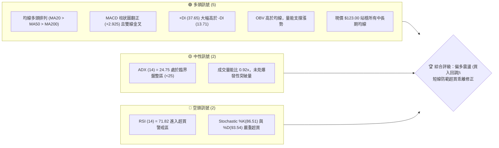
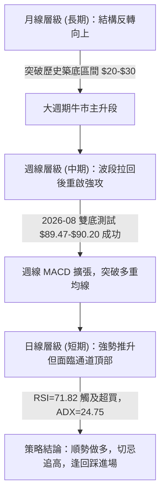
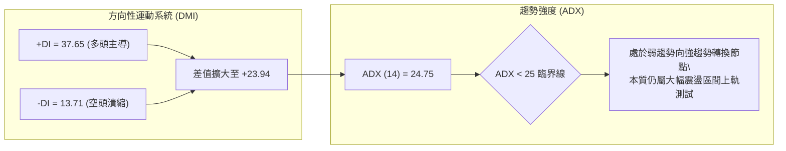
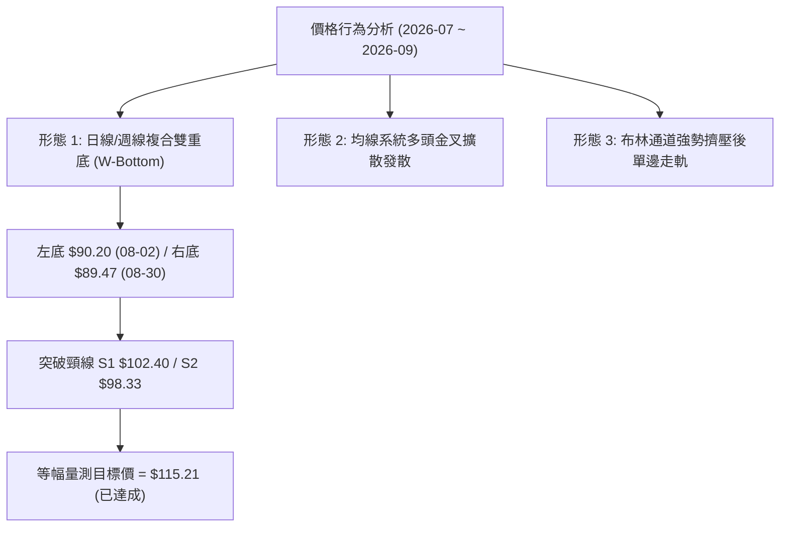
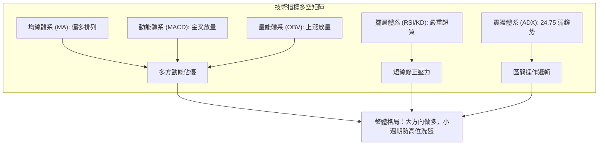
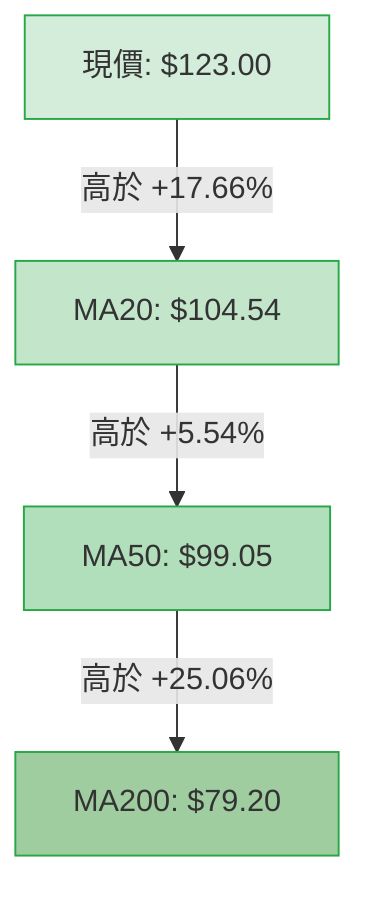
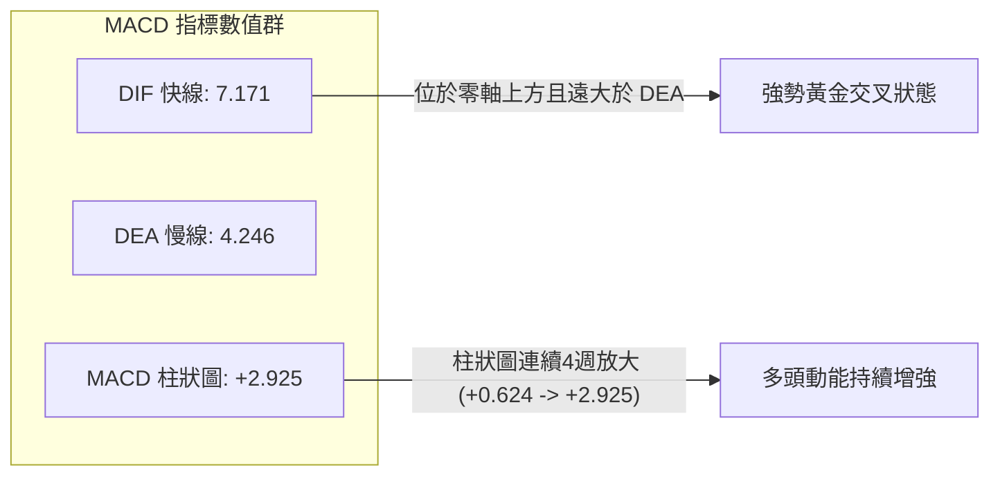
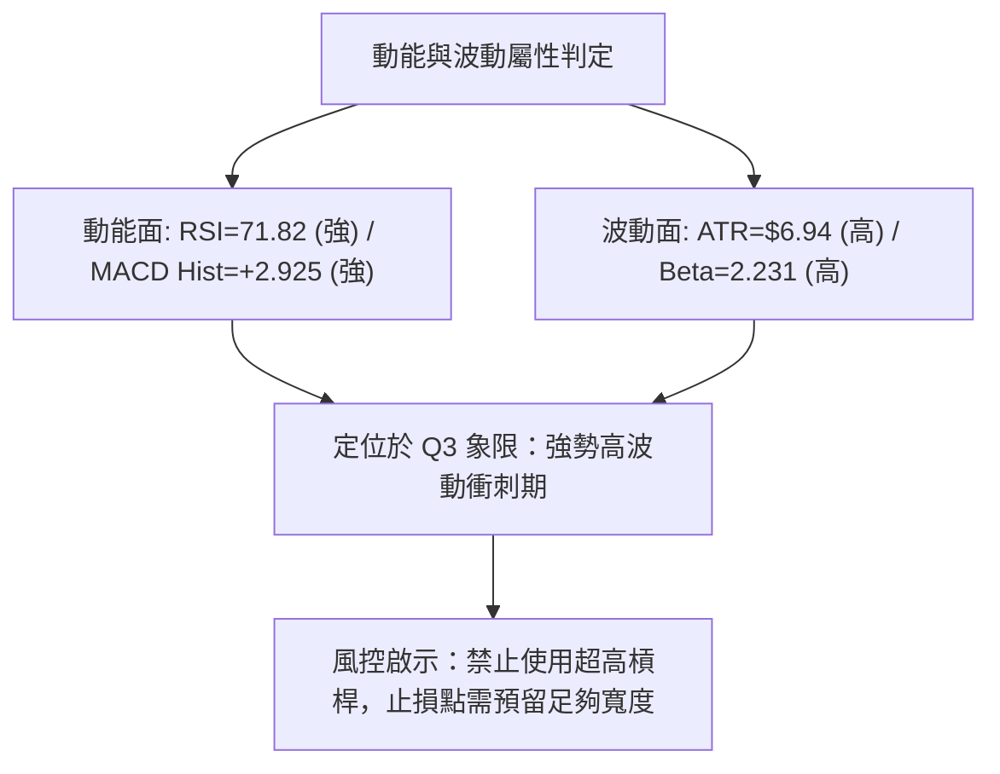
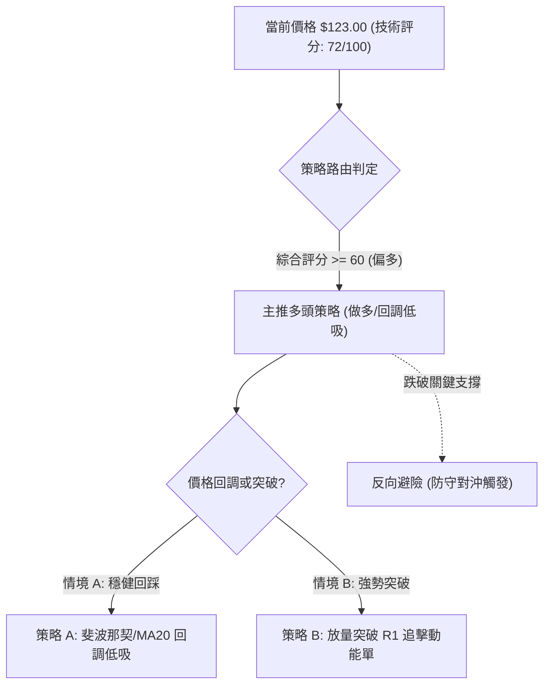
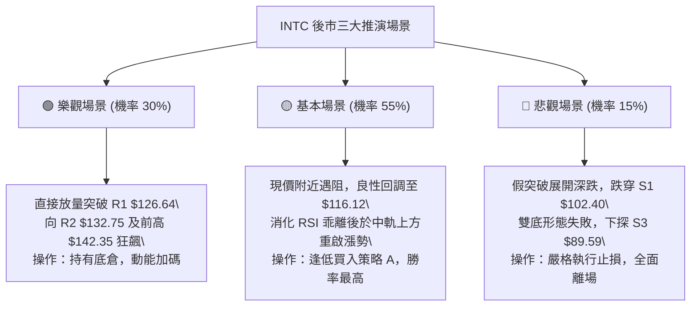

# INTC 技術分析報告

> **報告日期**：2026-09-26 ｜ **語言**：繁體中文 ｜ **數據來源**：Yahoo Finance ｜ **當前價格**：$123.00

---

## 目錄

| 章節 | 內容 |
|------|------|
| [1. 技術面概覽](#1-技術面概覽) | 訊號儀表板、核心指標、評分卡 |
| [2. 趨勢分析](#2-趨勢分析) | 多時框趨勢、長中短期走勢 |
| [3. 圖表形態分析](#3-圖表形態分析) | 形態識別、K線組合、目標價 |
| [4. 支撐與阻力](#4-支撐與阻力) | 關鍵價位、斐波那契回調 |
| [5. 技術指標深度解讀](#5-技術指標深度解讀) | MA/RSI/MACD/布林/成交量 |
| [6. 動能與波動率](#6-動能與波動率) | 動能評估、ATR、Beta |
| [7. 多時框架總結](#7-多時框架總結) | 時框架評分矩陣、多時框收斂 |
| [8. 交易策略建議](#8-交易策略建議) | 主策略路由、情境階梯、風報比 |
| [9. 風險提示與監控](#9-風險提示與監控) | 監控指標、風險場景、部位控管 |
| [📋 報告總結](#-報告總結) | 核心結論與策略彙整 |

---

## 1. 技術面概覽

### 🎯 技術訊號儀表板



### 📊 核心指標速覽表

| 指標類別 | 指標名稱 | 當前數值 | 訊號 | 解讀 |
|----------|----------|----------|:----:|------|
| **價格** | 當前收盤價 | $123.00 | 🟢 | 位於52週區間 82.6% 高位，強勢多頭控盤 |
| **均線** | MA20 (短中) | $104.54 | 🟢 | 現價高於 MA20 達 +17.66%，短線支撐強勁 |
| **均線** | MA50 (中期) | $99.05 | 🟢 | 現價高於 MA50，中期多頭趨勢成立 |
| **均線** | MA200 (長期) | $79.20 | 🟢 | 遠高於年線，奠定長期結構性多頭基礎 |
| **動能** | RSI (14) | 71.82 | 🔴 | 超買區間 (>70)，短線累積一定追高風險 |
| **動能** | MACD (12/26/9) | 7.171 / 4.246 | 🟢 | 快慢線金叉且柱狀圖擴張至 +2.925，動能充沛 |
| **動能** | KD (14,3,3) | %K 86.51 / %D 93.54 | 🔴 | 極度鈍化與超買，提示短線有回踩均線需求 |
| **趨勢** | ADX (14) | 24.75 (+DI:37.65) | 🟡 | 弱趨勢/區間震盪極限邊緣，多頭略佔主導 |
| **波動** | ATR (14) | $6.94 | 🟡 | 佔現價 5.65%，每日波動幅度大，需寬止損 |
| **通道** | Bollinger %B | 0.86 | 🟡 | 緊貼布林上軌 ($130.44)，呈現帶狀推升 |
| **量能** | 量比 (20日均) | 0.92x (97.48M) | 🟡 | 量能穩定但未爆量，OBV 趨勢偏多支持波段 |

### 🏆 技術評分卡

```
╔════════════════════════════════════════════════════════════════╗
║                   技術評分卡 — INTC (2026-09-26)               ║
╠════════════════════════════════════════════════════════════════╣
║ 趨勢強度 (Trend)     ██████████████░░░░░░  70/100   🟢 多頭強勢║
║ 動能指標 (Momentum)  ████████████░░░░░░░░  60/100   🟡 超買減壓║
║ 支撐穩定度 (Support) ████████████████░░░░  80/100   🟢 底部墊高║
║ 成交量配合 (Volume)  ████████████░░░░░░░░  62/100   🟡 量能中等║
║ 形態完整度 (Pattern) ██████████████░░░░░░  72/100   🟢 雙底突破║
║ 均線排列 (MA System) ██████████████████░░  90/100   🟢 完美多頭║
╠════════════════════════════════════════════════════════════════╣
║ 綜合技術評分         ██████████████░░░░░░  72/100   偏多 (BULL)║
╚════════════════════════════════════════════════════════════════╝
```

---

## 2. 趨勢分析

### 🌐 多時框趨勢分析



### 📈 長期趨勢 — 12個月走勢圖（Unicode）

以下為 INTC 過去 12 個月（2025年10月至2026年09月）收盤價月線推移軌跡：

```
INTC 月線走勢圖（過去12個月收盤價軌跡）
價格軸 ($)
$140 ┤                                           ● (06月: 139.63)
$130 ┤                                                 
$120 ┤                                                 ● (09月: 123.00 現價)
$110 ┤                                     ● (05月: 114.68)
$100 ┤                                 
$90  ┤                                 ● (04月: 94.48) ● (07月: 90.20) ● (08月: 89.51)
$50  ┤                 ● (01月: 46.47) ● (02月: 45.61) ● (03月: 44.13)
$40  ┤ ● (10月: 39.99) ● (11月: 40.56) ● (12月: 36.90)
$30  ┤
     └─────────────────────────────────────────────────────────────
        10   11   12   01   02   03   04   05   06   07   08   09   (月份: 2025-10 至 2026-09)
```

#### 走勢特徵分析表格

| 階段區間 | 月份分布 | 價格區間 ($) | 漲跌幅 | 走勢結構與技術特徵 |
|:---------|:---------|:-------------|:------:|:-------------------|
| **第一階段：底部橫盤** | 2025-10 ~ 2025-12 | $36.90 - $40.56 | -7.7% | 30元以上籌碼密集換手，構築中長期堅實底部平台 |
| **第二階段：初升突破** | 2026-01 ~ 2026-03 | $44.13 - $46.47 | +19.6% | 突破長期橫盤箱體，MA60/MA120 趨平向上發散 |
| **第三階段：主升暴漲** | 2026-04 ~ 2026-06 | $94.48 - $139.63| +200.5% | 資金急速湧入，創下 52 週歷史高點 $142.35，成交量暴增 |
| **第四階段：深度洗盤** | 2026-07 ~ 2026-08 | $89.51 - $90.20 | -35.9% | 快速回吐至 Fib 38.2% ($99.89) 與波段低點聚類 S3 ($89.59) 獲得強支撐 |
| **第五階段：二次啟動** | 2026-09 (當前)    | $123.00        | +37.4% | 自 $89.51 強勢反彈，連續4週大陽線拉升，直逼 R1 ($126.64) |

### 📊 中期趨勢（週線分析）

近 8 週收盤價展現明確的 V 型反轉與雙底墊高特徵：
- **2026-08-02**：探底 $90.20（RSI: 39.5, MACD柱: -1.256）
- **2026-08-30**：二次探底 $89.47（RSI: 38.1, MACD柱: -0.357，柱狀圖明顯收窄，形成隱性底背離）
- **2026-09-06 ~ 09-27**：拉出四連紅（$95.80 → $102.94 → $108.60 → $123.00），週成交量突破 6 億股，週線 MACD 柱狀圖由 +0.624 擴張至 +2.925，週線 RSI 達 71.8。

```
週線支撐阻力結構示意圖：
$141.90 ────────────────────── [歷史波段峰值強阻力 R3]
$132.75 ────────────────────── [前波回撤平台阻力 R2]
$126.64 ────────────────────── [短線多頭攻擊目標 R1]
$123.00 ◀◀ 當前現價 (近4週強攻 +37.4%)
$116.12 ┄┄┄┄┄┄┄┄┄┄┄┄┄┄┄┄┄┄┄┄┄┄ [Fib 23.6% 回調關鍵樞軸]
$104.54 ────────────────────── [MA20 / 日布林中軌強支撐]
$102.40 ────────────────────── [第一波段突破頸線支撐 S1]
$89.59  ══════════════════════ [8月雙底紮實底部支撐 S3]
```

### ⚡ 趨勢強度評估（ADX 解讀）



#### ADX 數值強度評估對照

| 指標 | 數值 | 臨界標準 | 當前判斷 | 交易意涵 |
|:-----|:----:|:--------:|:--------:|:---------|
| **ADX (14)** | 24.75 | < 25 | 弱趨勢 / 震盪整理邊界 | 尚未進入單邊狂飆期，高檔面臨區間上緣壓制 |
| **+DI (14)** | 37.65 | > 25 | 強烈多方動能 | 買方牢牢控制市場定價節奏 |
| **-DI (14)** | 13.71 | < 20 | 賣方動能萎縮 | 下行拋壓有限，回檔多為獲利盤了結 |
| **體系收斂** | 偏多震盪 | ADX即將突破25 | 潛在突破醞釀期 | 需配合布林通道與布林上軌進行區間與突破雙軌應對 |

---

## 3. 圖表形態分析

### 🔍 形態識別系統



#### 形態信心度與目標價評估表

| 形態類別 | 信心度 | 判斷依據（數據引用） | 完成度 | 目標價（附嚴謹計算式） |
|:---------|:------:|:---------------------|:------:|:-----------------------|
| **複合雙底 (W-Bottom)** | **85%** | 兩次低點落於 2026-08-02 的 $90.20 與 2026-08-30 的 $89.47（均精準落在 S3 $89.59 支撐），頸線位於 S1 $102.40。 | 100% (已突破) | 頸線 $102.40 + (形態高度 $102.40 - $89.59 = $12.81) = **$115.21**（已突破達成）。第二延伸阻力看 **R1 $126.64**。 |
| **布林帶上軌單邊擴張** | **70%** | 現價 $123.00，布林上軌 $130.44，%B 高達 0.86，呈現強勢推升走勢。 | 80% | 依布林通道上限計算，短線阻力壓制於 **R2 $132.75**（與通道上軌 $130.44 形成阻力聚類）。 |
| **頭肩底 / 旗形** | <50% | 目前無標準頭肩結構，旗形盤整週數不足。 | 訊號不足 | 數據中未偵測到完整幾何結構，僅做均線動能指標型解讀。 |

### 🕯️ 重要K線形態分析

| 週/月區間 | 關鍵價格點位 | K線形態特徵 | 技術解讀 | 訊號方向 |
|:----------|:------------|:------------|:---------|:--------:|
| 2026-07 | 收盤 $90.20 | 長陰下殺後長下影線 | 主升段急跌洗盤，測試 MA120 ($102.47) 及 Fib 50% ($86.78) | 🔴 短空轉中性 |
| 2026-08 | 收盤 $89.51 | 十字星/雙底確認棒 | 空頭力竭，波段低點聚類 S3 $89.59 展現強支撐，籌碼沉澱 | 🟡 變盤向上 |
| 2026-09-06 ~ 13 | $95.80 → $102.94 | 破線大陽線穿雲穿霧 | 連續突破 MA50 ($99.05) 與頸線 S1 ($102.40)，買盤強勢進場 | 🟢 強烈買訊 |
| 2026-09-20 ~ 27 | $108.60 → $123.00 | 兩根大實體週陽線 | 強勢逼空，收盤價逼近前波高點平台，惟面臨超買乖離 | 🟢 趨勢多頭 |

### 📉 ASCII 走勢形態示意圖

```
INTC 雙底突破與波段推升結構圖：
$130 ┤                                                [現價 $123.00]
$125 ┤                                                ●
$120 ┤                                            ●  /
$115 ┤                                           /
$110 ┤                                    ●    /
$105 ┤                                   /   ● (突破確認 $102.94)
$102.40 ┼┄┄┄┄┄┄┄┄┄┄┄┄┄┄┄┄┄┄┄┄┄┄┄┄┄┄┄┄┄┄/┄┄┄┄┄┄┄┄┄ [頸線位置 S1 $102.40]
$95  ┤                   ● (08-16: 102.50)
$90  ┤  ● (左底: 90.20)  \               ● (右底: 89.47)
     └────┴────────────────┴───────────────┴───────────────────────
       2026-08-02        2026-08-16      2026-08-30    2026-09-27
```

### 🎯 形態目標價計算

1. **基本形態測幅**：
   - 雙底底部基準：$89.59（S3 聚類）
   - 突破頸線：$102.40（S1 聚類）
   - 垂直高度：$102.40 - $89.59 = $12.81
   - 基本測量目標：$102.40 + $12.81 = **$115.21**（已於 2026-09-20 當週完全突破兌現）。
2. **延伸波段目標**：
   - 當前價格已經進入下一輪主攻波段，其向上量測空間直接受限於上方歷史密集成交區聚類阻力：第一階段看 **R1: $126.64**，進一步向上挑戰 **R2: $132.75** 及波段極值 **R3: $141.90**。

---

## 4. 支撐與阻力

### 🗺️ 關鍵價位分布圖（Unicode）

```
INTC 價位結構分布圖（嚴格依據 OHLCV 計算）
═════════════════════════════════════════════════════════════════
$142.35  ║████████████████████████████████║ 52週歷史高點 / Fib 0.0%
$141.90  ║████████████████████████████    ║ 強阻力 R3 (+15.37%)
$132.75  ║████████████████████            ║ 次級阻力 R2 (+7.93%)
$130.44  ║┈┈┈┈┈┈┈┈┈┈┈┈┈┈┈┈┈┈┈┈┈┈┈┈┈┈┈┈┈┈┈┈║ 布林通道上軌
$126.64  ║████████████████████████        ║ 關鍵第一阻力 R1 (+2.96%)
$123.00  ╠════════════════════════════════╣ ◄ 當前市價 ($123.00)
$116.12  ║▓▓▓▓▓▓▓▓▓▓▓▓▓▓▓▓▓▓▓▓▓▓▓▓        ║ 斐波那契 Fib 23.6% 回調位
$104.54  ║▓▓▓▓▓▓▓▓▓▓▓▓▓▓▓▓▓▓▓▓▓▓▓▓▓▓▓▓    ║ MA20 均線 / 布林中軌
$102.40  ║▓▓▓▓▓▓▓▓▓▓▓▓▓▓▓▓▓▓▓▓▓▓▓▓        ║ 近期強支撐 S1 (-16.75%)
$99.89   ║┈┈┈┈┈┈┈┈┈┈┈┈┈┈┈┈┈┈┈┈┈┈┈┈┈┈┈┈┈┈┈┈║ 斐波那契 Fib 38.2% 回調位
$98.33   ║▓▓▓▓▓▓▓▓▓▓▓▓▓▓▓▓                ║ 中期波段支撐 S2 (-20.06%)
$89.59   ║████████████████████████████████║ 長期雙底鐵底 S3 (-27.16%)
═════════════════════════════════════════════════════════════════
```

### 🚧 阻力位分析表

| 阻力級別 | 價位 ($) | 空間幅距 | 形成原因與籌碼結構 | 突破難度 | 重要性 |
|:---------|:--------:|:--------:|:-------------------|:--------:|:------:|
| **R1** | **$126.64** | +2.96% | 近一年波段高點聚類、短線獲利盤兌現密集區 | 🟡 中等 | 🟢 短線分水嶺 |
| **R2** | **$132.75** | +7.93% | 2026年6月歷史次高點套牢區、布林上軌外延 | 🔴 較高 | 🟡 中期關鍵位 |
| **R3** | **$141.90** | +15.37%| 接近52週極值點 ($142.35) 籌碼歷史套牢峰值 | 🔴 極高 | 🔴 強阻力天花板 |

### 🛡️ 支撐位分析表

| 支撐級別 | 價位 ($) | 空間幅距 | 形成原因與籌碼結構 | 守住機率 | 重要性 |
|:---------|:--------:|:--------:|:-------------------|:--------:|:------:|
| **S1** | **$102.40** | -16.75%| 近期波段頸線、MA120 ($102.47) 密集共振區 | 80% | 🟢 第一道護城河 |
| **S2** | **$98.33**  | -20.06%| MA50 ($99.05) 與 Fib 38.2% ($99.89) 雙重重疊 | 85% | 🟡 中期多空平衡點 |
| **S3** | **$89.59**  | -27.16%| 2026年8月實體雙底聚類低點 ($89.47-$90.20) | 95% | 🔴 長期牛熊防線 |

### 📐 斐波那契回調位分析

依據 52 週完整波段極值（低點 **$31.21** → 高點 **$142.35**，波幅高達 $111.14）計算之黃金分割水準：

| 斐波那契回調層級 | 官方精確計算價位 ($) | 現價相對位置與技術意義解讀 |
|:-----------------|:--------------------:|:---------------------------|
| **0.0% (52W High)** | **$142.35** | 終極牛市阻力點，前波大頂 |
| **23.6%** | **$116.12** | **現價 ($123.00) 位於 0.0% 與 23.6% 之間**。本輪強勢拉升已突破此位，現轉化為短線拉回第一回測支撐點 |
| **38.2%** | **$99.89** | 與均線 MA50 ($99.05) 及支撐 S2 ($98.33) 形成完美「三重共振支撐區」 |
| **50.0%** | **$86.78** | 多空中軸，7-8月下影線探底獲得支撐的深水區 |
| **61.8%** | **$73.67** | 黃金分割強防守位，緊鄰 MA240 ($72.35) |
| **78.6%** | **$54.99** | 結構性崩塌警戒線（數據中未受考驗） |
| **100.0% (52W Low)**| **$31.21** | 52週絕對底部起漲點 |

---

## 5. 技術指標深度解讀

### 🎛️ 指標訊號總覽



### 📈 移動平均線排列分析



#### 均線數據明細評估

| 均線週期 | 當前數值 ($) | 現價與均線差離 | 乖離率 (Bias) | 排列與趨勢解讀 |
|:---------|:------------:|:--------------:|:-------------:|:---------------|
| **MA 5** | $123.73 | -$0.73 | -0.59% | 短線微幅跌破 5 日線，提示超短線衝高放緩 |
| **MA 10** | $113.14 | +$9.86 | +8.71% | 短期多頭生命線，強勁上揚支撐 |
| **MA 20** | $104.54 | +$18.46 | +17.66% | 月線級別支撐，與布林中軌完全重合 |
| **MA 50** | $99.05 | +$23.95 | +24.18% | 中期生命線，健康向上傾斜 |
| **MA 60** | $100.82 | +$22.18 | +22.00% | 季線位置，穩健向上 |
| **MA 120**| $102.47 | +$20.53 | +20.03% | 半年線，與 S1 ($102.40) 形成密集交會 |
| **MA 200**| $79.20 | +$43.80 | +55.30% | 年線牛熊分水嶺，長期多頭確立 |
| **MA 240**| $72.35 | +$50.65 | +70.02% | 長期成本底座，穩如盤石 |

**均線結構綜合評價**：呈現標準且完美的「大滿貫多頭排列」（MA20 > MA50 > MA200）。然而，現價脫離 MA20 達 17.66%，遠高於正常均線波幅帶，有向 MA20 或 MA10 回歸收斂的技術性回踩需求。

### 📉 RSI(14) 分析

- **當前數值**：**71.82**
- **狀態進度條**：
  ```
  超賣 (0) ─────── 中性 (50) ─────── 超買 (70) ── 極端 (100)
  [████████████████████████████████████░░░░░░] 71.82%  🔴 超買警戒
  ```
- **背離分析**：
  - 比對 2026-06 歷史高點 $139.63（當時週線 RSI 達 67.2）與當前現價 $123.00（週線 RSI 71.82），價格未過前高而 RSI 先行進入超買，此為短線急升造成的指標鈍化。
  - **結論**：目前日線級別「**無明顯背離**」，但已越過 70 超買警戒線。過往數據顯示，RSI 超越 70 後通常伴隨 1-2 週的橫盤消化或回踩。

### 📊 MACD(12/26/9) 訊號解讀



- **訊號解析**：DIF (7.171) 與 DEA (4.246) 均位於零軸高位發散，柱狀圖（Histogram）維持在 +2.925 擴張階段，證明多頭推升並非弱勢誘多，而是由實打實的波段買盤驅動。

### 📦 布林通道分析

```
INTC 日線布林通道結構示意：
$130.44 ───────────────────────────────────────── 布林上軌 (BB Upper)
$123.00 ◀◀ 現價位置 (%B = 0.86，緊貼上軌運行)
$104.54 ───────────────────────────────────────── 布林中軌 (MA20 基基準)
$78.64  ───────────────────────────────────────── 布林下軌 (BB Lower)
```

- **帶寬與位置解讀**：
  - 布林中軌（MA20）：**$104.54**
  - 通道上限（上軌）：**$130.44**
  - 通道下限（下軌）：**$78.64**
  - **%B 指標**：**0.86**（落於 0.8 到 1.0 的強勢衝刺帶）。
  - 通道開口呈現向外擴張跡象，價格連續多日沿著上軌推進，短線極限壓制位於上軌 $130.44 與 R2 ($132.75) 疊加區域。

### 💹 成交量分析（量價配合度）

- **最新日成交量**：97,481,700 股
- **20日平均量**：105,701,015 股（量比：**0.92x**）
- **50日平均量**：109,601,060 股
- **OBV 趨勢評估**：
  - 數據明確顯示「**OBV > MA → 量能支撐上漲**」。
  - 過去4週週線成交量分別為 3.78億、4.21億、6.26億、6.02億股，呈現典型的「價漲量增、底部爆量」健康結構。雖然最新日量比 0.92x 略有萎縮，但並未出現「巨量長黑」或「量價嚴重背離」，波段多頭籌碼鎖定良好。

---

## 6. 動能與波動率

### ⚡ 動能評估分析

| 象限分區 | 動能強度 (Momentum) | 波動率水準 (Volatility) | 當前判定 | 市場意涵與操作指導 |
|:---------|:-------------------:|:-----------------------:|:--------:|:-------------------|
| **Q1 (最佳擴張)** | 強 (MACD高位擴張) | 低 (處於壓縮突破前期) | - | 最安全的主升段（已過） |
| **Q2 (震盪沉澱)** | 弱 (動能指標走平) | 低 (橫盤縮量) | - | 籌碼蓄勢，適合左側埋伏 |
| **Q3 (強勢高危)** | **強 (+DI:37.65, RSI:71.8)** | **高 (ATR: $6.94, Beta: 2.23)** | **✓ (INTC 當前)** | **高動能伴隨高波動，順勢持有但需收緊動態移動止盈** |
| **Q4 (弱勢拋售)** | 弱 (-DI 擴大主導) | 高 (恐慌殺跌) | - | 空頭主導，全面規避 |



### 📊 ATR 波動率分析

- **ATR(14) 數值**：**$6.94**（佔現價 $123.00 的 **5.65%**）。
- **日內真實波動幅度解析**：
  - 股票單日正常波動達 $6.94，說明當前市場交易情緒極度亢奮。
  - **風控止損距離指導**：
    - 短線激進止損（1.0 × ATR）：距進場點扣除 **$6.94**。
    - 波段穩健止損（1.5 × ATR）：距進場點扣除 **$10.41**。
    - 結構防守止損（2.0 × ATR）：距進場點扣除 **$13.88**。
    - 任何小於 $6.94 的窄幅止損均極易被日內噪聲假突破清洗出場。

### 📐 Beta 與市場相關性

- **Beta 係數**：**2.231**
- **敏感度解讀**：
  - INTC 屬於典型「超高彈性高 Beta 品種」，其波動幅度為標普 500 指數的 **2.23 倍**。
  - 在大盤（半導體板塊）多頭環境下，INTC 具備極強的領漲爆發力；但若大盤出現系統性回調，其回撤幅度亦將劇烈放大。

---

## 7. 多時框架總結

### 📋 時框架評分表

| 時框架 | 趨勢方向 | 動能表現 | 均線排列 | 關鍵形態 | 評分 | 操作建議 |
|:-------|:--------:|:--------:|:--------:|:---------|:----:|:---------|
| **長期 (月線)** | 🟢 強烈看多 | 強（突破2年大底） | MA60/120 轉強發散 | 歷史箱體大突破 | 85/100 | 超長線多頭續抱，長投底倉不動 |
| **中期 (週線)** | 🟢 穩健多頭 | 強（MACD柱翻紅放量） | MA20 > MA50 向上 | 雙底突破 ($89.59-$102.40) | 78/100 | 回踩 Fib 23.6% ($116.12) 加碼 |
| **短期 (日線)** | 🟡 偏多高危 | 鈍化（RSI 71.82 超買） | MA5-MA240 多頭排列 | 緊貼布林上軌向上延伸 | 62/100 | 嚴禁直接市價追高，等待分時回調 |

### 🔲 綜合訊號矩陣

```
時框架訊號交叉驗證表：
┌──────────┬────────────┬────────────┬────────────┬─────────────┐
│ 時框層級 │  趨勢訊號  │  量能確認  │  動能訊號  │  結構一致性 │
├──────────┼────────────┼────────────┼────────────┼─────────────┤
│ 長期月線 │  🟢 多頭   │  🟢 確認   │  🟢 充沛   │  🟢 一致    │
│ 中期週線 │  🟢 多頭   │  🟢 確認   │  🟢 增強   │  🟢 一致    │
│ 短期日線 │  🟢 多頭   │  🟡 普通   │  🔴 超買   │  🟡 存在乖離│
└──────────┴────────────┴────────────┴────────────┴─────────────┘
結論：長中期格局共振看多，短期指標存在技術性超買降溫需求。
```

### ⚖️ 多時框收斂結論（依規則 14 嚴格收斂）

1. **行情屬性判定**：
   - 當前 **ADX (14) = 24.75**，嚴格依據量化規則（ADX < 25），當前市場本質屬於「**強勢盤整震盪向單邊過渡的臨界行情**」。
2. **主導時框與交易邊界**：
   - 依收斂規則：「盤整行情（ADX < 25）以日線布林通道上下軌為主要交易區間」，目前日線布林通道區間為 **$78.64（下軌）至 $130.44（上軌）**。
   - 現價 **$123.00** 已經高度逼近日線布林通道上軌（$130.44），%B 達 0.86，空間向上受到壓制。
3. **時框優先級取捨**：
   - 中長期均線（MA50 $99.05、MA200 $79.20）呈強勢多頭排列，確立中長期**不可做空**的主基調；然而日線短期 RSI (71.82) 與 KD 嚴重超買，短週期不具備盈虧比合理的追高買點。
4. **唯一收斂結論**：
   - **偏多震盪（逢回調做多，拒絕追高）**。日線短期只作為「尋找回調支撐進場點」的工具，不作為盲目追漲依據。

---

## 8. 交易策略建議

### 🗺️ 策略決策流程圖



### 🧭 策略路由

- **綜合評分**：**72 / 100**（偏多區間）
- **當前主策略方向**：**主推多頭策略（以回調分批進場為主，突破追多為輔；空頭僅作為風險防守點）**。

### 🎯 價格情境階梯（Price Scenarios）

所有價位均嚴格取自數據庫計算數值：

| 觸發條件 | 核心價位 ($) | 下一目標 ($) | 後續延伸 ($) | 情境含義解讀 |
|:---------|:------------:|:------------:|:------------:|:-------------|
| **強勢突破** | 突破 **R1 $126.64** | **R2 $132.75** | **R3 $141.90** | 短線擺脫超買震盪，向 52 週歷史高點發起衝擊 |
| **區間整固** | 站穩 **Fib 23.6% $116.12** | 測試現價 $123.00 | 測試 R1 $126.64 | 消化獲利盤，完成強勢中繼換手 |
| **波段深踩** | 跌破 **Fib 23.6% $116.12** | **MA20 $104.54** | **S1 $102.40** | 中期均線乖離率回踩，洗出不堅定籌碼 |
| **多頭破位** | 跌破 **S1 $102.40** | **S2 $98.33** | **S3 $89.59** | 雙底突破形態失效，中期趨勢重回弱勢震盪 |

### 📊 情境機率分佈

| 運行情境 | 發生機率 | 主要技術指標依據 |
|:---------|:--------:|:-----------------|
| **情境一：高檔強勢震盪後回調蓄勢** | **55%** | RSI (71.82) 嚴重超買，ADX (24.75) 處於盤整區，布林上軌 ($130.44) 形成壓制，需回踩支撐確認。 |
| **情境二：直接放量突破衝擊前高** | **30%** | MACD 柱狀圖 (+2.925) 強勁放大，+DI (37.65) 主導，量價 OBV 持續推升。 |
| **情境三：深度回落再度探底** | **15%** | 均線系統全面多頭排列（MA20>50>200），S1 ($102.40) 及 S3 ($89.59) 具備強大籌碼支撐，深跌機率極低。 |

### 🟢 主策略詳情

#### 策略 A（穩健型：Fib 23.6% 回踩低吸策略）
- **進場條件**：價格自現價主動回踩 Fib 23.6% 回調位，日線收出企穩止跌下影線或小陽線。
- **進場價格**：**$116.12**
- **止損價格**：**$108.50**（位於進場點下方約 1.1 × ATR，保護在波段樞紐之下）
- **第一目標價 (T1)**：**$126.64**（關鍵阻力位 R1）
- **第二目標價 (T2)**：**$132.75**（次級阻力位 R2 / 布林上軌外延）
- **風險報酬比 (R/R)**：
  - 至 T1：($126.64 - $116.12) / ($116.12 - $108.50) = $10.52 / $7.62 = **1.38 : 1**
  - 至 T2：($132.75 - $116.12) / ($116.12 - $108.50) = $16.63 / $7.62 = **2.18 : 1**
- **預估勝率**：**65%**
- **建議倉位**：**15%**（基礎波段倉位）

#### 策略 B（激進型：R1 阻力強勢突破追動能策略）
- **進場條件**：日線收盤價強勢實體突破 R1 阻力位，且單日成交量放大超越 20 日均量（>105.7M）。
- **進場價格**：**$126.64**
- **止損價格**：**$119.70**（跌破進場點 1.0 × ATR，即 $126.64 - $6.94 = $119.70）
- **第一目標價 (T1)**：**$132.75**（次級阻力位 R2）
- **第二目標價 (T2)**：**$141.90**（強阻力位 R3 / 52週歷史高點區域）
- **風險報酬比 (R/R)**：
  - 至 T1：($132.75 - $126.64) / ($126.64 - $119.70) = $6.11 / $6.94 = **0.88 : 1**
  - 至 T2：($141.90 - $126.64) / ($126.64 - $119.70) = $15.26 / $6.94 = **2.20 : 1**
- **預估勝率**：**50%**（受制於 RSI 超買）
- **建議倉位**：**8%**（動能突破輕倉）

### 🔴 反向風險觸發點（對沖提示）

若市場出現不可預測黑天鵝，跌破以下關鍵防線時，多頭架構將遭到實質破壞，應立即啟動避險：
1. **短線警戒破位**：價格跌破 **$116.12 (Fib 23.6%)**，表明短期超買修正轉為深幅回撤，應將多頭部位減半。
2. **中期多頭防線**：價格收盤有效跌破 **$102.40 (S1)** 與 **$98.33 (S2)**，雙底頸線宣告失守，多頭排列瓦解，此時所有多單應無條件止損離場，並可考慮買入認沽期權進行部位對沖。

### ⭐ 整體訊號強度評星

```
╔══════════════════════════════════════════════════════╗
║ 做多訊號強度：  ★★★★☆  (4/5星) — 均線與動能極佳      ║
║ 做空訊號強度：  ★☆☆☆☆  (1/5星) — 逆勢逆風，僅限對沖║
║ 整體可信度：    ★★★★☆  (4/5星) — 雙底結構清晰扎實  ║
╚══════════════════════════════════════════════════════╝
```

---

## 9. 風險提示與監控

### ✅ 關鍵監控指標 Checklist

```
╔══════════════════════════════════════════════════════════════════╗
║                   每日交易監控清單 (Checklist)                   ║
╠══════════════════════════════════════════════════════════════════╣
║ [ ] 價格是否成功守在 Fib 23.6% ($116.12) 之上                   ║
║ [ ] 日線 RSI(14) 是否跌破 70 順利完成「超買降溫」而非急跌       ║
║ [ ] ADX 是否放量衝破 25 臨界線，帶動布林通道展開單邊爆發         ║
║ [ ] 單日成交量是否異常萎縮（<7,000萬股）或異常天量（>1.5億股）   ║
║ [ ] MA5 ($123.73) 能否迅速收復，避免形成短線小雙頂               ║
║ [ ] 跌破 S1 ($102.40) 立即觸發強制清倉風控程序                  ║
╚══════════════════════════════════════════════════════════════════╝
```

### ⚠️ 風險場景分析



### 🛡️ 風險管理重要提醒

1. **ATR 波動適應性**：
   - 目前 ATR 高達 **$6.94**，代表單日正常震盪即達 5.65%。投資人切勿將止損設定在 $2-$3 內，否則極易因正常市場噪聲被掃出場。
2. **Beta 槓桿控制**：
   - 股票 Beta 達 **2.231**，內含雙倍於市場的波動。單一個股總倉位強烈建議控制在投資組合總資產的 **15% - 20%** 以內，嚴禁滿倉或高倍保證金槓桿交易。
3. **乖離率修正風險**：
   - 現價距離 MA20 ($104.54) 乖離率達 **+17.66%**。歷史經驗表明，當乖離率超過 15% 且 RSI 突破 70 時，追高勝率通常低於 35%。因此，**「買在回調支撐、賣在阻力過熱」** 為當前最核心之生存法則。

---

## 📋 報告總結

```
╔══════════════════════════════════════════════════════════════════════╗
║                       INTC 技術分析報告總結                          ║
╠══════════════════════════════════════════════════════════════════════╣
║ 報告日期：2026-09-26                                                 ║
║ 當前價格：$123.00                                                    ║
║ 綜合技術評分：72 / 100                                               ║
║ 分析評級：🟢 偏多震盪（逢低做多，避免追高）                          ║
╠══════════════════════════════════════════════════════════════════════╣
║ 關鍵結論：                                                           ║
║ ├─ 長期趨勢：🟢 強烈看多（突破底部結構，年線 MA200 $79.20 確立牛市）║
║ ├─ 中期趨勢：🟢 穩健多頭（8月雙底 $89.59 頸線突破，波段動能飽滿）  ║
║ ├─ 短期趨勢：🟡 偏多整理（RSI 71.82 處於超買，ADX 24.75 呈現區間） ║
║ ├─ 關鍵阻力：R1 $126.64 ｜ R2 $132.75 ｜ R3 $141.90                   ║
║ ├─ 關鍵支撐：Fib23.6% $116.12 ｜ S1 $102.40 ｜ S2 $98.33 ｜ S3 $89.59║
║ └─ 分析師共識：Buy（覆蓋 43 位，平均目標價 $116.37，最高 $200.00）   ║
╠══════════════════════════════════════════════════════════════════════╣
║ 最優策略組合：                                                       ║
║ 1. 🥇 最佳機會：等待價格回踩 Fib 23.6% ($116.12) 進場做多 (策略 A)   ║
║    目標 T1: $126.64，T2: $132.75，止損 $108.50，風報比 2.18:1         ║
║ 2. 🥈 次選機會：放量有效突破 R1 ($126.64) 順勢跟進動能單 (策略 B)    ║
║    目標 T1: $132.75，T2: $141.90，止損 $119.70，風報比 2.20:1         ║
║ 3. 🥉 保守選擇：原有持股底倉繼續持有，移動止盈上移至 $116.12 鎖定利潤║
╚══════════════════════════════════════════════════════════════════════╝
```

---

> ⚠️ **免責聲明**：本報告為 AI 自動生成之技術分析研究，所有數據、圖表及價位推演均嚴格基於所提供的歷史交易資訊與客觀技術指標計算。本報告**僅供研究與學術參考**，**不構成任何形式的證券買賣建議或投資邀約**。金融市場具有高度風險，投資人應獨立思考，審慎評估自身風險承受能力並自負盈虧。

---

*報告生成時間：2026-09-26 ｜ 數據來源：Yahoo Finance ｜ 分析框架：多時框技術量化系統*