# INTC 技術分析報告

> **報告日期**：2026-09-28 ｜ **語言**：繁體中文 ｜ **數據來源**：Yahoo Finance ｜ **當前價格**：$123.00

---

## 目錄

| 章節 | 內容 |
|------|------|
| [1. 技術面概覽](#1-技術面概覽) | 訊號儀表板、核心指標、評分卡 |
| [2. 趨勢分析](#2-趨勢分析) | 多時框趨勢、長中短期走勢 |
| [3. 圖表形態分析](#3-圖表形態分析) | 形態識別、K線組合、目標價 |
| [4. 支撐與阻力](#4-支撐與阻力) | 關鍵價位、斐波那契回調 |
| [5. 技術指標深度解讀](#5-技術指標深度解讀) | MA/RSI/MACD/布林/成交量 |
| [6. 動能與波動率](#6-動能與波動率) | 動能評估、ATR、Beta |
| [7. 多時框架總結](#7-多時框架總結) | 時框架評分矩陣 |
| [8. 交易策略建議](#8-交易策略建議) | 多空策略、風險報酬比 |
| [9. 風險提示與監控](#9-風險提示與監控) | 監控指標、風險場景 |

---

## 1. 技術面概覽

### 🎯 技術訊號儀表板

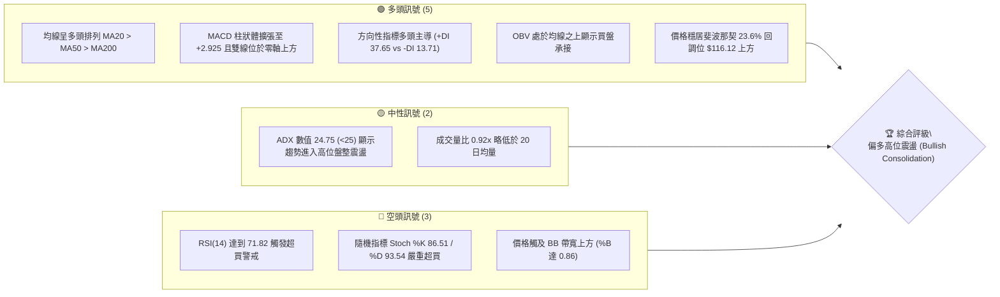

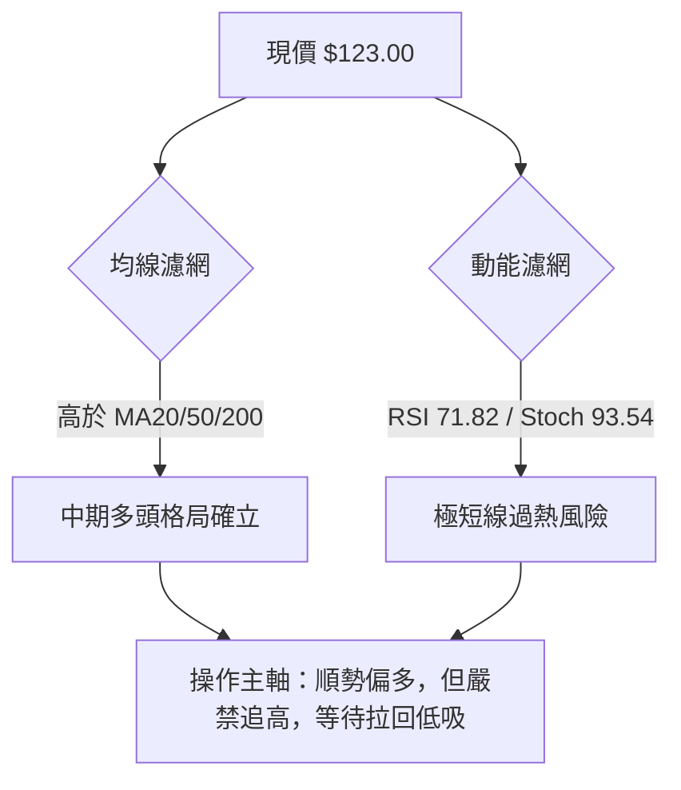

### 📊 核心指標速覽表

| 指標類別 | 指標名稱 | 當前數值 | 訊號 | 解讀 |
|----------|----------|----------|------|------|
| **價格** | 當前收盤價 | $123.00 | 🟢 | 位於 52 週波段高點 ($142.35) 聚類下方，強勢收復 $120 整數關卡 |
| **均線** | MA20 | $104.54 | 🟢 | 價格大幅高於 MA20 (+17.66%)，短中期均線向上發散 |
| **均線** | MA50 | $99.05 | 🟢 | 穩居 $100 重要心理支撐及 MA50 之上，確立中期多頭走勢 |
| **均線** | MA200 | $79.20 | 🟢 | 遠高於長期年線 (+55.30%)，長期結構已由底部強烈翻多 |
| **動能** | RSI(14) | 71.82 | 🔴 | 進入超買區 (>70)，短線追價動能邊際遞減，需防技術性拉回 |
| **動能** | MACD (12,26,9) | 7.171 / 4.246 | 🟢 | DIF 線與 MACD 線均在零軸之上，紅柱 (+2.925) 擴張看多 |
| **趨勢** | ADX (14) | 24.75 | 🟡 | 數值略低於 25，顯示雖由多頭 (+DI 37.65) 主導，但走勢屬區間偏多盤整 |
| **通道** | 布林通道 %B | 0.86 | 🟡 | 接近上軌 ($130.44)，面臨通道邊界壓制 |
| **波動** | ATR(14) | $6.94 | 🟡 | 佔現價 5.65%，每日波動區間較大，持倉需預留充分防守空間 |
| **量能** | 量比 (Volume Ratio) | 0.92x | 🟡 | 97.48M vs 105.70M，上漲量能稍有收斂，無異常天量拋壓 |

### 🏆 技術評分卡

```
╔══════════════════════════════════════════════════════════════════╗
║              技術評分卡 — INTC (2026-09-28)                      ║
╠══════════════════════════════════════════════════════════════════╣
║ 趨勢強度 (Trend)     ██████████████░░░░░░  70/100  🟢 偏多主導   ║
║ 動能指標 (Momentum)  ████████████░░░░░░░░  60/100  🟡 超買鈍化   ║
║ 支撐穩定度 (Support) ████████████████░░░░  80/100  🟢 底層扎實   ║
║ 成交量配合 (Volume)  ████████████░░░░░░░░  60/100  🟡 略顯萎縮   ║
║ 形態完整度 (Pattern) ██████████████░░░░░░  70/100  🟢 雙重底完成 ║
║ 均線排列 (MA System) ██████████████████░░  90/100  🟢 完美多頭   ║
╠══════════════════════════════════════════════════════════════════╣
║ 綜合技術評分         ██████████████░░░░░░  71.7/100  🟢 偏多進攻 ║
╚══════════════════════════════════════════════════════════════════╝
```

---

## 2. 趨勢分析

### 🌐 多時框趨勢分析

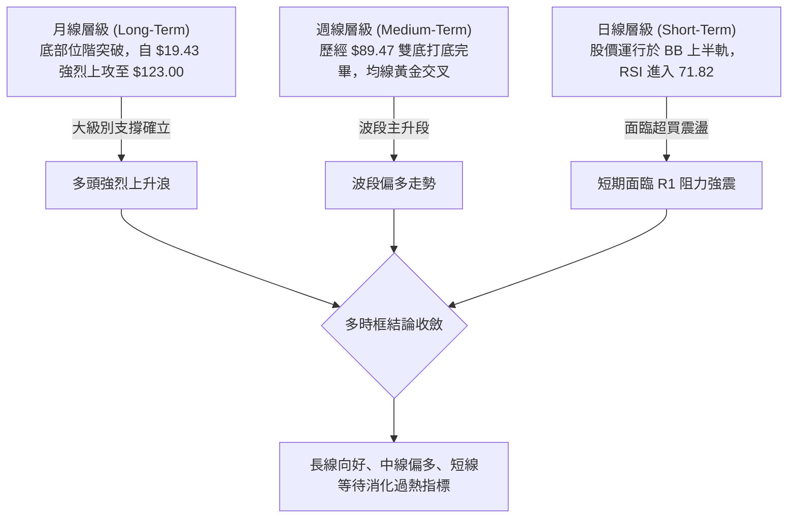

### 📈 長期趨勢 — 12個月走勢圖（Unicode）

以下為根據過去 12 個月（2025-10 至 2026-09）月線收盤數據繪製之走勢圖：

```
INTC 月線收盤走勢圖（2025-10 至 2026-09）
價格軸 ($)
$140 ┤                                     ● $139.63 (06月波段高)
$130 ┤                                    ╱ ╲
$120 ┤                                   ╱   ╲            ● $123.00 (現在)
$110 ┤                             ●    ╱     ╲          ╱
$100 ┤                            ╱    ╱       ╲        ╱
$90  ┤                     ●     ╱    ╱         ●──────● ($89.51 雙底築底)
$80  ┤                    ╱     ╱    ╱           (07月-08月)
$70  ┤                   ╱     ╱    ╱
$60  ┤                  ╱     ╱    ╱
$50  ┤            ●────●     ╱    ╱
$40  ┤   ●───●   ╱          ╱    ╱
$30  ┤  ╱     ╲ ╱          ╱    ╱
     └─────────────────────────────────────────────────────────────
       10  11  12  01  02  03  04  05  06  07  08  09  (月份)
      '25 '25 '25 '26 '26 '26 '26 '26 '26 '26 '26 '26
```

**走勢特徵分析表格**：

| 階段 | 時間區間 | 起訖價位 | 漲跌幅 | 走勢結構與技術特徵 |
|------|----------|----------|--------|--------------------|
| 第一階段：平台整理 | 2025-10 ~ 2025-12 | $39.99 → $36.90 | -7.73% | 突破底部 20-30 美元區間後的高位籌碼換手整理。 |
| 第二階段：蓄勢推升 | 2026-01 ~ 2026-03 | $46.47 → $44.13 | -5.03% | 圍繞 $45 關卡構築實質平台，形成技術面強支撐頸線。 |
| 第三階段：暴衝噴出 | 2026-04 ~ 2026-06 | $94.48 → $139.63 | +216.40%| 大幅放量突破，創下歷史級別單季暴漲，最高摸至 $142.35。 |
| 第四階段：深幅回洗 | 2026-07 ~ 2026-08 | $90.20 → $89.51 | -35.90%| 獲利了結賣壓湧現，測試斐波那契 50% 水平 ($86.78) 獲支撐。 |
| 第五階段：次級回升 | 2026-09 (當前) | $89.51 → $123.00 | +37.41%| 走出雙底反彈結構，連續4週大陽線強勢修復，重返多頭排列。 |

### 📊 中期趨勢（週線分析）

```
INTC 中期波段震盪與支撐阻力示意圖
══════════════════════════════════════════════════════════════
 142.35 ─────────── 52W 最高點 / 歷史阻力密集區
                   ▲
 132.75 ───────┬─── R2 阻力帶
 126.64 ────┬──┼─── R1 關鍵短壓區
            │  │
 123.00 ────┼──┼─── 現價位置 (多方攻擊中)
            │  │
 116.12 ────┴──┴─── 斐波那契 23.6% 回調位 / 轉折支撐
 104.54 ─────────── MA20 / 布林中軌強支撐
 102.40 ─────────── S1 波段低點支撐聚類
  89.59 ─────────── S3 / 8-9月波段扎實雙底支撐 ($89.47-$89.51)
══════════════════════════════════════════════════════════════
```

近 20 週資料顯示，INTC 在 2026 年 7 月至 8 月下旬經歷了嚴峻的拋售潮，週收盤價最低觸及 2026-08-30 的 $89.47。隨後在 9 月初展現出強烈買盤支撐，週收盤價從 $95.80 連續三週跳空推升至 $102.94、$108.60 與當前的 $123.00。週 MACD 柱狀體由 -0.357 急速翻正為 +2.925，週級別已確立反轉回升。

### ⚡ 趨勢強度評估（ADX 解讀）

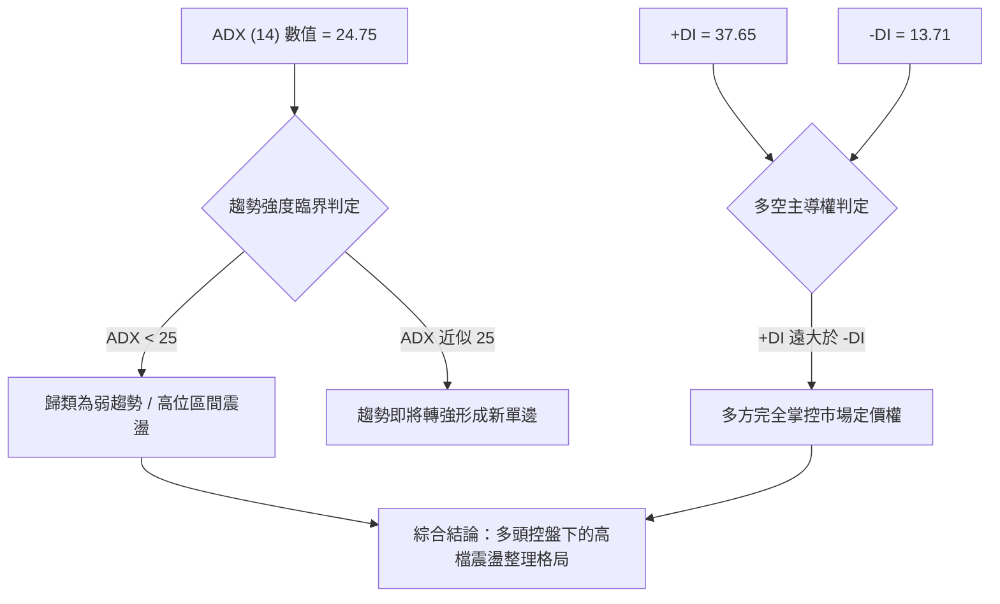

| 指標變數 | 當前讀數 | 臨界標準 | 狀態評估 | 實戰解讀 |
|----------|----------|----------|----------|----------|
| **ADX (14)** | 24.75 | 25.00 | 🟡 臨界點下盤整 | 由於經歷了7-8月的暴跌與9月的大幅V轉，動能曲線尚未完全形成平滑單邊趨勢，屬於強勢盤整。 |
| **+DI** | 37.65 | 20.00 | 🟢 極強多頭 | 買方動能極為充沛，空方無法在盤面上構成實質連續性殺盤。 |
| **-DI** | 13.71 | 20.00 | 🟢 空方衰竭 | 賣壓在 $89.50-$90.00 水平已被完全吸收釋放。 |

---

## 3. 圖表形態分析

### 🔍 形態識別系統

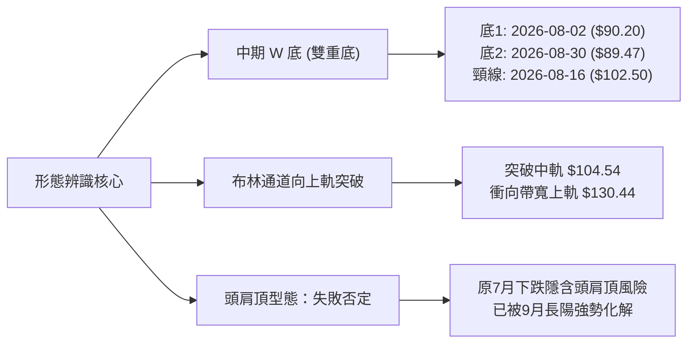

**圖表形態信心度評估表**：

| 形態名稱 | 信心度 | 判斷依據（引用數據） | 完成度 | 目標價（附計算式） |
|----------|--------|----------------------|--------|--------------------|
| **中期雙重底 (W-Bottom)** | 85% | 兩次低點分別為 2026-08-02 的 $90.20 與 2026-08-30 的 $89.47（均緊扣支撐 S3 $89.59），並於 2026-09-13 放量站穩頸線 $102.50。 | 100% (已突破) | 依據雙底高度測算：頸線 $102.50 + ($102.50 - $89.47) = **$115.53**（已達成，確認轉為下階段支撐）。 |
| **布林通道多頭擴張突破** | 75% | 股價由中軌 $104.54 連續收陽突破，%B 達到 0.86，直指上軌 $130.44。 | 85% | 觸碰上軌目標價：**$130.44**（直接引用布林上軌數據）。 |
| **大型頭肩頂反轉形態** | 15% | 雖然 5-6 月創高 $142.35，但 7-8 月回踩未破年線與關鍵斐波那契 50% ($86.78)，且 9 月收盤 $123.00 已收復左肩高度。 | 0% (形態瓦解) | 數據不足且被走勢證偽，不予推算空頭目標價。 |

### 🕯️ 重要K線形態分析

| 週/月份 | 收盤價 | K線形態 | 解讀 | 訊號 |
|---------|--------|---------|------|------|
| 2026-06 | $139.63 | 衝高回落十字長陰棒 | 觸及 52W 高點 $142.35 後多頭出現竭盡性噴出，引發獲利籌碼大量兌現。 | 🔴 強烈預警 |
| 2026-08-02 | $90.20 | 探底長下影線 | 空頭動能初次衰竭，在斐波那契 50% ($86.78) 上方獲得法人逢低承接。 | 🟢 止跌企穩 |
| 2026-08-30 | $89.47 | 平行雙底平頭低點 | 確認 $89.50 一線為堅固底部結構，空頭二次下殺未創顯著新低。 | 🟢 築底確認 |
| 2026-09-20 | $108.60 | 實體大陽線放量突破 | 強勢攻克 MA20 ($104.54) 與雙底頸線，確立多頭主升浪重啟。 | 🟢 強烈買訊 |
| 2026-09-27 | $123.00 | 長陽光頭逼近高點 | 延續多頭推進，直接逼近第一阻力位 R1 $126.64，多頭動能充沛。 | 🟢 順勢上攻 |

### 📉 ASCII 走勢形態示意圖

```
INTC 中期 W 底形態突破與量價重構示意圖
價格軸 ($)
 132.75 ┤                                                  [R2 目標]
 126.64 ┤                                      ▲          [R1 阻力]
 123.00 ┤                                     ╱ █  ◄ 現價 $123.00
 115.53 ┤────────────────────────────────────╱────  ◄ W底最小測幅滿足點
 104.54 ┤                        頸線突破點 ╱       ◄ MA20 / 中軌
 102.50 ┤          ● (08-16 頸線)         ╱
        ┤         ╱ ╲                    ╱
  90.00 ┤        ╱   ╲       ●          ╱
  89.47 ┤───────●     ╲     ╱ ╲        ╱
        ┤    (底1:08-02) ╲   ╱   ●──────
        ┤     $90.20      ╲ ╱   (底2:08-30 $89.47)
        └──────────────────●────────────────────────────────────
                        時間維度 (2026年 7月 - 9月)
```

### 🎯 形態目標價計算

1. **W 底形態等幅測算（已滿足並超越）**：
   - 形態底部低點：$89.47
   - 形態頸線高點：$102.50
   - 形態高度：$102.50 - $89.47 = $13.03
   - 最低測幅目標價：$102.50 + $13.03 = **$115.53**（現價 $123.00 已成功突破此位置，原目標轉化為強支撐帶）。
2. **阻力聚集測幅（進行中）**：
   - 第一目標：波段高點聚類 **R1 $126.64**
   - 第二目標：布林上軌與次級高點聚類 **R2 $132.75**
   - 終極目標：52週波段高點聚類 **R3 $141.90**（接近 52W High $142.35）。

---

## 4. 支撐與阻力

### 🗺️ 關鍵價位分布圖（Unicode）

```
INTC 價位結構分布圖（引用 OHLCV 計算聚類數據）
══════════════════════════════════════════════════════════════════
 $142.35 ║▓▓▓▓▓▓▓▓▓▓▓▓▓▓▓▓▓▓▓▓▓▓▓▓▓▓▓▓▓▓▓▓║ 52W 最高點 (歷史極限阻力)
 $141.90 ║████████████████████████████████║ 強阻力 R3 (波段高點聚類)
 $132.75 ║████████████████████████        ║ 阻力 R2 (反彈高點聚類)
 $130.44 ║▒▒▒▒▒▒▒▒▒▒▒▒▒▒▒▒▒▒▒▒▒▒▒▒        ║ 布林通道上軌壓制
 $126.64 ║████████████████████████████    ║ 關鍵阻力 R1 (短線突破點)
 $123.00 ╠════════════════════════════════╣ ◄ 當前市價 ($123.00)
 $116.12 ║▓▓▓▓▓▓▓▓▓▓▓▓▓▓▓▓▓▓▓▓            ║ 斐波那契 23.6% 回調位
 $104.54 ║████████████████████            ║ MA20 動態生命線 / 布林中軌
 $102.40 ║████████████████████████        ║ 近期支撐 S1 (雙底頸線支撐聚類)
 $ 98.33 ║████████████████                ║ 強支撐 S2 (波段低點支撐聚類)
 $ 89.59 ║████████████████████████████████║ 核心底部 S3 (8月雙底強烈聚類)
══════════════════════════════════════════════════════════════════
```

### 🚧 阻力位分析表

| 阻力級別 | 價位 | 形成原因 | 突破難度 | 重要性 |
|----------|------|----------|----------|--------|
| **R1** | **$126.64** | 近一年波段高點聚類；距現價僅 +2.96%，為短線多頭第一道考驗關卡。 | 🟡 中等（需放量） | ★★★☆☆ |
| **R2** | **$132.75** | 波段次高點密集套牢區，鄰近布林上軌 ($130.44)；距現價 +7.93%。 | 🔴 偏高（震盪機率大） | ★★★★☆ |
| **R3** | **$141.90** | 52週歷史高點 ($142.35) 聚類密集峰，長線獲利盤與套牢盤多空決戰點；距現價 +15.37%。 | 🔴 極高（需巨量催化） | ★★★★★ |

### 🛡️ 支撐位分析表

| 支撐級別 | 價位 | 形成原因 | 守住機率 | 重要性 |
|----------|------|----------|----------|--------|
| **S1** | **$102.40** | 近一年波段低點聚類，重合 8 月中旬頸線高點 ($102.50) 與 MA120 ($102.47)；距現價 -16.75%。 | 85% | ★★★★☆ |
| **S2** | **$98.33** | 接近 MA50 ($99.05) 與整數心理關卡 $100，為中期防守臨界點；距現價 -20.06%。 | 90% | ★★★★☆ |
| **S3** | **$89.59** | 2026年 7-8 月雙重底低點聚類 ($89.47 - $90.20)，多頭結構底線；距現價 -27.16%。 | 95% | ★★★★★ |

### 📐 斐波那契回調位分析

依據 52 週完整波段（低點 **$31.21** → 高點 **$142.35**，總垂直落差 $111.14）計算之黃金分割水準分析：

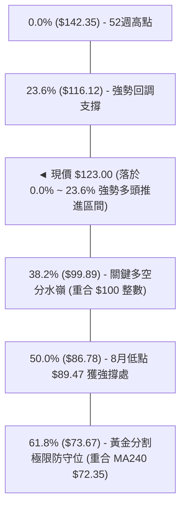

- **位置意義解讀**：現價 **$123.00** 穩固運行於 23.6% ($116.12) 與 0.0% ($142.35) 之間。依據道氏理論與斐波那契定律，當資產價格在深度回踩至 50% ($86.78，8月低點 $89.47 成功守住) 之後，能強勢反彈並站上 23.6% 回調位 ($116.12)，代表回調已正式結束，波段運行進入「再測歷史高點」的攻擊延伸浪。$116.12 已轉變為短期拉回的第一技術保護支撐。

---

## 5. 技術指標深度解讀

### 🎛️ 指標訊號總覽

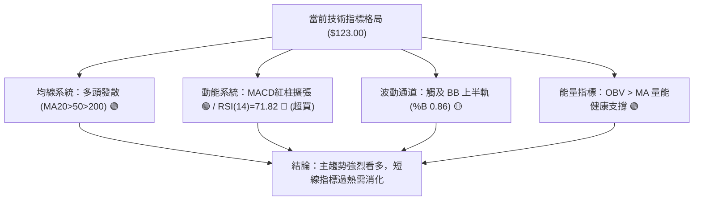

### 📈 移動平均線排列分析

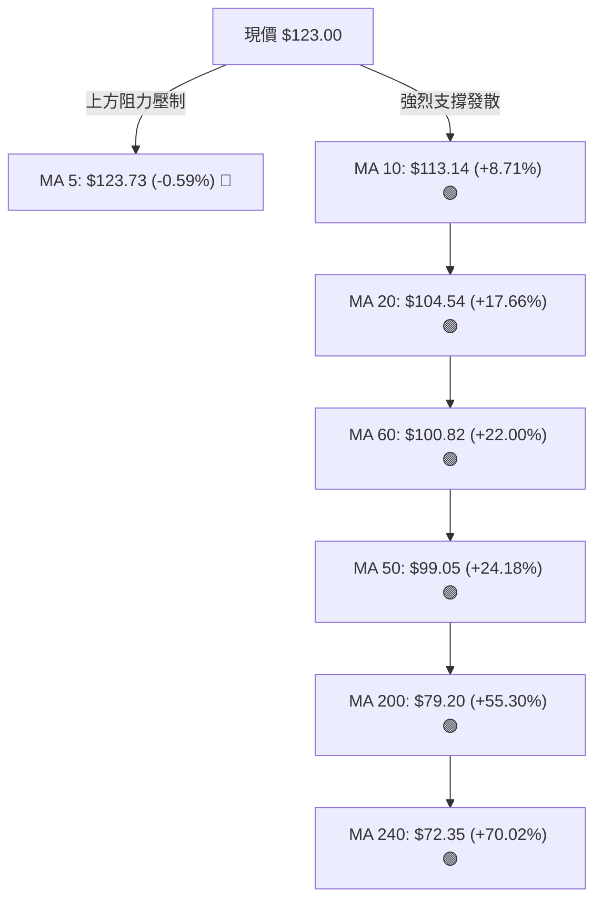

- **均線排列架構**：除極短線 MA5 ($123.73) 存在輕微壓制 (-0.59%) 顯示短線停頓外，其餘 MA10 ($113.14) > MA20 ($104.54) > MA60 ($100.82) > MA50 ($99.05) > MA200 ($79.20) > MA240 ($72.35) 呈現標準且穩健的多頭多重發散排列。價格遠高於牛熊分界線 MA200 達 55.30%，中長期長牛趨勢明確。

### 📉 RSI(14) 分析

```
RSI(14) 動能進度表
超賣 [0] ─────────────── 中性 [50] ────────── 超買 [70] ─ 當前 [71.82] ── [100]
進度條: █████████████████████████████████████░░░░░░░░░░░  71.82% 🔴
```

- **超買超賣評估**：RSI 讀數為 **71.82**，已越過 70 之警戒線，反映過去數週的急行軍反彈使短線多頭處於高耗能狀態。
- **背離狀況檢驗**：觀察週線級別走勢，2026-06 高點收盤 $139.63 對應 RSI 為 67.2，而當前價格 $123.00 處 RSI 達到 71.82，並未出現價格創新高而 RSI 創低的傳統頂背離；相反地，RSI 走勢伴隨價格推升同步放大，屬於「動能驅動型推升」。然而，由於 Stoch %K (86.51) 與 %D (93.54) 亦處於 80 以上之極限鈍化區，隨時有向中軌修正的拉回需求。

### 📊 MACD (12/26/9) 訊號解讀

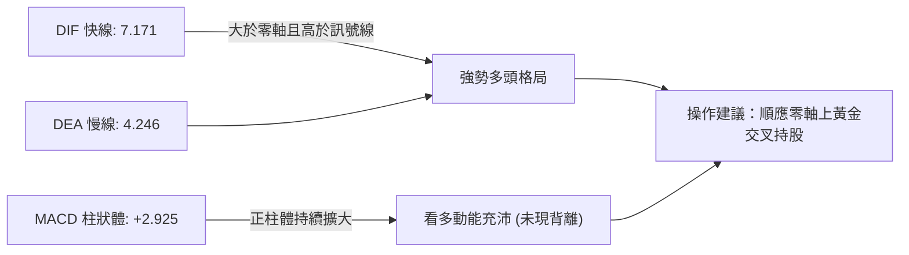

- **MACD 解讀**：快線 DIF (7.171) 與慢線 DEA (4.246) 均在零軸上方快速爬升，差離值（Hist）為 **+2.925**，近四週來柱體由負翻正並呈現階梯式放量擴大（-0.357 → +0.624 → +1.929 → +1.702 → +2.925），無任何頂背離徵兆，確認波段反彈動能尚未衰竭。

### 📦 布林通道分析

```
布林通道 (Bollinger Bands 20, 2) 結構圖
─────────────────────────────────────────────────────────────
 $130.44  ┬  BB 上軌 (Upper Band)
          │  
 $123.00  ┼  現價位置 (%B = 0.86，強勢逼近上軌)
          │  
 $104.54  ┴  BB 中軌 (Middle Band = MA20，核心動態支撐)
          │  
          │  
 $ 78.64  ┴  BB 下軌 (Lower Band)
─────────────────────────────────────────────────────────────
```

- **通道參數解讀**：上軌為 **$130.44**，中軌（MA20）為 **$104.54**，下軌為 **$78.64**。
- **當前位置分析**：%B 指標高達 **0.86**（0 代表下軌，0.5 為中軌，1.0 為上軌），說明股價正緊貼上軌運行。布林通道開口出現擴張跡象，若無法快速補量突破上軌 $130.44，股價往往會在上軌與 R1 ($126.64) 附近承壓，進行向中軌 ($104.54) 回抽確認的整理運動。

### 💹 成交量分析（量價配合度）

- **量能結構拆解**：最新單日成交量為 **97,481,700 股**，相對於 20 日均量（105,701,015 股）量比為 **0.92x**；週級別成交量自 8 月底低點的 441M 逐步回升至 600M 水準。
- **OBV 能量潮解讀**：數據顯示「OBV > MA → 量能支撐上漲」。在 INTC 自 $89.47 上攻至 $123.00 的過程中，能量潮伴隨價格同步創出波段反彈新高，資金淨流入特徵顯著，未出現嚴重的「量價頂背離」異常放量滯漲現象。

---

## 6. 動能與波動率

### ⚡ 動能評估四象限

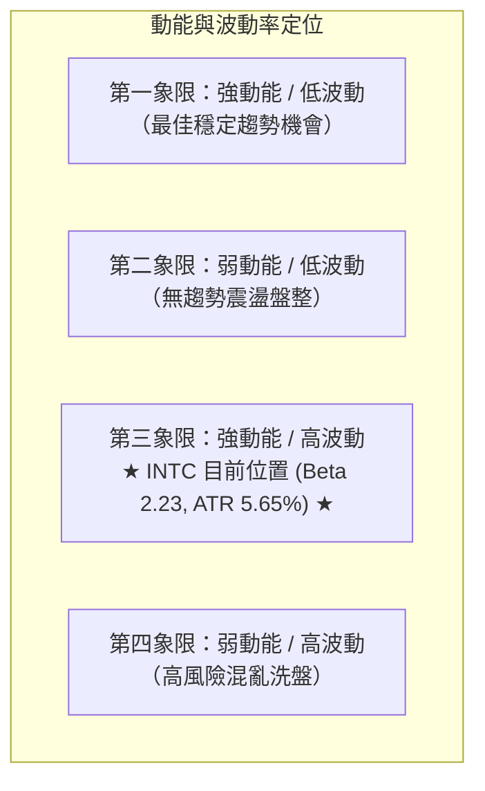

| 象限 | 動能強度 | 波動率 | 當前狀態 | 評估與策略應對 |
|------|----------|--------|----------|----------------|
| **Q1** | 強 | 低 | — | 穩定推升波段，適合重倉順勢操作。 |
| **Q2** | 弱 | 低 | — | 盤整築底區間，適合網格低吸。 |
| **Q3** | **強** | **高** | **✓ (INTC)** | **動能充沛 (MACD/DI強烈)，但波動偏高 (Beta 2.231, ATR $6.94)。屬於「高彈性攻擊行情」，需採取嚴格移動止損，防範快速回撤。** |
| **Q4** | 弱 | 高 | — | 趨勢瓦解期，嚴禁參與。 |

### 📊 ATR 波動率分析

- **ATR (14) 當前數值**：**$6.94**。
- **波動佔比**：ATR / 現價 ($123.00) = **5.65%**。此數據說明該標的平均單日波動區間接近 $7 美元，屬於典型的高 Beta 攻擊型半導體資產。
- **止損距離建議**：
  - *極短線防守*：1.0 × ATR = **$6.94**（止損設於現價下浮約 5.6%）。
  - *波段順勢防守*：1.5 × ATR = **$10.41**（止損位 $112.59，接近 MA10 $113.14）。
  - *寬鬆結構防守*：2.0 × ATR = **$13.88**（止損位 $109.12）。

### 📐 Beta 與市場相關性

- **Beta 數值**：**2.231**。
- **市場特徵分析**：INTC 相較於 S&P 500 指數具備超過 2.2 倍的波動敏感度。在整體科技板塊或半導體指數上漲時，INTC 具備極強的超額報酬（Alpha）爆發潛力；相對地，一旦大盤遭遇系統性流動性收緊或技術回檔，該股回撤幅度亦將被同比例放大。

---

## 7. 多時框架總結

### 📋 時框架評分表

| 時框架 | 趨勢方向 | 動能狀態 | 均線排列 | 形態特徵 | 綜合評分 | 操作建議 |
|--------|----------|----------|----------|----------|----------|----------|
| **長期 (月線)** | 🟢 多頭延續 | 🟢 脫離底部 | 🟢 突破長期均線 | 自 $19.43 翻轉的大型單邊回升浪 | 85/100 | 長期持有，防守設於翻多起點 |
| **中期 (週線)** | 🟢 波段主升 | 🟢 MACD擴張 | 🟢 MA20>MA50 | 雙重底頸線突破完成 | 80/100 | 波段順勢加碼，拉回支撐做多 |
| **短期 (日線)** | 🟡 震盪偏多 | 🔴 RSI超買 | 🟢 完美多頭發散 | 逼近 R1 $126.64 與布林上軌 | 65/100 | 短線不可追高，等待小時級別修正 |

### 🔲 綜合訊號矩陣

```
時框維度與技術構件交叉矩陣
╔═════════════╦══════════════╦══════════════╦══════════════╗
║ 指標維度    ║ 短期 (日線)  ║ 中期 (週線)  ║ 長期 (月線)  ║
╠═════════════╬══════════════╬══════════════╬══════════════╣
║ 均線趨勢    ║ 🟢 多頭排列  ║ 🟢 突破發散  ║ 🟢 站上MA200 ║
║ 動能指標    ║ 🔴 嚴重超買  ║ 🟢 MACD擴散  ║ 🟢 動能翻正  ║
║ 支撐壓力    ║ 🟡 逼近R1阻力║ 🟢 站穩頸線  ║ 🟢 遠離底部  ║
║ 型態結構    ║ 🟡 通道邊界  ║ 🟢 雙底確認  ║ 🟢 歷史反轉  ║
╠═════════════╬══════════════╬══════════════╬══════════════╣
║ 最終訊號    ║ 🟡 暫勿追高  ║ 🟢 順勢買入  ║ 🟢 戰略做多  ║
╚═════════════╩══════════════╩══════════════╩══════════════╝
```

### ⚖️ 多時框收斂結論

依據多時框收斂規則（嚴格要求 14）：
1. **行情屬性判定**：當前 ADX(14) 讀數為 **24.75**（小於 25 臨界值），技術面定義為**「高位寬幅盤整震盪行情」**。
2. **主導時框判定**：在盤整行情收斂框架下，以日線布林通道上下軌（$78.64 ~ $130.44）為主要交易區間，並由中期均線（MA20 $104.54、MA50 $99.05）提供核心趨勢保護。
3. **時框衝突取捨**：雖然日線 RSI (71.82) 出現超買警戒，但月線與週線的 MACD 柱狀體與均線呈現高度一致的多頭擴張格局。日線的超買並不具備推翻中長期多頭結構的能量，僅代表短線面臨 R1 $126.64 與布林上軌 $130.44 的區間邊界震盪。
4. **唯一方向性結論**：**偏多高位震盪（等待回調進場）**。操作上堅決不進行逆勢放空，亦不於超買高位盲目追價，策略主線鎖定於回踩關鍵支撐位後順勢做多。

---

## 8. 交易策略建議

### 🗺️ 策略決策流程圖

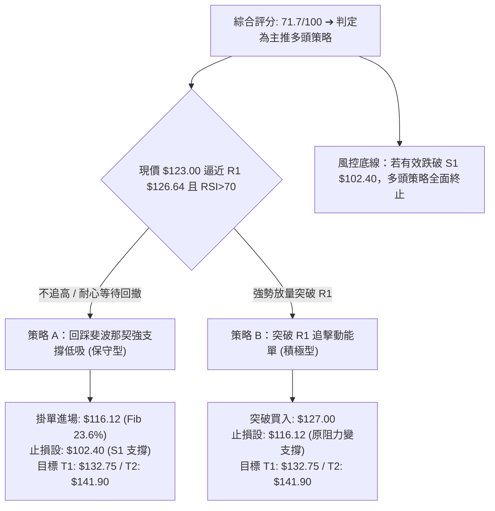

### 🧭 策略路由（依評分卡分流）

> **當前主策略方向 = 主推多頭策略（依綜合評分 71.7 / 100，技術面維持強勢偏多結構）**

由於綜合評分達 71.7 分（≥60），空頭訊號僅列為反轉風險觸發點與風控對沖指標，不建立主動做空策略。

### 🎯 價格情境階梯（Price Scenarios）

依據數據計算之精確價位建立如下階梯：

| 觸發條件 | 下一目標 | 後續延伸 | 情境含義與對策 |
|----------|----------|----------|----------------|
| **有效突破 R1 $126.64** | **R2 $132.75** | **R3 $141.90** | 短線轉強，多頭攻擊波段展開，布林上軌動態擴張。 |
| **維持於現價區間 ($116.12 ~ $126.64)** | — | — | 消化 RSI 超買之健康強勢高檔震盪，以時間換取空間。 |
| **失守 Fib 23.6% ($116.12) 並下探 S1 $102.40** | **S2 $98.33** | **S3 $89.59** | 中期拉回確認雙底頸線，考驗 MA20 生命線支撐。 |

### 📊 情境機率分佈

| 情境 | 機率 | 主要依據（指標狀態） |
|------|------|----------------------|
| **情境一：高檔強勢震盪後上行** | **55%** | MACD 柱擴張至 +2.925、均線完美多頭排列、OBV 維持量能支撐、+DI (37.65) 強烈主導。 |
| **情境二：回測支撐後重啟漲勢** | **35%** | RSI (71.82) 與 Stoch (93.54) 嚴重超買，短線有拉回至 Fib 23.6% ($116.12) 或 MA20 尋求支撐之技術需求。 |
| **情境三：跌破關鍵支撐反轉走弱** | **10%** | 除非遭遇重大系統性風險失守 S1 $102.40 及 MA50 ($99.05)，否則空頭難以扭轉當前中長線多頭趨勢。 |

### 🟢 主策略詳情

| 策略要素 | 策略 A（回踩支撐順勢單 - 保守型） | 策略 B（突破追擊動能單 - 積極型） |
|----------|----------------------------------|----------------------------------|
| **進場條件** | 價格拉回消化過熱指標，於斐波那契 23.6% 回調位出現止跌訊號 | 日線收盤價帶量放量突破 R1 阻力位確認 |
| **進場價格** | **$116.12**（Fib 23.6% 價位） | **$127.00**（突破 R1 $126.64 後確認） |
| **目標價 T1** | **$132.75**（R2 阻力位） | **$132.75**（R2 阻力位） |
| **目標價 T2** | **$141.90**（R3 / 52W 高點聚類） | **$141.90**（R3 / 52W 高點聚類） |
| **止損價格** | **$102.40**（S1 關鍵支撐點） | **$116.12**（Fib 23.6% 轉化之支撐點） |
| **風險額度** | $13.72 ($116.12 - $102.40) | $10.88 ($127.00 - $116.12) |
| **報酬空間 (T2)** | $25.78 ($141.90 - $116.12) | $14.90 ($141.90 - $127.00) |
| **風險報酬比** | **1 : 1.88** (以 T2 計則為 **1 : 1.88**) | **1 : 1.37** (以 T2 計) |
| **成功機率** | **65%** | **55%** |
| **建議倉位** | **15% - 20%** | **8% - 10%** |

### 🔴 反向風險觸發點（對沖提示）

若出現以下訊號，代表多頭結構遭遇實質破壞，應立即停止多頭操作並啟動防守對沖：
1. **跌破 S1 $102.40**：此處為雙底頸線與 MA20 ($104.54) 核心防線，若日線實體跌破，宣告中級反彈波段結束。
2. **失守 MA50 $99.05 / S2 $98.33**：均線多頭排列瓦解，走勢將由多轉空，直奔 S3 $89.59。

### ⭐ 整體訊號強度評星

```
╔══════════════════════════════════════════════════════════════╗
║ 做多訊號強度：★★★★☆  (4.0/5星 — 均線與動能共振，僅短線過熱)   ║
║ 做空訊號強度：★☆☆☆☆  (1.0/5星 — 僅屬技術性逆向摸頂，勝率極低) ║
║ 整體可信度：  ★★★★☆  (4.2/5星 — 多時框數據一致性極高)         ║
╚══════════════════════════════════════════════════════════════╝
```

---

## 9. 風險提示與監控

### ✅ 關鍵監控指標 Checklist

```
╔══════════════════════════════════════════════════════════════════╗
║                 INTC 技術風控日常監控清單 (Checklist)            ║
╠══════════════════════════════════════════════════════════════════╣
║ [ ] 每日收盤價是否跌破 MA5 ($123.73) 及 MA10 ($113.14)          ║
║ [ ] RSI(14) 是否跌破 70 形成頂背離鈍化結束訊號                 ║
║ [ ] 日成交量是否出現異常爆量（> 1.5x 20日均量 105.7M）滯漲      ║
║ [ ] 布林通道 %B 是否自 0.86 快速跌落中軌 0.50 ($104.54) 以下     ║
║ [ ] MACD 柱狀體數值是否由 +2.925 開始連續 2 日縮短              ║
║ [ ] 斐波那契 23.6% 水準 ($116.12) 是否提供有效第一道支撐        ║
╚══════════════════════════════════════════════════════════════════╝
```

### ⚠️ 風險場景分析

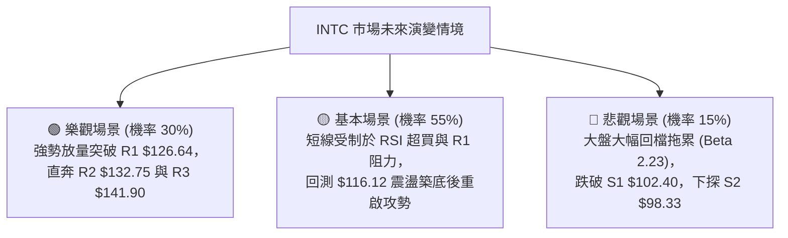

### 🛡️ 風險管理重要提醒

1. **高 Beta 波動特徵管理**：INTC Beta 值高達 **2.231**，日 ATR 為 **$6.94**（5.65%）。投資者切忌使用過高槓桿，單筆交易的最大資金虧損風險嚴格控制在總投資組合的 **1.5% - 2.0%** 範圍內。
2. **超買鈍化防護機制**：當前 RSI 位於 71.82，已達極度超買區間。歷史統計顯示，高位超買可能引發突發性的單日長陰洗盤。若採取突破策略進場者，應將止損嚴密跟蹤至進場價位下方 1.5 個 ATR 之內。
3. **倉位管理紀律**：建議採取「分批建倉、拉回加碼」模式，初次建倉不超過總預定倉位的 40%，待確認回踩 $116.12 獲支撐或放量站穩 $126.64 後，再行動態追加剩餘部位。

---

## 📋 報告總結

```
╔══════════════════════════════════════════════════════════════════╗
║                     INTC 技術分析報告總結                        ║
╠══════════════════════════════════════════════════════════════════╣
║ 報告日期：2026-09-28                                            ║
║ 當前價格：$123.00                                               ║
║ 分析評級：🟢 偏多進攻（震盪消化過熱後續攻）                     ║
║                                                                  ║
║ 關鍵結論：                                                       ║
║ ├─ 長期趨勢：🟢 強烈看多（走出 20-30 美元大底，年線強勁上揚）    ║
║ ├─ 中期趨勢：🟢 雙重底確立（突破 $102.50 頸線，週 MACD 正向擴張）║
║ ├─ 短期趨勢：🟡 超買警戒（RSI 71.82 觸發過熱，逼近 R1 $126.64） ║
║ ├─ 關鍵支撐：S1 $102.40 / S2 $98.33 / Fib 23.6% $116.12         ║
║ ├─ 關鍵阻力：R1 $126.64 / R2 $132.75 / R3 $141.90                ║
║ └─ 分析師共識：買入 (Buy，43 位分析師，最高目標 $200.00)         ║
║                                                                  ║
║ 最優策略組合：                                                   ║
║ 1. 🥇 最佳機會：策略 A — 回踩 Fib 23.6% ($116.12) 低吸，防守 S1 ║
║ 2. 🥈 次選機會：策略 B — 帶量突破 R1 ($126.64) 順勢跟進，看 R2   ║
║ 3. 🥉 保守選擇：維持場外观望，等待 RSI 回落至 55-60 中性區再行佈局║
╚══════════════════════════════════════════════════════════════════╝
```

---

> ⚠️ **免責聲明**：本報告為 AI 自動生成之技術分析，所有數據及估算均基於提供的歷史價格資訊。本報告**僅供研究與學術參考**，**不構成任何投資建議**。投資有風險，入市需謹慎。

---

*報告生成時間：2026-09-28 ｜ 數據來源：Yahoo Finance ｜ 分析框架：多時框技術分析*